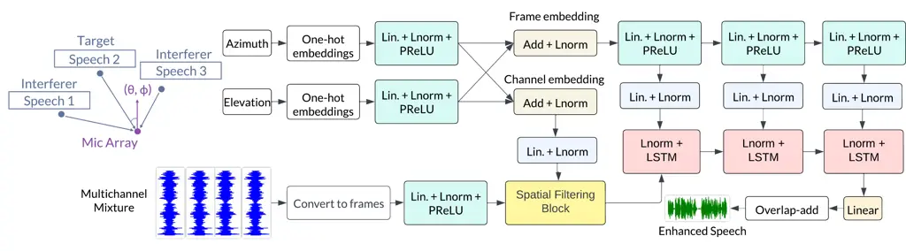
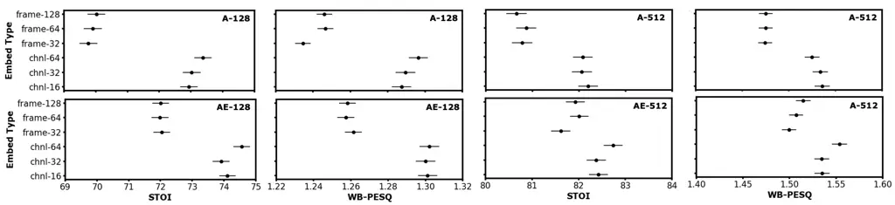
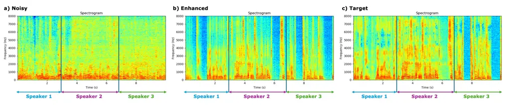
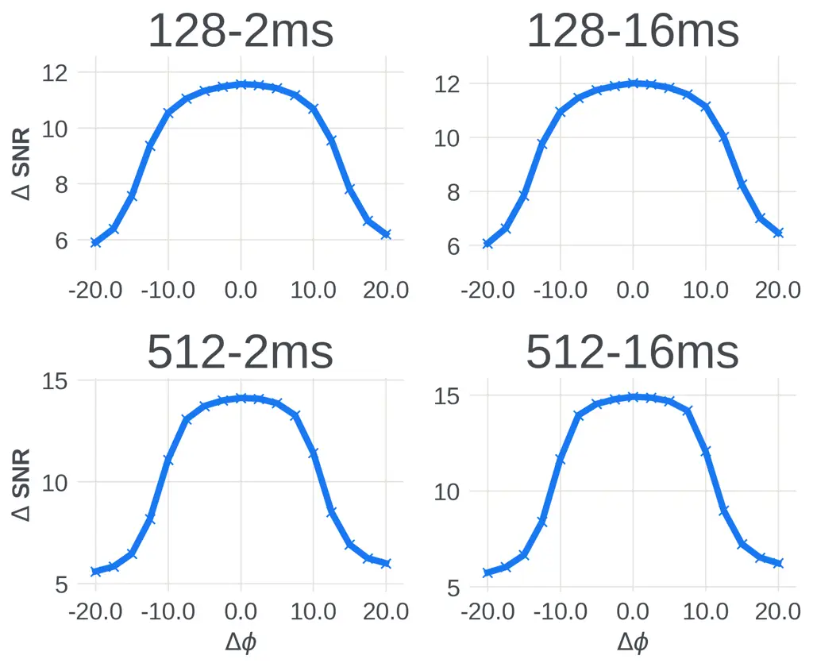

# All Neural Low-latency Directional Speech Extraction

Ashutosh Pandey    Sanha Lee    Juan Azcarreta    Daniel Wong    Buye Xu

###### Abstract

We introduce a novel all neural model for low-latency directional speech
extraction. The model uses direction of arrival (DOA) embeddings from a
predefined spatial grid, which are transformed and fused into a
recurrent neural network based speech extraction model. This process
enables the model to effectively extract speech from a specified DOA.
Unlike previous methods that relied on hand-crafted directional
features, the proposed model trains DOA embeddings from scratch using
speech enhancement loss, making it suitable for low-latency scenarios.
Additionally, it operates at a high frame rate, taking in DOA with each
input frame, which brings in the capability of quickly adapting to
changing scene in highly dynamic real-world scenarios. We provide
extensive evaluation to demonstrate the model’s efficacy in directional
speech extraction, robustness to DOA mismatch, and its capability to
quickly adapt to abrupt changes in DOA.

###### keywords

directional speech enhancement, multichannel, low-latency, conversation
computational analysis

^(†)^(†)address: Meta Platforms Inc., USA ^(†)^(†)email: {apandey620,
slee22, jazcarretao, ddewong, xub}@meta.com

## 1 Introduction

In our digital-centric world, the clarity of speech signals is crucial.
Yet, these signals, used in various applications, often suffer from
interference, impacting their quality and user experience. Speech
enhancement, aiming to improve speech quality by reducing interference
like background noise and reverberation \[1\], is beneficial for both
humans and machines, such as automatic speech recognition. Multichannel
speech enhancement uses multiple microphones to collect spatial and
spectral-temporal information about the target and interfering sounds,
enhancing the overall sound quality \[2\].

In real-world situations, distinguishing the target speaker amidst
interference can be quite complex, often necessitating a two-step
approach: speaker selection and speaker extraction. For humans, this
selection is guided by attention and intention. In machine separation,
current methods either separate all speakers from a mixture or use a
cueing signal for speaker selection, followed by speaker extraction.
These processes are respectively known as speaker separation and target
speaker extraction.

Speaker separation, which isolates speakers from mixed audio, contends
with the permutation ambiguity problem, where speaker-to-output stream
allocation is ambiguous. Two key strategies, permutation invariant
training (PIT) \[3\] and deep clustering \[4\], address this issue.
PIT’s simplicity has notably driven significant progress in speaker
separation \[5, 6, 7, 8, 9, 10\].

Target speech extraction isolates a single speaker from a mixture using
an auxiliary cue, ideal for single-output stream applications \[11\].
These cues can be audio \[12, 13, 14, 15, 16, 17\], visual \[18, 19,
20\], spatial \[21, 22, 23\], speech activity \[24\], or onset \[25,
26\].

With multichannel audio, the direction of arrival (DOA) is a key cue for
identifying the target talker. This task, known as directional speech
extraction (DSE), isolates speech from a fixed \[27, 23, 28\] or
adjustable \[29, 21, 22, 30, 31, 32\] spatial region. As smart glasses
and augmented/virtual reality technologies continue to advance, the
importance of DSE is becoming increasingly evident. In addition to
multichannel audio, these devices offer valuable signals like egocentric
video and inertial measurement unit (IMU) data, assisting in determining
the target talker’s DOA.



Figure 1: Schematic diagram of DRN.

We introduce an all neural low-latency DSE model in this study. With
end-to-end training, the model achieves a minimal algorithmic latency of
$`2`$ ms. It uses DOA embeddings from a predefined spatial grid,
transformed and integrated into a recurrent neural network (RNN) based
speech extraction model, effectively isolating speech from the specified
DOA.

Our method differs from previous works that used directional features
like angular (DOA) feature \[29\], directional power ratio, and
directional signal to noise ratio to inform the model about DOA \[30,
31, 33\]. A similar approach was recently proposed in \[34, 32\],
initializing RNN hidden states with DOA embeddings. However, this
assumes a constant DOA for a given utterance. Our approach, using DOA
for each input frame with a high frame rate, has better adaptability and
is suited for highly dynamic real-world scenarios with moving sources
and receivers.

Existing approaches to date primarily focus on Short-Time Fourier
Transform (STFT) enhancement, which generally leads to higher latencies.
In contrast, our model strategically employs a time-domain model to
significantly reduce this latency. Although the study in \[23\] proposed
a low-latency filter-and-sum network (FaSNet) \[35\], it is constrained
by its ability to extract speech from a fixed spatial region. Our model
surpasses this limitation, offering a more flexible solution.

We rigorously evaluate our model under a range of compute loads and
latencies, and benchmark it against a strong baseline model and oracle
beamformers. This comparison demonstrates improved speech enhancement
performance metrics over these baselines in low-latency scenarios.
Additionally, we assess the model’s robustness to DOA estimation errors
by introducing noise into the input DOA. Also, we illustrate the model’s
ability to rapidly adjust when the input DOA abruptly switches to a
different speaker in the scene. This underlines the model’s
responsiveness to rapidly changing DOAs, a crucial feature for dynamic
real-world scenarios. By improving multiple facets of DSE, our model
represents a significant stride forward in this field.

## 2 Proposed method

### 2.1 Problem formulation

Consider a microphone array with $`C`$ channels and speech sources in a
space with reverberation and background noise. In the time-domain, the
observed multichannel mixture signal $`\bm{Y}\in\mathbb{R}^{C\times N}`$
can be decomposed as:

```math
\bm{Y}=\bm{S}_{d}+\bm{S}_{R}+\bm{N} \tag{1}
```

Here, $`N`$ is the number of time samples, $`\bm{S}_{d}`$ is the
anechoic mixture of $`K`$ speakers, $`\bm{S}_{R}`$ includes room
reverberation of speakers, and $`\bm{N}`$ contains additional
interfering signals recorded by the array. Further, we can decompose the
anechoic mixture as:

```math
\bm{S}_{d}=\sum_{k=1}^{K}\bm{S}_{dk} \tag{2}
```

where $`\bm{S}_{dk}`$ denotes the multichannel direct-path speech of
talker $`k`$.

In this work, we aim to extract the speech signal $`\bm{s}_{dkr}`$ of a
desired talker $`k`$ at a reference microphone $`r`$, using the noisy
mixture $`\bm{Y}`$ and the DOA $`\theta_{k}`$ of the direct signal of
talker $`k`$. Moreover, the desired talker might change at any
timestamp, event that we refer to as target switching.



Figure 2: Comparing channel-wise and frame-wise embeddings. In plots
labels, A and AE respectively represents azimuth-only and
azimuth-elevation embeddings, whereas the number represents hidden size
$`H`$.

### 2.2 Model architecture

We introduce Directional Recurrent Network (DRN), an all neural
DOA-aware speech extraction network. DRN core design is based on the
lightweight, low-compute and low-latency architecture introduced in
\[36\] for on-device time-domain speech enhancement. In this model,
input waveform is initially converted into overlapping frames using a
small frame shift of $`R`$ and an input window size of $`iW`$. The input
is padded with $`iW`$ - $`R`$ zeros to construct the first frame.
Subsequently, all frames undergo processing through trainable filters
for spatial processing, followed by a stack of causal LSTM layers for
temporal processing. At the output, enhanced frames of size $`oW`$ are
estimated, and Overlap-Add (OLA) is applied to produce an enhanced
waveform with an algorithmic latency of $`oW`$.

To condition this network on directional information, we define two
types of DOA embeddings: channel-wise and frame-wise embeddings, which
are extracted from DOA and injected at different stages of the network,
as illustrated in Figure 1.

The DoA information is grouped into $`D`$ directional bins and
represented as one-hot vectors. The bin size defines the spatial grid
resolution, which can be tuned to control the system memory depending on
the application. The proposed method processes azimuth $`\phi`$
(horizontal) and elevation $`\theta`$ (vertical) information separately,
and in the general case $`D_{\phi}\neq D_{\theta}`$.

#### 2.2.1 Channel-wise DOA embeddings

We project time-dependent (frame-dependent) one-hot encoded azimuth and
elevation vectors of size $`T\times D_{\phi}`$ and
$`T\times D_{\theta}`$ independently using $`C`$ separate linear layers
with layer norm and PReLU to obtain outputs of size
$`C\times T\times E_{C}`$. Here, $`T`$ is the number of frames. Finally,
azimuth and elevation streams are added together followed by layer norm
to get the final channel-wise embeddings. Channel-wise embedddings are
fused within the spatial processing blocks.

#### 2.2.2 Frame-wise DOA embeddings

For frame-wise embedding, we use a similar approach, but instead of
using $`C`$ separate linear layers, we use one linear layer to obtain
azimuth and elevation embedding of size $`T\times E_{f}`$. Frame-wise
embeddings are fused after each of the LSTMs.

#### 2.2.3 Fusing DOA embeddings

Multichannel frames of size $`C\times T\times iW`$ are projected to size
$`H`$ using a linear layer followed by layer norm and PReLU to obtain
the input for spatial processing block of shape $`C\times T\times H`$.

The final channel-wise embeddings are projected to size $`H`$ using a
linear layer and layer norm and then multiplied to the input of the
spatial processing block. The final frame-wise embeddings go through a
fully connected network with three hidden layers, each comprising a
linear layer followed by layer norm and PReLU. The output from each of
the hidden layers is projected using linear layer and layer norm to size
$`H`$ and then multiplied to the corresponding LSTM output (see Figure
1).



Figure 3: The spectrograms of a) the noisy audio, b) the DRN enhanced
audio and c) the target audio. The input DOA of different talkers are
switched to extract corresponding switched talkers at output.

$`H`$ Lat. Emb. Domain STOI WB-PESQ SI-SDR SNR 128 2ms A T 74.3 1.31 1.2
4.2 AE T 75.1 1.31 1.4 4.3 16 ms A T 74.6 1.34 1.7 4.6 AE T 75.8 1.36
2.0 4.6 A F 74.7 1.32 1.3 4.3 AE F 76.4 1.36 1.9 4.5 512 2ms A T 82.3
1.54 4.6 6.2 AE T 83.1 1.57 4.9 6.4 16 ms A T 84.8 1.69 6.0 7.2 AE T
85.5 1.71 6.2 7.3 A F 84.3 1.63 5.6 6.9 AE F 85.5 1.70 6.1 7.3

Table 1: Comparing time and frequency domain DRN model for two embedding
types.

Model Domain Lat Hidden size STOI WB-PESQ SI-SDR Noisy 49.2 1.09 -13.08
DRN FD 16 ms 128 76.5 1.37 1.96 512 85.7 1.72 6.2 TD 2 ms 128 75.3 1.31
1.62 512 83.2 1.57 4.98 Oracle MCWF FD 16 ms - 77 1.26 3.4 2 ms - 62.5
1.16 1.9 maxDI informed FD 16 ms 128 77.3 1.37 1.78 512 84.7 1.67 5.29
TD 2 ms 128 70.3 1.25 -0.82 512 80.9 1.48 3.64

Table 2: Comparing DRN with spatial filtering baselines for
frequency-domain (FD) and time-domain (TD) processing.

## 3 Dataset Generation

We use the Interspeech2020 DNS Challenge corpus \[37\] to generate pairs
of clean and noisy signals as in \[36\]. An $`8`$-microphone circular
array with a radius of $`10`$ cm is used to create multichannel data.
RIRs are generated for shoebox like room geometries by using the Image
Source Method of order $`6`$. We generate $`10`$ seconds long $`160`$k
training, $`500`$ validation, and $`3.2`$K test utterances with a
sampling rate of 16kHz.

We first sample room dimension of size $`[L,W,H]`$ in meters, where
$`L`$ is sampled from $`[3,10]`$, $`W`$ from $`[3,10]`$ and $`H`$ from
$`[2,5]`$. Further simulation conditions are sampled as follows:
wideband absorption coefficients from $`[0.1,0.4]`$, random array
location and orientation at least 0.3m away from the room walls, and
$`1`$ to $`5`$ target talker locations at a distance $`[0.5,2.5]`$
meters from array. The azimuth separation between target talkers is kept
to be at least $`20`$ degrees. With a probability of $`0.75`$, $`1`$ to
$`10`$ interfering talkers are added at least $`3`$ meters from array to
simulate cases of distant speech interference and babble noise.
Additionally, $`1`$ to $`10`$ noise (non-speech) sources are added at
least 0.5 meters from the array. All the sources are set to be at least
$`0.3`$ meters from wall.

The RMS level of target talkers and noises are sampled from
$`[-2.5,2.5]`$ dB. The RMS level of interfering talkers are sampled from
$`[-10,-5]`$ dB. Interfering talkers are added with an SIR from
$`[5,10]`$ dB and noises are added with an SNR from $`[-5,10]`$ dB.
Signal ratios are calculated with respect to the direct path signal of
the quietest target talker in the clip. When scaling interfering
talkers, a scale greater than $`1`$ is set to $`1`$ to avoid
target-interference confusion.

The target signal may contain non overlapping regions of multiple
talkers. This is achieved by applying target switching. The input DOA
stream contains DOA of corresponding talker in the target. We apply
either no switching, one switch or two switch within a 10 seconds long
utterance, without exceeding the number of target talkers in the clip.
During training, the switching time is randomized, while during testing
switching occurs at uniform intervals of
$`\textit{clip\_length}/\{\#ofswitches+1\}`$. During training, the
switching interval uniformly deviates $`[-5,+5]\%`$ of utterance length
from the uniform interval points. The training target is set to be the
direct-path speech at the first microphone (r = 1).

## 4 Results

### 4.1 Experiments design

We developed all models in Pytorch using automatic mixed precision
training and phase constrained magnitude (PCM) loss, similar to the
model in \[36\]. Training parameters included a batch size of 16
utterances, Adam optimizer with amsgrad, a learning rate of 0.0002, and
gradient norm clipping to 0.03, with truncated backpropagation over 100
epochs. During training, temporal jitter was introduced to the input DOA
stream by adding uniform noise, ranging from \[-2.5, 2.5\] degrees, to a
sampled mean DOA deviation from the ground truth from \[-2.5, 2.5\].
Model comparisons were made using short-time objective intelligibility
(STOI), wide-band perceptual evaluation of speech quality (WB-PESQ),
SNR, and SI-SDR.

### 4.2 Finding the optimal location embeddings

To determine the optimal location embedding size and type, we compared
the performance of a DRN model with $`2`$ ms latency using azimuth-only
(A), and azimuth-elevation (AE) DOA embeddings. We tested three
channel-wise embeddings sizes ($`16`$, $`32`$, $`64`$) and three
frame-wise embeddings sizes ($`32`$, $`64`$, $`128`$). We also compared
these settings’ performance for two different hidden sizes ($`H=128`$
and $`H=512`$). These results with their corresponding confidence
intervals are plotted in Figure 2.

We note that in all instances, channel-wise embeddings outperform
frame-wise embeddings. As anticipated, AE performs better than A, as AE
aids in vertical source localization as well. Interestingly, an increase
in embedding sizes does not consistently result in performance
improvement.

Next, we train the model with combined channel-wise and frame-wise
embeddings. We used the best embeddings size determined from Figure 2.
The objective scores are shown in Table 1. For both $`H=128`$ and
$`H=512`$ cases, AE is better.



Figure 4: Sensitivity of DRN to DOA mismatch.

Model Hidden Size Latency STOI WB-PESQ GMAC/s \#Params Noisy 51.3
1.11 - - DRN 256 2 ms 80.3 1.47 2.3 1.8 32 ms 81.8 1.59 2.9 2.0 512 2 ms
83.2 1.59 7.8 6.7 32 ms 86.4 1.79 9.0 7.1 1024 2 ms 86.2 1.72 28.3 26.0
32 ms 89.3 2.00 30.5 26.8 McNet \[32\] - 32 ms 85.8 1.72 30.2 1.9

Table 3: Comparing DRN with a DNN based strong DSE model.

### 4.3 Higher latency and frequency domain processing

We trained DRN with hidden sizes $`H=128`$ and $`H=512`$, embedding
classes A and AE, and 16 ms latency in both time and frequency domains.
For the frequency domain, time-domain frames were replaced with the
corresponding real and imaginary components of DFT. In all cases, AE
performed better than A. Performance significantly improved for both
hidden sizes when latency increased from $`2`$ ms to $`16`$ ms. However,
transitioning from a $`16`$ ms time domain to a 16 ms frequency domain
did not yield a notable performance improvement.

### 4.4 Switching the direction of the target speech

A key question in this study is whether the model can swiftly adapt when
the input DOA switches to a different talker. Figure 3 shows that when
speakers switch, the spectrogram of the enhanced signal aligns well with
the target signal, suggesting successful target switching and expected
speech extraction by the model. Listening tests further validate the
model’s ability to rapidly switch between talkers.

### 4.5 Baseline models

In Table 2 we compare the best DRN model of each category with spatial
signal processing baselines. For these experiments the azimuth and
elevation grid resolution is 2.5 degrees. First, we show that DRN can
outperform oracle Multichannel Wiener Filter (MCWF) \[2\], where both
the multichannel desired speech and the target-switching timestamps are
available. We perform causal MCWF in the Frequency-Domain and update the
covariance matrices in an online fashion by running a cumulative sum
over time that resets its state at a target switching event. Latency of
MCWF is controlled with the window size and by setting the hop size as
half of the window value.

We also created a maxDI informed baseline by feeding to the model in
\[36\] the microphone audio along with their corresponding signals
filtered by a DOA-aware maximum Directivity Index (maxDI) beamformer.
The front-end maxDI runs in the frequency-domain, and to keep the system
latency unchanged the beamformer delay is not compensated for the
time-domain models. It is interesting to note that in Table 2, the FD
DRN model with size $`H=128`$ does not show a clear improvement over the
maxDI informed baseline. However, for all other cases, the DRN model
outperforms the maxDI informed baseline.

Finally, we compared DRN with a strong frequency-domain DNN-based model,
MCNet, proposed in \[32\]. As MCNet cannot accept time-dependent DOA, we
trained both DRN and MCNet without DOA switching. The results, presented
in Table 3, show that DRN achieves superior results with significantly
lower computation for $`H=512`$. Interestingly, to surpass MCNet with a
DRN model at $`2`$ ms latency, we had to increase $`H`$ to $`1024`$ to
match MCNet’s computation.

### 4.6 Robustness to DOA Mismatch

Lastly, we assessed DRN’s performance when DOA gradually deviates from
the ground truth. In this case, DRN was trained with azimuth-only
embeddings at a resolution of $`2.5`$ degrees. We calculated the average
improved SNR ($`\Delta`$ SNR) over $`3200`$ single-talker mixtures with
$`1-10`$ noise sources, when DOA shifted from the ground truth from
$`[-20.0,-17.5,\cdots,0,\cdots,17.5,20.0]`$. Results are plotted in
Figure 4. DRN showed a flat response close to the true DOA up to + and -
$`5`$ degrees and a drop within 0.7 dB within + and - $`10`$ degrees of
the ground truth, demonstrating its robustness to DOA estimation errors.

## 5 Conclusions

We have presented a novel all neural model for directional speech
extraction. The unique approach of using trainable DOA embeddings with
an RNN based speech extraction model has offered a low-compute,
low-latency solution. Through rigorous evaluations, we have demonstrated
models effectiveness in speech extraction, its robustness to DOA
mismatch and its ability to quickly adapt to abrupt changes in DOA. This
research opens up new possibilities for further improvements and
applications. Future work will focus on refining the model with training
on data containing source and receiver movements.

## References

- \[1\] P. C. Loizou, _Speech Enhancement: Theory and Practice_. CRC
  Press, 2013.
- \[2\] S. Gannot, E. Vincent, S. Markovich-Golan, and A. Ozerov, “A
  consolidated perspective on multimicrophone speech enhancement and
  source separation,” _IEEE/ACM Transactions on Audio, Speech, and
  Language Processing_, vol. 25, no. 4, pp. 692–730, April 2017.
- \[3\] M. Kolbæk, D. Yu, Z.-H. Tan, and J. Jensen, “Multitalker speech
  separation with utterance-level permutation invariant training of deep
  recurrent neural networks,” _IEEE/ACM Transactions on Audio, Speech,
  and Language Processing_, vol. 25, no. 10, pp. 1901–1913, 2017.
- \[4\] J. R. Hershey, Z. Chen, J. Le Roux, and S. Watanabe, “Deep
  clustering: Discriminative embeddings for segmentation and
  separation,” in _2016 IEEE international conference on acoustics,
  speech and signal processing (ICASSP)_. IEEE, 2016, pp. 31–35.
- \[5\] Y. Luo and N. Mesgarani, “Conv-TasNet: Surpassing ideal
  time-frequency magnitude masking for speech separation,” _IEEE/ACM
  Transactions on Audio, Speech, and Language Processing_, pp.
  1256–1266, 2019.
- \[6\] Y. Luo, Z. Chen, and T. Yoshioka, “Dual-path RNN: Efficient long
  sequence modeling for time-domain single-channel speech separation,”
  in _ICASSP_, 2020, pp. 46–50.
- \[7\] J. Chen, Q. Mao, and D. Liu, “Dual-path transformer network:
  Direct context-aware modeling for end-to-end monaural speech
  separation,” in _INTERSPEECH_, 2020, pp. 2642–2646.
- \[8\] Z.-Q. Wang, S. Cornell, S. Choi, Y. Lee, B.-Y. Kim, and
  S. Watanabe, “TF-GRIDNET: Making time-frequency domain models great
  again for monaural speaker separation,” in _ICASSP 2023_, 2023.
- \[9\] C. Subakan, M. Ravanelli, S. Cornell, M. Bronzi, and J. Zhong,
  “Attention is all you need in speech separation,” in _ICASSP_, 2021,
  pp. 21–25.
- \[10\] C. Quan and X. Li, “Spatialnet: Extensively learning spatial
  information for multichannel joint speech separation, denoising and
  dereverberation,” _IEEE/ACM Transactions on Audio, Speech, and
  Language Processing_, vol. 32, pp. 1310–1323, 2024.
- \[11\] K. Zmolikova, M. Delcroix, T. Ochiai, K. Kinoshita,
  J. Černockỳ, and D. Yu, “Neural target speech extraction: An
  overview,” _IEEE Signal Processing Magazine_, vol. 40, no. 3, pp.
  8–29, 2023.
- \[12\] M. Delcroix, K. Zmolikova, K. Kinoshita, A. Ogawa, and
  T. Nakatani, “Single channel target speaker extraction and recognition
  with speaker beam,” in _ICASSP_, 2018, pp. 5554–5558.
- \[13\] Q. Wang, H. Muckenhirn, K. Wilson, P. Sridhar, Z. Wu,
  J. Hershey, R. A. Saurous, R. J. Weiss, Y. Jia, and I. L. Moreno,
  “Voicefilter: Targeted voice separation by speaker-conditioned
  spectrogram masking,” _arXiv:1810.04826_, 2018.
- \[14\] C. Xu, W. Rao, E. S. Chng, and H. Li, “Spex: Multi-scale time
  domain speaker extraction network,” _IEEE/ACM Transactions on Audio,
  Speech, and Language Processing_, vol. 28, pp. 1370–1384, 2020.
- \[15\] T. Li, Q. Lin, Y. Bao, and M. Li, “Atss-net: Target speaker
  separation via attention-based neural network,”
  _arXiv:2005.09200_, 2020.
- \[16\] Z. Zhang, B. He, and Z. Zhang, “X-tasnet: Robust and accurate
  time-domain speaker extraction network,” _arXiv:2010.12766_, 2020.
- \[17\] W. Wang, C. Xu, M. Ge, and H. Li, “Neural speaker extraction
  with speaker-speech cross-attention network,” in _INTERSPEECH_, 2021,
  pp. 3535–3539.
- \[18\] A. Ephrat, I. Mosseri, O. Lang, T. Dekel, K. Wilson,
  A. Hassidim, W. T. Freeman, and M. Rubinstein, “Looking to listen at
  the cocktail party: A speaker-independent audio-visual model for
  speech separation,” _arXiv:1804.03619_, 2018.
- \[19\] T. Afouras, J. S. Chung, and A. Zisserman, “The conversation:
  Deep audio-visual speech enhancement,” _arXiv:1804.04121_, 2018.
- \[20\] C. Li and Y. Qian, “Listen, watch and understand at the
  cocktail party: Audio-visual-contextual speech separation.” in
  _INTERSPEECH_, 2020, pp. 1426–1430.
- \[21\] R. Gu, L. Chen, S.-X. Zhang, J. Zheng, Y. Xu, M. Yu, D. Su,
  Y. Zou, and D. Yu, “Neural spatial filter: Target speaker speech
  separation assisted with directional information.” in _INTERSPEECH_,
  2019, pp. 4290–4294.
- \[22\] A. Brendel, T. Haubner, and W. Kellermann, “A unified
  probabilistic view on spatially informed source separation and
  extraction based on independent vector analysis,” _IEEE Transactions
  on Signal Processing_, vol. 68, pp. 3545–3558, 2020.
- \[23\] A. Kovalyov, K. Patel, and I. Panahi, “Dsenet: Directional
  signal extraction network for hearing improvement on edge devices,”
  _IEEE Access_, vol. 11, pp. 4350–4358, 2023.
- \[24\] M. Delcroix, K. Zmolikova, T. Ochiai, K. Kinoshita, and
  T. Nakatani, “Speaker activity driven neural speech extraction,” in
  _ICASSP_, 2021, pp. 6099–6103.
- \[25\] Y. Hao, J. Xu, P. Zhang, and B. Xu, “WASE: Learning when to
  attend for speaker extraction in cocktail party environments,” in
  _ICASSP_, 2021, pp. 6104–6108.
- \[26\] A. Pandey and D. Wang, “Attentive training: A new training
  framework for speech enhancement,” _IEEE/ACM Transactions on Audio,
  Speech, and Language Processing_, vol. 31, pp. 1360–1370, 2023.
- \[27\] K. Tesch and T. Gerkmann, “Insights into deep non-linear
  filters for improved multi-channel speech enhancement,” _IEEE/ACM
  Transactions on Audio, Speech, and Language Processing_, vol. 31, pp.
  563–575, 2022.
- \[28\] Y. Yang, G. Sung, S.-F. Shih, H. Erdogan, C. Lee, and
  M. Grundmann, “Binaural angular separation network,” _arXiv preprint
  arXiv:2401.08864_, 2024.
- \[29\] Z. Chen, X. Xiao, T. Yoshioka, H. Erdogan, J. Li, and Y. Gong,
  “Multi-channel overlapped speech recognition with location guided
  speech extraction network,” in _2018 IEEE Spoken Language Technology
  Workshop (SLT)_. IEEE, 2018, pp. 558–565.
- \[30\] Y. Xu, M. Yu, S.-X. Zhang, L. Chen, C. Weng, J. Liu, and D. Yu,
  “Neural spatio-temporal beamformer for target speech separation,” in
  _INTERSPEECH_, 2020, pp. 56–60.
- \[31\] R. Gu and Y. Zou, “Temporal-spatial neural filter: Direction
  informed end-to-end multi-channel target speech separation,” _arXiv
  preprint arXiv:2001.00391_, 2020.
- \[32\] K. Tesch and T. Gerkmann, “Multi-channel speech separation
  using spatially selective deep non-linear filters,” _IEEE/ACM
  Transactions on Audio, Speech, and Language Processing_, vol. 32, pp.
  542–553, 2024.
- \[33\] Z. Zhang, Y. Xu, M. Yu, S.-X. Zhang, L. Chen, and D. Yu,
  “Adl-mvdr: All deep learning mvdr beamformer for target speech
  separation,” in _ICASSP_, 2021, pp. 6089–6093.
- \[34\] K. Tesch and T. Gerkmann, “Spatially selective deep non-linear
  filters for speaker extraction,” in _ICASSP_, 2023, pp. 1–5.
- \[35\] Y. Luo, C. Han, N. Mesgarani, E. Ceolini, and S.-C. Liu,
  “FaSNet: Low-latency adaptive beamforming for multi-microphone audio
  processing,” in _ASRU_, 2019, pp. 260–267.
- \[36\] A. Pandey, K. Tan, and B. Xu, “A simple rnn model for
  lightweight, low-compute and low-latency multichannel speech
  enhancement in the time domain,” in _INTERSPEECH_, 2023, pp.
  2478–2482.
- \[37\] C. K. Reddy, H. Dubey, V. Gopal, R. Cutler, S. Braun,
  H. Gamper, R. Aichner, and S. Srinivasan, “ICASSP 2021 deep noise
  suppression challenge,” _arXiv:2009.06122_, 2020.
