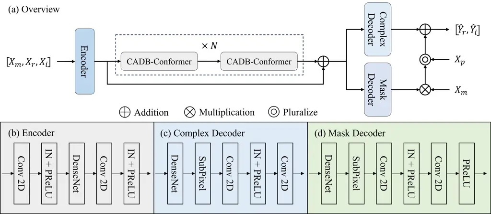
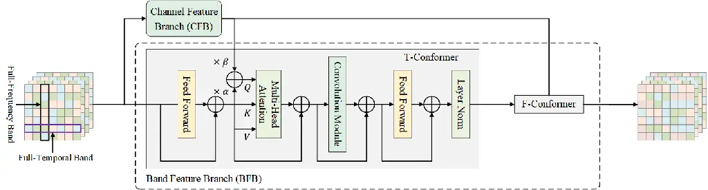
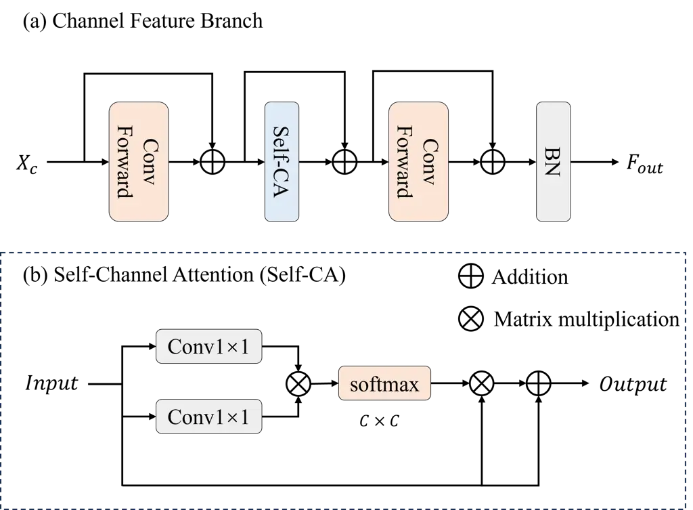

# Improving Speech Enhancement by Integrating Inter-Channel and Band Features with Dual-branch Conformer

Jizhen Li    Xinmeng Xu    Weiping Tu    Yuhong Yang    Rong Zhu

###### Abstract

Recent speech enhancement methods based on convolutional neural networks
(CNNs) and transformer have been demonstrated to efficaciously capture
time-frequency (T-F) information on spectrogram. However, the
correlation of each channels of speech features is failed to explore.
Theoretically, each channel map of speech features obtained by different
convolution kernels contains information with different scales
demonstrating strong correlations. To fill this gap, we propose a novel
dual-branch architecture named channel-aware dual-branch conformer
(CADB-Conformer), which effectively explores the long range time and
frequency correlations among different channels, respectively, to
extract channel relation aware time-frequency information. Ablation
studies conducted on DNS-Challenge 2020 dataset demonstrate the
importance of channel feature leveraging while showing the significance
of channel relation aware T-F information for speech enhancement.
Extensive experiments also show that the proposed model achieves
superior performance than recent methods with an attractive
computational costs.

###### keywords

speech enhancement, dual-branch architecture, inter-channel, attention
mechanism

^(†)^(†)address: ¹NERCMS, School of Computer Science, Hubei Luojia
Laboratory, Wuhan University, China  
²Hubei Key Laboratory of Multimedia and Network Communication
Engineering, Wuhan University, China^(†)^(†)email: tuweiping@whu.edu.cn



Figure 1: Overall enhancement process of the proposed CADB-Conformer.
(a) An overview of the proposed CADB-Conformer architecture. (b) The
encoder architecture of CADB-Conformer. (c) Complex decoder unit. (d)
Mask decoder unit.

## 1 Introduction

Speech enhancement (SE) aims at separating clean speech from
acoustically challenging environments with various disturbances and
improving the perceptibility and quality of the speech signal \[1\]. SE
technologies find widespread applications in various domains, including
telecommunications, hearing aids, automatic speech recognition (ASR),
and audio broadcasting \[2\]. ^(†)^(†) ^(⋆)Corresponding author.

Recently, the data-driven approaches based on Deep Neural Networks
(DNNs) have been extensively investigated and can be categorized into
time-domain methods \[3, 4, 5\] and time-frequency (T-F) domain methods
\[6, 7, 8, 9\]. Despite the intuitive and low-latency characteristics of
time-domain methods, their performance is limited in complex noise
environments due to the lack of geometric structure \[10\].
Consequently, T-F methods remain the mainstream in the realm of speech
enhancement. T-F domain methods take the T-F representation of the
original signal as input, such as the short-time Fourier Transform
(STFT), and directly estimate the complex spectrum of clean speech in an
end-to-end manner \[11\]. Furthermore, complex methods \[12, 13\] are
designed to handle phase-related issues more effectively in the complex
domain. The CNN-based module maps features to a high-dimensional space
using diverse kernels, where the global context information in the T and
F domains varies across channels. Despite the excellent performance of
CNNs on extracting local T-F features, convolution operation treats the
spectral and channel-wise features equally, which makes it challenging
to perform fine-grained processing on the temporal, frequency, and
channel dimensions.

Recent works represented by dual-path models like DPRNN \[14\] and DPCRN
\[15\], process the intra/temporal bands and inter/spectral bands of the
feature separately, effectively modeling both domains and exhibiting
state-of-the-art performance in SE. Subsequently, transformer \[16\]
architectures are applied to the dual-path model \[17, 18, 19, 20, 21\],
replacing long short-term memory (LSTM) for improved modeling
capabilities. Specifically, the DPTNet \[18\] introduces direct
context-aware modeling into speech separation for the first time. The
incorporation of self-attention enables direct interaction among
elements in the speech sequence, facilitating information transmission.
Moreover, the integration of recurrent neural networks (RNNs) into the
original transformer allows it to learn the sequential information of
the speech sequence without the need for position encoding. However, it
greatly increase the model complexity. Despite the success of CNNs and
dual-path architecture in sequence modeling, it fails to consider the
inter-channel feature correlation and overlooks the learning of
differentiated information at different scales, consequently hindering
the representational capacity of deep networks.

Therefore, it is highly necessary to design a dedicated module in
channel dimension to facilitate high-level alignment across different
channel features. Motivated by previous research, we propose a
dual-branch architecture, termed channel-aware dual-branch conformer
(CADB-Conformer). Conformer \[22\] model combines characteristics of
CNNs and transformer, enabling comprehensive modeling of both global and
local information with relatively low complexity. In this work, in
addition to the band feature branch (BFB) employed for fine-grained
extraction of T and F domain features, we have meticulously designed the
channel feature branch (CFB) to adaptively rescale each channel-wise
feature by modeling the interdependencies across feature channels. CFB
allows the model to concentrate on more useful channels and enhance
discriminative learning ability. The contributions of this work are
threefold:

- •
  We investigate CFB to capture the features of channel dimension and
  efficiently integrate with the network backbone. Ablation studies
  demonstrate that channel features can significantly improve the
  network performance.
- •
  Our proposed model proficiently extracts the T and F information
  across channels, enabling better integration of information from
  different channels in a long-range manner.
- •
  Experiments perform on DNS-Challenge 2020 datasets \[23\] show that
  our proposed CFB module achieves 0.07, 0.45 and 0.84 improvements in
  PESQ, STOI, and SDRi with the SNR set to 0dB.

## 2 Methodology

In this section, we provide a detailed description of the proposed
CADB-Conformer neural network, as shown in Figure 1, which efficiently
integrates 2D T-F features among channels and 1D band features extracted
by the two branch.



Figure 2: The detail of proposed CADB-Conformer module, which contains
Channel Feature Branch (CFB) and Band Feature Branch (BFB).



Figure 3: (a) The architecture of Channel Feature Branch. (b) The detail
of Self-Channel Attention (Self-CA).

### 2.1 Overview

For a noisy speech waveform $`x\in\mathbb{R}^{L\times 1}`$, its real
part spectrum and imaginary part spectrum, denoted as
$`X_{r}\in\mathbb{R}^{T\times F\times 1}`$ and
$`X_{i}\in\mathbb{R}^{T\times F\times 1}`$ respectively, are obtained
through STFT, where T and F represent the time and frequency dimensions
respectively. Following the approach proposed by \[2\], the compressed
spectrogram $`X`$ is obtained through power-law compression:

```math
X=X_{r}+jX_{i}=X_{m}e^{jX_{p}}, \tag{1}
```

where $`X_{m}`$ and $`X_{p}`$ denote the magnitude and phase components,
respectively. To fully leverage the information within the
time-frequency spectrum, the proposed CADB-Conformer takes an input
$`X`$, which is constructed by concatenating the magnitude and the
complex spectrum.

The proposed encoder-decoder architecture comprises one encoder and two
decoders, each of the three module contains a dilated DenseNet, which
contains four convolution blocks with dense connections, the dilation
factors of each block are set to 1, 2, 4, 8. The input
$`X\in\mathbb{R}^{B\times T\times F\times 3}`$ undergoes encoding to
obtain a high-dimensional feature representation, where $`B`$ represents
the batch size. The encoder’s architecture, illustrated in Figure 1(b),
input $`X`$ is preprocessed and the frequency dimension is compressed to
half of the original size for efficient calculations. The two decoders
individually predict the complex components and magnitude mask to
reconstruct the target signal. The decoder structures resemble the
encoder, as depicted in Figure 1(c) and (d). The complex decoder
predicts the complex spectrum $`\hat{Y}_{r}^{c}`$ and
$`\hat{Y}_{i}^{c}`$ of the target speech in a generative manner, while
the magnitude decoder predicts the magnitude mask $`\hat{Y}_{m}`$. The
target speech signal $`\hat{y}`$ predicts by CADB-Conformer is designed
as:

```math
\begin{cases}\hat{Y}_{r}=\hat{Y}_{r}^{c}+\hat{Y}_{m}\cos X_{p},\\
\hat{Y}_{i}=\hat{Y}_{i}^{c}+\hat{Y}_{m}\sin X_{p},\\
\hat{y}=iSTFT(\hat{Y}_{r}+j\hat{Y}_{i}),\end{cases} \tag{2}
```

where $`iSTFT`$ represents the inverse Short-Time Fourier Transform.

### 2.2 Channel-Aware Dual-Branch Conformer Module

The design of dual-branch model based on the conformer architecture
proposed in \[22\], which integrates the potent modeling capability of
the transformer for global information and the fine-grained feature
processing ability of CNN for local features. The detail of the proposed
CADB-Conformer is shown in Figure 2: (1) The band feature branch
comprises two cascaded conformer modules, each specifically handling the
temporal and frequency domain of the spectrogram. (2) The design of
channel feature branch followed by conformer module, which directly
facilitates interaction between the T and F domain on a 2D level and
feature alignment in channel dimension. (3) To selectively utilize T-F
information extracted by channel feature branch, we explore the
attention mechanism in band feature branch for feature fusion.

#### 2.2.1 Channel Feature Branch

To efficiently harness the T-F information inherent in the spectrogram
and align features on the channel dimension, we meticulously designed
the channel feature branch (CFB) similar to conformer module, as shown
in Figure 3(a). CFB adopts a sandwich-like structure inspired by \[24\],
wherein the high-dimensional representation
$`X_{c}\in\mathbb{R}^{B\times T\times\check{F}\times 3}`$ of the
time-frequency spectrogram is entered into the ConvForward module to
obtain an enriched feature representation, where
$`\check{F}=\frac{F}{2}`$. To investigate the global context information
in both the temporal and frequency domains among each channel, the
representation is then fed into the Self-Channel Attention (Self-CA)
module to capture the long-range dependencies among channels.

Inspired by \[25\], Self-CA unfolds the temporal and frequency
dimensions of the feature to obtain a one-dimensional representation
$`F_{in}\in\mathbb{R}^{N\times 1}`$, where $`N=T\times\check{F}`$, as
shown in Figure 3(b). The computation of Self-CA is as follows:

```math
\begin{cases}Q/K=F_{in}\odot(\circledS Conv(F_{in})),\\
W=\circledS(Q^{\top}\otimes K),\\
F_{out}=F_{in}\odot W+F_{in},\end{cases} \tag{3}
```

where $`Conv(\cdot)`$ denotes convolution operation,
$`\circledS(\cdot)`$ denotes Softmax operation, $`\odot`$ denotes
element-wise multiplication, $`\otimes`$ denotes matrix multiplication,
respectively. To facilitate a high level of alignment across different
channels and reducing computational complexity, we generate weight
vectors $`W`$ of size $`C\times C`$ instead of $`N\times N`$. Such
Self-CA mechanism enhances the discriminative learning capability of the
proposed network architecture towards inter-channel features by
explicitly adjusting the weights of different channel features to model
long-range dependencies among channels.

Following Self-CA, we also incorporate the ConvForward module for
further feature processing. To facilitate the efficient propagation of
informative signals, we have incorporated skip connections into each
module of the CFB .It is noteworthy that we do not add the convolutional
module proposed by the conformer after the self-channel attention
mechanism. Because the results of the CFB will be utilized in the
attention weight calculation of the Band Feature Branch, where local
feature extraction will be conducted.

#### 2.2.2 Band Feature Branch

Inspired by \[26\], the band feature branch (BFB) comprises two cascaded
conformer modules, each dedicated to feature extraction along the time
and frequency dimensions of the spectrogram. As shown in Figure 2, to
utilize the T-F information extracted by CFB while mitigating the
redundancy caused by global interactions between the time and frequency
dimensions, we explore the attention mechanism within the conformer
architecture. Specifically, for each conformer block, the output
$`X_{f}`$ of the first FeedForward module and the output $`F_{out}`$ of
the CFB are weighted and combined to form the query $`Q`$ for the
attention mechanism. The calculation of $`Q,K,V`$ in the attention
mechanism of the BFB is as follows:

```math
\begin{cases}\hat{Q}=\alpha X_{f}+\beta F_{out},\\
Q=Linear(\hat{Q}),\\
K/V=Linear(F_{out}),\end{cases} \tag{4}
```

where $`\alpha`$ and $`\beta`$ represent the weights of $`X_{f}`$ and
$`F_{out}`$ respectively and $`Linear`$ denotes fully connected layer.
Leveraging the selection capability of the attention mechanism for query
enables the comprehensive utilization of both 2D global T-F information
and 1D band information while minimizing redundancy in the 2D
information. Subsequently, the band feature obtained through the
attention mechanism are fed into convolutional modules to extract local
features. By employing attention mechanism instead of directly summing
the features, the network is able to learn the relationship between
global band features and channel-aligned features, selectively enhancing
the representational ability of the network by utilizing useful
information. Furthermore, in order to reduce the computational burden of
the neural network, the T-Conformer and F-Conformer within each
CADB-Conformer module share the same CFB.

|                   |      |          |       |      |          |       |      |          |       |        |
| ----------------- | ---- | -------- | ----- | ---- | -------- | ----- | ---- | -------- | ----- | ------ |
| SNR               |      | -5 dB    |       |      | 0 dB     |       |      | 5 dB     |       | Param. |
| Metric            | PESQ | STOI (%) | SDRi  | PESQ | STOI (%) | SDRi  | PESQ | STOI (%) | SDRi  |        |
| Unprocess         | 0.56 | 67.00    | \-    | 0.75 | 76.39    | -     | 0.95 | 83.30    | \-    | -      |
| Conv-TasNet \[4\] | 1.70 | 83.07    | 15.13 | 2.28 | 88.38    | 11.00 | 2.36 | 91.28    | 10.75 | 3.5M   |
| RUI-NSNet \[27\]  | 1.73 | 83.00    | 15.11 | 2.36 | 89.03    | 15.67 | 2.50 | 91.74    | 11.62 | 4.0M   |
| DPRNN \[14\]      | 1.90 | 85.77    | 16.53 | 2.52 | 89.90    | 16.15 | 2.58 | 92.93    | 11.76 | 2.6M   |
| DPTNet \[18\]     | 1.90 | 87.59    | 15.90 | 2.50 | 90.50    | 16.04 | 2.64 | 93.66    | 11.71 | 2.8M   |
| CADB-Conformer    | 2.17 | 88.52    | 17.37 | 2.66 | 91.11    | 16.65 | 2.86 | 94.70    | 12.59 | 2.0M   |

Table 1: Comparisons of baseline models on DNS-Challenge 2020 datasets
in terms of PESQ, STOI, and SDRi

|                 |      |          |       |        |
| --------------- | ---- | -------- | ----- | ------ |
| Metric          | PESQ | STOI (%) | SDRi  | Param. |
| CADB-Conformer  | 2.66 | 91.11    | 16.65 | 2.0M   |
| w/o CFB         | 2.59 | 90.66    | 15.81 | 1.8M   |
| w/o F-Conformer | 2.33 | 88.18    | 15.23 | 1.5M   |
| w/o T-Conformer | 1.95 | 85.71    | 10.53 | 1.5M   |
| w/o BFB         | 1.79 | 82.72    | 11.24 | 1.0M   |

Table 2: Results of the ablation study on DNS-Challenge 2020 datasets
with SNR set to 0dB

## 3 Experiments

### 3.1 Datasets

We trained the CADB-Conformer on the Interspeech 2020 DNS challenge
datasets \[23\], which consists of over 60,000 clean speech and noise
clips sampled at 16 kHz. We randomly selected 25,000 samples from the
clean and noise dataset for mixing. The SNR range of the mixtures is set
between -5 and 20 dB at 5 intervals, with speech segment lengths set to
4 seconds. Among these, 23,000 clips were chosen for training randomly
and another 2,000 clips were allocated for validation. In addition, we
utilize an equal number of clean speech samples and noise samples,
without any repetition or reuse of noise instances, which aims to
improve the generalization ability of the model.

### 3.2 Experimental setup

The input of the model is the complex spectrum obtained by STFT of the
original signal with window-size set to 400. The resulting
high-dimensional features obtained by the final encoder consist of 101
frequency bands. The repetition count N of CADB-Conformer is set to 4.
Based on our experimental findings, we set $`\alpha`$ and $`\beta`$ both
to 0.5. The experiment adopts scale-invariant SNR (SI-SNR) \[28\] as the
training target with the optimizer selected as Adam \[29\]. In addition,
we utilizing a decaying learning rate initially set to 0.001.

## 4 Results and discussion

### 4.1 Baselines and evaluation metrics

In order to test the performance under various unknown noise, we
compared our CADB-Conformer with several baseline models, such as
Conv-TasNet \[4\], DPRNN \[14\], DPTNet \[18\]and RUI-NSNet \[27\].
Under the same training target, we evaluated the performance of these
models on the test sets of DNS-Challenge 2020 with SNR of -5, 0 and 5
dB.

We employed three objective evaluation metrics: perceptual evaluation of
speech quality (PESQ) \[30\], short-time objective intelligibility
(STOI) \[31\], and Signal-to-Distortion Ratio Improvement (SDRi) \[28\],
to assess the performance of the proposed model. Comparisons were made
with baseline models on different SNR test sets, as shown in Table 1. It
can be observed that our proposed CADB-Conformer neural network achieves
superior performance compared to the baseline models. Compared with the
representative dual-path architecture DPTNet, CADB-Conformer was tested
on DNS-Challenge 2020 datasets with an SNR range of -5 to 5, achieving
an average improvement of 0.22, 0.86 and 0.99 in PESQ, STOI and SDRi,
respectively. Moreover, our proposed model utilizes minimal parameters,
occupying only 2.0M.

### 4.2 Ablation study

To validate the effectiveness of our proposed modules, we conducted
ablation experiments on DNS-Challenge 2020 datasets with SNR set to 0
dB. We also utilize PESQ, STOI, and SDRi as evaluation metrics, as shown
in Table 2. We conducted ablation experiments by removing the CFB module
(w/o CFB) to validate that incorporating channel features can
effectively improve the quality of speech enhancement. The ablation
experiments showed that modeling the long-range temporal and frequency
domain relationships between channels by CFB can improve the performance
of model with improvements of 0.07, 0.45, and 0.84 in PESQ, STOI, and
SDRi, respectively. Remarkably, Adding the CFB module only increased the
total number of model parameters by 0.2M

The proposed CADB-Conformer architecture incorporates Temporal and
Frequency Conformer architectures as its backbone. We demonstrate the
contributions of each module in the BFB by removing T-Conformer (w/o
T-Conformer), F-Conformer (w/o F-Conformer) and the entire band feature
branch (w/o BFB) separately.

## 5 Conclusions

In this work, we propose CADB-Conformer neural network for
single-channel speech enhancement in the time-frequency domain. Our
model combining the robust handling capabilities of band information by
the dual-path network and facilitating a high level of alignment across
different channels. Experimental results demonstrate the lightweight
nature of our proposed model and its superior performance compared to
some baseline models on the Interspeech 2020 DNS challenge datasets.
Additionally, ablation experiments highlight the effectiveness of the
proposed channel feature branch. In the future, we will train and
evaluate the transferability of our model in more complex acoustic
environments, such as those involving reverberation.

## 6 Acknowledgement

This work was supported in party by the National Nature Science
Foundation of China (No.62071342, No.62171326), the Special Fund of
Hubei Luojia Laboratory (No.220100019), the Hubei Province Technological
Innovation Major Project(No.2021BAA034) and the Fundamental Research
Funds for the Central Universities (No.2042023kf1033).

## References

- \[1\] J. Benesty, S. Makino, and J. Chen, _Speech
  enhancement_. Springer Science & Business Media, 2006.
- \[2\] R. Cao, S. Abdulatif, and B. Yang, “Cmgan: Conformer-based
  metric gan for speech enhancement,” _arXiv preprint
  arXiv:2203.15149_, 2022.
- \[3\] D. Stoller, S. Ewert, and S. Dixon, “Wave-u-net: A multi-scale
  neural network for end-to-end audio source separation,” _arXiv
  preprint arXiv:1806.03185_, 2018.
- \[4\] Y. Luo and N. Mesgarani, “Conv-tasnet: Surpassing ideal
  time–frequency magnitude masking for speech separation,” _IEEE/ACM
  transactions on audio, speech, and language processing_, vol. 27,
  no. 8, pp. 1256–1266, 2019.
- \[5\] A. Defossez, G. Synnaeve, and Y. Adi, “Real time speech
  enhancement in the waveform domain,” _arXiv preprint
  arXiv:2006.12847_, 2020.
- \[6\] H. Zhao, S. Zarar, I. Tashev, and C.-H. Lee,
  “Convolutional-recurrent neural networks for speech enhancement,” in
  _2018 IEEE International Conference on Acoustics, Speech and Signal
  Processing (ICASSP)_. IEEE, 2018, pp. 2401–2405.
- \[7\] D. Yin, C. Luo, Z. Xiong, and W. Zeng, “Phasen: A
  phase-and-harmonics-aware speech enhancement network,” in _Proceedings
  of the AAAI Conference on Artificial Intelligence_, vol. 34, no. 05,
  2020, pp. 9458–9465.
- \[8\] Z.-Q. Wang, S. Cornell, S. Choi, Y. Lee, B.-Y. Kim, and
  S. Watanabe, “Tf-gridnet: Making time-frequency domain models great
  again for monaural speaker separation,” _arXiv preprint
  arXiv:2209.03952_, 2022.
- \[9\] X. Xu, W. Tu, and Y. Yang, “Adaptive selection of local and
  non-local attention mechanisms for speech enhancement,” _Neural
  Networks_, vol. 174, p. 106236, 2024.
- \[10\] X. Hao, X. Su, R. Horaud, and X. Li, “Fullsubnet: A full-band
  and sub-band fusion model for real-time single-channel speech
  enhancement,” in _ICASSP 2021-2021 IEEE International Conference on
  Acoustics, Speech and Signal Processing (ICASSP)_. IEEE, 2021, pp.
  6633–6637.
- \[11\] R. Opochinsky, M. Moradi, and S. Gannot, “Single-microphone
  speaker separation and voice activity detection in noisy and
  reverberant environments,” _arXiv preprint arXiv:2401.03448_, 2024.
- \[12\] S. Zhao, T. H. Nguyen, and B. Ma, “Monaural speech enhancement
  with complex convolutional block attention module and joint time
  frequency losses,” in _ICASSP 2021-2021 IEEE International Conference
  on Acoustics, Speech and Signal Processing (ICASSP)_. IEEE, 2021, pp.
  6648–6652.
- \[13\] Y. Hu, Y. Liu, S. Lv, M. Xing, S. Zhang, Y. Fu, J. Wu,
  B. Zhang, and L. Xie, “Dccrn: Deep complex convolution recurrent
  network for phase-aware speech enhancement,” _arXiv preprint
  arXiv:2008.00264_, 2020.
- \[14\] Y. Luo, Z. Chen, and T. Yoshioka, “Dual-path rnn: efficient
  long sequence modeling for time-domain single-channel speech
  separation,” in _ICASSP 2020-2020 IEEE International Conference on
  Acoustics, Speech and Signal Processing (ICASSP)_. IEEE, 2020, pp.
  46–50.
- \[15\] X. Le, H. Chen, K. Chen, and J. Lu, “Dpcrn: Dual-path
  convolution recurrent network for single channel speech enhancement,”
  _arXiv preprint arXiv:2107.05429_, 2021.
- \[16\] A. Vaswani, N. Shazeer, N. Parmar, J. Uszkoreit, L. Jones,
  A. N. Gomez, Ł. Kaiser, and I. Polosukhin, “Attention is all you
  need,” _Advances in neural information processing systems_,
  vol. 30, 2017.
- \[17\] C. Subakan, M. Ravanelli, S. Cornell, M. Bronzi, and J. Zhong,
  “Attention is all you need in speech separation,” in _ICASSP 2021-2021
  IEEE International Conference on Acoustics, Speech and Signal
  Processing (ICASSP)_. IEEE, 2021, pp. 21–25.
- \[18\] J. Lin, J. Jiang, Y. Yan, C. Guo, H. Wang, W. Liu, and H. Wang,
  “Dptnet: A dual-path transformer architecture for scene text
  detection,” _arXiv preprint arXiv:2208.09878_, 2022.
- \[19\] G. Yu, A. Li, C. Zheng, Y. Guo, Y. Wang, and H. Wang,
  “Dual-branch attention-in-attention transformer for single-channel
  speech enhancement,” in _ICASSP 2022-2022 IEEE International
  Conference on Acoustics, Speech and Signal Processing (ICASSP)_. IEEE,
  2022, pp. 7847–7851.
- \[20\] K. Wang, B. He, and W.-P. Zhu, “Tstnn: Two-stage transformer
  based neural network for speech enhancement in the time domain,” in
  _ICASSP 2021-2021 IEEE International Conference on Acoustics, Speech
  and Signal Processing (ICASSP)_. IEEE, 2021, pp. 7098–7102.
- \[21\] F. Dang, H. Chen, and P. Zhang, “Dpt-fsnet: Dual-path
  transformer based full-band and sub-band fusion network for speech
  enhancement,” in _ICASSP 2022-2022 IEEE International Conference on
  Acoustics, Speech and Signal Processing (ICASSP)_. IEEE, 2022, pp.
  6857–6861.
- \[22\] A. Gulati, J. Qin, C.-C. Chiu, N. Parmar, Y. Zhang, J. Yu,
  W. Han, S. Wang, Z. Zhang, Y. Wu _et al._, “Conformer:
  Convolution-augmented transformer for speech recognition,” _arXiv
  preprint arXiv:2005.08100_, 2020.
- \[23\] C. K. Reddy, V. Gopal, R. Cutler, E. Beyrami, R. Cheng,
  H. Dubey, S. Matusevych, R. Aichner, A. Aazami, S. Braun _et al._,
  “The interspeech 2020 deep noise suppression challenge: Datasets,
  subjective testing framework, and challenge results,” _arXiv preprint
  arXiv:2005.13981_, 2020.
- \[24\] X. Xu, W. Tu, and Y. Yang, “Pcnn: A lightweight parallel
  conformer neural network for efficient monaural speech enhancement,”
  _arXiv preprint arXiv:2307.15251_, 2023.
- \[25\] L. Deng, F. Deng, K. Zhou, P. Jiang, G. Zhang, and Q. Yang,
  “Multi-level attention network: Mixed time–frequency channel attention
  and multi-scale self-attentive standard deviation pooling for speaker
  recognition,” _Engineering Applications of Artificial Intelligence_,
  vol. 128, p. 107439, 2024.
- \[26\] Y. Chae, J. Koo, S. Lee, and K. Lee, “Exploiting time-frequency
  conformers for music audio enhancement,” in _Proceedings of the 31st
  ACM International Conference on Multimedia_, 2023, pp. 2362–2370.
- \[27\] R. Cao, T. Wang, M. Ge, L. Wang, and J. Dang, “A refining
  underlying information framework for monaural speech
  enhancement,” 2023.
- \[28\] J. Le Roux, S. Wisdom, H. Erdogan, and J. R. Hershey,
  “Sdr–half-baked or well done?” in _ICASSP 2019-2019 IEEE International
  Conference on Acoustics, Speech and Signal Processing (ICASSP)_. IEEE,
  2019, pp. 626–630.
- \[29\] D. P. Kingma and J. Ba, “Adam: A method for stochastic
  optimization,” _arXiv preprint arXiv:1412.6980_, 2014.
- \[30\] A. W. Rix, J. G. Beerends, M. P. Hollier, and A. P. Hekstra,
  “Perceptual evaluation of speech quality (pesq)-a new method for
  speech quality assessment of telephone networks and codecs,” in _2001
  IEEE international conference on acoustics, speech, and signal
  processing. Proceedings (Cat. No. 01CH37221)_, vol. 2. IEEE, 2001, pp.
  749–752.
- \[31\] C. H. Taal, R. C. Hendriks, R. Heusdens, and J. Jensen, “A
  short-time objective intelligibility measure for time-frequency
  weighted noisy speech,” in _2010 IEEE international conference on
  acoustics, speech and signal processing_. IEEE, 2010, pp. 4214–4217.
