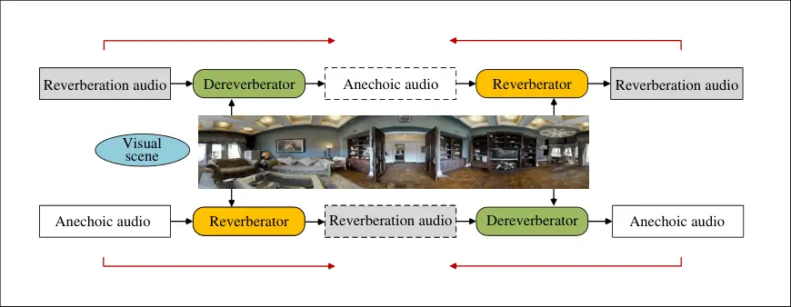
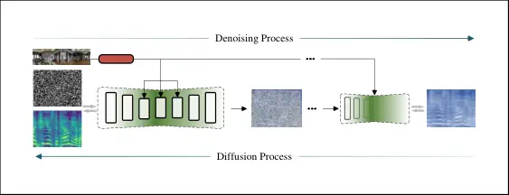
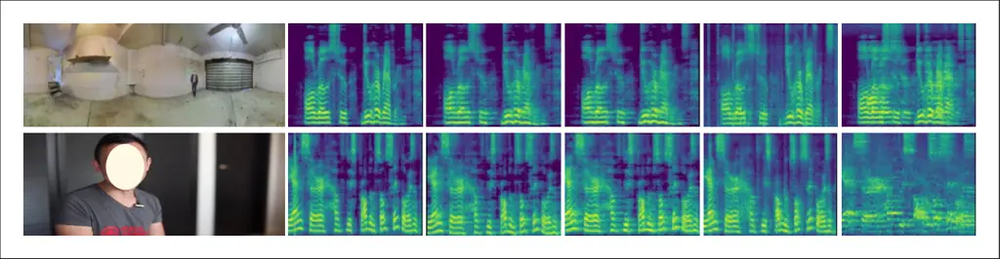
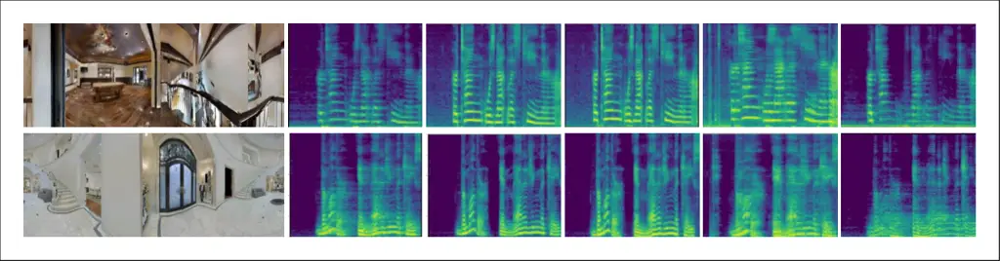
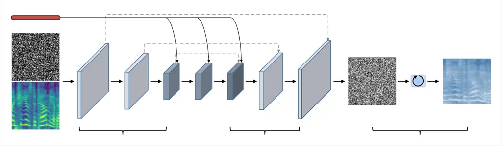
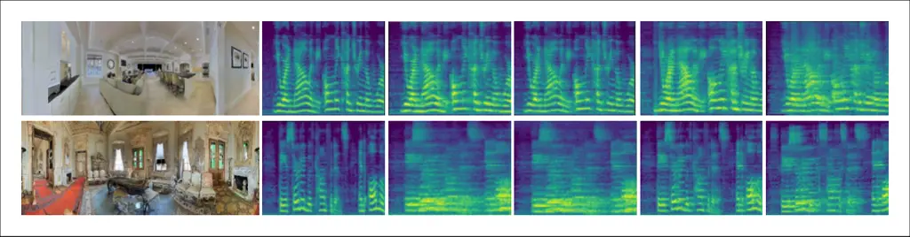
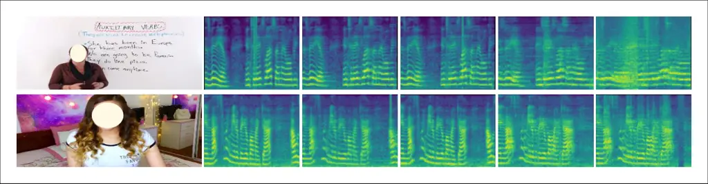
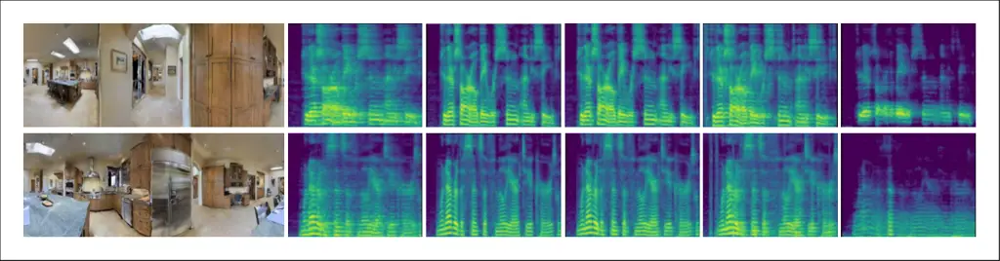
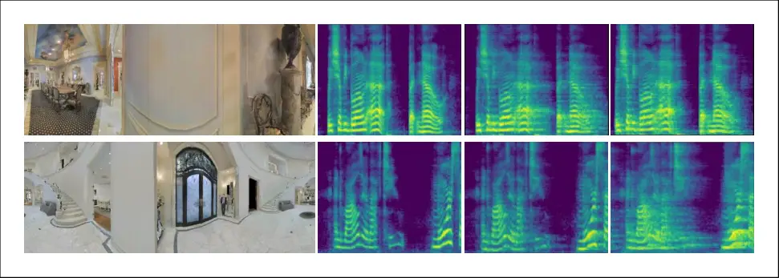

# Mutual Learning for Acoustic Matching and Dereverberation via Visual Scene-driven Diffusion

Jian Ma Affiliation: Southern University of Science and Technology
Affiliation: ReLER, CCAI, Zhejiang University  ReLER, University of
Technology Sydney    Wenguan Wang    Yi Yang    Feng Zheng
Affiliation: [https://hechang25.github.io/MVSD](https://hechang25.github.io/MVSD)
Affiliation: Southern University of Science and Technology

###### Abstract

Visual acoustic matching (VAM) is pivotal for enhancing the immersive
experience, and the task of dereverberation is effective in improving
audio intelligibility. Existing methods treat each task independently,
overlooking the inherent reciprocity between them. Moreover, these
methods depend on paired training data, which is challenging to acquire,
impeding the utilization of extensive unpaired data. In this paper, we
introduce MVSD, a mutual learning framework based on diffusion models.
MVSD considers the two tasks symmetrically, exploiting the reciprocal
relationship to facilitate learning from inverse tasks and overcome data
scarcity. Furthermore, we employ the diffusion model as foundational
conditional converters to circumvent the training instability and
over-smoothing drawbacks of conventional GAN architectures.
Specifically, MVSD employs two converters: one for VAM called
reverberator and one for dereverberation called dereverberator. The
dereverberator judges whether the reverberation audio generated by
reverberator sounds like being in the conditional visual scenario, and
vice versa. By forming a closed loop, these two converters can generate
informative feedback signals to optimize the inverse tasks, even with
easily acquired one-way unpaired data. Extensive experiments on two
standard benchmarks, i.e., SoundSpaces-Speech and Acoustic AVSpeech,
exhibit that our framework can improve the performance of the
reverberator and dereverberator and better match specified visual
scenarios.

###### Keywords: 

Visual acoustic matching Dereverberation Audio style transfer Mutual
learning Diffusion

^(†)^(†)footnotetext: Corresponding author: Wenguan Wang.

## 1 Introduction

Sound interacts with its environment, giving listeners a sense of
objects and spatial imprints \[75\]. Reverberation is sound lingering in
a space from surfaces reflecting sound waves \[37, 17\]. Thus,
reverberant sound, faithfully replicating real-world acoustics, is vital
for realistic and immersive experiences in applications like augmented
and virtual reality \[79, 47, 31, 7, 40, 83, 45\]. Although
reverberation can bestow a realistic sense of space, it may make speech
content less intelligible \[61, 36\]. In line with human perception,
automatic speech recognition systems also suffer from lower accuracy
when processing reverberant speeches \[21, 80, 12\]. Therefore,
dereverberation techniques \[53\] can benefit applications such as
teleconferencing, hearing aids, voice assistants, etc.

Figure 1: There exists an inherent reciprocity between VAM and
dereverberation. Unlike previous approaches that treat these two tasks
independently, our framework simultaneously handles the both tasks.
Forming a closed loop between the two converters can generate
informative feedback signals to optimize the inverse tasks, even with
easily acquired one-sided unpaired data (§1).

Existing works train VAM and dereverberation separately \[19, 71, 15,
68, 4, 6\]. The traditional methods of acoustic matching primarily
involve unraveling the spatial characteristics of sound through the
examination of Room Impulse Responses (RIRs), which assess the
propagation and variation of sound within a specific environment \[16,
2, 3, 52, 64, 71\]. Rather than estimating RIRs, VAM \[4\] directly
achieves specified reverberation by employing images of the target
environment and original audio clips. For dereverberation, classical
methodologies often encompass the application of signal processing and
statistical techniques \[54, 55\], recent advances highlight neural
network-based approaches that learn transfer functions from
reverberation to anechoic spectrograms \[12, 22, 14, 81\]. Nonetheless,
optimizing each task individually fails to leverage the inherent
reciprocity between the two tasks (Fig. 1). Moreover, training these
methods usually requires extensive paired data. Yet capturing large
volumes of aligned anechoic and reverberant audio pairs in real-world
scenarios is not feasible. For VAM, the shortage of paired audio usually
leads to average-style reverberation. When it comes to dereverberation,
the model struggles to produce highly ‘clean’ audio in response to
complex scenarios. Thus, existing methods often face challenges in
leveraging extensive unpaired audio due to the varying reverberation
levels.

In this paper, we consider dereverberation as the inverse task of VAM,
serving as an evaluator to provide feedback signals for VAM training,
and vice versa. Specifically, given a visual environment $`\bm{v}`$, an
anechoic audio $`\bm{a}_{c}`$, and a reverberant audio $`\bm{a}_{r}`$,
VAM reverberator
$`f_{\theta}(\bm{v},\bm{a}_{c})\rightarrow\hat{\bm{a}}_{r}`$ maps the
visual observation and anechoic audio into reverberant audio, while the
dereverberator
$`g_{\phi}(\bm{v},\bm{a}_{r})\rightarrow\hat{\bm{a}}_{c}`$ restores
reverberant audio to anechoic audio conditioned on visual
characteristics. There exists a solid reciprocal relationship between
the input and output spaces of $`f_{\theta}`$ and $`g_{\phi}`$. In this
study, we delve into exploiting their intrinsic reciprocity to overwhelm
the scarcity of parallel data. We propose a Mutual learning mechanism
based on Visual Scene-driven Diffusion (MVSD) (Fig. 1). In MVSD, two
converters, namely reverberator and dereverberator, are employed and
capable of learning from the symmetric tasks. Taking VAM as an example,
the reverberator, conditioned on the visual scene $`\bm{v}`$, simulates
environmental acoustic effects and converts anechoic
audio $`\bm{a}_{c}`$ to reverberant audio $`\hat{\bm{a}}_{r}`$. Since
the output of one converter can be used as the input for another, the
reverberator and dereverberator can act as mutual evaluators.
Concretely, in the primal task VAM, the reverberator generates
reverberated audio $`\hat{\bm{a}}_{r}`$ conditioned on the visual
scene $`\bm{v}`$ and anechoic audio $`\bm{a}_{c}`$. Then the reverse
converter $`g_{\phi}`$ takes $`\hat{\bm{a}}_{r}`$ as input and
reconstructs the anechoic audio $`\tilde{\bm{a}}_{c}`$ within the
symmetric dereverberation task. Finally, the errors between
$`\tilde{\bm{a}}_{c}`$ and $`\bm{a}_{c}`$ are used as feedback signals
to optimize reverberator $`f_{\theta}`$, and vice versa. The training
process of reverberator $`f_{\theta}`$ and dereverberator $`g_{\phi}`$
can form a closed loop, providing feedback for inverse tasks to enhance
data efficiency. When the dereverberator encounters a unpaired natural
audio $`\bm{a}^{\prime}_{r}`$ with reverberation, it first eliminates
the reverberation factors and creates a pseudo-anechoic
audio $`\hat{\bm{a}}^{\prime}_{c}`$. Likewise, the reverberator
regenerates $`\tilde{\bm{a}}^{\prime}_{r}`$ based on
$`\hat{\bm{a}}^{\prime}_{c}`$ and visual
observations $`\bm{v}^{\prime}`$. Hence, MVSD allows these two
converters to benefit from each other’s training instances and can be
extended to easily acquired unpaired audio samples. For conditional
generation, the architecture built on GANs is presently the prevailing
choice \[20, 60, 8, 49, 27, 28\]. However, the training of GAN may
introduce potential risks of instability and over-smoothing. Diffusion
model \[25, 9, 48, 43, 10, 41, 1, 63\] recently show remarkable
milestones in image generation, enabling the creation of high-quality
images based on conditioning cues. Some works introduce diffusion into
audio generation, such as converting spectrograms into sound
signals \[35\], generating symbolic music \[50\], etc. However,
diffusion generation of specified reverberation styles under visual
guidance remains underexplored. To bridge this gap, we meticulously
devise a visual scene-driven diffusion model to mitigate the
computational overhead. Specifically, the diffusion model for each task
includes a visual scene encoder for extracting features to control
reverberation style, and a controllable Unet that serves as the
generator for producing the desired audio. Additionally, cross-modal
attention is adopted in selective blocks to establish correlations
between visual cues and audio, reducing computational demands.

We spotlight the notable strengths of MVSD in visual-audio cross-modal
style transfer. MVSD effectively enhances the performances and
consistently reports promising results on both tasks. We achieve a
remarkable reduction of $`0.157`$ in STFT-distance on the ‘Seen’ test
set of SoundSpaces-Speech \[4\] ($`23.6\%`$ relative performance).
Moreover, the utilization of unpaired audios ($`17.3\%`$ of the training
data) can further boost the relative performance by $`9.1\%`$ in RTE for
VAM.

To summarize, the main contributions of this paper are as follows:

- •
  We initially propose an end-to-end approach that leverages the
  reciprocity between VAM and dereverberation tasks to reduce reliance
  on paired data.
- •
  We introduce a new and elegant mutual learning framework, MVSD,
  incorporating diffusion models and utilizing symmetrical tasks as
  evaluators to provide feedback signals to facilitate model training.
- •
  We conduct a comprehensive evaluation of MVSD, demonstrating its
  superiority and confirming the potential of unpaired data in
  real-world applications.

## 2 Related Work

Acoustic Matching. Acoustic matching involves modifying audio to
simulate the sound in a given environment. Schroeder et al. \[65\] first
propose the concept of reverberation and apply a series of percolators
and delay lines to mimic environmental space characteristics. There are
two main methods for acquiring RIRs in the audio community \[46, 18,
52\]. (1) Simulation techniques can be employed to produce RIRs when the
geometry and material properties of the spatial environment are
available \[2, 3, 16\]. (2) If detailed information is inaccessible,
RIRs can be blindly estimated from audio captured in the room \[52,
71\]. RIRs are then employed to synthesize an auralized audio signal.
Both methods have weaknesses. The former requires exhaustive
measurements of space that may be infeasible, while the latter may
introduce some disturbances due to limited acoustic information. Some
recent works \[34, 68\] attempt to approximate RIRs from an
environmental image, necessitating paired image and impulse response
training data. Regrettably, these methods also require estimating the
acoustic parameters from the recorded audio, which severely limits the
application scopes. Chen et al. \[4\] introduce VAM and utilize visual
observation to simulate the target environment for generating
reverberant audio. However, VAM focuses on acoustic matching, neglecting
the correlation and inherent consistency with the reverse
dereverberation task. In this paper, we harness the RGB image of
specified environment for acoustic matching and utilize the reciprocity
with dereverberation to improve the precision of reverberation
simulations.

Dereverberation. Due to the challenge of collecting both anechoic and
reverberant audio simultaneously, acoustic dereverberation can enhance
training data quality by minimizing reverberation disturbance \[33,
86\]. The main stream dereverberation technologies utilize devices like
microphone arrays to remove reverberation \[51\]. Deep learning
techniques have also made great strides in reverberation removal \[22,
81, 87\]. Tan et al. \[74\] exploit the movement of the upper lip region
to isolate interfering sounds, yet it does not intentionally eliminate
reverberation based on visual scene understanding. These methods either
disregard or only partially take into account visual information.
Chen et al. \[6\] propose learning all the acoustics characteristics
associated with indoor dereverberation. Like acoustic matching, these
unidirectional approaches neglect the reciprocal relationship between
the two tasks, leading to an incomplete utilization of naturally
recorded audio. In contrast, MVSD demonstrates stronger dereverberation
capabilities through the assistance of symmetric tasks.  
Mutual Learning. Mutual learning, originating from the field of language
translation, aims to reduce dependence on data annotation \[23\]. This
mechanism allows alternating between the two sides and enables the
language model to train solely from one-sided data. The core idea of
mutual learning involves establishing a dual-learning game between two
agents, each agent is assigned an individual task. In the primal task,
mutual learning maps $`\bm{x}`$ from primal domain to dual
domain $`\bm{y}`$, and then restore the original $`\bm{x}`$ through the
reverse mapping in dual task \[88, 77\]. Hence, mutual learning can
produce two feedback signals without requiring parallel data: a style
evaluation score indicating the likelihood that the synthesized audio
matches the target style, and a reconstruction loss measuring the
difference between the reconstructed audio and the original audio. This
mechanism alternates between agents, allowing the generator to train
from only one-way data \[84, 42, 66, 88, 82, 85\]. We are the first to
investigate the duality of VAM and dereverberation. These two tasks are
trained together in a mutual learning framework and provide mutual
reinforcement signals based on the structural symmetry, even for
unpaired samples.

Condition-guided Generation. In recent years, there have been
significant advancements in the field of conditional generation \[26,
67, 78, 59\]. Diffusion models have demonstrated impressive results in
various generative tasks due to their superior visual quality and
training stability \[25, 9, 43, 41, 1, 63, 56, 10, 35, 50\]. The
diffusion probability model \[69\] is based on a Markov chain,
proceeding through finite steps in two opposing directions: one
transition moves from the data distribution to noise, and the other
transitions back from noise to the data distribution. Ho et al. \[25\]
introduce the variational lower bound objective, which is subsequently
improved in \[56\] to obtain higher log-likelihood scores. In this
study, we regard audio spectrograms as images and elegantly employ two
diffusion-based generators for controllable reverberation style
transfer.

## 3 Methodology

We propose a mutual learning framework MVSD to leverage feedback signals
from symmetrical tasks to promote model training and better exploit
unpaired data. It involves two tasks: a primal task VAM \[4\] that
employs the reverberator $`f_{\theta}`$ to convert an anechoic
audio $`\bm{a}_{c}`$ into a reverberated audio $`\hat{\bm{a}}_{r}`$,
which is aurally recorded in the specified environment. In the dual
task, dereverberator $`g_{\phi}`$ removes the reverberant
characteristics in $`\bm{a}_{r}`$, which is similar to its anechoic
counterpart $`\bm{a}_{c}`$. Here, $`f_{\theta}`$ and $`g_{\phi}`$ are
jointly trained in an end-to-end mutual learning framework MVSD (§3.1).
Furthermore, we employ visual scene-driven diffusion models as
foundational conditional converters $`f_{\theta}`$ and $`g_{\phi}`$ to
achieve stable training and accurate reverberation style
transfer (§3.2).

Reverberator. Consider paired data distributions:
$`\!\bm{A}_{c}\!=\!\{\bm{a}_{c}^{(1)},\!\bm{a}_{c}^{(2)},\!...,\!\bm{a}_{c}^{(n)}\}`$
and
$`\bm{A}_{r}=\{\bm{a}_{r}^{(1)},\bm{a}_{r}^{(2)},...,\bm{a}_{r}^{(n)}\}`$,
representing anechoic and reverberant audio, respectively. The set of
visual scenes $`\bm{V}=\{\bm{v}^{(1)},\bm{v}^{(2)},...,\bm{v}^{(n)}\}`$
corresponds to the audio set of $`\bm{A}_{r}`$. The goal of VAM is to
convert the anechoic audio $`\bm{a}_{c}`$ with condition $`\bm{v}`$ to
its reverberant counterpart $`\bm{a}_{r}`$, i.e., to estimate the
conditional distribution $`f_{\theta}(\bm{a}_{r}|\bm{a}_{c};\bm{v})`$.
Based on diffusion models, we encode $`\bm{a}_{c}`$ into content
features and switch the reverberation style to the visual
environment $`\bm{v}`$.

Dereverberator. Contrary to VAM, the goal of the dereverberation task is
to eliminate reverberation factors and enhance the intelligibility of
audio content. Correspondingly, the dereverberator $`g_{\phi}`$ based on
VSD calculates the anechoic
distribution $`g_{\phi}(\bm{a}_{c}|\bm{a}_{r};\bm{v})`$ under a given
scene $`\bm{v}`$.




Figure 2: The overview of MVSD. The output of a converter can serve as
pseudo-input for the reverse task, providing an intermediate transition.
Concretely, the reverberator $`f_{\theta}`$ and dereverberator
$`g_{\phi}`$ can generate feedback signals $`\mathcal{L}_{m}`$ (Eq. 4)
for mutual optimization of training, even with one-way unpaired
data ($`\bm{a}^{\prime}_{r},\bm{v}^{\prime}`$) (§3.1).

### 3.1 Mutual Learning

We jointly learn the VAM and dereverberation tasks (Fig. 2): the
reverberator $`f_{\theta}`$ and dereverberator $`g_{\phi}`$ can mutually
benefit from each other. Suppose we have two (vanilla) converters that
can map anechoic audio to a specified reverberation style and vice
versa. Our goal is to simultaneously improve the style accuracy of the
VAM task and the content intelligibility of the dereverberation task by
employing paired and unidirectional non-paired data. To achieve this, we
leverage the reciprocity between these two tasks, wherein the
input-output spaces of VAM and dereverberation exhibit a strong
correlation and can interchangeably act as the input and output for each
other. Starting from either task, we first convert it forward to another
audio, then transfer it backward to the original audio. By evaluating
the results of this two-hop transfer process, we can gauge the quality
of both converters and optimize them accordingly. Namely,
dereverberator $`g_{\phi}`$ is employed to evaluate the quality of
$`\hat{\bm{a}}_{r}`$ generated by $`f_{\theta}`$ and sends back an error
singal $`\triangle(\tilde{\bm{a}}_{c},\bm{a}_{c})`$ to $`f_{\theta}`$,
and vice versa. This process can be iterated many rounds until both
converters converge. Please note that in MVSD, $`\bm{a}_{r}`$ and
$`\bm{a}_{c}`$ are not necessarily aligned and may even not have a
typical relationship.

We denote a labeled collection as
$`\mathcal{D}\!=\!\{(\bm{v}^{n},\bm{a}_{c}^{n},`$
$`\bm{a}_{r}^{n})\}_{n=1}^{N}`$, which consists of $`N`$ aligned tuples
of anechoic and reverberant audio. Given a
triplet $`\langle\bm{v},\bm{a}_{c},\bm{a}_{r}\rangle`$, where
$`\bm{v}`$, $`\bm{a}_{c}`$, $`\bm{a}_{r}`$ are sets of environmental
spaces, anechoic and target audios. Our goal is to uncover the
bi-directional relationship between the $`\bm{a}_{c}`$ and
$`\bm{a}_{r}`$. For the primal process starting from VAM, denote
$`\hat{\bm{a}}_{r}`$ as the mid-transition output. Firstly, we obtain a
reverberated audio $`\hat{\bm{a}}_{r}`$ through the reverberator
$`f_{\theta}(\bm{v},\bm{a}_{c})`$. Then, the dereverberator $`g_{\phi}`$
translates $`\hat{\bm{a}}_{r}`$ to $`\tilde{\bm{a}}_{c}`$ by mapping
$`g_{\phi}(\bm{v},\hat{\bm{a}}_{r})`$. The $`\tilde{\bm{a}}_{c}`$ is
expected to be consistent with $`\bm{a}_{c}`$ in audio clarity, i.e.,
achieving a small cycle-consistency
error $`\Delta^{\bm{a}_{c}}_{\bm{v}}`$. Similarly, for
dereverberator $`g_{\phi}`$, we
have $`\tilde{\bm{a}}_{r}=f_{\theta}(\bm{v},\hat{\bm{a}}_{c})`$ and
$`\tilde{\bm{a}}_{r}`$ should have a reverberation effect akin to
$`\bm{a}_{r}`$ in auditory perception. Likewise,
$`\Delta^{\bm{a}_{r}}_{\bm{v}}`$ can be employed to evaluate the
discrepancies between $`\bm{a}_{r}`$ and $`\tilde{\bm{a}}_{r}`$.
Finally, the errors $`\Delta^{\bm{a}_{c}}_{\bm{v}}`$
and $`\Delta^{\bm{a}_{r}}_{\bm{v}}`$ can be specified as two
reconstruction losses, which are minimized for the model training. Prior
researches \[38, 23\] on conditional image synthesis suggest that $`L1`$
distance, unlike $`L2`$, can reduce blurriness. Hence, we employ $`L1`$
distance to assess the feedback errors:

```math
\displaystyle\Delta^{\bm{a}_{r}}_{\bm{v}}=\|\tilde{\bm{a}}_{r},\bm{a}_{r}\|_{1}=\|f_{\theta}(\bm{v},g_{\phi}(\bm{v},\bm{a}_{r}))-\bm{a}_{r}\|_{1}; \tag{1}
```

```math
\displaystyle\Delta^{\bm{a}_{c}}_{\bm{v}}=\|\tilde{\bm{a}}_{c},\bm{a}_{c}\|_{1}=\|g_{\phi}(\bm{v},f_{\theta}(\bm{v},\bm{a}_{c}))-\bm{a}_{c}\|_{1}.
```

In real-world scenarios, the challenge of capturing parallel data arises
from the difficulty of simultaneously recording sound at the source and
listener locations. This obstacle is mitigated in our approach, as it
does not necessitate aligned anechoic and reverberant
pairs $`(\bm{a}_{c},\bm{a}_{r})`$ for the errors
$`\Delta^{\bm{a}_{r}}_{\bm{v}}`$ and $`\Delta^{\bm{a}_{c}}_{\bm{v}}`$,
As a result, Eq. 1 can be effectively applied to one-way unpaired
audios. As in common practice \[13, 73, 29\], we build two unlabeled
collections:
$`\mathcal{U}=\{({\bm{v}^{m}}^{\prime},{\bm{a}_{r}^{m}}^{\prime})\}_{m=1}^{M}`$ for
audios with natural reverberation, and
$`\mathcal{C}=\{{\bm{a}_{c}^{k}}^{\prime\prime}\}_{k=1}^{K}`$ with only
anechoic audio. We obtain $`\mathcal{U}`$ by sampling natural audios
$`{\bm{a}^{\prime}_{r}}`$ from existing environments
$`{\bm{v}}^{\prime}`$, which lack corresponding anechoic audios.
Similarly, we create collection $`\mathcal{C}`$ by filtering anechoic
audios \[6\] $`{\bm{a}^{\prime\prime}_{c}}`$ from an open-source
dataset \[58\], which do not have matching reverberated audios and
visual images. For unpaired natural audios $`\mathcal{U}`$, we first
generate intermediate output $`\hat{\bm{a}}^{\prime}_{c}`$ using the
dereverberator $`f_{\theta}(\bm{a}^{\prime}_{r},\bm{v}^{\prime})`$,
followed by reconstructing $`\tilde{\bm{a}}^{\prime}_{r}`$ based
on $`\hat{\bm{a}}^{\prime}_{c}`$ and scene $`\bm{v}^{\prime}`$,
i.e., $`g_{\phi}({\bm{v}}^{\prime},{\bm{a}^{\prime}_{r}})`$, and
computing error $`\Delta^{\bm{a}^{\prime}_{r}}_{\bm{v}^{\prime}}`$
against the original input $`\bm{a}^{\prime}_{r}`$. We can derive the
formula:

```math
\displaystyle\Delta^{\bm{a}^{\prime}_{r}}_{\bm{v}^{\prime}}=\|{\tilde{\bm{a}}^{\prime}_{r}},{\bm{a}^{\prime}_{r}}\|_{1}=\|f_{\theta}({\bm{v}}^{\prime},g_{\phi}({\bm{v}}^{\prime},{\bm{a}^{\prime}_{r}})-{\bm{a}^{\prime}_{r}}\|_{1}. \tag{2}
```

As for unpaired anechoic audios $`\mathcal{C}`$, since there are rarely
accompanying visual scene images when recording audio, we randomly
sample an image $`\bm{v}^{\prime\prime}`$ from $`\mathcal{U}`$ to
simulate the specified environment, and the formulate is as:

```math
\displaystyle\Delta^{\bm{a}^{\prime\prime}_{c}}_{\bm{v}^{\prime\prime}}=\|{\tilde{\bm{a}}^{\prime\prime}_{c}},{\bm{a}^{\prime\prime}_{c}}\|_{1}=\|g_{\phi}(\bm{v}^{\prime\prime},f_{\theta}(\bm{v}^{\prime\prime},{\bm{a}^{\prime\prime}_{c}}))-{\bm{a}^{\prime\prime}_{c}}\|_{1}. \tag{3}
```

Our training process utilizes paired data, complemented by unpaired
natural and anechoic audios. Consequently, our mutual learning loss is
defined as:

```math
\displaystyle\mathcal{L}_{m}\!= \displaystyle\frac{1}{N}\!\sum\nolimits_{({\bm{v}},\bm{a}_{r},\bm{a}_{c})~\!\in~\!\mathcal{D}}\!(\Delta^{\bm{a}_{c}}_{\bm{v}}\!+\!\Delta^{\bm{a}_{r}}_{\bm{v}})\!\!+\!\!\frac{1}{M}\!\sum\nolimits_{({\bm{v}^{\prime}},{\bm{a}^{\prime}_{r}})~\!\in~\!\mathcal{U}}\!\!\triangle^{\bm{a}^{\prime}_{r}}_{\bm{v}^{\prime}}\!\!+\!\!\frac{1}{K}\!\sum\nolimits_{({\bm{v}^{\prime\prime}},{\bm{a}^{\prime\prime}_{c}})~\!\in~\!\mathcal{C}}\!\!\triangle^{\bm{a}^{\prime\prime}_{c}}_{\bm{v}^{\prime\prime}}. \tag{4}
```

During training, $`\mathcal{L}_{m}`$ is applied only for predictions and
backpropagation at time step $`t`$ of the diffusion model. Hence, MVSD
does not significantly increase the training time compared to training
the two tasks separately.

Remark. MVSD consists of two main concepts: First, an ideal reverberator
should be able to adapt audio to any visual environment, and a
dereverberator is also effective at removing disturbances that affect
speech intelligibility. Therefore, we investigate VAM and
dereverberation in a unified learning framework, allowing the converters
to better exploit the cross-modal and cross-task correlations. Second,
the addition of unpaired data can boost model performance, and paired
data guides the reverberator and dereverberator converge to the target
distribution, preventing extreme domain deviation from the unpaired
data.

### 3.2 Visual Scene-driven Diffusion




Figure 3: The diffusion and denoising processes of VSD. Taking VAM as an
example, MVSD converts anechoic audio $`\bm{a}_{c}`$ into reverberant
audio $`\hat{\bm{a}}_{r}`$ that aligns with the acoustics of the visual
scene $`\bm{v}`$ (§3.2).

In MVSD, the reverberator and dereverberator share a similar model
structure. We introduce visual scene-driven diffusion (VSD) with the
reverberator $`f_{\theta}`$ as an example. The diffusion model employs a
$`T`$-step iterative denoising process to transform Gaussian noise into
the desired data distribution \[69, 25, 63\]. By introducing prompt
conditions such as class labels and text \[10, 57\], the generated
content can be controlled precisely. In MVSD, visual scene embeddings
are employed as control conditions to guide the generation of
reverberator $`f_{\theta}`$ and dereverberator $`g_{\phi}`$. In
particular, the diffusion process follows a Markov chain, progressively
adding noise to the input spectrogram $`\bm{x}_{0}`$ (sampled from the
real distribution $`q(\bm{x})`$ until it evolves into white Gaussian
noise $`\mathcal{N}(0,1)`$. At each step $`t`$, the spectrogram
$`\bm{x}_{t}`$, following the distribution
$`q(\bm{x}_{t}|\bm{x}_{t-1})`$, is derived by the pre-defined variance
$`\beta_{t}`$ scaled with $`\sqrt{1-\beta_{t}}`$:

```math
\small q(\bm{x_{t}}|\bm{x}_{t-1})=\mathcal{N}(\bm{x}_{t};\bm{z}_{t});\hskip 9.24994pt\bm{z}_{t}\sim\mathcal{N}(\sqrt{1-\beta_{t}}\bm{z}_{t-1},\beta_{t}\textbf{I}). \tag{5}
```

The denoising process attempts to restore the original
spectrogram $`\bm{x}_{0}`$ from the noisy data $`\bm{x}_{T}`$ by
removing the noise introduced in the forward diffusion process. The
prediction $`q(\bm{x}_{t-1}|\bm{x}_{t})`$ at step $`t-1`$ is
approximated by a parameterized model $`p`$ (e.g., a neural network),
involving the estimation of $`\mu(\bm{z}_{t},t)`$ and
$`\sigma(\bm{z}_{t},t)`$ from a Gaussian distribution. By employing the
reverse process across all time steps, we can transition from
$`\bm{x}_{T}`$ back to the initial spectrogram $`\bm{x}_{0}`$:

```math
\displaystyle\small\!\!\!p(\bm{x}_{0:T}) \displaystyle\!=\!p(\bm{x}_{T})\prod\nolimits_{t=1}^{T}p(\bm{x}_{t-1}|\bm{x}_{t})
```

```math
\displaystyle\!=\!p(\bm{x}_{T})\prod\nolimits_{t=1}^{T}\mathcal{N}(\bm{x}_{t-1};\mu(\bm{x}_{t},t),\sigma(\bm{x}_{t},t)). \tag{6}
```

Visual Scene Encoder. We apply an embedding with $`256`$ dimensions to
represent visual scenes, extracted by a pre-trained ResNet-18 \[24\]
encoder. Then, the embedding serves as the condition to guide the
generation of diffusion models.

Controllable Unet. We meticulously design an controllable Unet for
predicting $`\bm{x}_{t}`$ of diffusion (Fig. 3). Controllable Unet is
composed of multiple stages with attention blocks \[63\], i.e.,
self-attention and cross-attention. Self-attention allows a model to
weigh the importance of different parts within the same element.
Cross-attention, similar to self-attention, targets relationships across
different components. We employ a classic encoder-decoder with a
symmetric design, where each part incorporating $`3`$ attention blocks.
The encoder progressively reduces the resolution of the feature map, and
then the decoder gradually increases it to align with the size of the
original spectrogram. In the self-attention block, we utilize the
downsampling method in \[72\] with a stride of $`4`$ to rapidly decrease
the size of feature maps. The downsampling utilizes dilated convolutions
and attention to increase the receptive field without reducing spatial
dimensions. Cross-modal attention is selectively employed to the third
encoder block and the first decoder block, mitigating computational
overhead. Both VAM and dereverberation need to preserve the linguistic
information in the audios. Therefore, we concatenate source spectrogram
with the noise $`\bm{z}_{0}`$ as the content input for the controllable
Unet. Please refer to the supplementary material for details.

### 3.3 Training Objective

For training the diffusion model, we employ the simplified
objective \[25\]:

```math
\displaystyle\mathcal{L}_{d}=\mathbb{E}_{{\bm{x}_{0}},t,\bm{z}}[\|\bm{z}-\hat{\bm{z}}(\sqrt{\overline{\alpha}_{t}}\bm{x}_{0}+\sqrt{1-\overline{\alpha}_{t}}\bm{z},t)\|_{2}], \tag{7}
```

where $`\alpha_{t}`$ in diffusion models is a scaling factor that
modulates the noise level at each time step $`t`$. VSD can predict the
noise $`\hat{\bm{z}}_{t}`$ and use it to iteratively refine the
denoising process. With the reparameterization trick, a method for
differentiable sampling \[32\], we can represent the estimation of
$`\hat{\bm{x}}_{0}`$:

```math
\displaystyle\hat{\bm{x}}_{0}=\frac{1}{\sqrt{\overline{\alpha}_{t}}}(\bm{x}_{t}-\sqrt{1-\overline{\alpha}_{t}}\hat{\bm{z}}_{t}). \tag{8}
```

Moreover, we introduce a style loss $`\mathcal{L}_{sty}`$ (Eq. 9) to
make the generated audios with the environmental characteristics. Taking
VAM task as an example, during training, the Unet predicts the
noise $`\hat{\bm{z}}_{t}`$ at time step $`t`$. Then,
$`\hat{\bm{z}}_{t}`$ can be used to gradually derive the predicted
original spectrogram $`\hat{\bm{x}}_{r}`$ at step $`0`$ (Eq. 8). Here,
we do not explicitly extract the stylistic features of
the $`\bm{a}_{r}`$ and $`\hat{\bm{a}}_{r}`$; instead, we directly employ
$`\mathcal{L}_{1}`$ loss to regularize style consistency:

```math
\displaystyle\mathcal{L}_{sty}=\|\hat{\bm{a}}_{r}-\bm{a}_{r}\|_{1}+\|\hat{\bm{a}}_{c}-\bm{a}_{c}\|_{1}. \tag{9}
```

We learn models $`f_{\theta}`$ and $`g_{\phi}`$ by minimizing the
combination of the diffusion loss, the style loss and the mutual
learning regularization term. In summary, the overall training objective
is given as:

```math
\small\mathcal{L}_{total}=\mathcal{L}_{d}+\mathcal{L}_{m}+\mathcal{L}_{sty}. \tag{10}
```

### 3.4 Implementation Details

Training. In MVSD, converters and visual scene encoder are trained
separately. We adopt the loss function in \[30\] to train the visual
scene encoder. The mutual learning is integrated into each mini-batch
update, spanning the entire training process for the two tasks. Training
starts with supervised data, with unsupervised data progressively merged
for optimization. This stepwise strategy can preserve model stability.
At each iteration, we compute the predictions of both converters and
update their parameters based on the feedback from the symmetrical
models. In practice, we first perform supervised training and conduct
the loop of mutual learning (Alg. 1). Besides minimizing the
cycle-consistent loss $`\mathcal{L}_{m\!}`$ (Eq. 4), our MVSD framework
is learnt with the diffusion objectives for VAM and dereverberation,
over the labeled data $`\mathcal{D}`$. Finally, we receive a prepared
model when MVSD converges on all training data.

Input: Labeled set $`\mathcal{D}`$, unpaired
sets $`\mathcal{U}`$ and $`\mathcal{C}`$, reverberator $`f_{\theta}`$
and dereverberator $`g_{\phi}`$.

1 Repeat:     Sample a mini-batch of paired
tuples $`\langle\bm{a}_{c},\bm{v},\bm{a}_{r}\rangle`$;

     2 Generate random Gaussian noise $`\bm{z}_{c}`$ and $`\bm{z}_{r}`$
for the converters;

     3 Execute the diffusion processes of reverberator $`f_{\theta}`$
and dereverberator $`g_{\phi}`$;

     4 Calculate the training objective
$`\mathcal{L}_{total}`$ (Eq. 10);

     5 Update the parameters of $`\theta`$ and $`\phi`$:
$`\theta\leftarrow\theta-\gamma\nabla_{\theta}\mathcal{L}(\theta)`$,
$`\phi\leftarrow\phi-\gamma\nabla_{\phi}\mathcal{L}(\phi)`$;

     6 Introduce unpaired data and continue training when the epoch
exceeds $`100`$;

7 Until: Convergence

Algorithm 1 Mutual learning with visual scene-driven diffusion.

Inference. The inference of each task follows the sampling process of
the diffusion model. Take VAM as an example: First, a noise spectrogram
is randomly generated and concatenated with a anechoic test spectrogram.
Next, at each step $`t`$ of the denoising process, the controllable Unet
synthesizes the intermediate spectrogram conditioned on visual features.
We report the average of ten experiments as the evaluation criterions.

Reproductibility. Our model is implemented in PyTorch and trained using
two NVIDIA Tesla V100 GPUs. Training MVSD from scratch takes
approximately 144 hours. The average inference time is $`1.09`$ seconds.
We set FFT size, hop size and mel scale for audio processing to
$`1024`$, $`256`$ and $`128`$, respectively. We then truncate the
mel-spectrogram to a width of $`128`$, resulting in a spectrogram size
of $`128\times 128`$. We utilize a pre-trained BigVGAN \[39\] as the
vocoder.

## 4 Experiments

Dataset. We conduct experiments on two datasets \[4\]:
SoundSpaces-Speech and Acoustic AVSpeech datasets. The former employs a
simulated environment \[5\] to generate reverberation audio, is
perfectly aligned paired audio and accurate ground truth. Regardless,
there has a realism gap. Finally, the dataset is split into
train/val/test sets with $`28,853`$, $`1,441`$, and $`1,489`$ samples,
respectively. Acoustic AVSpeech is a subset of AVSpeech dataset \[11\].
It offers more realism but poses evaluation challenges due to lacking
corresponding reverberant audios. Acoustic AVSpeech contains
$`113k/3k/3k`$ video clips for the training, validation, and test
splits, respectively. For the unpaired data, we randomly sample
$`5,000`$ natural audios with video in AVSpeech dataset \[11\] and
$`5k`$ anechoic audio in Librispeech \[58\], with no overlap with the
training sets. We apply ‘Seen’ and ‘Unseen’ to denote whether visual
scenes are encountered during training.

Evaluation Metrics. For VAM task, following \[4\], we employ
STFT-distance to measure deviation from the ground truth, Reverberation
Time 60 error (RTE) for room acoustics, and Mean Opinion Score
Error (MOSE) for speech quality evaluation. For dereverberation task, as
in \[6\], we adopt Perceptual Evaluation of Speech
Quality (PESQ) \[62\], Word Error Rate (WER) and Equal Error Rate (EER)
to assess the aspects of audio quality, content precision, and speaker
verification error, respectively. The evaluation is conducted on the
anechoic version of LibriSpeech test set \[58, 6\].

### 4.1 Performance on VAM

|                                   |                     |                        |                     |                     |                        |                     |                        |                     |                        |                     |
| --------------------------------- | ------------------- | ---------------------- | ------------------- | ------------------- | ---------------------- | ------------------- | ---------------------- | ------------------- | ---------------------- | ------------------- |
|                                   | SoundSpaces-Speech  |                        |                     |                     |                        |                     | Acoustic AVSpeech      |                     |                        |                     |
| Method                            | Seen                |                        |                     | Unseen              |                        |                     | Seen                   |                     | Unseen                 |                     |
|                                   | STFT $`\downarrow`$ | RTE (s) $`\downarrow`$ | MOSE $`\downarrow`$ | STFT $`\downarrow`$ | RTE (s) $`\downarrow`$ | MOSE $`\downarrow`$ | RTE (s) $`\downarrow`$ | MOSE $`\downarrow`$ | RTE (s) $`\downarrow`$ | MOSE $`\downarrow`$ |
| Input audio                       | 1.192               | 0.331                  | 0.617               | 1.206               | 0.356                  | 0.611               | 0.387                  | 0.658               | 0.392                  | 0.634               |
| AEE \[71\]                        | 2.746               | 0.319                  | 0.571               | \-                  | \-                     | \-                  | \-                     | \-                  | \-                     | \-                  |
| Image2Reverb \[68\]               | 2.538               | 0.293                  | 0.508               | 2.318               | 0.317                  | 0.518               | \-                     | \-                  | \-                     | \-                  |
| AV U-Net \[19\]                   | 0.638               | 0.095                  | 0.353               | 0.658               | 0.118                  | 0.367               | 0.156                  | 0.570               | 0.188                  | 0.540               |
| AViTAR \[4\]                      | 0.665               | 0.034                  | 0.161               | 0.822               | 0.062                  | 0.195               | 0.144                  | 0.481               | 0.183                  | 0.453               |
| \[1pt/1pt\] MVSD w/o visual scene | 0.691               | 0.188                  | 0.156               | 0.803               | 0.155                  | 0.194               | 0.137                  | 0.526               | 0.171                  | 0.474               |
| MVSD w/o unpaired data            | 0.573               | 0.033                  | 0.148               | 0.736               | 0.055                  | 0.184               | 0.131                  | 0.427               | 0.159                  | 0.394               |
| MVSD                              | 0.508               | 0.030                  | 0.142               | 0.637               | 0.051                  | 0.178               | 0.112                  | 0.392               | 0.148                  | 0.379               |

Table 1: Quantitative results on SoundSpaces-Speech and Acoustic
AVSpeech \[4\] (§4.1).

As shown in Table 1, MVSD achieves a notable absolute boost of $`0.157`$
STFT-distance ($`23.6\%`$ relative improvement), $`0.004`$ RTE
($`11.8\%`$ relative improvement), and $`0.019`$ MOSE ($`11.8\%`$
relative improvement) in the ‘Seen’ split of SoundSpaces-Speech dataset
compared with SOTA method. There is also a similar improvement in
Acoustic AVSpeech dataset. We can see that MVSD exhibits outstanding
strengths in all three assessed aspects: preserving source audio content
better, getting in more precise signal attenuation and more consistent
quality with the target audio. MVSD has the capability to infer and
extract relevant factors that influence reverberation from target
images, even in never-before-seen scenes. It should be noted that blind
reverberator \[71\], a traditional acoustic method, needs reference
audio, making it unsuitable for scenarios ‘Unseen’ of SoundSpaces (no
reference audio) and AVSpeech, as reported in \[4\]. Fig. 4 showcases
the visual comparisons of different methods for the VAM task on the
SoundSpaces-Speech and AVSpeech datasets, respectively, highlighting the
superiority of MVSD.

|                    |                                      |                                               |                                                 |
| ------------------ | ------------------------------------ | --------------------------------------------- | ----------------------------------------------- |
|                    | Speech Enhancement PESQ $`\uparrow`$ | Speech Recognition WER($`\%`$) $`\downarrow`$ | Speaker Verification EER($`\%`$) $`\downarrow`$ |
| Anechoic (Ceiling) | 4.64                                 | 2.50                                          | 1.89                                            |
| Reverberant        | 1.54                                 | 8.86                                          | 5.23                                            |
| MetricGAN+ \[15\]  | 2.33                                 | 7.49                                          | 5.16                                            |
| VIDA \[6\]         | 2.37                                 | 4.44                                          | 4.58                                            |
| \[1pt/1pt\] MVSD   | 2.53                                 | 4.27                                          | 4.46                                            |

Table 2: Quantitative dereverberation results on
SoundSpaces-Speech​ \[4\]​ (§4.2).​​​​​​

|                     |               |               |
| ------------------- | ------------- | ------------- |
|                     | SoundSpaces   | AVSpeech      |
| Input Speech        | 39.3% / 60.7% | 38.2% / 61.8% |
| Image2Reverb \[68\] | 20.8% / 79.2% | - / -         |
| AV U-Net \[19\]     | 23.4% / 76.6% | 21.9% / 78.1% |
| AViTAR \[4\]        | 34.7% / 65.3% | 44.1% / 55.9% |

Table 3: User study results. X%/Y% means that X% of participants prefer
this method while Y% prefer MVSD (§4.3).




Figure 4: Visualization results for VAM task on the SoundSpaces-Speech
(top) and AVSpeech datasets (bottom) \[4\] (§4.1).

### 4.2 Performance on Derverberation

Table 4.1 presents the dereverberation performance of MVSD on
SoundSpaces-Speech​ \[4\] dataset. We observe that MVSD also demonstrates
superior performance across all three metrics in the dereverberation
task. Particularly in terms of WER, MVSD exhibits a remarkable error
reduction of $`0.17`$ compared to VIDA, achieving a value of $`4.27\%`$.
This highlights the robust dereverberation capability of MVSD.
Additionally, MVSD achieves an EER of $`4.46\%`$, demonstrating its
ability to mitigate reverberation while preserving the timbre
information. Fig. 5 depicts the spectrograms for the dereverberation
task on SoundSpaces-Speech, with AVSpeech dataset omitted due to the
absence of groundtruth anechoic audio. Spectrogram analysis reveals that
MVSD achieves superior clarity and noise reduction in dereverberation,
with distinct peaks and fewer artifacts. The improvements observed in
both tasks signify that MVSD can leverage the reciprocity to enhance the
learning capability.




Figure 5: Visualization of the dereverberation task on the
SoundSpaces-Speech \[4\] (§4.2).

### 4.3 User Study

The human ear is the most accurate tool for evaluating acoustic
experiences. Therefore, we conduct a user study as a complement to
quantitative indicators. We invited $`15`$ volunteers to participate in
the evaluation. Following the configuration in \[4\], we show
participants some images of the target environment, real audio clips,
and samples generated by all test methods. Participants is asked to
choose the audio sample that exhibit the highest consistency with the
groundtruth reverb style and $`30`$ samples are selected for each
dataset. Table 4.1 reports the final preference scores. As expected,
MVSD consistently exceeds the results of other methods, achieving a high
preference ratio against AViTAR \[4\] ($`65.3\%`$ in SoundSpaces and
$`55.9\%`$ in AVSpeech). A certain percentage ($`39.3\%`$ and
$`38.2\%`$) of subjects prefer ‘clean’ audio devoid of reverberation,
which can be seen from the first row of Table 4.1. This tendency can be
attributed to the general preference for ‘clean’ sounding audio among
those participants without professional acoustical knowledge, which is
also reported in \[4\].

### 4.4 Ablation Study

To assess the effectiveness of MVSD’s key components, we conduct
diagnostic studies and report VAM results on SoundSpaces-Speech
dataset​ \[4\] and using WER and PESQ metrics for dereverberation.

Mutual$`{}_{\!}`$ Learning.$`{}_{\!}`$ We$`{}_{\!}`$ conduct$`{}_{\!}`$
three$`{}_{\!}`$ diagnostic$`{}_{\!}`$ experiments:$`{}_{\!}`$ i) VSD –
training two tasks separately with the structure akin to mutual
learning; ii) MVSD w/o unpaired data – training exclusively with labeled
data; and iii) MVSD – augmenting the second experiment with unpaired
data. Table 5 reveals that our baseline model VSD can achieve
performance matching SOTA on metrics STFT $`0.657`$ and MOSE $`0.159`$.
The introduction of MVSD results in a slight edge over SOTA, and
incorporating unpaired data notably surpasses SOTA in both
tasks (achieved $`0.508`$ STFT, $`0.030`$ RTE, $`0.142`$ MOSE in VAM,
and $`4.27\%`$ WER, $`2.53`$ PESQ in dereverberation, respectively).
These findings highlight that the synergy between dual tasks can enhance
learning capabilities and efficiently absorb unpaired data, showcasing
the benefit of a wealth of natural data.

Model Design. To validate the superiority of diffusion model, we conduct
comparative experiments with two different generator architectures: (1)
a conditional generative network based on GAN, influenced by our
single-task model, and (2) The controllable Unet in MVSD, designed to
showcase the diffusion process. Table 6 shows the controllable Unet
outperforms the GAN-based model significantly in all evaluated
metrics, STFT reduced by $`0.078`$ to $`0.753`$. WER decreased by
$`1.57\%`$ to $`6.74\%`$. The diffusion process significantly further
enhances the performance to achieve $`0.657`$ STFT and $`4.27\%`$ WER.
Compared to GANs, diffusion models can excel in stability and sample
quality, enabling a more controllable and precise generation process.

|                        |                     |                       |                     |                    |                   |
| ---------------------- | ------------------- | --------------------- | ------------------- | ------------------ | ----------------- |
|   Method               | VAM                 |                       |                     | Derverberation     |                   |
|                        | STFT $`\downarrow`$ | RTE(s) $`\downarrow`$ | MOSE $`\downarrow`$ | WER $`\downarrow`$ | PESQ $`\uparrow`$ |
| VSD                    | 0.657               | 0.037                 | 0.159               | 4.39               | 2.41              |
| MVSD w/o unpaired data | 0.573               | 0.033                 | 0.148               | 4.32               | 2.47              |
| MVSD                   | 0.508               | 0.030                 | 0.142               | 4.27               | 2.53              |

Table 5: mutual learning

|                    |                     |                       |                     |                    |                   |
| ------------------ | ------------------- | --------------------- | ------------------- | ------------------ | ----------------- |
|   Method           | VAM                 |                       |                     | Derverberation     |                   |
|                    | STFT $`\downarrow`$ | RTE(s) $`\downarrow`$ | MOSE $`\downarrow`$ | WER $`\downarrow`$ | PESQ $`\uparrow`$ |
| CNN-GAN            | 0.831               | 0.076                 | 0.237               | 8.31               | 1.93              |
| Unet w/o diffusion | 0.753               | 0.067                 | 0.194               | 6.74               | 2.19              |
| Diffusion          | 0.657               | 0.037                 | 0.159               | 4.27               | 2.53              |

Table 6: diffusion model

|       |                     |                       |                     |                    |                   |                  |
| ----- | ------------------- | --------------------- | ------------------- | ------------------ | ----------------- | ---------------- |
|       | VAM                 |                       |                     | Derverberation     |                   | Timeliness       |
| Steps | STFT $`\downarrow`$ | RTE(s) $`\downarrow`$ | MOSE $`\downarrow`$ | WER $`\downarrow`$ | PESQ $`\uparrow`$ | RTF $`\uparrow`$ |
| 150   | 1.452               | 0.242                 | 0.376               | 8.39               | 1.48              | 0.253            |
| 250   | 0.508               | 0.030                 | 0.142               | 4.27               | 2.53              | 0.426            |
| 350   | 0.493               | 0.035                 | 0.139               | 4.26               | 2.47              | 0.619            |
| 500   | 0.492               | 0.029                 | 0.144               | 4.28               | 2.55              | 0.898            |
| 1000  | 0.487               | 0.033                 | 0.141               | 4.35               | 2.49              | 1.809            |

Table 7: denoising steps

[TABLE]

Table 8: unpaired data size

Table 4: A series of ablation studies on SoundSpaces-Speech
dataset​ \[4\] (§4.4).

Denoising Steps. We conduct experiments varying the number of denoising
steps, as detailed in Table 7 and apply the Real-Time Factor (RTF) to
measure the speed of audio generation relative to the actual duration of
the audio. Results indicate suboptimal generation for steps under
$`250`$. At $`250`$ steps, MVSD matches SOTA performance. However, more
steps require longer training time but yield minimal improvement,
increasing the runtime by at least $`30\%`$. Consequently, we establish
$`250`$ as the optimal number of diffusion steps.

Unpaired Data Size. We diagnose the impact of unlabeled data by
investigating the correlation between the quantity of unpaired data and
performance. As shown in Table 8, increasing the amount of unpaired data
consistently boosts the performance. Incorporating unpaired data
equivalent to $`17.3\%`$ of the supervised samples, STFT-distance shows
a notable improvement of $`11.3\%`$. Similar conclusions can also be
observed in the dereverberation results. More unpaired data enables the
model to learn from a broader data distribution, improving its
predictive accuracy and stability.

## 5 Conclusion

In this paper, we introduce MVSD, a mutual learning framework based on
visual scene-driven diffusion model, designed for VAM and
dereverberation tasks. In early exploration, we combine diffusion model
with mutual learning, a strategy that leverages the complementary
aspects between tasks to improve both the performance and the
generalization capabilities. Consequently, MVSD achieves SOTA
performance in the both tasks. We empirically demonstrate that by
utilizing a symmetric diffusion model architecture, MVSD can effectively
extract and utilize cross-task knowledge across both tasks. Furthermore,
by integrating an additional $`17.3\%`$ of unpaired data into the
training set, we have observed a $`9.1\%`$ relative improvement in RTE
for VAM. This strategy allows MVSD to access easily acquired unpaired
data, thereby reducing the reliance on annotation. We anticipate our
research will enhance the utilization of unidirectional data.

## References

- \[1\] Avrahami, O., Lischinski, D., Fried, O.: Blended diffusion for
  text-driven editing of natural images. In: CVPR (2022)
- \[2\] Bilbao, S.: Modeling of complex geometries and boundary
  conditions in finite difference/finite volume time domain room
  acoustics simulation. IEEE Trans. Audio Speech Lang. Process. 21(7),
  1524–1533 (2013)
- \[3\] Cao, C., Ren, Z., Schissler, C., Manocha, D., Zhou, K.:
  Interactive sound propagation with bidirectional path tracing. ACM
  Trans. Graph. 35(6), 1–11 (2016)
- \[4\] Chen, C., Gao, R., Calamia, P., Grauman, K.: Visual acoustic
  matching. In: CVPR (2022)
- \[5\] Chen, C., Jain, U., Schissler, C., Gari, S.V.A., Al-Halah, Z.,
  Ithapu, V.K., Robinson, P., Grauman, K.: Soundspaces: Audio-visual
  navigation in 3d environments. In: ECCV (2020)
- \[6\] Chen, C., Sun, W., Harwath, D., Grauman, K.: Learning
  audio-visual dereverberation. In: ICASSP (2023)
- \[7\] Chen, J., Wang, W., Liu, S., Li, H., Yang, Y.: Omnidirectional
  information gathering for knowledge transfer-based audio-visual
  navigation. In: ICCV (2023)
- \[8\] Chen, X., Duan, Y., Houthooft, R., Schulman, J., Sutskever, I.,
  Abbeel, P.: Infogan: Interpretable representation learning by
  information maximizing generative adversarial nets. In: NeurIPS (2016)
- \[9\] Choi, J., Kim, S., Jeong, Y., Gwon, Y., Yoon, S.: ILVR:
  conditioning method for denoising diffusion probabilistic models. In:
  ICCV (2021)
- \[10\] Dhariwal, P., Nichol, A.: Diffusion models beat gans on image
  synthesis. In: NeurIPS (2021)
- \[11\] Ephrat, A., Mosseri, I., Lang, O., Dekel, T., Wilson, K.,
  Hassidim, A., Freeman, W.T., Rubinstein, M.: Looking to listen at the
  cocktail party: A speaker-independent audio-visual model for speech
  separation. In: SIGGRAPH (2018)
- \[12\] Ernst, O., Chazan, S.E., Gannot, S., Goldberger, J.: Speech
  dereverberation using fully convolutional networks. In: EUSIPCO (2018)
- \[13\] Fried, D., Hu, R., Cirik, V., Rohrbach, A., Andreas, J.,
  Morency, L.P., Berg-Kirkpatrick, T., Saenko, K., Klein, D., Darrell,
  T.: Speaker-follower models for vision-and-language navigation. In:
  NeurIPS (2018)
- \[14\] Fu, S.W., Liao, C.F., Tsao, Y., Lin, S.D.: Metricgan:
  Generative adversarial networks based black-box metric scores
  optimization for speech enhancement. In: ICML (2019)
- \[15\] Fu, S., Yu, C., Hsieh, T., Plantinga, P., Ravanelli, M., Lu,
  X., Tsao, Y.: Metricgan+: An improved version of metricgan for speech
  enhancement. In: Interspeech (2021)
- \[16\] Funkhouser, T., Tsingos, N., Carlbom, I., Elko, G., Sondhi, M.,
  West, J.E., Pingali, G., Min, P., Ngan, A.: A beam tracing method for
  interactive architectural acoustics. The Journal of the acoustical
  society of America 115(2), 739–756 (2004)
- \[17\] Gade, A.C.: Acoustics in halls for speech and music. Springer
  handbook of acoustics pp. 317–366 (2014)
- \[18\] Gamper, H., Tashev, I.J.: Blind reverberation time estimation
  using a convolutional neural network. In: IWAENC (2018)
- \[19\] Gao, R., Grauman, K.: 2.5d visual sound. In: CVPR 2019
- \[20\] Goodfellow, I.J., Pouget-Abadie, J., Mirza, M., Xu, B.,
  Warde-Farley, D., Ozair, S., Courville, A.C., Bengio, Y.: Generative
  adversarial nets. In: NeurIPS (2014)
- \[21\] Han, K., Wang, Y., Wang, D., Woods, W.S., Merks, I., Zhang, T.:
  Learning spectral mapping for speech dereverberation and denoising.
  IEEE Trans. Audio Speech Lang. Process. 23(6), 982–992 (2015)
- \[22\] Han, K., Wang, Y., Wang, D., Woods, W.S., Merks, I., Zhang, T.:
  Learning spectral mapping for speech dereverberation and denoising.
  IEEE Trans. Audio Speech Lang. Process. 23(6), 982–992 (2015)
- \[23\] He, D., Xia, Y., Qin, T., Wang, L., Yu, N., Liu, T., Ma, W.:
  Dual learning for machine translation. In: NeurIPS (2016)
- \[24\] He, K., Zhang, X., Ren, S., Sun, J.: Deep residual learning for
  image recognition. In: CVPR (2016)
- \[25\] Ho, J., Jain, A., Abbeel, P.: Denoising diffusion probabilistic
  models. In: NeurIPS (2020)
- \[26\] Hu, R., Singh, A.: Unit: Multimodal multitask learning with a
  unified transformer. In: ICCV (2021)
- \[27\] Karras, T., Aila, T., Laine, S., Lehtinen, J.: Progressive
  growing of gans for improved quality, stability, and variation. In:
  ICLR (2018)
- \[28\] Karras, T., Laine, S., Aila, T.: A style-based generator
  architecture for generative adversarial networks. In: CVPR (2019)
- \[29\] Ke, L., Li, X., Bisk, Y., Holtzman, A., Gan, Z., Liu, J., Gao,
  J., Choi, Y., Srinivasa, S.: Tactical rewind: Self-correction via
  backtracking in vision-and-language navigation. In: CVPR (2019)
- \[30\] Khosla, P., Teterwak, P., Wang, C., Sarna, A., Tian, Y., Isola,
  P., Maschinot, A., Liu, C., Krishnan, D.: Supervised contrastive
  learning. In: NeurIPS (2020)
- \[31\] Kim, J., Gopakumar, M., Choi, S., Peng, Y., Lopes, W.,
  Wetzstein, G.: Holographic glasses for virtual reality. In:
  SIGGRAPH (2022)
- \[32\] Kingma, D.P., Welling, M.: Auto-encoding variational bayes. In:
  ICLR (2014)
- \[33\] Ko, T., Peddinti, V., Povey, D., Seltzer, M.L., Khudanpur, S.:
  A study on data augmentation of reverberant speech for robust speech
  recognition. In: ICASSP (2017)
- \[34\] Kon, H., Koike, H.: Estimation of late reverberation
  characteristics from a single two-dimensional environmental image
  using convolutional neural networks. Journal of the Audio Engineering
  Society 67(7/8), 540–548 (2019)
- \[35\] Kong, Z., Ping, W., Huang, J., Zhao, K., Catanzaro, B.:
  Diffwave: A versatile diffusion model for audio synthesis. In:
  ICLR (2021)
- \[36\] Kressner, A.A., Westermann, A., Buchholz, J.M.: The impact of
  reverberation on speech intelligibility in cochlear implant
  recipients. The Journal of the Acoustical Society of America 144(2),
  1113–1122 (2018)
- \[37\] Kuttruff, H., Mommertz, E.: Room acoustics. In: Handbook of
  engineering acoustics, pp. 239–267. London, U.K.: Springer (2012)
- \[38\] Larsen, A.B.L., Sønderby, S.K., Larochelle, H., Winther, O.:
  Autoencoding beyond pixels using a learned similarity metric. In:
  ICML (2016)
- \[39\] Lee, S., Ping, W., Ginsburg, B., Catanzaro, B., Yoon, S.:
  Bigvgan: A universal neural vocoder with large-scale training. In:
  ICLR (2023)
- \[40\] Li, K., Yang, Z., Chen, L., Yang, Y., Xiao, J.: Catr:
  Combinatorial-dependence audio-queried transformer for audio-visual
  video segmentation. In: ACM MM (2023)
- \[41\] Liu, X., Park, D.H., Azadi, S., Zhang, G., Chopikyan, A., Hu,
  Y., Shi, H., Rohrbach, A., Darrell, T.: More control for free! image
  synthesis with semantic diffusion guidance. In: WACV (2023)
- \[42\] Lu, J., Kannan, A., Yang, J., Parikh, D., Batra, D.: Best of
  both worlds: Transferring knowledge from discriminative learning to a
  generative visual dialog model. In: NeurIPS (2017)
- \[43\] Lugmayr, A., Danelljan, M., Romero, A., Yu, F., Timofte, R.,
  Gool, L.V.: Repaint: Inpainting using denoising diffusion
  probabilistic models. In: CVPR (2022)
- \[44\] Luo, S., Tan, Y., Huang, L., Li, J., Zhao, H.: Latent
  consistency models: Synthesizing high-resolution images with few-step
  inference. CoRR abs/2310.04378 (2023)
- \[45\] Ma, J., Wang, W., Yang, Y., Zheng, F.: Ms2sl: Multimodal spoken
  data-driven continuous sign language production. In: ACL (2024)
- \[46\] Mack, W., Deng, S., Habets, E.A.P.: Single-channel blind
  direct-to-reverberation ratio estimation using masking. In:
  Interspeech (2020)
- \[47\] Malpica, S., Serrano, A., Guerrero-Viu, J., Martin, D., Bernal,
  E., Gutierrez, D., Masiá, B.: Auditory stimuli degrade visual
  performance in virtual reality. In: SIGGRAPH (2022)
- \[48\] Meng, C., He, Y., Song, Y., Song, J., Wu, J., Zhu, J., Ermon,
  S.: Sdedit: Guided image synthesis and editing with stochastic
  differential equations. In: ICLR (2022)
- \[49\] Mirza, M., Osindero, S.: Conditional generative adversarial
  nets. CoRR abs/1411.1784 (2014)
- \[50\] Mittal, G., Engel, J.H., Hawthorne, C., Simon, I.: Symbolic
  music generation with diffusion models. In: ISMIR (2021)
- \[51\] Miyoshi, M., Kaneda, Y.: Inverse filtering of room acoustics.
  IEEE Trans. Audio Speech Lang. Process. 36(2), 145–152 (1988)
- \[52\] Murgai, P., Rau, M., Jot, J.M.: Blind estimation of the
  reverberation fingerprint of unknown acoustic environments. In: Audio
  Engineering Society Convention 143. Audio Engineering Society (2017)
- \[53\] Nakatani, T., Böddeker, C., Kinoshita, K., Ikeshita, R.,
  Delcroix, M., Haeb-Umbach, R.: Jointly optimal denoising,
  dereverberation, and source separation. IEEE Trans. Audio Speech Lang.
  Process. 28, 2267–2282 (2020)
- \[54\] Nakatani, T., Yoshioka, T., Kinoshita, K., Miyoshi, M., Juang,
  B.H.: Speech dereverberation based on variance-normalized delayed
  linear prediction. IEEE Trans. Audio Speech Lang. Process. 18(7),
  1717–1731 (2010)
- \[55\] Naylor, P.A., Gaubitch, N.D., et al.: Speech dereverberation,
  vol. 2. Springer (2010)
- \[56\] Nichol, A.Q., Dhariwal, P.: Improved denoising diffusion
  probabilistic models. In: ICML (2021)
- \[57\] Nichol, A.Q., Dhariwal, P., Ramesh, A., Shyam, P., Mishkin, P.,
  McGrew, B., Sutskever, I., Chen, M.: GLIDE: towards photorealistic
  image generation and editing with text-guided diffusion models. In:
  ICML (2022)
- \[58\] Panayotov, V., Chen, G., Povey, D., Khudanpur, S.: Librispeech:
  An ASR corpus based on public domain audio books. In: ICASSP (2015)
- \[59\] Radford, A., Kim, J.W., Hallacy, C., Ramesh, A., Goh, G.,
  Agarwal, S., Sastry, G., Askell, A., Mishkin, P., Clark, J., Krueger,
  G., Sutskever, I.: Learning transferable visual models from natural
  language supervision. In: ICML (2021)
- \[60\] Radford, A., Metz, L., Chintala, S.: Unsupervised
  representation learning with deep convolutional generative adversarial
  networks. In: ICLR (2016)
- \[61\] Rennies, J., Brand, T., Kollmeier, B.: Prediction of the
  influence of reverberation on binaural speech intelligibility in noise
  and in quiet. The Journal of the Acoustical Society of America 130(5),
  2999–3012 (2011)
- \[62\] Rix, A.W., Beerends, J.G., Hollier, M.P., Hekstra, A.P.:
  Perceptual evaluation of speech quality (pesq)-a new method for speech
  quality assessment of telephone networks and codecs. In: ICASSP (2001)
- \[63\] Saharia, C., Chan, W., Saxena, S., Li, L., Whang, J., Denton,
  E.L., Ghasemipour, S.K.S., Lopes, R.G., Ayan, B.K., Salimans, T., Ho,
  J., Fleet, D.J., Norouzi, M.: Photorealistic text-to-image diffusion
  models with deep language understanding. In: NeurIPS (2022)
- \[64\] Savioja, L., Xiang, N.: Simulation-based auralization of room
  acoustics. Acoust. Today 16(4), 48–55 (2020)
- \[65\] Schroeder, M.R., Logan, B.F.: "colorless" artificial
  reverberation. IRE Transactions on Audio (6), 209–214 (1961)
- \[66\] Shah, M., Chen, X., Rohrbach, M., Parikh, D.: Cycle-consistency
  for robust visual question answering. In: CVPR (2019)
- \[67\] Singh, A., Hu, R., Goswami, V., Couairon, G., Galuba, W.,
  Rohrbach, M., Kiela, D.: FLAVA: A foundational language and vision
  alignment model. In: CVPR (2022)
- \[68\] Singh, N., Mentch, J., Ng, J., Beveridge, M., Drori, I.:
  Image2reverb: Cross-modal reverb impulse response synthesis. In:
  ICCV (2021)
- \[69\] Sohl-Dickstein, J., Weiss, E.A., Maheswaranathan, N., Ganguli,
  S.: Deep unsupervised learning using nonequilibrium thermodynamics.
  In: ICML (2015)
- \[70\] Song, J., Meng, C., Ermon, S.: Denoising diffusion implicit
  models. In: ICLR (2021)
- \[71\] Su, J., Jin, Z., Finkelstein, A.: Acoustic matching by
  embedding impulse responses. In: ICASSP (2020)
- \[72\] Sunkara, R., Luo, T.: No more strided convolutions or pooling:
  A new CNN building block for low-resolution images and small objects.
  In: ECML (2022)
- \[73\] Tan, H., Yu, L., Bansal, M.: Learning to navigate unseen
  environments: Back translation with environmental dropout. In:
  NAACL (2019)
- \[74\] Tan, K., Xu, Y., Zhang, S., Yu, M., Yu, D.: Audio-visual speech
  separation and dereverberation with a two-stage multimodal network.
  IEEE J. Sel. Top. Signal Process. 14(3), 542–553 (2020)
- \[75\] Välimäki, V., Parker, J.D., Savioja, L., III, J.O.S., Abel,
  J.S.: Fifty years of artificial reverberation. IEEE Trans. Speech
  Audio Process. 20(5), 1421–1448 (2012)
- \[76\] Vaswani, A., Shazeer, N., Parmar, N., Uszkoreit, J., Jones, L.,
  Gomez, A.N., Kaiser, L., Polosukhin, I.: Attention is all you need.
  In: NeurIPS (2017)
- \[77\] Wang, H., Liang, W., Shen, J., Gool, L.V., Wang, W.:
  Counterfactual cycle-consistent learning for instruction following and
  generation in vision-language navigation. In: CVPR (2022)
- \[78\] Wang, P., Yang, A., Men, R., Lin, J., Bai, S., Li, Z., Ma, J.,
  Zhou, C., Zhou, J., Yang, H.: OFA: unifying architectures, tasks, and
  modalities through a simple sequence-to-sequence learning framework.
  In: ICML (2022)
- \[79\] Wang, Y., Wang, W., Liang, W., Yu, L.: Comic-guided speech
  synthesis. ACM Trans. Graph. 38(6), 187:1–187:14 (2019)
- \[80\] Wu, B., Li, K., Ge, F., Huang, Z., Yang, M., Siniscalchi, S.M.,
  Lee, C.H.: An end-to-end deep learning approach to simultaneous speech
  dereverberation and acoustic modeling for robust speech recognition.
  IEEE Journal of Selected Topics in Signal Processing 11(8),
  1289–1300 (2017)
- \[81\] Wu, B., Li, K., Yang, M., Lee, C.: A reverberation-time-aware
  approach to speech dereverberation based on deep neural networks. IEEE
  Trans. Audio Speech Lang. Process. 25(1), 98–107 (2017)
- \[82\] Xie, Q., Dai, Z., Hovy, E.H., Luong, T., Le, Q.: Unsupervised
  data augmentation for consistency training. In: NeurIPS (2020)
- \[83\] Yang, Z., Chen, G., Li, X., Wang, W., Yang, Y.: Doraemongpt:
  Toward understanding dynamic scenes with large language models. In:
  ICML (2024)
- \[84\] Yi, Z., Zhang, H.R., Tan, P., Gong, M.: Dualgan: Unsupervised
  dual learning for image-to-image translation. In: ICCV (2017)
- \[85\] Zhang, Y., Xiang, T., Hospedales, T.M., Lu, H.: Deep mutual
  learning. In: CVPR (2018)
- \[86\] Zhao, Y., Wang, D., Xu, B., Zhang, T.: Monaural speech
  dereverberation using temporal convolutional networks with self
  attention. IEEE Trans. Audio Speech Lang. Process. 28,
  1598–1607 (2020)
- \[87\] Zhao, Y., Wang, Z., Wang, D.: Two-stage deep learning for
  noisy-reverberant speech enhancement. IEEE Trans. Audio Speech Lang.
  Process. 27(1), 53–62 (2019)
- \[88\] Zhao, Z., Xia, Y., Qin, T., Xia, L., Liu, T.: Dual learning:
  Theoretical study and an algorithmic extension. In: ACML (2020)

## Supplementary Materials

In the appendix, we provide the following content for a more
comprehensive understanding of our method:

- •
  § 0.A: Architecture Details. We provide details of the MVSD network
  architecture, including layer composition, connectivity patterns, etc.
- •
  § 0.B: Social Impacts and Limitations.
- •
  § 0.C: Qualitative Visualization of MVSD and several competitors.




Figure A1: Overview of the controllable Unet: MVSD utilizes a frozen
visual scene encoder to encode an input RGB image into a visual feature
$`F_{v}`$ which is then mapped to a $`128\times 128`$ spectrogram by
Controllable Unet, facilitating auditory style transformations (§0.A).

## Appendix 0.A Architecture Details

Our neural network draws inspiration from the Unet structure of
Imagen \[63\]. Taking VAM as an example, in each step of diffusion, the
controllable Unet learns to perform cross-modal generation using noisy
input, clean spectrograms, and embeddings of the visual environment. As
shown in Fig. A1, we divide controllable Unet into encoder and decoder
with symmetric structure and both of them consist of $`3`$ attention
blocks. Skip connections \[24\] are employed to bridge encoder and
decoder, recovering spatial information lost in downsampling. We only
apply cross-modal attention \[76\] in the third block of the encoder and
the first block of the decoder to connect visual cues and spectrograms.
In self-attention block, we utilize the downsampling module \[72\] with
a stride of $`4`$ to rapidly reduce the size of the feature map. The
feature map undergoes a size transformation in the controllable
Unet ($`128^{2}\rightarrow 32^{2}\rightarrow 8^{2}\rightarrow 4^{2}\rightarrow 8^{2}\rightarrow 32^{2}\rightarrow 128^{2}`$).
The diffusion training process involves the following steps: starting
with a sample from the data distribution, noise is gradually added over
a fixed number of timesteps, creating a sequence of increasingly noisy
images to reconstruct the original input. During inference, the goal is
to generate samples from the learned distribution by starting with pure
noise and sequentially applying the trained UNet model to denoise the
image over timesteps.

## Appendix 0.B Social Impacts and Limitations

MVSD can enrich VR and AR auditory experiences with more realistic
acoustics that complement the protagonist’s surroundings. VAM can
enhance personalized advertising, assistive technologies, and speech
synthesis and recognition. Furthermore, dereverberation task can boost
speech audibility across various environments, reducing reverberation
for clearer communication in teleconferencing, broadcasting, and public
spaces. Nevertheless, there are potential risks concerning privacy,
possible misuse, and ethics, notably in diverse societal backgrounds.

While MVSD presents a promising potential, there is still scope for
further exploration and investigation. Diffusion models require more
time for training and sampling than GANs, posing significant challenges
for real-time applications such as meetings and sound rendering, etc.
Future efforts will focus on how to integrate methods like \[70\]
and \[44\] to reduce the number of parameters and speed up diffusion
models.

## Appendix 0.C Qualitative Visualization

This section showcases visualizations of qualitative results for our
MVSD and competing methods. Among them, Fig. A3 and Fig. A3 depict the
qualitative results of the VAM task on different datasets.
Fig. A5 showcases the visualization of the generated results on
SoundSpaces-Speech dataset in the dereverberation task.
Fig. A5 illustrates some instances of failure cases observed on
SoundSpaces-Speech dataset \[4\].




Figure A2: Visualization results on SoundSpaces-Speech dataset in VAM
task (§0.C).




Figure A3: Visualization results on AVSpeech dataset in VAM task (§0.C).




Figure A4: Visualization on SoundSpaces-Speech dataset in
dereverberation task (§0.C).




Figure A5: Some failed samples from SoundSpaces-Speech dataset in VAM
task (§0.C).
