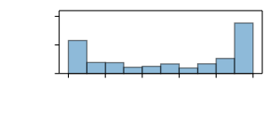
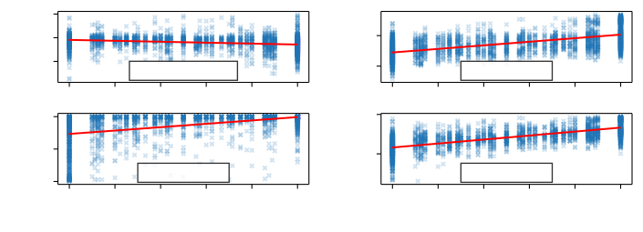

# Using Speech Foundational Models in Loss Functions for Hearing Aid Speech Enhancement ^(†)^(†)thanks: This work was supported by the Centre for Doctoral Training in Speech and Language Technologies (SLT) and their Applications funded by UK Research and Innovation \[EP/S023062/1\] and EPSRC Clarity Project \[EP/S031448/1\]. This work was also supported by WS Audiology and Toshiba.

Robert Sutherland, George Close, Thomas Hain, Stefan Goetze, and Jon
Barker Speech and Hearing (SPandH) group, Department of Computer
Science, The University of Sheffield, Sheffield, UK  
{rwhsutherland1, glclose1, t.hain, s.goetze, j.p.barker}@sheffield.ac.uk

###### Abstract

Machine learning techniques are an active area of research for speech
enhancement for hearing aids, with one particular focus on improving the
intelligibility of a noisy speech signal. Recent work has shown that
feature encodings from self-supervised speech representation models can
effectively capture speech intelligibility. In this work, it is shown
that the distance between self-supervised speech representations of
clean and noisy speech correlates more strongly with human
intelligibility ratings than other signal-based metrics. Experiments
show that training a speech enhancement model using this distance as
part of a loss function improves the performance over using an SNR-based
loss function, demonstrated by an increase in HASPI, STOI, PESQ and
SI-SNR scores. This method takes inference of a high parameter count
model only at training time, meaning the speech enhancement model can
remain smaller, as is required for hearing aids.

###### Index Terms:

self-supervised speech representations, speech enhancement, loss
functions

## I Introduction

Hearing impairment is a widespread problem
worldwide \[[1](https://arxiv.org/html/2407.13333v1#bib.bib1)\] and
especially in countries with ageing
populations \[[2](https://arxiv.org/html/2407.13333v1#bib.bib2),
[3](https://arxiv.org/html/2407.13333v1#bib.bib3)\]. There is an
emerging interest in the development of hearing aid systems which
incorporate neural network
components \[[4](https://arxiv.org/html/2407.13333v1#bib.bib4),
[5](https://arxiv.org/html/2407.13333v1#bib.bib5),
[6](https://arxiv.org/html/2407.13333v1#bib.bib6),
[7](https://arxiv.org/html/2407.13333v1#bib.bib7),
[8](https://arxiv.org/html/2407.13333v1#bib.bib8),
[9](https://arxiv.org/html/2407.13333v1#bib.bib9)\]. The particular
focus of this development has been on increasing the intelligibility of
speech in the processed input audio. A core challenge in this area is
that neural hearing aid models must be computationally efficient to fit
within hardware constraints. Standard loss functions used to train
neural network-based hearing aid systems operate at a signal level,
e.g., based on signal-to-noise ratio (SNR), scale-invariant
signal-to-noise ratio (SI-SNR), or short-term objective intelligibility
(STOI) \[[10](https://arxiv.org/html/2407.13333v1#bib.bib10),
[11](https://arxiv.org/html/2407.13333v1#bib.bib11),
[12](https://arxiv.org/html/2407.13333v1#bib.bib12)\]. However, recent
work has shown that representations sourced from large speech
foundational models (i.e., with high parameter count), such as Whisper
\[[13](https://arxiv.org/html/2407.13333v1#bib.bib13)\] or WavLM
\[[14](https://arxiv.org/html/2407.13333v1#bib.bib14)\], are able to
well capture information about the intelligibility of the signal
\[[15](https://arxiv.org/html/2407.13333v1#bib.bib15),
[16](https://arxiv.org/html/2407.13333v1#bib.bib16),
[17](https://arxiv.org/html/2407.13333v1#bib.bib17)\]. Previous work has
explored how the distances between the self-supervised speech
representation (SSSR) representations of clean speech and noisy speech
correlate with speech quality metrics and how they can be used in loss
functions \[[18](https://arxiv.org/html/2407.13333v1#bib.bib18)\] for
single-channel noise reduction. However, the correlation with speech
intelligibility metrics and application of SSSR based loss functions for
hearing aid systems have not yet been well explored in the existing
literature.

This paper investigates how distances between WavLM representations
correlate with speech intelligibility (SI) and speech quality (SQ)
metrics like the hearing aid speech perception index
(HASPI) \[[19](https://arxiv.org/html/2407.13333v1#bib.bib19)\],
STOI \[[12](https://arxiv.org/html/2407.13333v1#bib.bib12)\], perceptual
evaluation of speech quality
(PESQ) \[[20](https://arxiv.org/html/2407.13333v1#bib.bib20)\], and
others, as well with real-world human speech intelligibility (HSI)
ratings from listening tests, released as part of the 2^(nd) Clarity
Prediction Challenge (CPC2)
\[[21](https://arxiv.org/html/2407.13333v1#bib.bib21)\]. Further, the
distances of the WavLM representations are evaluated for their
usefulness as loss functions to train the denoising component of a
neural hearing aid system. The proposed method shows an increase in
terms of perceptually motivated enhancement metrics versus a traditional
baseline \[[22](https://arxiv.org/html/2407.13333v1#bib.bib22)\], while
maintaining the strict model parameter count, speed and memory
consumption constraints typical of a hearing aid system. This is
achieved by taking inference of the much larger WavLM model only during
model training.

The structure of the paper is as follows.
[Section II](https://arxiv.org/html/2407.13333v1#S2) introduces the use
of WavLM in this work and provides some background of the prior work
which uses SSSRs for speech enhancement.
[Section III](https://arxiv.org/html/2407.13333v1#S3) defines a distance
measure using the WavLM representations of signals, and investigates how
this correlates with human intelligibility labels and perception-based
metrics. [Section IV](https://arxiv.org/html/2407.13333v1#S4) describes
the system which is subsequently used for the signal enhancement
experiments in [Section V](https://arxiv.org/html/2407.13333v1#S5),
using the WavLM-based distance metric as a loss function. Results are
presented in [Section VI](https://arxiv.org/html/2407.13333v1#S6) and
[Section VII](https://arxiv.org/html/2407.13333v1#S7) concludes the
paper.

## II Self-Supervised Speech Representations for Speech Enhancement

\Acp

SSSR such as wav2vec
\[[23](https://arxiv.org/html/2407.13333v1#bib.bib23)\] and HuBERT
\[[24](https://arxiv.org/html/2407.13333v1#bib.bib24)\] were initially
designed and evaluated as front-end feature extractors for down-stream
automatic speech recognition (ASR) tasks. More recently, WavLM was
developed to support a broader set of speech processing tasks,
including, e.g., speaker verification, or speaker diarization, which it
achieves by not only learning masked speech prediction, but also by
learning speech denoising during training
\[[14](https://arxiv.org/html/2407.13333v1#bib.bib14)\].

Recent work has shown that WavLM and other SSSRs are powerful feature
representations for
quality \[[25](https://arxiv.org/html/2407.13333v1#bib.bib25)\] and
intelligibility
prediction \[[15](https://arxiv.org/html/2407.13333v1#bib.bib15)\].
Furthermore, the ability of SSSR-derived representations to encode
quality and intelligibility-related information has been exploited in
loss functions for the training of speech enhancement
systems \[[18](https://arxiv.org/html/2407.13333v1#bib.bib18),
[26](https://arxiv.org/html/2407.13333v1#bib.bib26)\], showing improved
performance in comparison to traditional loss functions for speech
enhancement.


Figure 1: Representations extracted from WavLM model stages.

WavLM is a neural network with two distinct stages as shown in
[Figure 1](https://arxiv.org/html/2407.13333v1#S2.F1): a convolutional
neural network (CNN) based encoder $`\mathcal{W}_{FE}`$ and a
Transformer \[[27](https://arxiv.org/html/2407.13333v1#bib.bib27)\]
based output stage $`\mathcal{W}_{OL}`$. The input to the encoder
$`\mathcal{W}_{FE}`$ is a time-domain signal $`s`$ and its output
representation $`\mathbf{S}_{FE}`$ has a dimension $`F_{FE} \times T`$
with encoder output feature dimension $`F_{FE} = 512`$ for
WavLM \[[14](https://arxiv.org/html/2407.13333v1#bib.bib14)\] and $`T`$
representing the variable number of frames depending on the length of
the input audio $`s`$. $`\mathbf{S}_{FE}`$ is the input to the
Transformer-based WavLM decoder stage $`\mathcal{W}_{OL}`$ which returns
a final output representation $`\mathbf{S}_{OL}`$ with dimensions
$`F_{OL} \times T`$. For WavLM the output layer feature dimension is
$`F_{OL} = 768`$ \[[14](https://arxiv.org/html/2407.13333v1#bib.bib14)\].
Based on findings from previous
work \[[18](https://arxiv.org/html/2407.13333v1#bib.bib18),
[26](https://arxiv.org/html/2407.13333v1#bib.bib26)\], only the encoder
representation $`\mathbf{S}_{FE}`$ is used in the following. In this
work, the WavLM
Base¹¹1[https://huggingface.co/microsoft/wavlm-base](https://huggingface.co/microsoft/wavlm-base)
model trained on the Librispeech $`960`$ hour
dataset \[[28](https://arxiv.org/html/2407.13333v1#bib.bib28)\] is used,
which has $`94.7`$ million parameters.

## III WavLM Representation Distances

Initially, the distance between WavLM encoder representations of clean
and enhanced speech signals is explored, with a loss function defined as

```math
{{\mathcal{L}_{WLM}\left( s,\hat{s} \right)} = {\frac{1}{TF_{FE}}{\sum\limits_{t = 1}^{T}{\sum\limits_{f = 1}^{F_{FE}}\left( {{\mathbf{S}_{FE}{\lbrack t,f\rbrack}} - {{\hat{\mathbf{S}}}_{FE}{\lbrack t,f\rbrack}}} \right)^{2}}}}}, \tag{1}
```

where $`\mathbf{S}_{FE} = {\mathcal{W}_{FE}{(s)}}`$ and
$`{\hat{\mathbf{S}}}_{FE} = {\mathcal{W}_{FE}{(\hat{s})}}`$ are the
representations of the target and estimated signal, respectively. Please
note that frame (time) index $`t`$ and feature index $`f`$ are omitted
for brevity at most places in this paper.

This distance measure is compared with the signal-to-noise ratio (SNR)
based loss function

```math
{{\mathcal{L}_{SNR}\left( s,\hat{s} \right)} = {- {10{\log_{10}\left( \frac{{\| s\|}^{2}}{{\|{s - \hat{s}}\|}^{2} + {\tau{\| s\|}^{2}}} \right)}}}}, \tag{2}
```

which is commonly used for training the speech enhancement component of
hearing aid systems, with $`\tau = 10^{- {{SNR}_{\max}/10}} = 0.001`$
(where $`{SNR}_{\max} = {30\text{dB}}`$) to prevent sufficiently
denoised signals from dominating the training, as described in
\[[29](https://arxiv.org/html/2407.13333v1#bib.bib29)\].

In the following, an analysis of how $`\mathcal{L}_{SNR}`$ and
$`\mathcal{L}_{WLM}`$ correlate with human intelligibility labels, as
well as other perception-based metrics will be conducted.

### III-A The $`2^{nd}`$ Clarity Prediction Challenge (CPC2) Dataset

The CPC2 dataset is used to investigate the relationship between
$`\mathcal{L}_{WLM}`$ in
([1](https://arxiv.org/html/2407.13333v1#S3.E1)) and
$`\mathcal{L}_{SNR}`$ in
([2](https://arxiv.org/html/2407.13333v1#S3.E2)), and existing speech
metrics and HSI labels. The task of CPC2 is to predict the
intelligibility of a signal for listeners with hearing impairment.

The main signal assessed in CPC2 is the binaural output signal for left
and right channels
$`\hat{\mathbf{s}} = {\lbrack{\hat{s}}_{l},{\hat{s}}_{r}\rbrack} = {\mathcal{M}(\mathbf{x})}`$,
processed by a hearing aid (HA) $`\mathcal{M}{( \cdot )}`$ with
$`6`$-channel noisy input signal $`\mathbf{x}`$ (for $`3`$ microphones
in each (left and right) HA), containing a clean speech signal
$`\mathbf{s}`$. The samples in the CPC2 dataset include an enhanced
signal $`\hat{\mathbf{s}}`$, a target signal $`\mathbf{s}`$, and a HSI
label, which is the proportion of words that a hearing-impaired listener
was able to identify in $`\hat{\mathbf{s}}`$, as well as the audiogram
of the respective
listener \[[21](https://arxiv.org/html/2407.13333v1#bib.bib21)\]. The
first training split is used, which contains $`2779`$ samples; the
distribution of these samples is shown in
[Figure 2](https://arxiv.org/html/2407.13333v1#S3.F2). For each sample
in one of the training splits, $`\mathcal{L}_{WLM}`$ and
$`\mathcal{L}_{SNR}`$ were calculated as in
([1](https://arxiv.org/html/2407.13333v1#S3.E1)) and
([2](https://arxiv.org/html/2407.13333v1#S3.E2)), respectively.



Figure 2: Distribution of human intelligibility labels in the CPC2 train
set

### III-B Correlation Analysis

[Table I](https://arxiv.org/html/2407.13333v1#S3.T1) shows Pearson
correlations between HSI labels, $`- \mathcal{L}_{SNR}`$,
$`- \mathcal{L}_{WLM}`$, SI-SNR, HASPI, STOI, and PESQ, with
scatter-plots visualising some of the correlations with human
intelligibility labels in
[Figure 3](https://arxiv.org/html/2407.13333v1#S3.F3). Negative values
of $`\mathcal{L}_{SNR}`$ and $`\mathcal{L}_{WLM}`$ are used so that
positive correlations are expected for all rows and columns. For each
objective metric, values for each (left and right) channel are computed
and the better score is taken.

|                         |       |                        |                        |       |       |       |       |
| ----------------------- | ----- | ---------------------- | ---------------------- | ----- | ----- | ----- | ----- |
|                         |       | Losses                 |                        | SI-   |       |       |       |
| Scores                  | HSI   | -$`\mathcal{L}_{WLM}`$ | -$`\mathcal{L}_{SNR}`$ | SNR   | HASPI | STOI  | PESQ  |
| HSI                     | 1.00  | 0.59                   | -0.26                  | 0.02  | 0.47  | 0.71  | 0.47  |
| $`- \mathcal{L}_{WLM}`$ | 0.59  | 1.00                   | -0.29                  | -0.08 | 0.43  | 0.74  | 0.70  |
| $`- \mathcal{L}_{SNR}`$ | -0.26 | -0.29                  | 1.00                   | 0.22  | -0.16 | -0.26 | -0.31 |
| SI-SNR                  | 0.02  | -0.08                  | 0.22                   | 1.00  | 0.08  | 0.19  | -0.05 |
| HASPI                   | 0.47  | 0.43                   | -0.16                  | 0.08  | 1.00  | 0.62  | 0.27  |
| STOI                    | 0.71  | 0.74                   | -0.26                  | 0.19  | 0.62  | 1.00  | 0.64  |
| PESQ                    | 0.47  | 0.70                   | -0.31                  | -0.05 | 0.27  | 0.64  | 1.00  |

Table I: Pearson correlations $`r`$ between HSI, losses under test and
various speech metrics on the CPC2 dataset.



Figure 3: Correlations of $`- \mathcal{L}_{SNR}`$,
$`- \mathcal{L}_{WLM}`$, HASPI and STOI with the human intelligibility
labels for the CPC2 dataset.

One would expect that a higher SNR value (lower $`\mathcal{L}_{SNR}`$)
would indicate a higher intelligibility rating.
[Table I](https://arxiv.org/html/2407.13333v1#S3.T1) and the scatter
plot in [Figure 3](https://arxiv.org/html/2407.13333v1#S3.F3) (top left)
indicate the opposite; the signals with higher SNR did not necessarily
indicate that they would have higher intelligibility. This is likely to
be because the signals in the CPC2 dataset were not originally optimised
with an SNR loss and do not necessarily match the levels of the
references.

In contrast, $`\mathcal{L}_{WLM}`$ shows considerably stronger
correlation with human intelligibility shown in
[Figure 3](https://arxiv.org/html/2407.13333v1#S3.F3) (top right) and
the other metrics compared with $`\mathcal{L}_{SNR}`$. The particularly
strong correlation of $`\mathcal{L}_{WLM}`$ with PESQ and STOI in the
CPC2 data is consistent with other
datasets \[[18](https://arxiv.org/html/2407.13333v1#bib.bib18)\]. This
strength speaks to the suitability of $`\mathcal{L}_{WLM}`$ as a loss
function to train the denoising component of a hearing aid system;
training the denoising model to minimize this distance should by proxy
improve the performance in terms of these metrics.

Additionally, despite being the only metric considered which takes into
account the severity of a listener’s hearing loss i.e is specifically
designed to predict intelligibility scores for hearing impaired people,
HASPI shows a weaker correlation with human intelligibility labels when
compared with $`\mathcal{L}_{WLM}`$ and STOI and has a similar level of
correlation compared to PESQ, which is not aimed at assessing
intelligibility. This brings into question the usefulness of HASPI as a
metric. Alternatively, it indicates that the severity of hearing loss
does not actually factor massively into distribution of the human
intelligibility labels, which is consistent with the findings
in \[[15](https://arxiv.org/html/2407.13333v1#bib.bib15)\].

## IV Hearing Aid System

The hearing aid enhancement system trained in this work is an
MC-Conv-TasNet-based
system \[[22](https://arxiv.org/html/2407.13333v1#bib.bib22)\], which
performed best in the 1^(st) Clarity Enhancement Challenge (CEC1),
consisting of two independently trained systems (one for each ear).
Since modern hearing aids have multiple microphones, the system for each
ear will take a multi-channel input, and the system for each ear will
output a single channel.

Figure 4: Workflow of the hearing aid system. For a $`C`$-channel signal
$`\mathbf{x} = \left\lbrack x_{0},\ldots,x_{C} \right\rbrack`$, a
reference channel $`x_{0}`$ is input to the spectral encoder, while the
spatial encoder takes all $`C`$ channels as input.

This is a two-stage system as illustrated in
[Figure 4](https://arxiv.org/html/2407.13333v1#S4.F4), consisting of an
MC-Conv-TasNet denoising block $`\mathcal{M}_{D}`$
\[[30](https://arxiv.org/html/2407.13333v1#bib.bib30)\], followed by a
finite-impulse response (FIR) filter block $`\mathcal{M}_{A}`$ to
amplify the signal according to a specific listener’s audiogram
\[[31](https://arxiv.org/html/2407.13333v1#bib.bib31)\]. During
training, the output of $`\mathcal{M}_{A}`$ is passed into a
differentiable hearing loss simulation before the loss function is
applied.

The overall system consists of $`4`$ neural networks: a denoiser
$`\mathcal{M}_{D}`$ for each stereo channel, and an amplifier
$`\mathcal{M}_{A}`$ for each stereo channel. For each ear, the denoiser
$`\mathcal{M}_{D}`$ is trained first, then the parameters are frozen for
training of the amplifier $`\mathcal{M}_{A}`$.

### IV-A Denoiser $`\mathcal{M}_{D}`$

The structure of MC-Conv-TasNet is given in
[Figure 4](https://arxiv.org/html/2407.13333v1#S4.F4). This model
consists of a spectral encoder, a spatial encoder, a mask estimation
network, and a decoder. The spectral encoder is a $`1`$D convolutional
network which takes a single reference channel from the multi-channel
mixture and which has a kernel size $`L`$. The spatial encoder takes a
multi-channel signal $`\mathbf{x}`$ as input and operates as a $`2`$D
convolutional network over all channels; if $`C`$ denotes the number of
microphone channels, the kernel size of the spatial encoder is
$`C \times L`$ so that the number of frames of the spatial encoder is
the same as the number of frames of the spectral encoder. The encoder
outputs are concatenated as they are input to the mask estimator, which
is a temporal convolutional network
\[[32](https://arxiv.org/html/2407.13333v1#bib.bib32)\]. The mask is
multiplied element-wise with the spectral encoder output to give the
features of the estimated source. Finally, a decoder reconstructs a
single-channel waveform as an estimate for the target.

The configuration of $`\mathcal{M}_{D}`$ is exactly as described in
\[[22](https://arxiv.org/html/2407.13333v1#bib.bib22)\], where the
spectral and spatial encoders use $`256`$ and $`128`$ filters,
respectively, both with a frame length of $`L = 20`$ samples. The
$`1 \times 1`$ bottleneck convolutional block uses $`256`$ channels and
the convolutional blocks use $`512`$ channels. There are $`6`$
convolutional blocks, which have a kernel size of $`3`$ and dilation
factors of $`1,2,\ldots,32`$ and are repeated $`4`$ times. The input to
$`\mathcal{M}_{D}`$ is the time domain multi-channel noisy signal
$`\mathbf{x}`$ and the output is the denoised single channel audio
$`\hat{s}`$.

### IV-B Amplifier $`\mathcal{M}_{A}`$

The FIR filter amplification module
\[[31](https://arxiv.org/html/2407.13333v1#bib.bib31)\],
$`\mathcal{M}_{A}`$, is a simple, linear amplification model designed to
compensate for hearing loss in each ear without introducing distortions
and artefacts.

As with the denoiser, two independent amplification models are trained
(one for each ear), taking the $`22.05`$kHz, single channel output of
the denoising module $`\mathcal{M}_{D}`$. The result is upsampled to
$`44.1`$kHz, clipped to the range $`\lbrack{- 1},1\rbrack`$, and fed
into the differentiable hearing loss simulator $`\mathcal{M}_{HL}`$.
Upsampling is required as the hearing loss simulator used operates at
$`44.1`$kHz.

## V Experiment Setup

### V-A Clarity Enhancement Challenge Datasets

Two datasets are used for training the system: the CEC1 dataset, for
which the baseline system was designed, and the $`2^{nd}`$ Clarity
Enhancement Challenge (CEC2) dataset, which is a more challenging
dataset for the same task. Both of these datasets consist of a train set
containing $`6000`$ samples, a validation set of $`2500`$ samples, and
an evaluation set of $`1500`$ samples. Each sample is a $`6`$-channel,
noisy, reverberant mixture $`\mathbf{x}`$, with a target, anechoic
speech signal $`\mathbf{s} = \left\lbrack s_{l},s_{r} \right\rbrack`$
for each ear (left and right).

For CEC1, there is only one interfering source in the noisy mixture. In
half of the samples, this is a second speech signal sourced from
\[[33](https://arxiv.org/html/2407.13333v1#bib.bib33)\], and in the
other half, the interfering signals are domestic noise sourced from
\[[34](https://arxiv.org/html/2407.13333v1#bib.bib34)\]. For CEC2, there
are $`2`$ or $`3`$ interfering sources in each noisy mixture, which
could be competing speakers, music, or domestic noise. All data has a
sampling frequency of $`44.1`$kHz.

### V-B Training Setup

In this task, maintaining the signal level is important for the
downstream amplification, which is required for hearing aid users. With
this in mind, we propose a joint loss function

```math
{{\mathcal{L}_{Joint}\left( s,\hat{s} \right)} = {{\mathcal{L}_{SNR}\left( s,\hat{s} \right)} + {\mathcal{L}_{WLM}\left( s,\hat{s} \right)}}}, \tag{3}
```

where $`\mathcal{L}_{SNR}`$ is used to maintain the signal level of the
reference.

In early experiments, it was found that $`\mathcal{L}_{SNR}`$ and
$`\mathcal{L}_{WLM}`$ optimise with different learning rates, with
$`\mathcal{L}_{SNR}`$ preferring a greater learning rate. Two different
training strategies are used, which vary the learning rate over the
training process.

All modules were trained using the Adam optimiser
\[[35](https://arxiv.org/html/2407.13333v1#bib.bib35)\]. The learning
rate is initially set to $`10^{- 3}`$, and gradient clipping is applied
with a maximum L$`2`$-norm of $`5`$. Three training settings were used:

1.  1.  _Baseline_ - The denoiser $`\mathcal{M}_{D}`$ was trained for
        $`200`$ epochs using the SNR loss function $`\mathcal{L}_{SNR}`$
        ([2](https://arxiv.org/html/2407.13333v1#S3.E2)).
2.  2.  _WavLM Encoder loss fine-tuning_ - $`\mathcal{M}_{D}`$ is trained
        for $`100`$ epochs using $`\mathcal{L}_{SNR}`$
        ([2](https://arxiv.org/html/2407.13333v1#S3.E2)) followed by $`100`$
        epochs of training using $`\mathcal{L}_{Joint}`$
        ([3](https://arxiv.org/html/2407.13333v1#S5.E3)). During the
        fine-tuning stage, the learning rate is set to $`10^{- 4}`$.
3.  3.  _Joint Loss with learning rate scheduling_ - $`\mathcal{M}_{D}`$ is
        trained using the joint loss function $`\mathcal{L}_{Joint}`$
        ([3](https://arxiv.org/html/2407.13333v1#S5.E3)) for $`200`$ epochs.
        A scheduled learning rate change inspired
        by \[[27](https://arxiv.org/html/2407.13333v1#bib.bib27)\] is used,
        with the learning rate linearly increasing for the first few
        training steps, and then with a learning rate decay over the
        remaining epochs.

Models for each (left and right) ear are trained separately; both sides
take all $`6`$ channels of input (downsampled to $`22.05`$kHz), and the
single corresponding left/right channel of the target audio is as the
reference.

## VI Results

[Table II](https://arxiv.org/html/2407.13333v1#S6.T2) shows the
evaluation metrics for the output of the denoiser $`\mathcal{M}_{D}`$
for the baseline $`\mathcal{L}_{SNR}`$ and the proposed
$`\mathcal{L}_{WLM}`$ for both the CEC1 and CEC2 test sets. On CEC1, the
system trained with the proposed loss function using a scheduled
learning rate shows a significant improvement on HASPI, STOI, PESQ and
SI-SNR scores over the $`\mathcal{L}_{SNR}`$ baseline, while the
proposed fine-tuning approach performs similarly to the baseline.

On the more challenging CEC2 dataset, there is an improvement in HASPI
and STOI for the proposed loss function using a scheduled learning rate,
but the fine-tuning approach performs worse than the baseline. All
systems give slightly lower PESQ scores on this dataset versus the noisy
input; this is interesting given the strong correlation between these
two metrics shown in
[Table I](https://arxiv.org/html/2407.13333v1#S3.T1). It should,
however, be noted that the main task of CEC is increasing
intelligibility.

|         |                               |       |      |      |            |            |
| ------- | ----------------------------- | ----- | ---- | ---- | ---------- | ---------- |
| Dataset | Model                         | HASPI | STOI | PESQ | $`\Delta`$ | $`\Delta`$ |
|         |                               |       |      |      | SI-SNR     | fwSNR      |
| CEC1    | $`\mathcal{L}_{SNR}`$         | 0.90  | 0.76 | 1.19 | 7.92       | 3.72       |
|         | $`\mathcal{L}_{WLM}`$, FT     | 0.90  | 0.76 | 1.20 | 8.03       | 3.42       |
|         | $`\mathcal{L}_{WLM}`$, Sched. | 0.91  | 0.78 | 1.23 | 8.45       | 1.65       |
| CEC2    | $`\mathcal{L}_{SNR}`$         | 0.72  | 0.67 | 1.11 | 10.09      | 0.60       |
|         | $`\mathcal{L}_{WLM}`$, FT     | 0.72  | 0.66 | 1.10 | 9.98       | 0.57       |
|         | $`\mathcal{L}_{WLM}`$, Sched. | 0.75  | 0.68 | 1.12 | 10.33      | 0.78       |

Table II: Performance of the denoiser $`\mathcal{M}_{D}`$.

On CEC1, the HASPI improvement is only small, though the scores for all
systems are very high for this metric. On CEC2, the improvement over the
baseline is larger, and on this more challenging dataset, there is a
perceptual improvement in these signals for listeners with hearing
impairment.

## VII Conclusion

In this work, it is shown that encoder representations obtained from
WavLM can effectively capture the intelligibility of a speech signal.
This is shown by implementing a simple distance function between
representations of noisy and clean speech signals and correlating these
distances with human intelligibility labels and perceptually motivated
metrics for both intelligibility and quality. Further, this work
evaluates the use of this distance in a loss function for training the
denoising network of a hearing aid system. This new training setting
shows improved performance over a system trained with a purely
signal-based loss function, with improvements on HASPI, STOI, PESQ, and
SI-SNR.

## References

- \[1\] A. C. Davis and H. J. Hoffman, “Hearing loss: Rising Prevalence
  and Impact,” Bulletin of the World Health Organization, vol. 97, no.
  10, pp. 646, 2019.
- \[2\] J. Rennies, S. Goetze, and J.-E. Appell, “Personalized Acoustic
  Interfaces for Human-Computer Interaction,” in Human-Centered Design
  of E-Health Technologies: Concepts, Methods and Applications,
  M. Ziefle and C.Röcker, Eds., chapter 8, pp. 180–207. IGI
  Global, 2011.
- \[3\] N. Park, “Population estimates for the UK, England and Wales,
  Scotland and Northern Ireland, provisional: mid-2019,” Hampshire:
  Office for National Statistics, 2020.
- \[4\] S. N. Graetzer, J. Barker, T. J. Cox, M. Akeroyd, J. F. Culling,
  G. Naylor, E. Porter, and R. Viveros Munoz, “Clarity-2021 challenges :
  Machine learning challenges for advancing hearing aid processing,”
  Proceedings of the Annual Conference of the International Speech
  Communication Association, INTERSPEECH, vol. 2, Sept. 2021.
- \[5\] S. Cornell, Z.-Q. Wang, Y. Masuyama, S. Watanabe, M. Pariente,
  and N. Ono, “Multi-channel target speaker extraction with refinement:
  The wavlab submission to the second clarity enhancement challenge,” in
  Proc. The 3rd Clarity Workshop on Machine Learning Challenges for
  Hearing Aids, Dec. 2022.
- \[6\] P. U. Diehl, Y. Singer, H. Zilly, U. Schönfeld,
  P. Meyer-Rachner, M. Berry, H. Sprekeler, E. Sprengel, A. Pudszuhn,
  and V. M. Hofmann, “Restoring speech intelligibility for hearing aid
  users with deep learning,” Scientific Reports, vol. 13, no.
  2719, 2023.
- \[7\] C. Ouyang, K. Fei, H. Zhou, C. Lu, and L. Li, “A multi-stage
  low-latency enhancement system for hearing aids,” in Proc. ICASSP23,
  2023, pp. 1–2.
- \[8\] H. Schröter, T. Rosenkranz, A.-N. Escalante-B, and A. Maier,
  “Low latency speech enhancement for hearing aids using deep
  filtering,” IEEE/ACM Transactions on Audio, Speech, and Language
  Processing, vol. 30, pp. 2716–2728, 2022.
- \[9\] I. Fedorov, M. Stamenovic, C. Jensen, L.-C. Yang, A. Mandell,
  Y. Gan, M. Mattina, and P. N. Whatmough, “TinyLSTMs: Efficient Neural
  Speech Enhancement for Hearing Aids,” in Proc. Interspeech 2020, 2020,
  pp. 4054–4058.
- \[10\] S. Braun and I. Tashev, “A consolidated view of loss functions
  for supervised deep learning-based speech enhancement,” in Proc. 44th
  Int. Conf. on Telecommunications and Signal Processing (TSP), 2021.
- \[11\] J. L. Roux, S. Wisdom, H. Erdogan, and J. R. Hershey, “Sdr –
  half-baked or well done?,” in ICASSP 2019 - 2019 IEEE International
  Conference on Acoustics, Speech and Signal Processing (ICASSP), 2019,
  pp. 626–630.
- \[12\] C. H. Taal, R. C. Hendriks, R. Heusdens, and J. Jensen, “An
  Algorithm for Intelligibility Prediction of Time–Frequency Weighted
  Noisy Speech,” IEEE Transactions on Audio, Speech, and Language
  Processing, vol. 19, no. 7, pp. 2125–2136, Sept. 2011.
- \[13\] A. Radford, J. W. Kim, T. Xu, G. Brockman, C. McLeavey, and
  I. Sutskever, “Robust Speech Recognition via Large-Scale Weak
  Supervision,” Dec. 2022.
- \[14\] S. Chen, C. Wang, Z. Chen, Y. Wu, S. Liu, Z. Chen, J. Li,
  N. Kanda, T. Yoshioka, X. Xiao, J. Wu, L. Zhou, S. Ren, Y. Qian,
  Y. Qian, J. Wu, M. Zeng, X. Yu, and F. Wei, “WavLM: Large-Scale
  Self-Supervised Pre-Training for Full Stack Speech Processing,” IEEE
  Journal of Selected Topics in Signal Processing, vol. 16, no. 6, pp.
  1505–1518, Oct. 2022.
- \[15\] G. Close, T. Hain, and S. Goetze, “Non Intrusive
  Intelligibility Predictor for Hearing Impaired Individuals using Self
  Supervised Speech Representations,” in Proc. Workshop on Speech
  Foundation Models and their Performance Benchmarks (SPARKS), ASRU
  satelite workshop, Taipei, Taiwan, 2023.
- \[16\] S. Cuervo and R. Marxer, “Speech foundation models on
  intelligibility prediction for hearing-impaired listeners,” in
  Proc. ICASSP24, 2024.
- \[17\] R. Mogridge, G. Close, R. Sutherland, T. Hain, J. Barker,
  S. Goetze, and A. Ragni, “Non-intrusive speech intelligibility
  prediction for hearing-impaired users using intermediate asr features
  and human memory models,” in Proc. ICASSP 2024, 2024.
- \[18\] G. Close, W. Ravenscroft, T. Hain, and S. Goetze, “Perceive and
  predict: Self-supervised speech representation based loss functions
  for speech enhancement,” in Proc. ICASSP23, June 2023, pp. 1–5.
- \[19\] J. M. Kates and K. H. Arehart, “The hearing-aid speech
  perception index (haspi) version 2,” Speech Communication, vol. 131,
  pp. 35–46, 2021.
- \[20\] A. Rix, J. Beerends, M. Hollier, and A. Hekstra, “Perceptual
  evaluation of speech quality (PESQ)-a new method for speech quality
  assessment of telephone networks and codecs,” in ICASSP 2001, 2001,
  vol. 2, pp. 749–752 vol.2.
- \[21\] J. Barker, M. Akeroyd, W. Bailey, T. J. Cox, J. F. Culling,
  J. Firth, S. Graetzer, and G. Naylor, “The 2nd Clarity Prediction
  Challenge: A machine learning challenge for hearing aid
  intelligibility prediction,” in ICASSP, 2024.
- \[22\] Z. Tu, J. Zhang, N. Ma, and J. Barker, “A Two-Stage End-to-End
  System for Speech-in-Noise Hearing Aid Processing,” in Proc. The
  Clarity Workshop on Machine Learning Challenges for Hearing Aids
  (Clarity-2021), Sept. 2021.
- \[23\] S. Schneider, A. Baevski, R. Collobert, and M. Auli, “wav2vec:
  Unsupervised pre-training for speech recognition,” in Interspeech.
  ISCA, 2019.
- \[24\] W.-N. Hsu, B. Bolte, Y.-H. H. Tsai, K. Lakhotia,
  R. Salakhutdinov, and A. Mohamed, “Hubert: Self-supervised speech
  representation learning by masked prediction of hidden units,”
  IEEE/ACM Transactions on Audio, Speech, and Language Processing, vol.
  29, pp. 3451–3460, 2021.
- \[25\] G. Close, W. Ravenscroft, T. Hain, and S. Goetze,
  “Multi-CMGAN+/+: Leveraging Multi-Objective Speech Quality Metric
  Prediction for Speech Enhancement,” in Proc. ICASSP24, 2024.
- \[26\] G. Close, T. Hain, and S. Goetze, “The Effect of Spoken
  Language on Speech Enhancement using Self-Supervised Speech
  Representation Loss Functions,” in Proc. IEEE Workshop on Applications
  of Signal Processing to Audio and Acoustics (WASPAA), Oct. 2023.
- \[27\] A. Vaswani, N. Shazeer, N. Parmar, J. Uszkoreit, L. Jones,
  A. N. Gomez, L. u. Kaiser, and I. Polosukhin, “Attention is all you
  need,” in Advances in Neural Information Processing Systems, I. Guyon,
  U. V. Luxburg, S. Bengio, H. Wallach, R. Fergus, S. Vishwanathan, and
  R. Garnett, Eds., 2017, vol. 30.
- \[28\] V. Panayotov, G. Chen, D. Povey, and S. Khudanpur,
  “Librispeech: An asr corpus based on public domain audio books,” in
  Proc. ICASSP 15, 2015, pp. 5206–5210.
- \[29\] S. Wisdom, E. Tzinis, H. Erdogan, R. Weiss, K. Wilson, and
  J. Hershey, “Unsupervised Sound Separation Using Mixture Invariant
  Training,” in Advances in Neural Information Processing Systems, 2020,
  vol. 33, pp. 3846–3857.
- \[30\] J. Zhang, C. Zorilă, R. Doddipatla, and J. Barker, “On
  End-to-end Multi-channel Time Domain Speech Separation in Reverberant
  Environments,” in Proc. ICASSP20, May 2020, pp. 6389–6393.
- \[31\] Z. Tu, N. Ma, and J. Barker, “Optimising Hearing Aid Fittings
  for Speech in Noise with a Differentiable Hearing Loss Model,” in
  Proc. Interspeech 2021, 2021, pp. 691–695.
- \[32\] C. Lea, R. Vidal, A. Reiter, and G. D. Hager, “Temporal
  convolutional networks: A unified approach to action segmentation,” in
  Computer Vision – ECCV 2016 Workshops, G. Hua and H. Jégou, Eds.,
  Cham, 2016, pp. 47–54, Springer International Publishing.
- \[33\] I. Demirsahin, O. Kjartansson, A. Gutkin, and C. Rivera,
  “Open-source multi-speaker corpora of the English accents in the
  British isles,” in Proceedings of the Twelfth Language Resources and
  Evaluation Conference, N. Calzolari, F. Béchet, P. Blache, K. Choukri,
  C. Cieri, T. Declerck, S. Goggi, H. Isahara, B. Maegaard, J. Mariani,
  H. Mazo, A. Moreno, J. Odijk, and S. Piperidis, Eds., Marseille,
  France, May 2020, pp. 6532–6541, European Language Resources
  Association.
- \[34\] F. Font, G. Roma, and X. Serra, “Freesound technical demo,” in
  Proc. 21st ACM International Conference on Multimedia, 2013, p.
  411–412.
- \[35\] D. P. Kingma and J. Ba, “Adam: A Method for Stochastic
  Optimization,” in 3rd International Conference for Learning
  Representations, 2015, 2017, number arXiv:1412.6980.
