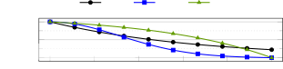
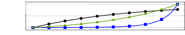
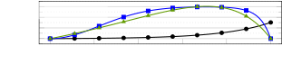
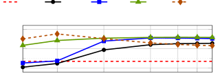
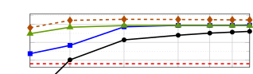
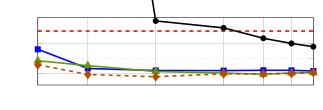

# Schrödinger Bridge for Generative Speech Enhancement

Ante Jukić    Roman Korostik    Jagadeesh Balam    Boris Ginsburg

###### Abstract

This paper proposes a generative speech enhancement model based on
Schrödinger bridge (SB). The proposed model is employing a tractable SB
to formulate a data-to-data process between the clean speech
distribution and the observed noisy speech distribution. The model is
trained with a data prediction loss, aiming to recover the
complex-valued clean speech coefficients, and an auxiliary time-domain
loss is used to improve training of the model. The effectiveness of the
proposed SB-based model is evaluated in two different speech enhancement
tasks: speech denoising and speech dereverberation. The experimental
results demonstrate that the proposed SB-based outperforms
diffusion-based models in terms of speech quality metrics and ASR
performance, e.g., resulting in relative word error rate reduction of
20% for denoising and 6% for dereverberation compared to the best
baseline model. The proposed model also demonstrates improved
efficiency, achieving better quality than the baselines for the same
number of sampling steps and with a reduced computational cost.

###### keywords

generative speech enhancement, speech denoising, speech dereverberation,
Schrödinger bridge

^(†)^(†)address: NVIDIA, USA^(†)^(†)email: {ajukic, rkorostik, jbalam,
bginsburg}@nvidia.com

## 1 Introduction

Recordings of speech signals are frequently corrupted by environmental
noise, undesired sounds and room reverberation. The undesired signal
components may impair the quality or intelligibility for human or
machine listeners \[1, 2\]. The goal of speech enhancement (SE) in such
scenarios is to recover the clean speech signal from a corrupted
recording.

Typically, SE methods exploit statistical properties of the desired
speech signal and the undesired disturbance signal. Classical
model-based SE methods rely on a priori knowledge of the statistical
properties of either one or both signals \[3, 4\]. Data-driven SE
methods typically use machine learning (ML) models to learn signal
properties from training data \[5\]. ML-based SE can be broadly divided
into predictive and generative models. Predictive models aim to provide
an estimate of the clean signal from the noisy signal, e.g., using an ML
model to estimate real- or complex-valued spectral masks \[6, 7\],
coefficients \[8, 9\] or the time domain signal \[10\]. Generative
models aim to model the distribution of the clean signal given the noisy
signal, e.g., using variational autoencoders \[11, 12\] or generative
adversarial networks \[13\].

Recently, several diffusion-based generative models for SE have been
proposed \[14, 15, 16, 17, 18, 19, 20, 21, 22, 23\]. In general,
diffusion-based models are based on two processes between the clean
speech distribution and the noisy signal prior distribution \[24\]. The
forward process transforms the clean data into a known prior
distribution, and the reverse process starts from the prior distribution
and generates an estimate of the clean speech. A neural network model is
trained to guide the reverse process. In \[14\], spectrogram of the
noisy signal was used as a conditioner for the neural model, but only
additive Gaussian noise was considered. A conditional diffusion model
was proposed in \[15\] to handle non-Gaussian noise, with the diffusion
process conditioned on the noisy signal. An alternative diffusion
process in the short-time Fourier transform (STFT) domain was proposed
in \[17\], enabling generative training of the model without any
assumptions on the noise distribution. The proposed model operates on
complex-valued time-frequency (TF) coefficients, enabling the neural
model to learn the TF structure of the signal, and it has shown to be
effective for speech denoising and dereverberation \[19\]. However, the
model may produce hallucinations in adverse scenarios, resulting in
vocalization or breathing artifacts in extreme noise or during spech
absence \[17, 18\]. Prior mismatch of the diffusion process was reduced
using modified objectives in \[20, 22\] and a modified forward process
was used in \[23\]. A hybrid model, combining a predictive model and a
diffusion-based generative model, was proposed in \[18\] to improve the
robustness and reduce the computational complexity of the sampling
process.

This paper proposes a generative SE model based on Schrödinger bridge
(SB) \[25, 26, 27, 28, 29\]. As opposed to diffusion models, which
describe data-to-noise process, the SB describes a data-to-data process.
We consider a special case of SB where the clean speech and the noisy
signal are considered as paired data \[29\]. The contribution of this
work is threefold. Firstly, we propose a SE model based on Schrödinger
bridge, using a SB for paired data \[29\]. As opposed to the noisy prior
in diffusion-based models, the SB model results in a reverse process
starting exactly from the observed noisy data. Secondly, we propose to
combine the data prediction loss with an auxiliary loss to improve the
performance of the proposed SB model. Thirdly, we demonstrate the
effectiveness of the proposed approach in two different SE tasks: speech
denoising and speech dereverberation. The results in terms of speech
quality metrics and ASR performance demonstrate the effectiveness of the
proposed approach, outperforming diffusion-based SE models at a lower
computational complexity.

## 2 Background

Assuming a single static speech source, the signal captured by a single
microphone can be modeled as
$`\underline{\mathbf{y}}=\underline{\mathbf{h}}\ast\underline{\mathbf{x}}+\underline{\mathbf{n}}`$,
where $`\underline{\mathbf{h}}`$ is the time-domain impulse response,
$`\underline{\mathbf{x}}`$ is the clean speech signal, and
$`\underline{\mathbf{n}}`$ is the additive noise signal. The goal of SE
is to estimate the clean speech signal
$`\hat{\underline{\mathbf{x}}}\in\mathbb{R}^{N}`$ from the microphone
signal $`\underline{\mathbf{y}}\in\mathbb{R}^{N}`$. In the following,
$`\mathbf{x}=\mathcal{A}\left(\underline{\mathbf{x}}\right)\in\mathbb{C}^{D}`$
denotes a vector of complex-valued coefficients obtained from the
time-domain signal $`\underline{\mathbf{x}}`$. The analysis transform
$`\mathcal{A}`$ is a composition of the STFT transform $`\mathcal{F}`$
followed by scaling and compression, i.e.,
$`\mathcal{A}\left(\mathbf{x}\right)=b|\mathcal{F}\left(\underline{\mathbf{x}}\right)|^{a}\mathrm{e}^{j\angle{\mathcal{F}\left(\underline{\mathbf{x}}\right)}}`$,
with element-wise operations, magnitude $`|.|`$ and angle
$`\angle\left(.\right)`$, compression coefficient
$`a\in\left(0,1\right]`$, and scale coefficient $`b>0`$ \[17\].

### 2.1 Score-based diffusion for speech enhancement

Score-based diffusion models \[30, 31\] are based on a continuous-time
diffusion process defined by a forward stochastic differential equation
(SDE)

```math
{\,\mskip 0.0mu{}{\mathrm{d}\mathbf{x}_{t}}\mskip 0.0mu}=\mathbf{f}\left(\mathbf{x}_{t},t\right){\,\mskip 0.0mu{}{\mathrm{d}t}\mskip 0.0mu}+g(t){\,\mskip 0.0mu{}{\mathrm{d}\mathbf{w}_{t}}\mskip 0.0mu},\hskip 9.24994pt\mathbf{x}_{0}=\mathbf{x}, \tag{1}
```

where $`t\in\left[0,T\right]`$ is the current time for the process,
$`\mathbf{x}_{t}\in\mathbb{C}^{D}`$ is the state of the process,
$`\mathbf{f}`$ is a vector-valued drift, $`g`$ is a scalar-valued
diffusion coefficient, and $`\mathbf{w}_{t}`$ is the standard Wiener
process. The corresponding reverse SDE can be expressed as \[31\]

```math
{\,\mskip 0.0mu{}{\mathrm{d}\mathbf{x}_{t}}\mskip 0.0mu}=\left[\mathbf{f}\left(\mathbf{x}_{t},t\right)-g^{2}(t)\nabla\log p_{t}(\mathbf{x}_{t})\right]{\,\mskip 0.0mu{}{\mathrm{d}t}\mskip 0.0mu}+g(t){\,\mskip 0.0mu{}{\mathrm{d}\bar{\mathbf{w}}_{t}}\mskip 0.0mu}, \tag{2}
```

where $`\nabla\log p_{t}(\mathbf{x}_{t})`$ is the score function of the
marginal distribution $`p_{t}`$ at time $`t`$, and
$`\bar{\mathbf{w}}_{t}`$ is the reverse-time Wiener process. In \[16,
17\], the conditional relationship between the clean speech
$`\mathbf{x}`$ and the observed noisy speech $`\mathbf{y}`$ was directly
integrated in the SDE in (1) by using an affine drift term
$`\mathbf{f}\left(\mathbf{x}_{t},t\right)=\gamma\left(\mathbf{y}-\mathbf{x}_{t}\right)`$
with stiffness parameter $`\gamma`$. Furthermore, a variance-exploding
(VE) diffusion coefficient $`g(t)=\sqrt{c}k^{t}`$ was used with scale
$`c>0`$ and base $`k>0`$, resulting in an Ornstein-Uhlenbeck SDE with VE
(OUVE) \[17\]. The conditional transition distribution $`p_{t|0}`$ for
the state $`\mathbf{x}_{t}`$ conditioned on the clean speech
$`\mathbf{x}`$ and the noisy observation $`\mathbf{y}`$ can be expressed
as

```math
p_{t|0}=\mathcal{N}_{\mathbb{C}}\left(\bm{\mu}_{x}(t),\sigma_{x}^{2}(t)\mathbf{I}\right), \tag{3}
```

where $`\mathcal{N}_{\mathbb{C}}`$ is a circularly-symmetric complex
Gaussian distribution, and $`\mathbf{I}`$ is the identity matrix. The
mean $`\bm{\mu}_{x}(t)`$ and the variance $`\sigma_{x}^{2}(t)`$ in (3)
are defined as

```math
\bm{\mu}_{x}\left(t\right)=w_{x}(t)\mathbf{x}+w_{y}(t)\mathbf{y},\kern 4.62497pt\thickspace\sigma_{x}^{2}\left(t\right)=\frac{c\left(k^{2t}-\mathrm{e}^{-2\gamma t}\right)}{2\left(\gamma+\log k\right)}, \tag{4}
```

with $`w_{x}(t)=\mathrm{e}^{-\gamma t}`$,
$`w_{y}(t)=1-\mathrm{e}^{-\gamma t}`$ \[17\]. To enable inference using
the reverse SDE in (2), the score function
$`\nabla\log p_{t}(\mathbf{x}_{t})`$ is estimated using a neural network
$`s_{\bm{\theta}}`$ with parameters $`\bm{\theta}`$ \[31, 17\]. The
score function of the conditional transition distribution $`p_{t|0}`$
can be computed analytically \[30, 31\], resulting in a denoising score
matching training objective \[17\]

```math
\min_{\theta}\mathcal{E}_{\left(\mathbf{x},\mathbf{y}\right),t,\mathbf{z}}\big\|\sigma_{x}(t)s_{\bm{\theta}}\left(\mathbf{x}_{t},\mathbf{y},t\right)-\mathbf{z}\big\|_{2}^{2}, \tag{5}
```

where $`\mathcal{E}`$ is the mathematical expectation,
$`\mathbf{x}_{t}=\bm{\mu}_{x}(t)+\sigma_{x}(t)\mathbf{z}`$ and
$`\mathbf{z}\sim\mathcal{N}_{\mathbb{C}}\left(0,\mathbf{I}\right)`$,
with the mean and variance in (4). The parameters $`\bm{\theta}`$ of the
neural network are optimized by minimizing (5), with the expectation
approximated by sampling $`\left(\mathbf{x},\mathbf{y}\right)`$ from the
training dataset, $`t`$ uniformly from $`\left[t_{\text{min}},T\right]`$
with a small $`t_{\text{min}}`$ to avoid numerical issues, and
$`\mathbf{z}`$ from a standard Gaussian distribution \[30, 31, 17\].
Inference is performed using the reverse SDE in (2) by using the
estimated score
$`s_{\mathbf{\theta}}\left(\mathbf{x}_{t},\mathbf{y},t\right)`$ and
starting from an initial sample
$`\mathbf{x}_{T}\sim\mathcal{N}_{\mathbb{C}}\left(\mathbf{y},\sigma_{x}^{2}(T)\mathbf{I}\right)`$.

## 3 Proposed model

### 3.1 Schrödinger bridge

We consider a Schrödinger bridge \[25, 26, 27, 28, 29\] defined as
minimization of the Kullback-Leibler divergence $`D_{\text{KL}}`$
between a path measure $`p`$ and a reference path measure
$`p_{\text{ref}}`$, subject to the boundary conditions

```math
\min_{p\in\mathcal{P}_{\left[0,T\right]}}D_{\text{KL}}\left(p,p_{\mathrm{ref}}\right)\hskip 9.24994pt\text{s. t.}\hskip 9.24994ptp_{0}=p_{x},\thickspace p_{T}=p_{y}, \tag{6}
```

where $`\mathcal{P}_{\left[0,T\right]}`$ is the space of path measures
on $`\left[0,T\right]`$. Assuming $`p_{\mathrm{ref}}`$ is defined by the
reference forward SDE in (1), the SB is equivalent to a pair of
forward-backwards SDEs \[27, 29\]

wherescoresofΨ, ¯ Ψ
\_t$`aretheoptimalforwardandreversedrifts,andsomefunctionargumentsareomittedforbrevity.ThemarginaldistributionoftheSBstate`$x_t$`canbeexpressedas`$p_t
= ¯ Ψ \_t
Ψ_t$`~\cite[cite]{[\@@bibref{}{chen2021likelihood, chen_2023_sb}{}{}]}.WhilesolvingtheSBisingeneralintractable,closed-formsolutionsexistforspecialcases,e.g.,forGaussianboundaryconditions~\cite[cite]{[\@@bibref{}{bunne2023schrodinger, chen_2023_sb}{}{}]}.`$

### 3.2 Schrödinger bridge between paired data

Assume a linear drift
$`\mathbf{f}\left(\mathbf{x}_{t}\right)=f(t)\mathbf{x}_{t}`$ and
Gaussian boundary conditions
$`p_{0}=\mathcal{N}_{\mathbb{C}}\left(\mathbf{x},\epsilon_{0}^{2}\mathbf{I}\right)`$
and
$`p_{T}=\mathcal{N}_{\mathbb{C}}\left(\mathbf{y},\epsilon_{T}^{2}\mathbf{I}\right)`$
with
$`\epsilon_{T}=\mathrm{e}^{\int_{0}^{T}f(\tau){\,\mskip 0.0mu{}{\mathrm{d}\tau}\mskip 0.0mu}}\epsilon_{0}`$.
When $`\epsilon_{0}\to 0`$, the SB solution between clean data
$`\mathbf{x}`$ and noisy data $`\mathbf{y}`$ can be expressed as \[29\]

```math
\bar{\Psi}_{t}=\mathcal{N}_{\mathbb{C}}\left(\alpha_{t}\mathbf{x},\alpha_{t}^{2}\sigma_{t}^{2}\mathbf{I}\right),\hskip 9.24994pt\Psi_{t}=\mathcal{N}_{\mathbb{C}}\left(\bar{\alpha}_{t}\mathbf{y},\alpha_{t}^{2}\bar{\sigma}_{t}^{2}\mathbf{I}\right), \tag{7}
```

with parameters
$`\alpha_{t}=\mathrm{e}^{\int_{0}^{t}f(\tau){\,\mskip 0.0mu{}{\mathrm{d}\tau}\mskip 0.0mu}}`$,
$`\sigma_{t}^{2}=\int_{0}^{t}\frac{g^{2}(\tau)}{\alpha_{\tau}^{2}}{\,\mskip 0.0mu{}{\mathrm{d}\tau}\mskip 0.0mu}`$,
$`\bar{\alpha}_{t}=\alpha_{t}\alpha_{T}^{-1}`$ and
$`\bar{\sigma}_{t}^{2}=\sigma_{T}^{2}-\sigma_{t}^{2}`$. Therefore, the
marginal distribution $`p_{t}=\bar{\Psi}_{t}\Psi_{t}`$ is also a
Gaussian distribution which can be expressed as

```math
p_{t}=\mathcal{N}_{\mathbb{C}}\left(\bm{\mu}_{x}(t),\sigma_{x}^{2}(t)\mathbf{I}\right). \tag{8}
```

The mean $`\bm{\mu}_{x}(t)`$ and the variance $`\sigma_{x}^{2}(t)`$
in (8) are defined as

```math
\bm{\mu}_{x}(t)=w_{x}(t)\mathbf{x}+w_{y}(t)\mathbf{y},\hskip 9.24994pt\sigma_{x}^{2}(t)=\frac{\alpha_{t}^{2}\bar{\sigma}_{t}^{2}\sigma_{t}^{2}}{\sigma_{T}^{2}}, \tag{9}
```

with $`w_{x}(t)=\alpha_{t}\bar{\sigma}_{t}^{2}/\sigma_{T}^{2}`$, and
$`w_{y}(t)=\bar{\alpha}_{t}\sigma_{t}^{2}/\sigma_{T}^{2}`$ \[29\].

| Noise schedule     | Scaled VP                                                                               | VE                                                     |
| ------------------ | --------------------------------------------------------------------------------------- | ------------------------------------------------------ |
| $`f(t)`$           | $`-\frac{\beta_{0}+\left(\beta_{1}-\beta_{0}\right)t}{2}`$                              | 0                                                      |
| $`g^{2}(t)`$       | $`c\left[\beta_{0}+(\beta_{1}-\beta_{0})t\right]`$                                      | $`ck^{2t}`$                                            |
| $`\alpha_{t}`$     | $`\mathrm{e}^{-\frac{1}{2}\left(\beta_{0}t+\frac{\beta_{1}-\beta_{0}}{2}t^{2}\right)}`$ | 1                                                      |
| $`\sigma_{t}^{2}`$ | $`c\left(\mathrm{e}^{\beta_{0}t+\frac{\beta_{1}-\beta_{0}}{2}t^{2}}-1\right)`$          | $`\frac{c\left(k^{2t}-1\right)}{2\log\left(k\right)}`$ |

Table 1: Noise schedules used for the proposed SB-based SE.







Figure 1: State $`\mathbf{x}_{t}`$ mean $`\bm{\mu}_{x}(t)`$ and variance
$`\sigma_{x}^{2}(t)`$ for OUVE noise schedule in (4) and SB noise
schedules in (9), $`t\in\left[0,1\right]`$.

Several different noise schedules defined by $`f(t)`$ and $`g(t)`$ have
been considered in \[29\]. We use a variance preserving (VP) schedule
with an additional scaling parameter $`c`$ for the diffusion coefficient
to match the variance of the diffusion-based models. Similarly as in
Section 2.1, we also consider a VE diffusion coefficient with the drift
term set to zero. Table 1 includes parametrization of the VP and VE
noise schedules used here and expressions for their parameters
$`\alpha_{t}`$ and $`\sigma_{t}^{2}`$. Figure 1 shows the noise
schedules used in Section 4 in terms of mean and variance evolution over
time. As noted in \[23\], the OUVE schedule exhibits the mismatch of the
mean at the final time $`t=1`$. Due to the constraints in (6), the mean
for both SB schedules exactly interpolates between the clean data
$`\mathbf{x}`$ at $`t=0`$ and the noisy data $`\mathbf{y}`$ at $`t=1`$.
Note that the VE and VP schedules have a similar variance evolution, but
different mean evolution.

### 3.3 Model training

As noted in \[29\], the backbone neural model can be trained to match
the score $`\nabla\log p_{t}`$, to predict the noise using
$`\nabla\log\bar{\Psi}_{t}`$, or to predict the data $`\mathbf{x}`$. We
consider the data prediction loss, since it performed well in \[29\].
Additionally, we propose to use an auxiliary loss
$`\mathcal{L}_{\text{aux}}`$ to improve the estimate of the model,
resulting in the following training objective

```math
\min_{\theta}\mathcal{E}_{\left(\mathbf{x},\mathbf{y}\right),t,\mathbf{z}}\frac{1}{D}\lVert\hat{\mathbf{x}}_{\theta}(t)-\mathbf{x}\rVert_{2}^{2}+\lambda\mathcal{L}_{\text{aux}}\left(\underline{\hat{\mathbf{x}}}_{\theta}(t),\underline{\mathbf{x}}\right), \tag{16}
```

where
$`\hat{\mathbf{x}}_{\theta}(t)=d_{\theta}(\mathbf{x}_{t},\mathbf{y},t)`$
is the current estimate using a neural network $`d_{\theta}`$,
$`\hat{\underline{\mathbf{x}}}_{\theta}(t)=\mathcal{A}^{-1}\left(\hat{\mathbf{x}}_{\theta}(t)\right)`$
is the corresponding time-domain signal, and $`\lambda>0`$ is a tradeoff
parameter. Using $`\lambda=0`$ recovers the original data prediction
loss. In Section 4.3, we report results using the $`\ell_{1}`$-norm
$`\mathcal{L}_{\text{aux}}\left(\hat{\underline{\mathbf{x}}},\underline{\mathbf{x}}\right)=\frac{1}{N}\lVert\hat{\underline{\mathbf{x}}}-\underline{\mathbf{x}}\rVert_{1}`$.
Note that we obtained a similar performance using the negative
soft-thresholded SI-SDR \[32\].

### 3.4 Inference

| SDE sampler (SB-SDE)                                                                                                                                                                                                                                                                 | ODE sampler (SB-ODE)                                                                                                                                                                                                                                                                                                                                                                                                                                      |
| ------------------------------------------------------------------------------------------------------------------------------------------------------------------------------------------------------------------------------------------------------------------------------------ | --------------------------------------------------------------------------------------------------------------------------------------------------------------------------------------------------------------------------------------------------------------------------------------------------------------------------------------------------------------------------------------------------------------------------------------------------------- |
| $`\mathbf{x}_{t}=\frac{\alpha_{t}\sigma_{t}^{2}}{\alpha_{\tau}\sigma_{\tau}^{2}}\mathbf{x}_{\tau}+\alpha_{t}\left(1-\frac{\sigma_{t}^{2}}{\sigma_{\tau}^{2}}\right)\hat{\mathbf{x}}_{\theta}(\tau)+\alpha_{t}\sigma_{t}\sqrt{1-\frac{\sigma_{t}^{2}}{\sigma_{\tau}^{2}}}\mathbf{z}`$ | $`\mathbf{x}_{t}=\frac{\alpha_{t}\sigma_{t}\bar{\sigma}_{t}}{\alpha_{\tau}\sigma_{\tau}\bar{\sigma}_{\tau}}\mathbf{x}_{\tau}+\frac{\alpha_{t}}{\sigma_{T}^{2}}\left(\bar{\sigma}_{t}^{2}-\frac{\bar{\sigma}_{\tau}\sigma_{t}\bar{\sigma}_{t}}{\sigma_{\tau}}\right)\hat{\mathbf{x}}_{\theta}(\tau)+\frac{\alpha_{t}}{\alpha_{T}\sigma_{T}^{2}}\left(\sigma_{t}^{2}-\frac{\sigma_{\tau}\sigma_{t}\bar{\sigma}_{t}}{\bar{\sigma}_{\tau}}\right)\mathbf{y}`$ |

Table 2: Samplers for SB-based SE: solution $`\mathbf{x}_{t}`$ at time
$`t\in\left[0,\tau\right]`$ given an initial value $`\mathbf{x}_{\tau}`$
and
$`\mathbf{z}\sim\mathcal{N}_{\mathbb{C}}\left(\mathbf{0},\mathbf{I}\right)`$.

The reverse SDE in (3.1) can be expressed in terms of the current state
$`\mathbf{x}_{t}`$ and the current neural estimate
$`\hat{\mathbf{x}}_{\theta}(t)`$ by computing
$`\nabla\log\bar{\Psi}_{t}`$ from (7) and replacing $`\mathbf{x}`$ with
$`\hat{\mathbf{x}}_{\theta}(t)`$ \[29\]. Given an initial value
$`\mathbf{x}_{\tau}`$ at time $`\tau>0`$, the solution of the resulting
bridge SDE (3.1) at time $`t\in\left[0,\tau\right]`$ can be obtained
using first-order discretization in Table 2. Similarly, a probability
flow ordinary differential equation (ODE) formulation can be used to
solve the bridge ODE \[29\], resulting in an ODE sampler in Table 2. For
both the samplers in Table 2, the reverse process starts from
$`\mathbf{x}_{T}=\mathbf{y}`$, and the final estimate
$`\hat{\mathbf{x}}=\mathbf{x}_{0}`$ is obtained after a number of steps.
The time-domain output signal is obtained by inverting the analysis
transform as
$`\underline{\hat{\mathbf{x}}}=\mathcal{A}^{-1}\left(\hat{\mathbf{x}}\right)`$.

## 4 Experiments

|             |                   |                    |                        |                      |
| ----------- | ----------------- | ------------------ | ---------------------- | -------------------- |
| Signal      | PESQ $`\uparrow`$ | ESTOI $`\uparrow`$ | SI-SDR/dB $`\uparrow`$ | WER/% $`\downarrow`$ |
| Clean       | –                 | –                  | –                      | 3.03                 |
| Unprocessed | 1.35 ± 0.30       | 0.63 ± 0.18        | 4.0 ± 5.8              | 12.18                |
| NCSN++      | 2.18 ± 0.65       | 0.88 ± 0.09        | 16.1 ± 4.5             | 5.39                 |
| SGMSE+      | 2.28 ± 0.60       | 0.85 ± 0.11        | 13.1 ± 4.9             | 9.52                 |
| StoRM       | 2.53 ± 0.60       | 0.87 ± 0.09        | 14.8 ± 4.3             | 5.39                 |
| SB-VP       | 2.62 ± 0.56       | 0.88 ± 0.07        | 14.9 ± 4.3             | 4.69                 |
| SB-VE       | 2.58 ± 0.53       | 0.88 ± 0.07        | 14.7 ± 4.2             | 5.10                 |

Table 3: Speech denoising performance on WSJ0-CHiME3. Values are
reported as mean ± standard deviation.

|             |                   |                    |                        |                      |
| ----------- | ----------------- | ------------------ | ---------------------- | -------------------- |
| Signal      | PESQ $`\uparrow`$ | ESTOI $`\uparrow`$ | SI-SDR/dB $`\uparrow`$ | WER/% $`\downarrow`$ |
| Clean       | –                 | –                  | –                      | 3.64                 |
| Unprocessed | 1.29 ± 0.13       | 0.44 ± 0.11        | -9.5 ± 6.3             | 8.29                 |
| NCSN++      | 2.00 ± 0.45       | 0.83 ± 0.06        | 5.2 ± 4.2              | 6.45                 |
| SGMSE+      | 2.34 ± 0.43       | 0.82 ± 0.07        | 0.0 ± 8.9              | 5.84                 |
| StoRM       | 2.52 ± 0.41       | 0.85 ± 0.05        | 5.6 ± 4.3              | 4.69                 |
| SB-VP       | 2.26 ± 0.46       | 0.80 ± 0.08        | 4.1 ± 3.9              | 8.62                 |
| SB-VE       | 2.68 ± 0.41       | 0.87 ± 0.05        | 6.6 ± 3.7              | 5.91                 |

Table 4: Speech dereverberation performance on WSJ0-Reverb. Values are
reported as mean ± standard deviation.

|                                        |         |                   |                    |                        |                      |                   |                    |                        |                      |
| -------------------------------------- | ------- | ----------------- | ------------------ | ---------------------- | -------------------- | ----------------- | ------------------ | ---------------------- | -------------------- |
|                                        |         | WSJ0-CHiME3       |                    |                        |                      | WSJ0-Reverb       |                    |                        |                      |
| $`\mathcal{L}_{\text{aux}}`$           | Sampler | PESQ $`\uparrow`$ | ESTOI $`\uparrow`$ | SI-SDR/dB $`\uparrow`$ | WER/% $`\downarrow`$ | PESQ $`\uparrow`$ | ESTOI $`\uparrow`$ | SI-SDR/dB $`\uparrow`$ | WER/% $`\downarrow`$ |
| $`\lambda=0`$                          | SDE     | 2.58 ± 0.53       | 0.88 ± 0.07        | 14.7 ± 4.2             | 5.10                 | 2.68 ± 0.41       | 0.87 ± 0.05        | 6.6 ± 3.7              | 5.91                 |
|                                        | ODE     | 2.16 ± 0.60       | 0.90 ± 0.07        | 16.3 ± 4.2             | 5.13                 | 2.19 ± 0.49       | 0.89 ± 0.04        | 8.4 ± 3.5              | 5.29                 |
| $`\ell_{1}`$-norm, $`\lambda=10^{-3}`$ | SDE     | 2.64 ± 0.55       | 0.89 ± 0.07        | 14.8 ± 4.2             | 4.96                 | 2.77 ± 0.41       | 0.89 ± 0.04        | 7.1 ± 3.9              | 4.38                 |
|                                        | ODE     | 2.81 ± 0.52       | 0.90 ± 0.07        | 16.1 ± 4.1             | 4.19                 | 2.58 ± 0.46       | 0.85 ± 0.06        | 5.4 ± 4.9              | 6.29                 |

Table 5: Performance of SB-VE on WSJ0-CHiME3 and WSJ0-Reverb trained
with $`\mathcal{L}_{\text{aux}}`$ and using different samplers for
inference.

### 4.1 Datasets

We consider two enhancement tasks: speech denoising and speech
dereverberation. For the speech denoising task, we prepared the
WSJ0-CHiME3 dataset similarly as in \[18\]. The dataset was generated
using WSJ clean speech \[33\] and CHiME3 noise \[34\] and the mixture
SNR was sampled uniformly in \[-6, 14\] dB \[18\]. Approximately 13k
utterances (25 h) were generated for the training set, 1.2k utterances
(2 h) for the validation set and 650 utterances (1.5 h) for the test
set. For the speech dereverberation task, we prepared the WSJ0-Reverb
dataset similarly as in \[18\]. The dataset was generated by convolving
WSJ clean speech \[33\] with room impulse responses (RIRs) simulated
using the image method \[35\]. Room width and length were sampled
uniformly in \[5, 15\] m, and height was sampled in \[2, 6\] m. Source
and microphone locations were selected randomly in the room with a
minimum distance of 1 m from the closest wall. Reverberation time was
sampled in \[0.4, 1.0\] s, and the corresponding anechoic RIR for
generating the target signal was generated using a fixed absorption
coefficient 0.99. The sampling rate was 16 kHz.

### 4.2 Experimental setup

The analysis transform $`\mathcal{A}`$ is computed using the STFT window
size of 510 samples, hop size of 128 samples, and compression parameters
$`a=0.5`$ and $`b=0.33`$ \[18\]. The proposed Schrödinger bridge model
is denoted as SB, and it is trained using the data prediction loss
in (16) with $`\lambda=0`$, unless stated otherwise, and either VP or VE
noise schedule as in Figure 1. The VE schedule used $`k=2.6,c=0.40`$,
achieving the maximum variance $`\sigma_{x}^{2}(t)`$ of 0.3, twice as
large as the maximum OUVE variance of 0.15, similarly as in \[23\]. The
VP schedule used $`\beta_{0}=0.01,\beta_{1}=20`$ as in \[29\] with
variance scale $`c=0.3`$, achieving the same maximum variance as VE.
Process time for the proposed SB is set to $`T=1`$ with
$`t_{\mathrm{min}}=10^{-4}`$. Backbone neural network for the SB models
is the noise-conditional score network (NCSN++) proposed in \[31\] with
approximately 25.2 M parameters. The model is using four down-sampling
and up-sampling steps with the configuration following \[18\]. Training
is performed on randomly-selected audio segments corresponding to 256
STFT frames, and the input and the target signals are normalized with
the maximum amplitude of the input signal. The global batch size was set
to 64 and the optimizer was Adam with learning rate $`10^{-4}`$ \[18\].
All models are trained on eight NVIDIA V100 GPUs for a maximum of 1000
epochs with early stopping based on the validation SI-SDR evaluated
every 5 epochs and patience of 20 epochs. We use exponential moving
average (EMA) of the weights with decay 0.999 \[18\], and the best EMA
checkpoint is selected based on the PESQ value of 50 validation
examples \[17, 18\]. Inference is using 50 time steps, unless stated
otherwise, with a uniform grid across time. All models are implemented
in NVIDIA’s NeMo toolkit \[36\].

The proposed model is compared to three baseline models. Firstly, we
consider a predictive model denoted as NSCN++ \[17, 18\], trained to
directly estimate the clean speech coefficients $`\hat{\mathbf{x}}`$
from $`\mathbf{y}`$ \[17, 18\]. Secondly, we consider a diffusion-based
generative model denoted as SGMSE+, trained using score matching (5)
with NCSN++ as the backbone \[17, 18\]. Thirdly, we consider a hybrid
stochastic regeneration model denoted as StoRM \[18\], consisting of a
predictive NCSN++ module and a diffusion-based SGMSE+ module. The
baseline models were implemented and trained in our framework. However,
the results reported in Section 4.3 were obtained using pre-trained
checkpoints from \[18\], since they were slightly better (approximately
0.05 in PESQ and 0.3 dB SI-SDR on WSJ0-CHiME3).

The performance is evaluated in terms of perceptual evaluation of speech
quality (PESQ) \[37\], extended short-term objective intelligibility
(ESTOI) \[38\], scale-invariant signal-to-distortion ratio
(SI-SDR) \[39\] and word error rate (WER). Clean speech at the
microphone was the reference for signal-based metrics. For WER
evaluation we used NVIDIA’s FastConformer-Transducer-Large English ASR
model \[40\]. Test examples are available online.¹¹ 1
[https://tauaxdefbe.github.io/demo](https://tauaxdefbe.github.io/demo)

### 4.3 Results







Figure 2: Speech denoising on WSJ0-CHiME3 with different numbers of
sampling steps and either SB-SDE or SB-ODE in Table 2. Note that some
results for SGMSE+ are out of range.

Table 3 shows the test performance of the models trained on WSJ0-CHiME3.
Predictive NCSN++ achieved the best performance in terms of SI-SDR, as
also noted in \[17, 18\]. The proposed SB outperformed the
diffusion-based SGMSE+ model in terms of signal quality and ASR
performance by a large margin. Furthermore, SB performed better or on
par with the hybrid StoRM model, without using a separate predictive
model. In general, SB resulted in significantly less hallucinations that
SGMSE+ and performed similarly to StoRM. SB-VE and SB-VP performed
similarly in terms of signal quality metrics, with the latter achieving
a better ASR performance.

Table 4 shows the test performance of the models trained on WSJ0-Reverb.
The proposed SB-VE outperformed the diffusion-based SGMSE+ model in
terms of signal quality, while achieving a similar ASR performance. The
proposed SB-VE performed better than the hybrid StoRM model in signal
quality metrics, although it lagged in ASR evaluation. In this task,
SB-VP performed worse than SB-VE in all metrics. Since SB-VE performed
well in both tasks, it was used for the rest of the experiments.

Table 5 shows the performance of the SB-VE model with different samplers
and with the auxiliary loss. With data prediction loss ($`\lambda=0`$),
the ODE sampler performed well in terms of ESTOI, SI-SDR and WER.
However, the SDE sampler performed significantly better in terms of
PESQ. The tradeoff parameter $`\lambda`$ in (16) was selected from
$`10^{\left\{-4,\dots,1\right\}}`$ and $`\lambda=10^{-3}`$ showed a good
validation performance. With $`\mathcal{L}_{\text{aux}}`$, the results
for both SDE and ODE sampler were mostly improved across the board. The
best result on WSJ0-CHiME3 is achieved using the ODE sampler,
outperforming the best baseline StoRM in Table 3 in all metrics,
resulting in a relative WER reduction of more than 20%. The best result
on WSJ0-Reverb is achieved using the SDE sampler, outperforming the best
baseline StoRM in Table 3 in all metrics, resulting in a relative WER
reduction of more than 6%.

Finally, the influence of the number of steps for the reverse process
for WSJ0-CHiME3 is investigated in Figure 2. SB is using the same SB-VE
model and only the sampler is changed at inference time. In can be
observed that SB is more robust to the number of steps used in the
reverse process, performing significantly better than the baseline
diffusion SGMSE+ and the hybrid StoRM models. The performance gap is
especially large for WER, where SGMSE+ performs poorly as the number of
steps is reduced. Furthermore, SB performs better than the hybrid StoRM
model, especially for a small number of steps, without a separate
predictive model. Interestingly, SB-ODE shows an improved performance in
PESQ and WER for a small number of steps, while still performing well in
SI-SDR. Note that the baseline SGMSE+ and StoRM models are using the
same number of steps, but they employ a predictor-corrector sampler,
which performs two calls to backbone neural networks per step \[17,
18\]. The proposed SB models with samplers from Table 2 perform only one
call to the backbone neural network per step, resulting in a significant
reduction in computational complexity.

## 5 Conclusions

In this paper, we presented a speech enhancement model based on the
Schrödinger bridge. As opposed to diffusion-based models, the proposed
model is based on a data-to-data process. The proposed model outperforms
both diffusion-only baseline and a hybrid baseline, combining predictive
and generative models, both in terms of signal quality and ASR
performance. In general, very good performance has been observed across
the tested conditions, e.g., with relative WER reduction of more than
20% for denoising and 6% for dereverberation compared to the best
baseline model. Furthermore, the proposed SB model is more robust to the
number of steps used in the reverse process, performing significantly
better than the baseline models.

## References

- \[1\] R. Beutelmann and T. Brand, “Prediction of speech
  intelligibility in spatial noise and reverberation for normal-hearing
  and hearing-impaired listeners,” _The Journal of the Acoustical
  Society of America_, vol. 120, no. 1, pp. 331–342, 2006.
- \[2\] T. Yoshioka _et al._, “Making machines understand us in
  reverberant rooms: Robustness against reverberation for automatic
  speech recognition,” _IEEE Signal Process. Magazine_, vol. 29, no. 6,
  pp. 114–126, 2012.
- \[3\] R. C. Hendriks, T. Gerkmann, and J. Jensen, _DFT-domain based
  single-microphone noise reduction for speech
  enhancement_. Springer, 2013.
- \[4\] T. Gerkmann and E. Vincent, “Spectral masking and filtering,” in
  _Audio source separation and speech enhancement_, E. Vincent,
  T. Virtanen, and S. Gannot, Eds., 2018, pp. 65–85.
- \[5\] D. Wang and J. Chen, “Supervised speech separation based on deep
  learning: An overview,” _IEEE/ACM Trans. on Audio, Speech, and
  Language Process._, vol. 26, no. 10, pp. 1702–1726, 2018.
- \[6\] Y. Wang, A. Narayanan, and D. Wang, “On training targets for
  supervised speech separation,” _IEEE/ACM Trans. on Audio, Speech, and
  Language Process._, vol. 22, no. 12, pp. 1849–1858, 2014.
- \[7\] D. S. Williamson, Y. Wang, and D. Wang, “Complex ratio masking
  for monaural speech separation,” _IEEE/ACM Trans. on Audio, Speech,
  and Language Process._, vol. 24, no. 3, pp. 483–492, 2015.
- \[8\] Y. Xu _et al._, “A regression approach to speech enhancement
  based on deep neural networks,” _IEEE/ACM Trans. on Audio, Speech, and
  Language Process._, vol. 23, no. 1, pp. 7–19, 2014.
- \[9\] K. Han _et al._, “Learning spectral mapping for speech
  dereverberation and denoising,” _IEEE/ACM Trans. on Audio, Speech, and
  Language Process._, vol. 23, no. 6, pp. 982–992, 2015.
- \[10\] Y. Luo and N. Mesgarani, “Tasnet: time-domain audio separation
  network for real-time, single-channel speech separation,” in _Proc.
  IEEE Int. Conf. on Acoustics, Speech and Signal Process. (ICASSP)_,
  2018, pp. 696–700.
- \[11\] D. P. Kingma and M. Welling, “Auto-encoding variational Bayes,”
  _arXiv preprint arXiv:1312.6114_, 2013.
- \[12\] S. Leglaive, L. Girin, and R. Horaud, “A variance modeling
  framework based on variational autoencoders for speech enhancement,”
  in _Proc. Int. Workshop on Machine Learning for Signal Process.
  (MLSP)_. IEEE, 2018, pp. 1–6.
- \[13\] S. Pascual, A. Bonafonte, and J. Serra, “SEGAN: Speech
  enhancement generative adversarial network,” in _Proc.
  Interspeech_, 2017.
- \[14\] Y.-J. Lu, Y. Tsao, and S. Watanabe, “A study on speech
  enhancement based on diffusion probabilistic model,” in _Proc.
  Asia-Pacific Signal and Inform. Process. Assoc. Annual Summit and
  Conf. (APSIPA ASC)_, 2021, pp. 659–666.
- \[15\] Y.-J. Lu _et al._, “Conditional diffusion probabilistic model
  for speech enhancement,” in _Proc. IEEE Int. Conf. on Acoustics,
  Speech and Signal Process. (ICASSP)_, 2022, pp. 7402–7406.
- \[16\] S. Welker, J. Richter, and T. Gerkmann, “Speech enhancement
  with score-based generative models in the complex STFT domain,” in
  _Proc. Interspeech_, 2022.
- \[17\] J. Richter _et al._, “Speech Enhancement and Dereverberation
  with Diffusion-Based Generative Models,” _IEEE/ACM Trans. on Audio,
  Speech, and Language Process._, vol. 31, pp. 2351–2364, 2023.
- \[18\] J.-M. Le Mercier _et al._, “StoRM: A Diffusion-based Stochastic
  Regeneration Model for Speech Enhancement and Dereverberation,”
  _IEEE/ACM Trans. on Audio, Speech, and Language Process._, vol. 31,
  pp. 2724–2737, 2023.
- \[19\] ——, “Analysing Diffusion-based Generative Approaches Versus
  Discriminative Approaches for Speech Restoration,” in _Proc. IEEE Int.
  Conf. on Acoustics, Speech and Signal Process. (ICASSP)_, Jun. 2023.
- \[20\] R. Scheibler _et al._, “Diffusion-based generative speech
  source separation,” in _Proc. IEEE Int. Conf. on Acoustics, Speech and
  Signal Process. (ICASSP)_, 2023.
- \[21\] Z. Guo _et al._, “Variance-preserving-based interpolation
  diffusion models for speech enhancement,” in _Proc.
  Interspeech_, 2023.
- \[22\] N. Kamo, M. Delcroix, and T. Nakatani, “Target Speech
  Extraction with Conditional Diffusion Model,” in _Proc. Interspeech_,
  2023, pp. 176–180.
- \[23\] B. Lay _et al._, “Reducing the Prior Mismatch of Stochastic
  Differential Equations for Diffusion-based Speech Enhancement,” in
  _Proc. Interspeech_, Aug. 2023.
- \[24\] L. Yang _et al._, “Diffusion models: A comprehensive survey of
  methods and applications,” _ACM Computing Surveys_, vol. 56, no. 4,
  pp. 1–39, 2023.
- \[25\] E. Schrödinger, “Sur la théorie relativiste de l’électron et
  l’interprétation de la mécanique quantique,” in _Annales de l’institut
  Henri Poincaré_, vol. 2, no. 4, 1932, pp. 269–310.
- \[26\] V. De Bortoli _et al._, “Diffusion Schrödinger bridge with
  applications to score-based generative modeling,” in _Proc.
  NeurIPS_, 2021.
- \[27\] T. Chen, G.-H. Liu, and E. A. Theodorou, “Likelihood training
  of Schrödinger bridge using forward-backward SDEs theory,” in _Proc.
  ICLR_, 2022.
- \[28\] C. Bunne _et al._, “The Schrödinger bridge between Gaussians
  measures has a closed form,” in _Proc. Int. Conf. on Artificial
  Intell. and Stat. (AISTATS)_, 2023.
- \[29\] Z. Chen, G. He, K. Zheng, X. Tan, and J. Zhu, “Schrodinger
  Bridges Beat Diffusion Models on Text-to-Speech Synthesis,” _arXiv
  preprint arXiv:2312.03491_, Dec. 2023.
- \[30\] Y. Song and S. Ermon, “Generative modeling by estimating
  gradients of the data distribution,” in _Proc. NeurIPS_, 2019.
- \[31\] Y. Song _et al._, “Score-based generative modeling through
  stochastic differential equations,” in _Proc. Int. Conf. Learning
  Representations (ICLR)_, May 2021.
- \[32\] S. Wisdom _et al._, “Unsupervised sound separation using
  mixture invariant training,” _Proc. Neural Information Proc. Systems
  (NeurIPS)_, vol. 33, pp. 3846–3857, 2020.
- \[33\] J. S. Garofolo _et al._, “CSR-I (WSJ0) Complete,”
  [https://catalog.ldc.upenn.edu/LDC93S6A](https://catalog.ldc.upenn.edu/LDC93S6A),
  \[Online\].
- \[34\] J. Barker _et al._, “The third ‘CHiME’ speech separation and
  recognition challenge: Analysis and outcomes,” _Computer Speech &
  Language_, vol. 46, pp. 605–626, 2017.
- \[35\] R. Scheibler, E. Bezzam, and I. Dokmanić, “Pyroomacoustics: A
  Python package for audio room simulations and array processing
  algorithms,” in _Proc. IEEE Int. Conf. on Acoustics, Speech and Signal
  Process. (ICASSP)_, 2018.
- \[36\] NVIDIA, “NeMo: a toolkit for conversational AI,”
  [https://github.com/NVIDIA/NeMo](https://github.com/NVIDIA/NeMo),
  \[Online\].
- \[37\] A. Rix _et al._, “Perceptual evaluation of speech quality
  (PESQ) - a new method for speech quality assessment of telephone
  networks and codecs,” in _Proc. IEEE Int. Conf. on Acoustics, Speech
  and Signal Process. (ICASSP)_, 2001.
- \[38\] J. Jensen and C. H. Taal, “An Algorithm for Predicting the
  Intelligibility of Speech Masked by Modulated Noise Maskers,”
  _IEEE/ACM Trans. on Audio, Speech, and Language Process._, vol. 24,
  no. 11, pp. 2009–2022, Dec. 2016.
- \[39\] J. Le Roux _et al._, “SDR - half-baked or well done?” in _Proc.
  IEEE Int. Conf. on Acoustics, Speech and Signal Process.
  (ICASSP)_, 2019.
- \[40\] NVIDIA, “STT En Fast Conformer-Transducer Large,”
  [https://catalog.ngc.nvidia.com/orgs/nvidia/teams/nemo/models/stt_en_fastconformer_transducer_large](https://catalog.ngc.nvidia.com/orgs/nvidia/teams/nemo/models/stt_en_fastconformer_transducer_large),
  2023, \[Online; accessed Feb-2024\].
