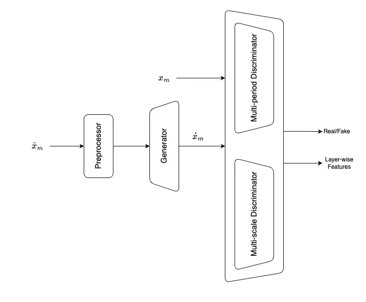
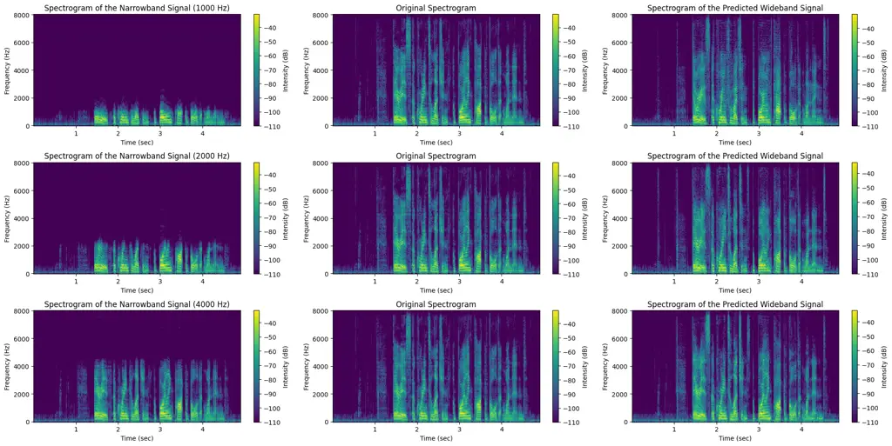
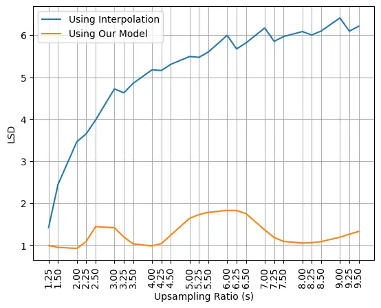

# Speech Bandwidth Expansion Via High Fidelity Generative Adversarial Networks

Mahmoud Salhab Affiliation: Lebanese American University
Affiliation: Department of Computer Science and Mathematics
Affiliation: Byblos, Lebanon Email: [mahmoud.salhab@lau.edu.lb](mailto:)
   Haidar Harmanani Affiliation: Lebanese American University
Affiliation: Department of Computer Science and Mathematics
Affiliation: Byblos, Lebanon Email: [haidar@lau.edu.lb](mailto:)

###### Abstract

Speech bandwidth expansion is crucial for expanding the frequency range
of low-bandwidth speech signals, thereby improving audio quality,
clarity and perceptibility in digital applications. Its applications
span telephony, compression, text-to-speech synthesis, and speech
recognition. This paper presents a novel approach using a high-fidelity
generative adversarial network, unlike cascaded systems, our system is
trained end-to-end on paired narrowband and wideband speech signals. Our
method integrates various bandwidth upsampling ratios into a single
unified model specifically designed for speech bandwidth expansion
applications. Our approach exhibits robust performance across various
bandwidth expansion factors, including those not encountered during
training, demonstrating zero-shot capability. To the best of our
knowledge, this is the first work to showcase this capability. The
experimental results demonstrate that our method outperforms previous
end-to-end approaches, as well as interpolation and traditional
techniques, showcasing its effectiveness in practical speech enhancement
applications.

   

|     |
| --- |
|     |

*K*eywords Speech Bandwidth Expansion, Speech Enhancement, Signal
Processing, Generative Adversarial Networks

## 1 Introduction

Speech Bandwidth Expansion (BWE) involves the conversion of a narrowband
speech signal into a wideband one. This process is also referred to as
Audio Super Resolution, where the objective is to generate a
high-resolution speech signal from a low-resolution input containing
only a fraction of the original samples \[1\]. BWE serves to enhance the
quality and perceptibility of narrowband speech, a capability
particularly valuable in contexts such as Public Switching Telephone
Network (PSTN) environments \[2\]. Bandwidth expansion plays a vital
role in many systems, and it has shown how the performance of automatic
speech recognition systems degrades when encountering a narrowband
speech signal \[3\].

Although the critical need for speech transmission bandwidth has
diminished in modern times, numerous devices and equipment still operate
with, receive, and even store narrowband speech. For example, many
Bluetooth headphones continue to function based on narrowband speech
\[4\].

A speech signal can be described as a continuous function, denoted as
$`f(t)`$ over the interval $`[0,T]`$, where $`T`$ is duration of the
speech in seconds, and $`f(t)`$ is the amplitude at time $`t`$. To
convert this continuous signal into a discrete form, a sampling
technique is employed, in such a way, a value of the signal is captured
every $`T_{s}`$ seconds. This sampling process establishes the sampling
rate of the signal, denoted as $`F_{s}`$ (in Hz), which can be
calculated as the reciprocal of the sampling interval $`T_{s}`$.
Consequently, the continuous function $`f(t)`$ can be discretized into a
vector $`x`$ comprising samples taken at regular interval $`T_{s}`$,
such that $`x=\{f(T_{s}),f(2T_{s}),f(3T_{s}),\ldots f(nT_{s})\}`$. In
terms of the sample rate, the discretized signal can be represented as
$`x=\{f(\dfrac{1}{F_{s}}),f(\dfrac{2}{F_{s}}),f(\dfrac{3}{F_{s}}),\ldots f(\dfrac{n}{F_{s}})\}`$.
Where $`n`$ is the number of samples, which can be calculated by
$`n=\lfloor\dfrac{T}{T_{s}}\rfloor`$. The sampling rate of a signal can
vary significantly, spanning from 4 KHz, typically associated with
low-quality telephone speech, to 48 KHz, indicative of high-quality
speech/music.

According to the Nyquist–Shannon sampling theorem proposed by Shannon
\[5\], when a signal is sampled at a rate of $`F_{s}`$ Hz, the maximum
bandwidth $`B`$ of that signal that guarantees no aliasing is
$`B=\dfrac{F_{s}}{2}`$. Thus, to expand the bandwidth $`B`$ by a factor
of $`\mathbf{s}`$, the sampling rate must also be scaled by
$`\mathbf{s}`$. Formally, in the context of a narrowband speech signal
with a sample rate and bandwidth $`F_{low}`$ and $`B_{low}`$
respectively, bandwidth expansion entails scaling the sampling rate and
bandwidth by an upsampling ratio $`\mathbf{s}`$. This results in a
wideband speech signal with $`F_{high}`$ = $`\mathbf{s}\times F_{low}`$,
$`B_{high}`$ = $`\mathbf{s}\times B_{low}`$, and
$`|x_{high}|=\mathbf{s}\times|x_{low}|`$, where $`x_{high}`$ represents
the wideband speech signal and $`x_{low}`$ represents the narrowband
one. Consequently, the bandwidth expansion or the audio super-resolution
problem is akin to reconstructing the missing frequency content between
$`B_{high}`$ and $`B_{low}`$.

In this study, we propose utilizing a high-fidelity generative
adversarial network for speech bandwidth expansion across different
upsampling ratios. Unlike traditional cascaded techniques, our method is
end-to-end, requiring only a single model for both training and
inference. To further enhance performance, we introduce a unified model
capable of processing various upsampling ratios, eliminating the need
for separate models for each upsampling ratio. Additionally, we evaluate
our model in zero-shot settings, where the model processes previously
unseen narrowband speech signals to scale them to unseen upsampling
ratio. To the best of our knowledge, this is the first work to introduce
zero-shot capability for neural speech bandwidth expansion.

This paper is organized as follows. Section 2 presents a literature
review, establishing the context and background for our research,
followed by our methodology in section 3. Sections 4 and 5 present the
experiments and the results, and lastly, we conclude in section 6 with a
summary of potential future work.

## 2 Related Work

Bandwidth expansion, also referred to as audio super-resolution in the
literature, and it has been a subject of study for decades due to its
significance in many systems \[6, 7, 8, 9, 10, 11, 12, 13, 14\]. Early
studies focused on estimating the spectral envelope of the
high-frequency band and using excitation generated from the
low-frequency band to recover the high-frequency spectrum \[15\].
Traditional techniques such as Gaussian mixture models, linear
predictive coding, and hidden Markov models have also been used \[16,
17, 18\]. However, these methods generally perform worse compared to
neural networks \[19\]. Additionally, matrix factorization techniques
trained on very small datasets have been proposed to mitigate the
computational cost of factorizing matrices \[20, 21\].

Recent advancements in end-to-end deep neural networks generate wideband
signals directly from narrowband signals without the need for feature
engineering. For instance, \[22\] proposed training a deep neural
network as a mapping function, using log-spectrum power as the input and
output features to perform the required nonlinear transformation. A
dense neural network with three hidden layers of size 2048 and ReLU
activation function proposed in \[3\], showed that this method is
preferred over Gaussian mixture models in 84% of cases in a user study
they made.

Inspired by image super-resolution algorithms, which use machine
learning techniques to interpolate a low-resolution image into a
higher-resolution one, a convolutional U-net contains successive
downsampling and upsampling blocks with skip connections proposed in
\[23\]. Building on that, a neural network component named Temporal
Feature-Wise Linear Modulation (TFiLM) introduced in \[24\]. TFiLM
captures long-range input dependencies in sequential inputs by combining
elements of convolutional and recurrent approaches in a U-net-like
architecture. Furthermore, it modulates the activations of a
convolutional model using long-range information captured by a recurrent
neural network. A block-online variant of the temporal feature-wise
linear modulation (TFiLM) model to achieve bandwidth extension was
proposed by \[25\]. This architecture simplifies the UNet backbone of
the TFiLM to reduce inference time and employs an efficient transformer
at the bottleneck to alleviate performance degradation. It also utilizes
self-supervised pretraining and data augmentation to enhance the quality
of bandwidth-extended signals and reduce sensitivity with respect to
downsampling methods.

Attention-based Feature-Wise Linear Modulation (AFiLM) \[26\] proposed a
network with a U-net-like architecture for audio super-resolution that
combines convolution and self-attention. AFiLM uses a self-attention
mechanism instead of recurrent neural networks to modulate the
activations of the convolutional model.

In \[27\], to model the distribution of the target high-resolution
signal conditioned on the log-scale mel-spectrogram of the
low-resolution signal researchers utilized the WaveNet \[28\] model.
Furthermore, \[29\] studied the use of the Wave-U-Net architecture for
speech enhancement.

Generative Adversarial Networks (GANs) \[30\] are utilized in \[31\],
where an additional third component is proposed in the TTS pipeline for
neural upsampling. This converts lower resolution audio (16-24 kHz) to
full high-resolution audio (44.1 kHz). Additionally, researchers
explored the use of a diffusion probabilistic model for audio
super-resolution, which is designed based on neural vocoders \[32\].

A Glow-based waveform generative model for performing audio
super-resolution was proposed in \[33\]. Specifically, the integration
of WaveNet and Glow directly maximizes the exact likelihood of the
target high-resolution (HR) audio conditioned on low-resolution (LR)
information. To exploit audio information from low-resolution audio, an
LR audio encoder and an STFT encoder are proposed, which encode the LR
information from the time domain and frequency domain, respectively.

A neural vocoder-based speech super-resolution method (NVSR) was
proposed by \[34\], capable of handling various input resolutions and
upsampling ratios. NVSR follows a cascaded system structure, comprising
a mel-bandwidth extension module, a neural vocoder module, and a
post-processing module.

A diffusion-based generative model designed to perform robust audio
super-resolution across a wide range of audio types named AudioSR
proposed in \[35\]. AudioSR designed specifically to enhance the quality
of sound effects, music, and speech.

## 3 Methodology

Given a dataset
$`\mathcal{D}=\{(x_{1},\hat{x}_{1}),(x_{2},\hat{x}_{2}),\ldots,(x_{M},\hat{x}_{M})\}`$,
where each pair consists of the same speech signal sampled at different
frequencies, we define $`\hat{x}_{m}`$ as the signal sampled at a lower
frequency $`F_{low}`$ with bandwidth $`B_{low}`$, and $`x_{m}`$ as the
signal sampled at a higher frequency $`F_{high}`$ with bandwidth
$`B_{high}`$. Both signals originate from the same source.
Mathematically, $`F_{high}=\mathbf{s}\times F_{low}`$ and
$`B_{high}=\mathbf{s}\times B_{low}`$, such that $`\mathbf{s}>1`$, where
$`\mathbf{s}`$ is the super-resolution/upsampling ratio. Formally, we
represent $`x_{m}`$ as $`x_{m}=\{x_{1},x_{2},\ldots,x_{N}\}`$ and
$`\hat{x}_{m}`$ as
$`\hat{x}_{m}=\{\hat{x}_{1},\hat{x}_{2},\ldots,\hat{x}_{\lfloor\frac{N}{\mathbf{s}}\rfloor}\}`$.

Our goal is to expand the bandwidth of the given signal $`\hat{x}`$ by a
factor of $`\mathbf{s}`$, resulting in a speech signal with an increased
sampling frequency and bandwidth. The objective of neural
super-resolution is to construct a function $`\mathcal{F}_{\theta}`$
such that $`\acute{x}=\mathcal{F}_{\theta}(\hat{x})`$, where
$`\acute{x}`$ is the upsampled or reconstructed version of the input
speech signal $`\hat{x}`$ with bandwidth $`B_{high}`$. In such a way,
$`\acute{x}`$ is as close as possible to the ground truth one $`x`$. The
aim is to develop an effective yet efficient function
$`\mathcal{F}_{\theta}`$. A straightforward approach involves designing
$`\mathcal{F}_{\theta}`$ as a simple DNN \[36\] or CNN \[37\] that
minimizes the following objective function:

```math
\min_{\theta}\sum_{m=1}^{M}\sum_{n=1}^{N}(\mathcal{F}_{\theta}(\hat{x}_{m})_{n}-x_{m,n})^{2} \tag{1}
```

If the network is not properly designed, several issues may arise.
Speech signals tend to be lengthy, making it computationally inefficient
to train a complex model. Additionally, distance-based objective
functions have inherent limitations. Training neural networks with such
objectives often results in blurry outputs in computer vision, known as
the "softness" issue \[38, 39\], and similarly in speech. Therefore, our
objective is to build an efficient $`\mathcal{F}_{\theta}`$ and use an
appropriate objective function to train $`\mathcal{F}_{\theta}`$ on the
dataset, ensuring the reconstructed speech signal closely matches the
high-resolution signal. To achieve this, we employed an adversarial loss
to eliminate the softness issue and utilized a convolutional model
architecture, which will be elaborated upon in the following sections.

### 3.1 Model

In the realm of speech audio, where signals exhibit sinusoidal
characteristics with varying periods, accurately representing these
periodic patterns is paramount for synthesizing authentic, high-fidelity
speech from an original, low-fidelity source. Building upon the
methodology in \[40\], our model comprises a generator and two distinct
discriminator types: multi-scale and multi-period discriminators. These
elements undergo adversarial training, supplemented by two auxiliary
loss functions to boost training stability. The multi-period
discriminator comprises several sub-discriminators, each targeting
specific periodic segments within the raw waveforms. Complementing this,
the generator module incorporates multiple residual blocks, each adept
at processing patterns of different lengths concurrently. This design
ensures the model comprehensively captures the diverse range of periodic
characteristics present in speech audio. The entire model architecture
is illustrated in Figure 1, and detailed explanations of each
subcomponent follow in the subsequent sections.



Figure 1: Complete architecture of the model.

#### 3.1.1 Generator

The generator is a convolutional neural network that’s entirely
dedicated to upscaling. It begins with a mel-spectrogram input generated
within the input speech signal’s preprocessor module, and uses
transposed convolutions to gradually match the temporal resolution of
the high-resolution speech signal $`x_{m}`$. Each transposed convolution
operation is accompanied by a multi-receptive field fusion (MRF) module.
This module is designed to analyze patterns of different lengths
simultaneously. It achieves this by summing the outputs from several
residual blocks. These blocks employ various kernel sizes and dilation
rates to create a wide range of receptive field patterns. The
architecture of the generator is identical to the generator proposed in
\[40\].

#### 3.1.2 Discriminator

Following the methodology presented in \[40\], the design of the
discriminator tackles two critical challenges. Firstly, it must adeptly
capture the extended dependencies within the input speech signal.
Secondly, given the sinusoidal nature of the input with variable
periods, it needs to discern the diverse periodic patterns inherent in
the audio data. Thus, we adopt a similar strategy as detailed in the
original work \[40\]. This involves implementing a multi-period
discriminator (MPD) composed of multiple sub-discriminators, each
responsible for analyzing a segment of the periodic signals within the
input audio. Additionally, a multi-scale discriminator (MSD) is employed
to detect sequential patterns and long-term dependencies effectively.

### 3.2 Training Loss

For the generator and discriminator, the training objectives follow the
approach proposed in \[41\], where the binary cross-entropy loss
function is replaced with the least square error loss. This substitution
helps prevent the vanishing gradient issue. Additionally, an extra
objective function is included, specifically mel-spectrogram
reconstruction as proposed by \[42\], along with discriminator
feature-wise matching across layers as in \[43\]. The discriminator is
trained to classify ground truth samples as 1 and samples synthesized by
the generator as 0. The generator, on the other hand, is trained to
deceive the discriminator by enhancing the sample quality so that it is
classified as close to 1 as possible. The objective function for the
discriminator $`D_{\phi}`$ shown in the Equation 2 and for the generator
$`G_{\theta}`$ is expressed in the Equation 3.

```math
\min_{D_{\phi}}\mathbb{E}[(1-D_{\phi}(x))^{2}+D_{\phi}(G_{\theta}(\hat{x}))^{2}] \tag{2}
```

```math
\min_{G_{\theta}}\lambda_{adv}\mathcal{J}_{adv}+\lambda_{mel}\mathcal{J}_{mel}+\lambda_{feat}\mathcal{J}_{feat} \tag{3}
```

```math
\mathcal{J}_{adv}=\mathbb{E}[(1-D_{\phi}(G_{\theta}(\hat{x})))^{2}] \tag{4}
```

```math
\mathcal{J}_{mel}=\mathbb{E}[\|\psi(x)-\psi(G_{\theta}(\hat{x}))\|_{1}] \tag{5}
```

```math
\mathcal{J}_{feat}=\mathbb{E}[\sum_{k=1}^{K}\frac{1}{N_{k}}\|D_{\phi}^{k}(x)-D_{\phi}^{k}(G_{\theta}(\hat{x}))\|_{1}] \tag{6}
```

In these equations, $`\lambda_{adv}`$, $`\lambda_{mel}`$, and
$`\lambda_{feat}`$ are hyperparameters that balance the contributions of
the adversarial, mel-spectrogram reconstruction, and feature matching
term, respectively. $`\psi`$ represents the function that computes the
mel-spectrogram, $`D_{\phi}^{k}`$ denotes the output of the $`k^{th}`$
layer of the discriminator, and $`N_{k}`$ is the number of elements in
the $`k^{th}`$ layer.

## 4 Experiments

### 4.1 Dataset

Similar to prior studies, we utilized the VCTK corpus \[44\] for both
training and evaluation purposes. The VCTK dataset comprises
approximately 44 hours of audio recordings, from 109 distinct speakers,
offering a variety of voices and accents including Scottish, Indian, and
Irish, among others. The dataset originally uses a bit width of 16-bit
PCM with a sample rate of 48 kHz. Therefore, we first resampled the
entire dataset to a sample rate of 16 kHz while maintaining the same bit
width. To create low-resolution audio, we applied an order 8 Chebyshev
type I low-pass filter to the original 16 KHz signals, followed by
subsampling according to the desired upsampling ratio.

Our research centers on a multi-speaker task, training on the first 100
VCTK speakers and testing on the remaining speakers ¹¹ 1 The speaker IDs
used for testing are p347, p351, p360, p361, p362, p363, p364, p374,
p376., in alignment with the methodology presented in \[23\].

### 4.2 Evaluation Metric

To evaluate the performance of our proposed method and to measure the
quality of generated audio samples by comparing them to the actual
high-resolution audio, and following previous works, we assess the
reconstruction quality of individual frequencies using the Log Spectral
Distance (LSD). The LSD is calculated as shown in Equation 7.

```math
LSD(x,\acute{x})=\frac{1}{T}\sum_{t=1}^{T}\sqrt{\frac{1}{F}\sum_{f=1}^{F}(\mathcal{P}(x)_{t,f}-\mathcal{P}(\acute{x})_{t,f})^{2}} \tag{7}
```

```math
\mathcal{P}(z)=log_{10}|STFT(z)|^{2} \tag{8}
```

Here, $`x`$ represents the reference wideband speech signal, and
$`\acute{x}`$ is the reconstructed speech signal from the model.
$`\mathcal{P}(x)`$ denotes the log-spectral power magnitudes calculated
using Equation 8, where $`STFT`$ refers to the Short-Time Fourier
Transform. Variables $`f`$ and $`t`$ correspond to the frequency and
frame index, respectively. A lower LSD values indicate better frequency
reconstruction. Following \[23\] we used frames of length 2048 to
calculate the STFT in our experiments.

### 4.3 Experimental Setup

For all the experiments, we used different upsampling ratios
$`\mathbf{s}`$, specifically 2, 4, and 8. For each upsampling ratio, we
trained a separate model, each for 500K steps. Our models were trained
on a single machine with two NVIDIA 3080 TI GPUs, using a global batch
size of 16 and the same model configuration as version 1 described in
\[40\].

Since the preprocessing handles the upsampling, we also trained a
unified model on all the aforementioned upsampling ratios. Additionally,
we investigated the ability of the proposed technique to work in
zero-shot settings, where the model is given a signal and tasked with
generating a signal with a different upsampling ratio than those it was
trained on. We examined whether the model could generalize and predict
the signal. The unified model was trained similarly to the single
upsampling ratio models, but for longer, specifically for 1.5M steps.

All the models were trained on mel-spectrogram input, calculated using
$`80`$ mel-filter bank with an FFT size of $`1024`$, a window size of
$`1024`$, and a hop length of $`256`$. For the generator loss terms, we
set $`\lambda_{adv}=1.1`$, $`\lambda_{mel}=50`$, and
$`\lambda_{feat}=2`$. In addition to that, the AdamW optimizer was used
with $`\beta_{1}=0.8`$ and $`\beta_{2}=0.999`$, with a weight decay
$`\lambda=0.01`$, and the learning rate used on each epoch calculated
using Equation 9, where $`lr_{init}`$ is the initial learning rate set
to $`1.5\times 10^{-4}`$, $`epoch`$ is the current training epoch, and
$`\gamma`$ is the learning rate decaying factor set to $`0.999`$.

```math
lr(epoch)=\gamma^{epoch}*lr_{init} \tag{9}
```

## 5 Results

The results of our experiments are presented in Table 1, which displays
the Log Spectral Distance (in dB) for various upsampling ratios,
specifically 2, 4, and 8. The table compares the performance of
different baselines with two scenarios: first, when each upsampling
ratio is trained on a standalone model, labeled as "Single," and second,
when all upsampling ratios are trained jointly using a single model,
labeled as "Unified." Our model consistently outperforms all end-to-end
baselines. When compared to cascaded models such as NVSR \[34\], our
approach performs better for high upsampling ratio (i.e.,
$`\mathbf{s}=8`$) and is comparable for $`\mathbf{s}=4`$, although
cascaded models outperform our model for low upsampling ratio (i.e.,
$`\mathbf{s}=2`$).

|                      |       |       |       |            |
| -------------------- | ----- | ----- | ----- | ---------- |
| Approach             | s = 2 | s = 4 | s = 8 | End-to-End |
| Baseline             | 3.464 | 5.17  | 6.08  | N/A        |
| AudioUNet \[23\]     | 3.1   | 3.5   | N/A   | ✓          |
| TFNet \[45\]         | N/A   | 1.27  | 1.9   | ✓          |
| Temporal FiLM \[24\] | 1.8   | 2.7   | 2.9   | ✓          |
| MU-GAN \[1\]         | 2.14  | 2.72  | N/A   | ✓          |
| AFiLM \[26\]         | 1.7   | 2.3   | 2.7   | ✓          |
| NVSR \[34\]          | 0.78  | 0.95  | 1.07  | ✗          |
| Ours (Single)        | 0.9   | 0.98  | 1.047 | ✓          |
| Ours (Unified)       | 0.923 | 0.98  | 1.0   | ✓          |

Table 1: Analysis of Speech Bandwidth Expansion at Upsampling Ratios of
2, 4, and 8.

A test sample is shown in Figure 2, including the input narrowband
speech signal, the reconstructed wideband speech signal, and the
original wideband speech signal. The first column shows the input
narrowband speech signal, the middle column displays the target wideband
speech signal, and the last column presents the predicted wideband
speech signal using our trained model. The first row corresponds to an
upsampling ratio of $`\mathbf{s}=8`$, the second row to
$`\mathbf{s}=4`$, and the third row to $`\mathbf{s}=2`$. It is evident
that our approach effectively addresses the issue of oversmoothness,
successfully reconstructing the missing frequencies.



Figure 2: Spectrogram Analysis of Narrowband to Wideband Speech
Reconstruction with Varying Upsampling Ratios ($`\mathbf{s}=8`$,
$`\mathbf{s}=4`$, $`\mathbf{s}=2`$)

The performance of our unified model across various upsampling ratios on
the test set, including those it was trained on (i.e., 2, 4, 8), is
illustrated in Figure 3. Compared to the baseline Fast Fourier Transform
(FFT)-based interpolation technique, our method demonstrates the
capability to handle even unseen upsampling ratios. Notably, the trained
upsampling ratios exhibit the lowest Log Spectral Distance (LSD).
Additionally, it is evident that traditional interpolation-based
techniques for bandwidth expansion result in increased LSD as the
upsampling ratios rises (i.e decreasing the input bandwidth signal).
Conversely, our method maintains a bounded LSD, even for upsampling
ratios not encountered during training which shows that our model can
run in zero-shot settings.



Figure 3: Performance comparison of our unified model across various
upsampling ratios, demonstrating its ability to handle unseen upsampling
ratios with maintained low Log Spectral Distance (LSD) compared to
traditional interpolation methods

## 6 Conclusion

In this work, we presented an end-to-end approach for tackling speech
bandwidth expansion using a high-fidelity generative adversarial network
trained across different super-resolution/upsampling ratios.
Empirically, our method surpasses various end-to-end baselines and
achieves comparable results when compared with cascaded approaches.
Additionally, we demonstrated the scalability of our method to unseen
upsampling ratios during training in zeros-shot setting. These findings
underscore the potential of our unified model architecture, which not
only simplifies the training and deployment process but also enhances
performance across varying levels of upsampling ratios. Moving forward,
our work opens avenues for further exploration and application of neural
speech bandwidth expansion in real-world scenarios.

## References

- \[1\] Sung Kim and Visvesh Sathe. Bandwidth extension on raw audio via
  generative adversarial networks, 2019.
- \[2\] L. A. Litteral, J. B. Gold, D. C. Klika Jr, D. B. Konkle, C. D.
  Coddington, J. M. McHenry, and A. A. Richard III. Pstn architecture
  for video-on-demand services, 1993.
- \[3\] Kehuang Li, Zhen Huang, Yong Xu, and Chin-Hui Lee. DNN-based
  speech bandwidth expansion and its application to adding
  high-frequency missing features for automatic speech recognition of
  narrowband speech. In Proc. Interspeech 2015, pages 2578–2582, 2015.
- \[4\] J. C. Haartsen and E. Radio. The bluetooth radio system. IEEE
  Personal Communications, 2000.
- \[5\] C.E. Shannon. Communication in the presence of noise.
  Proceedings of the IRE, 37(1):10–21, jan 1949.
- \[6\] J. Epps and W.H. Holmes. A new technique for wideband
  enhancement of coded narrowband speech. In 1999 IEEE Workshop on
  Speech Coding Proceedings. Model, Coders, and Error Criteria (Cat.
  No.99EX351), pages 174–176, 1999.
- \[7\] Saeed Vaseghi, E. Zavarehei, and Qin Yan. Speech bandwidth
  extension: Extrapolations of spectral envelop and harmonicity quality
  of excitation. Acoustics, Speech, and Signal Processing, 1988.
  ICASSP-88., 1988 International Conference on, 3:III – III, 06 2006.
- \[8\] Jinyu Han, Gautham J. Mysore, and Bryan Pardo. Language informed
  bandwidth expansion. In 2012 IEEE International Workshop on Machine
  Learning for Signal Processing, pages 1–6, 2012.
- \[9\] Hyunson Seo, Hong-Goo Kang, and Frank Soong. A maximum a
  posterior-based reconstruction approach to speech bandwidth expansion
  in noise. ICASSP, IEEE International Conference on Acoustics, Speech
  and Signal Processing - Proceedings, pages 6087–6091, 05 2014.
- \[10\] Per Ekstrand. Bandwidth extension of audio signals by spectral
  band replication. In Proceedings of the 1st IEEE Benelux Workshop on
  Model Based Processing and Coding of Audio (MPCA02). Citeseer, 2002.
- \[11\] Erik Larsen and Ronald M. Aarts. Audio Bandwidth Extension:
  Application of Psychoacoustics, Signal Processing and Loudspeaker
  Design. John Wiley & Sons, 2005.
- \[12\] P. Jax and P. Vary. On artificial bandwidth extension of
  telephone speech. Signal Processing, 83, 2003.
- \[13\] Y. Qian and P. Kabal. Wideband speech recovery from narrowband
  speech using classified codebook mapping. In Proceedings of the
  Australian International Conference on Speech Science and Technology,
  Melbourne, 2002.
- \[14\] A. H. Nour-Eldin and P. Kabal. Mel-frequency cepstral
  coefficient-based bandwidth extension of narrowband speech. In
  Proceedings of Interspeech, 2008.
- \[15\] B. Iser and G. Schmidt. Bandwidth extension of telephony
  speech. In Speech and Audio Processing in Adverse Environments, pages
  135–184. Springer, 2008.
- \[16\] Pramod B. Bachhav, Massimiliano Todisco, Moctar Mossi,
  Christophe Beaugeant, and Nicholas Evans. Artificial bandwidth
  extension using the constant q transform. In 2017 IEEE International
  Conference on Acoustics, Speech and Signal Processing (ICASSP), pages
  5550–5554, 2017.
- \[17\] J. Bradbury. Linear Predictive Coding. McGraw-Hill, 2000.
- \[18\] Keiichi Tokuda, Yoshihiko Nankaku, Tomoki Toda, Heiga Zen,
  Junichi Yamagishi, and Keiichiro Oura. Speech synthesis based on
  hidden markov models. Proceedings of the IEEE, 101(5):1234–1252, 2013.
- \[19\] Johannes Abel and Tim Fingscheidt. Artificial speech bandwidth
  extension using deep neural networks for wideband spectral envelope
  estimation. IEEE/ACM Transactions on Audio, Speech, and Language
  Processing, 26(1):71–83, 2018.
- \[20\] Dawen Liang, Matthew D. Hoffman, and Daniel P.W. Ellis. Beta
  process sparse nonnegative matrix factorization for music. In
  Proceedings of the International Society for Music Information
  Retrieval Conference (ISMIR), pages 375–380, 2013.
- \[21\] Dhananjay Bansal, Bhiksha Raj, and Paris Smaragdis. Bandwidth
  expansion of narrowband speech using non-negative matrix
  factorization. In Ninth European Conference on Speech Communication
  and Technology, 2005.
- \[22\] Kehuang Li and Chin-Hui Lee. A deep neural network approach to
  speech bandwidth expansion. In 2015 IEEE International Conference on
  Acoustics, Speech and Signal Processing (ICASSP), pages
  4395–4399, 2015.
- \[23\] Volodymyr Kuleshov, S. Zayd Enam, and Stefano Ermon. Audio
  super resolution using neural networks, 2017.
- \[24\] Sawyer Birnbaum, Volodymyr Kuleshov, Zayd Enam, Pang Wei Koh,
  and Stefano Ermon. Temporal film: Capturing long-range sequence
  dependencies with feature-wise modulations, 2021.
- \[25\] Viet-Anh Nguyen, Anh H. T. Nguyen, and Andy W. H. Khong. Tunet:
  A block-online bandwidth extension model based on transformers and
  self-supervised pretraining. In ICASSP 2022 - 2022 IEEE International
  Conference on Acoustics, Speech and Signal Processing (ICASSP). IEEE,
  May 2022.
- \[26\] Nathanaël Carraz Rakotonirina. Self-attention for audio
  super-resolution, 2021.
- \[27\] Mu Wang, Zhiyong Wu, Shiyin Kang, Xixin Wu, Jia Jia, Dan Su,
  Dong Yu, and Helen Meng. Speech super-resolution using parallel
  wavenet. In 2018 11th International Symposium on Chinese Spoken
  Language Processing (ISCSLP), pages 260–264, 2018.
- \[28\] Aaron van den Oord, Sander Dieleman, Heiga Zen, Karen Simonyan,
  Oriol Vinyals, Alex Graves, Nal Kalchbrenner, Andrew Senior, and Koray
  Kavukcuoglu. Wavenet: A generative model for raw audio, 2016.
- \[29\] Craig Macartney and Tillman Weyde. Improved speech enhancement
  with the wave-u-net, 2018.
- \[30\] Ian J. Goodfellow, Jean Pouget-Abadie, Mehdi Mirza, Bing Xu,
  David Warde-Farley, Sherjil Ozair, Aaron Courville, and Yoshua Bengio.
  Generative adversarial networks, 2014.
- \[31\] Rithesh Kumar, Kundan Kumar, Vicki Anand, Yoshua Bengio, and
  Aaron Courville. Nu-gan: High resolution neural upsampling with
  gan, 2020.
- \[32\] Junhyeok Lee and Seungu Han. Nu-wave: A diffusion probabilistic
  model for neural audio upsampling. In Interspeech 2021. ISCA,
  August 2021.
- \[33\] Kexun Zhang, Yi Ren, Changliang Xu, and Zhou Zhao. Wsrglow: A
  glow-based waveform generative model for audio super-resolution, 2021.
- \[34\] Haohe Liu, Woosung Choi, Xubo Liu, Qiuqiang Kong, Qiao Tian,
  and DeLiang Wang. Neural vocoder is all you need for speech
  super-resolution. In Interspeech 2022. ISCA, September 2022.
- \[35\] Haohe Liu, Ke Chen, Qiao Tian, Wenwu Wang, and Mark D.
  Plumbley. Audiosr: Versatile audio super-resolution at scale, 2023.
- \[36\] David E. Rumelhart, Geoffrey E. Hinton, and Ronald J. Williams.
  Learning representations by back-propagating errors. Nature,
  323:533–536, 1986.
- \[37\] Y. LeCun, B. Boser, J. S. Denker, D. Henderson, R. E. Howard,
  W. Hubbard, and L. D. Jackel. Backpropagation applied to handwritten
  zip code recognition. Neural Computation, 1(4):541–551, 1989.
- \[38\] Richard Zhang, Phillip Isola, and Alexei A. Efros. Colorful
  image colorization, 2016.
- \[39\] Deepak Pathak, Philipp Krahenbuhl, Jeff Donahue, Trevor
  Darrell, and Alexei A. Efros. Context encoders: Feature learning by
  inpainting, 2016.
- \[40\] Jungil Kong, Jaehyeon Kim, and Jaekyoung Bae. Hifi-gan:
  Generative adversarial networks for efficient and high fidelity speech
  synthesis, 2020.
- \[41\] Xudong Mao, Qing Li, Haoran Xie, Raymond Y. K. Lau, Zhen Wang,
  and Stephen Paul Smolley. Least squares generative adversarial
  networks, 2017.
- \[42\] Phillip Isola, Jun-Yan Zhu, Tinghui Zhou, and Alexei A. Efros.
  Image-to-image translation with conditional adversarial
  networks, 2018.
- \[43\] Kundan Kumar, Rithesh Kumar, Thibault de Boissiere, Lucas
  Gestin, Wei Zhen Teoh, Jose Sotelo, Alexandre de Brebisson, Yoshua
  Bengio, and Aaron Courville. Melgan: Generative adversarial networks
  for conditional waveform synthesis, 2019.
- \[44\] Junichi Yamagishi, Christophe Veaux, and Kirsten MacDonald.
  Cstr vctk corpus: English multi-speaker corpus for cstr voice cloning
  toolkit (version 0.92), 2019.
- \[45\] Teck-Yian Lim, Raymond A. Yeh, Yijia Xu, Minh N. Do, and
  Mark A. Hasegawa-Johnson. Time-frequency networks for audio
  super-resolution. 2018 IEEE International Conference on Acoustics,
  Speech and Signal Processing (ICASSP), pages 646–650, 2018.
