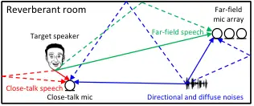

# ctPuLSE: Close-Talk, and Pseudo-Label Based Far-Field, Speech Enhancement

Preprint: Wang, JASA

Zhong-Qiu Wang Affiliation: Department of Computer Science and
Engineering, Southern University of Science and Technology, Shenzhen
518055, Guangdong, P.R. China Email: [wang.zhongqiu41@gmail.com or
wangzq3@sustech.edu.cn](mailto:wang.zhongqiu41@gmail.com%20or%20wangzq3@sustech.edu.cn)

August 24, 2026

###### Abstract

The current dominant approach for neural speech enhancement is via
purely-supervised deep learning on simulated pairs of far-field
noisy-reverberant speech (i.e., mixtures) and clean speech. The trained
models, however, often exhibit limited generalizability to real-recorded
mixtures. To deal with this, this paper investigates training
enhancement models directly on real mixtures. However, a major
difficulty challenging this approach is that, since the clean speech of
real mixtures is unavailable, there lacks a good supervision for real
mixtures. In this context, assuming that a training set consisting of
real-recorded pairs of close-talk and far-field mixtures is available,
we propose to address this difficulty via close-talk speech enhancement,
where an enhancement model is first trained on simulated mixtures to
enhance real-recorded close-talk mixtures and the estimated close-talk
speech can then be utilized as a supervision (i.e., pseudo-label) for
training far-field speech enhancement models directly on the paired
real-recorded far-field mixtures. We name the proposed system ctPuLSE.
Evaluation results on the popular CHiME-4 dataset show that ctPuLSE can
derive high-quality pseudo-labels and yield far-field speech enhancement
models with strong generalizability to real data.

## I Introduction

Dramatic progress has been made in speech enhancement \[34\], thanks to
the rapid development of deep learning. The current dominant approach is
based on supervised deep learning, where paired noisy-reverberant speech
(i.e., mixtures) and clean speech are simulated and utilized to train
deep neural networks (DNN) to predict the clean speech based on its
paired mixtures in a purely-supervised, discriminative way \[34, 53,
1\]. The trained models, however, often exhibit limited generalizability
to real-recorded mixtures \[36, 24, 52, 30, 31, 10, 20, 9, 15, 51, 50\],
mainly because the simulated training data is typically, and in many
cases inevitably, mismatched with real test data.

To improve the generalizability, this paper investigates training models
directly on real-recorded, target-domain mixtures. This approach,
however, cannot be straightforwardly realized, since the underlying
clean speech is not available for real mixtures, unlike simulated
mixtures, where the paired clean speech can be readily available through
room simulation and can serve as a fine-grained supervision at the
sample level for model training. The key to enable successful training
on real mixtures, we think, is to figure out a mechanism that can
reliably compute a high-quality supervision signal (i.e., pseudo-label
or pseudo-target) for real-recorded mixtures.

One possible way, we propose, is to leverage close-talk mixtures. During
data collection, besides using far-field microphones to record target
speech, a close-talk microphone is often placed near the target speaker
to record the close-talk speech at the same time. See Fig. 1 for an
illustration. The recorded close-talk mixture, while the target speaker
is talking, usually has a much higher SNR of the target speaker than any
far-field mixture, simply due to the very short distance from the target
speaker to its close-talk microphone. Although the close-talk mixture is
typically not perfectly clean, as non-target signals (such as
environmental noises, room reverberation and competing speech) could
also be picked up by the close-talk microphone, it usually exhibits a
very high input SNR and hence could be utilized to compute a reliable,
high-quality supervision for real-recorded far-field mixtures.



Figure 1: Scenario illustration. Close-talk mixture consists of
close-talk speech and noises, and far-field mixture consists of
far-field speech and noises. Best viewed in color.

With this understanding, this paper first investigates close-talk speech
enhancement, a task which aims at enhancing close-talk mixtures and
estimating close-talk speech. Solving this task could enable many
applications. One of them, which is investigated in this paper, is that,
based on the estimated close-talk speech, a pseudo-label can be derived
for each real-recorded far-field mixture and used as a supervision to
train supervised models directly on real-recorded far-field mixtures,
thereby potentially realizing better generalizability to real data. We
summarize the contributions of this paper as follows:

- •
  For the purpose of achieving better far-field speech enhancement, we
  propose to first investigate close-talk speech enhancement (CTSE),
  which aims at enhancing close-talk mixtures to estimate close-talk
  speech. Although CTSE is a particular form of speech enhancement
  (i.e., in close-talk conditions) and has been studied for other
  purposes \[16, 17, 29\], we point out that it is a valuable task that
  could yield high-quality pseudo-labels for real-recorded data, and is
  hence worth investigating.
- •
  We propose ctPuLSE, a pseudo-label based approach for far-field speech
  enhancement, where estimated close-talk speech is utilized to derive a
  supervision for training supervised enhancement models directly based
  on real far-field mixtures.
- •
  Following SuperM2M \[36\], an earlier algorithm that trains
  enhancement models by alternating between supervised and
  un-/weakly-supervised learning, we propose a co-learning algorithm
  that trains the same enhancement model using both simulated and real
  data, where the pseudo-label of real data is derived based on the
  estimated close-talk speech. This way, the model can also learn from
  massive amount of simulated training data, which can be easily
  simulated and can be very helpful when the real training data is
  scarce. Compared with SuperM2M, we observe that ctPuLSE obtains
  comparable robust automatic speech recognition (ASR) performance,
  while much better enhancement performance.

Although ctPuLSE is simple and straightforward, it obtains strong robust
ASR and speech enhancement performance on the public CHiME-4 dataset
\[2, 33, 3\], the most popular benchmark to date in robust ASR and
speech enhancement. The evaluation results suggest that ctPuLSE can
effectively train enhancement models on real-recorded far-field
mixtures, and can yield better generalizability to real data than
purely-supervised models trained only on simulated data. A sound demo is
provided at
[https://zqwang7.github.io/demos/ctPuLSE_demo/index.html](https://zqwang7.github.io/demos/ctPuLSE_demo/index.html).

## II Related Work

ctPuLSE is related to earlier works in four key aspects.

### II.1 Generalizability of Supervised Enhancement Models

Improving the generalizability of supervised learning based speech
enhancement models (trained on simulated data) to real-recorded data has
received decade-long research interests. The current dominant approach
\[6, 7, 34, 51, 50\] is to simulate massive amount of training data to
cover as many variations (that could happen in real-recorded test data)
as possible. However, the generalizability is often limited by the
current simulation techniques, which usually cannot simulate mixtures as
realistic as real-recorded mixtures. This can be observed from recent
speech enhancement/separation and robust ASR challenges such as
CHiME-{4,5,6,7} \[33, 47, 9\], AliMeeting \[49\], MISP \[48\], and
Clarity \[10\], where using the immediate outputs from DNN-based
enhancement or separation models trained on simulated mixtures for
robust ASR and human hearing has had limited successes \[15, 14\].
Different from this stream of research, this paper investigates training
enhancement models directly on real-recorded data to improve the
generalizability.

### II.2 Leveraging Close-Talk Mixtures for Speech Enhancement

Leveraging real-recorded close-talk mixtures as a weak supervision to
train speech enhancement and speaker separation models directly on
real-recorded far-field mixtures has attracted research interests
recently. A representative algorithm in this direction is SuperM2M
\[36\], which builds upon a weakly-supervised speaker separation
algorithm named mixture to mixture (M2M) \[35\] and an unsupervised
speaker separation algorithm named UNSSOR \[43\]. M2M trains enhancement
models to produce a speech estimate and a noise estimate such that the
two estimates can be linearly filtered to recover observed mixtures, and
SuperM2M, building upon M2M, leverages supervised learning on simulated
mixtures to improve M2M. Although SuperM2M has shown strong potential
for neural speech enhancement and robust ASR, we often observe that
SuperM2M cannot sufficiently suppress non-target signals, likely because
its loss function is defined on reconstructed mixtures (i.e., the
summation of linearly-filtered source estimates), rather than directly
on source estimates. In comparison, the loss function in ctPuLSE, which
we will show, is defined based on pseudo-labels derived from close-talk
mixtures. As long as the pseudo-labels are high-quality, we can
reasonably expect that the suppression of non-target signals by ctPuLSE
would be more sufficient and aggressive.

On the other hand, there are studies \[48\] using oracle
speaker-activity timestamps and pre-trained models (e.g., DNSMOS \[18\])
to select segments of close-talk mixtures that are almost clean, and
then using the selected segments of mixtures to synthesize far-field
mixtures for training supervised learning based models. However, the
training data is still simulated, and the models are not trained on real
data.

### II.3 Pseudo-Label Based Speech Enhancement

There have been studies adapting pre-trained speech enhancement models
to target domains via pseudo-labeling. RemixIT \[30\], a representative
algorithm in this direction, first uses a pre-trained enhancement model
(named teacher) to enhance target-domain real-recorded mixtures (and
generate pseudo-labels), and then another enhancement model (named
student) is trained in a supervised way to estimate the generated
pseudo-labels. The teacher and student models are designed to update
continuously and iteratively to gradually improve each other. Another
recent study in this direction is SSST \[12\], which, building upon
RemixIT, introduces an adversarial training algorithm to learn
domain-invariant hidden representations and proposes a data-selection
mechanism to pick a subset of target-domain mixtures whose pseudo-labels
are sufficiently reliable for RemixIT-style training.

Similarly to those studies, ctPuLSE leverages pseudo-labeling as well,
but it has a very different problem setup, where paired close-talk and
far-field mixtures are assumed available for model training. In this
setup, much better pseudo-labels could potentially be computed for
far-field mixtures, simply due to the innate high input SNR of
close-talk mixtures. This potential could make ctPuLSE a more attractive
solution for practical product development, as long as the paired
close-talk mixtures can be recorded while collecting far-field mixtures
for training.

### II.4 Relations to DAPS Dataset

A dataset named DAPS \[23\] is proposed for the task of transforming
speech recorded on common consumer (and possibly band-limited) devices
in real-world noisy-reverberant environments into professional
production quality speech. A loud speaker is used to play back clean
speech in real-world environments, and the speech is then recorded by
consumer devices to create pairs of clean and degraded speech signals
for model training. Although the DAPS paper proposes a task similar to
the one in this study, it proposes a new dataset only rather than an
actual algorithm. On the other hand, in our study the close-talk mixture
is recorded by attaching a close-talk microphone to the target talker
and hence would inevitably capture some interference signals, and the
pseudo-label is then derived based on the close-talk mixture.
Differently, DAPS uses played-back clean speech, which is used to derive
pseudo-labels.

### II.5 Close-Talk Speech Enhancement

Our study leverages close-talk speech enhancement to derive high-quality
pseudo-labels for far-field speech enhancement. There are existing
studies \[16, 17, 29\] on close-talk speech enhancement, but for
different purposes. For example, in \[16, 17\], the task is to enhance
the target speech captured by a close-talk microphone with the help of
an ear-mounted microphone; and in \[29\], the task is to enhance
close-talk speech when users talk to dual-microphone mobile phones at a
very short distance. Their purpose is not on training speech enhancement
models on real data and improving the generalizability to real data.

## III Physical Model and Approach Overview

In a noisy-reverberant environment with a $`P`$-microphone far-field
microphone array and a single target speaker wearing a close-talk
microphone (see Fig. 1 for an illustration), the physical model of the
recorded close-talk mixture and each far-field mixture can be
respectively formulated, in the short-time Fourier transform (STFT)
domain, as follows:

```math
\displaystyle Y_{0}(t,f)=X_{0}(t,f)+V_{0}(t,f), \tag{1}
```

```math
\displaystyle Y_{p}(t,f)=X_{p}(t,f)+V_{p}(t,f), \tag{2}
```

where the subscript $`p\in\{1,\dots,P\}`$ indexes the $`P`$ far-field
microphones, subscript $`0`$ indexes the close-talk microphone,
$`t\in\{0,\dots,T-1\}`$ indexes $`T`$ frames, and
$`f\in\{0,\dots,F-1\}`$ indexes $`F`$ frequency bins. In (1),
$`Y_{0}(t,f)`$, $`X_{0}(t,f)`$, and $`V_{0}(t,f)`$ respectively denote
the STFT coefficients of the close-talk mixture, close-talk speech, and
non-speech signals (such as environmental noises) captured by the
close-talk microphone at time $`t`$ and frequency $`f`$. Similarly, in
(2), $`Y_{p}(t,f)`$, $`X_{p}(t,f)`$, and $`V_{p}(t,f)`$ are respectively
the STFT coefficients of the far-field mixture, far-field speech, and
non-speech signals captured by far-field microphone $`p`$ at time $`t`$
and frequency $`f`$. In the rest of this paper, when dropping the
indices $`p`$, $`t`$ and $`f`$, we refer to the corresponding
spectrograms. In this paper, $`V`$ is assumed to contain an unknown
number of strong, non-stationary diffuse and directional noises sources.

Figure 2: ctPuLSE illustration. A CTSEnet is first trained on simulated
mixtures for close-talk speech enhancement. It is then used to enhance
real-recorded close-talk mixtures and obtain estimated close-talk
speech. Next, a ctPuLSEnet is trained for far-field speech enhancement,
based on the estimated close-talk speech and its paired real-recorded
far-field mixtures.

Fig. 2 illustrates the proposed ctPuLSE algorithm. Given a set of
simulated pairs of clean speech and mixtures as well as a set of
real-recorded pairs of close-talk and far-field mixtures for training,
the proposed system consists of three steps: (a) we train a speech
enhancement model (denoted as CTSEnet) based on the simulated training
mixtures for close-talk speech enhancement; (b) we apply the trained
CTSEnet to enhance each real-recorded close-talk mixture and obtain an
estimated close-talk speech; and (c) we leverage the estimated
close-talk speech as pseudo-labels to train a far-field speech
enhancement model (denoted as ctPuLSEnet) on the paired real-recorded
far-field mixtures.

Next, we detail CTSEnet and ctPuLSEnet.

## IV CTSEnet

Based on a set of simulated training mixtures, we train CTSEnet via
single-microphone complex spectral mapping \[27, 41\] to predict the
real and imaginary (RI) components of target speech $`X_{a}`$ based on
the RI components of the input mixture $`Y_{a}`$, where, depending on
the application scenarios, the microphone index $`a`$ can index all or a
subset of the simulated microphones in the training data. Following
\[45\], we define the loss function on the RI components and magnitude
of the DNN estimate $`\hat{X}_{a}`$:

```math
\displaystyle\mathcal{L}_{X,a}^{\text{simu}}=\frac{\sum\nolimits_{t,f}\mathcal{F}\Big(\hat{X}_{a}(t,f),X_{a}(t,f)\Big)}{\sum\nolimits_{t^{\prime},f^{\prime}}\big|X_{a}(t^{\prime},f^{\prime})\big|}, \tag{3}
```

```math
\displaystyle\mathcal{F}\Big(\hat{X}_{a}(t,f),X_{a}(t,f)\Big)= \displaystyle\Big|\mathcal{R}\big(\hat{X}_{a}(t,f)\big)-\mathcal{R}\big(X_{a}(t,f)\big)\Big|,
```

```math
\displaystyle+\Big|\mathcal{I}\big(\hat{X}_{a}(t,f)\big)-\mathcal{I}\big(X_{a}(t,f)\big)\Big|,
```

```math
\displaystyle+\Big||\hat{X}_{a}(t,f)|-|X_{a}(t,f)|\Big|, \tag{4}
```

where $`|\cdot|`$ computes the magnitude or absolute value,
$`\mathcal{R}(\cdot)`$ and $`\mathcal{I}(\cdot)`$ respectively extract
the RI components, and the denominator in (3) balances the loss values
across different training mixtures. Other configurations of CTSEnet are
detailed later in Section VI.3 and VI.4.

## V ctPuLSEnet

Once a CTSEnet has been trained, we apply it to enhance each monaural
real-recorded close-talk mixture to obtain an estimate of the close-talk
speech, denoted as $`\hat{X}_{0}^{\text{CTSE}}`$, which is then
leveraged as a pseudo-label to train ctPuLSEnet on real-recorded
far-field mixtures. This section describes the DNN configurations, loss
functions, and a co-learning algorithm that trains ctPuLSEnet on both
simulated and real mixtures.

### V.1 DNN Configurations

ctPuLSEnet is trained via single- or multi-microphone complex spectral
mapping \[39, 42, 28\] to predict the RI components of target speech at
a designated reference microphone $`q\in\{1,\dots,P\}`$ based on the RI
components of stacked input mixtures. In monaural cases, the DNN is
trained to predict the target speech $`X_{q}`$ based on input mixture
$`Y_{q}`$, and in multi-channel cases, it is trained to predict
$`X_{q}`$ based on all the input mixtures stacked in a fixed microphone
order. We denote the DNN estimate as $`\hat{X}_{q}`$. Besides predicting
$`X_{q}`$, the DNN can also be trained to additionally predict
non-speech signals $`V_{q}`$. We observe that this form of multi-task
learning can improve enhancement and robust ASR in our experiments.

Next, we describe the loss functions for the speech estimate
$`\hat{X}_{q}`$ in Section V.2 and for the noise estimate
$`\hat{V}_{q}`$ in V.4. Other DNN setups are detailed in Section VI.3
and VI.4.

### V.2 Loss Functions Based on Estimated Close-Talk Speech

Assuming that the close-talk microphone and far-field microphones are
approximately time-synchronized, we directly leverage
$`\hat{X}_{0}^{\text{CTSE}}`$ as the pseudo-label for each far-field
mixture $`Y_{p}`$. Since $`\hat{X}_{0}^{\text{CTSE}}`$ is time- and
gain-aligned to close-talk speech $`X_{0}`$ rather than to far-field
speech $`X_{p}`$ in far-field mixture $`Y_{p}`$, special care is needed
to account for the time delay and gain differences between
$`\hat{X}_{0}^{\text{CTSE}}`$ and $`X_{p}`$.

In this context, we propose to first linearly filter the DNN estimate
$`\hat{X}_{p}`$ at each frequency to align it to
$`\hat{X}_{0}^{\text{CTSE}}`$ before loss computation:

```math
\displaystyle\mathcal{L}_{X}^{\text{real}}=\frac{\sum\nolimits_{t,f}\mathcal{F}\Big(\hat{X}_{p\rightarrow 0}(t,f),\hat{X}_{0}^{\text{CTSE}}(t,f)\Big)}{\sum\nolimits_{t^{\prime},f^{\prime}}\big|\hat{X}_{0}^{\text{CTSE}}(t^{\prime},f^{\prime})\big|}, \tag{5}
```

```math
\displaystyle\hat{X}_{p\rightarrow 0}(t,f)=\mathbf{\hat{g}}_{p}(f)^{\mathsf{H}}\widetilde{\hat{\mathbf{X}}}_{p}(t,f) \tag{6}
```

where
$`\widetilde{\hat{\mathbf{X}}}_{p}(t,f)=\big[\hat{X}_{p}(t-I+1,f),\dots,\hat{X}_{p}(t,f),\dots,\hat{X}_{p}(t+J,f)\big]\in{\mathbb{C}}^{I+J}`$
stacks a window of T-F units,
$`\mathbf{\hat{g}}_{p}(f)\in{\mathbb{C}}^{I+J}`$ denotes an estimated
multi-tap linear filter to be described in (7), and
$`\mathcal{F}(\cdot,\cdot)`$ is a distance metric defined in (4).
Following the forward convolutive prediction (FCP) algorithm \[44\], we
estimate $`\mathbf{g}_{p}(f)`$ by linearly projecting the DNN estimate
$`\hat{X}_{p}(\cdot,f)`$ to pseudo-label
$`\hat{X}_{0}^{\text{CTSE}}(\cdot,f)`$ at each frequency $`f`$:

```math
\displaystyle\hat{\mathbf{g}}_{p}(f)=\underset{\mathbf{g}_{p}(f)}{\text{argmin}}\sum\limits_{t}\Big|\hat{X}_{0}^{\text{CTSE}}(t,f)-\mathbf{g}_{p}(f)^{\mathsf{H}}\widetilde{\hat{\mathbf{X}}}_{p}(t,f)\Big|^{2}. \tag{7}
```

This is a quadratic problem, which has a closed-form solution. Next, we
plug the closed-form solution into (6), compute the loss in (5), and
train the DNN.

An alternative way for linear filtering is to estimate the filter in the
time domain, following the ideas behind CI-SDR \[4\]. In detail, we
compute a time-domain multi-tap Wiener filter to align $`\hat{x}_{p}`$
to $`\hat{x}_{0}^{\text{CTSE}}`$, where
$`\hat{x}_{p}=\text{iSTFT}(\hat{X}_{p})`$ is the re-synthesized
time-domain signal of $`\hat{X}_{p}`$ obtained via inverse STFT (iSTFT),
and similarly
$`\hat{x}_{0}^{\text{CTSE}}=\text{iSTFT}(\hat{X}_{0}^{\text{CTSE}})`$.
The filter is computed by solving the following problem:

```math
\displaystyle\hat{h}_{p}=\underset{h_{p}}{\text{argmin}}\sum_{n}\Big|\hat{x}_{0}^{\text{CTSE}}[n]-\big(h_{p}*\hat{x}_{p}\big)[n]\Big|^{2}, \tag{8}
```

where $`n`$ indexes time-domain samples, $`*`$ denotes linear
convolution, and $`h_{p}\in{\mathbb{R}}^{K+1+K}`$ denotes a
$`(K+1+K)`$-tap linear filter with $`K`$ past and $`K`$ future taps. (8)
is also a quadratic linear regression problem, where a closed-form
solution can be readily computed. After that, we compute the STFT
spectrogram of the filtered time-domain DNN estimate

```math
\displaystyle\hat{X}_{p\rightarrow 0}=\text{STFT}\big(\hat{h}_{p}*\hat{x}_{p}\big), \tag{9}
```

which is then plugged into (5) to compute the loss for training.

### V.3 Addressing Time-Synchronization Issues in Pre-Processiing

In the previous subseciton, when performing linear filtering for loss
computation, we assume that far-field and close-talk microphones are
reasonably time-synchronized. In practical data collection, the
close-talk microphone and far-field microphone array are usually managed
and processed by two different devices. Although the microphones on each
device are typically synchronized, there could be synchronization errors
between the microphones on different devices. Later in Section VI.2, we
will slightly modify the classic GCC-PHAT algorithm \[11, 46\] to
roughly synchronize the close-talk microphone and far-field array. This
technique is utilized as a pre-processing operation prior to training.

### V.4 Co-Learning on Simulated and Real Mixtures

In practical application scenarios, the amount of real data is typically
scarce, as it is often effort-consuming to collect real-recorded
close-talk and far-field mixture pairs. In this case, even if ctPuLSEnet
can be trained on real data, the performance is often limited, simply
due to the limited amount of training data. On the other hand, simulated
data can be easily and massively generated through simulation. In this
case, following the SuperM2M algorithm \[36\], which combines supervised
learning on simulated data with unsupervised or weakly-supervised
learning on real data, we propose to train ctPuLSEnet on both simulated
and real data. See Fig. 3 for an illustration, where supervised learning
on simulated data is shown in Fig. 3(b).

Figure 3: Illustration of co-learning, which trains the same model via
supervised learning based on (a) real-recorded far-field mixtures and
their pseudo-labels derived from CTSEnet; and (b) simulated mixtures.

Specifically, at each training step, we randomly sample either a
mini-batch of real far-field mixtures and their pseudo-labels computed
by CTSEnet or a mini-batch of simulated far-field mixtures (where the
clean speech is available) to train the same DNN. If the sampled
mini-batch is real, the loss function can be the
$`\mathcal{L}_{X,q}^{\text{real}}`$ loss defined in (5), while if the
sampled mini-batch is simulated, the loss can be
$`\mathcal{L}_{X,q}^{\text{simu}}`$ in (3).

Alternatively, we can train ctPuLSEnet to not only predict target speech
but also non-target signals via multi-task learning, as is described
earlier in Section V.1. In this case, the loss on simulated data can be

```math
\displaystyle\mathcal{L}_{q}^{\text{simu}}=\mathcal{L}_{X,q}^{\text{simu}}+\mathcal{L}_{V,q}^{\text{simu}}+\mathcal{L}_{Y,q}, \tag{10}
```

where $`\mathcal{L}_{V,q}^{\text{simu}}`$ denotes the loss on estimated
noise $`\hat{V}_{q}`$ and is defined, by following
$`\mathcal{L}_{X,q}^{\text{simu}}`$ in (3), as

```math
\displaystyle\mathcal{L}_{V,q}^{\text{simu}}=\frac{\sum\nolimits_{t,f}\mathcal{F}\Big(\hat{V}_{q}(t,f),V_{q}(t,f)\Big)}{\sum\nolimits_{t^{\prime},f^{\prime}}\big|V_{q}(t^{\prime},f^{\prime})\big|}, \tag{11}
```

and $`\mathcal{L}_{Y,q}`$ is a mixture-constraint loss \[37\]
encouraging the speech and noise estimates to sum up to the observed
mixture:

```math
\displaystyle\mathcal{L}_{Y,q}=\frac{\sum\nolimits_{t,f}\mathcal{F}\Big(\hat{X}_{q}(t,f)+\hat{V}_{q}(t,f),Y_{q}(t,f)\Big)}{\sum\nolimits_{t^{\prime},f^{\prime}}\big|Y_{q}(t^{\prime},f^{\prime})\big|}. \tag{12}
```

Accordingly, the loss on real data can be modified to

```math
\displaystyle\mathcal{L}_{q}^{\text{real}}=\mathcal{L}_{X,q}^{\text{real}}+\mathcal{L}_{Y,q}. \tag{13}
```

where $`\mathcal{L}_{X,q}^{\text{real}}`$ is defined in (5).

Notice that in each of the loss functions in (3), (5), (11) and (12), a
normalization term is used in the denominator to balance the loss with
the others. This is particularly useful for
$`\mathcal{L}_{X}^{\text{real}}`$ in (5), as the close-talk speech
estimated based on the close-talk mixture (i.e.,
$`\hat{X}_{0}^{\text{CTSE}}`$) could have a gain level very different
from far-field mixtures.

We can also add a weighting term $`\alpha\in{\mathbb{R}}_{>0}`$ between
the loss on simulated data and the loss on real data to balance their
importance. The overall loss is defined as

```math
\mathcal{L}_{q}=\left\{\begin{aligned} &\alpha\times\mathcal{L}_{q}^{\text{simu}},\text{for mini-batches of simulated data;}\\
&\mathcal{L}_{q}^{\text{real}},\text{for mini-batches of real data.}\end{aligned}\right. \tag{14}
```

|      |                          |        |                                |                               |                               |
| ---- | ------------------------ | ------ | ------------------------------ | ----------------------------- | ----------------------------- |
| Type | Close-talk or far-field? | \#mics | Training Set                   | Validation Set                | Test Set                      |
| SIMU | Far-field                | 6      | $`7,138`$ ($`\sim`$$`15.1`$ h) | $`1,640`$ ($`\sim`$$`2.9`$ h) | $`1,320`$ ($`\sim`$$`2.3`$ h) |
| SIMU | Close-talk               | -      | N/A                            | N/A                           | N/A                           |
| REAL | Far-field                | 6      | $`1,600`$ ($`\sim`$$`2.7`$ h)  | $`1,640`$ ($`\sim`$$`2.7`$ h) | $`1,320`$ ($`\sim`$$`2.2`$ h) |
| REAL | Close-talk               | 1      | $`1,600`$ ($`\sim`$$`2.7`$ h)  | $`1,640`$ ($`\sim`$$`2.7`$ h) | $`1,320`$ ($`\sim`$$`2.2`$ h) |

Table 1: Number of utterances in CHiME-4

## VI Experimental Setup

Based on real-recorded mixtures, the main objective of our experiments
is to demonstrate whether ctPuLSEnet can achieve better enhancement on
real-recorded far-field mixtures than purely-supervised learning based
approaches, which can only train enhancement models on simulated data.
Bearing this objective in mind, we validate the proposed algorithms on
the CHiME-4 dataset \[2, 33, 3\], the most popular benchmark to date in
robust ASR and speech enhancement. It contains both real-recorded and
simulated mixtures for both training and testing. Since, for real
mixtures, the clean speech is not available for evaluation, we mainly
check whether the enhanced speech can yield better ASR performance,
considering that ASR scores can reflect speech intelligibility and
indicate the degrees of speech distortion. The ASR evaluation pipeline
is shown in Fig. 4, where enhanced close-talk or far-field speech is
directly fed to a strong pre-trained ASR system for recognition.

The rest of this section describes the CHiME-4 dataset, synchronization
of close-talk and far-field mixtures, setup for ASR evaluation,
miscellaneous system configurations, baselines for comparison, and
evaluation metrics.

### VI.1 CHiME-4 Dataset

CHiME-4 \[2, 33, 3\] is a major benchmark for evaluating far-field
speech recognition and enhancement algorithms. The far-field recording
device is a tablet mounted with six microphones, with the second
microphone placed on the rear and the other five facing front. During
data collection, the target speaker hand-holds the tablet and reads text
prompts shown on the screen of the tablet. The target speaker wears a
close-talk microphone so that a monaural close-talk mixture can be
recorded along with each six-channel far-field mixture.

The mixtures are recorded in four representative daily environments
(including buses, cafeteria, pedestrian areas and streets), where
multiple strong, non-stationary directional and diffuse noises can
naturally co-exist. In CHiME-4, the room reverberation is weak, and the
major challenge is in how to deal with the multi-source non-stationary
noise signals.

The number of mixtures in CHiME-4 is summarized in Table 1. Besides real
mixtures, CHiME-4 also provides simulated far-field mixtures for
training and testing. We emphasize that, for each real mixture in the
training set, in total it has $`7`$ channels (i.e., $`1`$ close-talk
plus $`6`$ far-field microphones), while, for each simulated training
mixture, it is far-field, $`6`$-channel, and does not have the paired
close-talk mixture.

The sampling rate is $`16`$ kHz.

### VI.2 Synchronization of Close-talk and Far-field Mixtures

In CHiME-4, we observe that the far-field mixtures are reasonably
synchronized with each other, while significant synchronization errors
exist between close-talk and far-field mixtures. For some utterances,
the time delay between the close-talk and far-field mixtures can be as
large as $`0.05`$ seconds, which, if correct, means that the distance
between the close-talk microphone and far-field array can be as large as
$`\sim`$$`17`$ meters (i.e., $`0.05\times 340`$, assuming that the speed
of sound in the air is $`340`$ meters per second). This clearly does not
make sense in the CHiME-4 setup, as the speaker hand-holds the tablet
while talking. The root cause of the synchronization errors is that the
close-talk microphone and far-field array in CHiME-4 are placed on, and
processed by, two different devices.

If the synchronization errors between the close-talk and far-field
mixtures are not properly addressed before using them to train
ctPuLSEnet, the loss functions in (5) would be less effective, since the
hypothesized filter taps of $`\mathbf{g}_{p}(f)`$ in (7) or $`h_{p}`$ in
(8), which are hyper-parameters shared by all the training utterances,
may not be able to compensate the synchronization errors for every
training utterance. To deal with this, we could use a very long linear
filter to cover the maximum synchronization error of all the training
mixtures. This is however problematic, as the longer the filter is, the
more likely that the filter can filter any DNN estimate (even if the
estimate is a random signal) to accurately fit the estimated close-talk
speech.

To mitigate the synchronization errors, we slightly modify the classic
GCC-PHAT algorithm \[11, 46\] to approximately align the close-talk
mixture to far-field mixtures. We emphasize that this is a
pre-processing step at the very beginning of our proposed system (i.e.,
before training).

In detail, for each of the close-talk and far-field mixtures, we
consider its magnitude in each frequency as a one-dimensional sequence,
and find an integer frame shift $`\hat{d}\in{\mathbb{Z}}`$ (shared by
all the frequencies) that can, at every frequency, best align the
magnitude sequence of the close-talk mixture to those of the far-field
mixtures. Specifically, let
$`M_{p}(f)=|Y_{p}(\cdot,f)|\in{\mathbb{R}}^{T}`$ denote the magnitude
sequence at frequency $`f`$ for microphone $`p\in\{0,1,\dots,P\}`$, and
$`R_{p}(f)=\text{FFT}\big(M_{p}(f)\big)\in{\mathbb{C}}^{T}`$ denote the
FFT coefficients after applying a $`T`$-point faster Fourier transform
(FFT) to the magnitude sequence. At each frequency $`f`$, we first
compute the GCC-PHAT coefficients between the magnitude sequence of the
close-talk microphone and that of a far-field microphone $`p`$ by

```math
\displaystyle\text{PHAT}_{p}(t,f,d)
```

```math
\displaystyle=\mathcal{R}\Big(\frac{R_{0}(t,f)\times R_{p}(t,f)^{*}}{|R_{0}(t,f)|\times|R_{p}(t,f)^{*}|}e^{-j\times 2\pi\frac{t}{T}d}\Big)
```

```math
\displaystyle=\text{cos}\Big(\angle R_{0}(t,f)-\angle R_{p}(t,f)-2\pi\frac{t}{T}d\Big), \tag{15}
```

where $`j`$ denotes the imaginary unit, $`d\in{\mathbb{Z}}`$ a
hypothesized frame delay, and $`\mathcal{R}(\cdot)`$ extracts the real
component. We then enumerate a set of hypothesized frame delays and find
a delay that can produce the largest summation of the GCC-PHAT
coefficients at all the far-field microphones and T-F units:

```math
\displaystyle\hat{d}=\underset{d\in\Omega}{\text{argmin}}\sum_{p=1}^{P}\sum_{t=0}^{T-1}\sum_{f=0}^{F-1}\text{GCC-PHAT}_{p}(t,f,d), \tag{16}
```

where $`\Omega\in\{-D,\dots,0,\dots,D\}`$ is a set of candidate frame
delays with $`D`$, a tunable hyper-parameter, denoting a hypothesized
maximum delay on each side. If the resulting best time delay $`\hat{d}`$
is positive, we advance the close-talk mixture by $`\hat{d}`$ frames
(and pad zeros to the right), and delay it by $`\hat{d}`$ frames
otherwise (and pad zeros to the left).

Notice that this algorithm is designed to compute an integer number of
frame shift for each close-talk mixture. In our experiments, for the
STFT configuration of (15) and (16), we set the window size to $`16`$ ms
and hop size to $`1`$ ms (please do not confuse this STFT configuration
used in the pre-processing stage with that in the subsequent DNN
training stage). A small STFT hop size is used here, as our aim is to
roughly align close-talk and far-field mixtures in this pre-processing
stage.

We highlight that the alignment is performed at the granularity of $`1`$
ms. Although sample-level synchronization is definitely desired, it
would dramatically increase the amount of computation, as the
enumeration would be conducted at the granularity of samples and this
computation would become intolerable when the candidate time delay (and
time advance) can be as large as $`0.05`$ second in CHiME-4. In
addition, we may not really need accurate sample-level synchronization,
since the STFT window size of our enhancement models can be as large as
$`32`$ ms and the linear filtering in, e.g., (6) could account for
slight synchronization errors (that are sufficiently smaller than the
$`32`$ ms window size).

### VI.3 Training Setup

For CTSEnet, it is trained based on all the $`7,138\times 6`$ monaural
simulated mixtures. Following \[36\], we apply an SNR augmentation
technique to the simulated training mixtures of CHiME-4. That is, during
training, we optionally modify the SNR of each simulated mixture, on the
fly, by $`u`$ dB, with $`u`$ uniformly sampled from the range
$`[-10,+15]`$ dB. No other data augmentation is used.

For ctPuLSEnet, we use all the $`7,138`$ simulated and $`1,600`$ real
utterances for training. For monaural ctPuLSEnet, we train it on all the
$`(7,138+1,600)\times 6`$ monaural mixtures. For $`2`$-channel
ctPuLSEnet, at each training step we sample two microphones from the
front five microphones as input, and ctPuLSEnet is trained to predict
the target speech at the first of the two selected microphones. For
$`6`$-channel ctPuLSEnet, it stacks all the six microphones in a fixed
order as input to predict the target speech at the fifth microphone. We
apply the same SNR augmentation used in CTSEnet to the simulated
training mixtures when training ctPuLSEnet. We always train ctPuLSEnet
on the combination of the simulated and real mixtures using the
co-learning algorithm introduced in Section V.4, as there are only
$`1,600`$ real mixtures (which amount to only $`\sim`$$`2.7`$ hours) in
the training set of CHiME-4

For simplicity, we did not filter out microphone signals with any
microphone failures in training and inference. We expect ctPuLSEnet to
learn to robustly deal with the failures, as it is trained on real
mixtures.

Figure 4: Pipeline of ASR evaluation for (a) close-talk speech
enhancement; and (b) far-field speech enhancement. Enhanced speech
(e.g., $`\hat{x}_{0}=\text{iSTFT}(\hat{X}_{0})`$ in close-talk speech
enhancement) is directly fed to a pre-trained backend ASR system for
recognition. No joint training between ASR and enhancement models is
performed. In (b), an optional speaker reinforcement module \[54\],
which adds a scaled version of input mixture $`y_{q}`$ to
$`\hat{s}_{q}`$, can be included.

### VI.4 Miscellaneous System Configurations

For STFT, the window and hop sizes are respectively $`32`$ and $`8`$ ms,
and the square root of Hann window is used as the analysis window.

TF-GridNet \[37\] is employed as the DNN architecture. It has shown
strong separation and enhancement performance recently in serveral
representitive supervised speech separation benchmarks. Following the
symbols defined in Table I of \[37\], we set its hyper-parameters to
$`D=128`$, $`B=4`$, $`I=1`$, $`J=1`$, $`H=200`$, $`L=4`$ and $`E=4`$
(please do not confuse the symbols with the ones defined in this paper).
The model has $`\sim`$$`5.4`$ million trainable parameters. This
configuration of TF-GridNet is used for both CTSEnet and ctPuLSEnet.

We train both CTSEnet and ctPuLSEnet on eight-second segments using a
mini-batch size of one. Adam is used as the optimizer. The learning rate
starts from $`0.001`$ and is halved if the loss is not improved in two
epochs.

### VI.5 ASR Model

For both close-talk and far-field speech enhancement, we check whether
they can result in better ASR performance by directly feeding their
enhanced speech to a pre-trained ASR model for decoding, following the
evaluation pipeline shown in Fig. 4(a) and (b).

The ASR model is pre-trained in a multi-conditional way on the official
CHiME-4 simulated and real mixtures plus the clean speech signals in
WSJ$`0`$ by using the script proposed in \[5\]¹¹ 1
[https://github.com/espnet/espnet/blob/master/egs2/chime4/asr1/conf/tuning/train_asr_transformer_wavlm_lr1e-3_specaug_accum1_preenc128_warmup20k.yaml](https://github.com/espnet/espnet/blob/master/egs2/chime4/asr1/conf/tuning/train_asr_transformer_wavlm_lr1e-3_specaug_accum1_preenc128_warmup20k.yaml),
which is available in the ESPnet toolkit. It is an encoder-decoder- and
transformer-based system, trained on WavLM features \[8\] and using a
transformer-based language model for decoding. From the results reported
in \[5\] and \[22\], this model is the current best ASR model on
CHiME-4.

We have successfully reproduced the ASR system in \[5\]. The mixture ASR
results (shown later in row $`0`$ of Table 3) are very close to the ones
reported in row $`7`$ of Table $`1`$ of \[5\].

### VI.6 Evaluation Metrics

For real-recorded mixtures, where the corresponding clean speech is
unavailable for evaluation, we use word error rates (WER) as the major
evaluation metric. WER can partially reflect the intelligibility of
enhanced speech. Besides WER, DNSMOS \[18\] is employed to evaluate the
quality of enhanced speech.

For simulated mixtures, where the clean speech is available, our
evaluation metrics include short-time objective intelligibility (STOI)
\[13\], wide-band perceptual evaluation of speech quality (wPESQ)
\[26\], signal-to-distortion ratio (SDR) \[19\], and scale-invariant SDR
(SISDR) \[32\]. They are designed to evaluate the intelligibility,
quality, and accuracy of the magnitude and phase of enhanced speech.
They are widely-adopted metrics in speech enhancement.

### VI.7 Baselines

A major baseline is purely-supervised speech enhancement models trained
only on the CHiME-4 simulated data. That is, we only use Fig. 3(b) for
model training, and use exactly the same training setup as that in
ctPuLSEnet. On the other hand, since CHiME-4 is a popular public
dataset, we can compare our ASR and enhancement results with the ones
obtained by many earlier studies.

### VI.8 Tricks to Improve ASR Performance

At run time, in default we feed $`\hat{x}_{q}`$ produced by ctPuLSEnet
for ASR decoding. Alternatively, following \[36\] we apply an existing
technique named speaker reinforcement \[54\] to mitigate speech
distortion incurred by enhancement (see Fig. 4(b) for an illustration).
It adds a scaled version of the mixture signal $`y_{q}`$ back to
enhanced speech $`\hat{x}_{q}`$ before performing ASR decoding. That is,
the signal sent for ASR is $`\hat{x}_{q}+\eta\times y_{q}`$, where
$`\eta`$ is computed such that
$`10\times\text{log}_{10}\big(\|\hat{x}_{q}\|_{2}^{2}/\|\eta\times y_{q}\|_{2}^{2}\big)=\gamma`$
dB. This technique has been found effective at improving ASR performance
in \[54, 36\].

## VII Evaluation Results

### VII.1 Results of Close-Talk Speech Enhancement

Table 2 presents the results of monaural CTSEnet.

Row $`0`$ reports the results of unprocessed close-talk mixtures. We
observe that the ASR results are very good (e.g., $`1.49\%`$ on the real
test set), indicating that the close-talk mixtures already have very
high input SNRs and that microphone failures in the close-talk mixtures
are minimal. In comparison, the DNSMOS scores are not good (e.g.,
$`2.50`$ on the real test set), indicating that non-speech signals
captured along with close-talk speech are still significant. These
non-speech signals need to be removed in order to derive high-quality
pseudo-labels for far-field mixtures.

|     |               |                    |                                  |                                  |                               |                                  |
| --- | ------------- | ------------------ | -------------------------------- | -------------------------------- | ----------------------------- | -------------------------------- |
|     |               |                    | DNSMOS OVRL$`\uparrow`$          |                                  | WER (%)$`\downarrow`$         |                                  |
|     |               |                    | Val.                             | Test                             | Val.                          | Test                             |
| Row | Training data | Systems            | REAL                             | REAL                             | REAL                          | REAL                             |
| 0   | -             | Close-talk mixture | $`2.818\,349\,123\,916\,309`$    | $`2.502\,779\,209\,488\,744\,4`$ | $`1.143\,109\,996`$           | $`1.490\,027\,558`$              |
| 1   | S             | CTSEnet            | $`3.263\,852\,279\,278\,555\,4`$ | $`3.216\,589\,413\,447\,323`$    | $`1.150\,484\,899\,885\,689`$ | $`1.555\,420\,617\,497\,314\,3`$ |

Table 2: Results of CTSEnet on CHiME-4 close-talk mixtures

Row $`1`$ reports the results of CTSEnet trained via supervised learning
on the CHiME-4 simulated mixtures (denoted as S in the “Training data”
column). Compared with row $`0`$, the DNSMOS scores are clearly improved
(e.g., from $`2.50`$ to $`3.22`$ on the real test set). The ASR
performance becomes worse, possibly because of two reasons: (a) CTSEnet
is trained only on simulated data, which usually mismatches real data;
and (b) CTSEnet could introduce some distortion to target speech while
enhancing the mixture. Nonetheless, the ASR performance degrades rather
slightly (e.g., from $`1.49`$% to $`1.56`$% WER on the real test set),
meaning that the estimated close-talk speech is still of high quality
and could be a good pseudo-label for far-field mixtures.

With a grain of salt, the ASR results in row $`1`$ can be viewed as the
upper-bound performance of ctPuLSEnet.

### VII.2 Key Results of Far-Field Speech Enhancement

Table 3 and 4 respectively present the results of monaural and
six-channel ctPuLSEnet on CHiME-4.

Let us first provide the hyper-parameter configurations of ctPuLSEnet.
The frequency-domain linear filter in (6) is tuned to $`1`$-tap (i.e.,
in the text below (6), $`I=1`$ and $`J=0`$). In (8), the time-domain
filter tap $`K`$ is tuned based on the set of $`\{256,128,64,32,16\}`$.
In this case, the linear filter length $`K+1+K\in\{513,257,129,65,33\}`$
is comparable to or shorter than the STFT window length, which is
$`512`$ samples long in this paper (see the STFT configurations in
Section VI.4). The weighting term $`\alpha`$ in (14) is tuned to $`5`$.
In both tables, when the filter tap for time-domain linear filtering
(i.e., the “$`K`$” column) is denoted as “-”, it means that
frequency-domain linear filtering in (6) is used. Otherwise, time-domain
linear filtering in (9) is used.

|     |            |               |               |                                                                                       |                                                       |         |                                |                                |                                  |                                  |                                  |                                  |                                  |                                  |                               |                                  |
| --- | ---------- | ------------- | ------------- | ------------------------------------------------------------------------------------- | ----------------------------------------------------- | ------- | ------------------------------ | ------------------------------ | -------------------------------- | -------------------------------- | -------------------------------- | -------------------------------- | -------------------------------- | -------------------------------- | ----------------------------- | -------------------------------- |
|     |            |               |               |                                                                                       |                                                       |         | SIMU Test Set (CH5)            |                                |                                  |                                  | DNSMOS OVRL$`\uparrow`$          |                                  | WER (%)$`\downarrow`$            |                                  |                               |                                  |
|     |            | Training data |               |                                                                                       |                                                       |         | SISDR                          | SDR                            |                                  |                                  | Val.                             | Test                             | Val.                             |                                  | Test                          |                                  |
| Row | Systems    |               | DNN arch.     | $`\mathcal{L}_{q}^{\text{simu}}`$                                                     | $`\mathcal{L}_{q}^{\text{real}}`$                     | $`K`$   | (dB)$`\uparrow`$               | (dB)$`\uparrow`$               | wPESQ$`\uparrow`$                | STOI$`\uparrow`$                 | REAL                             | REAL                             | SIMU                             | REAL                             | SIMU                          | REAL                             |
| 0   | Mixture    | -             | -             | -                                                                                     | -                                                     | -       | $`7.506\,217\,692\,752\,905`$  | $`7.539\,180\,193\,284\,881`$  | $`1.273\,397\,988\,803\,459`$    | $`0.870\,243\,137\,103\,452\,4`$ | $`1.520\,743\,794\,895\,107\,7`$ | $`1.392\,663\,582\,045\,257\,8`$ | $`5.932\,890\,855`$              | $`4.070\,946\,568`$              | $`8.288\,195\,741`$           | $`4.470\,082\,675`$              |
| 1a  | Supervised | S             | TF-GridNet    | $`\mathcal{L}_{X,q}^{\text{simu}}+\mathcal{L}_{V,q}^{\text{simu}}+\mathcal{L}_{Y,q}`$ | -                                                     | -       | 17.295841213880163             | 17.6653338175299               | $`2.361\,246\,844\,584\,292`$    | $`0.959\,758\,057\,782\,008\,2`$ | $`3.327\,439\,949\,427\,817`$    | $`3.207\,257\,983\,124\,22`$     | $`3.488\,200\,589\,970\,501`$    | $`2.182\,971\,348\,501\,050\,8`$ | $`7.634\,478\,894\,284\,646`$ | $`5.236\,115\,652\,295\,763\,5`$ |
| 1b  | Supervised | S             | TF-GridNet    | $`\mathcal{L}_{X,q}^{\text{simu}}+\mathcal{L}_{V,q}^{\text{simu}}`$                   | -                                                     | -       | $`17.229\,124\,567\,725\,442`$ | $`17.647\,178\,119\,958\,088`$ | 2.489149991310004                | $`0.962\,018\,627\,202\,278\,7`$ | $`3.317\,335\,051\,347\,744\,6`$ | $`3.211\,204\,003\,775\,436\,4`$ | $`3.392\,330\,383\,480\,826`$    | $`2.087\,097\,606\,843\,91`$     | $`7.410\,347\,403\,810\,236`$ | $`4.442\,057\,078\,798\,636`$    |
| 1c  | Supervised | S             | TF-GridNet    | $`\mathcal{L}_{X,q}^{\text{simu}}`$                                                   | -                                                     | -       | 17.264941603848428             | $`17.626\,689\,404\,382\,64`$  | $`2.432\,730\,621\,280\,092`$    | 0.963050892206543                | $`3.304\,831\,562\,414\,722\,4`$ | $`3.187\,231\,883\,395\,354\,3`$ | $`3.366\,519\,174\,041\,298`$    | $`2.238\,283\,122\,534\,017`$    | $`7.209\,562\,943\,593\,575`$ | $`5.166\,051\,660\,516\,605`$    |
| 2   | Supervised | S             | iNeuBe \[40\] | -                                                                                     | -                                                     | -       | $`15.1`$                       | -                              | -                                | $`0.954`$                        | -                                | -                                | -                                | -                                | -                             | -                                |
| 3a  | ctPuLSE    | S+R           | TF-GridNet    | $`\mathcal{L}_{X,q}^{\text{simu}}+\mathcal{L}_{V,q}^{\text{simu}}+\mathcal{L}_{Y,q}`$ | $`\mathcal{L}_{X,q}^{\text{real}}+\mathcal{L}_{Y,q}`$ | -       | $`17.136\,097\,766\,684\,763`$ | $`17.561\,826\,082\,102\,698`$ | $`2.411\,083\,760\,225\,411\,6`$ | $`0.961\,621\,019\,343\,370\,3`$ | $`3.356\,713\,550\,361\,633\,7`$ | $`3.227\,691\,624\,793\,467\,7`$ | 3.1600294985250736               | $`1.998\,598\,768\,391\,165`$    | 6.840679865521106             | $`3.227\,614\,554\,626\,559`$    |
| 3b  | ctPuLSE    | S+R           | TF-GridNet    | $`\mathcal{L}_{X,q}^{\text{simu}}+\mathcal{L}_{V,q}^{\text{simu}}`$                   | $`\mathcal{L}_{X,q}^{\text{real}}`$                   | -       | $`16.710\,767\,206\,369\,024`$ | $`17.254\,252\,569\,589\,138`$ | $`2.412\,104\,403\,972\,626`$    | $`0.960\,142\,528\,725\,129\,8`$ | $`3.322\,187\,319\,009\,847`$    | $`3.162\,385\,252\,840\,246\,5`$ | $`3.558\,259\,587\,020\,649`$    | $`2.083\,410\,155\,241\,712\,3`$ | $`6.854\,688\,083\,675\,757`$ | $`3.563\,921\,715\,166\,519`$    |
| 3c  | ctPuLSE    | S+R           | TF-GridNet    | $`\mathcal{L}_{X,q}^{\text{simu}}`$                                                   | $`\mathcal{L}_{X,q}^{\text{real}}`$                   | -       | $`16.834\,305\,574\,496\,586`$ | $`17.251\,441\,973\,969\,07`$  | $`2.390\,075\,166\,478\,301\,8`$ | $`0.958\,571\,250\,512\,548\,7`$ | $`3.347\,124\,211\,800\,380\,8`$ | $`3.197\,608\,615\,042\,869\,3`$ | $`3.716\,814\,159\,292\,035`$    | $`2.072\,347\,800\,435\,119\,3`$ | $`7.639\,148\,300\,336\,197`$ | $`3.778\,784\,623\,289\,271`$    |
| 4a  | ctPuLSE    | S+R           | TF-GridNet    | $`\mathcal{L}_{X,q}^{\text{simu}}+\mathcal{L}_{V,q}^{\text{simu}}+\mathcal{L}_{Y,q}`$ | $`\mathcal{L}_{X,q}^{\text{real}}+\mathcal{L}_{Y,q}`$ | $`256`$ | $`16.712\,464\,920\,499\,11`$  | $`17.167\,910\,347\,776\,175`$ | $`2.293\,470\,420\,349\,728`$    | $`0.957\,785\,015\,609\,969\,5`$ | $`3.332\,327\,093\,435\,67`$     | $`3.190\,962\,144\,995\,634`$    | $`3.211\,651\,917\,404\,13`$     | $`1.980\,161\,510\,380\,176\,4`$ | $`7.064\,811\,355\,995\,518`$ | $`3.409\,780\,933\,252\,37`$     |
| 4b  | ctPuLSE    | S+R           | TF-GridNet    | $`\mathcal{L}_{X,q}^{\text{simu}}+\mathcal{L}_{V,q}^{\text{simu}}+\mathcal{L}_{Y,q}`$ | $`\mathcal{L}_{X,q}^{\text{real}}+\mathcal{L}_{Y,q}`$ | $`128`$ | $`16.523\,509\,743\,087\,22`$  | $`17.081\,067\,725\,176\,986`$ | $`2.371\,422\,376\,506\,256\,3`$ | $`0.959\,743\,330\,086\,607\,5`$ | $`3.354\,864\,545\,712\,026`$    | $`3.224\,684\,022\,093\,959\,4`$ | $`3.407\,079\,646\,017\,699\,4`$ | $`1.876\,912\,865\,518\,64`$     | $`7.083\,488\,980\,201\,719`$ | $`3.199\,588\,957\,914\,896`$    |
| 4c  | ctPuLSE    | S+R           | TF-GridNet    | $`\mathcal{L}_{X,q}^{\text{simu}}+\mathcal{L}_{V,q}^{\text{simu}}+\mathcal{L}_{Y,q}`$ | $`\mathcal{L}_{X,q}^{\text{real}}+\mathcal{L}_{Y,q}`$ | $`64`$  | $`17.016\,686\,683\,125\,567`$ | $`17.537\,237\,975\,786\,343`$ | $`2.402\,777\,045\,513\,644\,3`$ | $`0.961\,299\,180\,774\,926\,3`$ | 3.380592781113339                | 3.2728282774269037               | $`3.289\,085\,545\,722\,714`$    | 1.8695379623142445               | $`6.966\,753\,828\,912\,962`$ | $`3.134\,195\,898\,921\,015`$    |
| 4d  | ctPuLSE    | S+R           | TF-GridNet    | $`\mathcal{L}_{X,q}^{\text{simu}}+\mathcal{L}_{V,q}^{\text{simu}}+\mathcal{L}_{Y,q}`$ | $`\mathcal{L}_{X,q}^{\text{real}}+\mathcal{L}_{Y,q}`$ | $`32`$  | $`16.478\,895\,149\,899\,25`$  | $`17.141\,230\,481\,170\,066`$ | $`2.360\,100\,678\,873\,785`$    | $`0.961\,100\,110\,551\,726\,2`$ | $`3.345\,090\,992\,793\,603\,2`$ | $`3.224\,999\,633\,733\,256`$    | $`3.384\,955\,752\,212\,389\,5`$ | $`1.987\,536\,413\,584\,571\,6`$ | $`6.957\,415\,016\,809\,862`$ | $`3.545\,237\,984\,025\,41`$     |
| 4e  | ctPuLSE    | S+R           | TF-GridNet    | $`\mathcal{L}_{X,q}^{\text{simu}}+\mathcal{L}_{V,q}^{\text{simu}}+\mathcal{L}_{Y,q}`$ | $`\mathcal{L}_{X,q}^{\text{real}}+\mathcal{L}_{Y,q}`$ | $`16`$  | $`16.078\,147\,192\,231\,633`$ | $`16.928\,411\,923\,202\,482`$ | $`2.364\,959\,328\,012\,033`$    | $`0.959\,443\,197\,977\,285\,3`$ | $`3.361\,895\,135\,599\,697\,3`$ | $`3.244\,502\,963\,142\,382`$    | $`3.436\,578\,171\,091\,446`$    | $`1.965\,411\,703\,971\,385\,2`$ | $`7.228\,240\,567\,799\,776`$ | 3.04077724321547                 |

Table 3: ctPuLSE vs. purely-supervised models on CHiME-4 far-field
mixtures (single-channel input)

|                |            |               |                   |                                                                                       |                                                       |         |                                |                                |                                  |                                  |                                  |                                  |                                  |                                  |                                  |                                  |
| -------------- | ---------- | ------------- | ----------------- | ------------------------------------------------------------------------------------- | ----------------------------------------------------- | ------- | ------------------------------ | ------------------------------ | -------------------------------- | -------------------------------- | -------------------------------- | -------------------------------- | -------------------------------- | -------------------------------- | -------------------------------- | -------------------------------- |
|                |            |               |                   |                                                                                       |                                                       |         | SIMU Test Set (CH5)            |                                |                                  |                                  | DNSMOS OVRL$`\uparrow`$          |                                  | WER (%)$`\downarrow`$            |                                  |                                  |                                  |
|                |            | Training data |                   |                                                                                       |                                                       |         | SISDR                          | SDR                            |                                  |                                  | Val.                             | Test                             | Val.                             |                                  | Test                             |                                  |
| origin=c\]0Row | Systems    |               | DNN arch.         | $`\mathcal{L}_{q}^{\text{simu}}`$                                                     | $`\mathcal{L}_{q}^{\text{real}}`$                     | $`K`$   | (dB)$`\uparrow`$               | (dB)$`\uparrow`$               | wPESQ$`\uparrow`$                | STOI$`\uparrow`$                 | REAL                             | REAL                             | SIMU                             | REAL                             | SIMU                             | REAL                             |
| 0              | Mixture    | -             | -                 | -                                                                                     | -                                                     | -       | $`7.506\,217\,692\,752\,905`$  | $`7.539\,180\,193\,284\,881`$  | $`1.273\,397\,988\,803\,459`$    | $`0.870\,243\,137\,103\,452\,4`$ | $`1.520\,743\,794\,895\,107\,7`$ | $`1.392\,663\,582\,045\,257\,8`$ | $`5.932\,890\,855`$              | $`4.070\,946\,568`$              | $`8.288\,195\,741`$              | $`4.470\,082\,675`$              |
| 1a             | Supervised | S             | TF-GridNet        | $`\mathcal{L}_{X,q}^{\text{simu}}+\mathcal{L}_{V,q}^{\text{simu}}+\mathcal{L}_{Y,q}`$ | -                                                     | -       | $`22.913\,916\,111\,895\,53`$  | 23.32200724741185              | 3.344010585185253                | $`0.987\,202\,710\,663\,977`$    | $`2.120\,078\,131\,527\,103\,3`$ | $`1.776\,820\,183\,864\,461`$    | $`0.862\,831\,858\,407\,079\,6`$ | $`23.164\,570\,965\,006\,084`$   | $`1.340\,119\,536\,794\,919\,7`$ | $`46.713\,998\,785\,557\,476`$   |
| 1b             | Supervised | S             | TF-GridNet        | $`\mathcal{L}_{X,q}^{\text{simu}}+\mathcal{L}_{V,q}^{\text{simu}}`$                   | -                                                     | -       | 22.9554724250779               | 23.339479570583496             | $`3.289\,384\,816\,090\,266`$    | 0.9875730485728832               | $`2.063\,506\,082\,606\,499\,3`$ | $`1.631\,255\,842\,475\,493\,5`$ | $`0.855\,457\,227\,138\,643`$    | $`40.270\,658\,947\,601\,31`$    | $`1.316\,772\,506\,537\,168\,5`$ | $`64.711\,102\,807\,230\,6`$     |
| 1c             | Supervised | S             | TF-GridNet        | $`\mathcal{L}_{X,q}^{\text{simu}}`$                                                   | -                                                     | -       | $`22.809\,102\,938\,030\,705`$ | $`23.203\,917\,606\,250\,78`$  | $`3.215\,278\,488\,668\,528\,4`$ | $`0.987\,270\,892\,267\,386\,2`$ | $`2.043\,228\,114\,465\,531\,8`$ | $`1.627\,247\,462\,232\,174\,2`$ | 0.8259587020648967               | $`53.541\,797\,263\,910\,91`$    | 1.2980948823309675               | $`74.216\,451\,025\,269\,75`$    |
| 2a             | Supervised | S             | iNeuBe \[40\]     | -                                                                                     | -                                                     | -       | $`22.0`$                       | $`22.4`$                       | -                                | $`0.986`$                        | -                                | -                                | -                                | -                                | -                                | -                                |
| 2b             | Supervised | S             | SpatialNet \[25\] | -                                                                                     | -                                                     | -       | $`22.1`$                       | $`22.3`$                       | $`2.88`$                         | $`0.983`$                        | -                                | -                                | -                                | -                                | -                                | -                                |
| 2c             | Supervised | S             | USES \[51\]       | -                                                                                     | -                                                     | -       | -                              | $`20.6`$                       | $`3.16`$                         | $`0.983`$                        | -                                | -                                | -                                | -                                | $`4.2`$                          | $`78.1`$                         |
| 2d             | Supervised | S             | USES2 \[50\]      | -                                                                                     | -                                                     | -       | -                              | $`18.8`$                       | $`2.94`$                         | $`0.979`$                        | -                                | $`2.96`$                         | -                                | -                                | $`4.6`$                          | $`12.1`$                         |
| 3a             | ctPuLSE    | S+R           | TF-GridNet        | $`\mathcal{L}_{X,q}^{\text{simu}}+\mathcal{L}_{V,q}^{\text{simu}}+\mathcal{L}_{Y,q}`$ | $`\mathcal{L}_{X,q}^{\text{real}}+\mathcal{L}_{Y,q}`$ | -       | $`22.551\,012\,031\,959\,765`$ | $`22.848\,970\,369\,805\,53`$  | $`3.114\,229\,646\,144\,491`$    | $`0.984\,923\,755\,300\,023\,9`$ | $`3.384\,385\,940\,797\,479`$    | $`3.278\,956\,317\,309\,036\,4`$ | $`0.818\,584\,070\,796\,460\,2`$ | $`1.283\,233\,157\,564\,807`$    | $`1.391\,483\,003\,361\,972\,3`$ | $`1.653\,510\,205\,988\,136`$    |
| 3b             | ctPuLSE    | S+R           | TF-GridNet        | $`\mathcal{L}_{X,q}^{\text{simu}}+\mathcal{L}_{V,q}^{\text{simu}}`$                   | $`\mathcal{L}_{X,q}^{\text{real}}`$                   | -       | $`22.805\,953\,327\,453\,498`$ | 23.27448130848245              | $`3.262\,422\,973\,278\,797`$    | $`0.986\,982\,073\,716\,504\,1`$ | 3.38914009797696                 | $`3.281\,604\,502\,545\,969\,5`$ | $`0.870\,206\,489\,675\,516\,2`$ | $`1.272\,170\,802\,758\,213\,8`$ | $`1.349\,458\,348\,898\,020\,1`$ | $`1.732\,916\,063\,337\,848\,5`$ |
| 3c             | ctPuLSE    | S+R           | TF-GridNet        | $`\mathcal{L}_{X,q}^{\text{simu}}`$                                                   | $`\mathcal{L}_{X,q}^{\text{real}}`$                   | -       | $`22.795\,234\,206\,047\,926`$ | $`23.116\,705\,751\,770\,436`$ | $`3.289\,739\,032\,857\,345\,7`$ | $`0.986\,985\,045\,099\,122\,8`$ | 3.394377605833281                | 3.3028374018258155               | $`0.844\,395\,280\,235\,988\,3`$ | $`1.286\,920\,609\,167\,004\,8`$ | 1.2980948823309675               | 1.5647624830678688               |
| 4a             | ctPuLSE    | S+R           | TF-GridNet        | $`\mathcal{L}_{X,q}^{\text{simu}}+\mathcal{L}_{V,q}^{\text{simu}}+\mathcal{L}_{Y,q}`$ | $`\mathcal{L}_{X,q}^{\text{real}}+\mathcal{L}_{Y,q}`$ | $`256`$ | $`22.646\,991\,805\,596\,784`$ | $`22.958\,123\,369\,688\,533`$ | $`3.112\,808\,776\,714\,585`$    | $`0.985\,584\,073\,681\,268\,4`$ | $`3.367\,654\,219\,370\,248\,6`$ | $`3.249\,435\,543\,997\,756\,2`$ | $`0.855\,457\,227\,138\,643`$    | $`1.305\,357\,867\,177\,993\,3`$ | $`1.340\,119\,536\,794\,919\,7`$ | $`1.770\,283\,525\,620\,066\,5`$ |
| 4b             | ctPuLSE    | S+R           | TF-GridNet        | $`\mathcal{L}_{X,q}^{\text{simu}}+\mathcal{L}_{V,q}^{\text{simu}}+\mathcal{L}_{Y,q}`$ | $`\mathcal{L}_{X,q}^{\text{real}}+\mathcal{L}_{Y,q}`$ | $`128`$ | $`22.877\,807\,343\,547\,996`$ | $`23.222\,930\,376\,692\,13`$  | $`3.219\,571\,926\,647\,966\,5`$ | $`0.986\,151\,257\,697\,490\,8`$ | $`3.340\,576\,934\,824\,889`$    | $`3.251\,119\,989\,958\,086`$    | $`0.837\,020\,648\,967\,551\,7`$ | $`1.323\,795\,125\,188\,982`$    | $`1.335\,450\,130\,743\,369\,4`$ | $`1.700\,219\,533\,840\,908`$    |
| 4c             | ctPuLSE    | S+R           | TF-GridNet        | $`\mathcal{L}_{X,q}^{\text{simu}}+\mathcal{L}_{V,q}^{\text{simu}}+\mathcal{L}_{Y,q}`$ | $`\mathcal{L}_{X,q}^{\text{real}}+\mathcal{L}_{Y,q}`$ | $`64`$  | $`22.804\,458\,647\,966\,385`$ | $`23.199\,798\,023\,054\,065`$ | $`3.199\,864\,766\,453\,252`$    | $`0.986\,137\,138\,983\,365\,2`$ | 3.3853782118151963               | $`3.289\,810\,700\,044\,853`$    | $`0.859\,144\,542\,772\,861\,4`$ | 1.2537335447472252               | $`1.368\,135\,973\,104\,221\,2`$ | $`1.700\,219\,533\,840\,908`$    |
| 4d             | ctPuLSE    | S+R           | TF-GridNet        | $`\mathcal{L}_{X,q}^{\text{simu}}+\mathcal{L}_{V,q}^{\text{simu}}+\mathcal{L}_{Y,q}`$ | $`\mathcal{L}_{X,q}^{\text{real}}+\mathcal{L}_{Y,q}`$ | $`32`$  | $`22.713\,268\,510\,319\,97`$  | $`23.082\,258\,429\,569\,077`$ | $`3.234\,548\,879\,572\,839\,7`$ | $`0.986\,062\,905\,656\,321\,2`$ | 3.391553352167839                | 3.3023168560798366               | $`0.870\,206\,489\,675\,516\,2`$ | $`1.279\,545\,705\,962\,609\,2`$ | $`1.307\,433\,694\,434\,068`$    | $`1.672\,193\,937\,129\,244\,6`$ |
| 4e             | ctPuLSE    | S+R           | TF-GridNet        | $`\mathcal{L}_{X,q}^{\text{simu}}+\mathcal{L}_{V,q}^{\text{simu}}+\mathcal{L}_{Y,q}`$ | $`\mathcal{L}_{X,q}^{\text{real}}+\mathcal{L}_{Y,q}`$ | $`16`$  | $`22.581\,081\,933\,595\,918`$ | $`22.957\,867\,337\,549\,69`$  | $`3.245\,428\,087\,765\,52`$     | $`0.985\,162\,009\,465\,439`$    | $`3.379\,546\,646\,573\,118\,5`$ | $`3.273\,793\,347\,574\,731`$    | $`0.888\,643\,067\,846\,607\,7`$ | $`1.261\,108\,447\,951\,620\,6`$ | $`1.419\,499\,439\,671\,273\,8`$ | $`1.798\,309\,122\,331\,729\,5`$ |

Table 4: ctPuLSE vs. purely-supervised models on CHiME-4 far-field
mixtures (six-channel input)

The key results of this paper are presented in row $`0`$, $`1`$a and
$`3`$a of Table 3 and 4. Comparing row $`1`$a with $`0`$, we observe
that, on the simulated test data, purely-supervised learning based
TF-GridNet trained on simulated data obtains strong enhancement
results²² 2 By “enhancement results”, we mean SISDR, SDR, wPESQ and STOI
scores. (e.g., $`17.3`$ vs. $`7.5`$ dB SISDR in Table 3, and $`22.9`$
vs. $`7.5`$ dB SISDR in Table 4), and strong ASR performance (e.g.,
$`7.63`$% vs. $`8.29`$% WER in Table 3, and $`1.34`$% vs. $`8.29`$% WER
in Table 4). In addition, the enhancement results on the simulated test
data obtained by TF-GridNet in row $`1`$a are better than strong
existing models such as iNeuBe \[40, 21\], SpatialNet \[25\], USES
\[51\] and USES2 \[50\]. However, the performance on the real test data
is limited. For example, the ASR performance on the real test data is
degraded compared to just using unprocessed mixtures for ASR decoding
(e.g., $`4.47`$% vs. $`5.24`$% WER in Table 3). This degradation is much
more severe in multi-channel cases (e.g., $`4.47`$% vs. $`46.71`$% WER
in Table 4), possibly because simulated inter-microphone characteristics
are more likely to mismatch those in real-recorded multi-channel data,
compared with monaural cases where only one microphone needs to be
simulated. These problems are widely-observed in earlier robust ASR
studies \[15, 14\], largely because (a) on real data, enhancement models
trained on simulated data usually introduce speech distortion
detrimental to ASR; and (b) simulated training data is often mismatched
with real-recorded test data. In row $`3`$a, our proposed ctPuLSEnet,
trained on simulated and real data combined (denoted as S+R in the
“Training data” column), obtains clearly better ASR performance on the
real test set over row $`1`$a and $`0`$ (e.g., $`3.23`$% vs. $`5.24`$%
and $`4.47`$% in Table 3, and $`1.65`$% vs. $`46.71`$% and $`4.47`$% in
Table 4). These results indicate that ctPuLSE is an effective mechanism
for learning from real-recorded data, and can yield enhancement models
with better generalizability to real data than purely-supervised
approaches which train enhancement models only on simulated data.

### VII.3 Ablation Results of Far-Field Speech Enhancement

Next, we present several ablation results of ctPuLSEnet.

Comparing row $`3`$a with $`3`$b and $`3`$c in Table 3, we observe that
configuring ctPuLSEnet to estimate noise besides target speech and at
the same time including both the loss on the noise estimate and the
mixture-constraint loss (i.e., row $`3`$a) lead to better enhancement
and ASR performance. Comparing $`3`$a with $`1`$a, $`3`$b with $`1`$b,
and $`3`$c with $`1`$c, we observe that ctPuLSE obtains better ASR
performance on the real test data for the various loss functions used
for the simulated data.

In $`4`$a-$`4`$e of Table 3, we switch from frequency-domain linear
filtering to time-domain linear filtering, and experiment with various
filter lengths by tuning $`K`$ (defined in the text below (8)) based on
the set of $`\{256,128,64,32,16\}`$. We observe that setting $`K`$ to
$`64`$ (in row $`4`$c) produces the best ASR performance on the real
validation set among various options, and the ASR performance is also
better than row $`3`$a on the real validation set (i.e., $`1.87`$% vs.
$`2.00`$% WER in Table 3). Similar trend is also observed in the
six-channel-input case in Table 4. We therefore choose the setup in row
$`4`$c for the rest of experiments in this paper.

### VII.4 More Ablation Results of Far-Field Speech Enhancement

This subsection provides more ablation results of ctPuLSE to show the
effectiveness of some key hyper-parameters we use for training,
including (a) whether pre-training the DNN in ctPuLSE on simulated
mixtures; (b) tuning the batch size used for training ctPuLSE; and (c)
tuning the weighting term for the loss on simulated mixtures (i.e.,
$`\alpha`$ in Eq. (14)). The results are obtained based on the
$`6`$-channel system configuration in row $`4`$c of Table 4.

#### VII.4.1 With or Without Pre-training on Simulated Mixtures

In default, we train the DNN in ctPuLSE from scratch via co-learning
based on simulated and real mixtures. Another strategy is to first
pre-train the DNN via supervised learning on simulated mixtures, and
then fine-tune the DNN on real mixtures or on both simulated and real
mixtures. We compare their performance in row $`4`$c, $`5`$a and $`5`$b
of Table 6. We observe that the fine-tuning approach does not produce
better WER on the REAL validation set than the default approach.

|                |                                  |                     |                                  |                                  |                                  |                                |                                  |                                |
| -------------- | -------------------------------- | ------------------- | -------------------------------- | -------------------------------- | -------------------------------- | ------------------------------ | -------------------------------- | ------------------------------ |
|                |                                  |                     | DNSMOS OVRL$`\uparrow`$          |                                  | WER (%)$`\downarrow`$            |                                |                                  |                                |
|                |                                  | Training data       | Val.                             | Test                             | Val.                             |                                | Test                             |                                |
| origin=c\]0Row | Systems                          |                     | REAL                             | REAL                             | SIMU                             | REAL                           | SIMU                             | REAL                           |
| 0              | Mixture                          | -                   | $`1.520\,743\,794\,895\,107\,7`$ | $`1.392\,663\,582\,045\,257\,8`$ | $`5.932\,890\,855`$              | $`4.070\,946\,568`$            | $`8.288\,195\,741`$              | $`4.470\,082\,675`$            |
| 1a of Table 4  | Supervised                       | S                   | $`2.120\,078\,131\,527\,103\,3`$ | $`1.776\,820\,183\,864\,461`$    | $`0.862\,831\,858\,407\,079\,6`$ | $`23.164\,570\,965\,006\,084`$ | $`1.340\,119\,536\,794\,919\,7`$ | $`46.713\,998\,785\,557\,476`$ |
| 4c of Table 4  | ctPuLSE                          | S+R                 | 3.3853782118151963               | 3.289810700044853                | 0.8591445427728614               | 1.2537335447472252             | $`1.368\,135\,973\,104\,221\,2`$ | $`1.700\,219\,533\,840\,908`$  |
| 5a             | Supervised$`\rightarrow`$ctPuLSE | S$`\rightarrow`$S+R | $`3.368\,997\,032\,223\,937\,5`$ | $`3.247\,757\,435\,190\,201\,7`$ | $`1.080\,383\,480\,825\,958\,8`$ | $`1.283\,233\,157\,564\,807`$  | $`2.063\,877\,474\,785\,207\,4`$ | 1.658181138773413              |
| 5b             | Supervised$`\rightarrow`$ctPuLSE | S$`\rightarrow`$R   | $`3.350\,789\,040\,414\,652`$    | $`3.220\,936\,515\,871\,864\,4`$ | $`0.866\,519\,174\,041\,298`$    | $`1.283\,233\,157\,564\,807`$  | 1.2934254762794173               | $`1.765\,612\,592\,834\,789`$  |

|                |         |            |                                  |                                  |                                  |                                  |                                  |                                  |
| -------------- | ------- | ---------- | -------------------------------- | -------------------------------- | -------------------------------- | -------------------------------- | -------------------------------- | -------------------------------- |
|                |         |            | DNSMOS OVRL$`\uparrow`$          |                                  | WER (%)$`\downarrow`$            |                                  |                                  |                                  |
|                |         | Batch size | Val.                             | Test                             | Val.                             |                                  | Test                             |                                  |
| origin=c\]0Row | Systems |            | REAL                             | REAL                             | SIMU                             | REAL                             | SIMU                             | REAL                             |
| 0              | Mixture | -          | $`1.520\,743\,794\,895\,107\,7`$ | $`1.392\,663\,582\,045\,257\,8`$ | $`5.932\,890\,855`$              | $`4.070\,946\,568`$              | $`8.288\,195\,741`$              | $`4.470\,082\,675`$              |
| 4c of Table 4  | ctPuLSE | 1          | 3.3853782118151963               | 3.289810700044853                | $`0.859\,144\,542\,772\,861\,4`$ | 1.2537335447472252               | $`1.368\,135\,973\,104\,221\,2`$ | $`1.700\,219\,533\,840\,908`$    |
| 6a             | ctPuLSE | 2          | 3.3860701514691605               | 3.287134559354147                | 0.8333333333333333               | $`1.283\,233\,157\,564\,807`$    | $`1.368\,135\,973\,104\,221\,2`$ | 1.653510205988136                |
| 6b             | ctPuLSE | 4          | $`3.372\,617\,047\,609\,089\,5`$ | $`3.246\,052\,016\,567\,213\,5`$ | $`0.892\,330\,383\,480\,826`$    | $`1.264\,795\,899\,553\,818\,4`$ | 1.3354501307433694               | $`1.709\,561\,399\,411\,462\,3`$ |
| 6c             | ctPuLSE | 6          | $`3.375\,136\,164\,105\,228\,4`$ | $`3.246\,384\,706\,226\,997\,7`$ | $`0.881\,268\,436\,578\,171\,2`$ | $`1.327\,482\,576\,791\,179\,5`$ | $`1.396\,152\,409\,413\,522\,7`$ | $`1.728\,245\,130\,552\,571\,3`$ |

Table 5: Results of ctPuLSE with and without supervised pre-training
(based on simulated training mixtures) on CHiME-4 far-field mixtures
(six-channel input)

Table 6: Results of ctPuLSE trained with different batch sizes on
CHiME-4 far-field mixtures (six-channel input)

|                |         |                        |                                  |                                  |                                  |                                  |                                  |                                  |
| -------------- | ------- | ---------------------- | -------------------------------- | -------------------------------- | -------------------------------- | -------------------------------- | -------------------------------- | -------------------------------- |
|                |         |                        | DNSMOS OVRL$`\uparrow`$          |                                  | WER (%)$`\downarrow`$            |                                  |                                  |                                  |
|                |         |                        | Val.                             | Test                             | Val.                             |                                  | Test                             |                                  |
| origin=c\]0Row | Systems | $`\alpha`$ in Eq. (14) | REAL                             | REAL                             | SIMU                             | REAL                             | SIMU                             | REAL                             |
| 0              | Mixture | -                      | $`1.520\,743\,794\,895\,107\,7`$ | $`1.392\,663\,582\,045\,257\,8`$ | $`5.932\,890\,855`$              | $`4.070\,946\,568`$              | $`8.288\,195\,741`$              | $`4.470\,082\,675`$              |
| 4c of Table 4  | ctPuLSE | 5                      | $`3.385\,378\,211\,815\,196\,3`$ | $`3.289\,810\,700\,044\,853`$    | 0.8591445427728614               | $`1.253\,733\,544\,747\,225\,2`$ | $`1.368\,135\,973\,104\,221\,2`$ | $`1.700\,219\,533\,840\,908`$    |
| 7a             | ctPuLSE | 10                     | $`3.401\,449\,803\,506\,894\,3`$ | 3.296591379797464                | 0.8591445427728614               | $`1.261\,108\,447\,951\,620\,6`$ | $`1.363\,466\,567\,052\,671`$    | $`1.709\,561\,399\,411\,462\,3`$ |
| 7b             | ctPuLSE | 2.5                    | 3.40514200564537                 | 3.302443070999696                | $`0.870\,206\,489\,675\,516\,2`$ | $`1.283\,233\,157\,564\,807`$    | 1.307433694434068                | 1.6068008781353636               |
| 7c             | ctPuLSE | 1.0                    | $`3.397\,188\,011\,452\,271`$    | $`3.292\,664\,756\,077\,591`$    | $`0.866\,519\,174\,041\,298`$    | $`1.253\,733\,544\,747\,225\,2`$ | $`1.321\,441\,912\,588\,718\,8`$ | $`1.728\,245\,130\,552\,571\,3`$ |
| 7d             | ctPuLSE | 0.5                    | $`3.390\,984\,208\,319\,801`$    | $`3.289\,141\,732\,859\,152\,3`$ | $`0.870\,206\,489\,675\,516\,2`$ | 1.2352962867362366               | $`1.382\,144\,191\,258\,871\,8`$ | $`1.690\,877\,668\,270\,353\,6`$ |
| 7e             | ctPuLSE | 0.25                   | $`3.388\,038\,322\,580\,972`$    | $`3.280\,015\,652\,484\,611\,4`$ | $`0.888\,643\,067\,846\,607\,7`$ | $`1.268\,483\,351\,156\,016`$    | $`1.442\,846\,469\,929\,025\,1`$ | $`1.714\,232\,332\,196\,739\,8`$ |
| 7f             | ctPuLSE | 0.1                    | $`3.372\,480\,904\,704\,950\,4`$ | $`3.266\,704\,502\,908\,784`$    | $`0.984\,513\,274\,336\,283\,3`$ | $`1.360\,669\,641\,210\,959\,1`$ | $`1.503\,548\,748\,599\,178\,2`$ | $`1.807\,650\,987\,902\,284`$    |

Table 7: Results of ctPuLSE trained with different weighting term
$`\alpha`$ (for the loss in Eq. (14)) on CHiME-4 far-field mixtures
(six-channel input)

|                                                                                                                         |                             |             |                 |              |                                  |                                  |                                  |                                  |                                  |                               |
| ----------------------------------------------------------------------------------------------------------------------- | --------------------------- | ----------- | --------------- | ------------ | -------------------------------- | -------------------------------- | -------------------------------- | -------------------------------- | -------------------------------- | ----------------------------- |
|                                                                                                                         |                             |             |                 |              | DNSMOS OVRL$`\uparrow`$          |                                  | WER (%)$`\downarrow`$            |                                  |                                  |                               |
|                                                                                                                         |                             |             | Joint training? | \#input mics | Val.                             | Test                             | Val.                             |                                  | Test                             |                               |
| origin=c\]0Row                                                                                                          | Systems                     | Frontend    |                 |              | REAL                             | REAL                             | SIMU                             | REAL                             | SIMU                             | REAL                          |
| 0                                                                                                                       | Mixture                     | -           | -               | 1            | $`1.520\,743\,794\,895\,107\,7`$ | $`1.392\,663\,582\,045\,257\,8`$ | $`5.932\,890\,855`$              | $`4.070\,946\,568`$              | $`8.288\,195\,741`$              | $`4.470\,082\,675`$           |
| 1a                                                                                                                      | IRIS \[5\]                  | Conv-TasNet | ✗               | 1            | -                                | -                                | $`5.96`$                         | $`4.37`$                         | $`13.52`$                        | $`12.11`$                     |
| 1b                                                                                                                      | IRIS \[5\]                  | Conv-TasNet | ✓               | 1            | -                                | -                                | 3.16                             | $`2.03`$                         | 6.12                             | $`3.92`$                      |
| 2                                                                                                                       | SuperM2M \[36\]             | TF-GridNet  | ✗               | 1            | $`3.163\,384\,205\,610\,393`$    | $`3.033\,267\,061\,570\,577`$    | $`3.392\,330\,383`$              | 1.836350897                      | $`6.569\,854\,314`$              | 3.03610631                    |
| 3                                                                                                                       | ctPuLSE ($`4`$c of Table 3) | TF-GridNet  | ✗               | 1            | 3.380592781113339                | 3.2728282774269037               | $`3.289\,085\,545\,722\,714`$    | $`1.869\,537\,962\,314\,244\,5`$ | $`6.966\,753\,828\,912\,962`$    | $`3.134\,195\,898\,921\,015`$ |
| 4a                                                                                                                      | MultiIRIS \[22\]            | Neural WPD  | ✗               | 2            | -                                | -                                | $`2.28`$                         | $`2.06`$                         | $`2.30`$                         | $`3.63`$                      |
| 4b                                                                                                                      | MultiIRIS \[22\]            | Neural WPD  | ✓               | 2            | -                                | -                                | $`2.04`$                         | $`1.66`$                         | 2.04                             | $`2.65`$                      |
| 5                                                                                                                       | SuperM2M \[36\]             | TF-GridNet  | ✗               | 2            | $`3.006\,918\,163\,792\,940\,3`$ | $`2.903\,423\,564\,541\,131`$    | 1.497050147                      | 1.401231608                      | $`2.082\,555\,098`$              | 1.943108038                   |
| 6                                                                                                                       | ctPuLSE ($`4`$c of Table 4) | TF-GridNet  | ✗               | 2            | 3.404649122969891                | 3.3121048136906417               | $`1.574\,483\,775\,811\,209\,5`$ | $`1.452\,855\,931\,265\,902\,2`$ | $`2.325\,364\,213\,672\,021`$    | $`2.083\,236\,022\,233\,64`$  |
| 7a                                                                                                                      | MultiIRIS \[22\]            | Neural WPD  | ✗               | 6            | -                                | -                                | $`1.19`$                         | $`1.32`$                         | $`1.29`$                         | $`1.85`$                      |
| 7b                                                                                                                      | MultiIRIS \[22\]            | Neural WPD  | ✓               | 6            | -                                | -                                | $`1.22`$                         | $`1.33`$                         | 1.24                             | $`1.77`$                      |
| 8                                                                                                                       | SuperM2M \[36\]             | TF-GridNet  | ✗               | 6            | $`2.839\,865\,817\,670\,837`$    | $`2.749\,583\,063\,702\,629\,7`$ | 0.829646017                      | $`1.257\,420\,996`$              | $`1.368\,135\,973`$              | 1.606800878                   |
| 9                                                                                                                       | ctPuLSE ($`4`$c of Table 4) | TF-GridNet  | ✗               | 6            | 3.3853782118151963               | 3.289810700044853                | $`0.859\,144\,542\,772\,861\,4`$ | 1.2537335447472252               | $`1.368\,135\,973\,104\,221\,2`$ | $`1.700\,219\,533\,840\,908`$ |
| Note $`\#1`$: The best scores are highlighted in bold in each of the $`1`$-, $`2`$- and $`6`$-channel tasks separately. |                             |             |                 |              |                                  |                                  |                                  |                                  |                                  |                               |
| Note $`\#2`$: SuperM2M and ctPuLSE use exactly the same TF-GridNet architecture.                                        |                             |             |                 |              |                                  |                                  |                                  |                                  |                                  |                               |

Table 8: Comparison of ctPuLSE with other approaches on CHiME-4
far-field mixtures

|                                                                                                      |                    |              |                                       |                                  |                                  |                               |                               |
| ---------------------------------------------------------------------------------------------------- | ------------------ | ------------ | ------------------------------------- | -------------------------------- | -------------------------------- | ----------------------------- | ----------------------------- |
|                                                                                                      |                    |              |                                       | WER (%)$`\downarrow`$            |                                  |                               |                               |
|                                                                                                      |                    |              |                                       | Val.                             |                                  | Test                          |                               |
| origin=c\]0Row                                                                                       | Systems            | \#input mics | Speaker reinforcement $`\gamma`$ (dB) | SIMU                             | REAL                             | SIMU                          | REAL                          |
| 0                                                                                                    | Mixture            | 1            | -                                     | $`5.932\,890\,855`$              | $`4.070\,946\,568`$              | $`8.288\,195\,741`$           | $`4.470\,082\,675`$           |
| 1a                                                                                                   | SuperM2M \[36\]    | 1            | -                                     | $`3.392\,330\,383`$              | $`1.836\,350\,897`$              | $`6.569\,854\,314`$           | $`3.036\,106\,31`$            |
| 1b                                                                                                   | SuperM2M \[36\]    | 1            | $`10`$                                | $`2.400\,442\,477`$              | 1.640915962                      | 4.538662682                   | 2.400859451                   |
| 2a                                                                                                   | ctPuLSE            | 1            | -                                     | $`3.289\,085\,545\,722\,714`$    | $`1.869\,537\,962\,314\,244\,5`$ | $`6.966\,753\,828\,912\,962`$ | $`3.134\,195\,898\,921\,015`$ |
| 2b                                                                                                   | ctPuLSE            | 1            | $`10`$                                | 2.293510324483776                | $`1.666\,728\,124\,193\,37`$     | $`4.758\,124\,766\,529\,698`$ | $`2.550\,329\,300\,761\,362`$ |
| 3a                                                                                                   | SuperM2M \[36\]    | 2            | -                                     | $`1.497\,050\,147`$              | $`1.401\,231\,608`$              | $`2.082\,555\,098`$           | $`1.943\,108\,038`$           |
| 3b                                                                                                   | SuperM2M \[36\]    | 2            | $`10`$                                | 1.28318584                       | 1.331170028                      | 1.881770638                   | 1.835676584                   |
| 4a                                                                                                   | ctPuLSE            | 2            | -                                     | $`1.574\,483\,775\,811\,209\,5`$ | $`1.452\,855\,931\,265\,902\,2`$ | $`2.325\,364\,213\,672\,021`$ | $`2.083\,236\,022\,233\,64`$  |
| 4b                                                                                                   | ctPuLSE            | 2            | $`10`$                                | $`1.445\,427\,728\,613\,569\,3`$ | $`1.356\,982\,189\,608\,761\,3`$ | $`2.003\,175\,196\,115\,054`$ | $`1.845\,018\,450\,184\,502`$ |
| 5a                                                                                                   | SuperM2M \[36\]    | 6            | -                                     | 0.829646017                      | $`1.257\,420\,996`$              | 1.368135973                   | $`1.606\,800\,878`$           |
| 5b                                                                                                   | SuperM2M \[36\]    | 6            | $`10`$                                | 0.833333333                      | $`1.231\,608\,835`$              | 1.372805379                   | $`1.578\,775\,281`$           |
| 6a                                                                                                   | ctPuLSE            | 6            | -                                     | $`0.859\,144\,542\,772\,861\,4`$ | $`1.253\,733\,544\,747\,225\,2`$ | 1.3681359731042212            | $`1.700\,219\,533\,840\,908`$ |
| 6b                                                                                                   | ctPuLSE            | 6            | $`10`$                                | $`0.855\,457\,227\,138\,643`$    | 1.2242339319296434               | 1.3728053791557714            | 1.5647624830678688            |
| 7                                                                                                    | Close-talk Mixture | -            | -                                     | -                                | $`1.143\,109\,996`$              | -                             | $`1.490\,027\,558`$           |
| Note: Oracle results (i.e., directly using close-talk mixtures for ASR decoding) are marked in grey. |                    |              |                                       |                                  |                                  |                               |                               |

Table 9: Effects of speaker reinforcement

#### VII.4.2 Effects of Batch Size

In default, the mini-batch size is set to one for model training. In
Table 6, we report the results of ctPuLSE when the mini-batch size is
configured larger than one. From the results, we do not observe large
difference in performance, and setting the mini-batch size to one yields
the best WER on the REAL validation set.

#### VII.4.3 Weighting Term Between Losses on Simulated and Real Mixtures

In default, this paper sets the weighting term between the losses on
simulated and real mixtures (i.e., $`\alpha`$ in Eq. (14)) to $`5`$. In
Table 7, we report the results of enumerating $`\alpha`$ in the set of
$`\{10,5,2.5,1.0,0.5,0.25,0.1\}`$. From the results, we only observe
slight fluctuation in performance, and setting $`\alpha`$ to $`5`$
produces strong performance among all the values.

Notice that there are $`7,138`$ simulated mixtures and $`1,600`$ real
mixtures in the training set. That is, there are many more simulated
mixtures than real mixtures. In this case, we however do not observe too
much performance difference even if setting $`\alpha`$ to a value larger
than one. This is possibly because the loss value on simulated mixtures
is much smaller than that on real mixtures, as the target signal for
real mixtures is much harder to fit.

### VII.5 Comparison with Other Approaches

In Table 8, we compare the performance of ctPuLSEnet with IRIS \[5\],
multi-channel IRIS (MultiIRIS) \[22\] and SuperM2M \[36\] on the $`1`$-,
$`2`$-, and $`6`$-channel tasks of CHiME-4.

IRIS and MultiIRIS were the state-of-the-art systems on CHiME-4 before
SuperM2M. Comparing row $`1`$a with $`1`$b, $`4`$a with $`4`$b, and
$`7`$a with $`7`$b, we observe that IRIS and MultiIRIS need joint
frontend-backend training to achieve strong ASR performance, especially
in the $`1`$- and $`2`$-channel cases.

SuperM2M \[36\], even without joint frontend-backend training, achieves
better ASR performance on the real data than IRIS and MultiIRIS.
However, the enhancement results (measured by DNSMOS OVRL) of SuperM2M
on the real data are not strong. Upon listening to its processed
signals³³ 3 See a sound demo at
[https://zqwang7.github.io/demos/ctPuLSE_demo/index.html](https://zqwang7.github.io/demos/ctPuLSE_demo/index.html),
which provides a comparison between SuperM2M and ctPuLSE., we observe
that it cannot suppress noises sufficiently and tends to maintain some
noise signals in its estimate of target speech, especially in
multi-channel cases. This is reflected by the DNSMOS OVRL scores in row
$`2`$, $`5`$ and $`8`$, and it is quite counter-intuitive that the score
decreases when the number of input microphones increases (e.g., from
$`3.03`$ in the monaural case down to $`2.90`$ in the $`2`$-channel case
and down to $`2.75`$ in the $`6`$-channel case on the real test data).
We think that the mediocre enhancement score is likely because, in
SuperM2M \[36\], the loss function is defined on observed mixtures
(i.e., between each observed mixture and reconstructed mixture, which is
obtained by summing up linearly-filtered source estimates) rather than
on individual source estimates. In this case, the DNN would only have a
weak supervision regarding what the target sources are. That is, the
cues leveraged for training the SuperM2M enhancement models are (a)
there should be two sources; and (b) their estimates, after linear
filtering, should add up to each mixture. Such a supervision could be
too weak for the DNN to achieve good enhancement.

In comparison, in ctPuLSE, the loss function includes a loss term on the
pseudo-target speech provided by CTSEnet (i.e.,
$`\mathcal{L}_{X}^{\text{real}}`$ in (5)). As long as the pseudo-target
is reasonably accurate, ctPuLSE is expected to more accurately suppress
non-target signals. Comparing row $`3`$ with $`2`$, $`6`$ with $`5`$,
and $`9`$ with $`8`$, we observe that ctPuLSE indeed obtains
dramatically better DNSMOS OVRL scores than SuperM2M, and the enhanced
target speech sounds much cleaner (please see the sound demo mentioned
at the end of the Introduction section). Although the ASR performance on
the real test data is worse, it is only slightly worse and is still very
strong.

### VII.6 Miscellaneous Results

Table 9 reports the results of applying speaker reinforcement (see the
details in Section VI.8), where the SNR factor $`\gamma`$ is tuned to
$`10`$ dB. We observe that the performance gap between SuperM2M and
ctPuLSE observed in Table 8 is reduced, especially on the $`2`$- and
$`6`$-channel tasks. Our best performing system in row $`6`$b obtains
ASR results competitive to using close-talk mixtures for ASR decoding,
suggesting the effectiveness of ctPuLSE and the overall robust ASR
system.

## VIII Limitations

We emphasize that the performance of ctPuLSE depends on the quality of
CTSE. Our study builds upon the assumption that CTSE can produce
reasonably-good enhancement to close-talk mixtures so that
reasonably-good pseudo-labels can be derived for far-field mixtures.
This assumption, in many cases, can be satisfied as close-talk mixtures
usually have a very high input SNR already. In cases when the input SNR
is low, one could leverage directional microphones to record close-talk
speech during data collection. Another strategy is to leverage
techniques such as cross-talk reduction \[38\] to train a DNN to
estimate the close-talk speech based on close-talk mixtures.

## IX Conclusion

We have investigated close-talk speech enhancement, and have proposed a
novel approach, ctPuLSE, for far-field speech enhancement, where
estimated close-talk speech produced by close-talk speech enhancement is
utilized as pseudo-labels for training supervised enhancement models
directly on real far-field mixtures to realize better generalizability
to real data. Evaluation results on the challenging CHiME-4 dataset show
the effectiveness and potential of the proposed algorithms.

Although simple and straightforward, the proposed approach of exploiting
close-talk mixtures for far-field speech enhancement, we think, could
encourage a new stream of research towards realizing neural speech
enhancement models that can generalize better to real data, as it
suggests a promising way that can derive, for real mixtures,
pseudo-labels which can enable the training of speech enhancement models
directly on real mixtures. Thanks to the innate high input SNR of
close-talk mixtures, the derived pseudo-labels are often reliable and
high-quality. This paper, based on the challenging CHiME-4 dataset, has
shown that the derived pseudo-labels can be utilized to build far-field
speech enhancement models with better generalizability to real data.
Looking forward, we expect the derived pseudo-labels to be also useful
in many other applications beyond far-field speech enhancement.

## X Author Declarations

### X.1 Conflict of Interest

The author has no conflicts to disclose.

## XI Data Availability

The data supporting the findings of this study is available at
[https://catalog.ldc.upenn.edu/LDC2017S24](https://catalog.ldc.upenn.edu/LDC2017S24).

## References

- \[1\] Araki, S., Ito, N., Haeb-Umbach, R., Wichern, G., Wang, Z.-Q.,
  and Mitsufuji, Y. (2025). “30+ Years of Source Separation Research:
  Achievements and Future Challenges,” in _Proc. ICASSP_.
- \[2\] Barker, J., Marxer, R., Vincent, E., and Watanabe, S. (2015).
  “The Third ’CHiME’ Speech Separation and Recognition Challenge:
  Dataset, Task and Baselines,” in _Proc. ASRU_, pp. 504–511.
- \[3\] Barker, J., Marxer, R., Vincent, E., and Watanabe, S. (2017).
  “The Third ‘CHiME’ Speech Separation and Recognition Challenge:
  Analysis and Outcomes,” Computer speech & language 46, 605–626.
- \[4\] Boeddeker, C., Zhang, W., Nakatani, T., Kinoshita, K., Ochiai,
  T., Delcroix, M., Kamo, N., Qian, Y., and Haeb-Umbach, R. (2021).
  “Convolutive Transfer Function Invariant SDR Training Criteria for
  Multi-Channel Reverberant Speech Separation,” in _Proc. ICASSP_, pp.
  8428–8432.
- \[5\] Chang, X., Maekaku, T., Fujita, Y., and Watanabe, S. (2022).
  “End-to-End Integration of Speech Recognition, Speech Enhancement, and
  Self-Supervised Learning Representation,” in _Proc. Interspeech_, pp.
  3819–3823.
- \[6\] Chen, J., and Wang, D. (2017). “Long Short-Term Memory for
  Speaker Generalization in Supervised Speech Separation,” The Journal
  of the Acoustical Society of America 141, 4705–4714.
- \[7\] Chen, J., Wang, Y., Yoho, S. E., Wang, D., and Healy, E. W.
  (2016). “Large-Scale Training to Increase Speech Intelligibility for
  Hearing-Impaired Listeners in Novel Noises,” The Journal of the
  Acoustical Society of America 139(5), 2604–2612.
- \[8\] Chen, S., Wang, C., Chen, Z., Wu, Y., Liu, S., Chen, Z., Li, J.,
  Kanda, N., Yoshioka, T., Xiao, X., Wu, J., Zhou, L., Ren, S., Qian,
  Y., Qian, Y., Wu, J., Zeng, M., Yu, X., and Wei, F. (2022). “WavLM:
  Large-Scale Self-Supervised Pre-Training for Full Stack Speech
  Processing,” IEEE J. of Sel. Topics in Signal Process. 16(6),
  1505–1518.
- \[9\] Cornell, S., Wiesner, M. S., Watanabe, S. _et al._ (2023). “The
  CHiME-7 DASR Challenge: Distant Meeting Transcription with Multiple
  Devices in Diverse Scenarios,” in _Proc. CHiME_, pp. 1–6.
- \[10\] Cox, T. J., Barker, J., Bailey, W., Graetzer, S., Akeroyd,
  M. A., Culling, J. F., and Naylor, G. (2023). “Overview of The 2023
  ICASSP SP Clarity Challenge: Speech Enhancement For Hearing Aids,” in
  _Proc. ICASSP_.
- \[11\] DiBiase, J., Silverman, H., and Brandstein, M. (2001). “Robust
  Localization in Reverberant Rooms,” in _Microphone Arrays_ (Springer,
  Berlin Heidelberg), pp. 157–180.
- \[12\] Frenkel, L., E. Chazan, S., and Goldberger, J. (2024). “Domain
  Adaptation using Suitable Pseudo Labels for Speech Enhancement and
  Dereverberation,” IEEE/ACM Trans. Audio, Speech, Lang. Process. 32,
  1226–1236.
- \[13\] H. Taal, C., C. Hendriks, R., Heusdens, R., and Jensen, J.
  (2011). “An Algorithm for Intelligibility Prediction of Time-Frequency
  Weighted Noisy Speech,” IEEE Trans. Audio, Speech, Lang. Process.
  19(7), 2125–2136.
- \[14\] Haeb-Umbach, R., Heymann, J., Drude, L., Watanabe, S.,
  Delcroix, M., and Nakatani, T. (2021). “Far-Field Automatic Speech
  Recognition,” Proc. IEEE 109(2), 124–148.
- \[15\] Haeb-Umbach, R., Watanabe, S., Nakatani, T., Bacchiani, M.,
  Hoffmeister, B., Seltzer, M. L., Zen, H., and Souden, M. (2019).
  “Speech Processing for Digital Home Assistants: Combining Signal
  Processing with Deep-Learning Techniques,” IEEE Signal Process. Mag.
  36(6), 111–124.
- \[16\] Jiang, Y., Lu, X., Zu, Y., and Zhou, H. (2013).
  “Classification-Based Close Talk Speech Enhancement,” in
  _International Conference on Consumer Electronics, Communications and
  Networks_, pp. 192–195.
- \[17\] Jiang, Y., Zu, Y., and Liu, R. (2016). “Auditory Features for
  The Close Talk Speech Enhancement with Parameter Masks,” in
  _International Congress on Image and Signal Processing_, pp.
  1194–1198.
- \[18\] K. A. Reddy, C., Gopal, V., and Cutler, R. (2021). “DNSMOS: A
  Non-Intrusive Perceptual Objective Speech Quality Metric to Evaluate
  Noise Suppressors,” in _Proc. ICASSP_, pp. 6493–6497.
- \[19\] Le Roux, J., Wisdom, S., Erdogan, H., and Hershey, J. R.
  (2019). “SDR - Half-Baked or Well Done?,” in _Proc. ICASSP_, pp.
  626–630.
- \[20\] Leglaive, S., Borne, L., Tzinis, E., Sadeghi, M., Fraticelli,
  M., Wisdom, S., Pariente, M., Pressnitzer, D., and R. Hershey, J.
  (2023). “The CHiME-7 UDASE Task: Unsupervised Domain Adaptation for
  Conversational Speech Enhancement,” in _CHiME_, pp. 7–12.
- \[21\] Lu, Y.-J., Cornell, S., Chang, X., Zhang, W., Li, C., Ni, Z.,
  Wang, Z.-Q., and Watanabe, S. (2022). “Towards Low-Distortion
  Multi-Channel Speech Enhancement: The ESPNet-SE Submission to The
  L3DAS22 Challenge,” in _Proc. ICASSP_, pp. 9201–9205.
- \[22\] Masuyama, Y., Chang, X., Cornell, S., Watanabe, S., and Ono, N.
  (2023). “End-to-End Integration of Speech Recognition,
  Dereverberation, Beamforming, and Self-Supervised Learning
  Representation,” in _Proc. SLT_, pp. 260–265.
- \[23\] Mysore, G. (2015). “Can We Automatically Transform Speech
  Recorded on Common Consumer Devices in Real-World Environments into
  Professional Production Quality Speech? - A Dataset, Insights, and
  Challenges,” IEEE Signal Process. Lett. 22(8), 1006–1010.
- \[24\] Pandey, A., and Wang, D. (2020). “On Cross-Corpus
  Generalization of Deep Learning Based Speech Enhancement,” IEEE/ACM
  Trans. Audio, Speech, Lang. Process. 28, 2489–2499.
- \[25\] Quan, C., and Li, X. (2024). “SpatialNet: Extensively Learning
  Spatial Information for Multichannel Joint Speech Separation,
  Denoising and Dereverberation,” IEEE/ACM Trans. Audio, Speech, Lang.
  Process. 32, 1310–1323.
- \[26\] Rix, A., Beerends, J., Hollier, M., and Hekstra, A. (2001).
  “Perceptual Evaluation of Speech Quality (PESQ)-A New Method for
  Speech Quality Assessment of Telephone Networks and Codecs,” in _Proc.
  ICASSP_, Vol. 2, pp. 749–752.
- \[27\] Tan, K., and Wang, D. (2020). “Learning Complex Spectral
  Mapping With Gated Convolutional Recurrent Networks for Monaural
  Speech Enhancement,” IEEE/ACM Trans. Audio, Speech, Lang. Process. 28,
  380–390.
- \[28\] Tan, K., Wang, Z.-Q., and Wang, D. (2022). “Neural
  Spectrospatial Filtering,” IEEE/ACM Trans. Audio, Speech, Lang.
  Process. 30, 605–621.
- \[29\] Tan, K., Zhang, X., and Wang, D. (2021). “Deep Learning Based
  Real-Time Speech Enhancement for Dual-Microphone Mobile Phones,”
  IEEE/ACM Trans. Audio, Speech, Lang. Process. 29, 1853–1863.
- \[30\] Tzinis, E., Adi, Y., Ithapu, V. K., Xu, B., Smaragdis, P., and
  Kumar, A. (2022a). “RemixIT: Continual Self-Training of Speech
  Enhancement Models via Bootstrapped Remixing,” IEEE J. of Sel. Topics
  in Signal Process. 16(6), 1329–1341.
- \[31\] Tzinis, E., Wisdom, S., Remez, T., and R. Hershey, J. (2022b).
  “AudioScopeV2: Audio-Visual Attention Architectures for Calibrated
  Open-Domain On-Screen Sound Separation,” in _Proc. ECCV_, pp. 368–385.
- \[32\] Vincent, E., Gribonval, R., and Févotte, C. (2006).
  “Performance Measurement in Blind Audio Source Separation,” IEEE
  Trans. Audio, Speech, Lang. Process. 14(4), 1462–1469.
- \[33\] Vincent, E., Watanabe, S., Nugraha, A. A., Barker, J., , and
  Marxer, R. (2017). “An Analysis of Environment, Microphone and Data
  Simulation Mismatches in Robust Speech Recognition,” Computer speech &
  language 46, 535–557.
- \[34\] Wang, D., and Chen, J. (2018). “Supervised Speech Separation
  Based on Deep Learning: An Overview,” IEEE/ACM Trans. Audio, Speech,
  Lang. Process. 26, 1702–1726.
- \[35\] Wang, Z.-Q. (2024a). “Mixture to Mixture: Leveraging Close-Talk
  Mixtures as Weak-Supervision for Speech Separation,” IEEE Signal
  Process. Lett. 31, 1715–1719.
- \[36\] Wang, Z.-Q. (2024b). “SuperM2M: Supervised and
  Mixture-to-Mixture Co-Learning for Speech Enhancement and Robust ASR,”
  arxiv preprint arXiv:2403.10271 .
- \[37\] Wang, Z.-Q., Cornell, S., Choi, S., Lee, Y., Kim, B.-Y., and
  Watanabe, S. (2023). “TF-GridNet: Integrating Full- and Sub-Band
  Modeling for Speech Separation,” IEEE/ACM Trans. Audio, Speech, Lang.
  Process. 31, 3221–3236.
- \[38\] Wang, Z.-Q., Kumar, A., and Watanabe, S. (2024). “Cross-Talk
  Reduction,” in _Proc. IJCAI_, pp. 5171–5180.
- \[39\] Wang, Z.-Q., and Wang, D. (2020). “Multi-Microphone Complex
  Spectral Mapping for Speech Dereverberation,” in _Proc. ICASSP_, pp.
  486–490.
- \[40\] Wang, Z.-Q., Wang, P., and Wang, D. (2020a). “Complex Spectral
  Mapping for Single- and Multi-Channel Speech Enhancement and Robust
  ASR,” IEEE/ACM Trans. Audio, Speech, Lang. Process. 28, 1778–1787.
- \[41\] Wang, Z.-Q., Wang, P., and Wang, D. (2020b). “Complex Spectral
  Mapping for Single-and Multi-Channel Speech Enhancement and Robust
  ASR,” IEEE/ACM Trans. Audio, Speech, Lang. Process. 28, 1778–1787.
- \[42\] Wang, Z.-Q., Wang, P., and Wang, D. (2021a). “Multi-Microphone
  Complex Spectral Mapping for Utterance-Wise and Continuous Speech
  Separation,” IEEE/ACM Trans. Audio, Speech, Lang. Process. 29,
  2001–2014.
- \[43\] Wang, Z.-Q., and Watanabe, S. (2023). “UNSSOR: Unsupervised
  Neural Speech Separation by Leveraging Over-determined Training
  Mixtures,” in _NeurIPS_, pp. 34021–34042.
- \[44\] Wang, Z.-Q., Wichern, G., and Le Roux, J. (2021b). “Convolutive
  Prediction for Monaural Speech Dereverberation and Noisy-Reverberant
  Speaker Separation,” IEEE/ACM Trans. Audio, Speech, Lang. Process. 29,
  3476–3490.
- \[45\] Wang, Z.-Q., Wichern, G., and Le Roux, J. (2021c). “On The
  Compensation Between Magnitude and Phase in Speech Separation,” IEEE
  Signal Process. Lett. 28, 2018–2022.
- \[46\] Wang, Z.-Q., Zhang, X., and Wang, D. (2019). “Robust Speaker
  Localization Guided by Deep Learning Based Time-Frequency Masking,”
  IEEE/ACM Trans. Audio, Speech, Lang. Process. 27(1), 178–188.
- \[47\] Watanabe, S., Mandel, M., Barker, J., Vincent, E. _et al._
  (2020). “CHiME-6 Challenge: Tackling Multispeaker Speech Recognition
  for Unsegmented Recordings,” in _arXiv preprint arXiv:2004.09249_.
- \[48\] Wu, S., Wang, C., Chen, H., Dai, Y., Zhang, C., Wang, R., Lan,
  H., Du, J., Lee, C.-H., Chen, J., Siniscalchi, S. M., Scharenborg, O.,
  Wang, Z.-Q., Pan, J., and Gao, J. (2024). “The Multimodal Information
  Based Speech Processing (MISP) 2023 Challenge: Audio-Visual Target
  Speaker Extraction,” in _Proc. ICASSP_, pp. 8351–8355.
- \[49\] Yu, F., Zhang, S., Fu, Y., Xie, L., Zheng, S., Du, Z., Huang,
  W., Guo, P., Yan, Z., Ma, B., Xu, X., and Bu, H. (2022). “M2MeT: The
  ICASSP 2022 Multi-Channel Multi-Party Meeting Transcription
  Challenge,” in _Proc. ICASSP_, pp. 6167–6171.
- \[50\] Zhang, W., Jung, J.-w., Watanabe, S., and Qian, Y. (2024).
  “Improving Design of Input Condition Invariant Speech Enhancement,” in
  _Proc. ICASSP_, pp. 10696–10700.
- \[51\] Zhang, W., Saijo, K., Wang, Z.-Q., Watanabe, S., and Qian, Y.
  (2023). “Toward Universal Speech Enhancement for Diverse Input
  Conditions,” in _Proc. ASRU_.
- \[52\] Zhang, W., Shi, J., Li, C., Watanabe, S., and Qian, Y. (2021).
  “Closing The Gap Between Time-Domain Multi-Channel Speech Enhancement
  on Real and Simulation Conditions,” in _Proc. WASPAA_, pp. 146–150.
- \[53\] Zheng, C., Zhang, H., Liu, W., Luo, X., Li, A., Li, X.,
  and C. J. Moore, B. (2023). “Sixty Years of Frequency-Domain Monaural
  Speech Enhancement: From Traditional to Deep Learning Methods,” Trends
  in Hearing 27, 1–52.
- \[54\] Zorilă, C., and Doddipatla, R. (2022). “Speaker Reinforcement
  using Target Source Extraction for Robust Automatic Speech
  Recognition,” in _Proc. ICASSP_, pp. 6297–6301.
