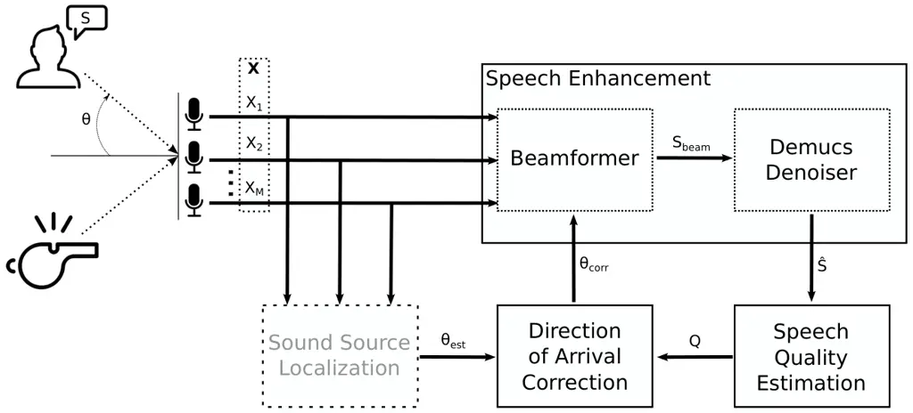
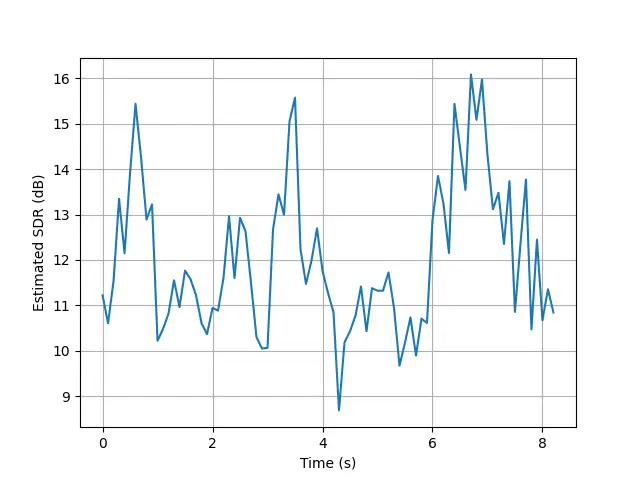
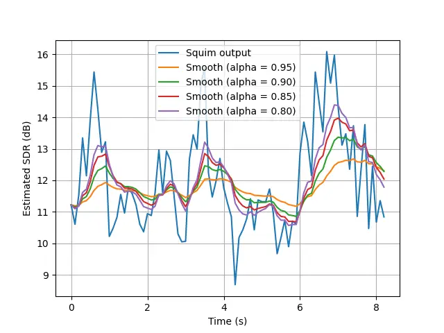
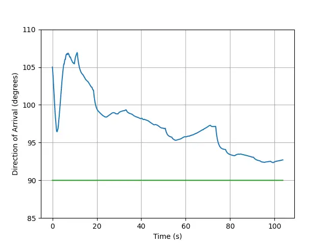
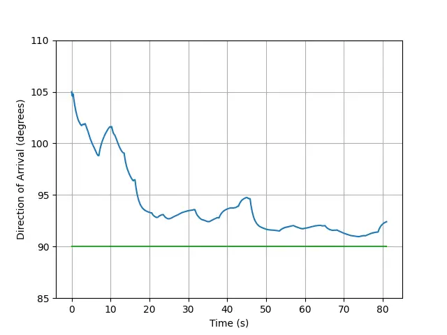
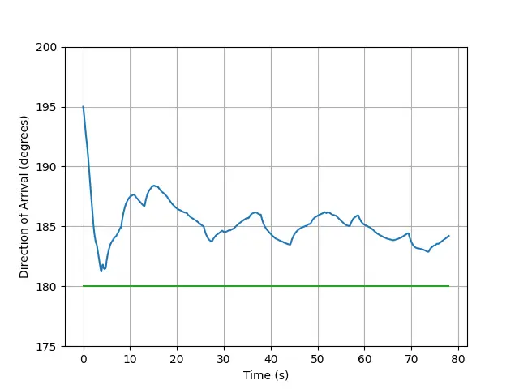
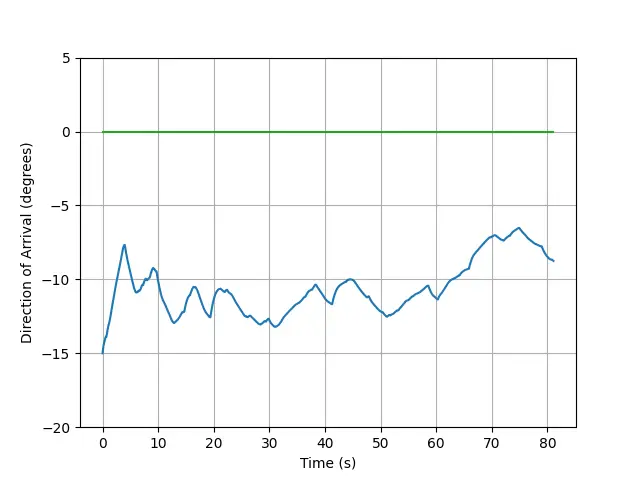

# Direction of Arrival Correction through Speech Quality Feedback

Journal: Digital Signal Processing

Caleb Rascon Email: <caleb@unam.mx> Affiliation: Universidad Nacional
Autonoma de Mexico, Circuito Escolar 3000, Mexico, 03740, CDMX, Mexico

###### Abstract

Real-time speech enhancement has began to rise in performance, and the
Demucs Denoiser model has recently demonstrated strong performance in
multiple-speech-source scenarios when accompanied by a location-based
speech target selection strategy. However, it has shown to be sensitive
to errors in the direction-of-arrival (DOA) estimation. In this work, a
DOA correction scheme is proposed that uses the real-time estimated
speech quality of its enhanced output as the observed variable in an
Adam-based optimization feedback loop to find the correct DOA. In spite
of the high variability of the speech quality estimation, the proposed
system is able to correct in real-time an error of up to $`15^{o}`$
using only the speech quality as its guide. Several insights are
provided for future versions of the proposed system to speed up
convergence and further reduce the speech quality estimation
variability.

###### Keywords: 

beamforming , squim , adam , exponential smoothing , real-time

## 1 Introduction

In real-life scenarios where a speech source of interest is present, and
is of interest to process and analyze, various other audio sources
typically coexist in the acoustic environment. This results in a mixture
of the target speech source and these other sources, referred here to as
‘interferences’, being captured in conjunction. Additionally, there are
other effects that occur in real-life scenarios, such as noise and
reverberation. All of these are aimed to be removed from the mixture,
such that only the target speech source remains. This task, known as
"speech enhancement," has shown significant advancements through deep
learning methods \[1\].

When conducted offline (using previously recorded audio), speech
enhancement has benefited various applications such as security \[2\]
and music production \[3, 4\]. Additionally, there is interest in
performing speech enhancement in an online manner (using live audio
capture), since it holds promise for a diverse range of applications,
including real-time automatic speech recognition \[5\], sound source
localization in robotics \[6\], hearing aids \[7\], mobile
communications \[8\], and teleconferencing \[9\].

It should be noted that carrying out a process in an online manner and
in “real-time” are usually distinguishable. Online processing only
requires that the execution is carried out within a time frame shorter
than the capture time. While real-time processing, in addition to the
latter constraint, also requires to meet specific latency or response
time requirements that are application-dependent \[10, 11\]. For the
sake of simplicity, this work focuses solely on meeting the
execution-time-less-than-capture-time criterion, and the terms “online
processing” and “real-time processing” are used inter-changeably.

To this effect, the online speech enhancement technique know as Demucs
Denoiser \[12\] has recently demonstrated superior performance compared
to several other advanced methods when running in real-time \[13\]. It
achieves excellent enhancement results, typically achieving an output
signal-to-interference ratio exceeding 20 dB, even when using very short
window segments (0.064 s). This positions it as a representative example
of current advancements in online speech enhancement technologies.

However, similar to other speech enhancement techniques, the Demucs
Denoiser model operates under a crucial assumption: that there is only
one speech source in the mixture. This assumption may not pose a
significant issue in applications like mobile telecommunication \[8\]
and teleconferencing \[9\], which typically involve one user speaking at
a time. However, in contexts such as service robotics \[6\] and hearing
aids \[7\], where multiple speech sources are expected, using speech
enhancement techniques may not be suitable. In such cases, “speech
separation” techniques \[14\] could be more appropriate, as they aim to
separate multiple speech sources into distinct audio streams. However,
while speech enhancement techniques can be executed in real-time, speech
separation techniques as of yet are not typically suitable for online
applications \[13\].

It has been demonstrated that when inputting a mix of speech sources
into contemporary online speech enhancement techniques, some algorithms
isolate the speech mixture from non-speech sources, whereas others, such
as Demucs Denoiser, prioritize enhancing the “loudest” speech source
\[13\]. To this effect, the work in \[15\], which this work is based on,
proposed two target selection strategies so as to “nudge” Demucs
Denoiser towards the speech source of interest. The strategy that
generally outperformed the other was the one that selects the target
speech through its location (specifically, its direction of arrival).
However, it was found to be very sensitive to localization errors.

In this work, a direction-of-arrival (DOA) correction mechanism is
proposed to supplement this previous work, based on maximizing the
speech quality measured in the audio output. A feedback loop is
implemented, where the speech quality is used by an optimization
mechanism as the observed variable, and a ‘corrected’ DOA as its
controlled variable. This corrected DOA is fed back to the
location-based speech enhancement to obtain a new speech quality
estimation, repeating the process to find the correct DOA.

This work has the following structure: Section 2 details the proposed
system and all of its modules; Section 3 shows how the proposed system
works in a real-time scenario, it also discusses its limitations and
insights for future versions; finally, conclusions and future work are
presented in Section 4.

## 2 Proposed System

The proposed system is presented in a general manner in Figure 1. In
summary, the microphone array input
($`\boldsymbol{X}=[X_{1},X_{2},\cdot,X_{M}]`$) is fed to both the speech
enhancement module (detailed in Section 2.1) and a sound source
localization technique. This technique is not part of the proposed
system, since it is assumed that its localization estimation
($`\theta_{est}`$) may have errors that the proposed system aims to
correct. The output of the speech enhancement ($`\hat{S}`$) is the
output of the proposed system, which is fed back through the speech
quality estimation module that provides a quality measurement ($`Q`$) of
the system’s output. This measurement is used by the
direction-of-arrival correction module, in conjunction with the
localization estimation ($`\theta_{est}`$), to provide a corrected
direction-of-arrival ($`\theta_{corr}`$) to be used by the speech
enhancement module, with the aim to provide a higher quality output.



Figure 1: Overall proposed methodology.

In the following sections, these three modules are detailed. It is
important to mention that, for reasons of reproducibility and ease of
testing, the implementation of the proposed system is available at
[https://github.com/balkce/doacorrection](https://github.com/balkce/doacorrection),
which includes the direction of arrival correction module, the speech
quality estimation module, and the trained Demucs Denoiser sub-module.
As for the beamformer sub-module, its implementation is available at
[https://github.com/balkce/beamformer2](https://github.com/balkce/beamformer2).

### 2.1 Speech Enhancement

The speech enhancement module is based on the location-based target
selection strategy detailed in \[15\], which for completeness sake is
summarized here.

The Demucs Denoiser model \[12\] has been shown to be effective at
carrying out speech enhancement in an online manner, with relatively
minimal computational power and a low response time \[13\]. However, in
this later study \[13\] it was also shown that, as with any other
current speech enhancement technique, the Demucs Denoiser model assumes
that only one speech source is present in the input mixture. In the case
of multiple speech source, it was shown that it tends to separate the
“loudest” speech source in the input mixture. Thus, it requires a target
selection strategy to appropriately select the speech source of interest
(SOI). In \[15\], two strategies were explored, and the one based on the
location of the SOI provided good results.

The location-based strategy requires to know the location of the SOI in
relation to the microphone array as a direction of arrival ($`\theta`$),
which can be provided by a diverse set of sound source localization
techniques \[6\]. The target selection strategy uses a phase-based
frequency-masking beamformer \[16\] to create a preliminary estimation
of the SOI ($`S_{beam}`$). Although it may not be able to remove all the
interferences (and even inserts some musical artifacts in its
estimation), it does increase the energy of the SOI compared to the rest
of the sound sources in the mixture. Such increase is enough so that the
Demucs Denoiser model ‘picks it up’ as the speech source to aim for and
separate from the mixture.

However, in \[15\] it was also shown that the location-based target
selection strategy is very sensitive to localization errors. A location
error of 0.1 m resulted in a 5 dB drop in the average output
signal-to-interference ratio (SIR), as well as a considerable increase
in result variability. Several approaches were proposed as future work
in \[15\] to circumvent this issue, such as:

- 1.  Re-train the Demucs Denoiser model with data that is the result of
      artificially inserting location errors. It is to be noted that the
      author of \[15\] did attempt to do this, but the Demucs Denoiser model
      seemed to not be able to internally correct for such issues. However,
      no further tests were carried in this front (and are out of the scope
      of this work), which does mean that this approach may still merit
      exploring.
- 2.  Incorporate a robust localization method. Although it is also worth
      exploring, it does not fix any issues within the speech enhancement
      module; it just ‘pushes’ the responsibility elsewhere.
- 3.  Incorporate a quality metric as feedback to correct the beamformer.
      This is the approach explored in this work.

To this effect, it is essential to have a quality metric to carry out
this approach. This is detailed in the following section.

### 2.2 Speech Quality Estimation

The proposed system requires that the quality of the enhanced speech is
measured in an online manner. This is a research problem onto itself,
with two main challenges: 1) assessing the quality of the enhanced
signal without a reference signal to compare it to; and 2) doing so in a
window-by-window basis (since the whole input signal is unavailable). As
for the first challenge, there have been several approaches that have
attempted to solve it \[17, 18, 19, 20, 21, 22\].

The approach employed in this work is the model known as Squim \[17\].
The reasoning behind this selection is that: 1) it is one of the most
recent, outperforming earlier approaches; 2) it is quite popular (and,
thus, tested by the community) and already implemented as part of
Torchaudio \[23\], the deep learning framework employed here; and 3)
although it has not been reported as such, it is actually able to be run
online (partially solving the second aforementioned challenge). To
further this last point, its response times were measured as part of
this work, using different capture window lengths ($`t_{w}`$), which are
shown in Table 1.

| Capture Time $`t_{w}`$ | Response Time          |
| ---------------------- | ---------------------- |
| (seconds)              | \[Min, Max\] (seconds) |
| 1.0                    | \[0.0234, 0.0242\]     |
| 2.0                    | \[0.0310, 0.0425\]     |
| 3.0                    | \[0.0538, 0.0704\]     |

Table 1: Squim response times.

Considering that these tests were carried out with a low-power GPU
(Nvidia GTX 1050 Ti), these are very good response times. A time step
($`t_{h}`$) of 0.1 s is more than enough to measure the quality of the
last 3.0 s of captured audio ($`t_{w}`$).

Additionally, Squim assumes that there is speech activity in its input,
which may not always be the case. This can be solved by the use of voice
activity detection as pre-processing step. To this effect, the
Silero-VAD technique \[24\] was chosen because of its good performance,
while providing low response times and requiring low computing power. To
provide a smooth transition between quality estimations, the latest
$`t_{w}`$ window is divided into smaller windows of length $`t_{vad}`$,
and Silero-VAD is applied to each of them. If more than $`3/4`$ of the
total amount of these $`t_{vad}`$ windows have active speech, the latest
$`t_{w}`$ window is fed to Squim to obtain a quality estimation. This
results in a series of continuous quality estimations through time, each
calculated from the latest $`t_{w}`$ window of the input signal that has
active speech.

However, even when applying a VAD pre-processing step, Squim provides
very ‘noisy’ quality estimations through time, as shown in Figure 2
(with $`t_{h}=0.1`$ and $`t_{w}=3.0`$).



Figure 2: Quality estimated by Squim through time.

As it will detailed later, the direction of arrival correction module
works well with a ‘smooth’ input/observed signal, which is not the case
with the Squim output. To overcome this issue, exponential smoothing is
applied, as presented in (1).

```math
Q_{k}\leftarrow\alpha Q_{k}+(1-\alpha)Q_{k-1} \tag{1}
```

where $`Q_{k}`$ is the quality estimation at the $`k`$ moment in time,
and $`\alpha`$ is a smoothing factor in the range of $`[0,1]`$ with
higher values providing smoother results but less responsiveness to
underlying changes, and vice-versa. In Figure 3, results are shown when
applying different values of $`\alpha`$ to the quality estimations
through time.



Figure 3: Squim smoothened through time.

It can be seen that in all cases the final smoothened result is
considerably less variable than the original Squim output. The
$`\alpha`$ value of 0.9 is a good balance between providing a smooth
output and still being somewhat responsive to underlying changes.

The complete speech quality estimation module is shown in Algorithm 1.

1: $`t_{h}`$: step length

2: $`t_{w}`$: capture time

3: $`t_{vad}`$: VAD window length

4: $`\alpha`$: smoothing factor

5: $`n_{total}\leftarrow\frac{t_{w}}{t_{vad}}`$ $`\triangleright`$ total
number of $`t_{vad}`$ windows in $`t_{w}`$ window

6: Initialize: $`k\leftarrow 0`$

7: loop

8:   wait $`t_{h}`$ seconds

9:   $`w_{k}\leftarrow`$ latest captured $`t_{w}`$ window

10:   $`n_{act}\leftarrow`$ Silero-VAD$`(w_{k})`$ $`\triangleright`$
number of active $`t_{vad}`$ windows in $`w_{k}`$

11:   if $`n_{act}>\frac{3}{4}n_{total}`$ then

12:    $`Q_{k}\leftarrow`$Squim$`(w_{k})`$

13:    $`Q_{k}\leftarrow\alpha Q_{k}+(1-\alpha)Q_{k-1}`$

14:    $`Q\leftarrow Q_{k}`$

15:   end if

16:   $`Q\to`$ direction of arrival correction module $`\triangleright`$
output $`Q`$

17:   $`k\leftarrow k+1`$

18: end loop

Algorithm 1 Online speech quality estimation.

### 2.3 Direction of Arrival Correction

Once the quality ($`Q`$) of a given past audio window has been provided,
the direction of arrival correction module uses such information to
correct the localization ($`\theta_{est}`$) estimated by a sound source
localization technique. It does this by aiming to find the direction of
arrival ($`\theta_{corr}`$) that maximizes $`Q`$.

The Adam optimization method \[25\] is very popular in the deep learning
community \[26\], typically used to find the weights of a given model
that maximizes its performance. It has been mathematically proven to
converge a non-convex objective function \[27\], which is of great
relevance to this work, given the estimated quality variability shown in
Figure 3. For this to be the case, however, it is required that the
objective function be twice continuously differentiable. Unfortunately,
this is not something that is ensured by purely smoothing the output of
the speech quality estimation module (as described in the previous
section). However, it does seem to provide an objective function that is
‘close’ to satisfying such requirement.

Additionally, Adam is well fit to carry out its optimization process in
an online manner, and because of its simplicity, a low response time can
be assumed. It dynamically changes the updating factor of the controlled
variable (which in this case is $`\theta`$) during its optimization
process, considering the gradient of the optimized value (which in this
case is $`Q`$). Adam then proceeds to use the first and second
derivative of past gradients, by way of an exponentially decaying
average. Both derivatives, respectively, correspond to the gradient’s
mean (or ‘momentum’) and its uncentered variance. All of this in
conjunction results in it avoiding ‘getting stuck’ in local optima.

The Adam-based quality optimization process is presented in Algorithm 2.

1: $`t_{h}`$: step length

2: $`\beta_{m},\beta_{v}`$: forgetting factors for momentum ($`m`$) and
variance ($`v`$)

3: $`\eta`$: learning rate

4: Initialize: $`\nabla m\leftarrow 0`$

5: Initialize: $`\nabla v\leftarrow 0`$

6: Initialize: $`\theta_{p}\leftarrow 0`$ $`\triangleright`$ force an
appropriate gradient at the start

7: Initialize: $`\theta_{c}\leftarrow\theta_{est}`$ $`\triangleright`$
$`\theta_{est}`$ from a sound source localization technique

8: Initialize: $`Q_{p}\leftarrow 0`$

9: Initialize: $`Q_{c}\leftarrow 0`$

10: loop

11:   $`\theta_{c}\to\theta:`$ to speech enhancement module
$`\triangleright`$ output $`\theta`$

12:   wait $`t_{h}`$ seconds

13:   $`Q_{p}\leftarrow Q_{c}`$

14:   $`Q_{c}\leftarrow Q:`$ from speech quality estimation module

15:   $`Q_{c}\leftarrow 100-Q_{c}`$ $`\triangleright`$ convert $`Q_{c}`$
to a minimizable value

16:
  $`\nabla Q\leftarrow\frac{Q_{c}-Q_{p}}{\theta_{c}-\theta_{p}+\epsilon}`$
$`\triangleright`$ calculate quality gradient

17:   $`\nabla m\leftarrow\beta_{m}\nabla m+(1-\beta_{m})\nabla Q`$
$`\triangleright`$ update momentum and variance

18:   $`\nabla v\leftarrow\beta_{v}\nabla v+(1-\beta_{v})\nabla Q^{2}`$

19:   $`\theta_{p}\leftarrow\theta_{c}`$

20:
  $`\theta_{c}\leftarrow\theta_{c}-\eta\frac{\nabla m}{\sqrt{\nabla v}+\epsilon}`$
$`\triangleright`$ update $`\theta`$ with both gradients

21: end loop

Algorithm 2 Adam-based quality optimization.

As it can be seen, it requires the current and past quality estimations
($`Q_{c}`$ and $`Q_{p}`$, respectively), as well as the current and past
direction of arrivals ($`\theta_{c}`$ and $`\theta_{p}`$, respectively).
Three configurable parameters are meant to be set: the ‘forgetting’
factors (as they are commonly known) for both the momentum and the
variance ($`\beta_{m}`$ and $`\beta_{v}`$, respectively); as well as the
learning rate ($`\eta`$) to update the direction of arrival.

It is important to mention that the Adam optimizer \[25\] was originally
intended as a minimization process. However, it is used here to maximize
the speech quality. Thus, in the implementation shown in Algorithm 2,
the result from the speech quality estimation module is subtracted from
$`100`$ so that $`Q_{c}`$ bares a value that is aimed to be minimized.

It is also important to mention that the optimization process shown in
Algorithm 2 does not carry out the original Adam implementation, which
usually includes bias correction to avoid ‘getting stuck’ at the
beginning of the optimization process. This is appropriate when the
objective function is differentiable; this, in turn, implies that its
current value can be robustly predicted given past values. However, as
it was explained in the previous section, the output of the speech
quality estimation module is not able to satisfy this assumption. Thus,
in Algorithm 2 no bias correction is carried out as part of the
Adam-based optimization.

The sound source localization estimation ($`\theta_{est}`$) is used at
the starting point of the optimization process, established as the first
value of $`\theta_{c}`$. Furthermore, $`\theta_{p}`$ is initialized at 0
so that the first calculated quality gradient has a ‘reasonable’ value.
If it is initialized with the same value as $`\theta_{p}`$, the first
calculated quality gradient would be equivalent to
$`\frac{Q_{c}}{\epsilon}`$, which results in an astronomical value.
This, in turn, would make the mean and variance calculations have very
similar values throughout the first iterations, effectively ‘halting’
the optimization process in the mean time. It would only begin to update
adequately until that first calculated gradient is ‘forgotten’, which
may take a considerable amount of iterations, given its enormous value.

It is also worth pointing out that the quality gradient ($`\nabla Q`$)
is calculated using only the current and past data points. This means,
that the instantaneous gradient is used. Additionally, $`\theta_{est}`$
is not used again during the optimization process. Although it would be
worth exploring the impact of using more data points to calculate
$`\nabla Q`$, as well as updated values of $`\theta_{est}`$ throughout
the optimization process, it is left for future work. For the time
being, the current proposal of the Adam-based optimization process seems
to be enough to provide reasonable results, as it can be seen in the
following section.

## 3 Results

### 3.1 Implementation and Evaluation

A multi-channel recording from the AIRA corpus \[28\] was used to test
the proposed system. The recording bares two sound sources located at 1
m from the center of the microphone array, which has a triangular shape.
There is a microphone at each vertex of the triangle; the
inter-microphone distance is of 0.18 m. The source of interest is
located at around $`0^{o}`$, and the interference is located at around
$`90^{o}`$. The same recording was used throughout the tests so as to
not have it be a source of variability that may impede comparability
between results.

A simple multi-channel reproduction program (referred here as
ReadMicWavs) was built using the JACK audio connection toolkit \[29\] to
feed the recording to the proposed system in real-time, so as to emulate
a live microphone signal. Thus, all the results shown in the following
sections are from tests that were carried out in an online manner. JACK
was chosen given its well-standing performance to capture and reproduce
multi-channel audio in real-time, with good inter-microphone
synchronicity \[30, 31\].

To connect all of the previously described modules, ROS2 \[32\] was used
along with a custom message type called jackaudio that holds: the window
of audio data, its length and a timestamp. ROS2 was chosen since it has
been widely used, mainly in the robotics and automation community \[33,
34\], for near real-time communication between modules, and has shown
great potential to be used with low-power hardware \[35\].

As mentioned before, the beamformer used is the phase-based frequency
masking technique \[16\], implemented as part of the beamform2 ROS2
package (which can be accessed at
[https://github.com/balkce/beamformer2](https://github.com/balkce/beamformer2)).

ReadMicWavs uses the transport protocol in JACK to feed the recording
(as if it were a real-time captured signal) to beamform2, which acts as
the beamformer sub-module shown in Figure 1. This sub-module uses the
direction of arrival (that was fed to it through the theta ROS2 topic)
to spatially filter the sound source of interest. Its results are
published through the jackaudio ROS2 topic (using the custom message
type of the same name), which are fed to the demucs ROS2 node which acts
as the Demucs Denoiser sub-module in Figure 1. The results from
beamform2 are enhanced by demucs, which are published through the
jackaudio_filtered ROS2 topic (using the jackaudio custom message type).
These results are fed to the online_sqa ROS2 node, which acts as the
speech quality estimation module in Figure 1. Its quality estimations
are published through the SDR ROS2 topic and are fed to the doacorrect
ROS2 node, which acts as the direction of arrival correction module in
Figure 1. This module optimizes the speech quality by modifying the
direction of arrival, which is published through the aforementioned
theta topic, closing the loop to the beamform2 node.

Because of the multi-modular nature of ROS2, the theta topic can also be
published by a node other than doacorrect, which provides flexibility
for future versions of the proposed system.

The values of the parameters (detailed previously) during testing are as
follows:

- 1.  Capture time ($`t_{w}`$): 3.0 s
- 2.  Time step ($`t_{h}`$): 0.1 s
- 3.  VAD window size ($`t_{vad}`$): 0.032 s
- 4.  Smoothing factor ($`\alpha`$): 0.9
- 5.  Momentum ‘forgetting’ factor ($`\beta_{m}`$): 0.9
- 6.  Variance ‘forgetting’ factor ($`\beta_{v}`$): 0.999

$`t_{w}`$ and $`t_{h}`$ were chosen considering the information shown in
Table 1. $`\beta_{m}`$ and $`\beta_{v}`$ were chosen based on the
recommendation in \[25\], that are typically used in other works as
well. $`\alpha`$ was chosen considering what is discussed in Section
2.2.

To observe the overall repeatability of the proposed system’s behavior,
several ‘runs’ were carried out with each configuration. Additionally,
as it will be seen, several of these ‘runs’ do not provide an
appropriate behavior: the system gets ‘lost’ and the corrected DOA is
not near the correct DOA. To this effect, a ‘good’ run is here defined
as one that in its last third of its run-time, the average $`\theta`$ is
less than $`5^{o}`$ from the correct DOA.

### 3.2 Effect of Learning Rate ($`\eta`$)

The learning rate parameter ($`\eta`$) is one of the cornerstones of the
proposed system. To observe its effect, several runs were carried out
using different values. The results are shown in Figure 4, where the
dark blue line is the mean $`\theta`$ at each moment in time, and the
space below and above such line represents the standard deviation (as a
measure of variability).

(a) $`\eta=0.01`$.

(b) $`\eta=0.1`$.

(c) $`\eta=0.2`$.

(d) $`\eta=0.3`$.

Figure 4: Effect of $`\eta`$. 5 runs with $`\theta_{est}=15^{o}`$.

From these results, it can be surmised that a low $`\eta`$ value (such
as 0.01, shown in Figure 6a) gets ‘stuck’ early on the optimization
process, but it provides more consistent (less variable) results. On the
other hand, a high $`\eta`$ value (such as 0.3, shown in Figure 6d) does
not get ‘stuck’ as easily, but provides much less consistent (more
variable) results and tends to overshoot the target. A good balance
between these two scenarios is a $`\eta`$ value of 0.1 (shown in Figure
4b) which provides consistent results, while not getting ‘stuck’ at the
start and not overshooting the target.

### 3.3 Effect of Bias Correction Removal

To validate the removal of the bias correction in the Adam-based
optimization shown in Algorithm 2, two tests were carried out as
previously described, the results of which are shown in Figure 5. The
difference between these two tests is that one was carried out using
bias correction (Figure 5a), and the other without (Figure 5b).

(a) With bias correction.

(b) Without bias correction.

Figure 5: Effect of bias correction. 30 runs with
$`\theta_{est}=15^{o}`$.

As it can be seen, when applying bias correction, no ‘good’ runs were
observed and no tendency towards the correct DOA can be observed. This
is opposed to when no bias correction is carried out, in which a
considerably amount of ‘good’ runs are observed and the overall tendency
of the system is toward the correct DOA. This demonstrates that the
overall response of the proposed system is improved when not applying
bias correction in the Adam-based quality optimization.

### 3.4 Effect of Estimated Direction of Arrival ($`\theta_{est}`$)

To observe the effect of the estimated direction of arrival, several
runs were carried out varying the estimated direction of arrival
($`\theta_{est}`$), and the results are shown in Figure 6. This
variation simulates scenarios in which a sound source localization
technique provides an estimated direction of arrival with varying
degrees of error.

(a) $`\theta_{est}=1^{o}`$.

(b) $`\theta_{est}=5^{o}`$.

(c) $`\theta_{est}=10^{o}`$.

(d) $`\theta_{est}=15^{o}`$.

(e) $`\theta_{est}=20^{o}`$.

(f) $`\theta_{est}=25^{o}`$.

Figure 6: Effect of $`\theta_{est}`$. 30 runs with $`\eta=0.1`$.

As it can be seen, the proposed system is able to correct the DOA when
$`\theta_{est}`$ is less than $`20^{o}`$ away from the correct DOA. From
$`20^{o}`$ onward, the amount of ‘good’ runs is reduced considerably,
with $`\theta_{est}=25^{o}`$ being the limit with which it is not able
to ‘recover’. Additionally, it can also be seen that as the error in
$`\theta_{est}`$ increases, the more time it takes the proposed system
to reach a value near the correct DOA.

It is worth pointing out that when $`\theta_{est}=1^{o}`$, the proposed
system actually inserts a DOA error instead of correcting it, even
though its starting DOA is close to the correct DOA. It will be
discussed further in Section 3.6, but this is due to the fact that the
system is not able to converge in a single value (because of the input
variability and the nature of the optimization approach). Future efforts
are to be made so that the proposed system behavior is more stable.

Another noteworthy case is when $`\theta_{est}=15^{o}`$, which is an
outlier of the following tendency: as $`\theta_{est}`$ gets farther from
the correct DOA, the lower amount of ‘good’ runs. This is due to the
fact that the proposed system’s behavior starts with a noticeable
downward ‘push’ (which is the result of the $`\theta_{p}\leftarrow 0`$
step in Algorithm 1), and that its size is dependent on the value of the
first quality estimation. In fact, a tendency of the size of this
downward can be observed in Figure 6, where the closer $`\theta_{est}`$
is to the correct DOA, the lower this downward ‘push’. This turned out
to specifically benefit the case when $`\theta_{est}=15^{o}`$, since
that initial downward ‘push’ makes the proposed system land close enough
to the correct DOA (probably just inside the valley of the global
optimum in the search space) such that the subsequent DOA correction
requires only to refine its result. Its important to mention that the
value of $`\eta`$ was chosen while $`\theta_{est}`$ was set at
$`15^{o}`$, so this is evidence of a type of over-fitting of the
system’s behavior. As it will be discussed in Section 3.6, it is then of
great interest to explore an automatic parameter calibration scheme that
involves the selection of all the parameters in conjunction so as to
obtain a more generalizable optimization behavior. Having said all of
this, the combination of $`\alpha=0.9`$ and $`\eta=0.1`$ seems to be
providing an acceptable optimization performance given that
$`\theta_{est}<20^{o}`$.

### 3.5 Other Direction of Arrivals and More Intereferences

To further inspect the generalizability of the proposed system, another
test was carried out when $`\theta_{est}=105^{o}`$, which is closer to
the other source located at $`90^{o}`$. The result is shown in Figure 7.



Figure 7: Result when $`\theta_{est}=105^{o}`$, near the other source
located at $`90^{o}`$.

As it can be seen, the proposed system got close ($`\pm 5^{o}`$) to the
correct DOA.

Additionally, it is also of interest to explore the proposed system’s
performance with more interferences present. In Figure 8, the results
are shown of a 3-source scenario, one located at around $`90^{o}`$,
another at around $`180^{o}`$, and the third at around $`0^{o}`$. The
three runs, respectively, had $`\theta_{est}=105^{o}`$,
$`\theta_{est}=195^{o}`$, and $`\theta_{est}=-15^{o}`$ (a $`15^{o}`$
initial error). As it can be seen, the two first runs got close
($`\pm 5^{o}`$) to the correct DOA. The second run didn’t got as close,
but its definitely trending towards the correct DOA.



(a) $`\theta_{est}=105^{o}`$.



(b) $`\theta_{est}=195^{o}`$.



(c) $`\theta_{est}=-15^{o}`$.

Figure 8: Results of running with more interferences.

### 3.6 Discussion

As far as the author knows, this is the first successful attempt to
carry out real-time direction-of-arrival correction by only using as
feedback the estimated speech quality. Overall, the proposed system is
performing this task well. However, there are some issues that need to
be considered for later versions of the proposed system.

First off, the system can be considered slow. In general, a ‘good’ run
takes up to 40 seconds (as shown in Figure 6d) to reach a value near the
correct DOA. Unfortunately, accelerating the optimization process
requires increasing the learning rate, which results in the system
getting ‘lost’ more frequently. Also, the proposed system seems to be
sensitive to the initial circumstances in which the DOA correction was
carried out (which is the reason why several runs were needed to be
carried out for each test). It is the belief of the author that this is
due to the high variability of the quality estimations. The causes of
this may be many-fold. For one, the quality estimations are initially
provided by Squim which are highly variable. Additionally, although ROS2
is presumed to be able to run in real-time, the manner in which it
interacts with a true real-time server, such as JACK, may result in an
overrun: where the execution time of a given input data window ends up
being higher than its capture time. The rate of this occurrence appears
to be agnostic to the response time of the system (which is quite low,
as will be discussed later); a possible reason is that the internal
communication mechanisms of ROS2 are not built to be truly run in
real-time. In any case, when an overrun occurs, a zero-valued output
data window is returned, resulting in small “breaks” (or silences) in
the enhanced signal. The quality estimation is then affected, resulting
in more variability. All of this in conjunction makes it difficult for
the optimization process to converge in a single value. Instead, a
slight but continuous variation of the corrected DOA is observed, the
average of which is usually close ($`\pm 5^{o}`$) to the correct DOA.
However, in cases when the initial DOA estimated by the sound source
localization technique is already close to the correct DOA (as in the
case of Figure 6a), the optimization process will introduce errors in an
already close-to-correct estimated DOA.

In addition, it was observed that when the source was not well enhanced
in its ideal state (when accurately located from the start), the quality
estimation objective function provided little to no quality improvement
compared to other values of $`\theta_{est}`$. This resulted in a sparse
search space that is difficult to optimize. Fortunately, in these cases,
the behavior of the proposed system still ‘tended’ towards the correct
DOA (exemplified in Figure 8c), which implies the need for more time to
converge.

Thus, the optimization process would benefit from using other types of
approaches, such as those applied in control engineering \[36, 37\], to
handle the input variability while being fast to converge in a single
steady value. Also, although substituting ROS2 as the inter-module
communication framework is outside the scope of this work, it would be
of interest to explore ways that make the real-time interaction between
ROS2 and JACK be more seamless.

Next, it can be assumed that if and when the proposed system converges
on the correct DOA, the speech quality is maximized. Thus, it can be
argued that the proposed system is carrying out, simultaneously, both
DOA correction and speech quality maximization. However, the latter was
not discussed here because the main focus of this first version of the
proposed system is DOA correction. Also, it is suspected that the speech
quality improvement is minimal. To be fair, this assessment was obtained
informally during the implementation of the proposed system, where the
resulting speech was subjectively evaluated. Thus, it is left for future
work to formally assess the speech quality improvement, as well as its
impact in other possible subsequent steps in the audio processing data
flow, such as sound source classification or speech recognition.

Furthermore, the only parameters whose impact on the system’s behavior
was characterized in this work was of $`\eta`$ and of $`\alpha`$. The
former resulted in a type of over-fitting to the specific case of
$`\theta_{est}=15^{o}`$ (as shown in Figure 6), while the latter was
admittedly very superficial and subjectively chosen. First off, the
impact of the values of other parameters (such as $`\beta_{m}`$, and
$`\beta_{v}`$) are also worth exploring. It would be of interest to
observe how their values, in conjunction, impact the system’s
optimization behavior. Additionally, it would be of interest to create
an automatic parameter calibration scheme that could run alongside the
proposed system and provide a more dynamic and off-the-shelf
application.

Moreover, it was observed how the bias correction in the Adam-based
optimization was making the proposed system get ‘stuck’ prematurely.
This is counter-intuitive, since the main objective of the bias
correction is to avoid Adam getting stuck at the beginning of the
optimization process. However, given that the objective function is not
differentiable, it was expected that the original Adam implementation
would need modification to work well. Interestingly, since no bias
correction is being carried out, this also means that the global optimum
can be considered as dynamic, opposed to the assumption of global
optimum staticity in the original Adam implementation. This opens the
possibility to track mobile sound sources in later versions of the
proposed system.

Additionally, it was observed that the Adam-based optimization was
better served when the speech quality estimation module had run for a
short while ($`\sim 10`$ s) before running the DOA correction module. It
appears that the combination of the Squim model and the exponential
smoothing requires some initial data to provide a ‘moderately stable’
objective function signal. This, in turn, creates an initial state that
avoids the Adam-based optimization getting ‘lost’ at the start.

Finally, since the proposed system is aimed to be run in real-time, it
is of interest to know its response time. Since all the modules shown in
Figure 1 run in parallel, the overall response time is based solely on
the ‘slowest’ module. To this effect, the beamfomer sub-module runs as a
client of JACK, which has a maximum latency of 0.021 s (as it was
configured); during testing, this sub-module showed a response time
close to half that amount, with a minimal amount of overruns occurring
($`<5`$ in an hour long evaluation). The direction-of-arrival correction
module runs a simple Adam-based optimization process, which bares a
response time lower than 0.001 s. The speech enhancement sub-module runs
the Demucs model that has a measured response time between 0.006 and
0.009 s to enhance a window of 0.063 s. And the speech quality
estimation module runs the Squim model which, as shown in Table 1, has a
measured response time between 0.0538 and 0.0704 s to measure the
quality of a 3-second window. Since this last module is the slowest, the
system’s response time is between 0.0538 and 0.0704 s.

## 4 Conclusions

Speech enhancement carried in an online manner is of great interest to
various areas of application. However, doing so using
deep-learning-based models has shown to be challenging, given their low
response time. To this effect, recent efforts have been made to not only
making this type of models run in real-time while still providing
comparable performance, as is the case of the Demucs Denoiser model, but
also making them be able to focus on a given speech source of interest
in a multi-speech environment. One of these efforts uses the location
(mainly, the direction of arrival) of the source of interest to make
Demucs Denoiser “focus” on it. However, this effort has been proven to
be sensitive to location errors.

In this work, a direction-of-arrival correction system is proposed that
is based on maximizing the speech quality of the speech enhancer.
Through a feedback loop, the quality estimation is carried out via the
Squim model, whose output is post-processed using exponential smoothing,
to provide a close-to-differentiable objective function. An Adam-based
optimization scheme is then applied to find the direction of arrival
that maximizes such function.

It was shown that the proposed system works well, in that it is able to
correct the direction of arrival towards the correct location. However,
it was found that the system is sensitive to the learning rate of the
Adam-based optimization, of which a recommended value was provided.
Making the process less sensitive towards such value, as well as
reducing the variability of the speech quality estimations, is of great
interest and will be carried out as future work.

## Acknowledgements

The author would like to acknowledge the support of PAPIIT-UNAM through
the grant IN100624.

## References

- \[1\] N. Das, S. Chakraborty, J. Chaki, N. Padhy, N. Dey,
  Fundamentals, present and future perspectives of speech enhancement,
  International Journal of Speech Technology 24 (4) (2021) 883–901.
- \[2\] S. E. Eskimez, P. Soufleris, Z. Duan, W. Heinzelman, Front-end
  speech enhancement for commercial speaker verification systems, Speech
  Communication 99 (2018) 101–113.
- \[3\] A. Porov, E. Oh, K. Choo, H. Sung, J. Jeong, K. Osipov,
  H. Francois, Music enhancement by a novel cnn architecture, in: Audio
  Engineering Society Convention 145, Audio Engineering Society, 2018.
- \[4\] K. Lopatka, A. Czyzewski, B. Kostek, Improving listeners’
  experience for movie playback through enhancing dialogue clarity in
  soundtracks, Digital Signal Processing 48 (2016) 40–49.
- \[5\] H. Shi, M. Mimura, T. Kawahara, Waveform-domain speech
  enhancement using spectrogram encoding for robust speech recognition,
  IEEE/ACM Transactions on Audio, Speech, and Language Processing
  (2024).
- \[6\] C. Rascon, I. Meza, Localization of sound sources in robotics: A
  review, Robotics and Autonomous Systems 96 (2017) 184–210.
- \[7\] T. Green, G. Hilkhuysen, M. Huckvale, S. Rosen, M. Brookes,
  A. Moore, P. Naylor, L. Lightburn, W. Xue, Speech recognition with a
  hearing-aid processing scheme combining beamforming with mask-informed
  speech enhancement, Trends in Hearing 26 (2022) 23312165211068629.
- \[8\] Q. Zhang, D. Wang, R. Zhao, Y. Yu, J. Shen, Sensing to hear:
  Speech enhancement for mobile devices using acoustic signals,
  Proceedings of the ACM on Interactive, Mobile, Wearable and Ubiquitous
  Technologies 5 (3) (2021) 1–30.
- \[9\] W. Rao, Y. Fu, Y. Hu, X. Xu, Y. Jv, J. Han, Z. Jiang, L. Xie,
  Y. Wang, S. Watanabe, et al., Conferencingspeech challenge: Towards
  far-field multi-channel speech enhancement for video conferencing, in:
  2021 IEEE Automatic Speech Recognition and Understanding Workshop
  (ASRU), IEEE, 2021, pp. 679–686.
- \[10\] D. W. Leinbaugh, Guaranteed response times in a hard-real-time
  environment, IEEE Transactions on Software Engineering (1) (1980)
  85–91.
- \[11\] M. Joseph, P. Pandya, Finding response times in a real-time
  system, The Computer Journal 29 (5) (1986) 390–395.
- \[12\] A. Défossez, G. Synnaeve, Y. Adi, Real Time Speech Enhancement
  in the Waveform Domain, in: Proc. Interspeech 2020, 2020, pp.
  3291–3295.
  [doi:10.21437/Interspeech.2020-2409](https://doi.org/10.21437/Interspeech.2020-2409).
- \[13\] C. Rascon, Characterization of deep learning-based
  speech-enhancement techniques in online audio processing applications,
  Sensors 23 (9) (2023) 4394.
- \[14\] D. Wang, J. Chen, Supervised speech separation based on deep
  learning: An overview, IEEE/ACM transactions on audio, speech, and
  language processing 26 (10) (2018) 1702–1726.
- \[15\] C. Rascon, G. Fuentes-Pineda, Target selection strategies for
  demucs-based speech enhancement, Applied Sciences 13 (13) (2023) 7820.
- \[16\] C. Rascon, A corpus-based evaluation of beamforming techniques
  and phase-based frequency masking, Sensors 21 (15) (2021) 5005.
- \[17\] A. Kumar, K. Tan, Z. Ni, P. Manocha, X. Zhang, E. Henderson,
  B. Xu, Torchaudio-squim: Reference-less speech quality and
  intelligibility measures in torchaudio, in: ICASSP 2023-2023 IEEE
  International Conference on Acoustics, Speech and Signal Processing
  (ICASSP), IEEE, 2023, pp. 1–5.
- \[18\] S.-W. Fu, Y. Tsao, H.-T. Hwang, H.-M. Wang, Quality-net: An
  end-to-end non-intrusive speech quality assessment model based on
  blstm, arXiv preprint arXiv:1808.05344 (2018).
- \[19\] C.-C. Lo, S.-W. Fu, W.-C. Huang, X. Wang, J. Yamagishi,
  Y. Tsao, H.-M. Wang, Mosnet: Deep learning based objective assessment
  for voice conversion, arXiv preprint arXiv:1904.08352 (2019).
- \[20\] X. Dong, D. S. Williamson, A pyramid recurrent network for
  predicting crowdsourced speech-quality ratings of real-world signals,
  arXiv preprint arXiv:2007.15797 (2020).
- \[21\] B. Cauchi, K. Siedenburg, J. F. Santos, T. H. Falk, S. Doclo,
  S. Goetze, Non-intrusive speech quality prediction using modulation
  energies and lstm-network, IEEE/ACM Transactions on Audio, Speech, and
  Language Processing 27 (7) (2019) 1151–1163.
- \[22\] K. Shen, D. Yan, Z. Ye, X. Xu, J. Gao, L. Dong, C. Peng,
  K. Yang, Non-intrusive speech quality assessment with attention-based
  resnet-bilstm, Signal, Image and Video Processing 17 (7) (2023)
  3377–3385.
- \[23\] Y.-Y. Yang, M. Hira, Z. Ni, A. Astafurov, C. Chen, C. Puhrsch,
  D. Pollack, D. Genzel, D. Greenberg, E. Z. Yang, et al., Torchaudio:
  Building blocks for audio and speech processing, in: ICASSP 2022-2022
  IEEE International Conference on Acoustics, Speech and Signal
  Processing (ICASSP), IEEE, 2022, pp. 6982–6986.
- \[24\] Silero Team, Silero vad: pre-trained enterprise-grade voice
  activity detector (vad), number detector and language classifier,
  [https://github.com/snakers4/silero-vad](https://github.com/snakers4/silero-vad)
  (2021).
- \[25\] D. P. Kingma, J. L. Ba, Adam: A method for stochastic
  optimization, in: 3rd International Conference on Learning
  Representations, ICLR 2015, 2015, pp. 1–15.
- \[26\] Z. Zhang, Improved adam optimizer for deep neural networks, in:
  2018 IEEE/ACM 26th international symposium on quality of service
  (IWQoS), Ieee, 2018, pp. 1–2.
- \[27\] S. Bock, M. Weiß, A proof of local convergence for the adam
  optimizer, in: 2019 international joint conference on neural networks
  (IJCNN), IEEE, 2019, pp. 1–8.
- \[28\] C. Rascon, I. V. Meza, A. Millan-Gonzalez, I. Velez,
  G. Fuentes, D. Mendoza, O. Ruiz-Espitia, Acoustic interactions for
  robot audition: A corpus of real auditory scenes, The Journal of the
  Acoustical Society of America 144 (5) (2018) EL399–EL403.
- \[29\] S. Letz, D. Fober, Y. Orlarey, jackdmp: Jack server for
  multi-processor machines, in: Linux Audio Conference, 2005, pp. 29–36.
- \[30\] J. Newmarch, J. Newmarch, Jack, Linux sound programming (2017)
  143–177.
- \[31\] S. Letz, N. Arnaudov, R. Moret, What’s new in jack2?, in: Linux
  Audio Conference, 2009, pp. 1–9.
- \[32\] S. Macenski, T. Foote, B. Gerkey, C. Lalancette, W. Woodall,
  Robot operating system 2: Design, architecture, and uses in the wild,
  Science robotics 7 (66) (2022) eabm6074.
- \[33\] M. Reke, D. Peter, J. Schulte-Tigges, S. Schiffer, A. Ferrein,
  T. Walter, D. Matheis, A self-driving car architecture in ros2, in:
  2020 International SAUPEC/RobMech/PRASA Conference, IEEE, 2020, pp.
  1–6.
- \[34\] E. Erős, M. Dahl, K. Bengtsson, A. Hanna, P. Falkman, A ros2
  based communication architecture for control in collaborative and
  intelligent automation systems, Procedia Manufacturing 38 (2019)
  349–357.
- \[35\] Y. Maruyama, S. Kato, T. Azumi, Exploring the performance of
  ros2, in: Proceedings of the 13th international conference on embedded
  software, 2016, pp. 1–10.
- \[36\] Y. Wang, S. Boyd, Fast model predictive control using online
  optimization, IEEE Transactions on control systems technology
  18 (2) (2009) 267–278.
- \[37\] Y. Shtessel, C. Edwards, L. Fridman, A. Levant, et al., Sliding
  mode control and observation, Vol. 10, Springer, 2014.
