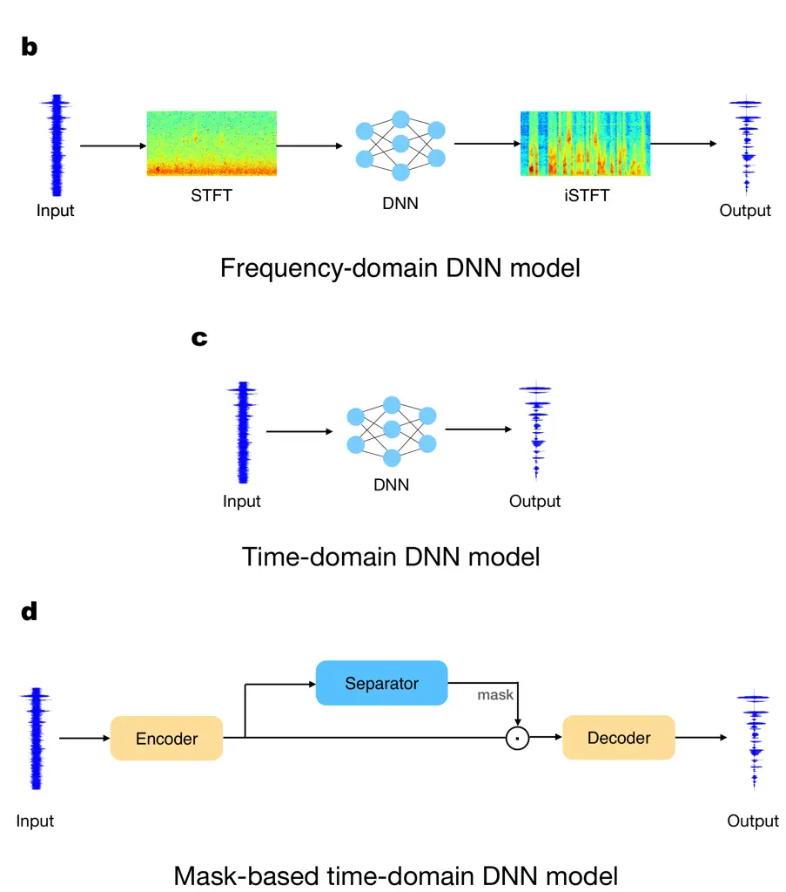

# DPSNN: Spiking Neural Network for Low-Latency Streaming Speech Enhancement

Tao Sun¹, Sander Bohté ² Affiliation:  Affiliation: Machine Learning
Group, CWI, Amsterdam, The Netherlands  
Email: ¹tao.sun@cwi.nl, ²sbohte@cwi.nl

###### Abstract

Speech enhancement (SE) improves communication in noisy environments,
affecting areas such as automatic speech recognition, hearing aids, and
telecommunications. With these domains typically being power-constrained
and event-based while requiring low latency, neuromorphic algorithms in
the form of spiking neural networks (SNNs) have great potential. Yet,
current effective SNN solutions require a contextual sampling window
imposing substantial latency, typically around 32ms, too long for many
applications. Inspired by Dual-Path Spiking Neural Networks (DPSNNs) in
classical neural networks, we develop a two-phase time-domain streaming
SNN framework – the Dual-Path Spiking Neural Network (DPSNN). In the
DPSNN, the first phase uses Spiking Convolutional Neural Networks
(SCNNs) to capture global contextual information, while the second phase
uses Spiking Recurrent Neural Networks (SRNNs) to focus on
frequency-related features. In addition, the regularizer suppresses
activation to further enhance energy efficiency of our DPSNNs.
Evaluating on the VCTK and Intel DNS Datasets, we demonstrate that our
approach achieves the very low latency (approximately 5ms) required for
applications like hearing aids, while demonstrating excellent
signal-to-noise ratio (SNR), perceptual quality, and energy efficiency.

## I Introduction

Speech enhancement refines and clarifies spoken communication in the
presence of undesirable noisy conditions \[1\]. Beyond automatic speech
recognition (ASR) and speaker recognition, effective speech enhancement
is also vital in domains such as hearing aids and mobile
telecommunications. Machine learning methods, particularly deep neural
networks (DNNs), in the last decade have emerged as the main approach
for speech enhancement \[2, 3, 4, 5, 6, 7, 8, 9, 10\].

For many SE applications, low-latency processing is critical to ensure
satisfactory speech communication, like for hearing aids \[11\].
Latency, also called processing latency, is defined as the delay between
the input of an audio signal and the corresponding output of the
processed signal (Figure 1a). Latency is decomposed into two components,
algorithmic latency and hardware latency, where algorithmic latency
refers to the latency caused by algorithmic constraints, while hardware
latency denotes the time needed by the hardware to process an input unit
\[12\]. Current DNN-based SE solutions, particularly time-domain DNN
models that directly handle and predict waveform signals, have achieved
both high accuracy and low algorithmic latency at the same time \[11\].
However, due to their large network sizes, these DNN solutions are
usually energetically costly, limiting their applicability within the
many power-constrained environments \[13\].

The development of spiking neural networks (SNNs) and associated
neuromorphic hardware \[13\] for speech enhancement is mainly motivated
by their potential for energy efficiency, where the temporal nature of
speech signal processing plays to the strengths of SNNs to handle
dynamic, time-dependent tasks \[13\]. Increased energy efficiency would
extend battery life and enable smaller form factors for SE devices like
headsets, earbuds, hearing aids, and cochlear implants.



Fig. 1: a, The algorithmic latency in block-based models consists of a
buffering latency and a look-ahead latency. The buffering latency
matches the frame-shift length (i.e. block size), whereas the look-ahead
latency results from the extra look-ahead within a frame, typically used
to provide additional processing context to improve performance. b, A
frequency-domain DNN model transforms a noisy audio signal to its T-F
representation by the STFT and then fed it into a neural network. c,
Inputs and outputs to the time-domain DNN models are both time-domain
signals. d, Mask-based time-domain DNN models commonly adopt an
encoder-separator-decoder architecture.

Early DNN-based SE solutions typically worked in the frequency-domain,
where noisy audio signals are first transformed into Time-Frequency
(T-F) representations through the Short Time Fourier Transform (STFT)
and then fed into a neural network (Figure 1b). During STFT, audio
signals are divided into overlapping frames, each of which is then
transformed into frequency forms. A frequency-based solution typically
takes an individual frame as input and produces a block as output. As
shown in the Figure 1a, the length of an input frame is sum of the
length of an output block and a future context. This setting implies
that the production of a block is contingent upon the analysis of the
entire frame. As a result, the algorithmic latency to output a block is
equal to duration of a frame, which consists of duration of a block
(buffering latency) and a future context (look-ahead latency) \[12\].
Since the frame length impacts both the time and frequency resolutions
of a T-F representation, the block size and future context play an
important role in determining the performance of a frequency-domain
speech enhancement method. To trade-off between the time and frequency
resolutions, and thus ensure enhancement performance, frequency-domain
DNN solutions usually choose a large frame length as long as 32 ms \[14,
12\], which causes the SE algorithm to incur an algorithmic latency of
32 ms. Although such latency is tolerable in some applications like
audio communication \[15\], it cannot provide a satisfactory listening
experience in some application scenarios, such as hearing aid, where the
permissible delay tolerance ranges from 20 to 30 ms \[11\]. The Clarity
speech enhancement challenge \[16\], targeting at hearing aid, even has
the latency requirement as low as 5 ms. In contrast, time-domain models
(Figure 1c), where input and output to the DNNs are both in the
time-domain form, have realized low-latency enhancement by applying very
short frame size; as a result, in the 2022 Clarity challenge, nearly all
leading solutions were time-domain based DNN models \[12\].

Fig. 2: The proposed DPSNN adopts the encoder-separator-decoder
architecture. The encoder uses convolutions to convert waveform signals
into encoded 2D feature maps, effectively replacing the function of
STFT. In the separator, 2D masks are calculated, primarily relying on
the SCNN and SRNN modules that capture the temporal and frequency
contextual information of the encoded feature maps, respectively. After
applying the masks to the feature maps from the encoder, the decoder
transforms the masked feature maps back to enhanced waveform signals.

Yet, to the best of our knowledge, current SNN-based SE solutions are in
the frequency-domain, leading to long latencies (typically 32 ms) \[17,
18, 19\]. While these approaches have demonstrated satisfactory
enhancement performance, their prolonged latencies make them impractical
for applications requiring low latency. To tackle this issue, we here
design a novel time-domain streaming SNN model for speech enhancement,
achieving low latency through applying small frame sizes. Inspired from
the success of Dual-Path Recurrent Neural Networks (DPRNNs) \[10\], our
model applies a two-phase framework to capture rich contexts for
sequence modeling. As illustrated in Figure 2, the model, dubbed
Dual-Path Spiking Neural Network (DPSNN), first converts noisy signals
into a 2D feature map via a convolution that functions similarly to the
STFT, but with a significantly smaller kernel size, leading to much
lower latency. A DPSNN then consists of two distinct modules, a Spiking
Convolutional Neural Network (SCNN) module and a module based on Spiking
Recurrent Neural Networks (SRNN) \[20\], to separate clean signals from
noisy inputs. The initial phase of a DPSNN works with the SCNN module
and captures contextual information along the temporal direction of the
2D feature map. The subsequent phase, via the SRNN module, then
integrates context along the frequency direction of the 2D feature map.
Taken together, this approach allows the use of a small frame size and
achieves correspondingly low latency. Additionally, our DPSNN applies
threshold-based and regularizer-based activation suppressions \[21\] to
specific non-spiking layers, creating more sparse representations and
thus enhancing energy-efficiency of the DPSNN model.

We conduct thorough evaluations of proposed DPSNNs using experiments on
the VCTK database \[22\] and Intel DNS Dataset \[13\], yielding
excellent performance across latency, energy efficiency, and speech
enhancement metrics.

## II Related work

### II-A Time-domain solutions

Time-domain approaches can be divided into mapping-based and mask-based
methods \[23\]. Mapping-based models typically apply an encoder-decoder
architecture, directly mapping noisy inputs to denoised outputs \[24,
25, 26, 27\]. Mask-based methods (Figure 1d), and in particular the
TasNets (Time-domain Audio Separation Network) models \[8, 9, 10\],
adopt an encoder-separator-decoder architecture and have demonstrated
excellent performance in both separation and latency metrics \[11, 12\].
In their encoders, a trained convolutional layer functions similar to an
STFT to generate 2D spatiotemporal features, from which masks are
computed in the separator. These masks are then multiplied with the
spatiotemporal features to produce enhanced features. Lastly, the
separated enhanced features are reverted to waveforms in the decoder
which is comprised of a deconvolution layer. In the mask-based method,
the kernel size of the convolution in the encoder is equivalent
functionally to the frame size of the STFT. As such, the latency of a
TasNet is determined by the kernel size used in its encoder. In the
original TasNet framework \[8\], LSTM networks were employed within the
separator to compute the mask. To alleviate the computational burden
associated with such LSTM networks, Conv-TasNet \[9\] proposed the use
of dilated convolutions in place of LSTMs within the separator, allowing
for smaller kernel sizes and strides in convolutions within the encoder,
enhancing its suitability for low-latency applications. To also
effectively capture long sequential inputs, DPRNNs (Dual-Path RNNs) were
introduced \[10\], the separator of which consisted of two sequential
RNNs processing shorter chunks of input signals: the first RNN operates
within each chunk in parallel, integrating local frequency-related
contexts, while the second RNN operates across chunks to capture
long-term temporal information.

### II-B Speech enhancement with SNNs

The Intel Neuromorphic Deep Noise Suppression Challenge (Intel N-DNS
Challenge) focused on speech enhancement tasks as a high potential
application domain. The Challenge winner, Spiking-FullSubNet, combined
two frequency domain approaches, using a full-band model and a sub-band
model \[28\]. The full-band model here captured dependencies between
frequency bands, while the sub-band model handled each band
independently. Additionally, the Gated Spiking Neuron (GSN) was
introduced in this model, where membrane potentials are calculated
through time constants that could vary at each time step. Another
competitive approach, Spiking Structured State Space Model (SpikingS4)
\[18\], builds on the concept of structured state space modeling, while
the Spiking-UNet \[19\] combines the UNet architecture with SNNs for
single-channel noise reduction. Despite their strong performance in
speech enhancement metrics, these SNN models, being frequency-domain
methods, are unable to meet low-latency requirements in demanding
application scenarios (e.g., hearing aid) without substantial
modifications. \[12\].

## III Methods

### III-A Problem setup

Speech enhancement improves the quality of speech signals by reducing or
eliminating additive noise. The primary goal is to enhance the
intelligibility and perceptual quality of speech in various real-world
environments where noise interference is present.

One common approach to formally modeling speech enhancement involves the
use of signal processing techniques to model the relationship between
the observed noisy speech signal $`y[n]`$, the clean speech signal
$`s[n]`$, and the additive noise signal $`v[n]`$. The noisy signal
$`y[n]`$ can be expressed as the sum of the clean speech signal and the
additive noise:

```math
\displaystyle y[n]=s[n]+v[n]. \tag{1}
```

The goal of speech enhancement is then to estimate or reconstruct the
clean speech signal $`s[n]`$ from the observed noisy signal $`y[n]`$.
The enhanced speech signal $`\tilde{s}[n]`$ is written as:

```math
\displaystyle\tilde{s}[n]=f(y[n]). \tag{2}
```

Speech enhancement is closely related to speech separation; the key
difference being that speech enhancement aims to improve the quality of
a noisy speech signal by removing or suppressing the unwanted noise,
whereas speech separation focuses on separating individual speakers or
sound sources from a mixture of multiple audio sources.

### III-B Spiking neural networks (SNNs)

SNNs typically use similar network topologies as ANNs, yet SNNs employ
stateful, binary-valued spiking neurons as their computational units.
Consequently, inference in SNNs unfolds iteratively across multiple time
steps $`t=0,1,...,T`$: at each time step $`t`$, the internal state in
the form of the membrane potential $`u_{t}`$ is influenced by incoming
spikes from connected neurons emitted at time step $`t-1`$, as well as
the neuron’s previous potential $`u_{t-1}`$. Upon reaching a threshold
$`\theta`$, the neuron emits a spike, and typically does so sparingly.
This sparse and asynchronous communication among connected neurons
enables SNNs to potentially achieve high energy-efficiency.

Various spiking neuron models exist, ranging from the intricate and
biologically detailed Hodgkin-Huxley model to the simplified
Leaky-Integrate-and-Fire (LIF) neuron model \[29\]. For machine learning
applications, SNNs mostly employ LIF spiking neurons, and variants
thereof, due to their interpretability and computational efficiency.
Resembling an RC circuit, the LIF neural model is mathematically
represented as:

```math
\tau_{m}\frac{du}{dt}=-(u-u_{rest})+RI, \tag{3}
```

where $`u_{rest}`$ denotes the resting potential of the neuron, $`I`$
expresses the input current, R is the membrane resistance, and
$`\tau_{m}`$ represents the membrane time constant.

The discrete approximation of (3) can be expressed as

```math
\displaystyle u_{t} \displaystyle=\left(1-\frac{1}{\tau_{m}}\right)u_{t-1}+\frac{1}{\tau_{m}}\left(u_{rest}+RI_{t}\right) \tag{4}
```

```math
\displaystyle s_{t} \displaystyle=\Theta\left(u_{t}-\theta\right) \tag{5}
```

```math
\displaystyle u_{t} \displaystyle=u_{t}(1-s_{t})+u_{rest}s_{t} \tag{6}
```

where equation (4) describes subthreshold neural dynamics of a neuron;
$`I_{t}=\Sigma_{i}w_{i}s_{t-1}^{i}`$ is the input current from the
pre-synaptic neurons, where $`s_{t-1}^{i}`$ indicates whether a
pre-synaptic neuron $`i`$ spikes in the last time step $`t-1`$;
$`\Theta`$ in (5) is Heaviside step function deciding whether a neuron
spikes; equation (6) calculates the final potential of a neuron in a
time step.

For training SNNs, Surrogate Gradient (SG) methods \[30, 20\] and LIF
neurons with learnable model parameters \[20, 31\] have enhanced the
performance of SNNs and enabled straightforward supervised trainability.
In \[31\], Parametric LIF (PLIF) neurons are introduced where the time
constant $`\tau_{m}`$ of a LIF neuron is learnable and shared by all
neurons in one layer. In PLIF neurons, to ensure
$`1-\frac{1}{\tau_{m}}<1`$, $`\tau_{m}`$ is calculated through a sigmoid
function,

```math
\tau_{m}=\frac{1}{k(a)}=\frac{1}{1+e^{-a}}. \tag{7}
```

In \[32\], adaptive LIF (ALIF) neurons used, where both time constants
$`\tau_{m}`$ and $`\tau_{a}dp`$ are learnable in each individual LIF
neuron. Additionally, the threshold of a neuron increases after spiking
and then decays with a time constant $`\tau_{adp}`$. Dynamics in ALIF
neurons can be written as

```math
\displaystyle\eta_{t}=\rho\eta_{t-1}+(1-\rho)s_{t-1} \tag{8}
```

```math
\displaystyle\theta=b_{0}+\beta\eta_{t} \tag{9}
```

```math
\displaystyle u_{t}=\alpha u_{t-1}+(1-\alpha)RI_{t}-s_{t-1}\theta, \tag{10}
```

where $`\alpha=\exp(-dt/\tau_{m})`$ and $`\rho=\exp(-dt/\tau_{adp})`$
express decay of the membrane potential and threshold, respectively. In
equation (9), $`\theta`$ is a dynamical threshold consisting of a
constant minimal $`b_{0}`$ and an adaptive part $`\eta_{t}`$, whose
coefficient $`\beta`$ is a constant controlling adaptation of the
threshold.

### III-C Architecture

Fig. 3: a, In the mask-based encoder-separator-decoder architecture, the
encoder converts overlapping frames into 1D features through convolution
and aligns them into a 2D feature map. Each 1D feature is processed in
one time step in the subsequent spiking layers. b, In the SCNN layer, a
group convolution is applied along the temporal axis of a feature map to
capture temporal contextual information. c, The SRNN layer is a
fully-connected recurrent spiking layer that integrates contexts along
the frequency direction of its input 2D feature map. d, Readout is done
using a fully-connected readout layer with non-spiking neurons, where
the membrane potential of these neurons is calculated and output without
any spiking or resetting.

As shown in Figure 3a, our speech enhancement model adopts the
mask-based encoder-separator-decoder architecture. An encoder first
takes overlapping waveform frames, each with a length of $`L`$, as
inputs and converts these frames into features with $`N`$ channels
through a linear transformation, specifically a one-dimensional (1D)
convolution and a ReLU activation function. Those features, aligned
together, then form a two-dimensional (2D) feature map.

The separator learns a mask to extract clean signals from noisy inputs.
This is achieved using two spiking modules, SCNN and SRNN (Figure 3b and
3c, respectively). Initially, the 2D feature map generated by the
encoder passes through a layer normalization layer, followed by a
bottleneck $`1\times 1`$ convolution layer, resulting in an output with
$`B`$ channels. To reduce computations in the subsequent SCNN layer, an
activation suppression operation \[21\] with a learnable threshold is
applied to binarize the output, converting values below the threshold to
zeros and values above it to ones. After processing through the SCNN and
SRNN layers, the output is fed into a fully-connected readout layer
using non-spiking neurons, as illustrated in Figure 3d. The readout
layer’s activations are also subjected to suppression by a learnable
threshold, converting values below it to zeros while keeping values
above it intact. This suppressed output is then passed through a
$`1\times 1`$ convolution layer with a Sigmoid activation function to
produce a mask for clean signals. Finally, the input features,
multiplied by the mask computed by the separator, are converted back to
a one-dimensional (1D) enhanced signal by the encoder, which comprises
of a deconvolutional layer.

The following provides more details on the SCNN and SRNN layers.

##### SCNN layer

The SCNN layer takes in the features output by the binarized bottleneck
layer and integrates context along its temporal direction. Specifically,
a group convolution is carried out along the temporal axis of a feature
map ($`b`$ channels) to integrate contexts of a predefined number of
previous time steps (Figure 3b), producing an output feature map with
$`H`$ channels. For one time step of this layer, each input channel is
convolved with its own set of $`\frac{H}{B}`$ filters; the input feature
map is zero-padded before the first time step. Within this module, we
use PLIF neurons \[31\]. To train PLIF neurons, the surrogate gradient
function introduced in \[31\] is used, where we use as surrogate
gradient the function
$`\sigma(x)=\frac{1}{\pi}\arctan(\pi x)+\frac{1}{2}`$.

##### SRNN layer

The SRNN layer, based on the SRNNs introduced in \[20\], is a
fully-connected recurrent layer of spiking neurons that captures
contexts along the frequency direction to extract frequency-related
features. Taking the output from the SCNN layer, it produces outputs
with $`B`$ channels. We use adaptive LIF (ALIF) neurons \[32\] in this
layer; for training, the multi-Gaussian surrogate gradient \[20\] is
used.

In this design, the SCNN layer captures contextual information across
the temporal axis of the encoder’s feature map, while the SRNN layer
integrates context along the frequency axis. As we will demonstrate,
together they form a robust separator capable of precise mask
generation, particularly effective for handling extended audio sequences
while incurring low-latency.

## IV Experiments

We assess the robustness of a speech processing model through training
and testing on two primary datasets: the VCTK dataset and the Intel DNS
dataset based on the MS DNS challenge dataset. The experiments
encompassed both monolingual and multilingual aspects and considered
various noise conditions.

### IV-A Datasets

##### VCTK Datasets

The VCTK Database encompasses 10 hours of speech data, with most
utterances lasting no more than 5 seconds, and some as brief as 2-3
seconds. The training set, downsampled from 48kHz to 16kHz, comprises
11,575 sentences. This training dataset involves 28 speakers (14 male
and 14 female), all sharing the same English accent region. Each speaker
contributes around 400 sentences, providing a diverse and representative
collection. The training dataset includes a set of 10 noises consisting
of 2 artificially generated noise signals (speech-shaped noise and
babble) and 8 real noises sourced from the Demand database. Four
Signal-to-Noise Ratios (SNRs) are considered: 15 dB, 10 dB, 5 dB, and 0
dB, resulting in 40 distinct noise conditions for comprehensive
training. The testing set for VCTK consists of 827 sentences and
includes two speakers (one male and one female). To simulate real-world
conditions, five additional noises from the Demand database are
introduced under four SNRs: 17.5 dB, 12.5 dB, 7.5 dB, and 2.5 dB,
yielding a total of 20 noise conditions for evaluation. For VCTK, we
compare to the Spiking-UNet \[19\], the sole SNN model reporting results
on this dataset.

##### Intel DNS Dataset

The Intel DNS Dataset, derived from the MS DNS Challenge dataset \[13\],
contains 500 hours of speech data distributed across both training and
validation sets. Each set comprises of 60,000 samples. The dataset
incorporates a range of Signal-to-Noise Ratios (SNRs) from 20 dB to -5
dB, providing varied and challenging scenarios. Each utterance within
the Intel DNS dataset maintains a fixed duration of 30 seconds. Speech
samples include English, German, French, Spanish, and Russian.

### IV-B Evaluation metrics

To assess the performance of our speech processing model, we use two
distinct types of evaluation metrics: Signal-to-Noise Ratio (SNR)
metrics and Perception metrics.

#### IV-B1 SNR Metrics

For the evaluation of Signal-to-Noise Ratios, we primarily use the
Scale-invariant Signal-to-Noise Ratio (SI-SNR) \[33\]. Crucially, SI-SNR
exhibits scale invariance, meaning alterations to the overall magnitude
(volume) of the output do not impact SI-SNR.

The SI-SNR is defined as:

```math
\text{SI-SNR}:=10log_{10}\frac{||\mathbf{s}_{target}||_{2}}{||\mathbf{e}_{noise}||_{2}}, \tag{11}
```

where
$`\mathbf{s}_{target}:=\frac{\mathbf{\tilde{s}}\cdot\mathbf{s}}{||\mathbf{s}||_{2}^{2}}\mathbf{s}`$
and $`\mathbf{e}_{noise}:=\mathbf{\tilde{s}}-\mathbf{s}_{target}`$.

#### IV-B2 Perceptual Metrics

The first perceptual metric we use is the Perceptual Estimation of
Speech Quality (PESQ) \[34\]. PESQ evaluates speech quality by comparing
the original and processed speech signals at the perceptual level,
taking into account factors such as distortion, noise, and speech
intelligibility. It ranges from $`-0.5`$ to $`4.5`$, with higher scores
indicating better perceived quality.

We also calculate DNSMOS (Distributed Network Speech Mean Opinion Score)
to evaluate perceptual quality. Mean Opinion Score (MOS) serves as a
perceptual metric that utilizes human evaluations to generate an average
opinion score to evaluate perceived speech quality. MOS scores range
from 1 to 5, where 1 signifies poor quality and 5 denotes excellent
quality. In DNSMOS, a deep network is trained to predict the perceptual
quality score, aligning the human perceptual quality expressed in MOS
within its training corpus.

#### IV-B3 Intelligibility Metric

The Short-Time Objective Intelligibility (STOI) metric \[35\] is a
method used to assess the intelligibility of speech signals. STOI is
computed by dividing the short-time cross-correlation between the clean
and degraded signals by the geometric mean of their short-time energies.
The resulting value ranges from 0 to 1, with 1 indicating perfect
intelligibility and 0 indicating no intelligibility.

#### IV-B4 Power Metrics

We apply two power metrics, namely the power proxy and power delay
product (PDP) proxy, both introduced in the Intel N-DNS challenge
\[17\]. The power proxy evaluates the effective number of synaptic
operations per second, while the PDP proxy combines both latency and
power efficiency into a single value. Among these metrics, the PDP proxy
enables comparisons among solutions that manage trade-offs between
latency and power consumption. For frequency-domain DNN models, only the
power consumption of the DNN itself is calculated, excluding the power
consumption of the STFT and iSTFT input-output conversions. When
comparing with these models, we also exclude the power consumption of
the encoder and decoder, the counterparts of STFT and iSTFT, in our
DPSNNs.

### IV-C Training

The loss function used to training our model consists of three
components. The first component ($`L_{si\text{-}snr}`$) maximizes
SI-SNRs of output waveforms. The second component ($`L_{mse}`$) is a
Mean-Square-Error loss that minimizes the squared $`L2`$ norm between
output waveforms and clean waveforms. The third component consists of
the $`L_{1}`$ regularizers \[21\] ($`L_{1_{b}n}`$ and $`L_{1_{r}o}`$)
that penalize the non-zeros activations in the suppressed outputs of the
bottleneck convolution layer and the readout layer, respectively.
Overall, the loss function is:

```math
L=100+L_{si\text{-}snr}+0.001*L_{mse}+\lambda_{2}*L_{1_{b}n}+\lambda_{2}*L_{1_{r}o}, \tag{12}
```

where $`\lambda_{2}`$ and $`\lambda_{3}`$ are determined by grid-search.
In our experiments, we found $`0.001`$ to be a good value for both.

### IV-D Optimizing the network parameters on VCTK

We assess the performance of our model on the VCTK dataset with channel
combinations $`H`$,$`B`$ and $`N`$ and present the results in Table I.
From our evaluation, we draw the following conclusions:

1.  (i)
    Encoder/decoder: Expanding the number of channels enhances spectral
    resolution, thereby improving overall performance.
2.  (ii)
    Channels in the separator: Employing a small bottleneck size $`B`$
    alongside a large number of channels $`H`$ within the spiking
    block(s) proves effective. Additionally, larger $`B`$ values
    consistently outperform smaller ones, a deviation from the findings
    in \[8\] where the optimal $`H/B`$ value was found to be around 5.
    This discrepancy may be attributed to the nature of SNNs, which
    produce binary outputs and therefore require more neurons to convey
    information.

|       |       |       |        |      |        |      |      |        |               |
| ----- | ----- | ----- | ------ | ---- | ------ | ---- | ---- | ------ | ------------- |
|       |       |       |        |      |        |      |      |        |               |
|       |       |       |        |      | DNSMOS |      |      |        |               |
| $`N`$ | $`B`$ | $`H`$ | SI-SNR | PESQ | OVRL   | SIG  | BAK  | Params | Learning rate |
| 256   | 256   | 256   | 18.29  | 2.30 | 2.81   | 3.22 | 3.62 | 372K   | 1e-2          |
| 512   | 128   | 512   | 18.26  | 2.30 | 2.79   | 3.21 | 3.61 | 317K   | 1e-2          |
| 512   | 256   | 512   | 18.34  | 2.32 | 2.85   | 3.23 | 3.73 | 613K   | 7.5e-3        |
| 512   | 512   | 512   | 18.48  | 2.36 | 2.86   | 3.24 | 3.72 | 1.4M   | 7.5e-3        |
|       |       |       |        |      |        |      |      |        |               |

TABLE I: The effect of different configurations. The length of input
examples are 1 second. The filter length in the encoder $`L=80`$,
resulting in a 5ms latency. Number of the context step is 4.

Examining our approach in detail, we find that the performance of our
model is significantly influenced by the length of input examples, both
for training and for evaluation. We explored our DPSNN models with input
lengths from 1.0 second to 4.0 seconds on VCTK. As illustrated in Figure
4, the model performs better with longer input lengths, achieving the
best SI-SNR result with the 4.0-second example length.

Fig. 4: Influence of the length of input examples on model performance.
The channels in the model are $`N=512,B=256,H=512`$. The filter length
in the encoder is $`L=80`$, resulting in a 5ms latency. The size of the
context step is 4.

We further assessed the impact of the context steps in the SCNN module
on performance. As shown in Table II , models with four context steps
generally achieve better results than those with two or eight context
steps, both in terms of SNR metrics and perceptual metrics.

|               |        |      |        |      |      |
| ------------- | ------ | ---- | ------ | ---- | ---- |
|               |        |      | DNSMOS |      |      |
| Context steps | SI-SNR | PESQ | OVRL   | SIG  | BAK  |
| 2             | 18.28  | 2.29 | 2.81   | 3.20 | 3.67 |
| 4             | 18.34  | 2.32 | 2.85   | 3.23 | 3.73 |
| 8             | 18.16  | 2.29 | 2.79   | 3.21 | 3.60 |
|               |        |      |        |      |      |

TABLE II: Influence of context steps in SCNN on the model performance.
The length of input examples are 1 second. The channels in the model are
$`N=512,B=256,H=512`$.

Finally, we conducted experiments to assess models with varying filter
lengths in the encoder ($`L`$). As can be seen in Table III, models with
larger $`L`$ exhibit improved SI-SNRs. We attribute this enhancement to
the larger context provided by a larger $`L`$ for each time step within
the spiking block(s). However, a larger filter length also leads to
higher model latency. Moreover, it seems that filter lengths do not
significantly influence performance in terms of PESQ and DNSMOS. Hence,
to strike a balance between speech performance and latency, we selected
$`L=80`$ for most of our experiments.

|     |              |        |      |        |      |      |
| --- | ------------ | ------ | ---- | ------ | ---- | ---- |
|     |              |        |      | DNSMOS |      |      |
| L   | Latency (ms) | SI-SNR | PESQ | OVRL   | SIG  | BAK  |
| 40  | 2.5          | 17.65  | 2.24 | 2.80   | 3.20 | 3.66 |
| 80  | 5            | 18.34  | 2.32 | 2.85   | 3.23 | 3.73 |
| 160 | 10           | 18.38  | 2.28 | 2.79   | 3.20 | 3.62 |
|     |              |        |      |        |      |      |

TABLE III: Influences of filter lengths in the encoder ($`L`$) on model
performance. The length of input examples are 1 second. The channels in
the model are $`N=512,B=256,H=512`$. Number of the context step is 4.

### IV-E Comparison of DPSNN with previous methods

The comparison of the best performing DPSNN model with previous SNN
models on VCTK is presented in Table IV. First, we find that our model
incurs significantly lower latency (5ms) compared to both the SDNN
baseline model \[19\] and Spiking-UNet \[19\]. Furthermore, our model
outperforms in terms of both DNSMOS and STOI metrics, while the PESQ
performance falls slightly short compared to Spiking-UNet. This
disparity may be attributed to the reliance of PESQ computation on the
magnitude spectrogram of speech, as discussed in \[9\], where a similar
observation was made.

|                      |              |      |        |      |      |      |
| -------------------- | ------------ | ---- | ------ | ---- | ---- | ---- |
|                      |              |      | DNSMOS |      |      |      |
| Model                | Latency (ms) | PESQ | OVRL   | SIG  | BAK  | STOI |
| Noisy                | –            | 1.97 | 2.69   | 3.34 | 3.12 | –    |
| SDNN baseline \[19\] | 32           | 2.00 | 2.44   | 3.05 | 3.09 | 0.91 |
| Spiking-UNet \[19\]  | 32           | 2.66 | 2.81   | 3.13 | 3.85 | 0.92 |
| Ours                 | 5            | 2.37 | 2.94   | 3.27 | 3.84 | 0.93 |

TABLE IV: Evaluation metrics comparisons of the VCTK dataset. The length
of input examples are 4 seconds. The channels in the model are
$`N=512,B=256,H=512`$.

### IV-F Ablation study

We furthermore conducted experiments on VCTK to evaluate the impact of
the SCNN and SRNN layers on our model’s performance. Specifically, we
remove either the SCNN or SRNN layer – the results are shown in Table V.
We find substantial decline in overall performance in either case, in
particular when removing the SCNN module.

|          |        |      |        |      |      |
| -------- | ------ | ---- | ------ | ---- | ---- |
|          |        |      | DNSMOS |      |      |
| Ablation | SI-SNR | PESQ | OVRL   | SIG  | BAK  |
| DPSNN    | 18.48  | 2.36 | 2.86   | 3.24 | 3.72 |
| w/o SCNN | 17.72  | 2.18 | 2.68   | 3.19 | 3.37 |
| w/o SRNN | 18.38  | 2.32 | 2.82   | 3.22 | 3.67 |
|          |        |      |        |      |      |

TABLE V: Ablation study. The length of input examples is 1 second. The
channels in the model are $`N=512,B=512,H=512`$. The filter length in
the encoder $`L=80`$, resulting in a 5ms latency. Number of the context
step is 4.

### IV-G Intel DNS Dataset

For the Intel N-DNS challenge dataset, we compare the DPSNN with several
benchmarks, including the SDNN baseline \[13\], the winning models of
track 1 (Spiking-FullSubNet (Large) and Spiking-FullSubNet (Small)
\[36\]), the runner-up model (CTDNN), and the Spiking S4 model \[18\].
Regarding speech metrics, while our best SI-SNR and SI-SNRi surpass
those of Spiking S4, Spiking-FullSubNet (Small), and CTDNN, our DNSMOS
performances outperforms that of Spiking S4. Most notably, our 5ms
latency significantly outperforms all these models, which exhibit a
latency of 32ms. The power metrics (power proxy and PDP proxy) and
parameter size for the DPSNN exclude the power consumption of the
encoder and decoder – the inclusive numbers are noted in the
parenthesis.

By jointly evaluating latency and power efficiency using the PDP proxy,
our DPSNN models significantly outperforms both leading
Spiking-FullSubNet models. While the SDNN baseline and CTDNN have lower
values in this specific metric, their speech metrics (SI-SNR and/or
DNSMOS) fall well short of those achieved by our DPSNN models. This
highlights the combined capability of DPSNNs in terms of speech quality,
latency, and power consumption.

|                                   |              |        |         |        |      |      |                         |                     |               |
| --------------------------------- | ------------ | ------ | ------- | ------ | ---- | ---- | ----------------------- | ------------------- | ------------- |
|                                   |              |        |         | DNSMOS |      |      |                         |                     |               |
| Model                             | Latency (ms) | SI-SNR | Si-SNRi | OVRL   | SIG  | BAK  | Power proxy \[M-Ops/s\] | PDP proxy \[M-Ops\] | Params        |
| SDNN baseline \[13\]              | 32           | 12.5   | 4.88    | 2.71   | 3.21 | 3.46 | 14.52                   | 0.46                | 0.465M        |
| Spiking-FullSubNet (Large) \[36\] | 32           | 14.80  | 7.43    | 3.03   | 3.33 | 3.96 | 74.10                   | 2.37                | 1.29M         |
| Spiking S4 \[18\]                 | 32           | 14.58  | 7.21    | 2.85   | 3.21 | 3.74 | –                       | –                   | 0.53M         |
| Spiking-FullSubNet (Small) \[17\] | 32           | 13.89  | 6.52    | 2.97   | 3.28 | 3.93 | 29.24                   | 0.94                | 0.953M        |
| CTDNN \[17\]                      | 32           | 13.52  | 6.59    | 2.97   | 3.32 | 3.86 | 61.37                   | 0.49                | 0.90M         |
| DPSNN (4.0-second inputs)         | 5            | 14.54  | 7.18    | 2.88   | 3.27 | 3.72 | 175.2 (208.0)           | 0.88 (1.04)         | 1.32M (1.40M) |
| DPSNN (5.0-second inputs)         | 5            | 14.60  | 7.23    | 2.89   | 3.29 | 3.71 | 180.4 (213.1)           | 0.90 (1.07)         | 1.32M (1.40M) |

TABLE VI: Evaluation metrics comparisons on the Intel DNS dataset. The
filter length (L) in the encoder of DPSNNs is 80. The channels in the
models are $`N=512,B=512,H=512`$. The context step is 12.

## V Conclusion

Speech enhancement is crucial for improving spoken communication in
noisy environments, with applications ranging from automatic speech
recognition to telecommunications. Recognizing the challenges posed by
power constraints and the need for low latency in these domains, we
explored the potential of neuromorphic algorithms through SNNs.

Our research addresses the current limitations of effective SNN
solutions, which typically impose substantial latency due to long
sampling windows. Drawing inspiration from the efficacy of low-latency
DPRNNs in deep learning, we have developed the DPSNN, a novel two-phase
time-domain SNN framework. In this framework, the first phase uses SCNNs
to capture global contextual information, while the second phase employs
SRNNs to focus on frequency-related features. In addition, the
threshold-based activation suppression combined with $`L_{1}`$
regularization loss are applied to specific non-spiking layers to
further enhance energy efficiency of DPSNNs.

Evaluating on benchmark datasets such as VCTK and Intel DNS, our
approach achieves significantly lower latency, approximately 5ms,
compared to current solutions, while maintaining excellent SNR,
perceptual quality, and energy efficiency. The model thus represents a
significant advancement in speech enhancement techniques, promising
improved communication experiences and efficiency across a wide range of
applications.

## VI Acknowledgments

This work was inspired by the discussions in the The CapoCaccia
Workshops toward Neuromorphic Intelligence 2023. The authors also
express their appreciation to Dr. Bojian Yin for his insightful
recommendations concerning SNN training, to Dr. Guangzhi Tang and Dr.
Paul Detterer for their instructive suggestions on model sparsity, and
to Haohui Zhang for his valuable help regarding the figures. TS is
supported by NWO-NWA grant NWA.1292.19.298. SB is supported by the
European Union (grant agreement 7202070 “HBP”).

## References

- \[1\] DeLiang Wang and Jitong Chen. Supervised speech separation based
  on deep learning: An overview. IEEE/ACM Transactions on Audio, Speech,
  and Language Processing, 26(10):1702–1726, 2018.
- \[2\] Yuxuan Wang and DeLiang Wang. Towards scaling up
  classification-based speech separation. IEEE Transactions on Audio,
  Speech, and Language Processing, 21(7):1381–1390, 2013.
- \[3\] Yong Xu, Jun Du, Li-Rong Dai, and Chin-Hui Lee. A regression
  approach to speech enhancement based on deep neural networks. IEEE/ACM
  transactions on audio, speech, and language processing,
  23(1):7–19, 2014.
- \[4\] Ashutosh Pandey and DeLiang Wang. A new framework for supervised
  speech enhancement in the time domain. In Proc. Interspeech 2018,
  pages 1136–1140, 2018.
- \[5\] Timo Gerkmann, Martin Krawczyk-Becker, and Jonathan Le Roux.
  Phase processing for single-channel speech enhancement: History and
  recent advances. IEEE signal processing Magazine, 32(2):55–66, 2015.
- \[6\] Hyeong-Seok Choi, Jang-Hyun Kim, Jaesung Huh, Adrian Kim,
  Jung-Woo Ha, and Kyogu Lee. Phase-aware speech enhancement with deep
  complex u-net. arXiv preprint arXiv:1903.03107, 2019.
- \[7\] Szu-Wei Fu, Ting-yao Hu, Yu Tsao, and Xugang Lu. Complex
  spectrogram enhancement by convolutional neural network with
  multi-metrics learning. In 2017 IEEE 27th international workshop on
  machine learning for signal processing (MLSP), pages 1–6. IEEE, 2017.
- \[8\] Yi Luo and Nima Mesgarani. Tasnet: time-domain audio separation
  network for real-time, single-channel speech separation. In 2018 IEEE
  International Conference on Acoustics, Speech and Signal Processing,
  pages 696–700. IEEE, 2018.
- \[9\] Yi Luo and Nima Mesgarani. Conv-tasnet: Surpassing ideal
  time-frequency magnitude masking for speech separation. IEEE/ACM
  transactions on audio, speech, and language processing,
  27(8):1256–1266, 2019.
- \[10\] Yi Luo, Zhuo Chen, and Takuya Yoshioka. Dual-path rnn:
  efficient long sequence modeling for time-domain single-channel speech
  separation. In ICASSP 2020-2020 IEEE International Conference on
  Acoustics, Speech and Signal Processing (ICASSP), pages 46–50.
  IEEE, 2020.
- \[11\] Szymon Drgas. A survey on low-latency dnn-based speech
  enhancement. Sensors, 23(3):1380, 2023.
- \[12\] Zhong-Qiu Wang, Gordon Wichern, Shinji Watanabe, and Jonathan
  Le Roux. Stft-domain neural speech enhancement with very low
  algorithmic latency. IEEE/ACM Transactions on Audio, Speech, and
  Language Processing, 31:397–410, 2022.
- \[13\] Jonathan Timcheck, Sumit Bam Shrestha, Daniel Ben Dayan Rubin,
  Adam Kupryjanow, Garrick Orchard, Lukasz Pindor, Timothy Shea, and
  Mike Davies. The intel neuromorphic dns challenge. Neuromorphic
  Computing and Engineering, 3(3):034005, 2023.
- \[14\] Yuma Koizumi, Noboru Harada, and Yoichi Haneda. Trainable
  adaptive window switching for speech enhancement. In ICASSP 2019-2019
  IEEE International Conference on Acoustics, Speech and Signal
  Processing (ICASSP), pages 616–620. IEEE, 2019.
- \[15\] T ITU. Recommendation g. 114, one-way transmission time. Series
  G: Transmission Systems and Media, Digital Systems and Networks,
  Telecommunication Standardization Sector of ITU, 2000.
- \[16\] Team Clarity. Clarity challenge: Speech enhancement for hearing
  aids.
  https://claritychallenge.org/ICASSP2023_announcement_page/#page-top, 2024.
  Accessed: (08/10/2024).
- \[17\] The intel neuromorphic dns challenge.
  https://github.com/IntelLabs/IntelNeuromorphicDNSChallenge#metricsboard, 2024.
  Accessed: (04/16/2024).
- \[18\] Yu Du, Xu Liu, and Yansong Chua. Spiking structured state space
  model for monaural speech enhancement. arXiv preprint
  arXiv:2309.03641, 2023.
- \[19\] Abir Riahi and Éric Plourde. Single channel speech enhancement
  using u-net spiking neural networks. In 2023 IEEE Canadian Conference
  on Electrical and Computer Engineering (CCECE), pages 111–116.
  IEEE, 2023.
- \[20\] Bojian Yin, Federico Corradi, and Sander M Bohté. Accurate and
  efficient time-domain classification with adaptive spiking recurrent
  neural networks. Nature Machine Intelligence, 3(10):905–913, 2021.
- \[21\] Zeqi Zhu, Arash Pourtaherian, Luc Waeijen, Egor Bondarev, and
  Orlando Moreira. Star: Sparse thresholded activation under
  partial-regularization for activation sparsity exploration. In 2023
  IEEE/CVF Conference on Computer Vision and Pattern Recognition
  Workshops (CVPRW), pages 4554–4563. IEEE, 2023.
- \[22\] Cassia Valentini-Botinhao et al. Noisy speech database for
  training speech enhancement algorithms and tts models. University of
  Edinburgh. School of Informatics. Centre for Speech Technology
  Research (CSTR), 2017.
- \[23\] Tao Sun. Time-domain Deep Neural Networks for Speech
  Separation. Ohio University, 2022.
- \[24\] Ashutosh Pandey and DeLiang Wang. Tcnn: Temporal convolutional
  neural network for real-time speech enhancement in the time domain. In
  2019 IEEE International Conference on Acoustics, Speech and Signal
  Processing, pages 6875–6879. IEEE, 2019.
- \[25\] Szu-Wei Fu, Yu Tsao, Xugang Lu, and Hisashi Kawai. Raw
  waveform-based speech enhancement by fully convolutional networks. In
  2017 Asia-Pacific Signal and Information Processing Association Annual
  Summit and Conference, pages 006–012. IEEE, 2017.
- \[26\] Shuyu Gong, Zhewei Wang, Tao Sun, Yuanhang Zhang, Charles D
  Smith, Li Xu, and Jundong Liu. Dilated fcn: Listening longer to hear
  better. In 2019 IEEE Workshop on Applications of Signal Processing to
  Audio and Acoustics, pages 254–258. IEEE, 2019.
- \[27\] Craig Macartney and Tillman Weyde. Improved speech enhancement
  with the wave-u-net. arXiv preprint arXiv:1811.11307, 2018.
- \[28\] Team Clairaudience. Clairaudience team’s speech enhancement
  system.
  https://github.com/haoxiangsnr/spiking-fullsubnet/blob/main/Spiking-FullSubNet.pdf, 2024.
  Accessed: (04/16/2024).
- \[29\] Wulfram Gerstner and Werner M Kistler. Spiking Neuron Models:
  Single Neurons, Populations, Plasticity. Cambridge University Press,
  August 2002.
- \[30\] Emre O Neftci, Hesham Mostafa, and Friedemann Zenke. Surrogate
  gradient learning in spiking neural networks: Bringing the power of
  gradient-based optimization to spiking neural networks. IEEE Signal
  Processing Magazine, 36(6):51–63, 2019.
- \[31\] Wei Fang, Zhaofei Yu, Yanqi Chen, Timothée Masquelier, Tiejun
  Huang, and Yonghong Tian. Incorporating learnable membrane time
  constant to enhance learning of spiking neural networks. In CVPR,
  pages 2661–2671, 2021.
- \[32\] Bojian Yin, Federico Corradi, and Sander M Bohté. Effective and
  efficient computation with multiple-timescale spiking recurrent neural
  networks. In International Conference on Neuromorphic Systems 2020,
  pages 1–8, 2020.
- \[33\] Jonathan Le Roux, Scott Wisdom, Hakan Erdogan, and John R
  Hershey. SDR–half-baked or well done? In ICASSP 2019-2019 IEEE
  International Conference on Acoustics, Speech and Signal Processing
  (ICASSP), pages 626–630. IEEE, 2019.
- \[34\] Antony W Rix, John G Beerends, Michael P Hollier, and Andries P
  Hekstra. Perceptual evaluation of speech quality (PESQ)-a new method
  for speech quality assessment of telephone networks and codecs. In
  2001 IEEE international conference on acoustics, speech, and signal
  processing. Proceedings (Cat. No. 01CH37221), volume 2, pages 749–752.
  IEEE, 2001.
- \[35\] Cees H Taal, Richard C Hendriks, Richard Heusdens, and Jesper
  Jensen. An algorithm for intelligibility prediction of time–frequency
  weighted noisy speech. IEEE Transactions on Audio, Speech, and
  Language Processing, 19(7):2125–2136, 2011.
- \[36\] Xiang Hao, Chenxiang Ma, Qu Yang, Kay Chen Tan, and Jibin Wu.
  When audio denoising meets spiking neural network. In 2024 IEEE
  Conference on Artificial Intelligence (CAI), pages 1524–1527.
  IEEE, 2024.
