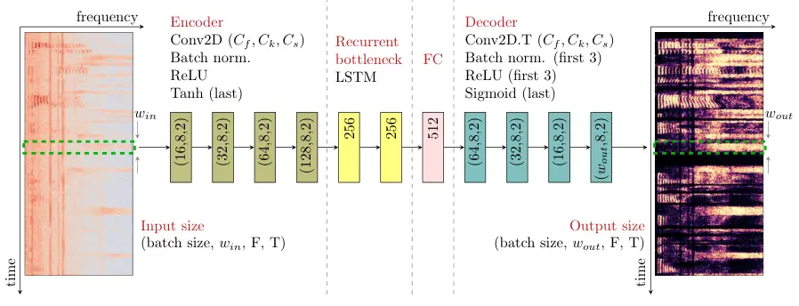

# Spectral Masking with Explicit Time-Context Windowing for Neural Network-Based Monaural Speech Enhancement

Luan Vinícius Fiorio^(⋆†), Boris Karanov^(⋆†), Bruno Defraene^(†), Johan
David^(†), Wim van Houtum^(⋆†), Frans Widdershoven^(†), Ronald M.
Aarts^(⋆)

###### Abstract

We propose and analyze the use of an explicit time-context window for
neural network-based spectral masking speech enhancement to leverage
signal context dependencies between neighboring frames. In particular,
we concentrate on soft masking and loss computed on the time-frequency
representation of the reconstructed speech. We show that the application
of a time-context windowing function at both input and output of the
neural network model improves the soft mask estimation process by
combining multiple estimates taken from different contexts. The proposed
approach is only applied as post-optimization in inference mode, not
requiring additional layers or special training for the neural network
model. Our results show that the method consistently increases both
intelligibility and signal quality of the denoised speech, as
demonstrated for two classes of convolutional-based speech enhancement
models. Importantly, the proposed method requires only a negligible
($`\leq 1`$%) increase in the number of model parameters, making it
suitable for hardware-constrained applications.

###### Index Terms: 

Audio processing, neural networks, noise reduction, spectral masking,
speech enhancement.

^(†)^(†)address: ^(⋆) Eindhoven University of Technology, Eindhoven 5600
MB, The Netherlands  
^(†) NXP Semiconductors, High Tech Campus 46, Eindhoven 5656 AE, The
Netherlands

## 1 INTRODUCTION

Monaural speech enhancement (SE) often concentrates on the removal of
unwanted background noise from a single-channel noisy speech signal
\[1\]. Low-complexity SE solutions might employ an acoustic environment
classification scheme \[2, 3\] and use a noise reduction technique
tailored to the specific noise type. On the other hand, considering
various noise types, neural networks (NN) and deep learning (DL) has
been successfully applied for carrying out the SE task \[4, 5, 6\].
Typically, DL-based SE is implemented via supervised learning, which
relies on targets such as ideal binary, ideal ratio masks or clean
speech spectra \[4, 7\]. The application of DL can lead to improved
performance in terms of speech intelligibility and quality metrics when
compared to classical signal processing techniques for noise reduction,
such as Wiener filtering \[1\].

Supervised DL-based SE can operate either in time-domain or
time-frequency (T-F) domain. While time-domain processing has attracted
attention in recent years \[8, 9\], traditionally T-F features have been
used for SE due to well established hardware implementations of the fast
Fourier transform and its inverse operation \[10\]. In particular,
enhancement of the magnitude of T-F features is the lowest complexity
processing, which however results in a suboptimal solution as it does
not process the noisy phase. Typically, state-of-the-art magnitude
processing SE deep learning solutions are based on convolutional models
\[5, 6, 8, 9, 11, 12\], which are often characterized by fewer
parameters compared to their fully connected and recurrent counterparts.

To increase the speech enhancement quality of NN-based systems, a common
approach is to increase the number of layers, increase the layer
dimensions, or resort to layers with higher modeling capacity, e.g.,
transformers. This comes with a higher computational footprint in terms
of the number of model parameters, and the number of multiplications
required to execute the model. Therefore, in computationally-constrained
applications, alternative approaches which do not increase the
complexity of the model could be desirable.

In this paper, we propose a _post-processing_ method aimed at increasing
speech enhancement quality with a limited impact on the NN topology and
hence on the computational footprint. More specifically, targeting lower
complexity implementations, we develop the method for T-F
magnitude-based speech enhancement. Nevertheless, as discussed in the
manuscript, our approach is general and can be applied in different
scenarios. In particular, we investigate the use of an explicit
time-context window for NN-based SE for post-processing. The approach
recombines the estimated soft mask values in multiple time-dependent
contexts via a sliding window technique, using the average operation.
Differently, while DeepFilterNet \[13\] also combines multiple
estimations in different contexts, the proposed algorithm doesn’t
require additional layers to estimate the combination weights since it’s
defined as a post-processing inference approach.

Our results show that, for the wide range of considered noise types and
signal-to-noise ratios (SNR), the sliding window post-processing
achieves consistent improvements both in the short-time objective
intelligibility (STOI) and perceptual evaluation of speech quality
(PESQ) metrics for convolutional-recurrent network (CRN) and
convolutional denoising autoencoder (CDAE) models.

## 2 Preliminaries

Let $`S(t,f)`$, $`N(t,f)`$, and $`Y(t,f)`$ be the short-term Fourier
transform (STFT) representations of the clean speech signal $`s(t)`$,
noise signal $`n(t)`$, and noisy speech signal $`y(t)`$, where $`t`$ is
the discrete time index, $`f`$ is the discrete frequency index, and
$`Y(t,f)=S(t,f)+N(t,f)`$. The ideal ratio mask (IRM) is then defined as
\[4\]

```math
M(t,f)=\left(\frac{|S(t,f)|^{2}}{|S(t,f)|^{2}+|N(t,f)|^{2}}\right)^{\beta}, \tag{1}
```

with a compression parameter $`\beta\in(0,1]`$. The denoised speech STFT
can be obtained by

```math
\hat{S}(t,f)=M(t,f)\odot Y(t,f), \tag{2}
```

where $`\odot`$ represents the Hadamard product. Notice that (2)
multiplies a real-valued matrix – $`M(t,f)`$ – with a complex-valued
matrix – $`Y(t,f)`$. Thus, only the magnitude of $`Y(t,f)`$ is denoised,
while the phase is kept the same. Speech denoising systems aim to
provide an IRM estimate $`\hat{M}(t,f)`$, and reconstruct the clean
speech STFT by $`\hat{S}(t,f)=\hat{M}(t,f)\odot Y(t,f)`$.

Figure 1: Sliding context window schematic example for $`w=3`$.

## 3 Sliding window post-processing

From a communication system perspective, it has been shown that a
sliding window technique combined with simple recurrent neural networks
leads to close-to-optimal sequence detection \[14, 15, 16\]. In \[4\],
it has been hinted that additional temporal dependencies can be
exploited via windowing operations. From that perspective, in this
section we devise a post-processing framework for enhanced estimation of
STFT masks in presence of temporal dependencies.

Figure 1, adapted from \[15\], depicts the sliding window process which
we apply to the problem of speech enhancement. The next subsection
describes the method in more detail.

### 3.1 Method description

The sliding window scheme for the neural network processor operates on
the time axis of the time-frequency bin features of the noisy speech. It
estimates the IRM for $`w`$ bins and then slides by one bin. The
resulting multi-context estimates of a mask at time $`t`$ are combined
to obtain a refined final mask.



Figure 2: Schematic of the considered convolutional recurrent neural
network.

Given an STFT sequence duration $`T`$, the magnitude of the normalized –
by it’s mean and standard deviation – noisy speech STFT is denoted by
the matrix
$`\bar{Y}=[\bar{\boldsymbol{Y}}_{1}\ \bar{\boldsymbol{Y}}_{2}\ ...\ \bar{\boldsymbol{Y}}_{T}]`$,
where $`\bar{\boldsymbol{Y}}_{t}`$ are vectors of $`F`$ frequency
features of the noisy signal at time bin $`t`$ with STFT frames spaced
apart by a hop duration of $`t_{hop}`$. The NN model has as inputs a
context window of $`w`$ time bins
$`[\bar{\boldsymbol{Y}}_{t-w+1}\ ...\ \bar{\boldsymbol{Y}}_{t}]`$,
estimating the corresponding $`w`$ time bins of the ratio mask at the
output
$`[\boldsymbol{\hat{M}}^{(t-w+1)}_{t-w+1}\ ...\ \boldsymbol{\hat{M}}^{(t-w+1)}_{t}]`$.
The position of the window is then shifted by one time bin, with new
input window
$`[\bar{\boldsymbol{Y}}_{t-w+2}\ ...\ \bar{\boldsymbol{Y}}_{t+1}]`$ and
output estimates
$`[\boldsymbol{\hat{M}}^{(t-w+2)}_{t-w+2}\ ...\ \boldsymbol{\hat{M}}^{(t-w+2)}_{t+1}]`$.
The refined mask $`\hat{M}_{t}`$ is estimated by averaging masks
estimated from different time context, as follows. For the first $`w-1`$
time frames of the IRM will be estimated as \[15\]

```math
\boldsymbol{\hat{M}}_{t}=\frac{1}{t}\sum_{k=1}^{t}\boldsymbol{\hat{M}}^{(k)}_{t},\quad t=1,\ ...,\ w-1, \tag{3}
```

where $`k`$ is the (shift) iteration step of the IRM estimation. For
$`w\leq t\leq T-w+1`$, the estimation of $`\boldsymbol{\hat{M}}`$
becomes

```math
\boldsymbol{\hat{M}}_{t}=\frac{1}{w}\sum_{k=t-w+1}^{t}\boldsymbol{\hat{M}}^{(k)}_{t},\quad t=w,\ ...,\ T-w+1. \tag{4}
```

Finally, the last $`w-1`$ time bins are estimated according to

```math
\boldsymbol{\hat{M}}_{t}=\frac{1}{T-t+1}\sum_{k=t-w+1}^{T-w+1}\boldsymbol{\hat{M}}^{(k)}_{t},\ \ t=T-w+2,\ ...,\ T. \tag{5}
```

Notice that the sliding window method is causal, since the time context
at the input of the neural network is composed of $`w-1`$ past and the
current bin.

Differently to the DeepFilterNet \[13\] approach, where the network
estimates coefficients for the combination of multiple clean speech
estimations in different contexts (windows), our method is solely
applied post-optimization in inference mode since no weight estimation
is necessary for the combination of contexts. We combine the
time-frequency bins by taking their mean value over different windows.
This has the advantage of not requiring additional layers in the neural
network model and thus lowers its complexity, making it suitable for
hardware-constrained applications.

### 3.2 Latency

A window of time bins as the input for deep neural network speech
enhancement has been previously utilized, for example in \[4, 5\]. For
real-time applications it is important to mention that this windowing
increases the processing latency. The additional latency $`t_{\ell}`$
can be calculated as $`t_{\ell}=(w-1)t_{hop}`$, where $`t_{hop}`$ is the
STFT frame hop duration in seconds. Notice that the additional latency
is fixed for the whole process.

## 4 Speech enhancement neural network

To verify our method, we apply it to two different neural network
models. First, we adapt the convolutional recurrent network (CRN) model
proposed in \[5\], making it more suitable for constrained hardware
implementation. Additionally, we consider another model, derived from
the CRN, which is representative of a more general class of
convolutional autoencoders, resulting in an architecture termed
convolutional denoising autoencoder (CDAE) in \[11\].

### 4.1 Models description

The first model \[5\] is a CRN composed of a convolutional encoder,
recurrent bottleneck, and a convolutional decoder. The considered
implementation is shown in Figure 2, where $`w_{in}`$ and $`w_{out}`$
represent the input and output context window size, respectively. The
convolutions are defined to only operate in the frequency dimension; the
total number of layers are reduced in the encoder and decoder of the
original model, also removing the memory-expensive skip connections; the
long short-term memory (LSTM) layers are also reduced; the activation
functions are changed from exponential linear unit to the simpler
rectified linear unit (ReLU). This model contains approximately 1.62M
parameters. In the figure, FC denotes a fully connected layer, Conv2D
denotes 2D convolutional layers, Conv2D.T is the transposed 2D
convolution, and $`C_{f}`$, $`C_{k}`$, and $`C_{s}`$ are, respectively,
number of feature maps, kernel size, and stride.

Furthermore, to validate the sliding window post-processing for a
different model class, the CDAE architecture \[11\] which contains
approximately only 173k parameters, is considered for a very low
complexity study case. The CDAE is a convolutional autoencoder which,
differently from the CRN, does not have a recurrent bottleneck based on
LSTM and fully connected layer. For the purposes of a fair comparison,
we kept the other parameters in the two considered architectures
identical, as shown in Figure 2.

The models estimate the soft masks for $`w_{in}`$ consecutive frames,
resulting in an output of size $`(w_{out},F,T)`$, where batch size is
omitted for simplicity. For a fair comparison, we also consider modified
versions of the models where their output sizes are $`w_{out}=1`$ (no
sliding window), but their input is kept $`w_{in}>1`$. For the latter
case, the models estimate the most recent time bin at the output.

### 4.2 Loss function

According to Eq. 2, the estimated ratio mask $`\hat{M}(t,f)`$ is applied
to the noisy speech as $`\hat{S}(t,f)=\hat{M}(t,f)\odot Y(t,f)`$, the
result of which is used for computing the training loss. The loss
function considered in training is the compressed mean square error for
magnitude \[17\] $`||\hat{S}(t,f)^{0.3}-S(t,f)^{0.3}||^{2}_{2}`$, since
it has been demonstrated that higher speech quality metrics can be
achieved with the use of compression.

For the case where the output has only one time bin, the loss is
calculated as the previously mentioned loss function, while for the
sliding window case, the loss function is modified to
$`||\hat{S}(w,t,f)^{0.3}-S(w,t,f)^{0.3}||^{2}_{2}`$, in which
$`\hat{S}(w,t,f)`$ is a tensor with the denoised speech STFT for $`w`$
frames, and $`S(w,t,f)`$ is the corresponding clean speech target.

## 5 Numerical experiments

|       |                               |           |       |          |       |           |       |           |       |              |
| ----- | ----------------------------- | --------- | ----- | -------- | ----- | --------- | ----- | --------- | ----- | ------------ |
|       |                               | -5 dB SNR |       | 0 dB SNR |       | 10 dB SNR |       | 20 dB SNR |       | Parameters   |
| Model | Context window                | STOI      | PESQ  | STOI     | PESQ  | STOI      | PESQ  | STOI      | PESQ  | increase (%) |
|       | noisy signal                  | 0.679     | 1.360 | 0.767    | 1.505 | 0.907     | 2.053 | 0.974     | 2.914 |              |
| CRN   | $`w_{in}=1`$, $`w_{out}=1`$   | 0.781     | 1.674 | 0.860    | 2.000 | 0.949     | 2.878 | 0.983     | 3.689 | baseline     |
|       | $`w_{in}=3`$, $`w_{out}=1`$   | 0.784     | 1.687 | 0.861    | 2.014 | 0.950     | 2.904 | 0.983     | 3.712 | 0.016        |
|       | $`w_{in}=3`$, $`w_{out}=3`$   | 0.789     | 1.698 | 0.865    | 2.025 | 0.951     | 2.908 | 0.984     | 3.713 | 0.032        |
|       | $`w_{in}=8`$, $`w_{out}=1`$   | 0.781     | 1.709 | 0.858    | 2.033 | 0.949     | 2.888 | 0.982     | 3.683 | 0.055        |
|       | $`w_{in}=8`$, $`w_{out}=8`$   | 0.794     | 1.730 | 0.868    | 2.076 | 0.952     | 2.960 | 0.984     | 3.763 | 0.112        |
|       | $`w_{in}=13`$, $`w_{out}=1`$  | 0.782     | 1.673 | 0.858    | 2.003 | 0.950     | 2.890 | 0.983     | 3.710 | 0.095        |
|       | $`w_{in}=13`$, $`w_{out}=13`$ | 0.800     | 1.734 | 0.868    | 2.070 | 0.952     | 2.950 | 0.984     | 3.765 | 0.190        |
| CDAE  | $`w_{in}=1`$, $`w_{out}=1`$   | 0.696     | 1.390 | 0.786    | 1.593 | 0.899     | 2.248 | 0.946     | 2.992 | baseline     |
|       | $`w_{in}=8`$, $`w_{out}=1`$   | 0.709     | 1.428 | 0.800    | 1.662 | 0.914     | 2.393 | 0.958     | 3.176 | 0.517        |
|       | $`w_{in}=8`$, $`w_{out}=8`$   | 0.733     | 1.500 | 0.817    | 1.759 | 0.920     | 2.540 | 0.962     | 3.392 | 1.038        |

Table 1: STOI and PESQ averaged over the test set for the noisy signal
and denoised signal by the CRN and CDAE model at -5, 0, 10, and 20 dB
SNR for different context window sizes. $`w_{in}=w_{out}\neq 1`$
represent the sliding window scenario. The parameters increase in
relation to the $`w_{in}=w_{out}=1`$ (baseline) for both models case is
shown in %.

The experiments were carried on with the clean speech files from
LibriTTS dataset \[18\], which is a derivation of the LibriSpeech
dataset, and with the noise files from the 5^(th) Deep Noise Suppression
Challenge dataset of ICASSP 2023 \[19\], which is composed of various
types of environment noise. The goal is to obtain a speech enhancement
NN model generalized over various background noise conditions and
signal-to-noise ratios (SNRs).

### 5.1 Data augmentation

All audio files are initially resampled from 24 kHz to 16 kHz. Then, for
the duration of a randomly drawn noise file (10 s), clean speech
segments are randomly drawn and concatenated until the 10 s time is
reached, where each clean speech trace receives a gain, randomly chosen,
in the range of -3 to 3 dB. Fade in and fade out¹¹ 1 The fade in/out
curve is obtained as $`0.001e^{6.908\cdot t}`$, which allows for a
dynamic range of 60 dB., randomly chosen within 0.20 and 0.30 s, is
applied to every clean speech trace, as well as for every noise file.
Both 10 s noise and clean speech files are normalized by their maximum
amplitude, and combined with a uniformly randomly chosen SNR within -5
and 20 dB. The noise, the clean speech, and the noisy speech are then
converted to the (STFT) time-frequency domain, with the following
parameters: frame length of 128 samples (8 ms), frame hop of 64 samples
(4 ms), and a Hanning window function. For training, 100 hours of audio
from the LibriTTS ’train-clean-100’ subset are considered, while
approximately 5.6 hours (1944 files) are used for testing from the
’test-clean’ subset. The noise files are randomly (without repetition)
drawn from the noise set of the DNS dataset.

### 5.2 Results

For a principled investigation aimed at evaluating the influence of the
time-context window size in the STOI and PESQ metrics, we started with
the CRN model as a baseline. We trained the model for input windows of
size $`w_{in}=1,\ 3,\ 8,\ 13`$, and two cases for the output: 1)
$`w_{out}=w_{in}`$; and 2) $`w_{out}=1`$. Notice that the second
scenario was considered in previous work \[4\], showing a small but
consistent increase in speech quality and intelligibility metrics, which
we take into account for a more fair comparison against the proposed
method.

The trained models are evaluated in terms of STOI and PESQ with the test
dataset as described in Sec. 5.1. The first part of Table 1 shows the
obtained performance metrics for the noisy signal, as well as the
CRN-denoised audio with no context window ($`w_{in},w_{out}=1`$), a
context window in the input ($`w_{in}\neq 1,w_{out}=1`$), and context
windows in the input and output – sliding window post-processing case
($`w_{out}=w_{in}\neq 1`$). Note that the values shown in the table are
the average over the entire test dataset. For all cases with the CRN
model, the training was executed for 50 epochs and the batch size was
set to 32. We used the Adam optimizer with a learning rate of
$`5\cdot 10^{-4}`$.

Using the insights from our baseline model, we proceed to evaluate the
performance of the CDAE architecture. In this case, the considered
window sizes for the input were $`w_{in}=1,\ 8`$ and two cases for the
output as considered before: 1) $`w_{out}=w_{in}`$; and 2)
$`w_{out}=1`$. The training procedure was kept the same as for the
baseline model, with the only adjustment being that 40 epochs were used,
because of the faster saturation of the loss in training.

We see that, for the CRN model, the use of an explicit time-context
window enhanced PESQ and STOI in all cases. Generally, the bigger the
size of the context window, the bigger is the increase in the
intelligibility and signal quality. Nevertherless, this is expected to
saturate for large windows, which however are infeasible due to the
introduced processing delay. The use of the sliding window
post-processing ($`w_{out}=w_{in}\neq 1`$) achieved the best results.
Because of the convolutional architecture, the number of parameters is
only slightly affected (0.06% increase for $`w_{in}=3`$) by the use of
the context window, making such an approach a viable post-processing
option for such classes of models. It is worth noting that for
feedforward and recurrent architectures where the subsequent hidden
layers’ sizes are increased as the input size increases, the sliding
window method will entail higher complexity. Moreover, it is worth
mentioning that although the degree of increase in STOI and PESQ metrics
is small, a similar increase is obtained when a CRN model is compared to
its deep filter version in \[13\].

Our results confirmed that the use of an explicit time-context window is
also effective for the CDAE model, providing consistent gains in all
examined cases. We observe that the application of the method was more
effective in enhancing STOI and PESQ metrics obtained with the CDAE than
with the CRN model. This is due to the lack of temporal processing –
which originates from the lack of recurrent or temporal layers in the
architecture – present in the CDAE, which is purely brought by the
post-processing.

It can be envisaged that, due to the explicit inherent temporal
structure of architectures such as the temporal convolutional networks
(TCN), the sliding window technique could be less effective if applied
to such a model class.

## 6 Conclusion

We investigated the improvement in speech enhancement performance
achieved by the use of an explicit time-context window. We examined the
application of the method in convolutional recurrent as well as purely
convolutional autoencoder architectures. Our results show that the
technique can be beneficial at a wide range of SNRs, with highest gains
achieved at the most challenging (noisy) cases. For the considered
window ranges, a wider window brought more increase in STOI and PESQ
metrics. For convolutional-based models, the use of the time-context
window only slightly increased the complexity in terms of number of
parameters, making it suitable for application in such models. For
future work, extension to learnable weighted averaging in the mask
estimation as well as extension to complex masks could be considered.

## References

- \[1\] Philipos C. Loizou, Speech Enhancement: Theory and Practice, CRC
  Press, Inc., USA, 2nd edition, 2013.
- \[2\] Anusha Yellamsetty, Erol J. Ozmeral, Robert A. Budinsky, and
  David A. Eddins, “A comparison of environment classification among
  premium hearing instruments,” Trends in Hearing, vol. 25, pp.
  2331216520980968, 2021, PMID: 33749410.
- \[3\] Luan Vinícius Fiorio, Boris Karanov, Johan David, Wim van
  Houtum, Frans Widdershoven, and Ronald M. Aarts, “Semi-supervised
  learning with per-class adaptive confidence scores for acoustic
  environment classification with imbalanced data,” in ICASSP 2023 -
  2023 IEEE International Conference on Acoustics, Speech and Signal
  Processing (ICASSP), 2023, pp. 1–5.
- \[4\] Yuxuan Wang, Arun Narayanan, and DeLiang Wang, “On training
  targets for supervised speech separation,” IEEE/ACM Transactions on
  Audio, Speech, and Language Processing, vol. 22, no. 12, pp.
  1849–1858, 2014.
- \[5\] Ke Tan and DeLiang Wang, “A Convolutional Recurrent Neural
  Network for Real-Time Speech Enhancement,” in Proc. Interspeech 2018,
  2018, pp. 3229–3233.
- \[6\] Rizwan Ullah, Lunchakorn Wuttisittikulkij, Sushank Chaudhary,
  Amir Parnianifard, Shashi Shah, Muhammad Ibrar, and Fazal-E Wahab,
  “End-to-end deep convolutional recurrent models for noise robust
  waveform speech enhancement,” Sensors, vol. 22, no. 20, 2022.
- \[7\] DeLiang Wang, On Ideal Binary Mask As the Computational Goal of
  Auditory Scene Analysis, pp. 181–197, Springer US, Boston, MA, 2005.
- \[8\] Ashutosh Pandey and DeLiang Wang, “Tcnn: Temporal convolutional
  neural network for real-time speech enhancement in the time domain,”
  in ICASSP 2019 - 2019 IEEE International Conference on Acoustics,
  Speech and Signal Processing (ICASSP), 2019, pp. 6875–6879.
- \[9\] Zhifeng Kong, Wei Ping, Ambrish Dantrey, and Bryan Catanzaro,
  “Speech denoising in the waveform domain with self-attention,” in
  ICASSP 2022 - 2022 IEEE International Conference on Acoustics, Speech
  and Signal Processing (ICASSP), 2022, pp. 7867–7871.
- \[10\] Jacob Benesty, Jingdong Chen, and Emanul A.P. Habets, Speech
  Enhancement in the STFT Domain, Springer Publishing Company,
  Incorporated, 1st edition, 2011.
- \[11\] Shaikh Akib Shahriyar, M. A. H. Akhand, N. Siddique, and
  T. Shimamura, “Speech enhancement using convolutional denoising
  autoencoder,” in 2019 International Conference on Electrical, Computer
  and Communication Engineering (ECCE), 2019, pp. 1–5.
- \[12\] Ke Tan and DeLiang Wang, “Learning complex spectral mapping
  with gated convolutional recurrent networks for monaural speech
  enhancement,” IEEE/ACM Transactions on Audio, Speech, and Language
  Processing, vol. 28, pp. 380–390, 2020.
- \[13\] Hendrik Schroter, Alberto N. Escalante-B, Tobias Rosenkranz,
  and Andreas Maier, “Deepfilternet: A low complexity speech enhancement
  framework for full-band audio based on deep filtering,” in ICASSP
  2022 - 2022 IEEE International Conference on Acoustics, Speech and
  Signal Processing (ICASSP), 2022, pp. 7407–7411.
- \[14\] Nariman Farsad and Andrea Goldsmith, “Neural network detection
  of data sequences in communication systems,” IEEE Transactions on
  Signal Processing, vol. 66, no. 21, pp. 5663–5678, 2018.
- \[15\] Boris Karanov, Domaniç Lavery, Polina Bayvel, and Laurent
  Schmalen, “End-to-end optimized transmission over dispersive
  intensity-modulated channels using bidirectional recurrent neural
  networks,” Opt. Express, vol. 27, no. 14, pp. 19650–19663, Jul 2019.
- \[16\] Boris Karanov, Mathieu Chagnon, Vahid Aref, Filipe Ferreira,
  Domaniç Lavery, Polina Bayvel, and Laurent Schmalen, “Experimental
  investigation of deep learning for digital signal processing in short
  reach optical fiber communications,” in 2020 IEEE Workshop on Signal
  Processing Systems (SiPS), 2020, pp. 1–6.
- \[17\] Sebastian Braun and Ivan Tashev, “A consolidated view of loss
  functions for supervised deep learning-based speech enhancement,” in
  2021 44th International Conference on Telecommunications and Signal
  Processing (TSP), 2021, pp. 72–76.
- \[18\] Heiga Zen, Viet Dang, Rob Clark, Yu Zhang, Ron J. Weiss,
  Ye Jia, Zhifeng Chen, and Yonghui Wu, “Libritts: A corpus derived from
  librispeech for text-to-speech,” arXiv preprint 1904.02882, 2019.
- \[19\] Harishchandra Dubey, Ashkan Aazami, Vishak Gopal, Babak Naderi,
  Sebastian Braun, Ross Cutler, Hannes Gamper, Mehrsa Golestaneh, and
  Robert Aichner, “Deep speech enhancement challenge at icassp 2023,” in
  ICASSP, 2023.
