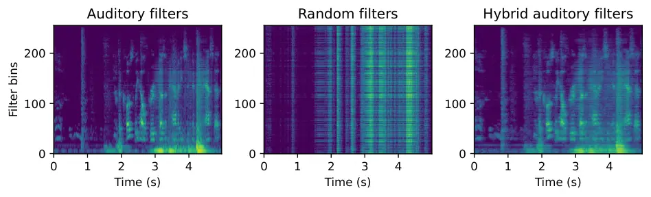

# Hold Me Tight: Stable Encoder–Decoder Design for Speech Enhancement

Daniel Haider^(∗)    Felix Perfler^(∗)    Vincent Lostanlen    Martin
Ehler    Peter Balazs

###### Abstract

Convolutional layers with 1-D filters are often used as frontend to
encode audio signals. Unlike fixed time–frequency representations, they
can adapt to the local characteristics of input data. However, 1-D
filters on raw audio are hard to train and often suffer from
instabilities. In this paper, we address these problems with hybrid
solutions, i.e., combining theory-driven and data-driven approaches.
First, we preprocess the audio signals via a auditory filterbank,
guaranteeing good frequency localization for the learned encoder.
Second, we use results from frame theory to define an unsupervised
learning objective that encourages energy conservation and perfect
reconstruction. Third, we adapt mixed compressed spectral norms as
learning objectives to the encoder coefficients. Using these solutions
in a low-complexity encoder–mask–decoder model significantly improves
the perceptual evaluation of speech quality (PESQ) in speech
enhancement.

###### keywords

Hybrid filterbanks, stabilization, tight frames, encoder,
reconstruction, speech enhancement

^(†)^(†)address: ¹Acoustics Research Institute, Austrian Academy of
Sciences, Austria  
²Nantes Université, École Centrale Nantes, CNRS, LS2N, France  
³University of Vienna, Faculty of Mathematics, Austria^(†)^(†)email:
daniel.haider@oeaw.ac.at, felix.perfler@oeaw.ac.at

## 1 Introduction

Time–frequency transforms, such as the short–time Fourier transform
(STFT) and the constant-Q transform (CQT), have long served for analysis
and synthesis of audio \[1\]. More recently, neural networks have
started to outperform these classical methods \[2, 3\]. While both
approaches are being used in applications, they come with different pros
and cons. On the one hand, fixed transforms are controllable and
interpretable; but the chosen time–frequency resolution may be
suboptimal for the task at hand. On the other hand, learnable transforms
have the potential to adapt to the short–term properties of the data;
but they remain difficult to train, less interpretable, and potentially
unstable.

The diverging opinions on the relative merits of the two approaches are
particularly evident in encoder–mask–decoder models \[4\]. As of today,
the mask is typically estimated by a neural network that is trained on
the coefficients of the encoded input signals \[5, 6, 7\]. For the
encoder–decoder design, there are two main paradigms: time–frequency
domain methods use fixed time–frequency transforms (e.g., STFT \[5\],
mel spectrogram, Gammatone filters \[7\]), and time-domain methods
process the signal waveforms directly via a convolutional layer with 1-D
filters that is optimized together with the model parameters, also known
as filterbank learning \[3, 4\]. The ongoing competition between these
paradigms \[8\] indicates that the optimal way of encoding audio signals
remains an unsolved problem \[9\].



Figure 1: The log magnitude responses of three encoders for the same
speech signal. Left to right: Auditory filterbank, random filterbank,
and hybrid filterbank as channel–wise composition of the previous two.
While the random responses are hard to interpret, the hybrid responses
are comparable to the fixed ones with the possibility to be fine–tuned
in a data–driven manner.

A family of models, so-called _hybrid_, aim to combine feature
engineering with feature learning. These models rely on domain knowledge
so as to reduce optimization to certain properties of filters, such as
center frequencies, bandwidth, and gain \[10, 11, 12\]. Recently, a
hybrid architecture known as multiresolution neural network (MuReNN) was
proposed to fit auditory filterbanks from data \[13\]. In MuReNN, small
filterbanks are learned on different resolution levels by using a
wavelet decomposition of the input signal. This can be implemented as
level-wise convolutions of wavelet filters with trainable filters.

In our work, we propose a comparable hybrid construction specifically
for speech processing. While MuReNN relies on a discrete wavelet
transform, we use an auditory filterbank. This choice prioritizes
perceptually significant aspects of speech, such as the need for high
temporal resolution at lower frequencies. The hybrid construction then
allows for further refinement of the corresponding signal
representations. When combined with a mixed compressed spectral learning
objective that respects these representations, this configuration
provides a flexible and powerful setup for hybrid filterbank learning.

To facilitate the reconstruction of the enhanced signal from the encoder
domain, a suitable decoder is essential. If the encoder–decoder pair
yields perfect reconstruction (without a mask) the decoder is called
dual to the encoder. If the encoder is dual to itself, it is said to be
tight. This case is particularly advantageous as it simplifies
reconstruction and ensures stability for the encoder through norm
preservation \[14, 15, 16\], which improves the robustness against noise
and adversarial examples \[17, 18\]. By incorporating a measure of
tightness of the encoder into the learning objective, we can use the
hybrid filterbank in a encoder–decoder setting without the need for
computing a dual.

In summary, this paper presents a complete framework for training hybrid
filterbanks in an encoder--decoder setting for speech--related tasks by
(i) conceptually fusing auditory filterbank design with classical
filterbank learning, (ii) stabilizing encoders during training by
promoting tightness, and (iii) adapting the learning objective to the
encoder coefficient domain.^(†)^(†) ^(∗) Equal contribution. Code
available at  
[https://github.com/felixperfler/Stable-Hybrid-Auditory-Filterbanks](https://github.com/felixperfler/Stable-Hybrid-Auditory-Filterbanks).

Figure 2: Selections of real and imaginary parts of filters (top) and
their frequency responses (bottom) from three different filterbanks.
From left to right: An auditory filterbank with center frequencies
uniformly on the mel scale, a random filterbank with
$`\sigma^{2}=(TJ)^{-1}`$, and a hybrid auditory filterbank as the
channel-wise composition of the previous two. Different filters are
displayed with different colors.

## 2 Learning Tight Hybrid Filterbanks with Inductive Auditory Bias

This section establishes the mathematical foundation for our
methodology. Let $`x\in\mathbb{R}^{N}`$ be an audio signal. A
convolutional layer $`\Phi`$ with 1-D kernels
$`w_{j}\in\mathbb{R}^{T}`$, $`T\leq N`$ decomposes $`x`$ into $`J>1`$
subbands via convolution, represented as the array

```math
\left(\Phi x\right)[n,j]=(x\ast w_{j})[n]=\sum_{k=0}^{T-1}w_{j}[k]x[(n-k)\operatorname{mod}N],
```

also referred to as responses of $`\Phi`$ for $`x`$. In the context of
classical signal processing this corresponds to an oversampled finite
impulse response (FIR) filterbank \[19\]. Besides all common linear
time–frequency transforms, such as the STFT and the CQT, adaptive or
adapted auditory–related time–frequency representations can be
envisioned and implemented in this way as well \[20, 21\]. One obstacle
to a successful and functional implementation of such customized
filterbanks is stability.

### 2.1 Tight Filterbank Frames

A filterbank $`\Phi`$ forms a frame for $`\mathbb{R}^{N}`$ if there are
positive constants $`A\leq B`$ such that

```math
A\cdot\|x\|^{2}\leq\|\Phi x\|^{2}\leq B\cdot\|x\|^{2} \tag{1}
```

holds for any $`x\in\mathbb{R}^{N}`$ \[22\]. The numbers $`A,B`$ are
called the frame bounds. This Lipschitz-type inequality guarantees that
the filterbank decomposition is invertible and well-conditioned, i.e.,
stable. The optimal bounds (largest $`A`$, smallest $`B`$) in (1) are
given by the smallest and largest eigenvalues of the associated _frame
operator_ $`\Phi^{\top}\Phi`$, where $`\Phi^{\top}`$ denotes the
transposed filterbank of $`\Phi`$. These values determine the numerical
stability of $`\Phi`$ via the condition number $`\kappa=B/A`$ \[23\].
Hence, a filterbank with $`A=B`$ has optimal stability properties and is
called tight. For a tight filterbank $`\Phi`$, the following are
equivalent \[23\].

1.  (i)
    $`\|\Phi x\|^{2}=A\cdot\|x\|^{2}`$ for all $`x\in\mathbb{R}^{N}`$,
2.  (ii)
    $`\Phi^{\top}\Phi=A\cdot\mathbb{1}_{N}`$
3.  (iii)
    $`\kappa=B/A=1`$.

Property (i) states that the filterbank is norm-preserving. This is
advantageous as the energy level of the encoder responses is always
under control and different signal parts contribute equally. In
particular, this makes $`\Phi`$ robust to small perturbations, which is
a crucial property in the context of adversarial examples \[18\].

Property (ii) is especially interesting in an encoder-decoder regime: If
the encoder filterbank $`\Phi`$ is tight, then the transposed filterbank
$`\Phi^{\top}`$ as a decoder yields perfect reconstruction \[24\].
Hence, no inverse decoder has to be computed or learned, which decreases
the computational complexity significantly.

Property (iii) coincides with the classical definition of optimal
stability of the linear operator associated with $`\Phi`$ from numerical
linear algebra. To make encoder filterbanks with trainable weights
benefit from (i) and (ii), we propose to minimize $`\kappa`$ during
training in parallel with the objective function (Sec. 2.3).

### 2.2 Encoder Design: Hybrid Auditory Filterbanks

Following the idea of multiresolution neural networks \[13\] (MuReNN),
we compose the filters from a fixed filterbank with trainable filters
via convolution. Letting $`\Psi`$ denote the fixed filterbank with
filters $`\psi_{i}`$ and $`\Phi`$ the filterbank with trainable filters
$`w_{j}`$, then we define the trainable hybrid filterbank
$`\Phi_{\Psi}`$ as the filterbank with filters $`(w_{j}\ast\psi_{j})`$
for every $`j`$. Hence, any signal $`x`$ is decomposed as

```math
\left(\Phi_{\Psi}x\right)[n,j]=(x\ast w_{j}\ast\psi_{j})[n]. \tag{2}
```

When initializing the filter entries of $`\Phi`$ at random, e.g.,
$`w_{j}\sim\mathcal{N}(0,\sigma^{2}\mathbb{1}_{T})`$, the hybrid encoder
can be interpreted as a random filterbank with an inductive bias. This
bias is inherited from the characteristics of $`\Psi`$, and may embrace
band limitation or a structured scale of center frequencies. By
construction, these characteristics are also preserved during the
optimization of $`\Phi_{\Psi}`$. If $`\Psi`$ is an auditory filterbank,
we call $`\Phi_{\Psi}`$ a hybrid auditory filterbank. Figure 2 (right)
illustrates the filters and their frequency responses of the hybrid
auditory filterbank that we use for speech enhancement in Section 3.

While the use of an auditory filterbank as encoder alone is already
expected to be beneficial in speech–related tasks, the hybrid
construction allows for data–driven fine-tuning, hence, further
improvement of the alignment with the mask model.

### 2.3 Stability of Hybrid Filterbanks and $`\kappa`$-penalization

A random filterbank with i.i.d. Gaussian weights forms a so-called
random tight frame \[25\], i.e., is tight in expectation \[26\],

```math
\mathbb{E}\left[\|\Phi x\|^{2}\right]=JT\sigma^{2}\|x\|^{2}. \tag{3}
```

A random hybrid filterbank $`\Phi_{\Psi}`$ inherits the stability
properties of $`\Psi`$ and $`\Phi`$, and can be shown to also form a
random tight frame.

###### Theorem 2.1.

Let $`\Psi`$ be a tight filterbank with frame bound $`A_{\Psi}`$ and
$`\Phi`$ a random filterbank with length-$`T`$ filters. The associated
hybrid filterbank $`\Phi_{\Psi}`$ is a random tight frame with

```math
\displaystyle\begin{split}\mathbb{E}\left[\|\Phi_{\Psi}x\|^{2}\right]=A_{\Psi}T\sigma^{2}\|x\|^{2}.\end{split} \tag{4}
```

However, in any setting where the encoder filterbank is trainable, it is
not guaranteed that it also remains stable during training. To
counteract possible instabilities, for a given objective function
$`\mathcal{L}(x,\tilde{x})`$ we propose to penalize the condition number
$`\kappa=B/A`$ of $`\Phi`$ by minimizing

```math
\mathcal{L}_{\beta}(x,\tilde{x})=\mathcal{L}(x,\tilde{x})+\beta\cdot\kappa, \tag{5}
```

with a scaling parameter $`\beta>0`$. Note that minimizing $`\kappa`$ as
above is less restrictive than minimizing
$`\|\mathbb{1}-\Phi^{\top}\Phi\|`$ as proposed in \[18\]. Furthermore,
the computation of $`\kappa`$ can be done efficiently in the Fourier
domain. Denoting by $`\widehat{w}_{j}`$ the discrete Fourier transforms
(DFT) of the filters $`w_{j}`$, which have been zero-padded to have
length $`N`$, then $`\Phi^{\top}\Phi`$ is diagonalized as
$`\Phi^{\top}\Phi=U^{\ast}\Sigma U`$, where
$`\Sigma=\operatorname{diag}\left(\sum_{k=1}^{J}|\widehat{w}_{k}|^{2}\right)`$
and $`U`$ is the unitary DFT matrix. Hence, the frame bounds coincide
with the smallest and largest eigenvalue of $`\Sigma`$, given by

```math
\displaystyle A=\min_{0\leq k\leq N-1}\sum_{j=1}^{J}|\widehat{w}_{j}[k]|^{2},\quad B=\max_{0\leq k\leq N-1}\sum_{j=1}^{J}|\widehat{w}_{j}[k]|^{2}. \tag{6}
```

From (6) we can deduce that the gradient of $`\kappa`$ is well-defined
if the filterbank forms a frame. Hence, using FFT methods it becomes
feasible to include the computation of $`\kappa`$ and its gradient in
iterative gradient-based optimization procedures for training.

In applications, convolution is usually performed with a stride to
reduce redundancy, i.e., using a hop–size in the sliding filter
(downsampling). This is inherent to the application of the filterbank
and must be taken into account when calculating $`\kappa`$ in (5). In
the context of Eq. (6) this requires taking into account aliasing
effects \[24\]. Assuming that these effects are negligible in our
application for small stride values, we ignore aliasing in this work and
leave a detailed discussion to future work.

## 3 Model Implementation for Speech Enhancement and Training

We demonstrate the proposed hybrid auditory filterbank and
$`\kappa`$-penalization in a speech enhancement task, i.e., given a
noisy signal $`x_{\text{noisy}}=x+n`$ we aim to suppress the noise
signal $`n`$ via an encoder–mask–decoder model.

|                      |        |           |                         |      |        |            |
| -------------------- | ------ | --------- | ----------------------- | ---- | ------ | ---------- |
| Encoder              | Params | Objective | $`\kappa`$-penalization | PESQ | SI-SDR | $`\kappa`$ |
| STFT (baseline)      | 0      | MCS       | ✗                       | 3.19 | 9.85   | 2          |
| audlet (ours)        | 0      | MCS       | ✗                       | 3.23 | 9.58   | 1          |
| conv1D               | 8.1k   | MCS       | ✗                       | 2.66 | 11.69  | 3.2        |
| conv1D               | 8.1k   | MCS\_(β)  | ✓                       | 2.77 | 11.99  | 1          |
| hybrid audlet (ours) | 2.8k   | MCS       | ✗                       | 3.38 | 8.86   | 1.2        |
| hybrid audlet (ours) | 2.8k   | MCS\_(β)  | ✓                       | 3.39 | 8.68   | 1          |

Table 1: Speech enhancement benchmark on CHiME-2 WSJ-0. MCS: mixed
compressed spectral loss (7). PESQ: perceptual evaluation of speech
quality. SI-SDR: scale-invariant signal-to-distortion ratio. $`\kappa`$:
condition number of the encoder (lower is better).

### 3.1 Encoder/Decoder Design

We compare four different encoder configurations. Each one operates with
256 channels.

1.  1.  STFT (baseline): A STFT with Hann window of length 512 and a
        hop-size of 256. The associated filterbank has a condition number
        $`\kappa=2`$.
2.  2.  Audlet: A tight auditory filterbank $`\Psi`$ computed with the
        routine audfilters \[21\] from the LTFAT toolbox \[27\] (Figure 2
        left). The filters are smoothed and cut to a length of 512 samples
        and a hop–size of 128 is used. This filterbank is comparable to a
        CQT with frequency-adaptive bandwidths and the center frequencies
        following the mel scale.
3.  3.  Conv1d: A randomly initialized trainable filterbank $`\Phi`$ with
        filters of length 32 and a hop-size of 8. This setting is
        reminiscent of the encoder used in Conv-TasNet \[4\].
4.  4.  Hybrid audlet: A randomly initialized hybrid auditory filterbank
        $`\Phi_{\Psi}`$ composed of $`\Psi`$ from 2. and a trainable
        filterbank $`\Phi`$ from 3. with filters of length 11 and a hop-size
        of 1.

For the baseline, the decoder is the inverse STFT. For all other cases,
the decoder is the transposed filterbank of the encoder and is not
optimized, i.e., the weights are shared. Using $`\kappa`$-penalization
(5), this will always be close to a dual for the encoder. To benefit
from fast convolution on GPU we implement all encoder decompositions via
Pytorch’s conv1d \[28\]. Complex convolution is implemented separately
regarding the real and imaginary parts. The results are shown in Figure

1.

Figure 3: Left: Encoder–mask–decoder architecture: Encoder $`\Phi`$
(convolution), mask $`M`$ (point-wise multiplication), decoder
$`\Phi^{\top}`$ (convolution and summation). Right: Mask model
architecture consisting of feed-forward layers and gated recurrent
units.

### 3.2 Mask Model Architecture

Based on the log magnitude responses of the encoder, the central part of
the model computes a mask that is applied to the responses before being
decoded. Following the simple and effective architecture proposed in
\[29\] the mask consists of a feedforward layer, two GRU layers, and
another three feedforward layers (Fig. 3). The last layer uses a sigmoid
activation function, all others are activated by a ReLU. In total, the
mask model has 2.78m trainable parameters.

It should be noted that we apply the trainable filters before taking the
log magnitude of the coefficients. This is to be distinguished from an
architecture where a convolutional layer is applied on the log magnitude
coefficients from a fixed filterbank.

### 3.3 Training

We adapt the mixed compressed spectral loss introduced in \[5\] as our
learning objective. Traditionally, this loss uses STFT coefficients, but
we generalize it to the coefficients of our encoder filterbank $`\Phi`$.
Letting $`\varphi`$ and $`\tilde{\varphi}`$ denote the phases of
$`\Phi x`$ and $`\Phi\tilde{x}`$ respectively, we perform empirical risk
minimization with respect to

```math
\displaystyle\text{MCS}(x,\tilde{x}) \displaystyle=\gamma\cdot\big\||\Phi x|^{c}e^{j\varphi}-|\Phi\tilde{x}|^{c}e^{j\tilde{\varphi}}\big\|^{2}
```

```math
\displaystyle+(1-\gamma)\cdot\big\||\Phi x|^{c}-|\Phi\tilde{x}|^{c}\big\|^{2}. \tag{7}
```

For fixed encoders, we found that it is crucial to design the objective
function based on the representation that is also used to estimate the
mask. For trainable encoders, this representation, hence, the loss
function changes with training. Following \[5\], we choose compression
and weighting terms as $`c=\gamma=0.3`$ which has been found to perform
best for the proposed mask model in terms of the highest PESQ
score \[30\]. When using $`\kappa`$-penalization described in (5), we
aim to minimize

```math
\displaystyle\text{MCS}_{\beta}(x,\tilde{x})=\text{MCS}(x,\tilde{x})+\beta\cdot\kappa. \tag{8}
```

By experimental exploration in our setting, we identified
$`\beta=10^{-5}`$ as a good value that is sufficiently small to not
interfere with the minimization of the objective and sufficiently large
to produce tightness consistently.

As optimizer, we use AdamW \[31\] with an initial learning rate of
$`10^{-4}`$ and validate every 10 epochs. The batch size is 32. The
model with the highest PESQ score on the validation set is selected for
evaluation on an unseen test set. The performance of this model is
reported in terms of PESQ and SI-SDR \[32\].

### 3.4 Dataset

We use the CHiME-2 WSJ-0 dataset \[33\] which consists of 7138 (train),
2418 (dev), and 1998 (test) speech utterances in English, from which we
take $`5\text{\,}\mathrm{s}`$ excerpts, respectively. The sampling rate
is $`16\text{\,}\mathrm{k}\mathrm{H}\mathrm{z}`$. Every sample consists
of a reverberate speech signal and a noise signal, added with an
signal-to-noise ratio (SNR) ranging from -6 up to
$`9\text{\,}\mathrm{d}\mathrm{B}`$ in steps of
$`3\text{\,}\mathrm{d}\mathrm{B}`$. The target signal is the
corresponding reverberated speech signal.

## 4 Results and Discussion

### 4.1 General

The main benefits of the proposed methods lie in the enhanced usability
of trainable filterbanks in an encoder–decoder setting. The fixed
filterbank can be flexibly chosen to fit the problem at hand, and
construction, implementation, and training using the proposed MSC loss
is straightforward. Enforcing tightness via $`\kappa`$-penalization
provides the following:

- •
  the encoder output level is under control and easily adjustable
- •
  the decoder does not have to be computed
- •
  stability: small perturbations have small effects

In all our experiments, $`\kappa`$-penalization did not negatively
influence the optimization of the main objective function, and we did
not observe a noticeable loss in computational time.

### 4.2 Speech Enhancement

The outcome of the speech enhancement task aligns very well with our
expectations (c.f. Table 1):

- •
  The audlet encoder outperforms the STFT in terms of PESQ.
- •
  The hybrid audlet filterbank yields the highest PESQ overall, with a
  significant increase of $`0.2`$ compared to the baseline.
- •
  Conv1d with random initialization yields the best SI-SDR.

Not only does the hybrid audlet filterbank outperform all other models
in some aspects, it also reaches an optimal condition number at the end
of training due to $`\kappa`$-penalization. We note that on the
relatively short trainable filters it has only limited effect. For
conv1d, the effect is larger ($`\kappa=3.2`$). Although not
significantly, $`\kappa`$-penalization yields better scores in all the
cases.

Conv1d takes a long time to train and is very sensitive to
hyperparameters such as filter length, stride, learning rate, and
$`\beta`$. On the contrary, the hybrid filterbanks learn fast and work
in many hyperparameter configurations. We conjecture that the high
SI-SDR score by conv1d comes from the fact that gradient descent treats
every filter equally, such that the contributions of the filters average
out over the different bands. As a result, the MCS resembles an energy
measure, visible in the center plot of Figure 1.

### 4.3 Limitations and Outlook

Using hybrid filterbanks does not speed up inference compared to the
baseline. However, the related work on multiresolution neural networks
paves the way towards reducing the number of parameters and saving
computations.

With regard to the evaluation metrics provided in Table 1, it can be
observed that the effect of $`\kappa`$-penalization is relatively minor.
It remains to be seen whether the benefits of stabilization are
comparably more significant in cases where the condition number tends to
grow in the absence of explicit penalization in the learning objective.

## 5 Conclusion

This paper presents three methodological contributions to (hybrid)
filterbank learning for speech enhancement. Firstly, we design trainable
hybrid encoders for audio feature extraction with desirable properties,
such as band limitation, and fixed center frequencies of the filters.
The properties can be set in advance and persist throughout training.
Secondly, a frame theoretic perspective provides the theoretical
backbone for defining a simple and effective stabilization mechanism
that keeps any trainable filterbank very close to tight throughout
training. The implications are that the filterbank is norm preserving
and can be inverted by its transpose. The third point is the adaption of
the mixed compressed spectral loss to the encoder coefficient domain. In
a speech enhancement task, this framework manages to outperform the
performance of the STFT and randomly initialized conv1d layers in terms
of the PESQ score. While this contribution focuses on demonstrating the
methods in the specific application of speech enhancement, in future
work we will advance the theory and extend the experiments to other
tasks and domains to outline the universality of the approach.

## 6 Acknowledgments

D. Haider is recipient of a DOC Fellowship of the Austrian Academy of
Sciences at the Acoustics Research Institute (A 26355). V. Lostanlen is
supported by ANR project MuReNN (ANR-23-CE23-0007-01). The work of P.
Balazs was supported by the FWF projects LoFT (P 34624) and NoMASP (P
34922). The authors would particularly like to thank Clara Hollomey for
making audlet filterbanks available in Python.

## References

- \[1\] P. Mowlaee, _Fundamentals of Phase-Based Signal
  Processing_. John Wiley and Sons, 2017, ch. 2, pp. 33–70.
- \[2\] P. Vieting, C. Lüscher, W. Michel, R. Schlüter, and H. Ney, “On
  architectures and training for raw waveform feature extraction in
  asr,” in _2021 IEEE Automatic Speech Recognition and Understanding
  Workshop (ASRU)_, 2021, pp. 267–274.
- \[3\] T. Sainath, R. J. Weiss, K. Wilson, A. W. Senior, and
  O. Vinyals, “Learning the speech front-end with raw waveform CLDNNs,”
  in _Proc. Interspeech_, 2015.
- \[4\] Y. Luo and N. Mesgarani, “Conv-TasNet: Surpassing ideal
  time–frequency magnitude masking for speech separation,” _IEEE/ACM
  Trans. Audio, Speech and Lang. Proc._, vol. 27, no. 8, p.
  1256–1266, 2019.
- \[5\] S. Braun and I. Tashev, “Data augmentation and loss
  normalization for deep noise suppression,” in _International
  Conference on Speech and Computer_. Springer, 2020, pp. 79–86.
- \[6\] Q. Li, F. Gao, H. Guan, and K. Ma, “Real-time monaural speech
  enhancement with short-time discrete cosine transform,” _arXiv_, vol.
  abs/2102.04629, 2021.
- \[7\] D. Ditter and T. Gerkmann, “A multi-phase gammatone filterbank
  for speech separation via Tasnet,” in _Proc. ICASSP_, 2020.
- \[8\] J. Heitkaemper, D. Jakobeit, C. Boeddecker, L. Drude, and
  R. Haeb-Umbach, “Demystifying TasNet: A dissecting approach,” in
  _Proc. ICASSP_, 2020.
- \[9\] M. Dörfler, T. Grill, R. Bammer, and A. Flexer, “Basic filters
  for convolutional neural networks applied to music: Training or
  design?” _Neural Computing and Applications_, vol. 32, pp.
  941–954, 2020.
- \[10\] M. Ravanelli and Y. Bengio, “Speaker recognition from raw
  waveform with SincNet,” in _IEEE Spoken Language Technology Workshop
  (SLT)_, 2018, pp. 1021–1028.
- \[11\] N. Zeghidour, O. Teboul, F. de Chaumont Quitry, and
  M. Tagliasacchi, “LEAF: A learnable frontend for audio
  classification,” in _Proc. ICML_, 2021.
- \[12\] H. Seki, K. Yamamoto, and S. Nakagawa, “A deep neural network
  integrated with filterbank learning for speech recognition,” in _Proc.
  ICASSP_, 2017.
- \[13\] V. Lostanlen, D. Haider, H. Han, M. Lagrange, P. Balazs, and
  M. Ehler, “Fitting auditory filterbanks with multiresolution neural
  networks,” in _Proc. WASPAA_, 2023.
- \[14\] H. Bölcskei and F. Hlawatsch, “Noise reduction in oversampled
  filter banks using predictive quantization,” _IEEE Transactions on
  Information Theory_, vol. 47, pp. 155–172, 2001.
- \[15\] G. Yu, S. Mallat, and E. Bacry, “Audio denoising by
  time-frequency block thresholding,” _IEEE Transactions on Signal
  Processing_, vol. 56, no. 5, pp. 1830–1839, 2008.
- \[16\] P. Balazs, M. Dörfler, M. Kowalski, and B. Torrésani, “Adapted
  and adaptive linear time-frequency representations: a synthesis point
  of view,” _IEEE Signal Processing Magazine_, vol. 30, no. 6, pp.
  20–31, 2013.
- \[17\] M. Hasannasab, J. Hertrich, S. Neumayer, G. Plonka, S. Setzer,
  and G. Steidl, “Parseval proximal neural networks,” _Journal of
  Fourier Analysis and Applications_, vol. 26, pp. 1–31, 2020.
- \[18\] M. Cisse, P. Bojanowski, E. Grave, Y. Dauphin, and N. Usunier,
  “Parseval networks: Improving robustness to adversarial examples,”
  _Proc. ICML_, 2017.
- \[19\] H. Bölcskei, F. Hlawatsch, and H. G. Feichtinger,
  “Frame-theoretic analysis of oversampled filter banks,” _IEEE Trans.
  Signal Processing_, vol. 46, no. 12, pp. 3256–3268, 1998.
- \[20\] T. Necciari, P. Balazs, N. Holighaus, and P. Søndergaard, “The
  ERBlet transform: An auditory-based time-frequency representation with
  perfect reconstruction,” in _Proc. ICASSP_, 2013.
- \[21\] T. Necciari, N. Holighaus, P. Balazs, Z. Průša, P. Majdak, and
  O. Derrien, “Audlet filter banks: A versatile analysis/synthesis
  framework using auditory frequency scales,” _Applied Sciences_,
  vol. 8, no. 1, 2018.
- \[22\] O. Christensen, _An Introduction to Frames and Riesz Bases_,
  ser. Applied and Numerical Harmonic Analysis. Birkhäuser Boston, 2002.
- \[23\] P. G. Casazza and G. Kutyniok, _Finite frames: Theory and
  applications_. Springer, 2012.
- \[24\] P. Balazs, N. Holighaus, T. Necciari, and D. Stoeva, _Frame
  Theory for Signal Processing in Psychoacoustics_. Springer
  International Publishing, 2017, pp. 225–268.
- \[25\] M. Ehler, “Preconditioning Filter Bank Decomposition Using
  Structured Normalized Tight Frames,” _Journal of Applied Mathematics_,
  vol. 2015, pp. 1 – 12, 2015.
- \[26\] D. Haider, V. Lostanlen, M. Ehler, and P. Balazs,
  “Instabilities in convnets for raw audio,” _IEEE Signal Processing
  Letters_, vol. 31, pp. 1084–1088, 2024.
- \[27\] P. L. Søndergaard, B. Torrésani, and P. Balazs, “The Linear
  Time Frequency Analysis Toolbox,” _International Journal of Wavelets,
  Multiresolution Analysis and Information Processing_, vol. 10,
  no. 4, 2012.
- \[28\] K. W. Cheuk, H. Anderson, K. Agres, and D. Herremans, “nnAudio:
  An on-the-fly GPU audio to spectrogram conversion toolbox using 1D
  convolutional neural networks,” _IEEE Access_, vol. 8, pp.
  161 981–162 003, 2020.
- \[29\] Y. Xia, S. Braun, C. K. A. Reddy, H. Dubey, R. Cutler, and
  I. Tashev, “Weighted speech distortion losses for neural-network-based
  real-time speech enhancement,” in _ICASSP 2020 - 2020 IEEE
  International Conference on Acoustics, Speech and Signal Processing
  (ICASSP)_, 2020, pp. 871–875.
- \[30\] ITU-T, “Perceptual evaluation of speech quality (pesq), an
  objective method for end-to-end speech quality assessment of
  narrowband telephone networks and speech codecs,” Feb. 2001.
- \[31\] I. Loshchilov and F. Hutter, “Decoupled weight decay
  regularization,” in _Proc. ICLR_, 2019.
- \[32\] J. L. Roux, S. Wisdom, H. Erdogan, and J. R. Hershey, “SDR -
  half-baked or well done?” _arXiv:1811.02508_, 2018.
- \[33\] E. Vincent, J. Barker, S. Watanabe, J. Le Roux, F. Nesta, and
  M. Matassoni, “The second ’CHiME’ Speech Separation and Recognition
  Challenge: Datasets, tasks and baselines,” in _Proc. ICASSP_, 2013.
