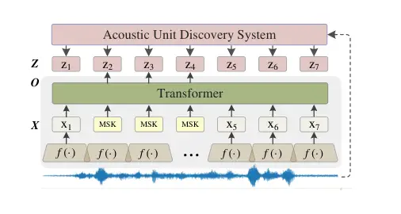
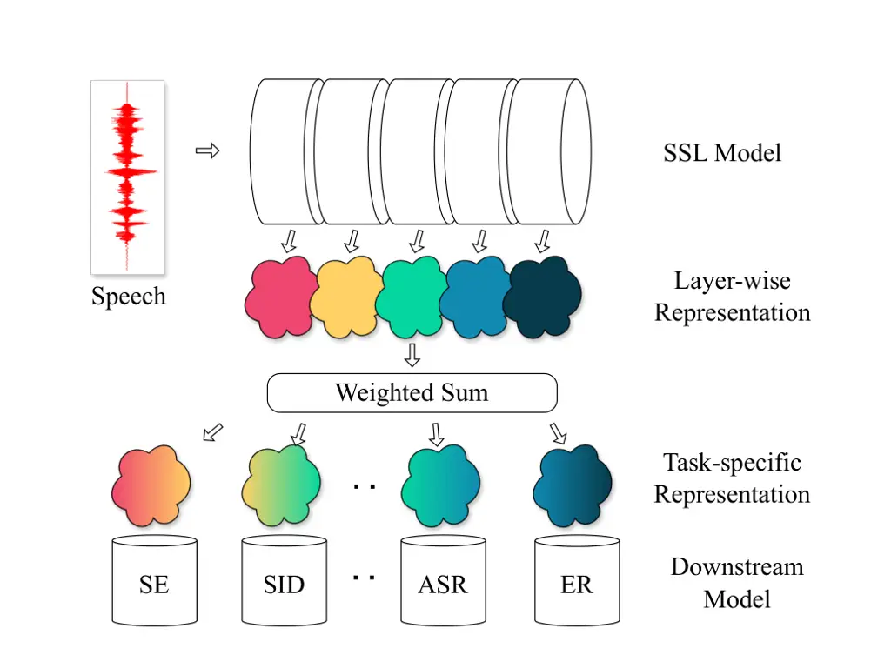
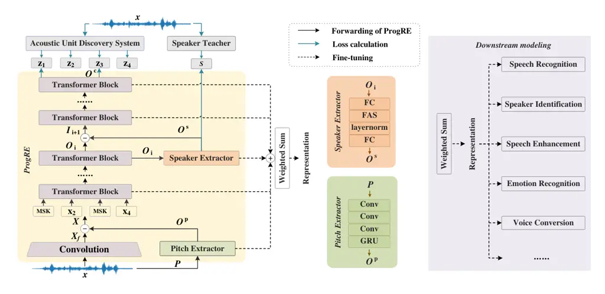
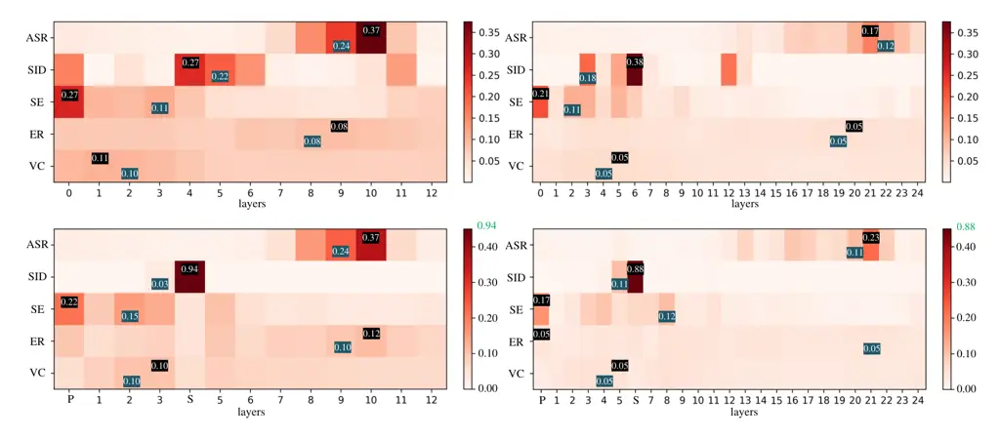

# Progressive Residual Extraction based Pre-training for Speech Representation LearningThanks:  This work was supported in part by the National Key R&D Program of China (2022ZD0116101), the National Natural Science Foundation of China under Grant U23B2053 and Grant 62176182. (Corresponding authors: Longbiao Wang and Meng Ge). Tianrui Wang, Jin Li, Rui Cao, and Xiaobao Wang are with the Tianjin Key Laboratory of Cognitive Computing and Application, College of Intelligence and Computing, Tianjin University, Tianjin 300350, China (e-mail: {wangtianrui, caorui_2022, lijin0120, wangxiaobao}@tju.edu.cn). Longbiao Wang is with the Tianjin Key Laboratory of Cognitive Computing and Application, College of Intelligence and Computing, Tianjin University, Tianjin 300350, China, and also with the Huiyan Technology (Tianjin) Company, Ltd., Tianjin 300350, China (e-mail: longbiao_wang@tju.edu.cn). Meng, Ge is with Saw Swee Hock School of Public Health, National University of Singapore, Singapore (e-mail: gemeng@nus.edu.sg). Ziyang Ma and Xie Chen are with MoE Key Lab of Artificial Intelligence, AI Institute, Shanghai Jiao Tong University, Shanghai, China (e-mail: {zym.22, chenxie95}@sjtu.edu.cn). Yuguang Wang is with Huiyan Technology (Tianjin) Co., Ltd, Tianjin, China (e-mail: ygwang@huiyan-tech.com). Jianwu Dang is with the Shenzhen Institute of Advanced Technology, Chinese Academy of Sciences, Guangdong, China (e-mail: jdang@jaist.ac.jp). Nyima Tashi is with the School of Information Science and Technology, Tibet University, Lhasa, China (e-mail: nmzx@utibet.edu.cn)

Tianrui Wang    Jin Li    Ziyang Ma    Rui Cao    Xie Chen    Longbiao
Wang    Meng Ge Affiliation: Xiaobao Wang, Yuguang Wang, Jianwu Dang,
Nyima Tashi

###### Abstract

Self-supervised learning (SSL) has garnered significant attention in
speech processing, excelling in linguistic tasks such as speech
recognition. However, jointly improving the performance of pre-trained
models on various downstream tasks, each requiring different speech
information, poses significant challenges. To this purpose, we propose a
progressive residual extraction based self-supervised learning method,
named ProgRE. Specifically, we introduce two lightweight and specialized
task modules into an encoder-style SSL backbone to enhance its ability
to extract pitch variation and speaker information from speech.
Furthermore, to prevent the interference of reinforced pitch variation
and speaker information with irrelevant content information learning, we
residually remove the information extracted by these two modules from
the main branch. The main branch is then trained using HuBERT’s speech
masking prediction to ensure the performance of the Transformer’s
deep-layer features on content tasks. In this way, we can progressively
extract pitch variation, speaker, and content representations from the
input speech. Finally, we can combine multiple representations with
diverse speech information using different layer weights to obtain
task-specific representations for various downstream tasks. Experimental
results indicate that our proposed method achieves joint performance
improvements on various tasks, such as speaker identification, speech
recognition, emotion recognition, speech enhancement, and voice
conversion, compared to excellent SSL methods such as wav2vec2.0,
HuBERT, and WavLM.

###### Index Terms: 

Self-supervised Learning, Speech Representation Learning, Speech
Disentangle, Pre-training

## I Introduction

Speech self-supervised learning (SSL) aims to learn how to extract a
universal representation of speech for various downstream tasks based on
a massive amount of unlabeled data \[1\]. In this framework, a model is
pre-trained on tasks using the speech itself to generate supervisory
signals, rather than relying on external labels provided by humans
\[2\]. After pre-training, the model, regarded as a speech
representation extractor, is fine-tuned using supervised speech data to
achieve task-specific capabilities for specific downstream tasks \[3\].

Existing well-known speech SSL methods can be categorized into two
streams: generative and contrastive methods \[4\]. Generative methods
build an encoder to convert speech into representations and train the
encoder by reconstructing the speech from these representations,
including TERA \[5\], SoundStream \[6\], and Encodec \[7\]. Since
generative methods are supervised on specific speech signals, they often
excel in acoustic tasks but are not satisfied for content tasks \[8\].
Contrastive methods also build an encoder to convert speech into
representations, but train the encoder by measuring the similarity
between representations of different inputs or modules. Examples include
wav2vec \[9\], HuBERT \[10\], WavLM \[11\], and Data2vec \[12\]. These
contrastive methods are usually supervised on cluster-style macro
information, so they perform well on content tasks but mediocrely on
acoustic tasks \[13, 14\].

With the development of multi-modal large language models \[15\], the
universality of SSL across various tasks has been highlighted \[16\]. In
pursuit of this objective, the SUPERB and SUPERB-SG benchmarks \[3, 17\]
assemble fifteen downstream tasks to evaluate pre-trained models in
areas, such as content, speaker, paralanguage, and acoustic processing.
Although researchers have proposed various impressive SSL strategies
tailored to specific tasks such as speaker recognition \[18, 19\],
emotion recognition \[20, 21\], and speech enhancement \[22, 23, 24\],
enhancing a model’s ability on one task often leads to a decline in its
ability on other tasks \[25\]. This prompts a challenging research
question: Can speech pre-training be equipped with the capability to
simultaneously enhance performance across various tasks?

To answer this research question, initial studies have focused on
combining multiple task-specific pre-trained models \[26\] or using
adapter-based multi-task pre-training \[22\]. These researches
facilitate the concurrent extraction of speech representations tailored
for diverse downstream tasks, and achieve preliminary success. However,
these approaches, rooted in the Mixture of Experts (MOE) principle
\[27\], lead to increased resource demands and do not fundamentally
address the challenges inherent in achieving universal speech SSL
representations. Some explorations have pointed out that the
incompatibility between tasks makes it difficult for models to find a
common direction of convergence across various tasks in multi-task
learning \[22, 24\]. The incompatibility between different tasks
primarily stems from the varying contributions of different types of
speech information to each task \[28\]. Correspondingly, existing SSL
models also exhibit a trend of task modularization when extracting
speech representations. The representations produced by different layers
are suited to different downstream tasks. Representations from the
shallow layers of Transformers focus on capturing acoustic information,
with these layers closer to the input modeling richer acoustic details
\[29\]. In contrast, deep-layer representations, which contain more
contextual and semantic information, perform better on tasks such as
speech recognition \[30\]. We refer to these as task characteristics in
our paper. The layer-wise task characteristics can be explained by
speech information disentanglement. Speech can theoretically be
progressively disentangled into non-linguistic, para-linguistic, and
linguistic information \[31\]. In practice, speech is typically
decoupled into three components: speaker, content, and pitch variation
\[32, 33\]. These three types of information are theoretically
independent of each other and can be freely combined for use in various
downstream tasks \[30\]. Moreover, studies have indicated that removing
content information can enhance speaker recognition performance \[34,
35, 36\]. Conversely, other research \[28, 37\] suggests that removing
content-independent speaker information can improve the performance of
content-related tasks. Therefore, leveraging the independence between
different types of speech information and the task-specific
characteristics of various Transformer layers in SSL models seems to be
the key to addressing the varying demands for speech information across
different downstream tasks.

Inspired by the above discussions, we propose a novel pre-training
method called ProgRE, which progressively extracts the representations
of pitch variation, speaker, and content from speech. By doing so,
ProgRE can ensure the extracted representations adapt to downstream
tasks with various demands for speech information, achieving
simultaneous compatibility effects. Specifically, we first strengthen
the extraction of pitch variation and speaker information in the two
middle layers of the SSL model. Since pitch-variation, speaker, and
content information are theoretically independent of each other \[32\],
we progressively remove the strengthened pitch-variation and speaker
representations from the main branch. This gradual purification of the
main branch reduces the model’s burden and prevents the strengthened
information from interfering with the learning of other irrelevant
information, especially content information. Specifically, based on
HuBERT \[10\], we insert two lightweight extractors to model pitch
variation and speaker information of speech and progressively remove
them from the main speech branch in a progressive residual manner \[7,
6, 28\]. Finally, the residual main branch is trained by HuBERT’s
self-supervised strategy to predict the masked units. Experiments show
that our ProgRE can jointly improve performance across various tasks.
Furthermore, visualizations demonstrate that specific layers contribute
more significantly to their corresponding tasks. By strengthening the
roles of different layers for different types of speech information,
ProgRE with a weighted-sum mechanism can also be used to analyze the
downstream task’s demands for various types of speech information.

Our main contributions are summarized as follows:

- •
  We pointed out and experimentally verified that the task
  characteristics of different layers facilitated by the pre-training
  strategy, as well as mitigating the incompatibility between different
  tasks, are key to achieving a universal pre-training model.
- •
  We proposed a progressive residual extraction based pre-training
  method for speech representation learning. This approach enables the
  pre-trained model to balance the extraction of pitch variation,
  speaker information, and content information, leading to joint
  performance improvements across various downstream tasks.
- •
  We additionally introduced the extractors of pitch variation and
  speaker information, which can greatly improve the model’s ability to
  extract intonation and non-linguistic information and achieve
  state-of-the-art (SOTA) performance on various downstream tasks,
  especially speaker identification and voice conversion tasks.
- •
  In addition to evaluating ProgRE’s performance on a 960-hour dataset,
  we also validated its effectiveness on large-scale pre-training tasks
  using an 84,500-hour English-Chinese bilingual dataset. Furthermore,
  we released code at
  [https://github.com/wangtianrui/ProgRE](https://github.com/wangtianrui/ProgRE).

This paper is organized as follows. Section II introduces fundamental
concepts utilized in our approach. Section III outlines the process by
which our method extracts representations for various downstream tasks.
Section IV provides a detailed description of our ProgRE method. Section
V presents the experimental setup and analysis of results. Section VI
discusses the findings of the research. Finally, Section VII concludes
the paper.

## II Preliminaries

### II-A HuBERT

HuBERT \[10\], as shown in Fig. 1, is a typical SSL method which
benefits from an offline clustering to generate pseudo labels $`\bm{Z}`$
for a BERT-like pre-training \[38\]. A convolutional module $`f(\cdot)`$
converts signal into the frame-level feature $`\bm{X}`$. Then, the
$`\bm{X}`$ is encoded by the Transformer into the representation
$`\bm{O}`$. During pre-training, the frame-level features are masked
randomly and successively, then fed to Transformer, the model is trained
to predict the labels of the masked frames.



Fig. 1: Diagram of HuBERT, which takes raw waveform as input to perform
a BERT-like self-supervised pre-training.

### II-B Residual Vector Quantization

Residual vector quantization (RVQ) is commonly used in speech
compression \[6, 7, 28\], which performs progressively refined
quantization of the representation $`\bm{X}`$, as shown in Fig 2.

Fig. 2: Diagram of residual vector quantization. RVQ performs
progressive residual quantization of $`\bm{X}`$.

The representation $`\bm{X}`$ is first encoded by the first quantization
$`Q_{1}`$, resulting in the representation $`\bm{q}_{1}`$. The error
between $`\bm{X}`$ and $`\bm{q}_{1}`$ is then encoded by a second
quantization module $`Q_{2}`$. In this way, the representation learned
by $`Q_{2}`$ contains minimal information that was already captured by
$`Q_{1}`$ \[28\].

## III Problem Formulation

Unlike conventional self-supervised pre-training models for speech,
which aim to extract a single representation that can be widely used in
various downstream tasks \[39, 3\], following SUPERB-SG \[17\], our
ProgRE seeks to extract multiple representations of the input speech
containing diverse speech information through a single SSL extractor.
These representations can then be combined arbitrarily using a
weighted-sum mechanism \[17, 30\] with minimal weights to obtain
task-specific representations for various downstream tasks, as shown in
Fig 3.



Fig. 3: Diagram of the weighted-sum mechanism-based speech
representation extraction. Speech is encoded into representations by a
multi-layer SSL model, and then the task-specific representation for
various downstream tasks is assembled with task-specific layer weights.

Given speech $`\bm{x}`$, ProgRE uses a $`n`$-layer Transformer SSL model
to extract layer-wise representations
$`\mathbf{O}=\left\{\bm{O}_{1},\bm{O}_{1},\dots,\bm{O}_{n}\right\}`$.
Then, the task-specific representation
$`\bm{R}\in\mathbb{R}^{T\times D}`$ is reorganized as follows:

```math
\bm{R}=\sum_{i=1}^{N}\omega_{i}\cdot\bm{O}_{i}, \tag{1}
```

where $`\omega_{i}`$ is the task-specific layer-wise weight. These
weights can be learned from task-specific fine-tuning.



Fig. 4: The diagram depicts our ProgRE model, which takes a waveform as
input and progressively extracts three types of representations: pitch
variation $`\bm{O}^{\text{ p}}`$, speaker $`\bm{O}^{\text{ s}}`$, and
content $`\bm{O}^{\text{ c}}`$ (indicated by black solid lines). The
model is supervised by two offline systems trained on the unlabeled
dataset (indicated by blue solid lines). For fine-tuning, a weighted-sum
mechanism is employed (indicated by black dotted lines).

## IV Progressive Residual Extraction Based Pre-training

As mentioned in Section I, the HuBERT pre-training strategy results in
deeper Transformer layers extracting representations dominated by
content information, while shallower layers retain more acoustic
details. We propose a progressive residual extraction based scheme and
adapt it into HuBERT, enhancing its ability to capture pitch variation
and speaker information without compromising its outstanding performance
in extracting content information.

As shown in Fig. 4, the input waveform $`\bm{x}`$ is converted into a
frame-level representation $`\bm{X}_{f}`$ with a frame stride of 20ms by
a convolutional module consisting of 7 layers of 1-D convolution. Next,
the pitch information $`\bm{O}^{\text{ p}}`$ is extracted by a pitch
extractor and removed from the main branch to obtain $`\bm{X}`$. The
multi-layer Transformer encodes $`\bm{X}`$ into the representation
$`\bm{O}`$. In the middle $`i`$-th Transformer layer, we add a speaker
extractor to extract the speaker information $`\bm{O}^{\text{ s}}`$ and
remove it from the main branch. During pre-training, $`\bm{X}`$ is
randomly masked before being input into the Transformer, and
pseudo-labels for the main branch and the speaker teacher network are
obtained based on unsupervised or self-supervised strategies. During
fine-tuning, a weighted-sum mechanism is employed to obtain various
features for downstream tasks, with learnable weights. We will introduce
our ProgRE method in detail in the following sub-sections.

### IV-A Progressive Residual Extraction

In order to achieve information removal in our ProgRE, we migrated
Residual Vector Quantization (RVQ) mentioned in Section II-B into
continuous representation, performing residually refined extraction of
the representation $`\bm{X}`$. We refer to this migrated method as
progressive residual extraction.

As shown in the ProgRE box in Fig. 4, we adapted our progressive
residual extraction method into the HuBERT framework. We inserted the
pitch extractor and speaker extractor as continuous-version $`Q_{1}`$
and $`Q_{2}`$ of Fig. 2, respectively, and removed the extracted
representations from the main branch. The information in the main branch
is progressively refined and finally supervised by HuBERT’s
self-supervision strategy to learn the extraction of cluster information
focusing on content \[29\]. Since information removal in progressive
residual extraction is only effective when all modules are trained
jointly \[40\], all modules of ProgRE are jointly pre-trained using
HuBERT’s self-supervision strategy. Additionally, the speaker extractor
is co-supervised by a teacher model specializing in capturing speaker
information. Furthermore, the pitch extractor is constrained to extract
only pitch variation information by inputting normalized pitch \[32\].
In this way, ProgRE can extract pitch variation representation, speaker
representation, and content representation in a residual manner.

#### IV-A1 Pitch Variation Modeling

Following the speech decoupling approach of voice conversion \[32\], we
extract the pitch $`\bm{F}_{0}`$ from the waveform as the anchor for
intonation variation \[41\]. The representation of the pitch extractor
is expected to contain intonation variations while excluding content and
speaker information, so we then perform log-normalization \[42\] within
each waveform’s pitch as follows:

```math
\bm{P}=\frac{\log{\bm{F}_{0}}-\text{mean}\left(\log{\bm{F}_{0}}\right)}{\text{std}\left(\log{\bm{F}_{0}}\right)}. \tag{2}
```

We then use the normalized pitch as input to ensure that the
representation extracted by the pitch extractor module only contains
pitch variation information \[32\], thus ensuring the effectiveness of
progressive residual extraction for other pitch-variation-irrelative
tasks, such as speaker and content information extraction. Specifically,
we employ a lightweight convolutional recurrent module to process the
normalized pitch, as illustrated in Fig. 4. Each convolution block
(Conv) consists of a 1D convolution, batch normalization \[42\], and
ReLU activation function \[43\]. A single-layer GRU \[44\], followed by
an output fully connected (FC) layer, is utilized to extract the
representation of pitch variation $`\bm{O}^{\text{ p}}`$.

Since the pitch is extracted from the waveform, we removed the pitch
variation information from the main branch after the convolution block,
as:

```math
\bm{X}=\text{layernorm}\left(\text{Convolution}\left(\bm{x}\right)-\bm{O}^{\text{ p}}\right), \tag{3}
```

where $`\bm{x}`$ is the input signal, layer normalization is performed
after removal to accelerate the convergence of the model \[42\].

#### IV-A2 Speaker Information Modeling

Unlike conventional utterance-level speaker representation extraction,
the speaker extractor in ProgRE is a frame-level extraction module. The
frame-level module leverages the mask prediction pre-training strategy
of SSL, enabling the encoder to learn to predict the information
randomly masked in the input sequence, thereby improving the model’s
bidirectional and global speaker information extraction ability.

The inserted speaker extractor comprises an FC layer, frame-level
attentive statistics (FAS), and layer normalization following an output
FC layer. FAS is a frame-level Attentive Statistic Pooling \[45\], which
calculates mean and variance on each frame. We insert the speaker
extractor after the $`i`$-th Transformer block to extract the speaker
representation
$`\bm{O}^{\text{ s}}\!=\!\left[\bm{o}^{\text{ s}}_{1},\bm{o}^{\text{ s}}_{2},\cdots,\bm{o}^{\text{ s}}_{T}\right]\in\mathbb{R}^{T\times D}`$,
as shown in Fig. 4.

In addition to being trained with the main branch using HuBERT’s
self-supervised strategy, we add a constraint to guide the speaker
extractor in a teacher-student learning manner, focusing solely on
speaker information. Similar to the K-means-based speech units of
HuBERT, we obtain an utterance-level target $`\bm{s}\in\mathbb{R}^{K}`$
for the speaker extractor based on an offline self-supervised
pre-trained model, EMA-DINO \[19\], which is an ECAPA-TDNN \[45\]
pre-trained without any labels using knowledge distillation. Then,
masked regression is employed to train the speaker extractor as follows:

```math
\mathcal{L}_{\text{ s}}=-\frac{1}{T_{m}}\sum_{t\in T_{m}}\log\sigma\left(\text{sim}(\bm{A}^{s}\bm{o}^{\text{ s}}_{t},\bm{s})\right), \tag{4}
```

where $`\bm{A}^{s}\in\mathbb{R}^{D\times K}`$ is a projection matrix,
$`\text{sim}\left(\cdot,\cdot\right)`$ represents the cosine similarity,
and $`\sigma(\cdot)`$ denotes the sigmoid \[43\]. The speaker loss
$`\mathcal{L}_{\text{ s}}`$ is calculated only on the masked frames
$`T_{m}`$.

The extracted speaker representation $`\bm{O}^{\text{ s}}`$ is then
removed from the output of the $`i`$-th Transformer block
$`\bm{O}_{i}`$, as

```math
\bm{I}_{i+1}=\text{layernorm}\left(\bm{O}_{i}-\bm{O}^{\text{ s}}\right), \tag{5}
```

where $`\bm{I}_{i+1}`$ denotes the input of the next Transformer block.

#### IV-A3 Content Information Modeling

The training of the main branch in our model follows the HuBERT \[10\].
Specifically, we employ the BERT-like masked pseudo-label prediction
task \[38\] based on K-means clustering. This objective encourages the
deep layers of the encoder to learn content representations while
allowing the shallow-layer representations closer to the input to retain
more acoustic details \[29\]. Preserving these task characteristics of
different layers is crucial for ensuring the effectiveness of the pitch
and speaker extractors.

Before pre-training, we perform offline clustering of MFCC or
hidden-layer representations from the previously pre-trained model to
generate pseudo-labels
$`\bm{Z}\!=\!\left[z_{1},z_{2},\cdots,z_{T}\right]`$, where each
$`z\in\left[U\right]`$ is a $`U`$-class variable. As illustrated in
Fig. 4, during pre-training, the frame-level output of the convolution
module is randomly and successively masked, and then fed into the
Transformer encoder. After extracting and removing pitch variation and
speaker information, the main branch is trained to predict the
pseudo-labels of the masked frames, as:

```math
\mathcal{L}_{\text{ c}}=\frac{1}{T_{m}}\sum_{t\in T_{m}}\log{\frac{\exp\left(\text{sim}\left(\bm{A}^{c}\bm{o}^{\text{ c}}_{t},\bm{e}_{u}\right)/\tau\right)}{\sum_{u^{\prime}}^{U}\exp\left(\text{sim}\left(\bm{A}^{c}\bm{o}^{\text{ c}}_{t},\bm{e}_{u^{\prime}}\right)/\tau\right)}}, \tag{6}
```

where $`\bm{A}^{c}`$ is a projection matrix,
$`\bm{O}^{\text{ c}}\!=\!\left[\bm{o}^{\text{ c}}_{1},\bm{o}^{\text{ c}}_{2},\cdots,\bm{o}^{\text{ c}}_{T}\right]`$
is the output of last-layer Transformer, $`\bm{e}_{u}`$ is the embedding
for the K-means unit $`u`$, and $`\tau`$ scales the logit, set to 0.1.
Similar to the speaker loss in speaker information modeling, the content
loss $`\mathcal{L}_{\text{ c}}`$ is only applied over the masked frames.

#### IV-A4 Loss Function of Pre-training

As mentioned in section IV-A, our progressive residual extraction method
works effectively only when all modules are trained jointly.
Furthermore, the speaker extractor needs to be co-supervised by a
pre-trained speaker-teacher model. Our ProgRE model is pre-trained using
the following multi-task loss function:

```math
\mathcal{L}=\lambda_{\text{ f}}\cdot\mathcal{L}_{\text{ f}}+\lambda_{\text{ s}}\cdot\mathcal{L}_{\text{ s}}+\lambda_{\text{ c}}\cdot\mathcal{L}_{\text{ c}}, \tag{7}
```

where $`\mathcal{L}_{\text{ f}}`$ denotes the mean square error of
$`\bm{X}_{f}`$. $`\mathcal{L}_{\text{ s}}`$ and
$`\mathcal{L}_{\text{ c}}`$ represent the losses associated with speaker
and content modeling, respectively, as described in equation (4) and
(6). The hyper-parameters $`\lambda_{\text{ f}}`$,
$`\lambda_{\text{ s}}`$, and $`\lambda_{\text{ c}}`$ for the three loss
functions are set to 10.0, 1.0, and 1.0, respectively.

### IV-B Fine-tuning

As introduced in Section III, after pre-training, we utilize a
weighted-sum mechanism for downstream fine-tuning, as depicted in
Fig. 4. All outputs of the hidden layers are weighted-sum with learnable
weights as input to the downstream model. Due to the insertion of two
specific task extractors, ProgRE utilizes the representations extracted
by the pitch extractor, speaker extractor, and the outputs of
Transformer layers (excluding the layers with inserted two extractors)
for weighted-sum, as shown in Fig. 4. This approach enables us to use
different weights to obtain representations suitable for various
downstream tasks. Consequently, with a lightweight downstream model, we
can achieve excellent performance on downstream tasks with a small
amount of supervised data.

## V Experiments and Results

### V-A Tasks and Datasets

We pre-trained our model on LibriSpeech \[46\], WenetSpeech \[47\], and
Multi-lingual Speech (MLS) \[48\]. We conducted various fine-tuning
experiments, including speech recognition (ASR), speaker identification
(SID), speech enhancement (SE), emotion recognition (ER), and voice
conversion (VC) to evaluate the model’s performance on content, speaker,
intonation, and acoustic learning. These fine-tuning experiments
utilized data from various datasets: LibriSpeech \[46\], VoxCeleb1
\[49\], Interactive Emotional Dyadic Motion Capture (IEMOCAP) \[50\],
Voicebank-DEMAND \[51\], and the dataset of the Voice Conversion
Challenge (VCC2020) \[52\]. All audio samples were sampled at 16 kHz.

Pre-training: We pre-trained two versions of ProgRE and HuBERT: Base and
Large. For the Base model, we used 960 hours of LibriSpeech data for
pre-training to ensure comparability with other open-source Base SSL
models. For the Large model, we used a total of 84,500 hours of
bilingual data in English and Chinese for pre-training. This bilingual
dataset included 44,500 hours of MLS English data, 10,000 hours of
Wenetspeech Chinese data, and 30,000 hours of Chinese speech data
collected from the Internet. All pre-training data were used without
labels.

Speech recognition fine-tuning: The train-clean-100 and dev-clean
subsets of LibriSpeech were employed as the training and development
datasets for ASR, respectively. The performance of the models was
evaluated on the test-clean, and test-other subsets of LibriSpeech.

Speaker identification fine-tuning: We fine-tuned and evaluated the
models on the VoxCeleb1 dataset for the SID task. VoxCeleb1 contains
over 100,000 utterances from 1,251 celebrities, extracted from videos.

Speech enhancement fine-tuning: We used the Voicebank-DEMAND dataset for
SE. This dataset includes data from 28 speakers with various
signal-to-noise ratio (SNR) levels: 15, 10, 5, and 0 dB. The test set
consists of data from two additional speakers with 17.5, 12.5, 7.5, and
2.5 dB SNRs.

Speech emotion recognition fine-tuning: We fine-tuned models on section
2 to 5 subsets of the IEMOCAP dataset for ER and evaluated their
performance on the section 1 subset. The IEMOCAP dataset comprises
approximately 12 hours of recordings encompassing various emotional
expressions. Notably, IEMOCAP emphasizes the natural expression of
emotions in conversations, where the emotional content of speech is
closely tied to the spoken context.

Voice conversion fine-tuning: Following the evaluation in SUPERB-SG
\[53, 17\], we conducted the any-to-one voice conversion task of
VCC2020, where TEF1 was chosen as the target speaker. The speaker model
was directly trained on the target speaker training set.

### V-B Experimental Setup

#### V-B1 Configuration of Models

To validate the effectiveness of our proposed ProgRE, we conducted
comprehensive comparisons with some excellent self-supervised
pre-training models as follows:

wav2vec 2.0 \[9\]: wav2vec 2.0 is a self-supervised learning model that
utilizes a quantization-based contrastive learning strategy to pretrain
the encoder, distinguishing between positive samples (audio segments
from the same utterance) and negative samples (segments from different
utterances).

WavLM \[11\]: WavLM simultaneously learns the BERT-like masked unit
prediction and denoising during pre-training. It has shown SOTA
performance on various downstream tasks.

HuBERT \[10\]: HuBERT is a self-supervised speech representation
learning approach that employs an offline clustering step to provide
aligned target pseudo labels for a BERT-like prediction loss.

ProgRE: Our proposed progressive residual extraction based pre-training
strategy is illustrated in Fig. 4. Two extractors are inserted into the
encoder-style SSL backbone. The pitch extractor consists of three
256-channel convolutional layers with a kernel size of 5, a single-layer
GRU with 256 cells, and a fully connected (FC) layer with hidden
feature-dimension cells. The speaker extractor comprises a fully
connected layer with 256 cells, an FAS layer with hidden
feature-dimension cells, and another fully connected layer with hidden
feature-dimension cells. The hidden feature dimension is 768 in the Base
model and 1024 in the Large model.

We compared the Base and Large versions of the four models, keeping the
parameter configurations of the main structures consistent. For the Base
version model, the convolutional module consists of seven layers, each
with 512 channels, with strides of $`\left\{5,2,2,2,2,2,2\right\}`$ and
kernels of $`\left\{10,3,3,3,3,2,2\right\}`$. The Transformer contains
12 layers with 768 dimensions, 3072 inner dimensions, and 12 attention
heads. In contrast, for the Large version model, the convolutional
module maintains the same configuration as the Base version, but its
Transformer contains 24 layers with 1024 dimensions, 4096 inner
dimensions, and 16 attention heads.

Our pre-training codebase is built on MindSpore, resulting in a slight
loss¹¹ 1
[https://github.com/wangtianrui/ProgRE/blob/master/supplementary_results/README.md#migration-errors](https://github.com/wangtianrui/ProgRE/blob/master/supplementary_results/README.md#migration-errors)
in accuracy when migrating the model to various downstream fine-tuning
tasks implemented in the PyTorch framework. To distinguish our baseline
from HuBERT$`{}_{\text{pt}}`$, which is pre-trained in PyTorch \[54\],
we refer to our baseline HuBERT, implemented under the MindSpore
framework \[55\], as HuBERT$`{}_{\text{ms}}`$ or baseline.

#### V-B2 Pre-training Setup

The pseudo labels, speaker teacher, and detailed settings for
pre-training are introduced as follows:

Unsupervised unit discovery: In our model’s pre-training process, we
conduct two iterations, with the primary distinction being the origin of
pseudo-labels for the main branch. During the first iteration, we
extract 13-dimensional MFCCs along with their first-order and
second-order differential features. Subsequently, we train a 100-class
K-means model using the resulting 39-dimensional features from 10% (1%
for Large) of the speech data. Finally, we assign the corresponding
cluster center as the pseudo-label for each frame of speech. In the
second iteration, we utilize the output of the middle layer of the model
pre-trained in the first iteration as features (the 9th layer for the
Base version and the 18th layer for the Large version). These features
are then used to train a 500-class K-means model, and the corresponding
cluster center is assigned as the pseudo-label for each frame of speech.
For clustering, we utilize the MiniBatchKMeans implemented in the
scikit-learn \[56\] with a mini-batch strategy. We set the mini-batch
size to be 10,000 frames. Additionally, we employ k-means++ \[57\] with
20 random starts for better initialization.

Self-supervised speaker teacher model: We employed the open-source
toolkit Wespeaker \[58\] to pre-train the EMA-DINO \[19\] without labels
as the speaker teacher model for our ProgRE. Specifically, for the Base
version of ProgRE, we trained the EMA-DINO model with 512 intermediate
dimensions on 960 hours of LibriSpeech. Similarly, for the Large version
of ProgRE, we trained the teacher model with 1024 intermediate
dimensions on the 44,500 hour MLS English dataset. These teacher models
will output a 192-dimensional utterance-level speaker embedding to serve
as supervision for the speaker extractor of our ProgRE.

Training detail: For the Base version, with two iterations, ProgRE Base
was pre-trained for 400K steps per iteration on 32 Ascend910 GPUs, with
a batch size of 60-second samples per GPU. For the Large version, ProgRE
Large was pre-trained for 350K steps in the first iteration and 1400K
steps in the second iteration, using 96 Ascend910 GPUs with a batch size
of 25-second samples per GPU. The Adam optimizer was used with a warm-up
learning rate, ramping up from 0 to 5e-4 for the first 8% of steps and
then decaying to 0.

#### V-B3 Fine-tuning Setup

The downstream models and detailed settings for fine-tuning are
introduced as follows:

Downstream models: For ASR, we used a 2-layer BiLSTM with 1024 cells,
optimized by the character-unit CTC loss. For SID, we applied an
utterance-level mean-pooling followed by a 1251-class FC layer,
optimized by cross-entropy loss. For SE, we used a 3-layer BiLSTM with
256 cells followed by a sigmoid activation for mask-based filtering,
trained via the L1 loss function. For ER, an utterance-level
mean-pooling followed by convolutional attention with a kernel size of 5
was optimized by cross-entropy loss. For VC, we used the Taco2-AR
model²² 2
[https://github.com/s3prl/s3prl/blob/main/s3prl/downstream/a2o-vc-vcc2020/config.yaml](https://github.com/s3prl/s3prl/blob/main/s3prl/downstream/a2o-vc-vcc2020/config.yaml).
Taco2-AR extracts a speaker vector via an encoder consisting of 3
convolution layers and a 1024-cell BiLSTM and then generates the log-mel
spectrograms using 2-layer 256-cell LSTM models in an auto-regressive
manner.

Fine-tuning detail: To effectively evaluate the capabilities learned by
the self-supervised pre-trained models, we froze the parameters of the
pre-trained model during fine-tuning and only fine-tuned the weights of
the downstream model and the weights of the weighted-sum mechanism. All
downstream fine-tuning was performed using the Adam optimizer. Due to
the varying data scales of different downstream tasks, the number of
training steps, learning rate, and batch size used for fine-tuning each
downstream task differed. The detailed configuration is shown in the
TABLE I.

|      |             |               |            |
| ---- | ----------- | ------------- | ---------- |
| Task | update step | learning rate | batch size |
| ASR  | 40k         | 1e-4          | 32         |
| SID  | 100k        | 1e-3          | 64         |
| SE   | 40k         | 1e-3          | 16         |
| ER   | 50k         | 1e-4          | 16         |
| VC   | 10k         | 1e-4          | 6          |

TABLE I: Fine-tuning configuration of downstream tasks.

#### V-B4 Metrics

Word error rate (WER) was used to evaluate performance in the speech
recognition task. Accuracy (Acc) was employed for speaker identification
(SID) and speech emotion recognition (SER). Perceptual Evaluation of
Speech Quality (PESQ) \[59\] and scale-invariant signal-to-distortion
ratio (SI-SDR) \[60\] were used to measure the quality of enhanced
speech with a clean reference. Higher PESQ scores indicate better
auditory quality of the enhanced speech, and higher SI-SDR values
indicate greater similarity between the clean and enhanced signal
distributions. For the voice conversion (VC) task, we used Mel-Cepstral
Distortion (MCD) \[61\], Pearson correlation coefficient of pitch (F0C)
\[62\], WER, and speaker accept rate (SPK) for evaluation. WER was
measured using a pre-trained ASR model³³ 3
[https://dl.fbaipublicfiles.com/fairseq/wav2vec/wav2vec_vox_960h_pl.pt](https://dl.fbaipublicfiles.com/fairseq/wav2vec/wav2vec_vox_960h_pl.pt),
and SPK was defined as the pass rate at which the speaker verification
model⁴⁴ 4
[https://github.com/resemble-ai/Resemblyzer](https://github.com/resemble-ai/Resemblyzer)
considered the converted speech to be consistent with the target
speaker.

### V-C Ablation Study

We first verify the effectiveness of each improvement in our model. We
conduct ablation experiments involving the residual extraction, speaker
extractor, and pitch extractor. In these experiments, we focus on the
model’s performance on two tasks: speech recognition and speaker
identification. These tasks evaluate the model’s ability to understand
speech content and non-linguistic information, respectively \[63\].

#### V-C1 Importance of Residual Extraction

Residual extraction is the core of our method. Based on the Base version
model, we compared the performance of residual extraction with that of
multi-task extraction, where multi-task extraction replaces the
subtraction (denoted by $`\circleddash`$) in residual extraction with
addition (denoted by $`\oplus`$). Since the insertion layer of the
speaker extractor also affects the performance of the model, in this
ablation experiment, we inserted the speaker extractor at the position
where it performs best in the Base version setting, which is after the
4th layer of the Transformer, results are shown in the TABLE II.

|       |                                                 |                          |            |                        |       |
| ----- | ----------------------------------------------- | ------------------------ | ---------- | ---------------------- | ----- |
| Index | Method                                          | ASR (WER) $`\downarrow`$ |            | SID (Acc) $`\uparrow`$ |       |
|       |                                                 | test-clean               | test-other | dev                    | test  |
| 0     | baseline                                        | 6.85                     | 16.77      | 81.01                  | 79.94 |
| 1     | $`\oplus`$ pitch $`\oplus`$ speaker             | 8.06                     | 19.11      | 88.75                  | 87.58 |
| 2     | $`\circleddash`$ pitch $`\oplus`$ speaker       | 7.87                     | 18.55      | 89.69                  | 89.14 |
| 3     | $`\oplus`$ pitch $`\circleddash`$ speaker       | 6.71                     | 16.36      | 88.77                  | 87.51 |
| 4     | $`\circleddash`$ pitch $`\circleddash`$ speaker | 6.52                     | 15.20      | 90.95                  | 90.61 |

TABLE II: Comparison of residual extraction and multi-task extraction.
BLOD indicates the best result.

Although multi-task extraction ($`\oplus`$ pitch $`\oplus`$ speaker)
significantly enhances the pre-trained model’s ability to extract
speaker information, it degrades the model’s performance on speech
recognition. This occurs because multi-task extraction strengthens the
model’s capacity to capture pitch variation and speaker information, but
the enhanced content-irrelevant information interferes with the deeper
Transformer’s capacity to extract content information. When we remove
the enhanced pitch variation information from the main branch
($`\circleddash`$ pitch $`\oplus`$ speaker), the performance of speech
recognition improves, and the improvement of speaker identification
becomes more significant. This is because pitch variation information is
less related to speaker and content information, and removing redundant
information can enhance performance on irrelevant tasks jointly. The
3-index method ($`\oplus`$ pitch $`\circleddash`$ speaker) performs
comparably to multi-task extraction (1-index) on speaker identification
tasks, but its performance on speech recognition is improved compared to
the 2-index method. This indicates that the speaker information
extracted by the speaker extractor has a more significant interference
with content extraction than pitch variation information. The final
results ($`\circleddash`$ pitch $`\circleddash`$ speaker) demonstrate
that progressive residual extraction can jointly enhance the model’s
performance on both speech recognition and speaker identification tasks.
Progressively refining the content information in the main branch
improves the model’s performance across various tasks.

#### V-C2 Importance of Inserting the Speaker Extractor

Unlike the pitch extractor, which directly takes its input from the
waveform, the speaker extractor is inserted after the middle Transformer
layer. Therefore, we conducted an ablation experiment on the insertion
layer. In this ablation experiment, we used the Base version model, did
not include the pitch extractor, and used residual extraction
(subtraction, $`\circleddash`$) as the insertion method. We inserted the
speaker extractor before the Transformer (0th layer) or after the
$`\{2,4,6,8,10,12\}`$-th layer. The results are shown in TABLE III.

|       |                          |            |                        |       |
| ----- | ------------------------ | ---------- | ---------------------- | ----- |
| Layer | ASR (WER) $`\downarrow`$ |            | SID (Acc) $`\uparrow`$ |       |
|       | test-clean               | test-other | dev                    | test  |
| \-    | 6.85                     | 16.77      | 81.01                  | 79.94 |
| 0     | 7.01                     | 17.02      | 73.16                  | 72.17 |
| 2     | 7.46                     | 17.61      | 77.59                  | 75.37 |
| 4     | 6.67                     | 16.04      | 88.89                  | 87.64 |
| 6     | 7.48                     | 18.30      | 86.88                  | 85.37 |
| 8     | 8.01                     | 19.41      | 74.36                  | 72.55 |
| 10    | 8.17                     | 21.27      | 73.26                  | 69.54 |
| 12    | 7.74                     | 18.73      | 84.61                  | 84.25 |

TABLE III: Comparison of the insertion layer of speaker extractor. BLOD
indicates the best result.

|        |                          |            |           |                          |            |                        |       |                   |                     |                       |                    |                  |                    |                  |
| ------ | ------------------------ | ---------- | --------- | ------------------------ | ---------- | ---------------------- | ----- | ----------------- | ------------------- | --------------------- | ------------------ | ---------------- | ------------------ | ---------------- |
| Method |                          | Param. (M) | Codebase  | ASR (WER) $`\downarrow`$ |            | SID (Acc) $`\uparrow`$ |       | SE                |                     | ER (Acc) $`\uparrow`$ | VC                 |                  |                    |                  |
|        |                          |            |           | test-clean               | test-other | dev                    | test  | PESQ $`\uparrow`$ | SI-SDR $`\uparrow`$ |                       | MCD $`\downarrow`$ | F0C $`\uparrow`$ | WER $`\downarrow`$ | SPK $`\uparrow`$ |
| Base   | wav2vec2.0               | 94.70      | Fairseq   | 6.75                     | 16.28      | 79.08                  | 78.22 | 2.94              | 9.35                | 62.21                 | 7.86               | 0.35             | 11.2               | 92.0             |
|        | HuBERT$`{}_{\text{pt}}`$ | 94.70      | Fairseq   | 6.72                     | 16.11      | 81.42                  | 80.17 | 2.99              | 9.32                | 62.44                 | 7.89               | 0.34             | 10.2               | 94.0             |
|        | WavLM                    | 94.70      | Fairseq   | 6.50                     | 15.27      | 84.58                  | 83.59 | 3.00              | 9.08                | 63.78                 | 7.74               | 0.39             | 9.9                | 94.0             |
|        | HuBERT$`{}_{\text{ms}}`$ | 94.70      | Mindspore | 6.85                     | 16.77      | 81.01                  | 79.94 | 2.96              | 9.24                | 62.05                 | 7.77               | 0.35             | 10.4               | 94.0             |
|        | ProgRE                   | 97.04      | Mindspore | 6.52                     | 15.20      | 90.95                  | 90.61 | 3.04              | 9.80                | 63.96                 | 7.75               | 0.40             | 8.8                | 97.0             |
| Large  | wav2vec2.0               | 317.38     | Fairseq   | 3.87                     | 8.80       | 91.25                  | 90.54 | 3.01              | 9.28                | 67.82                 | 8.20               | 0.16             | 16.7               | 87.0             |
|        | HuBERT$`{}_{\text{pt}}`$ | 317.38     | Fairseq   | 3.96                     | 8.82       | 92.41                  | 92.29 | 3.03              | 9.41                | 69.49                 | 7.77               | 0.36             | 11.3               | 90.0             |
|        | WavLM                    | 317.38     | Fairseq   | 3.79                     | 8.26       | 96.47                  | 96.08 | 3.11              | 9.44                | 70.69                 | 7.86               | 0.35             | 11.2               | 92.0             |
|        | HuBERT$`{}_{\text{ms}}`$ | 317.38     | Mindspore | 4.07                     | 9.41       | 90.49                  | 90.38 | 3.00              | 9.26                | 67.13                 | 7.84               | 0.34             | 11.5               | 90.0             |
|        | ProgRE                   | 319.72     | Mindspore | 3.86                     | 8.64       | 97.67                  | 97.61 | 3.09              | 9.45                | 70.73                 | 7.74               | 0.39             | 9.5                | 94.0             |

TABLE IV: Comparison of pre-training methods fine-tuned on different
downstream tasks.

The results indicate that the insertion of the speaker extractor at
different layers significantly impacts the model’s performance. Compared
to the baseline, inserting the speaker extractor before the Transformer
(0th layer) or after the $`\{2,8,10\}`$-th layers leads to a degradation
in the model’s performance on speaker identification. This outcome can
be attributed to the task characteristics of different Transformer
layers, as the main branch employs the self-supervised strategy of
HuBERT. Previous works \[11, 29\] analyzed the task characteristics of
different layers and found that the fourth, fifth, sixth, and eleventh
layers play significant roles in speaker tasks, with the fourth layer
being the most influential. Hence, strengthening and removing that does
not align with the task characteristics of the main branch will instead
degrade the model’s performance on that task. Regarding the 0th layer,
since our lightweight speaker extractor lacks temporal modeling, it
cannot effectively extract speaker information from the output after
local-processing convolution. Furthermore, inserting the speaker
extractor after the $`\{0,2,6,8,10,12\}`$-th layers leads to a decline
in the main branch’s training efficacy, as observed in the degraded
performance on the speech recognition task. In summary, the
effectiveness of inserting residual extraction relies on the task
characteristics of different Transformer layers obtained from the main
branch training strategy.

#### V-C3 Importance of Inserting the Pitch Extractor

We explored the role of the pitch extractor in the Base version of our
model, and the results are presented in TABLE V. The findings indicate
that strengthening and then removing pitch variation can improve the
model’s performance in both speech recognition and speaker
identification tasks. This improvement can be attributed to the fact
that pitch variation primarily contains intonation information, with
minimal speaker and content information \[32\]. Consequently, removing
pitch variation information from the main branch facilitates the
subsequent extraction of speaker and content information.

|                                                 |            |                          |            |                        |       |
| ----------------------------------------------- | ---------- | ------------------------ | ---------- | ---------------------- | ----- |
| Method                                          | Param. (M) | ASR (WER) $`\downarrow`$ |            | SID (Acc) $`\uparrow`$ |       |
|                                                 |            | test-clean               | test-other | dev                    | test  |
| baseline                                        | 94.70      | 6.85                     | 16.77      | 81.01                  | 79.94 |
| $`\circleddash`$ pitch                          | 95.47      | 6.74                     | 16.38      | 81.66                  | 80.03 |
| $`\circleddash`$ speaker                        | 96.27      | 6.67                     | 16.04      | 88.89                  | 87.64 |
| $`\circleddash`$ speaker $`\circleddash`$ pitch | 97.04      | 6.52                     | 15.20      | 90.95                  | 90.61 |

TABLE V: Evaluation of inserting the pitch extractor.

### V-D Comparing SSL Models on Various Downstream Tasks

In order to verify the performance of our proposed method on various
downstream tasks, we conducted a comparison with existing open-source
pre-trained models on speech recognition, speaker identification, speech
enhancement, emotion recognition, and voice conversion tasks. The
results are shown in TABLE IV. Comparing the results of
HuBERT$`{}_{\text{ms}}`$ and HuBERT$`{}_{\text{pt}}`$, it shows that the
pre-trained HuBERT based on the MindSpore loses accuracy when migrating
to PyTorch, resulting in slight performance degradation on each
downstream task. Despite this disadvantage, our proposed method still
demonstrates SOTA performance on most tasks. Note that
HuBERT$`{}_{\text{ms}}`$ is used as our baseline instead of
HuBERT$`{}_{\text{pt}}`$. In addition, for the Large version of ProgRE,
we inserted the speaker extractor after the 6th layer Transformer.

#### V-D1 Speech Recognition

We compared the models’ ability to content understanding via fine-tuning
models on speech recognition.

In the Base version models, compared to HuBERT$`{}_{\text{ms}}`$, our
ProgRE achieves a relative WER reduction of 8.04%, our ProgRE even
outperforms WavLM implemented by Fairseq on test-other, indicating that
residual extraction of the pitch variation and speaker information can
effectively facilitate the learning of irrelevant content information.

In the large version models, in addition to our proposed ProgRE, we also
pre-trained HuBERT$`{}_{\text{ms}}`$ based on the MindSpore framework on
our 84,500 hours of bilingual English-Chinese data for comparison. The
results indicate that the 84,500 hours of bilingual data did not bring a
significant improvement in performance compared with LibriLight’s 60,000
hours. The amount of English data used in pre-training is 15,500 hours
less than that of HuBERT$`{}_{\text{pt}}`$. Coupled with the limitations
of the MindSpore framework, HuBERT$`{}_{\text{ms}}`$’s ASR ability in
English is worse than that of HuBERT$`{}_{\text{pt}}`$. Although
additional experiments⁵⁵ 5
[https://github.com/wangtianrui/ProgRE/blob/master/supplementary_results/README.md#chinese-asr](https://github.com/wangtianrui/ProgRE/blob/master/supplementary_results/README.md#chinese-asr)
showed that HuBERT$`{}_{\text{ms}}`$ performs better than
HuBERT$`{}_{\text{pt}}`$ in Chinese ASR, it is unfair to compare this to
Fairseq models that have not seen Chinese data, so those results are not
shown in this paper. Despite these challenges, the proposed model still
shows excellent performance, second only to WavLM pre-trained on 94,000
hours of English-only pertaining data, which proves that the progressive
residual extraction strategy is also applicable to large-scale
pre-training tasks.

#### V-D2 Speaker Identification

We assessed the model’s capacity to extract speaker information through
speaker identification tasks. The results demonstrate that our proposed
method achieves SOTA performance in both the Base and Large version
groups, showcasing substantial enhancements compared to
HuBERT$`{}_{\text{ms}}`$. This improvement in speaker information
extraction can be attributed to the residual insertion of the speaker
extractor at an optimal position, which ensures the effectiveness of
main branch training while significantly boosting the insertion layer’s
ability to extract speaker information.



Fig. 5: Layer-wise weight visualization in the weighted-sum mechanism of
HuBERT and ProgRE. The first row weights come from HuBERT, and the
second row comes from ProgRE. We show weights fine-tuned on ASR and SID
tasks for both Base and Large version models (left column is Base
version, right column is Large version).

#### V-D3 Speech Enhancement

Speech enhancement requires extracting clean and detailed acoustic
information from noisy input, so the ability of the pre-trained model to
extract various speech information is comprehensively evaluated. The
results show that our ProgRE achieves the best performance among the
Base version models. This is because WavLM Base does not introduce
denoising during pre-training, thus ProgRE, with its superior content
information extraction, speaker information extraction, and pitch
information extraction abilities, achieves the best speech enhancement
performance among the Base models. In the Large version models, the
overall PESQ metric is improved compared to the Base, but the SI-SDR has
decreased. We speculate that this is because the features extracted by
the Large model are more abstract with refined semantic information,
making the enhanced speech more intelligible to human ears but causing
distortion in numerical acoustic details. WavLM Large introduced
denoising during pre-training, and combined with its excellent
performance in the speech recognition task, it achieves the highest PESQ
score. The PESQ score of our proposed method is slightly lower than that
of WavLM Large. However, by strengthening the extraction of pitch and
speaker information closer to the speech signal, our method ProgRE Large
achieves a slightly higher SI-SDR score compared to WavLM Large.

#### V-D4 Speech Emotion Recognition

Since emotive expression and content are interrelated in the IEMOCAP
dataset \[50\], the performance of speech emotion recognition reflects
both the model’s ability to content understanding and its ability to
extract paralinguistic information. The results show that the proposed
model achieves the best performance under both Base and Large
configurations. This improvement can be attributed to the residual
extraction of pitch variation information, which allows the model to
capture more intonation and tonal details while also extracting refined
and accurate content information.

#### V-D5 Voice Conversion

We conducted an any-to-one voice conversion experiment \[53\]. The model
needs to remove the intonation and speaker information from the input
speech and then generate the speech of the target speaker based on the
remaining content information, thus serving as a test of the model’s
capability to disentangle speech information. In addition to objective
evaluation, we also present audio samples on the demo page⁶⁶ 6
[https://wangtianrui.github.io/progre_vc](https://wangtianrui.github.io/progre_vc).
From the results, we can see that ProgRE achieves a significantly higher
speaker verification pass rate (SPK) and F0 correlation (F0C) compared
to other reference models, indicating that the content representations
extracted by ProgRE contain fewer speaker and intonation information (an
in-depth analysis can be found in Section V-E). This proves the
effective information removal of residual extraction in ProgRE.
Moreover, the superior performance on the WER metric suggests that the
ProgRE-based VC model can retain more complete content information. The
SOTA overall performance is due to ProgRE extracting pitch variation and
speaker information residually at optimal layers, making the intonation,
speaker, and content information extracted by our model more
independent, enhancing the disentanglement of speech information.

Unexpectedly, the performances of the Large models are generally
slightly worse than those of the Base models. We speculate that this is
because the downstream model is too small to fit the high-dimensional
features extracted by the Large models, making it difficult for the
model to converge. Nevertheless, our proposed method still shows the
best performance among the Large models, indicating that the content
information extracted by our proposed model is more refined and easier
for the downstream model to learn.

### V-E Layer-wise Weight in Weighted-sum Mechanism

In order to explore the task characteristics of features at different
layers, we visualized the weights in the weighted-sum mechanism, as
shown in Fig. 5. Since the numerical distribution of our proposed method
is extreme, we cropped the value by 0.45 when drawing the weights of
ProgRE, as shown in green text. To more intuitively show the difference
in values, we marked the top-2 weights. As can be seen from Fig. 5,
consistent with the findings in other papers, the HuBERT model exhibits
different task characteristics at different layers. For content
understanding tasks such as speech identification, the weights of the
features extracted by the deep Transformer layers are high. Conversely,
for the extraction of non-linguistic information such as speaker
recognition, the weights of the features extracted by the shallow layers
play major roles. Compared with HuBERT, the weights of our method on the
speaker identification task are concentrated in the layer where the
speaker extractor is inserted, and the weights of the other layers are
close to zero. This demonstrates that residual extraction can
effectively remove information from the main branch, allowing subsequent
layers to focus on speaker-irrelevant tasks. Additionally, the weights
of the proposed method on the speech recognition task are similar to the
weight distribution of the original HuBERT, further proving that adding
residual extraction of corresponding task information at the appropriate
layer does not change the task characteristics distribution of the main
branch layer for other irrelevant tasks. For speech enhancement, the
overall weight distribution of ProgRE is similar to that of HuBERT, with
weights gradually decreasing from shallow to deep layers. For emotion
recognition, pitch variation representation and content-related layers
play key roles. This is because pitch variation contains emotion-related
intonation information. For voice conversion, the shallow-layer weights
of HuBERT and ProgRE are slightly larger than deep-layer’s weights.
However, the weights of the pitch representation and speaker feature
layers in ProgRE are low. Combined with the results of Section V-D5, our
method can reduce the intonation and speaker information in the
weighted-sum representation by decreasing the weights of the pitch and
speaker extractor layers. This also implies that the intonation and
speaker information contained in the representations of other layers is
less than that of HuBERT.

## VI Discussion

In this study, we explored the effectiveness of residual extraction in
speech self-supervised pre-training, highlighting that the task
characteristics of different layers facilitated by the pre-training
strategy are crucial for achieving joint improvement across various
downstream tasks. Previous research \[37\] has shown that actively
normalizing speaker information in speech recognition models can
effectively enhance performance on ASR. Consistent with these findings,
our experimental results demonstrate that actively removing
content-irrelevant speech information from the main branch, such as
speaker information or pitch variation, can improve the model’s ability
to extract content information. This validates that residual extraction
is essential for a single SSL model to adapt to various downstream tasks
with diverse demands for different types of speech information.
Moreover, as illustrated in TABLE III and Fig. 5, the strengthening of
pre-training model tasks should align with the layer-specific task
characteristics facilitated by the main branch pre-training strategy.
Deviating from these task characteristics can detrimentally affect the
main branch’s training efficacy, resulting in degraded performance. To
verify the practicality of our proposed method, we expanded the dataset
to 84,500 hours of English-Chinese bilingual data. The experimental
results demonstrate that the proposed method is adaptable to large-scale
pre-training tasks, achieving joint performance improvements across
various tasks. Notably, ProgRE exhibits state-of-the-art performance in
speaker information extraction and speech information disentanglement
capabilities. This confirms our hypothesis: to make the pre-training
model more universal, it is essential to enhance specific capabilities
while minimizing the interference of these strengthened features with
other irrelevant tasks. Our findings provide a significant reference for
the development of universal pre-training models.

This paper also points out some interesting issues that need further
exploration. First, after additional experimental verification, we found
that our model trained under the MindSpore framework incurs a numerical
relative error of 0.25% when being migrated to the PyTorch framework,
slightly affecting the model’s performance during fine-tuning. To
address this, we have open-sourced our code to encourage other
researchers to try it under the PyTorch framework. Second, for the Large
version model, we used 44,500 hours of English data and 40,000 hours of
low-quality Chinese data. From the comparative experiment of
HuBERT$`{}_{\text{pt}}`$ and HuBERT$`{}_{\text{ms}}`$, we observed that
although our total dataset is larger than that of
HuBERT$`{}_{\text{pt}}`$, which was trained with 60,000 hours of
English-only data, the performance in downstream fine-tuning tasks for
English is declined. We speculate that speech quality and language
differences significantly impact the performance of pre-trained models.
Third, for a fair comparison, the speaker-teacher model in our ProgRE is
limited to a self-supervised model on the pre-training data. Exploring
the possibility of directly using a powerful supervised model is an
attractive direction. Finally, this paper focuses on the speech
pre-training model, whether the concept of progressive residual
extraction is applicable to audio pre-training in general is another
interesting issue.

## VII Conclusion

Improving performance on various downstream tasks jointly is a challenge
that has garnered significant attention in speech self-supervised
pre-training. In this paper, we highlight that different downstream
tasks require different types of speech information. To make an SSL
model more universal, it is crucial to mitigate the mutual interference
of irrelevant speech information extraction during pre-training.
Inspired by pitch-speaker-content decoupling in voice conversion and
speaker information normalization in speech recognition, we propose a
progressive residual extraction based pre-training method. By leveraging
the task characteristics of different layers in HuBERT’s self-supervised
strategy, we enhance specific layers’ abilities to extract pitch
variation and speaker information. Subsequently, we remove this enhanced
information from the main branch using a residual extraction approach.
This removal reduces the subsequent learning burden on content
extraction for the main branch, ultimately achieving joint improvements
across various downstream tasks.

## References

- \[1\] Y.-A. Chung, W.-N. Hsu, H. Tang, and J. Glass, “An unsupervised
  autoregressive model for speech representation learning,” in
  _INTERSPEECH_, 2019, pp. 146–150.
- \[2\] A. Mohamed, H.-y. Lee, L. Borgholt, J. D. Havtorn, J. Edin,
  C. Igel, K. Kirchhoff, S.-W. Li, K. Livescu, L. Maaløe _et al._,
  “Self-supervised speech representation learning: A review,” _IEEE
  Journal of Selected Topics in Signal Processing_, 2022.
- \[3\] S.-W. Yang, P.-H. Chi, Y.-S. Chuang, C.-I. J. Lai, K. Lakhotia,
  Y. Y. Lin, A. T. Liu, J. Shi, X. Chang, G.-T. Lin _et al._, “Superb:
  Speech processing universal performance benchmark,” in _INTERSPEECH_,
  2021, pp. 3465–3469.
- \[4\] X. Liu, F. Zhang, Z. Hou, L. Mian, Z. Wang, J. Zhang, and
  J. Tang, “Self-supervised learning: Generative or contrastive,” _IEEE
  TKDE_, vol. 35, no. 1, pp. 857–876, 2021.
- \[5\] A. T. Liu, S.-W. Li, and H.-Y. Lee, “Tera: Self-supervised
  learning of transformer encoder representation for speech,” _IEEE
  TASLP_, vol. 29, pp. 2351–2366, 2021.
- \[6\] N. Zeghidour, A. Luebs, A. Omran, J. Skoglund, and
  M. Tagliasacchi, “Soundstream: An end-to-end neural audio codec,”
  _IEEE TASLP_, vol. 30, pp. 495–507, 2021.
- \[7\] A. Défossez, J. Copet, G. Synnaeve, and Y. Adi, “High fidelity
  neural audio compression,” _Transactions on Machine Learning
  Research_, 2023.
- \[8\] T. Wang, L. Zhou, Z. Zhang, Y. Wu, S. Liu, Y. Gaur, Z. Chen,
  J. Li, and F. Wei, “Viola: Unified codec language models for speech
  recognition, synthesis, and translation,” _arXiv preprint
  arXiv:2305.16107_, 2023.
- \[9\] A. Baevski, Y. Zhou, A. Mohamed, and M. Auli, “wav2vec 2.0: A
  framework for self-supervised learning of speech representations,” in
  _NeurIPS_, vol. 33, 2020, pp. 12 449–12 460.
- \[10\] W.-N. Hsu, B. Bolte, Y. H. Tsai, K. Lakhotia, R. Salakhutdinov,
  and A. Mohamed, “Hubert: Self-supervised speech representation
  learning by masked prediction of hidden units,” _IEEE TASLP_, vol. 29,
  pp. 3451–3460, 2021.
- \[11\] S. Chen, C. Wang, Z. Chen, Y. Wu, S. Liu, Z. Chen, J. Li,
  N. Kanda, T. Yoshioka, X. Xiao _et al._, “Wavlm: Large-scale
  self-supervised pre-training for full stack speech processing,” _IEEE
  JSTSP_, 2022.
- \[12\] A. Baevski, A. Babu, W.-N. Hsu, and M. Auli, “Efficient
  self-supervised learning with contextualized target representations
  for vision, speech and language,” in _ICML_, 2023, pp. 1416–1429.
- \[13\] J. Zhao and W.-Q. Zhang, “Improving automatic speech
  recognition performance for low-resource languages with
  self-supervised models,” _IEEE JSTSP_, vol. 16, no. 6, pp.
  1227–1241, 2022.
- \[14\] Z. Huang, S. Watanabe, S.-W. Yang, P. García, and S. Khudanpur,
  “Investigating self-supervised learning for speech enhancement and
  separation,” in _ICASSP_. IEEE, 2022, pp. 6837–6841.
- \[15\] D. Zhang, S. Li, X. Zhang, J. Zhan, P. Wang, Y. Zhou, and
  X. Qiu, “Speechgpt: Empowering large language models with intrinsic
  cross-modal conversational abilities,” in _The 2023 Conference on
  Empirical Methods in Natural Language Processing_, 2023.
- \[16\] A. Mohamed, H.-y. Lee, L. Borgholt, J. D. Havtorn, J. Edin,
  C. Igel, K. Kirchhoff, S.-W. Li, K. Livescu, L. Maaløe _et al._,
  “Self-supervised speech representation learning: A review,” _IEEE
  JSTSP_, 2022.
- \[17\] H.-S. Tsai, H.-J. Chang, W.-C. Huang, Z. Huang, K. Lakhotia,
  S.-w. Yang, S. Dong, A. T. Liu, C.-I. J. Lai, J. Shi _et al._,
  “Superb-sg: Enhanced speech processing universal performance benchmark
  for semantic and generative capabilities,” in _AMACL_, 2022.
- \[18\] S. Chen, Y. Wu, C. Wang, Z. Chen, Z. Chen, S. Liu, J. Wu,
  Y. Qian, F. Wei, J. Li _et al._, “Unispeech-sat: Universal speech
  representation learning with speaker aware pre-training,” in
  _ICASSP_. IEEE, 2022, pp. 6152–6156.
- \[19\] B. Han, W. Huang, Z. Chen, and Y. Qian, “Improving dino-based
  self-supervised speaker verification with progressive cluster-aware
  training,” in _ICASSPW_. IEEE, 2023, pp. 1–5.
- \[20\] A. Khare, S. Parthasarathy, and S. Sundaram, “Self-supervised
  learning with cross-modal transformers for emotion recognition,” in
  _IEEE SLT_, 2021, pp. 381–388.
- \[21\] Y. Li, Y. Mohamied, P. Bell, and C. Lai, “Exploration of a
  self-supervised speech model: A study on emotional corpora,” in
  _SLT_. IEEE, 2023, pp. 868–875.
- \[22\] T. Wang, X. Chen, Z. Chen, S. Yu, and W. Zhu, “An adapter based
  multi-label pre-training for speech separation and enhancement,” in
  _ICASSP_. IEEE, 2023, pp. 1–5.
- \[23\] B. Irvin, M. Stamenovic, M. Kegler, and L.-C. Yang,
  “Self-supervised learning for speech enhancement through synthesis,”
  in _ICASSP_. IEEE, 2023, pp. 1–5.
- \[24\] J. Lin, M. Ge, W. Wang, H. Li, and M. Feng, “Selective hubert:
  Self-supervised pre-training for target speaker in clean and mixture
  speech,” _IEEE Signal Processing Letters_, 2024.
- \[25\] Z. Ma, Z. Zheng, G. Yang, Y. Wang, C. Zhang, and X. Chen,
  “Pushing the limits of unsupervised unit discovery for ssl speech
  representation,” in _INTERSPEECH_, 2023.
- \[26\] X. Wang, Y. Cheng, Y. Yang, Y. Yu, F. Li, and S. Peng,
  “Multitask joint strategies of self-supervised representation learning
  on biomedical networks for drug discovery,” _Nature Machine
  Intelligence_, vol. 5, no. 4, pp. 445–456, 2023.
- \[27\] S. Masoudnia and R. Ebrahimpour, “Mixture of experts: a
  literature survey,” _Artificial Intelligence Review_, vol. 42, pp.
  275–293, 2014.
- \[28\] X. Zhang, D. Zhang, S. Li, Y. Zhou, and X. Qiu,
  “Speechtokenizer: Unified speech tokenizer for speech large language
  models,” in _International Conference on Learning
  Representations_, 2024.
- \[29\] A. Pasad, J.-C. Chou, and K. Livescu, “Layer-wise analysis of a
  self-supervised speech representation model,” in _2021 IEEE Automatic
  Speech Recognition and Understanding Workshop (ASRU)_. IEEE, 2021, pp.
  914–921.
- \[30\] J. Lim and K. Kim, “Wav2vec-vc: Voice conversion via hidden
  representations of wav2vec 2.0,” in _ICASSP 2024-2024 IEEE
  International Conference on Acoustics, Speech and Signal Processing
  (ICASSP)_. IEEE, 2024, pp. 10 326–10 330.
- \[31\] H. Fujisaki, “Information, prosody, and modeling-with emphasis
  on tonal features of speech,” in _Speech Prosody 2004, International
  Conference_, 2004.
- \[32\] D. Wang, L. Deng, Y. T. Yeung, X. Chen, X. Liu, and H. Meng,
  “Vqmivc: Vector quantization and mutual information-based unsupervised
  speech representation disentanglement for one-shot voice conversion,”
  in _INTERSPEECH_, 2021.
- \[33\] A. Triantafyllopoulos, B. W. Schuller, G. İymen, M. Sezgin,
  X. He, Z. Yang, P. Tzirakis, S. Liu, S. Mertes, E. André _et al._, “An
  overview of affective speech synthesis and conversion in the deep
  learning era,” _Proceedings of the IEEE_, 2023.
- \[34\] Q.-B. Hong, C.-H. Wu, and H.-M. Wang, “Decomposition and
  reorganization of phonetic information for speaker embedding
  learning,” _IEEE/ACM TASLP_, vol. 31, pp. 1745–1757, 2023.
- \[35\] T. Liu, K. A. Lee, Q. Wang, and H. Li, “Disentangling voice and
  content with self-supervision for speaker recognition,” in _NIPS_,
  vol. 36, 2024.
- \[36\] K. Qian, Y. Zhang, H. Gao, J. Ni, C.-I. Lai, D. Cox,
  M. Hasegawa-Johnson, and S. Chang, “Contentvec: An improved
  self-supervised speech representation by disentangling speakers,” in
  _International Conference on Machine Learning_. PMLR, 2022, pp.
  18 003–18 017.
- \[37\] D. Giuliani, M. Gerosa, and F. Brugnara, “Improved automatic
  speech recognition through speaker normalization,” _Computer Speech &
  Language_, vol. 20, no. 1, pp. 107–123, 2006.
- \[38\] J. Devlin, M.-W. Chang, K. Lee, and K. Toutanova, “Bert:
  Pre-training of deep bidirectional transformers for language
  understanding,” in _NAACL-HLT_. Audio Engineering Society, 2019.
- \[39\] S. Schneider, A. Baevski, R. Collobert, and M. Auli, “wav2vec:
  Unsupervised pre-training for speech recognition,” in _INTERSPEECH_,
  2019, pp. 3465–3469.
- \[40\] A. Vasuki and P. Vanathi, “A review of vector quantization
  techniques,” _IEEE Potentials_, vol. 25, no. 4, pp. 39–47, 2006.
- \[41\] M. Morise, H. Kawahara, and H. Katayose, “Fast and reliable f0
  estimation method based on the period extraction of vocal fold
  vibration of singing voice and speech,” in _International Conference:
  Audio for Games_. Audio Engineering Society, 2009.
- \[42\] L. Huang, J. Qin, Y. Zhou, F. Zhu, L. Liu, and L. Shao,
  “Normalization techniques in training dnns: Methodology, analysis and
  application,” _IEEE TPAMI_, vol. 45, no. 8, pp. 10 173–10 196, 2023.
- \[43\] A. D. Rasamoelina, F. Adjailia, and P. Sinčák, “A review of
  activation function for artificial neural network,” in _IEEE SAMI_,
  2020, pp. 281–286.
- \[44\] R. Dey and F. M. Salem, “Gate-variants of gated recurrent unit
  neural networks,” in _MWSCAS_. IEEE, 2017, pp. 1597–1600.
- \[45\] B. Desplanques, J. Thienpondt, and K. Demuynck, “Ecapa-tdnn:
  Emphasized channel attention, propagation and aggregation in tdnn
  based speaker verification,” in _INTERSPEECH_, 2020.
- \[46\] V. Panayotov, G. Chen, D. Povey, and S. Khudanpur,
  “Librispeech: an asr corpus based on public domain audio books,” in
  _ICASSP_. IEEE, 2015, pp. 5206–5210.
- \[47\] B. Zhang, H. Lv, P. Guo, Q. Shao, C. Yang, L. Xie, X. Xu,
  H. Bu, X. Chen, C. Zeng _et al._, “Wenetspeech: A 10000+ hours
  multi-domain mandarin corpus for speech recognition,” in _ICASSP
  2022-2022 IEEE International Conference on Acoustics, Speech and
  Signal Processing (ICASSP)_. IEEE, 2022, pp. 6182–6186.
- \[48\] V. Pratap, Q. Xu, A. Sriram, G. Synnaeve, and R. Collobert,
  “Mls: A large-scale multilingual dataset for speech research,” _arXiv
  preprint arXiv:2012.03411_, 2020.
- \[49\] A. Nagrani, J. S. Chung, and A. Zisserman, “Voxceleb: a
  large-scale speaker identification dataset,” in _INTERSPEECH_, 2017.
- \[50\] C. Busso, M. Bulut, C.-C. Lee, A. Kazemzadeh, E. Mower, S. Kim,
  J. N. Chang, S. Lee, and S. S. Narayanan, “Iemocap: Interactive
  emotional dyadic motion capture database,” _Language resources and
  evaluation_, vol. 42, pp. 335–359, 2008.
- \[51\] J. Thiemann, N. Ito, and E. Vincent, “The diverse environments
  multi-channel acoustic noise database (demand): A database of
  multichannel environmental noise recordings,” in _Proceedings of
  Meetings on Acoustics_, vol. 19, no. 1. AIP Publishing, 2013.
- \[52\] Y. Zhao, W.-C. Huang, X. Tian, J. Yamagishi, R. K. Das,
  T. Kinnunen, Z. Ling, and T. Toda, “Voice conversion challenge 2020 –-
  intra-lingual semi-parallel and cross-lingual voice conversion,” in
  _Proceedings of Joint Workshop for the Blizzard Challenge and Voice
  Conversion Challenge 2020_, 2020, pp. 80–98.
- \[53\] W.-C. Huang, S.-W. Yang, T. Hayashi, H.-Y. Lee, S. Watanabe,
  and T. Toda, “S3prl-vc: Open-source voice conversion framework with
  self-supervised speech representations,” in _Proc. ICASSP_, 2022.
- \[54\] M. Ott, S. Edunov, A. Baevski, A. Fan, S. Gross, N. Ng,
  D. Grangier, and M. Auli, “fairseq: A fast, extensible toolkit for
  sequence modeling,” in _CNACACL_, 2019, pp. 48–53.
- \[55\] L. Huawei Technologies Co., “Huawei mindspore ai development
  framework,” in _Artificial Intelligence Technology_. Springer, 2022,
  pp. 137–162.
- \[56\] O. Kramer and O. Kramer, “Scikit-learn,” _Machine learning for
  evolution strategies_, pp. 45–53, 2016.
- \[57\] D. Arthur, S. Vassilvitskii _et al._, “k-means++: The
  advantages of careful seeding,” in _Soda_, vol. 7, 2007, pp.
  1027–1035.
- \[58\] H. Wang, C. Liang, S. Wang, Z. Chen, B. Zhang, X. Xiang,
  Y. Deng, and Y. Qian, “Wespeaker: A research and production oriented
  speaker embedding learning toolkit,” in _ICASSP 2023-2023 IEEE
  International Conference on Acoustics, Speech and Signal Processing
  (ICASSP)_. IEEE, 2023, pp. 1–5.
- \[59\] A. W. Rix, J. G. Beerends, M. P. Hollier, and A. P. Hekstra,
  “Perceptual evaluation of speech quality (pesq)-a new method for
  speech quality assessment of telephone networks and codecs,” in _2001
  IEEE international conference on acoustics, speech, and signal
  processing. Proceedings (Cat. No. 01CH37221)_, vol. 2. IEEE, 2001, pp.
  749–752.
- \[60\] J. Le Roux, S. Wisdom, H. Erdogan, and J. R. Hershey,
  “Sdr–half-baked or well done?” in _ICASSP 2019-2019 IEEE International
  Conference on Acoustics, Speech and Signal Processing (ICASSP)_. IEEE,
  2019, pp. 626–630.
- \[61\] J. Kominek, T. Schultz, and A. W. Black, “Synthesizer voice
  quality of new languages calibrated with mean mel cepstral
  distortion.” in _SLTU_, 2008, pp. 63–68.
- \[62\] I. Cohen, Y. Huang, J. Chen, J. Benesty, J. Benesty, J. Chen,
  Y. Huang, and I. Cohen, “Pearson correlation coefficient,” _Noise
  reduction in speech processing_, pp. 1–4, 2009.
- \[63\] L. C. Nygaard and C. Y. Tzeng, “Perceptual integration of
  linguistic and non-linguistic properties of speech,” _The handbook of
  speech perception_, pp. 398–427, 2021.
