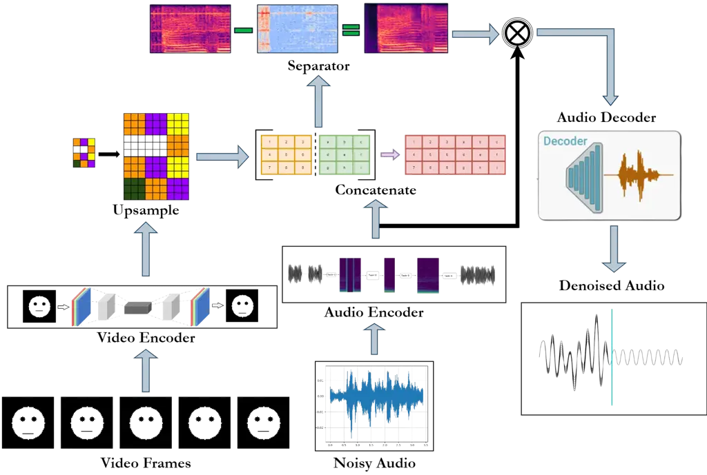
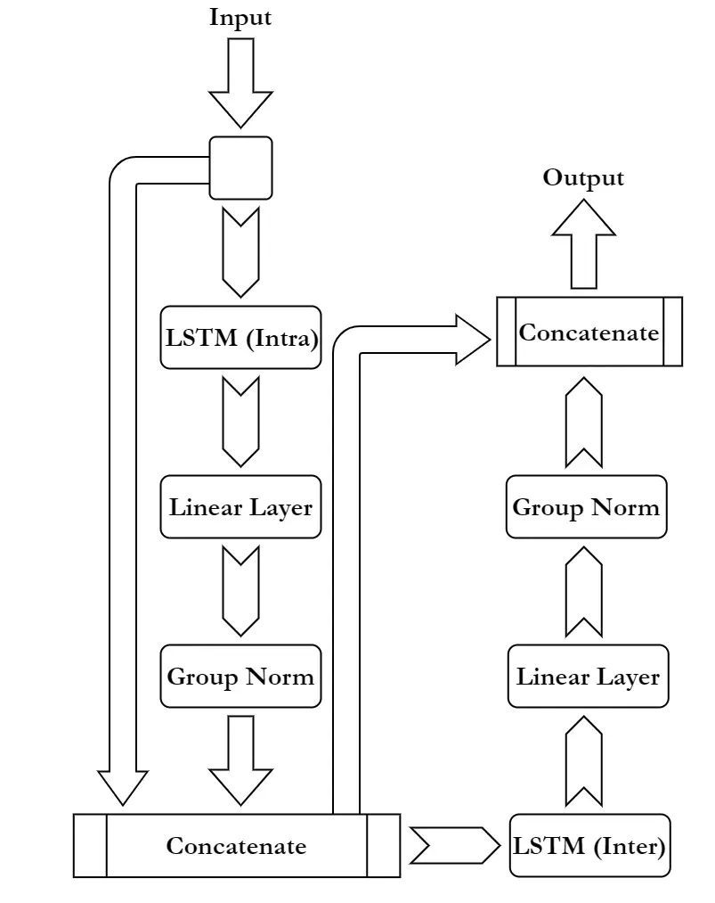

# LSTMSE-Net: Long Short Term Speech Enhancement Network for Audio-visual Speech Enhancement

Arnav Jain^(∗)    Jasmer Singh Sanjotra^(∗)    Harshvardhan Choudhary   
Krish Agrawal    Rupal Shah    Rohan Jha    M. Sajid    Amir Hussain   
M. Tanveer

###### Abstract

In this paper, we propose long short term memory speech enhancement
network (LSTMSE-Net), an audio-visual speech enhancement (AVSE) method.
This innovative method leverages the complementary nature of visual and
audio information to boost the quality of speech signals. Visual
features are extracted with VisualFeatNet (VFN), and audio features are
processed through an encoder and decoder. The system scales and
concatenates visual and audio features, then processes them through a
separator network for optimized speech enhancement. The architecture
highlights advancements in leveraging multi-modal data and interpolation
techniques for robust AVSE challenge systems. The performance of
LSTMSE-Net surpasses that of the baseline model from the COG-MHEAR AVSE
Challenge 2024 by a margin of 0.06 in scale-invariant
signal-to-distortion ratio (SISDR), $`0.03`$ in short-time objective
intelligibility (STOI), and $`1.32`$ in perceptual evaluation of speech
quality (PESQ). The source code of the proposed LSTMSE-Net is available
at
[https://github.com/mtanveer1/AVSEC-3-Challenge](https://github.com/mtanveer1/AVSEC-3-Challenge).

###### keywords

Audio-visual speech enhancement, Speech recognition, Human-computer
interaction, Computational paralinguistics, LRS3 dataset

^(†)^(†)address: ¹Indian Institute of Technology Indore, Simrol, Indore,
453552, India  
²School of Computing, Edinburgh Napier University, EH11 4BN, Edinburgh,
United Kingdom^(†)^(†)email: A.Hussain@napier.ac.uk,
mtanveer@iiti.ac.in¹¹footnotetext: These authors contributed equally to
this work.

## 1 Introduction

Speech is key to how humans interact. Speech clarity and quality are
critical for domains like video conferencing, telecommunications, voice
assistants, hearing aids, etc. However, maintaining high-quality speech
in adverse acoustic conditions—such as environments with background
noise, reverberation, or poor audio quality—remains a significant
challenge. Speech enhancement (SE) has become a pivotal area of study
and development to solve these problems and enhance speech quality and
intelligibility \[1\]. Deep learning approaches have been the driving
force behind recent advances in SE. While deep learning-based SE
techniques \[2, 3\] have shown exceptional success by focusing mainly on
audio signals, it is crucial to understand that adding visual
information can greatly improve SE systems’ performance in adverse sound
conditions. \[4, 5, 6\]. For comprehensive insights into speech signal
processing tasks using ensemble deep learning methods, readers are
referred to \[7\].

Time-frequency (TF) domain methods and time-domain methods are two
general categories into which audio-only SE methods can be divided,
depending on the type of input. Classical TF domain techniques often
rely on amplitude spectrum features; however, studies shows that their
effectiveness may be constrained if phase information is not taken into
account \[3\]. Some methods that make use of complex-valued features
have been introduced to get around this restriction, including complex
spectral mapping (CSM) \[8\] and complex ratio masking (CRM) \[9\].
Real-valued neural networks are used in the implementation of many CRM
and CSM techniques, whereas neural networks using complex values are
used in other cases to handle complex input. Notable examples of
complex-valued neural networks for SE tasks include deep complex
convolution recurrent network (DCCRN) \[10\] and deep complex U-NET
(DCUNET) \[11\]. In this study, we employ time-domain-based methods as
well as real-valued neural networks to show their effectiveness in SE
tasks.

The primary idea in the wake of audio-visual speech enhancement (AVSE)
is to augment an audio-only SE system with visual input as supplemental
data with the goal of improving SE performance. The advantage of using
visual input to enhance SE system performance has been demonstrated in a
number of earlier research \[4, 12, 13\]. Most preceding AVSE methods
focused on processing audio in the TF domain \[14, 6\], however some
research have explored time domain methods for audio-visual speech
separation tasks \[15\]. Additionally, techniques such as self
supervised learning (SSL) embedding are used to boost AVSE performance.
Richard et al. \[16\] presented the SSL-AVSE technique, which combines
auditory and visual cues. These combined audio-visual features are then
analyzed by a Transformer-based SSL AV-HuBERT model to extract
characteristics, which are then controlled by a BLSTM-based SE model.
However, these models are too large to be scalable or deployable in
real-life scenarios. Therefore, we focused on developing a smaller,
simpler and a scalable model that maintains performance comparable to
these larger models.

In this paper, we propose long short-term memory speech enhancement
network (LSTMSE-Net) that exemplifies a sophisticated approach to
enhancing speech signals through the integration of audio and visual
information. LSTMSE-Net employs a dual-pronged feature extraction
strategy, visual features are extracted using a VisualFeatNet comprising
a $`3`$D convolutional frontend and a ResNet trunk \[17\], while audio
features are processed using an audio encoder and audio decoder. A key
innovation to the system is the fusion of these features to form a
comprehensive representation. Visual features are interpolated using
bi-linear methods to align with temporal dimensions in the audio domain.
This fusion process, combined with advanced processing through a
separator network featuring bi-directional LSTMs \[18, 19\], underscores
the model’s capability to effectively enhance speech quality through
comprehensive multi-modal integration. The study thus explores new
frontiers in AVSE research, aiming to improve intelligibility and
fidelity in challenging audio environments.

The evaluation metrics for the model include perceptual evaluation of
speech quality (PESQ), short-time objective intelligibility (STOI), and
scale-invariant signal-to-distortion ratio (SISDR), with model
parameters totalling around $`5.1M`$which is significantly less than the
baseline model (COG-MHEAR Challenge $`2024`$) which is around $`75M`$
parameters. The initial model weights are randomized, and the average
inference time is approximately $`0.3`$ seconds per video.

In summary, we have developed a strong AVSE model, LSTMSE-Net, by
employing deep learning modules such as neural networks, LSTMs, and
convolutional neural netowrks (CNNs). When trained on the challenge
dataset provided by the COG-MHEAR challenge 2024, our model obtains
higher outcomes across all evaluation metrics despite being
substantially smaller than the baseline model provided by the COG-MHEAR
challenge 2024. Its decreased size also results in a shorter inference
time when compared to the baseline model which takes approximately
$`0.95`$ seconds per video.

## 2 Methodology

### 2.1 Overview

This section delves into the intricacies of the proposed LSTMSE-Net
architecture, which leverages a synergistic fusion of audio and visual
features to enhance speech signals. We discuss and highlight its audio
and visual feature extraction, integration, and noise separation
mechanisms. This is achieved using the following primary components,
which are discussed further - audio encoder, visual feature network
(VFN), noise separator and audio decoder. The overall architecture of
our LSTMSE-Net is depicted in Fig. 1(a).

(a)

(b)

Figure 1: (a) The workflow of the proposed LSTMSE-Net, (b) a single unit
in the Separator block of the proposed LSTMSE-Net.

### 2.2 Audio Encoder

An essential part of the AVSE system, the audio encoder module is in
charge of gathering and evaluating audio features. The conv-1d
architecture used in this module consists of a single convolutional
layer with $`256`$ output channels, a kernel size of $`16`$, and a
stride of $`8`$. Robust audio features can be extracted using this
setup. To add non-linearity, a rectified linear unit (ReLU) activation
function is applied after the convolution step. Afterwards, the
upsampled visual features and the encoded audio information are combined
and passed into the noise separator.

### 2.3 Visual Feature Network

The VFN is a vital component of the AVSE system, tasked with extracting
relevant visual features from input video frames. The VFN architecture
comprises a frontend $`3`$-dimesional ($`3`$D) convolutional layer,
ResNet trunk \[20\] and fully connected layers. The 3D convolution layer
processes the raw video frames, extracting relevant anatomical and
visual features. The ResNet trunk comprises a series of residual blocks
designed to capture spatial and temporal features from the video input.
The extracted features’ dimensionality is then reduced to $`256`$ by
adding a Fully Connected Layer, which simultaneously improves
computational complexity and gets the visual features ready for
integration with the audio features.

Bi-linear interpolation is used to upsample the encoded visual
characteristics so they match the encoded audio features’ temporal
dimension. This is done to ensure proper synchronization of features
from both modalities. Further, these are concatenated, as mentioned
above, with the audio features to form a joint audio-visual feature
representation. This is then passed through the separator to extract the
relevant part of the audio signal.

### 2.4 Feature Extractor and Noise Separator

#### 2.4.1 Overview and Motivation

The Separator module is a crucial component of the LSTMSE-Net, tasked
with effectively integrating and processing the combined audio and
visual features to isolate and enhance the speech signal. This module
leverages Long Short Term Memory (LSTM) networks to capture temporal
dependencies and relationships between the audio and visual inputs. The
use of LSTM in the AVSE system is further motivated by the following
reasons.

Sequential data: Audio and visual features are sequential in nature,
with each frame or time step building upon the previous one. LSTM is
well-suited to handle such sequential data. Speech signals exhibit
long-term dependencies, with phonetic and contextual information
spanning multiple time steps. LSTM’s ability to learn long-term
dependencies enables it to capture these relationships effectively.

Contextual information: LSTM’s internal memory mechanism allows it to
retain contextual information, enabling the system to make informed
decisions about speech enhancement.

#### 2.4.2 Core functionality and Multimodal ability

The functionality of the Separator block is based on a multi-modal
fusion design. Through the integration of audio and visual inputs, the
Separator Block optimizes speech enhancement by utilizing complimentary
information from both modalities. The VFN records visual cues including
lip movements, which offer important context for differentiating speech
from background noise. The ability to identify the portion of audio that
the speaker is saying is made easier by the temporal alignment of the
visual and aural elements.

The separator block is made up of several separate units, each of which
makes use of intra- and inter-LSTM layers, linear layers, and group
normalization. We now elaborate on the information flow in a single
unit. Group normalization layers are used to normalize the combined
features following the first feature extraction and concatenation. These
normalization steps stabilize the learning process and provide
consistent feature scaling, guaranteeing that auditory and visual input
are initially given equal priority. The model can recognize complex
correlations and patterns between the auditory and visual inputs due to
the intra- and inter-LSTM layers. The inter-LSTM layers are intended for
a global context, whilst the intra-LSTM layers concentrate on local
feature extraction. Through residual connections, the original inputs
are brought back to the output of these LSTM layers, aiding in the
gradient flow during training and helping to preserve relevant features.
More reliable speech enhancement results from the Separator Block’s
ability to learn the additive and interactive impacts of the
audio-visual elements because of this residual design. Fig. 1(b) shows a
single unit of the Separator block.

As highlighted above the proposed AVSE system employs a multi-modal
fusion strategy, combining the strengths of both audio and visual
modalities. The final output of the separator module is the mask, which
contains only the relevant part of the original input audio features and
removes all the background noise. The original input audio features are
then multiplied by this mask in order to extract those that are relevant
and suppress the ones that are not needed. This generates a clean and
processed audio feature map.

### 2.5 Audio Decoder

The audio decoder, which is built upon the ConvTranspose1d \[21\]
architecture, consists of a single transposed convolution layer with a
kernel size of $`16`$, stride of $`8`$, and a single output channel.
This design facilitates the transformation of the encoded audio feature
map back into an enhanced audio signal. It is given the enhanced feature
map as the input, and returns the enhanced audio signal, which is also
the final model output.

## 3 Experiments

In this section, we begin with a detailed description of the dataset.
Next, we outline the experimental setup and the evaluation metrics used.
Finally, we present and discuss the experimental results.

### 3.1 Dataset Description

The data used for training, testing and validation consists of films
extracted from the LRS3 dataset \[22\]. It contains $`34524`$ scenes (a
total of $`113`$ hours and $`17`$ minutes) from $`605`$ speakers
appointed for TED and TEDx talks. For the noise, speech interferers were
selected from a pool of 405 contestant speakers and $`7346`$ noise
recordings across 15 different divisions.

The videos contained in the test set differ from those used in the
training and validation datasets. The train set contains around $`5090`$
videos or $`51`$k unique words in vocabulary, whilst the validation and
test sets have $`4004`$ films or $`17`$k words in its vocabulary and
$`412`$ videos, respectively.

The dataset has two types of interferers: speech of competing speakers,
which are taken from the LRS3 dataset (competing speakers and target
speakers does not have any overlap) and noise, which is derived from
various datasets such as CEC1 \[23\], which consists around $`7`$ hours
of noise, the DEMAND \[24\], noise dataset includes multi-channel
recordings of $`18`$ soundscapes lasting more than $`1`$ hour, MedleyDB
dataset \[25\] comprises $`122`$ songs that are royalty-free.
Additionally, Deep Noise Supression challenge (DNS) dataset \[26\],
which was released in the previous version of the challenge, features
sounds present in AudioSet, Freesound and DEMAND, and Environmental
sound classification (ESC-50) dataset \[27\] which comprises 50 noise
groups that fall into five categories: sounds of animals, landscapes and
water, human non-verbal sounds, noises from the outside and within the
home, and noises from cities. Additionally, data preparation scripts are
given to us. The output of these scripts consists of the following:
S$`00001`$\_target.wav (target audio), S$`00001`$\_silent.mp$`4`$ (video
without audio), S$`00001`$\_interferer.wav (interferer audio), and
S$`00001`$\_interferer.wav (the audio interferer).

### 3.2 Experimental Setup

We set up our training environment to get the best possible performance
and use of the available resources. A rigorous training method that
lasted $`48`$ epochs and $`211435`$ steps was applied to the model. By
utilising GPU acceleration, each epoch took about twenty-two minutes to
finish. This effective training length demonstrates how quickly and
efficiently the model can handle big datasets.

With $`146`$ GB of shared RAM, a single NVIDIA RTX A4500 GPU is used for
all training and inference tasks. Our LSTMSE-Net model is effectively
trained because of it’s sturdy training configuration, which also
guaranteed that the model could withstand the high computational demands
necessary for high-quality audio-visual speech enhancement.

### 3.3 Evaluation Metrics

The LSTMSE-Net model was subjected to a thorough evaluation using
multiple standard metrics, including scale-invariant
signal-to-distortion ratio (SISDR), short-time objective intelligibility
(STOI), and perceptual evaluation of speech quality (PESQ). A
comprehensive and multifaceted evaluation is ensured by the distinct
insights that each of these measures offers into various aspects of the
quality of voice enhancement.

#### 3.3.1 PESQ

A standardised metric called PESQ compares the enhanced speech signal to
a clean reference signal in order to evaluate the quality of the speech.
With values ranging between $`-0.5`$ to $`4.5`$, larger scores denote
better perceptual quality.

#### 3.3.2 STOI

STOI (short-time objective intelligibility) is a metric used to assess
how clear and understandable speech is, particularly in environments
with background noise. It measures the similarity between the clean and
improved speech signals’ temporal envelopes, producing a score between
$`0`$ and $`1`$. Improved comprehensibility is correlated with higher
scores.

#### 3.3.3 SISDR

By calculating the amount of distortion brought about by the enhancement
process, SISDR is a commonly used metric to assess the quality of speech
enhancement. Higher SISDR values are indicative of less distortion and
improved speech signal quality, making them a crucial indicator for
assessing how well our model performs in maintaining the original speech
features.

We guarantee a thorough and comprehensive examination of the LSTMSE-Net
model by utilising these three complimentary assessment metrics. STOI
gauges intelligibility, PESQ assesses perceptual quality, and SISDR
concentrates on distortion and fidelity. When taken as a whole, these
measurements offer a thorough insight of the model’s performance,
showcasing its advantages and pinpointing areas that might use
improvement. Our dedication to creating a high-performance speech
enhancement system that excels in a number of crucial areas of audio
quality is demonstrated by this multifaceted evaluation technique.

### 3.4 Evaluation Results

Three types of speeches were included in our evaluation. First, we used
the noisy speech provided in the challenge testing dataset, which also
served as the audio requiring further enhancement using various AVSE
models. Second, we generate the improved speech by applying our
LSTMSE-Net model to enhance the noisy speech. Finally, we produce the
improved speech using the COG-MHEAR AVSE Challenge 2024 baseline model
to enhance the same noisy speech. We evaluated them using the PESQ,
STOI, and SISDR, which are the standard evaluation metrics. The table 1
displays the final scores of the models on the evaluation metrics.
Compared to noisy speech, the AVSE baseline model produced notably
better quality (PESQ) and higher intelligibility (STOI). Furthermore, in
PESQ, STOI, and SISDR, LSTMSE-Net outperformed the baseline model by a
margin of $`0.06`$, $`0.03`$, and $`1.32`$, respectively. All evaluation
criteria showed that LSMTSE-Net performed better than the baseline as
well as the noisy speech, which is strong proof of the efficacy of our
model.

The table 2 displays the final inference time of the models on the
testing dataset. Compared to the baseline model, which takes an average
of $`0.95`$ secs per video to enhance the audio, LSTMSE-Net only takes
$`0.3`$ seconds per video on average to enhance the audio in them. This
significant reduction in processing time underscores the efficiency of
LSTMSE-Net.

|                                                                 |                       |                       |                       |
| --------------------------------------------------------------- | --------------------- | --------------------- | --------------------- |
| Audio                                                           | PESQ                  | STOI                  | SISDR                 |
| Noisy Speech                                                    | 1.467288              | 0.610359              | -5.494292             |
| Baseline                                                        | 1.492356              | 0.616006              | -1.204192             |
| LSTMSE-Net (Ours)                                               | $`\mathbf{1.547272}`$ | $`\mathbf{0.647083}`$ | $`\mathbf{0.124061}`$ |
| The boldface in each column denotes the performance of the best |                       |                       |                       |
| model corresponding to each metric.                             |                       |                       |                       |

Table 1: Comparison of noisy speech, the baseline speech, and LSTMSE-Net
(ours) based on PESQ, STOI, and SISDR metrics.

| Model             | Average inference time per video |
| ----------------- | -------------------------------- |
| Baseline          | $`{0.95}`$ seconds               |
| LSTMSE-Net (Ours) | $`\mathbf{0.3}`$ seconds         |

Table 2: Comparison between the inference time of the baseline and
LSTMSE-Net (ours).

The superior efficiency and efficacy of the proposed LSTMSE-Net not only
reduces the computational load but also enables real-time processing,
making it highly suitable for applications requiring low latency.
Moreover, the smaller model size enhances scalability, allowing the
deployment of LSTMSE-Net on a wider range of devices, including those
with limited computational resources. This makes the proposed model an
excellent choice for both high-performance systems and
resource-constrained environments, demonstrating its versatility and
practical applicability.

## 4 Conclusion and Future Work

This research presents LSTMSE-Net, an advanced AVSE architecture that
improves speech quality by fusing audio signals with visual information
from lip movements. The LSTMSE-Net architecture consists of an audio
decoder, a visual encoder, a separator, and an audio encoder. Each of
these components is essential to the processing and refinement of the
input signals in order to generate enhanced speech that is high-quality.
AVSE-Net exhibits the capacity to efficiently capture and leverage both
local and global audio-visual interdependence. With the use of advanced
deep learning methods like convolutions and long short term memory
networks, LSTMSE-Net improves voice enhancement significantly.

Experimental studies on the benchmark dataset, i.e., COG-MHEAR LRS3
dataset, confirm LSTMSE-Net’s superior performance. LSTMSE-Net performs
much better than baseline models on the COG-MHEAR LRS3 dataset,
demonstrating its effectiveness in combining visual and aural
characteristics for improved speech quality. To sum up, LSTMSE-Net is a
major breakthrough in audio-visual speech improvement, utilising the
complementary qualities of both auditory and visual input to provide
better voice quality. This work establishes a new benchmark in the field
by offering a scalable and efficient solution for speech improvement.

For our future work, we have the following plans:

- •
  We aim to extend our model to incorporate causality in its
  architecture, enabling real-time deployment. This enhancement will
  ensure that the model relies solely on past and current information
  for predictions.
- •
  We plan to propose an enhanced version of LSTMSE-Net that incorporates
  attention mechanisms and advanced feature fusion techniques to further
  refine the integration of visual and audio features. Our goal is to
  achieve superior performance across various AVSE benchmarks.
- •
  Additionally, we will conduct a comprehensive comparative analysis of
  LSTMSE-Net and other state-of-the-art AVSE variants. This analysis
  will focus on their performance in real-world noisy environments to
  identify strengths and areas for improvement.

## 5 Acknowledgement

The authors are grateful to the anonymous reviewers for their invaluable
comments and suggestions. This project is supported by the Indian
government’s Science and Engineering Research Board (SERB) through the
Mathematical Research Impact-Centric Support (MATRICS) scheme under
grant MTR/2021/000787. Prof Hussain acknowledges the support of the UK
Engineering and Physical Sciences Research Council (EPSRC) Grants Ref.
EP/T021063/1 (COG-MHEAR) and EP/T024917/1 (NATGEN). The work of M. Sajid
is supported by the Council of Scientific and Industrial Research
(CSIR), New Delhi for providing fellowship under the under Grant
09/1022(13847)/2022-EMR-I.

## References

- \[1\] P. C. Loizou, _Speech Enhancement: Theory and Practice_. CRC
  press, 2007.
- \[2\] X. Lu, Y. Tsao, S. Matsuda, and C. Hori, “Speech enhancement
  based on deep denoising autoencoder.” in _Interspeech_, vol. 2013,
  2013, pp. 436–440.
- \[3\] P.-S. Huang, M. Kim, M. Hasegawa-Johnson, and P. Smaragdis,
  “Deep learning for monaural speech separation,” in _2014 IEEE
  International Conference on Acoustics, Speech and Signal Processing
  (ICASSP)_. IEEE, 2014, pp. 1562–1566.
- \[4\] J.-C. Hou, S.-S. Wang, Y.-H. Lai, Y. Tsao, H.-W. Chang, and
  H.-M. Wang, “Audio-visual speech enhancement using multimodal deep
  convolutional neural networks,” _IEEE Transactions on Emerging Topics
  in Computational Intelligence_, vol. 2, no. 2, pp. 117–128, 2018.
- \[5\] B. Xu, C. Lu, Y. Guo, and J. Wang, “Discriminative
  multi-modality speech recognition,” in _Proceedings of the IEEE/CVF
  conference on Computer Vision and Pattern Recognition_, June 2020, pp.
  14 433–14 442.
- \[6\] D. Michelsanti, Z.-H. Tan, S.-X. Zhang, Y. Xu, M. Yu, D. Yu, and
  J. Jensen, “An overview of deep-learning-based audio-visual speech
  enhancement and separation,” _IEEE/ACM Transactions on Audio, Speech,
  and Language Processing_, vol. 29, p. 1368–1396, 2021.
- \[7\] M. Tanveer, A. Rastogi, V. Paliwal, M. Ganaie, A. K. Malik,
  J. Del Ser, and C.-T. Lin, “Ensemble deep learning in speech signal
  tasks: a review,” _Neurocomputing_, vol. 550, p. 126436, 2023.
- \[8\] K. Tan and D. Wang, “Complex spectral mapping with a
  convolutional recurrent network for monaural speech enhancement,” in
  _ICASSP 2019 - 2019 IEEE International Conference on Acoustics, Speech
  and Signal Processing (ICASSP)_, 2019, pp. 6865–6869.
- \[9\] D. S. Williamson and D. Wang, “Time-frequency masking in the
  complex domain for speech dereverberation and denoising,” _IEEE/ACM
  Transactions on Audio, Speech, and Language Processing_, vol. 25,
  no. 7, pp. 1492–1501, 2017.
- \[10\] Y. Hu, Y. Liu, S. Lv, M. Xing, S. Zhang, Y. Fu, J. Wu,
  B. Zhang, and L. Xie, “DCCRN: Deep complex convolution recurrent
  network for phase-aware speech enhancement,” in _Proceedings of the
  Annual Conference of the International Speech Communication
  Association, INTERSPEECH, 2020_, August 2020, pp. 2472–2476.
- \[11\] H.-S. Choi, J. Kim, J. Huh, A. Kim, J.-W. Ha, and K. Lee,
  “Phase-aware speech enhancement with deep complex U-Net,” in
  _ICLR_, 2019. \[Online\]. Available:
  [https://openreview.net/forum?id=SkeRTsAcYm](https://openreview.net/forum?id=SkeRTsAcYm)
- \[12\] T. Afouras, J. S. Chung, and A. Zisserman, “The conversation:
  Deep audio-visual speech enhancement,” in _Proceedings of the Annual
  Conference of the International Speech Communication Association,
  INTERSPEECH_, vol. 2018, 2018, pp. 3244–3248.
- \[13\] S.-Y. Chuang, H.-M. Wang, and Y. Tsao, “Improved lite
  audio-visual speech enhancement,” _IEEE/ACM Transactions on Audio,
  Speech, and Language Processing_, vol. 30, pp. 1345–1359, 2022.
- \[14\] I.-C. Chern, K.-H. Hung, Y.-T. Chen, T. Hussain, M. Gogate,
  A. Hussain, Y. Tsao, and J.-C. Hou, “Audio-visual speech enhancement
  and separation by utilizing multi-modal self-supervised embeddings,”
  in _2023 IEEE International Conference on Acoustics, Speech, and
  Signal Processing Workshops (ICASSPW)_, 2023, pp. 1–5.
- \[15\] Y. Wu, C. Li, J. Bai, Z. Wu, and Y. Qian, “Time-domain
  audio-visual speech separation on low quality videos,” in _ICASSP
  2022 - 2022 IEEE International Conference on Acoustics, Speech and
  Signal Processing (ICASSP)_, 2022, pp. 256–260.
- \[16\] R. L. Lai, J.-C. Hou, M. Gogate, K. Dashtipour, A. Hussain, and
  Y. Tsao, “Audio-visual speech enhancement using self-supervised
  learning to improve speech intelligibility in cochlear implant
  simulations,” _arXiv preprint arXiv:2307.07748_, 2023.
- \[17\] H. Wang, K. Li, and C. Xu, “\[retracted\] a new generation of
  resnet model based on artificial intelligence and few data driven and
  its construction in image recognition model,” _Computational
  Intelligence and Neuroscience_, vol. 2022, no. 1, p. 5976155, 2022.
- \[18\] S. Hochreiter and J. Schmidhuber, “Long short-term memory,”
  _Neural Computation_, vol. 9, no. 8, pp. 1735–1780, 1997.
- \[19\] A. Graves and J. Schmidhuber, “Framewise phoneme classification
  with bidirectional LSTM networks,” in _Proceedings. 2005 IEEE
  International Joint Conference on Neural Networks, 2005._,
  vol. 4. IEEE, 2005, pp. 2047–2052.
- \[20\] K. He, X. Zhang, S. Ren, and J. Sun, “Deep residual learning
  for image recognition,” in _Proceedings of the IEEE Conference on
  Computer Vision and Pattern Recognition_, June 2016, pp. 770–778.
- \[21\] J. Shipton, J. Fowler, C. Chalmers, S. Davis, S. Gooch, and
  G. Coccia, “Implementing wavenet using Intel® Stratix® 10 NX FPGA for
  real-time speech synthesis,” pp. 1–8, 2021.
- \[22\] T. Afouras, J. S. Chung, and A. Zisserman, “LRS3-TED: A
  large-scale dataset for visual speech recognition,” _arXiv preprint
  arXiv:1809.00496_, 2018.
- \[23\] S. Graetzer, J. Barker, T. J. Cox, M. Akeroyd, J. F. Culling,
  G. Naylor, E. Porter, and R. Viveros Munoz, “Clarity-2021 challenges:
  Machine learning challenges for advancing hearing aid processing,” in
  _Proceedings of the Annual Conference of the International Speech
  Communication Association, INTERSPEECH_, vol. 2, 2021, pp. 686–690.
- \[24\] J. Thiemann, N. Ito, and E. Vincent, “The diverse environments
  multi-channel acoustic noise database (demand): A database of
  multichannel environmental noise recordings,” in _Proceedings of
  Meetings on Acoustics_, vol. 19, no. 1. AIP Publishing,
  2013, p. 035081.
- \[25\] R. M. Bittner, J. Salamon, M. Tierney, M. Mauch, C. Cannam, and
  J. P. Bello, “MedleyDB: A multitrack dataset for annotation-intensive
  mir research.” in _ISMIR_, vol. 14, 2014, pp. 155–160.
- \[26\] C. K. Reddy, G. Vishak, C. Ross, B. Ebrahim, C. Roger,
  D. Harishchandra, M. Sergiy, A. Robert, A. Ashkan, B. Sebastian,
  R. Puneet, S. Sriram, and G. Johannes, “The interspeech 2020 deep
  noise suppression challenge: Datasets, subjective testing framework,
  and challenge results,” _Interspeech 2020_, 10 2020. \[Online\].
  Available:
  [https://cir.nii.ac.jp/crid/1360016869793872128](https://cir.nii.ac.jp/crid/1360016869793872128)
- \[27\] K. J. Piczak, “ESC: Dataset for environmental sound
  classification,” ser. MM ’15. New York, NY, USA: Association for
  Computing Machinery, 2015, p. 1015–1018. \[Online\]. Available:
  [https://doi.org/10.1145/2733373.2806390](https://doi.org/10.1145/2733373.2806390)
