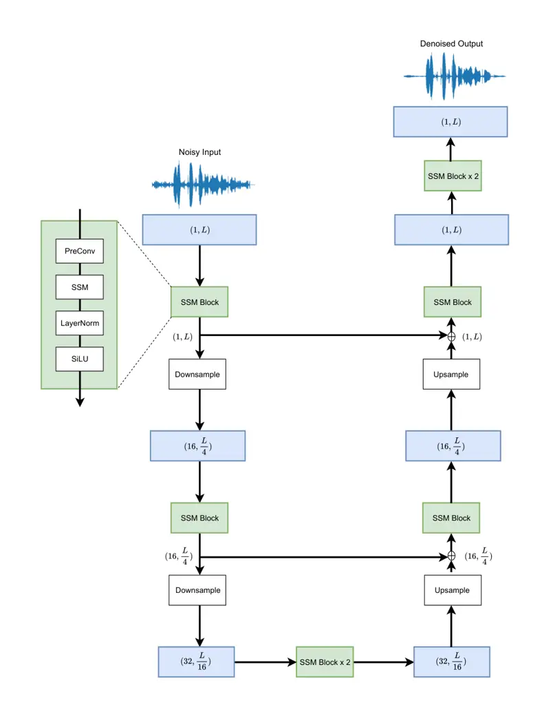
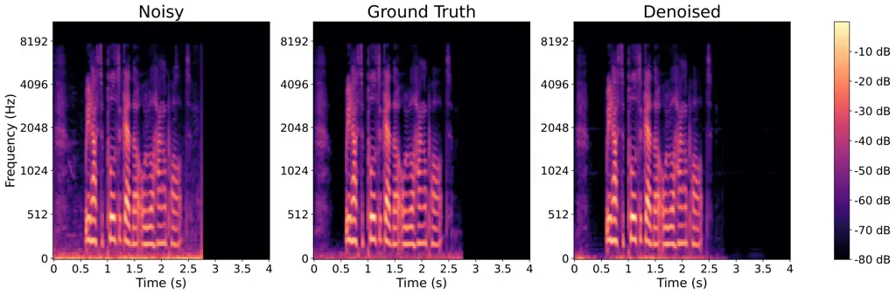

Pei Shrivastava Sidharth BrainChipUSA

# aTENNuate: Optimized Real-time Speech Enhancement with Deep SSMs on Raw Audio

Yan Ru    Ritik    FNU Affiliation: 

###### Abstract

We present aTENNuate, a simple deep state-space autoencoder configured
for efficient online raw speech enhancement in an end-to-end fashion.
The network’s performance is primarily evaluated on raw speech
denoising, with additional assessments on tasks such as super-resolution
and de-quantization. We benchmark aTENNuate on the VoiceBank + DEMAND
and the Microsoft DNS1 synthetic test sets. The network outperforms
previous real-time denoising models in terms of PESQ score, parameter
count, MACs, and latency. Even as a raw waveform processing model, the
model maintains high fidelity to the clean signal with minimal audible
artifacts. In addition, the model remains performant even when the noisy
input is compressed down to 4000Hz and 4 bits, suggesting general speech
enhancement capabilities in low-resource environments.

###### keywords

state-space models, autoencoder, denoising, super-resolution,
de-quantization

^(†)^(†)email: yanrpei@gmail.com, rshrivastava@brainchip.com,
sidharth@brainchip.com

## 1 Introduction

Speech enhancement (SE) is crucial for improving both human-to-human
communication, such as in hearing aids, and human-to-machine
communication, as seen in automatic speech recognition (ASR) systems. A
challenging task of SE is removing background noises from speech
signals, where the complexity of speech and noise patterns poses
challenges \[1\]. Traditional speech enhancement methods such as Wiener
filtering \[2\], spectral subtraction \[3\], and principal component
analysis \[4\] have shown satisfactory performance in stationary noise
environments, but their effectiveness is often limited in non-stationary
noise scenarios, resulting in artifacts and substantial degradation in
the intelligibility of the enhanced speech \[5\].

Deep learning audio denoising methods are trained on large datasets of
clean and noisy audio pairs, and attempt to capture the nonlinear
relationship between the noisy and clean signal features without prior
knowledge of the noise statistics, as required by traditional denoising
methods \[6\]. Speech features can be extracted from real or complex
spectrograms of the noisy signal in the time-frequency domain, or
directly from raw waveforms \[7\].

Many state-of-the-art deep learning denoising models leverage the
feature extraction capability of convolutional networks. The UNet
convolutional encoder-decoder is a common network architecture in
denoising models \[8, 9, 10\] exemplified by Deep Complex UNet \[11\]
and the generative adversarial SEGAN \[12\]. However, CNNs lack the
capabilities to model long-range temporal dependencies present in speech
signals, without incurring significant memory resources \[13\]. Another
class of models that are more capable in this regard are RNNs, examples
of which are DCCRN \[14\] and FRCRN \[15\]. However, these models
typically show limited robustness to different types of noise and
generalization across diverse audio sources \[16\]. Moreover, their
non-linear recurrent nature prevents efficient usage of parallel
hardware (e.g. GPUs) for training, which limits their potential for
scaling.

Alternative approaches such as PercepNet \[17\] and RNNoise \[18\] have
attempted to reduce network size and complexity by combining traditional
speech enhancement methods with deep learning, resulting in smaller
models with fewer parameters capable of running in real-time on
general-purpose hardware. Most notably, DeepFilterNet \[19\] has
leveraged speech-specific properties such as short-time speech
correlations to achieve comparable results. On the contrary, methods
that process raw waveform signals aim to maximize the expressive
capabilities of deep networks without resorting to hand-engineered
spectral conversions, as demonstrated by Facebook’s DEMUCS model’s
real-time performance \[20\]. However, the majority of these models
cannot perform real-time inference on general-purpose hardware,
exemplified by Nvidia’s CleanUNet model \[21\].

Here, we introduce the aTENNuate network, belonging to the class of
Temporal Neural Networks \[22, 23, 24\], or TENNs. It is a deep
state-space model (SSM) \[25, 26\] optimized for real-time denoising of
raw speech waveforms on the edge. By virtue of being an SSM, the model
is capable of capturing long-range temporal relationships present in
speech signals, with stable linear recurrent units. Learning long-range
correlations can be useful for capturing global speech patterns or noise
profiles, and perhaps implicitly capture semantic contexts to aid speech
enhancement performance \[27\]. During the training of the aTENNuate
network, we can use the infinite impulse response (IIR) kernels of the
SSM layers as long convolutional kernels over the input features, which
can be parallelized using techniques such as FFT convolution \[28\] or
associative scan \[29\]. During inference, the temporal convolution
layers can be converted into equivalent recurrent layers for efficient
real-time processing on mobile devices, minimizing latency and reducing
the need for excessive buffering of data. The evaluation code is
[available on PyPI](https://pypi.org/project/attenuate/), installable
with pip install attenuate.

## 2 Deep State-space Modeling

In this section, we briefly describe what state-space models (SSMs) are,
and recall how they can be configured for neural network processing,
involving discretization and diagonalization. SSMs are general
representations of linear time-invariant (LTI) systems, and they can be
uniquely specified by four matrices: $`A\in\mathbb{R}^{h\times h}`$,
$`B\in\mathbb{R}^{h\times n}`$, $`C\in\mathbb{R}^{m\times h}`$, and
$`D\in\mathbb{R}^{m\times n}`$. The first-order ODE describing the LTI
system is given as

```math
\dot{x}=Ax+Bu,\qquad y=Cx+Du, \tag{1}
```

where $`u\in\mathbb{R}^{n}`$ is the input signal, $`x\in\mathbb{R}^{h}`$
is the internal state, and $`y\in\mathbb{R}^{m}`$ is the output. Here,
we are letting $`n>1,\,m>1`$, which yields a multiple-input,
multiple-output (MIMO) SSM. For the remainder of this paper, we will
ignore the $`Du`$ term as it effectively serves as a skip connection
\[28\], which is already included explicitly in our network (see
Fig. 1).

The SSM in its original form describes a continuous-time system, but in
the field of digital signal processing, there are standard recipes for
discretizing such a system into a discrete-time SSM. One such method
that we use in this work is the zero-order hold (ZOH), which gives us
the discrete-time state-space matrices $`\overline{A}`$ and
$`\overline{B}`$ as follows:

```math
\overline{A}=\exp(\Delta A),\qquad\overline{B}=(\Delta A)^{-1}\cdot(\exp(\Delta A)-1)\cdot\Delta B. \tag{2}
```

The discrete SSM is then given by

```math
x[t+1]=\overline{A}\,x[t]+\overline{B}\,u[t],\qquad y[t]=C\,x[t] \tag{3}
```

In other words, this is essentially a linear RNN layer, which allows for
efficient online inference and generation (in our case real-time speech
enhancement), but at the same time efficient parallelization during
training.

It is straightforward to check that the discrete-time impulse response
is given as

```math
k[\tau]=C\,\overline{A}^{\tau}\,\overline{B}=CK(\tau)\overline{B}, \tag{4}
```

where $`\tau`$ denotes the kernel timestep and $`K`$ represents the
“basis kernels”. During training, $`k`$ can then be considered the
“full” long 1D convolutional kernel with shape, in the sense that the
output $`y`$ can be computed via the long convolution
$`y_{j}=\sum_{i}u_{i}\ast k_{ij}`$. By the convolution theorem, we can
perform this operation in the frequency domain, which becomes a
point-wise product $`\hat{y}_{jf}=\sum_{i}\hat{u}_{i}\hat{k}_{ijf}`$.
The hat symbol denotes the Fourier transform of the signal (with the
index $`f`$ denoting the Fourier modes), which can be efficiently
computed via Fast Fourier Transforms (FFTs).

It is a generic property that a diagonal form exists for the SSM,
meaning that we can almost always assume $`\overline{A}`$ to be diagonal
\[28\], at the expense of potentially requiring $`\overline{B}`$ and
$`C`$ to be complex matrices. Since the original system is a real
system, the diagonal $`\overline{A}`$ matrix can only contain real
elements and/or complex elements in conjugate pairs. (See Appendix A.)
In this work, we sacrifice a slight loss in expressivity by continuing
to restrict $`\overline{B}`$ and $`C`$ to be real matrices and letting
$`\overline{A}`$ be a diagonal matrix with all complex elements (but not
restricting them to come in conjugate pairs). Since we still want to
work with real features¹¹ 1 This is a prior not required, as technically
we can configure our network as complex-valued to handle complex
features. However, we do not explore this configuration in this work.,
we then only take the real part of the impulse response kernel as such:

```math
k[\tau]=\Re(C\overline{A}^{\tau}\overline{B}), \tag{5}
```

which equivalently in the state-space equation can be achieved by simply
letting $`y[t]=C\,\Re(x[t])`$. This means that during online inference,
we need to maintain the internal states $`x`$ as complex values, but
only need to propagate their real parts to the next layer.

### 2.1 Optimal Contractions

Similar to previous works in deep SSMs, we allow the parameters
$`\{A,B,C,\Delta\}`$ to be directly learnable, which indirectly trains
the kernel $`k`$. Unlike previous works in deep SSMs, we do not try to
keep the sizes $`n`$, $`h`$, $`m`$ homogeneous, to allow for more
flexibility in feature extraction at each layer, mirroring the
flexibility in selecting channel and kernel sizes in convolutional
neural networks²² 2 The size of the internal state $`h`$, can be
interpreted as the degree of parametrization of a basis temporal kernel,
or some implicit (dilated) “kernel size” in the frequency domain. We
explore this in a future work.. The flexibility of the tensor shapes
requires us to carefully choose the optimal order of operations during
training to minimize the computational load. This is also briefly
discussed in Appendix C.

In short, in einsum notation, our SSM operations can be written as
$`\hat{y}_{jf}=\hat{u}_{if}B_{in}\hat{K}_{nf}C_{jn}`$, a series of
tensor contractions (matrix multiplications). Based on the tensor shapes
involved, we can select an order of operation that is memory- and
compute-optimal \[24, 23\]. In addition, this allows us to freely
configure the network as an hourglass network (with the SSM layers in
the network having different channel and temporal dimensions), without
enforcing the SISO form \[26, 30, 31\]. This makes our network uniquely
capable of handling raw audio waveforms, while retaining strong featural
interactions and light computational costs. See supplementary material
or our sister work Centaurus \[24\] for details on optimal tensor
contractions.



Figure 1: A schematic drawing of the network architecture, with only 2
encoder and decoder blocks shown for simplicity. The actual model has 6
encoder and decoder blocks. Note that there is no (spectral) processing
on the input and output waveforms.

## 3 Network Architecture

We use an hourglass network with long-range skip connections, similar in
form to the Sashimi network \[26\] for audio generation. However, unlike
previous works using SSMs for audio processing \[26, 30, 31, 32, 33\],
our network directly takes in raw audio waveforms in the -1 to +1 range
and outputs raw waveforms as well, with no one-hot encoding or spectral
processing (e.g. STFT or iSTFT). Furthermore, we retain causality as
much as possible for the sake of real-time inference, meaning that we
eschew any form of bidirectional state-space layers. See Fig. 1 for a
schematic drawing.

As with typical autoencoder networks, the audio features are
down-sampled in the encoder and then up-sampled in the decoder. For the
re-sampling operation, we use a simple operation that squeezes/expands
the temporal dimension then projects the channel dimension \[26\]. More
formally, for a reshaping ratio of $`r`$, a sequence of features can be
down-sampled and up-sampled as:

```math
\begin{split}\text{Down:}&\,\,(C_{in},L)\xrightarrow{\text{reshape}}(C_{in}r,L/r)\xrightarrow{\text{project}}(C_{out},L/r)\\
\text{Up:}&\,\,(C_{in},L)\xrightarrow{\text{reshape}}(C_{in}/r,Lr)\xrightarrow{\text{project}}(C_{out},Lr)\end{split} \tag{6}
```

The baseline network uses LayerNorm layers and SiLU activations. In
addition, we include a ‘‘PreConv” layer which is a depthwise 1D
convolution layer with a kernel size of 3, to enable better processing
of local temporal features. The PreConv operation is omitted in the 2
SSM blocks in the neck and in any block with only one channel³³ 3 The
neck operates on fully-downsampled features, and introducing PreConv
layers will incur too much latency in real-time processing. We also omit
PreConv layer in single-channel blocks, because it is too lossy.. See
Appendix C for details on the computation of the theoretical latency for
a given set of resampling factors and PreConv configurations. Using
causal convolutions for PreConvs can eliminate additional latencies to
the network \[22\], but we do not explore this implementation here. To
better support mobile devices, we also test variants of the network with
BatchNorm layers⁴⁴ 4 Since BatchNorm is a static form of normalization
during inference, the normalization statistics and the affine parameters
can be “folded” into the weights and biases of the previous layer,
meaning that the layer does not need to be materialized during
inference., ReLU activations, and omitting PreConv layers in the decoder
(and omitting PreConv layers altogether). The results are reported in
the next section. The block-wise network architecture is given in
Table 1, along with the PreConv latency, if present.

|            |                 |          |         |
| ---------- | --------------- | -------- | ------- |
| Layers     | Resample Factor | Channels | Latency |
| Encoder    |                 |          |         |
|    Block 1 | 4               | 16       |         |
|    Block 2 | 4               | 32       | 0.25ms  |
|    Block 3 | 2               | 64       | 1ms     |
|    Block 4 | 2               | 96       | 2ms     |
|    Block 5 | 2               | 128      | 4ms     |
|    Block 6 | 2               | 256      | 8ms     |
| Neck       |                 |          |         |
|    Block 1 | 1               | 256      |         |
|    Block 2 | 1               | 256      |         |
| Decoder    |                 |          |         |
|    Block 1 | 2               | 128      | 8ms     |
|    Block 2 | 2               | 96       | 4ms     |
|    Block 3 | 2               | 64       | 2ms     |
|    Block 4 | 2               | 32       | 1ms     |
|    Block 5 | 4               | 16       | 0.25ms  |
|    Block 6 | 4               | 1        |         |
| Output     |                 |          |         |
|    Block 1 | 1               | 1        |         |
|    Block 2 | 1               | 1        |         |

Table 1: Resampling factor and output channel of each block of the
network, which consists of an encoder performing down-samplings, an
intermediate bottleneck, a decoder performing up-samplings, and finally
an output processor.

## 4 Experiments

| Model                        | PESQ (VB-DMD) | PESQ (DNS1 no-reverb) | Parameters | MACs / sec | Latency |
| ---------------------------- | ------------- | --------------------- | ---------- | ---------- | ------- |
| FRCRN \[15\]                 | 3.21          | 3.23                  | 6.9M       | 38.1G      | 30ms    |
| DeepFilterNet3 \[19\]        | 3.16          | 2.58                  | 2.13M      | 0.344G     | 40ms    |
| DEMUCS \[20\]                | 2.56          | 2.65                  | 33.53M^(a) | 7.72G^(a)  | 40ms    |
| PercepNet \[17\]             | 2.73^(b)      | \-                    | 8.00M      | 0.80G      | 40ms    |
| aTENNuate (base)             | 3.27          | 2.98                  | 0.84M      | 0.33G      | 46.5ms  |
|     PreConvs only in encoder | 3.21          | 2.84                  | 0.84M      | 0.33G      | 31.25ms |
|     no PreConvs              | 3.06          | 2.59                  | 0.84M      | 0.33G      | 16ms    |
|      BatchNorm + ReLU        | 2.84          | 2.43                  | 0.84M      | 0.33G      | 16ms    |

^(a) These numbers are estimated by passing a one-second segment of data
to the model.  
^(b) This metric is taken directly from the paper as an official
implementation of the model does not exist.

Table 2: Comparing different variants of the aTENNuate network against
other real-time audio denoising networks, in terms of performance,
memory/computational requirements, and latency.

For experiments, we train on the VCTK and LibroVox training sets
downloaded from the Microsoft DNS Challenge, randomly mixed with noise
samples from Audioset, Freesound, and DEMAND. We evaluate our denoising
performance on the Voicebank + DEMAND (VB-DMD) testset, and the
Microsoft DNS1 synthetic test set (with no reverberation) \[34\]. To
guarantee no data leakage between the training and testing sets, we
removed the clean and noise samples in the training set that were used
to generate the synthetic testing samples. Both the input and output
signals of the network are set at 16000 Hz. The loss function is a mix
of SmoothL1Loss \[35\] and spectral loss at the ERB scale \[19\].

We train the model for 500 epochs, AdamW optimizer with a learning rate
of 0.005 and a weight decay of 0.02, augmented with a cosine decay
scheduler with a linear warmup of 0.01 of the total training steps. Each
epoch contains the full VCTK training set, a random subset of the
LibroVox training set (of ratio 0.1). To synthesize random noisy samples
on the fly as inputs to the network, the clean samples are mixed
randomly with the noise samples, with SNR values uniformly sampled from
-5 dB to 15 dB. More details of the training pipeline are provided in
Appendix B.

The evaluation metric is the average wideband PESQ score between the
clean signals and the denoised outputs. The PESQ scores for different
variants of the aTENNuate model against other real-time audio-denoising
networks are reported in Table. 2. We also report other network
inference metrics including parameters, MACs, and latencies. For the
latency metric, we focus on the theoretical latency of the network, not
accounting for any processing latencies. In simpler terms, it is the
maximum time range that the network needs to “wait” or look-forward to
produce a denoised data point corresponding to the current input. As
seen in Table 2, the PreConv layers (being depthwise) does not make much
difference in terms of parameters and MACs, but does add considerably to
latency. Unless otherwise denoted, we use the source code and
pre-trained weights of each model and run it through a standardized PESQ
evaluation pipeline. In addition, we report results for other common
speech-enhancement metrics in Table 3.

| Testset | PESQ | CSIG | CBAK | COVL | SISDR |
| ------- | ---- | ---- | ---- | ---- | ----- |
| VBDMD   | 3.27 | 4.57 | 2.85 | 3.96 | 15.04 |
| DNS1    | 2.98 | 4.28 | 3.55 | 3.57 | 15.40 |

Table 3: Various speech enhancement metrics for the base aTENNuate
network.

To further inspect the quality of the denoised samples produced by the
network, we listened to the denoised samples from both synthetic data
and real recordings, and performed internal A/B tests against other
networks. In the supplementary material, we also included the script for
generating denoised audios for real recordings from the DNS1 challenge
with natural reverberations. In addition, we provide a comparison of the
denoised spectrogram and the clean spectrogram in Fig. 2, to ensure that
the denoised samples do not contain any unnatural artifacts as common
with raw audio processing systems⁵⁵ 5 For example, the network may
generate low-frequency artificial signals, resulting in a background
“humming” noise. It may also attempt to aggressively attenuate
high-frequency speech components, resulting in a robotic tone of
speech., which may not be captured by the PESQ score \[36\]. In
addition, we also tried to test a homogeneous variant of the network
working with spectral features (STFT + iSTFT) with a similar number of
parameters and MACs, but the PESQ results were significantly worse. See
Appendix D for more details.



Figure 2: A comparison of the spectrograms among the noisy signal, the
clean ground truth, and the denoised output of a sample in the DNS1
synthetic testset (no reverb). Besides a minor low-frequency artifact in
the silent region, the denoised output matches very close to the ground
truth signal, despite not using any pre/post-processing in the spectral
domain.

In addition to audio denoising, we also perform studies on the ability
of our network to perform super-resolution and de-quantization on highly
compressed data. This involves intentionally performing down-sampling
and quantization of the input signals, in that order, and re-training
the network to handle the degraded/compressed inputs⁶⁶ 6 It is possible
to perform parameter-efficient fine-tuning of a baseline model instead,
such as using low-rank adaptations on the state-space matrices. We leave
this to future work.. To use the same network architecture to interface
with down-sampled audios, we perform interleaved repeats of the input
signals to restore the original sample rate⁷⁷ 7 An alternative is to
simply remove an encoder block with the same downsampling factor as the
downsampled input.. For quantization, we perform mu-law encoding on the
input signals down to the desired bitwidth, then rescale the quantized
signal back to the -1 to +1 range. The super-resolution and
de-quantization results are reported in Table. 4. Note that the outputs
are still evaluated against clean signals at 16000 Hz and full
precision.

| Input Type      | VBDMD | DNS1 |
| --------------- | ----- | ---- |
| 8000 Hz & 8 bit | 3.19  | 2.88 |
| 4000 Hz & 8 bit | 3.04  | 2.72 |
| 8000 Hz & 4 bit | 2.90  | 2.55 |
| 4000 Hz & 4 bit | 2.72  | 2.39 |

Table 4: The average PESQ scores of the model outputs when the noisy
inputs are down-sampled and quantized.

## 5 Future Directions

To make the network even more mobile-friendly, we plan to explore the
sparsification and quantization of the network weights and activations.
Potentially, we can study a low-rank realization of the state-space
matrices, which form the majority of the parameter count. SSMs are also
known to be easily adaptable for a spiking implementation on
neuromorphic hardware, so it will also be interesting to see whether our
model admits an efficient spiking neural network realization, which will
further reduce the power required for the solution.

## 6 Conclusion

We introduced a lightweight deep state-space autoencoder, aTENNuate,
that can perform raw audio denoising, super-resolution, and
de-quantization. Compared to previous works, the key features of this
network are: 1) consisting of SSM layers that can be efficiently trained
and configured for inference, 2) allowing for real-time inference with
low latency, 3) architecturally simple and light in parameters and MACs, 4) capable of processing raw audio waveforms directly without requiring
pre/post-processing, and 5) highly competitive with other speech
enhancement solutions.

## 7 Acknolwedgement

We thank Temi Mohandespour, Keith Johnson, and Nikunj Kotecha for
contributing to the early stages of the project. We also thank M.
Anthony Lewis, Douglas McLelland, Kristofor Carlson, and Chris Jones for
providing useful feedback on the manuscript.

## References

- \[1\] F. G. Germain, Q. Chen, and V. Koltun, “Speech denoising with
  deep feature losses,” _arXiv preprint arXiv:1806.10522_, 2018.
- \[2\] J. Chen, J. Benesty, Y. Huang, and S. Doclo, “New insights into
  the noise reduction wiener filter,” _IEEE Transactions on audio,
  speech, and language processing_, vol. 14, no. 4, pp. 1218–1234, 2006.
- \[3\] S. V. Vaseghi, _Advanced digital signal processing and noise
  reduction_. John Wiley & Sons, 2008.
- \[4\] V. Srinivasarao and U. Ghanekar, “Speech enhancement-an enhanced
  principal component analysis (epca) filter approach,” _Computers &
  Electrical Engineering_, vol. 85, p. 106657, 2020.
- \[5\] C. Yu, R. E. Zezario, S.-S. Wang, J. Sherman, Y.-Y. Hsieh,
  X. Lu, H.-M. Wang, and Y. Tsao, “Speech enhancement based on denoising
  autoencoder with multi-branched encoders,” _IEEE/ACM Transactions on
  Audio, Speech, and Language Processing_, vol. 28, pp. 2756–2769, 2020.
- \[6\] A. Azarang and N. Kehtarnavaz, “A review of multi-objective deep
  learning speech denoising methods,” _Speech Communication_, vol. 122,
  pp. 1–10, 2020.
- \[7\] Z. Zhao, H. Liu, and T. Fingscheidt, “Convolutional neural
  networks to enhance coded speech,” _IEEE/ACM Transactions on Audio,
  Speech, and Language Processing_, vol. 27, no. 4, pp. 663–678, 2018.
- \[8\] R. Giri, U. Isik, and A. Krishnaswamy, “Attention wave-u-net for
  speech enhancement,” in _2019 IEEE Workshop on Applications of Signal
  Processing to Audio and Acoustics (WASPAA)_. IEEE, 2019, pp. 249–253.
- \[9\] A. Defossez, G. Synnaeve, and Y. Adi, “Real time speech
  enhancement in the waveform domain,” _arXiv preprint
  arXiv:2006.12847_, 2020.
- \[10\] M. M. Kashyap, A. Tambwekar, K. Manohara, and S. Natarajan,
  “Speech denoising without clean training data: A noise2noise
  approach,” _arXiv preprint arXiv:2104.03838_, 2021.
- \[11\] H.-S. Choi, J.-H. Kim, J. Huh, A. Kim, J.-W. Ha, and K. Lee,
  “Phase-aware speech enhancement with deep complex u-net,” in
  _International Conference on Learning Representations_, 2018.
- \[12\] S. Pascual, A. Bonafonte, and J. Serra, “Segan: Speech
  enhancement generative adversarial network,” _arXiv preprint
  arXiv:1703.09452_, 2017.
- \[13\] D. Rethage, J. Pons, and X. Serra, “A wavenet for speech
  denoising,” in _2018 IEEE International Conference on Acoustics,
  Speech and Signal Processing (ICASSP)_. IEEE, 2018, pp. 5069–5073.
- \[14\] Y. Hu, Y. Liu, S. Lv, M. Xing, S. Zhang, Y. Fu, J. Wu,
  B. Zhang, and L. Xie, “Dccrn: Deep complex convolution recurrent
  network for phase-aware speech enhancement,” _arXiv preprint
  arXiv:2008.00264_, 2020.
- \[15\] S. Zhao, B. Ma, K. N. Watcharasupat, and W.-S. Gan, “Frcrn:
  Boosting feature representation using frequency recurrence for
  monaural speech enhancement,” in _ICASSP 2022-2022 IEEE International
  Conference on Acoustics, Speech and Signal Processing (ICASSP)_. IEEE,
  2022, pp. 9281–9285.
- \[16\] C. Zheng, H. Zhang, W. Liu, X. Luo, A. Li, X. Li, and B. C.
  Moore, “Sixty years of frequency-domain monaural speech enhancement:
  From traditional to deep learning methods,” _Trends in Hearing_,
  vol. 27, p. 23312165231209913, 2023.
- \[17\] J.-M. Valin, U. Isik, N. Phansalkar, R. Giri, K. Helwani, and
  A. Krishnaswamy, “A perceptually-motivated approach for
  low-complexity, real-time enhancement of fullband speech,” _arXiv
  preprint arXiv:2008.04259_, 2020.
- \[18\] J.-M. Valin, “A hybrid dsp/deep learning approach to real-time
  full-band speech enhancement,” in _2018 IEEE 20th international
  workshop on multimedia signal processing (MMSP)_. IEEE, 2018, pp. 1–5.
- \[19\] H. Schröter, T. Rosenkranz, A. Maier _et al._, “Deepfilternet:
  Perceptually motivated real-time speech enhancement,” _arXiv preprint
  arXiv:2305.08227_, 2023.
- \[20\] A. Defossez, G. Synnaeve, and Y. Adi, “Real time speech
  enhancement in the waveform domain,” _arXiv preprint
  arXiv:2006.12847_, 2020.
- \[21\] Z. Kong, W. Ping, A. Dantrey, and B. Catanzaro, “Speech
  denoising in the waveform domain with self-attention,” in _ICASSP
  2022-2022 IEEE International Conference on Acoustics, Speech and
  Signal Processing (ICASSP)_. IEEE, 2022, pp. 7867–7871.
- \[22\] Y. R. Pei, S. Brüers, S. Crouzet, D. McLelland, and O. Coenen,
  “A Lightweight Spatiotemporal Network for Online Eye Tracking with
  Event Camera,” in _Proceedings of the IEEE/CVF Conference on Computer
  Vision and Pattern Recognition Workshops_, 2024.
- \[23\] Y. R. Pei and O. Coenen, “Building temporal kernels with
  orthogonal polynomials,” _arXiv preprint arXiv:2405.12179_, 2024.
- \[24\] Y. R. Pei, “Let ssms be convnets: State-space modeling with
  optimal tensor contractions,” _arXiv preprint arXiv:2501.13230_, 2025.
- \[25\] A. Gu, K. Goel, and C. Ré, “Efficiently modeling long sequences
  with structured state spaces,” _arXiv preprint
  arXiv:2111.00396_, 2021.
- \[26\] K. Goel, A. Gu, C. Donahue, and C. Ré, “It’s raw! audio
  generation with state-space models,” in _International Conference on
  Machine Learning_. PMLR, 2022, pp. 7616–7633.
- \[27\] Z. Wang, X. Zhu, Z. Zhang, Y. Lv, N. Jiang, G. Zhao, and
  L. Xie, “Selm: Speech enhancement using discrete tokens and language
  models,” in _ICASSP 2024-2024 IEEE International Conference on
  Acoustics, Speech and Signal Processing (ICASSP)_. IEEE, 2024, pp.
  11 561–11 565.
- \[28\] A. Gu, K. Goel, A. Gupta, and C. Ré, “On the parameterization
  and initialization of diagonal state space models,” _Advances in
  Neural Information Processing Systems_, vol. 35, pp.
  35 971–35 983, 2022.
- \[29\] J. T. Smith, A. Warrington, and S. W. Linderman, “Simplified
  state space layers for sequence modeling,” _arXiv preprint
  arXiv:2208.04933_, 2022.
- \[30\] Y. Du, X. Liu, and Y. Chua, “Spiking structured state space
  model for monaural speech enhancement,” in _ICASSP 2024-2024 IEEE
  International Conference on Acoustics, Speech and Signal Processing
  (ICASSP)_. IEEE, 2024, pp. 766–770.
- \[31\] P.-J. Ku, C.-H. H. Yang, S. M. Siniscalchi, and C.-H. Lee, “A
  multi-dimensional deep structured state space approach to speech
  enhancement using small-footprint models,” _arXiv preprint
  arXiv:2306.00331_, 2023.
- \[32\] R. Chao, W.-H. Cheng, M. La Quatra, S. M. Siniscalchi, C.-H. H.
  Yang, S.-W. Fu, and Y. Tsao, “An investigation of incorporating mamba
  for speech enhancement,” _arXiv preprint arXiv:2405.06573_, 2024.
- \[33\] X. Zhang, Q. Zhang, H. Liu, T. Xiao, X. Qian, B. Ahmed,
  E. Ambikairajah, H. Li, and J. Epps, “Mamba in speech: Towards an
  alternative to self-attention,” _arXiv preprint
  arXiv:2405.12609_, 2024.
- \[34\] C. K. Reddy, V. Gopal, R. Cutler, E. Beyrami, R. Cheng,
  H. Dubey, S. Matusevych, R. Aichner, A. Aazami, S. Braun _et al._,
  “The interspeech 2020 deep noise suppression challenge: Datasets,
  subjective testing framework, and challenge results,” _arXiv preprint
  arXiv:2005.13981_, 2020.
- \[35\] R. Girshick, “Fast r-cnn,” in _Proceedings of the IEEE
  international conference on computer vision_, 2015, pp. 1440–1448.
- \[36\] D. de Oliveira, S. Welker, J. Richter, and T. Gerkmann, “The
  pesqetarian: On the relevance of goodhart’s law for speech
  enhancement,” _arXiv preprint arXiv:2406.03460_, 2024.

## Appendix A Diagonalization of the $`\overline{A}`$ matrix

If we allow $`\overline{B}`$ and $`C`$ to be complex matrices, then we
can assume $`\overline{A}`$ to be diagonal without any loss of
generality. To see why, we simply let
$`\overline{A}=P^{-1}\Lambda_{A}P`$ (where $`\Lambda_{A}`$ is the
diagonalized $`\overline{A}`$ matrix, and $`P`$ is the similarity
matrix) and observe the following:

```math
\begin{split}\forall t,\qquad k[t]&=C(P^{-1}\Lambda_{A}P)^{t-1}\overline{B}\\
&=CP^{-1}\underbrace{\Lambda_{A}(PP^{-1})\,...\,\Lambda_{A}(PP^{-1})}_{\text{repeat $t-1$ times}}P\overline{B}\\
&=(CP^{-1})\Lambda_{A}^{t-1}(P\overline{B})\\
&=C^{\prime}\Lambda_{A}^{t-1}\overline{B}^{\prime},\end{split} \tag{7}
```

where $`\overline{B}^{\prime}`$ and $`C^{\prime}`$ are complex matrices
that have “absorbed” the similarity matrix $`P`$, but WLOG we can just
redefine them to be $`\overline{B}`$ and $`C`$. Since $`\overline{A}`$
is a real matrix, the complex eigenvalues in $`\Lambda_{A}`$ must come
in conjugate pairs. And WLOG we can again redefine $`\Lambda_{A}`$ as
$`\overline{A}`$.

## Appendix B Experiment Details

Our baseline model is trained using PyTorch with:

- •
  500 epochs
- •
  AdamW optimizer with the PyTorch default configs
- •
  A cosine decay scheduler with a linear warmup period equal to 0.01 of
  the total training steps, updating after every optimizer step
- •
  gradient clip value of 1
- •
  layer normalization (over the feature dimension) with elementwise
  affine parameters
- •
  SiLU activation
- •
  no dropout

The high-level training pipeline for the raw audio denoising model is to
simply generate synthetic noisy audios by randomly mixing clean and
noise audio sources. The noisy sample is then used as input to the
model, and the clean sample is used as the target output.

For the clean training samples, we use the processed VCTK and LibriVox
datasets that can be downloaded from the Microsoft DNS4 challenge. We
also use the noise training samples from the DNS4 challenge as well,
which contains the Audioset, Freesound, and DEMAND datasets. For all
audio samples, we use the librosa library to resample them to 16 kHz and
load them as numpy arrays.

For the LibriVox audio samples which form long continuous segments of
human subjects reading from a book, we simply concatenate all the numpy
arrays, and pad at the very end such that the array can be reshaped into
$`(\text{segments},\,2^{17})`$. For all the other audio samples
consisting of short disjoint segments, we perform intermediate paddings
when necessary, to ensure a single recording does not span two rows in
the final array. For audio samples longer than length $`2^{17}`$, we
simply discard them. The input length to our network during training is
then also $`2^{17}`$.

For every epoch, we use the entirety of the VCTK dataset and 10 percent
of a randomly sampled subset of the LibriVox dataset. For each clean
segment, we pair it with a randomly sampled noise segment (with
replacement). The clean and noise samples are added together with an SNR
sampled from -5 dB to 15 dB, and the synthesized noisy sample is then
rescaled to a random level from -35 dB to -15 dB. Furthermore, we
perform random temporal and frequency masking (part of the SpecAugment
transform) on only the input noisy samples.

For the loss function, we combine SmoothL1Loss with spectral loss on the
ERB scale, without any equalization procedure on the raw waveforms or
spectrograms. The $`\beta`$ parameter of the SmoothL1Loss is set at 0.5,
and the spectral loss is weighted by a factor that grows from 0 to 1
linearly during training. We use a learning rate of 0.005 and a weight
decay of 0.02.

## Appendix C Network Details

### C.1 Initialization of SSM Parameters

As mentioned in Section 2, we make the SSM parameters
$`\{A,B,C,\Delta\}`$ trainable. Recall that we take
$`A\in\mathbb{C}^{h}`$ to be a complex vector (or a complex diagonal
matrix). For stability, we treat the real and complex parts of $`A`$
separately. The real part $`\Re(A)`$ is parameterized as
$`-\text{softplus}(a_{r})`$, where $`a_{r}`$ is initialized with the
value $`-0.4328`$, giving $`\Re(A)=-1/2`$ initially. Note that due to
the positivity of softplus, $`\Re(A)`$ will always remain negative
during training, which ensures the stability of the SSM layer. The
imaginary part $`\Im(a)`$ is parameterized directly and initialized with
$`\pi(i-1)`$ where $`i`$ is the state index. The matrix
$`B\in\mathbb{R}^{h\times n}`$ is initialized with all ones, and the
matrix $`C\in\mathbb{R}^{m\times h}`$ is initialized with Kaiming normal
random variables (assuming a fan in of $`h`$). Finally, we initialize
$`\Delta`$ with $`0.001\times 100^{\lfloor i/16\rfloor}`$, giving a
series of geometrically spaced values from 0.001 to 0.1 in blocks of 16.
These initializations and parameterizations are not absolutely required,
and we suspect that any reasonable approach respecting the stability of
the SSM layer will suffice.

### C.2 Optimal Contraction Order

If we let $`K(t)=\overline{A}^{t}`$ be the “basis kernels” of the SSM
layer, and its Fourier transform be $`\hat{K}(f)`$, then in einsum form,
the SSM layer operations during training can be expressed as

```math
\hat{y}_{bjf}=\hat{x}_{bif}\overline{B}_{ni}\hat{K}_{nf}C_{jn} \tag{8}
```

by virtue of the convolution theorem, where $`\{b,i,j,n,f\}`$ indexes
the batch size, input channels, output channels, internal states, and
Fourier modes respectively. With abuse of notation, we similarly let
$`\{B,I,J,N,F\}`$ be the sizes of the five aforementioned dimensions.
Note that the number of Fourier modes $`F`$ is the same as the length of
the signal $`L`$ (or roughly half of $`L`$ for real FFT).

There are two main ways to compute $`\hat{y}`$. First, we can perform
the operations of Eq. 8 from left to right normally, corresponding to
projecting the input, performing the FFT convolution, then projecting
the output. Alternatively, we can compute the full kernel, then perform
the full FFT convolution with the input as
$`\hat{x}_{bif}(\overline{B}_{ni}\hat{K}_{nf}C_{jn})`$. If we only focus
on the computational requirements of the forward pass, then the first
contraction order will result in $`BNIF+BNF+BJNF\approx BNF(I+J)`$ units
of computation. The second contraction order will result in
$`JNI+JNIF+BJIF\approx JIF(B+N)`$ units of computation. Therefore, we
see that the optimal contraction order is intimately linked with the
dimensions of the tensor operands. More formally, the first order of
contraction is more optimal only when $`BNF(I+J)<JIF(B+N)`$ or
$`\frac{1}{B}+\frac{1}{N}>\frac{1}{I}+\frac{1}{J}`$.

### C.3 Network Latency

As mentioned in Section 3 and Fig. 1 of the main text, our model is an
autoencoder network with long-range skip connections between the encoder
and decoder blocks. Each SSM layer retains the length and channels of
the input features, and a resampling layer performs both the temporal
resampling and channel projection operations. For example, the first SSM
block maps the input features as $`(1,L)\to(1,L)`$, followed by a
resampling layer that maps the features as $`(1,L)\to(16,L/4)`$, through
the process described in Section 3. The resampling factor and output
channel of each block are reported in Table 1. For all blocks, the
hidden state of the SSM layer is fixed to $`h=256`$.

If the network does not have any (non-causal) convolutional layers (or
PreConvs), then the theoretical latency can be simply determined from
the product of the resampling factors, since the “stride sizes” is the
same as the “kernel sizes” for these layers. In the case of the network
given in Table 1, the product of the resampling factors (or the total
resampling factor) is 256, and the sample rate of the input signal is
16000Hz, so the latency of the network is at least
$`256/16000\text{Hz}=16`$ milliseconds⁸⁸ 8 Technically, it should be
$`(256-1)/16000\text{Hz}=15.9\text{ms}`$, but this makes little
difference.. In the presence of PreConvs, or centered convolutional
layers of kernel sizes of 3, there are additional latencies introduced
due to the non-causal nature of the convolutions. More specifically, the
additional latency is the look-forward timestep of the kernel, or simply
the step size of the input features.

## Appendix D Importance of raw audio features

The aTENNuate network receives raw audios as inputs and produces raw
audios as outputs directly, which gives rise to the natural hourglass
macro-architecture where downsampling and upsampling operations are
progressively performed. If we were to opt for a more traditional
approach, the network would receive audio features that underwent STFT
and produce audio features that will undergo iSTFT.

A typical window size and hop length for these spectral transform
operations are 512 samples (32 ms) and 256 samples (16 ms),
respectively. This would effectively yield 257 complex features as input
to the network (up to the Nyquist frequency). If we omit the DC
component (which can be “absorbed” into the biases of the network), then
we are effectively left with 256 complex channels. Naturally, we can
then build a homogeneous variant of the aTENNuate network by simply
stacking the bottleneck blocks, which also expect channels of 256. Here,
we choose to repeat the block 12 times, with nested skip connections as
prescribed in the original network.

In Table  5, we see that despite requiring more parameters and MACs, the
homogeneous network working with spectral features did not outperform
the aTENNuate network working with raw audios.

| Model                    | PESQ | Parameters | MACs / sec |
| ------------------------ | ---- | ---------- | ---------- |
| aTENNuate                | 3.06 | 0.84M      | 0.33G      |
| aTENNuate (STFT + iSTFT) | 2.72 | 1.58M      | 1.59G      |

Table 5: Comparing the aTENNuate raw-audio denoising network against a
12-layer homogeneous S5 network working with spectral features. Both
networks contain no PreConv layers, and has a network latency of 16 ms.
Note the computational costs of STFT and iSTFT operations are not
accounted for.
