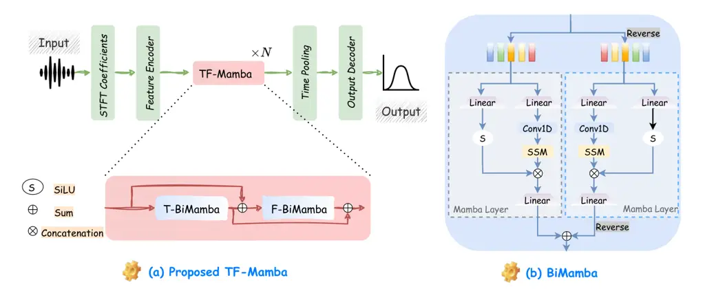

Xiao Das The University of MelbourneAustralia Fortemedia
SingaporeSingapore

# TF-Mamba: A Time-Frequency Network for Sound Source Localization

Yang Affiliation:      Rohan Kumar Affiliation: 

###### Abstract

Sound source localization (SSL) determines the position of sound sources
using multi-channel audio data. It is commonly used to improve speech
enhancement and separation. Extracting spatial features is crucial for
SSL, especially in challenging acoustic environments. Recently, a novel
structure referred to as Mamba demonstrated notable performance across
various sequence-based modalities. This study introduces the Mamba for
SSL tasks. We consider the Mamba-based model to analyze spatial features
from speech signals by fusing both time and frequency features, and we
develop an SSL system called TF-Mamba. This system integrates time and
frequency fusion, with Bidirectional Mamba managing both time-wise and
frequency-wise processing. We conduct the experiments on the simulated
and real datasets. Experiments show that TF-Mamba significantly
outperforms other advanced methods. The code will be publicly released
in due course.

###### keywords

DOA Estimation, Sound Source Localization, Mamba, State-space Model

^(†)^(†)email: yxiao9550@student.unimelb.edu.au, rohankd@fortemedia.com

## 1 Introduction

Sound source localization (SSL) \[1\] aims to automatically identify the
origins of sound by analyzing signals captured through a microphone
array. The core functionality of SSL systems is to calculate the angles
at which sounds reach the microphones. This spatial information is
essential for many speech-based applications, including speech
separation \[2, 3, 4\], speech recognition \[5\], and speech enhancement
\[6\]. Accurate sound localization can assist these applications to
improve their performance. As a result, developing more advanced SSL
techniques has become a key focus in research, aiming for greater
robustness and adaptability in the real world.

Traditional SSL methods estimate spatial features linked to direct-path
signal propagation to map features to source locations. Common spatial
features include time delay, inter-channel phase/level difference
(IPD/ILD) \[7\], and relative transfer function (RTF) \[8\]. For
example, the steered response power (SRP) based methods, particularly
SRP-PHAT \[9\], which is obtained from the SRP by applying phase
transform whitening, have been foundational due to their simplicity and
versatility. These spatial features are easy to estimate in ideal
conditions but become challenging in real-world scenarios with noise,
reverberation, and multiple moving sources. Because the noise and
overlapping speech cause distortions, while reverberation masks or
colors the signal. Additionally, moving sources create time-varying
spatial cues, also leading to a significant decline in localization
accuracy.

In recent years, deep learning methods for localization have gained more
attention \[10, 11, 12\] than traditional methods. These methods
approach the task as either feature/location regression or location
classification. Common architectures for moving SSL include
convolutional neural networks (CNNs) \[13, 14\] and recurrent neural
networks (RNNs) \[15, 16\]. CNNs extract local spatial features, while
RNNs capture long-term temporal context. Deep learning models can take
input at the signal level (e.g., time-domain signals, spectrograms) or
feature level (e.g., inter-channel phase difference, spatial spectrum).
Inspired by speech enhancement, the recent FN-SSL \[17\] framework
builds on previous research by effectively estimating the localization
of the sound source in both the narrow-band (frequency) and full-band
(timeframe) domains. Long short-term memory (LSTM) layers are used to
process each band, demonstrating the state-of-the-art performance.

Although RNN models like FN-SSL have shown promising results, a new
architecture based on the neural state space model (SSM) called Mamba
\[18, 19\] has emerged and achieves superior performance to
state-of-the-art models in various tasks \[20, 21, 22\]. In speech
processing, there have been attempts to replace transformers and RNNs
with Mamba for tasks such as speech separation and speech enhancement
\[23, 24, 25\]. As \[26\] state, Mamba outperforms RNNs in modeling very
long-range dependencies and is recognized for its efficient use of
computational resources which is suitable for SSL applications.

In this work, we introduce Mamba to SSL by developing a novel
architecture called TF-Mamba. Our goal is to enhance SSL by utilizing
Mamba’s capability to efficiently model long-range dependencies.
Additionally, we apply Mamba to both temporal and frequency dimensions,
creating a dual-dimension approach that improves feature extraction and
better captures spatial and localization cues compared to baseline
models. By utilizing bidirectional Mamba (BiMamba) blocks, TF-Mamba
enhances audio sequence context modeling while maintaining computational
complexity. We evaluate TF-Mamba using both simulated data and the
LOCATA dataset, demonstrating its effectiveness in real-world scenarios.
To our knowledge, this is the first study to apply a state-space-based
model to SSL, showcasing the novelty and significance of our approach.



Figure 1: Architecture of (a) the proposed TF-Mamba network and (b)
Bidirectional Mamba (BiMamba) layer. Each TF-Mamba block includes a
temporal Mamba (T-BiMamba) and frequency Mamba (F-BiMamba) layer, with
skip connections to prevent information loss. “S” denotes the SiLU
activation and “Linear” indicates linear projection.

## 2 Related Works

### 2.1 Mamba for Speech

Mamba \[26\] has demonstrated transformer-level performance across
various sequence-based modalities, including audio and speech, which are
naturally sequential in waveform or spectrogram forms. Early works
applied Mamba to single tasks such as speech enhancement \[25, 27\],
speech separation \[23\], and audio detection and classification \[28,
29\]. Additionally, some studies explored self-supervised audio
transformers trained with masked spectrogram modeling. The most
comprehensive studies to date examine Mamba’s applications in speech
enhancement, recognition, synthesis, understanding, and summarization.
However, effective model design using SSMs for deep SSL remains
unexplored.

### 2.2 Deep Sound Source Localization

In recent years, significant progress has been made in SSL using neural
networks. Cross3D \[30\] uses the SRP-PHAT spatial spectrum as input and
employs a causal 3D CNN network for tracking moving sound sources.
Similarly, SE-ResNet \[31\] utilizes a squeeze-and-excitation residual
network as an encoder and a gated recurrent unit (GRU) network as a
decoder. While SELDnet \[32\] takes frequency-normalized inter-channel
phase difference (IPD) concatenated with the magnitude spectrum as
input, SALSA-Lite \[33\], similar to SELDnet, uses frequency-normalized
IPD with the magnitude spectrum as input and a ResNet-GRU network. With
advanced performance, the FN-SSL \[17\] also uses direct path IPD as
input and leverages dedicated full-band and narrow-band LSTM layers to
exploit inter-band dependencies and inter-channel information.

## 3 Proposed TF-Mamba

### 3.1 BiMamba

The structured SSMs \[18, 19\] efficiently handle long-dependent
sequences with low computation and memory needs, serving as a substitute
for transformers or RNNs. Mamba \[26\] enhances SSM by introducing an
input-dependent selection mechanism for efficient information filtering
and a hardware-aware algorithm that scales linearly with sequence
length, enabling faster computation. Mamba’s architecture, combining SSM
blocks with linear layers, is simpler but achieves state-of-the-art
performance across various long-sequence tasks, offering significant
computational efficiency during both training and inference.

The core of Mamba is a linear selective SSM. The SSM transforms an input
$`x_{t}`$ into an output $`y_{t}`$ using a hidden state $`h_{t}`$ at
each step $`t`$ in the sequence. It includes three learnable matrices:
$`A`$ for state transitions, $`B`$ for inputs, and $`C`$ for outputs. A
discretization process is applied to continuous-time SSMs for the
integration into practical deep neural architectures. We convert the
continuous matrices $`A`$ and $`B`$ into discrete forms, $`\tilde{A}`$
and $`\tilde{B}`$. This step allows the model to work with discrete-time
signals. After this, the SSM follows the equation shown below:

```math
h_{t}=\tilde{A}h_{t-1}+\tilde{B}x_{t},\hskip 10.00002pty_{t}=Ch_{t} \tag{1}
```

Because of its linear structure, the full output sequence $`y`$ of
length $`\mathcal{L}`$ can be written as a convolution between the input
sequence $`x`$ and a kernel $`\mathcal{K}`$. Each element of
$`\mathcal{K}`$ shows how an input at one time step affects future
outputs through the state transitions. This kernel summarizes the
model’s temporal behavior and allows efficient processing of long
sequences. This makes structured state-space models useful for SSL.

```math
\hskip 10.00002pty=x\ast\mathcal{K},{\text{~where~}}\mathcal{K}=(C\tilde{B},C\tilde{A}\tilde{B},\ldots,C\tilde{A}^{\mathcal{L}-1}\tilde{B}) \tag{2}
```

However, the matrices in the model depend on the input $`x_{t}`$, making
them input-selective. Because of this, the convolution cannot be
computed directly. Instead, it is solved using a parallel scan
algorithm. In the Mamba model, the SSM is placed between two gated
linear layers. These added components improve performance by introducing
selective features, but the model remains unidirectional, like a
traditional RNN. While unidirectionality is acceptable in large language
models that use autoregressive training, it becomes a problem in
non-autoregressive speech models. For the SSL task, models must capture
both past and future context. Therefore, a non-causal module, such as
attention, is needed. Finding an effective way to add this capability is
an important challenge.

We use the bidirectional Mamba (BiMamba) proposed in \[25, 22\], where
two SSMs and causal convolutions run in parallel: one processes the
original sequence, and the other processes the reversed sequence. The
outputs from both SSMs are averaged to incorporate information from both
directions.

### 3.2 Network Architecture

The structure of the proposed TF-Mamba network is illustrated in
Figure 1 (a). The input to the network consists of the real and
imaginary parts of the STFT coefficients, resulting in an input channel
count that is twice the number of microphones. The model has three
modules as follows:

#### 3.2.1 Feature Encoder

The inputs are first processed by a feature encoder, which consists of a
dilated DenseNet \[34\] core flanked by two convolutional layers to
enhance its spectral properties. The output from the feature encoder is
then transformed through the Time-Frequency Mamba block.

#### 3.2.2 Time-Frequency Mamba

The Time-Frequency Mamba (TF-Mamba) block consists of one temporal Mamba
layer and one frequency Mamba layer. Figure 1 (a) illustrates a network
with a TF-Mamba block, with additional blocks easily added by repeating
the block multiple ($`N`$) times. Figure 1 (b) illustrates the BiMamba
layer.

The temporal Mamba layers process time frames independently, with all
frames sharing the same network parameters. The input is a sequence
along the frequency axis of a single time frame, allowing the temporal
Mamba layers to learn inter-frequency dependencies related to spatial
and localization cues. These layers do not capture temporal information,
which is instead handled by the subsequent frequency Mamba layers.

The frequency Mamba layers process frequencies independently, with all
frequencies also sharing parameters. Differing from the temporal Mamba,
the input is a sequence along the time axis of a single frequency, where
the frequency Mamba layers estimate direct-path localization features.
Estimating these features frequency-wise has been extensively studied in
conventional methods such as in \[17\]. The proposed frequency Mamba
layers focus on exploiting this inter-channel information. Additionally,
since it is time-varying for moving sound sources, the frequency Mamba
layers also learn the temporal evolution of the direct-path localization
features.

Mamba is useful because it efficiently models long-range dependencies
while maintaining computational efficiency. The ability of Mamba to
handle both temporal and frequency-specific features in a structured
manner makes it ideal for capturing complex relationships in audio data,
such as the time-varying nature of localization cues, which are crucial
for accurate SSL. However, the temporal Mamba and frequency Mamba layers
are designed to focus on their respective types of information.
Therefore the pieces of information from the frequency Mamba layer can
be lost after passing through a temporal Mamba layer, and vice versa. To
prevent this information loss, we add skip connections. As shown in
Figure 1, the output of each temporal Mamba layer is added to the input
of the following temporal Mamba layer. Similarly, the output of each
frequency Mamba layer is added to the input of the next frequency Mamba
layer. Further, each Mamba layer inside BiMamba also has the skip
connection.

#### 3.2.3 Output Decoder

The output from the TF-Mamba blocks is then passed through an average
pooling module to reduce the frame rate and is subsequently fed into a
fully connected layer with $`\tanh`$ activation, which converts the
output to the desired dimension. We employ a spatial spectrum prediction
module for DOA estimation as in \[35\]. This system learns complex
relationships from the audio data to predict the potential origin of
sound at every degree within a half-circle of the linear microphone
array. The resulting spatial spectrum is an 181-point map. We train our
model by minimizing the mean squared error (MSE) loss between the
model’s output spatial spectrum and the ground truth.

## 4 Experiment Setting

### 4.1 Datasets

We evaluated the proposed method on both simulated and real-world
datasets, using two microphones to localize the direction of arrival
(DOA) within a 180-degree azimuth range.

Simulated dataset: Microphone signals are obtained by convolving room
impulse responses (RIRs) with speech source signals \[12\]. The speech
signals are randomly selected from the training, development, and test
sets of the LibriSpeech corpus \[36\], and then used for model training,
validation, and testing, respectively. RIRs are generated using the
gpuRIR \[37\]. We followed the settings from \[17\] to obtain the
simulated dataset with moving sources. The room reverberation time
(RT60) is randomly set between 0.2 and 0.6 seconds, and the room size
ranges from $`4\times 2\times 2`$ m to $`10\times 8\times 5`$ m. The
moving trajectories of speech sources are generated according to
 \[30\], with each source maintaining a fixed height. Two microphones,
placed 8 cm apart, are randomly positioned in the room on the same
horizontal plane as the sound source. This dataset includes 1,511 audio
files, which amount to approximately 4.96 hours of speech data. Based on
the RIRs, we generate the mixture data for each original single-channel
speech data for every 5 degrees from 0 to 180 degrees, which expands the
audio files by 37 times. We then use white, babble, and factory noises
from the NOISEX-92 \[38\] dataset as noise sources and create a diffuse
sound field described in \[39\]. The generated diffuse noise signals are
added to the clean signals with a signal-to-noise ratio (SNR) between
-10 and 10 dB for noise robustness.

Real-world dataset: We also tested our proposed method on tasks 3 and 5
of the LOCATA dataset \[40\] following the setting in \[17\]. The room
size was $`7.1\times 9.8\times 3`$ m, with a reverberation time of 0.55
s. We used microphones 6 and 9 from the DICIT array \[41\], which have
the same configuration as the simulated microphone array. The models
trained on the simulated dataset were directly tested on the LOCATA
dataset.

### 4.2 Implementation details and metrics

For training each task with our proposed TF-Mamba model, we use 100
epochs with a 20-epoch early stopping criterion. We utilize the AdamW
optimizer with a learning rate of 0.001. Additionally, we employ StepLR,
to adjust the learning rate during training. For STFT computations, the
frame size is set to 32 milliseconds, and the hop size to 10
milliseconds. The frequency range for the STFT is between 100 Hz and
8000 Hz, with an n_fft value of 512, which determines the length of the
windowed signal after zero-padding.

We use two primary metrics: mean absolute error (MAE) and accuracy
(ACC). MAE quantifies the average magnitude of prediction errors,
disregarding their direction. ACC, on the other hand, measures the
percentage of predictions that are exactly correct or within a specified
tolerance. We assess accuracy at two tolerance levels: within a
$`10^{\circ}`$ and $`15^{\circ}`$ error margin. These tolerance levels
provide insight into the model’s precision as well as its practical
effectiveness.

### 4.3 Reference baselines

We compared the following five moving SSL methods: Cross3D \[30\],
SELDnet \[32\], SE-Resnet \[31\], SALSA-Lite \[33\], and FN-SSL \[17\].
It is noted that the SELDnet, SALSA-Lite, and SE-ResNet are models
designed for joint sound event detection and localization; hence, we
only utilize their localization branches for comparison. All these
methods are reproduced and trained on the same dataset as our proposed
method. We adjust the time pooling kernel size in each method to achieve
the same output frame rate across all models.

|                                             |                            |                                  |                                  |                             |
| ------------------------------------------- | -------------------------- | -------------------------------- | -------------------------------- | --------------------------- |
| Components                                  | Params\[M\] $`\downarrow`$ | ACC($`15^{\circ}`$) $`\uparrow`$ | ACC($`10^{\circ}`$) $`\uparrow`$ | MAE \[^(∘)\] $`\downarrow`$ |
| Block $`\times`$ 3 (Expand = \[2,2,2\])     | 0.9                        | 96.5                             | 92.6                             | 2.89                        |
| Block $`\times`$ 4 (Expand = \[2,2,4,4\])   | 1.3                        | 98.4                             | 94.9                             | 2.87                        |
| Block $`\times`$ 5 (Expand = \[2,2,4,4,8\]) | 1.8                        | 98.9                             | 96.9                             | 2.52                        |
| w/o BiMamba                                 | 1.4                        | 97.1                             | 93.6                             | 2.84                        |
| w/o Skip                                    | 1.8                        | 97.9                             | 95.4                             | 2.65                        |

Table 1: Ablation studies of TF-Mamba on simulated data. “Expand”
denotes the expand factor for the Mamba layer.

| Methods    | Params\[M\] $`\downarrow`$ | Clean | ACC($`15^{\circ}`$) $`\uparrow`$ | ACC($`10^{\circ}`$) $`\uparrow`$ | MAE\[^(∘)\] $`\downarrow`$ |     |
| ---------- | -------------------------- | ----- | -------------------------------- | -------------------------------- | -------------------------- | --- |
| SELDnet    | 0.8                        | ✓     | 96.6                             | 93.8                             | 3.5                        |     |
| FN-SSL     | 2.1                        |       | 98.3                             | 95.9                             | 2.8                        |     |
| Cross3D    | 5.6                        |       | 84.8                             | 81.3                             | 6.5                        |     |
| SE-ResNet  | 10.2                       |       | 96.7                             | 95.1                             | 3.2                        |     |
| SALSA-Lite | 14.0                       |       | 96.8                             | 95.6                             | 2.9                        |     |
| TF-Mamba   | 1.8                        |       | 98.9                             | 96.9                             | 2.5                        |     |
| SELDnet    | 0.8                        | ✗     | 52.8                             | 50.2                             | 16.7                       |     |
| FN-SSL     | 2.1                        |       | 71.6                             | 68.4                             | 8.9                        |     |
| Cross3D    | 5.6                        |       | 38.8                             | 35.4                             | 26.3                       |     |
| SE-ResNet  | 10.2                       |       | 67.7                             | 64.6                             | 10.8                       |     |
| SALSA-Lite | 14.0                       |       | 69.1                             | 65.7                             | 10.3                       |     |
| TF-Mamba   | 1.8                        |       | 74.6                             | 72.5                             | 8.2                        |     |

Table 2: Performance comparison in ACC and MAE on simulated data. We
test the models under the clean set and with -10 dB noise. The highlight
is our proposed TF-Mamba model.

| Methods    | Params\[M\] $`\downarrow`$ | ACC($`15^{\circ}`$) $`\uparrow`$ | ACC($`10^{\circ}`$) $`\uparrow`$ | MAE \[^(∘)\] $`\downarrow`$ |
| ---------- | -------------------------- | -------------------------------- | -------------------------------- | --------------------------- |
| SELDnet    | 0.8                        | 94.1                             | 91.2                             | 5.3                         |
| FN-SSL     | 2.1                        | 96.7                             | 93.3                             | 3.6                         |
| Cross3D    | 5.6                        | 94.8                             | 91.4                             | 5.1                         |
| SE-ResNet  | 10.2                       | 94.0                             | 90.7                             | 6.5                         |
| SALSA-Lite | 14.0                       | 95.0                             | 92.5                             | 4.6                         |
| TF-Mamba   | 1.8                        | 97.2                             | 94.3                             | 3.2                         |

Table 3: Performance comparison in ACC and MAE on LOCATA dataset. The
highlight is our proposed TF-Mamba model.

## 5 Results and Analysis

### 5.1 Ablation: Configuration for TF-Mamba

The ablation study results for TF-Mamba, shown in Table 1, highlight the
importance of different components in the network. “Block $`\times`$
$`N`$” refers to stacking $`N`$ number of TF-Mamba blocks. As the number
of blocks increases from 3 to 5, accuracy ($`10^{\circ}`$ error
tolerances) improves from 92.6% to 96.9%, showing that deeper networks
help the model understand more complex localization information. The
“w/o BiMamba” variant, which replaces the bidirectional mamba with
unidirectional, reduces accuracy to 93.6% ($`10^{\circ}`$) and 97.1%
($`15^{\circ}`$). This shows that processing both past and future
information is important for achieving good performance. The “w/o Skip”
variant, which excludes skip connections, also leads to a small drop in
accuracy and a higher error. This confirms that skip connections are
helpful in keeping information flowing through the network. We use Block
$`\times`$ 5 version with BiMamba and skip connections in the following
comparison experiments.

### 5.2 Results on simulated data

We report the results in two acoustic conditions of testing in Table 2
which are “Clean” and “SNR=-10 dB”. The results demonstrate that
TF-Mamba outperforms other methods in clean and noisy environments,
highlighting its robustness in handling noise and reverberation. With
the highest accuracy in $`10^{\circ}`$ (96.9%), $`15^{\circ}`$ (98.9%)
and lowest MAE (2.5) in clean conditions, TF-Mamba outperforms FN-SSL by
more effectively capturing long-range time and frequency dependencies,
resulting in higher accuracy and greater robustness in challenging
environments. This improvement demonstrates our contribution by
validating the effectiveness of dual-dimension Mamba modeling. In
contrast, methods like SALSA-Lite, which processes noisy IPD with
magnitude spectrum, and Cross3D, which uses the SRP-PHAT spatial
spectrum, show significant performance drops under noise, underscoring
the advantage of TF-Mamba.

### 5.3 Results on real-world data

The results on the LOCATA dataset are presented in Table 3, where the
models trained on simulated data are directly tested. We observe that
TF-Mamba achieves the best performance, with the highest accuracy at
both 15° (97.2%) and 10° (94.3%) error tolerances, and the lowest MAE
(3.2). This dataset’s relatively good acoustic conditions, which are
almost noise-free and have an RT60 of 0.55s, allow all models to perform
well. However, TF-Mamba’s superior accuracy and lower error indicate its
ability to better capture fine localization details compared to the
other methods. Notably, methods like SE-ResNet and SALSA-Lite, which are
more complex in terms of parameters, show higher MAE, while simpler
models like SELDnet struggle with accuracy and MAE. TF-Mamba’s approach
also avoids the over-smoothing problem seen in other models during
sudden sound source turns, maintaining strong localization performance
in real-world conditions.

## 6 Conclusion

In this paper, we introduced TF-Mamba, a novel architecture for SSL that
leverages the Mamba to fuse time and frequency features effectively. By
replacing traditional LSTM blocks with bidirectional Mamba, TF-Mamba
enhances the modeling of audio sequence contexts while maintaining
computational efficiency. Our experimental results, conducted on both
simulated and real-world datasets, demonstrate that TF-Mamba
significantly outperforms existing state-of-the-art methods. These
findings highlight the proposed TF-Mamba in advancing SSL tasks, marking
the first application of such models in this field.

## References

- \[1\] P.-A. Grumiaux, S. Kitić, L. Girin, and A. Guérin, “A survey of
  sound source localization with deep learning methods,” _The Journal of
  the Acoustical Society of America_, vol. 152, no. 1, pp. 107–151,
  07 2022.
- \[2\] P. Chiariotti, M. Martarelli, and P. Castellini, “Acoustic
  beamforming for noise source localization–Reviews, methodology and
  applications,” _Mechanical Systems and Signal Processing_, vol. 120,
  pp. 422–448, 2019.
- \[3\] Z. Zhang, Y. Xu, M. Yu, S.-X. Zhang, L. Chen, and D. Yu,
  “ADL-MVDR: All deep learning MVDR beamformer for target speech
  separation,” in _Proc. IEEE International Conference on Acoustics,
  Speech and Signal Processing (ICASSP)_, 2021, pp. 6089–6093.
- \[4\] Y. Xiao and R. K. Das, “Dual Knowledge Distillation for
  Efficient Sound Event Detection,” in _Proc. International Conference
  on Acoustics, Speech and Signal Processing Workshop (ICASSPW)_. IEEE,
  2024, pp. 690–694.
- \[5\] H.-Y. Lee, J.-W. Cho, M. Kim, and H.-M. Park, “DNN-based feature
  enhancement using DOA-constrained ICA for robust speech recognition,”
  _IEEE Signal Processing Letters_, vol. 23, no. 8, pp. 1091–1095, 2016.
- \[6\] A. Xenaki, J. Bünsow Boldt, and M. Græsbøll Christensen, “Sound
  source localization and speech enhancement with sparse bayesian
  learning beamforming,” _The Journal of the Acoustical Society of
  America_, vol. 143, no. 6, pp. 3912–3921, 2018.
- \[7\] M. Raspaud, H. Viste, and G. Evangelista, “Binaural source
  localization by joint estimation of ILD and ITD,” _IEEE Transactions
  on Audio, Speech, and Language Processing_, vol. 18, no. 1, pp.
  68–77, 2009.
- \[8\] W. Zhang and B. D. Rao, “A two microphone-based approach for
  source localization of multiple speech sources,” _IEEE Transactions on
  Audio, Speech, and Language Processing_, vol. 18, no. 8, pp.
  1913–1928, 2010.
- \[9\] R. Schmidt, “Multiple emitter location and signal parameter
  estimation,” _IEEE Transactions on Antennas and Propagation_, vol. 34,
  no. 3, pp. 276–280, 1986.
- \[10\] T. N. T. Nguyen, D. L. Jones, K. N. Watcharasupat, H. Phan, and
  W.-S. Gan, “SALSA-Lite: A fast and effective feature for polyphonic
  sound event localization and detection with microphone arrays,” in
  _Proc. IEEE International Conference on Acoustics, Speech and Signal
  Processing (ICASSP)_, 2022, pp. 716–720.
- \[11\] A. Politis, K. Shimada, P. Sudarsanam, S. Adavanne, D. Krause,
  Y. Koyama, N. Takahashi, S. Takahashi, Y. Mitsufuji, and T. Virtanen,
  “STARSS22: A dataset of spatial recordings of real scenes with
  spatiotemporal annotations of sound events,” in _Proc. the Detection
  and Classification of Acoustic Scenes and Events Workshop (DCASE)_,
  2022, pp. 125–129.
- \[12\] Y. Xiao and R. K. Das, “Where’s that voice coming? Continual
  learning for sound source localization,” in _Proc. IEEE International
  Conference on Multimedia and Expo (ICME)_, 2024.
- \[13\] D. Suvorov, R. Zhukov, and G. Dong, “Deep residual network for
  sound source localization in the time domain,” _Journal of Engineering
  and Applied Sciences_, vol. 13, no. 13, pp. 5096–5104, 2018.
- \[14\] B. Yang, H. Liu, and X. Li, “SRP-DNN: Learning direct-path
  phase difference for multiple moving sound source localization,” in
  _Proc. IEEE International Conference on Acoustics, Speech and Signal
  Processing (ICASSP)_, 2022, pp. 721–725.
- \[15\] N. Ma, T. May, and G. J. Brown, “Exploiting deep neural
  networks and head movements for robust binaural localization of
  multiple sources in reverberant environments,” _IEEE Transactions on
  Audio, Speech, and Language Processing_, vol. 25, no. 12, pp.
  2444–2453, 2017.
- \[16\] S. Adavanne, A. Politis, and T. Virtanen, “Direction of arrival
  estimation for multiple sound sources using convolutional recurrent
  neural network,” in _Proc. IEEE 26th European Signal Processing
  Conference (EUSIPCO)_, 2018, pp. 1462–1466.
- \[17\] Y. Wang, B. Yang, and X. Li, “FN-SSL: Full-band and narrow-band
  fusion for sound source localization,” in _Proc. Interspeech_, 2023,
  pp. 3779–3783.
- \[18\] A. Gu, K. Goel, and C. Re, “Efficiently modeling long sequences
  with structured state spaces,” in _Proc. International Conference on
  Learning Representations (ICLR)_, 2021.
- \[19\] A. Gu, K. Goel, A. Gupta, and C. Re, “On the parameterization
  and initialization of diagonal state space models,” in _Proc. Advances
  in Neural Information Processing Systems (NIPS)_, vol. 35, 2022, pp.
  35 971–35 983.
- \[20\] L. Zhu, B. Liao, Q. Zhang, X. Wang, W. Liu, and X. Wang,
  “Vision Mamba: Efficient visual representation learning with
  bidirectional state space model,” in _Proc. International Conference
  on Machine Learning (ICML)_, 2024.
- \[21\] X. Zhang, J. Ma, M. Shahin, B. Ahmed, and J. Epps, “Rethinking
  mamba in speech processing by self-supervised models,” in _IEEE
  International Conference on Acoustics, Speech and Signal Processing
  (ICASSP)_, 2025, pp. 1–5.
- \[22\] X. Zhang, Q. Zhang, H. Liu, T. Xiao, X. Qian, B. Ahmed,
  E. Ambikairajah, H. Li, and J. Epps, “Mamba in Speech: Towards an
  alternative to self-attention,” _IEEE Transactions on Audio, Speech
  and Language Processing_, vol. 33, pp. 1933–1948, 2025.
- \[23\] X. Jiang, C. Han, and N. Mesgarani, “Dual-path mamba: Short and
  long-term bidirectional selective structured state space models for
  speech separation,” in _IEEE International Conference on Acoustics,
  Speech and Signal Processing (ICASSP)_. IEEE, 2025, pp. 1–5.
- \[24\] Y. Xiao and R. K. Das, “XLSR-Mamba: a dual-column bidirectional
  state space model for spoofing attack detection,” _IEEE Signal
  Processing Letters_, vol. 32, pp. 1276–1280, 2025.
- \[25\] R. Chao, W.-H. Cheng, M. La Quatra, S. M. Siniscalchi, C.-H. H.
  Yang, S.-W. Fu, and Y. Tsao, “An investigation of incorporating mamba
  for speech enhancement,” in _IEEE Spoken Language Technology Workshop
  (SLT)_, 2024, pp. 302–308.
- \[26\] A. Gu and T. Dao, “Mamba: Linear-time sequence modeling with
  selective state spaces,” in _Proc. Conference on Language Modeling
  (COLM)_, 2024.
- \[27\] C. Quan and X. Li, “Multichannel long-term streaming neural
  speech enhancement for static and moving speakers,” _IEEE Signal
  Processing Letters_, pp. 1–5, 2024.
- \[28\] M. H. Erol, A. Senocak, J. Feng, and J. S. Chung, “Audio Mamba:
  Bidirectional State Space Model for Audio Representation Learning,”
  _IEEE Signal Processing Letters_, vol. 31, pp. 1933–1948, 2024.
- \[29\] Y. Chen, J. Yi, J. Xue, C. Wang, X. Zhang, S. Dong, S. Zeng,
  J. Tao, L. Zhao, and C. Fan, “RawBMamba: End-to-end bidirectional
  state space model for audio deepfake detection,” in _Proc.
  Interspeech_, 2024, pp. 2720–2724.
- \[30\] D. Diaz-Guerra, A. Miguel, and J. R. Beltran, “Robust sound
  source tracking using SRP-PHAT and 3D convolutional neural networks,”
  _IEEE Transactions on Audio, Speech, and Language Processing_,
  vol. 29, pp. 300–311, 2020.
- \[31\] J. S. Kim, H. J. Park, W. Shin, and S. W. Han, “A robust
  framework for sound event localization and detection on real
  recordings,” _Tech. Rep._, 2022.
- \[32\] S. Adavanne, A. Politis, J. Nikunen, and T. Virtanen, “Sound
  event localization and detection of overlapping sources using
  convolutional recurrent neural networks,” _IEEE Journal of Selected
  Topics in Signal Processing_, vol. 13, no. 1, pp. 34–48, 2018.
- \[33\] T. N. T. Nguyen, D. L. Jones, K. N. Watcharasupat, H. Phan, and
  W.-S. Gan, “SALSA-Lite: A fast and effective feature for polyphonic
  sound event localization and detection with microphone arrays,” in
  _Proc. IEEE International Conference on Acoustics, Speech and Signal
  Processing (ICASSP)_, 2022, pp. 716–720.
- \[34\] G. Huang, Z. Liu, L. Van Der Maaten, and K. Q. Weinberger,
  “Densely connected convolutional networks,” in _Proc. IEEE Conference
  on Computer Vision and Pattern Recognition (CVPR)_, 2017, pp.
  4700–4708.
- \[35\] W. He, P. Motlicek, and J.-M. Odobez, “Neural network
  adaptation and data augmentation for multi-speaker
  direction-of-arrival estimation,” _IEEE Transactions on Audio, Speech,
  and Language Processing_, vol. 29, pp. 1303–1317, 2021.
- \[36\] V. Panayotov, G. Chen, D. Povey, and S. Khudanpur,
  “Librispeech: an asr corpus based on public domain audio books,” in
  _Proc. IEEE International Conference on Acoustics, Speech and Signal
  Processing (ICASSP)_, 2015, pp. 5206–5210.
- \[37\] D. Diaz-Guerra, A. Miguel, and J. R. Beltran, “gpuRIR: A python
  library for room impulse response simulation with GPU acceleration,”
  _Multimedia Tools and Applications_, vol. 80, no. 4, pp.
  5653–5671, 2021.
- \[38\] A. Varga and H. J. Steeneken, “Assessment for automatic speech
  recognition: II. NOISEX-92: A database and an experiment to study the
  effect of additive noise on speech recognition systems,” _Speech
  communication_, vol. 12, no. 3, pp. 247–251, 1993.
- \[39\] E. A. Habets, I. Cohen, and S. Gannot, “Generating
  nonstationary multisensor signals under a spatial coherence
  constraint,” _The Journal of the Acoustical Society of America_, vol.
  124, no. 5, pp. 2911–2917, 2008.
- \[40\] H. W. Löllmann, C. Evers, A. Schmidt, H. Mellmann, H. Barfuss,
  P. A. Naylor, and W. Kellermann, “The LOCATA challenge data corpus for
  acoustic source localization and tracking,” in _Proc. IEEE Sensor
  Array and Multichannel Signal Processing Workshop (SAM)_, 2018, pp.
  410–414.
- \[41\] A. Brutti, L. Cristoforetti, W. Kellermann, L. Marquardt, and
  M. Omologo, “WOZ acoustic data collection for interactive TV,”
  _Language Resources and Evaluation_, vol. 44, pp. 205–219, 2010.
