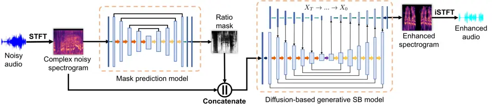

# Diffusion-based Speech Enhancement with Schrödinger Bridge and Symmetric Noise Schedule

Siyi Wang Affiliation: Logitech, EPFL  
Lausanne, CH    Siyi Liu Affiliation: Logitech, EPFL  
Lausanne, CH    Andrew Harper Affiliation: Logitech Europe  
Lausanne, CH    Paul Kendrick Affiliation: Logitech Europe  
Lausanne, CH    Mathieu Salzmann Affiliation: EPFL SDSC  
Lausanne, CH    Milos Cernak Affiliation: Logitech Europe  
Lausanne, CH

###### Abstract

Recently, diffusion-based generative models have demonstrated remarkable
performance in speech enhancement tasks. However, these methods still
encounter challenges, including the lack of structural information and
poor performance in low Signal-to-Noise Ratio (SNR) scenarios. To
overcome these challenges, we propose the Schrödinger Bridge-based
Speech Enhancement (SBSE) method, which learns the diffusion processes
directly between the noisy input and the clean distribution, unlike
conventional diffusion-based speech enhancement systems that learn data
to Gaussian distributions. To enhance performance in extremely noisy
conditions, we introduce a two-stage system incorporating ratio mask
information into the diffusion-based generative model. Our experimental
results show that our proposed SBSE method outperforms all the baseline
models and achieves state-of-the-art performance, especially in low SNR
conditions. Importantly, only a few inference steps are required to
achieve the best result.

###### Index Terms: 

Speech Enhancement, Schrödinger bridge, Diffusion-based Model

## I Introduction

Current advancements have seen diffusion-based generative models
achieving impressive outcomes in data generation tasks, extending their
application to speech enhancement \[1\]. Initially introduced for image
synthesis tasks, the denoising diffusion probabilistic model has
demonstrated substantial capabilities in both generation and denoising,
as noted in \[2\]. The first application of a diffusion generative model
to speech enhancement was proposed as the DiffuSE system \[3\] that
enhances speech quality using a denoising diffusion probabilistic model
(DDPM). To address a broader range of noises beyond Gaussian noise,
improvements were made to DiffuSE, leading to the development of
CDiffuSE  \[4\]. Other efforts employing score-based generative models,
as outlined in \[5\] and \[6\], have successfully produced
higher-quality enhanced speech.

However, current diffusion-based generative methods suffer from the
challenge of lacking structural information for inference. Due to the
inherent logic of the diffusion probabilistic model, the aforementioned
diffusion models begin the inference process with Gaussian white noise
or noisy speech mixed with strong Gaussian noise, which contains minimal
or no structural information about the clean data distribution.
Furthermore, for the models that start inference from the mixture of
noisy speech and Gaussian noise, such as CDiffuSE, controlling the ratio
of noisy speech and Gaussian noise still needs to be explored. Another
challenge of current diffusion-based generative methods is their poor
performance in low signal-to-noise ratio (SNR) conditions. The
diffusion-based generative model demonstrates a good ability to produce
clean, high-quality speech in most conditions. However, in highly noisy
environments, particularly when the SNR is below 0, the enhanced speech
quality significantly degrades, yielding poor intelligibility,
necessitating further improvement.

To address the drawbacks, we propose to use i) the Schrödinger Bridge
and ii) its extension with a conventional mask prediction model. The
Schrödinger Bridge (SB) problem \[7, 8\], is to seek an optimal way to
transform one probability distribution into another arbitrary
distribution. Recently, SB has been adopted to image reconstruction task
\[9\] and text-to-speech synthesis task \[10\]. Inspired by the SB
concept, we apply the SB approach to speech enhancement, initiating the
generative process directly from the noisy input. Compared to
traditional diffusion-based speech enhancement methods, SB maintains
more structural information on the initial state of the generative
process. Furthermore, it also eliminates the need to balance Gaussian
noise against noisy speech, offering a more direct and efficient pathway
to speech enhancement.

In this paper, we propose the Schrodinger Bridge-based Speech
Enhancement (SBSE) method within the complex STFT domain, which enables
the direct generation of clean data from noisy speech. The SBSE is
grounded in a score-based generative framework and navigates through the
forward and reverse processes as defined by certain Stochastic
Differential Equations (SDEs). The SBSE initiates the reverse process
directly from noisy speech, aiming to learn the nonlinear diffusion
process from noisy to clean speech. NVIDIA recently explored both
Variance Exploding (VE) SDE and Variance Preserving (VP) SDE, with VE
showing better results \[11\]. Our method also uses the VE SDE structure
but with the key difference of setting a symmetric noise scheduling,
where the diffusion shrinks at both boundaries.

Besides, we combine the SB concept with a two-stage approach inspired by
StoRM \[12\] and \[13\]. While we also utilize predictive models to aid
generative models, our approaches diverge. We condition the diffusion
process by combining the mask from the predictive model with the
original noisy input, unlike StoRM, which uses only the predictive
model’s output. We opt for the magnitude ratio mask over the binary mask
to provide more information to the generative model. Incorporating a
ratio mask enhances the quality of generated speech, especially under
low SNR conditions.

## II Background

### II-A Score-based Generative Models

Diffusion models involve two processes: a forward process that
transforms the data distribution $`x_{0}`$ into a prior distribution
$`x_{T}`$, such as Gaussian distribution, through a predefined
perturbing kernel $`q_{t}(x_{t})`$ in $`T`$ steps, and a reverse process
$`q_{t}(x_{t-1}|x_{t})`$ that undoes the forward process. The
score-based generative model (SGM) \[14, 15\] builds on a
continuous-time framework, leveraging stochastic differential equations
(SDEs) for its forward and reverse process, which are described as

```math
\displaystyle d\mathbf{x}_{t}=\mathbf{f}(\mathbf{x}_{t},t)dt+g(t)d\mathbf{w}_{t}\text{,} \tag{1a}
```

```math
\displaystyle d\mathbf{x}_{t}=\left[\mathbf{f}(\mathbf{x}_{t},t)-g^{2}(t)\nabla\log p_{t}(\mathbf{x}_{t})\right]dt+g(t)\mathbf{d}w_{t}\text{,} \tag{1b}
```

where $`f(x_{t},t)`$ is a vector-valued drift term, $`g(t)`$ is the
diffusion coefficient that controls the amount of Gaussian noise
introduced at each time step, $`w`$ refers to a standard Wiener process,
and $`t\in({0,...,T})`$. The forward and reverse processes share the
same marginal distribution.

To generate the enhanced data through the reverse process from $`t=T`$
to $`t=0`$, a time-dependent neural network $`s_{\theta}(x_{t},t)`$
parameterized by $`\theta`$ is employed to estimate the score function
$`\nabla_{\mathbf{x}}\log p(\mathbf{x})`$. The model
$`s_{\theta}(x_{t},t)`$ is trained by a denoising score-matching
objective \[16, 14\] defined as

```math
\mathbb{E}_{t}\left[\lambda(t)\mathbb{E}_{x_{0}}\mathbb{E}_{q(x_{t}|x_{0})}\left[\|s_{\theta}(x_{t},t)-\nabla\log p(x_{t}|x_{0})\|_{2}^{2}\right]\right]\text{,} \tag{2}
```

where $`\lambda(t)`$ is positive weighting function, and
$`p(x_{t}|x_{0})`$ denotes the conditional transition determined by
forward SDE.

### II-B Schrödinger Bridge Model

#### II-B1 Schrödinger Bridge Problem

The SB problem \[7, 8, 17, 18\] aims to optimize the transformation
between two probability distributions over a fixed time, under the
dynamics of a stochastic process. SB can be represented using the
forward-backward SDEs

```math
\displaystyle d\mathbf{x_{t}}=[f(\mathbf{x}_{t},t)+g^{2}(t)\nabla\log\Psi_{t}(\mathbf{x_{t}})]dt+g(t)d\mathbf{w_{t}}, \tag{3a}
```

```math
\displaystyle d\mathbf{x_{t}}=[f(\mathbf{x}_{t},t)-g^{2}(t)\nabla\log\hat{\Psi}_{t}(\mathbf{x_{t}})]dt+g(t)d\mathbf{\tilde{w}_{t}}, \tag{3b}
```

where $`x_{0}`$ and $`x_{T}`$ are drawn from the boundary distributions
$`p_{A}(x)`$ and $`p_{B}(x)`$, respectively, and $`f`$ and $`g`$ are the
same as the score-SDE process of Eq. (1). The nonlinear drifts
$`\nabla\log\Psi_{t}(\mathbf{x_{t}})`$ and
$`\nabla\log\hat{\Psi}_{t}(\mathbf{x_{t}})`$ can be described by
following coupled partial differential equations (PDEs)

```math
\displaystyle\left\{\begin{array}[]{ll}\frac{\partial\Psi(x)}{\partial t}=-\nabla\Psi^{\top}f-\frac{1}{2}\beta\Delta\Psi\\
\frac{\partial\hat{\Psi}(x)}{\partial t}=-\nabla\cdot(\hat{\Psi}f)+\frac{1}{2}\beta\Delta\hat{\Psi}\text{,}\end{array}\right.
```

```math
\displaystyle\text{s.t. }\Psi_{0}(x)\hat{\Psi}_{0}(x)=p_{A}(x),\ \Psi_{T}(x)\hat{\Psi}_{T}(x)=p_{B}(x)\text{.} \tag{4c}
```

These additional nonlinear drift terms enable SB to extend data
transportation beyond Gaussian priors. To overcome the scalability and
applicability challenges of the SB problem \[19, 8\], Liu et al. \[9\]
proposed Image-to-Image Schrödinger Bridge (I²SB), a simulation-free
framework that learns the nonlinear diffusion processes between two
given distributions.

#### II-B2 Simulation-free Framework

Given the paired data, Liu et al. \[9\] developed a simulation-free
methodology based on the SGM framework to efficiently tackle the SB
problem. By conceptualizing $`\Psi_{t}(\mathbf{x})`$ and
$`\hat{\Psi}_{t}(\mathbf{x})`$ as density functions, the drift terms
$`\hat{\Psi}_{t}(\mathbf{x})`$ and $`{\Psi}_{t}(\mathbf{x})`$
effectively become the score functions respectively associated with the
following linear SDEs

```math
\displaystyle d\mathbf{x}_{t}=\mathbf{f}(\mathbf{x}_{t},t)dt+g(t)d\mathbf{w}_{t},\text{ }x_{0}\sim\hat{\Psi}_{0}(x), \tag{5a}
```

```math
\displaystyle d\mathbf{x}_{t}=\mathbf{f}(\mathbf{x}_{t},t)dt+g(t)d\mathbf{w}_{t},\text{ }x_{T}\sim\Psi_{T}(x). \tag{5b}
```

By leveraging these linear SDEs, the methodologies from the SGM
framework can be employed to learn the score functions. To address the
intractability of the boundary conditions $`\hat{\Psi}_{0}(x)`$ and
$`\Psi_{T}(x)`$ introduced in Eq. (4), Liu et al. set $`p_{A}(x)`$ as
the Dirac delta distribution centered at $`a`$, defining
$`p_{A}(\cdot):=\delta_{a}(\cdot)`$, thereby eliminating one of the
couplings.

Taking $`\Psi_{t}(\mathbf{x}_{t}|\mathbf{x}_{0})`$ and
$`\hat{\Psi}_{t}(\mathbf{x}_{t}|\mathbf{x}_{T})`$ as solutions to the
Fokker-Planck equations and conditioning on Nelson’s duality \[20\], the
posterior distribution can be articulated in an analytic form when
provided with boundary pair data \[21\]. Specifically

```math
\displaystyle q(x_{t}|x_{0},x_{T})=\mathcal{N}(x_{t};\mu_{t}(x_{0},x_{T}),\Sigma_{t}), \tag{6a}
```

```math
\displaystyle\mu_{t}=\frac{\bar{\sigma}_{t}^{2}}{\bar{\sigma}_{t}^{2}+\sigma_{t}^{2}}x_{0}+\frac{\sigma_{t}^{2}}{\bar{\sigma}_{t}^{2}+\sigma_{t}^{2}}x_{T},\Sigma_{t}=\frac{\sigma_{t}^{2}\bar{\sigma}_{t}^{2}}{\bar{\sigma}_{t}^{2}+\sigma_{t}^{2}}\cdot I, \tag{6b}
```

where $`\sigma_{t}^{2}:=\int_{0}^{t}\beta_{\tau}d\tau`$ and
$`\bar{\sigma}_{t}^{2}:=\int_{t}^{1}\beta_{\tau}d\tau`$ are analytic
marginal variances. During training, given initial and terminal
conditions $`x_{0}\sim p_{A}(x_{0})`$ and
$`x_{T}\sim p_{B}(x_{t}|x_{0})`$, we can directly sample $`x_{t}`$ at
any time step t without solving the nonlinear diffusion. The sampling
mechanism employs the Denoising Diffusion Probabilistic Model (DDPM)
sampler and can be written as the recursive posterior

```math
q(X_{n}|X_{0},X_{N})=\int\prod_{k=n}^{N-1}p(X_{k}|X_{0},X_{k+1})\,dX_{k+1}. \tag{7}
```

According to Eq. (3b), we need
$`\nabla\log\hat{\Psi}_{t}(\mathbf{x_{t}})`$ to conduct the reverse
process, which is also the score function of Eq. (5a). Similar to Eq.
(2) utilized for SGM, a neural network $`s_{\theta}(x_{t},t)`$
parameterized by $`\theta`$ is deployed to estimate the score function
$`\nabla\log\hat{\Psi}_{t}(\mathbf{x_{t}})`$, which leads to the loss
function

```math
L:=\left\|s_{\theta}(x_{t},t)-\frac{x_{t}-x_{0}}{\sigma_{t}}\right\|\text{.} \tag{8}
```

## III Method

The two-stage method is shown in Fig. 1.



Fig. 1: Architecture of the proposed two-stage method. The Schrödinger
Bridge (SB) can take a predicted mask as an auxiliary input.

### III-A Ratio Mask Prediction Model

The initial stage employs a ratio mask prediction U-Net model \[22\]
that processes complex spectrograms to predict gain values. Oracle gains
are defined as
$`g_{\text{Mag}}=|S|_{\text{Mag}}/|X|_{\text{Mag}}`$ \[23\], where $`S`$
signifies clean speech and $`X`$ represents noisy speech—a blend of
clean speech and ambient noise. The network contains 4 down- and 4
upsampling blocks, with a sigmoid activation. The predicted mask is
produced as a single channel. The model parameters are optimized using
the Mean Square Error (MSE) loss function between the oracle and
estimated gains.

### III-B Schrödinger Bridge Model

#### III-B1 Training Task

As outlined in Section II-B2, the forward process of the SB can be
conducted following Eq. 6. The initial condition $`x_{0}`$ and terminal
condition $`x_{T}`$ correspond to clean and noisy speech respectively.
Training begins by establishing a noise schedule
($`{\beta_{0},...,\beta_{T}}`$). We use a symmetric noise scheduling
following suggestions from prior score-based models \[19, 8, 9\],
whereas \[11\] follows the noise scheduling of SB-TTS \[10\]. For each
clean and noisy speech pair, a timestep $`t`$ is uniformly sampled from
$`({1,...,T})`$. Subsequently, $`x_{t}`$ can be derived given a clean
speech $`x_{0}`$ and a corresponding noisy speech $`x_{T}`$ following
Eq. 6. A neural network $`s_{\theta}(x_{t},t,M)`$, which processes
$`x_{t}`$, the time step $`t`$, and the ratio mask $`M`$, is then
trained to optimize the loss function defined in Eq. 8.

We utilize a network based on the U-Net structure \[22, 24\]
incorporating a progressive growing of the input that provides a
downsampled input to every feature map within the U-Net’s contracting
path \[25\]. The network configuration for our study features six
downsampling and six upsampling blocks, with channel sizes set as
$`128\times[1,1,2,2,4,4]`$. At each resolution level, two residual
blocks derived from BigGAN \[26\] are incorporated in the downsampling
blocks and three in the upsampling blocks. The attention layers (\[27\])
are added at the resolution of $`32\times 32,16\times 16,8\times 8`$.

#### III-B2 Inference Procedure

We utilize the DDPM sampler to sample the clean speech, as expressed in
Eq. (7). \[9\] proves that the marginal density of the SB forward
processes $`q(x_{t}|x_{0},x_{1})`$ is the marginal density of DDPM
posterior $`p(x_{n}|x_{0},x_{n+1})`$, thus the DDPM sampler can be
effectively utilized to execute the reverse process of SB. When
$`f:=0`$, $`p(x_{n}|x_{0},x_{n+1})`$ has an analytic Gaussian form

```math
\mathcal{N}\left(x_{n};\frac{\alpha_{n}^{2}}{\alpha_{n}^{2}+\sigma_{n}^{2}}x_{0}+\frac{\sigma_{n}^{2}}{\alpha_{n}^{2}+\sigma_{n}^{2}}x_{n+1},\frac{\sigma_{n}^{2}\alpha_{n}^{2}}{\alpha_{n}^{2}+\sigma_{n}^{2}}\cdot I\right) \tag{9}
```

where
$`\alpha_{n}^{2}:=\int_{t_{n}}^{t_{n+1}}\beta_{\tau}=\sigma_{n+1}^{2}-\sigma_{n}^{2}`$
is the accumulated variance between two consecutive time steps
$`(t_{n},t_{n+1})`$. The reverse process initiates from the noisy speech
distribution, starting at $`n=T`$ with $`x_{n}=x_{T}`$. With the
accurate prediction of network $`s_{\theta}(x_{n},n,M)`$, the $`x_{0}`$
can be reconstructed as $`x_{0}=x_{n}-\sigma_{n}s_{\theta}(x_{n},n,M)`$
(Eq. 8). Leveraging the DDPM sampler as in Eq. 9, we can infer
$`x_{n-1}`$. The clean data $`x_{0}`$ can be iteratively sampled over
all reverse steps.

## IV Experiments

### IV-A Experimental Setup

|               |                                 |                                 |                                 |                                 |                                  |                                  |                                 |                                 |                              |
| ------------- | ------------------------------- | ------------------------------- | ------------------------------- | ------------------------------- | -------------------------------- | -------------------------------- | ------------------------------- | ------------------------------- | ---------------------------- |
| Method        | PESQ ($`\uparrow`$)             |                                 |                                 | SI-SDR\[dB\] ($`\uparrow`$)     |                                  |                                  | DNSMOS ($`\uparrow`$)           |                                 |                              |
|               | $`\text{SNR}=-5`$               | $`\text{SNR}=0`$                | $`\text{SNR}=[5,30]`$           | $`\text{SNR}=-5`$               | $`\text{SNR}=0`$                 | $`\text{SNR}=[5,30]`$            | $`\text{SNR}=-5`$               | $`\text{SNR}=0`$                | $`\text{SNR}=[5,30]`$        |
| MetricGAN+    | $`1.32_{\pm 0.06}`$             | $`1.50_{\pm 0.07}`$             | $`2.42_{\pm 0.06}`$             | $`-6.47_{\pm 0.97}`$            | $`-2.35_{\pm 0.71}`$             | $`4.07_{\pm 0.28}`$              | $`2.66_{\pm 0.07}`$             | $`2.82_{\pm 0.08}`$             | $`3.46_{\pm 0.03}`$          |
| DeepFilterNet | $`1.40_{\pm 0.06}`$             | $`1.60_{\pm 0.08}`$             | $`2.74_{\pm 0.06}`$             | $`5.99_{\pm 0.82}`$             | $`9.03_{\pm 0.69}`$              | $`17.47_{\pm 0.43}`$             | $`3.27_{\pm 0.08}`$             | $`3.51_{\pm 0.07}`$             | $`3.85_{\pm 0.02}`$          |
| CDiffuSE      | $`1.12_{\pm 0.03}`$             | $`1.19_{\pm 0.03}`$             | $`2.16_{\pm 0.06}`$             | $`-3.88_{\pm 0.86}`$            | $`2.15_{\pm 0.67}`$              | $`10.12_{\pm 0.22}`$             | $`2.57_{\pm 0.05}`$             | $`2.74_{\pm 0.06}`$             | $`3.27_{\pm 0.03}`$          |
| SGMSE+        | $`1.29_{\pm 0.07}`$             | $`1.61_{\pm 0.12}`$             | $`\mathbf{3.13_{\pm 0.06}}`$    | $`0.39_{\pm 1.25}`$             | $`7.21_{\pm 1.22}`$              | $`22.14_{\pm 0.55}`$             | $`3.17_{\pm 0.10}`$             | $`3.46_{\pm 0.09}`$             | $`3.85_{\pm 0.03}`$          |
| StoRM         | $`\underline{1.43_{\pm 0.08}}`$ | $`\underline{1.64_{\pm 0.11}}`$ | $`{2.61_{\pm 0.07}}`$           | $`4.45_{\pm 0.19}`$             | $`8.84_{\pm 1.10}`$              | $`21.50_{\pm 0.61}`$             | $`3.32_{\pm 0.06}`$             | $`3.42_{\pm 0.06}`$             | $`3.66_{\pm 0.02}`$          |
| SBSE          | $`1.42_{\pm 0.09}`$             | $`{1.63_{\pm 0.11}}`$           | $`2.86_{\pm 0.07}`$             | $`\underline{7.88_{\pm 0.90}}`$ | $`\underline{11.75_{\pm 0.80}}`$ | $`\underline{22.89_{\pm 0.52}}`$ | $`\underline{3.78_{\pm 0.06}}`$ | $`\underline{3.85_{\pm 0.05}}`$ | $`\mathbf{3.93_{\pm 0.02}}`$ |
| SBSE-M        | $`\mathbf{1.45_{\pm 0.09}}`$    | $`\mathbf{1.69_{\pm 0.11}}`$    | $`\underline{2.93_{\pm 0.06}}`$ | $`\mathbf{8.31_{\pm 0.88}}`$    | $`\mathbf{11.91_{\pm 0.73}}`$    | $`\mathbf{22.99_{\pm 0.53}}`$    | $`\mathbf{3.85_{\pm 0.05}}`$    | $`\mathbf{3.91_{\pm 0.05}}`$    | $`\mathbf{3.93_{\pm 0.02}}`$ |

TABLE I: Speech enhancement results obtained for the 2023 DNS challenge
dataset. The values indicate means and 95% confidence intervals. We mark
the best results in bold; the second-best are underlined.

For model training, we utilize data instances from the 2023 Deep Noise
Suppression (DNS) Challenge dataset \[28\]. These instances are created
by randomly mixing speech and noise instances at SNR levels uniformly
distributed between $`[-5,20]`$ dB, with a sampling rate of 16 kHz. The
training dataset consists of 60,000 audio instances, each 10 seconds
long, totaling around 167 hours. For evaluation, we prepared 100
independent speech-noise mixtures for each test dataset, covering 8 SNR
levels from -5 dB to 30 dB in 5 dB steps.

For the data preprocessing, a window size of 32 ms, a hop length of 8
ms, and the Hann window are used to transform the waveform into a
complex spectrogram. We randomly select the segment that lasts 256
frames from the complex spectrogram at each training step. Following
previous work \[5\], we apply the same amplitude transformation
technique on the complex spectrogram to bring out the frequency bins
with low energy, thereby balancing the data.

For mask prediction, the model was trained on two NVIDIA GeForce RTX
4070 Ti (12 GB memory each) for 70 epochs using the Adam \[29\]
optimizer with a learning rate of $`10^{-4}`$ and a batch size of 16.
The SB model is trained on four NVIDIA A10G (24 GB memory each) for 100
epochs. We use the Adam optimizer with a $`10^{-4}`$ learning rate and
batch size of $`4\times 6=24`$. We use the symmetric scheduling of
$`\beta`$ adopted in \[9, 19\] for model training. We set the number of
inference steps to five, as this configuration has exhibited favorable
results in both intrusive and non-intrusive metrics.

The performance of the baselines and our proposed speech enhancement
methods is evaluated by PESQ \[30\], SI-SDR \[31\], DNSMOS \[32\], and
MUSHRA listening test \[33\]. All metrics improve as their value
increases.

### IV-B Baselines

In evaluating the proposed methods, the SBSE and its ratio mask
extension SBSE-M models, we compare them with two discriminative models
DeepFilterNetV3 \[34\] and MetricGAN+ \[35\], and three diffusion-based
models, CDiffuSE \[4\], SGMSE+ \[5\] and two-stage model StoRM \[12\].

We did not include NVIDIA SB-based baseline \[11\] as it was published
shortly before this submission and without pre-trained models.

### IV-C Speech Quality Assessment

Tab. I presents the objective evaluation results on the DNS test set,
specifically targeting low SNR conditions (SNR $`\leq 0`$). Fig. 2
reports the outcomes of the MUSHRA listening test. Audio examples are
available at¹¹ 1 glistening-lebkuchen-8e3c56.netlify.app. Based on these
results, the following observations can be made:

- •
  Compared with StoRM and SGMSE+ diffusion-based models, the SBSE-M
  outperforms them in low SNR environments while achieving comparable
  results in high SNR scenarios. Qualitative assessments indicate that
  SGMSE+ produces vocalizing artifacts, such as sounds in highly noisy
  scenarios resembling breathing and sighing. Unlike baselines, our
  approach rarely produces strong, pronounced, distorted artificial
  noises.
- •
  Proposed SBSE-M and SBSE models outperform the discriminative
  approaches across all scenarios. Notably, in low SNR conditions, our
  methods exceed the DeepFilterNetV2, which ranks highest among the
  baseline models. In high SNR environments, our models excel, producing
  high-quality enhanced speech and demonstrating substantial
  improvements over discriminative methods.
- •
  As shown in Fig. 2, the proposed SBSE system received the highest
  scores in the listening test under low SNR situations. Especially in
  the most challenging condition ($`SNR=-5`$), SBSE produced
  fair-quality speech, while the other methods received poor scores.
  These results align with those presented in Table I.
- •
  In most scenarios, incorporating a ratio mask improves the quality of
  generated speech. The mask input boosts speech quality in low SNR
  situations by providing extra information to the network, thereby
  mitigating the effects of strong noise and the lack of detail in the
  original input.

Fig. 2: MUSHRA subjective evaluation with 19 participants.

### IV-D Inference Speed Evaluation

We also evaluated the sampling speed of our proposed methods and
baseline models of ten 10-second audio files measured on an NVIDIA
GeForce RTX 4070 Ti. The Number of Function Evaluations (NFE) for
baseline models are adopted from their original paper. For our methods,
we have configured the NFE to 5 for SBSE and SBSE-M. This configuration
has been determined to provide satisfactory outcomes in our experiments
while being computationally efficient. We use the real-time factor (RTF)
to represent the inference speed, which indicates the ratio of the time
to process the audio to the audio length. The fastest model was the
discriminative DeepFilterNet with $`0.026`$ RTF. Our proposed SBSE and
SBSE-M models were about 10 times slower with $`0.21`$ RTF. The
generative baselines CDiffuSE and SGMSE+ achieved RTF $`1.31`$ and
$`2.11`$, respectively. Compared to discriminative models, which require
only one step for inference, our model trades off longer inference time
for improved outcomes. Unlike diffusion-based models, SBSE operates with
fewer steps, faster processing, and better qualitative results.

## V Conclusions

In this paper, we have revisited the Schrödinger Bridge-Based Speech
Enhancement method and proposed the two-stage system integrating ratio
mask information into the generative model. Our experiment results have
shown that the SBSE model outperforms both discriminative and
diffusion-based baseline models in low SNR conditions and not degrade
signals in high SNR scenarios. Furthermore, we have demonstrated the
significance of the ratio mask in enhancing speech quality under very
noisy conditions. Additionally, our method is also faster compared to
other diffusion-based models.

Although our proposed method achieves promising performance, it has
limitations. The generative SB model occasionally produces phonetically
accurate vocalizing sounds lacking linguistic meaning in extremely noisy
regions; the current methods fail to restore the audio fully, which
belongs to our future work.

## References

- \[1\] F.-A. Croitoru, V. Hondru, R. T. Ionescu, and M. Shah,
  “Diffusion models in vision: A survey,” _IEEE Transactions on Pattern
  Analysis and Machine Intelligence_, 2023.
- \[2\] J. Ho, A. Jain, and P. Abbeel, “Denoising diffusion
  probabilistic models,” _Advances in neural information processing
  systems_, vol. 33, pp. 6840–6851, 2020.
- \[3\] Y.-J. Lu, Y. Tsao, and S. Watanabe, “A study on speech
  enhancement based on diffusion probabilistic model,” in _2021
  Asia-Pacific Signal and Information Processing Association Annual
  Summit and Conference (APSIPA ASC)_. IEEE, 2021, pp. 659–666.
- \[4\] Y.-J. Lu, Z.-Q. Wang, S. Watanabe, A. Richard, C. Yu, and
  Y. Tsao, “Conditional diffusion probabilistic model for speech
  enhancement,” in _ICASSP 2022-2022 IEEE International Conference on
  Acoustics, Speech and Signal Processing (ICASSP)_. IEEE, 2022, pp.
  7402–7406.
- \[5\] J. Richter, S. Welker, J.-M. Lemercier, B. Lay, and T. Gerkmann,
  “Speech enhancement and dereverberation with diffusion-based
  generative models,” _IEEE/ACM Transactions on Audio, Speech, and
  Language Processing_, 2023.
- \[6\] J. Serrà, S. Pascual, J. Pons, R. O. Araz, and D. Scaini,
  “Universal speech enhancement with score-based diffusion,” _arXiv
  preprint arXiv:2206.03065_, 2022.
- \[7\] E. Schrödinger, “Sur la théorie relativiste de l’électron et
  l’interprétation de la mécanique quantique,” in _Annales de l’institut
  Henri Poincaré_, vol. 2, no. 4, 1932, pp. 269–310.
- \[8\] T. Chen, G.-H. Liu, and E. Theodorou, “Likelihood training of
  schrödinger bridge using forward-backward sdes theory,” in
  _International Conference on Learning Representations_, 2021.
- \[9\] G.-H. Liu, A. Vahdat, D.-A. Huang, E. A. Theodorou, W. Nie, and
  A. Anandkumar, “I2sb: image-to-image schrödinger bridge,” in
  _Proceedings of the 40th International Conference on Machine
  Learning_, 2023, pp. 22 042–22 062.
- \[10\] Z. Chen, G. He, K. Zheng, X. Tan, and J. Zhu, “Schrodinger
  bridges beat diffusion models on text-to-speech synthesis,” _arXiv
  preprint arXiv:2312.03491_, 2023.
- \[11\] A. Jukić, R. Korostik, J. Balam, and B. Ginsburg, “Schrödinger
  bridge for generative speech enhancement,” in _Interspeech 2024_,
  2024, pp. 1175–1179.
- \[12\] J.-M. Lemercier, J. Richter, S. Welker, and T. Gerkmann,
  “Storm: A diffusion-based stochastic regeneration model for speech
  enhancement and dereverberation,” _IEEE/ACM Transactions on Audio,
  Speech, and Language Processing_, vol. 31, pp. 2724–2737, 2023.
- \[13\] H. Wang and D. Wang, “Cross-domain diffusion based speech
  enhancement for very noisy speech,” in _ICASSP 2023-2023 IEEE
  International Conference on Acoustics, Speech and Signal Processing
  (ICASSP)_. IEEE, 2023, pp. 1–5.
- \[14\] Y. Song, J. Sohl-Dickstein, D. P. Kingma, A. Kumar, S. Ermon,
  and B. Poole, “Score-based generative modeling through stochastic
  differential equations,” _arXiv preprint arXiv:2011.13456_, 2020.
- \[15\] Y. Song and S. Ermon, “Improved techniques for training
  score-based generative models,” _Advances in neural information
  processing systems_, vol. 33, pp. 12 438–12 448, 2020.
- \[16\] P. Vincent, “A connection between score matching and denoising
  autoencoders,” _Neural computation_, vol. 23, no. 7, pp.
  1661–1674, 2011.
- \[17\] C. Léonard, “A survey of the schr$`\backslash`$” odinger
  problem and some of its connections with optimal transport,” _arXiv
  preprint arXiv:1308.0215_, 2013.
- \[18\] G. Wang, Y. Jiao, Q. Xu, Y. Wang, and C. Yang, “Deep generative
  learning via schrödinger bridge,” in _International Conference on
  Machine Learning_. PMLR, 2021, pp. 10 794–10 804.
- \[19\] V. De Bortoli, J. Thornton, J. Heng, and A. Doucet, “Diffusion
  schrödinger bridge with applications to score-based generative
  modeling,” _Advances in Neural Information Processing Systems_,
  vol. 34, pp. 17 695–17 709, 2021.
- \[20\] E. Nelson, _Dynamical theories of Brownian motion_. Princeton
  university press, 2020, vol. 106.
- \[21\] S. Särkkä and A. Solin, _Applied stochastic differential
  equations_. Cambridge University Press, 2019, vol. 10.
- \[22\] O. Ronneberger, P. Fischer, and T. Brox, “U-net: Convolutional
  networks for biomedical image segmentation,” in _Medical Image
  Computing and Computer-Assisted Intervention–MICCAI 2015: 18th
  International Conference, Munich, Germany, October 5-9, 2015,
  Proceedings, Part III 18_. Springer, 2015, pp. 234–241.
- \[23\] J.-M. Valin, U. Isik, N. Phansalkar, R. Giri, K. Helwani, and
  A. Krishnaswamy, “A perceptually-motivated approach for
  low-complexity, real-time enhancement of fullband speech,” _arXiv
  preprint arXiv:2008.04259_, 2020.
- \[24\] P. Dhariwal and A. Nichol, “Diffusion models beat gans on image
  synthesis,” _Advances in neural information processing systems_,
  vol. 34, pp. 8780–8794, 2021.
- \[25\] Y. Viazovetskyi, V. Ivashkin, and E. Kashin, “Stylegan2
  distillation for feed-forward image manipulation,” in _Computer
  Vision–ECCV 2020: 16th European Conference, Glasgow, UK, August 23–28,
  2020, Proceedings, Part XXII 16_. Springer, 2020, pp. 170–186.
- \[26\] A. Brock, J. Donahue, and K. Simonyan, “Large scale gan
  training for high fidelity natural image synthesis,” in _International
  Conference on Learning Representations_, 2018.
- \[27\] A. Vaswani, N. Shazeer, N. Parmar, J. Uszkoreit, L. Jones,
  A. N. Gomez, Ł. Kaiser, and I. Polosukhin, “Attention is all you
  need,” _Advances in neural information processing systems_,
  vol. 30, 2017.
- \[28\] H. Dubey, A. Aazami, V. Gopal, B. Naderi, S. Braun, R. Cutler,
  H. Gamper, M. Golestaneh, and R. Aichner, “Icassp 2023 deep noise
  suppression challenge,” in _ICASSP_, 2023.
- \[29\] D. P. Kingma and J. L. Ba, “Adam: A method for stochastic
  gradient descent,” in _ICLR: international conference on learning
  representations_. ICLR US., 2015, pp. 1–15.
- \[30\] A. W. Rix, J. G. Beerends, M. P. Hollier, and A. P. Hekstra,
  “Perceptual evaluation of speech quality (pesq)-a new method for
  speech quality assessment of telephone networks and codecs,” in _2001
  IEEE international conference on acoustics, speech, and signal
  processing. Proceedings (Cat. No. 01CH37221)_, vol. 2. IEEE, 2001, pp.
  749–752.
- \[31\] J. Le Roux, S. Wisdom, H. Erdogan, and J. R. Hershey,
  “Sdr–half-baked or well done?” in _ICASSP 2019-2019 IEEE International
  Conference on Acoustics, Speech and Signal Processing (ICASSP)_. IEEE,
  2019, pp. 626–630.
- \[32\] C. K. Reddy, V. Gopal, and R. Cutler, “Dnsmos: A non-intrusive
  perceptual objective speech quality metric to evaluate noise
  suppressors,” in _ICASSP 2021 IEEE International Conference on
  Acoustics, Speech and Signal Processing (ICASSP)_. IEEE, 2021, pp.
  6493–6497.
- \[33\] M. Schoeffler, S. Bartoschek, F.-R. Stöter, M. Roess,
  S. Westphal, B. Edler, and J. Herre, “webmushra—a comprehensive
  framework for web-based listening tests,” _Journal of Open Research
  Software_, vol. 6, no. 1, p. 8, 2018.
- \[34\] H. Schröter, T. Rosenkranz, A. N. Escalante-B., and A. Maier,
  “DeepFilterNet: Perceptually motivated real-time speech enhancement,”
  in _INTERSPEECH_, 2023.
- \[35\] S.-W. Fu, C. Yu, T.-A. Hsieh, P. Plantinga, M. Ravanelli,
  X. Lu, and Y. Tsao, “Metricgan+: An improved version of metricgan for
  speech enhancement,” _arXiv preprint arXiv:2104.03538_, 2021.
