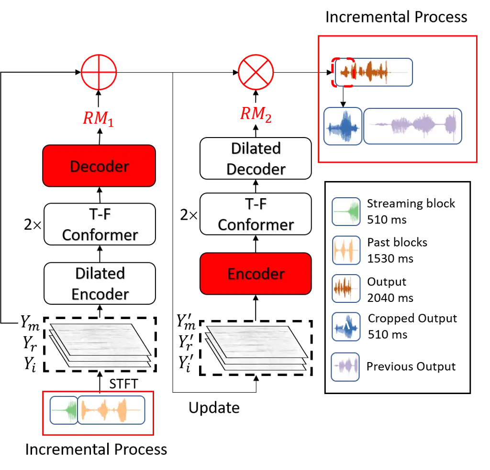
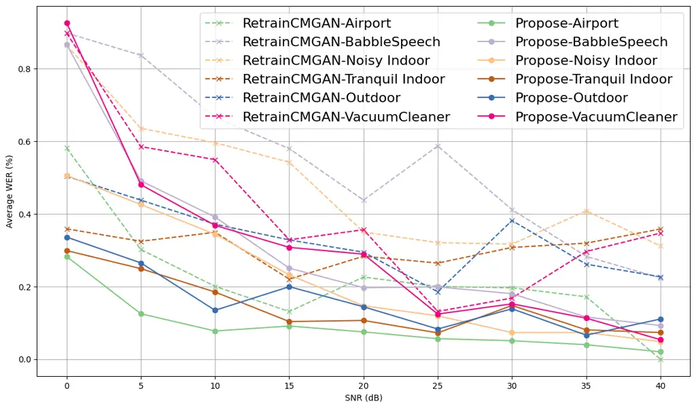

# Spectral Oversubtraction? An Approach for Speech Enhancement after Robot Ego Speech Filtering in Semi-Real-Time

Yue Li\sthanksThanks to Chinese Scholarship Council for funding    Koen
V. Hindriks Affiliation: Vrije Universiteit Amsterdam
Affiliation: Social AI Affiliation: De Boelelaan 1105 Amsterdam.   
Florian A. Kunneman Affiliation: Utrecht Universiteit
Affiliation: Languages, Literature and Communication
Affiliation: Heidelberglaan 8 Utrecht.

###### Abstract

Spectral subtraction, widely used for its simplicity, has been employed
to address the Robot Ego Speech Filtering (RESF) problem for detecting
speech contents of human interruption from robot’s single-channel
microphone recordings when it is speaking. However, this approach
suffers from oversubtraction in the fundamental frequency range (FFR),
leading to degraded speech content recognition. To address this, we
propose a Two-Mask Conformer-based Metric Generative Adversarial
Network (CMGAN) to enhance the detected speech and improve recognition
results. Our model compensates for oversubtracted FFR values with
high-frequency information and long-term features and then de-noises the
new spectrogram. In addition, we introduce an incremental processing
method that allows semi-real-time audio processing with streaming input
on a network trained on long fixed-length input. Evaluations of two
datasets, including one with unseen noise, demonstrate significant
improvements in recognition accuracy and the effectiveness of the
proposed two-mask approach and incremental processing, enhancing the
robustness of the proposed RESF pipeline in real-world HRI scenarios.

## 1 Introduction

Spectral subtraction (SS) is one of the most prevalent signal processing
methods for speech enhancement (SE), comprising the subtraction of the
estimated noise spectrum from the recorded signal spectrum \[1\]. Due to
its simplicity and effectiveness, SS has been widely adopted in various
practical applications, such as mobile communication, hearing aids, and
speech recognition systems \[2\]. In this study, we focus on the case of
robot ego speech filtering (RESF) during human-robot interaction (HRI)
based on a well-known social robot, which is most often used in HRI,
Pepper \[3\]. We intend to improve the performance in detecting and
recognizing speech contents when a human interrupts robot speech from
its embedded single-channel recordings. Such a capability, when done
right, can make HRI much more fluent, as the human can barge in as it
would do in human-human interactions and would not have to wait until
the robot starts listening with the microphone after finishing its
utterance.

Despite its widespread use, SS has notable drawbacks, in particular
spectral oversubtraction caused by excessive noise spectrum
estimation \[4\]. In dynamic and non-stationary noise environments,
accurately estimating the noise spectrum is inherently challenging,
leading to distorted enhanced speech \[5\]. The primary issue is
oversubtraction in the fundamental frequency range (FFR) when spectrally
subtracting Pepper ego speech from its single-channel recordings  \[6\],
further leading to misrecognition of words with nasal or plosive sounds
by state-of-the-art (SOTA) automatic speech recognition (ASR)
systems \[7\]. To address this, researchers have developed adaptive
noise estimation filters and spectral floor adjustments \[8\]. Kamath
and Loizou \[9\] proposed a multi-band non-linear spectral subtraction
method, using a frequency-dependent subtraction factor to account for
different types of noise. Such methods perform well in stationary noise
environments or when the signal-to-noise ratio (SNR) is not less than
10 dB \[4\]. However, they struggle in non-stationary noise conditions
where the SNR is significantly lower, a condition that is quite common
to HRI where constraints of humanoid robot design can cause SNR values
as low as -20 dB \[6\].

To correctly interpret human interruptions during HRI, an SE method is
needed that improves the intelligibility and the recognition result of
detected speech. Through sophisticated machine learning algorithms, SE
systems have advanced significantly, manifested in approaches such as
DCCRN \[10\] and FullSubNet \[11\]. Among these advanced networks,
generative adversarial networks (GAN) come with the advantages of
speed - its generator can learn to produce accurate representations in a
short time - and conservation - its discriminator maintains most of the
information from the original data distribution \[12\]. In 2017, Pascual
et al. \[13\] proposed SEGAN, one of the initial efforts to apply GAN to
speech enhancement. A new avenue for GAN-based SE research was then
initiated by Fu et al. \[14\] who proposed MetricGAN to directly
optimize the evaluation metrics for this task. Based on these
advancements, Cao et al. \[15\] proposed a Conformer-based
MetricGAN (CMGAN), achieving the highest Perceptual Evaluation of Speech
Quality (PESQ) score in the VoiceBank+DEMAND dataset \[16\] as of 2022.
Despite these advancements, the ASR results in enhanced speech have
declined rather than improved \[17\]. For example, Donahue et al. \[18\]
proposed FSEGAN and jointly trained it with an ASR system, finding that
the usefulness of GANs was limited compared to replacement of the
training object.

To the best of our knowledge, no SE system specifically targets recovery
from spectral oversubtraction distortion in the FFR and performs on
recorded streaming audio buffers to achieve semi-real-time processing.
Neither is there a dataset consisting of speech that is distorted by
spectral oversubtraction. Previous work suggests that values in the HFR
can be learned to restore the oversubtracted values in the FFR and
improve the vulnerability of detected speech to noise. Furthermore, the
success of MetricGAN, which was outside the scope of the study by
Donahue et al. \[18\], shows the potential of GAN-based SE systems to
improve the ASR result after SE.

The aim of this work is two-fold: 1. Develop and verify a
MetricGAN-based network that can learn from the information in HFR to
restore the oversubtracted values in FFR and to improve the ASR results; 2. Improve the robustness of the RESF system that is vulnerable to
common ambient noise in real world HRI \[6\]. We propose a Two-Mask
CMGAN inspired by \[15\]. We examine the impact of different inputs for
the discriminator network on the ASR results and propose a method that
allows a network trained on fixed-length audio segments to process short
audio buffers while accessing long-term information. Evaluation on
offline datasets with and without additional noise demonstrates the
effectiveness and robustness of the proposed pipeline.

## 2 Methods

### 2.1 Two-Mask CMGAN

Given that the spectrum of human speech is short-time invariant and the
restored information in the higher frequency range is the formant of the
oversubtracted information in FFR \[19\], we propose a variant of CMGAN:
Two-Mask CMGAN to improve the recognition result of detected human
interruption speech. The overview of the proposed two-mask CMGAN is
shown in Fig. 1.



Figure 1: Comparison of the original CMGAN and proposed Two-Mask CMGAN.
Components marked in red are proposed in this work and absent in the
original CMGAN.

The generator contains three parts: Encoder, Conformer, and Decoder. To
verify the hypothesis that oversubtracted values in FFR can be restored
based on HFR information, we propose to split the original one ideal
ratio mask (IRM) generation procedure into two subprocedures, explained
in Eq. 1.

```math
\hat{S}(tf)=\left(Y(tf)+IRM_{1}\right)\cdot IRM_{2} \tag{1}
```

where $`IRM_{1}`$ is the compensation ratio mask in the FFR generated
according to the information in the HFR, and $`IRM_{2}`$ is the
denoising ratio mask generated according to the compensated information
in the whole frequency range. Because oversubtraction can reduce some
values to $`0`$, which cannot be restored by multiplying the ratio mask,
we choose to first generate a compensation ratio mask and add it to the
noisy input. Instead of using the Complex Decoder as Cao et al. in the
original CMGAN \[15\], we adopt Eq. 2 to update the values in the real
and imaginary spectrograms, $`Y_{r}`$ and $`Y_{i}`$, to reduce the
complexity of the network.

```math
\begin{cases}Y^{\prime}_{r}=Y^{\prime}_{m}\cos{Y_{p}}\\
Y^{\prime}_{i}=Y^{\prime}_{m}\sin{Y_{p}}\end{cases} \tag{2}
```

In order to fairly compare the performance of the proposed network with
the original CMGAN and alleviate the influence of the number of network
parameters, we choose two Conformer modules for each mask generation,
which in total is the same as the total number of Conformer blocks in
the original CMGAN.

Due to the limited usefulness of GAN when replacing the training
object \[18\] and the better performance of complex spectrum masking
than that of magnitude spectrum masking \[20\], it is not the best
practice to use the same magnitude spectrum as input for the
discriminator or directly replace the training object from the complex
spectrum to the magnitude spectrum. Therefore, we choose to use the same
discriminator architecture as the original CMGAN. However, in order to
improve the ASR performance in enhanced speech, we make a trade-off and
replace the input of the enhanced speech spectrogram with the input of
the SOTA ASR system, Whisper¹¹ 1
https://huggingface.co/openai/whisper-large-v3, to obtain better
predictions of the values in FFR. Hence, the discriminator in the
proposed architecture aims to mimic the difference between the mel
spectrograms of the enhanced and clean speech and further uses it as a
part of the loss function.

For loss function design, we adopt the same strategy as Cao et
al. \[15\], which consists of a linear combination of the loss in the TF
domain $`\mathcal{L}_{\text{TF}}`$, the loss in the generator
$`\mathcal{L}_{\text{GAN}}`$ and the resultant waveform loss
$`\mathcal{L}_{\text{Time}}`$. Based on the work of Mao et al. \[21\],
the adversarial training follows a min-min optimization task over
discriminator loss $`\mathcal{L}_{\text{D}}`$ and generator loss
$`\mathcal{L}_{\text{GAN}}`$. While Cao et al. \[15\] use the magnitude
spectrogram as discriminator input, we opt for the mel spectrogram. The
discriminator loss is as follows:

```math
\begin{split}&\mathcal{L}_{\text{D}}=\mathbb{E}_{X_{\text{mel}},\hat{X}_{\text{mel}}}[\parallel D(X_{\text{mel}},\hat{X}_{\text{mel}})-1\parallel^{2}]\\
&\quad+\mathbb{E}_{X_{\text{mel}},\hat{X}_{\text{mel}}}[\parallel D(X_{\text{mel}},\hat{X}_{\text{mel}})-Q_{\text{PESQ}}\parallel^{2}]\end{split} \tag{3}
```

where $`D`$ is the discriminator, $`Q_{\text{PESQ}}`$ refers to the
normalized PESQ score in the range \[0,1\], $`X_{\text{mel}}`$ and
$`\hat{X}_{\text{mel}}`$ are the mel-spectrogram of the enhanced and
target speech signal with 128 bins.

### 2.2 Semi-real-time Incremental Processing

The attention mechanism was first introduced by Bahdanau et al. \[22\]
to learn the weights between the hidden spaces of different components
in a long input sequence. Its variants demonstrate its ability to
improve the performance of the encoder-decoder model in machine
translation. Kim et al. \[23\] and Cao et al. \[15\] respectively
implemented Transformer and Conformer in speech enhancement, and
achieved satisfactory results. However, the performance of these models
in real-world HRI applications is not satisfying, due to the conflict
between the requirement for real-time processing during HRI and the
fixed length of input during training. These speech enhancement models
are trained on fixed length audio input to learn the weights between the
hidden spaces, which should be long enough to carry the right
information. For example, Cao et al. used fragments of 2 seconds as
input during training \[15\], which is impractical during HRI. We
propose to address this issue by means of Incremental Processing (IP).

From the Pepper NAOqi SDK²² 2
http://doc.aldebaran.com/2-5/naoqi/audio/alaudiodevice.html, every
170 ms audio buffer recorded by its single channel microphone can be
used for local processing. We adopt 3 buffers as one block, adding up to
510 ms audio, and concatenate it with the blocks previously recorded by
Pepper to create an input with a length of 2,040 ms, similar to the
input length reported by Cao et al. \[15\]. This is done with a sliding
window, where the earliest block is removed upon each added block,
maintaining the fixed input length. The first blocks that do not have
enough previous recorded audio to add up to 2,040 ms are padded with
0-values to meet this length.

## 3 Experimental Result and Discussions

### 3.1 Data & Experimental Setup

We generated two data sets to evaluate the proposed Two-Mask CMGAN and
IP procedure.

#### 3.1.1 Training set and Evaluation Set I

As discussed in Section 1, we are not aware of any public dataset
consisting of distorted human speech, of which spectral values in FFR
are oversubtracted during speech separation or enhancement. Driven by
the goal of enhancing the application of the RESF system, we followed
the same dataset generation scheme as \[3\] and created 10,000 triplets
using the public datasets Robot Voice³³ 3 https://osf.io/v4y6h/ and
Librispeech⁴⁴ 4 https://www.openslr.org/12. The distorted detection of
human speech from the RESF pipeline was considered as Distortion Speech
and its corresponding clean human speech was taken as the Target Speech.
We randomly adopted 1,000 combinations of Distortion Speech and Target
Speech as the Evaluation Set I and the other 9,000 as the training set.

#### 3.1.2 Evaluation Set II

To assess the robustness of the combination of RESF and Two-Mask CMGAN
in HRI scenarios where a robot is typically placed in a location with
sounds in the background, we added noise fragments from the Microsoft
Scalable Noisy Speech Dataset (MS-SNSD) \[24\]. Specifically, we mixed
61 clean human speech audio files with 17 types of challenging
nonstationary noise from MS-SNSD. These can be categorized into six
groups: 1) Airport - AirportAnouncement; 2) Babble Speech - Babble,
NeighborSpeaking; 3) Noisy Indoor - Cafe, Cafeteria, Restaurant,
LivingRoom; 4) Tranquil Indoor - Copier, Kitchen, Office, Hallway,
Typing; 5) Outdoor - Park, Square, Station, Traffic; 6) Vaccuum
cleaner - VacuumCleaner. Given the provided toolkit⁵⁵ 5
https://github.com/microsoft/MS-SNSD, all noisy speech clips were scaled
to have nine global SNRs of $`{40,35,30,25,20,15,10,5,0}`$ dB each,
which gave out a 5 hour Evaluation Set II. Then we created noisy
overlapping human-robot speech following the same generation scheme as
in Section 3.1.1. Subsequently, these noisy overlapping speech segments
were cut into 510 ms blocks and fed into the RESF pipeline to obtain the
detected human interruption speech blocks. These blocks were finally
concatenated as the Distortion Speech in Evaluation Set II. Its
corresponding clean speech was taken as the Target Speech.

#### 3.1.3 Experimental Set-up

Using the training set and the two evaluation sets, we compared the
performance of our proposed Two-Mask CMGAN approach to that of the
pretrained CMGAN⁶⁶ 6 https://github.com/ruizhecao96/CMGAN and the CMGAN
retrained on our training set. We set the ASR result on the detected
human speech from RESF as the baseline to compare which method would
improve the ASR result. In addition, we tested how well both approaches
performed without IP, and how well the two-mask CMGAN performed without
the mel discriminator. During training, we randomly cut the audio files
to 2,040 ms to align with the same input length as \[15\]. To evaluate
our proposed IP , we cut the input into 510 ms blocks and fed them to
the models as described in Section 2.2. The performance of the models in
improving the interpretation of the detected human interruption speech
is evaluated by calculating the WER after applying ASR to the enhanced
sound fragment. We adopted Whisper as the ASR system to translate all
detected speech by RESF, enhanced speech by CMGAN and Two-Mask CMGAN,
and target human speech. The recognition results of the Target Speech
were taken as ground truth to alleviate the influence of the choice of
the ASR system. We report on the mean WER and standard deviations, as
well as the percentage of files whose WER is lower than 20%, which
indicates that no more than two words were misrecognized, inserted, or
replaced in a 10-word utterance. We selected this because we found that
only a single word was misidentified as a combination of two words in
most cases.

### 3.2 Results & Discussions

| Model          |           | WER % |       |       |
| -------------- | --------- | ----- | ----- | ----- |
|                |           | Mean  | STD   | \<=20 |
| Baseline       | \-        | 14.43 | 7.69  | 75.55 |
| CMGAN          | Original  | 30.34 | 28.49 | 44.86 |
|                | Retrained | 10.29 | 6.06  | 84.99 |
|                | w/o IP    | 11.35 | 10.08 | 81.99 |
| Two-Mask CMGAN | proposed  | 7.44  | 3.92  | 91.40 |
|                | w/o IP    | 12.30 | 14.14 | 78.92 |
|                | w/o mel   | 9.56  | 5.26  | 86.00 |

Table 1: Evaluation Set I results. The input is processed by the
proposed IP method if it is not specified.

In Table 1, we present the results of Evaluation Set I. It is observed
that the original CMGAN aggravates rather than improves the distortion
caused by spectral oversubtraction, increasing the average WER from
14.43% to 30.34%. The WERs of less than half of the files are greater
than 20%. Comparing the results of the retrained CMGAN and w/o mel, we
find that the mask generation strategy of the proposed two-mask performs
better than that of the single-mask. The adoption of the mel spectrogram
as input to the discriminator improves the performance from 9.56% to
7.44%. In addition, if only the audio blocks are directly processed (w/o
IP), the performance can be as poor as 12.30%, while the proposed IP
method for streaming blocks can improve the performance by 39.51%.

The performance on Evaluation set II for different SNRs is presented in
Fig. 2. We find that the proposed method performed particularly well
when Airport, Tranquil Indoor and Outdoor groups are mixed in. The
average WER is reduced to less than 20% when the SNR is no less than
10 dB. In more challenging scenarios, such as Babble Speech and Noisy
Indoor, it can still improve the WER to less than 20% when the SNR is no
less than 20 dB. The reason why it performs relatively poorly in these
scenarios is that the HRF values of competitive speakers and noises are
non-stationary and high. The enhancement process will generate
relatively more artifacts according to these and will further result in
poor recognition. In comparison, the spectrogram of other noise groups
has more features in FFR, which is subtracted during the interruption
detection by RESF. Especially when there are no competitive speakers or
sharp noises present during human interruption, the proposed work can
enhance the detected interruption and reduce misrecognized words to a
reasonable ratio.



Figure 2: Evaluation result on Evaluation Set II.

## 4 Conclusion

In this work, we propose a Two-Mask CMGAN network that targets the
enhancement of the detected human interruption during robot speech,
which suffers from spectral oversubtraction in FFR. We also propose an
IP method that allows networks trained on long fixed-length input to
process streaming audio blocks. Evaluations of two datasets, including
one with unseen noise, demonstrate significant recognition improvements.
The combination of Two-Mask CMGAN and IP is verified to improve the
robustness of the RESF pipeline. In conclusion, the combination of RESF
and the proposed Two-Mask CMGAN with IP shows potential for deployment
in a real-world HRI setting, enabling the robot to keep its
single-channel microphone open even when it is speaking. In future work,
we will deploy the network in the humanoid robot Pepper and test its
effectiveness in such real-world HRI scenarios.

## References

- \[1\] K. Paliwal, K. Wójcicki, and B. Schwerin, “Single-channel speech
  enhancement using spectral subtraction in the short-time modulation
  domain,” _Speech communication_, 2010.
- \[2\] N. Das, S. Chakraborty, J. Chaki, N. Padhy, and N. Dey,
  “Fundamentals, present and future perspectives of speech enhancement,”
  _International Journal of Speech Technology_, vol. 24, no. 4, pp.
  883–901, 2021.
- \[3\] Y. Li, K. Hindriks, and F. Kunneman, “Single-channel robot
  ego-speech filtering during human-robot interaction,” in _Proceedings
  of the 2024 International Symposium on Technological Advances in
  Human-Robot Interaction_, ser. TAHRI 2024. ACM, 2024.
- \[4\] N. Upadhyay and A. Karmakar, “Speech enhancement using spectral
  subtraction-type algorithms: A comparison and simulation study,”
  _Procedia Computer Science_, vol. 54, pp. 574–584, 2015.
- \[5\] T. F. Kleinschmidt, “Robust speech recognition using speech
  enhancement,” Ph.D. dissertation, Queensland University of
  Technology, 2010.
- \[6\] Y. Li, F. A. Kunneman, and K. V. Hindriks, “A near-real-time
  processing ego speech filtering pipeline designed for speech
  interruption during human-robot interaction,” _arXiv preprint
  arXiv:2405.13477_, 2024.
- \[7\] G. Parikh and P. C. Loizou, “The influence of noise on vowel and
  consonant cues,” _The Journal of the Acoustical Society of
  America_, 2005.
- \[8\] A. Chaudhari and S. Dhonde, “A review on speech enhancement
  techniques,” in _2015 International Conference on Pervasive Computing
  (ICPC)_. IEEE, 2015, pp. 1–3.
- \[9\] S. Kamath, P. Loizou _et al._, “A multi-band spectral
  subtraction method for enhancing speech corrupted by colored noise.”
  in _ICASSP_, vol. 4. Citeseer, 2002, pp. 44 164–44 164.
- \[10\] Y. Hu, Y. Liu, S. Lv, M. Xing, S. Zhang, Y. Fu, J. Wu,
  B. Zhang, and L. Xie, “Dccrn: Deep complex convolution recurrent
  network for phase-aware speech enhancement,” _arXiv preprint
  arXiv:2008.00264_, 2020.
- \[11\] X. Hao, X. Su, R. Horaud, and X. Li, “Fullsubnet: A full-band
  and sub-band fusion model for real-time single-channel speech
  enhancement,” in _ICASSP 2021-2021 IEEE International Conference on
  Acoustics, Speech and Signal Processing (ICASSP)_. IEEE, 2021, pp.
  6633–6637.
- \[12\] A. Wali, Z. Alamgir, S. Karim, A. Fawaz, M. B. Ali, M. Adan,
  and M. Mujtaba, “Generative adversarial networks for speech
  processing: A review,” _Computer Speech & Language_, vol. 72, p.
  101308, 2022.
- \[13\] S. Pascual, A. Bonafonte, and J. Serra, “Segan: Speech
  enhancement generative adversarial network,” _arXiv preprint
  arXiv:1703.09452_, 2017.
- \[14\] S.-W. Fu, C.-F. Liao, Y. Tsao, and S.-D. Lin, “Metricgan:
  Generative adversarial networks based black-box metric scores
  optimization for speech enhancement,” in _International Conference on
  Machine Learning_. PMLR, 2019, pp. 2031–2041.
- \[15\] R. Cao, S. Abdulatif, and B. Yang, “Cmgan: Conformer-based
  metric gan for speech enhancement,” _arXiv preprint
  arXiv:2203.15149_, 2022.
- \[16\] J. Thiemann, N. Ito, and E. Vincent, “The diverse environments
  multi-channel acoustic noise database (demand): A database of
  multichannel environmental noise recordings,” in _Proceedings of
  Meetings on Acoustics_, vol. 19, no. 1. AIP Publishing, 2013.
- \[17\] N. C. Ristea, A. Saabas, R. Cutler, B. Naderi, S. Braun, and
  S. Branets, “Icassp 2024 speech signal improvement challenge,” _arXiv
  preprint arXiv:2401.14444_, 2024.
- \[18\] C. Donahue, B. Li, and R. Prabhavalkar, “Exploring speech
  enhancement with generative adversarial networks for robust speech
  recognition,” in _2018 IEEE International Conference on Acoustics,
  Speech and Signal Processing (ICASSP)_, 2018, pp. 5024–5028.
- \[19\] I. R. Titze and D. W. Martin, “Principles of voice
  production,” 1998.
- \[20\] S. Abdulatif, R. Cao, and B. Yang, “Cmgan: Conformer-based
  metric-gan for monaural speech enhancement,” _IEEE/ACM Transactions on
  Audio, Speech, and Language Processing_, 2024.
- \[21\] X. Mao, Q. Li, H. Xie, R. Y. Lau, Z. Wang, and S. Paul Smolley,
  “Least squares generative adversarial networks,” in _Proceedings of
  the IEEE International Conference on Computer Vision (ICCV)_,
  Oct 2017.
- \[22\] D. Bahdanau, K. Cho, and Y. Bengio, “Neural machine translation
  by jointly learning to align and translate,” _arXiv preprint
  arXiv:1409.0473_, 2014.
- \[23\] J. Kim, M. El-Khamy, and J. Lee, “T-gsa: Transformer with
  gaussian-weighted self-attention for speech enhancement,” in _ICASSP
  2020-2020 IEEE International Conference on Acoustics, Speech and
  Signal Processing (ICASSP)_. IEEE, 2020, pp. 6649–6653.
- \[24\] C. K. Reddy, E. Beyrami, J. Pool, R. Cutler, S. Srinivasan, and
  J. Gehrke, “A scalable noisy speech dataset and online subjective test
  framework,” _Proc. Interspeech 2019_, pp. 1816–1820, 2019.
