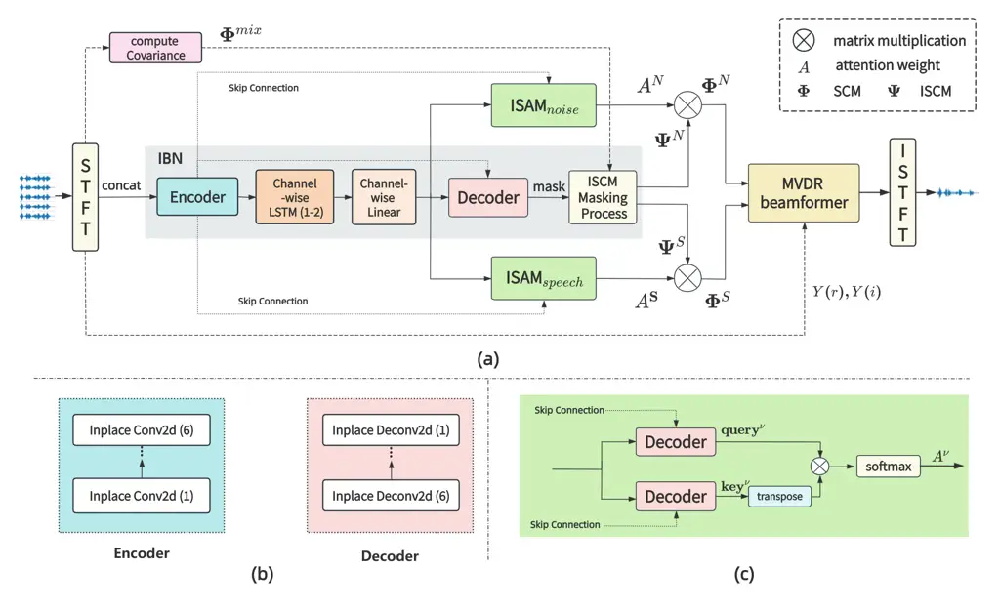

# Attention-Based Beamformer For Multi-Channel Speech Enhancement

Jinglin Bai Affiliation: College of Computer Science, Inner Mongolia
University, Hohhot, China Email: <bjlin@mail.imu.edu.cn>    Hao Li
Affiliation: Department of Electrical and Electronic EngineeringSouthern
University of Science and Technology, Shenzhen, China
Email: <lih9@sustech.edu.cn>    Xueliang Zhang Affiliation: College of
Computer Science, Inner Mongolia University, Hohhot, China
Email: <cszxl@imu.edu.cn>    Fei Chen Affiliation: Department of
Electrical and Electronic EngineeringSouthern University of Science and
Technology, Shenzhen, China Email: <fchen@sustech.edu.cn>

###### Abstract

Minimum Variance Distortionless Response (MVDR) is a classical adaptive
beamformer that theoretically ensures the distortionless transmission of
signals in the target direction, which makes it popular in real
applications. Its noise reduction performance actually depends on the
accuracy of the noise and speech spatial covariance matrices (SCMs)
estimation. Time-frequency masks are often used to compute these SCMs.
However, most mask-based beamforming methods typically assume that the
sources are stationary, ignoring the case of moving sources, which leads
to performance degradation. In this paper, we propose an attention-based
mechanism to calculate the speech and noise SCMs and then apply MVDR to
obtain the enhanced speech. To fully incorporate spatial information,
the inplace convolution operator and frequency-independent LSTM are
applied to facilitate SCMs estimation. The model is optimized in an
end-to-end manner. Experiments demonstrate that the proposed method
outperforms baselines with reduced computation and fewer parameters
under various conditions.

###### Index Terms: 

MVDR, attention-based mechanism, multi-channel speech enhancement,
inplace convolution

⁰⁰footnotetext: \* These authors contributed equally to this work.

## I Introduction

For microphone array signal processing \[\[1\], \[2\]\], most speech
enhancement methods are based on fixed and adaptive beamformer
techniques \[\[3\], \[4\]\], leveraging the spatial characteristics of
multi-channel data. Minimum variance distortionless response (MVDR)
\[\[4\]\] uses spatial information to calculate beamforming
coefficients, ensuring that signals from the desired direction are
transmitted without distortion.

Recent advancements in mask-based beamforming approaches \[\[5\], \[6\],
\[7\], \[8\]\] have attracted increased attention. The mask-based
beamformer utilizes time-frequency masks derived from neural networks
\[\[5\], \[6\]\] or other models \[\[7\], \[8\]\] to compute the spatial
covariance matrices (SCMs), which capture the spatial information of the
sources. These techniques are adaptable to different scenarios. When the
sources remain stationary, SCMs are typically computed through temporal
averaging. In scenarios involving moving sources, a dynamic approach is
often employed to adapt to real-time variations, such as online \[\[7\],
\[9\]\] or blockwise processing \[8\]. However, the dynamic adaptation
faces the critical challenge of selecting an appropriate forgetting
factor for online processing or determining the optimal block size for
blockwise processing.

ATT-MVDR \[10\] proposes a two-stage approach to address the problem.
Initially, a neural network estimates the mask with the fifth channel as
the target. Subsequently, two Transformer \[11\] encoders estimate the
attention weights for the speech and noise instantaneous SCMs (ISCMs)
\[10\] estimated by mask, respectively. However, ATT-MVDR is trained in
two separate stages, which causes that the prediction of previous stage
may include errors, such as information loss. These errors are then
propagated to the second stage, leading to the accumulation of errors.
Moreover, the traditional beamforming shows that the spatial information
exists in each frequency bin of the array signal spectrum \[12\].
Wideband beamforming is also independently processed in each frequency
bin. During the estimation of attention weights by Transformer encoders,
the frequency dimension is reduced or amplified through the linear
layer, complicating the learning process of spatial information.
Additionally, Transformer encoders have large parameters and high
computational cost.

Recently, the Inplace Gated Convolutional Recurrent Neural Network
(IGCRN) \[13\] is proposed to learn spatial information across channels
by discarding the down-sampling operation in the frequency dimension
from the Convolutional Recurrent Network (CRN) \[14\]\[15\]. Due to the
inplace characteristic of IGCRN, the spatial cues are explicitly
maintained within each frequency bin. In addition, the LSTM layer is
designed to capture temporal correlations across channels for each
frequency bin, referred to as the frequency-independent LSTM. The IGCRN
has been successfully applied to mono acoustic echo cancellation
(AEC)\[16\], and stereo AEC\[17\].



Fig. 1: (a) An overview of ABIC-MVDR. (b) Structure of encoder and
decoder. (c) Inplace self-attention module (ISAM).

In this paper, we propose a novel attention-based approach combined with
the IGCRN and beamformer for multi-channel speech enhancement, referred
to as ABIC-MVDR. The inplace convolution operator and two-layer
frequency-independent LSTM are employed to learn spatial information
efficiently. To better adapt to different scenarios, ABIC-MVDR utilizes
the two decoder outputs of IGCRN to estimate temporal attention weights
for the SCMs reconstruction, similar to the self-attention mechanism. By
optimizing the model in an end-to-end manner, the accumulation of errors
due to multiple stages can be avoided. The main contributions of the
proposed method are as follows:

1.  1.  The proposed attention-based beamformer precisely enhances the
        target, especially in dynamic scenarios.
2.  2.  The IGCRN has been demonstrated to facilitate SCM estimation,
        enabling compatibility with beamforming.
3.  3.  Our method achieves better performance than baselines, with lower
        computational costs and fewer parameters.

## II Methodology

### II-A Problem definition

$`S^{m}_{t,f}`$ and $`N^{m}_{t,f}`$ denote the clean speech and
background noise received by microphone $`m`$ , respectively. Let $`t`$
and $`f`$ represent the time frame index and frequency bin index,
respectively. The received signal $`Y^{m}_{t,f}`$ can be modeled as:

```math
\displaystyle Y^{m}_{t,f} \displaystyle=S^{m}_{t,f}+N^{m}_{t,f} \tag{1}
```

```math
\displaystyle=H^{m}_{t,f}S_{t,f}+N^{m}_{t,f}\;,
```

where $`H^{m}_{t,f}`$ indicates the acoustic impulse response from the
target speaker to the $`m`$-th microphone.

### II-B An overview of ABIC-MVDR

ABIC-MVDR comprises three primary components: the IGCRN backbone network
(IBN), the Inplace self-attention module (ISAM), and the MVDR
beamformer. As shown in Fig. 1 (a), the signal collected by multiple
microphones is processed through Short-Time Fourier Transform (STFT).
The real and imaginary parts are concatenated with the channel dimension
and then fed into the encoder. The IBN is adopted to predict masks for
the speech and noise ISCMs. Two ISAMs are then utilized to allocate
weights over time for the speech and noise SCMs reconstruction. Finally,
the MVDR beamformer is applied to reconstruct the target speech.

Our proposed method comprises one encoder and five decoders. Two
decoders are responsible for building the self-attention mechanism in
the speech ISAM, while another two are used for building the
self-attention mechanism in the noise ISAM. The remaining decoder is
dedicated to mask prediction, which is utilized to construct the ISCM.

### II-C IGCRN backbone network (IBN)

The encoder and decoder are shown in Fig. 1 (b). Inplace convolution
refers to a convolutional neural network where the stride of the kernel
is set to one, ensuring that features are not downsampled in the
frequency dimension. This approach naturally and explicitly preserves
spatial correlations within each frequency bin. Skip connections are
used to concatenate the output of each Inplace Conv2d layer to the input
of the corresponding Inplace Deconv2d layer. Following each Inplace
Conv2d and Inplace Deconv2d layer, a batch normalization\[18\] and an
exponential linear unit (ELU) activation function are sequentially
applied. A two-layer LSTM is utilized to model the temporal
characteristics of each frequency bin across channels. Since the time
delay for a specific direction is consistent across different frequency
bins, they share the same LSTM units. Following this, a channel-wise
linear layer is implemented to ensure that the output shape of the LSTM
matches the input.

### II-D Inplace Self-Attention Module (ISAM)

Unlike the transformer encoder architecture used in \[10\], we estimate
attention weights for the ISCM through a transposed matrix
multiplication between the outputs from two IGCRN decoders in ISAM. In
Fig. 1 (a), two ISAMs are utilized to allocate weights over time for
reconstructing the speech SCM $`\Phi^{S}_{t,f}`$ and the noise SCM
$`\Phi^{N}_{t,f}`$, respectively. As shown in Fig. 1 (c), the two
decoders in ISAM*(speech) or ISAM*(noise) predict the
$`\mathbf{query^{\nu}}`$ and $`\mathbf{key^{\nu}}`$ vectors,
respectively. $`\nu\in\{S,N\}`$ are the indexs for speech and noise,
respectively. The decoder structure in ISAM is similar to that described
in II-C. And the $`\tanh`$ activation function is employed in the final
layer.

After obtaining
$`\mathbf{query^{\nu}}\in\mathbb{R}^{F\times T\times D}`$ and
$`\mathbf{key^{\nu}}\in\mathbb{R}^{F\times T\times D}`$, the attention
weights $`\mathbf{A}^{\nu}\in\mathbb{R}^{F\times T\times T}`$ are
calculated by (2), where the softmax is applied on the second $`T`$
dimension. $`T`$ and $`F`$ represent the time frame index and frequency
bin index, respectively, and $`D`$ represents the feature dimension.

```math
\mathbf{A}^{\nu}=\text{softmax}\left(\text{MASK}\left(\frac{\mathbf{query^{\nu}}(\mathbf{key^{\nu}})^{T}}{\sqrt{D}}\right)\right)\;. \tag{2}
```

The MASK is a lower triangular matrix to ensure the self-attention
mechanism is causal, as in (3). Here, $`f\in\{0,1,\dots,F-1\}`$, and
$`i,j\in\{0,1,\dots,T-1\}`$. If the model is operating under non-causal
conditions, the MASK should be omitted.

```math
\text{MASK}(x(f,i,j))=\begin{cases}x(f,i,j),&\text{if }i\geq j\\
-\infty,&\text{otherwise}\end{cases}\;. \tag{3}
```

The SCM $`\boldsymbol{\Phi}^{\nu}_{t,f}\in\mathbb{C}^{M\times M}`$ with
$`M`$ channels at time-frequency bin $`(t,f)`$ is calculated as:

```math
\boldsymbol{\Phi}^{\nu}_{t,f}=\mathbf{A}^{\nu}\mathbf{\Psi}^{\nu}_{t,f}\text{,} \tag{4}
```

where the $`\mathbf{\Psi}^{\nu}_{t,f}\in\mathbb{C}^{M\times M}`$ refers
to the estimated ISCM obtained after the ISCM Masking Process and
$`\mathbf{A}^{\nu}`$ represents attention weights for ISCM
$`\mathbf{\Psi}^{\nu}_{t,f}`$, as calculated in (2).

### II-E Minimum Variance Distortionless Response Beamformer

In this paper, the beamforming filter coefficients
$`\mathbf{w}_{t,f}\in\mathbb{C}^{M}`$ \[19\] are calculated using MVDR,
as shown in (5). The
$`\boldsymbol{\Phi}^{S}_{t,f}\in\mathbb{C}^{M\times M}`$ and
$`\boldsymbol{\Phi}^{N}_{t,f}\in\mathbb{C}^{M\times M}`$ are the
estimated SCMs of the speech and noise signals with $`M`$ channels at
time-frequency bin $`(t,f)`$, respectively. The
$`\mathbf{u}\in\mathbb{C}^{M}`$ represents the index of the reference
microphone.

```math
\begin{split}\mathbf{w}_{t,f}=\frac{(\boldsymbol{\Phi}^{N}_{t,f})^{-1}\boldsymbol{\Phi}^{S}_{t,f}}{\mathrm{Tr}((\boldsymbol{\Phi}^{N}_{t,f})^{-1}\boldsymbol{\Phi}^{S}_{t,f})}\mathbf{u}.\end{split} \tag{5}
```

The enhanced speech $`\hat{\mathbf{S}}_{t,f}`$ is calculated through the
observed signal $`\mathbf{Y}_{t,f}`$, as shown in (6). And
$`(\cdot)^{H}`$ represents the conjugate transpose.

```math
\begin{split}\hat{\mathbf{S}}_{t,f}=\mathbf{w}^{H}_{t,f}\mathbf{Y}_{t,f}.\end{split} \tag{6}
```

## III Experiments

### III-A Dataset and setting

We generate the scenario of moving speakers in noisy conditions for
training and testing. The speech signals are acquired from the WSJ0
corpus\[20\], while the noise signals are obtained from the CHiME-3
corpus\[21\]. We design the experimental scenario to match that of
\[10\], with the only difference being that speech and noise signals are
randomly paired at different signal-to-noise ratios (SNRs) ranging from
-10 dB to 10 dB. After statistical analysis of the generated moving
source signals, the minimum, maximum, and average source velocities
$`[m/s]`$ (moving distance $`[m]`$/utterance duration $`[s]`$) are
$`0.012\ m/s`$, $`2.404\ m/s`$, and $`0.238\ m/s`$, respectively. We
also create a non-moving dataset to evaluate scenarios with
fixed-position speakers. Its configuration is identical to that of the
moving dataset, except that the source speaker’s position is fixed at
the starting location. Through the above approach, we produce 30,000
noisy speech samples for the training set and 2,000 for the development
and evaluation sets in both the non-moving and moving datasets,
respectively.

### III-B Model configuration

The sampling frequency is configured to 16 kHz. Frame windowing is
performed with a length of 320 samples and a stride of 160 samples. The
Adam optimizer \[22\] is applied during training, with a learning rate
of $`1\times 10^{-3}`$. The batch size is set to 8. The first channel is
used as a reference. The model trains for 100 epochs guided by the SNR
loss function \[23\]. As shown in Table I, the size of each Inplace
Conv2d and Inplace Deconv2d layer is specified in the \[B, C, F ,T\]
format which is short for \[Batchsize, Channels, Frequencies, Time\].
The hyperparameters setting is given in the (kernelsize, strides,
outchannels) format for convolution, and (hidden_layer_size) for
channel-wise LSTM and Linear layers.

|                                         |                         |                          |                         |
| --------------------------------------- | ----------------------- | ------------------------ | ----------------------- |
| Layer name                              | Input size              | Hyperparameters          | Output size             |
| Inplace Conv2d (1)                      | \[B, 10, F, T\]         | 5$`\times`$1, (1, 1), 24 | \[B, 24, F, T\]         |
| Inplace Conv2d (2-6)                    | \[B, 24, F, T\]         | 5$`\times`$1, (1, 1), 24 | \[B, 24, F, T\]         |
| Reshape                                 | \[B, 24, F, T\]         | \-                       | \[B$`\times`$F, T, 24\] |
| Channel-wise LSTM$`\times`$2            | \[B$`\times`$F, T, 24\] | 48                       | \[B$`\times`$F, T, 48\] |
| Channel-wise Linear                     | \[B$`\times`$F, T, 48\] | 24                       | \[B$`\times`$F, T, 24\] |
| Reshape                                 | \[B$`\times`$F, T, 24\] | \-                       | \[B, 24, F, T\]         |
| Inplace Deconv2d (6-2) $`\times`$5      | \[B, 48, F, T\]         | 5$`\times`$1, (1, 1), 24 | \[B, 24, F, T\]         |
| Inplace Deconv2d (1) (IBN)              | \[B, 48, F, T\]         | 5$`\times`$1, (1, 1), 24 | \[B, 1, F, T\]          |
| Inplace Deconv2d (1) $`\times`$4 (ISAM) | \[B, 48, F, T\]         | 5$`\times`$1, (1, 1), 24 | \[B, 24, F, T\]         |

TABLE I: The proposed ABIC-MVDR architecture.

|            |               |                    |                    |                   |                     |                    |                     |                   |                    |                   |                     |                    |                     |     |
| ---------- | ------------- | ------------------ | ------------------ | ----------------- | ------------------- | ------------------ | ------------------- | ----------------- | ------------------ | ----------------- | ------------------- | ------------------ | ------------------- | --- |
| Model      |               | Non-Moving Dataset |                    |                   |                     |                    |                     | Moving Dataset    |                    |                   |                     |                    |                     |     |
|            |               | STOI $`\uparrow`$  | ESTOI $`\uparrow`$ | PESQ $`\uparrow`$ | SI-SDR $`\uparrow`$ | WER $`\downarrow`$ | TSOS $`\downarrow`$ | STOI $`\uparrow`$ | ESTOI $`\uparrow`$ | PESQ $`\uparrow`$ | SI-SDR $`\uparrow`$ | WER $`\downarrow`$ | TSOS $`\downarrow`$ |     |
| Noisy      |               | 75.39              | 55.03              | 2.12              | 2.18                | 41.87              | -                   | 74.93             | 54.71              | 2.12              | 2.09                | 45.94              | -                   |     |
| Non-causal | F-Conv-TasNet | 84.18              | 69.74              | 2.46              | 10.12               | 49.46              | 21.74               | 83.99             | 69.35              | 2.48              | 10.05               | 50.63              | 19.63               |     |
|            | ATT-MVDR      | 87.75              | 73.69              | 2.69              | 10.49               | 30.43              | 0.86                | 85.47             | 70.57              | 2.63              | 9.78                | 38.01              | 0.44                |     |
|            | ABIC-MVDR     | 92.41              | 81.62              | 3.05              | 12.69               | 18.63              | 0.52                | 91.49             | 79.98              | 3.03              | 12.47               | 22.02              | 0.76                |     |
| Causal     | F-Conv-TasNet | 83.09              | 68.03              | 2.41              | 9.69                | 50.20              | 17.12               | 82.66             | 67.49              | 2.42              | 9.66                | 52.98              | 17.58               |     |
|            | ATT-MVDR      | 86.3               | 71.19              | 2.58              | 9.03                | 32.37              | 0.49                | 83.8              | 67.75              | 2.52              | 8.57                | 40.38              | 0.51                |     |
|            | ABIC-MVDR     | 91.88              | 80.62              | 2.99              | 11.22               | 19.82              | 0.42                | 90.46             | 77.99              | 2.92              | 11.54               | 28.17              | 0.43                |     |

TABLE II: STOI\[%\], ESTOI\[%\], PESQ, SI-SDR, WER\[%\] and TSOS\[%\]
for Non-Moving and Moving Datasets.

## IV Experiment results and analysis

### IV-A Experimental results

In this paper, the ATT-MVDR \[10\] is employed as the baseline. The
output of the first stage in ATT-MVDR is referred to as F-Conv-TasNet
\[24\], which a single-channel model used to estimate the target speech
mask, as described in Section I. Table II compares our method with
baselines across six metrics under different combinations of conditions
(moving or non-moving and causal or non-causal). The causal model uses
only past time frames to enable real-time applications, while the
non-causal model uses both past and future time frames for better
accuracy, as implemented in Section II-D. Six objective metrics are
employed: short-time objective intelligibility (STOI) \[25\], extended
short-time objective intelligibility (ESTOI) \[26\], perceptual
evaluation of speech quality (PESQ) \[27\], scale-invariant
signal-to-distortion ratio (SI-SDR) \[23\], word error rate (WER), and
target speaker over-suppression (TSOS)\[28\]. To evaluate the degree of
speech distortion, WER and TSOS are employed as key metrics, with lower
values indicating less distortion. WER is computed using the Whisper
model with its base size¹¹ 1 https://github.com/openai/whisper. Table IV
shows the parameters and Multiply-Accumulate Operations (MACs) for each
model, where the MACs are calculated for 1 second audio.

F-conv-tasnet estimates the time-frequency mask using a neural network,
and its WER and TSOS are significantly higher than that of models using
MVDR, such as ABIC-MVDR and ATT-MVDR, which shows that one of the
advantages of MVDR is that it reduces speech distortion. As shown in
Table II and Table IV, the second stage in ATT-MVDR has limited
improvement over the first stage, but consumes numerous parameters and
computing resources. As discussed in Section I, one explanation is the
accumulation of errors across the two stages and the lack of
consideration for frequency band independence when calculating attention
weights. Our proposed method outperforms baselines across most metrics
under different conditions. ABIC-MVDR has only 0.35 million trainable
parameters, which is 108 times fewer than ATT-MVDR, and requires 4.04
G/s MACs, approximately 1.68 times fewer. This demonstrates that our
proposed attention-based beamformer leveraging IGCRN is more efficient
in learning spatial information and calculating attention weights for
SCM reconstruction compared to ATT-MVDR.

### IV-B Ablation experiments

We conduct 3 ablation experiments to verify the effectiveness of each
module:

1.  1.  ONLINE-MVDR / BLOCK-MVDR: To validate the facilitation of the ISAM
        module, this ablation experiment calculates the SCM using online
        processing \[\[7\], \[9\]\] (ONLINE-MVDR) and blockwise processing
        \[8\] (BLOCK-MVDR) based on the ISCM. The forgetting factor is set
        to 0.995 in ONLINE-MVDR and the block size is set to 30 in
        BLOCK-MVDR.
2.  2.  CRN-MVDR: The IGCRN module in the proposed method is replaced by the
        CRN\[29\] to verify the performance of the IGCRN.

|            |             |                   |                    |                   |                     |                    |                     |
| ---------- | ----------- | ----------------- | ------------------ | ----------------- | ------------------- | ------------------ | ------------------- |
| model      |             | STOI $`\uparrow`$ | ESTOI $`\uparrow`$ | PESQ $`\uparrow`$ | SI-SDR $`\uparrow`$ | WER $`\downarrow`$ | TSOS $`\downarrow`$ |
| Noisy      |             | 74.93             | 54.71              | 2.12              | 2.09                | 45.94              | \-                  |
| non-causal | CRN-MVDR    | 90.15             | 77.82              | 2.91              | 11.89               | 26.60              | 0.62                |
|            | ABIC-MVDR   | 91.49             | 79.98              | 3.03              | 12.47               | 22.02              | 0.76                |
| causal     | ONLINE-MVDR | 82.17             | 64.12              | 2.37              | 2.12                | 43.75              | 4.63                |
|            | BLOCK-MVDR  | 82.36             | 63.39              | 2.33              | 3.97                | 42.77              | 1.72                |
|            | CRN-MVDR    | 89.90             | 77.20              | 2.84              | 11.28               | 26.89              | 1.00                |
|            | ABIC-MVDR   | 90.46             | 77.99              | 2.92              | 11.54               | 28.17              | 0.43                |

TABLE III: Ablation experiments of ABIC-MVDR on moving datasets.

Table III shows the results of the ablation experiments on moving
datasets. Compared to ONLINE-MVDR and BLOCK-MVDR, the proposed model
demonstrates superior performance. This suggests that the inclusion of
the ISAM module enhances the capability of SCM reconstruction, allowing
it to allocate weights more accurately over time compared to online or
blockwise processing in scenarios with moving sources. From Table III
and IV, it can be seen that the proposed method outperforms CRN-MVDR on
most metrics, with reduced computation and fewer parameters. This proves
that spatial information is effectively extracted through IGCRN for
reconstructing SCMs, making it compatible with beamformer.

| Method        | Parameters (M) | MACs (G/s) |
| ------------- | -------------- | ---------- |
| F-conv-Tasnet | 8.81           | 2.43       |
| ATT-MVDR      | 37.99          | 6.77       |
| CRN-MVDR      | 19.82          | 6.04       |
| ABIC-MVDR     | 0.35           | 4.04       |

TABLE IV: Comparison of Model Parameters and MACs

## V Conclusion

This paper proposes a novel attention-based beamformer combining IGCRN
for multi-channel speech enhancement. The IGCRN leverages the
characteristics of the inplace convolution operator and
frequency-independent LSTM to learn spatial information. The attention
mechanism is applied to allocate temporal weights for reconstructing the
speech and noise SCMs accurately. The MVDR beamformer reduces speech
distortion. Experimental results indicate that the proposed method
surpasses the baselines across various conditions, with reduced
computational complexity and fewer parameters.

## References

- \[1\] J. Benesty, J. Chen, and Y. Huang, _Microphone Array Signal
  Processing_. Berlin, Germany: Springer, 2008.
- \[2\] M. Brandstein and D. Ward, Eds., _Microphone Arrays: Signal
  Processing Techniques and Applications_. Berlin, Germany:
  Springer, 2001.
- \[3\] J. Benesty and J. Chen, _Study and Design of Differential
  Microphone Arrays_. New York, NY, USA: Springer, 2013.
- \[4\] B. D. Van Veen and K. M. Buckley, “Beamforming: A versatile
  approach to spatial filtering,” _IEEE assp magazine_, vol. 5, no. 2,
  pp. 4–24, 1988.
- \[5\] J. Heymann, L. Drude, and R. Haeb-Umbach, “Neural network based
  spectral mask estimation for acoustic beamforming,” in _2016 IEEE
  International Conference on Acoustics, Speech and Signal Processing
  (ICASSP)_. IEEE, 2016, pp. 196–200.
- \[6\] H. Erdogan, J. R. Hershey, S. Watanabe, M. I. Mandel, and
  J. Le Roux, “Improved mvdr beamforming using single-channel mask
  prediction networks.” in _Interspeech_, 2016, pp. 1981–1985.
- \[7\] T. Higuchi, N. Ito, T. Yoshioka, and T. Nakatani, “Robust mvdr
  beamforming using time-frequency masks for online/offline asr in
  noise,” in _2016 IEEE International Conference on Acoustics, Speech
  and Signal Processing (ICASSP)_. IEEE, 2016, pp. 5210–5214.
- \[8\] Y. Kubo, T. Nakatani, M. Delcroix, K. Kinoshita, and S. Araki,
  “Mask-based mvdr beamformer for noisy multisource environments:
  Introduction of time-varying spatial covariance model,” in _ICASSP
  2019-2019 IEEE International Conference on Acoustics, Speech and
  Signal Processing (ICASSP)_. IEEE, 2019, pp. 6855–6859.
- \[9\] M. Togami, “Simultaneous optimization of forgetting factor and
  time-frequency mask for block online multi-channel speech
  enhancement,” in _ICASSP 2019 - 2019 IEEE International Conference on
  Acoustics, Speech and Signal Processing (ICASSP)_, 2019, pp.
  2702–2706.
- \[10\] T. Ochiai, M. Delcroix, T. Nakatani, and S. Araki, “Mask-based
  neural beamforming for moving speakers with self-attention-based
  tracking,” _IEEE/ACM Transactions on Audio, Speech, and Language
  Processing_, vol. 31, pp. 835–848, 2023.
- \[11\] A. Vaswani, N. Shazeer, N. Parmar, J. Uszkoreit, L. Jones,
  A. N. Gomez, . Kaiser, and I. Polosukhin, “Attention is all you need,”
  in _Proceedings of the 31st International Conference on Neural
  Information Processing Systems_, Long Beach, USA, 2017, pp. 6000–6010.
- \[12\] W. Liu and S. Weiss, _Wideband Beamforming: Concepts and
  Techniques_. Hoboken, NJ, USA: Wiley, 2010.
- \[13\] J. Liu and X. Zhang, “Inplace gated convolutional recurrent
  neural network for dual-channel speech enhancement,” in _Interspeech
  2021, 22nd Annual Conference of the International Speech Communication
  Association, Brno, Czechia, 30 August - 3 September 2021_,
  H. Hermansky, H. Cernocký, L. Burget, L. Lamel, O. Scharenborg, and
  P. Motlícek, Eds. ISCA, 2021, pp. 1852–1856. \[Online\]. Available:
  https://doi.org/10.21437/Interspeech.2021-899
- \[14\] K. Tan, X. Zhang, and D. Wang, “Real-time speech enhancement
  using an efficient convolutional recurrent network for dual-microphone
  mobile phones in close-talk scenarios,” in _ICASSP 2019-2019 IEEE
  International Conference on Acoustics, Speech and Signal Processing
  (ICASSP)_. IEEE, 2019, pp. 5751–5755.
- \[15\] K. Tan and D. Wang, “Learning complex spectral mapping with
  gated convolutional recurrent networks for monaural speech
  enhancement,” _IEEE/ACM Transactions on Audio, Speech, and Language
  Processing_, vol. 28, pp. 380–390, 2019.
- \[16\] C. Zhang, J. Liu, and X. Zhang, “A complex spectral mapping
  with inplace convolution recurrent neural networks for acoustic echo
  cancellation,” in _ICASSP 2022-2022 IEEE International Conference on
  Acoustics, Speech and Signal Processing (ICASSP)_. IEEE, 2022, pp.
  751–755.
- \[17\] C. Zhang, J. Liu, and X. Zhang, “Lcsm: A lightweight complex
  spectral mapping framework for stereophonic acoustic echo
  cancellation,” in _Interspeech_, 2022, pp. 2523–2527.
- \[18\] S. Ioffe and C. Szegedy, “Batch normalization: Accelerating
  deep network training by reducing internal covariate shift,” in
  _Proceedings of the 32nd International Conference on Machine Learning,
  ICML 2015, Lille, France, 6-11 July 2015_, ser. JMLR Workshop and
  Conference Proceedings, F. R. Bach and D. M. Blei, Eds.,
  vol. 37. JMLR.org, 2015, pp. 448–456. \[Online\]. Available:
  http://proceedings.mlr.press/v37/ioffe15.html
- \[19\] M. Souden, J. Benesty, and S. Affes, “On optimal
  frequency-domain multichannel linear filtering for noise reduction,”
  _IEEE Transactions on audio, speech, and language processing_,
  vol. 18, no. 2, pp. 260–276, 2009.
- \[20\] D. B. Paul and J. M. Baker, “The design for the wall street
  journal-based CSR corpus,” in _The Second International Conference on
  Spoken Language Processing, ICSLP 1992, Banff, Alberta, Canada,
  October 13-16, 1992_. ISCA, 1992, pp. 899–902. \[Online\]. Available:
  https://doi.org/10.21437/ICSLP.1992-277
- \[21\] J. Barker, R. Marxer, E. Vincent, and S. Watanabe, “The third
  ‘chime’speech separation and recognition challenge: Dataset, task and
  baselines,” in _2015 IEEE Workshop on Automatic Speech Recognition and
  Understanding (ASRU)_. IEEE, 2015, pp. 504–511.
- \[22\] D. P. Kingma and J. Ba, “Adam: A method for stochastic
  optimization,” in _3rd International Conference on Learning
  Representations, ICLR 2015, Conference Track Proceedings_, Y. Bengio
  and Y. LeCun, Eds., San Diego, CA, USA, 2015.
- \[23\] J. Le Roux, S. Wisdom, H. Erdogan, and J. R. Hershey,
  “Sdr–half-baked or well done?” in _ICASSP 2019-2019 IEEE International
  Conference on Acoustics, Speech and Signal Processing (ICASSP)_. IEEE,
  2019, pp. 626–630.
- \[24\] F. Bahmaninezhad, J. Wu, R. Gu, S. Zhang, Y. Xu, M. Yu, and
  D. Yu, “A comprehensive study of speech separation: Spectrogram vs
  waveform separation,” in _Interspeech 2019, 20th Annual Conference of
  the International Speech Communication Association, Graz, Austria,
  15-19 September 2019_, G. Kubin and Z. Kacic, Eds. ISCA, 2019, pp.
  4574–4578. \[Online\]. Available:
  https://doi.org/10.21437/Interspeech.2019-3181
- \[25\] C. H. Taal, R. C. Hendriks, R. Heusdens, and J. Jensen, “An
  algorithm for intelligibility prediction of time–frequency weighted
  noisy speech,” _IEEE Transactions on audio, speech, and language
  processing_, vol. 19, no. 7, pp. 2125–2136, 2011.
- \[26\] J. Jensen and C. H. Taal, “An algorithm for predicting the
  intelligibility of speech masked by modulated noise maskers,”
  _IEEE/ACM Transactions on Audio, Speech, and Language Processing_,
  vol. 24, no. 11, pp. 2009–2022, 2016.
- \[27\] J. G. Beerends, A. P. Hekstra, A. W. Rix, and M. P. Hollier,
  “Perceptual evaluation of speech quality (pesq) the new itu standard
  for end-to-end speech quality assessment part ii: psychoacoustic
  model,” _Journal of the Audio Engineering Society_, vol. 50, no. 10,
  pp. 765–778, 2002.
- \[28\] S. E. Eskimez, T. Yoshioka, H. Wang, X. Wang, Z. Chen, and
  X. Huang, “Personalized speech enhancement: New models and
  comprehensive evaluation,” in _ICASSP 2022-2022 IEEE International
  Conference on Acoustics, Speech and Signal Processing (ICASSP)_. Ieee,
  2022, pp. 356–360.
- \[29\] K. Tan and D. Wang, “A convolutional recurrent neural network
  for real-time speech enhancement.” in _Interspeech_, vol. 2018, 2018,
  pp. 3229–3233.
