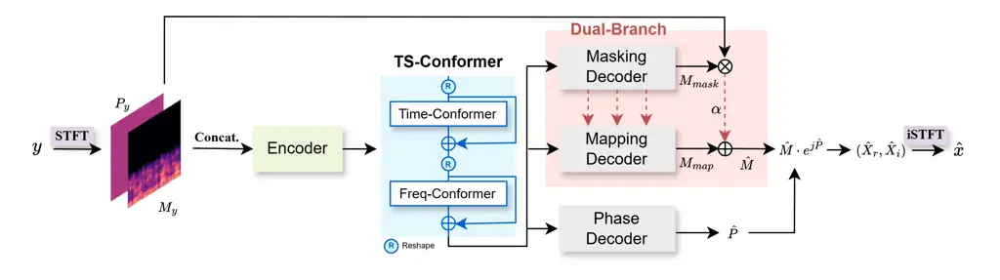
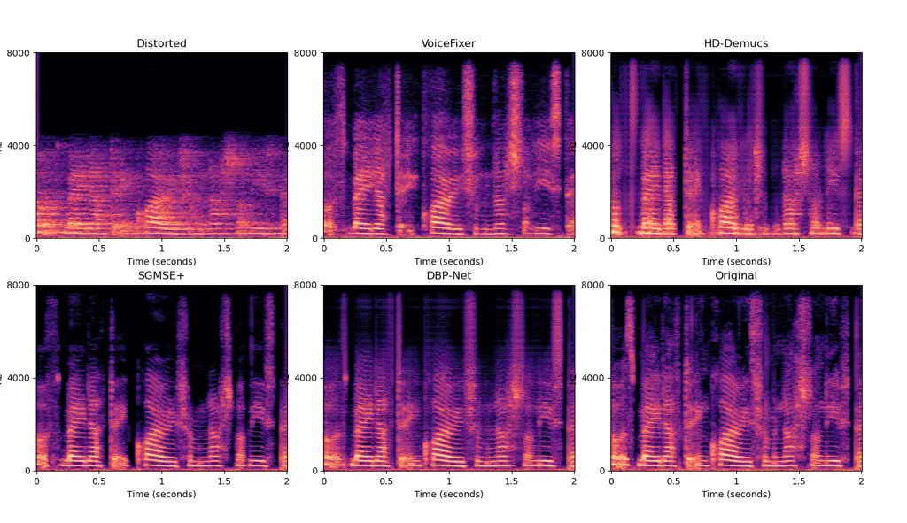

\[type=editor, orcid=0009-0008-6253-2543,\]

^(†)^(†)highlights: We propose DBP-Net, a dual-branch parallel network
for general speech restoration under complex distortions such as noise,
reverberation, and bandwidth reduction. DBP-Net integrates suppression
and generation pathways, with a learnable skip-fusion mechanism to
effectively balance noise removal and bandwidth restoration. The model
employs a lightweight two-stage conformer backbone that captures both
temporal and spectral dependencies for efficient speech representation.
Experimental results demonstrate that DBP-Net significantly outperforms
existing baselines across perceptual quality and spectral distortion
metrics. DBP-Net achieves superior performance with a substantially
smaller model size, providing an efficient yet powerful solution for
general speech restoration.

# A Dual-Branch Parallel Network for Speech Enhancement and Restoration

Da-Hee Yang    Dail Kim    Joon-Hyuk Chang Note: Corresponding author.
Email: jchang@hanyang.ac.kr    Jeonghwan Choi    Han-Gil Moon
organization=Department of Electronic Engineering, Hanyang University,
city=Seoul, postcode=04763, country=Republic of Korea
organization=Department of Artificial Intelligence, Hanyang University,
city=Seoul, postcode=04763, country=Republic of Korea
organization=Samsung Electronics, city=Suwon, postcode=04763,
country=Republic of Korea

###### Abstract

We present a novel general speech restoration model, DBP-Net
(dual-branch parallel network), designed to effectively handle complex
real-world distortions including noise, reverberation, and bandwidth
degradation. Unlike prior approaches that rely on a single processing
path or separate models for enhancement and restoration, DBP-Net
introduces a unified architecture with dual parallel branches—a
masking-based branch for distortion suppression and a mapping-based
branch for spectrum reconstruction. A key innovation behind DBP-Net lies
in the parameter sharing between the two branches and a cross-branch
skip fusion, where the output of the masking branch is explicitly fused
into the mapping branch. This design enables DBP-Net to simultaneously
leverage complementary learning strategies—suppression and
generation—within a lightweight framework. Experimental results show
that DBP-Net significantly outperforms existing baselines in
comprehensive speech restoration tasks while maintaining a compact model
size. These findings suggest that DBP-Net offers an effective and
scalable solution for unified speech enhancement and restoration in
diverse distortion scenarios.

###### keywords

Speech Restoration ,Speech Enhancement ,Dual-branch ,Parameter Sharing
,Skip Fusion

## 1 Introduction

In real-world acoustic environments, speech signals are frequently
degraded by a combination of distortions such as background noise,
reverberation, and bandwidth limitations. While extensive research has
been conducted on speech enhancement and bandwidth extension (BWE), most
prior work has focused on single distortion types—such as denoising Xu
et al. (2014); Park and Lee (2017); Tan and Wang (2018); Luo and
Mesgarani (2019); Defossez et al. (2020); Yang and Chang (2023); Saleem
et al. (2025); Zhang et al. (2025); Chen et al. (2025), dereverberation
Zhao et al. (2020); Ernst et al. (2018); Shi et al. (2020), or bandwidth
extension Li and Lee (2015); Nguyen et al. (2022). However, in practical
scenarios, these distortions often co-occur, rendering single-purpose
systems insufficient.

Recent progress in general speech restoration has resulted in models
that address multiple types of distortions, such as noise,
reverberation, and bandwidth reduction Liu et al. (2022); Byun et al.
(2023); Kim et al. (2023); Serrà et al. (2022); Scheibler et al. (2024).
While these approaches mark important progress, they often rely on
either task-specific modules or stage-wise processing pipelines, or
require significantly larger model capacities, especially in the case of
generative models. A key challenge in this domain lies in bridging the
fundamentally different requirements of suppression (e.g., noise and
reverberation removal) and reconstruction (e.g., bandwidth extension).
Masking-based approaches are effective for suppression, while
mapping-based generation is essential for reconstruction. Most existing
discriminative models specialize in one of the two, limiting their
ability to efficiently handle both within a unified framework.

To address these limitations, we propose DBP-Net, a dual-branch parallel
network that explicitly models the two distinct tasks—enhancement and
restoration—within a unified architecture. The model features two
parallel branches: one masking-based branch focused on suppression, and
one mapping-based branch designed for spectral reconstruction.
Crucially, both branches share parameters and are connected via a
cross-branch skip fusion, enabling the mapping-based branch to utilize
intermediate representations from the masking branch. This structure
encourages complementary learning and allows the network to adaptively
balance suppression and reconstruction, even in complex distortion
scenarios. The novelty of DBP-Net lies in its architectural unification
of two distinct learning paradigms through explicit branch collaboration
and parameter sharing. Unlike prior approaches that either treat
distortions separately or rely on sequential stages, DBP-Net enables
simultaneous, efficient, and interpretable handling of multiple
distortion types.

Experimental results demonstrate that DBP-Net achieves strong
performance across various general speech restoration benchmarks while
maintaining a low parameter count. Detailed analyses of its architecture
and performance are provided in Section 2 and Section 3, respectively.



Figure 1: Overall architecture of DBP-Net for general speech
restoration. The model takes the STFT of a noisy input waveform and
encodes the magnitude and wrapped phase into a compact representation.
The dual-branch magnitude decoder performs noise/reverberation
suppression via masking and high-frequency reconstruction via mapping,
with parameter sharing across branches. A cross-branch skip fusion
mechanism selectively transfers low-frequency content from the
masking-based path to the mapping-based path. The final enhanced
magnitude $`\hat{M}_{\text{final}}`$ is combined with the predicted
phase $`\hat{P}`$ from the phase decoder to reconstruct the complex
spectrum $`(\hat{X}_{r},\hat{X}_{i})`$, which is used to compute both
waveform- and spectrum-level losses via inverse STFT.

## 2 Model Description

### 2.1 Problem Formulation

We perform general speech restoration in environments suffering from a
combination of three common distortions: additive noise, reverberation,
and bandwidth degradation. Let $`x`$ denote the clean speech signal. The
observed distorted signal $`y`$ is simulated as:

```math
y=h(x*r+n), \tag{1}
```

where $`r`$ is a room impulse response convolved with $`x`$ to simulate
reverberation, $`n`$ denotes additive noise, and $`h(\cdot)`$ is a
low-pass filtering function that introduces bandwidth degradation by
removing high-frequency components for digital transmission,
respectively. The goal behind general speech restoration is to
reconstruct a clean and perceptually enhanced speech signal $`\hat{x}`$
from the corrupted observation $`y`$.

This problem is quite challenging because denoising and dereverberation
benefit from suppression or removal-based approaches, whereas bandwidth
extension requires the generation of missing spectral content. To tackle
these conflicting demands, we propose a unified architecture—termed the
dual-branch parallel network (DBP-Net)—that explicitly decouples
enhancement and generation processes within a joint framework.

### 2.2 Overview of DBP-Net

DBP-Net is designed to address general speech restoration by jointly
performing noise and reverberation removal, as well as bandwidth
reconstruction. The model processes the short-time Fourier transform
(STFT) of the input signal and outputs enhanced magnitude and phase
spectra, which are then used to reconstruct the time-domain waveform via
inverse STFT.

The architecture consists of four main components:

- •
  A spectral encoder that transforms the magnitude and wrapped phase
  spectra into a compact time-frequency representation.
- •
  A two-stage Conformer block that first models temporal and then
  spectral dependencies using convolution-augmented attention
  mechanisms.
- •
  A dual-branch magnitude decoder that separately handles noise
  suppression and high-frequency generation.
- •
  A phase decoder that estimates the clean phase spectrum.

A schematic diagram of the DBP-Net architecture is illustrated in
Figure 1.

### 2.3 DBP-Net Architecture

Spectral Input Representation

We apply an STFT to the input waveform $`y`$ to obtain its
complex-valued spectrogram. The magnitude and wrapped phase spectra,
denoted as $`M_{y}`$ and $`P_{y}`$, are separately extracted and used as
input features. Following prior work Lu et al. (2023), the wrapped phase
$`P_{y}`$ is represented using a sine-cosine embedding to handle
discontinuities. These two components are concatenated along the channel
dimension and passed to the encoder for joint processing of magnitude
and phase information.

Encoder and Transformer Backbone

The encoder consists of multiple convolutional layers that downsample
the input spectrogram while increasing the channel dimension. This
results in a compressed time-frequency representation with a rich local
structure.

To model both temporal and spectral dependencies, we adopt a two-stage
Conformer-based backbone inspired by TS-Conformer Cao et al. (2022). Let
$`D\in\mathbb{R}^{B\times T\times F\times C}`$ denote the encoder
output, where $`B`$, $`T`$, $`F`$, and $`C`$ represent the batch size,
number of time frames, frequency bins, and channel dimension,
respectively. For temporal modeling, $`D`$ is reshaped into
$`D_{T}\in\mathbb{R}^{(B\cdot F)\times T\times C}`$ by folding the
frequency axis into the batch dimension. The reshaped representation is
then processed by Conformer blocks that integrate multi-head
self-attention and convolutional modules to capture long-range temporal
dependencies. After temporal processing, the output is reshaped back to
$`\mathbb{R}^{B\times T\times F\times C}.`$ For frequency modeling, the
representation is further reshaped into
$`D_{F}\in\mathbb{R}^{(B\cdot T)\times F\times C}`$ by folding the time
axis into the batch dimension. A second set of Conformer blocks is
applied to model spectral correlations across frequency bins. The final
output is reshaped back to the original tensor size
$`B\times T\times F\times C`$. This two-stage processing disentangles
temporal and spectral dependencies, enabling the model to learn
distortion-robust representations for both suppression and
reconstruction tasks.

We use magnitude $`M_{y}`$ and wrapped phase $`P_{y}`$ as input
features, concatenated along the channel dimension before being fed into
the encoder. Phase wrapping effects are handled in the training
objective via an anti-wrapping formulation following Lu et al. (2023).

Dual-Branch Magnitude Decoder

The magnitude decoder is split into two parallel branches: one for noise
and reverberation removal, and the other for high-frequency
reconstruction. Both decoders share the same architecture and
parameters, except for their activation functions and interaction
mechanisms.

#### Masking-based decoder (denoising path)

This branch adopts a masking-based strategy with a Sigmoid activation
function to estimate a suppression mask for the distorted magnitude
spectrum. This approach has been shown to be effective for denoising and
dereverberation Wang and Chen (2018).

#### Mapping-based decoder (BWE path)

The second branch follows a mapping-based strategy with ReLU activation
to directly predict a clean magnitude spectrum, particularly focusing on
generating missing high-frequency content.

Cross-Branch Skip Fusion

Since direct skip connections from input to output are detrimental in
multi-distortion settings—due to the risk of reintroducing noise—we
propose a novel skip fusion strategy that selectively transfers enhanced
low-frequency information from the denoising branch to the BWE branch.

Let $`M_{\text{mask}}`$ and $`M_{\text{map}}`$ denote the outputs of the
masking-based and mapping-based decoders, respectively. We define the
fused magnitude estimate $`\hat{M}`$ as:

```math
\hat{M}=M_{\text{map}}+\alpha\cdot M_{\text{mask}}, \tag{2}
```

where $`\alpha`$ is a learnable parameter controlling the influence of
the denoised low-frequency components on the generative path. This skip
fusion enables the mapping-based decoder to incorporate enhanced
spectral information without direct reliance on noisy input features.

Final Output

The final enhanced complex spectrogram is constructed by combining the
fused magnitude estimate $`\hat{M}`$ with the predicted phase
$`\hat{P}`$ as follows:

```math
\hat{X}=\hat{M}\cdot e^{j\hat{P}}. \tag{3}
```

Finally, the enhanced time-domain waveform $`\hat{x}`$ is obtained by
applying the inverse STFT to $`\hat{X}`$.

### 2.4 Training Objective

We employ a multi-level loss function for training the proposed DBP-Net,
targeting both waveform and spectral reconstruction. Specifically, the
training objective includes a time-domain $`L_{1}`$ loss:

```math
\mathcal{L}_{\text{time}}=\|\hat{x}-x\|_{1}, \tag{4}
```

In addition, magnitude and complex spectrum losses are computed in the
time-frequency (TF) domain:

```math
\mathcal{L}_{\text{mag}}=\|\hat{M}-M_{\text{gt}}\|_{2}^{2}, \tag{5}
```

```math
\mathcal{L}_{\text{com}}=\|\hat{X}_{r}-X_{r}\|_{2}^{2}+\|\hat{X}_{i}-X_{i}\|_{2}^{2}, \tag{6}
```

where $`M_{\text{gt}}`$ is the ground-truth magnitude spectrum, and
$`(X_{r},X_{i})`$ denote the real and imaginary parts of the clean
complex spectrum.

To further improve perceptual quality and phase accuracy, we
additionally incorporate a metric-guided loss based on PESQ
Recommendation (2001), and a phase-aware loss based on anti-wrapping
formulations, as proposed in Lu et al. (2023). These auxiliary losses
guide the model toward perceptually relevant and physically consistent
spectral predictions.

The total loss is defined as a weighted combination:

```math
\mathcal{L}_{\text{total}}=\gamma_{1}\mathcal{L}_{\text{time}}+\gamma_{2}\mathcal{L}_{\text{mag}}+\gamma_{3}\mathcal{L}_{\text{com}}+\gamma_{4}\mathcal{L}_{\text{metric}}+\gamma_{5}\mathcal{L}_{\text{phase}}, \tag{7}
```

where all $`\gamma`$ weights are tunable hyperparameters that control
the relative importance of each loss component.

|                       |                     |                     |                     |                     |                     |                     |                      |          |     |
| --------------------- | ------------------- | ------------------- | ------------------- | ------------------- | ------------------- | ------------------- | -------------------- | -------- | --- |
| Method                | CSIG ($`\uparrow`$) | CBAK ($`\uparrow`$) | COVL ($`\uparrow`$) | PESQ ($`\uparrow`$) | STOI ($`\uparrow`$) | SRMR ($`\uparrow`$) | LSD ($`\downarrow`$) | \#Param. |     |
| Noisy                 | 1.80                | 2.25                | 1.73                | 1.78                | 0.78                | 5.91                | 4.78                 | \-       |     |
| Baseline models       |                     |                     |                     |                     |                     |                     |                      |          |     |
| VoiceFixer            | 3.21                | 2.12                | 2.54                | 1.82                | 0.83                | 9.13                | 2.72                 | 122 M    |     |
| HD-DEMUCS             | 3.29                | 2.63                | 2.60                | 1.85                | 0.83                | 7.15                | 2.43                 | 24 M     |     |
| SGMSE+                | 3.35                | 3.08                | 2.91                | 2.37                | 0.90                | 9.86                | 2.88                 | 65 M     |     |
| Proposed              |                     |                     |                     |                     |                     |                     |                      |          |     |
| DBP-Net               | 3.90                | 3.11                | 3.31                | 2.61                | 0.92                | 9.81                | 2.24                 | 2.05 M   |     |
| w/o skip fusion       | 3.79                | 3.05                | 3.25                | 2.60                | 0.91                | 9.59                | 2.37                 | 2.05 M   |     |
| w/o parameter sharing | 2.74                | 3.14                | 2.76                | 2.67                | 0.90                | 9.19                | 3.95                 | 2.43 M   |     |

Table 1: Comprehensive experimental results for baseline models and
step-wise integration process. For all metrics except LSD, higher values
indicate better performance.



Figure 2: Comparison of spectrograms depicting the baselines and the
proposed DBP-Net model. Generative models such as VoiceFixer and SGMSE+
produced more natural spectrograms, but the overall performance was
inferior. The HD-DEMUCS model exhibited less effective noise and
reverberation removal in the low-frequency band. Conversely, the
proposed model demonstrated satisfactory noise and reverberation removal
performance, along with effective bandwidth generation.

## 3 Experiments

### 3.1 Datasets and Experimental setup

We considered noise, reverberation, and bandwidth degradation at a
sampling rate of 16 kHz to generate distorted speech. For noise
distortion, we mixed the VCTK corpus Valentini-Botinhao and others
(2017) consisting of 28 English speakers with the DEMAND noise dataset
in a signal-to-noise ratio range of 0 – 20 dB. The reverberant signal
was generated by convolving the speech signal with a simulated room
impulse response using a Pyroomacoustics engine. The dimensions of the
reverberant room ranged from 5 to 10 m in length and width and 2 to 6 m
in height, with the reverberation times (RT60) ranging from 0.3 to 0.9
seconds. For non-echoic speech, the target dry room had a fixed
absorption coefficient of 0.99. The bandwidth degradation signal was
generated using various types of low-pass filters (e.g. Butterworth,
Bessel, Chebyshev, and elliptic) with randomly selected cut-off
frequencies between 2 and 4 kHz. We selected “p258” and “p287” speakers
from the training set for the validation set.

We trained the proposed DBP-Net in Figure 1 for 1M steps using the AdamW
optimizer Loshchilov and Hutter (2019) with a learning rate of 0.0005.
The contributions of the dual-branch magnitude decoders were balanced by
a learnable skip-fusion parameter $`\alpha`$, which was initialized at
training onset and converged to approximately 0.38. For the loss
function, we adopted the weighting coefficients $`\gamma_{1}`$ to
$`\gamma_{5}`$ from the MP-SENet training setup Lu et al. (2023), where
the values were set to 0.2, 0.9, 0.1, 0.05, and 0.3, respectively.

### 3.2 Evaluation Metrics

We evaluated the speech restoration performance using various assessment
metrics. For comprehensive assessments of speech performance, we
analyzed the speech signal distortion, background noise, and quality
using CSIG, which is the mean opinion score predictor of signal
distortion, CBAK, which is the mean opinion score predictor of
background-noise intrusiveness, and COVL, which is the mean opinion
score predictor of overall signal quality Hu and Loizou (2008). In
addition, the speech quality and intelligibility were measured using
wide-band perceptual evaluation of speech quality (PESQ) Recommendation
(2001) and short-time objective intelligibility (STOI) Taal et al.
(2011). To assess the effectiveness of speech dereverberation, we
employed the speech-to-reverberation modulation energy ratio (SRMR)
metric Falk and Chan (2010). For BWE, we used the log-spectral distance
(LSD) to measure the performance. For all metrics except for the LSD,
higher values indicate better performance.

### 3.3 Comparison with Baseline Models

Table 1 presents a performance comparison between the proposed DBP-Net
and existing baseline models, including VoiceFixer Liu et al. (2022),
HD-DEMUCS Kim et al. (2023), and SGMSE+ Richter et al. (2023).
VoiceFixer and HD-DEMUCS are representative methods for general speech
restoration, while SGMSE+ was originally proposed for speech denoising
but also supports dereverberation and bandwidth extension Lemercier et
al. (2023). We used the official pretrained model for VoiceFixer¹¹ 1
[https://github.com/haoheliu/voicefixer](https://github.com/haoheliu/voicefixer),
reimplemented HD-DEMUCS using the official open-source code²² 2
[https://github.com/facebookresearch/denoiser.git](https://github.com/facebookresearch/denoiser.git),
and trained SGMSE+ using its official repository³³ 3
[https://github.com/sp-uhh/sgmse.git](https://github.com/sp-uhh/sgmse.git).

The proposed DBP-Net significantly outperformed all baselines across
various metrics. In terms of perceptual quality, DBP-Net achieved the
highest CSIG score of 3.90 and COVL of 3.31, indicating superior
restoration of speech quality and overall naturalness. This trend is
also visually supported in Figure 2, where DBP-Net demonstrates
effective noise suppression in low-frequency regions and accurate
restoration of high-frequency components in a balanced manner. In
contrast, the best-performing baseline, SGMSE+, achieved CSIG and COVL
scores of 3.35 and 2.91, respectively. For speech intelligibility,
DBP-Net also recorded the highest STOI score of 0.92, outperforming
SGMSE+ (0.90), HD-DEMUCS (0.83), and VoiceFixer (0.83).

Moreover, our model demonstrated the most effective bandwidth
restoration performance, achieving the lowest LSD of 2.24, while the
LSDs for SGMSE+, HD-DEMUCS, and VoiceFixer were 2.88, 2.43, and 2.72,
respectively. Notably, DBP-Net achieved this superior performance with
only 2.05 million parameters, which is substantially fewer than
VoiceFixer (122M), HD-DEMUCS (24M), and SGMSE+ (65M). This highlights
the efficiency of our architecture in both performance and model size.

### 3.4 Ablation Study

We conducted an ablation study to validate the effectiveness of each
component in the proposed architecture. Starting from a basic
dual-branch magnitude decoder setup, we progressively integrated
parameter sharing and skip fusion to evaluate their individual
contributions to overall performance. We first examined a naive
dual-decoder model without any parameter sharing between the two
magnitude decoders. While this model achieved the highest PESQ score
(2.67) and competitive CBAK (3.14), it failed to perform well in terms
of CSIG (2.74), COVL (2.76), and LSD (3.95), indicating that bandwidth
restoration was insufficient and speech quality remained degraded. This
result suggests that training the two decoders independently hindered
the model’s ability to generalize across multiple distortions.

The elevated PESQ score in this variant reflects strong suppression
performance but does not imply accurate full-band reconstruction. While
PESQ is largely influenced by perceptual similarity in dominant
frequency regions, LSD directly evaluates spectral distortion across the
entire frequency band. The substantially higher LSD value (3.95)
therefore indicates insufficient high-frequency reconstruction despite
competitive suppression metrics. This observation underscores a key
challenge in multi-distortion restoration: optimizing
suppression-oriented metrics alone cannot ensure full-spectrum fidelity.

To address this limitation, we applied parameter sharing between the two
decoders. This significantly improved LSD (from 3.95 to 2.37), as well
as CSIG and COVL, demonstrating that joint learning allowed better
utilization of both masking-based and mapping-based paths. The shared
structure enabled effective bandwidth generation without sacrificing
denoising capability. Lastly, we introduced a learnable skip fusion
mechanism to allow interaction between the two branches. This yielded
further improvements in CSIG (from 3.79 to 3.90), LSD (from 2.37 to
2.24), and overall speech quality (COVL 3.31). Notably, this was
achieved with a compact model size of only 2.05M parameters. The results
confirm that both parameter sharing and skip fusion contribute
significantly to general speech restoration. The final proposed model,
DBP-Net, outperformed all ablation variants and prior baselines across
most metrics, achieving strong performance in noise and reverberation
removal, as well as high-frequency bandwidth generation.

## 4 Conclusion

In this letter, we proposed DBP-Net, a general speech restoration model
that integrates two parallel magnitude decoders: one dedicated to
distortion removal and the other to speech reconstruction. Motivated by
the limitations of existing single-purpose models, we designed a unified
architecture capable of addressing multiple distortions—such as noise,
reverberation, and bandwidth reduction—within a single framework. The
proposed model demonstrated consistent improvements across various
objective metrics, achieving effective and compact speech restoration in
challenging acoustic environments.

## References

- Byun et al. (2023) J. Byun, Y. Ji, S. Chung, S. Choe, and M. Choi An
  empirical study on speech restoration guided by self-supervised speech
  representation. In Proc. IEEE International Conference on Acoustics,
  Speech and Signal Processing (ICASSP), pp. 1–5. Cited by: §1.
- Cao et al. (2022) R. Cao, S. Abdulatif, and B. Yang CMGAN:
  conformer-based metric gan for speech enhancement. In Proc.
  INTERSPEECH, Cited by: §2.3.
- Chen et al. (2025) H. Chen, Y. Xu, D. Ke, and K. Su DDP-Unet: a
  mapping neural network for single-channel speech enhancement. Computer
  Speech & Language 93, pp. 101795. Cited by: §1.
- Defossez et al. (2020) A. Defossez, G. Synnaeve, and Y. Adi Real time
  speech enhancement in the waveform domain. In Proc. INTERSPEECH, Cited
  by: §1.
- Ernst et al. (2018) O. Ernst, S. E. Chazan, S. Gannot, and J.
  Goldberger Speech dereverberation using fully convolutional networks.
  In Proc. European Signal Processing Conference (EUSIPCO), pp. 390–394.
  Cited by: §1.
- Falk and Chan (2010) T. H. Falk and W. Chan Temporal dynamics for
  blind measurement of room acoustical parameters. IEEE Transactions on
  Instrumentation and Measurement 59 (4), pp. 978–989. Cited by: §3.2.
- Hu and Loizou (2008) Y. Hu and P. C. Loizou Evaluation of objective
  quality measures for speech enhancement. IEEE Transactions on Audio,
  Speech, and Language Processing 16 (1), pp. 229–238. Cited by: §3.2.
- Kim et al. (2023) D. Kim, S. Chung, H. Han, Y. Ji, and H. Kang
  HD-DEMUCS: general speech restoration with heterogeneous decoders. In
  Proc. INTERSPEECH, Cited by: §1, §3.3.
- Lemercier et al. (2023) J. Lemercier, J. Richter, S. Welker, and T.
  Gerkmann Analysing diffusion-based generative approaches versus
  discriminative approaches for speech restoration. In Proc. IEEE
  International Conference on Acoustics, Speech and Signal Processing
  (ICASSP), pp. 1–5. Cited by: §3.3.
- Li and Lee (2015) K. Li and C. Lee A deep neural network approach to
  speech bandwidth expansion. In Proc. IEEE International Conference on
  Acoustics, Speech and Signal Processing (ICASSP), pp. 4395–4399. Cited
  by: §1.
- Liu et al. (2022) H. Liu, X. Liu, Q. Kong, Q. Tian, Y. Zhao, D.
  Wang, C. Huang, and Y. Wang Voicefixer: a unified framework for
  high-fidelity speech restoration. In Proc. INTERSPEECH, Cited by: §1,
  §3.3.
- Loshchilov and Hutter (2019) I. Loshchilov and F. Hutter Decoupled
  weight decay regularization. In Proc. International Conference on
  Learning Representations (ICLR), Cited by: §3.1.
- Lu et al. (2023) Y. Lu, Y. Ai, and Z. Ling MP-SENet: a speech
  enhancement model with parallel denoising of magnitude and phase
  spectra. In Proc. INTERSPEECH, Cited by: §2.3, §2.3, §2.4, §3.1.
- Luo and Mesgarani (2019) Y. Luo and N. Mesgarani Conv-TasNet:
  surpassing ideal time–frequency magnitude masking for speech
  separation. IEEE/ACM Transactions on Audio, Speech, and Language
  Processing 27 (8), pp. 1256–1266. Cited by: §1.
- Nguyen et al. (2022) V. Nguyen, A. H. Nguyen, and A. W. Khong TUNet: a
  block-online bandwidth extension model based on transformers and
  self-supervised pretraining. In Proc. IEEE International Conference on
  Acoustics, Speech and Signal Processing (ICASSP), pp. 161–165. Cited
  by: §1.
- Park and Lee (2017) S. R. Park and J. W. Lee A fully convolutional
  neural network for speech enhancement. In Proc. INTERSPEECH,
  pp. 1993–1997. Cited by: §1.
- Recommendation (2001) I. Recommendation Perceptual evaluation of
  speech quality (pesq): an objective method for end-to-end speech
  quality assessment of narrow-band telephone networks and speech
  codecs. Rec. ITU-T P. 862. Cited by: §2.4, §3.2.
- Richter et al. (2023) J. Richter, S. Welker, J. Lemercier, B. Lay,
  and T. Gerkmann Speech enhancement and dereverberation with
  diffusion-based generative models. IEEE/ACM Transactions on Audio,
  Speech, and Language Processing. Cited by: §3.3.
- Saleem et al. (2025) N. Saleem, S. Bourouis, H. Elmannai, and A. D.
  Algarni CTSE-Net: resource-efficient convolutional and tf-transformer
  network for speech enhancement. Knowledge-Based Systems 317,
  pp. 113452. Cited by: §1.
- Scheibler et al. (2024) R. Scheibler, Y. Fujita, Y. Shirahata, and T.
  Komatsu Universal score-based speech enhancement with high content
  preservation. In Proc. INTERSPEECH, Cited by: §1.
- Serrà et al. (2022) J. Serrà, S. Pascual, J. Pons, R. O. Araz, and D.
  Scaini Universal speech enhancement with score-based diffusion. arXiv
  preprint arXiv:2206.03065. Cited by: §1.
- Shi et al. (2020) H. Shi, L. Wang, M. Ge, S. Li, and J. Dang
  Spectrograms fusion with minimum difference masks estimation for
  monaural speech dereverberation. In Proc. IEEE International
  Conference on Acoustics, Speech and Signal Processing (ICASSP),
  pp. 7544–7548. Cited by: §1.
- Taal et al. (2011) C. H. Taal, R. C. Hendriks, R. Heusdens, and J.
  Jensen An algorithm for intelligibility prediction of time-frequency
  weighted noisy speech. IEEE Transactions on Audio, Speech, and
  Language Processing 19 (7), pp. 2125–2136. Cited by: §3.2.
- Tan and Wang (2018) K. Tan and D. Wang A convolutional recurrent
  neural network for real-time speech enhancement. In Proc. INTERSPEECH,
  pp. 3229–3233. Cited by: §1.
- Valentini-Botinhao et al. (2017) C. Valentini-Botinhao et al. Noisy
  reverberant speech database for training speech enhancement algorithms
  and tts models. Cited by: §3.1.
- Wang and Chen (2018) D. Wang and J. Chen Supervised speech separation
  based on deep learning: an overview. IEEE/ACM Transactions on Audio,
  Speech, and Language Processing 26 (10), pp. 1702–1726. Cited by:
  §2.3.
- Xu et al. (2014) Y. Xu, J. Du, L. Dai, and C. Lee A regression
  approach to speech enhancement based on deep neural networks. IEEE/ACM
  Transactions on Audio, Speech, and Language Processing 23 (1),
  pp. 7–19. Cited by: §1.
- Yang and Chang (2023) D. Yang and J. Chang Selective film conditioning
  with ctc-based asr probability for speech enhancement. In Proc. IEEE
  International Conference on Acoustics, Speech and Signal Processing
  (ICASSP), pp. 1–5. Cited by: §1.
- Zhang et al. (2025) Y. Zhang, Z. Zhang, W. Guo, W. Chen, Z. Liu,
  and H. Liu LRetUNet: a u-net-based retentive network for
  single-channel speech enhancement. Computer Speech & Language 93,
  pp. 101798. Cited by: §1.
- Zhao et al. (2020) Y. Zhao, D. Wang, B. Xu, and T. Zhang Monaural
  speech dereverberation using temporal convolutional networks with self
  attention. IEEE/ACM Transactions on Audio, Speech, and Language
  Processing 28, pp. 1598–1607. Cited by: §1.
