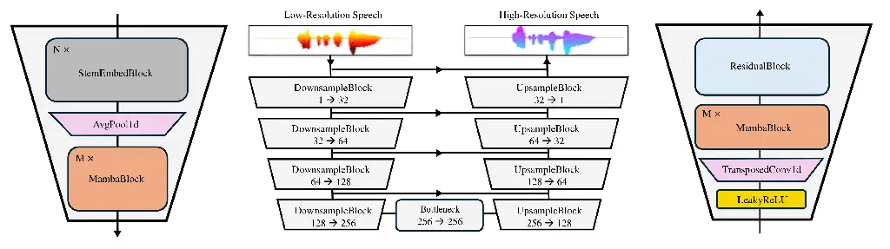
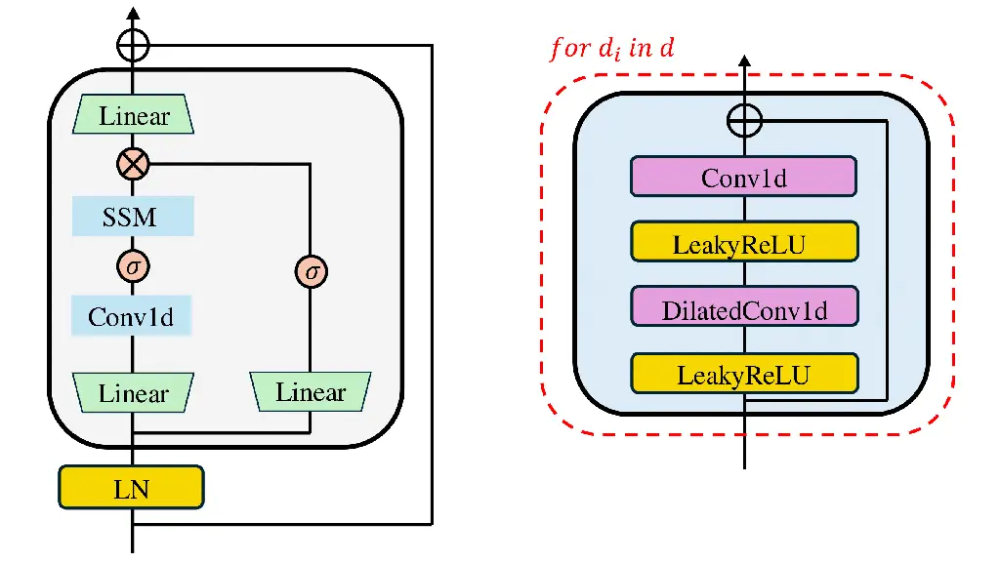
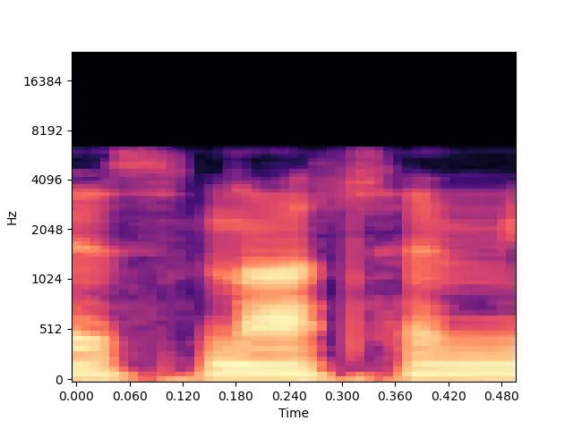
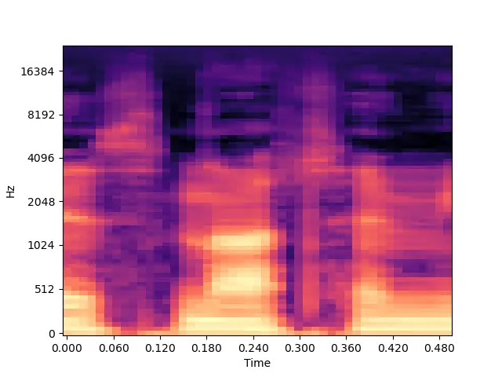
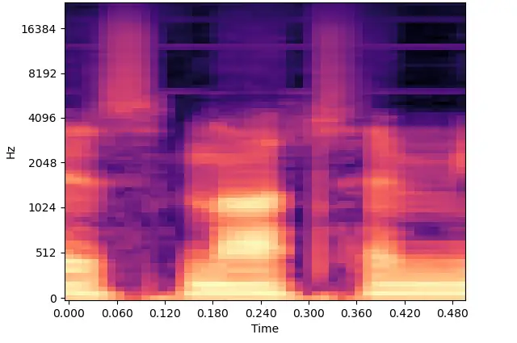
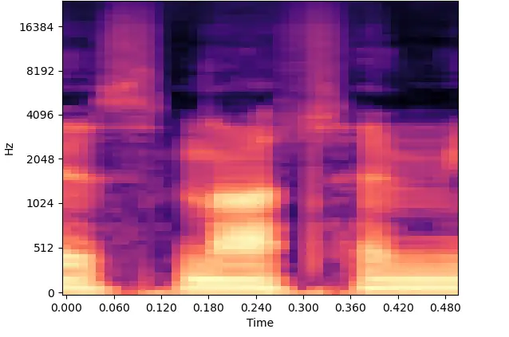

# Wave-U-Mamba: An End-To-End Framework For High-Quality And Efficient Speech Super Resolution Thanks: \*Corresponding authors: {infected4098, chanwcom}@korea.ac.kr

Yongjoon Lee^(\*) Affiliation: Department of Statistics  
Korea University  
Seoul, South Korea  
infected4098@korea.ac.kr    Chanwoo Kim^(\*) Affiliation: Department of
Artificial Intelligence  
Korea University  
Seoul, South Korea  
chanwcom@korea.ac.kr Affiliation: 

###### Abstract

Speech Super-Resolution (SSR) is a task of enhancing low-resolution
speech signals by restoring missing high-frequency components.
Conventional approaches typically reconstruct log-mel features, followed
by a vocoder that generates high-resolution speech in the waveform
domain. However, as mel features lack phase information, this can result
in performance degradation during the reconstruction phase. Motivated by
recent advances with Selective State Spaces Models (SSMs), we propose a
method, referred to as Wave-U-Mamba that directly performs SSR in time
domain. In our comparative study, including models such as WSRGlow,
NU-Wave 2, and AudioSR, Wave-U-Mamba demonstrates superior performance,
achieving the lowest Log-Spectral Distance (LSD) across various
low-resolution sampling rates, ranging from 8 to 24 kHz. Additionally,
subjective human evaluations, scored using Mean Opinion Score (MOS)
reveal that our method produces SSR with natural and human-like quality.
Furthermore, Wave-U-Mamba achieves these results while generating
high-resolution speech over nine times faster than baseline models on a
single A100 GPU, with parameter sizes less than 2% of those in the
baseline models.

###### Index Terms: 

Speech Super-Resolution, U-Net, Mamba, Generative Adversarial Networks

## I Introduction

Speech Super-Resolution (SSR), also referred to as Bandwidth Extension
(BWE) is a process that aims to reconstruct High-Resolution (HR) speech
from Low-Resolution (LR) speech. This field has gained significant
attention due to the widespread availability of speech data recorded at
low sampling rates, which can be attributed to hardware limitations,
bandwidth constraints, and various other factors.

SSR is a generative task that leverages the power of modern generation
backbones such as diffusion probabilistic models \[1, 2, 3\], Generative
Adversarial Networks (GAN) \[4, 5\], Generative Flow \[6\]. One way to
approach SSR involves generating HR waveform directly from LR waveform
\[7, 8, 9\]. However, given that speech waveforms are characterized by
significantly longer sequence lengths compared to mel spectrogram
representations, conventional works first map the LR mel spectrogram to
HR mel spectrogram and then project the recovered mel spectrogram onto a
waveform through a well-defined vocoder \[3, 4\]. This two-step approach
offers the advantage of decomposing the SSR task into simpler modules,
akin to the traditional two-stage modeling employed in tasks such as
Text-to-Speech (TTS) \[10, 11, 12\].

Despite the promising results achieved by two-step approaches, certain
limitations remain. The mel spectrogram, being a feature-reduced
representation, inherently discards phase information during the
conversion process. This introduces an additional challenge of implicit
phase reconstruction during the SSR process. Previous works incorporate
a pretrained vocoder to solve the problem so that SSR frameworks can
only aim at recovering the high-frequency magnitudes. However, this
approach often does not render fully end-to-end training of the model
\[4, 3, 11\] and is inefficient, as phase information could be preserved
if the waveform were directly utilized.

Considering these factors, it is hypothesized that a model capable of
directly generating HR waveforms from LR waveforms in an efficient and
effective manner would offer a more optimal solution. In this paper,
motivated by the success of selective SSMs \[13\] to extract long-term
dependent information both effectively and efficiently \[14, 15\], we
propose Wave-U-Mamba to solve SSR in waveform domain. Wave-U-Mamba is a
GAN-based framework that takes LR speech as input, with sampling rates
ranging from 4 to 24 kHz, and upsamples it to HR speech with a target
sampling rate of 48 kHz. Owing to the inherent capabilities of the Mamba
architecture to efficiently process long sequences, coupled with its
U-shaped model architecture that allows direct projection from LR to HR
waveforms, the proposed model can generate HR waveforms much more
rapidly than existing baseline models. Audio samples are made available
online.¹¹ 1 Listenable demos are available at
[infected4098.github.io/waveumambademo](https://infected4098.github.io/waveumambademo).

## II Related Works

### II-A Selective State Spaces Models

Selective State Spaces Model, (commonly referred to as Mamba) offers
significant advantages in capturing long-term dependencies when
processing sequential data \[13\]. Utilizing hardware-aware parallel
scan algorithms, Mamba serves as a memory-efficient and high-performance
feature extractor, capable of maintaining global dependencies across
feature-dense sequences \[16\]. Given the considerable length of raw
waveforms, computational complexity becomes a critical consideration in
feature extraction. Mamba’s near-linear computational complexity with
respect to sequence length positions it as an optimal feature extraction
method for waveform data. Integrating Mamba with U-net \[17\]
architecture has been explored in a variety of fields, including medical
image segmentation \[16, 18\], image restoration \[19\].

### II-B Time Domain Speech Processing

Although time-frequency representations such as mel spectrogram are
traditionally employed to address speech-related tasks, time domain
speech processing has been studied in various tasks including source
separation \[20, 21\], representation learning \[22\], multimodal
processing \[23\], speech generation \[24, 25\], and speech
super-resolution \[7, 8, 9\].



Fig. 1: The architecture of DownsampleBlock (Left), Wave-U-Mamba
Generator (Middle), and UpsampleBlock (Right).

## III Wave-U-Mamba

Wave-U-Mamba is a GAN-based generative model that comprises a single
generator and two discriminators. Our generator is a U-Net based
architecture that takes the raw waveform of LR speech as input and
outputs HR speech waveform. A residual connection is employed every
block to enhance stability. Especially, the residual block at the final
upsampling layer enables the model to focus on estimating the
upper-frequency components, given that the lower-frequency features are
already captured in the LR waveform. Fig. 1 illustrates the overall
architecture of the Wave-U-Mamba generator. Building on the previous
work \[26\], we utilize Multi-Period Discriminator (MPD) and Multi-Scale
Discriminator (MSD), each comprising groups of sub-discriminators to
perform adversarial training.

### III-A Task Definition

A LR speech signal has shape of $`X_{L}=[x_{1,...,s\times L}]`$. $`s`$
represents signal length in seconds, and $`L`$ represents the sampling
rate of the signal, where the upper-frequency limit is set to $`L/2`$ by
Nyquist Theorem. A HR signal has shape of
$`Y_{H}=[y_{1,...,s\times H}]`$. $`H`$ represents the sampling rate of
the signal, where the upper-frequency limit is set to $`H/2`$. We first
upsample the LR signal to match the sampling rate of the HR signal (i.e.
$`X_{H}=[x_{1,...,s\times H}]`$) using Fast Fourier Transform (FFT)
interpolation. Then we parameterize and train the generative function
$`G`$ so that $`Y_{H}=G(X_{H})`$.

### III-B Generator



Fig. 2: The architecture of MambaBlock (Left) and ResidualBlock (Right).

Downsampling Enhancing long-range dependency is a critical challenge in
feature extraction within the waveform domain. Approaching distant
features in waveform domain is harder than time-frequency domain due to
the comparatively longer duration that a single frame in spectrogram
spans. Previous studies have primarily focused on modifying the
hyperparameters of convolutional neural networks (CNN) to extract
long-term dependencies in waveform domain \[24, 22\]. However, these
approaches often involve deepening network layers or expanding kernel
sizes, leading to the loss of valuable information or increased
computational complexity. To address this issue, we propose the
incorporation of Mamba as a global feature extractor, due to its
capability to efficiently and effectively learn long-range patterns.
Specifically, we introduce MambaBlock that integrates Mamba with Layer
Normalization (LN) \[27\] and residual connection. We set $`M`$, the
number of MambaBlocks to 2.

Mamba-based models are recognized for their difficulty in training,
largely due to the relatively sharp or non-convex nature of their loss
landscapes \[28\]. To mitigate this challenge, and motivated by \[29\],
we design a 1D version of stem embedding as an operator to map input
representations into a high-dimensional latent space, facilitating more
stable training of the Mamba model. A StemEmbedBlock is made of 1D
convolution with a kernel size of 4 and a stride of 1, followed by LN,
LeakyReLU, and residual connection. In practice, we set $`N`$, the
number of StemEmbedBlocks to 2 to double the feature dimension, which
further stabilizes the training process. The hidden dimension at the
bottleneck layer is set to 256, which is comparatively lower than that
of other U-Net based SSR architectures \[4, 7\]. By constraining the
hidden dimension size, the model effectively limits the propagation of
extraneous patterns from the interpolated LR signal $`X_{H}`$, such as
those generated by FFT interpolation, ensuring that only relevant and
meaningful features are captured.

As shown in previous work \[21\], approaches such as strided CNNs with
padding for sequence length reduction can often introduce borderline
artifacts and disrupt the continuous nature of the signal due to the
padding operation. To address the problem, we use average pooling to
halve the sequence length. In this way, we compress features that add to
the continuity of the generated HR signal. The bottleneck block follows
the same structure as the DownsampleBlock but without pooling operation.

Upsampling We employ transposed convolution as an upsampling operator in
which kernel sizes are set as a multiple of strides to reduce
checkerboard artifacts common in transposed convolution \[30\].
MambaBlocks with the same architecture in downsampling are utilized to
capture global features. ResidualBlocks are put after Mambablocks to
further improve the connectivity of representations and enhance the
training stability. Specifically, every ResidualBlock has kernel sizes
of 3 with dilation rates set to $`d=[1,3]`$. The architecture of
ResidualBlock can be found in Fig. 2. Unlike other UpsampleBlocks, the
final UpsampleBlock consists of a single convolutional layer, followed
by a tanh activation to predict the residual HR signal. All
convolutional layers are weight-normalized \[31\].

### III-C Discriminator

Following early works on incorporating GAN for vocoding \[26, 32\], we
use Multi-Period Discriminator (MPD) and Multi-Scale Discriminator (MSD)
as two discriminators to conduct adversarial training of Wave-U-Mamba.
MPD first reshapes speech signal into 2D data and then applies 2D
convolution to capture periodic patterns in the signal \[26\]. MPD
consists of 5 sub-discriminators with different reshaping periods to
reshape speech signals. MSD is a 1D convolution-based discriminator that
operates on smoothed waveform \[32\]. MSD consists of 3
sub-discriminators that operate on raw waveform and two downsampled
waveforms. By combining two modules, our generator is expected to
capture both periodic patterns and continuous nature of speech signals,
rendering natural and high-quality generation of HR speech. Given that
the discriminators in SSR tasks deal with comparatively fine-grained HR
speech signal than those used in common vocoding tasks, we deepen the
structure of both MPD and MSD by adding more building blocks.

### III-D Training Objectives

Mel Spectrogram Loss For the natural and realistic SSR, it is crucial
that perceptual quality be measured thoroughly. We therefore use L1-loss
of the mel spectrogram of the predicted signal and the ground truth
signal, where $`\psi`$ refers to the mel transformation. In equation 1,
$`y`$ and $`x`$ refer to the ground truth HR and the LR waveform,
respectively. A function $`G`$ is our generator Wave-U-Mamba that takes
as input $`x`$ to predict the HR waveform $`y`$.

```math
L_{\text{mel}}=\mathbb{E}_{(y,x)}[||\psi(y)-\psi(G(x))||_{1}] \tag{1}
```

Multi-Resolution Short-Time Fourier Transform (STFT) Loss Since SSR is a
task that aims to reconstruct high-frequency components, we incorporate
Multi-Resolution Short-Time Fourier Transform (STFT) Loss \[33\] as
another loss term for the model to learn detailed characteristics of
high-frequency bands in the spectrogram. Multi-Resolution STFT Loss is
the sum of the STFT losses with different parameters such as window size
or hop length, where $`M`$ represents the number of STFT losses. Each
STFT loss $`L_{\mathrm{s}}`$ is the sum of spectral convergence loss and
log STFT magnitude loss.

```math
\displaystyle L_{\text{STFT}}(y,G(x)) \displaystyle=\frac{1}{M}\sum^{M}_{m=1}L_{\text{s}}^{(m)}(y,G(x)) \tag{2}
```

```math
\displaystyle L_{s}(y,G(x)) \displaystyle=\mathbb{E}_{(y,x)}[L_{sc}(y,G(x))+L_{mag}(y,G(x))]
```

GAN Loss As originally illustrated in \[26\], we use the same
formulations for adversarial loss for both the generator and
discriminator.

```math
\displaystyle L_{\text{GAN}}(D;G) \displaystyle=\mathbb{E}_{(y,x)}\left[(D(y)-1)^{2}+\left(D(G(x))\right)^{2}\right] \tag{3}
```

```math
\displaystyle L_{\text{GAN}}(G;D) \displaystyle=\mathbb{E}_{x}\left[(D(G(x))-1)^{2}\right]
```

Final Loss Our final losses for the Wave-U-Mamba generator and
discrminator are $`L_{\text{G}}`$ and $`L_{\text{D}}`$. $`L_{\text{G}}`$
is the weighted sum of Mel spectrogram loss, Multi-Resolution STFT loss,
and the adversarial generator loss.

```math
\displaystyle L_{\text{G}} \displaystyle=\lambda_{\text{mel}}L_{\text{mel}}+\lambda_{\text{STFT}}L_{\text{STFT}}+L_{\text{GAN}}(G;D) \tag{4}
```

```math
\displaystyle L_{\text{D}} \displaystyle=L_{\text{GAN}}(D;G)
```

We set $`\lambda_{\text{mel}}=45`$ and $`\lambda_{\text{STFT}}=10`$. The
coefficients were set to balance the overall scale of loss terms. We did
not use L1 Loss of the two waveforms because minimizing the distance
between two waveforms does not direct to better perceptual quality nor
the recovery of the high-frequency components, as pointed out in
previous literature \[34, 35\].

## IV Experimental Results

In this section, we describe the training settings and evaluation
criteria used in our experiments. Then we visualize some sample mel
spectrograms to help understand our results, which is followed by both
objective and subjective score comparison of our models with other
baselines, including WSRGlow \[6\], Nu-Wave 2 \[1\] and AudioSR \[3\].
Furthermore, we show the results of ablation studies to demonstrate the
characteristics of the design choices. Lastly, we show the efficiency
measure of our model compared with other models.

### IV-A Training

VCTK \[36\] is used as a dataset both for training and validation. The
data were first cut into VCTK-train and VCTK-test, following the same
data splitting scheme from the previous work \[7\] then were sampled at
48 kHz. We segmented about 0.7 seconds of data to use for training. We
randomly set the cutoff frequency between 2 kHz and 12 kHz and then
passed the data through an order-8 Chebyshev type 1 filter. The signal
is downsampled to a target sampling rate and then upsampled back to 48
kHz to remove the high-frequency components completely. We normalized
the signal onto $`[-1,1]`$ in training because our model has tanh
activation on the last layer to generate the HR signal. For the
calculation of the mel spectrogram, we use 80 mel filterbanks, the
Hanning window with a window length of 2048 and a hop length of 512 for
both the training and the evaluation. For the computation of
Multi-Resolution STFT loss, we followed the default configuration of the
open-source tool.²² 2
[https://github.com/csteinmetz1/auraloss](https://github.com/csteinmetz1/auraloss)

The model was trained for 25 epochs, during which we stopped the
training when the validation loss does not decrease for three
consecutive epochs. AdamW\[37\] is used as an optimizer with
$`\beta_{1}=0.6`$ and $`\beta_{2}=0.99`$. We set the learning rate to
$`4e-5`$ for both the generator and the discriminator, which linearly
increases to $`2e-4`$ in epoch 5 and then decreases with exponential
weight decay with $`\gamma`$ set to 0.999. We apply gradient clipping to
both the generator and the discriminator with a maximum norm of 2 to
stabilize the training process. Experiments were conducted under 2 RTX
A6000 GPUs with batch size set to 64, which took approximately 8 hours
to train our model.

### IV-B Evaluation

The primary evaluation metric for the objective evaluation is
Log-Spectral Distance (LSD), illustrated in Equation 5. $`Y(f,t)`$ and
$`\hat{Y}(f,t)`$ refer to the magnitude spectrogram of the ground truth
signal and the predicted signal. LSD can measure how well the signal has
recovered the frequency components.

```math
\mathrm{LSD}(Y,\hat{Y})=\frac{1}{T}\sum_{t=1}^{T}\sqrt{\frac{1}{F}\sum_{f=1}^{F}\log_{10}\left(\frac{Y(f,t)^{2}}{\hat{Y}(f,t)^{2}}\right)^{2}} \tag{5}
```

To evaluate the perceptual quality of the generated speech, we
implemented 5-scale Mean Opinion Score (MOS) tests on samples from
WSRGlow \[6\], Wave-U-Mamba, and AudioSR \[3\] then provided MOS scores.
45 raters were tested on 5 speech samples randomly selected from the
VCTK-test to measure the overall quality of the speech. The sampling
rate of 8 kHz and 12 kHz were used for simulating the LR speech. All
samples were anonymized and volume-normalized to guarantee the fairness
of the testing procedure.



(a)



(b)



(c)



(d)

Fig. 3: Enhanced mel spectrograms using Wave-U-Mamba at different
training phases. 3a and 3b represent Low-Resolution and High-Resolution
mel spectrogram of the ground truth speech signal. 3c and 3d represent
recovered mel spectrogram from epoch 2 and 9, respectively.

### IV-C Results

Fig. 3 illustrates the sample mel spectrograms in training our model. We
can see the checkerboard artifacts in Fig. 3c, but by iterative
training, artifacts are mitigated and high-frequency patterns are
captured more precisely. This is consistent with the previous finding
\[38\] that long training could lead to the vanishing of checkerboard
artifacts in many upsampling applications.

|                     |      |      |      |      |
| ------------------- | ---- | ---- | ---- | ---- |
| Sampling Rate (kHz) | 8    | 16   | 24   | AVG  |
| WSRGlow \[6\]       | 1.05 | 0.84 | 0.70 | 0.86 |
| Nu-Wave 2 \[1\]     | 1.14 | 0.92 | 0.77 | 0.94 |
| AudioSR \[3\]       | 1.30 | 1.11 | 0.94 | 1.12 |
| Wave-U-Mamba (Ours) | 0.87 | 0.75 | 0.70 | 0.77 |

TABLE I: Comparison of Log-Spectral Distance (LSD) on various input
sampling rates with target sampling rate of 48 kHz with other baseline
models.

Objective Performance Comparison We have conducted an objective
comparison of model performance with other State-Of-The-Art (SOTA)
models using LSD. Table IV-C shows that our model Wave-U-Mamba excels
other models in terms of LSD, meaning that our model effectively
captures high-frequency patterns. Additionally, our model exhibits a
relatively consistent performance for audio chunks of any sampling rate.
We can infer that this is due to the robustness of waveform
representations, whereas for other models input mel representations can
have varying amounts of active pixels.

Subjective Performance Comparison As seen in the table II, the result of
the MOS suggest that our model has the best perceptual quality among all
the other baseline models in improving LR speech signal to HR speech
signal. In particular, our results have improved MOS scores of LR speech
with a margin of 1.44.

Ablation studies As presented in table III, we conducted a series of
experiments with various design configurations of the Wave-U-Mamba model
and then compared the LSD to better understand the functioning of some
of the key components of the model. Wave-U-Mamba-deep refers to the same
model architecture with the number of DownsampleBlock and UpsampleBlock
increased to 5, which is set to 4 by default in Fig. 1. The dimension
size at the bottleneck layer is also doubled. The resulting LSD of
Wave-U-Mamba-deep is consistent with the idea that projecting LR signal
into a relatively low-dimensional space is sufficient for accurate
reconstruction. We also explored the impact of incorporating L1 loss in
the waveform domain in training. We observe that it not only
deteriorated the performance but also introduced metallic artifacts in
the reconstructed waveform. Lastly, removing MambaBlock from the model
resulted in a marked degradation in performance, implying that Mamba is
a crucial component of our model given that it functions as a global
dependency extractor.

|                 |                  |                                    |                                  |
| --------------- | ---------------- | ---------------------------------- | -------------------------------- |
| Model           | MOS $`\uparrow`$ | Inference time (ms) $`\downarrow`$ | \# Parameters (M) $`\downarrow`$ |
| WSRGlow \[6\]   | 3.28             | 45.2 $`\pm`$ 0.9                   | 229.9                            |
| AudioSR \[3\]   | 3.27             | 2895.9 $`\pm`$ 11.7                | 500.0                            |
| Wave-U-Mamba    | 4.01             | 5.4 $`\pm`$ 0.9                    | 4.2                              |
| Ground Truth HR | 4.24             | \-                                 | \-                               |
| Ground Truth LR | 2.57             | \-                                 | \-                               |

TABLE II: Comparison of Mean Opinion Score (MOS), inference time, and
the number of parameters with other baseline models. The evaluation of
ground truth High-Resolution (HR) and Low-Resolution (LR) signals is
included to demonstrate the margin of perceptual quality improvement
achieved by Speech Super-Resolution (SSR) models.

|                            |      |      |      |      |      |      |
| -------------------------- | ---- | ---- | ---- | ---- | ---- | ---- |
| Sampling Rate (kHz)        | 4    | 8    | 12   | 16   | 24   | AVG  |
| Wave-U-Mamba               | 0.97 | 0.87 | 0.81 | 0.75 | 0.70 | 0.82 |
| Wave-U-Mamba deep          | 0.95 | 0.88 | 0.86 | 0.79 | 0.73 | 0.84 |
| Wave-U-Mamba with L1 loss  | 0.98 | 0.91 | 0.88 | 0.85 | 0.81 | 0.89 |
| Wave-U-Mamba without Mamba | 1.09 | 0.99 | 0.93 | 0.89 | 0.84 | 0.95 |

TABLE III: Ablations of design choices of Wave-U-Mamba with regard to
Log Spectral Distance (LSD) on various input sampling rates with target
sampling rate of 48 kHz.

Efficiency Comparison To compare the efficiencies of the models, we used
mean time to generate a second of speech fragment and the number of
parameters as criteria. To calculate the inference speed, we first
randomly sample files from VCTK, then estimate the mean inference time
in milliseconds for generating one second of HR speech using a Monte
Carlo simulation with 50 iterations. Inference speed is measured using a
single A100 GPU. As indicated in Table II, our model contains fewer than
2% of the parameters of the baseline models and exhibits an inference
speech 536.3 times faster than AudioSR.

## V Conclusion

In this work, we present Wave-U-Mamba, a fully end-to-end speech
super-resolution model that operates in the waveform domain. The
proposed model employs a U-structured architecture with generative
adversarial networks for training. Wave-U-Mamba demonstrates the
state-of-the-art performance on VCTK-test dataset, surpassing existing
methods without relying on additional models or pretrained weights.
Furthermore, the model is capable of upsampling speech at any input
resolution, from a sampling rate of 4 to 24 kHz, to a high-resolution
output at 48 kHz, consistently delivering high-quality results. The
model’s efficiency in upsampling low-resolution speech signals is mainly
attributed to its simple architecture, allowing for both computational
efficiency and superior performance.

## VI Acknowledgements

This work was partly supported by the Institute of Information &
Communications Technology Planning & Evaluation(IITP)-ITRC(Information
Technology Research Center) grant funded by the Korea
government(MSIT)(IITP-2025-RS-2024-00436857); Institute of Information &
communications Technology Planning & Evaluation (IITP) grantfunded by
the Korea government(MNIST)(No. RS-2019-\|\|190079.Artificial
Intelligence Graduate School Program(Korea University))

## References

- \[1\] Seungu Han and Junhyeok Lee, “Nu-wave 2: A general neural audio
  upsampling model for various sampling rates,” in Proc.
  Interspeech, 2022.
- \[2\] Junhyeok Lee and Seungu Han, “Nu-wave: A diffusion probabilistic
  model for neural audio upsampling,” in Proc. Interspeech, 2021.
- \[3\] Haohe Liu, Ke Chen, Qiao Tian, Wenwu Wang, and Mark D. Plumbley,
  “Audiosr: Versatile audio super-resolution at scale,” in Proc.
  ICASSP, 2024.
- \[4\] Haohe Liu, Woosung Choi, Xubo Liu, Qiuqiang Kong, Qiao Tian, and
  Deliang Wang, “Neural vocoder is all you need for speech
  super-resolution,” in Proc. Interspeech, 2022.
- \[5\] Rithesh Kumar, Kundan Kumar, Vicki Anand, Yoshua Bengio, and
  Aaron Courville, “Nu-gan: High resolution neural upsampling with gan,”
  arXiv:2010.11362, 2020.
- \[6\] Kexun Zhang, Yi Ren, Changliang Xu, and Zhou Zhao, “Wsrglow: A
  glow-based waveform generative model for audio super-resolution,” in
  Proc. Interspeech, 2021.
- \[7\] Volodymyr Kuleshov, S. Zayd Enam, and Stefano Ermon, “Audio
  super resolution using neural networks,” in ICLR (Workshop
  Track), 2017.
- \[8\] Yueyuan Sui, Minghui Zhao, Junxi Xia, Xiaofan Jiang, and Stephen
  Xia, “Tramba: A hybrid transformer and mamba architecture for
  practical audio and bone conduction speech super resolution and
  enhancement on mobile and wearable platforms,” arXiv:2405.01242, 2024.
- \[9\] Xiang Hao, Chenglin Xu, Nana Hou, Lei Xie, Eng Siong Chng, and
  Haizhou Li, “Time-domain neural network approach for speech bandwidth
  extension,” in Proc. ICASSP, 2020, pp. 866–870.
- \[10\] Yi Ren, Chenxu Hu, Xu Tan, Tao Qin, Sheng Zhao, Zhou Zhao, and
  Tie-Yan Liu, “Fastspeech 2: Fast and high-quality end-to-end text to
  speech,” in Proc. ICLR, 2022.
- \[11\] Jonathan Shen, Ruoming Pang, Ron J. Weiss, Mike Schuster,
  Navdeep Jaitly, Zongheng Yang, Zhifeng Chen, Yu Zhang, Yuxuan Wang,
  RJ Skerry-Ryan, Rif A. Saurous, Yannis Agiomyrgiannakis, and Yonghui
  Wu, “Natural tts synthesis by conditioning wavenet on mel spectrogram
  predictions,” in Proc. ICASSP, 2018.
- \[12\] Yuxuan Wang, RJ Skerry-Ryan, Daisy Stanton, Yonghui Wu, Ron J.
  Weiss, Navdeep Jaitly, Zongheng Yang, Ying Xiao, Zhifeng Chen, Samy
  Bengio, Quoc Le, Yannis Agiomyrgiannakis, Rob Clark, and Rif A.
  Saurous, “Tacotron: Towards end-to-end speech synthesis,” in Proc.
  Interspeech, 2017.
- \[13\] Albert Gu and Tri Dao, “Mamba: Linear-time sequence modeling
  with selective state spaces,” arXiv:2312.00752, 2024.
- \[14\] Lianghui Zhu, Bencheng Liao, Qian Zhang, Xinlong Wang, Wenyu
  Liu, and Xinggang Wang, “Vision mamba: Efficient visual representation
  learning with bidirectional state space model,” in Proc. ICML, 2024.
- \[15\] Opher Lieber, Barak Lenz, Hofit Bata, Gal Cohen, Jhonathan
  Osin, Itay Dalmedigos, Erez Safahi, Shaked Meirom, Yonatan Belinkov,
  Shai Shalev-Shwartz, Omri Abend, Raz Alon, Tomer Asida, Amir Bergman,
  Roman Glozman, Michael Gokhman, Avashalom Manevich, Nir Ratner, Noam
  Rozen, Erez Shwartz, Mor Zusman, and Yoav Shoham, “Jamba: A hybrid
  transformer-mamba language model,” arxiv:2403.19887, 2024.
- \[16\] Jun Ma, Feifei Li, and Bo Wang, “U-mamba: Enhancing long-range
  dependency for biomedical image segmentation,” arXiv:2401.04722, 2024.
- \[17\] Olaf Ronneberger, Philipp Fischer, and Thomas Brox, “U-net:
  Convolutional networks for biomedical image segmentation,” in Proc.
  MICCAI, 2015.
- \[18\] Jiacheng Ruan, Jincheng Li, and Suncheng Xiang, “Vm-unet:
  Vision mamba unet for medical image segmentation,”
  arXiv:2402.02491, 2024.
- \[19\] Rui Deng and Tianpei Gu, “Cu-mamba: Selective state space
  models with channel learning for image restoration,”
  arXiv:2404.11778, 2024.
- \[20\] Yi Luo and Nima Mesgarani, “Tasnet: time-domain audio
  separation network for real-time, single-channel speech separation,”
  in Proc. ICASSP, 2018.
- \[21\] Daniel Stoller, Sebastian Ewert, and Simon Dixon, “Wave-u-net:
  A multi-scale neural network for end-to-end audio source separation,”
  in Proc. ISMIR, 2018.
- \[22\] Alexei Baevski, Henry Zhou, Abdelrahman Mohamed, and Michael
  Auli, “wav2vec 2.0: A framework for self-supervised learning of speech
  representations,” in Proc. NeurIPS, 2020.
- \[23\] Hassan Akbari, Liangzhe Yuan, Rui Qian, Wei-Hong Chuang,
  Shih-Fu Chang, Yin Cui, and Boqing Gong, “Vatt: Transformers for
  multimodal self-supervised learning from raw video, audio and text,”
  in Proc. NeurIPS, 2021.
- \[24\] Aaron van den Oord, Sander Dieleman, Heiga Zen, Karen Simonyan,
  Oriol Vinyals, Alex Graves, Nal Kalchbrenner, Andrew Senior, and Koray
  Kavukcuoglu, “Wavenet: A generative model for raw audio,”
  arXiv:1609.03499, 2016.
- \[25\] Karan Goel, Albert Gu, Chris Donahue, and Christopher Ré, “It’s
  raw! audio generation with state-space models,” in Proc. ICML, 2022.
- \[26\] Jungil Kong, Jaehyeon Kim, and Jaekyoung Bae, “Hifi-gan:
  Generative adversarial networks for efficient and high fidelity speech
  synthesis,” in Proc. NeurIPS, 2020.
- \[27\] Jimmy Lei Ba, Jamie Ryan Kiros, and Geoffrey E. Hinton, “Layer
  normalization,” in Proc. NeurIPS, 2016.
- \[28\] Weiquan Huang, Yifei Shen, and Yifan Yang, “Clip-mamba: Clip
  pretrained mamba models with ood and hessian evaluation,”
  arXiv:2404.19394, 2024.
- \[29\] Tete Xiao, Mannat Singh, Eric Mintun, Trevor Darrell, Piotr
  Dollár, and Ross Girshick, “Early convolutions help transformers see
  better,” in Proc. NeurIPS, 2021.
- \[30\] Augustus Odena, Vincent Dumoulin, and Chris Olah,
  “Deconvolution and checkerboard artifacts,” Distill, 2016.
- \[31\] Tim Salimans and Diederik P. Kingma, “Weight normalization: A
  simple reparameterization to accelerate training of deep neural
  networks,” in Proc. NeurIPS, 2016.
- \[32\] Kundan Kumar, Rithesh Kumar, Thibault de Boissiere, Lucas
  Gestin, Wei Zhen Teoh, Jose Sotelo, Alexandre de Brebisson, Yoshua
  Bengio, and Aaron Courville, “Melgan: Generative adversarial networks
  for conditional waveform synthesis,” in Proc. NeurIPS, 2019.
- \[33\] Ryuichi Yamamoto, Eunwoo Song, and Jae-Min Kim, “Parallel
  wavegan: A fast waveform generation model based on generative
  adversarial networks with multi-resolution spectrogram,” in Proc.
  ICASSP, 2020.
- \[34\] Jiaqi Su, Yunyun Wang, Adam Finkelstein, and Zeyu Jin,
  “Bandwidth extension is all you need,” in Proc. ICASSP, 2021.
- \[35\] Szu-Wei Fu, Cheng Yu, Tsun-An Hsieh, Peter Plantinga, Mirco
  Ravanelli, Xugang Lu, and Yu Tsao, “Metricgan+: An improved version of
  metricgan for speech enhancement,” in Proc. Interspeech, 2021.
- \[36\] J. Yamagishi, C. Veaux, and K. MacDonald, “CSTR VCTK Corpus:
  English Multi-speaker Corpus for CSTR Voice Cloning Toolkit (version
  0.92),” .
- \[37\] Ilya Loshchilov and Frank Hutter, “Decoupled weight decay
  regularization,” in Proc. ICLR, 2019.
- \[38\] Jordi Pons, Santiago Pascual, Giulio Cengarle, and Joan Serrà,
  “Upsampling artifacts in neural audio synthesis,” in Proc.
  ICASSP, 2021.
