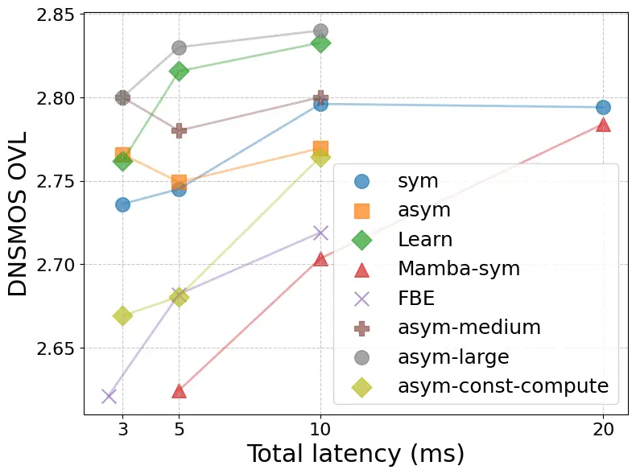
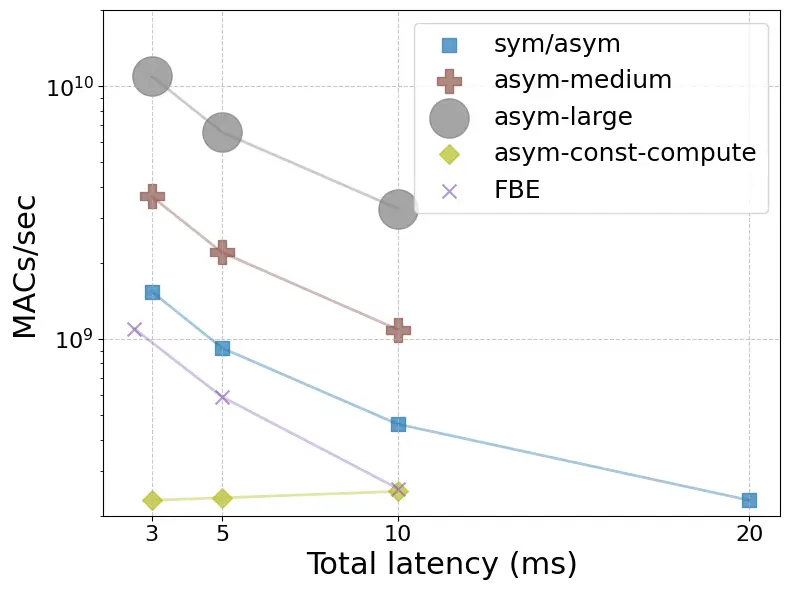

# Ultra-Low Latency Speech Enhancement - A Comprehensive Study Thanks: Work performed during H. Wu’s internship at Microsoft Research.

Haibin Wu    Sebastian Braun Affiliation: National Taiwan University,
Microsoft, Redmond, WA, USA

###### Abstract

Speech enhancement models should meet very low latency requirements
typically smaller than 5 ms for hearing assistive devices. While various
low-latency techniques have been proposed, comparing these methods in a
controlled setup using DNNs remains blank. Previous papers have
variations in task, training data, scripts, and evaluation settings,
which make fair comparison impossible. Moreover, all methods are tested
on small, simulated datasets, making it difficult to fairly assess their
performance in real-world conditions, which could impact the reliability
of scientific findings. To address these issues, we comprehensively
investigate various low-latency techniques using consistent training on
large-scale data and evaluate with more relevant metrics on real-world
data. Specifically, we explore the effectiveness of asymmetric windows,
learnable windows, adaptive time domain filterbanks, and the
future-frame prediction technique. Additionally, we examine whether
increasing the model size can compensate for the reduced window size, as
well as the novel Mamba architecture in low-latency environments.

###### Index Terms: 

Speech enhancement, low latency, Mamba

## I Introduction

Hearables and wearable audio devices have gained popularity recently,
making low-latency and real-time scenarios increasingly crucial in
speech enhancement (SE). Popular short-time Fourier transform
(STFT)-based SE models \[1, 2\] usually employ a 20 ms window for STFT /
inverse STFT with a 10 ms hop. The total latency is the window length
(20 ms), a summation of algorithmic latency (10 ms) due to the
overlap-add method used in signal re-synthesis, and the buffer latency
(hop length 10 ms). Processing time for each frame is not included.
However, the audible threshold for hearables, where the direct sound may
leak through and mix with the processed sound, is less than 5 ms \[3\].
In addition to hearing assistive devices, reducing the total latency of
voice over Internet protocol (VoIP) pipelines \[4\] by minimizing the
latency of each processing block is another key application.

While several low-latency SE techniques have been proposed over the last
decade, a controlled and systematic comparison of these methods,
especially using modern DNN models, is seldom investigated. \[5\] use
asymmetric windows \[6\] with a by now outdated architecture for speech
separation, with only a single 8 ms window setting, evaluate only on
small scale synthetic data and do not compare to other methods. \[7, 8,
9\] use learnable transforms, but do not focus on the low latency
aspect, therefore not comparing to other methods and mostly evaluate on
small scale synthetic data. \[10\] proposes an interesting filterbank
equalizer (FBE), but do not compare to obvious baselines like STFT
domain algorithms with asymmetric windows. A future frame prediction
technique is proposed in \[11, 12\] to reduce latency, but the key
deciding baseline comparing a model with and without prediction at same
latency is not provided. The Clarity Challenge \[13\] evaluates only
intelligibility, not audio quality, and rather compares overall systems
from entirely different pipelines, whereas we investigate details by
swapping out single modules in one base system, which provides detailed
insights.

There are two key challenges to fairly compare all low-latency
techniques in real-world SE: (a). Different low-latency tricks are
implemented in different settings. Even minor differences in training
hyper-parameters can lead to significantly different results \[14, 15\],
not to mention inconsistencies in evaluation settings and training data.
(b). Most works present results only on small, simulated datasets, which
sometimes can transfer surprisingly different to real-world conditions.
Some trends or advantages observed in small-scale datasets may not hold
when applied to large-scale, real-world data. Our main contributions are
summarized as follows: (1). We implement all models in a unified
framework to exclude impacts from different training data and pipelines,
model architectures, loss functions, and evaluation settings. (2). We
evaluate on large-scale data and more precise state-of-the-art metrics
to allow direct conclusions relevant to real-world performance in
commercial applications. (3). This is the first work to fairly evaluate
five different low latency techniques, including STFT based models with
symmetric and asymmetric windows, directly learning transforms from time
domain, FBE (adaptive time domain filtering) and the future frame
prediction.

## II Base enhancement pipeline

Single-channel SE aims to estimate the clean signal given the noisy
waveform $`x(t)=s(t)+n(t)`$, where $`n(t)`$ combines the added and
reverberant noise.

Our base enhancement pipeline comprises three processing blocks: 1). The
analysis transform transforms short segments of the noisy waveform into
time-frequency domain representations. 2). The SE model then processes
these representations to produce enhanced versions at each time step.
3). The synthesis transform converts the enhanced representations into
enhanced waveform $`\hat{s}(t)`$. The objective is to make
$`\hat{s}(t)`$ a faithful estimation to $`s(t)`$.

Analysis transform: We divide the input mixture waveform $`x(t)`$ into
overlapped segments with length $`L_{\text{a}}`$ and $`P`$ samples frame
shift. Each segment is represented by
$`\mathbf{x_{k}}\in\mathbb{R}^{1\times L_{\text{a}}}`$, where
$`k=1,\dots,K`$ is the segment index and $`K`$ is the total number of
segments. Each segment $`\mathbf{x}_{k}`$ is transformed into a
$`N`$-dimensional representation, $`X_{k}\in\mathbb{R}^{1\times N}`$ via
a 1-D convolution, detailed as:

```math
\displaystyle X_{k}=(\mathbf{x_{k}}\circ\mathbf{w}_{\text{a}})\cdot W_{fft} \tag{1}
```

where $`W_{fft}\in\mathbb{R}^{L_{\text{a}}\times N}`$ contains $`N`$
vectors (analysis transform basis functions, and can be initialized as
Fourier transform basis functions) with length $`L_{\text{a}}`$ each,
$`\cdot`$ denotes matrix multiplication, $`\circ`$ denotes element-wise
product, $`\mathbf{w}_{\text{a}}\in\mathbb{R}^{1\times L_{\text{a}}}`$
is the analysis window. After the analysis transform processing, we can
get the encoded time-frequency domain representations
$`X\in\mathbb{R}^{N\times K}`$. The combination of window
$`\mathbf{w}_{\text{a}}`$ and transform matrix $`W_{fft}`$ can be
implemented as a 1-D convolutional layer.

The enhancement model enhances $`X\in\mathbb{R}^{N\times K}`$ through
$`\hat{S}=f_{\theta}(X)`$: where $`f_{\theta}`$ denotes the DNN model
(predicting either enhancement filters or direct signal mapping)
parameterized by $`\theta`$, and $`\hat{S}\in\mathbb{R}^{N\times K}`$ is
the enhanced version of $`X`$.

Synthesis transform: The synthesis transform reconstructs the waveform
from each segment of the enhanced representation $`\hat{X}`$. For
example, given $`\hat{S}_{k}\in\mathbb{R}^{1\times\hat{N}}`$, where
$`k`$ denotes the segment index, the synthesis transform is performed
by:

```math
\displaystyle\mathbf{\hat{s}_{k}}=(\hat{S}_{k}\cdot W_{ifft})\circ\mathbf{w}_{\text{s}} \tag{2}
```

where $`\mathbf{\hat{s}}_{k}\in\mathbb{R}^{1\times L_{s}}`$ is the
transformed waveform, $`W_{ifft}\in\mathbb{R}^{N\times L_{s}}`$ contains
$`N`$ vectors (synthesis transform basis functions) with length
$`L_{s}`$ each, $`\mathbf{w}_{\text{s}}\in\mathbb{R}^{1\times L_{s}}`$
denotes the synthesis window. The overlapping segments are summed
together to generate the final enhanced waveform $`\hat{s}(t)`$. The
overlap-add process including windowing given by (2) can be implemented
as a single transpose convolutional layer. Note that the overlap-add
procedure introduces an algorithmic latency of $`L_{\text{s}}-P`$.

## III Low latency processing methods

In this section, we introduce low-latency strategies from previous
studies and integrate them into our unified base model to allow as fair
a comparison as possible. As backbone SE model ($`f_{\theta}`$), we use
the Convolutional Recurrent U-Net for Speech Enhancement (CRUSE) \[1\]
due to its balanced performance/compute footprint. It consists of a
series of convolutional layers, a 4-channel GRU bottleneck, mirrored
deconvolutional layers and conv-skip connections. We enhance via causal
3x3 deep filters as described in \[16, 17\]. Typically, time-frequency
processing techniques use symmetric, i. e.  identical analysis and
synthesis window pairs with $`L_{\text{a}}=L_{\text{s}}`$ as they are
easy to design for perfect reconstruction \[18\] and well-behaved. Here
we use sqrt-Hann windows. Note that for fair comparison, we keep the
model architecture consistent, independent of the window size. Also for
shorter windows, the architecture is identical to the 20 ms window one,
but when reducing window sizes, we keep the frequency resolution $`N`$,
i. e. feature size, constant by zero-padding the windows.

### III-A Asymmetric windows in analysis and synthesis transforms

As the latency of overlap-add algorithms is only determined by the
synthesis window length, shortening the synthesis window reduces
latency, while the analysis window length can be kept to not harm
frequency resolution \[6, 5\]. We use the asymmetric window pair
proposed in \[6, 5\], which consists of the concatenation of two half
Hann windows of different lengths for analysis, and a shorter Hann
window for synthesis.

### III-B Learnable analysis and synthesis transforms

\[7, 8, 9\] investigate learnable analysis and synthesis transforms,
partially demonstrating performance improvements over fixed analysis and
synthesis transforms. Specifically, they use trainable convolution /
transposed convolution layers, or separate trainable matrices to fulfill
(1) and (2). However, all studies \[7, 8, 9\] are restricted to
symmetric window settings and do not explore asymmetric settings. \[7,
8\] focus on speech separation. Further, the advantages shown on
non-reverberant or synthetic datasets sometimes vanish when applied to
real-world and reverberant cases. We implement the trainable version of
asymmetric analysis and synthesis transforms by using trainable
convolution / transposed convolution layers for Equation (1) and (2). We
further found adding a ReLU nonlinearity at the analysis improves
performance and stability.

### III-C Trainable filterbank equalizer

To heavily reduce latency, time-domain processing techniques using short
finite impulse response (FIR) filters seem an attractive choice. The
filterbank equalizer (FBE) proposed in \[19\] has been adopted for a DNN
in \[10\]. This adaptive FBE \[10\] predicts a bank of $`M`$
time-variant short FIR filters of length $`2P`$ for each frame. It was
designed as a two-stage architecture to first predict longer filters and
a second LSTM-based stage to shorten the filters for low latency. To
maintain fair comparability, we integrate the filter shortening module
in our base CRUSE model by letting the last convolutional layer predict
directly the set of $`2M`$ (double because complex) filters of length
$`N`$, which are then shortened by a linear mapping layer from $`N`$ to
$`2P`$. After filtering is carried out as complex multiplication with a
FFT of the corresponding input chunk, the output time frame is obtained
by iFFT and keeping the last $`P`$ samples (overlap-discard). Now the
total latency of this system is determined only by the length of these
filters, i. e.  the hop-size $`P`$. The resulting model size and
complexity change only marginally and remain, therefore, comparable.

### III-D Future frame prediction

To reduce the latency, \[11, 12\] proposed to predict one future frame
ahead, which seems reasonable when using overlapping frames, as a
portion of the future information is already available in the analysis
window. Specifically, this technique predicts the future enhanced frame
$`\hat{S}_{k+1}`$ from observations $`X_{0},X_{1},...,X_{k}`$ only up to
frame $`k`$. Our model uses a mapping-based target \[20\] to predict the
enhanced features, specifically, our model predicts the complex
compressed STFT spectrum. Predicting one frame ahead reduces the latency
by one hop-size, leading to zero algorithmic latency for 50% overlap.
The resulting total latency is then only the buffer latency (hop size).
While (deep) filtering \[17\] typically outperforms mapping \[20\] for
SE, the future-frame prediction model can only use a mapping-based
target, as a filtering-based target requires the current frame for
enhancement, which may be a disadvantage.

Notable missing settings in prior works investigating future frame
prediction are: (1) they only use mapping based systems, but we don’t
know if prediction with mapping can still be useful when compared to
more performant filtering based methods at same latency. (2) \[12\]
demonstrates that predicting one frame ahead only slightly degrades
performance by comparing scenarios with and without future-frame
prediction under the same window size, which however results in
different practically relevant _total latency_ of these two systems. In
this paper, we investigate these two missing settings in the context of
large-scale, real-world speech enhancement.

Row Model Name iWin oWin Latency Model Size MACs DNS blind set simulated
data SIG BAK OVR SIG BAK OVR PESQ STOI (%) SISDR A1 sym-20ms 20 20 20
0.625M 230.27M 3.18 3.78 2.79 2.87 4.03 2.46 2.22 84.45 10.52 A2
sym-10ms 10 10 10 0.625M 460.53M 3.16 3.81 2.79 2.83 4.03 2.43 2.24
84.59 10.32 A3 sym-5ms 5 5 5 0.625M 921.06M 3.12 3.77 2.74 2.78 4.02
2.38 2.21 84.46 9.94 A4 sym-3ms 3 3 3 0.625M 1.54G 3.12 3.77 2.74 2.76
4.02 2.36 2.18 84.23 9.65 B1 asym-10ms 20 10 10 0.625M 460.53M 3.15 3.78
2.77 2.84 4.03 2.44 2.22 84.34 10.18 B2 asym-5ms 20 5 5 0.625M 921.06M
3.13 3.77 2.75 2.81 4.03 2.41 2.16 84.20 10.06 B3 asym-3ms 20 3 3 0.625M
1.54G 3.15 3.78 2.77 2.80 4.02 2.40 2.16 84.17 9.85 C1 Learn-asym-10ms
20 10 10 0.625M 460.53M 3.23 3.78 2.83 2.88 4.03 2.47 2.31 84.88 10.84
C2 Learn-asym-5ms 20 5 5 0.625M 921.06M 3.19 3.81 2.82 2.80 4.03 2.40
2.31 85.02 10.64 C3 Learn-asym-3ms 20 3 3 0.642M 1.54G 3.14 3.78 2.76
2.76 4.02 2.37 2.22 84.22 10.13 D1 asym-same_compute-10ms 20 10 10
0.551M 249.8M 3.13 3.80 2.76 2.82 4.02 2.41 2.18 84.08 9.90 D2
asym-same_compute-5ms 20 5 5 0.157M 235.04M 3.08 3.71 2.68 2.76 4.01
2.36 2.10 83.04 9.29 D3 asym-same_compute-3ms 20 3 3 0.142M 230.33M 3.09
3.66 2.67 2.74 3.99 2.33 2.05 82.77 9.03 E1 Mamba-20ms 20 20 20 0.642M -
3.19 3.80 2.81 2.87 4.03 2.46 2.27 84.59 10.61 E2 Mamba-10ms 10 10 10
0.642M - 3.10 3.77 2.72 2.81 4.02 2.40 2.21 83.96 10.16 E3 Mamba-5ms 5 5
5 0.642M - 3.03 3.67 2.63 2.73 4.00 2.33 2.15 83.42 9.71 F1
asym-10ms-medium 20 10 10 2.32M 1.09G 3.19 3.77 2.80 2.85 4.02 2.44 2.30
84.75 10.56 F2 asym-5ms-medium 20 5 5 2.32M 2.20G 3.16 3.80 2.78 2.84
4.03 2.43 2.19 84.15 10.07 F3 asym-3ms-medium 20 3 3 2.32M 3.66G 3.18
3.78 2.80 2.82 4.02 2.42 2.22 84.68 10.16 F4 asym-10ms-large 20 10 10
8.67M 3.28G 3.22 3.80 2.84 2.87 4.04 2.47 2.33 85.24 10.70 F5
asym-5ms-large 20 5 5 8.67M 6.57G 3.22 3.77 2.83 2.85 4.03 2.45 2.29
85.08 10.55 F6 asym-3ms-large 20 3 3 8.67M 10.95G 3.20 3.76 2.80 2.82
4.01 2.42 2.27 84.89 10.34 G1 asym-3ms-mapping 20 3 3 0.625M 1.54G 3.10
3.74 2.70 2.70 4.01 2.28 1.91 81.85 8.19 G2 asym-6ms-predict 6 6 3
0.625M 767.57M 3.06 3.71 2.65 2.71 4.01 2.29 2.09 83.35 9.34 H1
FBE-10ms - - 10 0.656M 256.1M 3.15 3.68 2.72 2.80 3.93 2.36 2.05 82.98
8.91 H2 FBE-5ms - - 5 0.644M 590.6M 3.11 3.65 2.68 2.75 3.93 2.32 2.00
82.90 8.60 H3 FBE-2.5ms - - 2.5 0.637M 1.098G 3.07 3.58 2.62 2.71 3.89
2.27 1.89 81.73 7.80

TABLE I: Comparison for different windows and models. iWin and oWin
denote the input and output window lengths.





Fig. 1: Overall results for various low latency methods and model sizes
(left), and MACs/sec for models (right).

## IV Experiments

### IV-A Experimental setup

We use a large-scale training dataset by mixing speech and noise
on-the-fly. The speech is 700hour high MOS-rated speech from the
LibriVox and AVspeech corpora, while the noise data includes 247-hour
recordings from Audioset, Freesound, internal noise sources, and 1 hour
of colored stationary noise. Except the 65-hour internal noise, all data
is available in the 2nd DNS challenge¹¹ 1
https://github.com/microsoft/DNS-Challenge/tree/icassp2021-final. The
mixing and reverberation strategies, loss and training scheme are
exactly following \[1\]. As test set, we use a combination of the 4th
and 5th DNS Challenge blind test sets²² 2
https://github.com/microsoft/DNS-Challenge, and an additional simulated
test set similarly generated as the training data but from different
speech and noise corpora. To increase the test set difficulty and
enhance the significance of the results, we used only lower
signal-to-reverberation data portion for DNS test (bottom 50%, 611 files
in total).

As evaluation metrics we use DNSMOS \[21\], a DNN developed to predict
mean opinion scores (MOS) for signal (SIG), background (BAK), and
overall (OVL) quality. Also, we evaluate intrusive objective metrics
such as Perceptual Evaluation of Speech Quality (PESQ), Short-Time
Objective Intelligibility (STOI), and signal-invariant
signal-to-distortion ratio (siSDR) on the validation set. We also
provide the model size (number of parameters), and complexity in terms
of multiply-accumulate operations (MACs) measured for processing 1
second of audio data.

### IV-B Experimental results

#### IV-B1 Window type

From Table I (rows A1-A4, B1-B3, C1-C3, H1-H3) and Figure 1 (left
figure) with confidence intervals (95%) per model being around 0.017, we
can observe the following: (1). Reducing the latency from 20 to 10 ms
does not degrade performance at all for “sym”, while we see a
performance drop for 5 ms and lower. (2). Surprisingly, the asymmetric
window settings perform not significantly different or sometimes mildly
worse than symmetric windows. (3). The learnable transform outperforms
non-trainable STFT transforms at higher latency, while the differences
seems to become negligible at low latency. (4). The FBE using
overlap-save (H1-H3) performs significantly worse than overlap-add based
methods (A2-C3). The DNSMOS real test results show an inconsistency of
“asym” gaining performance when going from 5 to 3ms, however the
synthetic test set (Table. I) shows an expected constant drop when
decreasing latency.

We hypothesize that a powerful model like CRUSE is able to compensate
well for smaller analysis windows (symmetric setting), therefore making
the asymmetric window technique obsolete. To investigate this further,
we included a weaker model, U-Net, to see if the asymmetric window
shines when the model capacity is limited. Our U-Net is derived by just
removing the GRU bottleneck from the CRUSE architecture. The results for
UNet are shown in Table II. From Table II we can observe clear
advantages of the asymmetric-window models over the corresponding
symmetric-window models, while for the full CRUSE model in Table I the
differences are not conclusive or significant. This suggests that strong
models can compensate for the negative effects of short symmetric
windows, while the advantage of asymmetric windows is only significant
for weaker models.

iWin (ms) oWin (ms) SIG BAK OVR 20 20 2.80 3.74 2.47 10 10 2.71 3.61
2.35 20 10 2.72 3.64 2.38 5 5 2.59 3.54 2.24 20 5 2.66 3.57 2.30 3 3
2.49 3.53 2.16 20 3 2.62 3.52 2.25

TABLE II: Comparison between asymmetric and symmetric windows. The model
architecture is UNet.

#### IV-B2 Model size and computational demand

When reducing the window size to get lower latency, performance
inevitably drops. It is however important to note, that reducing the
latency by reducing window sizes while keeping the DNN model fixed,
increases the compute demand per second of audio data inverse
proportionally to the hop-size as shown in Figure 1 right (blue line),
as there is less time to execute the same computation, or the frame rate
is higher. For reference, if one would keep the compute budget per time
constant, the model size or compute demand has to be reduced
proportionally to the hop-size. We designed several CRUSE models using
asymmetric windows for the smaller hop-sizes by changing the number of
conv filters to keep the MACs/second roughly constant. These models are
shown in Figure 1 as the olive line. We can see that the performance
drops much more significantly than for the fixed model sizes (orange).

To investigate how much performance drop caused by reducing the window
size can be recovered by increasing model size, we design three model
sizes, original, medium, and large, by increasing the number of conv
filters. When enlarging the models (F1-F6 in Table I and Figure 1), we
observe increasing model sizes can fully compensate for the performance
drop of small windows: The large 3 ms latency model performs on par to
the original 20 ms latency model.

Lastly, the FBE has lower complexity at same total latency, as its
latency only depends on the hop-size, not the (overlapping) window size.
However, even factoring this advantage in, this model design seems to
underperform the other techniques.

#### IV-B3 Investigation for Mamba

The novel Mamba architecture \[22\] combines a state-space model with a
selection mechanism. Mamba demonstrated performance on par with or
exceeding Transformers across various tasks, including speech
enhancement \[23\] and separation \[24\]. Additionally, Mamba is notable
for its computational efficiency. However, previous studies \[23, 24\]
have not examined Mamba’s performance under low-latency conditions. We
replace the GRU in CRUSE with Mamba, and the two settings have similar
number of model parameters as in Table I. From Table I (A1, E1-E3), we
observe that: (1). Mamba performs pretty well in standard latency (20
ms). (2). However, its performance significantly declines when the
latency is reduced.

#### IV-B4 Investigation for the future-frame prediction technique

To fully investigate the usefulness of future frame prediction, which is
only possible using a signal mapping approach, we compare in Table I the
standard filtering based models (A4, B3) with signal mapping based
models without prediction (G1) and with prediction (G2) at the same
total latency. Note that the prediction model (G2) can use a larger
window size at the same latency. (1). A4 and B3 outperform G1 and G2
across all metrics in both the DNS blind test and simulated test data.
The future-frame prediction technique is limited to mapping, which
becomes a bottleneck, leading to worse results compared to
filtering-based models. (2). Comparing G2 and G1, G2 performs better on
simulated data, consistent with the original paper’s findings (which
also used simulated data). However, G2 performs worse in the DNS blind
test. A possible reason is that the future-frame prediction trick fits
the training data well, which is also simulated data, but struggles to
generalize on real-world DNS challenge data.

## V conclusion

This study addresses the gap in low-latency speech enhancement by
evaluating various methods within a unified framework. Our findings
reveal that asymmetric windows show hardly any benefit over symmetric
ones for a strong SE model, but significantly boost the performance of
smaller and weaker DNN models. The Mamba model excels at standard
latency but suffers at lower latencies. Learnable windows outperform
both asymmetric and symmetric options. The future-frame prediction
technique shows no conclusive benefits at same latency and has severe
limitations being restricted to lower performing mapping targets.
Finally, increasing model size enough can fully recover the performance
loss associated with reduced window sizes. We hope the insights and
take-aways can help future researchers in developing real-world
low-latency SE systems.

## References

- \[1\] S. Braun, H. Gamper, C. K. Reddy, and I. Tashev, “Towards
  efficient models for real-time deep noise suppression,” in _IEEE
  International Conference on Acoustics, Speech and Signal Processing
  (ICASSP)_. IEEE, 2021, pp. 656–660.
- \[2\] K. Tan and D. Wang, “Learning complex spectral mapping with
  gated convolutional recurrent networks for monaural speech
  enhancement,” _IEEE/ACM Transactions on Audio, Speech, and Language
  Processing_, vol. 28, pp. 380–390, 2019.
- \[3\] S. Graetzer, J. Barker, T. J. Cox, M. Akeroyd, J. F. Culling,
  G. Naylor, E. Porter, and R. Viveros Munoz, “Clarity-2021 challenges:
  Machine learning challenges for advancing hearing aid processing,” in
  _Proceedings of the Annual Conference of the International Speech
  Communication Association, INTERSPEECH_, vol. 2, 2021.
- \[4\] B. Goode, “Voice over internet protocol (voip),” _Proceedings of
  the IEEE_, vol. 90, no. 9, pp. 1495–1517, 2002.
- \[5\] S. Wang, G. Naithani, A. Politis, and T. Virtanen, “Deep neural
  network based low-latency speech separation with asymmetric
  analysis-synthesis window pair,” in _2021 29th European Signal
  Processing Conference (EUSIPCO)_. IEEE, 2021, pp. 301–305.
- \[6\] D. Mauler and R. Martin, “A low delay, variable resolution,
  perfect reconstruction spectral analysis-synthesis system for speech
  enhancement,” in _2007 15th European Signal Processing
  Conference_. IEEE, 2007, pp. 222–226.
- \[7\] Y. Luo and N. Mesgarani, “Conv-tasNet: Surpassing ideal
  time–frequency magnitude masking for speech separation,” _IEEE/ACM
  transactions on audio, speech, and language processing_, vol. 27,
  no. 8, pp. 1256–1266, 2019.
- \[8\] M. Maciejewski, G. Wichern, E. McQuinn, and J. Le Roux, “WHAMR!:
  Noisy and reverberant single-channel speech separation,” in _ICASSP
  2020-2020 IEEE International Conference on Acoustics, Speech and
  Signal Processing (ICASSP)_. IEEE, 2020, pp. 696–700.
- \[9\] J. Casebeer, U. Isik, S. Venkataramani, and A. Krishnaswamy,
  “Efficient trainable front-ends for neural speech enhancement,” in
  _ICASSP 2020-2020 IEEE International Conference on Acoustics, Speech
  and Signal Processing (ICASSP)_. IEEE, 2020, pp. 6639–6643.
- \[10\] C. Zheng, W. Liu, A. Li, Y. Ke, and X. Li, “Low-latency
  monaural speech enhancement with deep filter-bank equalizer,” _The
  Journal of the Acoustical Society of America_, vol. 151, no. 5, pp.
  3291–3304, 2022.
- \[11\] Y. Iotov, S. M. Nørholm, V. Belyi, M. Dyrholm, and M. G.
  Christensen, “Computationally efficient fixed-filter ANC for speech
  based on long-term prediction for headphone applications,” in _ICASSP
  2022-2022 IEEE International Conference on Acoustics, Speech and
  Signal Processing (ICASSP)_. IEEE, 2022, pp. 761–765.
- \[12\] Z.-Q. Wang, G. Wichern, S. Watanabe, and J. Le Roux,
  “STFT-domain neural speech enhancement with very low algorithmic
  latency,” _IEEE/ACM Transactions on Audio, Speech, and Language
  Processing_, vol. 31, pp. 397–410, 2022.
- \[13\] T. J. Cox, J. Barker, W. Bailey, S. Graetzer, M. A. Akeroyd,
  J. F. Culling, and G. Naylor, “Overview of the 2023 ICASSP SP Clarity
  challenge: Speech enhancement for hearing aids,” in _IEEE
  International Conference on Acoustics, Speech and Signal Processing
  (ICASSP)_. IEEE, 2023, pp. 1–2.
- \[14\] S. Watanabe, T. Hori, S. Karita, T. Hayashi, J. Nishitoba,
  Y. Unno, N. E. Y. Soplin, J. Heymann, M. Wiesner, N. Chen _et al._,
  “Espnet: End-to-end speech processing toolkit,” _arXiv preprint
  arXiv:1804.00015_, 2018.
- \[15\] S.-w. Yang, H.-J. Chang, Z. Huang, A. T. Liu, C.-I. Lai, H. Wu,
  J. Shi, X. Chang, H.-S. Tsai, W.-C. Huang _et al._, “A large-scale
  evaluation of speech foundation models,” _IEEE/ACM Transactions on
  Audio, Speech, and Language Processing_, 2024.
- \[16\] S. Braun and M. L. Valero, “Task splitting for dnn-based
  acoustic echo and noise removal,” in _2022 International Workshop on
  Acoustic Signal Enhancement (IWAENC)_, 2022, pp. 1–5.
- \[17\] W. Mack and E. A. Habets, “Deep filtering: Signal extraction
  and reconstruction using complex time-frequency filters,” _IEEE Signal
  Processing Letters_, vol. 27, pp. 61–65, 2019.
- \[18\] E. Hänsler and G. Schmidt, _Speech and audio processing in
  adverse environments_. Springer Science & Business Media, 2008.
- \[19\] H. W. Löllmann and P. Vary, “Uniform and warped low delay
  filter-banks for speech enhancement,” _Speech Communication_, vol. 49,
  no. 7-8, pp. 574–587, 2007.
- \[20\] Y. Xu, J. Du, L.-R. Dai, and C.-H. Lee, “A regression approach
  to speech enhancement based on deep neural networks,” _IEEE/ACM
  transactions on audio, speech, and language processing_, vol. 23,
  no. 1, pp. 7–19, 2014.
- \[21\] C. K. Reddy, H. Dubey, V. Gopal, R. Cutler, S. Braun,
  H. Gamper, R. Aichner, and S. Srinivasan, “ICASSP 2021 deep noise
  suppression challenge,” in _IEEE International Conference on
  Acoustics, Speech and Signal Processing (ICASSP)_. IEEE, 2021, pp.
  6623–6627.
- \[22\] A. Gu and T. Dao, “Mamba: Linear-time sequence modeling with
  selective state spaces,” _arXiv preprint arXiv:2312.00752_, 2023.
- \[23\] R. Chao, W.-H. Cheng, M. La Quatra, S. M. Siniscalchi, C.-H. H.
  Yang, S.-W. Fu, and Y. Tsao, “An investigation of incorporating mamba
  for speech enhancement,” _arXiv preprint arXiv:2405.06573_, 2024.
- \[24\] K. Li and G. Chen, “Spmamba: State-space model is all you need
  in speech separation,” _arXiv preprint arXiv:2404.02063_, 2024.
