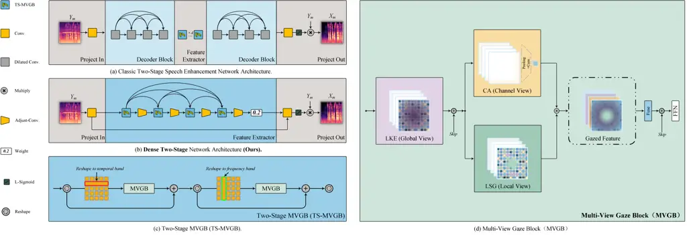
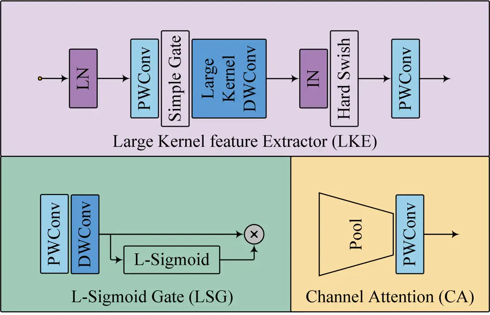
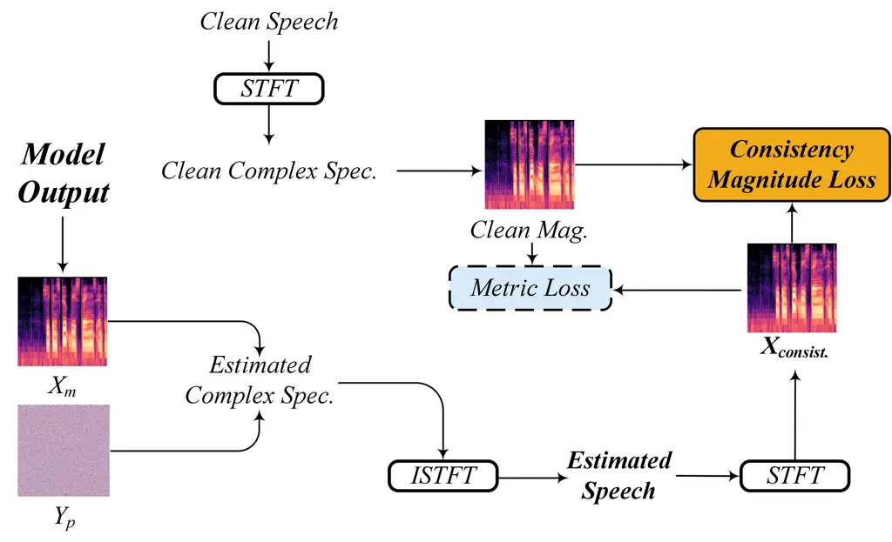
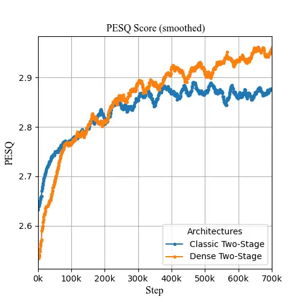
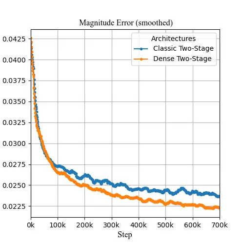
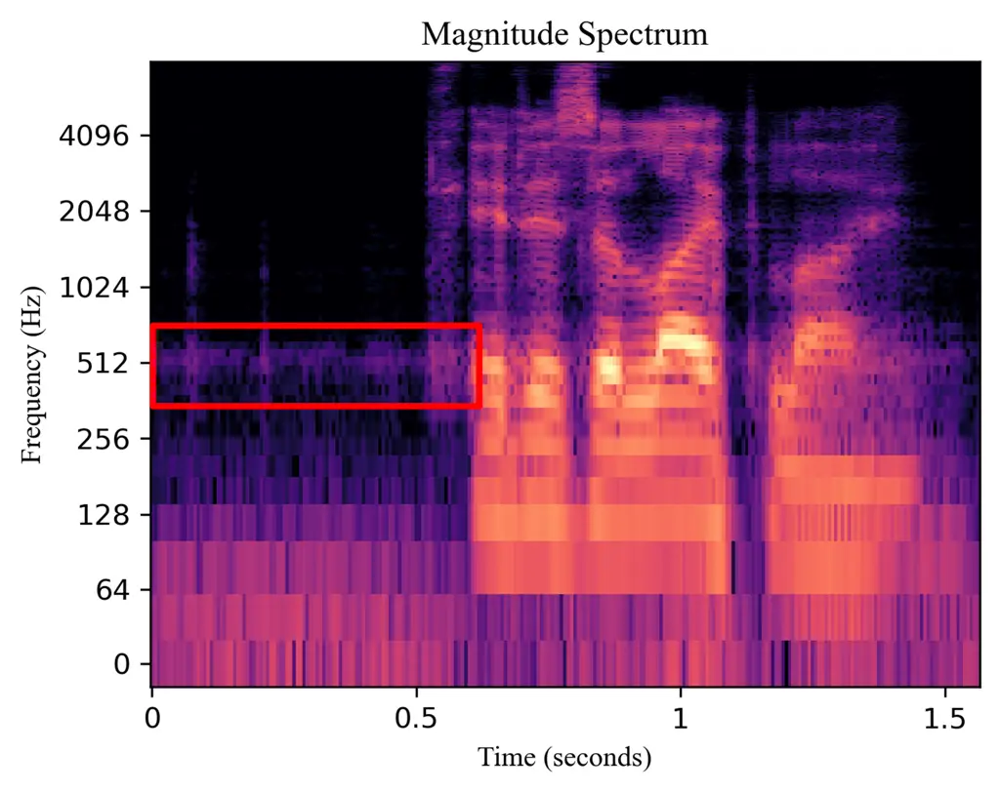
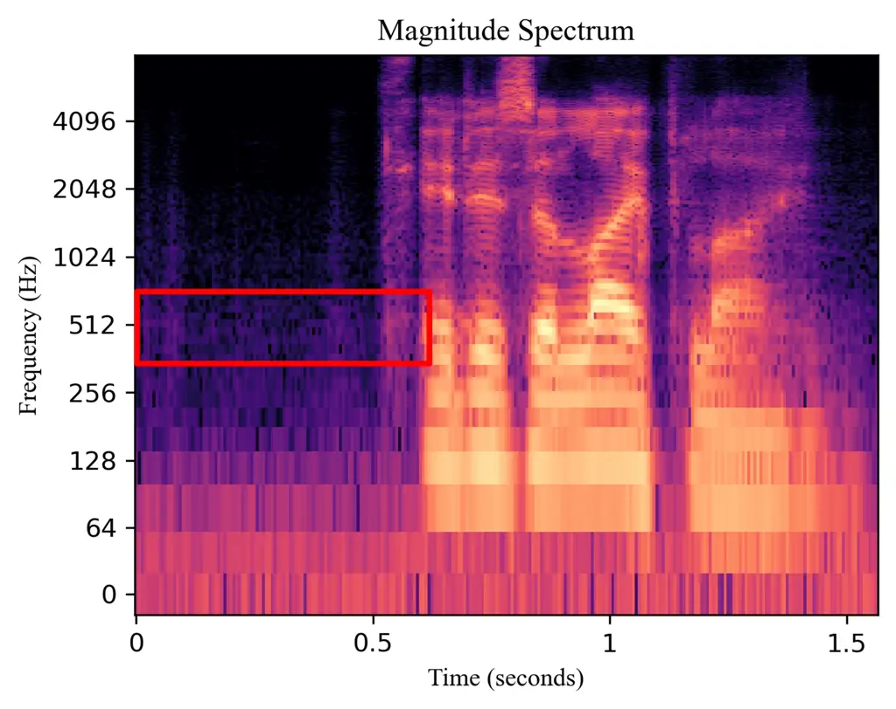

# Dense-TSNet: Dense Connected Two-Stage Structure for Ultra-Lightweight Speech Enhancement Thanks: Source codes will be released after paper acceptance, audio samples can be found at https://github.com/huaidanquede/Dense-TSNet

1^(st) Zizhen Lin Affiliation: School of Electronic Information  
Sichuan University  
Chengdu, China  
linzizhen17@163.com Affiliation:     2^(nd) Yuanle Li
Affiliation: School of Communications and Information Engineering  
Chongqing University of Posts and Telecommunications  
Chongqing, China  
S220132086@stu.cqupt.edu.cn Affiliation:     3^(rd) Junyu Wang
Affiliation: College of Intelligence and Computing  
Tianjin University  
Tianjin, China  
junyu$`\_`$wang21@tju.edu.cn    4^(th) Ruili Li Affiliation: School of
Medicine  
Tohoku University  
Sendai, Japan  
li.ruili.t3@dc.tohoku.ac.jp

###### Abstract

Speech enhancement aims to improve speech quality and intelligibility in
noisy environments. Recent advancements have concentrated on deep neural
networks, particularly employing the Two-Stage (TS) architecture to
enhance feature extraction. However, the complexity and size of these
models remain significant, which limits their applicability in
resource-constrained scenarios. Designing models suitable for edge
devices presents its own set of challenges. Narrow lightweight models
often encounter performance bottlenecks due to uneven loss landscapes.
Additionally, advanced operators such as Transformers or Mamba may lack
the practical adaptability and efficiency that convolutional neural
networks (CNNs) offer in real-world deployments. To address these
challenges, we propose Dense-TSNet, an innovative ultra-lightweight
speech enhancement network. Our approach employs a novel Dense Two-Stage
(Dense-TS) architecture, which, compared to the classic Two-Stage
architecture, ensures more robust refinement of the objective function
in the later training stages. This leads to improved final performance,
addressing the early convergence limitations of the baseline model. We
also introduce the Multi-View Gaze Block (MVGB), which enhances feature
extraction by incorporating global, channel, and local perspectives
through convolutional neural networks (CNNs). Furthermore, we discuss
how the choice of loss function impacts perceptual quality. Dense-TSNet
demonstrates promising performance with a compact model size of around
14K parameters, making it particularly well-suited for deployment in
resource-constrained environments.

###### Index Terms: 

speech enhancement, lightweight, dense connection, multi-view, metric
loss

## I Introduction

Speech enhancement and noise suppression technologies aim to improve
speech clarity in noisy environments \[1\]. These technologies are vital
for applications like voice calls, video recording, and automatic speech
recognition (ASR).

Recent research, inspired by TSTNN \[2\], utilizes the Two-Stage (TS)
architecture for deep feature extraction, which represents the Classic
Two-Stage in this paper. This architecture reshapes and partitions
spectral data, effectively addresses spectral distribution
characteristics. TSTNN also features an encoder-decoder with a dilated
dense block \[3\], which improves information flow stability and
enhances local and large-scale feature dependency.

In the time-frequency (TF) domain, some models focus solely on amplitude
information, while others enhance complex spectrograms (real and
imaginary parts) to indirectly improve both amplitude and phase. For
instance, CMGAN \[4\] uses a dual-decoder structure for amplitude and
complex spectrograms, and MP-SEnet \[5\] directly estimates amplitude
and phase spectrograms.

Loss functions in speech enhancement typically compute the
$`L_{p}`$-norm distance between estimated and target spectrograms.
MetricGAN \[6, 7\], however, uses learned evaluation metrics from a
discriminator to address the challenge of non-differentiable assessment
metrics.

Despite the strong performance of deep neural network-based methods,
these come with increased model complexity. New methods like Transformer
\[8\] or Mamba \[9, 10\] also face challenges with optimized deployment
operators. Consequently, developing ultra-lightweight models is
essential for practical applications in edge devices such as smartphones
and cameras. Acknowledging the current landscape, research on
single-channel speech enhancement models with around 10k parameters is
still limited. This gap underscores the need for innovative approaches
to develop effective models at this scale.

Motivated by this, we propose an ultra-lightweight speech enhancement
network called Dense-TSNet. Our contributions are as follows:



Fig. 1: The overall architecture of Classic Two-Stage and Dense-TS
(ours).

- •
  We propose a novel Dense-TS (Dense Two-Stage) structure to address the
  issue of loss landscape \[11\] smoothness in narrow lightweight
  models.
- •
  We design the Multi-View Gaze Block (MVGB) to capture features from
  global, channel, and local views, entirely based on CNNs \[12\] for
  ease of deployment.
- •
  We explore loss functions through comparative experiments and propose
  a method utilizing Consistency Magnitude Loss to reconstruct speech
  signals, as relying on Metric Loss to improve objective perceptual
  metrics may negatively impact subjective perception.
- •
  The proposed Dense-TS Net model has a size of only 14K, which, to our
  knowledge, is the first to achieve a speech enhancement model with
  approximately 10k parameters.

## II methods

### II-A Overall Structure

The speech signal is processed using Short-Time Fourier Transform (STFT)
to convert it into the time-frequency (TF) domain. The magnitude and
phase spectra are derived from the complex spectrum. As illustrated in
Fig. 1, Dense-TSNet inputs only the magnitude spectrum and performs
time-frequency feature extraction through the Dense-TS structure with
the TS-MVGB.

### II-B Dense-TS

The classic Two-Stage speech enhancement network architecture \[2\],
shown in Fig. 1 (a), consists of two core components. The first is a
densely connected encoder-decoder with dilated convolutions and dense
connections for robust feature fusion. The second is a feature
extraction layer with serially connected Two-Stage modules as shown in
Fig. 1 (c), decomposing spectral feature extraction into two phases.
Given a spectral feature map
$`D\in\mathbb{R}^{B\times T\times F\times C}`$, $`D`$ is reshaped to
$`D_{T}\in\mathbb{R}^{BF\times T\times C}`$ for temporal dependencies
and then reshaped to $`D_{F}\in\mathbb{R}^{BT\times F\times C}`$ for
frequency dependencies, with the final output $`D_{o}`$ reshaped to the
input size. This architecture performs well with a channel count of 64
\[13, 4, 5, 14\] but faces limitations for ultra-lightweight networks
with a narrow architecture with fewer channels, which may cause uneven
loss landscapes \[11\].

To address these issues, we propose the Dense-TS structure, shown in
Fig. 1(b). This structure replaces dilated convolutions in Dilated Dense
Block with Two-Stage modules, resulting in a network composed entirely
of densely connected Two-Stage modules.

Specifically, we mapping features to a high-dimensional space using 1×1
convolutions. Unlike the classic Two-Stage structure, we omit the
dilated dense block in the encoder and directly proceed to the Two-Stage
feature extraction block with dense connection to merge shallow and deep
features. The Two-Stage structure remains consistent with the classic
approach, with our Multi-View Gaze Block (MVGB) efficiently extracting
global, channel and high-frequency local information.

Given $`dense\_channel`$ is the number of channels in the dense layers
and $`depth`$ is the number of layers in the dense block.

For each layer $`i`$ in the Dense-TS:

- •
  The number of input channels to the $`i`$-th Two-Stage layer is
  $`C_{i}=dense\_channel\times(i+1)`$.
- •
  The number of output channels from the $`i`$-th adjust convolutional
  layer is $`C_{out}=dense\_channel`$.

The output of each TS-MVGB is a serial connection of time-MVGB and
freq-MVGB:

```math
\text{TS-MVGB}_{i}(x)=\text{freq-MVGB}\left(\text{time-MVGB}\left(x\right)\right) \tag{1}
```

Given the input feature map $`x`$:

```math
\text{skip}_{0}=x \tag{2}
```

For $`i=0,1,\ldots,\text{depth}-1`$:

```math
\text{skip}_{i}=\text{Concat}\left(\text{Adjust-Conv}(\text{TS-MVGB}_{i}(\text{skip}_{i-1})),\text{skip}_{i-1}\right) \tag{3}
```

The final output of the Dense-TS is:

```math
\text{output}=0.2*\text{skip}_{\text{depth}-1}+x \tag{4}
```

Additionally, after each Two-Stage module, a convolutional layer as
Adjust-Conv is used to adjust the channel count and further integrate
time-frequency information. Beyond dense connections, we add an extra
residual connection. Finally, features undergo L-Sigmoid \[5\]
activation and 1×1 convolution to decode the magnitude spectrum mask,
which is then multiplied by the noisy magnitude spectrum to produce the
network’s output.

### II-C Multi-View Gaze Block

Inspired by NAFnet \[15\] and Conformer \[16\], we designed the
Multi-View Gaze Block (MVGB). As shown in Fig. 1 (d), the MVGB consists
of three sub-modules: Large Kernel Extractor (LKE), Learnable-Sigmoid
Gate (LSG), Channel Attention (CA).



Fig. 2: The internal details of the LKE, LSG and CA.

Large Kernel Extractor (LKE) The Large Kernel Extractor (LKE) is
responsible for establishing a global perspective, drawing inspiration
from the CNN component of Conformer. As shown in Fig. 2, LKE is composed
of a sequence of pointwise convolutions, Simple Gate \[15\], large
kernel depthwise convolutions \[17, 16\], Instance Norm, HardSwish
\[18\], and pointwise convolutions. The large kernel depthwise
convolutions provide a large receptive field to capture long-range
low-frequency features, while Simple Gate and HardSwish are designed
with lightweight considerations.

The input $`x`$ is normalized and then divided into two branches.

Channel Attention (CA) The first branch is Channel Attention (CA)
\[15\], which reallocates weights to each channel, allowing the module
to focus more on important channels while suppressing less significant
ones, resulting in a more precise feature representation \[19\].

Learnable-Sigmoid Gate (LSG) The LSG shown in Fig. 2 is responsible for
establishing local spatial perspectives, consists of depth-wise
convolution, point-wise convolution, and Learnable-Sigmoid activation
function. This branch is inspired by the Learnable-Sigmoid activation
function used in MP-SENet\[5\] for generating masks. Its flexibility
makes it crucial for generating accurate masks. This branch focuses on
modeling local information within the feature map, enhancing
high-frequency details and spatial invariance in the spectrum.

Finally, by multiplying the channel weights and spatial weights obtained
from the two branches, Multi-view Gazed features are generated, which
are then further fused through pointwise convolution.

### II-D Loss Functions



Fig. 3: Training criteria of the proposed Dense-TSNet.

Considering that lightweight networks cannot fully fit complex
multi-domain features due to having fewer parameters compared to
state-of-the-art (SOTA) methods \[14, 4, 10, 5, 13, 20\], we chose not
to use methods based on complex spectra or phase spectra. Instead, we
designed a loss function that focuses on aspects more crucial to
perceptual quality, aiming to minimize the distance between the
estimated magnitude spectrum and the clean magnitude spectrum. Inspired
by SCP-GAN \[21\], since the Short-Time Fourier Transform (STFT) space
differs from the space of the actual speech after the Inverse STFT
(ISTFT). Previous methods based on the complex domain achieve
consistency loss by computing the minimum distance between the complex
spectra of speech after ISTFT and STFT, and the complex spectra output
by the network. We directly compute the minimum distance between the
magnitude spectrum of the twice-STFTed speech and the clean speech
magnitude spectrum, as shown in Fig. 3. This loss
$`L_{Mag_{Consis.}}`$is defined as Consistency Magnitude Loss:

```math
L_{Mag_{Consis.}}=\mathbb{E}_{X_{m},X_{consis.}}\left[\left\|X_{m}-X_{consis.}\right\|_{2}^{2}\right]. \tag{5}
```

Additionally, we validated the impact of using Metric Loss, which
integrates objective evaluation metrics as loss functions, thereby
improving model performance on perceptual quality scores. The Metric
Loss is computed using the PESQ metric \[4, 6, 7\] via a discriminator:

```math
\displaystyle L_{D} \displaystyle=\mathbb{E}_{X_{m}}\left[\left\|D\left(X_{m},X_{m}\right)-1\right\|_{2}^{2}\right] \tag{6}
```

```math
\displaystyle+\mathbb{E}_{X_{m},X_{consis.}}\left[\left\|D\left(X_{m},X_{consis.}\right)-Q_{PESQ}\right\|_{2}^{2}\right].
```

```math
L_{\text{Metric}}=\mathbb{E}_{X_{m},X_{consis.}}\left[\left\|D\left(X_{m},X_{consis.}\right)-1\right\|_{2}^{2}\right]. \tag{7}
```

Finally, we assign weights $`\lambda_{1}`$ and $`\lambda_{2}`$ to the
two losses as Generator Loss, as $`\lambda_{2}`$ is set to $`0`$ by
default:

```math
L_{G}=\lambda_{1}L_{Mag_{Consis.}}+\lambda_{2}L_{\text{Metric}}. \tag{8}
```

## III Experiments

### III-A Datasets and Model Setup

For our experiments, we utilized the VoiceBank+DEMAND dataset \[22\],
known for its high-fidelity utterances. Speech samples were segmented
into two-second intervals for the short-time Fourier transform,
employing an FFT size of 400, a window length of 400, and a hop length
of 100. The training process was conducted with a batch size of 2, using
the AdamW optimizer \[23\], and was carried out for up to 1,000,000
steps.

### III-B Evaluation Metrics

To evaluate the quality of the denoised speech, we employed widely
recognized metrics: PESQ \[24\], which ranges from -0.5 to 4.5,
MOS-based metrics (CSIG, CBAK, COVL) with a range of 1 to 5. Higher
scores on these metrics reflect superior performance.

### III-C Result



((a)) PESQ Score



((b)) Magnitude Error

Fig. 4: Training curves of Dense-TS and Classic-TS

Fig. 4 shows the training curves for the 6-channel version of the
classic Two-Stage framework and the 4-channel version of the Dense-TS
framework (with similar parameter counts), both of which use the MVGB
approach we proposed. According to the PESQ curves, while the classic
Two-Stage structure converges faster in the early stages, the Dense-TS
framework can achieve a better performance in the later stages. This
improvement is attributed to the smoother loss landscape provided by the
dense connections in the narrower model \[11\].

|                       |      |      |      |      |       |      |
| --------------------- | ---- | ---- | ---- | ---- | ----- | ---- |
| Model                 | PESQ | CSIG | CBAK | COVL | Para. | MACs |
| TSTNN \[2\]           | 2.96 | 4.33 | 3.53 | 3.67 | 0.92M | \-   |
| PHASEN \[25\]         | 2.99 | 4.18 | 3.45 | 3.50 | 20.9M | \-   |
| MANNER-S-5.3GF \[26\] | 3.06 | 4.42 | 3.58 | 3.77 | 0.90M | \-   |
| CCFNet(Lite) \[27\]   | 2.87 | \-   | \-   | \-   | 160K  | 390M |
| DeepFilterNet \[28\]  | 2.81 | 4.14 | 3.31 | 3.46 | 1.78M | 350M |
| Classic TS            | 2.96 | 4.45 | 3.58 | 3.78 | 14K   | 388M |
| Dense-TSNet           | 3.05 | 4.51 | 3.58 | 3.86 | 14K   | 356M |

TABLE I: Comparison with other methods on VoiceBank+DEMAND dataset. “-”
denotes the result is not provided in the original paper.

Table I shows the performance comparison of our method with the classic
Two-Stage structure and some lightweight algorithms. Our method achieves
competitive performance with extremely low parameters.

| Model                | PESQ | CSIG | CBAK | COVL | SSNR |
| -------------------- | ---- | ---- | ---- | ---- | ---- |
| Dense-TSNet          | 3.05 | 4.51 | 3.58 | 3.86 | 8.16 |
| w/o LKE              | 2.79 | 4.31 | 3.47 | 3.61 | 8.62 |
| w/o CA               | 2.86 | 4.38 | 3.53 | 3.69 | 8.91 |
| w/o LSG              | 2.97 | 4.46 | 3.57 | 3.79 | 8.69 |
| w/o Consistency Loss | 2.96 | 4.45 | 3.58 | 3.79 | 8.79 |

TABLE II: Ablation Study Results on the VoiceBank + DEMAND Dataset

Table II presents the ablation experiments for the MVGB module design,
illustrating the effects of LKE (global view) as well as CA (channel
view) and LSG (local view). Additionally, we validated the effects of
the Consistency method on magnitude loss.

| Loss                  | PESQ | error mag. | error pha. | error com. |
| --------------------- | ---- | ---------- | ---------- | ---------- |
| Only Consistency Mag. | 3.05 | 0.022      | 2.56       | 0.13       |
| P = 1                 | 3.28 | 0.057      | 2.73       | 0.15       |
| P = 200               | 3.41 | 0.163      | 2.95       | 0.21       |
| P = 400               | 3.04 | 0.800      | 3.95       | 0.41       |
| Only complex          | 2.60 | 0.075      | 2.73       | 0.10       |

TABLE III: Study of Loss Function.

In Table III, to validate the effect of $`L_{\text{Metric}}`$, we
defined $`P=\frac{\lambda_{2}}{\lambda_{1}}`$, where $`\lambda_{1}`$ is
the loss weight for $`L_{\text{Mag}_{\text{Consis.}}}`$, and
$`\lambda_{2}`$ is the loss weight for $`L_{\text{Metric}}`$. We
compared the results with those obtained using only the complex loss.
Although the PESQ score increases with $`P`$, the distances between
amplitude, phase, and the complex spectrum also increase. Moreover, when
$`P`$ is too large (e.g., $`P=400`$), training fails. For instance, as
shown in Fig. 5, a pseudohallucination distortion is introduced at
$`P=200`$, affecting the perceptual quality. Given these observations,
we do not employ $`L_{\text{Metric}}`$ in Dense-TS.



((a)) P=200



((b)) $`L_{Mag_{Consis.}}`$ only

Fig. 5: Training curves of Dense-TS and Classic-TS

## IV Conclusions

In this work, we have introduced Dense-TSNet, an ultra-lightweight
speech enhancement network. The core of our approach is the
Dense-Two-Stage (Dense-TS) architecture and the Multi-View Gaze Block
(MVGB). Furthermore, we have explored the influence of the loss
function. Dense-TSNet demonstrates exceptional efficacy with a compact
model size of approximately 14K parameters, representing a substantial
advancement for applications in resource-constrained environments.In the
future, we will continue to explore methods for further compressing
model size.

## References

- \[1\] S. Pascual, A. Bonafonte, and J. Serrà, “Segan: Speech
  enhancement generative adversarial network,” Interspeech 2017, 2017.
- \[2\] K. Wang, B. He, and W.-P. Zhu, “Tstnn: Two-stage transformer
  based neural network for speech enhancement in the time domain,” in
  ICASSP 2021-2021 IEEE International Conference on Acoustics, Speech
  and Signal Processing (ICASSP), pp. 7098–7102, IEEE, 2021.
- \[3\] A. Pandey and D. L. Wang, “Densely connected neural network with
  dilated convolutions for real-time speech enhancement in the time
  domain,” in IEEE International Conference on Acoustics, Speech and
  Signal Processing (ICASSP), (Barcelona, Spain), pp. 6629–6633, 2020.
- \[4\] R. Cao, S. Abdulatif, and B. Yang, “CMGAN: Conformer-based
  Metric GAN for Speech Enhancement,” in Proc. Interspeech 2022,
  pp. 936–940, 2022.
- \[5\] Y.-X. Lu, Y. Ai, and Z.-H. Ling, “MP-SENet: A Speech Enhancement
  Model with Parallel Denoising of Magnitude and Phase Spectra,” in
  Proc. INTERSPEECH 2023, pp. 3834–3838, 2023.
- \[6\] S.-W. Fu, C.-F. Liao, Y. Tsao, and S.-D. Lin, “Metricgan:
  Generative adversarial networks based black-box metric scores
  optimization for speech enhancement,” in International Conference on
  Machine Learning, pp. 2031–2041, PMLR, 2019.
- \[7\] S.-W. Fu, C. Yu, T.-A. Hsieh, P. Plantinga, M. Ravanelli, X. Lu,
  and Y. Tsao, “Metricgan+: An improved version of metricgan for speech
  enhancement,” arXiv e-prints, pp. arXiv–2104, 2021.
- \[8\] A. Vaswani, N. Shazeer, N. Parmar, J. Uszkoreit, L. Jones, A. N.
  Gomez, Ł. Kaiser, and I. Polosukhin, “Attention is all you need,”
  Advances in neural information processing systems, vol. 30, 2017.
- \[9\] A. Gu and T. Dao, “Mamba: Linear-time sequence modeling with
  selective state spaces,” arXiv preprint arXiv:2312.00752, 2023.
- \[10\] R. Chao, W.-H. Cheng, M. La Quatra, S. M. Siniscalchi, C.-H. H.
  Yang, S.-W. Fu, and Y. Tsao, “An investigation of incorporating mamba
  for speech enhancement,” arXiv preprint arXiv:2405.06573, 2024.
- \[11\] H. Li, Z. Xu, G. Taylor, C. Studer, and T. Goldstein,
  “Visualizing the loss landscape of neural nets,” Advances in neural
  information processing systems, vol. 31, 2018.
- \[12\] Y. LeCun, L. Bottou, Y. Bengio, and P. Haffner, “Gradient-based
  learning applied to document recognition,” Proceedings of the IEEE,
  vol. 86, no. 11, pp. 2278–2324, 1998.
- \[13\] J. Wang, “Efficient Encoder-Decoder and Dual-Path Conformer for
  Comprehensive Feature Learning in Speech Enhancement,” in Proc.
  INTERSPEECH 2023, pp. 2853–2857, 2023.
- \[14\] G. Yu et al., “Dual-branch attention-in-attention transformer
  for single-channel speech enhancement,” in IEEE International
  Conference on Acoustics, Speech and Signal Processing (ICASSP),
  (Singapore), pp. 7847–7851, 2022.
- \[15\] L. Chen, X. Chu, X. Zhang, and J. Sun, “Simple baselines for
  image restoration,” in European Conference on Computer Vision,
  pp. 17–33, Springer, 2022.
- \[16\] A. Gulati et al., “Conformer: Convolution-augmented transformer
  for speech recognition,” in Proc. INTERSPEECH 2020 – 21^(st) Annual
  Conference of the International Speech Communication Association,
  (Shanghai, China), pp. 5036–5040, 2020.
- \[17\] A. G. Howard, “Mobilenets: Efficient convolutional neural
  networks for mobile vision applications,” arXiv preprint
  arXiv:1704.04861, 2017.
- \[18\] R. Avenash and P. Viswanath, “Semantic segmentation of
  satellite images using a modified cnn with hard-swish activation
  function.,” in VISIGRAPP (4: VISAPP), pp. 413–420, 2019.
- \[19\] J. Hu, L. Shen, and G. Sun, “Squeeze-and-excitation networks,”
  in Proceedings of the IEEE conference on computer vision and pattern
  recognition, pp. 7132–7141, 2018.
- \[20\] D. Yin, Z. Zhao, C. Tang, Z. Xiong, and C. Luo, “TridentSE:
  Guiding Speech Enhancement with 32 Global Tokens,” in Proc.
  INTERSPEECH 2023, pp. 3839–3843, 2023.
- \[21\] V. Zadorozhnyy, Q. Ye, and K. Koishida, “Scp-gan:
  Self-correcting discriminator optimization for training consistency
  preserving metric gan on speech enhancement tasks,” arXiv preprint
  arXiv:2210.14474, 2022.
- \[22\] C. Valentini-Botinhao, X. Wang, S. Takaki, and J. Yamagishi,
  “Investigating rnn-based speech enhancement methods for noise-robust
  text-to-speech.,” in SSW, pp. 146–152, 2016.
- \[23\] D. P. Kingma and J. Ba, “Adam: A method for stochastic
  optimization,” arXiv preprint arXiv:1412.6980, 2014.
- \[24\] A. W. Rix, J. G. Beerends, M. P. Hollier, and A. P. Hekstra,
  “Perceptual evaluation of speech quality (pesq)-a new method for
  speech quality assessment of telephone networks and codecs,” in 2001
  IEEE international conference on acoustics, speech, and signal
  processing. Proceedings (Cat. No. 01CH37221), vol. 2, pp. 749–752,
  IEEE, 2001.
- \[25\] D. Yin, C. Luo, Z. Xiong, and W. Zeng, “Phasen: A
  phase-and-harmonics-aware speech enhancement network,” in Proceedings
  of the AAAI Conference on Artificial Intelligence, vol. 34,
  pp. 9458–9465, 2020.
- \[26\] W. Shin, H. J. Park, J. S. Kim, B. H. Lee, and S. W. Han,
  “Multi-view attention transfer for efficient speech enhancement,”
  arXiv preprint arXiv:2208.10367, 2022.
- \[27\] F. Dang, H. Chen, Q. Hu, P. Zhang, and Y. Yan, “First coarse,
  fine afterward: A lightweight two-stage complex approach for monaural
  speech enhancement,” Speech Communication, vol. 146, pp. 32–44, 2023.
- \[28\] H. Schroter, A. N. Escalante-B, T. Rosenkranz, and A. Maier,
  “DeepFilterNet: A low complexity speech enhancement framework for
  full-band audio based on deep filtering,” in ICASSP 2022-2022 IEEE
  International Conference on Acoustics, Speech and Signal Processing
  (ICASSP), pp. 7407–7411, IEEE, 2022.
