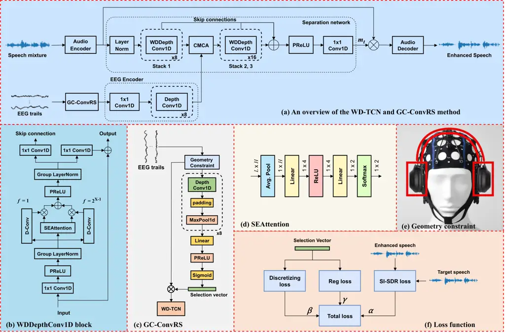

# Geometry-Constrained EEG Channel Selection for Brain-Assisted Speech EnhancementThanks: K. Zuo and Q. Xu equally contributed to this work, which is financed by National Natural Science Foundation of China (62101523), Hefei Municipal Natural Science Foundation (2022012) and USTC Research Funds of the Double First-Class Initiative (YD2100002008). Correspondence: Jie Zhang.

Keying Zuo    Qingtian Xu    Jie Zhang    Zhenhua Ling
Affiliation: NERC-SLIP, University of Science and Technology of China
(USTC), Hefei, China Affiliation: {keyingzuo;
qingtianxu}@mail.ustc.edu.cn; {jzhang6; zhling}@ustc.edu.cn

###### Abstract

Brain-assisted speech enhancement (BASE) aims to extract the target
speaker in complex multi-talker scenarios using electroencephalogram
(EEG) signals as an assistive modality, as the auditory attention of the
listener can be decoded from electroneurographic signals of the brain.
This facilitates a potential integration of EEG electrodes with
listening devices to improve the speech intelligibility of
hearing-impaired listeners, which was shown by the recently-proposed
BASEN model. As in general the multichannel EEG signals are highly
correlated and some are even irrelevant to listening, blindly
incorporating all EEG channels would lead to a high economic and
computational cost. In this work, we therefore propose a
geometry-constrained EEG channel selection approach for BASE. We design
a new weighted multi-dilation temporal convolutional network (WD-TCN) as
the backbone to replace the Conv-TasNet in BASEN. Given a raw channel
set that is defined by the electrode geometry for feasible integration,
we then propose a geometry-constrained convolutional regularization
selection (GC-ConvRS) module for WD-TCN to find an informative EEG
subset. Experimental results on a public dataset show the superiority of
the proposed WD-TCN over BASEN. The GC-ConvRS can further refine the
useful EEG subset subject to the geometry constraint, resulting in a
better trade-off between performance and integration cost.

###### Index Terms: 

Speech enhancement, Electroencephalogram, geometry constraint, channel
selection, hearing aids.



Fig. 1: The proposed GC-ConvRS sparsity-driven brain-assisted speech
enhancement method: (a) The backbone WD-TCN model, (b) WDDepthConv1D
block, (c) GC-ConvRS, (d) SEAttention and (e) Loss function.

## I Introduction

Target speaker extraction (TSE) as a new branch of the classic speech
enhancement (SE) aims to separate the target speech from noisy mixtures
in multi-talker conditions, which has a wide range of applications in
e.g., hearing aids (HAs), speech recognition, speaker diarization,
remote conferencing, etc. Unlike blind source separation, the TSE
usually requires additional clue(s) to specify the identity of the
target speaker, which thus avoids the speaker permutation problem in
speech separation. The focus of this work is on the TSE for listening
devices, e.g., HAs, in order to improve the speech quality and
intelligibility for hearing-impaired listeners.

Typical assistive clues for TSE may include 1) the direction of arrival
(DOA) of the target speaker \[1\] that can be used to calculate the
interchannel spatiotemporal features, 2) the pre-enrolled audio
stream(s) uttered by the target speaker as reference \[2\] to help
extract the speaker’s voiceprint, and 3) the synchronized video
containing lip movements \[3\] or face images \[4, 5\] that are
associated with the target speaker. In practice, the DOA has to be
estimated by other devices, which is heavily affected by dynamics, e.g.,
head movement. The pre-enrolled audio is often hardly available and
background noises impact the extraction of speaker embeddings. The
assistive video suffers from the illumination and occlusion conditions
and is computationally more costly in case of integration with listening
devices. In this work, we thus seek electroencephalogram (EEG) signals
to assist TSE, or more generally called brain-assisted speech
enhancement (BASE).

The human auditory system has the great ability to attend to the target
speaker and it was shown that the target speaker can be decoded from the
EEG signals, i.e., auditory attention decoding (AAD) \[6, 7, 8\], which
facilitates the feasibility of using EEG signals for TSE. More
importantly, the EEG cap with a certain amount of electrodes for data
recording is physically natural for the integration with listening
devices. Recently, some learning-based models have been proposed for the
BASE task, e.g., non-end-to-end brain-informed speech separation
(BISS) \[9\] and end-to-end (E2E) U-shaped brain-enhanced speech
denoiser (UBESD) \[10, 11\]. The latter is more preferable with a better
performance than the former. In \[12\], a data augmentation-based
TF-NSSE method was proposed, where the leakage of attention is futher
analyzed. In \[13\], an E2E BASEN model was proposed, which is based on
the well-known Conv-TasNet \[14\] backbone for speech extraction. More
recently, NeuroHeed was proposed in \[15\] by incorporating the temporal
association between the EEG signals and the attended speech and an
improved version (NeuroHeed+) can be found in \[16\]. The multi-scale
fusion-based brain-assisted TSE network was proposed in \[17\], showing
the usefulness of multi-scale features for BASE.

The aforementioned BASE approaches blindly include all EEG measurements
for the fusion with the audio signal, which would cause a high hardware
cost and setup time. In addition, practical listening devices do not
allow the electrodes to be placed anywhere on the cap, where the
acceptable integration should follow a headphone shape \[18\]. This
raises an expectation of electrode placement via sparse channel
selection \[19, 20, 21, 22\]. Existing EEG channel selection mostly
follows wrapper-based \[23, 24\] and embedded approaches \[20\], where
the latter is more preferable. A typical embedded method is the Gumbel
channel selection (GCS) \[20\], which uses the Gumbel-softmax
function \[25\] to approximate the selection status. The GCS suffers
from the training difficulty in the combination with BASEN. This problem
was solved in \[26\] using a residual Gumbel selection and the
duplicated selections were further reduced in \[18\]. However, the
selection methods for BASE in \[26, 18\] do not constrain the geometry
of the selected electrodes, which perform channel selection on the
entire cap.

Based on the convolutional regularization selection (ConvRS) in \[18\],
in this work we therefore propose a more practical Geometry-Constrained
EEG channel selection method for BASE, called GC-ConvRS. Given the whole
EEG channel set, we first consider a geometry constraint on the
candidate allowable set that holds a headphone-like shape for the
feasible integration with listening devices. This can be done by a
manual selection. We then propose a weighted multi-dilation temporal
convolutional network (WD-TCN) to replace the Conv-TasNet backbone in
BASEN \[13\], which can thus dynamically focus more or less on the local
information depending on the receptive field at each convolutional
block \[27\]. The WD-TCN and GC-ConvRS are then combined to form the
overall geometry-constrained BASE model. Experimental results on a
public dataset show the superiority of the proposed GC-ConvRS method in
two aspects: 1) the WD-TCD can achieve a better SE performance than
BASEN \[13\]; 2) the selection of informative EEG channels subject to
the geometry constraint decreases the performance, but not
significantly, revealing the significance of EEG electrodes for speech
perception as some are even irrelevant or contribute negatively.

## II Methodology

The proposed GC-ConvRS method employs the WD-TCN as the BASE module to
better leverage the temporal characteristics of speech signals for TSE
and the ConvRS \[18\] to perform geometry-constrained EEG channel
selection. Next, we will introduce each module in detail.

### II-A WD-TCN

As shown in Fig. 1(a), the proposed WD-TCN is a fully end-to-end
time-domain BASE model, which is similar to the Conv-TasNet \[14\]
backbone in BASEN \[13\]. A weighted multi-dilation depthwise-separable
convolution is proposed to replace standard depthwise-separable
convolutions in TCNs.

Given the noisy speech signal $`x`$ and the matched $`Q`$-channel EEG
signals $`e_{q},q=1,\cdots,Q`$ recorded by the EEG cap worn by the
listener, the audio encoder extracts the speech embedding sequence
$`w_{x}`$ from $`x`$, and the EEG encoder estimates the EEG embedding
$`e_{x}`$ from the recorded EEG trials. Both audio and EEG embeddings
are input to the separation network to estimate the target speaker
specific mask, given by

```math
m_{t}={\rm Separator}(w_{x},e_{x}). \tag{1}
```

Finally, the reconstructed speech signal is obtained by mapping the
audio embedding using the source-specific masks, given by

```math
\hat{s}_{t}={\rm Decoder}(w_{x}\odot m_{t}), \tag{2}
```

where $`\odot`$ denotes the element-wise multiplication.

The audio encoder includes a couple of Depth-wise 1D convolutions
(DepthConv1D) to extract the audio feature, and the decoder holds a
mirror structure. The EEG encoder consists of one 1D convolution to
downsample the EEG signals and a couple of DepthConv1D, where each has
residual connections to form multi-level EEG features. The Depth-wise
convolution was shown to be effective in many tasks \[28, 29\]. The
separator mainly consists of several weighted multi-dilation
depthwise-separable convolutions (WDDepthConv1D) and the convolutional
multi-layer cross attention (CMCA) module \[13\] for bi-modal feature
fusion. The WDDepthConv1D block, see Fig. 1(b), enables the network to
be more selective on the temporal context without drastically increasing
the parameter amount. We design a squeeze-and-excite attention
block \[30, 31\], see Fig. 1(d), to compute the weights for each layer
of conventional depthwise-separable convolution.

### II-B GC-ConvRS

On the basis of the WD-TCN backbone, we then consider a two-step
geometry-constrained channel selection. 1) Hard Selector: We define an
headphone-like area (see Fig. 1(e)) that the electrodes are allowed to
be placed and determine a candidate set $`\mathcal{S}`$ from
$`\mathcal{Q}=\{1,\cdots,Q\}`$. This is called hard pre-selector, which
can be done manually and only depends on the user-defined geometry
constraint. As such, the final selected channels can always satisfy a
headphone-like integration of EEG electrodes with listening devices. 2)
Soft Selector: We then apply the ConvRS method \[18\] to the candidate
set $`\mathcal{S}`$ and refine the selection results. This step is thus
called soft refinement. The structure of ConvRS is shown in Fig. 1(c),
which is composed of a series of DepthConv1D blocks and an linear layer
to obtain the selection vector $`\mathbf{s}`$. These two steps result in
the proposed GC-ConvRS channel selection approach.

Specifically, the ConvRS considers two regularization loss functions to
constrain the discreteness and cardinality of the selection vector,
which are shown in Fig. 1(f). The discretization loss function can be
written as \[18\]

```math
\mathcal{L}_{d}=k_{1}\left(-\frac{\mathbf{d}^{T}\mathbf{d}}{QB}+b\right), \tag{3}
```

where $`B`$ denotes the batch size, the bias $`b`$ equals 0.25 to set
the minima of $`\mathcal{L}_{d}`$ to be 0, and the divergence vector
$`\mathbf{d}=\mathbf{s}-0.5`$. In order to decrease the number of the
selected electrodes, we set a regularization loss, given by

```math
\mathcal{L}_{\rm reg}=k_{2}||\mathbf{s}||_{2}^{2}. \tag{4}
```

In addition, the scale-invariant signal-to-distortion ratio
(SI-SDR) \[32\] is often-used to measure the speech quality:

```math
\mathcal{L}_{\rm SI\text{-}SDR}=10\log_{10}{\left\|x_{\text{target}}\right\|^{2}}/{\left\|x_{\text{res}}\right\|^{2}}, \tag{5}
```

where $`x_{\text{target}}=\frac{\hat{s}_{t}^{T}s}{\|s\|^{2}}s`$ and
$`x_{\text{res}}=x_{\text{target}}-\hat{s}_{t}`$ with $`s`$ denoting the
target speech. The negative SI-SDR is taken as the TSE-related loss
function for model training.

As a result, the total loss function can be formulated as

```math
\mathcal{L}=-\alpha\mathcal{L}_{\rm SI\text{-}SDR}+\beta\mathcal{L}_{d}+\gamma\mathcal{L}_{\rm reg}, \tag{6}
```

where $`\alpha`$, $`\beta`$ and $`\gamma`$ are weights of the three
components. In this work, both $`\alpha`$ and $`\beta`$ are set to 0.5,
but $`\gamma`$ is set depending on the expected amount of EEG channels,
i.e., $`\gamma`$ controls the sparsity of the selected channel subset.
Besides, we empirically set the scaling balance parameters as $`k_{1}`$
= 100 and $`k_{2}`$ = 0.25.

## III Performance Evaluation

(a) BASEN

(b) WD-TCN

Fig. 2: Performance of WD-TCN and BASEN \[13\] across subjects, where
the median values are shown at the top of plots.

(a) The performance of GC-ConvRS

(b) Visualization of the selected EEG channels

Fig. 3: The performance of and visualization of GC-ConvRS, where the
blue dots represent the selected electrodes.

### III-A Experimental Setup

Dataset: In this work, we evaluate the BASE performance on the public
dataset originated from \[33\], which includes 33 subjects. We exclude
subject 6 due to the worse data quality. Each subject undertook 30
trials and each trial lasted 1 minute. In each trial, two stories were
played to different ears. Half of the subjects were asked to attend to
the left ear while the others to the right. That is, the attended story
is regarded as the target speaker and the other as noise. EEG data were
recorded using a 128-channel (plus two mastoids) EEG cap at a rate of
512 Hz and further downsampled to 128 Hz. More details on the dataset
description can be found in \[33\].

Pre-processing: Our experimental setup is the same as \[10, 11, 13, 18,
26\]. The audio signals were downsampled to 14.7 kHz and the two stimuli
were normalized to have the same RMS level and then added to generate
the noisy mixture at a signal-to-noise ratio (SNR) of 0 dB. The dataset
is split into three groups: randomly choosing 5 trials from all subjects
for testing, 2 trials for validation, and the rest for model training.
That is, we divide subsets with respect to trials, and no overlap of
trials occurs among training, validation and test subsets. Note that one
can also split groups on subjects. For training and validation, each
trial was cut into 2-sec segments, while for testing each trial was cut
into 20-sec segments.

The EEG data were first pre-processed by a band-pass filter with the
pass band ranging from 0.1 Hz to 45 Hz. Then the EEG signals were
re-referenced to the average of the mastoid channels. We simply applied
the independent component analysis (ICA) function in EEGLAB \[34\] to
remove artifacts. For each subject, we dropped the trial that contains
too much noise. Similarly to \[11\], we used the frequency-band coupling
model \[35\] to estimate the audio-related neural activity from EEG
signals, which can be represented by the cortical multi-unit neural
activity (MUA) from EEG signals \[35, 36\].

Implementation: Three objective metrics are used to measure the BASE
performance, including SI-SDR \[32\] in dB, perceptual evaluation of
speech quality (PESQ) \[37\] and short-time objective intelligibility
(STOI) \[38\]. The higher, the better. The Adam optimizer \[39\] was
used for training with a momentum of $`\beta_{1}`$ = 0.9 and a
denominator momentum of $`\beta_{2}`$ = 0.999. We used the linear
warm-up following the cosine annealing learning rate schedule with a
maximum learning rate of 1e-4 and a warm-up ratio of 5%. The model was
trained for around 200 epochs with a batch size of $`B`$ = 8.

### III-B Experimental Results

First, we compare the proposed WD-TCN backbone model and BASEN \[13\]
using all $`Q`$ = 128 channels in Fig. 2, which shows the SI-SDR, PESQ
and STOI across 32 subjects. Clearly, the WD-TCN outperforms BASEN in
all metrics and over all subjects, and the performance variance of
WD-TCN is smaller. Note that the BASEN model approximately has a
parameter amount of 0.654M, while the proposed WD-TCN has around 0.688M
parameters. Indeed, the WD-TCN differs from BASEN by replacing the
DepthConv1D blocks with WDDepthConv1D counterparts, which are comparable
in size. But the adopted WDDepthConv1D makes use of squeeze-and-excite
attention that can help to better capture temporal features of speech
signals. This explains the superiority of the proposed WD-TCN backbone
over BASEN.

Second, we validate the efficacy of the proposed GC-ConvRS channel
selection approach in comparison with the full-channel based WD-TCN in
Fig. 3(a). To do this, we set a geometry constraint in a headphone shape
to perform the initial hard selection, resulting in $`|\mathcal{S}|`$ =
30 EEG channels as shown by GC-ConvRS-30 in Fig. 3(b). The subsequent
soft refinement selections of GC-ConvRS are obtained by adapting the
sparsity regularizer $`\gamma`$ picked from
$`\left\{0,0.1,0.2,0.3,0.4,0.5,0.6\right\}`$, leading to selected
subsets of $`\left\{18,16,15,12,11,9,6\right\}`$ channels, respectively.
The BASE performance and selection examples are shown in Fig. 3. It is
interesting that in case $`|\mathcal{S}|`$ = 18, the SI-SDR is even
higher, the STOI and PESQ scores only change slightly compared to the
full-channel inclusion. This tells that even when $`Q`$ = 30, there are
still some irrelevant channels to speech understanding. In case 18
$`>|\mathcal{S}|>`$ 6, the performance generally decreases monotonically
in terms of the number of selected channels, but the SI-SDR changes more
rapidly. In the extreme case of $`|\mathcal{S}|`$ = 6, the performance
is surprisingly better than that of GC-ConvRS (9-12), which are clearly
not good choices for the integration of electrodes. Overall,
GC-ConvRS-18 achieves a better trade-off between the BASE performance
and the hardware cost (in terms of the electrode amount). Finally, from
the visualization of selections, we observe that the channels close to
the ears and the left and right temporal cortex are more likely to be
chosen, since these brain areas are more related to speech perception.

## IV Conclusion

In this paper, we proposed the WD-TCN backbone for the BASE task and the
GC-ConvRS for geometry-constrained EEG channel selection. It was shown
that the proposed WD-TCN is stronger for BASE and the GC-ConvRS does not
decrease the average performance too much compared to the full-channel
incorporation under the geometry constraint. The obtained selections all
satisfy the geometry shape. This validates that the multichannel EEG
signals are highly correlated and some channels are marginal or even
useless to BASE. The exclusion of these channels by GC-ConvRS is thus
practically meaningful for the hardware integration of EEG electrodes
with listening devices. As the considered dataset plays the same mixture
to the two ears, which does not fit the natural listening case with
interaural differences, we will investigate the brain-assisted binaural
SE in the future.

## References

- \[1\] Y. Wang, J. Zhang, S. Chen, W. Zhang, Z. Ye, X. Zhou, and
  L. Dai, “A study of multichannel spatiotemporal features and knowledge
  distillation on robust target speaker extraction,” in _IEEE Int. Conf.
  on Acoustics, Speech, Signal Process. (ICASSP)_, 2024, pp. 431–435.
- \[2\] M. Ge, C. Xu, L. Wang, E. S. Chng, J. Dang, and H. Li,
  “Multi-stage speaker extraction with utterance and frame-level
  reference signals,” in _IEEE Int. Conf. on Acoustics, Speech, Signal
  Process. (ICASSP)_, 2021, pp. 6109–6113.
- \[3\] Z. Pan, R. Tao, C. Xu, and H. Li, “Muse: Multi-modal target
  speaker extraction with visual cues,” in _IEEE Int. Conf. on
  Acoustics, Speech, Signal Process. (ICASSP)_, 2021, pp. 6678–6682.
- \[4\] R. Gao and K. Grauman, “Visualvoice: Audio-visual speech
  separation with cross-modal consistency,” in _2021 IEEE/CVF Conference
  on Computer Vision and Pattern Recognition (CVPR)_, 2021, pp.
  15 490–15 500.
- \[5\] H. Xu, L. Wei, J. Zhang, J. Yang, Y. Wang, T. Gao, X. Fang, and
  L. Dai, “A multi-scale feature aggregation based lightweight network
  for audio-visual speech enhancement,” in _IEEE Int. Conf. on
  Acoustics, Speech, Signal Process. (ICASSP)_, 2023, pp. 1–5.
- \[6\] N. Mesgarani and E. F. Chang, “Selective cortical representation
  of attended speaker in multi-talker speech perception,” _Nature_, vol.
  485, no. 7397, pp. 233–236, 2012.
- \[7\] J. O’Sullivan, Z. Chen, J. Herrero, G. M. McKhann, S. A. Sheth,
  A. D. Mehta, and N. Mesgarani, “Neural decoding of attentional
  selection in multi-speaker environments without access to clean
  sources,” _J. Neural Eng._, vol. 14, no. 5, p. 056001, 2017.
- \[8\] A. Aroudi and S. Doclo, “Cognitive-driven binaural beamforming
  using EEG-based auditory attention decoding,” _IEEE/ACM Trans. Audio,
  Speech, Lang. Process._, vol. 28, pp. 862–875, 2020.
- \[9\] E. Ceolini, J. Hjortkjær, D. D. Wong, J. O’Sullivan,
  V. S. Raghavan, J. Herrero, A. D. Mehta, S.-C. Liu, and N. Mesgarani,
  “Brain-informed speech separation (BISS) for enhancement of target
  speaker in multitalker speech perception,” _NeuroImage_, vol. 223, p.
  117282, 2020.
- \[10\] M. Hosseini, L. Celotti, and É. Plourde, “Speaker-independent
  brain enhanced speech denoising,” in _IEEE Int. Conf. on Acoustics,
  Speech, Signal Process. (ICASSP)_, 2021, pp. 1310–1314.
- \[11\] M. Hosseini, L. Celotti, and E. Plourde, “End-to-end
  brain-driven speech enhancement in multi-talker conditions,” _IEEE/ACM
  Trans. Audio, Speech, Lang. Process._, vol. 30, pp. 1718–1733, 2022.
- \[12\] Z. Qiu, J. Gu, D. Yao, J. Li, and Y. Yan, “TF-NSSE: A
  time–frequency domain neuro-steered speaker extractor,” _Applied
  Acoustics_, vol. 211, p. 109519, 2023.
- \[13\] J. Zhang, Q. Xu, Q. Zhu, and Z. Ling, “BASEN: Time-domain
  brain-assisted speech enhancement network with convolutional cross
  attention in multi-talker conditions,” in _ISCA Interspeech_, 2023,
  pp. 3117–3121.
- \[14\] Y. Luo and N. Mesgarani, “Conv-TasNet: Surpassing ideal
  time–frequency magnitude masking for speech separation,” _IEEE/ACM
  Trans. Audio, Speech, and Lang. Process._, vol. 27, no. 8, pp.
  1256–1266, 2019.
- \[15\] Z. Pan, M. Borsdorf, S. Cai, T. Schultz, and H. Li, “Neuroheed:
  Neuro-steered speaker extraction using EEG signals,” _arXiv preprint
  arXiv:2307.14303_, 2023.
- \[16\] Z. Pan, G. Wichern, F. G. Germain, S. Khurana, and J. Le Roux,
  “Neuroheed+: Improving neuro-steered speaker extraction with joint
  auditory attention detection,” in _IEEE Int. Conf. on Acoustics,
  Speech, Signal Process. (ICASSP)_, 2024, pp. 11 456–11 460.
- \[17\] C. Fan, J. Zhang, H. Zhang, W. Xiang, J. Tao, X. Li, J. Yi,
  D. Sui, and Z. Lv, “MSFNet: Multi-scale fusion network for
  brain-controlled speaker extraction,” in _ACM Multimedia 2024_, 2024.
  \[Online\]. Available: https://openreview.net/forum?id=nAhFSkcnz3
- \[18\] J. Zhang, Q.-T. Xu, and Z.-H. Ling, “Sparsity-driven EEG
  channel selection for brain-assisted speech enhancement,” _arXiv
  preprint arXiv:2311.13436_, 2023.
- \[19\] B. Mirkovic, S. Debener, M. Jaeger, and M. De Vos, “Decoding
  the attended speech stream with multi-channel EEG: implications for
  online, daily-life applications,” _J. Neural Eng._, vol. 12, no. 4, p.
  046007, 2015.
- \[20\] T. Strypsteen and A. Bertrand, “End-to-end learnable EEG
  channel selection for deep neural networks with Gumbel-softmax,” _J.
  Neural Eng._, vol. 18, no. 4, p. 0460a9, 2021.
- \[21\] A. M. Narayanan and A. Bertrand, “Analysis of miniaturization
  effects and channel selection strategies for EEG sensor networks with
  application to auditory attention detection,” _IEEE Trans. Biomedical
  Eng._, vol. 67, no. 1, pp. 234–244, 2019.
- \[22\] A. M. Narayanan, P. Patrinos, and A. Bertrand, “Optimal versus
  approximate channel selection methods for EEG decoding with
  application to topology-constrained neuro-sensor networks,” _IEEE
  Trans. Neural Systems, Rehabilitation Eng._, vol. 29, pp.
  92–102, 2020.
- \[23\] H. Liu and L. Yu, “Toward integrating feature selection
  algorithms for classification and clustering,” _IEEE Trans. Knowledge,
  Data Engineer._, vol. 17, no. 4, pp. 491–502, 2005.
- \[24\] T. Alotaiby, F. E. A. El-Samie, S. A. Alshebeili, and I. Ahmad,
  “A review of channel selection algorithms for EEG signal processing,”
  _EURASIP J. Advances in Signal Process._, vol. 2015, pp. 1–21, 2015.
- \[25\] E. Jang, S. Gu, and B. Poole, “Categorical reparameterization
  with Gumbel-softmax,” _Statistics_, vol. 1050, p. 5, 2017.
- \[26\] Q.-T. Xu, J. Zhang, and Z.-H. Ling, “An end-to-end EEG channel
  selection method with residual gumbel softmax for brain-assisted
  speech enhancement,” in _IEEE Int. Conf. on Acoustics, Speech, Signal
  Process. (ICASSP)_, 2024, pp. 10 131–10 135.
- \[27\] W. Ravenscroft, S. Goetze, and T. Hain, “Utterance weighted
  multi-dilation temporal convolutional networks for monaural speech
  dereverberation,” in _2022 International Workshop on Acoustic Signal
  Enhancement (IWAENC)_, 2022, pp. 1–5.
- \[28\] L. Kaiser, A. N. Gomez, and F. Chollet, “Depthwise separable
  convolutions for neural machine translation,” in _Int. Conf. on
  Learning Representations (ICLR)_, 2018, pp. 1–10.
- \[29\] F. Chollet, “Xception: Deep learning with depthwise separable
  convolutions,” in _IEEE Conf. on Computer Vision and Pattern
  Recognition (CVPR)_, 2017, pp. 1251–1258.
- \[30\] Y. Chen, X. Dai, M. Liu, D. Chen, L. Yuan, and Z. Liu, “Dynamic
  convolution: Attention over convolution kernels,” in _Proceedings of
  the IEEE/CVF conference on computer vision and pattern recognition_,
  2020, pp. 11 030–11 039.
- \[31\] J. Hu, L. Shen, and G. Sun, “Squeeze-and-excitation networks,”
  in _Proceedings of the IEEE conference on computer vision and pattern
  recognition_, 2018, pp. 7132–7141.
- \[32\] J. Le Roux, S. Wisdom, H. Erdogan, and J. R. Hershey,
  “Sdr–half-baked or well done?” in _IEEE Int. Conf. on Acoustics,
  Speech, Signal Process. (ICASSP)_, 2019, pp. 626–630.
- \[33\] M. P. Broderick, A. J. Anderson, G. M. Di Liberto, M. J.
  Crosse, and E. C. Lalor, “Electrophysiological correlates of semantic
  dissimilarity reflect the comprehension of natural, narrative speech,”
  _Current Biology_, vol. 28, no. 5, pp. 803–809, 2018.
- \[34\] A. Delorme and S. Makeig, “EEGLAB: an open source toolbox for
  analysis of single-trial EEG dynamics including independent component
  analysis,” _J. Neuroscience Methods_, vol. 134, no. 1, pp. 9–21, 2004.
- \[35\] K. Whittingstall and N. K. Logothetis, “Frequency-band coupling
  in surface EEG reflects spiking activity in monkey visual cortex,”
  _Neuron_, vol. 64, no. 2, pp. 281–289, 2009.
- \[36\] M. Moinnereau, J. Rouat, K. Whittingstall, and E. Plourde, “A
  frequency-band coupling model of EEG signals can capture features from
  an input audio stimulus,” _Hearing Research_, vol. 393, p.
  107994, 2020.
- \[37\] A. W. Rix, J. G. Beerends, M. P. Hollier, and A. P. Hekstra,
  “Perceptual evaluation of speech quality (PESQ)-a new method for
  speech quality assessment of telephone networks and codecs,” in _IEEE
  Int. Conf. on Acoustics, Speech, Signal Process. (ICASSP)_, vol. 2,
  2001, pp. 749–752.
- \[38\] C. H. Taal, R. C. Hendriks, R. Heusdens, and J. Jensen, “A
  short-time objective intelligibility measure for time-frequency
  weighted noisy speech,” in _IEEE Int. Conf. on Acoustics, Speech,
  Signal Process. (ICASSP)_, 2010, pp. 4214–4217.
- \[39\] D. P. Kingma and J. Ba, “Adam: A method for stochastic
  optimization,” in _Int. Conf. on Learning Representations (ICLR)_,
  2015, pp. 1–15.
