# Self-Supervised Audio-Visual Soundscape Stylization

Tingle Li    Renhao Wang    Po-Yao Huang    Andrew Owens
Affiliation: University of California, Berkeley FAIR, Meta University of
Michigan    Gopala Anumanchipalli
Affiliation: [https://tinglok.netlify.app/files/avsoundscape](https://tinglok.netlify.app/files/avsoundscape)

###### Abstract

Speech sounds convey a great deal of information about the scenes,
resulting in a variety of effects ranging from reverberation to
additional ambient sounds. In this paper, we manipulate input speech to
sound as though it was recorded within a different scene, given an
audio-visual conditional example recorded from that scene. Our model
learns through self-supervision, taking advantage of the fact that
natural video contains recurring sound events and textures. We extract
an audio clip from a video and apply speech enhancement. We then train a
latent diffusion model to recover the original speech, using another
audio-visual clip taken from elsewhere in the video as a conditional
hint. Through this process, the model learns to transfer the conditional
example’s sound properties to the input speech. We show that our model
can be successfully trained using unlabeled, in-the-wild videos, and
that an additional visual signal can improve its sound prediction
abilities.

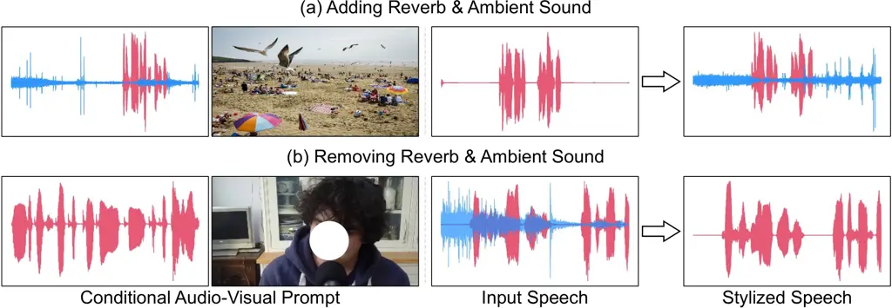

Figure 1: Audio-visual soundscape stylization. We learn through
self-supervision to manipulate input speech (middle) such that it sounds
as though it were recorded within a given scene (left). Our approach
captures both acoustic properties, such as reverberation, as well as the
ambient sounds, such as crashing waves (top). To help convey the results
of the stylization, we have used source separation to visualize the
speech waveform (shown in red) separately from background sound (shown
in blue).

## 1 Introduction

Speech conveys a tremendous amount about the scene that it was produced
in, from the material properties of its surfaces to its ambient
sounds \[73, 29\]. A major goal of the audio and audio-visual generation
communities has been to accurately resynthesize speech to sound as
though it were recorded in a different scene \[92, 83, 5\], thereby
capturing these subtle details — a task that has a number of
applications, from movie dubbing to virtual reality.

Existing formulations of this problem have largely focused on
reproducing room acoustic properties, such as adding reverb by
manipulating the room impulse response \[5, 84\]. However, these
approaches do not model many of the other ways that a scene can affect a
recorded sound. For example, when we walk on the beach (Figure 1), we
may experience the whispers of the wind, the cries of seagulls, and the
crash of waves — a distinctive ambient sound texture \[64\] that would
be conveyed in any sound recording taken within the scene. Since these
aspects of a soundscape are not modeled by existing resynthesis
techniques, making a sound fully reflect a scene requires additional
postprocessing, such as “mixing in” background noises that fit the
scene. This process, often reliant on descriptive language, can be
time-consuming and constrained in its ability to convey subtle auditory
properties. Moreover, these methods have largely required simulated (or
labeled) training data, and are not designed to learn from abundantly
available “in the wild” audio-visual data, limiting their scalability.

We propose the audio-visual soundscape stylization problem. Given a
visual or audio-visual example from a scene and a clean input speech,
our goal is to manipulate the input speech such that it could have
occurred within the scene, reproducing both the acoustic properties of a
scene and the ambient sounds within it. Our method is based on
conditional speech de-enhancement: we randomly sample two nearby
audio-visual clips from a video, and remove scene-specific attributes
from one of them performing speech enhancement. We then train a model,
based on latent diffusion \[79\], to reverse this speech enhancement
process, using the other audio-visual clip as a conditional “hint.” In
order to perform this task, the model needs to infer the acoustic and
ambient properties of the scene, and to successfully transfer them to an
input speech. At test time, we give the model a conditional example from
the scene whose properties we would like to transfer.

Our model is simple and can be trained entirely using in-the-wild
egocentric videos. We show through quantitative evaluations and
perceptual studies that our method learns to successfully stylize sounds
in a number of challenging in-the-wild scenarios, transferring both the
acoustic properties and ambient sounds to input speech. As part of these
experiments, we find that our model can successfully transfer sound from
visual conditioning, and that visual signals improve our model’s ability
to stylize audio. We also find that we can outperform existing work on
the previously proposed problem of styling sound using room acoustic
properties from images \[5\] while going beyond this work in also
transferring ambient sound. Finally, we find that “prompting” our model
with specific conditional examples can achieve a desired style, such as
approximately converting between near- and far-field speech, and that
our model can successfully restyle a variety of non-speech input sounds.

## 2 Related Work

#### Stylization in image and audio.

The concept of image stylization was pioneered by Hertzmann et al.
\[33\], which restyled input images based on a single user-provided
example. Various types have been explored for image stylization,
including image \[40, 45, 104\], text \[15, 3, 4\], sound \[59, 55\],
and touch \[98, 99\]. Recent work has addressed a variety of audio
stylization tasks, such as voice conversion (via feature disentanglement
\[91, 94\] or adversarial learning \[46, 58\]), music timbre transfer
\[39\], text-driven audio editing \[96\], visual acoustic matching \[5,
84\], and audio effects stylization \[87\]. In particular, Chen et al.
\[5\] proposed to manipulate the room impulse response based on the
surrounding images using a generative adversarial network (GAN).
Recently, Somayazulu et al. \[84\] used an additional GAN to further
denoise the target audio to get the paired data for training. In
contrast to these works, our method differs by: (i) Generating ambient
sounds beyond mere room impulse response; (ii) Using a more expressive
diffusion model rather than GAN; (iii) Learning from “in-the-wild”
internet videos instead of curated indoor videos.

#### Sound generation from visual and textual inputs.

Generating sound from visual and textual inputs has recently attracted
much research attention. For visual-based methods, researchers have
explored the generation of sound effects, music, speech, and ambient
sound from visual cues such as impacts \[69\], musical instrument
playing \[50\], dancing \[24, 89\], lip movements \[20, 75, 36\], and
open-domain images \[103, 43, 82, 63\]. In contrast to these methods,
which focus on generating a specific type of sound from visual input,
our method is centered on stylizing soundscapes to fit their
environmental context, guided by conditional audio-visual examples. For
text-based methods, Yang et al. \[97\] introduced a discrete diffusion
model for generating ambient sound from text descriptions. Kreuk et al.
\[54\] used VQGAN \[21\] for sound generation. Recently, latent
diffusion models \[60, 38\] have significantly improved generation
quality. All these methods necessitate text annotations to establish
text-audio pairs, whether at the training \[54\] or representation \[60,
38\] level, which can be labor-intensive and limited in expressiveness
with plain text descriptions. In contrast, we make an input speech match
a given soundscape that is specified by a given audio-visual example,
without the need for annotations or text. This allows users to select
the (often difficult-to-articulate) auditory properties “by example”
rather than through language. Our approach thus provides a complementary
learning signal to text-based methods.

#### Audio-visual learning.

The natural correlation between audio and visual frames in videos has
facilitated extensive audio-visual research, including representation
learning \[70, 2, 53, 68, 71, 67, 37\], source separation \[102, 101,
19, 25, 57\], audio source localization \[8, 30, 10\], audio
spatialization \[26, 66, 100\], visual speech recognition \[1\],
deepfake detection \[22\], and scene classification \[9, 27, 16\].
Inspired by this line of work, we aim to stylize input audio to match
the soundscape of a single audio-visual conditional example.

## 3 Audio-Visual Soundscape Stylization

Our goal is to manipulate an input sound such that it could plausibly
have been recorded within another scene, given a conditional
audio-visual example from that scene. We learn a function
$`\mathcal{F}_{\theta}(\bm{a}_{e},\bm{a}_{c},\bm{i}_{c})`$ parameterized
by $`\theta`$ that stylizes an input sound $`\bm{a}_{e}`$ given the
reference audio $`\bm{a}_{c}`$ and its corresponding image
$`\bm{i}_{c}`$. We show that $`\mathcal{F}_{\theta}`$ can be learned
solely from unlabeled audio-visual data.

### 3.1 Self-Supervised Soundscape Stylization

We propose a self-supervised task that trains a model to stylize input
sounds, using audio-only, visual-only, or audio-visual conditioning.

#### Learning by audio-visual speech de-enhancement.

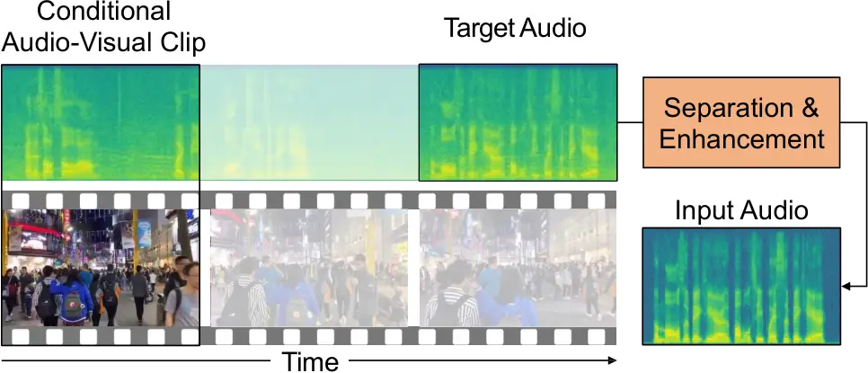

Figure 2: Soundscape stylization by conditional speech de-enhancement.
We randomly select two disjoint clips from a video, designating one as a
conditional example and the other as the target. We then separate and
enhance the target audio. Our model’s self-supervised pretext task is to
remove this enhancement using the other conditional (audio, visual, or
audio-visual) signal as a hint. At test time, we stylize an audio clip
using a conditional example from the desired scene.

As a self-supervised pretext task \[13\], we randomly select an audio
clip from a training video, apply source separation and enhancement to
it, and train a model to undo this operation (_i.e_., to recover the
original sound) after conditioning on another audio-visual example taken
from the same training video (Fig. 2). We observe that the background
noises and acoustic properties within a video tend to exhibit temporal
coherence \[17\], especially when sound events occur repeatedly.
Moreover, similar sound events often share semantically similar visual
appearances \[70, 41\]. By providing the model with a conditional
example from another time step in the video, the model is implicitly
able to estimate the scene properties and transfer these to the input
audio (_e.g_., the reverb and ambient background sounds). At test time,
we will provide a clip taken from a different scene as conditioning,
forcing the model to match the style of a desired scene.

Specifically, we sample non-overlapping clips from a long video,
centered at times $`\tau`$ and $`\tau^{\prime}`$. One of these clips
serves as the conditional audio-visual example, denoted as
$`\bm{a}_{c}`$ and $`\bm{i}_{c}`$, while the soundtrack of the other
clip is designated as the target audio $`\bm{a}_{q}`$. We then apply
both a source separation model \[72\] to isolate the foreground speech,
and a speech enhancement and dereverberation model \[44\] to further
refine the separated speech quality. This process results in the
generation of high-fidelity speech
$`\bm{a}_{e}=\mathcal{H}(\bm{a}_{q})`$, which sounds as if it were
recorded in a soundproofed studio. Please refer to the Appendix A.4 for
the analysis of different enhancement strategies. For preprocessing, we
use an off-the-shelf voice activity detector \[90\] to ensure that each
selected audio clip is likely to contain speech.

#### Sound stylization model.

After training on the pretext task of audio-visual speech
de-enhancement, the resulting model is able to tailor its stylization
according to the conditional examples, which aligns with the assumption
that the conditional example is instructive for the input audio. At test
time, we retain the flexibility to substitute the conditional example
with a completely different audio-visual clip, enabling the potential
for one-to-many stylization.

### 3.2 Conditional Stylization Model

We describe our conditional soundscape stylization model
$`\mathcal{F}_{\theta}`$ (Figure 3), which is designed to stylize input
audio based on a conditional audio-visual pair and consists of three
main components: i) compressing the input audio into a latent space; ii)
applying soundscape stylization using the conditional latent diffusion
model; iii) reconstructing the waveform from the latent space.

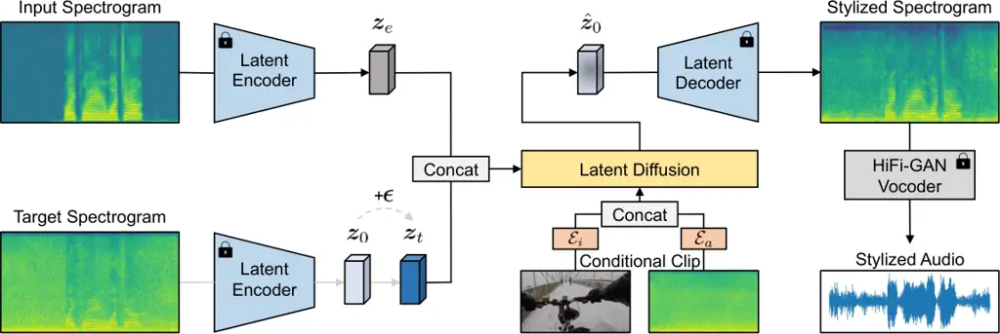

Figure 3: Model architecture. Given input audio derived from an
enhancement model, and the conditional audio-visual clip sampled from
the same video, we aim to stylize the input to closely resemble the
original signal. We encode both the input and target spectrograms to the
latent space using a pre-trained latent encoder, and feed them into a
latent diffusion model together with the conditional audio-visual
embedding. The goal is to harmonize the encoded latent of the input
spectrogram with the target one. Finally, we employ a pre-trained latent
decoder followed by a pre-trained HiFi-GAN vocoder to reconstruct the
waveform from the latent space. Note that the latent encoder for the
target spectrogram is not used at test time.

#### Conditional latent diffusion model.

We train a conditional latent diffusion model to stylize soundscapes
based on conditional audio-visual examples. Building upon the denoising
diffusion probabilistic model \[34\] and the latent diffusion model
\[79\], our model breaks the generation process into $`N`$ conditional
denoising steps, and improves the efficiency of diffusion models by
operating in the latent space. Therefore, our soundscape stylization
model $`\mathcal{F}_{\theta}`$ can be interpreted as an equally weighted
sequence of denoising auto-encoders $`\bm{\epsilon}_{\theta}`$.

Specifically, it takes the encoded latent of the input audio and the
conditional audio-visual example as a conditioning signal. To elaborate
further, given the encoded latent of the original audio
$`\bm{z}_{0}={\rm Enc}(\bm{a}_{q})`$, the conditional audio-visual
example $`(\bm{a}_{c},\bm{i}_{c})`$, a random denoising step $`t`$, and
random noise $`\bm{\epsilon}\sim\mathcal{N}(\mathbf{0},\mathbf{I})`$,
our model first generates a noisy version $`\bm{z}_{t}`$ via a noise
schedule \[86\]. We then define the training loss
$`\mathcal{L}_{\theta}`$ by predicting the noise $`\bm{\epsilon}`$ added
to the noisy latent, guided by the input audio $`\bm{a}_{e}`$ and the
conditional audio-visual pair $`(\bm{a}_{c},\bm{i}_{c})`$. This can be
achieved by minimizing the loss function as follows:

```math
\mathcal{L}_{\theta}=\mathbb{E}_{\bm{z}_{0},\bm{a}_{c},\bm{i}_{c},\bm{\epsilon}\sim\mathcal{N}(\mathbf{0},\mathbf{I}),t}\|\bm{\epsilon}-\bm{\epsilon}_{\theta}(\bm{z}_{t},t,\bm{z}_{e},\bm{a}_{c},\bm{i}_{c})\|^{2}_{2}\text{ ,} \tag{1}
```

where $`\bm{z}_{e}={\rm Enc}(\bm{a}_{e})`$ is the encoded latent of the
input audio $`\bm{a}_{e}`$.

#### Adding noise to the input.

We propose to add Gaussian noise
$`\bm{n}\sim\mathcal{N}(\mathbf{0},{\sigma}^{2}\mathbf{I})`$ to the
enhanced audio at both training and test time. This mixed audio is then
employed as the input audio. The primary purpose of this is to mitigate
the effect of “audio nostalgia” \[14\]. This conceals subtle remnants of
the original sound that may persist in the enhanced audio, which could
potentially help avoid leaking information in the pretext task.
Specifically, when the model is trained on the enhanced audio, the
generated soundscapes might exhibit a suspicious resemblance to the
originals. Conversely, when clean speech is used as input, the output
may largely replicate the input. We consider this addition of noise as a
type of data augmentation.

#### Compressing mel-spectrograms.

We employ a ResNet-based variational auto-encoder (VAE) \[31, 49\] to
compress the mel-spectrogram $`\bm{a}\in\mathbb{R}^{T\times F}`$ into a
latent space $`\bm{z}\in\mathbb{R}^{T/r\times F/r\times d}`$, where
$`r`$ denotes the compression level, $`T/r`$ and $`F/r`$ is a
lower-resolution time-frequency bin, and $`d`$ represents the embedding
size at each bin. The VAE is tasked with reconstructing sounds from a
dataset, where the bottleneck can then serve as the encoded latent. For
our experiments, we adopt a pre-trained VAE model from Liu et al.
\[60\].

#### Conditional audio-visual representations.

The conditional audio-visual example is represented using its latent
vector. We employ separate audio and image encoders, denoted as
$`\mathcal{E}_{a}(\cdot)`$ and $`\mathcal{E}_{i}(\cdot)`$, to extract
audio embeddings $`\mathcal{E}_{a}(\bm{a}_{c})\in\mathbb{R}^{L}`$ and
image embeddings $`\mathcal{E}_{i}(\bm{i}_{c})\in\mathbb{R}^{L}`$, where
$`L`$ represents the embedding size. We use pre-trained encoders like
CLIP \[76\] and CLAP \[18\] for image and audio representation
respectively. Prior to fusion, we apply linear projections to the image
and audio embeddings, followed by concatenating and feeding them into
the diffusion model through cross-attention mechanism \[93\].

#### Classifier-free guidance.

We use classifier-free guidance \[35\] to balance the trade-off between
the quality and diversity of generated samples. It involves jointly
training the model for both conditional and unconditional denoising.
During training, we randomly nullify the conditional model with a fixed
probability of 10%. At test time, a guidance scale ($`\lambda\geq 1`$)
is utilized to adjust the score estimates, skewing them towards the
conditional
$`\bm{\epsilon}_{\theta}(\bm{z}_{t},t,\bm{z}_{e},\bm{a}_{c},\bm{i}_{c})`$
and away from the unconditional
$`\bm{\epsilon}_{\theta}(\bm{z}_{t},t,\bm{z}_{e},\varnothing,\varnothing)`$.

```math
\begin{split}\tilde{\bm{\epsilon}}_{\theta}(\bm{z}_{t},t,\bm{z}_{e},\bm{a}_{c},\bm{i}_{c})=&\ \lambda\cdot\bm{\epsilon}_{\theta}(\bm{z}_{t},t,\bm{z}_{e},\bm{a}_{c},\bm{i}_{c})\\
&+(1-\lambda)\cdot\bm{\epsilon}_{\theta}(\bm{z}_{t},t,\bm{z}_{e},\varnothing,\varnothing)\end{split} \tag{2}
```

We find this guidance enhances the output quality and relevance of
stylized samples.

#### Recovering the waveform.

Following the estimation of noise $`\tilde{\bm{\epsilon}}_{\theta}`$
from the diffusion model, we retrieve the encoded latent of the stylized
mel-spectrogram. This latent is then fed into the VAE decoder to
reconstruct the stylized mel-spectrogram. Finally, a pre-trained
HiFi-GAN vocoder \[51\] is employed to reconstruct the waveform.

## 4 Experiments

### 4.1 Experimental Setup

We evaluate our model’s ability to restyle sounds to match new
environments.

#### Dataset.

Our goal is to train and evaluate the model on minimally curated
“in-the-wild” videos. To do this, we train and evaluate on two different
datasets: CityWalk and Acoustic-AVSpeech.

- •
  CityWalk dataset: We collect a CityWalk dataset which includes
  egocentric videos with diverse ambient sounds and acoustic properties,
  recorded in places like trains, buses, streets, beaches, shopping
  malls, _etc_. Using the search terms “City Walk + POV” on YouTube, we
  gather 3,447 videos derived from indoor (28%) and outdoor (72%)
  scenes. From this collection, we choose a subset of 235 videos for
  training and testing, with lengths varying between 5 to 225 minutes,
  totaling 158 hours. We ensure that these videos only contain naturally
  occurring sounds in the scenes, without any post-edited voice-overs or
  music. We also guarantee that the sources of training and testing
  videos do not overlap. Please see the Appendix A.2 for more dataset
  details.
- •
  Acoustic AVSpeech dataset \[5\]: The Acoustic-AVSpeech dataset is a
  subset of the AVSpeech dataset \[19\] that contains 3-10 seconds
  indoor clips of single speakers without interfering ambient sound.
  Since the visual content of these clips offers useful insights into
  the geometry and materials of the scenes, it can be utilized to
  estimate the acoustic properties (but not ambient sound). We use this
  dataset for a fair comparison with the existing baseline \[5\] (we are
  unable to compare with \[84\] as it is not open source).

#### Model configurations.

We use the VAE and HiFi-GAN vocoder from \[60\], which are trained on
the combination of AudioSet \[27\], AudioCaps \[48\], BBC Sound Effect
\[11\] and Freesound \[23\] datasets. The VAE is configured with a
compression level $`r`$ of 4 and latent channels $`d`$ of 8. For
extracting audio and image embedding, we have two options: i) use a
from-scratch ResNet-18 encoder; ii) utilize a fine-tuned CLAP audio
encoder \[18\] derived from our audio-only model, alongside a fixed CLIP
image encoder \[76\]. These encoders are integrated into the diffusion
model through late fusion \[95\] and cross-attention \[93\]. The
diffusion model is based on a U-Net backbone, consisting of four encoder
and decoder blocks with downsampling and upsampling and a bottleneck in
between. Multi-head attention with 64 head features and 8 heads per
layer is applied in the last three encoder and first three decoder
blocks. During the forward process, we employ $`N=1000`$ steps and a
linear noise schedule, ranging from $`\beta_{1}=0.0015`$ to
$`\beta_{N}=0.0195`$, to generate noise. Additionally, we leverage the
DDIM sampling method \[86\] with 200 sampling steps. For classifier-free
guidance, we set the guidance scale $`\lambda`$ to 4.5, as described in
Equation (2).

#### Training procedures.

To enhance training efficiency, we divide all videos into 10-second
video and audio clips. We apply a frame-level voice activity detector
\[90\] to the resulting audio clips to detect speech onset.
Subsequently, we randomly select two 2.56-second audio clips from the
same source – one for the target audio and the other for the conditional
audio. The conditional image is chosen by randomly sampling one video
frame within the scope of the selected conditional audio. Our model is
trained using the AdamW optimizer \[62\] with a learning rate of
$`10^{-4}`$, $`\beta_{1}=0.95`$, $`\beta_{2}=0.999`$,
$`\epsilon=10^{-6}`$, and a weight decay of $`10^{-3}`$ over 200 epochs.

#### Evaluation metrics.

To assess the performance of our models, we use both objective and
subjective metrics. Our objective metrics include the Mean Square Error
(MSE), RT60 Error (RTE), Mean Opinion Score Error (MOSE), Perceptual
Evaluation of Speech Quality (PESQ) \[78\], Fréchet Audio Distance (FAD)
\[47\], Fréchet Distance (FD) \[60\], Kullback-Leibler divergence (KL),
Word Error Rate (WER), Inception Score (IS) \[80\], and Audio-Visual
Correspondence (AVC) \[2\]. MSE evaluates how closely the stylized audio
matches the ground truth in terms of magnitude spectrograms (if the
ground truth is available), while RTE measures the MSE between RT60
estimates of generated and target speech, _i.e_., the differences in the
reverb level. MOSE assesses the difference in speech quality between the
generated audio and ground truth using MOSNet \[61\]. FD and FAD measure
the similarity between real and generated audio using different
classifiers (FAD employs VGGish \[32\] and FD uses PANNs \[52\]). KL
quantifies the distributional similarity between real and generated
audio, while PESQ and IS evaluate the quality and diversity of generated
audio. WER measures the intelligibility of the generated audio using a
pre-trained speech recognizer \[77\]. AVC assesses the correlation
between audio and image, utilizing features extracted by either OpenL3
\[12\] or ImageBind (IB) \[28\].

In addition, we conduct a subjective evaluation through Amazon
Mechanical Turk. Human participants are asked to rate audio generated by
various methods based on its similarity to the soundscapes in the given
audio-visual example. This rate considers four criteria: overall quality
(OVL), relation to ambient sounds (RAM), relation to acoustic properties
(RAC), and relation to visuals (RVI), with scores ranging from 1 (low
correlation) to 5 (high correlation). Please see the Appendix A.3 for
more human evaluation details.

| Method            | MSE^(\*)($`\downarrow`$) | RTE^(\*)($`\downarrow`$) | PESQ^(\*)($`\uparrow`$) | FD ($`\downarrow`$) | FAD ($`\downarrow`$) | KL ($`\downarrow`$) | WER ($`\downarrow`$) | IS ($`\uparrow`$) | AVC ($`\uparrow`$) |      |
| ----------------- | ------------------------ | ------------------------ | ----------------------- | ------------------- | -------------------- | ------------------- | -------------------- | ----------------- | ------------------ | ---- |
|                   |                          |                          |                         |                     |                      |                     |                      |                   | IB                 | L3   |
| Ground Truth      | /                        | /                        | /                       | /                   | /                    | /                   | /                    | 0.22              | 0.98               |      |
| Cap. (aud) \[65\] | 2.34                     | 0.91                     | 1.85                    | 14.30               | 9.73                 | 1.09                | 0.29                 | 1.49              | 0.08               | 0.80 |
| Cap. (sfx) \[65\] | 2.09                     | 0.86                     | 2.05                    | 12.53               | 9.12                 | 1.14                | 0.16                 | 1.51              | 0.09               | 0.81 |
| Cap. (img) \[56\] | 2.23                     | 0.89                     | 2.02                    | 17.27               | 9.24                 | 1.30                | 0.17                 | 1.46              | 0.08               | 0.79 |
| Aud Anlg. \[60\]  | 1.37                     | 0.77                     | 2.34                    | 9.33                | 3.97                 | 0.91                | 0.12                 | 1.53              | 0.11               | 0.82 |
| S & R \[72\]      | 1.02                     | 0.71                     | 2.54                    | 8.65                | 3.34                 | 0.71                | 0.11                 | 1.51              | 0.12               | 0.83 |
| AViTAR \[5\]      | 0.76                     | 0.32                     | 2.56                    | 7.44                | 3.02                 | 0.68                | 0.17                 | 1.47              | 0.14               | 0.87 |
| Ours              | 0.54                     | 0.20                     | 2.83                    | 5.13                | 1.64                 | 0.59                | 0.11                 | 2.03              | 0.17               | 0.92 |

Table 1: Quantitative objective results on the CityWalk dataset.
Captioning (Cap.) can be driven by original conditional audio (aud),
separated sound effects (sfx), and conditional images (img). Aud Anlg.
and S & R refer to Audio Analogy and Separate & Remix respectively.
^(\*) indicates metrics are evaluated using test set with ground truth.

#### Baselines.

We consider a variety of baselines for comparison:

- •
  AViTAR \[5\]: AViTAR is a GAN-based method that is initially proposed
  to generate indoor room impulse responses conditioned on images, which
  is not directly compatible with our setting. To address this issue, we
  integrate an additional audio conditioning branch into this model, and
  retrain it on our dataset for fair comparison.
- •
  Captioning: This cascaded approach employs pre-trained image \[56\] or
  audio \[65\] captioning models to generate captions from conditional
  examples, which are then used to generate sound effects using a
  text-to-audio model \[60\].
- •
  Audio Analogy \[60\]: AudioLDM is originally used for text-to-audio
  synthesis. Here we switch the text input with the audio one, allowing
  us to perform audio-to-audio analogies. We train an audio-visual
  conditioning model, where we condition on the isolated sound effects
  instead of the original audio to enforce that the resulting audio does
  not include any additional speech.
- •
  Separate & Remix \[72\]: This method adopts a simple “copy and paste”
  strategy. It uses a pre-trained source separation model to isolate
  sound effects from the conditional audio, and overlays them onto the
  input audio at a constant signal-to-noise ratio (SNR) of 8 (we
  empirically find this can boost both the metrics and auditory
  perception).

### 4.2 Comparison to Baselines

#### Quantitative results.

We start by presenting the quantitative results on the CityWalk dataset
in Table 1. Our model, whether operating in an uni-modal (Table 5) or
audio-visual (Table 1) conditioning, consistently outperforms all the
baselines across multiple objective metrics. These results suggest that
our model excels in generating more realistic soundscapes compared to
the baselines. In particular, Separate & Remix is worse than our method,
despite the fact that it receives nearly the same ambient sounds from
the conditional audio. This is probably because our method can not only
manipulate ambient sounds but also acoustic properties. We also find
that all three Captioning methods perform worse than Separate & Remix,
perhaps due to errors introduced by automatic captioning. Among the
Caption-based methods, we observe that using separated sound effects
produces more precise captions than the others, leading to the best
performance. Although Audio Analogy is trained to resemble the similar
ambient sounds of the conditional audio, it still cannot achieve
comparable performance to Separate & Remix, whereas our method can. This
highlights the importance of acoustic properties when it comes to
soundscape stylization. Moreover, our method surpasses AViTAR,
manifesting that the diffusion model excels in producing audio of higher
quality compared to the GAN-based counterpart.

| Method            | OVL ($`\uparrow`$)     | RAM ($`\uparrow`$)     | RAC ($`\uparrow`$)     | RVI ($`\uparrow`$)     |
| ----------------- | ---------------------- | ---------------------- | ---------------------- | ---------------------- |
| Ground Truth      | 4.03 $`\pm`$ 0.09      | /                      | /                      | 4.15 $`\pm`$ 0.11      |
| Cap. (aud) \[65\] | 2.58 $`\pm`$ 0.14      | 2.53 $`\pm`$ 0.12      | 3.08 $`\pm`$ 0.10      | 3.13 $`\pm`$ 0.07      |
| Cap. (sfx) \[65\] | 2.77 $`\pm`$ 0.08      | 3.01 $`\pm`$ 0.07      | 3.18 $`\pm`$ 0.13      | 3.22 $`\pm`$ 0.12      |
| Cap. (img) \[56\] | 2.14 $`\pm`$ 0.10      | 2.22 $`\pm`$ 0.14      | 3.07 $`\pm`$ 0.15      | 3.09 $`\pm`$ 0.10      |
| Aud Analg. \[60\] | 3.08 $`\pm`$ 0.13      | 3.03 $`\pm`$ 0.10      | 3.15 $`\pm`$ 0.11      | 3.12 $`\pm`$ 0.13      |
| S & R \[72\]      | 3.16 $`\pm`$ 0.09      | 3.34 $`\pm`$ 0.11      | 3.22 $`\pm`$ 0.07      | 3.34 $`\pm`$ 0.08      |
| AViTAR \[5\]      | 3.32 $`\pm`$ 0.11      | 3.48 $`\pm`$ 0.07      | 3.39 $`\pm`$ 0.12      | 3.40 $`\pm`$ 0.06      |
| Ours              | 3.68 $`\bm{\pm}`$ 0.14 | 3.72 $`\bm{\pm}`$ 0.08 | 3.55 $`\bm{\pm}`$ 0.09 | 3.59 $`\bm{\pm}`$ 0.06 |

Table 2: Quantitative subjective results on the CityWalk dataset, where
OVL, RAM, RAC, and RVI are presented with 95% confidence intervals.

To further validate our model’s performance, we conduct a human
evaluation. We randomly select 100 generated audio samples from the test
set, with each sample scored by 40 participants. To prevent random
submissions, we include one control set consisting entirely of noise.
The participants consistently favor our model’s stylized audio, as
indicated in Table 2, which aligns with the objective evaluation
results. Interestingly, we observe that the RAC metrics of the first
three methods (Captioning, Audio Analogy, and Separate & Remix) are on
par with each other. This consistency could be attributed to the fact
that their output is mixed with the same speech as the input, without
considering the difference in acoustic properties. This finding also
emphasizes the importance of considering acoustic nuances in soundscape
stylization, which our model effectively addresses. Furthermore, while
AViTAR notably excels beyond other baselines, the inherent challenges in
training GAN lead to its audio quality and similarity being consistently
worse than those restyled by our method.

|                      |                       |       |                      |                       |       |
| -------------------- | --------------------- | ----- | -------------------- | --------------------- | ----- |
| Method               | Seen                  |       |                      | Unseen                |       |
| RTE ($`\downarrow`$) | MOSE ($`\downarrow`$) |       | RTE ($`\downarrow`$) | MOSE ($`\downarrow`$) |       |
| AViTAR \[5\]         | 0.144                 | 0.481 |                      | 0.183                 | 0.453 |
| Ours                 | 0.098                 | 0.412 |                      | 0.124                 | 0.399 |

Table 3: Quantitative comparisons of our method and AViTAR on the
Acoustic AVSpeech dataset.

Additionally, to ensure a fair comparison with AViTAR, we retrain our
model using the Acoustic AVSpeech dataset specifically for the task of
visual acoustic matching \[5\]. As illustrated in Table 3, the
quantitative comparison reveals that our method surpasses AViTAR in
metrics under seen and unseen settings, thereby demonstrating our
method’s superior capability in capturing inherent acoustic properties
in conditional images.

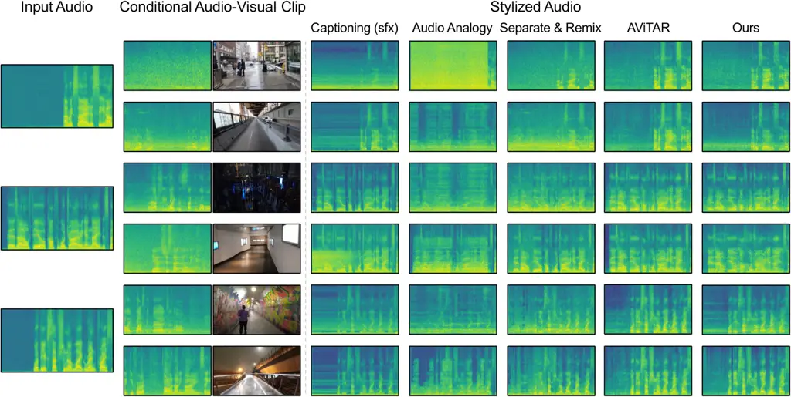

Figure 4: Model comparison. We show soundscape stylization results for
several models, where each input audio is conditioned on two different
audio-visual clips.

#### Qualitative results.

We visualize how our results vary under different conditional examples
and compare our model with baselines in Figure 4. We also provide
additional qualitative results in the Appendix A.4. For the
caption-based methods, we only present the best model, which relies on
isolated sound effects. Notably, we observe that while these methods
occasionally align with the provided conditional examples, they often
falter in most instances (like the artifacts introduced in the second
example). Audio Analogy appears promising for generating ambient sounds
that align with the conditional examples but falls short in complex
scenarios, such as the rainy street in the first example. Separate &
Remix tends to directly replicate ambient sounds without considering the
specific acoustic environment, leading to less precise acoustic
reproduction (like the reverb in the last two examples). AViTAR ranks as
the closest approach to our method, but it struggles to capture high
frequencies accurately, negatively affecting the overall quality and
intelligibility of the output. Our method stands out for its ability to
resemble the soundscapes of the conditional example with higher
fidelity. For a more direct experience of our model’s capabilities, we
strongly encourage readers to check out the results video available on
the [project webpage](https://tinglok.netlify.app/files/avsoundscape).

### 4.3 Ablation Study and Analysis

Table 4 presents the ablation studies on the CityWalk dataset. We
analyze the following model variants: (i) Using the clean audio from the
enhancement model as inputs instead of adding Gaussian noise; (ii)
Employing only the source separation model to isolate the target speech
that preserves the original acoustic properties (whereas our default
method involves employing a speech enhancement model afterward to modify
speech properties); (iii) Using only the separated sound effects (no
speech) and their corresponding images as conditions; Randomly swapping
either (iv) the conditional audio, or (v) the conditional image with
another at test time to create misaligned audio-visual conditioning;
(vi) Using only the conditional model (no CFG) to stylize input; (vii)
Using only the unconditional model to stylize input; (viii) Training a
ResNet-18-based audio-visual encoder \[31\] from scratch rather than
using pre-trained CLIP and CLAP. Judging from the results, we draw the
following observations:

#### Adding noise mitigates audio nostalgia.

We ask whether adding noise will help mitigate the effect of “audio
nostalgia” described in Section 3.2. Table 4 clearly demonstrates that
our approach outperforms the model trained on clean speech by a large
margin, providing empirical evidence to support our hypothesis.

#### Acoustic properties play an important role in soundscape stylization.

We investigate whether our method can resemble plausible acoustic
properties to the conditional examples. To examine this, we first train
a model with speech extracted from a separation model, matching the
acoustic properties of the target and thus excluding the acoustic factor
in stylization. Moreover, we train another model conditioned solely on
the separated sound effects and their corresponding images. In this
scenario, since the conditional audio does not contain speech, it is not
sufficiently informative about acoustic variations, leading to arbitrary
acoustic changes at test time. As depicted in (ii) and (iii) of Table 4,
the performances of these variants drastically decline, indicating the
critical role of acoustic properties when it comes to soundscape
stylization.

#### Visual conditioning complements audio conditioning.

We explore the impact of visual conditioning on performance. To this
end, we create misaligned audio-visual pairs by substituting either the
conditional audio or its corresponding image with a random one, and then
assess our model’s performance with these pairs. As illustrated in (iv)
and (v) of Table 4, our model exhibits similar resistance against such
perturbations, regardless of whether it is conditioned on the original
audio with random images or their inverted versions. This implies that
the visual-only model can capture and interpret scene properties, and
that visual conditioning delivers complementary information for
soundscape stylization than audio conditioning alone.

#### Pre-training, CFG, and conditioning enhance stylization.

We assess the impact of pre-training, CFG, and conditioning on enhancing
output relevance. Table 4 demonstrates that our approach outperforms
variants that lack these components, demonstrating their effectiveness
in improving output relevance.

| Method                     | RTE^(\*)($`\downarrow`$) | PESQ^(\*)($`\uparrow`$) | FD ($`\downarrow`$) | FAD ($`\downarrow`$) | KL ($`\downarrow`$) | IS ($`\uparrow`$) |
| -------------------------- | ------------------------ | ----------------------- | ------------------- | -------------------- | ------------------- | ----------------- |
| (i) Clean Input            | 0.41                     | 2.49                    | 6.12                | 2.66                 | 0.75                | 1.49              |
| (ii) Separation-only Cond. | 0.60                     | 2.48                    | 6.11                | 2.44                 | 0.73                | 1.46              |
| (iii) Sfx-only Cond.       | 0.65                     | 2.42                    | 6.83                | 2.96                 | 0.90                | 1.45              |
| (iv) Random Audio Cond.    | 0.71                     | 2.20                    | 9.51                | 4.92                 | 1.05                | 1.44              |
| (v) Random Image Cond.     | 0.68                     | 2.28                    | 9.33                | 4.84                 | 0.97                | 1.46              |
| (vi) No CFG                | 0.53                     | 2.33                    | 7.44                | 3.37                 | 0.79                | 1.28              |
| (vii) No Cond.             | 0.98                     | 1.98                    | 16.77               | 7.59                 | 1.27                | 1.45              |
| (viii) From Scratch        | 0.44                     | 2.50                    | 6.18                | 2.41                 | 0.74                | 1.51              |
| Ours-full                  | 0.20                     | 2.83                    | 5.13                | 1.64                 | 0.59                | 2.03              |

Table 4: Quantitative ablation studies on the CityWalk dataset.

### 4.4 Cross-Modal and Cross-Domain Evaluation

#### Comparison to uni-modal models.

We explore the performance of CLAP audio and CLIP image encoders under
various conditional settings. Table 5 presents a comparison between the
fine-tuned audio encoder and its non-fine-tuned counterpart. Notably,
fine-tuning significantly enhances performance, suggesting that the
original CLAP model has limited generalization capabilities for our
dataset. Conversely, fine-tuning the image encoder has little effect on
performance gain, indicating its inherent strong generalization
abilities. Furthermore, we observe that the fine-tuned audio
conditioning model surpasses the image conditioning one, which suggests
that audio is a more informative modality for representing soundscapes
than visual. Based on these findings, we adopt a late fusion approach
\[95\], combining a fine-tuned CLAP audio encoder with a fixed CLIP
image encoder for our audio-visual model. This configuration achieves
the best performance among all the models, demonstrating the cross-modal
information from the visual modality can help craft more comprehensive
soundscapes than the audio modality alone.

| A   | V   | FT-A | FT-V | RTE^(\*)($`\downarrow`$) | PESQ^(\*)($`\uparrow`$) | FD ($`\downarrow`$) | FAD ($`\downarrow`$) | KL ($`\downarrow`$) | IS ($`\uparrow`$) | IB ($`\uparrow`$) | L3 ($`\uparrow`$) |
| --- | --- | ---- | ---- | ------------------------ | ----------------------- | ------------------- | -------------------- | ------------------- | ----------------- | ----------------- | ----------------- |
| ✗   | ✓   | ✗    | ✗    | 0.47                     | 2.45                    | 6.40                | 2.28                 | 0.91                | 1.41              | 0.125             | 0.882             |
| ✗   | ✓   | ✗    | ✓    | 0.44                     | 2.39                    | 6.39                | 2.29                 | 0.91                | 1.40              | 0.123             | 0.884             |
| ✓   | ✗   | ✗    | ✗    | 0.61                     | 1.22                    | 10.22               | 6.12                 | 0.88                | 1.53              | 0.111             | 0.817             |
| ✓   | ✗   | ✓    | ✗    | 0.38                     | 2.44                    | 5.94                | 2.08                 | 0.71                | 1.74              | 0.137             | 0.892             |
| ✓   | ✓   | ✓    | ✗    | 0.20                     | 2.83                    | 5.13                | 1.64                 | 0.59                | 2.03              | 0.172             | 0.915             |

Table 5: Comparison of our uni-modal (A or V) and audio-visual models.
A: Audio; V: Visual; FT-A: Fine-tuning for audio; FT-V: Fine-tuning for
visual.

#### Generalization to other datasets.

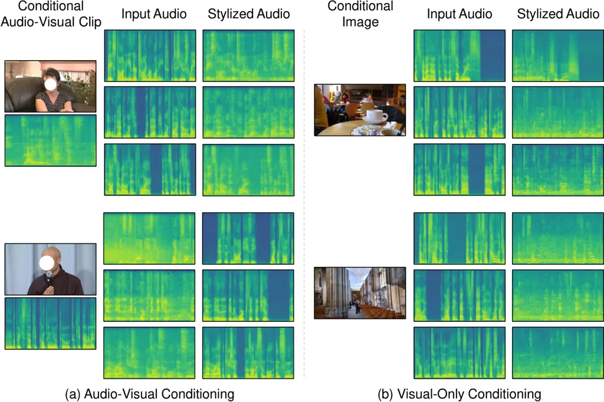

Figure 5: Qualitative generalization results. We restyle audio from LRS
\[85\] conditioned on audio-visual (or visual-only) clips taken from
AVSpeech \[19\].

We evaluate the generalization capabilities of our model using
out-of-distribution data. Specifically, we explore the model’s
proficiency in restyling speech from the LRS dataset \[85\] conditioned
on clips from the AVSpeech dataset \[19\]. As illustrated in Figure 5,
we use the clips captured in the indoor room, lecture, coffee shop, and
church. We show that our model, whether conditioned on audio-visual or
visual-only clips, exhibits robust in-context learning capabilities,
effectively adjusting acoustic properties to suit far-field conditions,
generating or eliminating ambient sounds, and reducing reverb to enhance
speech clarity in alignment with the conditional clips.

#### Generalization to non-speech sounds.

We examine the adaptability of our model to non-speech sounds. To test
this, we introduce sounds such as dog barks and train chimes to the
model. As shown in Figure 7, we find that our model is capable of
stylizing them to emulate soundscapes in streets, viewing platforms, and
the interior or exterior of a train, even though it is originally
trained solely on speech.

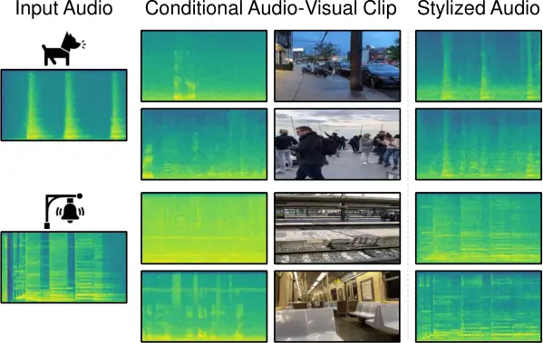

Figure 6: Generalization to non-speech sounds. We restyle the sounds of
dog barks and train chimes like they are in the conditional scenes.

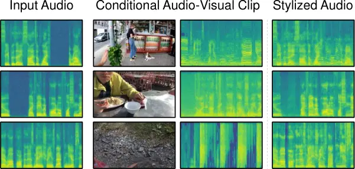

Figure 7: Failure cases. Our model fails to resemble the soundscapes of
the scenes, perhaps due to vocal effort or invisible sounding objects.
It also fails to generate impact sound synchronized with the conditional
example.

## 5 Conclusion

In this paper, we proposed the audio-visual soundscape stylization task,
aiming to restyle speech to resemble the rich soundscapes from unlabeled
in-the-wild audio-visual data. We also constructed an egocentric video
dataset and proposed a diffusion model-based method for solving this
task in a self-supervised manner. Objective and subjective evaluations
demonstrate our model’s capability to capture the acoustic properties
and ambient sounds of conditional examples. We also show the
adaptability of our model to other datasets, visual-only conditioning,
and non-speech audio. We hope that our work not only contributes to the
task itself but also encourages further exploration into how soundscapes
shape our perception of the world. We release the code on our [project
webpage](https://tinglok.netlify.app/files/avsoundscape).

#### Limitations and broader impacts.

While our model demonstrates promising results across various scenarios,
its performance can be inconsistent. As shown in Figure 7, our model
struggles with vocal effort challenges \[42\], affecting its ability to
capture nuances like pitch variations due to speaker-listener distance.
Furthermore, when sounding objects are not visually apparent in the
conditional clip (e.g., wind sounds), our model may not replicate these
sounds accurately. The model also faces difficulties in maintaining
audio-visual consistency \[7\], particularly with nonstationary audio
like impact sounds. This highlights the need for model and dataset
expansion to enhance scalability. Lastly, while soundscape stylization
is useful for content creation such as movie dubbing, it poses a
potential risk for creating disinformation videos.

#### Acknowledgements.

We thank Alexei A. Efros, Justin Salamon, Bryan Russell, Hao-Wen Dong,
and Ziyang Chen for their helpful discussions and Baihe Huang for
proofreading the paper. This work was funded in part by the Society of
Hellman Fellowship and Sony Research Award.

## References

- \[1\] Afouras, T., Chung, J.S., Senior, A., Vinyals, O., Zisserman,
  A.: Deep audio-visual speech recognition. IEEE transactions on pattern
  analysis and machine intelligence (2018)
- \[2\] Arandjelovic, R., Zisserman, A.: Look, listen and learn. In:
  Proceedings of the IEEE International Conference on Computer Vision.
  pp. 609–617 (2017)
- \[3\] Bau, D., Andonian, A., Cui, A., Park, Y., Jahanian, A., Oliva,
  A., Torralba, A.: Paint by word. arXiv preprint
  arXiv:2103.10951 (2021)
- \[4\] Brooks, T., Holynski, A., Efros, A.A.: Instructpix2pix: Learning
  to follow image editing instructions. In: Proceedings of the IEEE/CVF
  Conference on Computer Vision and Pattern Recognition. pp.
  18392–18402 (2023)
- \[5\] Chen, C., Gao, R., Calamia, P., Grauman, K.: Visual acoustic
  matching. In: Proceedings of the IEEE/CVF Conference on Computer
  Vision and Pattern Recognition. pp. 18858–18868 (2022)
- \[6\] Chen, C., Jain, U., Schissler, C., Gari, S.V.A., Al-Halah, Z.,
  Ithapu, V.K., Robinson, P., Grauman, K.: Soundspaces: Audio-visual
  navigation in 3d environments. In: Computer Vision–ECCV 2020: 16th
  European Conference, Glasgow, UK, August 23–28, 2020, Proceedings,
  Part VI 16. pp. 17–36. Springer (2020)
- \[7\] Chen, H., Xie, W., Afouras, T., Nagrani, A., Vedaldi, A.,
  Zisserman, A.: Audio-visual synchronisation in the wild. arXiv
  preprint arXiv:2112.04432 (2021)
- \[8\] Chen, H., Xie, W., Afouras, T., Nagrani, A., Vedaldi, A.,
  Zisserman, A.: Localizing visual sounds the hard way. In: Proceedings
  of the Conference on Computer Vision and Pattern Recognition
  (CVPR) (2021)
- \[9\] Chen, H., Xie, W., Vedaldi, A., Zisserman, A.: Vggsound: A
  large-scale audio-visual dataset. In: ICASSP 2020-2020 IEEE
  International Conference on Acoustics, Speech and Signal Processing
  (ICASSP). pp. 721–725. IEEE (2020)
- \[10\] Chen, Z., Qian, S., Owens, A.: Sound localization from motion:
  Jointly learning sound direction and camera rotation. arXiv preprint
  arXiv:2303.11329 (2023)
- \[11\] Corporation, B.B.: BBC Sound Effects (2017), available:
  [https://sound-effects.bbcrewind.co.uk/search](https://sound-effects.bbcrewind.co.uk/search)
- \[12\] Cramer, A.L., Wu, H.H., Salamon, J., Bello, J.P.: Look, listen,
  and learn more: Design choices for deep audio embeddings. In: ICASSP
  2019-2019 IEEE International Conference on Acoustics, Speech and
  Signal Processing (ICASSP). pp. 3852–3856. IEEE (2019)
- \[13\] Doersch, C., Zisserman, A.: Multi-task self-supervised visual
  learning. In: Proceedings of the IEEE international conference on
  computer vision. pp. 2051–2060 (2017)
- \[14\] Donahue, C., Caillon, A., Roberts, A., Manilow, E., Esling, P.,
  Agostinelli, A., Verzetti, M., Simon, I., Pietquin, O., Zeghidour, N.,
  et al.: Singsong: Generating musical accompaniments from singing.
  arXiv preprint arXiv:2301.12662 (2023)
- \[15\] Dong, H., Yu, S., Wu, C., Guo, Y.: Semantic image synthesis via
  adversarial learning. In: Proceedings of the IEEE international
  conference on computer vision. pp. 5706–5714 (2017)
- \[16\] Du, C., Teng, J., Li, T., Liu, Y., Yuan, T., Wang, Y., Yuan,
  Y., Zhao, H.: On uni-modal feature learning in supervised multi-modal
  learning. In: International Conference on Machine Learning. pp.
  8632–8656. PMLR (2023)
- \[17\] Du, Y., Chen, Z., Salamon, J., Russell, B., Owens, A.:
  Conditional generation of audio from video via foley analogies. In:
  Proceedings of the IEEE/CVF Conference on Computer Vision and Pattern
  Recognition. pp. 2426–2436 (2023)
- \[18\] Elizalde, B., Deshmukh, S., Al Ismail, M., Wang, H.: Clap
  learning audio concepts from natural language supervision. In: ICASSP
  2023-2023 IEEE International Conference on Acoustics, Speech and
  Signal Processing (ICASSP). pp. 1–5. IEEE (2023)
- \[19\] Ephrat, A., Mosseri, I., Lang, O., Dekel, T., Wilson, K.,
  Hassidim, A., Freeman, W.T., Rubinstein, M.: Looking to listen at the
  cocktail party: A speaker-independent audio-visual model for speech
  separation. ACM Transactions on Graphics (TOG) 37(4) (2016)
- \[20\] Ephrat, A., Peleg, S.: Vid2speech: speech reconstruction from
  silent video. In: 2017 IEEE International Conference on Acoustics,
  Speech and Signal Processing (ICASSP). pp. 5095–5099. IEEE (2017)
- \[21\] Esser, P., Rombach, R., Ommer, B.: Taming transformers for
  high-resolution image synthesis. In: Proceedings of the IEEE/CVF
  conference on computer vision and pattern recognition. pp.
  12873–12883 (2021)
- \[22\] Feng, C., Chen, Z., Owens, A.: Self-supervised video forensics
  by audio-visual anomaly detection. In: Proceedings of the IEEE/CVF
  Conference on Computer Vision and Pattern Recognition. pp.
  10491–10503 (2023)
- \[23\] Fonseca, E., Favory, X., Pons, J., Font, F., Serra, X.: Fsd50k:
  an open dataset of human-labeled sound events. IEEE/ACM Transactions
  on Audio, Speech, and Language Processing 30, 829–852 (2021)
- \[24\] Gan, C., Huang, D., Chen, P., Tenenbaum, J.B., Torralba, A.:
  Foley music: Learning to generate music from videos. In: Computer
  Vision–ECCV 2020: 16th European Conference, Glasgow, UK, August 23–28,
  2020, Proceedings, Part XI 16. pp. 758–775. Springer (2020)
- \[25\] Gao, R., Feris, R., Grauman, K.: Learning to separate object
  sounds by watching unlabeled video. In: Proceedings of the European
  Conference on Computer Vision (ECCV). pp. 35–53 (2018)
- \[26\] Gao, R., Grauman, K.: 2.5 d visual sound. In: Proceedings of
  the IEEE/CVF Conference on Computer Vision and Pattern Recognition.
  pp. 324–333 (2019)
- \[27\] Gemmeke, J.F., Ellis, D.P., Freedman, D., Jansen, A., Lawrence,
  W., Moore, R.C., Plakal, M., Ritter, M.: Audio set: An ontology and
  human-labeled dataset for audio events. In: 2017 IEEE International
  Conference on Acoustics, Speech and Signal Processing (ICASSP). pp.
  776–780. IEEE (2017)
- \[28\] Girdhar, R., El-Nouby, A., Liu, Z., Singh, M., Alwala, K.V.,
  Joulin, A., Misra, I.: Imagebind: One embedding space to bind them
  all. In: Proceedings of the IEEE/CVF Conference on Computer Vision and
  Pattern Recognition. pp. 15180–15190 (2023)
- \[29\] Grinfeder, E., Lorenzi, C., Haupert, S., Sueur, J.: What do we
  mean by “soundscape”? a functional description. Frontiers in Ecology
  and Evolution 10, 894232 (2022)
- \[30\] Harwath, D., Recasens, A., Surís, D., Chuang, G., Torralba, A.,
  Glass, J.: Jointly discovering visual objects and spoken words from
  raw sensory input. In: Proceedings of the European conference on
  computer vision (ECCV). pp. 649–665 (2018)
- \[31\] He, K., Zhang, X., Ren, S., Sun, J.: Deep residual learning for
  image recognition. In: Proceedings of the IEEE conference on computer
  vision and pattern recognition. pp. 770–778 (2016)
- \[32\] Hershey, S., Chaudhuri, S., Ellis, D.P., Gemmeke, J.F., Jansen,
  A., Moore, R.C., Plakal, M., Platt, D., Saurous, R.A., Seybold, B.,
  et al.: Cnn architectures for large-scale audio classification. In:
  2017 ieee international conference on acoustics, speech and signal
  processing (icassp). pp. 131–135. IEEE (2017)
- \[33\] Hertzmann, A., Jacobs, C.E., Oliver, N., Curless, B., Salesin,
  D.H.: Image analogies. In: Seminal Graphics Papers: Pushing the
  Boundaries, Volume 2. pp. 557–570 (2023)
- \[34\] Ho, J., Jain, A., Abbeel, P.: Denoising diffusion probabilistic
  models. Advances in neural information processing systems 33,
  6840–6851 (2020)
- \[35\] Ho, J., Salimans, T.: Classifier-free diffusion guidance. arXiv
  preprint arXiv:2207.12598 (2022)
- \[36\] Hu, C., Tian, Q., Li, T., Yuping, W., Wang, Y., Zhao, H.:
  Neural dubber: Dubbing for videos according to scripts. Advances in
  neural information processing systems 34, 16582–16595 (2021)
- \[37\] Huang, P.Y., Sharma, V., Xu, H., Ryali, C., Fan, H., Li, Y.,
  Li, S.W., Ghosh, G., Malik, J., Feichtenhofer, C.: Mavil: Masked
  audio-video learners (2023)
- \[38\] Huang, R., Huang, J., Yang, D., Ren, Y., Liu, L., Li, M., Ye,
  Z., Liu, J., Yin, X., Zhao, Z.: Make-an-audio: Text-to-audio
  generation with prompt-enhanced diffusion models. In: International
  Conference on Machine Learning (ICML) (2023)
- \[39\] Huang, S., Li, Q., Anil, C., Bao, X., Oore, S., Grosse, R.B.:
  Timbretron: A wavenet (cyclegan (cqt (audio))) pipeline for musical
  timbre transfer. arXiv preprint arXiv:1811.09620 (2018)
- \[40\] Huang, X., Belongie, S.: Arbitrary style transfer in real-time
  with adaptive instance normalization. In: Proceedings of the IEEE
  international conference on computer vision. pp. 1501–1510 (2017)
- \[41\] Huh, J., Chalk, J., Kazakos, E., Damen, D., Zisserman, A.:
  Epic-sounds: A large-scale dataset of actions that sound. In: ICASSP
  2023-2023 IEEE International Conference on Acoustics, Speech and
  Signal Processing (ICASSP). pp. 1–5. IEEE (2023)
- \[42\] Hunter, E.J., Cantor-Cutiva, L.C., van Leer, E.,
  Van Mersbergen, M., Nanjundeswaran, C.D., Bottalico, P., Sandage,
  M.J., Whitling, S.: Toward a consensus description of vocal effort,
  vocal load, vocal loading, and vocal fatigue. Journal of Speech,
  Language, and Hearing Research 63(2), 509–532 (2020)
- \[43\] Iashin, V., Rahtu, E.: Taming visually guided sound generation.
  In: The British Machine Vision Conference (BMVC) (2021)
- \[44\] Inc., A.: Enhance Speech: Remove noise and echo from voice
  recordings (2023), available:
  [https://podcast.adobe.com/enhance](https://podcast.adobe.com/enhance)
- \[45\] Isola, P., Zhu, J.Y., Zhou, T., Efros, A.A.: Image-to-image
  translation with conditional adversarial networks. In: Proceedings of
  the IEEE conference on computer vision and pattern recognition. pp.
  1125–1134 (2017)
- \[46\] Kaneko, T., Kameoka, H.: Cyclegan-vc: Non-parallel voice
  conversion using cycle-consistent adversarial networks. In: 2018 26th
  European Signal Processing Conference (EUSIPCO). pp. 2100–2104.
  IEEE (2018)
- \[47\] Kilgour, K., Zuluaga, M., Roblek, D., Sharifi, M.: Fréchet
  audio distance: A reference-free metric for evaluating music
  enhancement algorithms. In: INTERSPEECH. pp. 2350–2354 (2019)
- \[48\] Kim, C.D., Kim, B., Lee, H., Kim, G.: Audiocaps: Generating
  captions for audios in the wild. In: Proceedings of the 2019
  Conference of the North American Chapter of the Association for
  Computational Linguistics: Human Language Technologies, Volume 1 (Long
  and Short Papers). pp. 119–132 (2019)
- \[49\] Kingma, D.P., Welling, M.: Auto-encoding variational bayes.
  arXiv preprint arXiv:1312.6114 (2013)
- \[50\] Koepke, A.S., Wiles, O., Moses, Y., Zisserman, A.: Sight to
  sound: An end-to-end approach for visual piano transcription. In:
  ICASSP 2020-2020 IEEE International Conference on Acoustics, Speech
  and Signal Processing (ICASSP). pp. 1838–1842. IEEE (2020)
- \[51\] Kong, J., Kim, J., Bae, J.: Hifi-gan: Generative adversarial
  networks for efficient and high fidelity speech synthesis. Advances in
  Neural Information Processing Systems 33, 17022–17033 (2020)
- \[52\] Kong, Q., Cao, Y., Iqbal, T., Wang, Y., Wang, W., Plumbley,
  M.D.: Panns: Large-scale pretrained audio neural networks for audio
  pattern recognition. IEEE/ACM Transactions on Audio, Speech, and
  Language Processing 28, 2880–2894 (2020)
- \[53\] Korbar, B., Tran, D., Torresani, L.: Cooperative learning of
  audio and video models from self-supervised synchronization. In:
  Proceedings of the Advances in Neural Information Processing
  Systems (2018)
- \[54\] Kreuk, F., Synnaeve, G., Polyak, A., Singer, U., Défossez, A.,
  Copet, J., Parikh, D., Taigman, Y., Adi, Y.: Audiogen: Textually
  guided audio generation. In: International Conference on Learning
  Representations (ICLR) (2023)
- \[55\] Lee, S.H., Roh, W., Byeon, W., Yoon, S.H., Kim, C., Kim, J.,
  Kim, S.: Sound-guided semantic image manipulation. In: Proceedings of
  the IEEE/CVF conference on computer vision and pattern recognition.
  pp. 3377–3386 (2022)
- \[56\] Li, J., Li, D., Xiong, C., Hoi, S.: Blip: Bootstrapping
  language-image pre-training for unified vision-language understanding
  and generation. In: International Conference on Machine Learning. pp.
  12888–12900. PMLR (2022)
- \[57\] Li, T., Lin, Q., Bao, Y., Li, M.: Atss-net: Target speaker
  separation via attention-based neural network. In: Interspeech. pp.
  1411–1415 (2020)
- \[58\] Li, T., Liu, Y., Hu, C., Zhao, H.: Cvc: Contrastive learning
  for non-parallel voice conversion. In: Interspeech (2021)
- \[59\] Li, T., Liu, Y., Owens, A., Zhao, H.: Learning visual styles
  from audio-visual associations. In: European Conference on Computer
  Vision. pp. 235–252. Springer (2022)
- \[60\] Liu, H., Chen, Z., Yuan, Y., Mei, X., Liu, X., Mandic, D.,
  Wang, W., Plumbley, M.D.: Audioldm: Text-to-audio generation with
  latent diffusion models. In: International Conference on Machine
  Learning (ICML) (2023)
- \[61\] Lo, C.C., Fu, S.W., Huang, W.C., Wang, X., Yamagishi, J., Tsao,
  Y., Wang, H.M.: Mosnet: Deep learning based objective assessment for
  voice conversion. arXiv preprint arXiv:1904.08352 (2019)
- \[62\] Loshchilov, I., Hutter, F.: Decoupled weight decay
  regularization. arXiv preprint arXiv:1711.05101 (2017)
- \[63\] Luo, S., Yan, C., Hu, C., Zhao, H.: Diff-foley: Synchronized
  video-to-audio synthesis with latent diffusion models. arXiv preprint
  arXiv:2306.17203 (2023)
- \[64\] McDermott, J.H., Simoncelli, E.P.: Sound texture perception via
  statistics of the auditory periphery: evidence from sound synthesis.
  Neuron 71(5), 926–940 (2011)
- \[65\] Mei, X., Meng, C., Liu, H., Kong, Q., Ko, T., Zhao, C.,
  Plumbley, M.D., Zou, Y., Wang, W.: Wavcaps: A chatgpt-assisted
  weakly-labelled audio captioning dataset for audio-language multimodal
  research. arXiv preprint arXiv:2303.17395 (2023)
- \[66\] Morgado, P., Vasconcelos, N., Langlois, T., Wang, O.:
  Self-supervised generation of spatial audio for 360 video. In:
  Advances in Neural Information Processing Systems (2018)
- \[67\] Morgado, P., Vasconcelos, N., Misra, I.: Audio-visual instance
  discrimination with cross-modal agreement. In: Proceedings of the
  IEEE/CVF Conference on Computer Vision and Pattern Recognition. pp.
  12475–12486 (2021)
- \[68\] Owens, A., Efros, A.A.: Audio-visual scene analysis with
  self-supervised multisensory features. In: Proceedings of the European
  Conference on Computer Vision (2018)
- \[69\] Owens, A., Isola, P., McDermott, J., Torralba, A., Adelson,
  E.H., Freeman, W.T.: Visually indicated sounds. In: Proceedings of the
  IEEE conference on computer vision and pattern recognition. pp.
  2405–2413 (2016)
- \[70\] Owens, A., Wu, J., McDermott, J.H., Freeman, W.T., Torralba,
  A.: Ambient sound provides supervision for visual learning. In:
  Computer Vision–ECCV 2016: 14th European Conference, Amsterdam, The
  Netherlands, October 11–14, 2016, Proceedings, Part I 14. pp. 801–816.
  Springer (2016)
- \[71\] Patrick, M., Huang, P.Y., Misra, I., Metze, F., Vedaldi, A.,
  Asano, Y.M., Henriques, J.F.: Space-time crop & attend: Improving
  cross-modal video representation learning. In: Proceedings of the
  IEEE/CVF International Conference on Computer Vision. pp.
  10560–10572 (2021)
- \[72\] Petermann, D., Wichern, G., Wang, Z.Q., Le Roux, J.: The
  cocktail fork problem: Three-stem audio separation for real-world
  soundtracks. In: ICASSP 2022-2022 IEEE International Conference on
  Acoustics, Speech and Signal Processing (ICASSP). pp. 526–530.
  IEEE (2022)
- \[73\] Pijanowski, B.C., Villanueva-Rivera, L.J., Dumyahn, S.L.,
  Farina, A., Krause, B.L., Napoletano, B.M., Gage, S.H., Pieretti, N.:
  Soundscape ecology: the science of sound in the landscape. BioScience
  61(3), 203–216 (2011)
- \[74\] Plakal, M., Ellis, D.: YAMNet (2020), available:
  [https://github.com/tensorflow/models/tree/master/research/audioset/yamnet](https://github.com/tensorflow/models/tree/master/research/audioset/yamnet)
- \[75\] Prajwal, K., Mukhopadhyay, R., Namboodiri, V.P., Jawahar, C.:
  Learning individual speaking styles for accurate lip to speech
  synthesis. In: Proceedings of the IEEE/CVF Conference on Computer
  Vision and Pattern Recognition. pp. 13796–13805 (2020)
- \[76\] Radford, A., Kim, J.W., Hallacy, C., Ramesh, A., Goh, G.,
  Agarwal, S., Sastry, G., Askell, A., Mishkin, P., Clark, J., et al.:
  Learning transferable visual models from natural language supervision.
  In: International conference on machine learning. pp. 8748–8763.
  PMLR (2021)
- \[77\] Radford, A., Kim, J.W., Xu, T., Brockman, G., McLeavey, C.,
  Sutskever, I.: Robust speech recognition via large-scale weak
  supervision. In: International Conference on Machine Learning. pp.
  28492–28518. PMLR (2023)
- \[78\] Rix, A.W., Beerends, J.G., Hollier, M.P., Hekstra, A.P.:
  Perceptual evaluation of speech quality (pesq)-a new method for speech
  quality assessment of telephone networks and codecs. In: 2001 IEEE
  international conference on acoustics, speech, and signal processing.
  Proceedings (Cat. No. 01CH37221). vol. 2, pp. 749–752. IEEE (2001)
- \[79\] Rombach, R., Blattmann, A., Lorenz, D., Esser, P., Ommer, B.:
  High-resolution image synthesis with latent diffusion models. In:
  Proceedings of the IEEE/CVF conference on computer vision and pattern
  recognition. pp. 10684–10695 (2022)
- \[80\] Salimans, T., Goodfellow, I., Zaremba, W., Cheung, V., Radford,
  A., Chen, X.: Improved techniques for training gans. Advances in
  neural information processing systems 29 (2016)
- \[81\] Schroeder, M.R.: New method of measuring reverberation time.
  The Journal of the Acoustical Society of America 37(6_Supplement),
  1187–1188 (1965)
- \[82\] Sheffer, R., Adi, Y.: I hear your true colors: Image guided
  audio generation. In: ICASSP 2023-2023 IEEE International Conference
  on Acoustics, Speech and Signal Processing (ICASSP). pp. 1–5.
  IEEE (2023)
- \[83\] Singh, N., Mentch, J., Ng, J., Beveridge, M., Drori, I.:
  Image2reverb: Cross-modal reverb impulse response synthesis. In:
  Proceedings of the IEEE/CVF International Conference on Computer
  Vision. pp. 286–295 (2021)
- \[84\] Somayazulu, A., Chen, C., Grauman, K.: Self-supervised visual
  acoustic matching. Advances in Neural Information Processing Systems
  36 (2024)
- \[85\] Son Chung, J., Senior, A., Vinyals, O., Zisserman, A.: Lip
  reading sentences in the wild. In: Proceedings of the IEEE conference
  on computer vision and pattern recognition. pp. 6447–6456 (2017)
- \[86\] Song, J., Meng, C., Ermon, S.: Denoising diffusion implicit
  models. arXiv preprint arXiv:2010.02502 (2020)
- \[87\] Steinmetz, C.J., Bryan, N.J., Reiss, J.D.: Style transfer of
  audio effects with differentiable signal processing. arXiv preprint
  arXiv:2207.08759 (2022)
- \[88\] Steinmetz, C.J., Reiss, J.D.: pyloudnorm: A simple yet flexible
  loudness meter in python. In: 150th AES Convention (2021)
- \[89\] Su, K., Liu, X., Shlizerman, E.: How does it sound? Advances in
  Neural Information Processing Systems 34, 29258–29273 (2021)
- \[90\] Team, S.: Silero vad: pre-trained enterprise-grade voice
  activity detector (vad), number detector and language classifier.
  [https://github.com/snakers4/silero-vad](https://github.com/snakers4/silero-vad) (2021)
- \[91\] Ulyanov, D.: Audio texture synthesis and style transfer (2016),
  available:
  [https://dmitryulyanov.github.io/audio-texture-synthesis-and-style-transfer/](https://dmitryulyanov.github.io/audio-texture-synthesis-and-style-transfer/)
- \[92\] Välimäki, V., Parker, J., Savioja, L., Smith, J.O., Abel, J.:
  More than 50 years of artificial reverberation. In: Audio engineering
  society conference: 60th international conference: dreams
  (dereverberation and reverberation of audio, music, and speech). Audio
  Engineering Society (2016)
- \[93\] Vaswani, A., Shazeer, N., Parmar, N., Uszkoreit, J., Jones, L.,
  Gomez, A.N., Kaiser, Ł., Polosukhin, I.: Attention is all you need.
  Advances in neural information processing systems 30 (2017)
- \[94\] Verma, P., Smith, J.O.: Neural style transfer for audio
  spectograms. arXiv preprint arXiv:1801.01589 (2018)
- \[95\] Wang, W., Tran, D., Feiszli, M.: What makes training
  multi-modal classification networks hard? In: Proceedings of the
  IEEE/CVF conference on computer vision and pattern recognition. pp.
  12695–12705 (2020)
- \[96\] Wang, Y., Ju, Z., Tan, X., He, L., Wu, Z., Bian, J., Zhao, S.:
  Audit: Audio editing by following instructions with latent diffusion
  models. arXiv preprint arXiv:2304.00830 (2023)
- \[97\] Yang, D., Yu, J., Wang, H., Wang, W., Weng, C., Zou, Y., Yu,
  D.: Diffsound: Discrete diffusion model for text-to-sound generation.
  IEEE/ACM Transactions on Audio, Speech, and Language Processing (2023)
- \[98\] Yang, F., Ma, C., Zhang, J., Zhu, J., Yuan, W., Owens, A.:
  Touch and go: Learning from human-collected vision and touch. In:
  Neural Information Processing Systems (NeurIPS) - Datasets and
  Benchmarks Track (2022)
- \[99\] Yang, F., Zhang, J., Owens, A.: Generating visual scenes from
  touch. International Conference on Computer Vision (ICCV) (2023)
- \[100\] Yang, K., Russell, B., Salamon, J.: Telling left from right:
  Learning spatial correspondence of sight and sound. In: Proceedings of
  the IEEE/CVF Conference on Computer Vision and Pattern Recognition.
  pp. 9932–9941 (2020)
- \[101\] Zhao, H., Gan, C., Ma, W.C., Torralba, A.: The sound of
  motions. In: Proceedings of the IEEE/CVF International Conference on
  Computer Vision. pp. 1735–1744 (2019)
- \[102\] Zhao, H., Gan, C., Rouditchenko, A., Vondrick, C., McDermott,
  J., Torralba, A.: The sound of pixels. In: Proceedings of the European
  conference on computer vision (ECCV). pp. 570–586 (2018)
- \[103\] Zhou, Y., Wang, Z., Fang, C., Bui, T., Berg, T.L.: Visual to
  sound: Generating natural sound for videos in the wild. In:
  Proceedings of the IEEE conference on computer vision and pattern
  recognition. pp. 3550–3558 (2018)
- \[104\] Zhu, J.Y., Park, T., Isola, P., Efros, A.A.: Unpaired
  image-to-image translation using cycle-consistent adversarial
  networks. In: Proceedings of the IEEE international conference on
  computer vision. pp. 2223–2232 (2017)

## Appendix A.1 Results Video

Our results video on the [project
webpage](https://tinglok.netlify.app/files/avsoundscape) shows our
model’s ability to restyle speech to match a variety of input scenes.
Additionally, we show:

- •
  Despite being trained only on egocentric walking videos, our model can
  successfully be applied to a variety of out-of-domain speech clips,
  such as LRS \[85\], AVSpeech \[19\], VGG-Sound \[9\], Into the Wild
  \[59\], and the classic film Roman Holiday.
- •
  Our model can generalize to non-speech sounds taken from BBC Sound
  Effect \[11\], such as the cry of a baby, a barking dog, train chimes,
  footsteps, and gunshots.
- •
  We present that the behavior of our model varies with the selected
  conditional example.
- •
  We find qualitatively that our model can add or remove reverb,
  transform close-talking and far-field speech, reduce noise,
  incorporate ambient sounds, and enhance the audio quality of old
  movies.

## Appendix A.2 Dataset Collection

We introduce the CityWalk dataset, a collection of egocentric videos for
audio-visual soundscape stylization. This dataset features a rich
diversity of real-world sound textures, which comprises 3,447 indoor
(28%) and outdoor (72%) videos, with a total length of 2,395 hours. The
videos were collected from YouTube, using search queries such as “City
Walk+POV” and “City Walk+Binaural.” Detailed duration statistics are
depicted in Figure 8(a). As illustrated in Figure 9, CityWalk contains a
wide spectrum of audio recordings, including human speech and ambient
sound, captured in varied environments such as urban streets, train
stations, buses, beaches, shopping malls, mountains, markets, and boats,
spanning diverse weather conditions. We also provide top-14 categorical
distributions in Figure 8(b), which are acquired from the CLIP \[76\]
predictions.

For data filtering and training in our proposed task, we first split
each video into 10-second clips and run a pre-trained YAMNet model
\[74\] to tag each soundtrack. This step ensures the presence of the
targeted audio types within these clips, ensuring that they have not
been substituted with alternate sounds, such as voice-overs or
background music. Furthermore, we use an off-the-shelf voice activity
detector \[90\] to detect speech onsets and exclude silence intervals.
The total duration of the CityWalk dataset is 1,150 hours. We randomly
sample 150 hours for model development, allocating 142 hours for
training data and reserving the remainder for evaluation without ground
truth. Additionally, we sample another 8 hours of held-out videos for
assessing metrics between the generated and ground truth audio, achieved
by doing the proposed pretext task at test time, _i.e_., conditioning on
different time steps within the same video. Please note that the source
of training and testing videos do not overlap.

(a) Distribution of video duration

(b) Distribution of video categories

Figure 8: Statistical analysis of the CityWalk Dataset. We present: (a)
The distribution of video duration in the datasets; (b) The distribution
of the top 14 categories within the dataset deduced by CLIP \[76\].

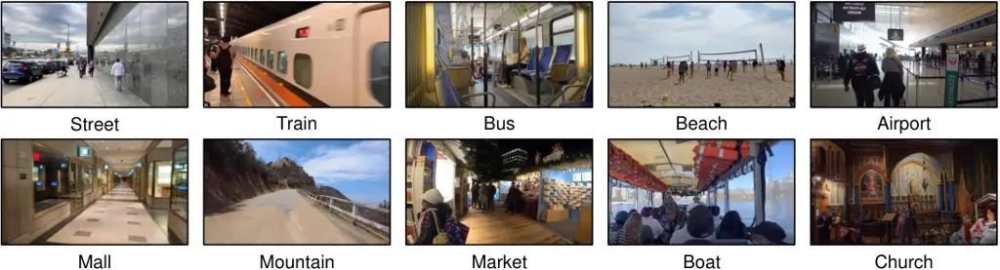

Figure 9: Example frames of the CityWalk dataset. We randomly select 10
different scenes here for showcasing.

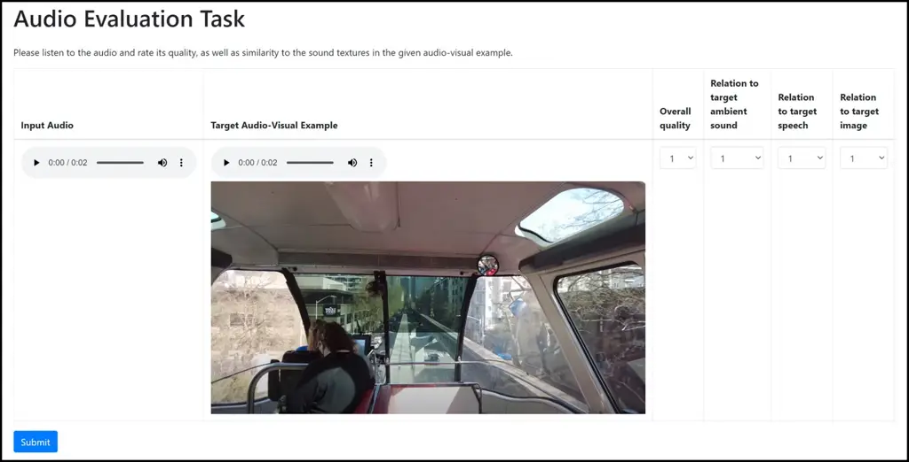

Figure 10: Interface for Human Evaluation. We provide a screenshot of
the interface designed for evaluating audio-visual soundscape
stylization. Participants are instructed to listen to each audio at
least three times, and complete the last four columns prior to advancing
to the next example. Upon clicking the “Submit” button, participants
will be navigated to the next question.

## Appendix A.3 Additional Evaluation Details

#### RTE.

We utilize a pre-trained RT60 estimator developed by Chen et al. \[5\],
which processes spectrogram through a ResNet-18 encoder \[31\], to
predict the RT60 score. This model is trained on 2.56-second clips of
reverberant speech, generated by the SoundSpaces simulator \[6\], each
paired with its corresponding ground truth RT60 value. Training is
accomplished by minimizing the MSE loss between the model’s predicted
RT60 scores and the actual ground truth values. These ground truth RT60
values are determined following the method proposed by Schroeder et al.
\[81\]. For comparison, we report the RT60 difference between each
model’s output and the ground truth as RTE.

#### PESQ.

We evaluate the output speech quality using PESQ. This metric provides
an objective measure of speech quality through a comparison of the
ground truth and generated speech. The scores range from -0.5 to 4.5,
where higher scores indicate better quality. To ensure the reliability
of our PESQ evaluations, we perform the tests using the ITU-T P.862
implementation of PESQ. Each input speech is fed to our model and
baselines, and the output is then evaluated against the ground truth to
compute the score.

However, it is important to be aware of some drawbacks with the PESQ
metric in this context. PESQ is generally designed to take a clean
speech reference and measure a degraded speech clip against it. In our
case, the reference is a noisy speech signal, and the degraded input is
the enhanced noisy speech signal produced by the model. This setup
introduces a couple of issues: (i) The phase between the reference and
degraded speech will often be inconsistent because HiFi-GAN \[51\]
generates new phases for the vocoded waveforms. And PESQ does have some
sensitivity to phase differences. (ii) Using PESQ with a noisy reference
is likely outside its intended use. This mismatch can affect the
accuracy and reliability of the PESQ scores.

#### Subjective metrics.

For subjective metrics (OVL, RAM, RAC, RVI) in the main paper, we
developed an interface shown in Figure 10. We selected 100 test samples
and each of them was rated by 40 unique participants who are native
English speakers to ensure reliability. To maintain anonymity, we
organized model outputs in a folder and assigned them with random
identifiers. Participants were then tasked with rating each audio file
within the context of an audio-visual example by completing the last
four columns. We also included a control set containing only white noise
to prevent random submissions. Our analysis of the control set revealed
consistently low scores given by all human raters, reinforcing the
reliability of our evaluation. We also noted that every participant
spent a minimum of two minutes on each vote, which strengthened our
confidence in the dependability of the results.

## Appendix A.4 Additional Results

#### Adjusting SNR in Separate & Remix.

As shown in Table 6, we explore the implications of adjusting the
signal-to-noise ratio (SNR) in Separate & Remix baseline \[72\]. Our
observations indicate that while tweaking SNR can yield some benefits,
the overall impact is relatively limited. It is also important to note
this process can be subjective and vary depending on the specific
application or user preference. In contrast, our method circumvents the
need for such SNR adjustments, thereby demonstrating its robustness and
adaptability in various scenarios.

| Method |  MSE^(\*)($`\downarrow`$) |  FD ($`\downarrow`$) |  FAD ($`\downarrow`$) |  KL ($`\downarrow`$) |  IS ($`\uparrow`$) |  IB ($`\uparrow`$) |  L3 ($`\uparrow`$) |
| ------ | ------------------------- | -------------------- | --------------------- | -------------------- | ------------------ | ------------------ | ------------------ |
| SNR=5  | 1.04                      | 8.63                 | 3.37                  | 0.72                 | 1.53               | 0.12               | 0.81               |
| SNR=8  | 1.02                      | 8.65                 | 3.34                  | 0.71                 | 1.51               | 0.12               | 0.83               |
| SNR=10 | 1.03                      | 8.68                 | 3.38                  | 0.70                 | 1.52               | 0.12               | 0.84               |
| Origin | 1.02                      | 8.87                 | 3.48                  | 0.70                 | 1.51               | 0.11               | 0.82               |

Table 6: Quantitative analysis of different SNR levels for Separate &
Remix baseline.

#### Enhancement Strategies Comparisons

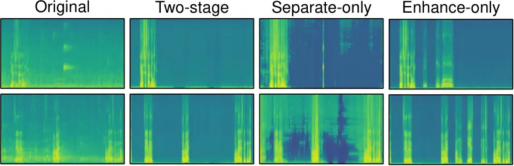

Figure 11: Qualitative enhancement comparison. We visualize enhanced
audio from different enhancement strategies, including separation-only,
enhancement-only, and their combination.

We propose a two-stage approach for speech enhancement, consisting of
source separation \[72\] as the initial step, followed by speech
enhancement \[44\] as the subsequent step, to yield the final input
audio. This approach is important because relying solely on either
source separation or speech enhancement fails to yield the desired
speech quality we require.

| Method           | RT60 ($`\downarrow`$) | OVL ($`\uparrow`$) |
| ---------------- | --------------------- | ------------------ |
| Origin           | 0.642                 | 2.758              |
| Separation-only  | 0.487                 | 2.974              |
| Enhancement-only | 0.092                 | 3.221              |
| Two-stage        | 0.004                 | 3.987              |

Table 7: Quantitative comparison of different enhancement strategies.

As depicted in the penultimate column of Figure 11, using the separation
model alone results in isolated speech that retains its original
acoustic properties, making our stylization model struggle to acquire
the necessary acoustic properties during the training process. Besides,
using the enhancement-only method (as seen in the last column of
Figure 11) often treats both close-talking and far-field speech as the
enhanced target, leading to imprecise foreground speech identification.
This, in turn, can degrade the quality of stylization. In contrast, our
proposed two-stage approach excels in balancing ambient sounds and
acoustic properties (as shown in the second column in Figure 11). We
also conduct a quantitative comparison of different enhancement
strategies to demonstrate the superiority of our two-stage method in
Table 7.

| Method                  |  RTE^(\*)($`\downarrow`$) |  PESQ^(\*)($`\uparrow`$) |  FD ($`\downarrow`$) |  FAD ($`\downarrow`$) |  KL ($`\downarrow`$) |  IS ($`\uparrow`$) |
| ----------------------- | ------------------------- | ------------------------ | -------------------- | --------------------- | -------------------- | ------------------ |
| (i) Loudness-norm Cond. | 0.33                      | 2.46                     | 6.21                 | 2.54                  | 0.78                 | 1.46               |
| (ii) Speech-only Cond.  | 0.84                      | 2.03                     | 13.19                | 6.36                  | 1.17                 | 1.54               |
| (iii) ISTFT             | 0.38                      | 2.39                     | 6.96                 | 3.01                  | 0.87                 | 1.45               |
| Ours-full               | 0.20                      | 2.83                     | 5.13                 | 1.64                  | 0.59                 | 2.03               |

Table 8: Additional ablation studies on the CityWalk dataset.

#### Additional non-speech sound stylization.

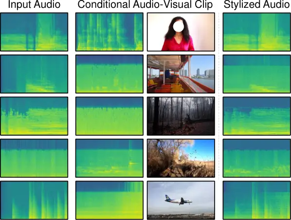

Figure 12: Additional results on non-speech sound stylization. We
restyle sounds like baby cries and cat mews to match the soundscapes of
the specified scenes.

We present additional evidence of our model’s adaptability to handle
non-speech sounds in Figure 12. We specifically assess its performance
on a variety of sounds, including baby cries, cat meows, footsteps,
gunshots, and chicken crows (please note that these sounds are prominent
in the foreground). It turns out that our model successfully stylizes
these sounds to align with conditional scenes by modifying the room
impulse response and generating analogous ambient sounds, including
splashing, rain, and the roar of a jet engine, even though it is trained
solely on speech data. Please refer to the project webpage for a direct
demonstration.

| Method             | FD ($`\downarrow`$) | FAD ($`\downarrow`$) | KL ($`\downarrow`$) | IS ($`\uparrow`$) | IB ($`\uparrow`$) | L3 ($`\uparrow`$) |
| ------------------ | ------------------- | -------------------- | ------------------- | ----------------- | ----------------- | ----------------- |
| 2.56s A            | 5.94                | 2.08                 | 0.71                | 1.74              | 0.137             | 0.892             |
| 5.12s A            | 5.89                | 2.10                 | 0.72                | 1.75              | 0.137             | 0.894             |
| 2.56s A + V (Ours) | 5.13                | 1.64                 | 0.59                | 2.03              | 0.172             | 0.915             |

Table 9: Quantitative results under different lengths of audio
conditioning.

| Scale           |  FD ($`\downarrow`$) |  FAD ($`\downarrow`$) |  KL ($`\downarrow`$) |  IS ($`\uparrow`$) |  IB ($`\uparrow`$) |  L3 ($`\uparrow`$) |
| --------------- | -------------------- | --------------------- | -------------------- | ------------------ | ------------------ | ------------------ |
| $`\lambda=1.0`$ | 16.77                | 7.59                  | 1.27                 | 1.45               | 0.082              | 0.694              |
| $`\lambda=2.5`$ | 6.32                 | 2.21                  | 0.78                 | 1.44               | 0.131              | 0.893              |
| $`\lambda=3.5`$ | 5.35                 | 2.01                  | 0.66                 | 1.89               | 0.149              | 0.901              |
| $`\lambda=4.5`$ | 5.13                 | 1.64                  | 0.59                 | 2.03               | 0.172              | 0.915              |
| $`\lambda=5.5`$ | 5.40                 | 1.71                  | 0.66                 | 1.90               | 0.145              | 0.894              |
| $`\lambda=6.5`$ | 7.14                 | 2.86                  | 0.89                 | 1.32               | 0.114              | 0.856              |

Table 10: Quantitative results under different CFG scales.

|                       |      |           |       |        |      |
| --------------------- | ---- | --------- | ----- | ------ | ---- |
| Method                | Cap. | Aud Anlg. | S & R | AViTAR | Ours |
| MS-SNR ($`\uparrow`$) | 1.91 | 4.71      | 6.96  | 7.64   | 8.82 |

Table 11: Magnitude spectrogram SNR results (in dB) of our method and
baselines.

#### Additional ablation study.

In Table 8, we introduce two more variants of our method for further
analysis: i) Normalizing the loudness of all audio inputs to -20 dB LUFS
\[88\]; ii) Using only the separated speech and its corresponding image
frame as conditional examples; iii) Employing ISTFT to reconstruct
waveform instead of the HiFi-GAN vocoder.

We show that normalizing loudness adversely affects performance. This
outcome aligns with our conjecture, given our full model is sensitive to
loudness variations. Specifically, our approach is designed to mimic the
loudness of the conditional example, which is facilitated by training on
audio samples with diverse loudness levels. Imposing a uniform loudness
setting restricts the model’s ability to adapt to this aspect, thereby
reducing its performance. Furthermore, conditioning the model solely on
speech, as processed by our enhancement strategy, restricts it to
learning only the acoustic properties of speech (no ambient sounds).
This limitation hampers the model’s performance, as reflected in the
notable decline in the quantitative metrics. Furthermore, our findings
reveal that employing ISTFT to combine the phase of the input audio for
waveform reconstruction detracts from the model’s performance,
suggesting that the neural vocoder can result in better audio quality.

#### Different lengths of audio conditioning.

We test the model with different lengths of audio conditioning. As shown
in Table 9, we find that our model shows no significant improvement
under this setting. In contrast, our audio-visual model adds only 1.4%
extra parameters, significantly enhancing performance. This result
further suggests that integrating the visual modality can effectively
complement the audio modality for representing soundscapes.

#### Different CFG scales comparisons

We analyze the performance under various CFG scales ranging from 1 to
6.5. As illustrated in Table 10, we found a steady gain in metrics with
$`\lambda`$ increasing from 1 to 5.5, peaking at 4.5, but declining
after then.

#### Magnitude spectrogram SNR comparisons

We compare our method with baselines on the magnitude spectrogram SNR
(MS-SNR) metric in Table 11. Our method outperforms the other
approaches.

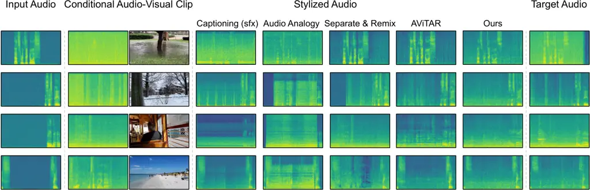

Figure 13: Additional qualitative results. We present conditional
examples derived from the same video as the input audio, but at
different time steps. This is an extension of Figure 4 in the main
paper.

#### Additional qualitative comparisons.

In Figure 13, we present additional qualitative comparisons between our
approach and the baselines. To provide a comprehensive evaluation, we
employ the same held-out video clips at different time intervals as
conditional examples, allowing us to illustrate our model’s proficiency
in reproducing the desired target audio. Furthermore, we introduce
conditional examples devoid of speech to facilitate a more precise
evaluation of our method and Separate & Remix.

Specifically, when confronted with non-speech conditional clips,
Separate & Remix \[72\] manages to extract the ambient sounds from the
conditioning. However, it struggles to strike an appropriate balance in
volume, resulting in the ambient sounds overwhelming the speech, as
exemplified in the third case.

Captioning-based methods \[65, 56\] also face challenges when presented
with conditional examples devoid of speech. Even in such instances, the
generated captions often fall short of capturing the nuanced details
within the input. For instance, in the second conditional example, where
the conditional audio features footsteps on snow, the generated caption
only identifies the presence of footsteps without acknowledging the
snow. Consequently, the resulting sound effects deviate from the
original conditional example.

Although Audio Analogy \[60\] can replicate ambient sounds to some
extent, its quality is not as consistent as our approach, probably due
to its heavy reliance on isolated ambient sound sources. Furthermore, we
find that Audio Analogy occasionally produces large artifacts, as
evident in the last three examples.

AViTAR \[5\], the best-performing prior work, fails to capture the high
frequencies of the conditional audio, which leads to a relatively low
SNR. One reason for this may be the use of a GAN-based architecture,
whereas our approach is based on latent diffusion.

We note that while our method generally outperforms these baselines by
considering both ambient sounds and acoustic properties, there are cases
where it appears to prioritize the input audio over the conditional one
when generating ambient sounds. This may lead to the intensity of the
generated soundscape not matching that of the conditional examples. For
example, in the first example of Figure 13, where the conditioning
features heavy rain, our model stylizes the audio to resemble light rain
instead, possibly influenced by the mild tone (whisper) of the input
audio. This suggests that our model may sometimes place more emphasis on
the acoustic properties during the stylization process, resulting in
such deviations.
