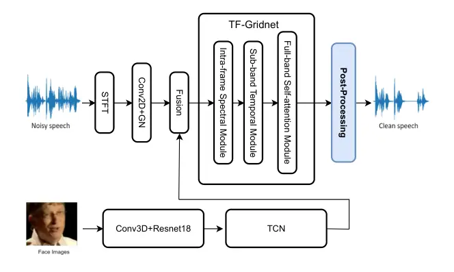
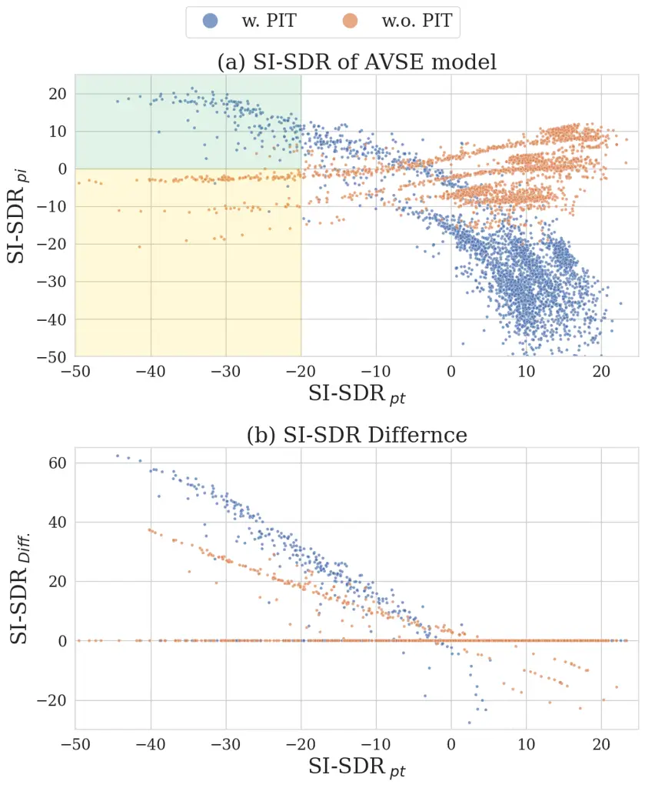

# Robust Audio-Visual Speech Enhancement: Correcting Misassignments in Complex Environments with Advanced Post-Processing

Wenze Ren    Kuo-Hsuan Hung    Rong Chao    YouJin Li    Hsin-Min Wang
   Yu Tsao

###### Abstract

This paper addresses the prevalent issue of incorrect speech output in
audio-visual speech enhancement (AVSE) systems, which is often caused by
poor video quality and mismatched training and test data. We introduce a
post-processing classifier (PPC) to rectify these erroneous outputs,
ensuring that the enhanced speech corresponds accurately to the intended
speaker. We also adopt a mixup strategy in PPC training to improve its
robustness. Experimental results on the AVSE-challenge dataset show that
integrating PPC into the AVSE model can significantly improve AVSE
performance, and combining PPC with the AVSE model trained with
permutation invariant training (PIT) yields the best performance. The
proposed method substantially outperforms the baseline model by a large
margin. This work highlights the potential for broader applications
across various modalities and architectures, providing a promising
direction for future research in this field.

###### Index Terms: 

Post-Processing Classifier, Audio-Visual Speech Enhancement, Permutation
Invariant Training, Mixup

^(†)^(†)address: ¹National Taiwan University, ²Academia Sinica

## 1 Introduction

Effective communication through spoken language is a cornerstone of
human interaction. However, background noise or competing speakers often
pose significant challenges. In noisy environments, it becomes
increasingly difficult to discern speech, leading to misunderstandings
and reduced communication efficiency. Traditional speech enhancement
(SE) technology mainly relies on unimodal methods, which utilize the
intrinsic characteristics of audio signals to perform denoising and
separation tasks aimed at enhancing speech clarity and intelligibility
\[1, 2, 3\]. While these audio-only methods have made substantial
progress by introducing deep learning models \[4, 5, 6\], they often
encounter limitations in particularly noisy settings where audio signals
alone may not be sufficient for effective enhancement.

Researchers have increasingly focused on multimodal approaches that
integrate auditory and visual information in speech enhancement and
separation tasks. This shift is based on the understanding that visual
cues, such as lip movements and facial expressions, can significantly
improve speech comprehension by provide additional contextual
information. Supplementing auditory information with visual data can
reduce the adverse effects of background noise and competing speakers,
thereby improving overall communication effectiveness.

A significant breakthrough in SE came with the introduction of the first
multimodal deep convolution method in \[7\]. By integrating visual cues,
such as facial features and lip movements, to assist in processing audio
signals \[8, 9\], the capability and robustness of SE can be
significantly improved. This demonstrates the effectiveness of combining
visual and audio information in SE systems \[10, 11, 12\]. Building on
the success of convolutional neural networks (CNNs), researchers have
integrated recurrent neural networks (RNNs) into audio-visual speech
enhancement (AVSE) systems \[13\]. RNNs, particularly long short-term
memory networks (LSTMs), excel at processing time-series data, making
them ideally suited for modeling the dynamic characteristics of both
speech and visual signals \[14\]. Attention mechanisms further enhance
these models by allowing them to focus on the most relevant features in
the audio and visual modalities and adjust the importance of different
inputs according to their relevance. The launch of the Transformer model
marks another major advancement in the AVSE field \[15\]. Transformer’s
powerful self-attention mechanism can capture long-term dependencies and
complex relationships between audio and visual features. This capability
makes Transformer particularly effective in environments with multiple
competing speakers or severe background noise, further improving the
robustness and accuracy of SE systems.

Although these models have achieved significant progress in AVSE,
several challenges remain. One major issue is the mismatch between
training and test datasets, which hinders the ability of these models to
generalize to real-world environments. When faced with noise types not
present in the training set, performance drops significantly, even with
the addition of visual features. Additionally, noise reduction may not
be effective against competing speakers when the quality of the visual
features is deficient. These limitations can lead to the poor
performance of current AVSE systems and restrict the practical
applicability of multimodal SE techniques.

To overcome these challenges, we propose a novel post-processing
approach to address the mismatch between training and test datasets and
the low-quality visual information that affects the denoising of AVSE
systems. The proposed approach takes advantage of multimodal fusion and
adjusts the model output to better align with the characteristics of the
test environment. Our experiments demonstrate that this additional step
increases robustness and adaptability, ensuring improved performance in
real-world applications.

## 2 Propose Method

Our proposed AVSE system consists of two components: the AVSE model and
the post-processing classifier (PPC), as shown in Fig. 1. The system
operates in two stages. First, the AVSE model extracts the target audio
from the mixed audio. Then, PPC evaluates both the predicted target
audio and the predicted interference audio to select the one with better
performance. It is worth noting that the training of PPC is independent
of the AVSE model, i.e., PPC does not require the enhanced audio from
the AVSE model during training. This design makes PPC a plug-and-play
network that can be integrated with various AVSE models. The AVSE model
used in this work will be described in Section 2.1, while the PPC used
to select better output will be introduced in Section 2.2.

### 2.1 The AVSE Model

#### 2.1.1 Audio Feature Extraction

The noisy speech signal is initially transformed from the time domain to
the time-frequency domain through the Short-Time Fourier Transform
(STFT), resulting in a spectral representation. The resulting noisy
spectrogram is then processed using convolutional layers combined with
global normalization (GN). These layers enhance the representation of
the underlying speech signal by delving into deeper levels of the
spectrogram to effectively capture salient audio features.



Figure 1: Overview of the proposed audio-visual speech enhancement
system.

#### 2.1.2 Visual Feature Extraction

Visual features are extracted from the input speaker video using a 3D
CNN (Conv3D) combined with the ResNet-18 architecture. The Conv3D layers
process the temporal and spatial dimensions of the video frames, while
ResNet-18 extracts higher-level visual features, resulting in a more
robust representation of facial movements. These visual features are
then processed using a Temporal Convolutional Network (TCN) \[16\]. TCN
captures the temporal dependency of the visual features, ensuring more
effective modeling of the temporal context of the facial movements.

#### 2.1.3 Fusion

We concatenate visual and speech features along the channel dimension,
ensuring that the speech features input to TF-Gridnet \[17\]
comprehensively incorporate the speaker’s visual information.

#### 2.1.4 The Separation Network

We use TF-Gridnet \[17\] as the backbone separation network, which is a
cutting-edge deep neural network designed for monaural speaker
separation, especially under anechoic conditions. Its core functionality
revolves around complex spectral mapping, where the network is trained
to predict the real and imaginary (RI) components of a target speaker
from a mixture signal. This method achieves robust separation by
directly modeling phase information, which is often crucial for accurate
audio separation. The architecture of TF-GridNet is composed of multiple
blocks, each containing three key modules:

- •
  Intra-frame Spectral Module: This module processes each frame
  individually, using a bidirectional LSTM (BLSTM) to capture local
  spectral patterns within each frame. It focuses on modeling
  frequency-wise dependencies by unfolding the frequency dimension and
  processing it sequentially.
- •
  Sub-band Temporal Module: This module handles the temporal dependency
  across sub-bands by treating each frequency band as a sequence over
  time. Like the spectral module, it uses a BLSTM to model the temporal
  dynamics within each frequency sub-band.
- •
  Full-band Self-attention Module: This module introduces global context
  by applying self-attention across the entire time-frequency grid. It
  allows the network to capture long-range dependencies across time and
  frequency, which is essential for distinguishing overlapping speakers.

Together, these modules enable TF-GridNet to effectively exploit local
and global spectro-temporal information to achieve state-of-the-art
performance in speaker separation tasks. The design of this network
enables it to significantly improve the scale-invariant
signal-to-distortion ratio (SI-SDR) on benchmark datasets over previous
models.

#### 2.1.5 Loss Functions

In the SE field, the negative SI-SDR loss is commonly used for model
training in most methods, which is defined as:

```math
\mathcal{L}_{\text{SI-SDR}}(s,\hat{s})=-20\log_{10}\frac{\|\frac{\langle\hat{s},s\rangle}{\|s\|^{2}}s\|}{\|\hat{s}-\frac{\langle\hat{s},s\rangle}{\|s\|^{2}}s\|}, \tag{1}
```

where $`s`$ and $`\hat{s}`$ represent the target speech and enhanced
speech, respectively. We also use frequency domain multi-resolution
incremental spectral loss \[18\]. The total loss function used to train
our AVSE model is as follows:

```math
\mathcal{L}_{\text{Loss}}(s,\hat{s})=\mathcal{L}_{\text{SI-SDR}}(s,\hat{s})+\gamma\frac{1}{M}\sum_{m=1}^{M}\mathcal{L}^{m}_{\text{freq-}\Delta}(s,\hat{s}), \tag{2}
```

where $`\mathcal{L}^{m}_{\text{freq-}\Delta}(s,\hat{s})`$ represents the
spectral loss calculated at a specific resolution. We use three (i.e.,
$`M=3`$) configurations for FFT size, hop size, and window length (all
in samples), specifically: {512, 50, 240}, {1024, 120, 600}, and {2048,
240, 1200}. The weight $`\gamma`$ is set to 1.

Figure 2: Illustration of three different PPC models. $`\otimes`$
denotes the concatenation operation.

Figure 3: Detailed components of the audio encoder (a) and the visual
encoder (b) in the PPC models, and the SE-Res2Block used in both
encoders (c). Modules with a gray background are pre-trained and frozen
during model training.

### 2.2 The Post-processing Classifier (PPC)

It is observed that AVSE models occasionally output audio that resembles
interference audio, such as competing speakers or noise, which degrades
model performance. This issue may result from a mismatch between
training and evaluation datasets or poor video quality. To address this
issue, we introduce PPC, which aims to ensure that the output speech
aligns with the target speaker. PPC refines initial model predictions by
validating and adjusting output to improve overall accuracy and maintain
consistency across datasets. In this study, we propose three distinct
PPC models, as shown in Fig.2.

#### 2.2.1 Model Architecture

The proposed PPC is based on the ECAPA-TDNN \[19\] model, which is known
for its strong performance in speaker verification. As shown in Fig. 2,
in PPC, each modality has its encoder to extract the corresponding
embeddings. As shown in Fig. 3(a), the audio encoder processes
80-dimensional MFCCs from a 25 ms window with a 10 ms frame shift. As
shown in Fig. 3(b), the visual encoder combines face and lip embeddings
from a pre-trained face classifier \[20\] and a pre-trained lip-reading
model \[16\], respectively. In this work, we explored different
strategies for embedding integration and classifier design, resulting in
the following three PPC models:

- •
  PPC-1: As shown in Fig. 2(a), PPC-1 concatenates the embeddings of
  predicted target speech, predicted interference speech, and visual
  inputs. The concatenated embeddings are then processed through an
  attention pooling layer followed by a linear layer to predict the
  label. PPC-1 takes into account the input order of target and
  interference audio embeddings. During training, the label is 1 when
  the order is correct and 0 otherwise.
- •
  PPC-2: As shown in Fig. 2(b), PPC-2 concatenates the embeddings of
  predicted target speech and visual embeddings. The concatenated
  embeddings are then passed through an attention pooling layer followed
  by a linear layer to predict the label. This setup simplifies the
  integration of audio and visual features compared to PPC-1. During
  training, the label is 1 when the audio and visual embeddings are
  matched (from the same speaker) and 0 otherwise.
- •
  PPC-3: As shown in Fig. 2(c), this PPC model computes the frame-wise
  cosine similarity between audio and visual embeddings. The similarity
  scores are then averaged using a pooling layer to produce the final
  prediction. During the training phase, the labeling method is the same
  as PPC-2. Compared to PPC-2, this approach places greater emphasis on
  the alignment between audio and visual modalities.

We used the Binary Cross-Entropy (BCE) loss as the objective function to
train our PPC models, which is defined as:

```math
\displaystyle\mathcal{L}_{BCE}(y,\hat{y})=-(y\log(\hat{y})+(1-y)\log(1-\hat{y}), \tag{3}
```

where $`y`$ and $`\hat{y}`$ are the ground-truth label and predicted
value, respectively. Here, $`y`$ is 1 when the input audio is the target
speech and 0 otherwise.

#### 2.2.2 Mixup

We also utilize the mixup \[21\] strategy in PPC training, which extends
the training distribution by combining the prior knowledge that linear
interpolation of target and interference audio should lead to linear
interpolation of associated labels. This technique can serve as a form
of data augmentation. By incorporating mixup, the model can improve
generalization when encountering samples outside the training set.

### 2.3 Permutation Invariant Training

Our investigation found that the low-quality video in the training
dataset made it difficult for the AVSE model to use visual features to
accurately extract target speech, and that forcing the AVSE model to
output target speech under these conditions would actually reduce
performance. We solve this problem by applying post-processing to the
speech output, allowing the AVSE model to approximate either target
speech or interfering speech. We use the permutation invariant training
(PIT) \[22\] strategy commonly used in speech separation. The process is
formulated as follows:

```math
\displaystyle s^{\ast}=\mathop{\arg\min}_{\hat{s}\in\{s_{i},s_{t}\}}\mathcal{L}_{SI-SDR}(s,\hat{s}), \tag{4}
```

where $`s^{\ast}`$ is the permutation that minimizes the SI-SDR loss,
and $`s_{i}`$ and $`s_{t}`$ are the interference speech and target
speech, respectively.

## 3 Experimental Setup

### 3.1 Dataset

#### 3.1.1 Training and validation dataset

We utilize the officially provided LRS3 dataset (as used in AVSE
Challenge 2) as the training and development sets, where noise is
pre-mixed. This dataset includes everyday noises and disturbing
speakers. We did not employ dynamic mixing during training.

#### 3.1.2 Testing dataset

The proposed PPC models are mainly evaluated from two aspects: 1) the
accuracy of the classification task and 2) the SE performance when
integrated with the AVSE model. Four test sets were used to evaluate the
accuracy of model predictions: the development set in LRS3 (Dev), the
evaluation set of AVSE Challenge 2023 (Eva2023), and its two variants
Eva2023v1 and Eva2023v2. Eva2023v1 was derived using an AVSE model
trained with PIT, while Eva2023v2 was derived using an AVSE model
trained without PIT. This setting allows us to compare the performance
of PPC models under different training conditions and better understand
their robustness. The ground-truth labels are obtained as follows:

```math
\displaystyle y=\begin{cases}1,&\text{if SI-SDR${}_{pt}\geq$ SI-SDR${}_{pi}$}\\
0,&\text{otherwise}\end{cases} \tag{5}
```

where SI-SDR*(pt) and SI-SDR*(pi) represent the SI-SDR scores of
predicted target audio and predicted interference audio, respectively.
The predicted interference audio is obtained by subtracting the
predicted target audio from the mixed audio.

For evaluating the SE performance of the AVSE model integrated with PPC,
we use Eva2023 and the evaluation set of AVSE Challenge 2024 (Eva2024)
as the test sets. We use the same objective metrics as the Challenge,
including perceptual evaluation of speech quality (PESQ), short-time
objective intelligibility (STOI), and scale-invariant
signal-to-distortion ratio (SI-SDR), to ensure consistency in the
evaluation.

### 3.2 Hyperparameters

For the hyperparameters in the TF-GridNet block \[17\], we set $`I=4`$,
$`J=1`$, $`H=192`$, $`E=4`$, and $`L=4`$. We performed model training on
a single NVIDIA 4090 GPU with a batch size of 2 and an initial learning
rate of 0.001. The Adam optimizer was used. If the validation loss did
not improve for three consecutive epochs, the learning rate was halved
to help the convergence of model training. Each training epoch took
approximately 1.5 hours, and the model typically converged after
approximately 60 epochs. Checkpoints were created to monitor progress,
and early stopping was applied when satisfactory performance was
achieved before 60 epochs.

|       |       |          |         |           |           |
| ----- | ----- | -------- | ------- | --------- | --------- |
| Model | Mixup | Test set |         |           |           |
|       |       | Dev.     | Eva2023 | Eva2003v1 | Eva2003v2 |
| PPC-1 | ✗     | 0.983    | 0.710   | 0.652     | 0.604     |
| PPC-2 | ✗     | 0.997    | 0.828   | 0.764     | 0.712     |
| PPC-3 | ✗     | 1        | 0.988   | 0.902     | 0.883     |
| PPC-3 | ✓     | 1        | 0.995   | 0.939     | 0.890     |

Table 1: Accuracy of different PPC models on different test sets.

|          |          |         |     |            |      |        |
| -------- | -------- | ------- | --- | ---------- | ---- | ------ |
| Test set | Method   | Setting |     | Evaluation |      |        |
|          |          | PIT     | PPC | PESQ       | STOI | SI-SDR |
| Eva2023  | Noisy    | –       | –   | 1.14       | 0.44 | -5.1   |
|          | Baseline | –       | –   | 1.41       | 0.55 | 3.67   |
|          | Ours     | ✗       | ✗   | 1.89       | 0.78 | 6.35   |
|          |          | ✗       | ✓   | 1.89       | 0.81 | 7.30   |
|          |          | ✓       | ✗   | 1.82       | 0.77 | 5.41   |
|          |          | ✓       | ✓   | 1.91       | 0.82 | 7.94   |
| Eva2024  | Noisy    | –       | –   | 1.47       | 0.61 | -5.49  |
|          | Ours     | ✓       | ✗   | 2.17       | 0.72 | 3.80   |
|          |          | ✓       | ✓   | 2.22       | 0.77 | 5.71   |

Table 2: SE performance of different AVSE models on Eva2023 and Eva2024.

## 4 Experimental Results

### 4.1 Accuracy of PPC

The accuracy of different PPC models on different test sets is shown in
Table 1. We can see that the PPC models using a single speech input
(PPC-2 and PPC-3) outperform the PPC model using two speech inputs
simultaneously (PPC-1). We speculate that the result is due to the model
needing to learn that different orders of the two audio files will
produce different outputs, which may be too challenging for the model.
Furthermore, the model that integrates speech and video before
prediction (PPC-2) performs worse than the model that directly
calculates the distance between the two modalities in the latent space
(PPC-3). This is mainly because directly calculating the distance
between the two modalities allows the visual encoder to learn audio
embeddings that are closer to the target speech. In addition, applying
the mixup training strategy can further enhance the performance of
PPC-3, with the accuracy reaching 99.5%, 93.9%, and 89% on the Eva2023,
Eva2023v1, and Eva2023v2 sets, respectively.



Figure 4: Scatter plot of SI-SDR scores. (a) SI-SDR scores of predicted
target audio (SI-SDR*(pt)) and interference audio (SI-SDR*(pi)) produced
by different AVSE models. (b) Difference in SI-SDR (SI-SDR\_(Diff.))
before and after applying the best PPC model (PPC-3 with mixup in
Table 1).

It is worth noting that the accuracy on Eva2023v1 is higher than that on
Eva2023v2. It is speculated that the AVSE model tends to output audio
that resembles interference audio under certain circumstances,
especially when the input video quality is poor. Forcing the AVSE model
to learn the correct speech may end up outputting a mixture of target
audio and interference audio. In contrast, the AVSE model trained with
PIT only needs to output audio that is close to either the target audio
or interference audio, making it easier for the PPC model to make
accurate judgments. This is confirmed by the scatter plot in Fig. 4(a).
In the case where the SI-SDR value of the predicted target audio is low
(see left, below -20 dB on the x-axis), for the AVSE model without PIT
(orange dots), the corresponding SI-SDR value of the predicted
interference audio (y-axis) is mostly below 0 dB (yellow shaded area).
In contrast, for the AVSE model trained with PIT (blue dots), the
corresponding SI-SDR value of the predicted interference audio (y-axis)
is mostly above 0 dB (green shaded area). This result indicates that the
AVSE model trained with PIT can be better improved through PPC.

### 4.2 AVSE Performance

Fig. 4(b) shows the difference in SI-SDR after applying PPC to the AVSE
model. A difference greater than 0 indicates that PPC selected a better
SE output. It can be clearly seen from the figure that for most audio
files, PPC can correctly classify and effectively improve SE performance
(SI-SDR\_(Diff.) $`\geq`$ 0 dB). Table 2 shows the objective evaluation
scores for the AVSE challenge test sets. The evaluation results on
Eva2023 show that regardless of whether the AVSE model is trained with
PIT, using PPC can effectively improve the final SE performance,
especially in terms of SI-SDR. The combination of PPC and the
PIT-trained AVSE model achieved the best results, outperforming the
baseline model provided by the 2023 challenge by 0.5 in PESQ, 0.27 in
STOI, and 4.27 in SI-SDR. We also submitted our model outputs for the
2024 challenge test set Eva2024. The results show that PPC improves SE
performance by 0.05 in PESQ, 0.05 in STOI, and 1.91 in SI-SDR. These
results demonstrate the effectiveness of PPC as a post-processing for
AVSE models.

## 5 Conclusions

We have observed that various factors in audio-visual speech enhancement
can lead to erroneous speech output, such as poor video quality or
domain differences between the training and test datasets, which often
degrade model performance. This paper proposes the use of a
Post-Processing Classifier (PPC) to correct the output speech. With PPC,
we do not need to force the AVSE model to output correct speech;
instead, we use the Permutation Invariant Training (PIT) strategy to let
the AVSE model output either clean speech or noise, thereby achieving a
more stable training process. Experimental results show that the
combination of PPC and the PIT-trained AVSE model achieves the best SE
performance, significantly outperforming the baseline model in the AVSEC
challenge. Our findings provide a novel perspective into the field of
audio-visual speech enhancement.

There are potential areas for future work. The proposed PPC is not
limited to visual input; further experiments are needed to evaluate its
effectiveness with other modalities. Moreover, exploring its impact on
other audio-visual speech enhancement models is necessary for further
advancement.

## References

- \[1\] Hyeong-Seok Choi et al., “Phase-aware speech enhancement with
  deep complex U-Net,” in Proc. ICLR, 2019.
- \[2\] Yanxin Hu et al., “DCCRN: Deep complex convolution recurrent
  network for phase-aware speech enhancement,” in Proc.
  Interspeech, 2020.
- \[3\] Cem Subakan, Mirco Ravanelli, Samuele Cornell, Mirko Bronzi, and
  Jianyuan Zhong, “Attention is all you need in speech separation,” in
  Proc. ICASSP, 2021.
- \[4\] Xugang Lu, Yu Tsao, Shigeki Matsuda, and Chiori Hori, “Speech
  enhancement based on deep denoising autoencoder.,” in Proc.
  Interspeech, 2013.
- \[5\] DeLiang Wang and Jitong Chen, “Supervised speech separation
  based on deep learning: An overview,” IEEE/ACM Transactions on Audio,
  Speech, and Language Processing, vol. 26, no. 10, pp. 1702–1726, 2018.
- \[6\] Ding Liu, Paris Smaragdis, and Minje Kim, “Experiments on deep
  learning for speech denoising,” in Proc. Interspeech, 2014.
- \[7\] Jen-Cheng Hou et al., “Audio-visual speech enhancement using
  multimodal deep convolutional neural networks,” IEEE Transactions on
  Emerging Topics in Computational Intelligence, vol. 2, no. 2, pp.
  117–128, 2018.
- \[8\] Xuanjun Chen et al., “Multimodal transformer distillation for
  audio-visual synchronization,” in ICASSP 2024 - 2024 IEEE
  International Conference on Acoustics, Speech and Signal Processing
  (ICASSP), 2024, pp. 7755–7759.
- \[9\] Xuanjun Chen et al., “Push-pull: Characterizing the adversarial
  robustness for audio-visual active speaker detection,” in 2022 IEEE
  Spoken Language Technology Workshop (SLT), 2023, pp. 692–699.
- \[10\] Ruohan Gao and Kristen Grauman, “VisualVoice: Audio-visual
  speech separation with cross-modal consistency,” in Proc. CVPR, 2021.
- \[11\] Triantafyllos Afouras, Joon Son Chung, and Andrew Zisserman,
  “The conversation: Deep audio-visual speech enhancement,” in Proc.
  Interspeech, 2018.
- \[12\] Shang-Yi Chuang, Hsin-Min Wang, and Yu Tsao, “Improved lite
  audio-visual speech enhancement,” IEEE Transactions on Audio, Speech,
  and Language Processing, vol. 30, pp. 1345–1359, 2022.
- \[13\] Ashutosh Pandey and DeLiang Wang, “Dual-path self-attention rnn
  for real-time speech enhancement,” arXiv preprint
  arXiv:2010.12713, 2020.
- \[14\] Weijiang Feng et al., “Audio visual speech recognition with
  multimodal recurrent neural networks,” in Proc. IJCNN, 2017, pp.
  681–688.
- \[15\] Jiuxin Lin et al., “AV-Sepformer: Cross-attention sepformer for
  audio-visual target speaker extraction,” in Proc. ICASSP, 2023.
- \[16\] Triantafyllos Afouras, Joon Son Chung, Andrew Senior, Oriol
  Vinyals, and Andrew Zisserman, “Deep audio-visual speech recognition,”
  IEEE Transactions on Pattern Analysis and Machine Intelligence, vol.
  44, no. 12, pp. 8717–8727, Dec 2022.
- \[17\] Zhong-Qiu Wang et al., “TF-GridNet: Making time-frequency
  domain models great again for monaural speaker separation,” in Proc.
  ICASSP, 2023.
- \[18\] Zexu Pan, Meng Ge, and Haizhou Li, “A hybrid continuity loss to
  reduce over-suppression for time-domain target speaker extraction,” in
  Proc. Interspeech, 2022.
- \[19\] Brecht Desplanques, Jenthe Thienpondt, and Kris Demuynck,
  “ECAPA-TDNN: Emphasized channel attention, propagation and aggregation
  in TDNN based speaker verification,” in Proc. Interspeech, 2020.
- \[20\] Florian Schroff, Dmitry Kalenichenko, and James Philbin,
  “FaceNet: A unified embedding for face recognition and clustering,” in
  Proc. CVPR, 2015.
- \[21\] Hongyi Zhang, Moustapha Cisse, Yann N Dauphin, and David
  Lopez-Paz, “mixup: Beyond empirical risk minimization,” in Proc.
  ICLR, 2018.
- \[22\] Dong Yu, Morten Kolbæk, Zheng-Hua Tan, and Jesper Jensen,
  “Permutation invariant training of deep models for speaker-independent
  multi-talker speech separation,” in Proc. ICASSP, 2017.
