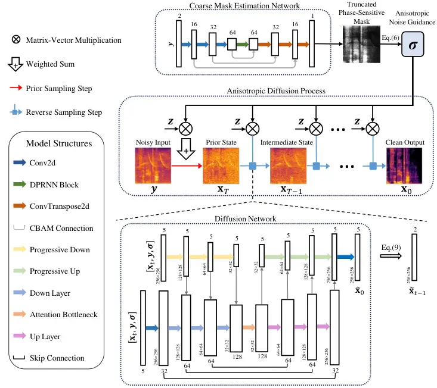
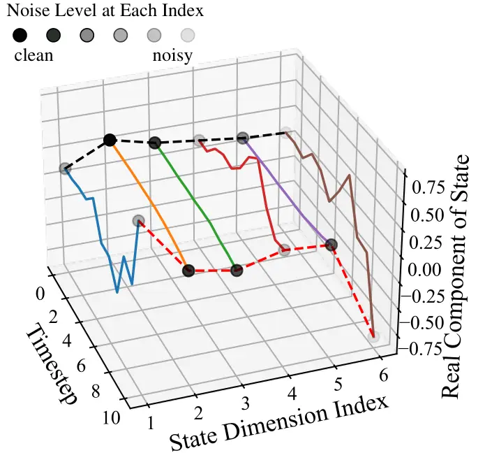
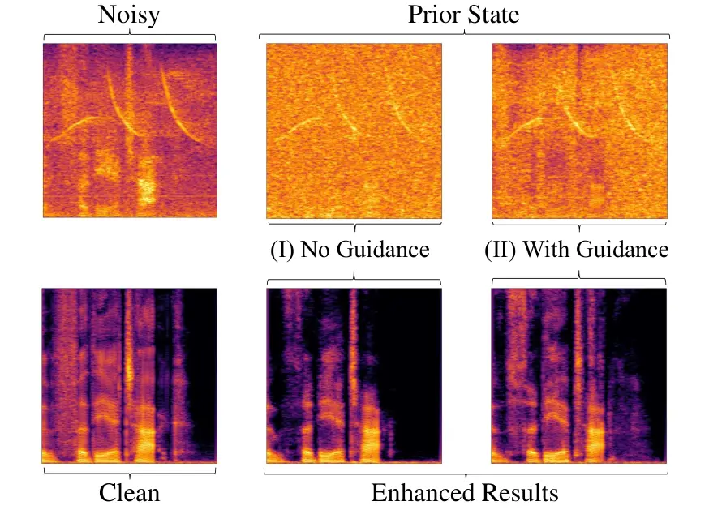

# GALD-SE: Guided Anisotropic Lightweight Diffusion for Efficient Speech Enhancement

Chengzhong Wang    Jianjun Gu    Dingding Yao    Junfeng Li    Yonghong
Yan ^(†)^(†)thanks: The authors are with the Key Laboratory of Speech
Acoustics and Content Understanding, Institute of Acoustics, Chinese
Academy of Sciences, University of Chinese Academy of Sciences, Beijing
100190, China.

###### Abstract

Speech enhancement is designed to enhance the intelligibility and
quality of speech across diverse noise conditions. Recently, diffusion
model has gained lots of attention in speech enhancement area, achieving
competitive results. Current diffusion-based methods blur the signal
with isotropic Gaussian noise and recover clean speech from the prior.
However, these methods often suffer from a substantial computational
burden. We argue that the computational inefficiency partially stems
from the oversight that speech enhancement is not purely a generative
task; it primarily involves noise reduction and completion of missing
information, while the clean clues in the original mixture do not need
to be regenerated. In this paper, we propose a method that introduces
noise with anisotropic guidance during the diffusion process, allowing
the neural network to preserve clean clues within noisy recordings. This
approach substantially reduces computational complexity while exhibiting
robustness against various forms of noise and speech distortion.
Experiments demonstrate that the proposed method achieves
state-of-the-art results with only approximately 4.5 million parameters,
a number significantly lower than that required by other diffusion
methods. This effectively narrows the model size disparity between
diffusion-based and predictive speech enhancement approaches.
Additionally, the proposed method performs well in very noisy scenarios,
demonstrating its potential for applications in highly challenging
environments. The code is available at
https://github.com/wangchengzhong/GALDSE.

###### Index Terms: 

Speech enhancement, generative diffusion models, anisotropic diffusion
process

## I Introduction

Speech enhancement aims at recovering clean speech signal from a noisy
mixture that is corrupted by various types of noise. It has a wide range
of applications, including hearing aids, speech recognition systems, and
human-computer interaction. Traditional methods usually involve noise
power estimation and extracting the clean signal in a statistical signal
processing way \[1, 2, 3\]. Not long ago, numerous machine
learning-based speech enhancement techniques were proposed \[4, 5, 6,
7\]. These methods involve training a neural network to predict the
clean signal from its noisy counterpart, significantly surpassing
traditional methods in terms of speech quality, especially in
non-stationary environments \[8\]. Recently, diffusion-based generative
models have gained increasing attention \[9\]–\[24\], achieving
state-of-the-art results and surpassing predictive approaches when the
tested audio mismatches with training datasets \[9\], \[16\].

Diffusion-based methods operate through a two-phase process: gradually
adding noise to an initial state in the forward process, and then
iteratively sampling along the reverse process to generate targeted
samples. In the field of speech enhancement, the spectrogram of noisy
speech frequently serves as a component of the prior for the diffusion
process and as an input to the neural network for reverse sampling
\[9\], \[10\], \[11\], \[13\], or exclusively the latter \[18, 22\]. The
corresponding diffusion process can be interpreted in a discrete \[29\]
or continuous \[9\] way, while the latter permits the use of numerical
stochastic differential equation (SDE) solvers to generate target speech
\[26\]. Richter et al. \[9\] proposed an SDE-based method that
introduces a novel drift term. In this way, the mean state of the
process is transformed from clean speech into its noisy counterpart
during the forward process and reversed during sampling. Two main
approaches have been explored to improve upon this scheme: (i) Carefully
designing new interpolation techniques, such as the Brownian bridge
\[15, 16\], variance-preserving interpolation methods \[13, 14\] and
Schrödinger bridge \[24\], which have demonstrated significant
performance improvements; and (ii) Integrating diffusion models with
predictive methods \[12, 20, 23\]. These methods can sometimes reduce
the computational complexity \[23, 24\], however, they’re still highly
computational-intensive. We argue that this burden stems from the
inefficiency of the diffusion process when applied to speech enhancement
tasks. The uniform corruption fails to preserve the clean speech
features in the mixture, resulting in a large distributional gap between
diffusion states and clean speech, which may increase computational
costs during inference.

Based on these insights, we propose GALD-SE, a Guided Anisotropic
Lightweight Diffusion-based Speech Enhancement method, which
incorporates anisotropic noise guidance in the diffusion process. The
guidance effectively preserves the integrity of clean clues within noisy
mixtures, enabling the process to directly access these clues at any
timestep. The formulation of anisotropic diffusion is built upon the
foundational work presented in \[28\]. Experimental results demonstrate
that our method achieves performance comparable to state-of-the-art
while utilizing only 4.5 million parameters. Ablation analysis and
comparison confirm the efficiency and superior quality of generated
speech across various performance metrics.

## II Proposed Method

We begin with an overview of our proposed system, as illustrated in Fig. 2. Our system enhances speech by leveraging the anisotropic diffusion
process, with the anisotropic guidance derived from a coarse mask
estimation. The system comprises three main components: (i) a coarse
mask estimation network for deriving guidance, (ii) a guided anisotropic
diffusion process for selectively blurring noisy components, and (iii) a
diffusion network for iterative refinement. The enhancement procedure
begins by estimating the anisotropic guidance and sampling a prior
state. It then proceeds through our guided reverse diffusion process
facilitated by the diffusion network, ultimately yielding the enhanced
clean speech. While the core network architectures are adapted from
existing models \[9, 30\], our key innovation lies in the anisotropic
design of the diffusion process, which significantly reduces the
computational load while achieving superior performance. The following
subsections detail our main contributions: modifications to the original
diffusion process, computation of anisotropic guidance, and specialized
training and sampling strategies.

### II-A Stochastic Process

We denote the complex STFT feature vectors of clean and noisy speech as
$`\mathbf{x}_{0}`$ and $`\mathbf{y}`$ respectively, both residing in
$`\mathbb{C}^{d}`$ where $`d=KF`$, representing the coefficients of a
flattened complex spectrogram. In the typical “ResShift” formulation
\[28\], during the forward process, the mean of the state gradually
transitions from $`\mathbf{x}_{0}`$ to $`\mathbf{y}`$ by adding
isotropic noise at each step. The conditional distribution of the state
at time $`t`$, given the state at time $`t-1`$, the initial state
$`\mathbf{x}_{0}`$, and the noisy feature $`\mathbf{y}`$, is given by:

```math
\displaystyle q(\mathbf{x}_{t}|\mathbf{x}_{t-1},\mathbf{x}_{0},\mathbf{y})=\mathcal{N}_{\mathbb{C}}\left(\mathbf{x}_{t};\mathbf{x}_{t-1}+\alpha_{t}(\mathbf{y}-\mathbf{x}_{0}),\kappa^{2}\alpha_{t}\mathbf{I}\right), \tag{1}
```

```math
\displaystyle t=1,...,T
```

where $`\mathcal{N}_{\mathbb{C}}`$ denotes the circularly-symmetric
complex normal distribution, $`\mathbf{x}_{t}`$ represents the state at
timestep $`t`$, $`\kappa`$ is a hyperparameter controlling the noise
variance, $`\mathbf{I}\in\mathbb{R}^{KF\times KF}`$ is the identity
matrix, and $`\alpha_{t}`$ reflects the noise schedule. We contend that
the isotropic Gaussian noise added at each step can gradually impair the
clean clues in the signal. Therefore, we propose to update each step of
the forward process as follows:

```math
\displaystyle q(\mathbf{x}_{t}|\mathbf{x}_{t-1},\mathbf{x}_{0},\mathbf{y})=\mathcal{N}_{\mathbb{C}}\left(\mathbf{x}_{t},\mathbf{x}_{t-1}+\alpha_{t}(\mathbf{y}-\mathbf{x}_{0}),\kappa^{2}\alpha_{t}\boldsymbol{\sigma}^{2}\right) \tag{2}
```

```math
\displaystyle t=1,...,T
```

where $`\boldsymbol{\sigma}\in\mathbb{R}^{KF\times KF}`$ is the
anisotropic noise guidance matrix, designed to preserve the clean clues
within noisy mixture. This matrix is diagonal, resulting in Gaussian
noise that is independent across different T-F bins. During the forward
process, the real and imaginary components of the complex features
within each T-F bin undergo independent diffusion with the same
variance, which is decided by the estimated proportion of noise in that
bin. Fig. 2(a) illustrates the anisotropic process. For clarity, we
focus on the real component of the state; the imaginary component
follows a similar pattern. Suppose that in the noisy feature vector,
indices 2, 3, and 5 contain a smaller proportion of noise and should
therefore be blurred less, while indices 1, 4, and 6 contain a larger
proportion of noise and should undergo more blurring. Consequently, for
indices 2, 3, and 5, the Gaussian noise added at each step is relatively
small, keeping the values at these positions nearly unchanged. In
contrast, for the other indices, the Gaussian noise added at each
timestep is much larger. In this way, the diffusion process can
selectively blur T-F bins with varying intensities during the forward
process, thereby preventing the introduction of excessive noise to bins
that predominantly contain clean speech components.

Although the anisotropic guidance introduces varying intensities of
noise to different bins, the overall mean of the process remains
unaffected due to the zero-mean nature of the Gaussian noise.
Consequently, following \[28\], we can directly sample
$`\mathbf{x}_{t}`$ from the initial state $`\mathbf{x}_{0}`$ as follows:

```math
\displaystyle q\left(\mathbf{x}_{t}|\mathbf{x}_{0},\mathbf{y}\right)=\mathcal{N}_{\mathbb{C}}\left(\mathbf{x}_{t};(1-\overline{\alpha}_{t})\mathbf{x}_{0}+\overline{\alpha}_{t}\mathbf{y},\kappa^{2}\overline{\alpha}_{t}\boldsymbol{\sigma}^{2}\right), \tag{3}
```

```math
\displaystyle t=1,...,T
```

where $`\overline{\alpha}_{t}=\Sigma_{k=1}^{t}\alpha_{k}`$. The
corresponding reverse process can be depicted as:

```math
q\left(\mathbf{x}_{t-1}|\mathbf{x}_{t},\mathbf{x}_{0},\mathbf{y}\right)=\mathcal{N}_{\mathbb{C}}\left(\mathbf{x}_{t-1}|(1-\beta_{t})\mathbf{x}_{t}+\beta_{t}\mathbf{x}_{0},\overline{\boldsymbol{\sigma}}_{t}^{2}\right) \tag{4}
```

where $`\beta_{t}=\frac{\alpha_{t}}{\overline{\alpha}_{t}}`$ and
$`\overline{\boldsymbol{\sigma}}_{t}^{2}=\kappa^{2}\beta_{t}(1-\beta_{t}){\boldsymbol{\sigma}}^{2}`$.
The calculation of the anisotropic guidance $`\boldsymbol{\sigma}`$ will
be detailed in the following subsection.

### II-B Anisotropic Guidance

We developed anisotropic guidance specifically to blur the noise
structure while minimally altering the clean components. CMEN, denoted
as $`\mathbf{g}_{\delta}(\mathbf{y})`$, is applied to derive this
guidance. It is a lightweight UNet model adapted from \[30\], which
employs a representative structure commonly used in speech enhancement.
The network takes $`\mathbf{y}`$ as input to estimate the truncated
phase-sensitive mask $`{\mathbf{M}}\in\mathbb{R}^{K\times F}`$ \[31\],
which is bounded within $`[0,1]`$:

```math
M_{k,f}=\text{clip}_{[0,1]}\left(\cos\theta_{k,f}\cdot\frac{|x_{0}|_{k,f}}{|y|_{k,f}}\right) \tag{5}
```

where $`\theta`$ denotes the phase difference between $`x_{0}`$ and
$`y`$. The phase-sensitive design aligns with our complex-domain
diffusion process, providing a coarse estimation of speech proportion in
each T-F bin. We use the estimated mask
$`\tilde{\mathbf{M}}:=\mathbf{g}_{\delta}(\mathbf{y})`$ to define the
guidance matrix $`\boldsymbol{\sigma}`$, which is diagonal, with its
elements obtained as follows:

```math
\boldsymbol{\sigma}=\operatorname{diag}(\operatorname{vec}(\mathbf{1}-\tilde{\mathbf{M}})) \tag{6}
```

where $`\mathbf{1}`$ is a matrix in $`\mathbb{R}^{K\times F}`$ with all
elements set to 1. The higher the noise ratio in a bin, the greater the
corresponding value of $`\sigma`$ is in that bin. In this way, we
encourage that the noise in the origin mixture loses its original
structure during the forward process, while the clean structure remains
nearly intact.



Fig. 1: System Overview. An anisotropic guidance is derived from a
coarse mask estimation network and subsequently applied to the diffusion
process. The prior state is sampled using noisy speech and guidance,
after which the clean output is obtained by iteratively executing the
reverse process, facilitated by the diffusion network. For detailed
model structures, refer to \[9, 30\].



(a)



(b)

Fig. 2: Visualization of anisotropic diffusion process and its impact on
speech enhancement. (a) Illustrative example of the anisotropic
diffusion process. (b) Impact of anisotropic guidance on the prior state
and final enhanced output.

We further give an visualization for the impact of anisotropic noise
guidance as in Fig. 2(b). The top row displays the noisy spectrogram,
followed by the prior sampling states without and with guidance,
respectively. The second row indicates the corresponding clean speech
and the enhanced results. We observe that with anisotropic guidance, the
T-F structure of the noise is significantly blurred, while the clean
speech clues are preserved more effectively compared to its counterpart
without guidance. This preservation facilitates the model’s estimation
of the original clean spectrogram. Consequently, the enhancement result
with anisotropic guidance retains more speech details than those without
guidance.

### II-C Training and Sampling

We follow the ResShift \[28\] formulation to perform training and
sampling, albeit with the incorporation of anisotropic guidance. The
diffusion network, denoted as
$`\mathbf{f}_{\theta}(\mathbf{x}_{t},\mathbf{y},\boldsymbol{\sigma},t)`$,
is parameterized by $`\theta`$ and processes inputs including the
current state $`\mathbf{x}_{t}`$, noisy feature $`\mathbf{y}`$,
anisotropic guidance $`\boldsymbol{\sigma}`$, and the current timestep
$`t`$. The guidance $`\boldsymbol{\sigma}`$ is derived from the CMEN
through (6), allowing the diffusion network to adapt to potential
estimation errors in CMEN. At training stage, we design the diffusion
model to estimate the initial state $`\mathbf{x}_{0}`$, as the presence
of anisotropic guidance complicates the direct estimation of Gaussian
noise. The CMEN is trained using the phase-sensitive spectrum
approximation described in \[31\]. These two components are
simultaneously trained using a mean square error criterion, leading to
the following optimization objective:

```math
\min_{\theta,\delta}\sum_{t}\left[\|\mathbf{f}_{\theta}(\mathbf{x}_{t},\mathbf{y},\boldsymbol{\sigma},t)-\mathbf{x}_{0}\|_{2}^{2}+\|\mathbf{g}_{\delta}(\mathbf{y})\odot\mathbf{y}-\mathbf{x}_{0}\|_{2}^{2}\right] \tag{7}
```

where $`\odot`$ denotes element-wise multiplication. It should be
noticed that gradients from the diffusion network are not backpropagated
to the CMEN, allowing each component to focus on its specific task.

At sampling stage, we first employ (6) to derive the anisotropic
guidance $`\boldsymbol{\sigma}`$, and then get
$`\overline{\boldsymbol{\sigma}}_{T}`$ based on (4). To initiate the
reverse sampling procedure, we sample the prior state as follows:

```math
\mathbf{x}_{T}=\mathbf{y}+\overline{\boldsymbol{\sigma}}_{T}\mathbf{z},\quad\mathbf{z}\sim\mathcal{N}_{\mathbb{C}}(\mathbf{z};0,\mathbf{I}) \tag{8}
```

At each reverse step $`t`$, we derive the previous state
$`\mathbf{x}_{t-1}`$ using the estimated initial state
$`\tilde{\mathbf{x}}_{0}=\mathbf{f}_{\theta}(\mathbf{x}_{t},\mathbf{y},\boldsymbol{\sigma},t)`$:

```math
\mathbf{x}_{t-1}=(1-\beta_{t})\mathbf{x}_{t}+\beta_{t}\tilde{\mathbf{x}}_{0}+\overline{\boldsymbol{\sigma}}_{t}\mathbf{z},\quad\mathbf{z}\sim\mathcal{N}_{\mathbb{C}}(\mathbf{z};0,\mathbf{I}) \tag{9}
```

where $`\beta_{t}`$ and $`\overline{\boldsymbol{\sigma}}_{t}`$ retain
their definitions as in (4). By applying this reverse sampling process,
we iteratively derive the final estimation
$`\mathbf{\tilde{x}}_{0,\text{final}}`$ from the prior state
$`\mathbf{x}_{T}`$.

## III Experiments

|                      |      |       |       |               |             |             |      |               |             |             |      |               |             |             |       |               |             |             |      |
| -------------------- | ---- | ----- | ----- | ------------- | ----------- | ----------- | ---- | ------------- | ----------- | ----------- | ---- | ------------- | ----------- | ----------- | ----- | ------------- | ----------- | ----------- | ---- |
| Metrics              | Type | Para. | Steps | PESQ          |             |             |      | ESTOI         |             |             |      | SI-SNR (dB)   |             |             |       | DNSMOS        |             |             |      |
| SNR(dB)              |      |       |       | -15$`\sim`$-5 | -5$`\sim`$5 | 5$`\sim`$15 | Avg. | -15$`\sim`$-5 | -5$`\sim`$5 | 5$`\sim`$15 | Avg. | -15$`\sim`$-5 | -5$`\sim`$5 | 5$`\sim`$15 | Avg.  | -15$`\sim`$-5 | -5$`\sim`$5 | 5$`\sim`$15 | Avg. |
| Noisy                | -    | -     | -     | 1.17          | 1.17        | 1.44        | 1.26 | 0.37          | 0.56        | 0.75        | 0.56 | -9.96         | -0.36       | 9.65        | -0.22 | 2.46          | 2.68        | 3.00        | 2.71 |
| DEMUCS \[38\]        | D    | 33.5M | -     | 1.27          | 1.74        | 2.46        | 1.82 | 0.48          | 0.76        | 0.87        | 0.70 | 2.33          | 12.28       | 18.23       | 10.94 | 2.88          | 3.32        | 3.60        | 3.27 |
| CMGAN \[39\]         | D    | 1.83M | -     | 1.54          | 2.11        | 2.77        | 2.14 | 0.62          | 0.80        | 0.88        | 0.77 | 3.11          | 7.33        | 13.75       | 8.06  | 3.04          | 3.43        | 3.66        | 3.38 |
| DeepFilterNet \[40\] | D    | 1.80M | -     | 1.32          | 1.84        | 2.64        | 1.93 | 0.50          | 0.74        | 0.85        | 0.70 | 3.28          | 10.50       | 16.43       | 10.07 | 2.79          | 3.22        | 3.61        | 3.21 |
| SGMSE+ \[9\]         | G    | 65M   | 30\*2 | 1.38          | 1.99        | 2.78        | 2.05 | 0.53          | 0.80        | 0.88        | 0.74 | -1.43         | 11.10       | 18.12       | 9.27  | 3.57          | 3.87        | 3.92        | 3.79 |
| StoRM \[12\]         | D+G  | 55.6M | 15\*2 | 1.43          | 1.96        | 2.73        | 2.04 | 0.59          | 0.80        | 0.88        | 0.76 | 3.97          | 12.23       | 18.63       | 11.61 | 3.80          | 3.92        | 3.94        | 3.89 |
| VPIDM \[13\]         | G    | 65M   | 25\*2 | 1.55          | 2.13        | 2.88        | 2.19 | 0.62          | 0.83        | 0.88        | 0.78 | 6.17          | 13.18       | 19.08       | 12.81 | 3.62          | 3.88        | 3.95        | 3.82 |
| BBED \[16\]          | G    | 65M   | 30\*2 | 1.58          | 2.14        | 2.91        | 2.21 | 0.65          | 0.83        | 0.89        | 0.79 | 7.34          | 14.13       | 19.94       | 13.81 | 3.58          | 3.84        | 3.92        | 3.78 |
| GALD-SE (Ours)       | D+G  | 4.5M  | 6     | 1.61          | 2.23        | 3.02        | 2.29 | 0.63          | 0.83        | 0.89        | 0.78 | 6.83          | 13.42       | 19.32       | 13.19 | 3.69          | 3.83        | 3.92        | 3.81 |

TABLE I: Performance comparison of different methods on DNS Simu Dataset

### III-A Datasets and Evaluation Metrics

We use DNS-Challenge \[32\] and VoiceBank+Demand (VBD) \[33\] as the
verified datasets. For the DNS corpus, we generated 1,000,000 pairs for
training and 300 pairs for validation, each lasting 6 seconds, with
signal-to-noise ratios (SNR) ranging from -15 to 25 dB. To construct the
simulated test set, we randomly selected 1000 English read speech clips,
distinct from those in the training set, and 1000 noise clips, each with
a duration of 6 seconds. These clips were mixed at various SNR levels
ranging from -15 dB to 15 dB, divided into three intervals. The VBD
corpus, widely used as a benchmark dataset in speech enhancement,
consists of a training set with 28 speakers subjected to 8 noise types
across 5 SNR levels, and a test set featuring 2 speakers with unseen
noise types.

We choose the following widely used metrics to evaluate the
performance: 1) PESQ: the Perceptional Evaluation of Speech Quality
\[34\]; 2) ESTOI: the Extended Short-Time Objective Intelligibility
\[35\]; 3) SI-SNR: Scale-Invariant Signal-to-Noise Ratio; 4) CSIG, CBAK,
COVL: the speech quality (CSIG), background noise quality (CBAK) and the
overall quality (COVL) of audio \[36\]; 5) DNSMOS: A non-intrusive
perceptual objective speech quality metric to evaluate noise suppressors
\[37\].

### III-B Hyperparameters and Training Settings

For the stochastic process, we set the number of diffusion steps $`T=6`$
and the noise variance strength $`\kappa=0.5`$ in (2). The noise
schedule $`\overline{\alpha}_{t}`$ is bounded between
$`\overline{\alpha}_{1}=0.001`$ and $`\overline{\alpha}_{T}=0.999`$. A
non-uniform geometric schedule is adopted for intermediate steps:
$`{\overline{\alpha}_{t}}={\overline{\alpha}_{1}}\times\left({{\overline{\alpha}_{T}}/{\overline{\alpha}_{1}}}\right)^{\left(\frac{t-1}{T-1}\right)^{p}}`$,
where $`p=0.3`$. We adapted the diffusion network architecture from
\[9\]. As in Fig. 1, the first-step feature dimension is set to 32,
resulting in 3.6 million parameters for the diffusion model. The CMEN,
adapted from \[30\], uses only a mask decoder, contributing 0.9 million
parameters. Consequently, the entire system comprises 4.5 million
parameters.

For the STFT configuration, we employ a 510-point FFT with a hop size of
128 samples. We compress the resulting spectrum using an exponential
factor of 0.5 and then scale it by a factor of 0.5. For training, we set
the batch size to 15 and use a learning rate of $`10^{-4}`$. The model
is trained for 1000 epochs on the VBD corpus and 60 epochs on the DNS
corpus.

### III-C Results

We initially compare our method with others using the simulated DNS
corpus, as presented in Table I, where ‘D’ and ‘G’ denote discriminative
and generative approaches, respectively. To ensure a comprehensive
evaluation, we select representative methods from both categories,
encompassing a range of established and state-of-the-art techniques. For
the discriminative approach, we choose widely-adopted advanced methods,
including DEMUCS \[38\], CMGAN \[39\], and DeepFilterNet \[40\].
Regarding the generative approach, we focus on recent diffusion-based
methods, such as SGMSE+ \[9\], StoRM \[12\], VPIDM \[13\] and BBED
\[16\]. Our results demonstrate that the proposed method achieves
performance comparable to state-of-the-art techniques across multiple
evaluation metrics. Although our method shows a slight performance gap
in ESTOI and SI-SNR metrics compared to the best-performing BBED
approach, it achieves this with significantly fewer parameters (4.5M vs.
65M) and sampling steps (6 vs. 60). We attribute this significant
computational efficiency to our novel implementation of anisotropic
noise guidance, which preserves clean speech clues and streamlines the
diffusion process. It is worth noting that PESQ may lack reliability in
low-SNR scenarios, where ESTOI emerges as a more suitable metric. Our
results demonstrate that our method achieves an ESTOI rank of No. 2
among all methods, despite having significantly fewer parameters than
the top-ranked BBED method. This underscores the efficacy of our
approach in challenging acoustic environments.

|                       |      |       |       |      |       |      |      |      |
| --------------------- | ---- | ----- | ----- | ---- | ----- | ---- | ---- | ---- |
| Methods               | Type | Para. | Steps | PESQ | ESTOI | CSIG | CBAK | COVL |
| Mixture               | -    | -     | -     | 1.97 | 0.79  | 3.35 | 2.44 | 2.63 |
| NCSN++ \[25\]         | D    | 3.6M  | -     | 2.73 | 0.86  | 3.45 | 3.39 | 3.17 |
| UNet-Small \[30\]     | D    | 0.9M  | -     | 2.85 | 0.86  | 3.97 | 3.43 | 3.52 |
| DEMUCS \[38\]         | D    | 33.5M | -     | 3.07 | -     | 4.31 | 3.40 | 3.63 |
| CDiffuSE \[11\]       | G    | 10.1M | 6     | 2.52 | -     | 3.72 | 2.91 | 3.10 |
| SGMSE+ \[9\]          | G    | 65M   | 30\*2 | 2.93 | 0.87  | 4.12 | 3.37 | 3.51 |
| StoRM \[12\]          | D+G  | 55.6M | 15\*2 | 2.93 | 0.88  | -    | -    | -    |
| Thunder \[23\]        | D+G  | 27.8M | 30\*2 | 2.97 | 0.87  | -    | -    | -    |
| VPIDM \[13\]          | G    | 65M   | 25\*2 | 3.16 | 0.87  | 4.23 | 3.53 | 3.70 |
| GALD-SE (Ours)        | D+G  | 4.5M  | 6     | 3.19 | 0.88  | 4.23 | 3.61 | 3.72 |
| –reduced CMEN         | D+G  | 3.9M  | 6     | 3.15 | 0.88  | 4.21 | 3.57 | 3.72 |
| –with isotropic noise | D+G  | 4.5M  | 6     | 2.93 | 0.87  | 4.10 | 3.26 | 3.50 |
| –noise-free           | D+G  | 4.5M  | 6     | 2.80 | 0.83  | 4.02 | 3.11 | 3.38 |

TABLE II: Performance Comparison of Different Methods on
VoiceBank/DEMAND Dataset

Subsequently, we compare our method with others on the VBD dataset. The
results are presented in Table II. We include the recently proposed
Thunder \[23\] in this evaluation, as it was originally assessed on the
VBD dataset, enabling direct performance comparison. The NCSN++ approach
adapts the diffusion model architecture to function as a discriminative
backbone, whereas the UNet approach exclusively employs the first-stage
coarse mask estimation, leaving the phase unaltered. Our results
demonstrate that the combination of diffusion with anisotropic guidance
outperforms approaches using either the coarse mask frontend or
diffusion as a discriminative backbone alone. Moreover, when compared to
other state-of-the-art methods, our proposed approach achieves superior
performance across most of the metrics. We posit that this advantage
arises from our novel strategy of deeply integrating clean speech clues
into the diffusion process through guidance, which enables a more
nuanced and effective speech enhancement process.

Finally, we conduct an ablation study to demonstrate the effectiveness
of our anisotropic guidance method, as shown in the last four rows of
Table II. We evaluate three variants: the first adopting a reduced CMEN
architecture with two encoder-decoder layers, the second incorporating
isotropic noise during diffusion, and the third implementing a
noise-free process. The last case corresponds to the cold diffusion
formulation \[27\]. For fair comparison, all variants incorporate the
discriminative guidance $`\boldsymbol{\sigma}`$ as input to the
diffusion network. Results from the first variant show only marginal
performance degradation with reduced CMEN parameters, demonstrating our
framework’s robustness. The isotropic noise and noise-free variants,
however, exhibit evident performance deterioration, validating the
necessity of guided anisotropic noise in our method.

## IV Conclusion

This letter introduces a novel diffusion-based speech enhancement method
that leverages guided anisotropic noise. By focusing on the preservation
of clean speech clues in noisy environments, our approach reduces the
computational demands typically associated with diffusion-based methods,
and achieves superior performance. Further reduction of computational
load and exploration of the potential for real-time audio stream
processing are currently under investigation.

## References

- \[1\] S. Boll, “Suppression of acoustic noise in speech using spectral
  subtraction,” IEEE Transactions on acoustics, speech, and signal
  processing, vol. 27, no. 2, pp. 113–120, 1979.
- \[2\] M. Dendrinos, S. Bakamidis, and G. Carayannis, “Speech
  enhancement from noise: A regenerative approach,” Speech
  Communication, vol. 10, no. 1, pp. 45–57, 1991.
- \[3\] Y. Ephraim and H. L. Van Trees, “A signal subspace approach for
  speech enhancement,” IEEE Transactions on speech and audio processing,
  vol. 3, no. 4, pp. 251–266, 1995.
- \[4\] J. M. Valin, “A hybrid DSP/deep learning approach to real-time
  full-band speech enhancement,” in 2018 IEEE 20th international
  workshop on multimedia signal processing, 2018, pp. 1–5.
- \[5\] X. Hao, X. Su, R. Horaud, and X. Li, “Fullsubnet: A full-band
  and sub-band fusion model for real-time single-channel speech
  enhancement,” in ICASSP, 2021, pp. 6633–6637.
- \[6\] Y. Hu, Y. Liu, S. Lv, M. Xing, S. Zhang, Y. Fu, J. Wu, B. Zhang,
  and L. Xie, “DCCRN: Deep complex convolution recurrent network for
  phase-aware speech enhancement,” in Proc. Interspeech, 2020, pp.
  2472–2476.
- \[7\] Y. Luo and N. Mesgarani, “Conv-tasnet: Surpassing ideal
  time–frequency magnitude masking for speech separation,” IEEE/ACM
  transactions on audio, speech, and language processing, vol. 27, no.
  8, pp. 1256–1266, 2019.
- \[8\] C. Zheng, H. Zhang, W. Liu, X. Luo, A. Li, X. Li, and B. C.
  Moore, “Sixty years of frequency-domain monaural speech enhancement:
  From traditional to deep learning methods,” Trends in Hearing, vol.
  27, Art. no. 23312165231209913, 2023.
- \[9\] J. Richter, S. Welker, J.-M. Lemercier, B. Lay, and T.
  Gerkmann, “Speech enhancement and dereverberation with diffusion-based
  generative models,” IEEE/ACM Transactions on Audio, Speech, and
  Language Processing , vol. 31, pp. 2351–2364, 2023.
- \[10\] S. Welker, J. Richter, and T. Gerkmann, “Speech enhancement
  with score-based generative models in the complex STFT domain,” in
  Proc. Interspeech, 2022, pp. 2928–2932.
- \[11\] Y.-J. Lu, Z.-Q. Wang, S. Watanabe, A. Richard, C. Yu, and Y.
  Tsao, “Conditional diffusion probabilistic model for speech
  enhancement,” in ICASSP, 2022, pp. 7402–7406.
- \[12\] J.-M. Lemercier, J. Richter, S. Welker, and T. Gerkmann,
  “StoRM: A diffusion-based stochastic regeneration model for speech
  enhancement and dereverberation,” IEEE/ACM Transactions on Audio,
  Speech, and Language Processing, pp. 2724–2737, 2023.
- \[13\] Z. Guo, Q. Wang, J. Du, J. Pan, Q. -F. Liu and C. -H. Lee, “A
  variance-preserving interpolation approach for diffusion models with
  applications to single channel speech enhancement and recognition,”
  IEEE/ACM Transactions on Audio, Speech, and Language Processing, vol.
  32, pp. 3025–3038, 2024.
- \[14\] Z. Guo, J. Du, C. -H. Lee, Y. Gao, W. Zhang,
  “Variance-preserving-based interpolation diffusion models for speech
  enhancement,” in Proc. Interspeech, 2023, pp. 1065–1069.
- \[15\] Z. Qiu, M. Fu, F. Sun, G. Altenbek, and H. Huang, “Se-bridge:
  Speech enhancement with consistent brownian bridge,” 2023,
  arXiv:2305.13796.
- \[16\] B. Lay, S. Welker, J. Richter, and T. Gerkmann, “Reducing the
  prior mismatch of stochastic differential equations for
  diffusion-based speech enhancement,” in Proc. Interspeech, 2023, pp.
  3809–3813.
- \[17\] W. Tai, Y. Lei, F. Zhou, G. Trajcevski, and T. Zhong, “Dose:
  Diffusion dropout with adaptive prior for speech enhancement,”
  Advances in Neural Information Processing Systems, vol. 36, pp.
  40272–40293, 2024.
- \[18\] J. Serrà, S. Pascual, J. Pons, R. O. Araz, and D. Scaini,
  “Universal speech enhancement with score-based diffusion,” 2022,
  arXiv:2206.03065.
- \[19\] J. Richter, S. Welker, J. -M. Lemercier, B. Lay, T. Peer,
  and T. Gerkmann, “Causal Diffusion Models for Generalized Speech
  Enhancement,” IEEE Open Journal of Signal Processing, vol. 5, pp.
  780–789, 2024.
- \[20\] H. Shi, K. Shimada, M. Hirano, T. Shibuya, Y. Koyama, Z.
  Zhong, S. Takahashi, T. Kawahara, and Y. Mitsufuji, “Diffusion-based
  speech enhancement with joint generative and predictive decoders,” in
  ICASSP, 2024, pp. 12951–12955.
- \[21\] Y. Yang, N. Trigoni, and A. Markham, “Pre-training feature
  guided diffusion model for speech enhancement,” 2024,
  arXiv:2406.07646.
- \[22\] W. Tai, F. Zhou, G. Trajcevski, and T. Zhong, “Revisiting
  denoising diffusion probabilistic models for speech enhancement:
  condition collapse, efficiency and refinement,” in Proceedings of the
  AAAI Conference on Artificial Intelligence, 2023, pp. 13627–13635.
- \[23\] T. Trachu, C. Piansaddhayanon, and E. Chuangsuwanich, “Thunder:
  Unified regression-diffusion speech enhancement with a single reverse
  step using brownian bridge,” 2024, arXiv:2406.06139.
- \[24\] A. Jukić, R. Korostik, J. Balam, and B. Ginsburg, “Schrödinger
  Bridge for Generative Speech Enhancement,” in Proc. Interspeech, 2024,
  pp. 1175–1179.
- \[25\] Y. Song, J. Sohl-Dickstein, D.P. Kingma, A. Kumar, S. Ermon,
  and B. Poole, “Score-based generative modeling through stochastic
  differential equations,” in Proc. ICLR, 2021, pp. 1–36.
- \[26\] Z. Zhou, D. Chen, C. Wang, and C. Chen, “Fast ode-based
  sampling for diffusion models in around 5 steps,” in Proceedings of
  the IEEE/CVF Conference on Computer Vision and Pattern Recognition,
  2024, pp. 7777–7786.
- \[27\] H. Yen, F. G. Germain, G. Wichern and J. L. Roux, “Cold
  Diffusion for Speech Enhancement,” in ICASSP, 2023, pp. 1–5.
- \[28\] Z. Yue, J. Wang, and C. C. Loy, “Resshift: Efficient diffusion
  model for image super-resolution by residual shifting,” in Advances in
  Neural Information Processing Systems, 2023, pp. 13294–13307.
- \[29\] J. Ho, A. Jain, and P. Abbeel, “Denoising diffusion
  probabilistic models,” in Advances in Neural Information Processing
  Systems, 2020, pp. 6840–6851.
- \[30\] W. Jiang and K. Yu, “Speech enhancement with integration of
  neural homomorphic synthesis and spectral masking,” IEEE/ACM
  Transactions on Audio, Speech, and Language Processing, vol. 31, pp.
  1758–1770, 2023.
- \[31\] H. Erdogan, J. R. Hershey, S. Watanabe and J. Le Roux,
  “Phase-sensitive and recognition-boosted speech separation using deep
  recurrent neural networks,” in ICASSP, 2015, pp. 708–712.
- \[32\] H. Dubey, V. Gopal, R. Cutler, S. Matusevych, S. Braun, E. S.
  Eskimez, M. Thakker, T. Yoshioka, H. Gamper, and R. Aichner, “ICASSP
  2022 deep noise suppression challenge,” in ICASSP, 2022, pp.
  9271–9275.
- \[33\] C. Valentini-Botinhao, X. Wang, S. Takaki, and J. Yamagishi,
  “Investigating RNN-based speech enhancement methods for noise-robust
  Text-to-Speech,” in Speech Synthesis Workshop, 2016, pp. 146–152.
- \[34\] A. W. Rix, J. G. Beerends, M. P. Hollier and A. P. Hekstra,
  “Perceptual evaluation of speech quality (PESQ)–a new method for
  speech quality assessment of telephone networks and codecs,” in
  ICASSP, 2001, pp. 749–752.
- \[35\] J. Jensen and C. H. Taal, “An algorithm for predicting the
  intelligibility of speech masked by modulated noise maskers,” IEEE/ACM
  Transactions on Audio, Speech, and Language Processing, vol. 24, no.
  11, pp. 2009–2022, 2016.
- \[36\] Y. Hu and P. C. Loizou, “Evaluation of Objective Quality
  Measures for Speech Enhancement,” IEEE Transactions on Audio, Speech,
  and Language Processing, vol. 16, no. 1, pp. 229–238, 2008.
- \[37\] C. K. Reddy, V. Gopal, and R. Cutler, “DNSMOS: A non-intrusive
  perceptual objective speech quality metric to evaluate noise
  suppressors,” in ICASSP, 2021, pp. 6493–6497.
- \[38\] A. Defossez, G. Synnaeve, and Y. Adi, “Real time speech
  enhancement in the waveform domain,” in Proc. Interspeech, 2020, pp.
  3291–3295.
- \[39\] R. Cao, S. Abdulatif, and B. Yang, “CMGAN: Conformer-based
  metric GAN for speech enhancement,” in Proc. Interspeech, 2022, pp.
  936–940.
- \[40\] H. Schröter, A. N. Escalante-B., T. Rosenkranz, and A. Maier,
  “DeepFilterNet2: Towards Real-Time Speech Enhancement on Embedded
  Devices for Full-Band Audio,” in 17th International Workshop on
  Acoustic Signal Enhancement, 2022, pp. 1–5.
