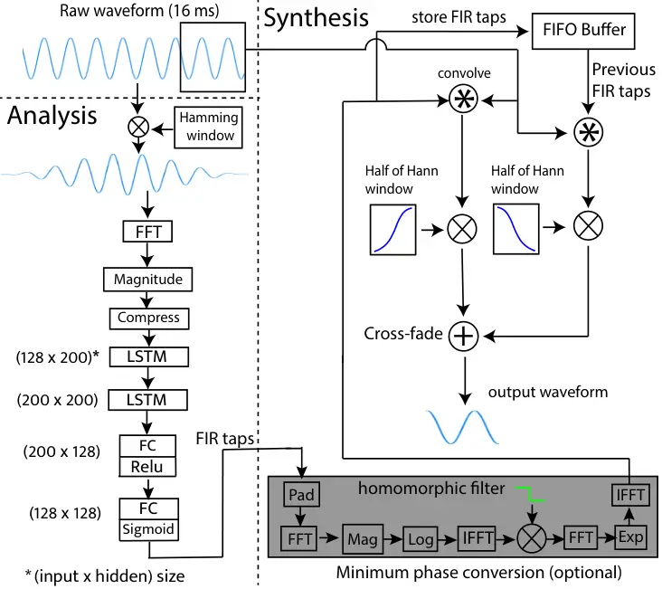
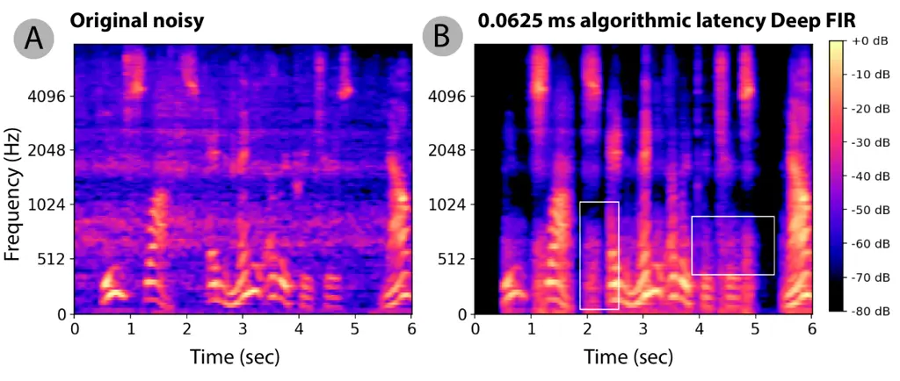

\namesecondline

John R. Hershey¹, Richard F. Lyon²

# Towards Sub-millisecond Latency Real-Time Speech Enhancement Models on Hearables

Artem Dementyev    Chandan K. A. Reddy    Scott Wisdom    Navin Chatlani

###### Abstract

Low latency models are critical for real-time speech enhancement
applications, such as hearing aids and hearables. However, the
sub-millisecond latency space for resource-constrained hearables remains
underexplored. We demonstrate speech enhancement using a computationally
efficient minimum-phase FIR filter, enabling sample-by-sample processing
to achieve mean algorithmic latency of 0.32 ms to 1.25 ms. With a single
microphone, we observe a mean SI-SDRi of 4.1 dB. The approach shows
generalization with a DNSMOS increase of 0.2 on unseen audio recordings.
We use a lightweight LSTM-based model of 626k parameters to generate FIR
taps. Using a real hardware implementation on a low-power DSP, our
system can run with 376 MIPS and a mean end-to-end latency of 3.35 ms.
In addition, we provide a comparison with existing low-latency spectral
masking techniques. We hope this work will enable a better understanding
of latency and can be used to improve the comfort and usability of
hearables.

###### Index Terms: 

speech enhancement, low-latency, on-device, hearables

^(†)^(†)address: ¹Google DeepMind, ²Google Research, ³Google Platforms &
Devices

## 1 Introduction

There are many real-time applications where low-latency speech
enhancement is critical. For example, hearing aids and transparency mode
in hearables need low end-to-end latency to reduce comb effect
filtering, increase comfort, and reduce artifacts. In such applications,
end-to-end latency under 2 ms is desirable \[1\]; thus, considering
hardware overhead, the algorithmic latency needs to be 1 ms or less.
Another challenge is that on hearables, computing is limited by low
power, and memory is limited to around 1 MB. Machine learning approaches
are state-of-the-art in real-world speech enhancement products. However,
their algorithmic latency is usually around 16 to 32 ms, and their size
is larger than 1 MB. Recent research has shown models with causal
latencies from 1 - 8 ms \[2, 3, 4\]; however, latency, memory, and
compute must be further reduced to enable widespread adoption of speech
enhancement for resource-constrained hearables. This work investigates
achieving the lowest latency while allowing efficient computing on
embedded devices for machine-learning-based speech enhancement.

Figure 1: Visualization of end-to-end latency. A) Using the proposed
Deep FIR filtering, as developed in this paper. B) Using the long-short
time window (LSTW) technique. Note that the proposed Deep FIR can
achieve lower end-to-end latency.

This paper contributes as follows: 1) A Deep FIR method that allows
algorithmic latency down to 0.34 ms with sample-by-sample processing.
Audio samples can be accessed online¹¹ 1
[google-research.github.io/sound-separation/papers/deepfir/](https://google-research.github.io/sound-separation/papers/deepfir/).
To our knowledge, this is the lowest latency demonstrated in a causal
mono speech enhancement system. 2) Implementation and benchmarking on
off-the-shelf low-power DSP in real-time. 3) Objective and subjective
comparisons with benchmarks such as long-short time window (LSTW) \[5,
2\] and common spectral mask with overlap-add (abbreviated as OLA
) \[6\] to understand latency and compute tradeoffs.

End-to-end latency has two main components, as illustrated in Figure 1,
and can be complicated due to interactions between hardware, software,
and algorithms. The first part is algorithmic latency - how much output
must be delayed due to the processing algorithm, windowing, look-ahead,
etc. For a causal streaming system, this delay is typically the size of
the synthesis window. In some filters, group delay can add large
algorithmic latency, such as half of the filter taps for a linear phase
finite impulse response (FIR) filter. For non-linear phase filters,
group delay depends on the input signal’s frequencies. The group delay
in LSTW and OLA is part of the algorithmic latency.

Second is the hardware latency, determined by the buffering, codec, and
communication protocol speed between the processor and codec. The hop
size is a big part of hardware latency, which is how many samples are
processed in one batch. Hop is often set as half of the analysis window.
At least one hop latency is needed since hop samples can only be played
once the hop is finished. The real-time model compute time is optimized
to be under a hop, so processing is done while the next hop is
collected. In such a case, latency would be a hop even if the compute
takes less than a hop.

The end-to-end latency can be estimated as: synthesis window size +
group delay + hop size + codec latency. Therefore, the lowest latency
system would have a 1-sample synthesis window, 1-sample hop, and minimal
group delay.

## 2 Background

The goal of the speech enhancement task is to improve the degraded
quality of speech. Mainly it is done by separation of speech from other
sounds such as noise and music. Recently, speech enhancement has been
improved with machine learning approaches. A common approach is
predicting a spectral mask in the short-time Fourier transform (STFT)
domain and synthesizing using overlap-add of usually 50% overlap, such
as in \[6\]. However, most of those approaches do not have low latency
and do not meet the computing and memory requirements of small devices
such as hearing aids. An unmodified STFT approach will require
algorithmic latency of 16 to 32 ms, a common duration of analysis and
synthesis windows. For example, TinyLSTMs \[7\] explored how speech
enhancement models can be adapted to hearing aids. However, algorithmic
latency is high, as 32 ms synthesis window and 16 ms hop are used. The
main limitation is that the analysis and synthesis window are the same
size. A technique of using an extended analysis window and short
synthesis window \[5\] (referred to as LSTW) can reduce latency, as the
length of the synthesis window determines the algorithmic latency. LSTW
has been successfully used with a deep neural network mask
estimator \[2\] to achieve 8 ms latency. Another approach is to predict
1 to 2 spectral masks in the future to have zero or negative
latency \[8, 6\]. Predicting the masks with LSTMs or convolutional
networks reduces generalization and denoising ability. Similarly to this
work, another approach is time domain filtering. This approach has been
mainly employed with low-latency traditional filter estimation \[9\].
Using convolutional neural network estimation of FIR-like filter has
shown algorithmic latency of 8 ms \[3\] or estimating an infinite
impulse response (IIR) filterbank  \[10\] with 4 ms latency. Currently,
some of the lowest algorithmic latency of 1 ms has been shown by
recurrent neural network (RNN) with convolutional front-end and direct
output prediction \[4\] on multi-microphone audio. Previous works have
not explored the causal sub-1 ms latency space and their deployment on
low-power systems under 1 MB memory constraints. Also, only non-causal
sample-by-sample denoising has been demonstrated \[11\].



Figure 2: Inference time causal Deep FIR signal processing diagram,
divided into synthesis and analysis. A new FIR filter is estimated every
hop.

## 3 Approach

### 3.1 LSTM-based filter prediction network

We use a 16 ms Hamming analysis window and compute efficient FFT
magnitude features as input to the model. The magnitude is compressed to
a power of 0.3. The Hamming window does not go to zeros at the edges, so
some information about the latest samples is preserved. In contrast, the
rectangular window conserves all the samples but introduces artifacts to
the denoised speech. We use a 2-layer long short-term memory (LSTM)
network, as shown in Figure 2. Each layer uses LSTMs with 200 units.
Such an architecture has shown to be effective for speech enhancement on
small embedded platforms \[7\]. The LSTM is followed by a fully
connected layer with 128 outputs and ReLU activation, followed by a
fully connected layer with 128 outputs and sigmoid activation that
predicts a 128-tap FIR filter. Continuous filter convolution requires
127 historic raw audio samples before the synthesis window, which are
pulled from the audio segment used for analysis.

We used the compressed spectral loss function, which has been shown to
work for speech enhancement applications \[12\]. Compressed spectral
loss is a weighted combination of magnitude and phase-aware complex
loss:

```math
L=\sum_{b,f,t}(1-\beta)\left(|\hat{S}_{b,f,t}|^{\alpha}-|S_{b,f,t}|^{\alpha}\right)^{2}+\beta\left(|\hat{S}_{b,f,t}^{\alpha}-S_{b,f,t}^{\alpha}|\right)^{2} \tag{1}
```

where $`\hat{S}`$ is the complex reference speech STFT and $`S`$ is the
denoised complex STFT, where $`S^{\alpha}:=|S|^{\alpha}e^{j\angle S}`$.
$`b`$ is batch, $`f`$ is frequency, and $`t`$ is time. $`\alpha`$ is the
compression constant set to 0.3. $`\beta`$ is a constant, determining
weights of magnitude and complex loss. $`\beta`$ was set to 0.85, which
we found to improve MOS.

We did not implicitly force the linear phase into the loss function.
However, the loss was calculated between the predicted audio and target
delayed by half of the taps (4 ms), producing an approximate linear
phase filter.

The trained model has 626k parameters, a float32 size of 2.39 MB, and a
16x8 quantized size of 0.58 MB. Also, 2.1 KB of working memory is
required for states and activations. The model was trained with
TensorFlow and quantized using a TFLite converter \[13\]. 16 kHz audio
sampling rate is used. A learning rate of 1e-4 was used.

### 3.2 Synthesis with Deep FIR filter

An FIR filter with 128 taps is used, calculated by a time-domain
convolution. The new filter is estimated at every hop. More taps can
increase denoising but incur computational costs and add to group delay.
As a synthesis window, we use simple 50% crossfading between two filters
to avoid discontinuity artifacts between the estimates since filter
coefficients can change. Crossfading is done using two halves of a Hann
window, as shown in Figure 1A. This crossfading was approximated in
training with a zero-padded Hann window and 50% overlap add after
applying the FIR filter.

Optionally, we convert the FIR filter to the minimum phase after
inference to reduce the group delay. There are multiple approaches to
doing so. Direct roots factorization \[14\] is the most accurate but is
computationally demanding. In our approach, we apply a homomorphic
filter to the FIR taps, which mostly uses FFTs and IFFTs as shown in
Figure 2, and is fast to compute given fast FFT ops on the DSP. This
approach was adapted from  \[15\]. Phase modification can affect the
crossfading; however, since this approach runs with short hops, the
phase does not change significantly from hop to hop. Although the model
could be conditioned to predict a minimum phase filter during training,
we apply it after inference to still use phase-sensitive reference-based
metrics.

## 4 Results

### 4.1 Objective evaluation of speech enhancement

We train on the CHiME-2 WSJ0 dataset \[16\]. This dataset is composed of
target speech mixed with various noises recorded in a home environment.
The dataset has 7138 training, 409 development, and 330 test examples at
6 SNR levels from (-3dB to +9dB). The clips had a 16 kHz sampling rate
and were 3 seconds long in training. We evaluate the CHiME-2 WSJ0 test
dataset \[16\] with a total of 1980 examples. Since we could not find
mono baseline models in sub-2 ms latency and under 1M parameters for
meaningful comparison, we trained LSTW and OLA models. For LSTW, we
replicated analysis/synthesis window pair type II from \[5\]. In OLA, 16
ms Hamming analysis and inverse Hamming synthesis window were used. LSTW
hop was set to the half of the synthesis window and in OLA to 4 ms. All
models had the same number of parameters and architecture but different
algorithmic latencies. As metrics, we used the signal-invariant
signal-to-distortion ratio (SI-SDR) \[17\], short-time objective
intelligibility (STOI), perceptual speech quality objective listener
(ViSQOL) \[18\], and reference-free Deep Noise Suppression mean opinion
score (DNSMOS) \[19\].

As shown in Table 1 all the metrics show Deep FIR improvement over
unprocessed samples for the synthesis window from 0.0625 to 1 ms. Using
a longer synthesis window doesn’t improve Deep FIR, as it becomes harder
to estimate FIR taps. In contrast, the LSTW approach performs worse than
deep FIR for all metrics under 1 ms latency. Mask estimation is done on
a large analysis window to filter a small synthesis window, which
becomes harder to estimate as the synthesis window becomes smaller. We
trained and evaluated models on a range of taps: 8, 16, 32, 64, 128, 228. We saw a modest improvement in noise reduction metrics as the
number of taps increased. Specifically, SI-SDR increased by 0.2 from 8
to 128 taps. The effect on inference was small, affecting only the last
linear layer of the model. The group delay of the linear phase FIR
filter changed linearly with the number of taps (taps / 2), however,
minimum phase filter conversion had a bigger impact on group delay.



Figure 3: Example data before and after denoising. Mel spectrograms of
A) original with white noise and B) speech denoised with a low-latency
filter. White rectangles point to problematic areas where the noise was
not removed by the model.

The model trained on CHiME-2 provides a comparison with previous works.
However, it does not generalize since it contains specific kinds of
noise and speech. To investigate generalization and performance with
real recordings, we trained the model on filtered speech clips from
LibriSpeech \[20\] and noise from Freesound \[21\] with SNR between -10
to +20 dB. The evaluation was done on unseen 600 clips from Deep Noise
Suppression Challenge 2 \[22\] blind test set, containing reference-free
real recordings. As shown in Table 2, the DNSMOS shows a consistent
increase compared to unprocessed audio. In contrast, the LSTW model
shows OVRL quality decrease at 0.5 ms latency.

The primary source of noise is leakage of noise during speech. The
latest samples are most important for filter estimation; however, they
have the most spectral uncertainty due to window edge effects. The low
frequencies are the most challenging. As shown in Figure 3, when
comparing the denoising with a low-latency filter and the baseline, low
frequencies are also not filtered.

[TABLE]

Table 1: Model performance, trained on CHiME-2 and evaluated on CHiME-2
test set. A mean of 6 SNRs from -6 to 9 dB is reported. All models have
a 16 ms analysis window. For Deep FIR, the mean algorithmic and
end-to-end latency is shown with minimum phase conversion.

[TABLE]

Table 2: DNSMOS on out-of-domain Deep Noise Suppression Challenge 2
dataset and trained on Freesound and LibriSpeech.

### 4.2 Subjective evaluation

We conducted a subjective test according to ITU-T Rec P.835
standard \[23\] using 8 human subjects, all audio experts. A primary
motivation for this test was to understand the quality of the minimum
phase filter since metrics such as phase modifications make SI-SDR
inaccurate. We picked a random subset of the CHiME-2 test set with 27
samples. Each sample contained either one or a mixture of interfering
speech, music, and non-stationary (e.g., footsteps) or stationary (e.g.,
fan) environmental sounds. The set included three SNR levels: -3, +3, +9
dB SNR. Three categories were used: (1) unprocessed mix, (2) processed
by 0.25 ms synthesis window minimum phase, and (3) linear phase models.
T-test using SciPy \[24\] was done to calculate statistical significance
($`P`$ value).

Both minimum phase and linear phase processing showed a statistically
significant ($`P<0.01`$) increase in overall quality (OVRL) and
background noise (BAK) reduction compared to the unprocessed mix.
However, the speech distortion (SIG) increased in the denoised samples.
Minimum phase and linear phase processing did not show statistically
significant differences ($`P>0.01`$) in any metric. The linear phase had
a higher overall quality of $`3.41`$ versus $`3.19`$ for the minimum
phase. Meanwhile, the minimum phase had slightly better background noise
reduction and speech distortion than the linear phase.

### 4.3 Computation and latency on hardware

We benchmark the system on real-time performance on low-power audio DSP,
which is designed for wearable devices. Specifically, we use i.MX RT600
(NXP Semiconductors) processor, which contains a 300 MHz M33 (ARM)
microprocessor and 600 MHz HiFi4 Audio DSP (Cadence) in one chip. To
minimize the processing time, we created a custom C inference library
utilizing the HiFi NatureDSP library \[25\].

We benchmarked with a 1 ms algorithmic latency model since that is the
lowest latency model we could run in real-time due to computing and
hardware limitations. We achieved an end-to-end latency of 7.1 ms.
Millions of instructions per second (MIPS) was measured at 304.
Processing took 0.72 ms during each hop, with inference taking 0.54 ms
and front-end and synthesis 0.18 ms. Hardware latency was 1.1 ms. The
minimum phase calculation added 0.043 ms to each inference and increased
MIPS by 72 to 376. However, the group delay decreased from a constant 4
ms to the mean of 0.25 ms, as measured from the mean group delay at each
inference of noisy speech samples. Therefore, end-to-end latency
decreased to 3.35 ms.

With the same inference models and front end, the main compute
difference between the Deep FIR and LSTW is in synthesis. Roughly the
same algorithmic latency can be achieved with half of the hops for Deep
FIR, as it does not use overlap-add. The Deep FIR approach requires
computing a dot product between filter coefficients and raw audio for
each output sample. It is efficient for a small number of samples but
scales linearly with more samples. With the LSTW approach, compute time
is constant, with dependence on the size of the analysis window.

| MOS                                                       | OVRL    | SIG  | BAK     |
| --------------------------------------------------------- | ------- | ---- | ------- |
| Mix                                                       | 1.75    | 3.90 | 1.89    |
| Min phase FIR                                             | 3.19 \* | 3.18 | 2.86 \* |
| Linear phase FIR                                          | 3.41 \* | 2.84 | 2.63 \* |
| \* indicates $`P<0.01`$ in comparison to unprocessed mix. |         |      |         |

Table 3: Subjective MOS evaluation on CHiME-2 test set comparing minimum
versus linear phase for Deep FIR with 0.125 ms synthesis window.

## 5 Conclusion

In this paper, we demonstrated how to achieve algorithmic latency under
1 ms using an RNN model to estimate minimum phase FIR filters. We
deployed such models on low-power DSP, which is suitable for hearables.
We find two main limitations in deploying very low latency systems,
which are opportunities for future work. First, low latency denoising
will cause noise leakage during speech. Fundamentally, a certain amount
of prediction is required, as due to windowing, there is some
uncertainty in the frequency estimation. Second, computing the model at
every hop is wasteful for short hops. Potentially, a part of the model
needs to be recomputed.

As our hearables improve, achieving minimal latency will become critical
to their usability. We hope this paper provides insights into ways to
achieve this.

## 6 Acknowledgment

The authors would like to thank Leonardo Kusumo, Kevin Wilson, Pascal
Getreuer, Vivek Kumar, and Jeremy Thorpe for their valuable discussions
and suggestions.

## References

- \[1\] Jennifer Groth and Morten Birkmose, “Disturbance caused by
  varying propagation delay in non-occluding hearing aid fittings,”
  International Journal of Audiology, vol. 43, no. 10, pp.
  594–599, 2004.
- \[2\] Shanshan Wang, Gaurav Naithani, Archontis Politis, and Tuomas
  Virtanen, “Deep neural network based low-latency speech separation
  with asymmetric analysis-synthesis window pair,” in EUSIPCO, 2021, pp.
  301–305.
- \[3\] Hendrik Schröter, Tobias Rosenkranz, Alberto-N Escalante-B, and
  Andreas Maier, “Low latency speech enhancement for hearing aids using
  deep filtering,” IEEE/ACM Transactions on Audio, Speech, and Language
  Processing, vol. 30, pp. 2716–2728, 2022.
- \[4\] Ashutosh Pandey, Ke Tan, and Buye Xu, “A simple rnn model for
  lightweight, low-compute and low-latency multichannel speech
  enhancement in the time domain,” in Interspeech, 2023, pp. 2478–2482.
- \[5\] Dirk Mauler and Rainer Martin, “A low delay, variable
  resolution, perfect reconstruction spectral analysis-synthesis system
  for speech enhancement,” in EUSIPCO, 2007, pp. 222–226.
- \[6\] Kevin Wilson, Michael Chinen, Jeremy Thorpe, Brian Patton, John
  Hershey, Rif A Saurous, Jan Skoglund, and Richard F Lyon, “Exploring
  tradeoffs in models for low-latency speech enhancement,” in IWAENC,
  2018, pp. 366–370.
- \[7\] Igor Fedorov, Marko Stamenovic, Carl Jensen, Li-Chia Yang, Ari
  Mandell, Yiming Gan, Matthew Mattina, and Paul N. Whatmough,
  “TinyLSTMs: Efficient neural speech enhancement for hearing aids,”
  Interspeech, Oct. 2020.
- \[8\] Zhong-Qiu Wang, Gordon Wichern, Shinji Watanabe, and Jonathan
  Le Roux, “Stft-domain neural speech enhancement with very low
  algorithmic latency,” IEEE/ACM Transactions on Audio, Speech, and
  Language Processing, vol. 31, pp. 397–410, 2022.
- \[9\] Heinrich W Löllmann and Peter Vary, “Uniform and warped low
  delay filter-banks for speech enhancement,” Speech Communication, vol.
  49, no. 7-8, pp. 574–587, 2007.
- \[10\] Chengshi Zheng, Wenzhe Liu, Andong Li, Yuxuan Ke, and Xiaodong
  Li, “Low-latency monaural speech enhancement with deep filter-bank
  equalizer,” The Journal of the Acoustical Society of America, vol.
  151, no. 5, pp. 3291–3304, 2022.
- \[11\] Yi Luo, Zhuo Chen, and Takuya Yoshioka, “Dual-path rnn:
  efficient long sequence modeling for time-domain single-channel speech
  separation,” in ICASSP, 2020, pp. 46–50.
- \[12\] Scott Wisdom, John R Hershey, Kevin Wilson, Jeremy Thorpe,
  Michael Chinen, Brian Patton, and Rif A Saurous, “Differentiable
  consistency constraints for improved deep speech enhancement,” in
  ICASSP, 2019, pp. 900–904.
- \[13\] Benoit Jacob, Skirmantas Kligys, Bo Chen, Menglong Zhu, Matthew
  Tang, Andrew Howard, Hartwig Adam, and Dmitry Kalenichenko,
  “Quantization and training of neural networks for efficient
  integer-arithmetic-only inference,” in CVPR, 2018, pp. 2704–2713.
- \[14\] Xiangkun Chen and Thomas W Parks, “Design of optimal minimum
  phase fir filters by direct factorization,” Signal Processing, vol.
  10, no. 4, pp. 369–383, 1986.
- \[15\] Alan V Oppenheim, Discrete-time signal processing, Pearson
  Education India, 1999.
- \[16\] Emmanuel Vincent, Jon Barker, Shinji Watanabe, Jonathan
  Le Roux, Francesco Nesta, and Marco Matassoni, “The second
  ‘chime’speech separation and recognition challenge: Datasets, tasks
  and baselines,” in ICASSP. 2013, pp. 126–130.
- \[17\] Jonathan Le Roux, Scott Wisdom, Hakan Erdogan, and John R
  Hershey, “Sdr–half-baked or well done?,” in ICASSP, 2019, pp. 626–630.
- \[18\] Andrew Hines, Jan Skoglund, Anil C Kokaram, and Naomi Harte,
  “Visqol: an objective speech quality model,” EURASIP Journal on Audio,
  Speech, and Music Processing, vol. 2015, pp. 1–18, 2015.
- \[19\] Chandan KA Reddy, Vishak Gopal, and Ross Cutler, “DNSMOS: A
  non-intrusive perceptual objective speech quality metric to evaluate
  noise suppressors,” in ICASSP, 2021.
- \[20\] Vassil Panayotov, Guoguo Chen, Daniel Povey, and Sanjeev
  Khudanpur, “LibriSpeech: an ASR corpus based on public domain audio
  books,” in ICASSP, 2015, pp. 5206–5210.
- \[21\] Eduardo Fonseca, Jordi Pons Puig, Xavier Favory, Frederic
  Font Corbera, Dmitry Bogdanov, Andres Ferraro, Sergio Oramas, Alastair
  Porter, and Xavier Serra, “Freesound datasets: a platform for the
  creation of open audio datasets,” in ISMIR, 2017.
- \[22\] Chandan KA Reddy, Harishchandra Dubey, Kazuhito Koishida, Arun
  Nair, Vishak Gopal, Ross Cutler, Sebastian Braun, Hannes Gamper,
  Robert Aichner, and Sriram Srinivasan, “Interspeech 2021 deep noise
  suppression challenge,” arXiv preprint arXiv:2101.01902, 2021.
- \[23\] ITUT Recommendation, “Subjective test methodology for
  evaluating speech communication systems that include noise suppression
  algorithm,” ITU-T recommendation, p. 835, 2003.
- \[24\] SciPy, “ttest_ind,”
  [https://docs.scipy.org/doc/scipy/reference/generated/scipy.stats.ttest_ind.html](https://docs.scipy.org/doc/scipy/reference/generated/scipy.stats.ttest_ind.html),
  2024, Accessed 2024-09-03.
- \[25\] Linux Xtensa, “NatureDSP library for HiFi4 DSP cores,”
  [https://github.com/foss-xtensa/ndsplib-hifi4](https://github.com/foss-xtensa/ndsplib-hifi4),
  2023, Accessed 2024-02-24.
