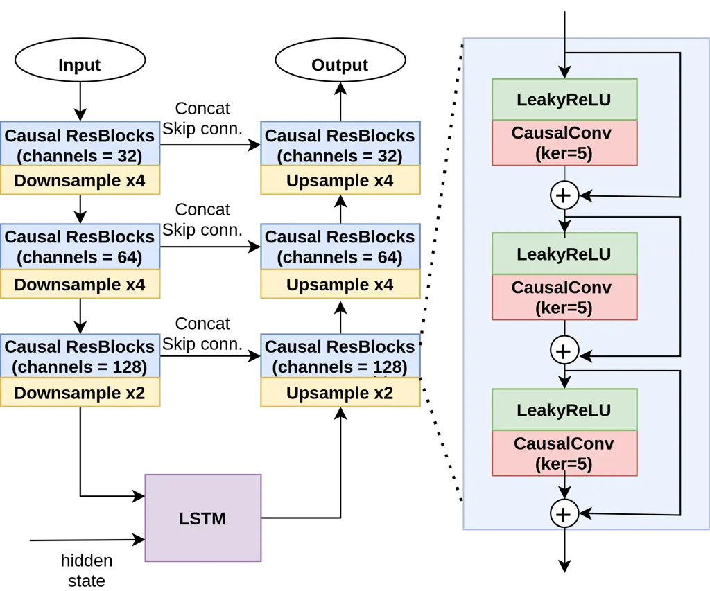
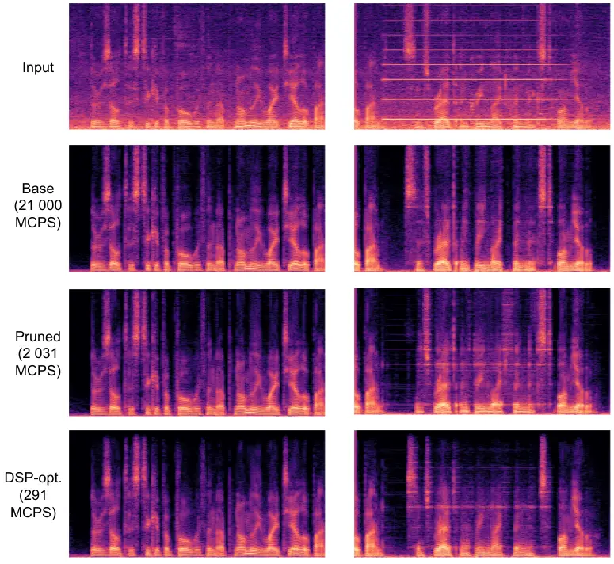

# Speech Boosting: Low-Latency Live Speech Enhancement for TWS Earbuds

Hanbin Bae^(∗)    Pavel Andreev^(∗)    Azat Saginbaev^(∗)    Nicholas
Babaev    Won-Jun Lee    Hosang Sung    Hoon-Young Cho

###### Abstract

This paper introduces a speech enhancement solution tailored for true
wireless stereo (TWS) earbuds on-device usage. The solution was
specifically designed to support conversations in noisy environments,
with active noise cancellation (ANC) activated. The primary challenges
for speech enhancement models in this context arise from computational
complexity that limits on-device usage and latency that must be less
than 3 ms to preserve a live conversation. To address these issues, we
evaluated several crucial design elements, including the network
architecture and domain, design of loss functions, pruning method, and
hardware-specific optimization. Consequently, we demonstrated
substantial improvements in speech enhancement quality compared with
that in baseline models, while simultaneously reducing the computational
complexity and algorithmic latency.

###### keywords

low-latency speech enhancement, pruning and quantization, digital signal
processor, earbuds, on-device

^(†)^(†)address: ¹Samsung Research, Seoul, Republic of Korea  
²Samsung Research  ^(∗)equal contribution^(†)^(†)email: {bhb0722.bae,
p.andreev, a.saginbaev, n.babaev, wall.lee, hosang.sung,
h.y.cho}@samsung.com

## 1 Introduction

Recently, true wireless stereo (TWS) earbuds have been successfully
popularized along with mobile phones, thereby increasing convenience for
many users. In line with this, companies developing earbuds have
introduced a variety of functions to maximize user experience. Active
noise cancellation (ANC), which blocks almost all sounds around the
user, is a core feature of the TWS earbud. This function enhances
various experiences in everyday life, such as listening to music, making
calls, or focusing on work by removing background noise.

The need for additional technology becomes apparent when a person
wearing earbuds and applying ANC wants to have conversations with nearby
people. Currently, to clearly hear the voice of a nearby person, the
user must turn off the ANC function or remove the earbuds altogether. If
there is a technology that can enhance the voice of a nearby person
while reducing ambient sounds through ANC, this reduces several
inconveniences, such as missing a few words, delaying conversation, and
increasing the risk of losing earbuds. In this study, we aim to apply a
speech enhancement solution focused on advancing the noise suppression
capabilities of earbuds, particularly in noisy environments where ANC is
in operation. We aim to ensure that suppression does not hinder
conversations. This necessitates the development of advanced low-latency
speech enhancement models capable of ensuring a balance between noise
reduction and critical sound preservation.

To successfully implement an effective speech enhancement model for the
aforementioned scenario, two key criteria must be satisfied. First, the
algorithmic latency of the speech enhancement module should be
maintained at a maximum of 3 ms or less. This is a critical factor in
the context of remote communication, where users are noticeably more
sensitive to delays. This sensitivity arises from the fact that users
interact in the same space, making any inconvenience caused by the
spectral coloration of the comb-filtering effect \[1\] from the
superposition of the direct and delayed speech more disruptive. Second,
the use of computing resources must be minimized. This is particularly
crucial in real-time on-device applications, such as ours, where the
efficient use of resources can significantly impact the performance and
user experience.

To meet these requirements, we explored several design choices to
achieve efficient low-latency speech enhancement.

1.  1.  We compared the efficiencies of a state-of-the-art frequency-domain
        network and a time-domain baseline and discovered that the
        time-domain baseline was more effective when allocated comparable
        computational resources and algorithmic latency.
2.  2.  We investigated whether modern structured state space-based
        models \[2, 3\] could replace our conventional Wave-U-Net + LSTM
        baseline structure. Despite the encouraging results for long-context
        modeling tasks, these models were unable to outperform our simple
        baseline in a low-latency speech enhancement setup.
3.  3.  We evaluated the efficiency of adversarial losses, a common tool for
        training contemporary speech enhancement models  \[4, 5, 6\], in a
        low-latency setup and noted its propensity for speech
        oversuppression. To counter this effect, we suggested two-stage
        training that combines Phone-Fortified Perceptual Loss (PFPL) \[7\],
        adversarial \[4\], UTokyo-sarulab Mean Opinion Score (UTMOS) \[8\],
        and Perceptual Evaluation Speech Quality (PESQ) \[9\] losses, that
        we believe can enhance speech intelligibility and minimize
        artifacts.
4.  4.  We assessed the performance of the magnitude pruning method against
        that of the novel Sparsity Profiles via DYnamic programming search
        (SPDY) + Optimal Brain Compression (OBC) method \[10, 11\]. We
        observed that the SPDY + OBC method significantly improved the
        quality of the pruned models.

Overall, the combination of these techniques delivered low-latency
speech enhancement models with a 3 ms algorithmic latency and 0.21 GMAC
complexity (or 291 MCPS after being ported on-device), making it
suitable for on-device usage while outperforming the baselines with less
latency and complexity.

## 2 Related Work

### 2.1 Low-latency speech enhancement

Recently, low-latency speech enhancement has attracted significant
research interest. Numerous studies \[12, 13\] have explored time-domain
causal neural architectures, such as ConvTasNet \[14\] and Wave-U-Net +
LSTM \[15\], for this task.

Andreev et al. \[15\] suggested a novel training procedure for
low-latency models, termed iterative autoregression (IA). This method
was used to train a time-domain Wave-U-Net + LSTM model for low-latency
speech enhancement, and the benefits of IA were demonstrated in a
comparative comparison categorical rating study. In the current study,
we examine efficient neural architectures, training losses, and pruning
methods. As such, the IA is distinct from the improvements proposed in
the IA paper, and we defer the application of the IA to our model for
future studies. Another line of works \[16, 17, 18, 19\] utilizes
time–frequency domain architectures using asymmetric analysis synthesis
pairs for windows of short-time Fourier transform or future frame
prediction. For example, the iNeuBe-X framework \[18\] incorporates the
TF-GridNet model \[20\] for low-latency speech enhancement. The approach
based on this architecture won the first place in the 2nd Clarity
challenge \[21\], a competition for low-latency speech enhancement
systems for hearing aids. This method implements low-latency speech
enhancement in the time–frequency domain by predicting future short-time
fourier transform (STFT) frames, thus reducing the latency imposed by
the STFT windows. In the present study, we challenged the TF-GridNet
architecture against our time-domain baseline.

### 2.2 On-device speech enhancement

Several studies have been conducted to optimize speech enhancement
models for different devices. For TinyLSTMs \[22\], The authors
demonstrated that structural pruning and 8-bit INT quantization could be
jointly applied to two LSTM layers. The compressed model achieved a
11.9× reduction in model size and a 2.9× reduction in operations. For
the DEMUCS-Mobile \[23\], The authors demonstrated that batch
normalization pruning utilizing GLU activation could be applied to
DEMUCS \[24\] model. The compressed model achieved a 10x reduction in
model size. However, these models had an algorithmic latency of more
than 20 ms that prevented its use in our scenario. Notably, the authors
did not study the effect of loss functions on perceptual quality and
measured the quality using SI-SDR alone that was poorly correlated with
perceptual quality \[4\]. We also note that with our pruning technique,
we managed to reduce the number of operations in our model by 10 times
while preserving the high quality, in contrast to 3 times claimed in
\[22\]. The size of our model achieved less than 1 Mb, in contrast to
the 8.9 Mb claimed in \[23\].

## 3 Speech Boosting

### 3.1 Methodology

Data In all our experiments, we considered additive noise as the
distortion to be removed from speech recordings. We employed the
VoiceBank-DEMAND dataset \[25\], a standard benchmark for
speech-denoising systems. The training set consisted of 28 speakers with
four signal-to-noise ratios (SNR) (15, 10, 5, and 0 dB) and contained
11572 utterances. The test set (824 utterances) consisted of two
speakers unseen by the model during training with four SNRs (17.5, 12.5,
7.5, and 2.5 dB).

Evaluation We used the state-of-the-art objective speech quality metrics
UTMOS \[8\] and WV-MOS \[4\]. In our internal experiments, we observed
that these metrics had the best correlation among well-known objective
metrics (for example, SI-SDR, DNSMOS, and PESQ) with human-assigned
MOSes for speech enhancement tasks. We also used 5-scale MOS tests for
subjective quality evaluation, following the procedure described in
\[4\].

Baseline We began with the Wave-U-Net + LSTM baseline introduced in
\[15\]. We used the adversarial loss function with MSD discriminators
because this loss had better perceptual properties than regression-type
losses \[6, 4, 15\]. We used a three-layer architecture with 4, 4, and 2
strides and 32, 64, and 128 channels, as shown in Figure 1. The model
operated at a 16 kHz sample rate. It used a chunk size of 32 timesteps
and a look-ahead of 16 timesteps. This look-ahead is achieved by
duplicating the input waveform into several channels, each containing a
shifted waveform. Consequently, the total algorithmic latency was 48
timesteps, that is equivalent to 3 ms. The computational complexity of
this model was approximately 2 GMAC/s. In all the experiments, the batch
size was 16, segment size was set to 2 s, and Adam optimizer was used
with a learning rate of 0.0002 and betas 0.8 and 0.9.

Figure 1: Architecture of the baseline Wave-U-Net + LSTM model.

### 3.2 Time domain versus frequency domain

Many studies have considered time–frequency domain architectures for
low-latency speech enhancement. Therefore, our first challenge is to
decide whether time or time–frequency domain-based approach is more
effective for low-latency speech enhancement. For this purpose, we
implemented a state-of-the-art time–frequency domain TF-GridNet
architecture \[20\] for comparison with our Wave-U-Net + LSTM baseline.
Because we had to understand whether this time–frequency architecture
had benefits over the time-domain baseline, given similar computational
constraints, we chose the parameters of the TF-GridNet architecture to
match the algorithmic latency to 4 ms and the computational complexity
to 2.6 GMAC/s by decreasing the number of channels and TF-GridNet blocks
within the network to 4 and 16, respectively. We trained the TF-GridNet
model using the same losses as those in the baseline case. The results
are summarized in Table 1. TF-GridNet appeared to be worse than our
baseline. This is likely owing to the high computational complexity of
the original TF-GridNet model. The complexity of the original model was
approximately 36 GMAC/s, and its performance was significantly degraded
when its parameters were reduced, making it impractical for our usage
scenario.

| Model        | WV-MOS | UTMOS | PESQ | \# GMAC |
| ------------ | ------ | ----- | ---- | ------- |
| Ground Truth | 4.50   | 4.32  | 4.26 | \-      |
| TF-GridNet   | 4.10   | 3.58  | 2.43 | 2.6     |
| WU+LSTM      | 4.30   | 3.81  | 2.55 | 2.0     |

Table 1: Time domain model Wave-U-Net + LSTM versus time–frequency
domain model TF-GridNet

### 3.3 Model architecture

In our search for alternative time-domain architectures, we used the
recently proposed structured state-space layers (S4) \[3\]. Given the
exceptional performance of S4 in sequence modeling tasks, particularly
those involving long ranges, we believed that this block could serve as
a replacement for the LSTM bottleneck in the Wave-U-Net + LSTM
architecture. Consequently, we constructed the Wave-U-Net + S4
architecture as a competitor for our Wave-U-Net + LSTM baseline.
Furthermore, we examined the SaShiMi architecture \[2\] that was built
entirely on S4 blocks. SaShiMi leverages the strengths of S4 blocks and
is specifically designed for long-range audio modeling tasks. It
maintains global coherence by modeling long-range dependencies and
incorporates inductive bias through S4 that inherently operates in a
continuous-time mode. Given the top-tier performance of SaShiMi in
unconditional waveform generation, we hypothesized that it could be a
promising candidate to replace our baseline. A comparison between the S4
models and our baseline is presented in Table 2. Wave-U-Net + LSTM
outperformed the S4 models with similar computational complexities and
algorithmic latencies (3 ms).

| Model   | WV-MOS | UTMOS | PESQ | \# GMAC |
| ------- | ------ | ----- | ---- | ------- |
| WU+LSTM | 4.30   | 3.81  | 2.55 | 2.0     |
| WU+S4   | 4.21   | 3.72  | 2.56 | 1.9     |
| SaShiMi | 4.27   | 3.74  | 2.43 | 2.1     |

Table 2: Wave-U-Net + LSTM versus S4 models.

### 3.4 Loss functions

We observed that the adversarial loss function has two main
disadvantages. First, training with this loss is considerably slow
because of the training of the discriminators. Second, low-latency
models trained with adversarial loss tend to oversuppress the speech
content within the recording. This obstacle is expected because the
adversarial loss promotes outputs of the model to be within the speech
recording distribution rather than preserving the speech content; thus,
it may sacrifice some of the speech content to increase the distribution
credibility of the generated speech.

Thus, as an alternative, we trained the model using the PFPL \[7\]. The
PFPL is a regression-type loss formulated by combining the time-domain
L1 loss and the Wasserstein distance between the wav2vec2.0 \[26\]
features of the generated and reference (clean) waveforms.

Usage of the PFPL in the initial training stage offers two significant
benefits: (1) This loss impeccably retains speech content during the
noise suppression process. This is likely owing to the incorporation of
wav2vec2.0 features, known for their proficiency in extracting speech
content. (2) Training with the PFPL is considerably faster than with its
adversarial counterpart owing to the absence of discriminator training.

However, the use of the PFPL during training sometimes leads to the
emergence of background squeak artifacts, a typical phenomenon
associated with regression-type losses. To address this, we implemented
a second stage of training (fine-tuning) that integrated the
adversarial \[4\], UTMOS \[8\], and PESQ \[27, 28\] losses with 1, 50
and 5 weights, respectively.

We applied adversarial loss with MSD discriminators as an effective
solution for squeak artifacts. This ensured a correlation between the
distributions of the clean and generated signals, thereby correcting any
distributional discrepancies. Concurrently, UTMOS and PESQ augmented
speech intelligibility by incorporating insights gleaned from human
preference studies. We utilized the official implementation of the UTMOS
score and the PyTorch implementation of the PESQ metric. Both metrics
are differentiable with respect to their inputs and can therefore be
applied as loss functions (multiplied by negative constants). Owing to
the initial stage of PFPL training, we only had to fine-tune the models
with second-stage losses for a few epochs, thereby saving time and
preserving the speech content captured by the PFPL training.

To verify the efficacy of the proposed training pipeline, we compared it
with vanilla adversarial training and vanilla PFPL training. As
summarized in the results in Table 3, the proposed two-stage training
procedure considerably outperformed the baselines according to human
opinion.

| Loss    | WV-MOS | UTMOS | PESQ | MOS              |
| ------- | ------ | ----- | ---- | ---------------- |
| Adv.    | 4.30   | 3.81  | 2.55 | $`3.36\pm 0.07`$ |
| PFPL    | 4.35   | 3.78  | 2.61 | $`3.61\pm 0.08`$ |
| 2-stage | 4.36   | 3.90  | 2.90 | $`3.85\pm 0.06`$ |

Table 3: Comparison of losses.

### 3.5 Pruning

The original Wave-U-Net + LSTM model had a complexity of approximately 2
GMACs, rendering it unsuitable for on-device deployment. We implemented
block-structured pruning to optimize the model in terms of performance
and storage.

1.  1.  For convolutional layers, we applied kernel pruning that enforces
        sparsity in such a way that if W represents a weight in a
        convolutional layer, then for certain input channel i and output
        channel j, $`W[i,j,:]=0`$. We only stored the indices of the
        non-zero kernels and computed the outputs based on these kernels.
2.  2.  The LSTM layers were pruned using block sparsity. For each non-zero
        block, we recorded its coordinates within the fully connected LSTM
        layers and performed computations only for these non-zero blocks.
        The blocks measured 16 × 1.

Our pruning pipeline followed an iterative prune + fine-tune strategy.
At each pruning iteration, 10% of the remaining weights were pruned and
the model was fine-tuned for 50 epochs. The procedure was continued
until the total sparsity of the model $`\approx`$90% (complexity-wise).
The key is determining the weights required to prune at each iteration.
We handled this problem by using the SPDY + OBC pruning strategy. This
strategy decomposes the pruning process into layer-wise local pruning
(OBC) \[11\] and search for layer sparsity distributions (SPDY) \[10\].

In the first step of SPDY + OBC, we used the OBC for pruning each layer
independently to optimally reconstruct local activations using the mean
squared error criterion, given the sparsity constraint. This approach is
based on the exact realization of the classical optimal brain surgeon
framework applied to local layer pruning. Using the OBC, we obtained a
bank of weights for each layer that satisfied different sparsities.

Subsequently, the SPDY search was employed to determine layer sparsities
such that the total model sparsity was suitable for the current
computational budget while maximizing the model performance on the
calibration data. The algorithm assumed a linear dependency of the model
quality on the log-sparsity levels of the layers and used dynamic
programming to determine the sparsity levels. The linear dependency
parameters were optimized using differential evolution and random search
(shrinking neighborhood local search) algorithms for global
optimization.

We compared the proposed pruning pipeline with common baseline magnitude
pruning and observed that SPDY + OBC pruning drastically improved the
quality of the pruned models under similar complexity constraints.

| Method       | WV-MOS | UTMOS | PESQ | GMAC |
| ------------ | ------ | ----- | ---- | ---- |
| Base model   | 4.36   | 3.90  | 2.90 | 2.0  |
| Mag. pruning | 4.09   | 3.63  | 2.62 | 0.29 |
| SPDY+OBC     | 4.27   | 3.90  | 3.01 | 0.21 |

Table 4: Comparison of pruning methods.

### 3.6 HiFi4 DSP simulation

We implemented the 0.21 GMAC pruned model in the native C code. Running
this code on on a system with Cadence Tensilica HiFi4 DSP core \[29\]
provided 2031 million clocks per second (MCPS) for this model. This is
the total number of clocks, including the instructions to load and store
each variable required for the calculations through the data memory
interface. The clock frequencies supported by the micro control units
are typically approximately 300–600 MHz. Because the processing time is
longer than the algorithmic latency, delays are inevitable. Therefore,
single instruction multiple data (SIMD) operations, such as the 16-bit
four-way SIMD operation of HiFi4 DSP for fixed-point numbers, have to be
used to reduce the total MCPS. We converted the inputs and parameters of
each layer into fixed-point numbers using Q format. In this case, the
input values were converted to Q12 as a 32-bit integer variable. The
weights and biases of the convolutional layers were converted to Q13 and
Q25 as 16-bit short and 32-bit integer variables, respectively. The
weights and biases of the LSTM layers were converted to Q13 as 16-bit
short variables. Subsequently, we replaced the calculation expressions
of the convolutional and LSTM layers with SIMD operations of the HiFi4
DSP. The final optimized model had 291 MCPS and around 800 kB size.

## 4 Results

### 4.1 Comparison with existing approaches

We compared the resulting speech-boosting models with Wave-U-Net + LSTM
trained using IA \[15\] and a non-causal DEMUCS denoiser \[24\]. For the
IA baseline, we used Wave-U-Net + LSTM with the K, N, and C parameters
set to 7, 4, and \[16, 24, 32, 48, 64, 96, 128\], respectively. This
configuration corresponds to 8 ms of algorithmic latency and 2.0 GMAC
complexity. The DEMUCS denoiser was used in a non-causal configuration
with the H parameter set to 64. Both these baseline models had
considerably higher computational complexity and algorithmic latency
than our pruned model, while delivering comparable perceptual quality
according to the MOS score.

| Model         | GMAC | Alg. latency | MOS              |
| ------------- | ---- | ------------ | ---------------- |
| Input         | \-   | \-           | $`3.33\pm 0.07`$ |
| Ours          | 2.0  | 3 ms         | $`3.85\pm 0.06`$ |
| Ours (pruned) | 0.21 | 3 ms         | $`3.71\pm 0.05`$ |
| DEMUCS        | 38.1 | non-caus.    | $`3.75\pm 0.06`$ |
| IA WU+LSTM    | 2.0  | 8 ms         | $`3.77\pm 0.05`$ |

Table 5: Comparison with DEMUCS and IA.

Figure 2: Examples of speech denoising performance.

### 4.2 Limitations and future work

Figure 2 shows the enhanced speech samples of all the process models,
where the input sample is a male voice mixed with subway noise at an SNR
of 2.5 dB. Samples mixed with babble noise is shown in the left segment,
and samples mixed with the additional harmonic noise of the alarm sound
is shown in the right segment. As observed, the babble noise was well
removed, whereas the harmonic noise remained in small amounts in the
utterance segments of the enhanced speech. This observation suggests
that Wave-U-Net + LSTM struggles to filter out the harmonic signals in
the noisy speech adequately.

Owing to the inherent complexities of speech signals and noise
characteristics, accurately estimating and removing noise while
preserving the speech components can be a delicate balance. In addition,
variations in harmonic gains and fluctuations in the denoising process
can contribute to the generation of harmonic noise artifacts, making it
challenging to achieve a clean and natural sounding output \[30\]. To
alleviate this issue, Wave-U-Net + LSTM should be improved to capture
harmonic relationships in noisy speech. One promising avenue for future
research in this area includes hybrid architectures that operate
simultaneously in time and frequency domains \[31, 32, 4\].

## 5 Conclusion

This work advances low-latency, on-device speech enhancement by
reevaluating several critical design choices. We examine different model
architectures, training losses, and pruning techniques, selecting the
optimal scenario for efficient low-latency speech enhancement. The
resulting model achieves a remarkable balance between performance and
resource utilization. It is suitable for on-device usage, exhibits low
algorithmic delay, and delivers a quality comparable to models with
significantly higher algorithmic latency. The experimental results will
pave the way for future advancements in speech enhancement technology
for TWS earbuds that will be co-operated with various audio processing
modules such as ANC and Beamforming.

## References

- \[1\] T. Goehring, J. L. Chapman, S. Bleeck, and J. J. Monaghan\*,
  “Tolerable delay for speech production and perception: Effects of
  hearing ability and experience with hearing aids,” _International
  Journal of Audiology_, vol. 57, no. 1, pp. 61–68, 2018.
- \[2\] K. Goel, A. Gu, C. Donahue, and C. Ré, “It’s raw! audio
  generation with state-space models,” in _International Conference on
  Machine Learning_. PMLR, 2022, pp. 7616–7633.
- \[3\] A. Gu, K. Goel, and C. Ré, “Efficiently modeling long sequences
  with structured state spaces,” in _Proc. ICLR 2022 – 10th The
  International Conference on Learning Representations_, 2022.
- \[4\] P. Andreev, A. Alanov, O. Ivanov, and D. Vetrov, “Hifi++: A
  unified framework for bandwidth extension and speech enhancement,” in
  _ICASSP 2023 - 2023 IEEE International Conference on Acoustics, Speech
  and Signal Processing (ICASSP)_, 2023, pp. 1–5.
- \[5\] I. Shchekotov, P. Andreev, O. Ivanov, A. Alanov, and D. Vetrov,
  “FFC-SE: Fast fourier convolution for speech enhancement,” in _Proc.
  INTERSPEECH 2022 – 23^(rd) Annual Conference of the International
  Speech Communication Association_, 2022, pp. 2448–2452.
- \[6\] J. Su, Z. Jin, and A. Finkelstein, “HiFi-GAN-2: Studio-quality
  speech enhancement via generative adversarial networks conditioned on
  acoustic features,” in _2021 IEEE Workshop on Applications of Signal
  Processing to Audio and Acoustics (WASPAA)_. IEEE, 2021, pp. 166–170.
- \[7\] T.-A. Hsieh, C. Yu, S.-W. Fu, X. Lu, and Y. Tsao, “Improving
  perceptual quality by phone-fortified perceptual loss using
  wasserstein distance for speech enhancement,” in _Proc. INTERSPEECH
  2021 – 22^(nd) Annual Conference of the International Speech
  Communication Association_, 2021.
- \[8\] T. Saeki, D. Xin, W. Nakata, T. Koriyama, S. Takamichi, and
  H. Saruwatari, “Utmos: Utokyo-sarulab system for voicemos challenge
  2022,” in _Proc. INTERSPEECH 2022 – 23^(rd) Annual Conference of the
  International Speech Communication Association_, 2022, pp. 4521–4525.
- \[9\] Audiolabs, “Pytorch implementation of the perceptual evaluation
  of speech quality for wideband audio.” \[Online\]. Available:
  [https://github.com/audiolabs/torch-pesq](https://github.com/audiolabs/torch-pesq)
- \[10\] E. Frantar and D. Alistarh, “SPDY: Accurate pruning with
  speedup guarantees,” in _Proceedings of the 38th International
  Conference on International Conference on Machine Learning_, 2022.
- \[11\] E. Frantar, S. P. Singh, and D. Alistarh, “Optimal brain
  compression: A framework for accurate post-training quantization and
  pruning,” _Advances in Neural Information Processing Systems_,
  vol. 35, pp. 4475–4488, 2022.
- \[12\] Z. Tu, J. Zhang, N. Ma, and J. Barker, “A two-stage end-to-end
  system for speech-in-noise hearing aid processing,” _The Clarity
  Workshop on Machine Learning Challenges for Hearing Aids
  (Clarity-2021)_, pp. 3–5, 2021.
- \[13\] K. Zmolikova and J. Cernock, “But system for the first clarity
  enhancement challenge,” _The Clarity Workshop on Machine Learning
  Challenges for Hearing Aids (Clarity-2021)_, pp. 1–3, 2021.
- \[14\] Y. Luo and N. Mesgarani, “Conv-Tasnet: Surpassing ideal
  time-frequency magnitude masking for speech separation,” _IEEE/ACM
  transactions on audio, speech, and language processing_, vol. 27,
  no. 8, pp. 1256–1266, 2019.
- \[15\] P. Andreev, N. Babaev, A. Saginbaev, I. Shchekotov, and
  A. Alanov, “Iterative autoregression: A novel trick to improve your
  low-latency speech enhancement model,” in _Proc. INTERSPEECH 2023 –
  24^(th) Annual Conference of the International Speech Communication
  Association_, 2023, pp. 2448–2452.
- \[16\] Z.-Q. Wang, G. Wichern, S. Watanabe, and J. L. Roux,
  “STFT-domain neural speech enhancement with very low algorithmic
  latency,” _IEEE/ACM Transactions on Audio, Speech, and Language
  Processing_, pp. 397–410, 2023.
- \[17\] J. Liu and X. Zhang, “Inplace cepstral speech enhancement
  system for the icassp 2023 clarity challenge,” in _ICASSP 2023-2023
  IEEE International Conference on Acoustics, Speech and Signal
  Processing (ICASSP)_. IEEE, 2023, pp. 1–2.
- \[18\] S. Cornell, Z.-Q. Wang, Y. Masuyama, S. Watanabe, M. Pariente,
  and N. Ono, “Multi-channel target speaker extraction with refinement:
  The wavlab submission to the second clarity enhancement challenge,” in
  _The 3rd Clarity Workshop on Machine Learning Challenges for Hearing
  Aids (Clarity-CEC2-2022)_, 2022.
- \[19\] H. Schröter, T. Rosenkranz, A. N. Escalante-B., and A. Maier,
  “Deep multi-frame filtering for hearing aids,” in _Proc. INTERSPEECH
  2023 – 24^(th) Annual Conference of the International Speech
  Communication Association_, 2023.
- \[20\] Z.-Q. Wang, S. Cornell, S. Choi, Y. Lee, B.-Y. Kim, and
  S. Watanabe, “Tf-gridnet: Making time-frequency domain models great
  again for monaural speaker separation,” in _ICASSP 2023-2023 IEEE
  International Conference on Acoustics, Speech and Signal Processing
  (ICASSP)_. IEEE, 2023, pp. 1–5.
- \[21\] M. A. Akeroyd, W. Bailey, J. Barker, T. J. Cox, J. F. Culling,
  S. Graetzer, G. Naylor, Z. Podwińska, and Z. Tu, “The 2nd clarity
  enhancement challenge for hearing aid speech intelligibility
  enhancement: Overview and outcomes,” in _ICASSP 2023-2023 IEEE
  International Conference on Acoustics, Speech and Signal Processing
  (ICASSP)_. IEEE, 2023, pp. 1–5.
- \[22\] I. Fedorov, M. Stamenovic, C. Jensen, L.-C. Yang, A. Mandell,
  Y. Gan, M. Mattina, and P. N. Whatmough, “TinyLSTMs: Efficient Neural
  Speech Enhancement for Hearing Aids,” in _Proc. INTERSPEECH 2020 –
  21^(st) Annual Conference of the International Speech Communication
  Association_, 2020, pp. 4054–4058.
- \[23\] L. Lee, Y. Ji, M. Lee, and M.-S. Choi, “DEMUCS-Mobile :
  On-Device Lightweight Speech Enhancement,” in _Proc. INTERSPEECH 2021
  – 22^(nd) Annual Conference of the International Speech Communication
  Association_, 2021, pp. 2711–2715.
- \[24\] A. Defossez, G. Synnaeve, and Y. Adi, “Real time speech
  enhancement in the waveform domain,” in _Proc. INTERSPEECH 2020 –
  21^(st) Annual Conference of the International Speech Communication
  Association_, 2020, pp. 3291–3295.
- \[25\] C. Valentini-Botinhao _et al._, “Noisy speech database for
  training speech enhancement algorithms and tts models,” 2017.
- \[26\] A. Baevski, Y. Zhou, A. Mohamed, and M. Auli, “wav2vec 2.0: A
  framework for self-supervised learning of speech representations,”
  _Advances in Neural Information Processing Systems 33 (NeurIPS 2020)_,
  vol. 33, pp. 12 449–12 460, 2020.
- \[27\] J. M. Martin-Donas, A. M. Gomez, J. A. Gonzalez, and A. M.
  Peinado, “A deep learning loss function based on the perceptual
  evaluation of the speech quality,” _IEEE Signal processing letters_,
  vol. 25, no. 11, pp. 1680–1684, 2018.
- \[28\] J. Kim, M. El-Khamy, and J. Lee, “End-to-end multi-task
  denoising for joint sdr and pesq optimization,” _arXiv preprint
  arXiv:1901.09146_, 2019.
- \[29\] “Cadence tensilica hifi4 dsp core,”
  [https://www.cadence.com/ko_KR/home/tools/silicon-solutions/compute-ip/hifi-dsps/hifi-4.html](https://www.cadence.com/ko_KR/home/tools/silicon-solutions/compute-ip/hifi-dsps/hifi-4.html),
  (Accessed Feb. 29, 2024).
- \[30\] E. Cho, J. O. Smith, and B. Widrow, “Exploiting the harmonic
  structure for speech enhancement,” in _2012 IEEE International
  Conference on Acoustics, Speech and Signal Processing (ICASSP)_, 2012,
  pp. 4569–4572.
- \[31\] A. Défossez, “Hybrid spectrogram and waveform source
  separation,” in _Proceedings of the ISMIR 2021 Workshop on Music
  Source Separation_, 2022.
- \[32\] S. Rouard, F. Massa, and A. Défossez, “Hybrid transformers for
  music source separation,” in _ICASSP 2023-2023 IEEE International
  Conference on Acoustics, Speech and Signal Processing (ICASSP)_. IEEE,
  2023, pp. 1–5.
