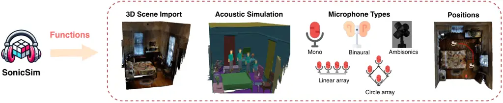
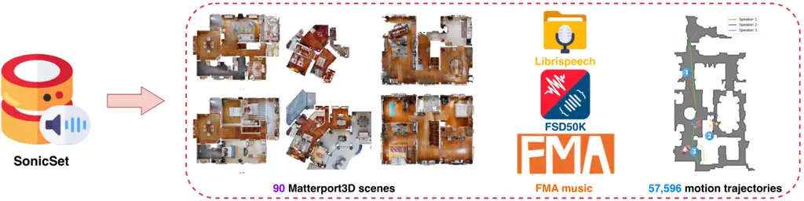
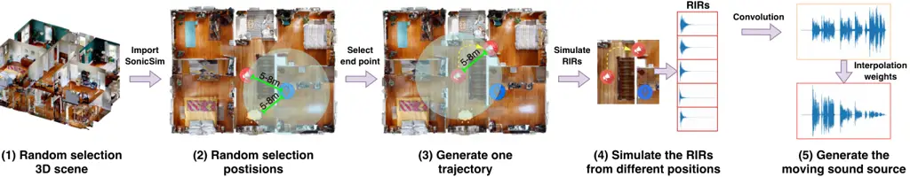
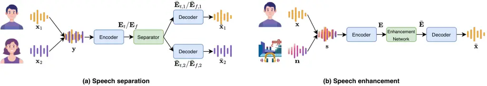
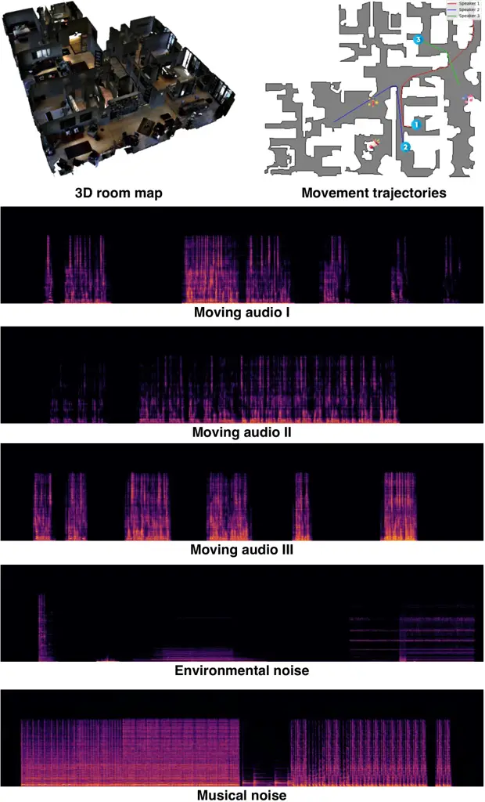
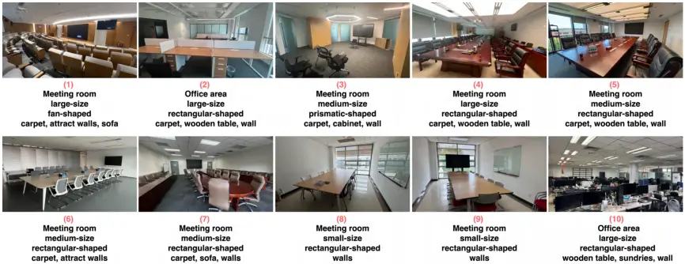

# ![[Uncaptioned image]](arxiv-2410-01481v2--56ecb3fcce39.figures/figure-1.webp)SonicSim: A customizable simulation platform for speech processing in moving sound source scenarios

Kai Li Email: [tsinghua.kaili@gmail.com](mailto:)    Wendi Sang
Email: [xlhu@tsinghua.edu.cn](mailto:)    Chang Zeng    Runxuan Yang   
Guo Chen & Xiaolin Hu1. Department of Computer Science and Technology,
Institute for AI,BNRist, Tsinghua University, Beijing 100084, China2.
Tsinghua Laboratory of Brain and Intelligence (THBI),IDG/McGovern
Institute for Brain Research, Tsinghua University, Beijing 100084,
China3. National Institute of Informatics, Japan4. Chinese Institute for
Brain Research (CIBR), Beijing 100010, China ^(†)^(†)thanks:
Corresponding author.

###### Abstract

Systematic evaluation of speech separation and enhancement models under
moving sound source conditions requires extensive and diverse data.
However, real-world datasets often lack sufficient data for training and
evaluation, and synthetic datasets, while larger, lack acoustic realism.
Consequently, neither effectively meets practical needs. To address this
issue, we introduce SonicSim, a synthetic toolkit based on the embodied
AI simulation platform Habitat-sim, designed to generate highly
customizable data for moving sound sources. SonicSim supports
multi-level adjustments—including scene-level, microphone-level, and
source-level—enabling the creation of more diverse synthetic data.
Leveraging SonicSim, we constructed a benchmark dataset called SonicSet,
utilizing LibriSpeech, Freesound Dataset 50k (FSD50K), Free Music
Archive (FMA), and 90 scenes from Matterport3D to evaluate speech
separation and enhancement models. Additionally, to investigate the
differences between synthetic and real-world data, we selected 5 hours
of raw, non-reverberant data from the SonicSet validation set and
recorded a real-world speech separation dataset, providing a reference
for comparing SonicSet with other synthetic datasets. For speech
enhancement, we utilized the real-world dataset RealMAN to validate the
acoustic gap between SonicSet and existing synthetic datasets. The
results indicate that models trained on SonicSet generalize better to
real-world scenarios compared to other synthetic datasets. Code is
publicly available at
[https://cslikai.cn/SonicSim/](https://cslikai.cn/SonicSim/).

|     |
| --- |
|     |

## 1 Introduction

Speech separation (Cherry, 1953) and enhancement (Loizou, 2007) are
classic tasks focused on extracting target speech from noisy audio. The
release of large-scale synthetic datasets like LibriMix (Cosentino
et al., 2020) and the DNS Challenge (Reddy et al., 2020) has propelled
model advancements, with many methods (Chen et al., 2020a; Luo & Yu,
2023b) demonstrating cross-environment transferability in zero-shot
settings. These SOTA methods have significantly benefited applications
such as online meetings (Rao et al., 2021) and human-computer
interaction (Yu & Chen, 2017). However, a significant acoustic mismatch
between synthetic and real-world data persists, leading to suboptimal
model performance in real-world scenarios (Sivaraman & Kim, 2022).

Previous efforts to bridge the gap between synthetic and real-world data
have mainly focused on more accurate modeling of room reverberations.
Datasets like WHAMR! (Maciejewski et al., 2020) and the DNS Challenge
(Reddy et al., 2020) simulate room impulse responses (RIRs) using
methods such as finite element analysis (Jarrett et al., 2012), ray
tracing (Lopez-Hernandez et al., 2000), or the image source method (Luo
& Yu, 2023a). However, from the perspective of RIR simulation, existing
approaches face three major challenges: 1) Occlusion of obstacles: RIRs
based on the image source method struggle with varying quantities and
shapes of obstacles, particularly when objects obstruct the sound path
between the source and microphone (Aralikatti et al., 2022). 2) Complex
room geometry: Simulations often assume cuboid-shaped rooms (Southern
et al., 2011), deviating from complex real-world environments, such as
lecture halls with tiered seating. 3) Complicated room surfaces and
object materials: Different materials have distinct acoustic properties,
and accurately replicating scenes using multiple materials is
challenging. Therefore, accurate simulation of RIRs remains a difficult
problem.

Existing datasets are primarily collected from static sound sources
(Cosentino et al., 2020; Maciejewski et al., 2020; Reddy et al., 2020),
making them suitable for non-moving scenarios like online meetings. In
contrast, moving sound source scenarios—where speakers move around while
static microphones capture their speech—are more relevant to
applications such as robotic navigation (Wang et al., 2004). However,
capturing large-scale datasets for moving sound sources is more
time-consuming, leading to a scarcity of such data, which limits the
development and evaluation of speech separation and enhancement models
in these tasks. Additionally, real-world datasets are constrained by
physical environments and, once collected, their distributions are
fixed, making them difficult to adjust flexibly and increasing the risk
of models overfitting to specific datasets. Thus, despite their high
research value, the lack of relevant datasets for moving sound source
scenarios significantly hinders deeper exploration in this area.



Figure 1: Overview of SonicSim, our toolkit for speech research.
SonicSim provides a customizable data generator based on Habitat-sim,
allowing users to generate realistic and physically plausible audio data
in a controlled manner.



Figure 2: Overview of the SonicSet dataset. It covers a wide range of
scenarios, speakers, and noise.

To advance research in moving sound sources, particularly in speech
separation and enhancement tasks, there is a pressing need for a
high-fidelity, low-cost, and comprehensive synthetic toolkit and data
asset for moving sound sources. To address these issues, we developed
SonicSim, a synthetic toolkit capable of accurately simulating RIRs for
moving sound sources, as shown in Figure 1. This toolkit is built upon
the embodied AI simulation platform, Habitat-sim (Savva et al., 2019),
which can import a variety of 3D environments and accurately simulate
the acoustic characteristics of rooms. The core strength of SonicSim
lies in its precise simulation of RIRs (Chen et al., 2022a) and highly
customizable simulation of moving sound sources, which significantly
expands the scale of data collection for moving sound source research.

Based on SonicSim, we constructed a multi-scene, large-scale, and
high-quality moving sound source dataset called SonicSet (see
Figure 2): 1) Multi-scene: SonicSet utilizes 90 scenes from the
Matterport3D dataset (Chang et al., 2017), covering a wide range of
real-world environments, such as homes, offices, and churches; 2)
Large-scale: SonicSet integrates 360 hours of speech audio from the
LibriSpeech (Panayotov et al., 2015), combined with environmental noise
from FSD50K (Fonseca et al., 2021) and musical noise from the FMA
dataset (Defferrard et al., 2017); 3) High-quality: The RIRs of the
synthetic audio closely resemble real-world environments by simulating
reflection and diffraction across various materials, resulting in
higher-quality reverberated audio.

On the SonicSet dataset, we conducted extensive quantitative experiments
on 11 speech separation methods and 9 speech enhancement methods,
thoroughly analyzing the performance of each approach. To assess the gap
between SonicSet and real-world environments, we created a speech
separation dataset by recording raw, non-reverberant audio from the
SonicSet validation set in real-life scenarios across 10 scenes,
totaling 5 hours. For the speech enhancement task, we utilized the
RealMAN test set (Yang et al., 2024), which includes real-world
recordings of moving sound sources, to evaluate discrepancies between
the synthetic dataset and real environments. The experimental results
demonstrated that models trained on SonicSet generalized well to
real-world conditions, confirming the effectiveness and potential of
SonicSim for speech research.

## 2 Related works

In this section, we systematically compare the SonicSim toolkit and the
generated SonicSet dataset with existing real-world datasets, synthetic
datasets, and simulation toolkits (see Table 1).

Real-world datasets: Currently, there are very few speech separation and
enhancement datasets recorded in real-world environments (Yang et al.,
2024; Watanabe et al., 2020). This is primarily because most speech
datasets are designed for speech recognition evaluation and only provide
transcription annotations, lacking the ground-truth labels needed for
supervised learning tasks such as speech separation and enhancement.
Recently, the RealMAN dataset introduced real-world microphone array
recordings of speech and noise (Yang et al., 2024). Although the gap
between the RealMAN dataset and real-world application scenarios is
relatively small, its high annotation cost and limited scalability
hinder model adaptation to diverse scenarios. Our proposed SonicSim
addresses these limitations by offering a highly customizable and
realistic synthetic data generation method, filling the gap in scale and
scene diversity present in existing datasets.

| Datasets           | Geometry | Occlusion | Material | Scalability | Cost | Tools | Src Type | Tasks |
| ------------------ | -------- | --------- | -------- | ----------- | ---- | ----- | -------- | ----- |
| WHAMR! 2020        | Cuboid   | ✗         | ✗        | ✓           | Low  | ✓     | Static   | SS/SE |
| LibriCSS 2020b     | Cuboid   | ✓         | ✓        | ✗           | High | ✗     | Static   | SS    |
| DNS Challenge 2020 | Cuboid   | ✗         | ✗        | ✓           | Low  | ✓     | Static   | SE    |
| Chime6 2020        | Variable | ✓         | ✓        | ✗           | High | ✗     | Static   | SS    |
| LRS2 2023          | Variable | ✓         | ✓        | ✗           | High | ✗     | Static   | SS    |
| RealMan 2024       | Variable | ✓         | ✓        | ✗           | High | ✗     | Dynamic  | SE    |
| SonicSet (ours)    | Variable | ✓         | ✓        | ✓           | Low  | ✓     | Dynamic  | SS/SE |

Table 1: Comparison of different datasets for speech separation and
enhancement. “Geometry” refers to the room geometry. “Occlusion”
indicates whether objects obstruct the sound source and microphone.
“Material” shows whether the material properties of objects are
considered. “Scalability” refers to the ability to increase the amount
of data. “Cost” represents the difficulty of simulating or collecting
data. “Tools” indicates whether there are toolkits for data collection.
“Src Type” indicates the source type. “SS” and “SE” denote the speech
separation and enhancement tasks.

Synthetic datasets: Synthetic datasets (Reddy et al., 2020; Cosentino
et al., 2020; Maciejewski et al., 2020; Chen et al., 2020b) generate
data by convolving Room Impulse Responses (RIRs) with multiple source or
noise signals to enhance realism, often using image source methods
(Allen & Berkley, 1979). While datasets like WHAMR! (Maciejewski et al., 2020) introduce synthetic reverberation and noise, they are created
under controlled conditions, limiting their authenticity and inability
to fully reflect real-world performance of speech separation and
enhancement methods. In contrast, SonicSet ensures acoustic plausibility
and offers a wider range of customizable options, such as varying
geometric structures and multiple microphone array configurations,
providing more challenging and realistic environments for these tasks.

Reverberation simulation tools: Recent advances in reverberation
simulation tools have significantly contributed to the field. FRAM-RIR
(Luo & Yu, 2023a) uses a stochastic approximation of the image source
method for rapid RIR simulation. RIR-Generator (Tang et al., 2020)
allows parameter settings based on the image source method, and
Pyroomacoustics (Scheibler et al., 2018) offers a flexible Python
library for fast simulation in 2D or 3D rooms. For complex acoustic
environments, COMSOL Multiphysics (Multiphysics, 1998) employs finite
element methods for detailed room modeling. Compared to these tools,
SonicSim based on Habitat-sim (Savva et al., 2019) surpasses others in
acoustic realism, producing synthetic audio that closely resembles
real-world recordings. It also provides practical features for
efficiently creating diverse acoustic scenes tailored to specific
needs—capabilities lacking in most existing reverberation simulation
tools.

## 3 Moving sound source suite

The moving sound source suite consists of two core components: the
customizable data generator SonicSim and the moving sound source dataset
SonicSet. SonicSim leverages existing datasets to create data tailored
for speech separation and enhancement.

### 3.1 Customizable data generator: SonicSim

The customizable dataset generator, SonicSim, is specifically designed
to generate datasets for speech tasks. Built on Habitat-sim (Savva
et al., 2019), SonicSim leverages its highly realistic audio renderer
(demonstrated in (Chen et al., 2022a)) and high-performance 3D simulator
to produce high-quality audio data adapted to various acoustic
environments. SonicSim provides a rich set of annotations, including
source and microphone position maps, clean audio, and audio with
reverberation and noise, without incurring additional data collection
costs. More importantly, SonicSim provides users with extensive control
over the dataset generation process, allowing customization of scene
layouts, scene materials, source and microphone positions, and
microphone types, while ensuring physical realism through its physics
engine. By adjusting these configurations, SonicSim can flexibly
generate diverse acoustic environment data to meet the specific
requirements of various tasks. In Appendix A, we discussed in detail the
impact of environmental factors on model performance. The following main
functions are included in SonicSim, as shown in Figure 1.

- •
  3D scene import: Through Habitat-sim (Savva et al., 2019), SonicSim
  can import various realistic 3D assets generated through simulations
  or scans, such as those from the Matterport3D dataset (Chang et al.,
  2017). SonicSim leverages Habitat-sim¹¹ 1
  [https://aihabitat.org/docs/habitat-sim/habitat_sim.sim.SimulatorConfiguration.html](https://aihabitat.org/docs/habitat-sim/habitat_sim.sim.SimulatorConfiguration.html)
  to interpret metadata and structural information from external
  datasets and convert them into Habitat-sim’s native scene format.
  Geometric data, material properties, and semantic annotations are
  transformed to ensure that the imported scenes maintain their original
  high fidelity. Importing 3D scenes with various shapes, such as
  cylinders, enables Habitat-sim to simulate different acoustic
  properties according to different spatial layouts. SonicSim allows
  users to add additional objects to the scene; however, the 3D scenes
  themselves cannot be modified by users, as they are fixed during the
  import process.
- •
  Acoustic environment simulation: SonicSim uses Habitat-sim to simulate
  various acoustic features in 3D environments²² 2
  [https://aihabitat.org/docs/habitat-sim/habitat_sim.sensor.AudioSensor.html](https://aihabitat.org/docs/habitat-sim/habitat_sim.sensor.AudioSensor.html).
  Its capabilities include: 1) accurately simulating sound reflections
  within room geometries using indoor acoustic modeling and
  bidirectional path tracing algorithms. This effectively simulates the
  acoustic effect of different objects blocking sound.; 2) mapping the
  semantic labels of 3D scenes to material properties to set the
  acoustic features of different surfaces, such as absorption,
  scattering, and transmission coefficients. SonicSim supports a wide
  range of materials and objects, and users can modify the physical and
  categorical attributes of materials; 3) extended Habitat-sim acoustic
  simulation capabilities enable the synthesis of moving sound source
  data based on sound source paths.
- •
  Microphone types: Habitat-sim offers comprehensive microphone
  configurations, supporting various audio formats such as mono,
  binaural, and ambisonics³³ 3
  [https://github.com/facebookresearch/habitat-sim/blob/main/docs/AUDIO.md](https://github.com/facebookresearch/habitat-sim/blob/main/docs/AUDIO.md).
  Additionally, we have integrated common linear and circular microphone
  arrays, allowing users to customize the shape of microphone arrays to
  meet different experimental requirements. Specifically, we first
  define multiple single-channel receivers corresponding to the number
  of microphones in the array. Next, we configure the spatial relative
  coordinates of these single-channel receivers based on the desired
  array shape. Finally, we bind these receivers together and adjust the
  absolute coordinates to set the position of the microphone array
  within the environment. We provided a flexible API that enables
  researchers to represent the desired array layout by inputting custom
  functions.
- •
  Source and microphone positions: SonicSim allows users to customize or
  randomly set the positions of sound sources and microphones, which can
  be defined within the global coordinate system of the environment.
  Apart from static positioning, SonicSim also supports generating
  motion trajectories for moving sound sources and microphones based on
  specified start and endpoints. This feature is implemented by
  interpolating between defined points using navigable paths and
  leveraging Habitat-sim’s physics engine to update the positions of
  moving entities over time. As the sound sources and microphones move
  along their trajectories, the system dynamically calculates the
  acoustic response in real-time. SonicSim accounts for dynamic changes
  in distance, occlusion, and environmental interactions, continuously
  updating the sound propagation paths to simulate evolving
  reverberation. By integrating these capabilities, SonicSim provides a
  highly realistic simulation environment for scenarios involving moving
  sound sources.

### 3.2 Moving sound source dataset: SonicSet



Figure 3: An automatic simulation pipeline for moving sound sources. The
positions of the sound sources, noises and microphones are all randomly
generated. The five RIRs shown in the figure are just for demonstration
purposes; the actual process involves more RIRs.

We used SonicSim to construct a moving sound source dataset, SonicSet,
specifically designed for research on moving speech separation and
enhancement tasks. This dataset supports diverse acoustic scenarios by
simulating microphones, sound sources, and noise sources randomly placed
in the environment. A detailed data analysis can be found in Appendix B.
As shown in Figure 3, the entire data generation process is outlined,
ensuring the validity of the sound source and microphone configurations
under varying positions and dynamic changes.

#### 3.2.1 Data source

The data we used consists of two main components: 3D assets and audio
data. For the 3D assets, we utilized the Matterport3D dataset (Chang
et al., 2017), a large-scale indoor RGB-D dataset containing 90
building-level scenes, representing a wide range of real-world
environments. The semantic segmentation annotations from Matterport3D
were used to assign acoustic material properties, enabling the creation
of more realistic acoustic environments. In SonicSet, the training set
includes 62 scenes, the validation set contains 19 scenes, and the test
set includes 9 scenes.

For the audio data, we used speech from the LibriSpeech dataset
(Panayotov et al., 2015) and noise from FSD50K (Fonseca et al., 2021)
and FMA (Defferrard et al., 2017). LibriSpeech consists of approximately
1,000 hours of 16 kHz read speech from audiobooks; we selected
train-clean-360 for training, dev-clean for validation, and test-clean
for testing. FSD50K, containing 51,197 manually labeled sound events
totaling over 100 hours and covering 200 categories, was downsampled to
16 kHz using Librosa (McFee et al., 2015) and split into training,
validation, and test sets in a 7:2:1 ratio. For FMA, an open music
dataset, we used a pre-trained BSRNN model (Luo & Yu, 2023b) to remove
vocals, ensuring speech separation was unaffected during data synthesis.
We then downsampled the music to 16 kHz and divided it similarly into
training, validation, and test sets.

#### 3.2.2 Dataset construction

The audio simulation pipeline in the SonicSet dataset, illustrated in
Figure 3, consists of the following steps. First, we selected a 3D scene
from the Matterport3D dataset and imported it into SonicSim to
initialize the acoustic environment. Second, we randomly chose positions
for the microphone and the sound source within a certain layer, with the
sound source’s starting position and the noise source’s position within
a 1--8 meter radius from the microphone. Third, based on the sound
source’s initial position, we selected an endpoint within a 1--8 meter
range from both the microphone and the initial position, using
SonicSim’s trajectory function⁴⁴ 4 The trajectory is generated using
Habitat-sim’s API, specifically the “habitat*sim.ShortestPath” method.
to generate a movement path. Fourth, SonicSim computed the RIRs along
the trajectory and convolved them with the source audio. Let
$`\mathbf{s}(t)`$ denote the source audio signal of duration $`T`$, and
let $`\mathbf{h}*{j}^{c}(t)`$ represent the RIRs at discrete positions
$`j=1,2,\dots,N`$, where $`c`$ indexes the audio channels. The
convolution at each position is
$`\mathbf{y}_{j}^{c}(t)=\mathbf{s}(t)\*\mathbf{h}_{j}^{c}(t)`$. To
achieve realistic spatial movement, we interpolated the convolution
results of adjacent positions using a time-varying interpolation weight
$`\alpha(t)\in[0,1]`$, calculated based on the Euclidean distances
between the current position of the moving source $`\mathbf{r}_{t}`$ and
the adjacent positions:
$`\alpha(t)=\frac{\text{dist}(\mathbf{r}_{j+1},\mathbf{r}_{t})}{\text{dist}(\mathbf{r}_{j},\mathbf{r}_{j+1})},`$
where $`\text{dist}(\mathbf{r}_{a},\mathbf{r}_{b})`$ denotes the
Euclidean distance between positions $`\mathbf{r}_{a}`$ and
$`\mathbf{r}_{b}`$. This ensures $`\alpha(t)`$ transitions smoothly from
$`0`$ to $`1`$ as the source moves from $`\mathbf{r}_{j}`$ to
$`\mathbf{r}_{j+1}`$. The interpolated audio signal is then computed as
$`\mathbf{y}(t)=(1-\alpha(t))\cdot\mathbf{y}_{j}^{c}(t)+\alpha(t)\cdot\mathbf{y}\_{j+1}^{c}(t),`$
dynamic acoustic changes as the source moves (Slaney et al., 1996;
Freeland et al., 2002). Finally, interpolated audio segments were
concatenated to form a moving source. SonicSim adjusts the source’s
movement speed based on trajectory length to ensure compatibility with
the fixed duration $`T`$.

To create realistic synthetic mixed audio, we set each mixed audio clip
to 60 seconds. Speech segments consisted of 3-5 full audio clips from
the same LibriSpeech speaker, arranged into a 60-second sequence with
random start positions within 0-8 seconds to ensure varied overlap
rates, utilizing SonicSim for moving sound source synthesis. For noise
data, we randomly selected 6-8 environmental noise segments from FSD50K
and 6-8 musical noise segments from FMA, arranging them into 60-second
clips with random start positions within 0-4 seconds. Volume levels were
adjusted using Loudness Units relative to Full Scale (LUFS): speech at
-17 LUFS, environmental noise at -21 LUFS, and musical noise at -24
LUFS. Mixed audio was generated by randomly choosing different speakers
and adding environmental or musical noise, with background and musical
noise samples including diverse, time-varying content. In each dataset
group (three speech clips plus one environmental noise clip and one
musical noise clip), simulations were conducted within the same scene,
simulating speech as moving sources and noise as static sources. An
example of SonicSet is presented in Figure 5, with corresponding audio
metadata and generation hyperparameters provided in JSON files 1 and 2
in Appendix C.

## 4 Benchmark I: speech separation

### 4.1 Problem Definition

Speech separation aims to isolate individual speech signals from a
mixture containing multiple speakers, as shown in Figure 4(a). This task
is critical for real-world applications such as meetings and telephone
conversations. A detailed explanation of the task pipeline is provided
in Appendix D.1.

### 4.2 Benchmark models

We selected several popular models that have demonstrated excellent
performance in speech separation as benchmarks, including Conv-TasNet
(2019), DPRNN (2020), DPTNet (2020a), SuDORM-RF (2020), A-FRCNN (2021),
SKIM (2022d), TDANet (2023), BSRNN (2023b), TF-GridNet (2023),
Mossformer (2023), and Mossformer2 (2024). For detailed information
about the benchmark models, see Appendix D.2. The PyTorch
implementations and pre-trained weights for all benchmark models are
publicly available⁵⁵ 5
[https://github.com/JusperLee/SonicSim/tree/main/separation](https://github.com/JusperLee/SonicSim/tree/main/separation).



Figure 4: Overall pipeline for speech separation and enhancement.

### 4.3 Dataset details

We report the performance of trained baseline models using the LRS2-2Mix
(Li et al., 2023), Libri2Mix (Cosentino et al., 2020), and SonicSet
datasets, which we tested on a real-world moving speech separation
dataset collected by us. We used the test sets from LRS2-2Mix and
Libri2Mix to test the models’ generalization and transfer performance
across different scenarios. Please refer to Appendix D.3 for detailed
descriptions of these datasets.

### 4.4 Implementation details

To adapt the WSJ0-2Mix model (originally for 8 kHz) to our 16 kHz
dataset, we doubled the window length and step size of the encoder and
decoder, keeping other hyperparameters unchanged. We trained the model
using the Adam optimizer (Kingma, 2014) with a batch size of 1 on
randomly sampled 3s audio clips, employing negative SNR as the loss
function. The initial learning rate was set to $`1\times 10^{-3}`$, with
gradient clipping and early stopping strategies applied. Detailed
hyperparameters and training settings are provided in Appendix D.4 and
D.5. For experiments, we used SonicSet, public datasets, and real-world
datasets, with each mixed audio containing two different speakers at 16
kHz. The baseline model was pre-trained on SonicSet using a dynamic
augmentation strategy (Luo & Yu, 2023b): two speakers are randomly
selected from three audio tracks for mixing, adding environmental or
music noise as required, and a 3s segment is randomly extracted from the
60s audio for training. In SonicSet, we used the full test set and
processed with a 6s inference window and a 3s sliding window. For the
LRS2-2Mix (Li et al., 2023) and Libri2Mix (Cosentino et al., 2020)
datasets, 2s and 3s audio clips were used for training and testing,
respectively.

### 4.5 Evaluation metrics

We employed a series of metrics to assess the performance of the speech
separation benchmark models comprehensively. These metrics cover
multiple dimensions of audio quality, including signal quality (SI-SNR
(Le Roux et al., 2019) and SDR (Vincent et al., 2006)), speech
intelligibility (STOI (Taal et al., 2011) and WER), and subjective
quality perception (PESQ (Rix et al., 2001), NISQA (Mittag et al., 2021)
and SigMOS (Ristea et al., 2024) ). Details are given in Appendix D.6.

### 4.6 Results and analysis

Table 2: Comparative performance evaluation of models trained on
different datasets using RealSEP with environmental noise. The results
are reported separately for “trained on LRS2-2Mix”, “trained on
Libri2Mix” and “trained on SonicSet”, distinguished by a slash. The
relative length is indicated below the value by horizontal bars.

Table 3: Comparative performance evaluation of models trained on
different datasets using RealSEP with musical noise. The results are
reported separately for “trained on LRS2-2Mix”, “trained on Libri2Mix”
and “trained on SonicSet”, distinguished by a slash.

Table 4: Comparison of existing speech separation methods on the
SonicSet dataset. The performance of each model is listed separately for
results under “environmental noise” and “musical noise”, distinguished
by a slash.

Comparison on real-world datasets. To validate the acoustic simulation
gap between synthetic datasets and real data, we constructed a
real-world moving sound source dataset consisting of 5 hours of recorded
audio (details in Appendix D.3), namely RealSEP, encompassing various
complex acoustic environments and different types of background noise
(environmental and musical noise). In Tables 2 and 3, we trained models
using the LRS2-2Mix and Libri2Mix datasets to compare their performance
with models trained on the SonicSet dataset. The LRS2-2Mix dataset (Li
et al., 2023) contains real-world noise and reverberation. The Libri2Mix
dataset (Cosentino et al., 2020) is currently the largest synthetic
speech separation dataset, and its data scale is closest to SonicSet
among public speech separation datasets. We trained different models on
these datasets and tested them on the RealSEP datasets. In addition, we
supplemented the experimental results by recording audio data of direct
conversations between individuals (HumanSEP, details in Appendix D.3).
We then evaluated the NISQA and WER results of the speech separation
model trained on different data sets, as shown in Table 10 in the
Appendix. The results demonstrated that models trained on the SonicSet
dataset achieved overall the best separation performance on the RealSEP
and HumanSEP datasets. This finding indicates that the SonicSet dataset
excels in simulating more realistic acoustic scenes, making it effective
for model training and evaluation.

Comparison on the SonicSet dataset. The results of the speech separation
are shown in Table 4. Different models exhibit varying performance under
environmental and musical noise conditions. Among the RNN-based models,
DPRNN and BSRNN performed relatively poorly when handling musical noise.
In contrast, CNN-based models (SuDoRM-RF and A-FRCNN) demonstrated more
balanced performance across both environmental and musical noise
scenarios. Among Transformer-based models, Mossformer2 showed the SOTA
performance, especially in handling complex noise. This superiority can
be attributed to incorporating the multi-head attention mechanism, which
effectively captures long-term dependencies and complex frequency
variations (Vaswani et al., 2017). The detailed discussion is in
Appendix D.7.

## 5 Benchmark II: speech enhancement

### 5.1 Problem definition

The speech enhancement task aims to extract high-quality target speech
from a noisy signal, reducing or eliminating background noise, as shown
in Figure 4(b). This task is crucial in applications such as speech
recognition, speech communication, and hearing aids. A detailed
explanation of this task pipeline is available in Appendix E.1.

### 5.2 Benchmark models

In speech enhancement experiments, we selected several models: DCCRN
(2020), Fullband (2021), FullSubNet (2021), Fast-FullSubNet (2022),
FullSubNet+ (2022b), TaylorSENet (2022a), GaGNet (2022c), G2Net (2022b)
and Inter-SubNet (2023). The details of these models are provided in
Appendix E.2.

### 5.3 Implementation details

The hyperparameter settings for all baseline models remain consistent
with the original papers. We trained the models using the Adam optimizer
(Kingma, 2014) with an initial learning rate of 0.001. If the validation
loss does not decrease for five consecutive epochs, we reduce the
learning rate by a factor of 0.5. All audio samples are processed at a
16 kHz sampling rate. Training employs early stopping and halting if the
validation loss doesn’t improve for 10 epochs. During testing, we use
the same inference strategy as in the speech separation task to handle
long audio samples. For the speech enhancement experiments, we trained
models on the VoiceBank-DEMAND (Valentini-Botinhao et al., 2016), DNS
Challenge (Reddy et al., 2020), and SonicSet datasets using
single-channel speech signals sampled at 16 kHz. Baseline models were
pre-trained on SonicSet with the same dynamic enhancement strategy as in
separation model training, extracting 3s segments from 60s audio for
training. The training objective is detailed in Appendix E.3. For
SonicSet, we used the full test set with a 6s inference window and a 3s
sliding window to process long audio sequences. On the VoiceBank-DEMAND
and DNS Challenge datasets, 2s and 3s audio clips were used for training
and testing, respectively.

### 5.4 Evaluation metrics

In the speech enhancement task, we use a series of evaluation metrics to
comprehensively evaluate the performance of the speech separation
baseline model, including signal quality (SI-SNR (Le Roux et al., 2019)
and SDR (Vincent et al., 2006)), speech intelligibility (STOI (Taal
et al., 2011) and CER), and subjective quality perception (PESQ (Rix
et al., 2001), NISQA (Mittag et al., 2021), DNSMOS (Reddy et al., 2021)
and SigMOS (Ristea et al., 2024)). Since the real-world dataset, RealMAN
is a Chinese dataset, we use CER as the evaluation metric for speech
recognition. For these metrics, except for CER, the higher the value,
the better, while for CER, the lower the value, the better. From an
application perspective, CER is the most important metric, as speech
enhancement is usually a pre-processing step for speech recognition. The
PyTorch implementations and pre-trained weights for all baseline models
have been made publicly available⁶⁶ 6
[https://anonymous.4open.science/r/SonicSim-ICLR2025/enhancement](https://anonymous.4open.science/r/SonicSim-ICLR2025/enhancement).

### 5.5 Dataset details

Unlike the speech separation task, in the speech enhancement task, we
select the audio of a single speaker from the training set as the ground
truth label for each iteration, mixing it with various types of noise
using the same mixing method as in the speech separation task. We
trained baseline models using the training sets of VoiceBank-DEMAND
(Valentini-Botinhao et al., 2016), the DNS Challenge (Reddy et al., 2020) and SonicSet, and tested them on the test set of the real-world
dataset (RealMAN (Yang et al., 2024)) to evaluate the effectiveness of
different datasets in simulating real acoustic environments. To assess
the generalization ability of models trained on SonicSet, we also tested
the baseline models on VoiceBank-DEMAND and the DNS Challenge test sets.

### 5.6 Results and analysis

Comparison on real-recorded dataset. We utilized the real-world recorded
moving source dataset, RealMAN (test set), to evaluate trained speech
enhancement models on various speech enhancement datasets, including
VoiceBank-DEMAND, DNS Challenge, and SonicSet. VoiceBank-DEMAND is a
smaller dataset, while the DNS Challenge dataset comprises approximately
700 hours of data, with a data scale comparable to that of SonicSet. We
employed the DNSMOS (Reddy et al., 2021) tool to calculate subjective
metrics, while Character Error Rate (CER) results were evaluated using
the same speech recognition model⁷⁷ 7
[https://huggingface.co/espnet/pengcheng_guo_wenetspeech_asr_train_asr_raw_zh_char](https://huggingface.co/espnet/pengcheng_guo_wenetspeech_asr_train_asr_raw_zh_char)
as used with RealMAN. The results presented in Table 5 indicated that
models trained on the SonicSet dataset achieved overall the best results
across multiple metrics. Please note that for most practical
applications, CER is the most important metric. Moreover, we
supplemented the experimental results by constructing a dataset called
HumanENH (details in Appendix E.4) by recording human speech audio and
noise data. We then evaluated the NISQA and WER results of the speech
enhancement models trained on different datasets, as shown in Table 11
in the appendix.

Based on these findings, we infer that the synthetic dataset SonicSet
effectively simulates the acoustic environments of real moving source
scenarios. This provides significant flexibility and cost-effectiveness
for constructing large-scale datasets, positioning synthetic datasets as
an effective alternative for addressing complex environments.

Table 5: Comparative performance evaluation of models trained on
different datasets using the RealMAN dataset. The results are reported
separately for “trained on VoiceBank-DEMAND”, “trained on DNS Challenge”
and “trained on SonicSet”, distinguished by a slash. These MOS metrics
were calculated using DNSMOS.

Table 6: Comparison of speech enhancement methods using the SonicSet
test set. The metrics are listed separately under “environmental noise”
and “musical noise”, distinguished by a slash. These MOS metrics were
calculated using SigMOS.

Comparison on the SonicSet dataset. By comparing the performance of
different speech enhancement models on the SonicSet dataset, we analyzed
their enhancement effects under various types of noise. Table 6 presents
the performance of the benchmark models. Sub-band splitting methods
(such as FullSubNet, Fast-FullSubNet, FullSubNet+, and Inter-SubNet)
performed well across multiple metrics. Their interaction processing
mechanism between sub-bands significantly improved the models’ ability
to handle frequency band dependencies, resulting in better speech
clarity and noise suppression. In contrast, although TaylorSENet and
GaGNet showed relatively similar performance on SI-SNR and SDR, they
fell slightly behind in the MOS series scores. The detailed discussion
is in Appendix E.5.

## 6 Conclusions

We introduce a simulation tool named SonicSim, and a large-scale
synthetic dataset named SonicSet, designed to study speech separation
and enhancement tasks involving moving sound sources. By integrating the
Habitat-sim platform, we developed a tool capable of simulating complex
acoustic environments, supporting moving sound sources and multi-scene
audio generation. Baseline experiments demonstrate that models
pre-trained on the SonicSet dataset exhibit strong generalization
abilities across various public benchmark datasets and real-world
recorded datasets, effectively narrowing the gap between simulation and
real-world scenarios. Through continuous improvements in the simulation
tool and optimization of model algorithms, future work could further
advance the deployment of speech tasks in complex environments.

Limitation: The realism of SonicSim’s audio simulation is constrained by
the level of detail in 3D scene modeling. When there are gaps or
incomplete structures in the imported 3D scenes, the system cannot
accurately simulate the reverberation effects in the current
environment.

#### Acknowledgments

This work was supported in part by the National Key Research and
Development Program of China (No. 2021ZD0200301) and the National
Natural Science Foundation of China (No. U2341228).

## References

- Allen & Berkley (1979) Jont B Allen and David A Berkley. Image method
  for efficiently simulating small-room acoustics. _The Journal of the
  Acoustical Society of America_, 65(4):943–950, 1979.
- Aralikatti et al. (2022) Rohith Aralikatti, Zhenyu Tang, and Dinesh
  Manocha. Synthetic wave-geometric impulse responses for improved
  speech dereverberation. _arXiv preprint arXiv:2212.05360_, 2022.
- Chang et al. (2017) Angel Chang, Angela Dai, Thomas Funkhouser, Maciej
  Halber, Matthias Niebner, Manolis Savva, Shuran Song, Andy Zeng, and
  Yinda Zhang. Matterport3d: Learning from rgb-d data in indoor
  environments. In _International Conference on 3D Vision_, pp. 667–676.
  IEEE, 2017.
- Chen et al. (2022a) Changan Chen, Carl Schissler, Sanchit Garg, Philip
  Kobernik, Alexander Clegg, Paul Calamia, Dhruv Batra, Philip Robinson,
  and Kristen Grauman. Soundspaces 2.0: A simulation platform for
  visual-acoustic learning. In _Advances in Neural Information
  Processing Systems_, pp. 8896–8911, 2022a.
- Chen et al. (2020a) Jingjing Chen, Qirong Mao, and Dong Liu. Dual-path
  transformer network: Direct context-aware modeling for end-to-end
  monaural speech separation. In _Conference of the International Speech
  Communication Association_, 2020a.
- Chen et al. (2022b) Jun Chen, Zilin Wang, Deyi Tuo, Zhiyong Wu, Shiyin
  Kang, and Helen Meng. Fullsubnet+: Channel attention fullsubnet with
  complex spectrograms for speech enhancement. In _International
  Conference on Acoustics, Speech and Signal Processing_, pp. 7857–7861.
  IEEE, 2022b.
- Chen et al. (2023) Jun Chen, Wei Rao, Zilin Wang, Jiuxin Lin, Zhiyong
  Wu, Yannan Wang, Shidong Shang, and Helen Meng. Inter-subnet: Speech
  enhancement with subband interaction. In _IEEE International
  Conference on Acoustics, Speech and Signal Processing_, pp. 1–5.
  IEEE, 2023.
- Chen et al. (2020b) Zhuo Chen, Takuya Yoshioka, Liang Lu, Tianyan
  Zhou, Zhong Meng, Yi Luo, Jian Wu, Xiong Xiao, and Jinyu Li.
  Continuous speech separation: Dataset and analysis. In _International
  Conference on Acoustics, Speech and Signal Processing_, pp. 7284–7288.
  IEEE, 2020b.
- Cherry (1953) E Colin Cherry. Some experiments on the recognition of
  speech, with one and with two ears. _The Journal of the Acoustical
  Society of America_, 25(5):975–979, 1953.
- Cosentino et al. (2020) Joris Cosentino, Manuel Pariente, Samuele
  Cornell, Antoine Deleforge, and Emmanuel Vincent. Librimix: An
  open-source dataset for generalizable speech separation. _arXiv
  preprint arXiv:2005.11262_, 2020.
- Defferrard et al. (2017) Michaël Defferrard, Kirell Benzi, Pierre
  Vandergheynst, and Xavier Bresson. Fma: A dataset for music analysis.
  In _International Society for Music Information Retrieval
  Conference_, 2017.
- Fonseca et al. (2021) Eduardo Fonseca, Xavier Favory, Jordi Pons,
  Frederic Font, and Xavier Serra. Fsd50k: an open dataset of
  human-labeled sound events. _IEEE/ACM Transactions on Audio, Speech,
  and Language Processing_, 30:829–852, 2021.
- Freeland et al. (2002) Fabio P Freeland, Luiz WP Biscainho, and
  Paulo SR Diniz. Efficient hrtf interpolation in 3d moving sound. In
  _Audio Engineering Society Conference: 22nd International Conference:
  Virtual, Synthetic, and Entertainment Audio_. Audio Engineering
  Society, 2002.
- Grumiaux et al. (2022) Pierre-Amaury Grumiaux, Srjan Kitic, Laurent
  Girin, and Alexandre Guerin. A survey of sound source localization
  with deep learning methods. _The Journal of the Acoustical Society of
  America_, 152(1):107–151, 2022.
- Hao & Li (2022) Xiang Hao and Xiaofei Li. Fast fullsubnet: Accelerate
  full-band and sub-band fusion model for single-channel speech
  enhancement. _arXiv preprint arXiv:2212.09019_, 2022.
- Hao et al. (2021) Xiang Hao, Xiangdong Su, Radu Horaud, and Xiaofei
  Li. Fullsubnet: A full-band and sub-band fusion model for real-time
  single-channel speech enhancement. In _International Conference on
  Acoustics, Speech and Signal Processing_, pp. 6633–6637. IEEE, 2021.
- Hershey et al. (2016) John R Hershey, Zhuo Chen, Jonathan Le Roux, and
  Shinji Watanabe. Deep clustering: Discriminative embeddings for
  segmentation and separation. In _International Conference on
  Acoustics, Speech and Signal Processing_, pp. 31–35. IEEE, 2016.
- Hu et al. (2021) Xiaolin Hu, Kai Li, Weiyi Zhang, Yi Luo, Jean-Marie
  Lemercier, and Timo Gerkmann. Speech separation using an asynchronous
  fully recurrent convolutional neural network. In _Advances in Neural
  Information Processing Systems_, volume 34, pp. 22509–22522, 2021.
- Hu et al. (2020) Yanxin Hu, Yun Liu, Shubo Lv, Mengtao Xing, Shimin
  Zhang, Yihui Fu, Jian Wu, Bihong Zhang, and Lei Xie. Dccrn: Deep
  complex convolution recurrent network for phase-aware speech
  enhancement. In _Conference of the International Speech Communication
  Association_, 2020.
- Jarrett et al. (2012) Daniel P Jarrett, Emanuel AP Habets, Mark RP
  Thomas, and Patrick A Naylor. Rigid sphere room impulse response
  simulation: Algorithm and applications. _The Journal of the Acoustical
  Society of America_, 132(3):1462–1472, 2012.
- Kingma (2014) Diederik P Kingma. Adam: A method for stochastic
  optimization. _arXiv preprint arXiv:1412.6980_, 2014.
- Le Roux et al. (2019) Jonathan Le Roux, Scott Wisdom, Hakan Erdogan,
  and John R Hershey. Sdr–half-baked or well done? In _International
  Conference on Acoustics, Speech and Signal Processing_, pp. 626–630.
  IEEE, 2019.
- Li et al. (2022a) Andong Li, Shan You, Guochen Yu, Chengshi Zheng, and
  Xiaodong Li. Taylor, can you hear me now? a taylor-unfolding framework
  for monaural speech enhancement. In _Proceedings of the Thirty-First
  International Joint Conference on Artificial Intelligence_, pp.
  4193–4200, 2022a.
- Li et al. (2022b) Andong Li, Chengshi Zheng, Guochen Yu, Juanjuan Cai,
  and Xiaodong Li. Filtering and refining: A collaborative-style
  framework for single-channel speech enhancement. _IEEE/ACM
  Transactions on Audio, Speech, and Language Processing_, 30:2156–2172,
  2022b.
- Li et al. (2022c) Andong Li, Chengshi Zheng, Lu Zhang, and Xiaodong
  Li. Glance and gaze: A collaborative learning framework for
  single-channel speech enhancement. _Applied Acoustics_, 187:108499,
  2022c.
- Li et al. (2022d) Chenda Li, Lei Yang, Weiqin Wang, and Yanmin Qian.
  Skim: Skipping memory lstm for low-latency real-time continuous speech
  separation. In _International Conference on Acoustics, Speech and
  Signal Processing_, pp. 681–685. IEEE, 2022d.
- Li et al. (2023) Kai Li, Runxuan Yang, and Xiaolin Hu. An efficient
  encoder-decoder architecture with top-down attention for speech
  separation. In _The Eleventh International Conference on Learning
  Representations_, 2023.
- Loizou (2007) PC Loizou. Speech enhancement: theory and
  practice, 2007.
- Lopez-Hernandez et al. (2000) Francisco J Lopez-Hernandez, Rafael
  Perez-Jimenez, and Asuncion Santamaria. Ray-tracing algorithms for
  fast calculation of the channel impulse response on diffuse ir
  wireless indoor channels. _Optical Engineering_,
  39(10):2775–2780, 2000.
- Luo & Mesgarani (2019) Yi Luo and Nima Mesgarani. Conv-tasnet:
  Surpassing ideal time–frequency magnitude masking for speech
  separation. _IEEE/ACM Transactions on Audio, Speech, and Language
  Processing_, 27(8):1256–1266, 2019.
- Luo & Yu (2023a) Yi Luo and Jianwei Yu. Fra-rir: Fast random
  approximation of the image-source method. In _Conference of the
  International Speech Communication Association_, 2023a.
- Luo & Yu (2023b) Yi Luo and Jianwei Yu. Music source separation with
  band-split rnn. _IEEE/ACM Transactions on Audio, Speech, and Language
  Processing_, 31:1893–1901, 2023b.
- Luo et al. (2020) Yi Luo, Zhuo Chen, and Takuya Yoshioka. Dual-path
  rnn: efficient long sequence modeling for time-domain single-channel
  speech separation. In _International Conference on Acoustics, Speech
  and Signal Processing_, pp. 46–50. IEEE, 2020.
- Maciejewski et al. (2020) Matthew Maciejewski, Gordon Wichern, Emmett
  McQuinn, and Jonathan Le Roux. Whamr!: Noisy and reverberant
  single-channel speech separation. In _International Conference on
  Acoustics, Speech and Signal Processing_, pp. 696–700. IEEE, 2020.
- Malik et al. (2021) Mishaim Malik, Muhammad Kamran Malik, Khawar
  Mehmood, and Imran Makhdoom. Automatic speech recognition: a survey.
  _Multimedia Tools and Applications_, 80:9411–9457, 2021.
- McFee et al. (2015) Brian McFee, Colin Raffel, Dawen Liang, Daniel PW
  Ellis, Matt McVicar, Eric Battenberg, and Oriol Nieto. librosa: Audio
  and music signal analysis in python. In _SciPy_, pp. 18–24, 2015.
- Mittag et al. (2021) Gabriel Mittag, Babak Naderi, Assmaa Chehadi, and
  Sebastian Möller. Nisqa: A deep cnn-self-attention model for
  multidimensional speech quality prediction with crowdsourced datasets.
  _arXiv preprint arXiv:2104.09494_, 2021.
- Multiphysics (1998) COMSOL Multiphysics. Introduction to comsol
  multiphysics®. _COMSOL Multiphysics, Burlington, MA, accessed Feb_,
  9(2018):32, 1998.
- Panayotov et al. (2015) Vassil Panayotov, Guoguo Chen, Daniel Povey,
  and Sanjeev Khudanpur. Librispeech: an asr corpus based on public
  domain audio books. In _International Conference on Acoustics, Speech
  and Signal Processing_, pp. 5206–5210. IEEE, 2015.
- Radford et al. (2023) Alec Radford, Jong Wook Kim, Tao Xu, Greg
  Brockman, Christine McLeavey, and Ilya Sutskever. Robust speech
  recognition via large-scale weak supervision. In _International
  Conference on Machine Learning_, pp. 28492–28518. PMLR, 2023.
- Rao et al. (2021) Wei Rao, Yihui Fu, Yanxin Hu, Xin Xu, Yvkai Jv,
  Jiangyu Han, Zhongjie Jiang, Lei Xie, Yannan Wang, Shinji Watanabe,
  et al. Conferencingspeech challenge: Towards far-field multi-channel
  speech enhancement for video conferencing. In _Automatic Speech
  Recognition and Understanding Workshop_, pp. 679–686. IEEE, 2021.
- Reddy et al. (2020) Chandan KA Reddy, Vishak Gopal, Ross Cutler,
  Ebrahim Beyrami, Roger Cheng, Harishchandra Dubey, Sergiy Matusevych,
  Robert Aichner, Ashkan Aazami, Sebastian Braun, et al. The interspeech
  2020 deep noise suppression challenge: Datasets, subjective testing
  framework, and challenge results. In _Conference of the International
  Speech Communication Association_, 2020.
- Reddy et al. (2021) Chandan KA Reddy, Vishak Gopal, and Ross Cutler.
  Dnsmos: A non-intrusive perceptual objective speech quality metric to
  evaluate noise suppressors. In _IEEE International Conference on
  Acoustics, Speech and Signal Processing_, pp. 6493–6497. IEEE, 2021.
- Ristea et al. (2024) Nicolae-Cătălin Ristea, Ando Saabas, Ross Cutler,
  Babak Naderi, Sebastian Braun, and Solomiya Branets. Icassp 2024
  speech signal improvement challenge. In _International Conference on
  Acoustics, Speech and Signal Processing Workshops_, pp. 15–16.
  IEEE, 2024.
- Rix et al. (2001) Antony W Rix, John G Beerends, Michael P Hollier,
  and Andries P Hekstra. Perceptual evaluation of speech quality
  (pesq)-a new method for speech quality assessment of telephone
  networks and codecs. In _International Conference on Acoustics, Speech
  and Signal Processing_, pp. 749–752. IEEE, 2001.
- Savva et al. (2019) Manolis Savva, Abhishek Kadian, Oleksandr
  Maksymets, Yili Zhao, Erik Wijmans, Bhavana Jain, Julian Straub, Jia
  Liu, Vladlen Koltun, Jitendra Malik, et al. Habitat: A platform for
  embodied ai research. In _Proceedings of the IEEE/CVF International
  Conference on Computer Vision_, pp. 9339–9347, 2019.
- Scheibler et al. (2018) Robin Scheibler, Eric Bezzam, and Ivan
  Dokmanić. Pyroomacoustics: A python package for audio room simulation
  and array processing algorithms. In _International Conference on
  Acoustics, Speech and Signal Processing_, pp. 351–355. IEEE, 2018.
- Sharma et al. (2021) Shilpa Sharma, Punam Rattan, and Anurag Sharma.
  Recent developments, challenges, and future scope of voice activity
  detection schemes—a review. _Information and Communication Technology
  for Competitive Strategies (ICTCS 2020) Intelligent Strategies for
  ICT_, pp. 457–464, 2021.
- Sivaraman & Kim (2022) Aswin Sivaraman and Minje Kim. Efficient
  personalized speech enhancement through self-supervised learning.
  _IEEE Journal of Selected Topics in Signal Processing_,
  16(6):1342–1356, 2022.
- Slaney et al. (1996) Malcolm Slaney, Michele Covell, and Bud Lassiter.
  Automatic audio morphing. In _1996 IEEE International Conference on
  Acoustics, Speech, and Signal Processing Conference Proceedings_,
  volume 2, pp. 1001–1004. IEEE, 1996.
- Southern et al. (2011) Alexander Southern, Samuel Siltanen, and Lauri
  Savioja. Spatial room impulse responses with a hybrid modeling method.
  In _Audio Engineering Society Convention 130_. Audio Engineering
  Society, 2011.
- Taal et al. (2011) Cees H Taal, Richard C Hendriks, Richard Heusdens,
  and Jesper Jensen. An algorithm for intelligibility prediction of
  time–frequency weighted noisy speech. _IEEE Transactions on Audio,
  Speech, and Language Processing_, 19(7):2125–2136, 2011.
- Tang et al. (2020) Zhenyu Tang, Lianwu Chen, Bo Wu, Dong Yu, and
  Dinesh Manocha. Improving reverberant speech training using diffuse
  acoustic simulation. In _International Conference on Acoustics, Speech
  and Signal Processing_, pp. 6969–6973. IEEE, 2020.
- Tzinis et al. (2020) Efthymios Tzinis, Zhepei Wang, and Paris
  Smaragdis. Sudo rm-rf: Efficient networks for universal audio source
  separation. In _IEEE 30th International Workshop on Machine Learning
  for Signal Processing_, pp. 1–6. IEEE, 2020.
- Valentini-Botinhao et al. (2016) Cassia Valentini-Botinhao, Xin Wang,
  Shinji Takaki, and Junichi Yamagishi. Investigating rnn-based speech
  enhancement methods for noise-robust text-to-speech. In _SSW_, pp.
  146–152, 2016.
- Vaswani et al. (2017) Ashish Vaswani, Noam Shazeer, Niki Parmar, Jakob
  Uszkoreit, Llion Jones, Aidan N Gomez, Łukasz Kaiser, and Illia
  Polosukhin. Attention is all you need. In _Advances in neural
  information processing systems_, volume 30, 2017.
- Vincent et al. (2006) Emmanuel Vincent, Rémi Gribonval, and Cédric
  Févotte. Performance measurement in blind audio source separation.
  _IEEE Transactions on Audio, Speech, and Language Processing_,
  14(4):1462–1469, 2006.
- Wang & Chen (2018) DeLiang Wang and Jitong Chen. Supervised speech
  separation based on deep learning: An overview. _IEEE/ACM Transactions
  on Audio, Speech, and Language Processing_, 26(10):1702–1726, 2018.
- Wang et al. (2004) Qing Hua Wang, Teodor Ivanov, and Parham Aarabi.
  Acoustic robot navigation using distributed microphone arrays.
  _Information Fusion_, 5(2):131–140, 2004.
- Wang et al. (2023) Zhong-Qiu Wang, Samuele Cornell, Shukjae Choi,
  Younglo Lee, Byeong-Yeol Kim, and Shinji Watanabe. Tf-gridnet:
  Integrating full-and sub-band modeling for speech separation.
  _IEEE/ACM Transactions on Audio, Speech, and Language
  Processing_, 2023.
- Watanabe et al. (2020) Shinji Watanabe, Michael Mandel, Jon Barker,
  Emmanuel Vincent, Ashish Arora, Xuankai Chang, Sanjeev Khudanpur,
  Vimal Manohar, Daniel Povey, Desh Raj, et al. Chime-6 challenge:
  Tackling multispeaker speech recognition for unsegmented recordings.
  In _International Workshop on Speech Processing in Everyday
  Environments_. ISCA, 2020.
- Wichern et al. (2019) Gordon Wichern, Joe Antognini, Michael Flynn,
  Licheng Richard Zhu, Emmett McQuinn, Dwight Crow, Ethan Manilow, and
  Jonathan Le Roux. Wham!: Extending speech separation to noisy
  environments. In _Conference of the International Speech Communication
  Association_, 2019.
- Yang et al. (2024) Bing Yang, Changsheng Quan, Yabo Wang, Pengyu Wang,
  Yujie Yang, Ying Fang, Nian Shao, Hui Bu, Xin Xu, and Xiaofei Li.
  Realman: A real-recorded and annotated microphone array dataset for
  dynamic speech enhancement and localization. _arXiv preprint
  arXiv:2406.19959_, 2024.
- Yu & Chen (2017) Jun Yu and Chang Wen Chen. From talking head to
  singing head: a significant enhancement for more natural human
  computer interaction. In _International Conference on Multimedia and
  Expo_, pp. 511–516. IEEE, 2017.
- Zhao & Ma (2023) Shengkui Zhao and Bin Ma. Mossformer: Pushing the
  performance limit of monaural speech separation using gated
  single-head transformer with convolution-augmented joint
  self-attentions. In _International Conference on Acoustics, Speech and
  Signal Processing_, pp. 1–5. IEEE, 2023.
- Zhao et al. (2024) Shengkui Zhao, Yukun Ma, Chongjia Ni, Chong Zhang,
  Hao Wang, Trung Hieu Nguyen, Kun Zhou, Jia Qi Yip, Dianwen Ng, and Bin
  Ma. Mossformer2: Combining transformer and rnn-free recurrent network
  for enhanced time-domain monaural speech separation. In _International
  Conference on Acoustics, Speech and Signal Processing_, pp.
  10356–10360. IEEE, 2024.
- Zue et al. (1990) Victor Zue, Stephanie Seneff, and James Glass.
  Speech database development at mit: Timit and beyond. _Speech
  Communication_, 9(4):351–356, 1990.

## Appendix A Environmental factor

We randomly selected 300 audio files from the Librispeech (Panayotov
et al., 2015) test-clean set. 200 of these were used to generate noisy
mixtures containing two speakers, and the other 100 were used to
generate noisy audio from a single speaker. The same audio files were
used in both cases. To fix the scene, we chose a cuboid room with no
obstructions but included room materials and fixed the positions of the
microphone, sound source, and noise. In the experiment on occlusion, we
used Habitat-sim’s API “add_object” to place objects between the
microphone and the sound source to simulate the occlusion in sound wave
propagation. When studying the effect of room shape, we chose a
cylindrical room from the Matterport3D dataset (Chang et al., 2017) and
fixed the relative positions of the microphone, sound source, and noise.
In addition, we completely removed the root material information from
the experiment to explore the effect of the material.

We selected the two methods with the best speech separation and
enhancement performance and verified the impact of different
environmental factors on the model performance. The experimental results
are shown in Tables 7 and 8. The results show that material has the most
significant effect on model performance, while the impact of room shape
is relatively small. However, all these factors have a certain degree of
interference in model performance. Therefore, a simulated dataset using
these environmental factors is generated to train the model and improve
its generalization ability.

|             |                        |             |                 |             |                        |             |
| ----------- | ---------------------- | ----------- | --------------- | ----------- | ---------------------- | ----------- |
| Methods     | with/without obstacles |             | cylinder/cuboid |             | with/without materials |             |
| SDR (↑)     | WER (%) (↓)            | SDR (↑)     | WER (%) (↓)     | SDR (↑)     | WER (%) (↓)            |             |
| Mossformer  | 10.70/11.84            | 29.90/24.31 | 11.18/11.84     | 27.17/24.31 | 11.84/10.12            | 24.31/31.10 |
| Mossformer2 | 10.41/11.60            | 31.89/25.86 | 10.78/11.60     | 30.54/25.86 | 11.60/9.87             | 25.86/33.58 |

Table 7: Comparison of the performance of speech separation models for
different environmental factors.

|              |                        |             |                 |             |                        |             |
| ------------ | ---------------------- | ----------- | --------------- | ----------- | ---------------------- | ----------- |
|              | with/without obstacles |             | cylinder/cuboid |             | with/without materials |             |
| Methods      | SDR (↑)                | WER (%) (↓) | SDR (↑)         | WER (%) (↓) | SDR (↑)                | WER (%) (↓) |
| FullSubNet   | 9.67/11.05             | 25.76/19.80 | 10.56/11.05     | 21.94/19.80 | 11.05/10.23            | 19.80/21.17 |
| Inter-SubNet | 10.78/12.69            | 22.96/17.68 | 11.50/12.69     | 19.30/17.68 | 12.69/11.26            | 17.68/19.88 |

Table 8: Comparison of the performance of speech enhancement models for
different environmental factors.

## Appendix B Dataset analysis

The dataset statistics are shown in Table 9. SonicSet dataset offers
ground-truth labels for speech separation and enhancement for supervised
learning, which captures different audio samples for data synthesis in
the same scene, with acoustic environments that closely resemble
real-world conditions.

SonicSet contains 57,596 speech moving trajectories across 90 scenes.
The training set includes 57,102 trajectories, while the validation and
test sets each contain 247 trajectories, covering most possible
positions within indoor scenes. The dataset comprises 1,001 speakers,
with 921 speakers in the training set, 40 in the validation set, and 40
in the test set, ensuring that no speaker appears in different subsets,
which maintains speaker-independent training. Through our data
construction process, SonicSet generates approximately 952 hours of
training data, 4 hours of validation data, and 4 hours of test data.
SonicSet provides researchers with a high-quality and complex moving
sound source dataset for speech separation and enhancement methods.

|                                   |          |            |              |       |        |         |
| --------------------------------- | -------- | ---------- | ------------ | ----- | ------ | ------- |
| Datasets                          | Speakers | Utterances | Duration (h) | Noise | Reverb | Dynamic |
| Speech enhancement                |          |            |              |       |        |         |
| TIMIT (1990)                      | 630      | 6,300      | 5            | ✓     | ✗      | ✗       |
| VoiceBank-DEMAND (2016)           | 110      | 400        | 44           | ✓     | ✗      | ✗       |
| DNS Challenge (2020)              | ~11k     | ~100k      | 760          | ✓     | ✓      | ✗       |
| RealMan (2024)                    | 55       | \-         | 81           | ✓     | ✓      | ✓       |
| Speech separation                 |          |            |              |       |        |         |
| WSJ0 (2016)                       | 191      | 28,000     | 43           | ✗     | ✗      | ✗       |
| Libri2Mix (2020)                  | 1001     | 56,800     | 232          | ✗     | ✗      | ✗       |
| LibriCSS (2020b)                  | 40       | ~1000      | 10           | ✓     | ✓      | ✗       |
| LRS2-2Mix (2023)                  | 100      | 48,164     | 50           | ✓     | ✓      | ✗       |
| Speech separation and enhancement |          |            |              |       |        |         |
| WHAM! (2019)                      | 191      | 28,000     | 43           | ✓     | ✗      | ✗       |
| WHAMR! (2020)                     | 191      | 28,000     | 43           | ✓     | ✓      | ✗       |
| SonicSet (ours)                   | 1001     | 57,596     | 960          | ✓     | ✓      | ✓       |

Table 9: Comparison of speech datasets and their characteristics.
“Speakers” refer to the number of unique speakers. “Utterances” stands
for the total number of utterances, and “Duration” represents the total
duration of the dataset in hours. “Noise”, “Reverb”, and “Dynamic”
indicate whether the dataset contains noisy conditions, reverberation,
and dynamic acoustic environments, respectively.



Figure 5: An example from the SonicSet data set. Each set of data
includes three moving speaker audio files, two types of noise, and the
trajectories of the sound source movement.

## Appendix C SonicSet demo

We provide a detailed description of the composition and structure of
the SonicSet dataset. Each data group consists of audio files from three
mobile sound sources, two types of noise, and trajectory information
regarding the movement of these sources. Specifically, each sound source
audio file comprises multiple audio segments in FLAC format, with each
segment associated with precise start and end times along with
corresponding textual content. In addition to speech data, SonicSet
includes two categories of interference: background noise and musical
noise. The background noise data captures various non-speech sounds in
the environment, while the musical noise data consists of music audio
recorded within relatively consistent time intervals. Each data group is
also accompanied by detailed information on sound source trajectories,
microphone locations, and noise positions, illustrating the movement
patterns of sound sources in different environments. This data format,
combining speech, noise, and motion information, provides valuable
training data for tasks such as sound source localization (Grumiaux
et al., 2022), voice activity detection (Sharma et al., 2021), and
speech recognition (Malik et al., 2021). With its rich audio and
trajectory information, the SonicSet dataset serves as an ideal testing
platform for a variety of speech processing tasks, including noisy
speech recognition, sound source separation, and source tracking,
thereby enhancing the performance of speech and audio-related
technologies.

{

"microphone": {

"type": "monaural", // Options: "monaural", "binaural", "Ambisonics",
"Custom array"

"position": {

"x": 0.0,

"y": 1.5,

"z": 0.0

}

},

"sound_source": {

"audio_file": "source_audio.wav",

"start_point": {

"x": 5.0,

"y": 1.5,

"z": -3.0

},

"end_point": {

"x": -2.0,

"y": 1.5,

"z": 4.0

},

"movement_type": "dynamic", // Options: "static", "dynamic"

"audio_settings": {

"duration": 10.0, // Duration in seconds

"sampling_rate": 44100, // In Hz

},

},

"noise_source": {

"audio_file": "background_noise.wav",

"position": {

"x": 2.0,

"y": 1.5,

"z": -1.0

}

},

"audio_settings": {

"duration": 10.0, // Duration in seconds

"sampling_rate": 44100, // In Hz

},

"environment": {

"scene": "Matterport3D",

}

}

JSON file 1: The hyperparameters required for audio generation.

{"source1": {

"audio": \[

"672-122797-0033.flac",

"672-122797-0070.flac",

"672-122797-0045.flac",

"672-122797-0054.flac",

"672-122797-0029.flac",

"672-122797-0053.flac"

\],

"start_end_points": \[

\[83071, 103631\],

\[118366, 218686\],

\[360049, 583409\],

\[632894, 700894\],

\[772607, 821407\],

\[871263, 918543\]

\],

"words": \[

"A STORY",

"THE GOLDEN STAR OF TINSEL WAS STILL ON THE TOP OF THE TREE AND
GLITTERED IN THE SUNSHINE",

"TIME ENOUGH HAD HE TOO FOR HIS REFLECTIONS FOR DAYS AND NIGHTS PASSED
ON AND NOBODY CAME UP AND WHEN AT LAST SOMEBODY DID COME IT WAS ONLY TO
PUT SOME GREAT TRUNKS IN A CORNER OUT OF THE WAY",

"I KNOW NO SUCH PLACE SAID THE TREE",

"HOW IT WILL SHINE THIS EVENING",

"THEY WERE SO EXTREMELY CURIOUS"

\]

},

"source2": {

"audio": \[

"908-31957-0014.flac",

"908-157963-0007.flac"

\],

"start_end_points": \[

\[91122, 212082\],

\[268394, 792714\]

\],

"words": \[

"A RING OF AMETHYST I COULD NOT WEAR HERE PLAINER TO MY SIGHT THAN THAT
FIRST KISS",

"THE LILLY OF THE VALLEY BREATHING IN THE HUMBLE GRASS ANSWERD THE
LOVELY MAID AND SAID I AM A WATRY WEED AND I AM VERY SMALL AND LOVE TO
DWELL IN LOWLY VALES SO WEAK THE GILDED BUTTERFLY SCARCE PERCHES ON MY
HEAD YET I AM VISITED FROM HEAVEN AND HE THAT SMILES ON ALL WALKS IN THE
VALLEY AND EACH MORN OVER ME SPREADS HIS HAND SAYING REJOICE THOU HUMBLE
GRASS THOU NEW BORN LILY FLOWER"

\]

},

"source3": {

"audio": \[

"61-70968-0021.flac",

"61-70968-0052.flac",

"61-70968-0030.flac",

"61-70968-0050.flac",

"61-70970-0006.flac",

"61-70968-0013.flac"

\],

"start_end_points": \[

\[63669, 106709\],

\[127764, 170164\],

\[245602, 336562\],

\[408129, 497409\],

\[578830, 616190\],

\[754238, 825438\]

\],

"words": \[

"SURELY WE CAN SUBMIT WITH GOOD GRACE",

"BUT WHO IS THIS FELLOW PLUCKING AT YOUR SLEEVE",

"NOW BE SILENT ON YOUR LIVES HE BEGAN BUT THE CAPTURED APPRENTICE SET UP
AN INSTANT SHOUT",

"HE MADE AN EFFORT TO HIDE HIS CONDITION FROM THEM ALL AND ROBIN FELT
HIS FINGERS TIGHTEN UPON HIS ARM",

"NEVER THAT SIR HE HAD SAID",

"BEFORE THEM FLED THE STROLLER AND HIS THREE SONS CAPLESS AND TERRIFIED"

\]

},

"noise": {

"audio": \[\],

"start_end_points": \[

\[26850, 940228\]

\]

},

"music": {

"audio": \[\],

"start_end_points": \[

\[13482, 918705\]

\]

}

}

JSON file 2: The raw information corresponding to the audio in Figure 5
is stored in a file in JSON format. It can be used to train voice
activity detection and speech recognition.

## Appendix D Benchmark I: speech separation

### D.1 Problem definition

Given an input signal
$`\boldsymbol{y}=\sum_{c=0}^{C}\boldsymbol{x}_{i}+\boldsymbol{n},\boldsymbol{y}\in\mathbb{R}^{1\times T}`$
that contains audio $`\boldsymbol{x}_{i}\in\mathbb{R}^{1\times T}`$ from
$`C`$ speakers and noise $`\boldsymbol{n}\in\mathbb{R}^{1\times T}`$,
the objective of speech separation is to extract each speaker’s speech
$`\bar{\boldsymbol{x}}_{i}\in\mathbb{R}^{1\times T}`$ and assign it to
different output channels, where $`T`$ denotes the length of audio.
Currently, most speech separation methods adopt an
encoder-separator-decoder framework (Wang & Chen, 2018).

In time-domain approaches, the encoder converts $`\boldsymbol{y}`$ into
high-dimensional features
$`\boldsymbol{E}_{t}\in\mathbb{R}^{N\times T_{t}}`$ through 1D
convolutional layers, where $`N`$ and $`T_{t}`$ denote the feature
dimension and length, respectively. In time-frequency domain approaches,
the encoder applies Short-Time Fourier Transform (STFT) to convert
$`\boldsymbol{y}`$ into time-frequency features
$`\boldsymbol{E}_{f}\in\mathbb{C}^{F\times T_{f}}`$, where $`F`$ and
$`T_{f}`$ represent the frequency and the time dimensions, respectively.
Next, $`\boldsymbol{E}_{t}`$ or $`\boldsymbol{E}_{f}`$ is passed to the
separator to obtain the feature representations of individual speakers,
$`\bar{\boldsymbol{E}}_{t,i}\in\mathbb{R}^{N\times T_{t}}`$ or
$`\bar{\boldsymbol{E}}_{f,i}\in\mathbb{C}^{F\times T_{f}}`$. Finally,
the decoder reconstructs the target waveform
$`\bar{\boldsymbol{x}}_{i}`$ from $`\bar{\boldsymbol{E}}_{t,i}`$ or
$`\bar{\boldsymbol{E}}_{f,i}`$ using transposed convolutional layers or
inverse STFT, thereby achieving the final separated speech sources.

### D.2 Benchmark models

Conv-TasNet (Luo & Mesgarani, 2019): As the first time-domain speech
separation model, it employs a dilated convolutional network, surpassing
traditional frequency-domain methods in separation performance. This
model processes audio directly in the time domain, enhancing clarity
compared to frequency-based methods.

DPRNN (Luo et al., 2020): A time-domain model based on bidirectional
LSTM (BLSTM), it introduced a dual-path architecture for intra- and
inter-block modeling, significantly improving the ability to capture
long-term dependencies, laying the foundation for subsequent speech
separation models. The dual-path approach enhances the model’s
resolution of speaker characteristics over longer time sequences,
optimizing it for complex auditory scenes.

DPTNet (Chen et al., 2020a): Built on DPRNN, it incorporates a
multi-head attention mechanism, further enhancing the model’s ability to
capture long-term contextual information and improving separation
performance in complex speech scenarios. As one of the earliest works to
introduce the concept of attention into the speech separation, it
explores the application of attention in learning complex contextual
correlations under the long-term characteristics of the speech domain.

SuDORM-RF (Tzinis et al., 2020): A time-domain speech separation model
formed by stacking multiple UNet networks, it uses a refinement strategy
to progressively optimize separation performance, improving the model’s
ability to handle complex signals. This model uses UNet to model
different resolutions, and each additional UNet layer refines the
separation detail, offering better clarity and fidelity in the final
audio output.

A-FRCNN (Hu et al., 2021): Building on SuDORM-RF, it introduces
cross-layer connections and parameter-sharing mechanisms, improving the
model’s capacity and parameter efficiency, leading to more precise
speech separation. As an asynchronous update scheme, its top-down
mechanism enables the model to better model multi-scale temporal
information and achieve better results with fewer parameters.

SKiM (Li et al., 2022d): Incorporates the reuse of hidden states and
cell states in DPRNN’s inter-block modeling, strengthening contextual
modeling ability and enabling the model to better handle long-term
dependencies. In addition, SKiM also maintains the causal modeling
ability of the model well, enabling it to handle real-time tasks with
low latency and good performance.

TDANet (Li et al., 2023): Simplifies redundant connections in A-FRCNN
and introduces a top-down attention mechanism to selectively extract
multi-level acoustic features, further improving processing efficiency.
The introduction of the attention module further enhances the model’s
ability to extract complex correlations of temporal information at
different scales.

BSRNN (Luo & Yu, 2023b): Proposes a frequency-band splitting method,
modeling both within frequency bands and across the time dimension using
BLSTM, marking the first application of band-splitting methods in speech
separation. This unique approach allows for more granular control over
the frequency components, with better performance in tasks that rely
more on fine frequency features, such as music separation tasks.

TF-GridNet (Wang et al., 2023): Extends DPRNN by modeling in both the
time and frequency dimensions and integrates information from both
dimensions using a multi-head attention module, leading to more refined
and comprehensive speech separation. Compared to previous
attention-based speech separation works, this work models in both time
and frequency domains and reduces the length load of the attention
module, making it more conducive to capturing contextual relationships.

Mossformer (Zhao & Ma, 2023): Combines convolution and self-attention in
a gated, single-head Transformer architecture, utilizing full
self-attention within local blocks and a linearized, low-cost
self-attention mechanism for global modeling, significantly improving
separation performance. The model also utilizes an attention-gathering
mechanism with simplified single head self-attention. The model achieved
good performance by integrating multiple modules.

Mossformer2 (Zhao et al., 2024): Enhances Mossformer by introducing a
feed-forward sequential memory network (FSMN) recurrent module,
improving long-term dependency modeling and further boosting speech
separation effectiveness. These FSMN blocks are mainly enhanced by using
gated convolution units (GCUs) and dense connections. In addition,
bottleneck layers and output layers have been added to control the flow
of information. Based on the above content, the model integrates the
loop module into the MossFormer framework, providing the ability to
model remote, coarse-scale dependencies and fine-scale loop patterns.

### D.3 Real-world dataset details



Figure 6: Recording audio using realistic scene images. These images
show the layout of the actual physical environment used to record audio.

To evaluate the gap between the SonicSet dataset and real-world
conditions, as well as the model’s transferability to real-world
scenarios, we collected a small-scale real-world moving sound source
dataset, namely RealSEP and repeated the relevant experiments. First, we
randomly selected 30 audio samples from 10 scenes in the SonicSet
validation set, totaling 5 hours of audio. All data was clean, without
reverberation or noise. During recording, one participant used the 2023
MacBook Pro’s speakers to play audio while moving around randomly within
the same scene to obtain the ground-truth audio. In addition, we used
the same steps to play environmental and music noise from fixed
positions to obtain noise data. The audio and noise were recorded using
a Logitech Blue Yeti Nano omnidirectional microphone fixed in position,
with a recording sample rate of 16 kHz and 32-bit depth. After
recording, we clipped the audio and noise based on the recorded start
and stop positions to ensure alignment with the original files. We then
recorded another real-world dataset in 10 similar real-world scenes
using the corresponding original audio. Finally, we mixed the data using
the same method as SonicSet to construct a dataset for testing model
performance. The layout of the real-world scenes is illustrated in
Figure 6.

In addition, we have constructed a dialogue speech dataset called
HumanSEP, which contains recordings of 16 speakers in 6 different
scenarios. Specifically, in each scenario, two speakers each randomly
read aloud 15 sentences selected from the LibriSpeech dataset (Panayotov
et al., 2015), with an average length of 4–6 seconds. To simulate
real-world usage scenarios, the speech data was randomly interspersed
with environmental noise. All audio was recorded using a fixed-position
Logitech Blue Yeti Nano omnidirectional microphone with recording
parameters set to a 16 kHz sampling rate and 32-bit depth. The dataset
was also designed to include varying degrees of overlap between speakers
to increase its diversity and challenge.

To evaluate the generalization performance of the models trained on
SonicSet, we used the commonly used speech separation test datasets
LibriMix (Cosentino et al., 2020) and LRS2 (Li et al., 2023). For the
LibriMix dataset, we used the two-speaker mixed test set with a 16 kHz
sampling rate. For the LRS2 dataset, we used the test set consistent
with the (Li et al., 2023).

### D.4 Training object

For all benchmark models in the speech separation, we employed the
permutation invariant training (PIT) method (Hershey et al., 2016) to
select the best output permutation $`P\in\mathcal{P}_{M}`$ (where
$`\mathcal{P}_{M}`$ is the set of all $`M`$ permutations) to minimize
the negative SNR adaptively. Specifically, SNR loss
$`\mathcal{L}_{\text{SNR}}`$ can be defined as a negative SNR:

```math
\mathcal{L}_{\text{SNR}}(\boldsymbol{x}_{i},\bar{\boldsymbol{x}}_{i})=-10\log_{10}\left(\frac{\|\boldsymbol{x}_{i}\|^{2}}{\|\boldsymbol{x}_{i}-\bar{\boldsymbol{x}}_{i}\|^{2}}\right), \tag{1}
```

In this way, the final loss function of the PIT method under the SNR
optimization objective can be expressed as:

```math
\mathcal{L}_{\text{PIT-SNR}}=\min_{P\in\mathcal{P}_{M}}\sum_{i=1}^{M}\mathcal{L}_{\text{SNR}}(\boldsymbol{x}_{i},\bar{\boldsymbol{x}}_{i}) \tag{2}
```

### D.5 Implementation details

During training, since all model hyperparameters were originally
configured for the WSJ0-2Mix dataset (Hershey et al., 2016) and suited
for audio with an 8 kHz sampling rate, we doubled the window length and
window shift of the encoder and decoder to adapt to the 16 kHz sampling
rate datasets. Aside from this adjustment, all other hyperparameters
remained unchanged. For training, we randomly sampled 3s audio clips
from the training set. The batch size was set to 1, and the Adam
optimizer (Kingma, 2014) was used with an initial learning rate of
$`1\times 10^{-3}`$. The learning rate was halved whenever the
validation loss did not decrease for five consecutive epochs. We applied
gradient clipping to limit the maximum L2 norm of the gradients to 5.
The training ran for a maximum of 500 epochs, with early stopping
applied if the validation loss did not improve for 10 consecutive
epochs.

In the speech separation experiments, we used SonicSet, public datasets,
and real-world datasets. Each mixed audio contained two different
speakers, with a sampling rate of 16 kHz. The baseline models
pre-trained on the SonicSet training set were trained using a dynamic
augmentation strategy. Specifically, during training, we randomly
selected a set of data, and two speakers were randomly chosen from three
available audio tracks for mixing. Depending on the task requirements,
either environmental noise or musical noise was then mixed accordingly.
Finally, a 3s segment was randomly extracted from the 60s audio for
model training.

For each benchmark model, we selected the best model based on its
performance on the validation set for testing. In the SonicSet
evaluation, we used the full test set and employed a 6s inference window
with a 3s sliding window to process long audio sequences. For the
LRS2-2Mix dataset, we used 2s audio segments for both training and
testing. For the Libri2Mix dataset, we trained and tested the models
using 3s audio segments. All experiments were conducted on a server
equipped with 8 $`\times`$ NVIDIA 4090 GPUs.

### D.6 Evaluation metrics’ details

Scale-invariant signal-to-noise Ratio (SI-SNR) (Le Roux et al., 2019)
and Signal-to-distortion ratio (SDR) (Vincent et al., 2006) are standard
metrics for evaluating the ratio of speech to noise and distortion,
effectively measuring a model’s ability to suppress noise while
preserving the original signal. NB-PESQ and WB-PESQ (Rix et al., 2001)
are used to assess the perceptual quality of wideband signals,
respectively, based on human auditory models, predicting subjective
speech quality, which is particularly suitable for evaluating signals
processed through separation and enhancement. Additionally, STOI (Taal
et al., 2011) measures speech intelligibility in noisy environments,
helping to assess the loss of speech clarity in complex conditions.

Furthermore, Word Error Rate (WER), a standard in automatic speech
recognition (ASR) systems, measures the error rate between the
recognized words and the ground truth, reflecting the intelligibility of
the speech signal. In this study, we use Whisper-medium-en (Radford
et al., 2023) as the ASR model to recognize the content of separated
audio.

By employing these multi-dimensional evaluation metrics, we can
comprehensively assess the model’s performance in real-world
applications.

Table 10: Comparative performance evaluation of models trained on
different datasets using the HuamnSEP dataset. The results are reported
separately for “trained on LRS2-2Mix”, “trained on Libri2Mix” and
“trained on SonicSet”, distinguished by a slash. The relative length is
indicated below the value by horizontal bars.

### D.7 Discussion of different methods

The performance of different speech separation models varied
significantly under environmental noise and music noise conditions,
highlighting how architectural choices impact their effectiveness. Among
RNN-based models, DPRNN (Luo et al., 2020) and BSRNN (Luo & Yu, 2023b)
performed relatively poorly when handling music noise. This suggests
that these models face limitations in processing complex background
music, likely due to the frequency variations in music noise posing
significant challenges for RNN-based architectures. While recurrent
architectures like DPRNN and BSRNN are effective in modeling long-term
dependencies through bidirectional LSTM networks, they may not capture
intricate contextual relationships as efficiently, especially in the
presence of complex noise sources like music.

In contrast, CNN-based models such as SuDoRM-RF (Tzinis et al., 2020),
A-FRCNN (Hu et al., 2021), and TDANet (Li et al., 2023) demonstrated
more balanced performance across environmental and music noise
scenarios. Their advantages in spectral refinement and signal
reconstruction, particularly when leveraging multiple U-Net blocks,
enabled them to effectively address complex noise interference. The
incorporation of cross-layer connections and parameter-sharing
mechanisms in TDANet enhances parameter efficiency and increases the
model’s capacity without proportionally increasing computational load,
leading to more precise speech separation. This design choice strikes a
balance between model complexity, parameter efficiency, and performance,
making TDANet more suitable for real-world applications where
computational resources are constrained.

Among Transformer-based models, DPTNet (Chen et al., 2020a), TF-GridNet
(Wang et al., 2023), Mossformer (Zhao & Ma, 2023), and Mossformer2 (Zhao
et al., 2024) showed the best overall performance, especially in
handling complex music noise while maintaining high separation accuracy.
This superiority can be attributed to the multi-head attention
mechanism, which effectively captures long-range dependencies and
complex frequency variations. Attention mechanisms enhance the ability
to model long-range dependencies and complex contextual correlations
within speech signals, contrasting with the limitations of recurrent
architectures. In music noise scenarios, this mechanism leverages
contextual information to significantly reduce signal distortion,
producing separated speech that is both clear and intelligible.

Furthermore, models like TF-GridNet (Wang et al., 2023) and Mossformer
(Zhao & Ma, 2023) not only excelled in SI-SNR and SDR scores but also
demonstrated high intelligibility scores, indicating their proficiency
in producing separated speech that maintains both clarity and
naturalness. TF-GridNet’s innovative approach extends the dual-path
recurrent neural network by modeling in both time and frequency
dimensions and integrating information through a multi-head attention
module. This dual-domain modeling strategy effectively captures temporal
and spectral information, leading to significant improvements in
separation performance.

The trade-off between model complexity, parameter efficiency, and
performance is a critical aspect highlighted in the analysis. While
top-performing models with advanced attention mechanisms offer superior
separation quality, their computational complexity may pose challenges
for real-time deployment. Latency and resource requirements become
crucial factors when implementing these models in live systems.
Therefore, models like A-FRCNN, which optimize computational efficiency
without compromising performance, may be more practical for applications
where resources are limited.

## Appendix E Benchmark II: speech enhancement

### E.1 Problem definition

Typically, the speech enhancement problem can be expressed as follows:
given an observed noisy speech signal
$`\boldsymbol{s}\in\mathbb{R}^{1\times T}`$, where
$`\boldsymbol{s}=\boldsymbol{x}+\boldsymbol{n}`$, with
$`\boldsymbol{x}\in\mathbb{R}^{1\times T}`$ being the target speech
signal and $`\boldsymbol{n}\in\mathbb{R}^{1\times T}`$ representing
background noise, the goal of speech enhancement is to recover an
estimate $`\bar{\boldsymbol{x}}`$ of the target speech signal from
$`\boldsymbol{s}`$. Specifically, the process begins by applying the
STFT to map the time-domain signal $`\boldsymbol{s}`$ into
time-frequency domain features
$`\boldsymbol{E}\in\mathbb{C}^{F\times T^{\prime}}`$. Then, a speech
enhancement network extracts the target speech from the noisy mixed
signal, producing estimated time-frequency domain features
$`\bar{\boldsymbol{E}}=f(\boldsymbol{E})`$. Finally, the Inverse STFT is
applied to reconstruct
$`\bar{\boldsymbol{E}}\in\mathbb{C}^{F\times T^{\prime}}`$ back into the
time-domain waveform $`\bar{\boldsymbol{x}}\in\mathbb{R}^{1\times T}`$,
thus completing the recovery of the target speech signal.

### E.2 Benchmark models

DCCRN (Hu et al., 2020) is a speech enhancement model designed for
complex-domain processing. It operates in the frequency domain by
handling both the real and imaginary components of speech signals,
leveraging the characteristics of complex signals. Additionally, DCCRN
employs a recurrent neural network to capture temporal information,
making it particularly effective in processing speech in complex noisy
environments. The model’s innovation lies in its combination of
complex-domain processing and temporal feature extraction, providing
robust support for improving speech clarity and intelligibility.

Fullband (Hao et al., 2021) processes the entire frequency band of the
speech signal, typically operating directly on either the full spectrum
in the time or frequency domain. These approaches are particularly
well-suited for speech enhancement tasks that address full-band noise.
Leveraging complete frequency information effectively improves speech
intelligibility and quality, making them a strong choice for
applications in diverse noisy environments. Their comprehensive
processing capability ensures that both spectral and temporal features
are preserved, leading to more natural and clear enhanced speech
outputs.

FullSubNet (Hao et al., 2021) is a speech enhancement model that
effectively combines full-band and sub-band information. It begins by
extracting global features at the full-band level, subsequently refining
these features at the sub-band level. This dual-layer processing
approach enhances the overall performance of speech enhancement,
allowing for more precise noise reduction and improved clarity. By
integrating information from both frequency scales, FullSubNet
successfully addresses various noise conditions, leading to more
intelligible and natural-sounding speech outputs.

Fast-FullSubNet (Hao & Li, 2022) is an accelerated version of
FullSubNet, specifically optimized for real-time speech enhancement.
This model reduces computational complexity and improves inference
speed, allowing faster speech processing while maintaining high
enhancement quality. By streamlining the architecture and leveraging
efficient algorithms, Fast-FullSubNet addresses the demands of real-time
applications, making it suitable for scenarios where quick responses are
critical.

FullSubNet+ (Chen et al., 2022b) is an improved version of FullSubNet
that further optimizes the model architecture and parameters for more
efficient handling of sub-band information. It incorporates advanced
techniques, such as channel attention mechanisms, to boost performance,
particularly in complex noise environments. By refining the processing
strategies and utilizing complex spectrograms, FullSubNet+ achieves
superior noise reduction and clarity compared to its predecessor.

TaylorSENet (Li et al., 2022a) is a speech enhancement model that
utilizes the Taylor series expansion to represent speech signal
features. By expanding these features as a Taylor series, the model
captures subtle variations in the signal, which enhances its robustness
when processing complex audio signals. This innovative approach allows
TaylorSENet to improve the overall quality and intelligibility of speech
in challenging acoustic environments.

GaGNet (Li et al., 2022c) introduces a novel approach that combines
gating mechanisms and guided learning to enhance speech separation
tasks. The gating mechanism plays a crucial role in controlling the flow
of information within the model, allowing for more effective
differentiation between target speech and background noise.
Simultaneously, the guided learning mechanism leverages external prior
knowledge to assist the model in improving its separation capabilities.
This dual approach not only enhances the model’s performance in
challenging acoustic environments but also facilitates better
intelligibility and clarity of the separated speech, making GaGNet a
significant advancement in the field of speech processing.

G2Net (Li et al., 2022b) enhances computational efficiency and
performance by incorporating both gating mechanisms and group
convolution. The use of group convolution effectively reduces the number
of parameters in the model, leading to lower computational costs.
Meanwhile, the gating mechanism plays a critical role in helping the
model selectively process and prioritize key speech features. This
combination not only optimizes the performance model but also makes it
suitable for real-time speech enhancement tasks, ensuring that it
delivers high-quality outputs even in demanding acoustic environments.

Inter-SubNet (Chen et al., 2023) is a speech enhancement model that
focuses on interaction processing among sub-bands. By decomposing
sub-band features, it facilitates information exchange between different
sub-bands, effectively addressing inter-band dependencies. This
innovative approach enhances the model’s ability to capture the complex
relationships between sub-bands, leading to improved speech enhancement
outcomes. Through this interaction, Inter-SubNet significantly boosts
the quality and intelligibility of the enhanced speech, making it
particularly effective in challenging acoustic environments where
traditional methods may struggle.

### E.3 Training object

For all benchmark models used in the speech enhancement tasks, we
applied various objective functions as outlined in the original papers
to optimize model performance. Specifically, the SI-SNR loss function
was employed in the DCCRN model (Hu et al., 2020). For the Fullband Hao
et al. (2021), FullSubNet Hao et al. (2021), FullSubNet+ Chen et al.
(2022b), FullSubNet-Fast Hao & Li (2022), and Inter-SubNet Chen et al.
(2023) models, we utilized the complex ratio mask (cRM) error in the
frequency domain as the core loss metric. By computing the mean square
error (MSE) between the complex mask of the enhanced speech and the
ideal mask, we can accurately quantify the model’s performance in the
time-frequency domain. This method not only restores the magnitude of
the speech signal but also effectively preserves its phase information.
The loss function is expressed as:

```math
\mathcal{L}_{\text{Fullband}}=\text{MSE}(\bar{\boldsymbol{M}}_{\text{cRM}},\boldsymbol{M}_{\text{cIRM}}), \tag{3}
```

where
$`\bar{\boldsymbol{M}}_{\text{cRM}}\in\mathbb{C}^{F\times T^{\prime}}`$
is the estimated complex ratio mask, and
$`\boldsymbol{M}_{\text{cIRM}}\in\mathbb{C}^{F\times T^{\prime}}`$ is
the ideal complex ratio mask.

For the TaylorSENet (Li et al., 2022a) and GaGNet (Li et al., 2022c)
models, we used an Euclidean loss function based on complex magnitude.
This loss function not only considers the differences in the complex
space but also incorporates magnitude information, enabling the model to
capture subtle changes in the input speech signal more precisely. The
objective function is given as:

```math
\mathcal{L}_{\text{TaylorSENet}}=\alpha\cdot\mathcal{L}_{\text{c}}+(1-\alpha)\cdot\mathcal{L}_{\text{m}}, \tag{4}
```

where $`\alpha`$ is the weighting factor that controls the trade-off
between the complex error $`\mathcal{L}_{c}`$ and the magnitude error
$`\mathcal{L}_{m}`$. $`\mathcal{L}_{c}`$ is the loss of the complex
part, which is defined as:

```math
\mathcal{L}_{\text{c}}(\bar{\boldsymbol{x}},\boldsymbol{x})=\left|\bar{\boldsymbol{x}}_{\text{r}}-\boldsymbol{x}_{\text{r}}\right|^{2}+\left|\bar{\boldsymbol{x}}_{\text{i}}-\boldsymbol{x}_{\text{i}}\right|^{2}, \tag{5}
```

where $`\bar{\boldsymbol{x}}_{\text{r}}`$ and
$`\bar{\boldsymbol{x}}_{\text{i}}`$ represent the real and imaginary
parts of the predicted STFT, respectively, and
$`\boldsymbol{x}_{\text{r}}`$ and $`\boldsymbol{x}_{\text{i}}`$ are the
real and imaginary parts of the ground-truth STFT. $`\mathcal{L}_{m}`$
is the loss of the amplitude part, which is defined as:

```math
\mathcal{L}_{\text{m}}(\bar{\boldsymbol{x}},\boldsymbol{x})=\left(\left|\bar{\boldsymbol{x}}\right|-\left|\boldsymbol{x}\right|\right)^{2}. \tag{6}
```

In G2Net (Li et al., 2022b), we employed the stagewise complex magnitude
Euclidean loss. This loss function applies different weights to the
estimated signals at various stages, allowing the model to converge
quickly in the early stages while fine-tuning the output signal quality
in the later stages. The formula is as follows:

```math
\mathcal{L}_{\text{G2Net}}=\sum_{i=1}^{N}\alpha_{i}\cdot\left(\mathcal{L}_{\text{c}}(\bar{\boldsymbol{x}}_{i},\boldsymbol{x})+\mathcal{L}_{\text{m}}(\bar{\boldsymbol{x}}_{i},\boldsymbol{x})\right), \tag{7}
```

where $`\alpha_{i}`$ is the weight for each stage, and $`N`$ is the
number of stages in the model.

### E.4 Real-world dataset details

To evaluate the gap between the SonicSet dataset and real-world
conditions, and the model’s transferability to real-world scenarios, we
collected a small real-world speech dataset for speech enhancement
called HumanENH, which contains recordings from 16 speakers covering six
different scenarios. Each speaker read 10 sentences from the LibriSpeech
dataset (Panayotov et al., 2015) in the specified scenarios, with each
sentence lasting 4-6s. During recording, we randomly added different
ambient noises, such as traffic noise, cafe background noise and office
ambient noise, to simulate real-world usage scenarios. All audio was
recorded using a fixed-position Logitech Blue Yeti Nano omnidirectional
microphone with recording parameters set to a 16 kHz sampling rate and
32-bit depth. The dataset is designed to be diverse and challenging,
facilitating the evaluation of model performance on speech enhancement
tasks.

Table 11: Comparative performance evaluation of models trained on
different datasets using the HumanENH dataset. The results are reported
separately for “trained on VoiceBank-DEMAND”, “trained on DNS Challenge”
and “trained on SonicSet”, distinguished by a slash.

### E.5 Discussion of different methods

The performance variations among the different speech enhancement models
can be attributed to their underlying architectures and processing
strategies. Subband-splitting methods like FullSubNet (Hao et al.,
2021), Fast-FullSubNet (Hao & Li, 2022), FullSubNet+ (Chen et al.,
2022b), and Inter-SubNet (Chen et al., 2023) excelled across multiple
evaluation metrics due to their ability to handle frequency band
dependencies effectively. By splitting the speech signal into subbands
and facilitating inter-subband interaction, these models can capture
detailed frequency-specific features and relationships. This approach
enhances their capability to suppress noise and improve speech clarity,
as it allows the models to address both local and global spectral
variations more precisely. The interaction between subbands enables
better modeling of complex acoustic patterns, leading to superior
performance in terms of speech intelligibility and quality.

In contrast, models like TaylorSENet (Li et al., 2022a) and GaGNet (Li
et al., 2022c) demonstrated strong performance in objective metrics
related to noise reduction, such as SI-SNR and SDR, indicating their
effectiveness in suppressing background noise. However, they slightly
lagged in subjective metrics like MOS, which assess perceived speech
quality, including aspects like reverberation and signal fidelity. The
possible reason for this disparity is that while these models are adept
at denoising, they might not preserve the naturalness of the speech
signal as effectively. Their architectures may not fully capture the
nuances of reverberation effects or may introduce artifacts that affect
the overall listening experience, suggesting limitations in maintaining
signal integrity during the enhancement process.
