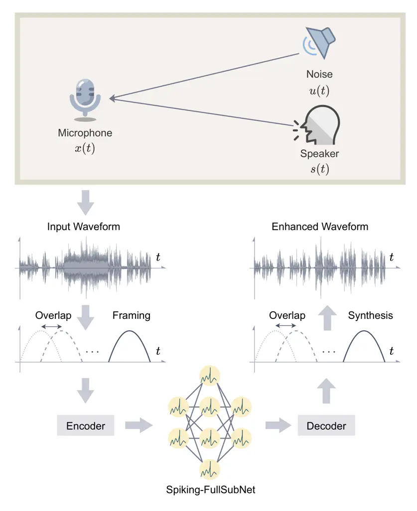
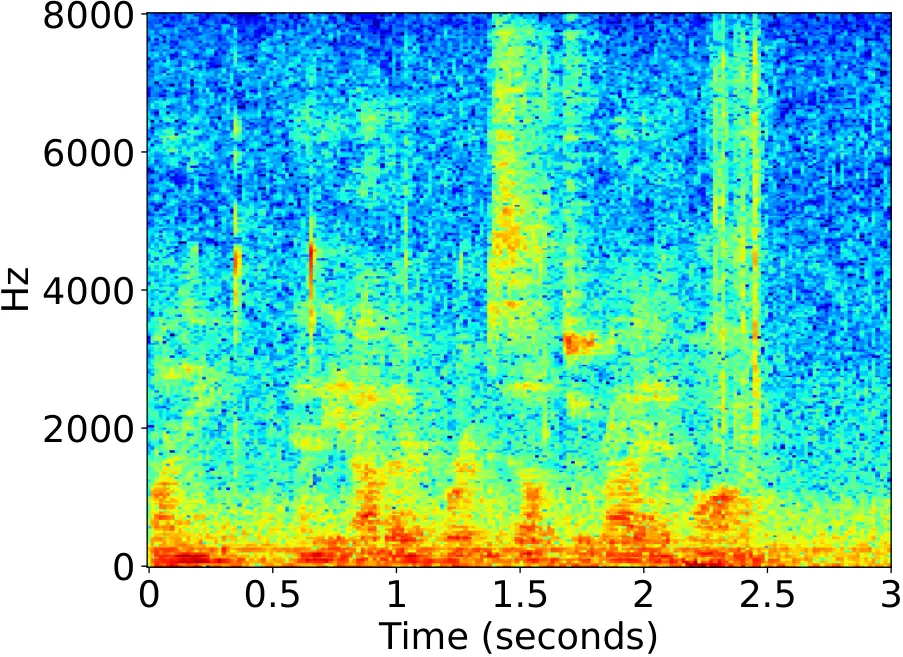
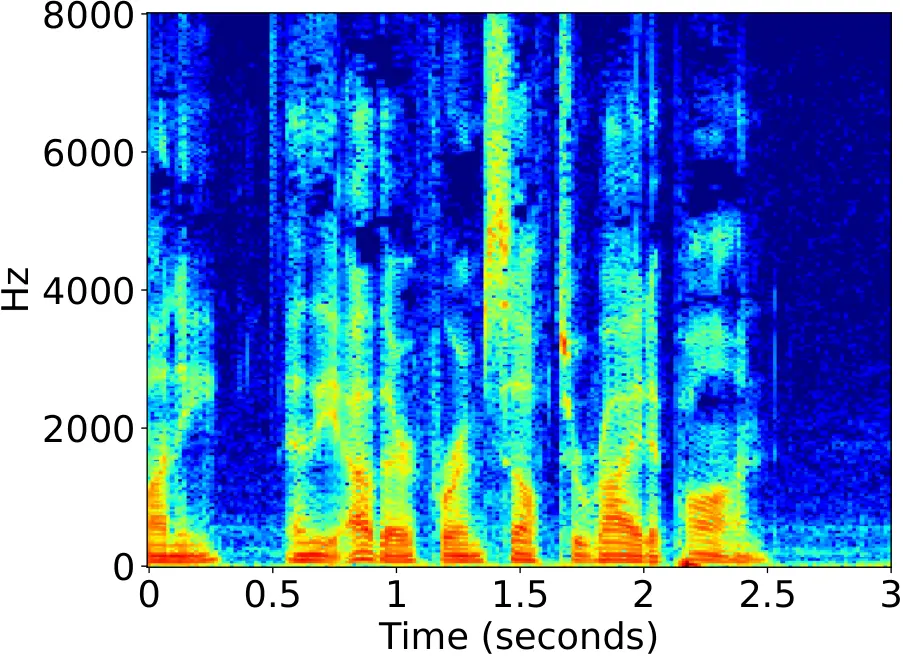
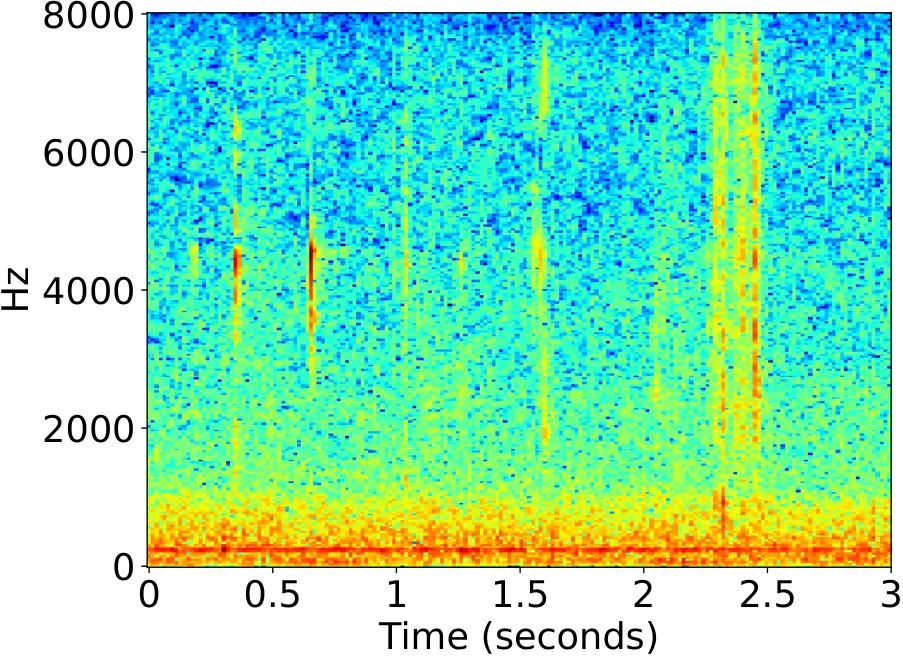
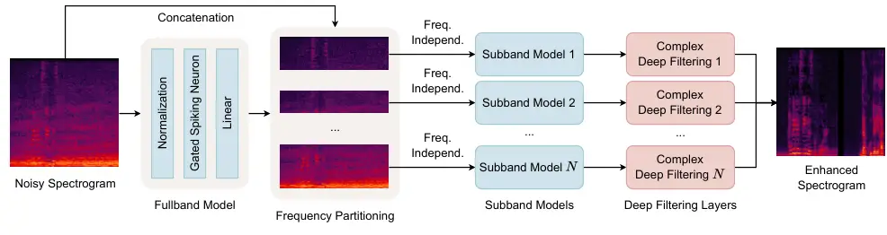
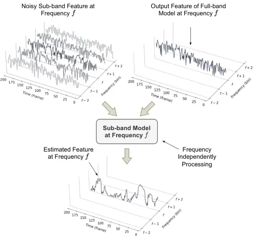
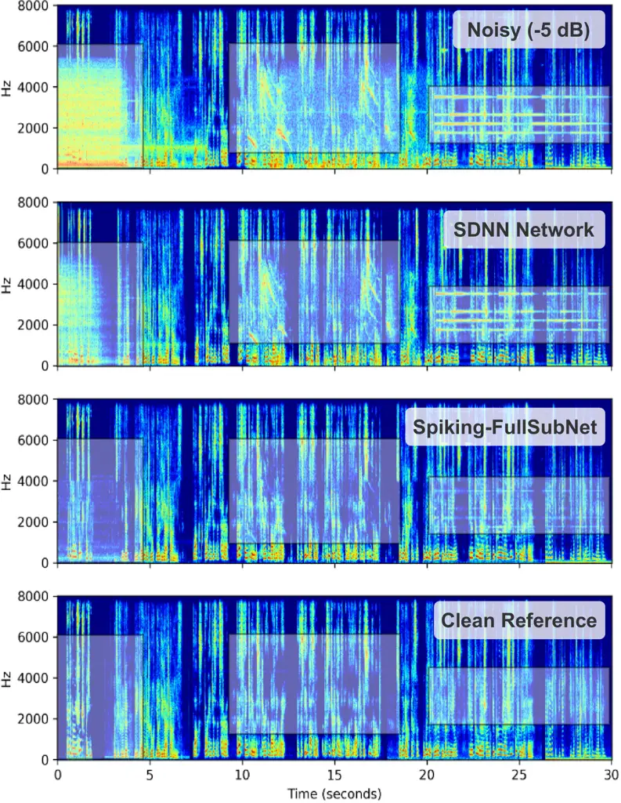
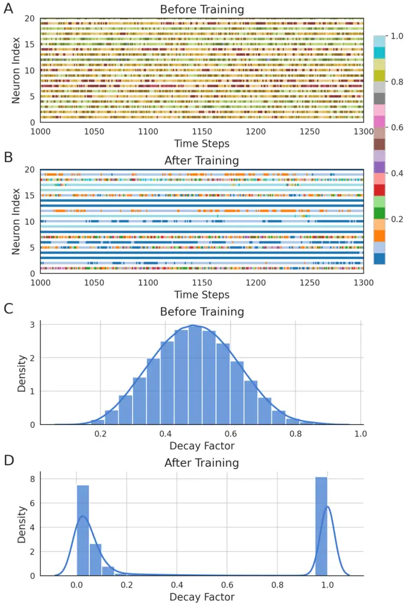

# Towards Ultra-Low-Power Neuromorphic Speech Enhancement with Spiking-FullSubNet

Xiang Hao^(\*)    Chenxiang Ma^(\*)    Qu Yang    Jibin Wu    and
Kay Chen Tan ^(†)^(†)thanks: ^(\*)Xiang Hao and Chenxiang Ma contributed
equally to this work. Corresponding Author: Jibin Wu
(jibin.wu@polyu.edu.hk).^(†)^(†)thanks: Xiang Hao and Chenxiang Ma are
with the Department of Computing, The Hong Kong Polytechnic University,
Hong Kong SAR, China.^(†)^(†)thanks: Kay Chen Tan is with the Department
of Data Science and Artificial Intelligence, The Hong Kong Polytechnic
University, Hong Kong SAR, China.^(†)^(†)thanks: Jibin Wu is with the
Department of Data Science and Artificial Intelligence, and Department
of Computing, The Hong Kong Polytechnic University, Hong Kong SAR,
China.^(†)^(†)thanks: Qu Yang is with the Department of Electrical and
Computer Engineering, National University of Singapore, Singapore.

###### Abstract

Speech enhancement is critical for improving speech intelligibility and
quality in various audio devices. In recent years, deep learning-based
methods have significantly improved speech enhancement performance, but
they often come with a high computational cost, which is prohibitive for
a large number of edge devices, such as headsets and hearing aids. This
work proposes an ultra-low-power speech enhancement system based on the
brain-inspired spiking neural network (SNN) called Spiking-FullSubNet.
Spiking-FullSubNet follows a full-band and sub-band fusioned approach to
effectively capture both global and local spectral information. To
enhance the efficiency of computationally expensive sub-band modeling,
we introduce a frequency partitioning method inspired by the sensitivity
profile of the human peripheral auditory system. Furthermore, we
introduce a novel spiking neuron model that can dynamically control the
input information integration and forgetting, enhancing the multi-scale
temporal processing capability of SNN, which is critical for speech
denoising. Experiments conducted on the recent Intel Neuromorphic Deep
Noise Suppression (N-DNS) Challenge dataset show that the
Spiking-FullSubNet surpasses state-of-the-art methods by large margins
in terms of both speech quality and energy efficiency metrics. Notably,
our system won the championship of the Intel N-DNS Challenge
(Algorithmic Track), opening up a myriad of opportunities for
ultra-low-power speech enhancement at the edge. Our source code and
model checkpoints are publicly available at
[github.com/haoxiangsnr/spiking-fullsubnet](https://github.com/haoxiangsnr/spiking-fullsubnet).

###### Index Terms: 

Speech enhancement, spiking neural network, neuromorphic computing,
neuromorphic speech processing

## I Introduction

Microphones inevitably pick up various interferences from the
surrounding environments, such as ambient noise, which can drastically
degrade the quality of perceived speech signals. This prevalent issue
calls for speech enhancement (SE) techniques in real-world applications
like headsets, hands-free communication, teleconferencing, and hearing
aids \[1, 2\], etc. Furthermore, SE can also benefit a variety of
downstream tasks, such as automatic speech recognition \[3\], speaker
recognition/verification \[4\], and speech diarization \[5\]. It serves
as a crucial front-end processing step to improve the robustness of
these systems against signal degradation.

Early SE methods, such as spectral subtraction \[6\] and Wiener
filtering \[2\], were developed to improve speech signals. However,
these methods often face challenges in real-world conditions,
particularly when dealing with low signal-to-noise ratio (SNR)
scenarios \[7, 8\]. During the last decade, deep learning techniques,
such as Long Short-Term Memory (LSTM) \[9, 10, 11\], Convolutional
Neural Network (CNN) \[12, 13\], and Transformer \[14\], have improved
the SE performance by leaps and bounds \[7, 8\]. While these deep
learning-based SE models offer superior performance, their high
computational cost and latency can be prohibitive for deployment on
ubiquitous resource-constrained edge devices, such as headsets and
hearing aids \[9, 15\].

Recently, brain-inspired Spiking Neural Networks (SNNs) have received
increasing attention as energy-efficient alternatives to the prevailing
deep learning models \[16, 17, 18, 19, 20, 21, 22\]. SNNs employ spike
trains to encode and convey information, closely mimicking the
operations of biological neural networks \[16\]. This spike-based
communication leads to asynchronous, event-driven computation, where
information processing is triggered solely by the arrival of incoming
spikes. Furthermore, spiking neurons exhibit rich neuronal dynamics that
are believed to be crucial for information processing in the
brain \[23\]. This spike-based communication, coupled with the inherent
temporal dynamics of spiking neurons, enables efficient and effective
temporal signal processing using SNNs. Notably, when deployed on
emerging neuromorphic chips, SNN models can yield orders of magnitude
improvements in energy efficiency and reduced latency compared to
conventional artificial neural networks (ANNs) used in deep learning
 \[24, 25, 26\].

The superior energy efficiency, low latency, and ability to effectively
process temporal signals position SNNs as a compelling approach for
performing SE on resource-constrained devices. This potential has been
notably recognized in the recent Intel Neuromorphic Deep Noise
Suppression (N-DNS) Challenge \[27\]. However, the development of
high-performance SNNs for the SE task currently faces several key
challenges. One primary challenge arises from the inherent complexity of
speech signals, which exhibit temporal variations across multiple time
scales. Current SNN models, commonly equipped with simplified spiking
neurons like the Leaky Integrate-and-Fire (LIF) model, often face
difficulties in effectively handling the high temporal complexity
present in speech signals \[28\]. Moreover, achieving state-of-the-art
(SOTA) performance on par with or surpassing conventional ANN systems
while ensuring real-time audio streaming, as required in practical
applications, demands a holistic system design. Such a design
necessitates not only enhanced spiking neuron models, but also the
development of effective enhancement workflows and training techniques
tailored to the unique characteristics of SNNs. To the best of our
knowledge, no existing study has effectively addressed these challenges.

In this work, we introduce a real-time neuromorphic SE system that
demonstrates competitive denoising performance while exhibiting
significantly improved energy efficiency compared to ANN methods. First
of all, drawing inspiration from recent advancements in
deep-learning-based SE research works \[10, 13, 29, 14\], we propose a
novel SNN-based SE model named Spiking-FullSubNet. This model
effectively integrates both full-band and sub-band information, allowing
it to capture both global and local spectral characteristics.
Specifically, the full-band component receives inputs covering the
entire frequency partition, enabling it to capture the global spectral
structure of the speech signal. On the other hand, each sub-band
component focuses exclusively on a specific frequency band, facilitating
effective modeling of local spectral structures. Moreover, to enhance
the computation efficiency of the sub-band components, we introduce a
brain-inspired frequency band partitioning method. Specifically,
motivated by the frequency sensitivity profile of the peripheral
auditory system, we employ a finer granularity for low-frequency bands
and a coarser granularity for high-frequency bands.

Furthermore, we propose a novel spiking neuron model called Gated
Spiking Neuron (GSN) to enhance the temporal signal processing
capability of spiking neurons. Unlike existing spiking neuron models
where input information decays exponentially over time, the GSN model
dynamically controls the integration of input information and the
forgetting of historical information. This unique feature enables the
GSN to identify and retain crucial temporal information that is
essential for speech enhancement. In summary, our main contributions are
threefold:

- •
  We propose Spiking-FullSubNet, a novel real-time neuromorphic SE model
  that combines recent advancements in speech enhancement and
  neuromorphic computing. This cross-disciplinary approach significantly
  enhances both speech enhancement performance and energy efficiency.
- •
  We propose a novel spiking neuron model called GSN. Unlike existing
  spiking neuron models that passively filter input information, the GSN
  model dynamically controls the input information integration and
  forgetting, thereby facilitating effective temporal information
  processing that is critical for speech enhancement.
- •
  We conducted comprehensive experiments on the Intel N-DNS Challenge
  dataset to evaluate the proposed neuromorphic SE model. Our model not
  only demonstrates exceptional speech enhancement capabilities, but
  also showcases a remarkable improvement in energy efficiency,
  surpassing SOTA ANN models by almost three orders of magnitude.



Fig. 1: Block diagram of the proposed real-time neuromorphic speech
enhancement system.

## II Related Works

### II-A Spiking Neuron Model

Among various spiking neuron models introduced in neuroscience \[30,
31\], the Leaky Integrate-and-Fire (LIF) model \[28\] is the most
commonly employed one for constructing large-scale neuromorphic
computing systems. Despite their simplicity, LIF neurons have
limitations in handling temporal signals with complex structures due to
their oversimplified neuronal dynamics. To overcome this limitation,
several new spiking neuron models have been introduced recently. For
example, the parametric LIF (PLIF) model \[32\] incorporates learnable
time constants, allowing historical information to decay at different
rates. The adaptive LIF (ALIF) model \[33\] adjusts the firing threshold
after each spike, effectively achieving firing rate adaptation. This
endows spiking neurons with context-dependent processing capability. In
a similar vein of research, the GLIF model \[34\] selectively regulates
input currents integration, membrane decaying factors, and neuronal
state resetting to enrich neuronal dynamics. These regulations are
achieved through trainable parameters along the temporal dimension.
While the GLIF model exhibits flexibility in temporal processing, it
encounters difficulties when dealing with signals of varying time
lengths. This issue is particularly relevant to the speech enhancement
task addressed in this paper, which involves handling signals with
variable durations.

In addition to incorporating adaptive state variables into spiking
neurons to enhance their temporal processing capability, recent studies
have introduced multi-compartment neuron models. These models aim to
enrich neuronal dynamics by considering the complex morphology of
biological neurons. For instance, the TC-LIF model \[35\] incorporates
two compartments representing soma and dendrites, enabling the
simulation of interactive dynamics between these distinct neuronal
structures. Building upon this concept, PMSN  model\[36\] incorporates
multiple compartments for multi-scale temporal information processing.
However, despite these advancements, existing spiking neuron models
still face challenges in effectively capturing and retaining essential
temporal information, limiting their ability to process signals with
complex temporal structures.

### II-B Speech Enhancement

Speech enhancement aims to improve speech intelligibility and
quality \[6, 2\], which need to remove noise from noisy signals captured
by microphones as shown in Fig. 1. Existing methods can be divided into
time-domain and frequency-domain approaches. Time-domain methods \[37,
38\] directly estimate the clean speech signal, bypassing spectral
analysis and waveform synthesis, while frequency-domain methods \[7, 8,
39, 12, 10, 11\] estimate the spectrogram of the clean speech and then
convert it back to the time-domain signal. Between these two approaches,
frequency-domain methods have received significant research attention,
primarily due to the sparse nature of speech in the frequency domain.
Specifically, they can be broadly categorized into spectral
magnitude-only enhancement and complex spectrum enhancement. Spectral
magnitude-only methods \[7, 8\] focus on estimating the magnitude of the
clean speech spectrum, utilizing the noisy phase for reconstructing the
time-domain signal. On the other hand, complex spectrum enhancement
methods \[39, 12, 10, 11\] estimate both the real and imaginary parts of
the complex spectrum, which have exhibited greater potential in
enhancing speech quality by leveraging the full spectral information.

### II-C Sub-band Modeling in Speech Enhancement

In recent years, there has been a notable shift in research focus
towards the utilization of sub-band modeling in both single-channel and
multi-channel SE \[10, 11, 13, 29, 14\]. In contrast to traditional
full-band modeling, sub-band modeling involves the separation of input
audio into multiple frequency bands, which are then processed
independently. Specifically, each sub-band model takes in a noisy
sub-band signal along with its adjacent frequency bands, and then
predicts the corresponding clean sub-band signal. This method leverages
the distinct stationary characteristics of speech and noise. Speech
signals are inherently non-stationary, exhibiting dynamic and variable
properties over time. Conversely, many types of noise are relatively
stationary, meaning their statistical properties remain more consistent
and stable \[40, 41\]. In addition, sub-band modeling focuses on the
local spectral pattern presented in the current and neighboring
frequencies, which has been proven informative for discriminating
between speech and other signals \[42, 43\]. Furthermore, the sub-band
models are also effective in modeling the reverberation as the room’s
reverberation time (RT60) is frequency-dependent \[44\].

However, the sub-band modeling approach comes with a trade-off. While it
leverages the distinct stationary characteristics of speech and noise,
it can also result in the loss of the global spectral structure of the
speech signal. This global spectral information is also crucial for
effective SE. To address this issue, recent works have proposed a
full-band and sub-band fusion modeling approach \[10, 11, 13, 29, 14\].
In these works, a full-band model and several sub-band models are
combined, allowing them to complement each other and capture both the
local and global spectral information \[13\]. Though these fusion-based
methods have led to significant improvements, sub-band modeling can
still be computationally costly, as it requires processing each
frequency band separately. This poses challenges for real-time edge
applications. In this work, we propose a novel approach that applies
different granularity levels to various frequency sub-bands,
significantly reducing the computational cost while maintaining the
speech enhancement performance.

### II-D Neuromorphic Speech Processing

SNNs have recently emerged as a promising approach for power-efficient
speech processing. Compared to traditional ANNs, SNNs can offer
significant advantages in terms of reduced computational complexity. An
early work \[45\] employs Izhikevich neurons \[30\] as feature
extractors, which are trained using unsupervised
spiking-timing-dependent plasticity (STDP) \[46\] to recognize spoken
digits. Subsequent works \[47, 48\] introduce a SOM-SNN framework that
incorporates a self-organizing map (SOM) for feature representation,
followed by an SNN for pattern classification. Recent studies leverage
deeper SNNs and more advanced learning rules to enhance classification
performance. For instance, deep convolutional SNNs coupled with the
tandem learning rule have achieved significantly improved performance on
keyword spotting tasks \[49, 50\]. Recurrent networks of spiking
neurons (RSNNs) are also exploited for speech recognition \[51, 52\],
holding enhanced memory capacity and bringing improvements over the
feedforward counterparts. These earlier studies focus on small
vocabulary speech recognition tasks. More recently, Wu et al. \[53\]
apply deep SNNs to large vocabulary continuous speech recognition tasks
and demonstrate competitive accuracy compared to ANN-based systems.
Notably, a recent benchmark study \[54\] compared the performance of
neuromorphic keyword spotting systems to ANN-based systems that deployed
on conventional computing hardware. The study evaluated metrics such as
inference speed, energy cost per inference, and dynamic energy
consumption. The findings from this benchmark study suggest that
neuromorphic systems can significantly reduce the energy costs per
inference while maintaining equivalent inference accuracy compared to
their traditional ANN counterparts. However, there is a lack of study of
neuromorphic technologies for the speech denoising task.



(a) Spectrogram of Noisy Speech Signal



(b) Spectrogram of Clean Speech Signal



(c) Spectrogram of Noise Signal

Fig. 2: Time-frequency magnitude spectrogram of different signals. The
speech enhancement methods aim at recovering a clean speech from a noisy
observation by removing the unwanted noise.

## III Background

### III-A Spiking Neuron Model

The most commonly used spiking neuron model is the leaky
integrated-and-fire (LIF) neuron \[28\]. This model is favorable in
terms of computational complexity and analytical tractability. The LIF
neuron maintains an internal state known as the membrane potential,
which decays over time at a rate determined by the time constant
$`\tau`$. Meanwhile, the neuron integrates the input current. When the
membrane potential surpasses the predefined threshold $`\vartheta`$, an
output spike is generated and transmitted to downstream neurons. This is
then followed by a resetting process, where the membrane potential is
reset to a specific value. Such neuronal dynamics can be described by
the following discrete-time formulation:

```math
\bm{i}^{l}(t)=\bm{W}^{l}_{mn}\bm{o}^{l-1}(t)+\bm{W}^{l}_{nn}\bm{o}^{l}(t-1)+\bm{b}^{l} \tag{1}
```

```math
\bm{u}^{l}(t)=\lambda\bm{u}^{l}(t-1)+\bm{i}^{l}(t) \tag{2}
```

```math
o_{i}^{l}(t)=\Theta(u_{i}^{l}(t)-\vartheta)=\begin{cases}1&u_{i}^{l}(t)>=\vartheta\\
0&\text{otherwise}\end{cases} \tag{3}
```

```math
\bm{u}^{l}(t)=\bm{u}^{l}(t)-\vartheta\bm{o}^{l}(t) \tag{4}
```

where $`\bm{W}^{l}_{mn}`$ and $`\bm{W}^{l}_{nn}`$ denote the
feed-forward and recurrent weight matrices at the $`l^{th}`$ layer,
respectively, $`\lambda=\exp(-1/\tau)`$ controls the decay rate of the
membrane potential $`\bm{u}^{l}(t)`$, $`\bm{i}^{l}(t)`$ represents the
input current, and $`\bm{b}^{l}`$ is the bias term.

### III-B Formulation of Speech Enhancement

In a typical acoustic environment, as depicted in Fig. 1, the input to a
speech enhancement system is a time-varying waveform that undergoes
continuous sampling and quantization. The signal captured by the
microphone can be represented as

```math
x(t)=s(t)+u(t)\quad{t=1,2,\ldots,T}, \tag{5}
```

where $`s(t)`$ refers to the clean speech signal and $`u(t)`$ denotes a
mixture of noise sources. Most mainstream methods \[12, 55, 56, 10, 39\]
avoid directly enhancing the time-domain signal due to its high
non-stationarity and the subsequent analytical challenges. Consequently,
the STFT of the microphone signal can be expressed as

```math
x(n,f)=s(n,f)+u(n,f), \tag{6}
```

where $`n=1,2,\ldots,N`$ and $`f=1,2,\ldots,F`$ represent the time-frame
and the frequency-bin indexes, respectively. For a speech enhancement
model, the input feature to the model is $`x(n,f)`$, with its
time-frequency (TF) magnitude spectrogram depicted in Fig. 2(a). The
goal is to eliminate unwanted noise, which can be defined as
$`\hat{s}(n,f)`$, with its magnitude spectrogram shown in Fig. 2(b). The
noise reference is $`u(n,f)`$, as shown in Fig. 2(c).

## IV Method

In this section, we elaborate on the proposed Spiking-FullSubNet model,
as depicted in Fig. 3. Firstly, we introduce a novel spiking neuron
model called GSN, specifically designed for speech processing. Next, we
present the approach of full-band and sub-band fusion for speech
denoising that we have adopted in this work. Lastly, we introduce the
model training details.



Fig. 3: Diagram of the proposed Spiking-FullSubNet architecture. The
architecture integrates a full-band model and sub-band models, with
gated spiking neurons serving as the core of each model, to effectively
enhance noisy speech signals. The full-band model operates on the noisy
magnitude spectrogram to capture global spectral patterns, while the
sub-band components focus on specific frequency bands to effectively
model local spectral information. By incorporating newly proposed GSNs
into both the full-band and sub-band models, the temporal processing
capability is greatly improved. Finally, deep filtering is employed as
the training target to obtain the enhanced spectrogram.

### IV-A Gated Spiking Neuron

For speech enhancement, the objective is to remove unwanted noises from
audio recordings. These noises can originate from various sources, such
as background sounds, microphone interference, or transmission
distortions, and their signal intensity varies over time. Due to its
constant membrane decay rate, the commonly-used LIF model \[28\] cannot
handle these dynamic changes. In these scenarios, the LIF neuron
encounters two challenges. It might struggle to filter out noise during
periods of high noise intensity effectively, or it may excessively
filter informative audio signals during periods of low noise intensity.
These challenges occur as the fixed decay factor either cannot provide
sufficient attenuation of the noisy signal, resulting in inadequate
enhancement or decays the neuron’s potential too quickly, leading to a
loss of desired audio contents.

A straightforward solution is to adopt different decay factors at each
time step, allowing flexible adaptation to the changing noise levels in
the input audio signals. However, this would introduce a huge number of
parameters, especially for long time duration. Moreover, it would not
work well for audio signals with a variable time duration, which are
commonly encountered in SE tasks \[15\]. To address this issue, we
propose a novel spiking neuron model called GSN that regulates the decay
rate at each time step in an input-dependent manner. The input-dependent
decay in our GSN is implemented by modeling the decay as a function of
both feed-forward and recurrent input spikes, as shown in Fig. 4. A
sigmoid function $`\sigma(\cdot)`$ is applied to constrain the decay
rate within the range of $`0`$ to $`1`$. The corresponding membrane
potential dynamics are formally expressed as:

```math
\bm{i}^{l}(t)=\bm{W}^{l}_{mn}\bm{o}^{l-1}(t)+\bm{W}^{l}_{nn}\bm{o}^{l}(t-1)+\bm{b}^{l}, \tag{7}
```

```math
\bm{\lambda}^{l}(t)=\sigma(\bm{W}^{l}_{mn}\bm{o}^{l-1}(t)+\bm{W}^{l}_{nn}\bm{o}^{l}(t-1)+\bm{\widetilde{b}}^{l}), \tag{8}
```

```math
\bm{u}^{l}(t)=\bm{\lambda}^{l}(t)\bm{u}^{l}(t-1)+(1-\bm{\lambda}^{l}(t))\bm{i}^{l}(t). \tag{9}
```

In order to save model parameters and reduce overall computation, we
employ weight-sharing by using the same weight matrices, denoted as
$`\bm{W}^{l}_{mn}`$ and $`\bm{W}^{l}_{nn}`$, in Eqs. (7) and (8).
Notably, the GSN model can adaptively modulate the neuron’s membrane
potential along the temporal dimension while avoiding the need for a
large number of parameters associated with the total time steps.
Additionally, GSN bears a resemblance to the forget gate widely used as
a critical component of the LSTM architecture \[57\]. However, this
temporal gating mechanism has been underexplored in existing spiking
neuron models.

Fig. 4: Illustration of the proposed GSN model, which regulates the
membrane decay rate at each time step based on the feedforward and
recurrent inputs.

### IV-B Spiking-FullSubNet Architecture

Based on the GSN model introduced in Section IV-A, we further develop
the Spiking-FullSubNet that can achieve high-performance real-time
speech enhancement. Spiking-FullSubNet exploits full-band and sub-band
modeling to capture both global (long-distance cross-band dependencies)
and local (signal stationarity differences) spectral patterns,
respectively. Notably, we propose to employ varying processing
granularity for different frequency partitions, mimicking human auditory
perception, to enhance the model’s processing efficiency.

#### IV-B1 Full-Band Processing

The full-band model operates on magnitude spectral features extracted
from the noisy speech signal. The input feature vector $`\mathbf{x}(n)`$
on audio frame $`n`$ is given by

```math
\mathbf{x}(n)=\left[|x(n,1)|,|x(n,2)|,\dots,|x(n,F)|\right]^{\top}\in\mathbb{R}^{F}, \tag{10}
```

where $`F`$ denotes the total number of frequency bins, $`x(n,f)`$
represents the complex Fourier coefficient of the frame $`n`$ and
frequency bin $`f`$, and $`|\cdot|`$ denotes extracting the magnitude of
the complex Fourier coefficient. The sequence of feature vectors across
all frames is denoted by $`\mathbf{X}`$:

```math
\mathbf{X}=\left[\mathbf{x}(1),\mathbf{x}(2),\dots,\mathbf{x}(T)\right]\in\mathbb{R}^{T\times F}, \tag{11}
```

where $`T`$ is the total number of discrete time frames. We stack GSNs
to process $`\mathbf{X}`$ by capturing both the global spectral content
and the interactions between frequency bins, yielding a spectral
embedding $`\mathbf{E}`$ of the same dimensions as $`\mathbf{X}`$, i.e.,
$`\mathbf{E}\in\mathbb{R}^{T\times F}`$.



Fig. 5: Illustration of the sub-band processing in Spiking-FullSubNet.
The input is a vector $`\mathbf{x}_{f}(n)`$ comprising the magnitude bin
of frequency $`f`$, its $`4`$ neighboring frequency bins, and the
corresponding bin in spectral embedding output from the full-band model.

#### IV-B2 Existing Sub-Band Processing Approach

The sub-band models process each frequency band independently, focusing
on the stationarity differences between the speech and noise, local
spectral patterns, and reverberation characteristics \[10, 13\]. As
shown in Fig. 5, for a given time $`n`$ at frequency $`f`$, the input to
the sub-band model is a vector $`\mathbf{x}_{f}(n)`$ comprising the
noisy magnitude bin at frequency $`f`$, its $`2\times N`$ neighboring
frequency bins, and the corresponding bin in spectral embedding output
by the full-band model:

```math
\begin{split}\mathbf{x}_{f}(n)=&[\underbrace{|x(n,f-N)|,\ldots,|x(n,f-1)|}_{\text{Lower neighboring frequencies}},\\
&|x(n,f)|,\mathbf{E}(n,f),\\
&\underbrace{|x(n,f+1)|,\dots,|x(n,f+N)|}_{\text{Higher neighboring frequencies}}]^{\top}.\end{split} \tag{12}
```

This frequency-independent processing is inspired by the conventional
signal processing-based noise reduction algorithms, such as noise
density estimation and wiener filter \[2\]. It allows for a detailed
analysis of the signal’s local spectral pattern and stationarity.
Experimental evidence supports the effective integration of a full-band
model and a sub-band model within a single framework \[10\]. However,
the computational challenge for the existing full-band and sub-band
modeling methods lies in their sub-band part, which processes each
sub-band at the same granularity. This approach contrasts with the human
auditory system, which is more sensitive to low-frequency sound and less
sensitive to high-frequency sound \[58\]. Motivated by human auditory
perception, we introduce a frequency partitioning technique that applies
different processing granularity across the frequency bands to address
this issue.

#### IV-B3 Sub-Band Processing Based on Frequency Partitioning

To account for the varying perceptual importance of different frequency
bins, the input magnitude spectral is divided into $`K`$ non-overlapping
frequency partitions:

```math
\mathcal{P}=\{\mathcal{P}_{1},\mathcal{P}_{2},\dots,\mathcal{P}_{K}\}\quad\text{where}\quad\sum_{k=1}^{K}|\mathcal{P}_{k}|=F, \tag{13}
```

where $`|\cdot|`$ is the size of the frequency partition set. Each
frequency partition $`\mathcal{P}_{k}`$ is defined by a set of
contiguous discrete frequency bins, thereby covering the entire
frequency spectrum. The lowest frequency partition $`\mathcal{P}_{1}`$
includes the indices of the discrete frequency bins
$`\{1,\dots,f_{c_{1}}\}`$, where $`f_{c_{1}}`$ is the cutoff frequency
for this first partition. Each subsequent partition $`\mathcal{P}_{k}`$
for $`k=2,\dots,K-1`$ starts from the cutoff frequency of the previous
partition $`f_{c_{k-1}}+1`$ and extends up to its own cutoff frequency
$`f_{c_{k}}`$. The final partition $`\mathcal{P}_{K}`$ contains
frequencies from $`f_{c_{K-1}}+1`$ to the upper limit $`F`$. This
partitioning can be formally expressed as

```math
\begin{split}\mathcal{P}_{1}&=\{1,\dots,f_{c_{1}}\},\\
\mathcal{P}_{k}&=\{f_{c_{k-1}}+1,\dots,f_{c_{k}}\}\quad\text{for}\quad k=2,\dots,K-1,\\
\mathcal{P}_{K}&=\{f_{c_{K-1}}+1,\dots,F\}.\end{split} \tag{14}
```

For each frequency partition $`\mathcal{P}_{k}`$, the Spiking-FullSubNet
model adjusts the processing granularity by setting a grouping parameter
$`g_{k}`$ that dictates how many discrete frequency bins to be processed
jointly in the sub-band model. Specifically, for each frequency
partition $`\mathcal{P}_{k}`$, we process groups of $`g_{k}+1`$ adjacent
discrete frequency bins, along with a context window of $`N`$ bins on
either side, and the corresponding embedding vector output by the
full-band model:

```math
\begin{split}\mathbf{x}_{f}^{k}(n)=&[\underbrace{|x(n,f-N)|,\dots,|x(n,f-1)|}_{\text{Lower neighboring frequencies}},\\
&|x(n,f)|,|x(n,f+1)|,\dots,|x(n,f+g_{k})|,\\
&\mathbf{E}(n,f),\mathbf{E}(n,f+1),\dots,\mathbf{E}(n,f+g_{k}),\\
&\underbrace{|x(n,f+g_{k}+1)|,\dots,|x(n,f+g_{k}+N)|}_{\text{Higher neighboring frequencies}}]^{\top},\end{split} \tag{15}
```

where $`\mathbf{x}_{f}^{k}(n)`$ is the grouped feature vector for the
$`k^{th}`$ frequency partition at time frame $`n`$, and $`f`$ is the
starting frequency bin of the group within the partition
$`\mathcal{P}_{k}`$. The value of $`f`$ ranges from the lower bound of
$`\mathcal{P}_{k}`$ to an upper bound, ensuring the group of $`g_{k}+1`$
bins is within the partition. The grouping parameter $`g_{k}`$ allows
for a flexible adjustment of the sub-band resolution and computational
complexity within each sub-band. For lower frequency partitions, where
finer sub-band resolution is often more important for speech perception,
$`g_{k}`$ may be set to a smaller value. Conversely, for higher
frequency intervals, $`g_{k}`$ may be larger, reflecting the reduced
perceptual importance of spectral details and allowing for reduced
computational cost. This frequency partition processing strategy enables
the Spiking-FullSubNet model to efficiently handle the spectral
information with varying resolution across the frequency spectrum, which
is more aligned with the non-uniform frequency resolution of human
hearing.

### IV-C Learning Target

Conventional speech enhancement methods work within the Short-Time
Fourier Transform (STFT) domain \[7, 8\]. The typical methodology
involves the estimation of time-frequency (TF) masks via neural
networks, which are then applied element-wise to the complex STFT of the
noisy speech mixture to extract the enhanced signal. However, the
performance of this methodology will degrade if the frequency resolution
gets too low \[59\]. Recently, multi-frame deep filtering (MFDF) \[59\]
in the frequency domain has been proposed, where a filter is applied to
multiple adjacent TF bins, enabling recovery of degraded signals like
notch-filters or time-frame zeroing.

The proposed Spiking-FullSubNet estimates a complex-valued MFDF filter
for each TF bin within the STFT domain. We set the filter length (order)
$`d_{k}`$ for input within the $`k^{th}`$ frequency partition and define
the noisy multi-frame vector of the $`\mathbf{x}_{f}^{k}(n)`$ for the
$`k^{th}`$ frequency partition as

```math
\begin{split}&\mathbf{\overline{x}}_{f}^{k}(n)=\\
&\begin{bmatrix}x(n,f)&x(n-1,f)&\ldots&x(n-d_{k},f)\\
x(n,f+1)&x(n-1,f+1)&\ldots&x(n-d_{k},f+1)\\
\vdots&\vdots&\ddots&\vdots\\
x(n,f+g_{k})&x(n-1,f+g_{k})&\ldots&x(n-d_{k},f+g_{k})\end{bmatrix},\end{split} \tag{16}
```

which includes only the streaming historical frames, thereby avoiding
the introduction of future latency. For the noisy multi-frame input
$`\mathbf{x}_{f}^{k}(n)`$, the output complex-valued MFDF filter is

```math
\begin{split}&\mathbf{\overline{w}}_{f}^{k}(n)=\\
&\begin{bmatrix}w_{0}(f)&w_{1}(f)&\ldots&w_{d_{k}}(f)\\
w_{0}(f+1)&w_{1}(f+1)&\ldots&w_{d_{k}}(f+1)\\
\vdots&\vdots&\ddots&\vdots\\
w_{0}(f+g_{k})&w_{1}(f+g_{k})&\ldots&w_{d_{k}}(f+g_{k})\end{bmatrix}.\end{split} \tag{17}
```

The application of the MFDF is then expressed as

```math
\begin{split}\hat{\mathbf{s}}_{f}^{k}(n)&=\sum_{j}\left(\mathbf{\overline{w}}_{f}^{k}(n)\odot\mathbf{\overline{x}}_{f}^{k}(n)\right)_{ij}\\
&=[\hat{s}(n,f),\hat{s}(n,f+1),\ldots\hat{s}(n,f+g_{k})]^{\top},\end{split} \tag{18}
```

where $`\odot`$ denotes the complex-valued hadamard product,
$`\hat{\mathbf{s}}_{f}^{k}(n)`$ is the enhanced counterpart, and
$`\sum_{j}(\cdot)_{ij}`$ means the sum by rows. Our Spiking-FullSubNet
model accommodates variable deep filtering orders across different
frequency partitions. Lower frequencies, which exhibit stronger temporal
correlations, are processed with a higher deep filtering order, allowing
the network to capture more complex temporal structures. In contrast,
higher frequencies characterized by weaker temporal correlations are
processed with a lower deep filtering order. This approach promotes
computational efficiency without sacrificing the resolution of critical
spectral details, thus maintaining the integrity of the speech signal.

### IV-D Loss Function and SNN training

Inspired by Braun et al. \[60\], we use a linear combination of
magnitude loss $`\mathcal{L}_{\text{Mag.}}`$ and complex loss
$`\mathcal{L}_{\text{RI}}`$ in the TF-domain:

```math
\displaystyle\mathcal{L}_{\text{TF}}= \displaystyle\alpha\,\mathcal{L}_{\text{Mag.}}+(1-\alpha)\,\mathcal{L}_{\text{RI}}, \tag{19}
```

```math
\displaystyle\mathcal{L}_{\text{Mag.}}= \displaystyle\mathbb{E}_{s,\hat{s}}\big[\|s(n,f)-\hat{s}(n,f)\|^{2}\big],
```

```math
\displaystyle\mathcal{L}_{\text{RI}}= \displaystyle\mathbb{E}_{s_{r},\hat{s}_{r}}\big[\|s_{r}(n,f)-\hat{s}_{r}(n,f)\|^{2}\big]
```

```math
\displaystyle+\mathbb{E}_{s_{i},\hat{s}_{i}}\big[\|s_{i}(n,f)-\hat{s}_{i}(n,f)\|^{2}\big],
```

where $`\alpha`$ is a hyperparameter to balance the contribution from
two losses. Moreover, an additional penalization on the waveform
features is proven to help improve the speech quality \[61\]. In our
model, we use the Scale-Invariant Signal-to-Distortion Ratio
(SI-SDR) \[62\] loss function, which is computed directly in the time
domain and forces the model to learn how to precisely estimate the
magnitude and the phase of the target speech signals:

```math
\mathcal{L}_{\text{SI-SDR}}=-10\log_{10}\left(\frac{\|\frac{\hat{\mathbf{s}}^{T}\mathbf{s}}{\|\mathbf{s}\|^{2}}\mathbf{s}\|^{2}}{\|\frac{\hat{\mathbf{s}}^{T}\mathbf{s}}{\|\mathbf{s}\|^{2}}\mathbf{s}-\hat{\mathbf{s}}\|^{2}}\right). \tag{20}
```

The final loss function is formulated as follows:

```math
\mathcal{L}=\gamma_{1}\,\mathcal{L}_{\text{TF}}+\gamma_{2}\,(100-\mathcal{L}_{\text{SI-SDR}}), \tag{21}
```

where $`\gamma_{1}`$ and $`\gamma_{2}`$ are the weights of the
corresponding losses.

With the established loss function, the Spiking-FullSubNet model can
thus be trained end-to-end using backpropagation through time
(BPTT) \[63\]. However, BPTT cannot be directly used since the gradient
of the spike generation function is zero almost everywhere except for
the firing threshold, where it is infinity. To address this issue, we
adopt a surrogate gradient to circumvent the non-differentiability
issue \[64, 65\], formulated by

```math
\frac{\partial o_{i}^{l}(t)}{\partial u_{i}^{l}(t)}=\max\left(0,~1-|u_{i}^{l}(t)-\vartheta|\right). \tag{22}
```

## V Experimental Setup

In this section, we evaluate the proposed Spiking-FullSubNet on the
publicly available speech enhancement dataset. Our study focuses on both
the audio quality and energy efficiency metrics that are critical for
edge devices.

### V-A Intel N-DNS Challenge Dataset for Speech Enhancement

We utilize the publicly available Intel N-DNS Challenge dataset \[27\]
for the speech enhancement performance evaluation. This comprehensive
dataset contains a wide array of human speech audio samples in multiple
languages, including English, German, French, Spanish, and Russian, as
well as several noise categories. The official Intel N-DNS Challenge
repository provides a synthesizer script that generates clean (ground
truth), noise (additive), and noisy (ground truth plus noise) audio
segments for both training and validation. For testing, the challenge
has officially released a large test set for a fair performance
comparison. With this official synthesizer script, we synthesize two
subsets: a 495-hour subset for training and a 5-hour subset for
validation. All audio samples, synthesized at a sampling rate of 16 kHz,
are kept at a consistent duration of 30 seconds. For audios shorter than
30 seconds, we concatenate them with other speech signals from the same
speaker, inserting a 0.2-second silence interval between clean speech
utterances. The noisy audio is simulated using randomly selected speech
and noise data, with SNRs ranging from -5 to 20 dB. We apply loudness
normalization to each noisy audio sample to simulate agnostic input
loudness levels from -35 to -15 decibels relative to full scale (dBFS).
For audio quality evaluation, we employ the metrics specified by the
Intel N-DNS Challenge, which include SI-SDR \[62\], and Deep Noise
Suppression Mean Opinion Score (DNSMOS) \[66\]. We also employ the power
consumption metrics that will be introduced in Section V-B.

### V-B Power Consumption Measurement

The power consumption of a neuromorphic system is roughly proportional
to the total number of computational primitives used, including synaptic
operations (SynOPs) and neuron operations (NeuronOPs) \[25, 27\]. Based
on the power estimation conducted on the Intel Loihi architecture, which
indicates that the energy consumed by one NeuronOP is approximately
equivalent to that of about $`10\times\text{SynOPs}`$ \[27\], we derive
the power consumption proxy $`P_{\text{proxy}}`$ using the following
formula:

```math
P_{\text{proxy}}=\text{SynOPs}+10\times\text{NeuronOPs}, \tag{23}
```

```math
\text{SynOPs}=\sum_{l=1}^{L-1}\sum_{i=1}^{\mathcal{N}^{l}}\mathcal{R}_{i}^{l}(\mathcal{N}^{l+1}+\mathcal{N}^{l}), \tag{24}
```

```math
\text{NeuronOPs}=\sum_{l=1}^{L}\mathcal{N}^{l}, \tag{25}
```

where $`\mathcal{R}_{i}^{l}`$ denotes the firing rate of neuron $`i`$ in
layer $`l`$, $`\mathcal{N}^{l}`$ represents the number of neurons in
layer $`l`$, and $`L`$ is the total number of layers in the network. Eq.
(24) is formulated based on the recurrent neural network architecture,
encompassing both feedforward ($`\mathcal{N}^{l+1}`$) and recurrent
outputs ($`\mathcal{N}^{l}`$).

We also utilize the power delay product (PDP) metric \[25, 27\], which
consolidates latency and power consumption into a single metric, to
assess and compare different systems with distinct focuses on speed and
power efficiency. The PDP proxy $`\text{PDP}_{\text{proxy}}`$ is defined
by

```math
\text{PDP}_{\text{proxy}}=P_{\text{proxy}}\times\text{Latency}. \tag{26}
```

For the computational costs of Multiply-ACcumulate (MAC) and ACcumulate
(AC) operations employed for SynOPs and NeuronOPs respectively, we refer
to the findings presented in \[67\]. These findings indicate that with
$`45nm`$ CMOS technology, one floating-point MAC operation consumes
$`4.6pJ`$ of energy while one AC operation consumes $`0.9~pJ`$.

### V-C Implementation Details

All speech audio data are processed at a sampling rate of 16 kHz. The
STFT is set up with a window length of 32 ms (512 samples) and a hop
length of 8 ms (128 samples), utilizing a Hanning window and comprising
512 FFT frequency bins. The proposed Spiking-FullSubNet takes the
magnitude spectrogram as its input. We utilize the AdamW
optimizer \[68\] with a learning rate of $`1\times 10^{-3}`$ and set the
gradient norm clipping to 10. In the loss function $`\mathcal{L}`$, the
weights of different terms are set to
$`\alpha=0.5,\gamma_{1}=0.5,\gamma_{2}=0.001`$. We set the number of
neighboring frequency bins to 15. To further improve energy efficiency,
we add the total number of synaptic operations into the loss function to
penalize excessive firing. We develop different variants of the
Spiking-FullSubNet with varying model sizes, detailed in Table III.
These variants differ in aspects, including the granularity of frequency
partitioning and the order of deep filtering.

We divide all discrete frequency bins based on the study of human
auditory perception \[69, 69\] to see the effects of frequency
partitioning configuration on denoising performance and model
efficiency. The fundamental frequency, a crucial characteristic of
speech signals, extends up to 1 kHz. Therefore, we group the lowest 32
discrete frequency bins, corresponding to $`0\sim 1`$ kHz, applying the
smallest grouping size within this range. Then, given that the human
voice’s most significant content lies between $`1\sim 4`$ kHz, a range
particularly sensitive for the human auditory system and rich in
harmonic structures, we group the following 96 discrete frequency bins,
equivalent to $`1\sim 4`$ kHz, with uniform processing granularity in
this range. Lastly, we group the remaining high-frequency bins, 128
discrete frequency bins corresponding to $`4\sim 8`$ kHz, as a separate
group. These high-frequency bins have a more minor impact on human
auditory perception, allowing for coarser granularity in processing. In
summary, we establish three frequency partitions: $`0\sim 1`$ kHz,
$`1\sim 4`$ kHz, and $`4\sim 8`$ kHz, each tailored to optimize
computational efficiency and performance based on human auditory
characteristics. Additional implementation details can be found in our
open-source code repository.

|                                                                                                                                                                                                                                                         |               |                            |                        |         |                       |      |      |                          |       |                              |                            |                              |                     |
| ------------------------------------------------------------------------------------------------------------------------------------------------------------------------------------------------------------------------------------------------------- | ------------- | -------------------------- | ---------------------- | ------- | --------------------- | ---- | ---- | ------------------------ | ----- | ---------------------------- | -------------------------- | ---------------------------- | ------------------- |
| Entry                                                                                                                                                                                                                                                   | Year / (Rank) | SI-SNR ($`\uparrow`$) (dB) | SI-SNRi ($`\uparrow`$) |         | DNSMOS ($`\uparrow`$) |      |      | Latency ($`\downarrow`$) |       | Power Proxy ($`\downarrow`$) | PDP Proxy ($`\downarrow`$) | Energy Cost ($`\downarrow`$) | Param Count         |
|                                                                                                                                                                                                                                                         |               |                            | data                   | enc+dec | OVR                   | SIG  | BAK  | enc+dec                  | total |                              |                            |                              |                     |
|                                                                                                                                                                                                                                                         |               |                            | (dB)                   | (dB)    |                       |      |      | (ms)                     | (ms)  | (Ops/s)                      | (Ops)                      | ($`J`$)                      | ($`\times 10^{3}`$) |
| Noisy (Unproc.)                                                                                                                                                                                                                                         | \-            | 7.37                       | \-                     | \-      | 2.43                  | 3.16 | 2.69 | \-                       | \-    | \-                           | \-                         | \-                           | \-                  |
| Official Intel N-DNS Challenge baseline systems. The results are directly quoted from the Intel N-DNS official repository¹¹ 1 [https://github.com/IntelLabs/IntelNeuromorphicDNSChallenge](https://github.com/IntelLabs/IntelNeuromorphicDNSChallenge). |               |                            |                        |         |                       |      |      |                          |       |                              |                            |                              |                     |
| Microsoft NsNet2 \[70\]                                                                                                                                                                                                                                 | 2023          | 11.63                      | 4.26                   | 4.26    | 2.95                  | 3.26 | 3.93 | 0.02                     | 20.02 | 136.13 M                     | 2.72 M                     | 12.51 $`\mu`$                | 2681                |
| Intel DNS Network \[27\]                                                                                                                                                                                                                                | 2023          | 12.51                      | 5.14                   | 5.14    | 3.08                  | 3.34 | 4.07 | 0.02                     | 32.02 | \-                           | \-                         | \-                           | 1901                |
| SDNN Network \[27\]                                                                                                                                                                                                                                     | 2023          | 12.26                      | 4.89                   | 4.89    | 2.70                  | 3.20 | 3.45 | 0.02                     | 32.02 | 14.52 M                      | 0.46 M                     | 0.41 $`\mu`$                 | 525                 |
| State-of-the-art real-time ANN baselines, which are adapted from their official code repositories and trained on the Intel N-DNS Challenge dataset.                                                                                                     |               |                            |                        |         |                       |      |      |                          |       |                              |                            |                              |                     |
| DCCRN²² 2 [https://github.com/huyanxin/DeepComplexCRN](https://github.com/huyanxin/DeepComplexCRN) \[12\]                                                                                                                                               | 2021          | 12.46                      | 5.09                   | 5.09    | 2.85                  | 3.11 | 3.77 | 0.02                     | 20.02 | 5.07 G                       | 0.10 G                     | 0.46 $`m`$                   | 1247                |
| FullSubNet³³ 3 [https://github.com/Audio-WestlakeU/FullSubNet](https://github.com/Audio-WestlakeU/FullSubNet) \[10\]                                                                                                                                    | 2022          | 13.55                      | 6.18                   | 6.18    | 2.93                  | 3.22 | 3.84 | 0.03                     | 32.03 | 3.65 G                       | 0.12 G                     | 0.55 $`m`$                   | 1141                |
| Fast FullSubNet³³ 3 [https://github.com/Audio-WestlakeU/FullSubNet](https://github.com/Audio-WestlakeU/FullSubNet) \[11\]                                                                                                                               | 2023          | 13.88                      | 6.51                   | 6.51    | 2.91                  | 3.24 | 3.82 | 0.03                     | 32.03 | 0.49 G                       | 0.02 G                     | 0.09 $`m`$                   | 1141                |
| CMGAN⁴⁴ 4 [https://github.com/ruizhecao96/CMGAN](https://github.com/ruizhecao96/CMGAN) \[39\]                                                                                                                                                           | 2024          | 14.01                      | 6.64                   | 6.64    | 2.81                  | 3.23 | 3.84 | 0.02                     | 20.02 | 15.94 G                      | 0.32 G                     | 1.47 $`m`$                   | 1413                |
| Intel N-DNS Challenge top-ranking systems. The results are directly quoted from the Intel N-DNS official repository¹¹ 1 [https://github.com/IntelLabs/IntelNeuromorphicDNSChallenge](https://github.com/IntelLabs/IntelNeuromorphicDNSChallenge).       |               |                            |                        |         |                       |      |      |                          |       |                              |                            |                              |                     |
| CTDNN LAVADL¹¹ 1 [https://github.com/IntelLabs/IntelNeuromorphicDNSChallenge](https://github.com/IntelLabs/IntelNeuromorphicDNSChallenge)                                                                                                               | rank 2        | 13.52                      | 6.59                   | 6.59    | 2.97                  | 3.32 | 3.86 | 0.00                     | 32.00 | 61.37 M                      | 1.96 M                     | 1.76 $`\mu`$                 | 905                 |
| Sparsity SDNN¹¹ 1 [https://github.com/IntelLabs/IntelNeuromorphicDNSChallenge](https://github.com/IntelLabs/IntelNeuromorphicDNSChallenge)                                                                                                              | rank 3        | 12.16                      | 4.80                   | 4.80    | 2.70                  | 3.19 | 3.46 | 0.01                     | 32.01 | 9.32 M                       | 0.30 M                     | 0.27 $`\mu`$                 | 344                 |
| PSNN¹¹ 1 [https://github.com/IntelLabs/IntelNeuromorphicDNSChallenge](https://github.com/IntelLabs/IntelNeuromorphicDNSChallenge)                                                                                                                       | rank 4        | 12.32                      | 4.96                   | 4.96    | 2.68                  | 2.91 | 3.96 | 0.00                     | 32.00 | 57.24 M                      | 1.83 M                     | 1.65 $`\mu`$                 | 724                 |
| Spiking-FullSubNet                                                                                                                                                                                                                                      | winner        | 15.20                      | 7.83                   | 7.83    | 3.03                  | 3.35 | 3.94 | 0.02                     | 32.02 | 51.30 M                      | 1.64 M                     | 1.48 $`\mu`$                 | 965                 |

TABLE I: Comparison of speech enhancement performance among various
baseline models on the Intel N-DNS Challenge dataset. The evaluation
metrics include SI-SNR, SI-SNRi, DNSMOS, latency, and computational
efficiency. The table comprises the official baselines from the Intel
N-DNS Challenge, state-of-the-art real-time ANN models, and
top-performing SNN models from the competition. Results are presented
with the year of publication or the corresponding challenge rankings.

## VI Results and Discussion

In this section, we first evaluate the speech enhancement performance of
the proposed Spiking-FullSubNet. Subsequently, we conduct ablation
studies to analyze the impact of different components within the
Spiking-FullSubNet as well as their configurations. Finally, we analyze
the temporal information processing capability and energy efficiency of
the proposed GSN neuron model.

### VI-A Superior Speech Denoising Capability

To ensure a comprehensive evaluation of the speech enhancement
performance, this analysis employs a range of metrics concerning audio
quality and power consumption. As summarized in Table I, we compare the
proposed Spiking-FullSubNet with SOTA real-time ANN baselines and
top-ranking SNN models from the Intel N-DNS Challenge. For a fair
comparison, all models utilize the same STFT encoding and iSTFT
decoding. Additionally, in order to provide a clear understanding of the
characteristics of the noisy input audio, we also present the results
for unprocessed noisy audio, indicated in the row labeled “Noisy
(Unproc.)”.

Microsoft NsNet2 \[70\] is the official baseline benchmark for the
Microsoft DNS Challenge 2022, which consists of a series of LSTM layers
optimized using a perception-based loss function. Intel DNS
Network \[27\] is a proprietary production-level model used in Intel’s
product environments, which is a streaming, real-time model that
integrates LSTM and CNN. It is trained on a larger-scale dataset with
data augmentation techniques. As claimed by the Intel N-DNS Challenge
organizer \[27\]: “The network was trained using proprietary datasets
and augmentation techniques, and as such we view its audio quality
results as upper-bound aspirational targets for challenge submissions.”
SDNN network \[27\] utilizes a sigma-delta method and is the official
SNN baseline for the Intel N-DNS Challenge. From these results, we find
our Spiking-FullSubNet model performs considerably better than the above
models, demonstrating remarkable effectiveness.

We further compare our method against SOTA real-time ANN models. Among
the models under consideration, DCCRN \[12\] adopts a complex-valued
convolutional neural network and ranked 1st in the Microsoft DNS
Challenge. Both FullSubNet \[10\] and its variant Fast FullSubNet \[11\]
utilize full-band and sub-band modeling techniques similar to our
approach. Fast FullSubNet differs from FullSubNet by strategically using
mel-scale inputs, which reduces the number of sub-band features.
However, our method distinguishes itself from these two models by
employing a brain-inspired sub-band partitioning method and leveraging
spiking neural networks, setting it apart from the aforementioned
models. Furthermore, we include the recently proposed SOTA CMGAN \[39\],
a complex-valued multi-scale generative adversarial network, in our
comparison. To ensure a fair comparison, we retrain the SOTA models on
the Intel N-DNS Challenge dataset with a comparable number of
parameters. Our modifications only involve adjusting the number of
hidden units in RNNs or the output channels in CNNs, without altering
their core architectures. In comparison to these SOTA ANN models, it is
evident that our proposed model, Spiking-FullSubNet, outperforms them
all in terms of both audio quality and energy efficiency. Notably, when
compared with the best-performing ANN model CMGAN, the energy
consumption of our Spiking-FullSubNet model is almost three orders of
magnitude smaller (1.47 $`m`$ vs. 1.48 $`\mu`$). This significant energy
efficiency is attributable to the cheaper and sparser operations
inherent to the SNN model.

In addition, we also compare our method with top-ranking systems \[27\]
in the Intel N-DNS Challenge, as shown in the table. While the
repositories for these methods are anonymous, preventing a direct
comparison of specific implementations, it’s important to note that all
submissions to the Intel N-DNS Challenge underwent rigorous verification
by the organizers. This inspection ensures the authenticity of their
model’s real-time capabilities, power consumption, and overall
performance. Our Spiking-FullSubNet model stands out from these
competitors and has won the championship for the algorithmic track of
the Intel N-DNS Challenge. Remarkably, it achieves the highest DNSMOS
overall score and SI-SNR, suggesting superior denoising capability.
Additionally, the power proxy and PDP proxy are 51.30 M-Ops/s and 1.64
M-Ops, respectively, indicating a good balance between audio enhancement
performance and computational efficiency.

Finally, in Figure 6, we provide a detailed visual comparison of the
spectrograms for a single test sample, showcasing the noisy input
signal, enhanced signal, and the clean reference signal. The noisy
speech input has an SNR of -5 dB and contains both stationary and
non-stationary noise components, presenting a significant challenge for
speech enhancement systems. It can be seen that the Spiking-FullSubNet
model not only preserves essential speech features but also
significantly reduces the background noise. In contrast, the Intel N-DNS
official baseline model, referred to as the “SDNN network”, struggles to
handle the various noise components, as highlighted by the residual
artifacts and noise components within the white translucent rectangles.
This comparison underscores the effectiveness of our model in addressing
the challenges posed by diverse noise conditions and illustrates its
potential for practical implementations in real-world speech enhancement
scenarios.



Fig. 6: Comparison of time-frequency magnitude spectrograms for an
example from the Intel N-DNS Challenge test set.

### VI-B Ablation Studies for Core Components of Spiking-FullSubNet

To further understand the effectiveness of different components within
the proposed Spiking-FullSubNet, we conduct ablation studies by
replacing the proposed GSN model with other commonly used spiking neuron
models, removing the sub-band modeling, and removing deep filtering
components from Spiking-FullSubNet. As shown in Table II, our model
equipped with the newly proposed GSN model demonstrates superior
performance with an SI-SNR of 15.20 dB and DNSMOS scores of 3.03 (OVR),
3.35 (SIG), and 3.94 (BAK). When the GSN is replaced with the LIF
neuron, there is a noticeable drop in performance, with the SI-SNR
falling to 9.72 dB. This decline is also visible in the DNSMOS metrics,
which decreases across all categories, and most notably in the overall
rating (OVR), which drops to 2.73. The use of the PLIF neuron, while
yielding better results than LIF with an SI-SNR of 11.37 dB, still
underperforms our GSN model by a large margin. This decrease is
consistent across the DNSMOS metrics. The performance of ALIF is better
than that of PLIF, but the margin is limited. These results indicate
that the proposed GSN model is favorably advantageous in the speech
enhancement task, outperforming existing spiking neuron models.

In addition, we remove the sub-band models from Spiking-FullSubNet and
only keep the prior full band model to verify the improvement brought by
the sub-band models. To make a fair comparison, we further increase the
network layers and parameter counts of the remaining full band model.
From the table, we can notice that removing the sub-band components from
Spiking-FullSubNet results in decreased performance, with the SI-SNR
dropping to 13.97 dB and DNSMOS scores decreasing across all categories.
Our result indicates that the sub-band component can effectively learn
to focus on complementary cues to the full-band component, leading to
better speech enhancement performance. This observation aligns with
findings from other full-band and sub-band modeling studies \[10, 13\].

Finally, we observe that removing the deep filtering component from the
Spiking-FullSubNet will also result in lower performance. The SI-SNR
drops to 15.10 dB, and DNSMOS scores decrease across all categories.
This suggests that the deep filtering component enhances the temporal
information processing capability of the Spiking-FullSubNet, further
contributing to its improved speech enhancement performance.

|                                                                   |                              |             |        |      |      |
| ----------------------------------------------------------------- | ---------------------------- | ----------- | ------ | ---- | ---- |
| Entry                                                             | \# Para. ($`\times 10^{3}`$) | SI-SNR (dB) | DNSMOS |      |      |
|                                                                   |                              |             | OVR    | SIG  | BAK  |
| Noisy                                                             | \-                           | 7.37        | 2.43   | 3.16 | 2.69 |
| Spiking-FullSubNet                                                | 965                          | 15.20       | 3.03   | 3.35 | 3.94 |
| Replace the GSN model with other spiking neuron models.           |                              |             |        |      |      |
| w/ LIF neuron                                                     | 948                          | 9.72        | 2.73   | 3.26 | 3.40 |
| w/ PLIF neuron                                                    | 950                          | 11.37       | 2.82   | 3.25 | 3.65 |
| w/ ALIF neuron                                                    | 952                          | 11.43       | 2.85   | 3.26 | 3.68 |
| Remove sub-band components (just a conventional full-band model). |                              |             |        |      |      |
| w/o Sub-band models                                               | 991                          | 13.97       | 2.91   | 3.26 | 3.84 |
| Remove deep filtering.                                            |                              |             |        |      |      |
| w/o Deep Filtering                                                | 918                          | 15.10       | 3.01   | 3.28 | 3.94 |

TABLE II: Ablation Studies for Core Components of Spiking-FullSubNet.
“w/o Sub-band models” means the sub-band GSN models are removed from the
Spiking-FullSubNet. To fairly compare the performance, “w/o Sub-band
models” has more layers and parameters than that of the
Spiking-FullSubNet. “w/o Deep Filtering” means the deep filtering is
fully removed from the Spiking-FullSubNet.

[TABLE]

TABLE III: The impact of different network components configurations
within the Spiking-FullSubNet. $`\{g_{k}\}`$ is the grouping parameter
set. The value in $`\{g_{k}\}`$ means how many discrete frequencies are
processed jointly in each frequency partition. $`\{d_{k}\}`$ is the deep
filtering order set for all frequency partitions.

### VI-C Ablation Studies for Different Network Configurations of Spiking-FullSubNet

In this section, we delve deeper into the impact of different network
component configurations within Spiking-FullSubNet and present the
results in Table III. Specifically, we investigate the effects of
varying the grouping parameter set ($`\{g_{k}\}`$) and the deep
filtering order set ($`\{d_{k}\}`$) across all frequency partitions. To
clearly demonstrate how these configurations influence power
consumption, we remove the SynOPs regularization term during network
training. In the following, we discuss how different configurations of
$`\{g_{k}\}`$ and $`\{d_{k}\}`$ affect network performance.

#### VI-C1 Grouping Parameters $`\{g_{k}\}`$

Processing each discrete frequency independently, by setting the
grouping parameter to 1 for all partitions (i.e., $`\{1,1,1\}`$, similar
to the original FullSubNet \[10\]), results in notably high performance.
However, this approach incurs a very high computational cost of
$`1900.47~\text{M-Ops/s}`$. By employing our proposed frequency
partitioning method, which divides discrete frequencies according to
human auditory perception characteristics and assigns different
processing granularities to each partition, we significantly reduce
computational cost while maintaining performance close to that achieved
without frequency partitioning.

To be specific, we first investigate the impact of varying processing
granularity for low frequencies (0 $`\sim`$ 1 kHz), ranging from fine to
coarse (2 $`\rightarrow`$ 4 $`\rightarrow`$ 8 $`\rightarrow`$ 16
$`\rightarrow`$ 32). As expected, computational cost decreases as
processing granularity becomes coarser, as the model processes more
discrete frequencies simultaneously, reducing the required computational
operations. In addition, we notice that initially increasing granularity
has minimal impact on performance. However, beyond a certain point,
performance degrades. Specifically, setting the grouping parameter to 4
reduces the computational cost to 6.39% of the baseline setting (i.e.,
$`\{1,1,1\}`$) while maintaining similar performance. Setting the
grouping parameter to 8 slightly decreases performance but reduces the
computational cost to 4.94% of the baseline. However, beyond this point,
performance significantly degrades with grouping parameters set to 16
and 32. This degradation is likely due to overly coarse granularity
hindering the model’s ability to differentiate temporal stationarity
between speech and noise signals in the frequency domain, which is
crucial for effective sub-band processing.

Then, we investigate the impact of varying processing granularity for
the mid-frequency partition (1 $`\sim`$ 4 kHz) while keeping the
granularity for the low and high-frequency partitions constant. We
observe a significant performance drop when increasing the granularity
from 32 to 96 in the mid-frequency partition. This is likely because the
mid-frequency partition contains many harmonic structures and exhibits
distinct differences in the stationarity of speech and noise, similar to
the low-frequency partition. Fine granularity is necessary to capture
these details. Finally, we explore increasing processing granularity
only for the high-frequency partition. While performance still declines,
the decrease is less pronounced compared to the drop observed when
coarsening the mid-frequency processing granularity. This can be
explained by the fact that high-frequency components may possess more
redundant information for human auditory perception, allowing for
coarser granularity without a significant loss in model performance.

In summary, varying the grouping parameters within different frequency
partitions can substantially reduce the computational burden for
sub-band processing, demonstrating the effectiveness of our approach.
However, while computationally efficient, excessively coarse grouping
parameters tend to decrease performance. To achieve a balance between
performance and computational cost, we will use $`\{8,32,64\}`$ as our
default configuration for subsequent ablation studies.

#### VI-C2 Deep Filter Orders $`\{d_{k}\}`$

We further investigate the impact of deep filtering on
Spiking-FullSubNet by varying the order of the deep filtering for each
frequency partition. As shown in Table III, we begin by setting the
order to $`\{1,1,1\}`$, meaning deep filtering is not utilized as a
training target. When increasing the deep filtering order for the
$`0\sim 1`$ kHz partition gradually improves performance as the order
increases from 1 to 3 and then to 5. However, further increasing the
order to 7 results in a performance decline. This suggests that while
higher-order deep filtering is beneficial in the low-frequency
partition, an excessively high order introduces too much redundant
historical information. This prevents effective utilization of
short-time correlations within the speech signal, which is the
fundamental rationale behind the deep filtering \[59\]. Similarly, for
the mid-frequency partition, increasing the filter order continues to be
beneficial. However, when the order reaches 5, a slight decrease in
SI-SNR is observed, i.e., from 15.20 to 15.11. However, in the
high-frequency partition, applying deep filtering negatively impacts
performance. Even a small order of 3 results in a noticeable performance
drop. This may be because short-term correlations are less prevalent at
high frequencies.

### VI-D Enhanced multi-scale Temporal Information Processing



Fig. 7: Analyze the multi-scale temporal information processing
capability of GSN. (A) and (B) depicts the evolution of decay factors
over time, before and after training, respectively. (C) and (D) present
the distributions of decay factors across all neurons and time steps,
again comparing the states before and after the training process.

Unlike existing spiking neuron models, our GSN model can dynamically
adjust decay factors over time in response to inputs. This dynamic
adjustment of decay factors facilitates multi-scale temporal information
processing, which is critical for achieving high performance in speech
denoising tasks. To demonstrate this capability, we visualize the
evolution of decay factors over time, as shown in Figs. 7A and 7B.
Initially, the decay factors are relatively uniform across different
time steps. However, after training, the decay factors show strong
temporal variations, aligning with the temporal dynamics of the input
signals. This suggests that the GSN model is able to adaptively modulate
its temporal processing characteristics to better match the
characteristics of the input speech signals. We further investigate the
distributions of decay factors across all neurons and time steps. As
shown in Figs. 7C and 7D, the initial decay factors closely follow a
Gaussian distribution, with a mean value of approximately 0.5. However,
after training, the decay factors exhibit a bimodal distribution,
focusing on both slow (decay value close to 1) and rapid decay (decay
value close to 0). This distribution shift allows the GSN model to
effectively process multiple sound sources that have different temporal
dynamics, which is a key requirement for successful speech denoising.
The dynamic and adaptive nature of the decay factors in the GSN model is
a significant advancement over existing spiking neuron models, enabling
more effective multi-scale temporal processing for speech denoising and
potentially other time-series signal processing tasks.

### VI-E High Energy Efficiency

Fig. 8: (A) Distributions of per neuron’s average firing rate, and (B)
Distributions of per sample’s average firing rate.

To assess the energy efficiency of our proposed Spiking-FullSubNet
architecture, we consider the sparsity of output spikes, which is
directly related to the computational cost. Specifically, we evaluate
the firing rates of the neurons within the trained Spiking-FullSubNet on
the test set of the Intel N-DNS dataset \[27\]. As depicted in Fig. 8A,
the results show a high degree of sparsity in the neuronal activity.
Over 16% of neurons remain inactive throughout the testing phase, and
approximately 60% of neurons exhibit a firing rate of less than 0.2.
This level of sparsity in neuronal activity is beneficial for achieving
high energy efficiency on event-driven neuromorphic hardware
implementations. Next, we calculate the firing rate for each sample by
averaging the firing rates of all neurons in response to a given sample.
Contrary to the wide range of firing rates observed per neuron, the
firing rates of different samples are predominantly clustered around
0.25. This suggests that each input sample demands a relatively
consistent and minimal number of firing spikes. The combination of high
neuronal sparsity and consistent sample-level firing rates indicates
that our Spiking-FullSubNet model is well-suited for deployment on
energy-constrained neuromorphic hardware, as it can achieve significant
computational and energy savings without compromising performance.

## VII Conclusion

This paper introduces Spiking-FullSubNet, an SNN-based model
architecture designed for real-time, ultra-low-power speech enhancement
tasks. Spiking-FullSubNet leverages a full-band and sub-band fusion
approach to effectively capture global and local spectral features
crucial for speech enhancement. It incorporates two novel features: 1) a
GSN spiking neuron model capable of capturing multi-scale temporal
information, and 2) an efficient sub-band frequency partitioning
approach that mimics human auditory perception. Our experimental results
demonstrate superior speech enhancement performance with a nearly three
orders of magnitude reduction in power consumption compared to SOTA ANN
models. By leveraging the algorithmic advancements of
Spiking-FullSubNet, this work presents a promising denoising solution
for a wide range of audio devices. In future work, we will focus on
implementing the proposed model on neuromorphic computing chips, such as
Intel Loihi and Tianjic, to fully realize the potential of neuromorphic
speech enhancement technologies.

## References

- \[1\] T. Van den Bogaert, S. Doclo, J. Wouters, and M. Moonen, “Speech
  enhancement with multichannel wiener filter techniques in
  multimicrophone binaural hearing aids,” _The Journal of the Acoustical
  Society of America_, vol. 125, no. 1, pp. 360–371, 2009.
- \[2\] S. Gannot, E. Vincent, S. M. Golan, and A. Ozerov, “A
  consolidated perspective on multimicrophone speech enhancement and
  source separation,” _IEEE/ACM Transactions on Audio, Speech, and
  Language Processing_, vol. 25, pp. 692–730, 2017.
- \[3\] K. Kinoshita, M. Delcroix, T. Yoshioka, T. Nakatani, E. Habets,
  R. Haeb-Umbach, V. Leutnant, A. Sehr, W. Kellermann, R. Maas,
  S. Gannot, and B. Raj, “The reverb challenge: A common evaluation
  framework for dereverberation and recognition of reverberant speech,”
  in _2013 IEEE Workshop on Applications of Signal Processing to Audio
  and Acoustics_, Oct. 2013, pp. 1–4, iSSN: 1947-1629.
- \[4\] H. Taherian, Z.-Q. Wang, J. Chang, and D. Wang, “Robust speaker
  recognition based on single-channel and multi-channel speech
  enhancement,” _IEEE/ACM Transactions on Audio, Speech, and Language
  Processing_, vol. 28, pp. 1293–1302, 2020.
- \[5\] R. Ahmad, S. Zubair, and H. Alquhayz, “Speech enhancement for
  multimodal speaker diarization system,” _IEEE Access_, vol. 8, pp.
  126 671–126 680, 2020.
- \[6\] P. C. Loizou, _Speech enhancement: theory and practice_. CRC
  press, 2007.
- \[7\] Y. Xu, J. Du, L.-R. Dai, and C.-H. Lee, “An experimental study
  on speech enhancement based on deep neural networks,” _IEEE Signal
  processing letters_, vol. 21, no. 1, pp. 65–68, 2013.
- \[8\] ——, “A regression approach to speech enhancement based on deep
  neural networks,” _IEEE/ACM transactions on audio, speech, and
  language processing_, vol. 23, no. 1, pp. 7–19, 2014.
- \[9\] I. Fedorov, M. Stamenovic, C. R. Jensen, L.-C. Yang, A. Mandell,
  Y. Gan, M. Mattina, and P. N. Whatmough, “Tinylstms: Efficient neural
  speech enhancement for hearing aids,” in _Interspeech_, 2020.
- \[10\] X. Hao, X. Su, R. Horaud, and X. Li, “Fullsubnet: A Full-Band
  and Sub-Band Fusion Model for Real-Time Single-Channel Speech
  Enhancement,” in _ICASSP 2021 - 2021 IEEE International Conference on
  Acoustics, Speech and Signal Processing (ICASSP)_, Jun. 2021, pp.
  6633–6637, iSSN: 2379-190X.
- \[11\] X. Hao and X. Li, “Fast FullSubNet: Accelerate Full-band and
  Sub-band Fusion Model for Single-channel Speech Enhancement,” Mar.
  2023, arXiv:2212.09019 \[eess\].
- \[12\] Y. Hu, Y. Liu, S. Lv, M. Xing, S. Zhang, Y. Fu, J. Wu,
  B. Zhang, and L. Xie, “DCCRN: Deep Complex Convolution Recurrent
  Network for Phase-Aware Speech Enhancement,” in _Proc. INTERSPEECH
  2020_, 2020, pp. 2472–2476.
- \[13\] Z.-Q. Wang, S. Cornell, S. Choi, Y. Lee, B.-Y. Kim, and
  S. Watanabe, “TF-GridNet: Integrating Full- and Sub-Band Modeling for
  Speech Separation,” _IEEE/ACM Transactions on Audio, Speech, and
  Language Processing_, vol. 31, pp. 3221–3236, 2023.
- \[14\] F. Xiong, W. Chen, P. Wang, X. Li, and J. Feng,
  “Spectro-Temporal SubNet for Real-Time Monaural Speech Denoising and
  Dereverberation,” in _Proc. Interspeech 2022_, 2022, pp. 931–935.
- \[15\] H.-S. Choi, S. Park, J. H. Lee, H. Heo, D. Jeon, and K. Lee,
  “Real-time denoising and dereverberation wtih tiny recurrent u-net,”
  _ICASSP 2021 - 2021 IEEE International Conference on Acoustics, Speech
  and Signal Processing (ICASSP)_, pp. 5789–5793, 2021.
- \[16\] K. Roy, A. Jaiswal, and P. Panda, “Towards spike-based machine
  intelligence with neuromorphic computing,” _Nature_, vol. 575, no.
  7784, pp. 607–617, 2019.
- \[17\] X. Chen, Q. Yang, J. Wu, H. Li, and K. C. Tan, “A hybrid neural
  coding approach for pattern recognition with spiking neural networks,”
  _IEEE Transactions on Pattern Analysis and Machine Intelligence_, pp.
  1–15, 2023.
- \[18\] J. Wu, C. Xu, X. Han, D. Zhou, M. Zhang, H. Li, and K. C. Tan,
  “Progressive tandem learning for pattern recognition with deep spiking
  neural networks,” _IEEE Transactions on Pattern Analysis and Machine
  Intelligence_, vol. 44, no. 11, pp. 7824–7840, 2022.
- \[19\] Z. Yan, J. Zhou, and W.-F. Wong, “Cq⁺+ training: Minimizing
  accuracy loss in conversion from convolutional neural networks to
  spiking neural networks,” _IEEE Transactions on Pattern Analysis and
  Machine Intelligence_, vol. 45, no. 10, pp. 11 600–11 611, 2023.
- \[20\] L. Zhu, S. Dong, J. Li, T. Huang, and Y. Tian, “Ultra-high
  temporal resolution visual reconstruction from a fovea-like spike
  camera via spiking neuron model,” _IEEE Transactions on Pattern
  Analysis and Machine Intelligence_, vol. 45, no. 1, pp.
  1233–1249, 2023.
- \[21\] M. Yao, G. Zhao, H. Zhang, Y. Hu, L. Deng, Y. Tian, B. Xu, and
  G. Li, “Attention spiking neural networks,” _IEEE Transactions on
  Pattern Analysis and Machine Intelligence_, vol. 45, no. 8, pp.
  9393–9410, 2023.
- \[22\] Y. Hu, Q. Zheng, X. Jiang, and G. Pan, “Fast-snn: Fast spiking
  neural network by converting quantized ann,” _IEEE Transactions on
  Pattern Analysis and Machine Intelligence_, vol. 45, no. 12, pp.
  14 546–14 562, 2023.
- \[23\] G. D. Birkhoff, _Dynamical systems_. American Mathematical
  Soc., 1927, vol. 9.
- \[24\] F. Akopyan, J. Sawada, A. Cassidy, R. Alvarez-Icaza, J. Arthur,
  P. Merolla, N. Imam, Y. Nakamura, P. Datta, G.-J. Nam _et al._,
  “Truenorth: Design and tool flow of a 65 mw 1 million neuron
  programmable neurosynaptic chip,” _IEEE Transactions on Computer-Aided
  Design of Integrated Circuits and Systems_, vol. 34, no. 10, pp.
  1537–1557, 2015.
- \[25\] M. Davies, N. Srinivasa, T.-H. Lin, G. Chinya, Y. Cao, S. H.
  Choday, G. Dimou, P. Joshi, N. Imam, S. Jain _et al._, “Loihi: A
  neuromorphic manycore processor with on-chip learning,” _Ieee Micro_,
  vol. 38, no. 1, pp. 82–99, 2018.
- \[26\] J. Pei, L. Deng, S. Song, M. Zhao, Y. Zhang, S. Wu, G. Wang,
  Z. Zou, Z. Wu, W. He _et al._, “Towards artificial general
  intelligence with hybrid tianjic chip architecture,” _Nature_, vol.
  572, no. 7767, pp. 106–111, 2019.
- \[27\] J. Timcheck, S. B. Shrestha, D. B. D. Rubin, A. Kupryjanow,
  G. Orchard, L. Pindor, T. Shea, and M. Davies, “The Intel neuromorphic
  DNS challenge,” _Neuromorphic Computing and Engineering_, vol. 3,
  no. 3, p. 034005, Aug. 2023, publisher: IOP Publishing.
- \[28\] W. Gerstner and W. M. Kistler, _Spiking neuron models: Single
  neurons, populations, plasticity_. Cambridge University Press, 2002.
- \[29\] Z. Chen and P. Zhang, “Lightweight Full-band and Sub-band
  Fusion Network for Real Time Speech Enhancement,” in _Proc.
  Interspeech 2022_, 2022, pp. 921–925.
- \[30\] E. M. Izhikevich, “Simple model of spiking neurons,” _IEEE
  Transactions on Neural Networks_, vol. 14, no. 6, pp. 1569–1572, 2003.
- \[31\] A. L. Hodgkin and A. F. Huxley, “A quantitative description of
  membrane current and its application to conduction and excitation in
  nerve,” _The Journal of physiology_, vol. 117, no. 4, p. 500, 1952.
- \[32\] W. Fang, Z. Yu, Y. Chen, T. Masquelier, T. Huang, and Y. Tian,
  “Incorporating learnable membrane time constant to enhance learning of
  spiking neural networks,” in _Proceedings of the IEEE/CVF
  international conference on computer vision_, 2021, pp. 2661–2671.
- \[33\] B. Yin, F. Corradi, and S. M. Bohté, “Accurate and efficient
  time-domain classification with adaptive spiking recurrent neural
  networks,” _Nature Machine Intelligence_, vol. 3, no. 10, pp.
  905–913, 2021.
- \[34\] X. Yao, F. Li, Z. Mo, and J. Cheng, “Glif: A unified gated
  leaky integrate-and-fire neuron for spiking neural networks,”
  _Advances in Neural Information Processing Systems_, vol. 35, pp.
  32 160–32 171, 2022.
- \[35\] S. Zhang, Q. Yang, C. Ma, J. Wu, H. Li, and K. C. Tan, “Tc-lif:
  A two-compartment spiking neuron model for long-term sequential
  modelling,” in _Proceedings of the AAAI Conference on Artificial
  Intelligence_, vol. 38, no. 15, 2024, pp. 16 838–16 847.
- \[36\] X. Chen, J. Wu, C. Ma, Y. Yan, and K. C. Tan, “A parallel
  multi-compartment spiking neuron for multi-scale sequential
  modeling,” 2024. \[Online\]. Available:
  [https://openreview.net/forum?id=FlH6VB5sJN](https://openreview.net/forum?id=FlH6VB5sJN)
- \[37\] A. Pandey and D. Wang, “A new framework for cnn-based speech
  enhancement in the time domain,” _IEEE/ACM Transactions on Audio,
  Speech, and Language Processing_, vol. 27, no. 7, pp. 1179–1188, 2019.
- \[38\] ——, “Tcnn: Temporal convolutional neural network for real-time
  speech enhancement in the time domain,” in _ICASSP 2019-2019 IEEE
  International Conference on Acoustics, Speech and Signal Processing
  (ICASSP)_. IEEE, 2019, pp. 6875–6879.
- \[39\] S. Abdulatif, R. Cao, and B. Yang, “Cmgan: Conformer-based
  metric-gan for monaural speech enhancement,” _IEEE/ACM Transactions on
  Audio, Speech, and Language Processing_, vol. 32, pp. 2477–2493, 2024.
- \[40\] T. Gerkmann and R. C. Hendriks, “Unbiased mmse-based noise
  power estimation with low complexity and low tracking delay,” _IEEE
  Transactions on Audio, Speech, and Language Processing_, vol. 20,
  no. 4, pp. 1383–1393, 2011.
- \[41\] X. Li, L. Girin, S. Gannot, and R. Horaud, “Non-stationary
  noise power spectral density estimation based on regional statistics,”
  in _2016 IEEE International Conference on Acoustics, Speech and Signal
  Processing (ICASSP)_. IEEE, 2016, pp. 181–185.
- \[42\] E. J. Diethorn, “Subband noise reduction methods for speech
  enhancement,” _Audio signal processing for next-generation multimedia
  communication systems_, pp. 91–115, 2004.
- \[43\] L. Lin, W. H. Holmes, and E. Ambikairajah, “Subband noise
  estimation for speech enhancement using a perceptual wiener filter,”
  in _2003 IEEE International Conference on Acoustics, Speech, and
  Signal Processing, 2003. Proceedings.(ICASSP’03)._, vol. 1. IEEE,
  2003, pp. I–80.
- \[44\] H. Kuttruff, _Room acoustics_. Crc Press, 2016.
- \[45\] A. Tavanaei and A. S. Maida, “A spiking network that learns to
  extract spike signatures from speech signals,” _Neurocomputing_, vol.
  240, pp. 191–199, 2017.
- \[46\] N. Caporale and Y. Dan, “Spike timing–dependent plasticity: a
  hebbian learning rule,” _Annu. Rev. Neurosci._, vol. 31, pp.
  25–46, 2008.
- \[47\] J. Wu, Y. Chua, and H. Li, “A biologically plausible speech
  recognition framework based on spiking neural networks,” in _2018
  international joint conference on neural networks (IJCNN)_. IEEE,
  2018, pp. 1–8.
- \[48\] J. Wu, Y. Chua, M. Zhang, H. Li, and K. C. Tan, “A spiking
  neural network framework for robust sound classification,” _Frontiers
  in neuroscience_, vol. 12, p. 836, 2018.
- \[49\] J. Wu, Y. Chua, M. Zhang, G. Li, H. Li, and K. C. Tan, “A
  tandem learning rule for effective training and rapid inference of
  deep spiking neural networks,” _IEEE Transactions on Neural Networks
  and Learning Systems_, vol. 34, no. 1, pp. 446–460, 2023.
- \[50\] Q. Yang, Q. Liu, and H. Li, “Deep residual spiking neural
  network for keyword spotting in low-resource settings,” _Interspeech
  2022_, pp. 3023–3027, 2022.
- \[51\] Y. Zhang, P. Li, Y. Jin, and Y. Choe, “A digital liquid state
  machine with biologically inspired learning and its application to
  speech recognition,” _IEEE transactions on neural networks and
  learning systems_, vol. 26, no. 11, pp. 2635–2649, 2015.
- \[52\] G. Bellec, D. Salaj, A. Subramoney, R. Legenstein, and
  W. Maass, “Long short-term memory and learning-to-learn in networks of
  spiking neurons,” _Advances in neural information processing systems_,
  vol. 31, 2018.
- \[53\] J. Wu, E. Yılmaz, M. Zhang, H. Li, and K. C. Tan, “Deep spiking
  neural networks for large vocabulary automatic speech recognition,”
  _Frontiers in neuroscience_, vol. 14, p. 199, 2020.
- \[54\] P. Blouw, X. Choo, E. Hunsberger, and C. Eliasmith,
  “Benchmarking keyword spotting efficiency on neuromorphic hardware,”
  in _Proceedings of the 7th annual neuro-inspired computational
  elements workshop_, 2019, pp. 1–8.
- \[55\] S.-W. Fu, C.-F. Liao, Y. Tsao, and S.-D. Lin, “Metricgan:
  Generative adversarial networks based black-box metric scores
  optimization for speech enhancement,” in _International Conference on
  Machine Learning (ICML)_, 2019.
- \[56\] Q. Zhang, A. Nicolson, M. Wang, K. K. Paliwal, and C. Wang,
  “DeepMMSE: A Deep Learning Approach to MMSE-Based Noise Power Spectral
  Density Estimation,” _IEEE/ACM Transactions on Audio, Speech, and
  Language Processing_, vol. 28, pp. 1404–1415, 2020, conference Name:
  IEEE/ACM Transactions on Audio, Speech, and Language Processing.
- \[57\] S. Hochreiter and J. Schmidhuber, “Long short-term memory,”
  _Neural Computation_, vol. 9, no. 8, pp. 1735–1780, 1997.
- \[58\] W. A. Yost, R. R. Fay, and A. N. Popper, _Auditory perception
  of sound sources_. Springer Science & Business Media, 2007, vol. 29.
- \[59\] H. Schroter, A. N. Escalante-B, T. Rosenkranz, and A. Maier,
  “Deepfilternet: A Low Complexity Speech Enhancement Framework for
  Full-Band Audio Based On Deep Filtering,” in _ICASSP 2022 - 2022 IEEE
  International Conference on Acoustics, Speech and Signal Processing
  (ICASSP)_, May 2022, pp. 7407–7411.
- \[60\] S. Braun and I. J. Tashev, “A consolidated view of loss
  functions for supervised deep learning-based speech enhancement,”
  _2021 44th International Conference on Telecommunications and Signal
  Processing (TSP)_, pp. 72–76, 2020.
- \[61\] S. Abdulatif, K. Armanious, J. T. Sajeev, K. Guirguis, and
  B. Yang, “Investigating cross-domain losses for speech enhancement,”
  _2021 29th European Signal Processing Conference (EUSIPCO)_, pp.
  411–415, 2020.
- \[62\] J. L. Roux, S. Wisdom, H. Erdogan, and J. R. Hershey, “Sdr –
  half-baked or well done?” _ICASSP 2019 - 2019 IEEE International
  Conference on Acoustics, Speech and Signal Processing (ICASSP)_, pp.
  626–630, 2018.
- \[63\] P. J. Werbos, “Backpropagation through time: what it does and
  how to do it,” _Proceedings of the IEEE_, vol. 78, no. 10, pp.
  1550–1560, 1990.
- \[64\] Y. Wu, L. Deng, G. Li, J. Zhu, and L. Shi, “Spatio-temporal
  backpropagation for training high-performance spiking neural
  networks,” _Frontiers in neuroscience_, vol. 12, p. 331, 2018.
- \[65\] E. O. Neftci, H. Mostafa, and F. Zenke, “Surrogate gradient
  learning in spiking neural networks: Bringing the power of
  gradient-based optimization to spiking neural networks,” _IEEE Signal
  Processing Magazine_, vol. 36, no. 6, pp. 51–63, 2019.
- \[66\] C. K. A. Reddy, V. Gopal, and R. Cutler, “Dnsmos: A
  non-intrusive perceptual objective speech quality metric to evaluate
  noise suppressors,” _ICASSP 2021 - 2021 IEEE International Conference
  on Acoustics, Speech and Signal Processing (ICASSP)_, pp.
  6493–6497, 2020.
- \[67\] S. Han, J. Pool, J. Tran, and W. Dally, “Learning both weights
  and connections for efficient neural network,” _Advances in Neural
  Information Processing Systems_, vol. 28, 2015.
- \[68\] I. Loshchilov and F. Hutter, “Decoupled weight decay
  regularization,” in _International Conference on Learning
  Representations_, 2017.
- \[69\] R. T. Sataloff, “The human voice,” _Scientific American_, vol.
  267, no. 6, pp. 108–115, 1992.
- \[70\] H. Dubey, V. Gopal, R. Cutler, A. Aazami, S. Matusevych,
  S. Braun, S. E. Eskimez, M. Thakker, T. Yoshioka, H. Gamper, and
  R. Aichner, “Icassp 2022 deep noise suppression challenge,” in _ICASSP
  2022 - 2022 IEEE International Conference on Acoustics, Speech and
  Signal Processing (ICASSP)_, 2022, pp. 9271–9275.
