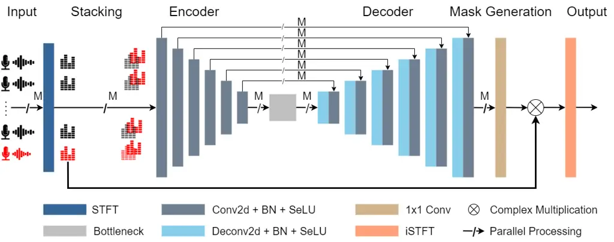
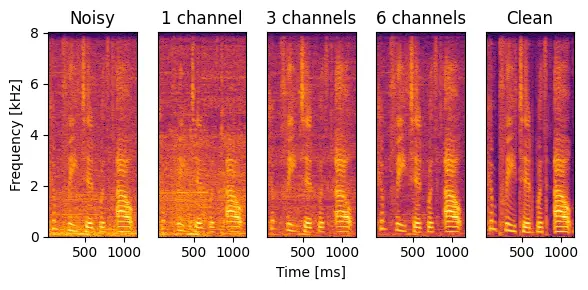

# RelUNet: Relative Channel Fusion U-Net for Multichannel Speech Enhancement

Ibrahim Aldarmaki    Thamar Solorio    Bhiksha Raj    Hanan Aldarmaki

###### Abstract

Neural multi-channel speech enhancement models, in particular those
based on the U-Net architecture, demonstrate promising performance and
generalization potential. These models typically encode input channels
independently, and integrate the channels during later stages of the
network. In this paper, we propose a novel modification of these models
by incorporating relative information from the outset, where each
channel is processed in conjunction with a reference channel through
stacking. This input strategy exploits comparative differences to
adaptively fuse information between channels, thereby capturing crucial
spatial information and enhancing the overall performance. The
experiments conducted on the CHiME-3 dataset demonstrate improvements in
speech enhancement metrics across various architectures.

###### Index Terms: 

multichannel, speech enhancement, u-net

^(†)^(†)address: Mohamed bin Zayed University of Artificial
Intelligence¹  
Carnegie Mellon University ²

## 1 Introduction

Speech enhancement is a critical task in various applications, such as
human-machine interfaces, mobile communications, and hearing aids \[1,
2\]. The objective is to improve the intelligibility and quality of
speech that has been degraded by background noise and reverberation.
This process becomes more complex in environments with multiple sound
sources and reflections, necessitating advanced methods to isolate the
target speech. The availability of multiple microphones (channels) help
more accurately isolate sound sources that originate from different
places. Traditional multi-channel speech enhancement methods often rely
on array processing techniques like spatial filtering, also known as
beamforming. These methods utilize spatial information, such as the
angular position of the target and the configuration of the microphone
array, to distinguish the desired speech from noise \[3\]. While
beamforming approaches such as the minimum variance distortion-less
response (MVDR) beamformer can effectively suppress unwanted noise, they
depend heavily on prior accurate estimation of spatial information. This
reliance can limit their performance in noisy and reverberant conditions
where precise spatial information is difficult to obtain \[4\]. In
recent years, deep learning techniques have shown promise in leveraging
data to discern patterns in multi-channel speech input. Convolutional
neural networks (CNNs) and U-Nets, in particular, have been effectively
used for speech enhancement tasks due to their ability to learn complex
local and global features from data. Originally introduced for image
segmentation, U-Nets have demonstrated positive results in processing
time-frequency segments of multichannel speech signals using parallel
processing with shared weights to handle different channels \[5, 6\].
Additional layers and network components have been proposed to improve
performance \[7\]. Previously proposed neural speech enhancement models
treat input channels independently, and merge them through later
mechanisms. For example, in \[8\], the authors integrated a Graph Neural
Network (GNN) at the bottleneck of a U-Net architecture to enable
cross-channel information sharing. Similarly, in \[9\], cross-channel
attention layers were used in a transformer architecture to encode
information between channels.

In this work, we describe Relative Channel Fusion UNet, RelUNet, a
variation on the standard U-Net architecture for multi-chanel speech
enhancement. Unlike previous neural architectures that process each
channel independently until the last layers, RelUNet incorporates
relative information by stacking each channel with a reference channel,
thus modelling relationships between the multi-channel signals early in
the network. This modification allows both parallel data processing for
optimized computing and parameter usage as well as cross-channel fusion
for accurate enhancement. We tested the approach with the vanilla U-Net
architecture as well as variations by inserting Graph Convolutional
Networks (GCN) or Graph Attention Networks (GAT) between the encoder and
decoder, as done in \[10\]. We used the CHiME-3 dataset \[11\] to
demonstrate the effectiveness in both simulated and real-world noisy
environments.

## 2 Preliminaries

### 2.1 Problem Formulation

In multichannel speech enhancement, we estimate a clean speech signal
from noisy recordings captured by multiple microphones. Let
$`\textbf{x}_{m}\in\mathbb{R}^{N}`$, where $`N`$ represents the number
of samples in the signal, be the signal recorded by microphone $`m`$ at
sample $`n=1,2,...,N`$, which can be expressed mathematically as:

```math
\textbf{x}_{m}[n]=\textbf{g}_{m}[n]\textbf{s}[n-n_{m}]+\textbf{n}_{m}[n] \tag{1}
```

where $`\textbf{g}_{m}`$, s, $`n_{m}`$, and $`\textbf{n}_{m}`$ represent
the gain, clean speech signal, time delay,and captured noise,
respectively, with $`m={1,2,...,M}`$, where $`M`$ is the number of
microphones. Such time-domain signals can be transformed into the
frequency domain using the Short-Time Fourier Transform (STFT) , which
is given by:

```math
\textbf{X}_{m}(f,t)=\textbf{h}_{m}(f,t)\textbf{S}_{m}(f,t)+\textbf{N}_{m}(f,t) \tag{2}
```

where $`\textbf{X}_{m}`$, $`\textbf{S}_{m}`$, and $`\textbf{N}_{m}`$ are
the STFT of $`\textbf{x}_{m}`$, $`\textbf{s}_{m}`$, and
$`\textbf{n}_{m}`$, respectively,
$`\textbf{h}(f,t)=[\textbf{G}_{1}(f,t)e^{(-j2\pi ff_{s}\tau_{1}/K)},...,\\
\textbf{G}_{M}(f,t)e^{(-j2\pi ff_{s}\tau_{M}/K)}]`$ represents the
steering vector, where $`\textbf{G}_{m}`$ is the STFT of
$`\textbf{g}_{m}`$, $`f`$ is the frequency bin, $`f_{s}`$ is the
sampling frequency, and $`t`$ is the time segment.

### 2.2 Traditional Beamforming

The MVDR beamformer is a widely used adaptive beamforming technique; its
weights are obtained by solving a constrained optimization problem that
ensures that the beamformer maintains a distortionless response in the
direction of the desired signal. The solution to this optimization
problem is given by the following closed-form expression:

```math
\textbf{w}_{MVDR}(f)=\frac{\textbf{R}_{nn}^{-1}(f,k)\textbf{h}(f,k)}{\textbf{h}^{H}(f,k)\textbf{R}_{nn}^{-1}(f,k)\textbf{h}(f,k)} \tag{3}
```

where $`\textbf{R}_{nn}\in\mathbb{R}^{M\times M}`$ represents the noise
covaraince matrix.

Effective implementation of the MVDR beamformer requires accurate
estimation of gain, Time Difference of Arrival (TDOA) and noise
covariance matrix. Generalized Cross Correlation with Phase
Transformation (GCC-PHAT), as defined in equation 4, is a widely used
method for robust TDOA estimation as
$`\hat{TDOA}=\underset{\tau}{argmax}(GCC-PHAT(\tau))`$.

```math
GCC-PHAT(\tau)=\int_{-\infty}^{\infty}\frac{X_{i}(f)X^{*}_{r}(f)}{|X_{i}(f)X^{*}_{r}(f)|}{e^{j2\pi f\tau}}df \tag{4}
```

### 2.3 Motivation

The motivation behind our approach stems from a gap in how traditional
signal processing techniques and modern deep learning architectures
handle multichannel data. Signal processing methods typically
incorporate the multichannel aspect early in the data processing
pipeline, relying on techniques like cross-correlation, defined in
equations 4 and 5, or cross-spectral density, defined in equation 6
(which are related via the Wiener-Khintchin theorem \[12, 13\], as shown
in equation 7), to achieve accurate speech enhancement. However, most
deep learning architectures previously explored do not facilitate this
early-stage cross-channel fusion, and process each channel
independently. The proposed model incorporates such cross-channel
information fusion, parallel data processing, and efficient parameter
usage.

```math
R_{x_{1},x_{2}}(\tau)=\int_{-\infty}^{\infty}x_{1}(t)x_{2}(t+\tau)^{*}\,dt \tag{5}
```

```math
S_{x_{1},x_{2}}(f)=X_{1}(f)X_{2}(f)^{*} \tag{6}
```

```math
S_{x_{1},x_{2}}(f)=\int_{-\infty}^{\infty}R_{x_{1},x_{2}}(\tau)e^{-j2\pi f\tau}\,d\tau \tag{7}
```

## 3 Proposed Method



Figure 1: Illustration of the proposed multi-channel speech enhancement
method using a RelUNet.

### 3.1 Input Representation

In RelUNet, we first transform time-domain speech signals,
$`\textbf{x}_{i}\in\mathbb{R}^{N}`$ where $`N`$ represents the number of
samples, into time-frequency representations using the STFT. Then, we
stack the real and imaginary parts of the STFT sequence of an input
channel signal, $`\textbf{X}_{i}\in\mathbb{C}^{F\times T}`$, where $`F`$
is the number of frequency bins and $`T`$ is the number of time frames,
with the corresponding STFT components from a reference signal,
$`\textbf{X}_{r}\in\mathbb{C}^{F\times T}`$, as shown in Figure 1. The
resulting channel input,
$`\textbf{Z}_{i}\in\mathbb{R}^{4\times F\times T}`$, is expressed as:

```math
\textbf{Z}_{i}=\begin{bmatrix}Re(\textbf{X}_{i}),Im(\textbf{X}_{i}),Re(\textbf{X}_{r}),Im(\textbf{X}_{r})\end{bmatrix} \tag{8}
```

where $`Re(.)`$ and $`Im(.)`$ denote the real and imaginary parts of the
STFT, respectively. Considering all M input channels results in input
$`\textbf{Z}=\{\textbf{Z}_{i}\}_{i=1}^{M}\in\mathbb{R}^{M\times 4\times F\times T}`$.

This modification enables the integration of relative information in the
microphone array, anchored by a reference channel, throughout the
network, enhancing the representational capacity of the subsequent
computations.

### 3.2 Feature Representation and Mask Generation

The U-Net architecture was used to extract feature representations from
the complex STFT inputs. The encoder-decoder structure with skip
connections helps preserving spatiotemporal information throughout the
network. The encoder maps the stacked input channels into latent
representation
$`\boldsymbol{\zeta}\in\mathbb{R}^{M\times d\times\tilde{F}\times\tilde{T}}`$
, where d is the number of filters/kernels used in the encoder’s last
convolutional layer and $`\tilde{(.)}`$ represents the reduced
dimensions due to encoder’s down-sampling.

The decoder then upsamples these feature maps, constructing the input to
the mask generating network. The output of the decoder is
$`\textbf{D}_{out}\in\mathbb{R}^{M\times d\times F\times T}`$. The input
to the mask generating network is a concatenation of
$`\textbf{D}_{out}`$ across all $`M`$ channels in the second dimension,
which can be represented as
$`Concat({\{\textbf{D}_{i}\}}^{M}_{i=1})\in\mathbb{R}^{MK\times F\times T}`$.
The mask generating network uses a 1x1 convolutional layer to generate
the real and imaginary components of the T-F mask,
$`\textbf{M}\in\mathbb{C}^{F\times T}`$, with the same dimensions as a
single-channel input. The mask is then applied to a reference channel,
resulting in an enhanced single-channel speech representation, which can
be represented as:

```math
\hat{\textbf{S}}(f,t)=\textbf{X}_{ref}(f,t)*\textbf{M}(f,t)\  \tag{9}
```

where $`\hat{\textbf{S}}\in\mathbb{C}^{F\times T}`$ is the STFT of the
enhanced speech, $`\textbf{X}_{ref}\in\mathbb{C}^{F\times T}`$ is the
STFT of the reference input signal, and $`*`$ is the complex
multiplication operation. Finally, the enhanced representation is
converted back into the time-domain speech signal using the
inverse-STFT.

### 3.3 Bottleneck Network

We experiment with integrating two types of Graph Neural Networks (GNNs)
into the bottleneck of the U-Net: Graph Convolutional Networks (GCNs)
and Graph Attention Netoworks (GATs). We construct a graph,
$`\mathcal{G}=(\mathcal{V},\mathcal{E})`$, with $`M`$ nodes
$`v_{i}\in\mathcal{V}`$, edges $`(v_{i},v_{j})\in\mathcal{E}`$,
adjacency matrix $`\mathcal{A}\in\mathbb{R}^{M\times M}`$, and node
degree matrix $`\mathcal{D}\in\mathbb{R}^{M\times M}`$, which is a
diagonal matrix where $`\mathcal{D}_{ii}=\sum_{j}A_{ij}`$. The input
node features to the GNNs are vectorized embedded representations of
each channel
$`vec(\boldsymbol{\zeta}_{i})\in\mathcal{R}^{d\tilde{F}\tilde{T}}`$.

The GNN’s outputs are then reshaped to match encoder’s output dimensions
and passed as inputs to the decoder. STFT.

|           |                   |       |       |       |       |       |       |       |       |       |       |
| --------- | ----------------- | ----- | ----- | ----- | ----- | ----- | ----- | ----- | ----- | ----- | ----- |
| Dataset   | Method            | PESQ  |       |       |       |       | STOI  |       |       |       |       |
|           |                   | BUS   | CAF   | PED   | STR   | AVG   | BUS   | CAF   | PED   | STR   | AVG   |
| Simulated | Noisy (channel 5) | 1.301 | 1.23  | 1.248 | 1.264 | 1.261 | 0.883 | 0.855 | 0.872 | 0.863 | 0.868 |
|           | U-Net Conv        | 1.684 | 1.512 | 1.526 | 1.584 | 1.576 | 0.907 | 0.888 | 0.896 | 0.889 | 0.895 |
|           | RelUNet Conv      | 1.939 | 1.81  | 1.762 | 1.723 | 1.809 | 0.942 | 0.936 | 0.931 | 0.923 | 0.933 |
| Real      | Noisy (channel 5) | 1.191 | 1.435 | 1.473 | 1.31  | 1.352 | 0.383 | 0.517 | 0.462 | 0.382 | 0.436 |
|           | U-Net Conv        | 1.188 | 1.401 | 1.406 | 1.293 | 1.322 | 0.369 | 0.541 | 0.479 | 0.392 | 0.445 |
|           | RelUNet Conv      | 1.256 | 1.509 | 1.467 | 1.383 | 1.404 | 0.411 | 0.563 | 0.501 | 0.413 | 0.472 |

Table 1: Evaluation results of different noise conditions on the
simulated and real test sets of the CHiME-3 dataset.

|                   |            |               |      |                |      |
| ----------------- | ---------- | ------------- | ---- | -------------- | ---- |
| Model             | Bottleneck | Multi-channel |      | Single-channel |      |
|                   |            | PESQ          | STOI | PESQ           | STOI |
| Noisy (channel 5) | \-         | 1.26          | 0.87 | 1.26           | 0.87 |
| UNet              | \-         | 1.58          | 0.89 | 1.50           | 0.87 |
| RelUNet           | \-         | 1.81          | 0.93 | 1.47           | 0.87 |
| UNet              | GAT        | 1.56          | 0.88 | 1.49           | 0.87 |
| RelUNet           | GAT        | 1.72          | 0.92 | 1.56           | 0.87 |
| UNet              | GCN        | 1.50          | 0.87 | 1.45           | 0.87 |
| RelUNet           | GCN        | 1.73          | 0.91 | 1.56           | 0.87 |

Table 2: Performance comparison of different models on CHiME-3 simulated
test set for both multichannel and single-channel scenarios.

## 4 Experimental Setup

### 4.1 Datasets

The CHiME-3 dataset \[11\] provides real and simulated recordings using
a 6-channel microphone array in four noisy environments: cafés (CAF),
buses (BUS), pedestrian areas (PED), and streets (STR) sampled at 16
kHz. In this work, we used only the simulated data for training. The
dataset includes 7,138, 1,640, and 1,320 utterances, corresponding to
training, development, and test data, respectively. The simulated sets
were used for training, development, and testing. Among the real sets,
we only used the test set for evaluation.

The multichannel time-domain model input was peak-normalized using the
peak value found among all channels. The single channel target was also
peak normalized. Each sound file was split into 1.2-second segments,
providing the data samples used to train, validate, and test the models.
To compute the STFTs, we use a Fast Fourier Transform (FFT) length of
1024, a hop length of 151, and a Hanning window length of 1,024, where
the last frequency bin is discarded.

### 4.2 Network Architecture and Training

We experimented with several model configurations, using a naming system
where U-Net and RelUNet (ours) denote the backbone architecture, GCN and
GAT refer to the integrated GNN in the bottleneck, and Conv. refers to
the mask generation network. The backbone architectures consist of an
encoder with six downsampling layers and a decoder with six upsampling
layers. Each layer in the encoder and decoder uses convolutional blocks
with SeLU activation \[14\] and batch normalization. The mask generation
network consists of a convolutional layer followed by SeLU activation.
For the variations involving GNNs, we inserted two layers between the
encoder and decoder. For the GAT, we used $`1`$ attention head.

Models were trained using the Adam optimizer with a learning rate of
0.0001. Training was conducted for 100 epochs with a batch size of 32,
where the validation loss was computed after every training step to
choose the best performing model. The used loss function is defined as:

```math
\mathcal{L}=2\cdot\|\hat{s}-s\|+\|\hat{M}-M\| \tag{10}
```

where $`s`$ and $`M`$ are the time-domain signal and magnitude
spectrogram, respectively, and $`\hat{(.)}`$ denote predicted values.

## 5 Results and Discussion

To evaluate our method, we used Perceptual Evaluation of Speech Quality
(PESQ) and Short-Time Objective Intelligibility (STOI). These metrics
were computed using torch metrics\[15\]; results are shown in Table 2.
We also report the performance with single-channel input, where the
single channel is stacked with itself for the RelUNet model.

The detailed results for different noise types using the U-Net and
RelUNet architectures tested on the simulated and real test sets are
summarized in Tables 1. The tables highlight the best performance for
each metric in bold.

### 5.1 Discussion

The multichannel results presented in Table 2 demonstrate that using a
RelUNet backbone consistently enhances speech quality across various
network architectures compared to the standard U-Net. Notably, while
GNNs did not outperform other architectures, this can likely be
attributed to the dataset’s fixed speaker positioning, a result also
reported in previous studies \[16\]. Despite this, the GNNs still
benefited from the RelUNet backbone, showing significant performance
improvements, highlighting the robustness of RelUNet in boosting speech
enhancement capabilities. The spectrograms in Figure 2 illustrates how
the RelUNet leverages multichannel data. As the number of channels
increases, the clarity of enhancement becomes more noticeable,
particularly in regions where speech and noise are intertwined in both
time and frequency.

Although the RelUNet is primarily designed to enhance cross-channel
information using a reference channel in a multichannel setup, it still
demonstrates performance improvements in terms of PESQ in single-channel
settings, as shown in Table 2. This result aligns with traditional
speech enhancement approaches that utilize autocorrelation methods for
single-channel speech enhancement.

The performance of the models across different noise environments, as
summarized in Table 1, highlights the relative improvement offered by
the RelUNet, compared to standard U-Net architecture used in previours
neural speech enhancement research. In the real data, the U-Net model
struggles to enhance speech and frequently degrades speech quality,
showing poor generalization in this setting. The RelUNet, on the other
hand, consistently improves over the U-Net and the noisy baseline. Note
that in this case, both models are only trained on the simulated data,
which is a common practice in speech enhancement research due to the
difficulty of obtaining ground-truth clean signal from real noisy
settings. The results demonstrate that the RelUNet has enhanced
generalization ability to unseen noise conditions. Remarkably, the
RelUNet achieves these significant improvements with only $`\sim`$0.07%
increase in number of parameters over the U-Net.



Figure 2: Spectrograms illustration of the RelUNet Conv. using different
number of channels.

## 6 Conclusions and Future Work

This paper presented a novel approach to multichannel speech
enhancement, called a RelUNet, leveraging a U-Net architecture combined
with spatial feature integration via channel stacking . The proposed
method significantly improves speech quality metrics, as demonstrated by
our experimental results on the CHiME-3 dataset, with a negligible
increase in number of parameters. The approach demonstrates consistent
improvements across model architectures and even in single-channel
settings. While our experiments with GNNs did not show enhanced
improvements over a standard RelUNet, Future work will explore their
applicability in data with variable microphone geometries.

## References

- \[1\] N. Das, S. Chakraborty, J. Chaki, N. Padhy, and N. Dey,
  “Fundamentals, present and future perspectives of speech enhancement,”
  _International Journal of Speech Technology_, vol. 24, no. 4, pp.
  883–901, 2021.
- \[2\] D. Liu, P. Smaragdis, and M. Kim, “Experiments on deep learning
  for speech denoising,” in _Fifteenth Annual Conference of the
  International Speech Communication Association_, 2014.
- \[3\] B. D. Van Veen and K. M. Buckley, “Beamforming: A versatile
  approach to spatial filtering,” _IEEE assp magazine_, vol. 5, no. 2,
  pp. 4–24, 1988.
- \[4\] J. Capon, “High-resolution frequency-wavenumber spectrum
  analysis,” _Proceedings of the IEEE_, vol. 57, no. 8, pp.
  1408–1418, 1969.
- \[5\] O. Ronneberger, P. Fischer, and T. Brox, “U-net: Convolutional
  networks for biomedical image segmentation,” in _Medical image
  computing and computer-assisted intervention–MICCAI 2015: 18th
  international conference, Munich, Germany, October 5-9, 2015,
  proceedings, part III 18_. Springer, 2015, pp. 234–241.
- \[6\] K. Tan and D. Wang, “A convolutional recurrent neural network
  for real-time speech enhancement.” in _Interspeech_, vol. 2018, 2018,
  pp. 3229–3233.
- \[7\] B. Tolooshams, R. Giri, A. H. Song, U. Isik, and
  A. Krishnaswamy, “Channel-attention dense u-net for multichannel
  speech enhancement,” in _ICASSP 2020-2020 IEEE International
  Conference on Acoustics, Speech and Signal Processing (ICASSP)_. IEEE,
  2020, pp. 836–840.
- \[8\] P. Tzirakis, A. Kumar, and J. Donley, “Multi-channel speech
  enhancement using graph neural networks,” in _ICASSP 2021-2021 IEEE
  International Conference on Acoustics, Speech and Signal Processing
  (ICASSP)_. IEEE, 2021, pp. 3415–3419.
- \[9\] F.-J. Chang, M. Radfar, A. Mouchtaris, B. King, and S. Kunzmann,
  “End-to-end multi-channel transformer for speech recognition,” in
  _ICASSP 2021-2021 IEEE International Conference on Acoustics, Speech
  and Signal Processing (ICASSP)_. IEEE, 2021, pp. 5884–5888.
- \[10\] H. N. Chau, T. D. Bui, H. B. Nguyen, T. T. Duong, and Q. C.
  Nguyen, “A novel approach to multi-channel speech enhancement based on
  graph neural networks,” _IEEE/ACM Transactions on Audio, Speech, and
  Language Processing_, 2024.
- \[11\] J. Barker, R. Marxer, E. Vincent, and S. Watanabe, “The third
  ‘chime’speech separation and recognition challenge: Dataset, task and
  baselines,” in _2015 IEEE Workshop on Automatic Speech Recognition and
  Understanding (ASRU)_. IEEE, 2015, pp. 504–511.
- \[12\] N. Wiener, “Generalized harmonic analysis,” _Acta mathematica_,
  vol. 55, no. 1, pp. 117–258, 1930.
- \[13\] A. Khintchine, “Korrelationstheorie der stationären
  stochastischen prozesse,” _Mathematische Annalen_, vol. 109, no. 1,
  pp. 604–615, 1934.
- \[14\] G. Klambauer, T. Unterthiner, A. Mayr, and S. Hochreiter,
  “Self-normalizing neural networks,” _Advances in neural information
  processing systems_, vol. 30, 2017.
- \[15\] N. S. Detlefsen, J. Borovec, J. Schock, A. H. Jha, T. Koker,
  L. Di Liello, D. Stancl, C. Quan, M. Grechkin, and W. Falcon,
  “Torchmetrics-measuring reproducibility in pytorch,” _Journal of Open
  Source Software_, vol. 7, no. 70, p. 4101, 2022.
- \[16\] M. Hao, J. Yu, and L. Zhang, “Spatial-temporal graph
  convolution network for multichannel speech enhancement,” in _ICASSP
  2022-2022 IEEE International Conference on Acoustics, Speech and
  Signal Processing (ICASSP)_. IEEE, 2022, pp. 6512–6516.
