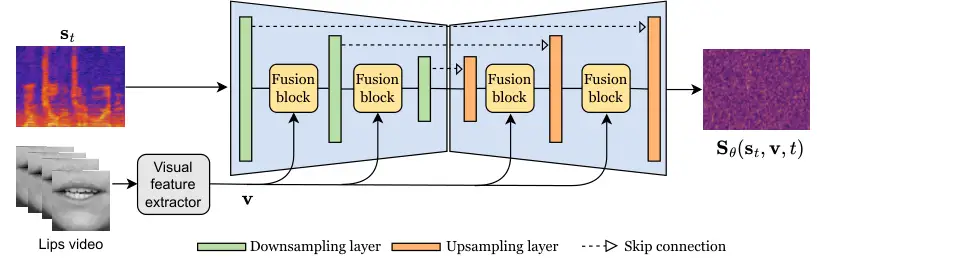

# Diffusion-based Unsupervised Audio-visual Speech Enhancement Thanks: This work was supported by the French National Research Agency (ANR) under the project REAVISE (ANR-22-CE23-0026-01).

Jean-Eudes Ayilo¹, Mostafa Sadeghi¹, Romain Serizel¹, Xavier
Alameda-Pineda² Affiliation: ¹Université de Lorraine, CNRS, Inria,
Loria, Nancy, France  
²Université Grenoble Alpes, Inria, Grenoble, France  
jean-eudes.ayilo@inria.fr, mostafa.sadeghi@inria.fr,
romain.serizel@loria.fr, xavier.alameda-pineda@inria.fr

###### Abstract

This paper proposes a new unsupervised audio-visual speech enhancement
(AVSE) approach that combines a diffusion-based audio-visual speech
generative model with a non-negative matrix factorization (NMF) noise
model. First, the diffusion model is pre-trained on clean speech
conditioned on corresponding video data to simulate the speech
generative distribution. This pre-trained model is then paired with the
NMF-based noise model to estimate clean speech iteratively.
Specifically, a diffusion-based posterior sampling approach is
implemented within the reverse diffusion process, where after each
iteration, a speech estimate is obtained and used to update the noise
parameters. Experimental results confirm that the proposed AVSE approach
not only outperforms its audio-only counterpart but also generalizes
better than a recent supervised-generative AVSE method. Additionally,
the new inference algorithm offers a better balance between inference
speed and performance compared to the previous diffusion-based method.
Code and demo available at:
[https://jeaneudesayilo.github.io/fast_UdiffSE](https://jeaneudesayilo.github.io/fast_UdiffSE)

###### Index Terms: 

Unsupervised learning, audio-visual speech enhancement, diffusion
models, posterior sampling.

## I Introduction

SE (SE) refers to the problem of extracting a clean speech signal from a
noisy recording. Early algorithms implemented for solving this task
relied solely on acoustic features. However, speech production is
inherently multimodal, involving movements of the lips and tongue, for
example. Research in speech perception has demonstrated a crucial impact
of visual cues on the ability of humans to focus their auditory
attention on a speech signal \[1, 2, 3\]. Consequently, AVSE (AVSE) has
emerged as a new research trend. In this approach, lip movements are
primarily used as complementary information to acoustic features to
improve the performance, particularly in low SNR (SNR) environments \[1,
4\].

Existing DNN (DNN)-based AVSE frameworks (and SE in general) are
primarily divided into two learning approaches: supervised \[5, 6, 7, 8,
9, 10, 11, 12\] and unsupervised  \[13, 14, 15\]. Supervised methods,
whether predictive or generative, involve training a DNN on pairs of
clean and noisy speech, and possibly corresponding visual data.
Specifically, predictive methods focus on mapping noisy speech directly
to clean speech or to a time-frequency mask. In contrast, generative
methods aim to generate clean speech at inference by learning the
distribution of clean speech conditioned on the noisy input, rather than
directly mapping from noisy to clean speech.

Some recent supervised-generative methodologies for SE \[11, 16, 17, 18,
19\] leverage diffusion models \[20\]. A diffusion model learns data
distribution by first pushing the clean data distribution towards a
prior Gaussian distribution via the progressive corruption of the clean
data with Gaussian noise. A DNN is trained to progressively transform
samples drawn from the prior Gaussian distribution into clean data. In
the diffusion-based supervised-generative SE context, the diffusion
model which aims to learn clean speech distribution is conditioned on
noisy speech. Lips video features can also be incorporated in such SE
models as shown by \[9\]. As diffusion model inference requires many
iterations, a faster alternative to \[9\], called FlowAVSE, was proposed
in \[10\]. It is a two-stage method that uses in its first stage a
supervised-predictive network that outputs an estimate of clean speech
given the noisy speech and the lips video. Then, a conditional
generative flow matching algorithm generates the final enhanced speech
in just one sampling step, conditionally to the lips video and the
output of the first stage. Despite their generative nature, these
methods still require pairs of clean and noisy speech for training.
Although all these supervised methods can generalize to unseen noise
conditions at test time, a significant amount of paired data is needed
\[21, 22\]. This is because it is impossible to train these models
across all potential noise types and acoustic scenarios \[13\].

To enhance the robustness of SE models to unseen noises during training,
some unsupervised methods have been developed that do not require a
noise dataset. Here, the training stage involves learning the prior
distribution of clean speech using models like VAE (VAE) \[23, 14\] or
dynamical VAE \[15\]. This learned prior is then combined with a noise
model based on NMF (NMF) \[24\] to estimate clean speech using EM (EM).
In this vein, Nortier et al. \[25\] recently introduced UDiffSE, an
unsupervised audio-only SE framework utilizing diffusion models. In this
approach, an unconditional diffusion model is trained on clean speech
data. This diffusion model, serving as a prior for clean speech, is then
combined with an NMF-based noise model to enhance speech. This method
has been shown to outperform VAE-based SE approaches on some metrics and
provides better generalization than its supervised counterpart, i.e.
\[11\].

In this paper, we propose a diffusion-based AVSE framework that learns a
clean speech distribution from audio-visual (AV) data. The model
incorporates visual features extracted from a self-supervised
audio-visual speech representation learning model \[26\] as conditioning
information. Additionally, we develop an iterative inference algorithm,
named UDiffSE+, which operates significantly faster than UDiffSE. This
approach substantially reduces the total number of iterations required,
without dramatically degrading performance, as our experimental results
will demonstrate.



Fig. 1: Schematic diagram of the proposed AV-U-Net (score model)
architecture.

## II Diffusion-based unsupervised SE

In this section, we review the diffusion-based unsupervised (audio-only)
SE framework \[25\] i.e. UDiffSE. The modeling is done in the
complex-valued STFT (STFT) domain. The observation model is
$`\mathbf{x}=\mathbf{s}+\mathbf{n}`$, where $`\mathbf{x}`$,
$`\mathbf{s}`$, and $`\mathbf{n}`$ denote STFT arrays of noisy (mixture)
speech, clean speech, and background noise, respectively. For notational
simplicity, 2D STFT arrays ($`F`$ frequency bins and $`T`$ time frames)
are represented by flattened 1D arrays, e.g.,
$`\mathbf{s}\in\mathbb{C}^{FT}`$.

### II-A Speech generative modeling

Learning a speech generative prior using diffusion models involves
smoothly injecting noise into training samples, via a diffusion process
$`\{\mathbf{s}_{t}\}_{t\in[0,1]}`$, which transforms clean training data
$`\mathbf{s}_{0}=\mathbf{s}`$ into Gaussian noise over time $`t`$. This
can be described by the following forward SDE (SDE) \[20, 25\]

```math
\textrm{d}\mathbf{s}_{t}=\mathbf{f}(\mathbf{s}_{t})\textrm{d}t+g(t)\textrm{d}\mathbf{w}, \tag{1}
```

where $`\mathbf{w}`$ denotes a standard Wiener process, the
vector-valued $`\mathbf{f}`$ is the drift coefficient term, the scalar
function $`g`$ is the diffusion coefficient, and $`\textrm{d}t`$ is an
infinitesimal time-step. Here,
$`\mathbf{f}(\mathbf{s}_{t})=-\gamma\mathbf{s}_{t}`$, where $`\gamma`$
is a constant parameter, and $`g(t)`$ controls the variance of the
stochastic noise. The SDE in (1) has the perturbation kernel defined
below, which allows one to directly sample $`\mathbf{s}_{t}`$ given
$`\mathbf{s}`$

```math
p_{0t}(\mathbf{s}_{t}|\mathbf{s})=\mathcal{N}_{\mathbb{C}}({\delta}_{t}\mathbf{s},\sigma(t)^{2}\mathbf{I}), \tag{2}
```

where $`{\delta}_{t}=\textrm{e}^{-\gamma t}`$, and the variance
$`\sigma(t)^{2}`$ is determined from the SDE. Under some light
regularity conditions \[27\], the noising process can be reverted
through a reverse SDE:

```math
\textrm{d}\mathbf{s}_{t}=[-\mathbf{f}(\mathbf{s}_{t})+g(t)^{2}\nabla_{\mathbf{s}_{t}}\log p_{t}(\mathbf{s}_{t})]\textrm{d}t+g(t)\textrm{d}\mathbf{\bar{w}}, \tag{3}
```

where $`\mathbf{\bar{w}}`$ is a standard Wiener process running backward
in time. The term $`\nabla_{\mathbf{s}_{t}}\log p_{t}(\mathbf{s}_{t})`$,
known as the score function, is intractable to compute directly. It is
thus approximated by a time-dependent DNN-based score model, denoted as
$`\mathbf{S}_{\theta}(\mathbf{s}_{t},{t})`$. To learn $`\theta`$, the
following problem is solved \[28\]:

```math
\theta^{*}={\operatornamewithlimits{argmin}_{\theta}\mathbb{E}_{t,\mathbf{s},\bm{\zeta},\mathbf{s}_{t}|\mathbf{s}}}{\Bigr[\|{\sigma(t)}{\mathbf{S}_{\theta}(\mathbf{s}_{t},{t})}+{\bm{\zeta}}\|_{2}^{2}\Bigl]}, \tag{4}
```

where $`\bm{\zeta}\sim\mathcal{N}_{\mathbb{C}}(\mathbf{0},\mathbf{I})`$
is a zero-mean complex-valued Gaussian noise. The reverse SDE can then
be numerically solved, e.g., using the PC (PC) sampler \[20\], to sample
from the data distribution.

### II-B Unsupervised speech enhancement

The additive noise is modeled as
$`\mathbf{n}\sim\mathcal{N}_{\mathbb{C}}(\bm{0},\mbox{{diag}}(\mathbf{m}_{\phi}))`$,
where $`\mathbf{m}_{\phi}=\text{vec}(\mathbf{W}\mathbf{H})`$, with
$`\mathbf{W}`$, $`\mathbf{H}`$ being low-rank matrices with non-negative
entries, and $`\text{vec}(.)`$ denoting the vectorization operator.
Given the pre-trained speech prior with frozen parameters
$`\theta^{*}`$, an iterative EM method is performed to update $`\phi`$,
where the M-step writes:

```math
\phi\leftarrow\operatornamewithlimits{argmax}_{\phi}~\mathbb{E}_{p_{\phi}(\mathbf{s}|\mathbf{x})}\left\{\log p_{\phi}(\mathbf{x}|\mathbf{s})\right\}. \tag{5}
```

The above expectation is approximated using a Monte Carlo estimate,
which involves sampling from the intractable posterior
$`p_{\phi}(\mathbf{s}|\mathbf{x})\propto p_{\phi}(\mathbf{x}|\mathbf{s})p(\mathbf{s})`$
during the E-step. This approximation is implemented by substituting
$`\nabla_{\mathbf{s}_{t}}\log p_{t}(\mathbf{s}_{t})`$ in (3) with the
following posterior-based score function:

```math
\nabla_{\mathbf{s}_{t}}\log p_{\phi}(\mathbf{s}_{t}|\mathbf{x})=\nabla_{\mathbf{s}_{t}}\log p_{\phi}(\mathbf{x}|\mathbf{s}_{t})+\nabla_{\mathbf{s}_{t}}\log p_{t}(\mathbf{s}_{t}), \tag{6}
```

where the time-dependent likelihood
$`p_{\phi}(\mathbf{x}|\mathbf{s}_{t})`$ is approximated with a
noise-perturbed pseudo-likelihood \[25\] and the score function is
replaced with $`\mathbf{S}_{\theta^{*}}(\mathbf{s}_{t},{t})`$. Plugging
the obtained clean speech estimate in (5), $`\mathbf{W},\mathbf{H}`$ are
learned with multiplicative update rules. The EM steps are iteratively
performed until convergence, typically requiring around five EM
iterations for sufficient performance \[25\].

## III Diffusion-based unsupervised AVSE

This section presents our proposed unsupervised AVSE framework using
diffusion models. We first develop an audio-visual speech prior model.
Then, we propose a fast inference algorithm to estimate the clean
speech.

### III-A Audio-visual speech generative model

We model the conditional speech generative distribution
$`p(\mathbf{s}|\mathbf{v})`$, where $`\mathbf{v}`$ denotes a visual
embedding associated with $`\mathbf{s}`$. Following the diffusion-based
framework discussed in Section II-A, a conditional score network
$`\mathbf{S}_{\theta}(\mathbf{s}_{t},\mathbf{v},{t})`$ is learned over
clean AV speech data. The visual data denoted as
$`\mathbf{v}\in\mathbb{R}^{T_{v}\times p}`$, where $`T_{v}`$ represents
the number of video frames and $`p`$ indicates the embedding dimension,
is incorporated into the score network as illustrated in Fig. 1.

To integrate audio and visual features within the score network, a
cross-attention mechanism is employed at each downsampling and
upsampling stage of the U-Net-like architecture. Here, audio features
serve as queries, while visual features are used as keys and values.
More specifically, we denote the acoustic embedding features at the
$`i`$^(th) layer of the score network as
$`e_{a,i}\in\mathbb{R}^{C_{i}\times F_{i}\times T_{i}}`$, where
$`C_{i}`$ represents the number of channels, and $`F_{i}`$ and $`T_{i}`$
indicate the embedding dimensions. Initially, the audio and visual
features are projected into $`d_{i}`$-dimensional spaces for queries,
keys, and values. This is followed by the computation of dot-product
attention to produce a feature map of dimensions
$`C_{i}\times d_{i}\times T_{i}`$. This feature map is then projected
into an $`F_{i}`$-dimensional space, resulting in an intermediate
audio-visual representation,
$`\widetilde{e}_{av,i}\in\mathbb{R}^{C_{i}\times F_{i}\times T_{i}}`$.
The final audio-visual representation at layer $`i`$, denoted
$`e_{av,i}`$, is achieved by adding the original acoustic embedding
$`e_{a,i}`$ to the Group Normalized intermediate representation:
$`e_{av,i}=e_{a,i}+\operatorname{GroupNorm}(\widetilde{e}_{av,i})`$.

### III-B Fast inference algorithm

The UDiffSE framework requires multiple rounds of an iterative reverse
diffusion process as the E-step to obtain an estimation of the clean
speech by sampling from the posterior
$`p_{\phi}(\mathbf{s}|{\mathbf{x}})`$. This method is computationally
intensive. We introduce a significantly more efficient methodology named
UDiffSE+, which requires only one round of reverse diffusion.

This new framework leverages a clean speech estimate at each iteration
of the reverse diffusion process, eliminating the need for a complete
reverse cycle. In this methodology, the noise parameters, i.e.,
$`\mathbf{W}`$ and $`\mathbf{H}`$, are updated following each reverse
iteration based on the clean speech estimate obtained. This approach
effectively employs an alternating maximization strategy, aimed at
solving

```math
\{\phi^{*},\mathbf{s}^{*}\}=\operatornamewithlimits{argmax}_{\phi,\mathbf{s}}~\log p_{\phi}(\mathbf{x}|\mathbf{s})+\log p(\mathbf{s}), \tag{7}
```

by performing the following iterations

```math
\displaystyle\mathbf{s}_{0,k+1} \displaystyle=\operatornamewithlimits{argmax}_{\mathbf{s}}~\log p_{\phi_{k}}(\mathbf{x}|\mathbf{s})+\log p(\mathbf{s}), \tag{8a}
```

```math
\displaystyle\phi_{k+1} \displaystyle=\operatornamewithlimits{argmax}_{\phi}~\log p_{\phi}(\mathbf{x}|\mathbf{s}_{0,k+1}). \tag{8b}
```

Problem (8a), which is maximum a posteriori (MAP) estimation, can be
solved by performing one reverse iteration, as done in UDiffSE, in which
case, the iteration index $`k`$ is replaced with a time discretization,
denoted $`\tau`$. To obtain an estimate of $`\mathbf{s}`$ at iteration
$`\tau`$ of the reverse diffusion process, denoted
$`\hat{\mathbf{s}}_{0,\tau}`$, we leverage Tweedie’s formula \[29\],
that is

```math
\hat{\mathbf{s}}_{0,\tau}=\mathbb{E}_{p_{\tau 0}(\mathbf{s}_{0}|\mathbf{s}_{\tau})}[\mathbf{s}_{0}]\approx\frac{\mathbf{s}_{\tau}+\sigma_{\tau}^{2}\mathbf{S}_{\theta^{*}}(\mathbf{s}_{\tau},\tau)}{\delta_{\tau}}. \tag{9}
```

Plugging this into (8b), the parameters are updated by a single
multiplicative update iteration. The overall (audio-only/AV) UDiffSE+
algorithm is described in Algorithm 1. By excluding lines 12 and 13, the
algorithm simplifies to the E-step of UDiffSE. The highlighted box
corresponds to the operations that ensure observation ($`\mathbf{x}`$)
consistency, without which the algorithm reduces to prior sampling.

1:
$`\mathbf{x},{\color[rgb]{0,0,1}\mathbf{v}},N,\lambda,r(\mbox{\small signal-to-noise ratio})`$

2:
$`{\mathbf{s}}_{1}\sim\mathcal{N}_{\mathbb{C}}(\mathbf{x},\mathbf{I}),\Delta\tau\leftarrow\frac{1}{N}`$

3: for $`i=N,\ldots,1`$ do

4:    $`\tau\leftarrow\frac{i}{N}`$

5:    $`\epsilon_{\tau}\leftarrow(\sigma_{\tau}\cdot r)^{2}`$

6:
   $`\bm{\zeta}_{c}\sim\mathcal{N}_{\mathbb{C}}(\mathbf{0},\mathbf{I})`$
   $`\triangleright`$ (Corrector)

7:
   $`{\mathbf{s}}_{\tau}\leftarrow\mathbf{s}_{\tau}+\epsilon_{\tau}{\mathbf{S}_{\theta^{*}}(\mathbf{s}_{\tau},{\color[rgb]{0,0,1}\mathbf{v}},{\tau})}+\sqrt{2\epsilon_{\tau}}\bm{\zeta}_{c}`$

8:
   $`\bm{\zeta}_{p}\sim\mathcal{N}_{\mathbb{C}}(\mathbf{0},\mathbf{I})`$
   $`\triangleright`$ (Predictor)

9:
   $`{\mathbf{s}}_{\tau}\leftarrow{\mathbf{s}}_{\tau}-\mathbf{f}_{\tau}\Delta{\tau}+g_{\tau}^{2}\mathbf{S}_{\theta^{*}}({\mathbf{s}}_{\tau},{\color[rgb]{0,0,1}\mathbf{v}},\tau)\Delta{\tau}+g_{\tau}\sqrt{\Delta{\tau}}\bm{\zeta}_{p}`$


10:    if $`i\equiv 0\pmod{2}`$ then    $`\triangleright`$ (Posterior)

11:
    $`\nabla_{{\mathbf{s}}_{\tau}}\log\tilde{p}_{\phi}(\mathbf{x}|{\mathbf{s}}_{\tau})\leftarrow\dfrac{1}{{\delta}_{\tau}}\Big[\dfrac{{\sigma^{2}_{\tau}}}{{{\delta}^{2}_{\tau}}}\mathbf{I}+\mbox{{diag}}(\bm{v}_{\phi})\Big]^{-1}(\mathbf{x}-\dfrac{{\mathbf{s}}_{\tau}}{\delta_{\tau}})`$

12:
    $`\mathbf{s}_{\tau}\leftarrow{\mathbf{s}}_{\tau}+{\lambda}{g_{\tau}^{2}}{\nabla_{\mathbf{s}_{\tau}}\log\tilde{p}_{\phi}(\mathbf{x}|\mathbf{s}_{\tau})}\Delta{\tau}`$

13:
    $`\hat{\mathbf{s}}_{0,\tau}=\delta_{\tau}^{-1}\Big(\mathbf{s}_{\tau}+\sigma^{2}_{\tau}\mathbf{S}_{\theta^{*}}(\mathbf{s}_{\tau},{\color[rgb]{0,0,1}\mathbf{v}},\tau)\Big)`$
   $`\triangleright`$ (Estimate of $`\mathbf{s}_{0}`$)

14:
    $`\phi\leftarrow\operatornamewithlimits{argmax}_{\phi}\log p_{\phi}(\mathbf{x}|\hat{\mathbf{s}}_{0,\tau})`$
   $`\triangleright`$ (Parameters update)

15:    end
if

16: end for

17: return $`\hat{\mathbf{s}}={\mathbf{s}}_{0}`$

Algorithm 1 AV-UDiffSE+

|                 |               |     |                    |                           |                   |                   |                          |                   |                   |
| --------------- | ------------- | --- | ------------------ | ------------------------- | ----------------- | ----------------- | ------------------------ | ----------------- | ----------------- |
|                 |               |     |                    | TCD speech + DEMAND noise |                   |                   | LRS3 speech + NTCD noise |                   |                   |
| Method          | \# Params (M) | EM  | RTF $`\downarrow`$ | SI-SDR $`\uparrow`$       | PESQ $`\uparrow`$ | ESTOI$`\uparrow`$ | SI-SDR $`\uparrow`$      | PESQ $`\uparrow`$ | ESTOI$`\uparrow`$ |
| Input           |               |     |                    | 0.00 $`\pm`$0.17          | 2.83 $`\pm`$0.02  | 0.70 $`\pm`$0.01  | 0.03 $`\pm`$0.14         | 2.10 $`\pm`$0.02  | 0.58 $`\pm`$0.01  |
| UDiffSE \[25\]  | 27.7          |   5 | 10.53              | 11.69 $`\pm`$0.27         | 3.08 $`\pm`$0.02  | 0.77 $`\pm`$0.01  | 4.72 $`\pm`$0.16         | 2.38 $`\pm`$0.02  | 0.62 $`\pm`$0.01  |
| FlowAVSE \[10\] | 60.2          |     | 0.03               | 17.83 $`\pm`$0.18         | 3.18 $`\pm`$0.02  | 0.82 $`\pm`$0.00  | 3.12 $`\pm`$0.23         | 1.49 $`\pm`$0.02  | 0.53 $`\pm`$0.01  |
| AV-UDiffSE      | 29.4          |   5 | 13.92              | 13.70 $`\pm`$0.23         | 3.18 $`\pm`$0.02  | 0.79 $`\pm`$0.01  | 5.60 $`\pm`$0.15         | 2.48 $`\pm`$0.02  | 0.64 $`\pm`$0.01  |
| AO-UDiffSE+     | 27.7          |   1 | 1.98               | 8.99 $`\pm`$0.21          | 3.19 $`\pm`$0.02  | 0.72 $`\pm`$0.01  | 2.95 $`\pm`$0.15         | 2.31 $`\pm`$0.02  | 0.59 $`\pm`$0.01  |
| AV-UDiffSE+     | 29.4          |   1 | 2.68               | 10.21 $`\pm`$0.15         | 3.26 $`\pm`$0.02  | 0.74 $`\pm`$0.00  | 3.67$`\pm`$0.13          | 2.42 $`\pm`$0.02  | 0.61 $`\pm`$0.01  |

TABLE I: Speech enhancement results in matched (TCD speech + DEMAND
noise) and mismatched (LRS3 speech + NTCD noise) conditions. AO and AV:
audio-only and audio-visual models, respectively. EM: number of EM
iterations. RTF (real-time factor): average time needed to process one
second of speech. Values: mean $`\pm`$ standard error, best value, next
best per column.

## IV Experiments

Baselines. We compare the performance of our proposed method against two
frameworks: the audio-only UDiffSE \[25\] and the supervised-generative
FlowAVSE model \[10\].

Dataset. The TCD-TIMIT corpus \[30\] was employed for training. It
comprises AV speech data from 56 English-speaking individuals with Irish
accents, distributed among 39 for training, 8 for validation, and 9 for
testing. The dataset features 98 distinct sentences, each approximately
5 seconds in duration and sampled at 16 kHz, totaling around 8 hours of
data. Additionally, each spoken utterance is accompanied by a
corresponding video, recording the speaker from a frontal perspective at
a frame rate of 30 fps. We downsampled the videos to 25 fps and the lip
regions of interest are extracted as 88$`\times`$88 grayscale following
\[31, 32\]. Training the supervised baseline model requires noisy speech
counterparts. As such, we consider mixing TCD-TIMIT clean speech with
DKITCHEN, OMEETING, PRESTO, PSTATION, NPARK noises from the DEMAND
dataset \[33\] at {-10, 0, 10}dB.

To evaluate SE performance, we define two scenarios: matched and
mismatched, based on the origin of the test clean speech signals or
noises. In the matched scenario, noisy speech is constructed by mixing
clean speech from the TCD-TIMIT test set with noises from the DEMAND
dataset (TMETRO, OOFFICE, TBUS, STRAFFIC, SPSQUARE). For each type of
noise and SNR level, we randomly selected 10 utterances from each test
speaker, totaling 900 evaluation utterances. In the mismatched scenario,
we use the test set from the LRS3 dataset \[34\], consisting of 1321
clean speech files. These files are mixed randomly with one of the noise
types from the NTCD-TIMIT dataset (Living Room, White, Car, Babble,
Cafe) \[35\]. For both scenarios, the SNR levels are {-5, 5}dB.

Evaluation metrics. We use standard SE metrics: the scale-invariant
signal-to-distortion ratio (SI-SDR) in dB \[36\], the extended
short-term objective intelligibility (ESTOI) measure \[37\], varying
between $`[0,1]`$, and the perceptual evaluation of speech quality
(PESQ) score \[38\], with a range of $`[-0.5,4.5]`$. For these metrics,
higher values indicate better performance.

Model architecture. The base architecture in this paper, NCSN++M, is a
lighter U-Net-like version of the original NCSN++ network \[11\]. In its
audio-only configuration, NCSN++M comprises 27.8 million parameters.
Integration of video data through cross-attention modules, each
featuring a single attention head as detailed in Subsection III-A,
results in a 6.13% increase in the total number of parameters.
Additionally, the FlowAVSE baseline employs the NCSN++M network in both
stages, totaling 60.2 million parameters. All in all, we trained from
scratch the score networks for the audio-only and AV settings and the
FlowAVSE networks.

Pretrained visual features. Similar to prior works \[39, 40, 9\], we
extracted features from lip videos using the AV-HuBERT model \[26\],
specifically utilizing its version fine-tuned for visual speech
recognition. We maintained this visual encoder in a frozen state
throughout our experiments. It processes silent grayscale videos and
outputs visual features $`\mathbf{v}`$ of size $`(T_{v},p)`$, with
$`p=768`$, derived from the model’s final layer. For visual feature
extraction in the FlowAVSE baseline, we followed the procedures outlined
in the original paper \[10\].

Hyperparameters setting. We trained the diffusion models over 200 epochs
using the Adam optimizer at a learning rate of 0.0001. For the STFT, a
Hann window of 510 length and a hop length of 128 were used, yielding
256 frequency bins. Each speech waveform was randomly trimmed to 2.04
seconds, corresponding to $`T=256`$ STFT time frames, to standardize
input sizes for batching. The hyperparameters for the SDE and inference
algorithm were aligned with those in \[25\].

Results. Table I presents the SE performance metrics for audio-only (AO)
and audio-visual (AV) algorithms under different conditions. In the
matched scenario, the supervised baseline generally outperforms the
unsupervised models in all metrics, except for AV-UDiffSE+ in PESQ,
which aligns with the typical strengths of supervised methods in matched
settings. Conversely, in the mismatched scenario, all methods, including
the audio-only unsupervised models, surpass the FlowAVSE baseline by at
least 0.55 dB in SI-SDR, 0.82 in PESQ, and 0.06 in ESTOI, except for
AO-UDiffSE+ in SI-SDR. This indicates a potential for generalization in
diffusion-based unsupervised SE frameworks, as also suggested by \[25\].
It is important to highlight that like supervised methods, unsupervised
models also offer the flexibility to incorporate the visual modality. As
expected, incorporating lip movements into the prior diffusion models
(AV-UDiffSE+, AV-UDiffSE) enhances noise removal, speech quality, and
intelligibility.

We assessed the inference speed of the different algorithms on an Nvidia
A100-SXM4 (40GB), maintaining consistent conditions across all tests.
Comparisons between UDiffSE and our proposed UDiffSE+ frameworks (in
both audio-only and AV settings) revealed that UDiffSE, while superior
in performance, requires significantly more processing time, as
indicated by the real-time factor (RTF); it is approximately 5 times
slower than UDiffSE+. Thus, UDiffSE+ offers a favorable compromise
between inference speed and performance.

## V Conclusion

In this paper, we present a diffusion-based, unsupervised audio-visual
speech enhancement (AVSE) framework, which leverages a diffusion model
to simulate clean speech distribution, conditioned on visual cues from
lip movements. The pre-trained diffusion model is integrated with an
NMF-based noise model through an iterative process of reverse diffusion
steps to estimate speech. Our experiments show that the proposed AVSE
framework consistently outperforms its audio-only counterpart and offers
better generalization than a recent supervised-generative approach
\[10\]. Moreover, compared to the previous inference method \[25\], our
algorithm achieves a better trade-off between performance and runtime.
Future work includes a comprehensive subjective performance assessment.

## References

- \[1\] D. Michelsanti, Z.-H. Tan, S.-X. Zhang, Y. Xu, M. Yu, D. Yu,
  and J. Jensen, “An overview of deep-learning-based audio-visual speech
  enhancement and separation,” IEEE/ACM Transactions on Audio, Speech,
  and Language Processing, vol. 29, pp. 1368–1396, 2021.
- \[2\] H. McGurk and J. MacDonald, “Hearing lips and seeing voices,”
  Nature, vol. 264, no. 5588, pp. 746–748, 1976.
- \[3\] W. H. Sumby and I. Pollack, “Visual contribution to speech
  intelligibility in noise,” The journal of the acoustical society of
  america, vol. 26, no. 2, pp. 212–215, 1954.
- \[4\] A. L. A. Blanco, C. Valentini-Botinhao, O. Klejch, M. Gogate, K.
  Dashtipour, A. Hussain, and P. Bell, “AVSE challenge: Audio-visual
  speech enhancement challenge,” in IEEE Spoken Language Technology
  Workshop (SLT), 2023, pp. 465–471.
- \[5\] T. Alfouras, J. Chung, and A. Zisserman, “The conversation:
  Deep audio-visual speech enhancement,” in Interspeech, 2018.
- \[6\] J.-C. Hou, S.-S. Wang, Y.-H. Lai, Y. Tsao, H.-W. Chang, and
  H.-M. Wang, “Audio-visual speech enhancement using multimodal deep
  convolutional neural networks,” IEEE Transactions on Emerging Topics
  in Computational Intelligence, vol. 2, no. 2, pp. 117–128, 2018.
- \[7\] S.-Y. Chuang, H.-M. Wang, and Y. Tsao, “Improved lite
  audio-visual speech enhancement,” IEEE/ACM Transactions on Audio,
  Speech, and Language Processing, vol. 30, pp. 1345–1359, 2022.
- \[8\] T. Afouras, J. S. Chung, and A. Zisserman, “My lips are
  concealed: Audio-visual speech enhancement through obstructions,” in
  Interspeech, 2019.
- \[9\] J. Richter, S. Frintrop, and T. Gerkmann, “Audio-visual speech
  enhancement with score-based generative models,” in Proc. ITG Conf.
  Speech Communication, 2023.
- \[10\] C. Jung, S. Lee, J.-H. Kim, and J. S. Chung, “FlowAVSE:
  Efficient audio-visual speech enhancement with conditional flow
  matching,” in Proc. INTERSPEECH, 2024, pp. 2210–2214.
- \[11\] J. Richter, S. Welker, J.-M. Lemercier, B. Lay, and T.
  Gerkmann, “Speech enhancement and dereverberation with diffusion-based
  generative models,” IEEE/ACM Transactions on Audio, Speech, and
  Language Processing, 2023.
- \[12\] S. Pascual, A. Bonafonte, and J. Serrà, “Segan: Speech
  enhancement generative adversarial network,” Interspeech 2017, p.
  3642, 2017.
- \[13\] X. Bie, S. Leglaive, X. Alameda-Pineda, and L. Girin,
  “Unsupervised speech enhancement using dynamical variational
  autoencoders,” IEEE/ACM Transactions on Audio, Speech, and Language
  Processing, vol. 30, pp. 2993–3007, 2022.
- \[14\] M. Sadeghi, S. Leglaive, X. Alameda-Pineda, L. Girin, and R.
  Horaud, “Audio-visual speech enhancement using conditional variational
  auto-encoders,” IEEE/ACM Transactions on Audio, Speech, and Language
  Processing, vol. 28, pp. 1788–1800, 2020.
- \[15\] A. Golmakani, M. Sadeghi, and R. Serizel, “Audio-visual speech
  enhancement with a deep Kalman filter generative model,” in IEEE
  International Conference on Acoustics, Speech and Signal Processing
  (ICASSP), 2023, pp. 1–5.
- \[16\] P. Gonzalez, Z.-H. Tan, J. Østergaard, J. Jensen, T. S.
  Alstrøm, and T. May, “Diffusion-based speech enhancement in matched
  and mismatched conditions using a heun-based sampler,” in ICASSP
  2024-2024 IEEE International Conference on Acoustics, Speech and
  Signal Processing (ICASSP). IEEE, 2024, pp. 10431–10435.
- \[17\] J. Serrà, S. Pascual, J. Pons, R. O. Araz, and D. Scaini,
  “Universal speech enhancement with score-based diffusion,” arXiv
  preprint arXiv:2206.03065, 2022.
- \[18\] Y.-J. Lu, Z.-Q. Wang, S. Watanabe, A. Richard, C. Yu, and Y.
  Tsao, “Conditional diffusion probabilistic model for speech
  enhancement,” in IEEE International Conference on Acoustics, Speech
  and Signal Processing (ICASSP), 2022, pp. 7402–7406.
- \[19\] H. Yen, F. G. Germain, G. Wichern, and J. Le Roux, “Cold
  diffusion for speech enhancement,” in IEEE International Conference on
  Acoustics, Speech and Signal Processing (ICASSP), 2023, pp. 1–5.
- \[20\] Y. Song, J. Sohl-Dickstein, D. P. Kingma, A. Kumar, S. Ermon,
  and B. Poole, “Score-based generative modeling through stochastic
  differential equations,” in International Conference on Learning
  Representations (ICLR), 2021.
- \[21\] X. Lin, S. Leglaive, L. Girin, and X. Alameda-Pineda,
  “Unsupervised speech enhancement with deep dynamical generative speech
  and noise models,” arXiv preprint arXiv:2306.07820, 2023.
- \[22\] P. Gonzalez, Z. Tan, J. Ostergaard, J. Jensen, T. Alstrom,
  and T. May, “The effect of training dataset size on discriminative and
  diffusion-based speech enhancement systems,” IEEE Signal Processing
  Letters, vol. 31, pp. 2225–2229, Aug. 2024.
- \[23\] G. Carbajal, J. Richter, and T. Gerkmann, “Disentanglement
  learning for variational autoencoders applied to audio-visual speech
  enhancement,” in 2021 IEEE Workshop on Applications of Signal
  Processing to Audio and Acoustics (WASPAA). IEEE, 2021, pp. 126–130.
- \[24\] D. Lee and H. S. Seung, “Algorithms for non-negative matrix
  factorization,” Advances in neural information processing systems,
  vol. 13, 2000.
- \[25\] B. Nortier, M. Sadeghi, and R. Serizel, “Unsupervised speech
  enhancement with diffusion-based generative models,” in IEEE
  International Conference on Acoustics, Speech and Signal Processing
  (ICASSP), 2024.
- \[26\] B. Shi, W.-N. Hsu, K. Lakhotia, and A. Mohamed, “Learning
  audio-visual speech representation by masked multimodal cluster
  prediction,” arXiv preprint arXiv:2201.02184, 2022.
- \[27\] B. D. Anderson, “Reverse-time diffusion equation models,”
  Stochastic Processes and their Applications, vol. 12, no. 3, pp.
  313–326, 1982.
- \[28\] D. P. Kingma and R. Gao, “Understanding diffusion objectives as
  the elbo with simple data augmentation,” in Thirty-seventh Conference
  on Neural Information Processing Systems, 2023.
- \[29\] B. Efron, “Tweedie’s formula and selection bias,” Journal of
  the American Statistical Association, vol. 106, no. 496, pp.
  1602–1614, 2011.
- \[30\] N. Harte and E. Gillen, “TCD-TIMIT: An audio-visual corpus of
  continuous speech,” IEEE Transactions on Multimedia, vol. 17, no. 5,
  pp. 603–615, 2015.
- \[31\] P. Ma, S. Petridis, and M. Pantic, “Visual speech recognition
  for multiple languages in the wild,” Nature Machine Intelligence, vol.
  4, no. 11, pp. 930–939, 2022.
- \[32\] Y. Yemini, A. Shamsian, L. Bracha, S. Gannot, and E. Fetaya,
  “Lipvoicer: Generating speech from silent videos guided by lip
  reading,” in The Twelfth International Conference on Learning
  Representations, 2024.
- \[33\] J. Thiemann, N. Ito, and E. Vincent, “The diverse environments
  multi-channel acoustic noise database (DEMAND): A database of
  multichannel environmental noise recordings,” in Proceedings of
  Meetings on Acoustics. AIP Publishing, 2013, vol. 19.
- \[34\] T. Afouras, J. S. Chung, and A. Zisserman, “Lrs3-ted: a
  large-scale dataset for visual speech recognition,” ArXiv, vol.
  abs/1809.00496, 2018.
- \[35\] A. H. Abdelaziz et al., “NTCD-TIMIT: A new database and
  baseline for noise-robust audio-visual speech recognition.,” in
  Interspeech, 2017, pp. 3752–3756.
- \[36\] J. Le Roux, S. Wisdom, H. Erdogan, and J. R. Hershey,
  “SDR–half-baked or well done?,” in IEEE International Conference on
  Acoustics, Speech and Signal Processing (ICASSP), 2019.
- \[37\] J. Jensen and C. H. Taal, “An algorithm for predicting the
  intelligibility of speech masked by modulated noise maskers,” IEEE/ACM
  Transactions on Audio, Speech, and Language Processing, vol. 24, no.
  11, pp. 2009–2022, 2016.
- \[38\] A. W. Rix, J. G. Beerends, M. P. Hollier, and A. P. Hekstra,
  “Perceptual evaluation of speech quality (PESQ)-a new method for
  speech quality assessment of telephone networks and codecs,” in IEEE
  international conference on acoustics, speech, and signal processing.
  Proceedings (ICASSP), 2001, vol. 2, pp. 749–752.
- \[39\] I.-C. Chern, K.-H. Hung, Y.-T. Chen, T. Hussain, M. Gogate, A.
  Hussain, Y. Tsao, and J.-C. Hou, “Audio-visual speech enhancement and
  separation by utilizing multi-modal self-supervised embeddings,” in
  2023 IEEE International Conference on Acoustics, Speech, and Signal
  Processing Workshops (ICASSPW). IEEE, 2023, pp. 1–5.
- \[40\] J.-C. Chou, C.-M. Chien, and K. Livescu, “Av2wav:
  Diffusion-based re-synthesis from continuous self-supervised features
  for audio-visual speech enhancement,” in ICASSP 2024-2024 IEEE
  International Conference on Acoustics, Speech and Signal Processing
  (ICASSP). IEEE, 2024, pp. 10806–10810.
