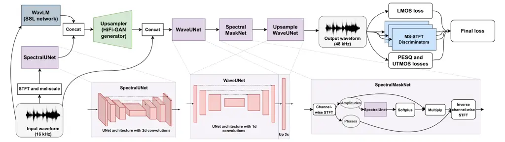
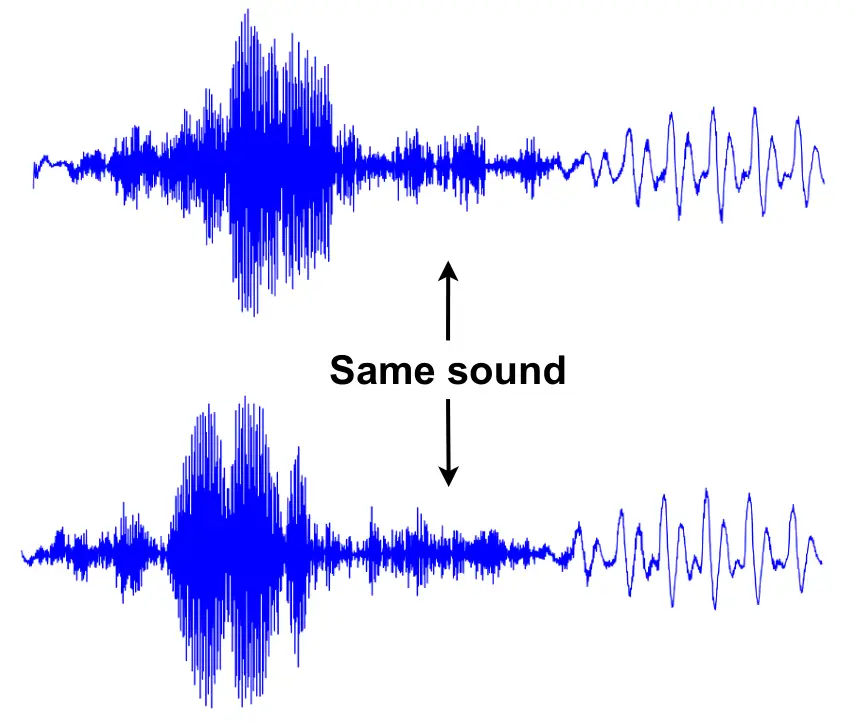
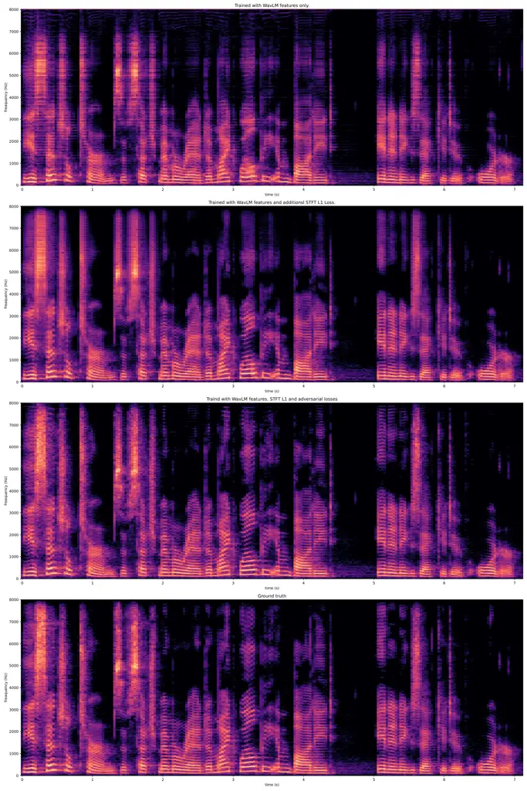
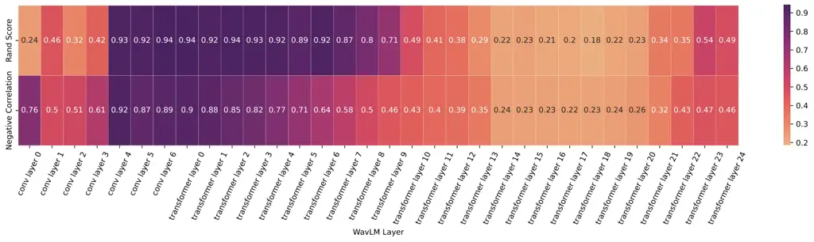
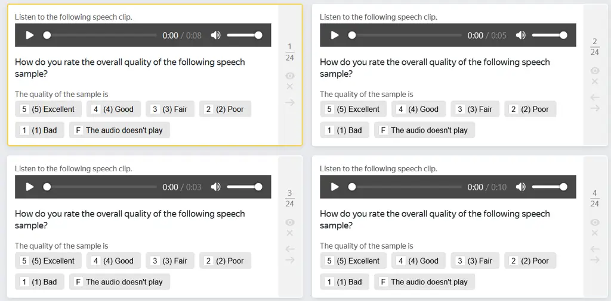
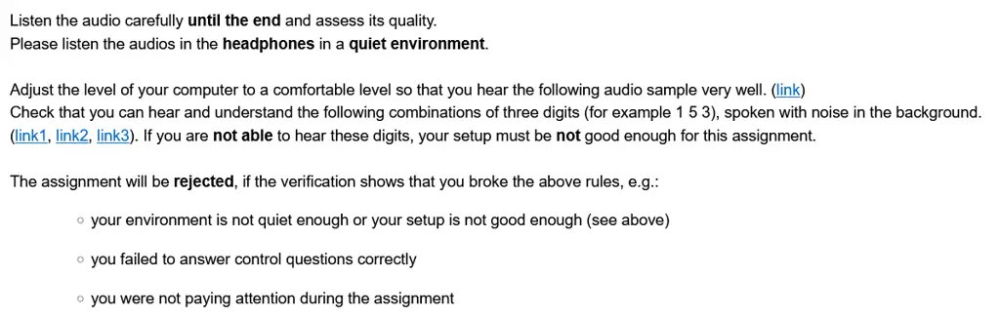

# FINALLY: fast and universal speech enhancement with studio-like quality

Nicholas Babaev^(\*) Affiliation: Samsung Research    Kirill
Tamogashev^(\*) Affiliation: Samsung Research    Azat Saginbaev
Affiliation: Samsung Research    Ivan Shchekotov Affiliation: Samsung
Research    Hanbin Bae Affiliation: Samsung Research    Hosang Sung
Affiliation: Samsung Research    WonJun Lee Affiliation: Samsung Reseach
   Hoon-Young Cho Affiliation: Samsung Research    Pavel Andreev
^(†)^(†)thanks: Equal contribution. Correspondence to
p.andreev@samsung.com. Affiliation: Samsung Research

###### Abstract

In this paper, we address the challenge of speech enhancement in
real-world recordings, which often contain various forms of distortion,
such as background noise, reverberation, and microphone artefacts. We
revisit the use of Generative Adversarial Networks (GANs) for speech
enhancement and theoretically show that GANs are naturally inclined to
seek the point of maximum density within the conditional clean speech
distribution, which, as we argue, is essential for the speech
enhancement task. We study various feature extractors for perceptual
loss to facilitate the stability of adversarial training, developing a
methodology for probing the structure of the feature space. This leads
us to integrate WavLM-based perceptual loss into MS-STFT adversarial
training pipeline, creating an effective and stable training procedure
for the speech enhancement model. The resulting speech enhancement
model, which we refer to as FINALLY, builds upon the HiFi++
architecture, augmented with a WavLM encoder and a novel training
pipeline. Empirical results on various datasets confirm our model’s
ability to produce clear, high-quality speech at 48 kHz, achieving
state-of-the-art performance in the field of speech enhancement. Demo
page:
[https://samsunglabs.github.io/FINALLY-page/](https://samsunglabs.github.io/FINALLY-page/)

## 1 Introduction

Speech recordings are often contaminated with background noise,
reverberation, reduced frequency bandwidth, and other distortions.
Unlike classical speech enhancement (Ephraim & Malah, 1984; Pascual
et al., 2017), which considers each task separately, universal speech
enhancement (Serrà et al., 2022; Su et al., 2021; Liu et al., 2022) aims
to restore speech from all types of distortions simultaneously. Thus,
universal speech enhancement seeks to generalize across a wide range of
distortions, making it more suitable for real-world applications where
multiple distortions may coexist.

Recent studies have categorized the problem of speech enhancement as a
task of learning the clean speech distribution conditioned on degraded
signals (Lemercier et al., 2023; Serrà et al., 2022; Richter et al.,
2023). This problem is often addressed using diffusion models (Ho
et al., 2020; Song et al., 2020), which are renowned for their
exceptional ability to learn distributions. Diffusion models have
recently achieved state-of-the-art results in universal speech
enhancement (Serrà et al., 2022). However, the impressive performance of
diffusion models comes with the high computational cost of their
iterative inference process.

It is important to note that the speech enhancement problem does not
require the model to learn the entire conditional distribution. In
practice, when presented with a noisy speech sample, the goal is often
to obtain the most probable clean speech sample that retains the lexical
content and voice of the original. This contrasts with applications such
as text-to-image synthesis (Ramesh et al., 2022; Lee et al., 2024;
Rombach et al., 2022), where the objective is to generate a variety of
images for each text prompt due to the higher level of uncertainty and
the need for diverse options to select the best image. For most speech
enhancement applications, such as voice calls and compensation for poor
recording conditions, capturing the entire conditional distribution is
not necessary. Instead, it is more important to retrieve the most likely
sample of this distribution (the main mode), which might be a simpler
task.

Diffusion models’ main advantage over generative adversarial networks
(GANs) (Goodfellow et al., 2014) is their ability to capture different
modes of the distribution. However, we argue that this property is not
typically required for the task of speech enhancement and may
unnecessarily complicate the operation of the neural network.
Conversely, we show that GANs tend to retrieve the main mode of the
distribution—precisely what speech enhancement should typically do.

Therefore, in this work, we revisit the GAN framework for speech
enhancement and demonstrate that it provides rapid and high-quality
universal speech enhancement. Our model outperforms both diffusion
models and previous GAN-based models, achieving an unprecedented level
of quality on both simulated and real-world data.

Our main contributions are as follows:

1.  1.  We theoretically analyse the adversarial training with the least
        squares GAN (LS-GAN) loss and demonstrate that a generator
        predicting a single sample per input condition (producing a
        conditional distribution that is a delta function) is incentivized
        to select the point of maximum density. Therefore, we establish that
        LS-GAN training can implicitly regress for the main mode of the
        distribution, aligning with the objectives of the speech enhancement
        problem.
2.  2.  We investigate various feature extractors as backbones for
        perceptual loss and propose criteria for selecting an extractor
        based on the structure of its feature space. These criteria are
        validated by empirical results from a neural vocoding task,
        indicating that the convolutional features of the WavLM neural
        network(Chen et al., 2022b) are well-suited for perceptual loss in
        speech generation.
3.  3.  We develop a novel model for universal speech enhancement that
        integrates the proposed perceptual loss with MS-STFT discriminator
        training (Défossez et al., 2023) and enhances the architecture of
        the HiFi++ generator (Andreev et al., 2022) by combining it with a
        self-supervised pre-trained WavLM encoder (Chen et al., 2022b). Our
        final model delivers state-of-the-art performance on real-world
        data, producing high-quality, studio-like speech at 48 kHz.

## 2 Mode Collapse and Speech Enhancement

The first question that we address is what is the practical purpose of a
speech enhancement model. The practical goal of a speech enhancement
model is to restore the audio signal containing the speech
characteristics of the original recording, including the voice,
linguistic content, and prosody. Thus, loosely speaking, the purpose of
the speech enhancement task for many applications is not “generative” in
its essence, in the sense that the speech enhancement model should not
generate new speech content but rather “refine” existing speech as if it
was recorded in ideal conditions (studio-like quality). From the
mathematical point of view, this means that the speech enhancement model
should retrieve the most probable reconstruction of the clean speech
$`y`$ given the corrupted version $`x`$, i.e.,
$`y=\mathrm{arg\,max}_{y}\ p_{\text{clean}}(y|x)`$.

This formulation re-considers the probabilistic speech enhancement
formulation, which is widely used in the literature. In such
formulation, the speech enhancement model is aimed to capture the entire
conditional distribution $`p_{\text{clean}}(y|x)`$. This formulation
might be especially appealing in situations with high generation
ambiguity, e.g., a low SNR scenario where clean speech content could not
be restored unambiguously. In this case, the speech enhancement model
could be used to generate multiple reconstructions, the best of which is
then selected by the end user. However, we note that this formulation
might be redundant and not particularly relevant for many practical
applications since the ambiguity in generation can be resolved by more
straightforward means such as conditioning on linguistic content
(Koizumi et al., 2023c).

In practice, for many applications, a more natural way of formalizing
speech enhancement is to treat it as a regression problem which aims at
predicting the point of highest probability of the conditional
distribution $`\mathrm{arg\,max}_{y}\ p_{\text{clean}}(y|x)`$. This
formulation has the advantage of simplifying the task, since finding the
highest mode of the distribution might be significantly easier than
learning the entire distribution. Therefore, the speech enhancement
models built for this formulation are likely to be more efficient after
deployment since they solve a simpler task. We note that in the context
of speech enhancement, the speed of inference is always of major concern
in practice.

Given this formulation, we argue that the framework of generative
adversarial networks (GANs) is more naturally suited for the speech
enhancement problem than diffusion models. We show that GAN training
naturally leads to the mode-seeking behaviour of the generator, which
aligns with the formulation introduced above. Additionally, GANs enjoy
one forward pass inference, which is in contrast to the iterative nature
of diffusion models.

Let $`p_{g}(y|x)`$ be a family of waveform distributions produced by the
generator $`g_{\theta}(x)`$. Mao et al. (2017) showed that training with
Least Squares GAN (LS-GAN) leads to the minimization of the Pearson
$`\chi^{2}`$ divergence
$`\chi^{2}_{\text{Pearson}}\left(p_{g}\middle\|\frac{p_{\text{clean}}+p_{g}}{2}\right)`$.
We propose that if $`p_{g}(y|x)`$ approaches $`\delta(y-g_{\theta}(x))`$
under some parametrization, the minimization of this divergence leads to
$`g_{\theta}(x)=\mathrm{arg\,max}_{y}\ p_{\text{clean}}(y|x)`$. This
means that if the generator deterministically predicts the clean
waveform from the degraded signal, the LS-GAN loss encourages the
generator to predict the point of maximum $`p_{\text{clean}}(y|x)`$
density. We note that although prior work by (Li & Farnia, 2023)
demonstrated the mode-covering property for the optimization of Pearson
$`\chi^{2}`$ divergence, our result pertains to a deterministic
generator setting, which is outside the scope of analysis provided by Li
& Farnia (2023).

To prove this result, we consider the delta function as a limit of
indicator density functions
$`p^{\xi}_{g}(y|x)=\xi^{n}/2^{n}\cdot\mathbf{1}_{y-g_{\theta}(x)\in[-1/\xi,1/\xi]^{n}}`$,
i.e., $`p^{\xi}_{g}(y|x)=\xi^{n}/2^{n}`$ if
$`y-g_{\theta}(x)\in[-1/\xi,1/\xi]^{n}`$ and 0 otherwise, where $`n`$ is
the number of dimensions of $`y`$. Note that
$`\int p^{\xi}_{g}(y|x)\,dy=1`$ for any positive $`\xi`$ and
$`\lim_{\xi\rightarrow+\infty}p^{\xi}_{g}(y|x)=\delta(y-g_{\theta}(x))`$.
This approximation of the delta function by such a limit is practical
due to the finite precision arithmetic used within computers; in other
words, the delta function within computer arithmetic is actually an
indicator function.

###### Proposition 1.

Let $`p_{\text{clean}}(y|x)>0`$ be a finite and Lipschitz continuous
density function with a unique global maximum and
$`p^{\xi}_{g}(y|x)=\xi^{n}/2^{n}\cdot\mathbf{1}_{y-g_{\theta}(x)\in[-1/\xi,1/\xi]^{n}}`$,
then

```math
\lim_{\xi\rightarrow+\infty}\underset{g_{\theta}(x)}{\mathrm{arg\,min}}\ \chi^{2}_{\text{Pearson}}(p_{g}^{\xi}||(p_{\text{clean}}+p_{g}^{\xi})/2)=\underset{y}{\mathrm{arg\,max}}\ p_{\text{clean}}(y|x) \tag{1}
```

Thus, LS-GAN training under ideal conditions should lead to the solution
$`g_{\theta}(x)=\mathrm{arg\,max}_{y}\ p_{\text{clean}}(y|x)`$ for the
generator. In practice, however, success is highly dependent on
technicalities, such as additional losses to stabilize training and
architectures of neural networks. Below, we address these questions by
revisiting the notion of perceptual loss for audio generation and
assessing the effectiveness of neural architectures.

## 3 Perceptual Loss for Speech Generation

Adversarial training is known for its instability issues (Brock et al.,
2018). It often leads to suboptimal solutions, mode collapse, and
gradient explosions. For paired tasks, including speech enhancement,
adversarial losses are often accompanied by additional regressive losses
to stabilize training and guide the generator towards useful solutions
(Kong et al., 2020; Su et al., 2020). In the context of GAN mode-seeking
behaviour discussed above, regressive losses could be seen as a merit to
push the generator towards the “right” (most-probable) mode. Therefore,
finding an appropriate regression loss to guide adversarial training is
of significant importance.

Historically, initial attempts to apply deep learning methods to speech
enhancement were based on treating this problem as a predictive task
(Defossez et al., 2020; Hao et al., 2021; Chen et al., 2022a; Isik
et al., 2020). Following the principle of empirical risk minimization,
the goal of predictive modelling is to find a model with minimal average
error over the training data. Given a noisy waveform or spectrogram,
these approaches attempt to predict the clean signal by minimizing
point-wise distance in waveform and spectrum domains or jointly in both
domains, thus treating this problem as a predictive task. However, given
the severe degradations applied to the signal, there is an inherent
uncertainty in the restoration of the speech signal (i.e., given the
degraded signal, the clean signal is not restored unambiguously), which
often leads to oversmoothing (averaging) of the predicted speech. A
similar phenomenon is widely known in computer vision (Ledig et al.,
2017).

One promising idea to reduce the averaging effect is to choose an
appropriate representation space for regression, which is less
“entangled” than waveform or spectrogram space. In simpler terms, the
regression space should be designed so that averaged representation of
sounds that are indistinguishable to humans (such as the same phoneme
spoken by the same speaker with the same prosody) is still
representation of this sound (see Section B.1).

We formulate two heuristic rules to compare different regression spaces
based on their structure:

- •
  Clustering rule: Representations of identical speech sounds should
  form one cluster that is separable from clusters formed by different
  sounds.
- •
  SNR rule: Representations of speech sounds contaminated by different
  levels of additive noise should move away from the cluster of clean
  sounds monotonically with the increase in the noise level.

The clustering rule ensures that minimizing the distance between samples
in the feature space causes the samples to correspond to the same sound.
The SNR rule ensures that minimizing the distance between features does
not contaminate the signal with noise, meaning noisy samples are placed
distantly from clean samples.

Figure 1: Illustration of heuristic rules for feature space structure.
The Clustering rule (left) states that representations of the same
speech sound should form clusters. The SNR rule (right) states that
noise samples should deviate from the centre of the cluster as the
amount of noise increases. Illustrations created using real samples are
presented in  Figure 8,  Figure 7

In practice, we check these conditions by the following procedure:

1.  1.  We sample identical speech sounds with a multi-speaker VITS
        text-to-speech model (Kim et al., 2021). We define the group of
        waveforms corresponding to the same sound as 0.5-second waveform
        segments generated by the same speaker with the same text and the
        same phoneme duration (i.e., the stochastic duration predictor is
        used only once for each group). Thus, the waveform variation is
        produced due to sampling of latents from the prior distribution. We
        note that we do not explicitly fix the prosody; however, we observed
        that prosody variation was low by default and the sounds generated
        by this procedure were mostly perceptually indistinguishable from
        each other while corresponding to different waveform realizations.
        Overall, we define 354 groups of sounds with 80 speakers saying 177
        different phrases, 2 different speakers for each phrase; we sample
        20 samples for each group, totalling 7080 waveform segments
        corresponding to 354 groups.
2.  2.  Each waveform segment is then mapped to the feature space, and the
        resulting tensors are flattened to obtain a vector for each sample.
        The vectors are clustered using K-means clustering (MacQueen et al.,
        1967), the number of clusters is set to the number of groups (354).
        After clustering, we compute the Rand index (Rand, 1971) of the
        clustering produced by K-means with the clustering induced by
        initial groups of sounds splits. We treat the resulting number as a
        way to measure the adherence to the clustering rule.
3.  3.  Each waveform segment within a group is randomly mixed with noise at
        SNR levels ranging from 10 to 20 dB. The segments are then mapped to
        the feature space to obtain a vector for each sample. For each noisy
        sample, we compute the Euclidean distance between its features and
        the centre of the clean feature cluster. After that, we compute the
        negative Spearman’s rank correlation between the SNR level and the
        distance from the sample to the centre of the cluster. The negative
        correlations are averaged over all groups of sounds, and the
        resulting number is treated as a quantitative measure of adherence
        to the SNR rule.

Using these metrics, we assess the effectiveness of different feature
spaces formed by several speech feature extractors, as well as
conventional representations of speech. Namely, we produce features by
Wav2Vec 2.0 (Baevski et al., 2020), WavLM (Chen et al., 2022b), the
encoder of EnCodec (Défossez et al., 2023), and CDPAM (Manocha et al.,
2021). As a conventional representation, we use waveform and spectrogram
features. For Wav2Vec 2.0 and WavLM, we consider the output of the last
transformer layer and the output of the convolutional encoder as
separate cases. We also train a HiFi-GAN generator (Kong et al., 2020)
with each feature type used as a representation for mean squared error
loss computation on a neural vocoding task. To assess experimentally the
suitability of the feature space to be used as a loss function for
waveform generation, we report MOS scores for samples generated by
vocoders trained with each feature map. The results are presented in
Table 1.

[TABLE]

Table 1: Comparison of different features using Clustering rule, SNR
rule, and MOS on neural vocoding.

As can be seen, the features extracted by the convolutional encoder of
the WavLM model present the best performance according to both our
internal metrics and MOS score on the neural vocoding task. We have also
tested the other layers of WavLM but did not observe significant
improvements when using other layers (see Section B.4). Empirically, we
have found that if WavLM-conv feature loss is used together with
spectrogram loss (L1-distance magnitudes of STFT), the performance on
the vocoding task increases significantly, likely due to the looseness
of the WavLM representation (Section B.1). Without any adversarial
training, the WavLM-conv+L1-STFT loss (LMOS-loss, Equation 2) achieves
an MOS score of $`4.31\pm 0.08`$, approaching the original adversarially
trained HiFi GAN generator which achieves $`4.69\pm 0.05`$
(Section B.3).

## 4 FINALLY

### 4.1 Architecture

Our method is based on HiFi++ (Andreev et al., 2022). The HiFi++
generator is a four-component neural network consisting of SpectralUNet,
Upsampler, WaveUNet, and SpectralMaskNet modules. SpectralUNet is
responsible for initial preprocessing of audio in the spectral domain
using two-dimensional convolutions. The Upsampler is a HiFi-GAN
generator-based module that increases the temporal resolution of the
input tensor, mapping it to the waveform domain. WaveUNet performs
post-processing in the waveform domain and improves the output of the
Upsampler by incorporating phase information gleaned directly from the
raw input waveform. Finally, SpectralMaskNet is applied to perform
spectrum-based post-processing and, thus, remove any possible artefacts
that remained after WaveUNet. Thus, the model alternates between time
and frequency domains, allowing for effective audio restoration.

We introduce two modifications to the HiFi++ generator’s architecture.
First, we modify the generator by incorporating WavLM-large model output
(last hidden state of the transformer) as an additional input to the
Upsampler. Prior works (Hung et al., 2022; Byun et al., 2023) have
demonstrated the usefulness of Self-Supervised Learning (SSL) features
for speech enhancement tasks, and we validate this by observing
significant performance gains from using SSL features. Second, we
introduce the Upsample WaveUNet at the end of the generator. This module
acts as a learnable upsampler of the signal sampling rate. For its
architecture, we use the WaveUNet with an additional convolutional
upsampling block in the decoder that upsamples the temporal resolution
by 3 times. This allows the model to output a 48 kHz signal while taking
a 16 kHz signal as input.



Figure 2: FINALLY model architecture.

### 4.2 Data and training

We use LibriTTS-R (Koizumi et al., 2023b), DAPS-clean (Mysore, 2014) as
the sources of clean speech data. LibriTTS-R is used at 16 kHz, while
DAPS at 48 kHz. Noise samples were taken from the DNS dataset (Dubey
et al., 2022). After mixing with noise, we apply several digital
distortion effects (see Footnote 2 for details).

We train the model in three stages. The first two stages concentrate on
restoring the original speech content, and the final stage aims to
enhance the aesthetic perception of the speech. The multi-stage approach
is necessary due to the characteristics of the employed datasets: the
LibriTTS-R dataset has a lot of samples but limited perceptual quality,
whereas the DAPS dataset is high-quality but contains a smaller number
of samples. Consequently, we utilize the LibriTTS-R dataset for learning
speech content restoration and the DAPS dataset for aesthetic
stylization.

The loss functions that we use can be written as follows:

```math
\mathcal{L}_{\text{LMOS}}(\theta)=\underset{x,y\sim p(x,y)}{\mathbb{E}}\left[100\cdot\|\phi(y)-\phi(g_{\theta}(x))\|_{2}^{2}+\||\mathrm{STFT}(y)|-|\mathrm{STFT}(g_{\theta}(x))|\|_{1}\right], \tag{2}
```

```math
\displaystyle\mathcal{L}_{\text{gen}}(\theta)=\underbrace{\overbrace{\underbrace{\lambda_{\text{LMOS}}\cdot\mathcal{L}_{\text{LMOS}}(\theta)}_{\text{1st stage (16 kHz)}}+\lambda_{\text{GAN}}\cdot\mathcal{L}_{\text{GAN-gen}}(\theta)+\lambda_{\text{FM}}\cdot\mathcal{L}_{\text{FM}}(\theta)}^{\text{2nd stage (16 kHz)}}+\lambda_{\text{HF}}\cdot\mathcal{L}_{\text{HF}}(\theta)}_{\text{3rd stage (48 kHz)}}, \tag{3}
```

```math
\displaystyle\mathcal{L}_{\text{disc}}(\varphi_{i})=\mathcal{L}_{\text{GAN-disc}}(\varphi_{i}),\quad i=1,\ldots,k. \tag{4}
```

Here, $`\phi`$ denotes the WavLM-Conv feature mapping, $`g_{\theta}(x)`$
denotes the generator neural network with parameters $`\theta`$,
$`\mathcal{L}_{\text{GAN-gen}}(\theta)`$ denotes the LS-GAN generator
loss (Mao et al., 2017), $`\mathcal{L}(\theta)`$ denotes the combined
generator loss, $`\mathcal{L}_{\text{GAN-disc}}(\varphi_{i})`$ denotes
the LS-GAN discriminator (Mao et al., 2017) loss for the $`i`$-th
discriminator with parameters $`\varphi_{i}`$,
$`\mathcal{L}_{\text{FM}}`$ denotes the feature matching loss (Kumar
et al., 2019; Défossez et al., 2023), $`\mathcal{L}_{\text{HF}}`$
denotes the human feedback loss, and $`\lambda_{\textbf{*}}`$ denotes
the corresponding loss weights. Following Défossez et al. (2023), we
employ 5 discriminators with STFT window lengths of
$`[2048,1024,512,256,128]`$ for the 2nd stage and 5 discriminators with
STFT window lengths of $`[4096,2048,1024,512,256]`$ for the 3rd stage,
which allows for the capture of spectral information at different
resolutions.

Stage 1: Firstly, we train the FINALLY architecture without Upsample
WaveUNet (we refer to this truncated architecture as FINALLY-16) at a 16
kHz sampling rate on the LibriTTS-R dataset. We train the model with the
proposed LMOS regression loss to provide the generator with a better
initialization before adversarial training.

Stage 2: Second, we start adversarial training of FINALLY-16 with
MS-STFT discriminators (Défossez et al., 2023) and the LMOS loss. The
learning of the generator undergoes a linear warm-up to give the
discriminators time to learn meaningful representations. At this stage,
we focus the generator on producing a reliable reconstruction of
linguistic content by assigning larger values for LMOS and feature
matching losses ($`\lambda_{\text{GAN-gen}}=0.4`$,
$`\lambda_{\text{FM}}=20`$, $`\lambda_{\text{LMOS}}=20`$).

Stage 3: Lastly, we attach Upsample WaveUNet to FINALLY-16 and start
adversarial training of the FINALLY model to produce 48 kHz output. We
subsample 48 kHz waveforms of the DAPS dataset and apply distortions to
form the 16 kHz input. The discriminators are initialized randomly, and
the learning rate for the generator undergoes a warm-up similar to the
second stage. This stage is focused on producing the final output;
therefore, we focus the generator on perceptual quality by increasing
the relative weight of GAN loss ($`\lambda_{\text{GAN-gen}}=5`$,
$`\lambda_{\text{FM}}=15`$, $`\lambda_{\text{LMOS}}=0.5`$) and
introducing additional human feedback loss $`\mathcal{L}_{\text{HF}}`$,
which is based on UTMOS and PESQ metrics. The UTMOS loss (Saeki et al., 2022) is based on a neural network model that simulates subjective MOS
metric results. On the other hand, the PESQ loss¹¹ 1
[https://github.com/audiolabs/torch-pesq](https://github.com/audiolabs/torch-pesq)
delivers a differentiable version of the PESQ metric (Rix et al.,
2001b), as presented by Kim et al. (2019); Martin-Donas et al. (2018).
Both UTMOS and PESQ help enhance speech aesthetic quality, as they
incorporate insights from human preference studies. These metrics are
differentiable with respect to their inputs, making them suitable for
use as loss functions (multiplied by negative constants)
$`\mathcal{L}_{\text{HF}}=-20\cdot\mathcal{L}_{\text{UTMOS}}-2\cdot\mathcal{L}_{\text{PESQ}}`$,
$`\lambda_{\text{HF}}=1`$.

## 5 Related Work

#### Self-supervised features for speech enhancement

Several works have employed self-supervised (SSL) features  (Baevski
et al., 2020; Chen et al., 2022b; Hsu et al., 2021) for training of
speech enhancement models as intermediate representation (Wang et al.,
2024; Koizumi et al., 2023c), auxiliary space for loss computation (Sato
et al., 2023; Hsieh et al., 2020; Close et al., 2023a; Close et al.,
2023b) or input features (Hung et al., 2022; Byun et al., 2023). Sato
et al. (2023); Close et al. (2023a); Close et al. (2023b); Hsieh et al.
(2020) proposed to use features of self-supervised models as an
auxiliary space for regression loss computation. In our work, we
similarly study the effect of SSL features on speech enhancement models;
however, our study systematically compares different feature backbones
and develops criteria for probing the structure of different feature
spaces. In particular, we show that features of the WavLM’s
convolutional encoder are the most effective for the loss function,
while recent work (Sato et al., 2023) has used the outputs of
transformer layers. Close et al. (2023a); Close et al. (2023b) proposed
a similar loss function for speech enhancement based on convolutional
features of HuBERT (Hsu et al., 2021), our work can be considered as
extension of this work as we show that additional spectrogram loss
greatly benefits the quality and provide experimental evidence for the
advantages of LMOS-loss usage for adversarial training.

#### GAN-based approaches

The HiFi GAN works (Su et al., 2020; Su et al., 2021) consider a
GAN-based approach to speech enhancement, which is similar to ours.
Importantly, these works base their generator architectures on
feed-forward WaveNet (Rethage et al., 2018), a fully-convolutional
neural network that operates at full input resolution, leading to slow
training and inference times. We show that our model is able to achieve
superior quality compared to this model while being much more efficient.

Koizumi et al. (2023c) proposes to use w2v-BERT features (Chung et al., 2021) as intermediate representations for speech restoration. The
features extracted from the noisy waveform are processed by a feature
cleanser which is conditioned on the text representation extracted from
transcripts via PnG-BERT, and speaker embedding extracted from the
waveform. The feature cleanser is trained to minimize a regression loss
between w2v-BERT features extracted from the clean signal and the
predicted ones. At the second stage, the WaveFit vocoder is trained to
synthesize a waveform based on the predicted features (Koizumi et al.,
2023a). An important difference with our work is that the method uses a
text transcript, while our model does not. Despite this difference, we
show that our model delivers better perceptual quality as reported by
human listeners (Appendix C).

#### Diffusion-based approaches

The recent success of diffusion-based generative models has led to their
use in a wide array of applications, including speech enhancement.
Numerous studies (Lemercier et al., 2023; Welker et al., 2022; Richter
et al., 2023; Lay et al., 2023) have applied diffusion models in various
configurations to generate high-fidelity, clear speech from noisy input.
For instance, Welker et al. (2022); Richter et al. (2023) introduced a
novel stochastic diffusion process to design a generative model for
speech enhancement in the complex STFT domain for speech denoising and
dereverberation. In the UNIVERSE study (Serrà et al., 2022), the authors
propose a diffusion model for universal speech enhancement. They create
a paired dataset using 55 different distortions and train a conditional
diffusion model on it. Although their model performs well in terms of
quality, it requires up to 50 diffusion steps to produce the final
audio. The authors demonstrate that the number of steps can be reduced;
however, the effect of this reduction on perceptual quality remains
somewhat unclear. In our experiments, we show that our model can achieve
similar results with just a single forward pass.

## 6 Results

### 6.1 Evaluation

We evaluate our models using the following sources of data:

VoxCeleb Data: 50 audio clips selected from VoxCeleb1 (Nagrani et al., 2017) to cover the Speech Transmission Index (STI) range of 0.75-0.99
uniformly and balanced across male and female speakers.

UNIVERSE Data: 100 audio clips randomly generated by the UNIVERSE (Serrà
et al., 2022) authors from clean utterances sampled from VCTK and
Harvard sentences, together with noises/backgrounds from DEMAND and
FSDnoisy18k. The data contains various artificially simulated
distortions including band limiting, reverberation, codec, and
transmission artefacts. Please refer to (Serrà et al., 2022) for further
details. The validation data of UNIVERSE is artificially simulated from
clean speech recordings using the same pipeline that the authors
utilized for training. Therefore, we must note that the comparison is
conducted in a manner advantageous to UNIVERSE, since our data
simulation pipeline is different.

VCTK-DEMAND: we use validation samples from popular Valentini denoising
benchmark (Valentini-Botinhao et al., 2017). This dataset is used for a
broad comparison with a wide range of speech enhancement models. The
test set (824 utterances) includes artificially simulated noisy samples
from 2 speakers with 4 SNR (17.5, 12.5, 7.5, and 2.5 dB).

We utilize DNSMOS (Reddy et al., 2022), UTMOS (Saeki et al., 2022), and
WV-MOS (Andreev et al., 2022) as non-intrusive metrics to objectively
assess the samples generated by our speech enhancement model on the
VoxCeleb dataset. The non-intrusive nature of these metrics is essential
since the dataset comprises recordings from real-life scenarios, lacking
ground-truth samples.

In addition, we compute the Phoneme Error Rate (PhER) and Word Error
Rate (WER) by comparing ground truths with the generated samples (see
Appendix E for details) for both the UNIVERSE and VCTK-DEMAND datasets.
For subjective quality assessment, we conduct 5-point Mean Opinion Score
(MOS) tests. All audio clips are normalized to ensure volume differences
do not influence the raters’ evaluations. The raters are required to be
English speakers using appropriate listening equipment (more details in
Figure 10).

The Real-Time Factor (RTF) is determined by measuring the processing
time (in seconds) for a 10-second audio segment on a V100 GPU and then
dividing this time by 10. All confidence intervals are calculated using
bootstrapping method.

We also evaluate our model on the VCTK-DEMAND
dataset (Valentini-Botinhao et al., 2017) with additional metrics such
as PESQ (Rix et al., 2001a), STOI (Taal et al., 2011), and SI-SDR (Roux
et al., 2018). These metrics are included to ensure consistent
comparison with previous works.

### 6.2 Comparison with existing approaches

We consider BBED (Lay et al., 2023), STORM (Lemercier et al., 2023), and
UNIVERSE (Serrà et al., 2022) diffusion models, along with Voicefixer
and DEMUCS regression models, as our baselines. In addition, we consider
our closest competitor, HiFi-GAN-2, as a GAN-based baseline. The data
for comparison with HiFi-GAN-2 and UNIVERSE were taken from their demo
pages, since the authors did not release any code. We conduct
comparisons with BBED, STORM, Voicefixer, DEMUCS, and HiFi-GAN-2 on
real-world VoxCeleb1 samples and the comparison with UNIVERSE on the
simulated data, provided by the authors of this work. The results are
presented in Table 2. We also compare these models on VCTK-DEMAND
dataset, results can be found in Table 3. We complement this table by
two additional models: MetricGAN+ (Fu et al., 2021) and DB-AIAT (Yu
et al., 2021).

|                                                 |                                |                                |                                |                                |                                |                      |
| ----------------------------------------------- | ------------------------------ | ------------------------------ | ------------------------------ | ------------------------------ | ------------------------------ | -------------------- |
| VoxCeleb (HiFi-GAN-2 validation set, real data) |                                |                                |                                |                                |                                |                      |
| Model                                           | MOS ($`\uparrow`$)             | UTMOS ($`\uparrow`$)           | WV-MOS ($`\uparrow`$)          | DNSMOS ($`\uparrow`$)          | \-                             | RTF ($`\downarrow`$) |
| Input                                           | 3.46 $`\pm`$ 0.07              | 2.76 $`\pm`$ 0.13              | 2.90 $`\pm`$ 0.16              | 2.72 $`\pm`$ 0.11              | \-                             | \-                   |
| VoiceFixer                                      | 3.41 $`\pm`$ 0.07              | 2.60 $`\pm`$ 0.09              | 2.79 $`\pm`$ 0.09              | 3.08 $`\pm`$ 0.06              | \-                             | 0.02                 |
| DEMUCS                                          | 3.79 $`\pm`$ 0.07              | 3.51 $`\pm`$ 0.08              | 3.72 $`\pm`$ 0.08              | 3.27 $`\pm`$ 0.04              | \-                             | 0.08                 |
| STORM                                           | 3.75 $`\pm`$ 0.06              | 3.29 $`\pm`$ 0.08              | 3.54 $`\pm`$ 0.09              | 3.17 $`\pm`$ 0.04              | \-                             | 1.05                 |
| BBED                                            | 3.97 $`\pm`$ 0.06              | 3.30 $`\pm`$ 0.10              | 3.47 $`\pm`$ 0.08              | 3.23 $`\pm`$ 0.04              | \-                             | 0.43                 |
| HiFi-GAN-2                                      | 4.47 $`\pm`$ 0.05              | 3.67 $`\pm`$ 0.09              | 3.96 $`\boldsymbol{\pm}`$ 0.06 | 3.32 $`\boldsymbol{\pm}`$ 0.03 | \-                             | 0.50                 |
| Ours                                            | 4.63 $`\boldsymbol{\pm}`$ 0.04 | 4.05 $`\boldsymbol{\pm}`$ 0.07 | 3.98 $`\boldsymbol{\pm}`$ 0.06 | 3.31 $`\boldsymbol{\pm}`$ 0.04 | \-                             | 0.03                 |
| UNIVERSE validation set (simulated data)        |                                |                                |                                |                                |                                |                      |
| Model                                           | MOS ($`\uparrow`$)             | UTMOS ($`\uparrow`$)           | WV-MOS ($`\uparrow`$)          | DNSMOS ($`\uparrow`$)          | PhER ($`\downarrow`$)          | RTF ($`\downarrow`$) |
| Input                                           | 2.87 $`\pm`$ 0.05              | 2.27 $`\pm`$ 0.28              | 1.72 $`\pm`$ 0.61              | 2.25 $`\pm`$ 0.19              | 0.31 $`\pm`$ 0.05              | \-                   |
| Ground Truth                                    | 4.39 $`\pm`$ 0.05              | 4.26 $`\pm`$ 0.06              | 4.28 $`\pm`$ 0.06              | 3.33 $`\pm`$ 0.04              | 0                              | \-                   |
| UNIVERSE                                        | 4.10 $`\pm`$ 0.07              | 3.89 $`\pm`$ 0.15              | 3.85 $`\pm`$ 0.12              | 3.23 $`\boldsymbol{\pm}`$ 0.07 | 0.20 $`\pm`$ 0.04              | 0.5                  |
| Ours (16 kHz)                                   | 3.99 $`\pm`$ 0.07              | 4.21 $`\boldsymbol{\pm}`$ 0.10 | 4.43 $`\boldsymbol{\pm}`$ 0.07 | 3.25 $`\boldsymbol{\pm}`$ 0.05 | 0.14 $`\boldsymbol{\pm}`$ 0.03 | 0.03                 |
| Ours                                            | 4.23 $`\boldsymbol{\pm}`$ 0.07 | 4.21 $`\boldsymbol{\pm}`$ 0.10 | 4.43 $`\boldsymbol{\pm}`$ 0.08 | 3.25 $`\boldsymbol{\pm}`$ 0.05 | 0.14 $`\boldsymbol{\pm}`$ 0.03 | 0.03                 |

Table 2: Comparison with prior work on Voxceleb and UNIVERSE validation
data.

|               |                                |                                |                                |                                |                                |                                |                               |                                |
| ------------- | ------------------------------ | ------------------------------ | ------------------------------ | ------------------------------ | ------------------------------ | ------------------------------ | ----------------------------- | ------------------------------ |
| Model         | MOS ($`\uparrow`$)             | UTMOS ($`\uparrow`$)           | WV-MOS ($`\uparrow`$)          | DNSMOS ($`\uparrow`$)          | PESQ ($`\uparrow`$)            | STOI ($`\uparrow`$)            | SI-SDR ($`\uparrow`$)         | WER ($`\downarrow`$)           |
| Input         | $`3.18\pm 0.07`$               | $`3.06\pm 0.14`$               | $`2.99\pm 0.24`$               | $`2.53\pm 0.10`$               | $`1.98\pm 0.17`$               | $`0.92\pm 0.01`$               | $`8.4\pm 1.2`$                | $`0.09\pm 0.03`$               |
| MetricGAN+    | $`3.75\pm 0.06`$               | $`3.62\pm 0.09`$               | $`3.89\pm 0.10`$               | $`2.95\pm 0.05`$               | $`3.14\pm 0.10`$               | $`0.93\pm 0.01`$               | $`8.6\pm 0.7`$                | $`0.10\pm 0.04`$               |
| DEMUCS        | $`3.95\pm 0.06`$               | $`3.95\pm 0.05`$               | $`4.37\pm 0.06`$               | $`3.14\pm 0.04`$               | $`3.04\pm 0.12`$               | 0.95 $`\boldsymbol{\pm}`$ 0.01 | $`18.5\pm 0.6`$               | 0.07 $`\boldsymbol{\pm}`$ 0.03 |
| HiFi++        | $`4.08\pm 0.05`$               | $`3.89\pm 0.06`$               | $`4.36\pm 0.06`$               | $`3.10\pm 0.04`$               | $`2.90\pm 0.12`$               | 0.95 $`\boldsymbol{\pm}`$ 0.01 | $`17.9\pm 0.6`$               | $`0.08\pm 0.03`$               |
| HiFi-GAN-2    | $`4.13\pm 0.05`$               | $`3.99\pm 0.05`$               | $`4.26\pm 0.05`$               | $`3.12\pm 0.05`$               | $`3.14\pm 0.12`$               | 0.95 $`\boldsymbol{\pm}`$ 0.01 | $`18.6\pm 0.6`$               | 0.07 $`\boldsymbol{\pm}`$ 0.03 |
| DB-AIAT       | $`4.22\pm 0.05`$               | $`4.02\pm 0.05`$               | $`4.38\pm 0.06`$               | $`3.18\pm 0.04`$               | 3.26 $`\boldsymbol{\pm}`$ 0.12 | 0.96 $`\boldsymbol{\pm}`$ 0.01 | 19.3 $`\boldsymbol{\pm}`$ 0.8 | 0.07 $`\boldsymbol{\pm}`$ 0.03 |
| Ours (16 kHz) | 4.41 $`\boldsymbol{\pm}`$ 0.04 | 4.32 $`\boldsymbol{\pm}`$ 0.02 | 4.87 $`\boldsymbol{\pm}`$ 0.05 | 3.22 $`\boldsymbol{\pm}`$ 0.04 | $`2.94\pm 0.10`$               | $`0.92\pm 0.01`$               | $`4.6\pm 0.3`$                | 0.07 $`\boldsymbol{\pm}`$ 0.03 |
| Ours (48 kHz) | 4.66 $`\boldsymbol{\pm}`$ 0.04 | 4.32 $`\boldsymbol{\pm}`$ 0.02 | 4.87 $`\boldsymbol{\pm}`$ 0.05 | 3.22 $`\boldsymbol{\pm}`$ 0.04 | $`2.94\pm 0.10`$               | $`0.92\pm 0.01`$               | $`4.6\pm 0.3`$                | 0.07 $`\boldsymbol{\pm}`$ 0.03 |
| GT (16 kHz)   | $`4.26\pm 0.05`$               | $`4.07\pm 0.04`$               | $`4.52\pm 0.04`$               | $`3.16\pm 0.04`$               | –                              | –                              | –                             | –                              |
| GT (48 kHz)   | $`4.56\pm 0.03`$               | $`4.07\pm 0.04`$               | $`4.52\pm 0.04`$               | $`3.16\pm 0.04`$               | –                              | –                              | –                             | –                              |

Table 3: Comparison with the baselines on VCTK-DEMAND.

Importantly, our study confirms the observation from Serrà et al. (2022)
that speech enhancers based on generative models significantly
outperform regression-based approaches. Our model performs comparably in
terms of perceptual MOS quality to all the considered baselines, while
being more than five times as efficient as the closest competitors,
HiFi-GAN-2 and UNIVERSE. We have also found that our model is less prone
to hallucinating linguistic content than UNIVERSE, delivering a lower
Phoneme Error Rate (PhER) value.

Lastly, we would like to comment on the results in Table 3. Our model
outperforms baselines in subjective evaluation and no-reference metrics,
e.g. UTMOS, but underperforms in terms of PESQ (Rix et al., 2001a),
STOI (Taal et al., 2011) and SI-SDR (Roux et al., 2018). Notably, there
are numerous works consistently reporting low correlation of
reference-based metrics with human perceptual judgment (Manocha et al.,
2022; Manjunath, 2009; Andreev et al., 2022). In particular, the
study (Manocha et al., 2022) reports that no-reference metrics
(including DNSMOS, reported in our work) correlate significantly better
with human perception and therefore have higher relevance for objective
comparison between methods. Furthermore, in our study, we report the MOS
score, which directly reflects human judgments of restoration quality.

### 6.3 Ablation study

To validate the improvements proposed in this work, we conduct an
ablation study assessing the effectiveness of the design choices made.

Firstly, we compare the LMOS loss against two other regression losses in
the context of training a small speech enhancement model (10 times
smaller than the final model; please see the Section E.2 for details).
The first regression loss is the Mel-Spectrogram loss, which was
proposed by Kong et al. (2020). As the second alternative, we employ the
Reconstruction loss (RecLoss) proposed by Défossez et al. (2023). It
consists of a combination of L1 and L2 distances between
mel-spectrograms computed with different resolutions. For these
experiments, we conducted a grid search for the weights of each
reconstruction loss (details are in Section E.2) and report results for
the best option in Table 4.

[TABLE]

Table 4: Ablation study (VoxCeleb real data).

The other proposed improvements bring incremental gains in perceptual
MOS quality. Firstly, we add the features of the WavLM encoder as an
additional input to HiFi++. Next, we scale the architecture by
increasing the number of channels within the model. After that, we
concatenate the Upsample WaveUNet with the FINALLY-16 architecture and
implement the 3rd stage of training on the DAPS-clean dataset (48 kHz).
Finally, we use additional human feedback losses (HF Loss) during the
3rd stage to further improve perceptual quality.

Since Table 4 does not clearly demonstrate the advantages of using the
WavLM (Chen et al., 2022b) encoder in terms of MOS, we provide
additional ablation study on more challenging UNIVERSE (Serrà et al., 2022) validation dataset. The results of these additional experiments,
presented in Table 5, clearly demonstrate the importance of WavLM
encoder.

|           | MOS ($`\uparrow`$)                             | UTMOS ($`\uparrow`$)                           | WV-MOS ($`\uparrow`$)                          | DNSMOS ($`\uparrow`$)                          | PhER ($`\downarrow`$)                          |
| --------- | ---------------------------------------------- | ---------------------------------------------- | ---------------------------------------------- | ---------------------------------------------- | ---------------------------------------------- |
| w/o WavLM | $`3.49\pm 0.08`$                               | $`3.33\pm 0.18`$                               | $`3.80\pm 0.15`$                               | $`\textbf{3.15}\boldsymbol{\pm}\textbf{0.09}`$ | $`0.27\pm 0.04`$                               |
| w/ WavLM  | $`\textbf{3.75}\boldsymbol{\pm}\textbf{0.07}`$ | $`\textbf{3.56}\boldsymbol{\pm}\textbf{0.20}`$ | $`\textbf{3.99}\boldsymbol{\pm}\textbf{0.08}`$ | $`\textbf{3.07}\boldsymbol{\pm}\textbf{0.16}`$ | $`\textbf{0.21}\boldsymbol{\pm}\textbf{0.04}`$ |

Table 5: Ablation of WavLM encoder on UNIVERSE validation data.

## 7 Conclusion

In conclusion, we theoretically demonstrate that LS-GAN training
encourages the selection of the point of maximum density within the
conditional clean speech distribution, aligning naturally with the
objectives of speech enhancement. Our empirical investigation identifies
WavLM as an effective backbone for perceptual loss, supporting
adversarial training. By integrating WavLM-based perceptual loss into
the MS-STFT adversarial training pipeline and enhancing the HiFi++
architecture with a WavLM encoder, we develop a novel speech enhancement
model, FINALLY, which achieves state-of-the-art performance, producing
clear and high-quality speech at 48 kHz.

## References

- Andreev et al. (2022) Andreev, P., Alanov, A., Ivanov, O., and
  Vetrov, D. Hifi++: a unified framework for bandwidth extension and
  speech enhancement. _arXiv preprint arXiv:2203.13086_, 2022.
- Baevski et al. (2020) Baevski, A., Zhou, Y., Mohamed, A., and Auli, M.
  wav2vec 2.0: A framework for self-supervised learning of speech
  representations. _Advances in neural information processing systems_,
  33:12449–12460, 2020.
- Brock et al. (2018) Brock, A., Donahue, J., and Simonyan, K. Large
  scale gan training for high fidelity natural image synthesis. _arXiv
  preprint arXiv:1809.11096_, 2018.
- Byun et al. (2023) Byun, J., Ji, Y., Chung, S.-W., Choe, S., and Choi,
  M.-S. An empirical study on speech restoration guided by
  self-supervised speech representation. In _ICASSP 2023-2023 IEEE
  International Conference on Acoustics, Speech and Signal Processing
  (ICASSP)_, pp. 1–5. IEEE, 2023.
- Chen et al. (2022a) Chen, J., Wang, Z., Tuo, D., Wu, Z., Kang, S., and
  Meng, H. Fullsubnet+: Channel attention fullsubnet with complex
  spectrograms for speech enhancement. In _ICASSP 2022-2022 IEEE
  International Conference on Acoustics, Speech and Signal Processing
  (ICASSP)_, pp. 7857–7861. IEEE, 2022a.
- Chen et al. (2022b) Chen, S., Wang, C., Chen, Z., Wu, Y., Liu, S.,
  Chen, Z., Li, J., Kanda, N., Yoshioka, T., Xiao, X., et al. Wavlm:
  Large-scale self-supervised pre-training for full stack speech
  processing. _IEEE Journal of Selected Topics in Signal Processing_,
  16(6):1505–1518, 2022b.
- Chung et al. (2021) Chung, Y.-A., Zhang, Y., Han, W., Chiu, C.-C.,
  Qin, J., Pang, R., and Wu, Y. W2v-bert: Combining contrastive learning
  and masked language modeling for self-supervised speech pre-training.
  In _2021 IEEE Automatic Speech Recognition and Understanding Workshop
  (ASRU)_, pp. 244–250. IEEE, 2021.
- Close et al. (2023a) Close, G., Hain, T., and Goetze, S. The effect of
  spoken language on speech enhancement using self-supervised speech
  representation loss functions. In _2023 IEEE Workshop on Applications
  of Signal Processing to Audio and Acoustics (WASPAA)_, pp. 1–5. IEEE,
  2023a.
- Close et al. (2023b) Close, G., Ravenscroft, W., Hain, T., and
  Goetze, S. Perceive and predict: self-supervised speech representation
  based loss functions for speech enhancement. In _ICASSP 2023-2023 IEEE
  International Conference on Acoustics, Speech and Signal Processing
  (ICASSP)_, pp. 1–5. IEEE, 2023b.
- Defossez et al. (2020) Defossez, A., Synnaeve, G., and Adi, Y. Real
  time speech enhancement in the waveform domain. _arXiv preprint
  arXiv:2006.12847_, 2020.
- Défossez et al. (2023) Défossez, A., Copet, J., Synnaeve, G., and
  Adi, Y. High fidelity neural audio compression. _Transactions on
  Machine Learning Research_, 2023.
- Dubey et al. (2022) Dubey, H., Gopal, V., Cutler, R., Aazami, A.,
  Matusevych, S., Braun, S., Eskimez, S. E., Thakker, M., Yoshioka, T.,
  Gamper, H., et al. Icassp 2022 deep noise suppression challenge. In
  _ICASSP 2022-2022 IEEE International Conference on Acoustics, Speech
  and Signal Processing (ICASSP)_, pp. 9271–9275. IEEE, 2022.
- Ephraim & Malah (1984) Ephraim, Y. and Malah, D. Speech enhancement
  using a minimum-mean square error short-time spectral amplitude
  estimator. _IEEE Transactions on acoustics, speech, and signal
  processing_, 32(6):1109–1121, 1984.
- Fu et al. (2021) Fu, S., Yu, C., Hsieh, T., Plantinga, P., Ravanelli,
  M., Lu, X., and Tsao, Y. Metricgan+: An improved version of metricgan
  for speech enhancement. _CoRR_, abs/2104.03538, 2021. URL
  [https://arxiv.org/abs/2104.03538](https://arxiv.org/abs/2104.03538).
- Goodfellow et al. (2014) Goodfellow, I., Pouget-Abadie, J., Mirza, M.,
  Xu, B., Warde-Farley, D., Ozair, S., Courville, A., and Bengio, Y.
  Generative adversarial nets. _Advances in neural information
  processing systems_, 27, 2014.
- Hao et al. (2021) Hao, X., Su, X., Horaud, R., and Li, X. Fullsubnet:
  a full-band and sub-band fusion model for real-time single-channel
  speech enhancement. In _ICASSP 2021-2021 IEEE International Conference
  on Acoustics, Speech and Signal Processing (ICASSP)_, pp. 6633–6637.
  IEEE, 2021.
- Ho et al. (2020) Ho, J., Jain, A., and Abbeel, P. Denoising diffusion
  probabilistic models. _Advances in Neural Information Processing
  Systems_, 33:6840–6851, 2020.
- Hsieh et al. (2020) Hsieh, T.-A., Yu, C., Fu, S.-W., Lu, X., and
  Tsao, Y. Improving perceptual quality by phone-fortified perceptual
  loss using wasserstein distance for speech enhancement. _arXiv
  preprint arXiv:2010.15174_, 2020.
- Hsieh et al. (2021) Hsieh, T.-A., Yu, C., Fu, S.-W., Lu, X., and
  Tsao, Y. Improving perceptual quality by phone-fortified perceptual
  loss using wasserstein distance for speech enhancement, 2021.
- Hsu et al. (2021) Hsu, W.-N., Bolte, B., Tsai, Y.-H. H., Lakhotia, K.,
  Salakhutdinov, R., and Mohamed, A. Hubert: Self-supervised speech
  representation learning by masked prediction of hidden units.
  _IEEE/ACM Transactions on Audio, Speech, and Language Processing_,
  29:3451–3460, 2021.
- Hung et al. (2022) Hung, K.-H., Fu, S.-w., Tseng, H.-H., Chiang,
  H.-T., Tsao, Y., and Lin, C.-W. Boosting self-supervised embeddings
  for speech enhancement. _arXiv preprint arXiv:2204.03339_, 2022.
- Hwang et al. (2023) Hwang, J., Hira, M., Chen, C., Zhang, X., Ni, Z.,
  Sun, G., Ma, P., Huang, R., Pratap, V., Zhang, Y., Kumar, A., Yu,
  C.-Y., Zhu, C., Liu, C., Kahn, J., Ravanelli, M., Sun, P., Watanabe,
  S., Shi, Y., Tao, Y., Scheibler, R., Cornell, S., Kim, S., and
  Petridis, S. Torchaudio 2.1: Advancing speech recognition,
  self-supervised learning, and audio processing components for
  pytorch, 2023.
- Isik et al. (2020) Isik, U., Giri, R., Phansalkar, N., Valin, J.-M.,
  Helwani, K., and Krishnaswamy, A. Poconet: Better speech enhancement
  with frequency-positional embeddings, semi-supervised conversational
  data, and biased loss. _arXiv preprint arXiv:2008.04470_, 2020.
- Ito & Johnson (2017) Ito, K. and Johnson, L. The lj speech dataset.
  [https://keithito.com/LJ-Speech-Dataset/](https://keithito.com/LJ-Speech-Dataset/), 2017.
- Kim et al. (2019) Kim, J., El-Khamy, M., and Lee, J. End-to-end
  multi-task denoising for joint sdr and pesq optimization. _arXiv
  preprint arXiv:1901.09146_, 2019.
- Kim et al. (2021) Kim, J., Kong, J., and Son, J. Conditional
  variational autoencoder with adversarial learning for end-to-end
  text-to-speech. In _International Conference on Machine Learning_, pp.
  5530–5540. PMLR, 2021.
- Koizumi et al. (2023a) Koizumi, Y., Yatabe, K., Zen, H., and
  Bacchiani, M. Wavefit: An iterative and non-autoregressive neural
  vocoder based on fixed-point iteration. In _2022 IEEE Spoken Language
  Technology Workshop (SLT)_, pp. 884–891. IEEE, 2023a.
- Koizumi et al. (2023b) Koizumi, Y., Zen, H., Karita, S., Ding, Y.,
  Yatabe, K., Morioka, N., Bacchiani, M., Zhang, Y., Han, W., and
  Bapna, A. Libritts-r: A restored multi-speaker text-to-speech corpus.
  _arXiv preprint arXiv:2305.18802_, 2023b.
- Koizumi et al. (2023c) Koizumi, Y., Zen, H., Karita, S., Ding, Y.,
  Yatabe, K., Morioka, N., Zhang, Y., Han, W., Bapna, A., and
  Bacchiani, M. Miipher: A robust speech restoration model integrating
  self-supervised speech and text representations. In _2023 IEEE
  Workshop on Applications of Signal Processing to Audio and Acoustics
  (WASPAA)_, pp. 1–5. IEEE, 2023c.
- Kong et al. (2020) Kong, J., Kim, J., and Bae, J. Hifi-gan: Generative
  adversarial networks for efficient and high fidelity speech synthesis.
  _Advances in Neural Information Processing Systems_,
  33:17022–17033, 2020.
- Kumar et al. (2019) Kumar, K., Kumar, R., De Boissiere, T., Gestin,
  L., Teoh, W. Z., Sotelo, J., De Brebisson, A., Bengio, Y., and
  Courville, A. C. Melgan: Generative adversarial networks for
  conditional waveform synthesis. _Advances in neural information
  processing systems_, 32, 2019.
- Lay et al. (2023) Lay, B., Welker, S., Richter, J., and Gerkmann, T.
  Reducing the prior mismatch of stochastic differential equations for
  diffusion-based speech enhancement. _arXiv preprint
  arXiv:2302.14748_, 2023.
- Ledig et al. (2017) Ledig, C., Theis, L., Huszár, F., Caballero, J.,
  Cunningham, A., Acosta, A., Aitken, A., Tejani, A., Totz, J., Wang,
  Z., et al. Photo-realistic single image super-resolution using a
  generative adversarial network. In _Proceedings of the IEEE conference
  on computer vision and pattern recognition_, pp. 4681–4690, 2017.
- Lee et al. (2024) Lee, T., Yasunaga, M., Meng, C., Mai, Y., Park,
  J. S., Gupta, A., Zhang, Y., Narayanan, D., Teufel, H., Bellagente,
  M., et al. Holistic evaluation of text-to-image models. _Advances in
  Neural Information Processing Systems_, 36, 2024.
- Lemercier et al. (2023) Lemercier, J.-M., Richter, J., Welker, S., and
  Gerkmann, T. Storm: A diffusion-based stochastic regeneration model
  for speech enhancement and dereverberation. _IEEE/ACM Transactions on
  Audio, Speech, and Language Processing_, 2023.
- Li & Farnia (2023) Li, C. T. and Farnia, F. Mode-seeking divergences:
  theory and applications to gans. In _International Conference on
  Artificial Intelligence and Statistics_, pp. 8321–8350. PMLR, 2023.
- Liu et al. (2022) Liu, H., Liu, X., Kong, Q., Tian, Q., Zhao, Y.,
  Wang, D., Huang, C., and Wang, Y. Voicefixer: A unified framework for
  high-fidelity speech restoration. _arXiv preprint
  arXiv:2204.05841_, 2022.
- Loshchilov & Hutter (2017) Loshchilov, I. and Hutter, F. Fixing weight
  decay regularization in adam. _CoRR_, abs/1711.05101, 2017. URL
  [http://arxiv.org/abs/1711.05101](http://arxiv.org/abs/1711.05101).
- MacQueen et al. (1967) MacQueen, J. et al. Some methods for
  classification and analysis of multivariate observations. In
  _Proceedings of the fifth Berkeley symposium on mathematical
  statistics and probability_, volume 1, pp. 281–297. Oakland, CA,
  USA, 1967.
- Manjunath (2009) Manjunath, T. Limitations of perceptual evaluation of
  speech quality on voip systems. In _2009 IEEE International Symposium
  on Broadband Multimedia Systems and Broadcasting_, pp. 1–6, 2009. doi:
  10.1109/ISBMSB.2009.5133799.
- Manocha et al. (2021) Manocha, P., Jin, Z., Zhang, R., and
  Finkelstein, A. Cdpam: Contrastive learning for perceptual audio
  similarity. In _ICASSP 2021-2021 IEEE International Conference on
  Acoustics, Speech and Signal Processing (ICASSP)_, pp. 196–200.
  IEEE, 2021.
- Manocha et al. (2022) Manocha, P., Jin, Z., and Finkelstein, A. Audio
  similarity is unreliable as a proxy for audio quality, 2022. URL
  [https://arxiv.org/abs/2206.13411](https://arxiv.org/abs/2206.13411).
- Mao et al. (2017) Mao, X., Li, Q., Xie, H., Lau, R. Y., Wang, Z., and
  Paul Smolley, S. Least squares generative adversarial networks. In
  _Proceedings of the IEEE international conference on computer vision_,
  pp. 2794–2802, 2017.
- Martin-Donas et al. (2018) Martin-Donas, J. M., Gomez, A. M.,
  Gonzalez, J. A., and Peinado, A. M. A deep learning loss function
  based on the perceptual evaluation of the speech quality. _IEEE Signal
  processing letters_, 25(11):1680–1684, 2018.
- Mysore (2014) Mysore, G. J. Can we automatically transform speech
  recorded on common consumer devices in real-world environments into
  professional production quality speech?—a dataset, insights, and
  challenges. _IEEE Signal Processing Letters_, 22(8):1006–1010, 2014.
- Nagrani et al. (2017) Nagrani, A., Chung, J. S., and Zisserman, A.
  Voxceleb: a large-scale speaker identification dataset. _arXiv
  preprint arXiv:1706.08612_, 2017.
- Pascual et al. (2017) Pascual, S., Bonafonte, A., and Serra, J. Segan:
  Speech enhancement generative adversarial network. _arXiv preprint
  arXiv:1703.09452_, 2017.
- Ramesh et al. (2022) Ramesh, A., Dhariwal, P., Nichol, A., Chu, C.,
  and Chen, M. Hierarchical text-conditional image generation with clip
  latents. _arXiv preprint arXiv:2204.06125_, 1(2):3, 2022.
- Rand (1971) Rand, W. M. Objective criteria for the evaluation of
  clustering methods. _Journal of the American Statistical association_,
  66(336):846–850, 1971.
- Reddy et al. (2022) Reddy, C. K., Gopal, V., and Cutler, R. Dnsmos p.
  835: A non-intrusive perceptual objective speech quality metric to
  evaluate noise suppressors. In _ICASSP 2022-2022 IEEE International
  Conference on Acoustics, Speech and Signal Processing (ICASSP)_, pp.
  886–890. IEEE, 2022.
- Rethage et al. (2018) Rethage, D., Pons, J., and Serra, X. A wavenet
  for speech denoising. In _2018 IEEE International Conference on
  Acoustics, Speech and Signal Processing (ICASSP)_, pp. 5069–5073.
  IEEE, 2018.
- Richter et al. (2023) Richter, J., Welker, S., Lemercier, J.-M., Lay,
  B., and Gerkmann, T. Speech enhancement and dereverberation with
  diffusion-based generative models. _IEEE/ACM Transactions on Audio,
  Speech, and Language Processing_, 31:2351–2364, 2023. doi:
  10.1109/TASLP.2023.3285241.
- Rix et al. (2001a) Rix, A., Beerends, J., Hollier, M., and Hekstra, A.
  Perceptual evaluation of speech quality (pesq)-a new method for speech
  quality assessment of telephone networks and codecs. In _2001 IEEE
  International Conference on Acoustics, Speech, and Signal Processing.
  Proceedings (Cat. No.01CH37221)_, volume 2, pp. 749–752 vol.2, 2001a.
  doi: 10.1109/ICASSP.2001.941023.
- Rix et al. (2001b) Rix, A. W., Beerends, J. G., Hollier, M. P., and
  Hekstra, A. P. Perceptual evaluation of speech quality (pesq)-a new
  method for speech quality assessment of telephone networks and codecs.
  In _2001 IEEE international conference on acoustics, speech, and
  signal processing. Proceedings (Cat. No. 01CH37221)_, volume 2, pp.
  749–752. IEEE, 2001b.
- Rombach et al. (2022) Rombach, R., Blattmann, A., Lorenz, D., Esser,
  P., and Ommer, B. High-resolution image synthesis with latent
  diffusion models. In _Proceedings of the IEEE/CVF conference on
  computer vision and pattern recognition_, pp. 10684–10695, 2022.
- Ronneberger et al. (2015) Ronneberger, O., Fischer, P., and Brox, T.
  U-net: Convolutional networks for biomedical image segmentation.
  _CoRR_, abs/1505.04597, 2015. URL
  [http://arxiv.org/abs/1505.04597](http://arxiv.org/abs/1505.04597).
- Roux et al. (2018) Roux, J. L., Wisdom, S., Erdogan, H., and Hershey,
  J. R. SDR - half-baked or well done? _CoRR_, abs/1811.02508, 2018. URL
  [http://arxiv.org/abs/1811.02508](http://arxiv.org/abs/1811.02508).
- Saeki et al. (2022) Saeki, T., Xin, D., Nakata, W., Koriyama, T.,
  Takamichi, S., and Saruwatari, H. Utmos: Utokyo-sarulab system for
  voicemos challenge 2022. _arXiv preprint arXiv:2204.02152_, 2022.
- Salimans & Kingma (2016) Salimans, T. and Kingma, D. P. Weight
  normalization: A simple reparameterization to accelerate training of
  deep neural networks. _CoRR_, abs/1602.07868, 2016. URL
  [http://arxiv.org/abs/1602.07868](http://arxiv.org/abs/1602.07868).
- Sato et al. (2023) Sato, H., Masumura, R., Ochiai, T., Delcroix, M.,
  Moriya, T., Ashihara, T., Shinayama, K., Mizuno, S., Ihori, M.,
  Tanaka, T., et al. Downstream task agnostic speech enhancement with
  self-supervised representation loss. _arXiv preprint
  arXiv:2305.14723_, 2023.
- Serrà et al. (2022) Serrà, J., Pascual, S., Pons, J., Araz, R. O., and
  Scaini, D. Universal speech enhancement with score-based diffusion.
  _arXiv preprint arXiv:2206.03065_, 2022.
- Song et al. (2020) Song, Y., Sohl-Dickstein, J., Kingma, D. P., Kumar,
  A., Ermon, S., and Poole, B. Score-based generative modeling through
  stochastic differential equations. _arXiv preprint
  arXiv:2011.13456_, 2020.
- Stoller et al. (2018) Stoller, D., Ewert, S., and Dixon, S.
  Wave-u-net: A multi-scale neural network for end-to-end audio source
  separation. _CoRR_, abs/1806.03185, 2018. URL
  [http://arxiv.org/abs/1806.03185](http://arxiv.org/abs/1806.03185).
- Su et al. (2020) Su, J., Jin, Z., and Finkelstein, A. Hifi-gan:
  High-fidelity denoising and dereverberation based on speech deep
  features in adversarial networks. 2020.
- Su et al. (2021) Su, J., Jin, Z., and Finkelstein, A. Hifi-gan-2:
  Studio-quality speech enhancement via generative adversarial networks
  conditioned on acoustic features. In _2021 IEEE Workshop on
  Applications of Signal Processing to Audio and Acoustics (WASPAA)_,
  pp. 166–170. IEEE, 2021.
- Taal et al. (2011) Taal, C. H., Hendriks, R. C., Heusdens, R., and
  Jensen, J. An algorithm for intelligibility prediction of
  time–frequency weighted noisy speech. _IEEE Transactions on Audio,
  Speech, and Language Processing_, 19(7):2125–2136, 2011. doi:
  10.1109/TASL.2011.2114881.
- Valentini-Botinhao et al. (2017) Valentini-Botinhao, C. et al. Noisy
  speech database for training speech enhancement algorithms and tts
  models. 2017.
- Wang et al. (2024) Wang, Z., Zhu, X., Zhang, Z., Lv, Y., Jiang, N.,
  Zhao, G., and Xie, L. Selm: Speech enhancement using discrete tokens
  and language models. In _ICASSP 2024-2024 IEEE International
  Conference on Acoustics, Speech and Signal Processing (ICASSP)_, pp.
  11561–11565. IEEE, 2024.
- Welker et al. (2022) Welker, S., Richter, J., and Gerkmann, T. Speech
  enhancement with score-based generative models in the complex stft
  domain. _arXiv preprint arXiv:2203.17004_, 2022.
- Yu et al. (2021) Yu, G., Li, A., Wang, Y., Guo, Y., Wang, H., and
  Zheng, C. Dual-branch attention-in-attention transformer for
  single-channel speech enhancement. _CoRR_, abs/2110.06467, 2021. URL
  [https://arxiv.org/abs/2110.06467](https://arxiv.org/abs/2110.06467).

## Appendix A Proof

See 1

###### Proof.

```math
\displaystyle\chi^{2}_{\text{Pearson}}(p_{g}^{\xi}(p_{\text{clean}}+p_{g}^{\xi})/2)=\int\frac{(p_{g}^{\xi}(y|x)-(p_{\text{clean}}(y|x)+p_{g}^{\xi}(y|x))/2)^{2}}{(p_{\text{clean}}(y|x)+p_{g}^{\xi}(y|x))/2}dy
```

```math
\displaystyle=\int\limits_{y-g_{\theta}(x)\in[-1/\xi,1/\xi]^{n}}\frac{1}{2}p_{g}^{\xi}(y|x)\frac{(1-p_{\text{clean}}(y|x)/p_{g}^{\xi}(y|x))^{2}}{1+p_{\text{clean}}(y|x)/p_{g}^{\xi}(y|x)}dy
```

```math
\displaystyle+\int\limits_{\mathbb{R}^{n}\setminus\{y-g_{\theta}(x)\in[-1/\xi,1/\xi]^{n}\}}\frac{1}{2}\frac{(p_{\text{clean}}(y|x))^{2}}{p_{\text{clean}}(y|x)}dy
```

```math
\displaystyle=\int\limits_{y-g_{\theta}(x)\in[-1/\xi,1/\xi]^{n}}\frac{\xi^{n}}{2^{n+1}}\frac{(1-2^{n}p_{\text{clean}}(y|x)/\xi^{n})^{2}}{1+2^{n}p_{\text{clean}}(y|x)/\xi^{n}}dy
```

```math
\displaystyle+\int\limits_{\mathbb{R}^{n}\setminus\{y-g_{\theta}(x)\in[-1/\xi,1/\xi]^{n}\}}\frac{1}{2}p_{\text{clean}}(y|x)dy.
```

Since $`p_{\text{clean}}(y|x)`$ is Lipschitz continuous, there exist
$`L>0`$ and $`C>0`$ such that for any $`\xi>C`$ if
$`y-g_{\theta}(x)\in[-1/\xi,1/\xi]^{n}`$, then
$`p_{\text{clean}}(y|x)\in(p_{\text{clean}}(g_{\theta}(x)|x)-L/\xi,p_{\text{clean}}(g_{\theta}(x)|x)+L/\xi)`$.

Therefore, the divergence could be lower-bounded by

```math
\displaystyle\frac{1}{2}\cdot\frac{(1-\frac{2^{n}}{\xi^{n}}\cdot(p_{\text{clean}}(g_{\theta}(x)|x)+L/\xi))^{2}}{1+\frac{2^{n}}{\xi^{n}}\cdot(p_{\text{clean}}(g_{\theta}(x)|x)+L/\xi)}+\frac{1}{2}-\frac{2^{n-1}}{\xi^{n}}(p_{\text{clean}}(g_{\theta}(x)|x)+L/\xi),
```

and upper-bounded by

```math
\displaystyle\frac{1}{2}\cdot\frac{(1-\frac{2^{n}}{\xi^{n}}\cdot(p_{\text{clean}}(g_{\theta}(x)|x)-L/\xi))^{2}}{1+\frac{2^{n}}{\xi^{n}}\cdot(p_{\text{clean}}(g_{\theta}(x)|x)-L/\xi)}+\frac{1}{2}-\frac{2^{n-1}}{\xi^{n}}(p_{\text{clean}}(g_{\theta}(x)|x)-L/\xi).
```

After taking Taylor expansion up to the linear term of $`1/\xi^{n}`$, we
get that

```math
\displaystyle 1-\frac{2^{n+1}}{\xi^{n}}p_{\text{clean}}(g_{\theta}(x)|x)+o(1/\xi^{n})\leq\chi^{2}_{\text{Pearson}}(p_{g}^{\xi}(p_{\text{clean}}+p_{g}^{\xi})/2),
```

and

```math
\displaystyle\chi^{2}_{\text{Pearson}}(p_{g}^{\xi}(p_{\text{clean}}+p_{g}^{\xi})/2)\leq 1-\frac{2^{n+1}}{\xi^{n}}p_{\text{clean}}(g_{\theta}(x)|x)+o(1/\xi^{n}).
```

Thus,

```math
\displaystyle\chi^{2}_{\text{Pearson}}(p_{g}^{\xi}||(p_{\text{clean}}+p_{g}^{\xi})/2)=1-\frac{2^{n+1}}{\xi^{n}}p_{\text{clean}}(g_{\theta}(x)|x)+o(1/\xi^{n}).
```

As $`\xi`$ is approaching $`+\infty`$, the main term depending on the
$`g_{\theta}(x)`$ is
$`-\frac{2^{n+1}}{\xi^{n}}p_{\text{clean}}(g_{\theta}(x)|x)`$ which is
minimized then
$`g_{\theta}(x)=\underset{y}{\mathrm{arg}\,\max}\ p_{\text{clean}}(y|x)`$
as global maximum is unique. ∎

## Appendix B Additional results for perceptual losses

### B.1 More on motivation

From the probabilistic point of view, minimization of the point-wise
distance leads to an averaging effect. For example, optimization of the
mean squared error between waveforms delivers the expectation of the
waveform over the conditional distribution of clean speech given its
degraded version
$`g_{\theta}(x)=\mathbb{E}_{y\sim p_{\text{clean}}(y|x)}[y]`$. The key
thing is that the expectation over the distribution is not guaranteed to
lie in the regions of high density of this distribution (see Figure 4
and Figure 4).



Figure 3: Ground truth waveform and waveform resynthesized by HiFi GAN
vocoder. While waveforms significantly differ, they correspond to the
same sound, creating ambiguity in generation.

Figure 4: Regression in an entangled feature space might cause the
expectation to lie outside the regions of high density, while regression
in a disentangled space facilitates the expectation to lie within the
regions of high probability density.

Mathematically speaking, let $`\phi(x)`$ be the mapping to this space,
and assume there exists a reverse mapping $`\phi^{-1}(z)`$ such that
$`\phi^{-1}(\phi(x))=x`$. We would like to note that in practice, for
regression purposes, there is no need to explicitly know the reverse
mapping $`\phi^{-1}(z)`$ as long as $`\phi(x)`$ is differentiable. The
regression in the space produced by the mapping leads to averaging in
this space; thus, after minimizing the MSE loss

```math
\mathbb{E}_{x,y\sim p_{\text{clean}}(y)p(x|y)}\|\phi(y)-\phi(g_{\theta}(x))\|^{2},
```

one would obtain the solution

```math
g_{\theta}(x)=\phi^{-1}\left(\mathbb{E}_{y\sim p_{\text{clean}}(y|x)}[\phi(y)]\right).
```

Therefore, a desirable property for the $`\phi(x)`$ mapping to be used
as the regression space is that

```math
\phi^{-1}\left(\mathbb{E}_{y\sim p_{\text{clean}}(y|x)}[\phi(y)]\right)=\underset{y}{\mathrm{arg\,max}}\,p_{\text{clean}}(y|x),
```

i.e., we would like averaging in $`\phi`$-space to provide a
representation corresponding to the most likely solution (the most
probable reconstruction as discussed in the previous section). In
practice, this property is difficult to verify. Moreover, finding such a
mapping is likely to be a task which is not easier than the original
problem. Therefore, based on this intuition, we propose some heuristic
rules for assessing the structure of regression spaces produced by
different mappings.



Figure 5: Comparison of training schemes on spectrograms. Going from the
top to the bottom, the first spectrogram is obtained from the model
trained only on WavLM (Chen et al., 2022b) features, the second one is
produced by the model trained on both WavLM features and STFT L1 loss.
The third spectrogram is obtained by training with both mentioned losses
and adversarial loss. The last spectrogram is computed with ground truth
audio.

### B.2 Influence of losses on final audio

To illustrate the influence of LMOS loss, as well as the importance of
adversarial training, we examine the impact of different training setup
using vocoding and discuss the results using spectrograms in Figure 5.
We start with training the vocoding model using only convolutional
features from WavLM. This training turns out to be suboptimal, as the
model produces noticeable artefacts, visible in the top spectrogram in
Figure 5. Next, we complement the WavLM feature loss with the STFT L1
loss, which is a L1 distance between spectrograms of reference and
predicted audios. This method yields better quality, however some
artefacts still remain. Notice, that such training particularly
struggles to reconstruct high frequencies and capture the harmonic
content. Finally, we train the model using adversarial loss. For this
experiment we use original HiFi GAN (Kong et al., 2020) setup.
Adversarial training helps to alleviate artefacts and produces better
quality, as compared to the regression training used in both former
experiments. For these reasons, we rely both on our newly developed
reconstruction loss and adversarial training for creating our speech
enhancement model.

### B.3 Comparison with prior work

We additionally compare the LMOS against other speech perceptual losses
from the literature: (Hsieh et al., 2020; Close et al., 2023a; Defossez
et al., 2020; Kong et al., 2020). The comparison is outlined in Table 6.
The experiments are conducted on neural vocoding task using LJSpeech
dataset (Ito & Johnson, 2017). The HiFi-GAN generator V1 was trained for
1M iterations with batch size 16 for each loss function.

| Method                                               | MOS ($`\uparrow`$) |
| ---------------------------------------------------- | ------------------ |
| PFPL (Hsieh et al., 2021)                            | 2.40 $`\pm`$ 0.08  |
| SSSR loss with HuBERT features (Close et al., 2023a) | 2.58 $`\pm`$ 0.08  |
| MS-STFT + L1 waveform (Defossez et al., 2020)        | 3.16 $`\pm`$ 0.08  |
| LMOS (ours)                                          | 4.21 $`\pm`$ 0.07  |
| adv. MPD-MSD (Kong et al., 2020)                     | 4.65 $`\pm`$ 0.04  |
| Ground Truth                                         | 4.66 $`\pm`$ 0.04  |

Table 6: MOS on neural vocoding for different loss functions.

### B.4 WavLM layers

To find suitable layer of WavLM (Chen et al., 2022b) model for our loss
function, we take activations of each layer and measure Rand index and
correlation with SNR. We seek to find such layer, that would produce
high score for both metrics. Intuitively, this suggests that the layer’s
activations create a space where audio with varying acoustics is
effectively separated, and their hidden representations are responsive
to noise.



Figure 6: Comparison of WavLM features using Rand index and negative
correlation of SNR

As we see in Figure 6, the most suitable features come from the
convolutional encoder or first transformer layer. For convenience, we
compute loss using features from convolutional encoder (we call the
these outputs WavLM-Conv features).

### B.5 WavLM features visualization

To provide visual evidence for the successful choice of WavLM features,
as well as to illustrate clustering rule and SNR rule, we show the first
two principal components of WavLM-Conv features and depict corresponding
clusters (Figure 7) and noisy features (Figure 8). Figure 7 illustrates
that audio samples with the same lexical content form well-defined
clusters, whereas those with different content are properly
disentangled. Figure 8 shows that increasing SNR in audio moves it away
for the centre of the cluster. These figures provide empirical evidence
for the heuristics discussed in Section 3

Figure 7: Clustering rule visualized on Wavlm-Conv PCA features. The
phrases corresponding to each cluster are visualized.

Figure 8: SNR rule visualized for Wavlm-Conv PCA features for a
particular cluster.

## Appendix C Comparison with MIIPHER

We compare the enhancement quality of LibriTTS test_other samples as
released by the Miipher authors (Koizumi et al., 2023b). The results are
outlined in Table 7. For the information on WER refer to Section E.1.
computations.

| Method        | MOS ($`\uparrow`$) | UTMOS ($`\uparrow`$) | DNSMOS ($`\uparrow`$) | WV-MOS ($`\uparrow`$) | WER ($`\downarrow`$) |
| ------------- | ------------------ | -------------------- | --------------------- | --------------------- | -------------------- |
| Input         | 3.59 $`\pm`$ 0.07  | 3.41 $`\pm`$ 0.13    | 2.88 $`\pm`$ 0.12     | 3.69 $`\pm`$ 0.11     | 0.23 $`\pm`$ 0.04    |
| Miipher       | 4.18 $`\pm`$ 0.06  | 3.95 $`\pm`$ 0.13    | 2.99 $`\pm`$ 0.12     | 4.15 $`\pm`$ 0.14     | 0.22 $`\pm`$ 0.05    |
| Ours (16 kHz) | 4.24 $`\pm`$ 0.05  | 4.18 $`\pm`$ 0.08    | 3.15 $`\pm`$ 0.09     | 4.28 $`\pm`$ 0.10     | 0.18 $`\pm`$ 0.04    |
| Ours (48 kHz) | 4.54 $`\pm`$ 0.05  | 4.18 $`\pm`$ 0.08    | 3.15 $`\pm`$ 0.09     | 4.28 $`\pm`$ 0.10     | 0.18 $`\pm`$ 0.04    |

Table 7: MOS Scores for comparison with Miipher (LibriTTS, test other).

## Appendix D Implementation details

### D.1 Reproducibility statement

Our model is based on HiFi++ architecture (Andreev et al., 2022), for
which code is available in
[https://github.com/SamsungLabs/hifi_plusplus](https://github.com/SamsungLabs/hifi_plusplus).
We used several open-source datasets for training. More specifically, we
used [DAPS](https://ccrma.stanford.edu/~gautham/Site/daps.html),
[LibriTTS-R](https://www.openslr.org/60) and [Deep Noise Suppression
Challenge (DNS)](https://github.com/microsoft/DNS-Challenge) (only
noises). We rely on official implementations of MS-STFT discriminators,
which can be found in
[https://github.com/facebookresearch/encodec](https://github.com/facebookresearch/encodec).
For LMOS loss and HiFi++ conditioning, we used WavLM large model from
Hugging Face, which can be found in
[https://huggingface.co/microsoft/wavlm-large](https://huggingface.co/microsoft/wavlm-large).

### D.2 Augmentations

Before mixing with noise, we convolve the speech signal with a randomly
chosen microphone impulse response from the Microphone Impulse Response
project²² 2 [http://micirp.blogspot.com/](http://micirp.blogspot.com/)
and apply other digital distortions. With a probability of 0.8, we also
convolve the signal with a room impulse response randomly chosen from
those provided in the DNS dataset. We additionally apply audio effects
from the torchaudio library (Hwang et al., 2023), trying to simulate
digital distortions. Parameter values are chosen randomly; only one
codec is applied.

| Augmentation        | Prob. | Param. name | Interval of values |
| ------------------- | ----- | ----------- | ------------------ |
| acrusher            | 0.25  | bits        | \[1,9\]            |
| crystalizer         | 0.4   | intensity   | \[1,4\]            |
| flanger             | 0.15  | depth       | \[1,8\]            |
| vibrato             | 0.15  | frequency   | \[5,8\]            |
| codec ogg codec mp3 | 0.45  | encoder     | vorbis, opus       |
|                     |       | bit rate    | \[4000,16000\]     |

Table 8: Applied augmentations.

### D.3 Model architecture

In this section we detail parameters for our speech enhancement models.
We use HiFi++ (Andreev et al., 2022) as backbone. This architecture
consists of four parts: Spectral UNet, HiFi Upsampler, WaveUNet and
SpectalMaskNet. In addition to that, we use WavLM-large feature encoder
with transformer features, which takes a waveform as an input and
outputs the last hidden state of the transformer, which is stacked with
the SpectralUNet output and fed into the HiFi Upsampler. In the next
paragraphs, we thoroughly discuss the architecture of each component.
Architecture summary is presented in Table 9

#### Residual blocks

To better understand Spectral UNet, WaveUNet and SpectralMaskNet we
first discuss the key building block. Each residual block is composed of
convolution, followed by LeakyReLU. We use weight norm (Salimans &
Kingma, 2016) instead of BatchNorm, we found it to be more efficient in
our preliminary experiments. We use kernel size 3 for 2D UNets and
kernel size 5 for 1D UNet. Each residual block has additive skip
connection. In our architecture, we use a stacked composition of
residual blocks. The number of residual blocks stacked together in one
layer is called depth.

#### SpectralUNet architecture

SpectralUNet processes a mel-spectrogram input with dimensions \[B, 80,
T\] and outputs a hidden state with dimensions \[B, 512, T\]. The input
mel-spectrogram is combined with positional encoding. The architecture
is based on a 2D UNet (Ronneberger et al., 2015) with five layers, each
having respective channels of $`[16,32,64,128,256]`$ and a depth of 4.
Additional convolutions are applied after these layers to transform 2D
data from shape \[B, 16, W, T\] to \[B, 1, W, T\], and then to \[B, 512,
T\]. This output is concatenated along the channel dimension with the
final transformer hidden state of WavLM (Chen et al., 2022b), which has
been interpolated using the nearest-neighbour method to match the output
length of SpectralUNet in the time dimension. The concatenated result
then passes through a Residual block with kernel size 3 and with a width
of 1536 (1024 from the final transformer hidden state and 512 from
SpectralUNet output), then passes through 1d Convolution with kernel
size 1 and LeakyReLU to obtain size 512 in the channel dimension, and is
subsequently fed into the HiFi Upsampler.

#### HiFi Upsampler architecture

For HiFi Upsampler we use HiFi generator architecture from (Kong et al.,
2020). In our implementation we use 4 layer model with upsample rates
$`[8,8,2,2]`$, kernel size $`[16,16,4,4]`$, hidden sizes
$`[512,256,128,64]`$. For each layer we use residual blocks with kernels
$`[3,7,11]`$ and dilations $`[(1,3,5),(1,3,5),(1,3,5)]`$.

#### WaveUNet architecture

We implement WaveUNet following (Stoller et al., 2018). We use 4-layer
WaveUNet with channels $`[128,128,256,512]`$, each layer has depth 4.
Our WaveUNet takes the concatenation of input waveform and HiFi
Upsampler as input. In this way we provide a residual connection for
Spectral UNet and HiFi Upsampler.

#### SpectralMaskNet architecture

The final Stage of our pipeline is SpectralMaskNet. It applies
channel-wise Short Time Fourier Transform (STFT) to the input,
decomposes it into phase and amplitude, and then processes amplitude
with 2D UNet. Finally, it multiplies processed amplitude and phase and
applies inverse STFT to obtain the final audio. For processing amplitude
2D UNet with channels $`[64,128,256,512]`$ as a backbone, each layer has
depth 1. The output of SpectralMaskNet is the final output of our 16kHz
model.

#### WaveUNet Upsampler

In order to enable the model to output samples in 48kHz we also add
WaveUNet Upsampler, that upsamples the final audio. For that task we use
WaveUNet with 5 layers and channels $`[128,128,128,128,256]`$, each
layer has depth 3. The outputs of each layer are downsampled with the
scale 4. After the output of the final upsample layer, we have an
additional head that has 512 features and is used for directly upscaling
the WaveUNet output into 48kHz.

#### Architecture summary

More details about the architecture can be found in (Andreev et al.,
2022). We present the summary of parameters for Spectral UNet, WaveUNet
and SpectralMaskNet in Table 9.

[TABLE]

Table 9: Summary of parameters.

#### Discriminators

We employ MS-STFT discriminators (Défossez et al., 2023) for adversarial
training. We use 5 MS-STFT discriminators with n_ffts
$`[4096,2048,1024,512,256]`$, hop_lengths $`[1024,512,256,128,64]`$,
win_lengths $`[4096,2048,1024,512,256]`$ in 48kHz setting, for 16kHz all
above-mentioned parameters are divided by 2. Our implementation closely
follows (Défossez et al., 2023).

#### Training details

The main model is trained using 8 Nvidia P40 GPUs with effective batch
size 32 and AdamW (Loshchilov & Hutter, 2017) as our main optimizer. For
pretraining we use learning rate 0.0002, betas (0.8, 0.99) and learning
rate exponential decay of 0.996 for each 200 iterations, the pretraining
lasts 100,000 iterations. For the second stage we use learning rate
0.0002 with betas (0.8, 0.99) and learning rate decay 0.995, whereas for
discriminators we use learning rate 0.0002 with betas (0.5, 0.999) and
learning rate decay 0.995, the discriminators perform 2 optimization
iterations for every 1 generator’s optimization iteration, the training
lasts 30,000 generator’s iterations. We also use a linear warm-up for
2000 iterations for the generator. We use the same training parameters
for the third stage during generator’s 40,000 iterations. The first and
the second stage are trained in 16kHz using LibriTTS-R dataset with
noises from DNS and augmentations, discussed in Footnote 2. Whereas the
third stage is trained in 48kHz using DAPS dataset with noises from DNS
as well. Datasets are discussed in Section D.1

#### Comparison of the datasets and resources used to train FINALLY and baseline models.

To better contextualize our results, we provide a detailed comparison of
the model sizes and training data of the baseline models.

| Model          | Training Data Scale (clean data) | Model Size (parameters)          | RTF on V100 GPU |
| -------------- | -------------------------------- | -------------------------------- | --------------- |
| VoiceFixer     | 44 hours (VCTK)                  | 112 M                            | 0.02            |
| DEMUCS         | 500 hours (DNS)                  | 61 M                             | 0.08            |
| STORM          | 200 hours (WSJ0 and VCTK)        | 28 M                             | 1.05            |
| BBED           | 140 hours (WSJ0)                 | 65 M                             | 0.43            |
| HIFI-GAN-2     | 5 hours (DAPS)                   | 34 M                             | 0.50            |
| Universe       | 1500 hours (private data)        | 189 M                            | 0.50            |
| FINALLY (ours) | 200 hours (LibriTTS-R and DAPS)  | 454 M (including 358 M of WavLM) | 0.03            |

Table 10: Comparison of resources and data used for training.

Although our model has more parameters compared to the baseline models,
the majority of these parameters are dedicated to handling
low-resolution features. For instance, the Transformer in WavLM
processes representations of the waveform that are downsampled by a
factor of 320, operating at 50 Hz. On the other hand, models such as
HiFi-GAN-2 primarily work at the full waveform resolution, similar to
WaveNet. This design enables our model to be more efficient in terms of
computational resources, resulting in a significantly lower Real-Time
Factor (RTF).

### D.4 Limitations

The primary area for further developing in the proposed model lies in
improving perceptual quality, particularly in instances when the speech
is severely degraded. Although our model is capable of capturing the
content of such signals, even in situations that may be impossible for
humans, some artefacts remain. These artefacts could possibly be
attributed to the high uncertainty of the initial signal, such as the
speaker’s voice, for instance.

Another crucial aspect to consider is the streaming mode. While the
proposed model is fast, it doesn’t suit low latency scenarios, which are
widely applicable in telecommunications. The big obstacle to such
improvement could be the WavLM (Chen et al., 2022b) model that utilizes
context for identifying the content of speech. This model has the
boundaries of the required context and, consequently, the minimum
latency achievable.

## Appendix E Evaluation details

### E.1 Metric computation

To compare models in their ability to correctly reconstruct the speech,
we use Phoneme Error Rate (PhER) and Word Error Rate (WER). Given the
reference audio and audio, produced by the speech enhancement model,
metrics are computed in the following way. First, Automatic Speech
Recognition (ASR) model is applied to both audios, yielding phoneme
representations. Then, the editing distance is computed over predicted
phonemes (or words for WER) for the reference and the predicted audio.
The distance is normalized to the length of the reference phoneme
representation (or the length of the sentence for WER) and averaged over
the validation set. We rely on
[https://huggingface.co/](https://huggingface.co/) for the ASR models
and metric computations. For PhER we use
[mrrubino/wav2vec2-large-xlsr-53-l2-arctic-phoneme](https://huggingface.co/mrrubino/wav2vec2-large-xlsr-53-l2-arctic-phoneme)
model, for WER we use
[jonatasgrosman/wav2vec2-large-xlsr-53-english](https://huggingface.co/jonatasgrosman/wav2vec2-large-xlsr-53-english).
These are Wav2Vec2-based (Baevski et al., 2020) models for ASR.

### E.2 Ablation details

For the ablation study, we utilized a smaller version of our original
model to expedite evaluations, with the reduced model containing
approximately 22 million parameters. The dataset used for this ablation
was provided by (Nagrani et al., 2017). The ablation process was carried
out in several stages. Initially, we compared the performance of our
LMOS loss with L1Spec loss (Kong et al., 2020), MS-STFT loss (Defossez
et al., 2020), and RecLoss (Défossez et al., 2023) during the
pretraining phase. Each loss function was used independently to train
the model in a regressive manner for 500,000 steps with a batch size of
12, utilizing two Nvidia P40 GPUs. Our findings indicated that LMOS
consistently outperformed the other losses. Detailed results are
presented in Table 11. It’s important to note that MOS evaluations were
not conducted during the first stage, as the enhanced audio typically
displayed artefacts following this stage of training.

|         |                           |                           |                           |
| ------- | ------------------------- | ------------------------- | ------------------------- |
| Metric  | UTMOS ($`\uparrow`$)      | WV-MOS ($`\uparrow`$)     | DNSMOS ($`\uparrow`$)     |
| MS-STFT | $`2.54\pm 0.10`$          | $`2.77\pm 0.10`$          | $`3.04\pm 0.05`$          |
| RecLoss | $`2.53\pm 0.10`$          | $`2.77\pm 0.10`$          | $`3.04\pm 0.05`$          |
| L1Spec  | did not converge          | did not converge          | did not converge          |
| LMOS    | $`\mathbf{3.43\pm 0.09}`$ | $`\mathbf{3.57\pm 0.05}`$ | $`\mathbf{3.14\pm 0.04}`$ |

Table 11: Ablation for regression losses.

Next, we ablated the use of mentioned losses in purely adversarial setup
without pretraining. The same small model was trained from scratch using
one of the discussed reconstruction losses with adversarial LS-GAN loss
(Mao et al., 2017) and feature matching loss (Kong et al., 2020). We
used MS-STFT discriminators (Défossez et al., 2023) for adversarial
training. We fixed coefficients for the feature matching loss at 5 and
for the LS-GAN loss at 15, and then grid searched the coefficient for
each reconstruction loss. We experimented with the possible coefficient
to be 1, 3, 10, 20, 50 and found that is all cases the best coefficient
is 3. We found that LMOS loss outperforms other reconstruction losses in
this setup as well.

In the first stage we experimented with the addition of SSL features to
boost model quality. For these experiments we took our best model
trained with LMOS loss. As our ablation indicates, transformer features
of WavLM significantly increase the model quality.

Finally, we train our big model, using the ablated architecture. We
report the results in ’Scaling’ row in Table 4. We also show how the
introduction of the WaveUNet Upsampler and Human Feedback (HF) losses
influence the final quality of our model.

In conclusion, we found that the best model is the one, trained with
WavLM transformer features and LMOS reconstruction loss. Moreover, we
found, that using HF losses also significantly increases the final
quality.

#### Comparison with HiFi++.

Since our model is based on HiFi++ architecture (Andreev et al., 2022),
use explicitly show how the improvements we introduced increase the
quality of enhanced audio compared to HiFi++ baseline using VoxCelex
dataset  (Nagrani et al., 2017). The results are presented in  Table 12

| Model          | UTMOS ($`\uparrow`$)      | WV-MOS ($`\uparrow`$)     | DNSMOS ($`\uparrow`$)     |
| -------------- | ------------------------- | ------------------------- | ------------------------- |
| Input          | $`2.72\pm 0.11`$          | $`2.90\pm 0.16`$          | $`2.72\pm 0.11`$          |
| HiFi++         | $`2.76\pm 0.13`$          | $`2.68\pm 0.14`$          | $`2.98\pm 0.07`$          |
| FINALLY (ours) | $`\mathbf{4.05\pm 0.07}`$ | $`\mathbf{3.98\pm 0.06}`$ | $`\mathbf{3.31\pm 0.04}`$ |

Table 12: Comparison with HiFi++ on VoxCeleb data.

## Appendix F Subjective evaluation



Figure 9: The assessor’s interface.



Figure 10: The rules for the assessor.

We measure mean opinion score (MOS) of the model using a crowdsourcing
adaptation of the standard absolute category rating procedure. Our MOS
computing procedure is as follows.

1.  1.  Select a subset of 40 random samples from the test set (once per
        problem, i.e. for bandwidth extension or speech enhancement).
2.  2.  Select a set of models to be evaluated; inference their predictions
        on the selected subset.
3.  3.  Randomly mix the predictions and split them into the pages of size
        20 almost uniformly. Almost uniformly means that on each page there
        are at least $`\lfloor\frac{20}{\mathrm{num\_models}}\rfloor`$
        samples from each model.
4.  4.  Insert additional 4 trapping samples into random locations on each
        page: 2 samples from ground truth, and 2 samples of a noise without
        any speech.
5.  5.  Upload the pages to the crowdsourcing platform, set the number of
        assessors for each page to at least 30.  
        Assessors are asked to work in headphones in a quiet environment;
        they must listen to the audio until the end before assess it.
6.  6.  Filter out the results where the ground truth samples are assessed
        with anything except 4 (good) and 5 (excellent), or the samples
        without voice are assessed with anything except 1 (bad).
7.  7.  Compute 95% confidence intervals via bootstrapping.

Since the models are distributed uniformly among the pages, assessor’s
biases affect all models in the same way, so the relative order of the
models remains. On the other hand, the assessor will have access to all
variety of the models on one page and thus can scale his ratings better.
The other side is that the models’ ratings depend on each other in this
setting, because assessors tend to estimate the sample quality
relatively to the average sample of the page. This means that when some
models perform poorly in comparison, the higher scores are given to the
better models. 4 trapping samples per page is also a reasonable choice,
because one cannot just random guess the correct answers for these
questions.

The instructions for the assessors and the screenshots of the evaluation
interface are provided on Figure 9 and, Figure 10 respectively.

The total amount of money spent on the surveys while preparing the paper
is somewhere between \$1000 and \$1500 (it is hard to estimate exactly
because there were a lot of exploration tests during creating the model
and writing the paper). According to the crowdsourcing system
statistics, the average hourly wage varies between tasks from \$2.5 to
\$4, which exceeds by a large margin the minimal wage in the countries
where the test was conducted.

## NeurIPS Paper Checklist

1.  1.  Claims
2.  Question: Do the main claims made in the abstract and introduction
    accurately reflect the paper’s contributions and scope?
3.  Answer: \[Yes\]
4.  Justification: -
5.  Guidelines:
    - •
      The answer NA means that the abstract and introduction do not
      include the claims made in the paper.
    - •
      The abstract and/or introduction should clearly state the claims
      made, including the contributions made in the paper and important
      assumptions and limitations. A No or NA answer to this question
      will not be perceived well by the reviewers.
    - •
      The claims made should match theoretical and experimental results,
      and reflect how much the results can be expected to generalize to
      other settings.
    - •
      It is fine to include aspirational goals as motivation as long as
      it is clear that these goals are not attained by the paper.

6.  2.  Limitations
7.  Question: Does the paper discuss the limitations of the work
    performed by the authors?
8.  Answer: \[Yes\]
9.  Justification: See Appendix D.4
10. Guidelines:
    - •
      The answer NA means that the paper has no limitation while the
      answer No means that the paper has limitations, but those are not
      discussed in the paper.
    - •
      The authors are encouraged to create a separate "Limitations"
      section in their paper.
    - •
      The paper should point out any strong assumptions and how robust
      the results are to violations of these assumptions (e.g.,
      independence assumptions, noiseless settings, model
      well-specification, asymptotic approximations only holding
      locally). The authors should reflect on how these assumptions
      might be violated in practice and what the implications would be.
    - •
      The authors should reflect on the scope of the claims made, e.g.,
      if the approach was only tested on a few datasets or with a few
      runs. In general, empirical results often depend on implicit
      assumptions, which should be articulated.
    - •
      The authors should reflect on the factors that influence the
      performance of the approach. For example, a facial recognition
      algorithm may perform poorly when image resolution is low or
      images are taken in low lighting. Or a speech-to-text system might
      not be used reliably to provide closed captions for online
      lectures because it fails to handle technical jargon.
    - •
      The authors should discuss the computational efficiency of the
      proposed algorithms and how they scale with dataset size.
    - •
      If applicable, the authors should discuss possible limitations of
      their approach to address problems of privacy and fairness.
    - •
      While the authors might fear that complete honesty about
      limitations might be used by reviewers as grounds for rejection, a
      worse outcome might be that reviewers discover limitations that
      aren’t acknowledged in the paper. The authors should use their
      best judgment and recognize that individual actions in favor of
      transparency play an important role in developing norms that
      preserve the integrity of the community. Reviewers will be
      specifically instructed to not penalize honesty concerning
      limitations.

11. 3.  Theory Assumptions and Proofs
12. Question: For each theoretical result, does the paper provide the
    full set of assumptions and a complete (and correct) proof?
13. Answer:\[Yes\]
14. Justification: Please see the Appendix A
15. Guidelines:
    - •
      The answer NA means that the paper does not include theoretical
      results.
    - •
      All the theorems, formulas, and proofs in the paper should be
      numbered and cross-referenced.
    - •
      All assumptions should be clearly stated or referenced in the
      statement of any theorems.
    - •
      The proofs can either appear in the main paper or the supplemental
      material, but if they appear in the supplemental material, the
      authors are encouraged to provide a short proof sketch to provide
      intuition.
    - •
      Inversely, any informal proof provided in the core of the paper
      should be complemented by formal proofs provided in appendix or
      supplemental material.
    - •
      Theorems and Lemmas that the proof relies upon should be properly
      referenced.

16. 4.  Experimental Result Reproducibility
17. Question: Does the paper fully disclose all the information needed
    to reproduce the main experimental results of the paper to the
    extent that it affects the main claims and/or conclusions of the
    paper (regardless of whether the code and data are provided or not)?
18. Answer: \[Yes\]
19. Justification: Please see the Appendix C.
20. Guidelines:
    - •
      The answer NA means that the paper does not include experiments.
    - •
      If the paper includes experiments, a No answer to this question
      will not be perceived well by the reviewers: Making the paper
      reproducible is important, regardless of whether the code and data
      are provided or not.
    - •
      If the contribution is a dataset and/or model, the authors should
      describe the steps taken to make their results reproducible or
      verifiable.
    - •
      Depending on the contribution, reproducibility can be accomplished
      in various ways. For example, if the contribution is a novel
      architecture, describing the architecture fully might suffice, or
      if the contribution is a specific model and empirical evaluation,
      it may be necessary to either make it possible for others to
      replicate the model with the same dataset, or provide access to
      the model. In general. releasing code and data is often one good
      way to accomplish this, but reproducibility can also be provided
      via detailed instructions for how to replicate the results, access
      to a hosted model (e.g., in the case of a large language model),
      releasing of a model checkpoint, or other means that are
      appropriate to the research performed.
    - •
      While NeurIPS does not require releasing code, the conference does
      require all submissions to provide some reasonable avenue for
      reproducibility, which may depend on the nature of the
      contribution. For example
      1.  (a)
          If the contribution is primarily a new algorithm, the paper
          should make it clear how to reproduce that algorithm.
      2.  (b)
          If the contribution is primarily a new model architecture, the
          paper should describe the architecture clearly and fully.
      3.  (c)
          If the contribution is a new model (e.g., a large language
          model), then there should either be a way to access this model
          for reproducing the results or a way to reproduce the model
          (e.g., with an open-source dataset or instructions for how to
          construct the dataset).
      4.  (d)
          We recognize that reproducibility may be tricky in some cases,
          in which case authors are welcome to describe the particular
          way they provide for reproducibility. In the case of
          closed-source models, it may be that access to the model is
          limited in some way (e.g., to registered users), but it should
          be possible for other researchers to have some path to
          reproducing or verifying the results.

21. 5.  Open access to data and code
22. Question: Does the paper provide open access to the data and code,
    with sufficient instructions to faithfully reproduce the main
    experimental results, as described in supplemental material?
23. Answer: \[No\]
24. Justification: We do not open the code for training of the model due
    to our organization policy, however, we use only publicly available
    data and most of the source codes are available as stated in
    Appendix D. Therefore, we expect that the work could be reproduced
    with moderate efforts.
25. Guidelines:
    - •
      The answer NA means that paper does not include experiments
      requiring code.
    - •
      Please see the NeurIPS code and data submission guidelines
      ([https://nips.cc/public/guides/CodeSubmissionPolicy](https://nips.cc/public/guides/CodeSubmissionPolicy))
      for more details.
    - •
      While we encourage the release of code and data, we understand
      that this might not be possible, so “No” is an acceptable answer.
      Papers cannot be rejected simply for not including code, unless
      this is central to the contribution (e.g., for a new open-source
      benchmark).
    - •
      The instructions should contain the exact command and environment
      needed to run to reproduce the results. See the NeurIPS code and
      data submission guidelines
      ([https://nips.cc/public/guides/CodeSubmissionPolicy](https://nips.cc/public/guides/CodeSubmissionPolicy))
      for more details.
    - •
      The authors should provide instructions on data access and
      preparation, including how to access the raw data, preprocessed
      data, intermediate data, and generated data, etc.
    - •
      The authors should provide scripts to reproduce all experimental
      results for the new proposed method and baselines. If only a
      subset of experiments are reproducible, they should state which
      ones are omitted from the script and why.
    - •
      At submission time, to preserve anonymity, the authors should
      release anonymized versions (if applicable).
    - •
      Providing as much information as possible in supplemental material
      (appended to the paper) is recommended, but including URLs to data
      and code is permitted.

26. 6.  Experimental Setting/Details
27. Question: Does the paper specify all the training and test details
    (e.g., data splits, hyperparameters, how they were chosen, type of
    optimizer, etc.) necessary to understand the results?
28. Answer: \[Yes\]
29. Justification: Please see the Appendix D
30. Guidelines:
    - •
      The answer NA means that the paper does not include experiments.
    - •
      The experimental setting should be presented in the core of the
      paper to a level of detail that is necessary to appreciate the
      results and make sense of them.
    - •
      The full details can be provided either with the code, in
      appendix, or as supplemental material.

31. 7.  Experiment Statistical Significance
32. Question: Does the paper report error bars suitably and correctly
    defined or other appropriate information about the statistical
    significance of the experiments?
33. Answer: \[Yes\]
34. Justification: We report the confidence intervals computed by
    bootstrapping.
35. Guidelines:
    - •
      The answer NA means that the paper does not include experiments.
    - •
      The authors should answer "Yes" if the results are accompanied by
      error bars, confidence intervals, or statistical significance
      tests, at least for the experiments that support the main claims
      of the paper.
    - •
      The factors of variability that the error bars are capturing
      should be clearly stated (for example, train/test split,
      initialization, random drawing of some parameter, or overall run
      with given experimental conditions).
    - •
      The method for calculating the error bars should be explained
      (closed form formula, call to a library function, bootstrap, etc.)
    - •
      The assumptions made should be given (e.g., Normally distributed
      errors).
    - •
      It should be clear whether the error bar is the standard deviation
      or the standard error of the mean.
    - •
      It is OK to report 1-sigma error bars, but one should state it.
      The authors should preferably report a 2-sigma error bar than
      state that they have a 96% CI, if the hypothesis of Normality of
      errors is not verified.
    - •
      For asymmetric distributions, the authors should be careful not to
      show in tables or figures symmetric error bars that would yield
      results that are out of range (e.g. negative error rates).
    - •
      If error bars are reported in tables or plots, The authors should
      explain in the text how they were calculated and reference the
      corresponding figures or tables in the text.

36. 8.  Experiments Compute Resources
37. Question: For each experiment, does the paper provide sufficient
    information on the computer resources (type of compute workers,
    memory, time of execution) needed to reproduce the experiments?
38. Answer: \[Yes\]
39. Justification: please see the Appendix D
40. Guidelines:
    - •
      The answer NA means that the paper does not include experiments.
    - •
      The paper should indicate the type of compute workers CPU or GPU,
      internal cluster, or cloud provider, including relevant memory and
      storage.
    - •
      The paper should provide the amount of compute required for each
      of the individual experimental runs as well as estimate the total
      compute.
    - •
      The paper should disclose whether the full research project
      required more compute than the experiments reported in the paper
      (e.g., preliminary or failed experiments that didn’t make it into
      the paper).

41. 9.  Code Of Ethics
42. Question: Does the research conducted in the paper conform, in every
    respect, with the NeurIPS Code of Ethics
    [https://neurips.cc/public/EthicsGuidelines](https://neurips.cc/public/EthicsGuidelines)?
43. Answer: \[Yes\]
44. Justification: -
45. Guidelines:
    - •
      The answer NA means that the authors have not reviewed the NeurIPS
      Code of Ethics.
    - •
      If the authors answer No, they should explain the special
      circumstances that require a deviation from the Code of Ethics.
    - •
      The authors should make sure to preserve anonymity (e.g., if there
      is a special consideration due to laws or regulations in their
      jurisdiction).

46. 10. Broader Impacts
47. Question: Does the paper discuss both potential positive societal
    impacts and negative societal impacts of the work performed?
48. Answer: \[N/A\]
49. Justification: -
50. Guidelines:
    - •
      The answer NA means that there is no societal impact of the work
      performed.
    - •
      If the authors answer NA or No, they should explain why their work
      has no societal impact or why the paper does not address societal
      impact.
    - •
      Examples of negative societal impacts include potential malicious
      or unintended uses (e.g., disinformation, generating fake
      profiles, surveillance), fairness considerations (e.g., deployment
      of technologies that could make decisions that unfairly impact
      specific groups), privacy considerations, and security
      considerations.
    - •
      The conference expects that many papers will be foundational
      research and not tied to particular applications, let alone
      deployments. However, if there is a direct path to any negative
      applications, the authors should point it out. For example, it is
      legitimate to point out that an improvement in the quality of
      generative models could be used to generate deepfakes for
      disinformation. On the other hand, it is not needed to point out
      that a generic algorithm for optimizing neural networks could
      enable people to train models that generate Deepfakes faster.
    - •
      The authors should consider possible harms that could arise when
      the technology is being used as intended and functioning
      correctly, harms that could arise when the technology is being
      used as intended but gives incorrect results, and harms following
      from (intentional or unintentional) misuse of the technology.
    - •
      If there are negative societal impacts, the authors could also
      discuss possible mitigation strategies (e.g., gated release of
      models, providing defenses in addition to attacks, mechanisms for
      monitoring misuse, mechanisms to monitor how a system learns from
      feedback over time, improving the efficiency and accessibility of
      ML).

51. 11. Safeguards
52. Question: Does the paper describe safeguards that have been put in
    place for responsible release of data or models that have a high
    risk for misuse (e.g., pretrained language models, image generators,
    or scraped datasets)?
53. Answer: \[N/A\]
54. Justification: -
55. Guidelines:
    - •
      The answer NA means that the paper poses no such risks.
    - •
      Released models that have a high risk for misuse or dual-use
      should be released with necessary safeguards to allow for
      controlled use of the model, for example by requiring that users
      adhere to usage guidelines or restrictions to access the model or
      implementing safety filters.
    - •
      Datasets that have been scraped from the Internet could pose
      safety risks. The authors should describe how they avoided
      releasing unsafe images.
    - •
      We recognize that providing effective safeguards is challenging,
      and many papers do not require this, but we encourage authors to
      take this into account and make a best faith effort.

56. 12. Licenses for existing assets
57. Question: Are the creators or original owners of assets (e.g., code,
    data, models), used in the paper, properly credited and are the
    license and terms of use explicitly mentioned and properly
    respected?
58. Answer: \[Yes\]
59. Justification: Please the Section 5.
60. Guidelines:
    - •
      The answer NA means that the paper does not use existing assets.
    - •
      The authors should cite the original paper that produced the code
      package or dataset.
    - •
      The authors should state which version of the asset is used and,
      if possible, include a URL.
    - •
      The name of the license (e.g., CC-BY 4.0) should be included for
      each asset.
    - •
      For scraped data from a particular source (e.g., website), the
      copyright and terms of service of that source should be provided.
    - •
      If assets are released, the license, copyright information, and
      terms of use in the package should be provided. For popular
      datasets,
      [paperswithcode.com/datasets](https://paperswithcode.com/datasets)
      has curated licenses for some datasets. Their licensing guide can
      help determine the license of a dataset.
    - •
      For existing datasets that are re-packaged, both the original
      license and the license of the derived asset (if it has changed)
      should be provided.
    - •
      If this information is not available online, the authors are
      encouraged to reach out to the asset’s creators.

61. 13. New Assets
62. Question: Are new assets introduced in the paper well documented and
    is the documentation provided alongside the assets?
63. Answer: \[N/A\]
64. Justification: -
65. Guidelines:
    - •
      The answer NA means that the paper does not release new assets.
    - •
      Researchers should communicate the details of the
      dataset/code/model as part of their submissions via structured
      templates. This includes details about training, license,
      limitations, etc.
    - •
      The paper should discuss whether and how consent was obtained from
      people whose asset is used.
    - •
      At submission time, remember to anonymize your assets (if
      applicable). You can either create an anonymized URL or include an
      anonymized zip file.

66. 14. Crowdsourcing and Research with Human Subjects
67. Question: For crowdsourcing experiments and research with human
    subjects, does the paper include the full text of instructions given
    to participants and screenshots, if applicable, as well as details
    about compensation (if any)?
68. Answer: \[Yes\]
69. Justification: Please see the Appendix F
70. Guidelines:
    - •
      The answer NA means that the paper does not involve crowdsourcing
      nor research with human subjects.
    - •
      Including this information in the supplemental material is fine,
      but if the main contribution of the paper involves human subjects,
      then as much detail as possible should be included in the main
      paper.
    - •
      According to the NeurIPS Code of Ethics, workers involved in data
      collection, curation, or other labor should be paid at least the
      minimum wage in the country of the data collector.

71. 15. Institutional Review Board (IRB) Approvals or Equivalent for
        Research with Human Subjects
72. Question: Does the paper describe potential risks incurred by study
    participants, whether such risks were disclosed to the subjects, and
    whether Institutional Review Board (IRB) approvals (or an equivalent
    approval/review based on the requirements of your country or
    institution) were obtained?
73. Answer: \[N/A\]
74. Justification: -
75. Guidelines:
    - •
      The answer NA means that the paper does not involve crowdsourcing
      nor research with human subjects.
    - •
      Depending on the country in which research is conducted, IRB
      approval (or equivalent) may be required for any human subjects
      research. If you obtained IRB approval, you should clearly state
      this in the paper.
    - •
      We recognize that the procedures for this may vary significantly
      between institutions and locations, and we expect authors to
      adhere to the NeurIPS Code of Ethics and the guidelines for their
      institution.
    - •
      For initial submissions, do not include any information that would
      break anonymity (if applicable), such as the institution
      conducting the review.
