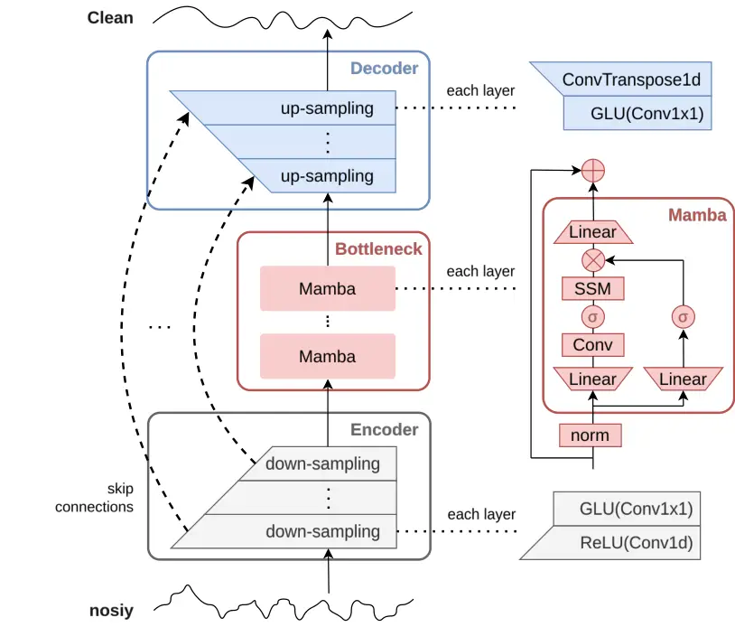
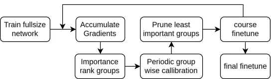

# CleanUMamba: A Compact Mamba Network for Speech Denoising using Channel Pruning

Sjoerd Groot    Qinyu Chen    Jan C. van Gemert    Chang Gao
^(†)^(†)thanks: Corresponding Author: Chang Gao
(chang.gao@tudelft.nl)^(†)^(†)thanks: S. Groot, J. C. van Gemert and C.
Gao are with the Faculty of Electrical Engineering, Mathematics and
Computer Science, Delft University of Technology, The
Netherlands.^(†)^(†)thanks: Q. Chen is with the Leiden Institute of
Advanced Computer Science (LIACS), Leiden University, The Netherlands.

###### Abstract

This paper presents CleanUMamba, a time-domain neural network
architecture designed for real-time causal audio denoising directly
applied to raw waveforms. CleanUMamba leverages a U-Net encoder-decoder
structure, incorporating the Mamba state-space model in the bottleneck
layer. By replacing conventional self-attention and LSTM mechanisms with
Mamba, our architecture offers superior denoising performance while
maintaining a constant memory footprint, enabling streaming operation.
To enhance efficiency, we applied structured channel pruning, achieving
an 8X reduction in model size without compromising audio quality. Our
model demonstrates strong results in the Interspeech 2020 Deep Noise
Suppression challenge. Specifically, CleanUMamba achieves a PESQ score
of 2.42 and STOI of 95.1% with only 442K parameters and 468M MACs,
matching or outperforming larger models in real-time performance. Code
will be available at:
[https://github.com/lab-emi/CleanUMamba](https://github.com/lab-emi/CleanUMamba)

###### Index Terms: 

deep learning, speech enhancement, audio denoising, state-space model,
convolutional neural network

## I Introduction

Audio denoising, or speech enhancement, removes background noise from
speech recordings while preserving quality and intelligibility. This
technology is important for applications such as hearing aids, audio
calls, and speech recognition systems. Traditional methods like spectral
subtraction \[1\] and Wiener filtering \[2\] struggle in dynamic
environments, especially when noise overlaps with speech.

Deep neural networks (DNNs) have significantly advanced this field in
recent years. Various architectures, including convolutional neural
networks (CNNs) \[3, 4, 5, 6\], recurrent neural networks (RNNs) \[7, 8,
9\], and transformers \[10, 11\], have been used to enhance speech.
Although transformers achieve high-quality results, they are
computationally expensive at longer input sequences.

The Mamba state space model \[12\] offers a promising solution for
sequence modeling and time series prediction. Mamba enables parallel
computation during training and recurrent processing during inference
without sequence length constraints, making it a strong candidate for
audio denoising.

In this work, we introduce CleanUMamba, a neural network designed for
real-time audio denoising that processes raw waveforms. CleanUMamba
adopts the U-Net encoder-decoder architecture from \[10\], replacing
self-attention with Mamba state-space blocks, which enables a more
compact model with reduced algorithmic latency. Additionally, we
implement structured pruning to reduce the model size while maintaining
high performance.

Our main contributions are:

1.  1.  A novel Mamba-based architecture for time-domain speech enhancement
        with a 12 ms real-time algorithmic latency.
2.  2.  A comparative analysis of Mamba, self-attention, LSTM, and Mamba-S4
        for audio denoising.
3.  3.  An efficient, structured pruning strategy using periodic calibration
        of GroupTaylor importance \[13\].



Fig. 1: CleanUMamba architecture consisting of convolutional
encoder-decoder with 3 sequential Mamba blocks in the bottleneck.

## II Related Works

Recent research has explored the application of Mamba to audio
denoising, with several concurrent works emerging. Many of these studies
focus on non-causal speech enhancement for offline settings, where the
entire audio track is available for processing. Notable works include
SPMamba \[14\], DPMamba \[15\], Mamba-TasNet \[16\], and SEMamba \[17\],
which build upon TF-Gridnet \[11\], SlowFast \[18\], Dual-path RNN
\[19\], Conv-TasNet \[4\], and MP-SENet \[20\] respectively. These
approaches incorporate bidirectional Mamba implementations for efficient
global audio processing. TRAMBA \[21\] enhances a time domain U-Net
Temporal FiLM \[22\] by integrating Mamba in the bottleneck and using
self-attention for feature-wise linear modulation. This network is
applied to audio super-resolution and reconstruction from
bone-conducting microphone and accelerometer data. For long-term
streaming applications, oSpatialNet-Mamba \[23\] extends
SpatialNet \[24\] by replacing self-attention with masked
self-attention, Retention, or Mamba. Operating in the time-frequency
domain with 2-4 second window sizes, Mamba outperforms other variations.
Zhang et al. \[25\] conduct an ablation study comparing different
backbones, including Mamba and two bidirectional Mamba implementations,
in the time-frequency domain.

In contrast to these works, our research focuses on real-time causal
speech enhancement in the time domain. By applying Mamba to the U-Net
architecture, we reduce computational load compared to DPMamba and
Mamba-Tasnet through processing in a lower-resolution latent space.

## III Proposed Method

### III-A Problem Definition



Fig. 2: Pruning Pipeline

Audio denoising aims to recover the clean speech signal $`x\in R^{T}`$
from the noisy signal $`y=x+v`$, where $`v`$ represents zero-mean noise
uncorrelated with $`x`$. A causal model for denoising reconstructs the
clean speech $`\hat{x}_{t}=f(y_{1:t})\approx x_{t}`$ using noisy samples
up to time $`t`$. In real-world applications, a slight look-ahead, such
as a delay of 5-6 ms for hearing aids \[26, 27\], or up to 200 ms for
video calls \[28\], is acceptable. This work uses 16kHz audio with
CleanUMamba, achieving an algorithmic delay of 48 ms and 12 ms for 8 and
6 encoder layers, respectively.

### III-B Network Architecture

[TABLE]

TABLE I: Multi-Head Attention (MHA), LSTM, Mamba, and Mamba S4 compared
in the same size unit model and training conditions on the DNS no-reverb
test set.

Figure 1 shows the architecture of CleanUMamba, consisting of an
encoder-decoder structure with $`E`$ layers. Each encoder layer employs
a 1D convolution with a kernel size of 4 and stride of 2, followed by a
ReLU activation and a 1x1 convolution with a GLU activation. These
layers halve the temporal resolution and include bypass connections to
their respective decoder layers. Decoder layers reverse this process
using 1D transposed convolutions, doubling the temporal resolution. The
channels per layer start at $`H=64`$ and increase up to a maximum of
$`768`$.

In the bottleneck, three Mamba blocks perform sequence modeling on the
latent representation, which has a model dimension of $`D=512`$. Each
Mamba block is preceded by layer normalization and a residual
connection, while the inner dimension is set to $`I=2048`$,
corresponding to CleanUNet’s fully connected layer output \[10\]. The
state-space model uses $`S=64`$ channels.

### III-C Pruning Pipeline

Pruning aims to minimize the loss increase per pruned parameter. Let
$`\mathcal{L}(\theta)`$ represent the loss function of the network with
parameters $`\theta`$, and $`\Delta\mathcal{L}`$ denote the change in
loss due to pruning. The objective is:

```math
\min_{\mathcal{S}}\frac{\Delta\mathcal{L}(\mathcal{S})}{|\mathcal{S}|} \tag{1}
```

where $`\mathcal{S}`$ is the set of parameters to prune, and
$`|\mathcal{S}|`$ is its size. Since exact loss sampling for every group
is computationally infeasible, the Group Taylor importance metric \[13\]
is used. It estimates the importance of parameter sets with both
absolute and squared gradients:

```math
I_{S}=\sum_{s\in S}|g_{s}w_{s}| \tag{2}
```

```math
I_{S}=\sum_{s\in S}(g_{s}w_{s})^{2} \tag{3}
```

```math
I_{S}=\sum_{s\in S}|w_{s}| \tag{4}
```

Here, $`g_{s}`$ and $`w_{s}`$ represent the gradient and weight for
group $`s`$. Gradients are accumulated via backpropagation. The pruning
pipeline (Fig. 2) follows a standard train-prune-finetune approach
\[29\], accumulating micro-batch gradients \[30\]. Pruning targets a
percentage of groups, selecting those with the lowest Group Taylor
importance, while ensuring compatibility with Mamba’s causal
convolutions by pruning in multiples of 8 channels.

Though effective, the Taylor importance metric may over- or
under-penalize groups of varying sizes or depths. To address this,
periodic calibration is applied by pruning 20% of groups in a layer,
measuring the loss increase, and adjusting the global metric
accordingly. An exponential moving average filter smooths out any noise,
preventing a single outlier from disproportionately affecting the
pruning process.

## IV Experimental Setup

### IV-A Evaluation Metrics

(a) Model parameter count vs STOI

(b) Model MACs vs STOI

Fig. 3: Comparison of importance metrics for pruning CleanUMamba without
fine-tuning.

We evaluated the model using several objective metrics: Perceptual
Evaluation of Speech Quality (PESQ) \[31\], Short-Time Objective
Intelligibility (STOI) \[32\], and the Mean Option Score (MOS) for
signal distortion (CSIG), background noise intrusiveness (CBAK), and
overall quality (COVL) \[33\].

### IV-B Dataset

The experiments used the Interspeech 2020 Deep Noise Suppression (DNS)
dataset \[34\]. This dataset includes speech from 2150 speakers and
65,000 noise clips, yielding 500 hours of training data, with
signal-to-noise ratios (SNR) between -5 and 25 dB across 31 levels.
During training, random 10-second crops were selected.

### IV-C Training Setup

We employed a loss function combining L1 loss and multi-resolution
short-time Fourier transform (STFT) loss \[35\]:

```math
L(x,\hat{x})=\|x-\hat{x}\|+STFT(x,\hat{x}) \tag{5}
```

```math
\begin{split}STFT(x,\hat{x})=\sum_{i=1}^{m}\left(\frac{\|s(x;\theta_{i})-s(\hat{x};\theta_{i})\|_{F}}{\|s(x;\theta_{i})\|_{F}}+\frac{1}{T}\|\log{\frac{s(x;\theta_{i})}{s(\hat{x};\theta_{i})}}\right)\end{split} \tag{6}
```

STFT loss was calculated for FFT bins $`\{512,1024,2048\}`$, hop sizes
$`\{50,120,240\}`$, and window lengths $`\{240,600,1200\}`$. Both
full-band and high-frequency (4kHz-8kHz) STFT losses were tested \[10\].

The network was trained with the ADAM optimizer (learning rate 0.0002,
$`\beta_{1}=0.9`$, $`\beta_{2}=0.999`$) using a linear warm-up for the
first 5% of training followed by cosine decay. PyTorch AMP was applied
for mixed-precision training.

A Wiener filter baseline \[36\], implemented with the Pyroomacoustics
library \[37\], used an LPC order of 10, window size of 256, 2
iterations, smoothing alpha of 0.5, and threshold set for 16% noise
classification. The output was mixed with 50% unfiltered audio to
optimize quality.

## V Experimental Results

### V-A Ablation Study of Mamba

Fig. 4: Pruning CleanUMamba with 6 and 8 encoder layers with
fine-tuning: Model parameter count vs STOI

[TABLE]

TABLE II: Evaluation results for denoising on the DNS no-reverb testset.

In Table I, we compare the performance of Mamba in the bottleneck layer
against Multi-head Attention, Mamba S4, and LSTM. All models use the
same encoder-decoder architecture with $`E=8`$ layers, starting with
$`H=32`$ channels in the first layer and $`H=64`$ channels in subsequent
layers. Each model employs a bottleneck with a model dimension of
$`D=64`$.

For the multi-head attention variant, 4 heads were used, each with a
dimension of 16, followed by an MLP expanding to $`d\_inner=128`$, in
line with the architecture in \[10\], but with fewer parameters. The
Mamba model uses an inner dimension of $`d\_inner=128`$ and a state size
$`S=16`$, while Mamba S4 uses the same configuration but replaces the
selective state space with the S4 state space \[39\]. The LSTM model
consists of 3 layers with a hidden size of $`64`$.

All models were trained on the DNS dataset for 1M iterations with a
batch size of 16. The ADAMW optimizer was employed, with a weight decay
of 0.1, using the full STFT loss. Autocast was disabled for Mamba S4 due
to training errors.

### V-B CleanUMamba

In Table II, we present the results of training CleanUMamba with the
same procedure as CleanUNet, using $`N=3`$ bottleneck layers and encoder
depths of $`E=6`$ and $`E=8`$. When trained with high-band loss,
CleanUMamba outperforms both the same-size and larger CleanUNet models.
However, under full-band loss, CleanUMamba slightly underperforms
compared to CleanUNet.

The model with $`E=6`$ performs marginally worse than the $`E=8`$
version but has fewer than 75% of the parameters. Despite this, the
number of multiply accumulates per second (MAC/s) remains comparable due
to the longer input to the bottleneck layer.

With $`E=8`$, most of the computations occur in the encoder and decoder,
leading to a doubling of MAC/s after 18 minutes, making Mamba’s fixed
state size less significant. Reducing the encoder depth to $`E=6`$
quadruples the bottleneck sequence length and reduces MAC/s in the
encoder-decoder. As a result, after just 80 seconds, MAC/s with
multi-head attention doubles compared to Mamba.

### V-C Different Importance Metrics without Fine-Tuning

To assess the effectiveness of different importance metrics, the
CleanUMamba network trained with high loss was pruned without
fine-tuning, as shown in Figure 3. At each pruning step, 24 of the least
important groups were removed, with 128 audio samples used for gradient
accumulation in the Taylor importance metric. The calibrated runs,
denoted $`C10`$, recalibrate the importance metric every 10 pruning
steps, and the exponential moving average, $`E5`$, applies a smoothing
factor of 0.5.

Results indicate that the Group Taylor importance metric effectively
reflects global importance. The squared Taylor loss slightly outperforms
the absolute Taylor loss at higher pruning levels. In contrast, weight
magnitude performs poorly as a global importance metric, with
significant performance drops after pruning the first few layers.

With calibration, Taylor loss initially shows better results, but
stability decreases over time. Filtering the calibration improves
quality per parameter, while uncalibrated Taylor loss consistently
delivers superior quality per MAC/s.

### V-D Pruning with Fine-Tuning

For pruning with fine-tuning, CleanUMamba models with $`E=6`$ and
$`E=8`$ encoder layers pre-trained using high loss were pruned using
squared Taylor importance. The metric was recalibrated every 20 steps
with a smoothing factor of 0.5. At each step, gradients were accumulated
over 128 samples, and the model was fine-tuned on 40,960 training
samples every 5 steps. The importance pruned was limited to 3e-13, with
4 channels pruned per step once this limit was reached.

However, both E6 and E8 models became under-trained below 6M and 4M
parameters, respectively. To address this, models at 200K, 500K, 1M, and
2M parameters were fine-tuned for an additional 100K iterations with a
batch size of 16.

Figure 4 shows the STOI scores during pruning, and Table II presents a
subset of the full evaluation. At 3.22M parameters, CleanUMamba matches
the performance of DEMUCS with 8$`\times`$ fewer parameters and nearly
matches FullSubNet with 2$`\times`$ fewer parameters.

## VI Conclusion

In this study, we introduce CleanUMamba, a real-time speech denoising
model that operates in the waveform domain and investigate its size
reduction through pruning. We evaluated the model on the Interspeech
2020 Deep Noise Suppression challenge and compared it to the
self-attention-based CleanUNet. While both models perform similarly with
an encoder depth of 8, Mamba’s linear time complexity becomes more
advantageous with a reduced depth of 6, achieving a 12 ms latency. Our
pruning pipeline further reduces model size, achieving performance
comparable to LSTM-based DEMUCs with 8$`\times`$ fewer parameters.

## References

- \[1\] S. Boll, “Suppression of acoustic noise in speech using spectral
  subtraction,” _IEEE Transactions on acoustics, speech, and signal
  processing_, vol. 27, no. 2, pp. 113–120, 1979.
- \[2\] J. S. Lim and A. V. Oppenheim, “Enhancement and bandwidth
  compression of noisy speech,” _Proceedings of the IEEE_, vol. 67,
  no. 12, pp. 1586–1604, 1979.
- \[3\] S. Pascual, A. Bonafonte, and J. Serra, “Segan: Speech
  enhancement generative adversarial network,” _arXiv preprint
  arXiv:1703.09452_, 2017.
- \[4\] Y. Luo and N. Mesgarani, “Conv-tasnet: Surpassing ideal
  time–frequency magnitude masking for speech separation,” _IEEE/ACM
  transactions on audio, speech, and language processing_, vol. 27,
  no. 8, pp. 1256–1266, 2019.
- \[5\] D. Stoller, S. Ewert, and S. Dixon, “Wave-u-net: A multi-scale
  neural network for end-to-end audio source separation,” _arXiv
  preprint arXiv:1806.03185_, 2018.
- \[6\] A. Pandey and D. Wang, “Tcnn: Temporal convolutional neural
  network for real-time speech enhancement in the time domain,” in
  _ICASSP 2019-2019 IEEE International Conference on Acoustics, Speech
  and Signal Processing (ICASSP)_. IEEE, 2019, pp. 6875–6879.
- \[7\] A. Défossez, A. Défossez, G. Synnaeve, G. Synnaeve, Y. Adi, and
  Y. Adi, “Real time speech enhancement in the waveform domain.”
  _Interspeech_, 2020.
- \[8\] S. Braun, H. Gamper, C. K. Reddy, and I. Tashev, “Towards
  efficient models for real-time deep noise suppression,” in _ICASSP
  2021-2021 IEEE International Conference on Acoustics, Speech and
  Signal Processing (ICASSP)_. IEEE, 2021, pp. 656–660.
- \[9\] L. Cheng, A. Pandey, B. Xu, T. Delbruck, and S.-C. Liu, “Dynamic
  gated recurrent neural network for compute-efficient speech
  enhancement,” in _Interspeech 2024_, 2024, pp. 677–681.
- \[10\] Z. Kong, W. Ping, A. Dantrey, and B. Catanzaro, “Speech
  denoising in the waveform domain with self-attention,” _IEEE
  International Conference on Acoustics, Speech, and Signal
  Processing_, 2022.
- \[11\] Z.-Q. Wang, S. Cornell, S. Choi, Y. Lee, B.-Y. Kim, and
  S. Watanabe, “Tf-gridnet: Making time-frequency domain models great
  again for monaural speaker separation,” in _ICASSP 2023-2023 IEEE
  International Conference on Acoustics, Speech and Signal Processing
  (ICASSP)_. IEEE, 2023, pp. 1–5.
- \[12\] A. Gu and T. Dao, “Mamba: Linear-time sequence modeling with
  selective state spaces,” _arXiv.org_, 2023.
- \[13\] P. Molchanov, A. Mallya, S. Tyree, I. Frosio, and J. Kautz,
  “Importance estimation for neural network pruning,” in _Proceedings of
  the IEEE/CVF conference on computer vision and pattern recognition_,
  2019, pp. 11 264–11 272.
- \[14\] K. Li and G. Chen, “Spmamba: State-space model is all you need
  in speech separation,” _arXiv preprint arXiv:2404.02063_, 2024.
- \[15\] X. Jiang, C. Han, and N. Mesgarani, “Dual-path mamba: Short and
  long-term bidirectional selective structured state space models for
  speech separation,” _arXiv preprint arXiv:2403.18257_, 2024.
- \[16\] X. Jiang, Y. A. Li, A. N. Florea, C. Han, and N. Mesgarani,
  “Speech slytherin: Examining the performance and efficiency of mamba
  for speech separation, recognition, and synthesis,” _arXiv preprint
  arXiv:2407.09732_, 2024.
- \[17\] R. Chao, W.-H. Cheng, M. La Quatra, S. M. Siniscalchi, C.-H. H.
  Yang, S.-W. Fu, and Y. Tsao, “An investigation of incorporating mamba
  for speech enhancement,” _arXiv preprint arXiv:2405.06573_, 2024.
- \[18\] L. Cheng, A. Pandey, B. Xu, T. Delbruck, V. K. Ithapu, and
  S.-C. Liu, “Modulating state space model with slowfast framework for
  compute-efficient ultra low-latency speech enhancement,” 2025.
  \[Online\]. Available:
  [https://arxiv.org/abs/2411.02019](https://arxiv.org/abs/2411.02019)
- \[19\] Y. Luo, Z. Chen, and T. Yoshioka, “Dual-path rnn: efficient
  long sequence modeling for time-domain single-channel speech
  separation,” in _ICASSP 2020-2020 IEEE International Conference on
  Acoustics, Speech and Signal Processing (ICASSP)_. IEEE, 2020, pp.
  46–50.
- \[20\] Y.-X. Lu, Y. Ai, and Z.-H. Ling, “Mp-senet: A speech
  enhancement model with parallel denoising of magnitude and phase
  spectra,” _arXiv preprint arXiv:2305.13686_, 2023.
- \[21\] Y. Sui, M. Zhao, J. Xia, X. Jiang, and S. Xia, “Tramba: A
  hybrid transformer and mamba architecture for practical audio and bone
  conduction speech super resolution and enhancement on mobile and
  wearable platforms,” _arXiv preprint arXiv:2405.01242_, 2024.
- \[22\] S. Birnbaum, V. Kuleshov, Z. Enam, P. W. W. Koh, and S. Ermon,
  “Temporal film: Capturing long-range sequence dependencies with
  feature-wise modulations.” _Advances in Neural Information Processing
  Systems_, vol. 32, 2019.
- \[23\] C. Quan and X. Li, “Multichannel long-term streaming neural
  speech enhancement for static and moving speakers,” _IEEE Signal
  Processing Letters_, vol. 31, pp. 2295–2299, 2024.
- \[24\] ——, “Spatialnet: Extensively learning spatial information for
  multichannel joint speech separation, denoising and dereverberation,”
  _IEEE/ACM Trans. Audio, Speech and Lang. Proc._, vol. 32, p.
  1310–1323, Feb. 2024. \[Online\]. Available:
  [https://doi-org.tudelft.idm.oclc.org/10.1109/TASLP.2024.3357036](https://doi-org.tudelft.idm.oclc.org/10.1109/TASLP.2024.3357036)
- \[25\] X. Zhang, Q. Zhang, H. Liu, T. Xiao, X. Qian, B. Ahmed,
  E. Ambikairajah, H. Li, and J. Epps, “Mamba in speech: Towards an
  alternative to self-attention,” _arXiv preprint
  arXiv:2405.12609_, 2024.
- \[26\] M. A. Stone, B. C. Moore, K. Meisenbacher, and R. P. Derleth,
  “Tolerable hearing aid delays. v. estimation of limits for open canal
  fittings,” _Ear and hearing_, vol. 29, no. 4, pp. 601–617, 2008.
- \[27\] S. Roth, F.-U. Müller, J. Angermeier, W. Hemmert, and S. Zirn,
  “Effect of a processing delay between direct and delayed sound in
  simulated open fit hearing aids on speech intelligibility in noise,”
  _Frontiers in Neuroscience_, vol. 17, p. 1257720, 2024.
- \[28\] International Telecommunication Union, “Itu-t recommendation
  g.114: One-way transmission time,” Telecommunication Standardization
  Sector of ITU, Tech. Rep. G.114, 5 2003.
- \[29\] S. Han, J. Pool, J. Tran, and W. Dally, “Learning both weights
  and connections for efficient neural network,” _Advances in neural
  information processing systems_, vol. 28, 2015.
- \[30\] X. Piao, D. Synn, J. Park, and J.-K. Kim, “Enabling large batch
  size training for dnn models beyond the memory limit while maintaining
  performance,” _IEEE Access_, 2023.
- \[31\] A. W. Rix, J. G. Beerends, M. P. Hollier, and A. P. Hekstra,
  “Perceptual evaluation of speech quality (pesq)-a new method for
  speech quality assessment of telephone networks and codecs,” in _2001
  IEEE international conference on acoustics, speech, and signal
  processing. Proceedings (Cat. No. 01CH37221)_, vol. 2. IEEE, 2001, pp.
  749–752.
- \[32\] C. H. Taal, R. C. Hendriks, R. Heusdens, and J. Jensen, “An
  algorithm for intelligibility prediction of time–frequency weighted
  noisy speech,” _IEEE Transactions on audio, speech, and language
  processing_, vol. 19, no. 7, pp. 2125–2136, 2011.
- \[33\] Y. Hu and P. C. Loizou, “Evaluation of objective quality
  measures for speech enhancement,” _IEEE Transactions on audio, speech,
  and language processing_, vol. 16, no. 1, pp. 229–238, 2007.
- \[34\] H. Dubey, H. Dubey, H. Dubey, H. Dubey, V. Gopal, V. Gopal,
  V. Gopal, V. Gopal, R. Cutler, R. Cutler, R. Cutler, R. Cutler,
  A. Aazami, A. Aazami, A. Aazami, A. Aazami, S. Matusevych,
  S. Matusevych, S. Matusevych, S. Matusevych, S. Braun, S. Braun,
  S. Braun, S. Braun, Şefik Emre Eskimez, S. E. Eskimez, S. E. Eskimez,
  S. E. Eskimez, M. Thakker, M. Thakker, M. Thakker, M. Thakker,
  T. Yoshioka, T. Yoshioka, T. Yoshioka, T. Yoshioka, H. Gamper,
  H. Gamper, H. Gamper, H. Gamper, R. Aichner, R. Aichner, R. Aichner,
  and R. Aichner, “Icassp 2022 deep noise suppression challenge,” _IEEE
  International Conference on Acoustics, Speech, and Signal
  Processing_, 2022.
- \[35\] R. Yamamoto, E. Song, and J.-M. Kim, “Parallel wavegan: A fast
  waveform generation model based on generative adversarial networks
  with multi-resolution spectrogram,” in _ICASSP 2020-2020 IEEE
  International Conference on Acoustics, Speech and Signal Processing
  (ICASSP)_. IEEE, 2020, pp. 6199–6203.
- \[36\] J. Lim and A. Oppenheim, “All-pole modeling of degraded
  speech,” _IEEE Transactions on Acoustics, Speech, and Signal
  Processing_, vol. 26, no. 3, pp. 197–210, 1978.
- \[37\] R. Scheibler, E. Bezzam, and I. Dokmanić, “Pyroomacoustics: A
  python package for audio room simulation and array processing
  algorithms,” in _2018 IEEE international conference on acoustics,
  speech and signal processing (ICASSP)_. IEEE, 2018, pp. 351–355.
- \[38\] X. Hao, X. Su, R. Horaud, and X. Li, “Fullsubnet: A full-band
  and sub-band fusion model for real-time single-channel speech
  enhancement,” in _ICASSP 2021-2021 IEEE International Conference on
  Acoustics, Speech and Signal Processing (ICASSP)_. IEEE, 2021, pp.
  6633–6637.
- \[39\] A. Gu, K. Goel, and C. R’e, “Efficiently modeling long
  sequences with structured state spaces,” _International Conference on
  Learning Representations_, 2021.
