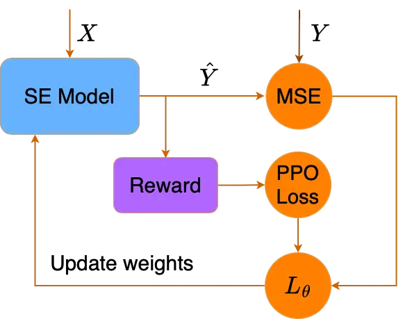
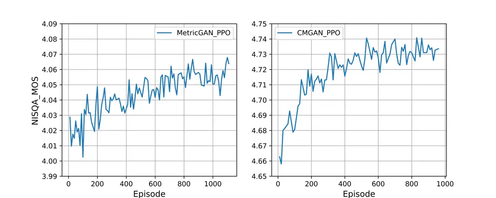

# Using RLHF to align speech enhancement approaches to mean-opinion quality scores Thanks: This work was supported in part by the National Science Foundation under grant IIS-2235228, and in part by the Ohio Supercomputer Center.

Anurag Kumar Affiliation:  Computer Science & Engineering  
Ohio State University  
Columbus, OH, USA  
kumar.1109@osu.edu    Andrew Perrault Affiliation:  Computer Science &
Engineering  
Ohio State University  
Columbus, OH, USA  
perrault.17@osu.edu    Donald S. Williamson Affiliation:  Computer
Science & Engineering  
Ohio State University  
Columbus, OH, USA  
williamson.413@osu.edu Affiliation: 

###### Abstract

Objective speech quality measures are typically used to assess speech
enhancement algorithms, but it has been shown that they are sub-optimal
as learning objectives because they do not always align well with human
subjective ratings. This misalignment often results in noticeable
distortions and artifacts that cause speech enhancement to be
ineffective. To address these issues, we propose a reinforcement
learning from human feedback (RLHF) framework to fine-tune an existing
speech enhancement approach by optimizing performance using a
mean-opinion score (MOS)-based reward model. Our results show that the
RLHF-finetuned model has the best performance across different
benchmarks for both objective and MOS-based speech quality assessment
metrics on the Voicebank+DEMAND dataset. Through ablation studies, we
show that both policy gradient loss and supervised MSE loss are
important for balanced optimization across the different metrics.

###### Index Terms: 

speech enhancement, reinforcement learning, human feedback, speech
quality, mean-opinion scores

## I Introduction

In real-world environments, spoken communication is often obstructed by
unwanted background noise that negatively affects perceptual quality and
our ability to communicate effectively. Speech enhancement generally
addresses this by using deep neural networks to remove unwanted noise.
This is especially important to individuals with impaired hearing since
they struggle to hear in noisy environments.

Most speech enhancement approaches use deep learning to estimate a
training target, where they are often trained using a mean-square error
(MSE) loss objective. However, this is problematic because a higher MSE
can result in better speech intelligibility for an enhanced signal
\[9\]. For this reason, researchers now use objective assessment
measures, such as the Perceptual Evaluation of Speech Quality (PESQ)
\[21\], Scale-Invariant Signal-to-Distortion Ratio (SI-SDR) \[22\], or
Short-time Objective Intelligibility (STOI) \[27\], to assess
performance. This, unfortunately, does not address the mismatch between
the training objective (e.g., MSE) and the final evaluation metrics,
where the two are not always in agreement.

In recent years, generative adversarial networks (GANs) have shown
improved performance and they address the mismatch problem by using
objective measures for network optimization. MetricGAN estimates
time-frequency (TF) masks with a generator, while using a discriminator
as a proxy function to estimate PESQ \[25\], since PESQ is
non-differentiable and cannot be used directly as a learning objective.
Their goal is to optimize PESQ scores, where they outperform prior
approaches according to PESQ. MetricGAN is further improved in \[26\],
where a replay buffer addresses catastrophic forgetting, a phenomenon
common in GAN architectures. In \[1\], a conformer-based GAN
architecture (CMGAN) uses an additional MSE loss term for the generator
network to optimize the real, imaginary, and magnitude components of the
spectrograms, since these components address the phase response, which
is important to perceptual quality \[30\]. Unfortunately, using
objective scores as learning objectives can be sub-optimal, because they
do not always align with subjective scores, e.g., the mean-opinion score
(MOS) or pairwise preference ratings from human listeners \[8, 28, 23,
2\].

Subjective quality scores, like MOS, are standard measures of perceptual
speech quality, so training objectives and subsequent performance
evaluations should be based on subjective measures, especially in cases
where human listeners will benefit most from speech enhancement.
However, these scores involve expensive listening studies that require
strict control of the listening environment. Fortunately, recent studies
have produced subjective assessment data \[20, 6, 31\], which can be
used as part of a learning objective. Earlier attempts at using MOS
scores include \[17\] where authors developed a joint model for MOS
estimation and speech enhancement.

In this paper, we better align the evaluation metrics and learning
objectives by using estimated subjective quality scores as a reward
signal in a Reinforcement Learning through Human Feedback (RLHF)
framework, which is used to fine-tune existing enhancement approaches. A
previous RL approach uses evaluation on a downstream automatic speech
recognition task as a reward function to optimize the speech enhancement
model \[24\]. In \[14\], authors use relative PESQ improvements as a
reward function to optimize a feed-forward network for speech
enhancement. They argue that relative PESQ improvements are a better
measure for the reward function as the absolute PESQ values are affected
by outside parameters beyond the model’s control. RLHF was initially
introduced in \[13\] and improved in \[18, 3\] for natural language
processing (NLP), where a reward model estimates human feedback with
reasonable accuracy and better aligns NLP tasks with human assessment.
We hypothesize that an RLHF framework will better align speech quality
performance with human quality ratings, and it could eventually be used
in an online manner to offer real-time enhancement, which is not
possible with current approaches. Our reward model estimates MOS in a
non-intrusive manner (i.e., without a clean reference), which has been
done by prior approaches \[10, 19, 16\]. Our main contributions are
that: (1) we provide a generalized RLHF training framework, one of the
first attempts in the current literature that we know of, that uses RL
to fine-tune an existing speech enhancement model with a MOS-based
reward function, (2) through an ablation study, we show that fine-tuning
using both a Proximal Policy Optimization (PPO) clip loss and supervised
MSE loss is necessary for improvement across different objective and
MOS-based speech quality metrics.

## II Methodology

In this section, we describe the conventional speech enhancement problem
and the modifications required for fine-tuning using RLHF. An overview
of the proposed RLHF approach is shown in Fig 1.



Fig. 1: The proposed training framework. A reward is used to calculate
the PPO clip loss, which is then combined with an MSE loss to update the
SE model.

### II-A Speech Enhancement (SE)

Given a noisy waveform $`x\in\mathbb{R}^{l}`$, we first extract the
time-frequency (TF) representations,
$`X\in\mathbb{R}^{F\times T\times C}`$, using the short-time Fourier
transform. Here $`F`$, $`T`$, $`C`$ denote the frequency bins, time
frames, and channels respectively, where channel refers to the real,
imaginary, or magnitude spectrograms. Let $`f_{\theta}(\cdot)`$
represent a neural network with parameters $`\theta`$ that takes $`X`$
as input and estimates a set of TF masks,
$`\hat{M}\in\mathbb{R}^{F\times T\times C}`$, i.e.
$`\hat{M}=f_{\theta}(X)`$. The components of the enhanced spectrogram,
$`\hat{Y}\in\mathbb{R}^{F\times T\times C}`$, are obtained by applying
channel-wise transformations $`g_{c}(\cdot)`$ to the input using the
estimated masks, i.e., $`\hat{Y}=g_{c}(\hat{M},X)`$.

Approaches that predict TF masks are most suitable for an RLHF
framework. Therefore, we fine-tune two different yet, well-performing
approaches to prove the generality of our RLHF fine-tuning framework.
MetricGAN+ \[26\] is an LSTM-based network that only predicts magnitude
masks, whereas CMGAN \[1\] is a conformer model that predicts both
magnitude and complex masks for the spectrograms. The specific
transformations for CMGAN and MetricGAN+ are given in \[1\] and \[26\]
respectively.

CMGAN has a 3 channel $`\hat{Y}`$, each channel representing the
magnitude, real and imaginary values of the enhanced spectrogram,
whereas outputs from MetricGAN+ are a single channel enhanced magnitude
spectrogram. The enhanced waveform $`\hat{y}\in\mathbb{R}^{l}`$ is
obtained using an inverse TF transformation to put the enhanced TF
representations back in the time domain.

### II-B Speech Enhancement as an RL problem

We define our supervised finetuning policy
$`\pi_{\theta}^{SFT}:S\rightarrow A`$ to be the mapping
$`f_{\theta}(\cdot)`$ parameterized by $`\theta`$. The state space,
$`S`$, is continuous as it covers the distribution of all possible noisy
spectrogram inputs. We interpret the set of masks, $`\hat{M}`$,
predicted by the supervised policy as actions. Our action space, $`A`$,
should cover the distribution of these masks and it is also continuous.
An episode is a single-step (utterance level) operation where an
enhanced signal is obtained from the policy. We modify the output of
$`f_{\theta}(\cdot)`$ by adding zero-mean fixed-variance Gaussian noise
$`n\sim\mathcal{N}(0,\sigma)`$ to get
$`\hat{M}^{RL}=\{\hat{m}_{c}^{RL}\}_{c=0}^{C-1}`$, which is used to
calculate the enhanced TF representation, $`\hat{Y}`$. This enables us
to calculate the likelihood of our action and implement policy gradient
methods. We refer to the set of predicted masks, $`\hat{M}^{RL}`$, as
$`a`$ (an action). We denote the policy optimized by RLHF as
$`\pi^{RL}_{\theta}`$.

```math
\begin{gathered}\hat{M^{RL}}=f_{\theta}([X_{0},X_{1},..X_{c-1}])+n\end{gathered} \tag{1}
```

### II-C Our RL framework

To incorporate human feedback, we use the NISQA model \[16\], a
commonly-used predictor of MOS, as part of our reward model. Let the
NISQA reward model be referred to by $`r_{\phi}(\cdot)`$, where $`\phi`$
are the NISQA model parameters. Following the intuition in \[14\], we
use the relative improvement in NISQA MOS between the outputs from
$`\pi_{\theta}^{SFT}`$ and $`\pi_{\theta}^{RL}`$ as our reward signal,
$`r_{mos}`$. We also experiment with an objective metric reward signal,
$`r_{pesq}`$, to observe the difference in metrics optimized by either
method. Here $`y`$ refers to the reference clean speech waveform. Let
$`\hat{y}_{rl}`$ be the estimated speech waveform from
$`\pi_{\theta}^{RL}`$ and $`\hat{y}_{sft}`$ be the estimated speech
waveform from $`\pi_{\theta}^{SFT}`$. Then,

```math
\begin{gathered}r_{mos}=r_{\phi}(\hat{y}_{rl})-r_{\phi}(\hat{y}_{sft})\\
r_{pesq}=PESQ(\hat{y}_{rl},y)-PESQ(\hat{y}_{sft},y)\end{gathered} \tag{2}
```

The overall objective maximized by our environment is given by
$`J_{\theta}`$

```math
J_{\theta}=\bigg[r-\beta\times\text{KL}\bigg(\pi_{\theta}^{RL}(\hat{y}|x),\pi_{\theta}^{SFT}(\hat{y}|x)\bigg)\bigg] \tag{3}
```

Here, $`r`$ refers to the different reward signals in (2) and $`\beta`$
controls the KL divergence between our fine-tuned policy and the
pre-trained policy. We refer to the optimized policy before and after
the optimization step as $`\pi^{RL}_{\theta_{old}}`$ and
$`\pi^{RL}_{\theta}`$, respectively. The subscript $`t`$ denotes the
respective values associated with the sampled noisy signal batch
$`x_{t}`$. We modified the clipped loss objective of PPO by replacing
the advantage function $`A_{t}`$ with $`J_{\theta_{t}}`$, which allows
us to avoid using a critic network, simplifying the training procedure.
As the episodes are a single step and the reward definition already
includes an appropriate reward baseline (the performance of the SFT
policy), a critic network is unnecessary.

```math
\begin{split}L_{ppo-clip}&(\theta)=\\
&\mathbb{E}_{x_{t}\sim D_{SFT}}\bigg[\text{min}\bigg(\frac{\pi^{RL}_{\theta}(\hat{y_{t}}|x_{t})}{\pi^{RL}_{\theta_{old}}(\hat{y_{t}}|x_{t})}J_{\theta_{t}},\\
&\text{clip}\bigg(\frac{\pi^{RL}_{\theta}(\hat{y_{t}}|x_{t})}{\pi^{RL}_{\theta_{old}}(\hat{y_{t}}|x_{t})},1-\epsilon,1+\epsilon\bigg)J_{\theta_{t}}\bigg)\bigg]\end{split} \tag{4}
```

Since PPO is an on-policy optimization method, we used
$`\pi^{RL}_{\theta_{old}}`$ to execute an episode and store the
associated tuple
$`(x_{t},a_{t},J_{\theta_{t}},\pi^{RL}_{\theta_{old}}(a_{t}|x_{t}))`$ in
an experience buffer. The values from the experience buffer are
extracted to calculate the clip loss in (4). $`\epsilon`$ controls the
step size for the PPO loss update. Here $`D_{SFT}`$ refers to the
dataset used for supervised fine-tuning to get the initial pre-trained
policy $`\pi_{\theta}^{SFT}`$. We also mix pretraining gradients during
the finetuning stage. Apart from using the KL penalty in the objective
function $`J_{\theta}`$, the pre-trained loss was included to keep our
$`\pi_{\theta}^{RL}`$ parameter distribution from diverging too much
from the $`\pi_{\theta}^{SFT}`$ parameter distribution. The overall loss
objective that updates $`\theta`$ is given by $`L_{\theta}`$,

```math
L_{\theta}=L_{ppo-clip}+\lambda L_{MSE} \tag{5}
```

We use $`\lambda`$ to control the weight of pre-training gradients on
our final outputs. $`L_{MSE}`$ is a weighted sum of mean-square errors
across channels of the predicted and reference spectrograms.

```math
\begin{gathered}L_{MSE}=\begin{cases}L_{0},&C=1\\
\alpha L_{0}+(1-\alpha)\sum_{c=1}^{C-1}{L_{c}},&C>1\\
\end{cases}\end{gathered} \tag{6}
```

In the above eq, $`L_{c}`$ is defined as $`(Y_{c}-\hat{Y}_{c})^{2}`$.
$`\alpha`$ controls the weight of the two terms on the overall MSE loss.

## III Experimental Setup

### III-A Dataset

We evaluate our proposed methodology on the commonly used, publicly
available VoiceBank+DEMAND dataset \[29\]. The training set contains
11572 utterances from 28 different speakers and the testing set has 824
utterances from 2 unseen speakers. Furthermore, we use the test set of
the LibriMix dataset \[4\] to evaluate our model’s estimated MOS quality
scores. Given the lack of speaker diversity in the VCTK dataset, the
test set of LibriMix contains 40 different speakers with up to 3 speaker
noisy samples and 3000 samples for each speaker count. We use all 9000
signals for evaluation. All utterances are sampled at 16kHz for our
experiments. For all feature extraction, we use a 25 ms Hanning window
with an overlap of 6.25 ms for CMGAN and a 32 ms Hanning window with an
overlap of 16 ms for MetricGAN+. These are the original training
parameters for the respective models.

### III-B Training

We use a batch size of 4 and accumulated gradients for 16 steps for
CMGAN and a batch size of 8 and accumulated gradients for 8 steps to
fine-tune MetricGAN+, each resulting in an overall batch size of 64. The
remaining architectural and pre-processing details are as followed in
the original papers. For PPO, we set $`\epsilon`$ to 0.01. The values
for $`\alpha,\beta`$, and $`\lambda`$ are set to 0.7, 0.0001, and 1,
respectively. The $`\sigma`$ of the Gaussian noise is set to 0.01. While
any larger amount of noise simply worsened the outputs, we did not see a
substantial difference among the outputs generated from masks with noise
having a smaller $`\sigma`$. Thus, $`\sigma`$ of 0.01 allowed maximum
variance during the RL fine-tuning. The learning rate for all our
experiments is set to $`1e^{-6}`$. Our fine-tuned models are referred to
as CMGAN_PPO and MetricGAN_PPO. All our experiments were run on a single
NVIDIA A100 GPU.

### III-C Baselines

We present multiple baselines reported within the last few years.
Baselines can be categorized into two groups: (1) baselines that predict
the time domain signal, DEMUCS \[7\] and SE-Conformer \[12\], and (2)
baselines that predict time-frequency (TF) representations, PFPL \[11\],
MetricGAN+, DB-AIAT \[32\], DPT-FSNet \[5\], CMGAN and MP-SENet \[15\].

We either report the results directly from the original paper or
reproduce the outputs from inferencing using released checkpoints. The
ones that were reproduced are reported with the (repr) tag. We chose to
reproduce the results of MP-SENet, CMGAN, and MetricGAN+ as they had
publicly available source code and checkpoints. They all predict TF
masks and have among the best-reported results on the Voicebank+DEMAND
dataset.

|               |           |          |       |       |
| ------------- | --------- | -------- | ----- | ----- |
| Model         | Voicebank | LibriMix |       |       |
|               |           | 1 Spk    | 2 Spk | 3 Spk |
| Noisy         | 3.03      | 1.52     | 1.47  | 1.37  |
| MetricGAN+    | 3.99      | 2.62     | 2.47  | 2.32  |
| MetricGAN_PPO | 4.08      | 2.65     | 2.46  | 2.35  |
| CMGAN         | 4.65      | 4.12     | 3.87  | 3.57  |
| CMGAN_PPO     | 4.73      | 4.17     | 3.93  | 3.62  |

TABLE I: NISQA MOS scores between the pre-trained CMGAN baseline and
CMGAN_PPO using different datasets. We report the NISQA MOS scores on
VCTK, LibriMix single, and 2-speaker and 3-speaker audio sets.

## IV Results & Discussion

We evaluate our models on a set of commonly used speech quality metrics.
For estimated subjective scores, we evaluate the model’s performance
using the NISQA MOS ratings. These ratings have a range of \[1,5\]. For
the objective metrics, we use PESQ with a range of \[-0.5, 4.5\],
segmental signal-to-noise ratio (SSNR) and SI-SDR, to measure the
model’s performance.

We evaluate the baselines and our proposed fine-tuned models on an
unseen multi-speaker dataset LibriMix and the seen VCTK test set. Table
I shows the NISQA MOS scores of the enhanced signals for the pre-trained
and proposed models. While both MetricGAN_PPO and CMGAN_PPO consistently
increase the NISQA MOS scores on the VCTK dataset, we observe that CMGAN
and CMGAN_PPO perform consistently well across the unseen dataset
LibriMix for all speaker counts unlike MetricGAN+. We conducted a t-test
to measure the statistical significance of these results. We obtained
p-values of 4.07e-05, 2.59e-03, 4.48e-04 and 2.51e-03 for the NISQA_MOS
scores on the VCTK, LibriMix(1spk), LibriMix(2spk) and LibriMix(3spk),
respectively. The comparison results for objective metrics on the VCTK
test set are shown in Table II. Our proposed models show superior
performance across all of the benchmarks without significant changes to
PESQ when compared to their respective baselines. We see consistent
improvements in SSNR and SI-SDR after fine-tuning (MetricGAN_PPO and
CMGAN_PPO) compared to their respective baselines MetricGAN+ and CMGAN.
The observed improvement in SI-SDR, SSNR, and NISQA MOS scores while
observing negative or no change to PESQ supports the general
effectiveness of our proposed method. While our main objective is to
improve quality and not intelligibility, our method does not degrade
STOI which largely remains consistent. Fig 2 shows the increasing trend
of the aggregated NISQA MOS scores of the VCTK test set recorded every
10 episodes throughout fine-tuning.



Fig. 2: NISQA MOS on VCTK test set recorded every 10 episodes during
fine-tuning using $`r_{mos}`$ as reward function.

To study the effect of a policy gradient loss, we also conduct an
ablation study with different reward types. For CMGAN+MSE, CMGAN is
further fine-tuned with the MSE loss described in Eq. (6). The remaining
CMGAN*PPO models are fine-tuned using the objective shown in Eq. (5) and
different rewards, see Table III. Further training of CMGAN with a MSE
loss results in inferior scores compared to those obtained from
approaches fine-tuned with both the policy gradient and MSE loss. This
means that the PPO loss improves performance. We observe that reward
signals $`r*{mos}`$ and $`r*{pesq}`$ individually optimize a different
subset of objective metrics. We get the highest PESQ score with
$`r*{pesq}`$, whereas the highest NISQA_MOS, SSNR and SI-SDR scores are
obtained when finetuning with $`r*{mos}`$. We also trained a model with
a combined reward function, $`r*{comb}=r*{mos}+r*{pesq}`$, but found
subpar performance on all metrics compared to the models trained using
either of the two reward functions individually.

In our experiment with further MSE fine-tuning, the performance on
evaluation metrics saturated quickly within the first epoch. The RLHF
framework gives us an alternate way to calculate gradients that maximize
the likelihood of outputs with greater rewards and thus introduces newer
gradients. However, this can lead to poor generalization capacity. Using
both MSE and policy gradient loss helps with generalization and larger
gradient variance. This is shown through better improvements from
CMGAN_PPO across MOS-based and objective evaluation metrics as opposed
to CMGAN+MSE finetuning.

|                      |      |      |       |        |
| -------------------- | ---- | ---- | ----- | ------ |
| Model                | STOI | PESQ | SSNR  | SI-SDR |
| Noisy                |      | 1.97 | 1.68  | 8.44   |
| DEMUCS               | 0.95 | 3.07 | \-    | \-     |
| PFPL                 | 0.95 | 3.15 | \-    | \-     |
| SE-Conformer         | 0.95 | 3.13 | \-    | \-     |
| DB-AIAT              | 0.96 | 3.31 | 10.79 | \-     |
| DPT-FSNet            | 0.96 | 3.33 | \-    | \-     |
| MP-SENet (repr)      | 0.96 | 2.95 | 9.91  | 19.63  |
| MetricGAN+(repr)     | 0.92 | 3.15 | 3.11  | 7.98   |
| MetricGAN_PPO (ours) | 0.93 | 3.12 | 3.51  | 9.57   |
| CMGAN (repr.)        | 0.96 | 3.39 | 10.35 | 20.02  |
| CMGAN_PPO (ours)     | 0.96 | 3.39 | 10.93 | 20.28  |

TABLE II: This table compares baselines with our proposed approach on
the Voicebank+DEMAND test set. We put "-" in place for metrics not
reported in the original papers.

|                  |              |      |       |        |       |
| ---------------- | ------------ | ---- | ----- | ------ | ----- |
| Model            | Reward       | PESQ | SSNR  | SI-SDR | N_MOS |
| CMGAN (baseline) | -            | 3.39 | 10.35 | 20.02  | 4.65  |
| CMGAN+MSE        | -            | 3.41 | 10.74 | 20.14  | 4.66  |
| CMGAN_PPO        | $`r_{pesq}`$ | 3.44 | 10.89 | 20.23  | 4.72  |
| CMGAN_PPO        | $`r_{mos}`$  | 3.39 | 10.93 | 20.28  | 4.73  |
| CMGAN_PPO        | $`r_{comb}`$ | 3.43 | 10.91 | 20.25  | 4.71  |

TABLE III: Ablation study for investigating the effect of different
policy gradients and reward signals on performance. The results are
obtained from the VCTK test set. N_MOS is used as an abbreviation for
NISQA MOS scores.

## V Conclusion

We present an RLHF fine-tuning framework for speech enhancement. We also
conduct an ablation study to quantify how a policy gradient affects
performance and to assess the effect that reward functions have on
policy gradient optimization. Through objective and MOS-based
evaluations, we show our proposed model’s improved performance over
baselines on multiple datasets.

## References

- \[1\] S. Abdulatif _et al._, “Cmgan: Conformer-based metric-gan for
  monaural speech enhancement,” _IEEE/ACM TASLP_, pp. 2477–2493, 2024.
- \[2\] E. Cano _et al._, “Evaluation of quality of sound source
  separation algorithms: Human perception vs quantitative metrics,” in
  _Proc. EUSIPCO_, 2016, pp. 1758–1762.
- \[3\] P. F. Christiano _et al._, “Deep reinforcement learning from
  human preferences,” in _Proc. NeurIPS_, 2017, p. 4302–4310.
- \[4\] J. Cosentino _et al._, “Librimix: An open-source dataset for
  generalizable speech separation,” 2020.
- \[5\] F. Dang _et al._, “Dpt-fsnet: Dual-path transformer based
  full-band and sub-band fusion network for speech enhancement,” in
  _IEEE Proc. ICASSP_, 2022, pp. 6857–6861.
- \[6\] X. Dong and D. S. Williamson, “A pyramid recurrent network for
  predicting crowdsourced speech-quality ratings of real-world signals,”
  in _Proc. Interspeech_, 2020, pp. 4631–4635.
- \[7\] A. Défossez _et al._, “Real time speech enhancement in the
  waveform domain,” in _Proc. Interspeech_, 2020, pp. 3291–3295.
- \[8\] J.-H. Flebner _et al._, “Subjective and objective assessment of
  monaural and binaural aspects of audio quality,” _IEEE/ACM TASLP_, pp.
  1112–1125, 2019.
- \[9\] S.-W. Fu _et al._, “End-to-end waveform utterance enhancement
  for direct evaluation metrics optimization by fully convolutional
  neural networks,” _IEEE/ACM TASLP_, pp. 1570–1584, 2018.
- \[10\] H. Gamper _et al._, “Intrusive and non-intrusive perceptual
  speech quality assessment using a convolutional neural network,” in
  _IEEE WASPAA_, 2019, pp. 85–89.
- \[11\] T.-A. Hsieh _et al._, “Improving perceptual quality by
  phone-fortified perceptual loss using wasserstein distance for speech
  enhancement,” in _Proc. Interspeech_, 2021, pp. 196–200.
- \[12\] E. Kim _et al._, “Se-conformer: Time-domain speech enhancement
  using conformer,” in _Proc. Interspeech_, 2021, pp. 2736–2740.
- \[13\] W. B. Knox _et al._, “Interactively shaping agents via human
  reinforcement: the tamer framework,” in _ACM Proc. ICKC_, 2009, p.
  9–16.
- \[14\] Y. Koizumi _et al._, “Dnn-based source enhancement
  self-optimized by reinforcement learning using sound quality
  measurements,” in _IEEE Proc. ICASSP_, 2017, pp. 81–85.
- \[15\] Y.-X. Lu _et al._, “Mp-senet: A speech enhancement model with
  parallel denoising of magnitude and phase spectra,” in _Proc.
  Interspeech_, 2023, pp. 3834–3838.
- \[16\] G. Mittag _et al._, “Nisqa: A deep cnn-self-attention model for
  multidimensional speech quality prediction with crowdsourced
  datasets,” in _Proc. Interspeech_, 2021, pp. 2127–2131.
- \[17\] K. M. Nayem _et al._, “Attention-based speech enhancement using
  human quality perception modeling,” _IEEE/ACM TASLP_, pp.
  250–260, 2024.
- \[18\] L. Ouyang _et al._, “Training language models to follow
  instructions with human feedback,” in _NeurIPS_, 2024, pp.
  27 730–27 744.
- \[19\] C. K. A. Reddy _et al._, “Dnsmos: A non-intrusive perceptual
  objective speech quality metric to evaluate noise suppressors,” in
  _IEEE Proc. ICASSP_, 2021, pp. 6493–6497.
- \[20\] C. K. Reddy _et al._, “The interspeech 2020 deep noise
  suppression challenge: Datasets, subjective testing framework, and
  challenge results,” in _Proc. Interspeech_, 2020, pp. 2492–2496.
- \[21\] A. Rix _et al._, “Perceptual evaluation of speech quality
  (pesq)-a new method for speech quality assessment of telephone
  networks and codecs,” in _IEEE Proc. ICASSP_, 2001, pp. 749–752 vol.2.
- \[22\] J. L. Roux _et al._, “Sdr – half-baked or well done?” in _IEEE
  Proc. ICASSP_, 2019, pp. 626–630.
- \[23\] J. F. Santos _et al._, “An improved non-intrusive
  intelligibility metric for noisy and reverberant speech,” in _IEEE
  Proc. IWAENC_, 2014, pp. 55–59.
- \[24\] Y.-L. Shen _et al._, “Reinforcement learning based speech
  enhancement for robust speech recognition,” in _IEEE Proc. ICASSP_,
  2019, pp. 6750–6754.
- \[25\] F. Szu-Wei _et al._, “MetricGAN: Generative adversarial
  networks based black-box metric scores optimization for speech
  enhancement,” in _Proc. ICML_, 2019, pp. 2031–2041.
- \[26\] ——, “Metricgan+: An improved version of metricgan for speech
  enhancement,” in _Proc. Interspeech_, 2021, pp. 201–205.
- \[27\] C. H. Taal _et al._, “A short-time objective intelligibility
  measure for time-frequency weighted noisy speech,” in _IEEE Proc.
  ICASSP_, 2010, pp. 4214–4217.
- \[28\] M. Torcoli _et al._, “Objective measures of perceptual audio
  quality reviewed: An evaluation of their application domain
  dependence,” _IEEE/ACM TASLP_, pp. 1530–1541, 2021.
- \[29\] C. Veaux _et al._, “The voice bank corpus: Design, collection
  and data analysis of a large regional accent speech database,” in
  _IEEE O-COCOSDA/CASLRE_, 2013, pp. 1–4.
- \[30\] D. S. Williamson _et al._, “Complex ratio masking for monaural
  speech separation,” _IEEE/ACM TASLP_, pp. 483–492, 2016.
- \[31\] G. Yi _et al._, “Conferencingspeech 2022 challenge:
  Non-intrusive objective speech quality assessment (nisqa) challenge
  for online conferencing applications,” in _Proc. Interspeech_, 2022,
  pp. 3308–3312.
- \[32\] G. Yu _et al._, “Dual-branch attention-in-attention transformer
  for single-channel speech enhancement,” in _IEEE Proc. ICASSP_, 2022,
  pp. 7847–7851.
