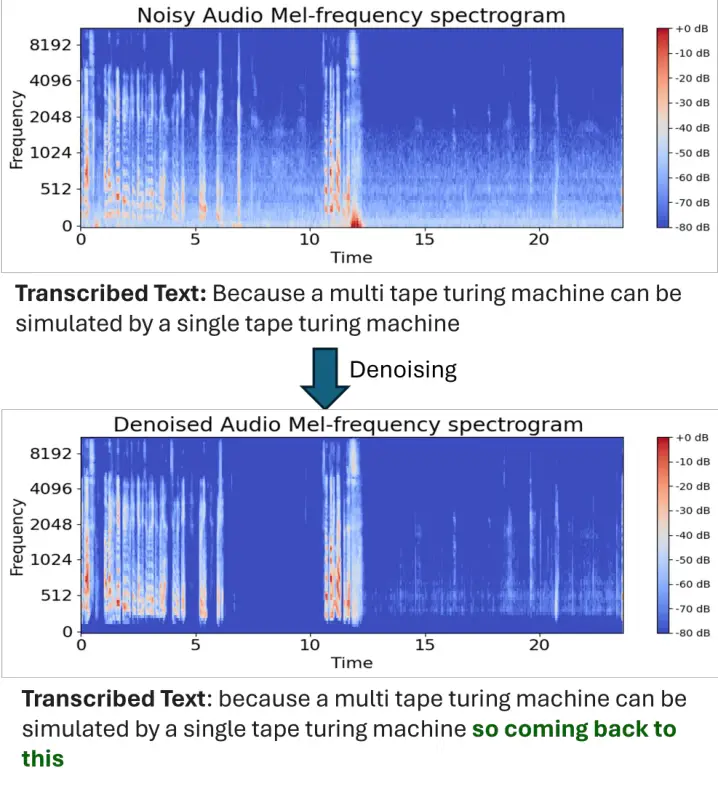
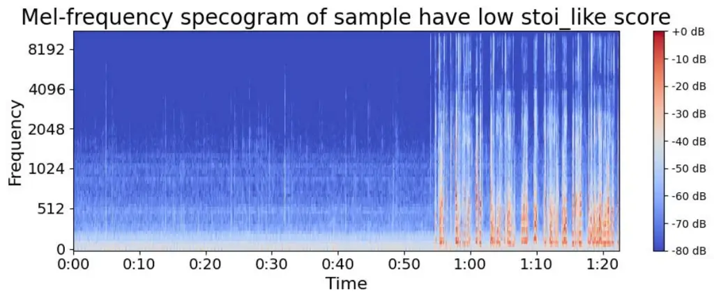
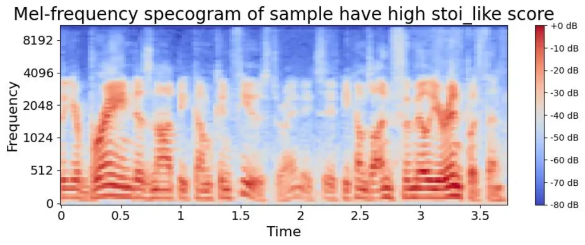

# $`\mathcal{DENOASR}`$: Debiasing ASRs through Selective Denoising

Anand Kumar Rai Affiliation: IIT Kharagpur, India  
Joint Plant Committee, India    Siddharth D Jaiswal Affiliation: IIT
Kharagpur, India    Shubham Prakash Affiliation: IIT Kharagpur, India   
Bendi Pragnya Sree Affiliation: IIT Kharagpur, India    Animesh
Mukherjee Affiliation: IIT Kharagpur, India

###### Abstract

Automatic Speech Recognition (ASR) systems have been examined and shown
to exhibit biases toward particular groups of individuals, influenced by
factors such as demographic traits, accents, and speech styles. Noise
can disproportionately impact speakers with certain accents, dialects,
or speaking styles, leading to biased error rates. In this work we
introduce a novel framework $`\mathcal{DENOASR}`$ which is a selective
denoising technique to reduce the disparity in the word error rates
between the two gender groups male and female. We find that a
combination of two popular speech denoising techniques viz. DEmucs and
Le can be effectively used to mitigate ASR disparity without
compromising their overall performance. Experiments using two SOTA
open-source ASRs – OpenAI Whisper and NVIDIA Nemo on multiple benchmark
datasets – TIE, Vox-Populi, TedLium and Fleurs show that there is a
promising reduction in the average word error rate gap across the two
gender groups. For a given dataset, the denoising is selectively applied
on speech samples having speech intelligibility below a certain
threshold estimated using a small validation sample thus ameliorating
the need for large-scale human written ground-truth transcripts. Our
findings suggest that selective denoising can be an elegant approach to
mitigate biases in present-day ASR systems.

###### Index Terms: 

debiasing, selective denoising, ASR, word error rate

## I Introduction

In recent years, automatic speech recognition (ASR) systems have
witnessed significant advancements in terms of accuracy and efficiency
\[17\], and are now used for various applications such as virtual
assistants \[2, 1, 32\], transcription services \[18, 65, 33\], and
voice-controlled devices \[12\]. Despite these remarkable strides, even
state-of-the-art ASRs are unable to provide equitable performances
across various demographic traits like gender \[51, 50, 14\], age \[11,
55, 14\], race \[22\], speech impairment \[52, 48\] and non-native
accent \[11, 14\]. These disparities prevent wide-scale adoption of
ASRs \[22, 35\], specially amongst the discriminated groups.

Various studies \[25, 13\] have highlighted the detrimental impact of
noise on the overall performance of ASR systems, resulting in errorneous
transcriptions. These studies underscore the critical need for
noise-robust ASR systems to improve performance. The impact of noise
varies across different speech styles \[44\], potentially contributing
to performance disparities. In this work, we have attempted to evaluate
the impact of denoising on mitigating the effects of speaker
demographics in ASR tools performance.

In signal processing, denoising \[5\] is used to remove or reduce
unwanted noise and preserve essential information in an audio or image
sample. Specifically for audio samples, this technique can be used to
improve clarity, intelligibility and the overall listening experience,
particularly in scenarios with background noise or interference.
Similarly, for ASRs denoising is relevant as it enhances the
transcription accuracy by removing background noise and improving the
clarity of the input audio.



Fig. 1: Effect of denoising in speech spectogram and eventually on ASR
transcription performance. The text highlighted in green gets omitted
from ASR transcription in presence of noise in the spectogram. Whisper
has been used for transcribing a speech sample from the TIE dataset
while the denoising strategy used was DEmucs followed by Le.

### I-A Denoising algorithms

Many denoising algorithms have been proposed in literature, such as
spectral subtraction \[4\], Wiener filtering \[3\] and, more recently,
deep learning based techniques \[31\]. These methods estimate noise
using its statistical characteristics, establish a criteria for noise
distinction, and then separate the noise from the audio signals,
resulting in clearer audio. Spectral Gating \[45\] (Sg) and Line
Enhancement \[21\] (Le) are two state-of-the-art denoising algorithms
based on traditional methods proposed recently in literature. Sg is a
variant of Noise Gate \[20\] and utilizes reference noise to estimate
the noise traits and reduce it. Le exploits noise and desired signal
frequency distinctions in the time-domain by utilizing high-pass
filters.

DEmucs (Deep Multichannel Convolutional Neural Network for Speech
Enhancement) \[9\] and MetricGAN+ \[15\] are cutting-edge denoising
algorithms leveraging deep learning techniques. DEmucs employs
multichannel convolutional layers to effectively separate speech signals
from noise, while MetricGAN+ utilizes a generative adversarial network
framework to generate high-quality denoised speech signals.

### I-B Denoising for ASRs

The presence of noise often results in addition, omission and
substitution of words in the ASR generated transcripts as compared to
ground-truth ones. One such example has been illustrated in Figure 1.
Earlier research works have focused on building noise-robust ASRs \[27,
7, 34\] with noise adaptive training, and some studies have proposed
employing advanced noise reduction techniques as a pre-processing
strategy to enhance overall ASR performance \[60\]. These techniques
have proven beneficial in enhancing the robustness of ASR performance
when there is a mismatch in the noise characteristics between the
training and test sets. However, none of these solutions have used
denoising as a bias mitigation strategy, i.e., to reduce the disparity
in the ASR performance across speakers with varied demographic
attributes. Ours is the first work to examine the impact of denoising on
debiasing ASR performance, exploring how noise affects speaker style as
mentioned in \[44\] and, consequently, ASR accuracy.

### I-C Research questions

We now state the research questions tackled in this study.

RQ1. Does denoising audio samples as a pre-processing step in the ASR
pipeline impact the accuracy and enable disparity reduction across
sensitive demographic attributes like gender in open-source ASRs like
Whisper and Nemo?

RQ2. Which among the denoising techniques – traditional signal
processing based or deep learning based or an amalgamation – is the most
effective preprocessing approach in reducing disparity without
compromising the accuracy?

RQ3. Should denoising be applied blindly to all speech samples or to a
selected set of samples based on an appropriate thresholding heuristic
at inference time?

### I-D Our contributions

In this work, we address the research questions stated above for two
state-of-the-art open-source ASRs – Whisper and NVIDIA Nemo. In
particular, we introduced the $`\mathcal{DENOASR}`$ framework to examine
the impact of denoising techniques on ASR performance and disparity
reduction. Through preprocessing steps using signal processing (Sg & Le)
and deep learning-based methods (DEmucs & MetricGAN+), we assessed their
influence on ASR accuracy and disparity reduction across the demographic
group gender. We used multiple datasets to demonstrate the effectiveness
of our results, viz. TIE \[41\], Vox-Populi \[56\], TedLium \[43\] and
Fleurs \[8\]. Our findings indicate successful debiasing of both the
ASRs addressing RQ1. Subsequently, we identified that DEmucs followed by
Le as the optimal denoising combination for superior effectiveness in
mitigating disparities without compromising accuracy and latency
(addresses RQ2). Lastly for addressing RQ3, we compared the
effectiveness of inferencing on selectively denoised audio samples,
based on an intelligibility threshold obtained from a small validation
set, and found that it resulted in further gains. Our findings indicate
that selective denoising is more effective in debiasing ASR performance.
Overall we observe that this method reduces the absolute word error rate
gap between male and female voice transcripts by 11%, 100%, 71%, 100%
(in case of Whisper) and 22%, 100%, 77%, 21% (in case of Nemo) for the
datasets TIE, Vox-Populi, TedLium and Fleurs respectively.

## II Related Work

Existing literature has usually had a strong separation between
denoising of speech signals and debiasing of ASR systems.

### II-A Denosing of speech signals

Denoising of speech signals is a crucial area of research in both
signal-based and deep learning-based methods, particularly for its
impact on ASR systems.

Denoising has been performed using traditional signal processing-based
methods, such as spectral subtraction \[4\], Wiener filtering \[54\],
and adaptive filtering \[21\], which aim to enhance speech clarity by
reducing background noise through mathematical models and signal
processing algorithms \[16, 46\]. These methods, while effective, often
struggle with non-stationary noise and can introduce artifacts. In
contrast, modern deep learning-based approaches, leveraging neural
networks like CNNs \[38\], RNNs \[36\], auto-encoder based models \[28\]
and transformer-based models \[57\], have shown significant improvements
in denoising performance by modeling complex noise patterns and
enhancing speech signals \[19, 49, 6, 26\].

These techniques are reliable and sufficient to denoise audio samples,
resulting in improved ASR performance. They can be broadly classified
into two groups: (a) speech enhancement of test samples using various
noise filters and other deep learning-based noise reduction
techniques \[61, 58, 62, 31\], and (b) noise adaptive training of ASR
systems \[34, 64\]. Effective denoising is vital for ASR as it directly
influences the accuracy of speech recognition systems, ensuring that
transcriptions are accurate even in noisy environments. This is
particularly important for applications in real-world scenarios where
background noise is ubiquitous, such as in virtual assistants,
telecommunication, and voice-controlled systems.

### II-B Debiasing of speech signals

Although stable performance is one of the goals of an ASR platform,
recent research has also focused on aspects like equitable performance
across multiple speaker characteristics – demography \[11, 55, 14\],
speech rate, gender \[51, 50, 14\], etc.This performance parity is
provided using debiasing techniques, which have two primary aspects –
(a) augmenting models with data samples from under-represented
groups \[37, 17, 63, 14, 47\] and, (b) model adaptation or fine-tuning
 \[30, 59\] toward unseen accents, dialects, etc. or a combination of
these \[10\].

### II-C Present work

Ours is the first work to leverage denoising as a debiasing strategy. In
this work, we utilize a previously unexplored combination of signal
based and deep learning based denoising techniques to debias ASR
systems. Our goal is to reduce performance disparity between male and
female speakers without impacting the accuracy of such platforms.

## III Methodology

Fig. 2: Overview of the $`\mathcal{DENOASR}`$ framework for debiasing
ASRs.

In this section, we describe the overall $`\mathcal{DENOASR}`$ framework
(see Figure 2) for reducing the disparity in the performance of ASRs.

### III-A Denoising algorithms

We experiment with both signal based (Sg & Le) and deep learning based
(DEmucs & MetricGAN+) denoising algorithms. A brief description of these
algorithms is given below for enhanced readibility.

- •
  Sg: This technique isolates the target speech signal by suppressing
  background noise based on spectral characteristics. For Sg, we use the
  default parameter settings employed in prior research \[45\].
- •
  Le: This approach aims to enhance the target speech by selectively
  removing frequencies below a certain threshold. For Le, a high-pass
  filter with a cut-off frequency of 300Hz is used, since most
  background noise typically falls within this range. Essential speech
  features, such as harmonics and articulation, generally correspond to
  frequencies higher than 300Hz \[29\] and are thus effectively retained
  by the high-pass filter.
- •
  DEmucs: This is a state-of-the-art neural network architecture
  specifically designed for speech enhancement tasks, leveraging
  multichannel convolutional layers to effectively separate speech
  signals from background noise. In this work we use the open-source
  version¹¹ 1 https://github.com/facebookresearch/demucs pre-trained on
  MUSDB-HQ \[40\].
- •
  MetricGAN+: This approach employs a GAN architecture that mimics human
  perception of speech quality, learns a noise distribution, and removes
  it from the signal. In this work we use the Speech Brain
  Toolkit \[42\] model²² 2
  https://huggingface.co/speechbrain/metricgan-plus-voicebank
  pre-trained on Voicebank \[53\] recordings sampled at 16kHz (single
  channel).

We have also experimented with a combination of the above signal based
and deep learning based denoising approaches to evaluate their
effectiveness in debiasing ASR performance.

### III-B Denoising strategy

For denoising the samples using the denoising techniques, following
strategies were used:

- •
  Identification of the best denoising technique: All speech samples in
  the dataset are denoised before inference with the ASRs. The technique
  that performs best in retaining the accuracy while reducing disparity
  is chosen for selective denoising.
- •
  Selective denoising: Denoising is selectively applied to samples with
  STOI (Short-Time Objective Intelligibility) scores below a determined
  threshold, ensuring that only those with lower perceived speech
  quality undergo enhancement before ASR inference. The optimal
  threshold for STOI is obtained using a validation set of 10%
  ground-truth transcripts. Grid search on the validation set is used to
  obtain the threshold value that maximizes disparity reduction while
  preserving ASR performance.

### III-C STOI in practice

We have used stoi_like algorithm to estimate STOI. The provided
stoi_like algorithm differs from traditional STOI calculations in
several ways. We summarize the algorithm below for enhanced readability.

In traditional STOI, the intelligibility score is calculated using a
clean reference signal $`x(t)`$ and a degraded test signal $`y(t)`$. The
steps involve aligning the signals, computing their short-time Fourier
transforms (STFTs), and then evaluating frame-by-frame correlations.
Mathematically, it can be expressed as as follows.

- •
  Compute the STFT of the reference signal $`x(t)`$ and the degraded
  signal $`y(t)`$:

  ```math
  X(k,n)=\text{STFT}\{x(t)\}
  ```

  ```math
  Y(k,n)=\text{STFT}\{y(t)\}
  ```

- •
  Calculate the correlation between the reference and degraded signal
  frames:

  ```math
  d(x,y)=\sum_{k}\frac{|\langle X(k,n),Y(k,n)\rangle|}{\|X(k,n)\|\|Y(k,n)\|}
  ```

- •
  Map these correlations to predict speech intelligibility.

In contrast, the stoi_like algorithm operates on a single degraded audio
signal without the need for a reference signal. Instead of using
frame-by-frame correlations, this algorithm computes the magnitude of
the STFT of the degraded signal and uses mean magnitudes to estimate the
energy. It then calculates the noise energy by subtracting the energy of
the mean magnitude from the total energy of the signal. The sum of
squares of the mean magnitude is computed, and these values are used to
derive a metric similar to STOI by taking the logarithm of the ratio of
the sum of squares to the noise energy. This approach simplifies the
process by removing the necessity of a reference signal and focuses on
the signal’s internal characteristics, making it potentially more
versatile. Mathematically, it can be expressed as as follows.

- •
  Compute the magnitude of the STFT of the degraded signal $`y(t)`$:

  ```math
  |Y(k,n)|=\left|\text{STFT}\{y(t)\}\right|
  ```

- •
  Estimate the energy of the signal using mean magnitudes:

  ```math
  E_{\text{signal}}=\sum_{k}\left(\text{mean}(|Y(k,n)|)\right)^{2}
  ```

- •
  Calculate the noise energy by subtracting the energy of the mean
  magnitude from the total energy of the signal:

  ```math
  E_{\text{noise}}=\sum_{k}|Y(k,n)|^{2}-E_{\text{signal}}
  ```

- •
  Derive a metric similar to STOI by taking the logarithm of the ratio
  of the sum of squares of the mean magnitude to the noise energy:

  ```math
  \text{stoi\_like}=\log\left(\frac{E_{\text{signal}}}{E_{\text{noise}}}\right)
  ```

### III-D Disparity evaluation

We evaluate the overall performance for an ASR system using the popular
word error rate (WER) metric³³ 3
https://en.wikipedia.org/wiki/Word_error_rate. Before calculating the
WER, we standardize the reference and ASR-generated transcripts using
procedures such as text normalization, converting numerical expressions
to their corresponding textual forms, filler words removal, etc. To
evaluate the disparity in performance of the ASR systems for the gender
attribute, we utilize the absolute word error gap (AWG) defined as the
absolute difference between the median word error rate of the female
data points and the male data points. Thus,

```math
\text{AWG}=\left|median(\text{WER}_{\text{f}})-median(\text{WER}_{\text{m}})\right|
```

## IV Datasets and Platform Evaluated

We now provide a description of the datasets used and platforms
evaluated in this study.

### IV-A Datasets

#### IV-A1 TIE

We utilized the recently released TIE dataset \[41\], which contains
approximately 9.8k audio files sourced from the well-known Indian MOOC
platform NPTEL \[23\]. This dataset spans 8740 hours of technical
academic content delivered by 332 instructors, representing diverse
demographic segments of the Indian population in terms of age, gender,
and geographical location. For the evaluation of our framework, we
employed a novel sampling approach with the TIE dataset. Instead of
using the entire 50-minute audio files, we processed 3-4 consecutive
segments together, resulting in segments of approximately 30 seconds
each. This method ensures parity with the default input file size used
for speech samples from the other (following) datasets.

#### IV-A2 Vox-Populi

The Vox-Populi dataset released by Meta, also part of our study, is
renowned for its extensive compilation of political speech recordings
from the European Parliament. This dataset encompasses thousands of
hours of multilingual speech, reflecting a diverse array of languages
and formal speech content from parliamentary sessions. In this work, we
have used train and test set of speech samples and transcripts in the
English language, hosted on HuggingFace⁴⁴ 4
[https://huggingface.co/datasets/facebook/voxpopuli](https://huggingface.co/datasets/facebook/voxpopuli).

#### IV-A3 TedLium

The TedLium dataset offers a comprehensive collection of audio files
from TED Talks. This dataset includes a wide range of speakers and
topics, capturing various speaking styles and accents from numerous
public speaking events. The train and test set of speech data samples
and transcripts of this dataset used in our experiments, have been
sourced from HuggingFace⁵⁵ 5
[https://huggingface.co/datasets/LIUM/tedlium](https://huggingface.co/datasets/LIUM/tedlium).

#### IV-A4 Fleurs

The Fleurs dataset released by Google provides a rich array of speech
samples from numerous languages and speakers worldwide. This dataset
features extensive coverage of multiple languages and accents, capturing
the linguistic diversity of global speech patterns. The English speech
train and test set data samples and transcripts of this dataset used for
our experiments have been sourced from HuggingFace⁶⁶ 6
[https://huggingface.co/datasets/google/fleurs](https://huggingface.co/datasets/google/fleurs).

The distributional statistics for the aforementioned datasets used in
our work are detailed in Table I.

|                |             |            |          |          |
| -------------- | ----------- | ---------- | -------- | -------- |
| Parameter      | Sampled TIE | Vox-Populi | TedLium  | Fleurs   |
| \#Speakers     | 332         | 774        | 298      | 1510     |
| \#Samples      | 9860        | 9440       | 22370    | 3640     |
| Male (%)       | 94.2        | 57.0       | 67.8     | 60.3     |
| Female (%)     | 5.8         | 43.0       | 32.2     | 39.7     |
| Avg. duration  | 24.5 s      | 11.8 s     | 9.4 s    | 19.6 s   |
| Total duration | 82.4 hrs    | 31.5 hrs   | 58.4 hrs | 19.2 hrs |
| \#words        | 0.64 M      | 0.23 M     | 0.45 M   | 0.14 M   |

TABLE I: Descriptive Statistics of the datasets used in our study.

### IV-B Open source platforms

In this work, we study two state-of-the-art open-source ASR platforms –
OpenAI Whisper \[39\] and NVIDIA Nemo \[24\] for their performance and
responsiveness toward our denoising based bias mitigation strategies.

#### IV-B1 Whisper

This platform \[39\], released in 2022 by OpenAI, has an end-to-end
encoder-decoder transformer and is trained on 680k hours of multilingual
and multitask supervised data collected from the web. The model is
available in various sizes ranging from tiny (39M parameters) to large
(1.5B parameters). In this study, we use the Whisper-base model⁷⁷ 7
https://github.com/openai/whisper having 74M parameters.

#### IV-B2 Nemo

This platform \[24\] provides models for multiple applications – text
processing, speech recognition, and text-to-speech (and vice-versa)
processing. In this study, we use the stt_en_conformer_ctc_large⁸⁸ 8
https://huggingface.co/nvidia/stt_en_conformer_ctc_large model, which
uses the conformer architecture – a hybrid of CNNs and transformers
designed to capture both local and global dependencies in audio data.
This specific model is trained on extensive datasets, including
thousands of hours of diverse speech data, allowing it to achieve high
accuracy in speech-to-text tasks.

System specifications: We run all our experiments on a GPU server with
16 GB RAM, an NVIDIA T4 GPU with 15 GB memory, and an Intel Xeon
processor.

## V Results

In this section, we evaluate the $`\mathcal{DENOASR}`$ framework. There
are two steps in the evaluation. In the first step we identify the best
denoising technique in terms of the average WER (AWER) and the average
AWG (AAWG). In the second step we use selective denoising stoi_like to
further improve the results.

### V-A Best denoising technique

We wanted to identify the best denoising technique across all the
datasets. Hence we mixed the test audio samples from all the datasets to
prepare a common set and applied all the different denoising techniques.
We then micro-averaged the WER (AWER) and the AWG (AAWG) values across
all the datasets. The results are noted in Table II. The key
observations from this table are listed below.

- •
  Denoising strategies generally reduce the disparity in performance
  over noisy samples, but the extent of improvement varies depending the
  ASR model and the denoising algorithm used.
- •
  Among the two signal processing based denoising techniques used, Le
  provides a notable improvement in AAWG, reducing it from 2.28 to 1.81
  for Whisper and from 2.68 to 2.38 for Nemo, compared to the noisy
  baseline across datasets. The overall performance in terms of AWER is
  also least disturbed for Le.
- •
  Of the two deep learning based methods, DEmucs and MetricGAN+, DEmucs
  achieves a substantial improvement in AAWG, reducing it from 2.28 to
  1.74 for Whisper. Surprisingly, the MetricGAN+ results in a increase
  in AAWG for both models compared to the noisy samples. The overall
  performance in terms of AWER is also least disturbed for DEmucs.
- •
  Since the Le and the DEmucs techniques are the best among the signal
  processing and deep learning approaches respectively, a natural
  extension to get the benefits of both is to combine them. The
  combination can be done in two ways – DEmucs followed by Le and vice
  versa. We find that DEmucs followed by Le gives us the best results
  reducing the AAWG to 1.71 from 2.28 for Whisper and 2.28 from 2.68 for
  Nemo. The overall performance of the two ASR systems in terms of AWER
  remains largely undisturbed (in fact gets improved for Nemo).

|                    |         |      |       |      |
| ------------------ | ------- | ---- | ----- | ---- |
| Denoising strategy | Whisper |      | Nemo  |      |
|                    | AWER    | AAWG | AWER  | AAWG |
| Noisy              | 9.58    | 2.28 | 12.22 | 2.68 |
| Sg                 | 14.20   | 2.10 | 12.86 | 2.84 |
| Le                 | 10.76   | 1.81 | 12.14 | 2.38 |
| MetricGAN+         | 13.26   | 2.30 | 14.38 | 3.88 |
| DEmucs             | 10.21   | 1.74 | 13.54 | 2.69 |
| Le + DEmucs        | 11.30   | 1.90 | 12.47 | 3.05 |
| DEmucs + Le        | 10.32   | 1.71 | 11.98 | 2.28 |

TABLE II: Performance of denoising algorithms on the mixture of all
datasets. DEmucs followed by Le is the best denoising technique across
the datasets. The best results are highlighted in boldface.

### V-B Selective denoising

In the previous section we identified that DEmucs followed by Le turned
out to be the best denoising technique across the datasets. However,
when we observed the results manually we found that for a group of data
points where the speech is unintelligible denoising is effective. On the
other hand if the speech is intelligible then denoising has an opposite
impact, i.e., it deteriorates the signal quality. Accordingly, we
resorted to selective denoising based on an STOI threshold obtained for
each dataset using the method described in section III. The results from
this approach are noted in Table III. The key observations from these
results are as follows.

- •
  Selective denoising dramatically reduces the AWG for all the datasets
  and both the ASR models.
- •
  Among the datasets selective denoising is most effective in case of
  Vox-Populi with AWG dropping to 0 for both the ASR models. Other
  datasets also show steady gains.
- •
  Selective denoising is more effective on Nemo among the two ASR
  models.

. Model Dataset No denoising Selective denoising WER AWG WER AWG Whisper
Sampled TIE 11.63 1.59 12.06 1.41 Vox-Populi 6.52 0.22 7.14 0.00 TedLium
2.86 0.31 3.12 0.09 Fleurs 10.52 0.09 10.71 0.00 Nemo Sampled TIE 18.60
2.68 18.64 2.08 Vox-Populi 2.71 0.08 3.33 0.00 TedLium 5.26 1.13 5.26
0.26 Fleurs 5.48 1.12 5.55 0.88

TABLE III: The results of the selective denoising approach using DEmucs
followed by Le for all the individul datasets. The best values are
highlighted in boldface

In conclusion, our experimental results based on the
$`\mathcal{DENOASR}`$ framework highlight the effectiveness of various
denoising strategies in reducing gender-based disparity in ASRs across
different datasets without hurting the overall performance much.

## VI Discussion

In this section, we deep dive into our findings and explore the broader
impact of the denoising strategies on ASR performance and gender
disparity. By analyzing the results from various datasets and denoising
techniques, we aim to provide a comprehensive understanding of how these
strategies influence overall accuracy and fairness in ASR systems.

### VI-A Error analysis

Some of the key observations from the transcript examples generated
through baseline models and the models after applying DEmucs + Le and
selective denoising are enumerated below.

- •
  For the base sample of the male voice in the TIE dataset, the Whisper
  model produces a noisy transcript that seems to hallucinate,
  generating nonsensical phrases such as ‘n n n n n n n’. This issue
  gets resolved when the same base sample is first denoised using
  DEmucs + Le and then transcribed using Whisper. Selective denoising
  continues to maintain this result.
- •
  One of the hardest cases is the transcription, ottawa is canada’s
  charming bilingual capital and features an array of art galleries and
  museums that showcase canada’s past, of the female voice in the Fleurs
  dataset using the Nemo model. Neither DEmucs + Le denoising nor
  selective denoising is effective in resolving the transcription error.
  A possible reason could be the alliteration in the speech segment
  ‘canada’s charming … capital …’ that poses a more complex challenge
  for the model.

Overall, the selective denoising method consistently provides
transcripts that are more coherent and contextually accurate
irrespective of gender compared to the blindly applying DEmucs + Le
based denoising over the whole dataset. However, none of these methods
completely eliminate all errors, particularly in complex speech
situations. The ground-truth data highlights the gap that still exists
between automated denoising methods and human-level transcription
accuracy.

### VI-B Generalizing to other attributes

The effectiveness of the selective denoising algorithm extends beyond
addressing gender disparities in ASR performance to other demographic
attributes as well. Table IV demonstrates the impact of this algorithm
for various other demographic attributes present in the TIE dataset,
including native region, experience group, and discipline group. The
table compares the AWG for both Whisper and Nemo models before and after
applying selective denoising on speech samples from sampled TIE dataset.
For all these groups we observe that the disparity is reduced via
selective denoising for the Whisper model. For the Nemo model the
disparity is reduced in two out of three demographic groups through
selective denoising. This shows that the $`\mathcal{DENOASR}`$ framework
is significantly powerful and can be seamlessly used for disparity
reduction for any other demographic attributes.

| Annotated category | Whisper |         | Nemo    |         |
| ------------------ | ------- | ------- | ------- | ------- |
|                    | AWG (B) | AWG (D) | AWG (B) | AWG (D) |
| Native region      | 2.14    | 2.09    | 1.17    | 1.20    |
| Experience group   | 3.75    | 3.55    | 2.20    | 2.14    |
| Discipline group   | 2.59    | 2.08    | 0.32    | 0.23    |

TABLE IV: Debiasing impact of selective denosing algorithms on other
demographic categories of Sampled TIE dataset. The best results are
highlighted in boldface. AWG (B): AWG for baseline, AWG (D): AWG after
selective denoising.

### VI-C Intelligibility threshold analysis





Fig. 3: (Top) Spectrogram of speech sample with low stoi_like score
having significant noise in lower frequencies. (Bottom) Spectrogram of
speech sample with high stoi_like score having more noise in higher
frequencies.

The spectrogram of the speech sample in Figure 3 (Top) with a low
stoi_like score of -1.51 reveals significant noise across multiple time
segments, severely impacting the intelligibility of the audio. This
degradation is evident in the performance of the two ASR models, Whisper
and Nemo. While the ground-truth transcript is “so the properties that
the hamming distance function satisfies or that the hamming distance
between any two vectors is strictly greater than or equal to zero with
equality holding only if in fact if and only if x equal to y because the
only way that x and y the distance greater than being greater than or
equal to zero it is obvious because we are”, Whisper, outputs only a
single word “so,” indicating a failure to process the noisy input
effectively. In contrast, Nemo performs markedly better, producing a
more coherent transcription, “so the properties that the humming
distance function satisfies are that the humming distance between any
two vectors is strictly greater than equal to zero with equality holding
only if in fact it is if and only if x equal to y because the only way
that x and y the distance greater than being greater than equal to zero
is obvious because” that closely follows the structure and content of
the ground truth, with slight inaccuracies. This comparison underscores
the challenges faced by ASR systems in handling noisy inputs and hence,
as stated earlier, there is a difference in threshold values between the
ASR models for the same dataset.

On the other hand, the mel-frequency spectrogram in Figure 3 (Bottom)
has a high stoi_like score of 12.35 due to the distinct and consistent
formant structures, clear temporal patterns, and significant amplitude
variations. The transcription generated by both ASR models Whisper and
Nemo corresponds exactly to the ground-truth transcript, “so your brain
does not become confused it becomes unfamiliar input then”. This
indicates the presence of noise in speech samples does not warrant need
of denoising for each sample and hence our strategy of selective
denoising based on intelligibility threshold works better in the task of
disparity mitigation.

## VII Conclusion

In this study, we have investigated the effectiveness of the
$`\mathcal{DENOASR}`$ framework in mitigating the transcription errors
in ASR systems, with a focus on addressing gender disparity. We applied
both signal based and deep learning based denoising techniques on
multiple public datasets viz. TIE, Vox-Populi, TedLium and Fleurs and
used two very popular open-source ASRs – Whisper and Nemo for transcript
generation. Using an intelligibility based selective denoising we obtain
substantial improvements in transcription accuracy for both male and
female speakers across all the datasets. Our analysis revealed that the
$`\mathcal{DENOASR}`$ framework not only enhances ASR performance for
gender-specific attributes but also extends its benefits to other
demographic categories, such as native region, experience group, and
discipline group, as evidenced by our results with the TIE dataset.

Overall, the $`\mathcal{DENOASR}`$ framework shows significant promise
in advancing ASR systems by enhancing their robustness and fairness
across diverse user demographics. This method can be seamlessly
integrated into real-time ASRs at the pre-processing stage, operating as
a plug-and-play solution without requiring fine-tuning of the ASR
itself. Future work should continue to refine these algorithms and
explore complementary methods to address the challenges of achieving
truly inclusive and accurate ASR systems for all users.

## References

- \[1\] Amazon: Alexa.
  [https://developer.amazon.com/en-US/alexa](https://developer.amazon.com/en-US/alexa)
  (2014), accessed: 2023-01-01
- \[2\] Apple: Siri.
  [https://support.apple.com/en-us/HT204389](https://support.apple.com/en-us/HT204389)
  (2010), accessed: 2023-01-01
- \[3\] Van den Bogaert, T., Doclo, S., Wouters, J., Moonen, M.: Speech
  enhancement with multichannel wiener filter techniques in
  multimicrophone binaural hearing aids. The Journal of the Acoustical
  Society of America 125(1), 360–371 (2009)
- \[4\] Boll, S.: Suppression of acoustic noise in speech using spectral
  subtraction. IEEE Transactions on acoustics, speech, and signal
  processing 27(2), 113–120 (1979)
- \[5\] Burwen, R.S.: Design of a noise eliminator system. Journal of
  the Audio Engineering Society 19, 906––911 (1971)
- \[6\] Chandrakala, S., Veni, S.: Denoising convolutional autoencoder
  based approach for disordered speech recognition. International
  Journal on Artificial Intelligence Tools (2023)
- \[7\] Chao, F.A., Jiang, S.W.F., Yan, B.C., Hung, J.w., Chen, B.:
  Tenet: A time-reversal enhancement network for noise-robust asr. In:
  2021 IEEE Automatic Speech Recognition and Understanding Workshop
  (ASRU). pp. 55–61. IEEE (2021)
- \[8\] Conneau, A., Ma, M., Khanuja, S., Zhang, Y., Axelrod, V.,
  Dalmia, S., Riesa, J., Rivera, C., Bapna, A.: Fleurs: Few-shot
  learning evaluation of universal representations of speech. In: 2022
  IEEE Spoken Language Technology Workshop (SLT). pp. 798–805.
  IEEE (2023)
- \[9\] Défossez, A., Usunier, N., Bottou, L., Bach, F.: Music source
  separation in the waveform domain. arXiv preprint
  arXiv:1911.13254 (2019)
- \[10\] Dheram, P., Ramakrishnan, M., Raju, A., Chen, I.F., King, B.,
  Powell, K., Saboowala, M., Shetty, K., Stolcke, A.: Toward fairness in
  speech recognition: Discovery and mitigation of performance
  disparities. arXiv preprint arXiv:2207.11345 (2022)
- \[11\] DiChristofano, A., Shuster, H., Chandra, S., Patwari, N.:
  Performance disparities between accents in automatic speech
  recognition. arXiv preprint arXiv:2208.01157 (2022)
- \[12\] Dong, Y., Yao, Y.D.: Secure mmwave-radar-based speaker
  verification for iot smart home. IEEE Internet of Things Journal 8(5),
  3500–3511 (2020)
- \[13\] Dua, M., Akanksha, Dua, S.: Noise robust automatic speech
  recognition: Review and analysis. International Journal of Speech
  Technology 26(2), 475–519 (2023)
- \[14\] Feng, S., Kudina, O., Halpern, B.M., Scharenborg, O.:
  Quantifying bias in automatic speech recognition. arXiv preprint
  arXiv:2103.15122 (2021)
- \[15\] Fu, S.W., Yu, C., Hsieh, T.A., Plantinga, P., Ravanelli, M.,
  Lu, X., Tsao, Y.: Metricgan+: An improved version of metricgan for
  speech enhancement. arXiv preprint arXiv:2104.03538 (2021)
- \[16\] Garg, K., Jain, G.: A comparative study of noise reduction
  techniques for automatic speech recognition systems. In: 2016
  International Conference on Advances in Computing, Communications and
  Informatics (ICACCI). pp. 2098–2103. IEEE (2016)
- \[17\] Garnerin, M., Rossato, S., Besacier, L.: Gender representation
  in french broadcast corpora and its impact on asr performance. In:
  Proceedings of the 1st international workshop on AI for smart TV
  content production, access and delivery. pp. 3–9 (2019)
- \[18\] Google: Youtube automatic captions.
  [https://ai.googleblog.com/2009/12/automatic-captioning-in-youtube.html?showComment=1263378133488](https://ai.googleblog.com/2009/12/automatic-captioning-in-youtube.html?showComment=1263378133488)
  (2009), accessed: 2023-01-01
- \[19\] Grozdić, D.T., Jovičić, S.T.: Whispered speech recognition
  using deep denoising autoencoder and inverse filtering. IEEE/ACM
  Transactions on Audio, Speech, and Language Processing 25(12),
  2313–2322 (2017)
- \[20\] Hodgson, J.: Understanding Records. Continuum Publishing
  Corporation (2020)
- \[21\] Karraz, G.: Effect of adaptive line enhancement filters on
  noise cancellation in ecg signals. SJEE 18(3), 291–302 (2021)
- \[22\] Koenecke, A., Nam, A., Lake, E., Nudell, J., Quartey, M.,
  Mengesha, Z., Toups, C., Rickford, J.R., Jurafsky, D., Goel, S.:
  Racial disparities in automated speech recognition. PNAS (2020)
- \[23\] Krishnan, M.S.: Nptel: A programme for free online and open
  engineering and science education. In: T4E. pp. 1–5. IEEE (2009)
- \[24\] Kuchaiev, O., Li, J., Nguyen, H., Hrinchuk, O., Leary, R.,
  Ginsburg, B., Kriman, S., Beliaev, S., Lavrukhin, V., Cook, J.,
  et al.: Nemo: a toolkit for building ai applications using neural
  modules. arXiv preprint arXiv:1909.09577 (2019)
- \[25\] Kumalija, E., Nakamoto, Y.: Performance evaluation of automatic
  speech recognition systems on integrated noise-network distorted
  speech. Frontiers in Signal Processing 2, 999457 (2022)
- \[26\] Lee, G.W., Kim, H.K., Kong, D.J.: Knowledge distillation-based
  training of speech enhancement for noise-robust automatic speech
  recognition. IEEE Access (2024)
- \[27\] Li, J., Deng, L., Gong, Y., Haeb-Umbach, R.: An overview of
  noise-robust automatic speech recognition. IEEE/ACM Transactions on
  Audio, Speech, and Language Processing 22(4), 745–777 (2014)
- \[28\] Lu, X., Tsao, Y., Matsuda, S., Hori, C.: Speech enhancement
  based on deep denoising autoencoder. In: Interspeech. vol. 2013, pp.
  436–440 (2013)
- \[29\] MacCallum, J.K., Olszewski, A.E., Zhang, Y., Jiang, J.J.:
  Effects of low-pass filtering on acoustic analysis of voice. Journal
  of Voice 25(1), 15–20 (2011)
- \[30\] Meyer, J., Rauchenstein, L., Eisenberg, J.D., Howell, N.: Artie
  bias corpus: An open dataset for detecting demographic bias in speech
  applications. In: LREC. pp. 6462–6468 (2020)
- \[31\] Michelsanti, D., Tan, Z.H., Zhang, S.X., Xu, Y., Yu, M., Yu,
  D., Jensen, J.: An overview of deep-learning-based audio-visual speech
  enhancement and separation. IEEE/ACM Transactions on Audio, Speech,
  and Language Processing 29, 1368–1396 (2021)
- \[32\] Microsoft: Cortana.
  [https://support.microsoft.com/en-us/topic/what-is-cortana-953e648d-5668-e017-1341-7f26f7d0f825](https://support.microsoft.com/en-us/topic/what-is-cortana-953e648d-5668-e017-1341-7f26f7d0f825)
  (2014), accessed: 2023-01-01
- \[33\] Microsoft: Bing speech.
  [https://azure.microsoft.com/en-us/products/ai-services/ai-speech](https://azure.microsoft.com/en-us/products/ai-services/ai-speech)
  (2015), accessed: 2023-01-01
- \[34\] Narayanan, A., Wang, D.: Joint noise adaptive training for
  robust automatic speech recognition. In: 2014 IEEE International
  Conference on Acoustics, Speech and Signal Processing (ICASSP). pp.
  2504–2508. IEEE (2014)
- \[35\] Ngueajio, M.K., Washington, G.: Hey asr system! why aren’t you
  more inclusive? automatic speech recognition systems’ bias and
  proposed bias mitigation techniques. a literature review. In:
  International Conference on Human-Computer Interaction. pp. 421–440.
  Springer (2022)
- \[36\] Osako, K., Singh, R., Raj, B.: Complex recurrent neural
  networks for denoising speech signals. In: 2015 IEEE workshop on
  applications of signal processing to audio and acoustics (WASPAA).
  pp. 1–5. IEEE (2015)
- \[37\] Panayotov, V., Chen, G., Povey, D., Khudanpur, S.: Librispeech:
  an asr corpus based on public domain audio books. In: 2015 IEEE
  international conference on acoustics, speech and signal processing
  (ICASSP). pp. 5206–5210. IEEE (2015)
- \[38\] Pandey, A., Wang, D.: A new framework for cnn-based speech
  enhancement in the time domain. IEEE/ACM Transactions on Audio,
  Speech, and Language Processing 27(7), 1179–1188 (2019)
- \[39\] Radford, A., Kim, J.W., Xu, T., Brockman, G., McLeavey, C.,
  Sutskever, I.: Robust speech recognition via large-scale weak
  supervision. arXiv preprint arXiv:2212.04356 (2022)
- \[40\] Rafii, Z., Liutkus, A., Stöter, F.R., Mimilakis, S.I., Bittner,
  R.: Musdb18-hq - an uncompressed version of musdb18 (Aug 2019).
  https://doi.org/10.5281/zenodo.3338373,
  [https://doi.org/10.5281/zenodo.3338373](https://doi.org/10.5281/zenodo.3338373)
- \[41\] Rai, A.K., Jaiswal, S.D., Mukherjee, A.: A deep dive into the
  disparity of word error rates across thousands of nptel mooc videos.
  In: Proceedings of the International AAAI Conference on Web and Social
  Media. vol. 18, pp. 1302–1314 (2024)
- \[42\] Ravanelli, M., Parcollet, T., Plantinga, P., Rouhe, A.,
  Cornell, S., Lugosch, L., Subakan, C., Dawalatabad, N., Heba, A.,
  Zhong, J., et al.: Speechbrain: A general-purpose speech toolkit.
  arXiv preprint arXiv:2106.04624 (2021)
- \[43\] Rousseau, A., Deléglise, P., Esteve, Y.: Ted-lium: an automatic
  speech recognition dedicated corpus. In: LREC. pp. 125–129 (2012)
- \[44\] Sadeghi, M., Marvi, H., Ali, M.: The effect of different
  acoustic noise on speech signal formant frequency location.
  International Journal of Speech Technology 21, 741–752 (2018)
- \[45\] Sainburg, T., Thielk, M., Gentner, T.Q.: Finding, visualizing,
  and quantifying latent structure across diverse animal vocal
  repertoires. PLoS computational biology 16(10), e1008228 (2020)
- \[46\] Sambur, M.: Adaptive noise canceling for speech signals. IEEE
  Transactions on acoustics, speech, and signal processing 26(5),
  419–423 (1978)
- \[47\] Sarı, L., Hasegawa-Johnson, M., Yoo, C.D.: Counterfactually
  fair automatic speech recognition. IEEE/ACM Transactions on Audio,
  Speech, and Language Processing 29, 3515–3525 (2021)
- \[48\] Shahamiri, S.R.: Speech vision: An end-to-end deep
  learning-based dysarthric automatic speech recognition system. IEEE
  Transactions on Neural Systems and Rehabilitation Engineering 29,
  852–861 (2021)
- \[49\] Soe Naing, H.M., Hidayat, R., Hartanto, R., Miyanaga, Y.:
  Discrete wavelet denoising into mfcc for noise suppressive in
  automatic speech recognition system. International Journal of
  Intelligent Engineering & Systems 13(2) (2020)
- \[50\] Tatman, R.: Gender and dialect bias in youtube’s automatic
  captions. In: EthNLP. pp. 53–59 (2017)
- \[51\] Tatman, R., Kasten, C.: Effects of talker dialect, gender &
  race on accuracy of bing speech and youtube automatic captions. In:
  Interspeech. pp. 934–938 (2017)
- \[52\] Tu, M., Wisler, A., Berisha, V., Liss, J.M.: The relationship
  between perceptual disturbances in dysarthric speech and automatic
  speech recognition performance. The Journal of the Acoustical Society
  of America 140(5), EL416–EL422 (2016)
- \[53\] Veaux, C., Yamagishi, J., King, S.: The voice bank corpus:
  Design, collection and data analysis of a large regional accent speech
  database. In: 2013 international conference oriental COCOSDA held
  jointly with 2013 conference on Asian spoken language research and
  evaluation (O-COCOSDA/CASLRE). pp. 1–4. IEEE (2013)
- \[54\] Venkateswarlu, S.C., Prasad, K.S., Reddy, A.S., et al.: Improve
  speech enhancement using weiner filtering. Global Journal of Computer
  Science and Technology 11(7) (2011)
- \[55\] Vipperla, R., Renals, S., Frankel, J.: Ageing voices: The
  effect of changes in voice parameters on asr performance. EURASIP
  Journal on Audio, Speech, and Music Processing pp. 1–10 (2010)
- \[56\] Wang, C., Riviere, M., Lee, A., Wu, A., Talnikar, C., Haziza,
  D., Williamson, M., Pino, J., Dupoux, E.: Voxpopuli: A large-scale
  multilingual speech corpus for representation learning,
  semi-supervised learning and interpretation. arXiv preprint
  arXiv:2101.00390 (2021)
- \[57\] Wang, K., He, B., Zhu, W.P.: Tstnn: Two-stage transformer based
  neural network for speech enhancement in the time domain. In: ICASSP
  2021-2021 IEEE international conference on acoustics, speech and
  signal processing (ICASSP). pp. 7098–7102. IEEE (2021)
- \[58\] Weninger, F., Erdogan, H., Watanabe, S., Vincent, E., Le Roux,
  J., Hershey, J.R., Schuller, B.: Speech enhancement with lstm
  recurrent neural networks and its application to noise-robust asr. In:
  Latent Variable Analysis and Signal Separation: 12th International
  Conference, LVA/ICA 2015, Liberec, Czech Republic, August 25-28, 2015,
  Proceedings 12. pp. 91–99. Springer (2015)
- \[59\] Winata, G.I., Cahyawijaya, S., Liu, Z., Lin, Z., Madotto, A.,
  Xu, P., Fung, P.: Learning fast adaptation on cross-accented speech
  recognition. arXiv preprint arXiv:2003.01901 (2020)
- \[60\] Yadava, G.T., Nagaraja, B., Jayanna, H.S.: Enhancements in
  continuous kannada asr system by background noise elimination.
  Circuits, Systems, and Signal Processing 41(7), 4041–4067 (2022)
- \[61\] Yu, C., Zezario, R.E., Wang, S.S., Sherman, J., Hsieh, Y.Y.,
  Lu, X., Wang, H.M., Tsao, Y.: Speech enhancement based on denoising
  autoencoder with multi-branched encoders. IEEE/ACM Transactions on
  Audio, Speech, and Language Processing 28, 2756–2769 (2020)
- \[62\] Yuliani, A.R., Amri, M.F., Suryawati, E., Ramdan, A., Pardede,
  H.F.: Speech enhancement using deep learning methods: A review. Jurnal
  Elektronika dan Telekomunikasi 21(1), 19–26 (2021)
- \[63\] Zhang, Y., Zhang, Y., Patel, T., Scharenborg, O.: Comparing
  data augmentation and training techniques to reduce bias against
  non-native accents in hybrid speech recognition systems. In: Proc. 1st
  Workshop on Speech for Social Good (S4SG). pp. 15–19 (2022)
- \[64\] Zhu, Q.S., Zhou, L., Zhang, J., Liu, S.J., Hu, Y.C., Dai, L.R.:
  Robust data2vec: Noise-robust speech representation learning for asr
  by combining regression and improved contrastive learning. In: ICASSP
  2023-2023 IEEE International Conference on Acoustics, Speech and
  Signal Processing (ICASSP). pp. 1–5. IEEE (2023)
- \[65\] Zoom Video Communications, I.: Zoom auto generated captions.
  [https://blog.zoom.us/zoom-auto-generated-captions/](https://blog.zoom.us/zoom-auto-generated-captions/)
  (2017), accessed: 2023-01-01
