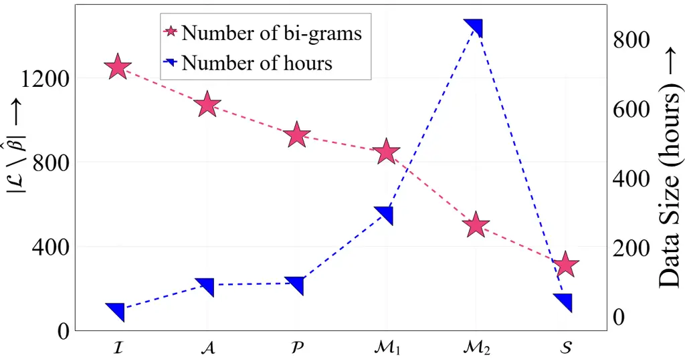

# ![[Uncaptioned image]](arxiv-2410-17901v1--49ebe230decd.figures/figure-1.webp) ELAICHI: Enhancing Low-resource TTS by Addressing Infrequent and Low-frequency Character Bigrams

Srija Anand\*    Praveen Srinivasa Varadhan\*    Mehak Singal    Mitesh
M. Khapra Affiliation: Nilekani Centre at AI4Bharat, Indian Institute of
Technology Madras, India Affiliation: {da24s013,
cs21d201}@smail.iitm.ac.in Affiliation: [![[Uncaptioned
image]](arxiv-2410-17901v1--49ebe230decd.figures/figure-2.webp)
ELAICHI](https://github.com/AI4Bharat/ELAICHI)

###### Abstract

Recent advancements in Text-to-Speech (TTS) technology have led to
natural-sounding speech for English, primarily due to the availability
of large-scale, high-quality web data. However, many other languages
lack access to such resources, relying instead on limited studio-quality
data. This scarcity results in synthesized speech that often suffers
from intelligibility issues, particularly with low-frequency character
bigrams. In this paper, we propose three solutions to address this
challenge. First, we leverage high-quality data from linguistically or
geographically related languages to improve TTS for the target language.
Second, we utilize low-quality Automatic Speech Recognition (ASR) data
recorded in non-studio environments, which is refined using denoising
and speech enhancement models. Third, we apply knowledge distillation
from large-scale models using synthetic data to generate more robust
outputs. Our experiments with Hindi demonstrate significant reductions
in intelligibility issues, as validated by human evaluators. We propose
this methodology as a viable alternative for languages with limited
access to high-quality data, enabling them to collectively benefit from
shared resources.

## 1 Introduction

In recent years, substantial progress has been made in text-to-speech
(TTS) synthesis for English, with state-of-the-art models generating
highly natural speech Shen et al. (2024); Ju et al. (2024). Unlike
traditional TTS systems, which relied on limited studio-quality data,
modern models are trained on web-scale datasets from diverse sources
spanning various emotions and speaking styles Lyth and King (2024). The
ready availability of such data coupled with the development of advanced
automatic speech recognition (ASR) systems Radford et al. (2023); Zhang
et al. (2023); Pratap et al. (2020), which facilitate accurate
transcription, results in rich audio-text pairs for training.

In contrast, low-resource languages lack both extensive web-scale
datasets Doddapaneni et al. (2023) and accurate ASR systems. As a
result, TTS systems for these languages lag significantly behind, often
relying on small, curated datasets Kumar et al. (2023); Prakash and
Murthy (2022); Prakash et al. (2023). Due to the limited size of the
datasets and the prevalence of code-mixing which introduces English
origin words, various character bigrams are not adequately represented
in these datasets. Consequently, these systems often exhibit
intelligibility issues, particularly on test utterances containing such
low-frequency character bigrams. To overcome these limitations, we
propose three methods in this work aimed at improving intelligibility
for low-frequency character bigrams.

First, we investigate the use of additional studio-quality data from
related low-resource languages. This study focuses on Hindi, one of the
most widely spoken languages in the Indian subcontinent, with
approximately 528.3 million speakers globally. Many languages in this
region have shared vocabulary, highly overlapping phoneme sets and
compatible orthographic systems with similar grapheme-to-phoneme
mappings.

Consequently, jointly training a model on data from multiple such
languages may improve the representation of low-frequency character
bigrams, improving performance in the target language. In this work, we
explore the possibility of using additional data from (i) one related
language which uses the same script, (ii) multiple languages with
overlapping phoneme sets but not necessarily using the same script, and
(iii) a variety of speakers across related languages, rather than
relying on a single male or female speaker per language.

Second, while studio-quality data may be limited, many low-resource
languages possess low-quality audio-text pairs initially used for
training ASR systems. We propose repurposing such data for training TTS
systems by applying denoising Liu et al. (2021) and enhancement
techniques Schröter et al. (2023). Specifically, we leverage the
IndicVoices-R dataset Sankar et al. (2024), where denoising and speech
enhancement models were employed to clean an existing ASR dataset Javed
et al. (2024), resulting in higher-quality data suitable for TTS
training. A key feature of this dataset is its inclusion of spontaneous
speech on diverse topics from a demographically varied group of
speakers. Additionally, it captures colloquial and code-mixed language
nuances, which may improve the representation of low-frequency bigrams
in current TTS datasets, thereby enhancing the intelligibility and
naturalness of synthesized speech.

Third, we draw inspiration from recent advancements in distilling
knowledge from large-scale models to enhance the performance of smaller
models Gandhi et al. (2023); Abdin et al. (2024); Dubey et al. (2024);
Chevi et al. (2023). Specifically, we utilize the pre-trained VoiceCraft
checkpoint from IndicVoices-R Sankar et al. (2024), which was trained on
enhanced ASR data from multiple Indian languages. Using this model, we
synthesize speech samples for utterances that contain low-frequency
bigrams. By augmenting the existing high-quality TTS dataset with
synthetic speech targeting these low-frequency character bigrams, we aim
to improve their coverage and, consequently, the intelligibility of TTS
systems. Our experiments with Hindi as the target language show that all
our proposed methods outperform the baseline. We explain these
improvements using corpus-level statistics, specifically (i) coverage
and (ii) relative growth of low-frequency character bigrams.
Multilingual training yielded the highest intelligibility rates due to
significant relative growth. It also achieved high mean opinion scores,
showing the effectiveness of scaling with studio-quality datasets from
multiple languages. Lastly, our experiments with synthetic data reveal
that simply increasing the coverage of low-frequency bigrams is not
sufficient; ensuring adequate representation of each new bigram in the
augmented corpus is also crucial. We hope our findings can serve as a
foundation for improving TTS systems in other low-resource languages.

## 2 Related Work

State of English TTS: Intelligibility is a critical aspect of
Text-to-Speech (TTS) systems Tan et al. (2021). Several works Shen
et al. (2024); Ju et al. (2024); Casanova et al. (2024); Peng et al.
(2024) have achieved state-of-the-art performance in English, excelling
in both naturalness and intelligibility. Additionally, assessing
performance on out-of-distribution (OOD) texts has gained traction, with
methods like StyleTTS Li et al. (2023) enhancing the generalization
capabilities of TTS systems for OOD content. However, a key enabler of
these advances in English TTS is the massive availability of
high-quality data Pratap et al. (2020); Chen et al. (2021), which
low-resource languages often lack. Thus, several strategies that are
well-motivated and necessary for low-resource languages become less
relevant for English, where there is data abundance.

Low-Resource TTS Intelligibility: Limited training data in low-resource
languages often results in unnatural and difficult-to-understand speech.
Prior work Anand et al. (2024) has shown that TTS systems for Indian
languages struggle with missing character bigrams, and propose a
low-cost solution through volunteer-recorded data to improve
performance. In contrast, our work expands the scope by demonstrating
that Hindi TTS systems also exhibit poor synthesis on low-frequency
character bigrams. We address this issue by proposing methods that use
related language data, ASR datasets, or outputs from large pre-trained
models, thus reducing the need for manual data collection.

Augmentation Strategies: Several augmentation strategies have been
explored to improve TTS systems. Multilingual pre-training Amalas et al.
(2024) has significantly improved the naturalness and intelligibility of
TTS systems for low-resource languages compared to monolingual models.
This work investigates multilingual training’s effectiveness in
addressing pronunciation errors related to low-frequency character
bigrams. Another established approach is augmenting TTS datasets with
synthetic data; for example, Lajszczak et al. (2022) showed that
synthetic audio samples created by substituting text and audio fragments
improve expressive TTS quality. Similarly, IndicVoices-R Sankar et al.
(2024) demonstrated that scaling TTS models with ASR-enhanced data
boosts few-shot and zero-shot speaker performance. Our work builds on
these strategies to improve intelligibility of low-frequency character
bigrams.

## 3 Background

Let $`\mathcal{C}`$ be a speech corpus defined as a set of $`N`$
utterances, denoted as $`\mathcal{C}=\{u_{1},u_{2},\ldots,u_{N}\}`$.
Each utterance $`u_{i}`$ is represented as a text-audio pair
$`u_{i}=(t_{i},a_{i})`$, where $`t_{i}`$ is the text uttered and
$`a_{i}`$ is the corresponding audio recording. Every text utterance
$`t_{i}`$ is a sequence of characters, $`c_{j}^{i}`$ such that
$`t_{i}=[c_{1}^{i},c_{2}^{i},\dots,c_{L_{i}}^{i}]`$, where $`L_{i}`$ is
the length of the $`i^{th}`$ text utterance.

Definition (Character bigram). We consider a character bigram as a pair
of consecutive characters in an utterance. More formally, a character
bigram for the $`i`$-th utterance is defined as:

```math
b_{j}^{i}=(c_{j}^{i},c_{j+1}^{i}),
```

for $`1\leq j\leq L_{i-1}`$. The set of all character bigrams from the
entire corpus is denoted as $`\mathcal{B}`$:

```math
\mathcal{B}=\bigcup_{i=1}^{N}\{b_{1}^{i},b_{2}^{i},\dots,b_{L_{i-1}}^{i}\}.
```

Definition (Frequency). For each character bigram $`b\in\mathcal{B}`$,
its frequency is defined as the number of occurrences across all
utterances in the corpus:

```math
f(b)=\sum_{i=1}^{N}\sum_{j=1}^{L_{i-1}}\mathbb{I}(b_{j}^{i}=b),
```

where $`\mathbb{I}(\cdot)`$ is the indicator function that returns 1 if
the character bigram $`b_{j}^{i}=b`$ and 0 otherwise.

Definition (Low Frequency Character bigram). A character bigram is
considered low-frequency (LF) if:

```math
f(b)<t
```

where $`t\in\mathbb{Z}^{+}`$ is a frequency threshold. The threshold
$`t`$ can be selected based on various criteria such as quantiles of the
frequency distribution, standard deviations or the Pareto principle. In
this work, we initialize $`\mathcal{L}`$ from the bigram set
$`\mathcal{B}_{\mathcal{T}}`$ of a larger text corpus $`\mathcal{T}`$ to
ensure broad coverage of bigrams and to accurately capture infrequent
patterns. Leveraging a large corpus allows us to model the full
distribution of character bigrams across diverse contexts, ensuring that
our identification of low-frequency character bigrams is robust and not
biased by the smaller training data. We set the threshold $`t=40`$,
corresponding to the 40th percentile of the frequency distribution.

The set of low-frequency character bigrams $`\mathcal{L}`$ is then
defined as:

```math
\mathcal{L}=\{b\in\mathcal{B}_{\mathcal{T}}\mid f(b)<t\}.
```

Our objective is to show that TTS models tend to produce higher error
rates for text sequences containing character bigrams from
$`\mathcal{L}`$. We hypothesize that low-frequency character bigrams
correspond to phonetic patterns that the model has not adequately
learned due to insufficient training examples. To mitigate this issue,
we propose methods that augment the original corpus and increase the
frequency of bigrams $`\in\mathcal{L}`$. Let the augmented corpus be
$`\hat{\mathcal{C}}`$. We define two new measures to quantitatively
reflect the improvement of the augmented corpus over the original one in
terms of low-frequency character bigrams.

Definition (Coverage) measures the absolute increase in the number of
low-frequency bigrams introduced in the augmented corpus compared to the
original corpus. We define it as,

```math
\Delta F=\left|\hat{\mathcal{B}}\cap\mathcal{L}\right|-\left|\mathcal{B}\cap\mathcal{L}\right|
```

where $`\hat{\mathcal{B}}`$ is the set of all character bigrams in
$`\hat{\mathcal{C}}`$.

Definition (Relative Growth) measures the change in frequency of LF
character bigrams across the original and augmented corpora, accounting
for both existing and new bigrams. We define the growth in low-frequency
bigrams for $`\hat{\mathcal{C}}`$ as,

```math
\Delta G=\sum_{b\in\hat{\mathcal{B}}\cap\mathcal{L}}\hat{f}(b)-\sum_{b\in B\cap\mathcal{L}}f(b)
```

where, $`\hat{\mathcal{B}}`$ is the set of bigrams in
$`\hat{\mathcal{C}}`$ characterized by frequency function $`\hat{f}`$.
The relative growth is given by,

```math
\Delta G_{\text{rel}}=\frac{\Delta G}{\sum_{b\in B\cap\mathcal{L}}f(b)}
```

## 4 Methodology

We propose four methods to mitigate the errors on low-frequency bigrams
by augmenting the training data with additional sources. The objective
is to improve the representation of rare bigrams through carefully
designed data augmentation strategies. Let the training corpus, set of
bigrams, frequency, and set of low-frequency bigrams of the training
corpus of the baseline method be given by $`\mathcal{C}`$,
$`\mathcal{B}`$, $`f`$, and, $`\mathcal{L}`$, respectively.

### 4.1 Adding a Proximal Language

In this method, we augment our corpus by integrating character bigrams
from a related language that shares the same script as the target
language. Let $`\mathcal{P}`$ denote the proximal language speech
corpus. The inclusion of the proximal language introduces additional
character bigrams into our training dataset.

Let $`\mathcal{B_{\mathcal{P}}}`$ represent the set of bigrams of
$`\mathcal{P}`$. The augmented corpus $`\hat{\mathcal{C}}`$ is defined
as:

```math
\hat{\mathcal{C}}=\mathcal{C}\cup\mathcal{P}.
```

The set of bigrams in the enhanced corpus is then given by
$`\hat{\mathcal{B}}=\mathcal{B}\cup\mathcal{B}_{\mathcal{P}}.`$ As a
result of this augmentation, we realize that the frequency of
low-frequency bigrams may increase. Specifically, for any bigram
$`b\in\hat{\mathcal{B}}`$, its updated frequency $`\hat{f}(b)`$ can be
expressed as:

```math
\hat{f}(b)=f(b)+\sum_{i=1}^{N_{\mathcal{P}}}\sum_{i=1}^{L_{i}^{\mathcal{P}}-1}\mathbb{I}(b_{j}^{i}=b),
```

where $`b^{i}_{j}`$ is the $`j^{th}`$ bigram in the $`i^{th}`$ utterance
of $`\mathcal{P}`$, $`L^{\mathcal{P}}_{j}`$ is the length of the
$`i^{th}`$ text utterance, and $`N_{\mathcal{P}}`$ is the total number
of utterances in $`\mathcal{P}`$. Consequently, some bigrams in the
original low-frequency set $`\mathcal{L}`$ may increase in frequency and
potentially rise above the threshold $`t`$.

```math
\Delta G=\sum_{b\in\hat{\mathcal{B}}\cap\mathcal{L}}\sum_{j=1}^{N_{\mathcal{P}}}\sum_{k=1}^{L_{j}^{\mathcal{P}}-1}\mathbb{I}(b_{j}^{i}=b)
```

This method seems promising as it utilizes overlapping bigrams from
proximal languages, and we hypothesize that, by doing so, it is able to
enhance the model’s ability to generalize and accurately pronounce
previously underrepresented low-frequency bigrams.

### 4.2 Scaling Multilingual Data

In this method, we enhance our training corpus by incorporating data
from multiple languages, including both those that share the same script
as the target language and those with different scripts. Let
$`\mathcal{M}`$ denote the multilingual speech corpus consisting of
utterances from various languages. The augmented corpus
$`\hat{\mathcal{C}}`$ is defined as
$`\hat{\mathcal{C}}=\mathcal{C}\cup\mathcal{M}.`$ Likewise, the set of
character bigrams for the enhanced corpus is given by:
$`\hat{\mathcal{B}}=\mathcal{B}\cup\mathcal{B}_{\mathcal{M}}.`$
Incorporating data from multiple languages not only increases the
frequency counts of shared bigrams for languages with the same script
but may also allow the model to learn implicit acoustic representations
for overlapping phoneme bigrams in languages with different scripts. The
growth in $`\hat{\mathcal{C}}`$ is given by,

```math
\Delta G=\sum_{b\in\hat{\mathcal{B}}\cap\mathcal{L}}\sum_{l\in\Gamma}\sum_{i=1}^{N_{l}}\sum_{j=1}^{L_{i}^{l}-1}\mathbb{I}(b_{j}^{i,l}=b)
```

where $`\Gamma`$ represents the set of languages sharing the same script
as the target language, $`N_{l}`$ is the number of utterances in the
$`l^{th}`$ language, and $`L_{i}^{l}`$ is the length of the $`i^{th}`$
utterance in the $`l^{th}`$ language.

### 4.3 Adding ASR-Enhanced Data

Automatic Speech Recognition (ASR) data is a widely available resource
that typically introduces a large number of speakers into the training
set. While ASR datasets can help increase the frequency counts of
low-frequency bigrams in the target language, they often come with
lower-quality transcripts and suboptimal audio recordings. These factors
can potentially degrade the performance of the TTS system. To mitigate
this, we employ denoised and dereverberated ASR data in our experiments
to ensure better audio quality.

The methodology for augmenting the corpus with ASR data follows a
process similar to that of adding a proximal language, but with the
crucial difference that here we add ASR data from the same language. The
augmented corpus $`\hat{\mathcal{C}}`$ is defined as
$`\hat{\mathcal{C}}=\mathcal{C}\cup\mathcal{A}`$, where $`\mathcal{A}`$
represents the ASR corpus in the target language. The set of bigrams
from the ASR-enhanced corpus is then given by
$`\hat{\mathcal{B}}=\mathcal{B}\cup\mathcal{B}_{\mathcal{A}}`$, where
$`\mathcal{B}_{\mathcal{A}}`$ represents the set of bigrams of
$`\mathcal{A}`$.

The growth in $`\hat{\mathcal{C}}`$ is given by,

```math
\Delta G=\sum_{b\in\hat{\mathcal{B}}\cap\mathcal{L}}\sum_{i=1}^{N_{\mathcal{A}}}\sum_{j=1}^{L_{i}^{\mathcal{A}}-1}\mathbb{I}(b_{j}^{i}=b)
```

where $`N_{\mathcal{A}}`$ is the number of utterances in the ASR corpus,
and $`L_{i}^{\mathcal{A}}`$ is the length of the $`i^{th}`$ utterance.

### 4.4 Adding Synthetic Data

In this method, we generate synthetic speech data by distilling outputs
from a large, pre-trained TTS model that has been trained on a much
larger corpus. This large model would typically perform well on a
variety of low-frequency character bigrams due to its exposure to
diverse data (typically, from multiple languages) and greater capacity.
The large capacity and corresponding large size of this model would make
it impractical for deployment in downstream use cases. However, by using
this model to generate synthetic data, we can augment the original
corpus and improve the performance of a smaller, more efficient TTS
model. This approach is practical because the smaller model can then be
trained on this enriched dataset, benefiting from the knowledge of the
larger model while maintaining computational efficiency during
inference.

Let $`\mathcal{S}`$ be the synthetic corpus, wherein we ensure that
every utterance covers at least one low-frequency bigram
$`b\in\mathcal{L}`$. The augmented corpus $`\hat{\mathcal{C}}`$ is then
defined as $`\hat{\mathcal{C}}=\mathcal{C}\cup\mathcal{S}`$.

The growth in $`\hat{\mathcal{C}}`$ is given by,

```math
\Delta G=\sum_{b\in\hat{\mathcal{B}}\cap\mathcal{L}}\sum_{i=1}^{N_{\mathcal{S}}}\sum_{j=1}^{L_{i}^{\mathcal{S}}-1}\mathbb{I}(b_{j}^{i}=b)
```

where $`N_{\mathcal{S}}`$ is the number of utterances in
$`\mathcal{S}`$, and $`L_{i}^{\mathcal{S}}`$ is the length of the
$`i^{th}`$ utterance.

## 5 Experimental Setup

In this section we outline the datasets and models used across our
experiments and detail the evaluation setup of our experiments. Table 1
reports the data statistics for our proposed methods.



Figure 1: A comparison of the number of bigrams from $`\mathcal{L}`$
missing in the corpora (left Y axis) and the training data size (right Y
axis) of the corpora under consideration.

### 5.1 Datasets

| Corpus                  | Studio | Duration (h) | \# Spk | \# Lang |
| ----------------------- | ------ | ------------ | ------ | ------- |
| $`\quad\mathcal{I}`$    | ✓      | 20.16        | 2      | 1       |
| $`\quad\mathcal{P}`$    | ✓      | 80.11        | 2      | 1       |
| $`\quad\mathcal{A}`$    | ✗      | 72.74        | 368    | 1       |
| $`\;\;\mathcal{M}_{1}`$ | ✓      | 224.57       | 27     | 14      |
| $`\;\;\mathcal{M}_{2}`$ | ✓      | 852.17       | 260    | 15      |
| $`\quad\mathcal{S}`$    | ✗      | 27.67        | 1      | 1       |

Table 1: Statistics of corpora used in different experimental setups,
where \# Spk indicates number of speakers, and \# Lang indicates number
of languages.

Massive Text Corpus ($`\mathcal{T}`$): We collate a substantial text
corpus using resources such as Sangraha Khan et al. (2024), the Bharat
Parallel Corpus Gala et al. (2023), and transcriptions from IndicVoices
Javed et al. (2024). We define the low-frequency bigram set
$`\mathcal{L}`$ using this corpus by setting the threshold, $`t=40`$.

Baseline Corpus ($`\mathcal{I}`$): All our experiments include the
baseline dataset which is 20 hours of Hindi from IndicTTS Baby et al.
(2016). This set contains 200 low-frequency bigrams.

Proximal Language Corpus ($`\mathcal{P}`$): Chhattisgarhi is an Eastern
dialect of Hindi and shares the Devanagari script with Hindi. Therefore,
we initialize $`\mathcal{P}`$ with 80 hours of high-quality,
studio-recorded Chhattisgarhi data from LIMMITS LIMMITS Project (2024).

Multilingual Corpus ($`\mathcal{M}`$): We conduct two experiments to
investigate the effect of adding multilingual data, one at a smaller
scale and one by pooling most publicly available Indian TTS datasets. In
the first experiment, we initialize $`\mathcal{M}_{1}`$ with the
IndicTTS dataset Baby et al. (2016), which includes 13 official
languages of India - Assamese, Bengali, Gujarati, Kannada, Malayalam,
Manipuri, Odia, Punjabi, Tamil, Telugu, Bodo, Hindi, and Marathi, of
which the latter three use Devanagri script. Each language has
approximately 20 hours of high-quality, studio-recorded data, evenly
split between a female and a male speaker. We include $`\mathcal{P}`$ in
$`\mathcal{M}_{1}`$, thus the dataset contains 14 languages.

In the second experiment, we scale up to include multiple TTS datasets
for Indian languages. $`\mathcal{M}_{2}`$ includes IndicTTS Baby et al.
(2016), LIMMITS LIMMITS Project (2024), Google Crowdsourced Butryna
et al. (2020), and Rasa Varadhan et al. (2024), totaling approximately
852 hours of speech. We thus extend our dataset to include 15 Indian
languages, with addition of Nepali, and a total of 260 speakers. In
Figure 1, we see that this method adds the most number of hours and
effectively scales down the number of missing low-frequency character
bigrams to 499.

ASR Corpus ($`\mathcal{A}`$): We include the 72 hours of the Hindi
subset of IndicVoices-R Sankar et al. (2024) in $`\mathcal{A}`$. The
dataset includes both read and extempore speech, spanning over 21
domains, as outlined in Javed et al. (2024), providing a comprehensive
coverage of character bigrams.

Synthetic Corpus ($`\mathcal{S}`$): We see in Figure 1 that
incorporating various corpora, such as proximal languages and ASR
increases the data size but still insufficiently covers the
low-frequency bigrams. To address this, we derive a subset of
$`\mathcal{T}`$ by greedily selecting sentences containing low-frequency
bigrams, as discussed in Section 4.4. We then synthesize these
utterances, resulting in a synthetic Hindi speech corpus,
$`\mathcal{S}`$. Figure 1 illustrates that just by adding 28 hours of
synthetic audio, we are left with only 310 missing low-frequency bigrams
which is the least amongst all methods. We discuss the model used to
generate $`\mathcal{S}`$ in Section 5.2.

### 5.2 Models

VITS: The VITS Kim et al. (2021) model used in all our experiments
consists of a posterior encoder, prior encoder, decoder, discriminator,
and stochastic duration predictor. The posterior encoder, which is only
used during training, utilizes non-causal WaveNet van den Oord et al.
(2016) residual blocks to model the posterior distribution, with global
conditioning for speaker embeddings in multi-speaker scenarios. The
prior encoder includes a Transformer-based Vaswani et al. (2017) text
encoder with relative positional encoding, followed by a normalizing
flow based on WaveNet residual blocks for flexible prior distribution
modeling. The decoder adopts HiFi-GAN V1 Kong et al. (2020), leveraging
transposed convolutions and multi-receptive field fusion for waveform
generation. The discriminator employs a multi-period architecture, and
the stochastic duration predictor estimates phoneme durations using
dilated convolutions and neural spline flows. We use default
hyperparameters and train on 8 NVIDIA A100 GPUs.

Synthetic Data Generation: We employ VoiceCraft Peng et al. (2024) to
generate the synthetic corpus as it is trained on a large dataset, with
diverse speakers and accents, and it excels in producing natural,
intelligible speech with minimal errors. VoiceCraft is a
state-of-the-art neural codec language model that employs a Transformer
decoder architecture, incorporating a token rearrangement procedure that
leverages causal masking and delayed stacking to generate speech.
Specifically, we leverage the pre-trained checkpoint of VoiceCraft from
IndicVoices-R Sankar et al. (2024), trained on over 1704 hours of Indian
language data.

### 5.3 Evaluation

We primarily rely on human intelligibility tests to evaluate whether TTS
performance has improved for low-frequency character bigrams.
Additionally, we rely on Mean-Opinion-Scores (MOS) and use automated
measures for speech-quality assessment to ensure that the overall
quality of TTS has not degraded due to the augmentation of training data
from various sources.

Intelligibility Rates (IR): We task human raters to evaluate whether the
low-frequency bigrams in the TTS output are intelligible. Each rater
listens to an audio sample and views the corresponding text with the
low-frequency bigrams highlighted. They are asked to give a binary
rating indicating whether the specific segment of speech corresponding
to the bigram is intelligible. Here, raters are instructed to focus
solely on the intelligibility of the marked segment, ignoring issues in
other parts of the utterance. The test interface is implemented using
Label Studio Tkachenko et al. (2020-2024), where raters can control the
playback speed. To ensure clarity, all audios are initially played at
0.5x speed, and raters can adjust as needed. Two native speakers of the
language rated 100 utterances each for each method.

Mean Opinion Scores (MOS): While the focus of the above test was only on
the performance on low-frequency bigrams, we also do a MOS test to gauge
whether the improved performance on low-frequency bigrams leads to any
deterioration in the overall speech quality. In this test, listeners
were asked to rate the quality of the audio samples on a scale of 1 to
5, with 1 being “Poor” and 5 being “Excellent”. Listeners were
instructed to focus on several key aspects of the speech: overall
intelligibility, pronunciation, and naturalness (as opposed to focusing
only on low-frequency character bigrams).

Automated Speech-Quality Assessment: We use Brouhaha
Speech-to-Noise-Ratio (SNR) Lavechin et al. (2023) as a measure of
speech levels to noisy levels. We also measure reverbrant effects using
C50 scores from the same implementation. Since the addition of numerous
speakers in the augmented corpus can deteriorate the speaker resemblance
of the target speaker of the baseline model, we also assess speaker
similarity by comparing the synthesized outputs to the original
speaker’s voice. Particularly, we calculate cosine similarity between
the embeddings of ground-truth and synthesized audio, which are
extracted using Titanet Koluguri et al. (2022). These automated measures
ensure that the quality of TTS has not degraded due to the augmentation
of the original corpus to enhance low-frequency character bigram data.

## 6 Results and Discussion

In this section, we analyze the improvements of TTS systems trained with
our proposed methods compared to the baseline, with a primary focus on
intelligibility rates (IR), as presented in Table 2. To explain these IR
scores, we examine two key factors: relative growth
($`\Delta G_{\text{rel}}`$) and coverage ($`\Delta F`$). Additionally,
we assess the speech quality of each method using MOS scores and
automated speech evaluation metrics, as shown in Table 3.

| Method               | Corpus                  | $`\Delta F`$ | $`\Delta G_{\text{rel}}`$ | IR   | MOS  |
| -------------------- | ----------------------- | ------------ | ------------------------- | ---- | ---- |
| Baseline             | I                       | \-           | \-                        | 0.51 | 3.97 |
| Proximal             | I + $`\mathcal{P}`$     | 326          | 35.1                      | 0.74 | 4.16 |
| ASR-Enhanced         | I + $`\mathcal{A}`$     | 178          | 1.42                      | 0.66 | 3.85 |
| Multilingual         | I + $`\mathcal{M}_{1}`$ | 403          | 36.51                     | 0.85 | 4.42 |
| Scaling Multilingual | I + $`\mathcal{M}_{2}`$ | 750          | 129.73                    | 0.90 | 4.51 |
| Synthetic            | I + $`\mathcal{S}`$     | 939          | 7.92                      | 0.71 | 4.08 |

Table 2: A comparison of the proposed methods - with the The
intelligibility Error Rates for Low Frequency bigrams (IR) and MOS
scores for the methods proposed.

### 6.1 Effect of Using a Proximal Language

In Table 2, we see that adding the proximal language Chhattisgarhi
($`\mathcal{P}`$) for Hindi brings the coverage ($`\Delta F`$) to 326
and improves IR from 0.51 to 0.74, a 45% increase. This improvement is
potentially guided by the high relative growth
($`\Delta G_{\text{rel}}=35.1`$), indicating significant increase in the
frequency of low-frequency (LF) bigrams. We see that the addition of
more data also improves the MOS of the TTS system.

### 6.2 Effect of Using Restored ASR Data

Although adding the restored ASR data ($`\mathcal{A}`$) increases the
coverage to 178, it remains lower than that achieved by $`\mathcal{P}`$.
The relative growth is also minimal, at just 1.42, reflecting a smaller
increase in the frequency of LF bigrams compared to other methods. As
expected, this modest improvement in coverage translates into a smaller
gain in intelligibility rates, as reflected by an IR score of 0.66. It
is worth noting that the ASR-enhanced dataset is comparable in size to
the proximal dataset, making the difference in performance more evident.
Finally, the MOS score sees a slight reduction compared to the baseline,
dropping to 3.85, suggesting that the lower quality of ASR data slightly
affects the naturalness of the synthesized speech.

### 6.3 Effect of Multilingual Augmentation

The use of multilingual augmentation ($`\mathcal{M}1`$) significantly
enhances the TTS system’s performance compared to the proximal language
method ($`\mathcal{P}`$). Specifically, coverage ($`\Delta F`$) improves
by 23.6%, increasing from 326 to 403, while maintaining a comparable
relative growth ($`\Delta G_{\text{rel}}=36.51`$) to that of the
proximal method. In terms of intelligibility rates (IR), the system
shows a remarkable 67% improvement over the baseline, with an IR of
0.85, and a further 15% increase compared to the proximal setup.
Additionally, the benefits of scaling the multilingual data are evident
in the MOS scores, which rise to 4.42, further indicating an enhancement
in speech quality alongside the gains in intelligibility.

### 6.4 Impact of Scaling Languages and Speakers

While it may seem intuitive that increasing the dataset size improves
performance, we emphasize that the key factor driving the improvement in
intelligibility rates (IR) is the augmentation with corpora exhibiting
high values of coverage and relative growth. This can be seen in Table
2, where the scaled multilingual dataset ($`\mathcal{M}_{2}`$) achieves
1.86x higher coverage than $`\mathcal{M}_{1}`$ and 3.55x greater
relative growth, resulting in an IR of 0.90—a significant 76.47%
improvement over the baseline. Although the dataset size scales by 628
hours compared to $`\mathcal{M}_{1}`$, the corresponding improvement in
IR is relatively modest at 5.88%. Nevertheless, this scaling leads to
the highest MOS score of 4.51, highlighting that while intelligibility
sees marginal gains, speech quality benefits substantially from the
additional data.

### 6.5 Effect of addition of synthetic data

Given the substantial computational costs involved in generating speech
data with large models, we prioritize maximizing coverage over relative
growth within the synthetic corpus. Specifically, our approach
emphasizes the inclusion of utterances that introduce new low-frequency
(LF) bigrams into the dataset, rather than producing multiple utterances
for the same LF bigrams. This strategy results in an improvement in
intelligibility rates (IR) relative to the baseline, however, the IR
remains lower than those achieved with $`\mathcal{M}_{1}`$,
$`\mathcal{M}_{2}`$, and $`\mathcal{P}`$. Notably, despite achieving the
highest $`\Delta F`$ of 939, the IR does not reach the performance
levels of these other methods. This observation underscores the
necessity for both high coverage and substantial relative growth to
drive significant improvements in IR. Interestingly, while the gains in
intelligibility are modest, the mean opinion scores (MOS) do not
decline, indicating that the synthetic data generation model
successfully preserves speech quality comparable to the baseline. Given
our limited computational budget, we could not do an additional
experiment where we improve relative growth in addition to coverage. We
leave this as future work.

| Method               | S-SIM | SNR   | C50   |
| -------------------- | ----- | ----- | ----- |
| Baseline             | 0.73  | 67.03 | 59.60 |
| Proximal             | 0.73  | 67.63 | 59.72 |
| ASR-Enhanced         | 0.72  | 67.50 | 59.62 |
| Multilingual         | 0.67  | 66.81 | 59.67 |
| Scaling Multilingual | 0.72  | 68.04 | 59.71 |
| Synthetic            | 0.72  | 67.27 | 59.53 |

Table 3: Automated speech evaluation metrics for baseline and proposed
methods.

### 6.6 Automated Speech Quality Assessment

We evaluate the quality of the synthesized speech of the target speaker
of the baseline TTS system, which is susceptible to change after
augmenting the training corpus with the methods discussed before. We
evaluate on three automated metrics: speaker similarity (S-SIM),
speech-to-noise ratio (SNR), and speech clarity (C50). The results for
each method are summarized in Table 3, showing that the proposed methods
maintain speech quality.

Speaker Similarity: The S-SIM scores indicate that the speaker
similarity remains fairly consistent across methods. The Proximal
methods achieves the highest speaker similarity scores (0.73), while
Multilingual ($`\mathcal{M}_{1}`$), show slight decreases in speaker
similarity. This may be due to the fact that Proximal and ASR-Enhanced
methods add more speakers from the same or closely related languages,
preserving speaker characteristics, whereas Multilingual scaling
introduces a richer variety of speakers, including those from other
language families, which could contribute to the slight degradation in
speaker identity. Despite the variation, all methods maintain speaker
consistency, indicating that the augmentation of training data does not
lead to significant degradation.

Speech-To-Noise Ratio: The SNR scores reveal that all methods
effectively maintain a high level of speech clarity against background
noise, with the ($`\mathcal{M}_{2}`$) method achieving the highest score
of 68.04. Overall, these results indicate that augmenting the training
corpus does not adversely affect the SNR of synthesized speech compared
to the baseline.

Speech Clarity: The C50 scores, which measure the reverberation in
speech, are consistent across the proposed methods, all hovering around
59.60 to 59.72. However, we expect the ASR-Enhanced and Synthetic
methods to show lower C50 scores, as all other methods introduce
studio-quality data. Despite this expectation, the ASR-Enhanced method
scores 59.62, which reflects the effectiveness of speech-enhancement on
noisy data. Conversely, the Synthetic method displays a slight dip in
C50 from the baseline, which could be attributed to a cascade effect
where a large model (VoiceCraft) is trained on ASR-enhanced data
(IndicVoices-R), then synthesized ($`\mathcal{S}`$), and subsequently
used to train VITS on the synthesized outputs. Overall, the results
affirm that nearly all the proposed methods effectively preserve speech
clarity, thus supporting their viability for practical deployment.

## 7 Conclusion

In this work, we tackle the challenge of improving intelligibility for
low-frequency character bigrams in TTS systems. Addressing the lack of
large web-scale datasets for low resource languages, we propose three
methods for leveraging existing speech corpora: incorporating proximal
languages, augmenting with ASR-enhanced data, and generating synthetic
data. Our experiments demonstrate that each method improves the
intelligibility rates of these low-frequency character bigrams compared
to the baseline with the multilingual scaling of data yields the best
intelligibility and MOS scores due to significant coverage and relative
growth. Further our analysis reveals that coverage alone is
insufficient, proper representation of newly introduced bigrams is
crucial. These results suggest that resource-constrained languages can
significantly enhance TTS systems by carefully augmenting their data
with related languages and synthetic approaches. All our models will be
publicly released.

## Limitations

Although we maximize coverage of low-frequency bigrams during synthetic
generation, we are unable to maximize relative growth. This was mainly
due to the computational costs of generation using a large 880M
parameter model as a result of which we had to limit the size of the
synthetic corpus to 28 hours. If these barriers can be transgressed, by
scaling up synthetic generation on a much larger corpus, the benefits of
synthetic generation may be better realized.

Additionally, in this work we focus only on Hindi, as it allowed us to
do an in-depth analysis. While we believed these findings would be
relevant to other Indian languages, going forward, compute constraints
not withstanding, we would like to focus on other languages that may
have different phonetic structures or cultural contexts that could
influence TTS performance.

## Ethics Statement

We prioritized ethical conduct throughout all stages of this research.
In the evaluation of our models, we engaged expert listeners with prior
experience in assessing TTS systems. These raters, all native Hindi
speakers with the required language proficiency, were essential in
providing accurate and meaningful feedback on the intelligibility and
naturalness of the synthesized speech. We ensured that all raters were
compensated fairly in accordance with industry standards for their time
and expertise. In addition, raters were fully informed about the purpose
of the experiments, their role, and their right to withdraw from the
study at any point without any consequences, ensuring their autonomy and
informed consent throughout the process.

We use open-sourced code for our trainings and automatic speech
assessments. We only use ChatGPT for assistance purely with the language
of the paper, i.e., paraphrasing, spell-checking, or polishing the
author’s original content, without suggesting new content.

We release all our model checkpoints under the CC BY 4.0 license. While
there is potential for misuse, we believe that an open-source model for
a low-resource language is essential not only for advancing research but
also for facilitating practical applications and deployment in
real-world settings. By making our model openly available, we aim to
empower communities working on underrepresented languages to build more
natural-sounding TTS systems, thereby fostering linguistic diversity and
inclusion in technology. Our release is intended to support ethical use
cases, such as education, accessibility, and preserving endangered
languages, and we encourage responsible use of the technology.

## References

- Abdin et al. (2024) Marah Abdin, Sam Ade Jacobs, Ammar Ahmad Awan,
  Jyoti Aneja, Ahmed Awadallah, Hany Awadalla, Nguyen Bach, Amit Bahree,
  Arash Bakhtiari, Harkirat Behl, et al. 2024. Phi-3 technical report: A
  highly capable language model locally on your phone. _arXiv preprint
  arXiv:2404.14219_.
- Amalas et al. (2024) Asma Amalas, Mounir Ghogho, Mohamed Chetouani,
  and Rachid Oulad Haj Thami. 2024. [A multilingual training strategy
  for low resource text to
  speech](https://doi.org/10.48550/ARXIV.2409.01217). _CoRR_,
  abs/2409.01217.
- Anand et al. (2024) Srija Anand, Praveen Srinivasa Varadhan, Ashwin
  Sankar, Giri Raju, and Mitesh M. Khapra. 2024. Enhancing
  out-of-vocabulary performance of indian TTS systems for practical
  applications through low-effort data strategies.
- Baby et al. (2016) Arun Baby, Anju Leela Thomas, NL Nishanthi, TTS
  Consortium, et al. 2016. Resources for indian languages. In
  _Proceedings of Text, Speech and Dialogue_.
- Butryna et al. (2020) Alena Butryna, Shan-Hui Cathy Chu, Isin
  Demirsahin, Alexander Gutkin, Linne Ha, Fei He, Martin Jansche, Cibu
  Johny, Anna Katanova, Oddur Kjartansson, et al. 2020. Google
  crowdsourced speech corpora and related open-source resources for
  low-resource languages and dialects: an overview. _arXiv preprint
  arXiv:2010.06778_.
- Casanova et al. (2024) Edresson Casanova, Kelly Davis, Eren Gölge,
  Görkem Göknar, Iulian Gulea, Logan Hart, Aya Aljafari, Joshua Meyer,
  Reuben Morais, Samuel Olayemi, and Julian Weber. 2024. [XTTS: a
  massively multilingual zero-shot text-to-speech
  model](https://doi.org/10.48550/ARXIV.2406.04904). _CoRR_,
  abs/2406.04904.
- Chen et al. (2021) Guoguo Chen, Shuzhou Chai, Guan-Bo Wang, Jiayu Du,
  Wei-Qiang Zhang, Chao Weng, Dan Su, Daniel Povey, Jan Trmal, Junbo
  Zhang, Mingjie Jin, Sanjeev Khudanpur, Shinji Watanabe, Shuaijiang
  Zhao, Wei Zou, Xiangang Li, Xuchen Yao, Yongqing Wang, Zhao You, and
  Zhiyong Yan. 2021. [Gigaspeech: An evolving, multi-domain ASR corpus
  with 10, 000 hours of transcribed
  audio](https://doi.org/10.21437/INTERSPEECH.2021-1965). In _22nd
  Annual Conference of the International Speech Communication
  Association, Interspeech 2021, Brno, Czechia, August 30 - September 3,
  2021_, pages 3670–3674. ISCA.
- Chevi et al. (2023) R. Chevi, R. E. Prasojo, A. F. Aji, A. Tjandra,
  and S. Sakti. 2023. Nix-tts: Lightweight and end-to-end text-to-speech
  via module-wise distillation. In _2022 IEEE Spoken Language Technology
  Workshop (SLT)_, pages 970–976. IEEE.
- Doddapaneni et al. (2023) Sumanth Doddapaneni, Rahul Aralikatte,
  Gowtham Ramesh, Shreya Goyal, Mitesh M. Khapra, Anoop Kunchukuttan,
  and Pratyush Kumar. 2023. [Towards leaving no Indic language behind:
  Building monolingual corpora, benchmark and models for Indic
  languages](https://doi.org/10.18653/v1/2023.acl-long.693). In
  _Proceedings of the 61st Annual Meeting of the Association for
  Computational Linguistics (Volume 1: Long Papers)_, pages 12402–12426,
  Toronto, Canada. Association for Computational Linguistics.
- Dubey et al. (2024) Abhimanyu Dubey, Abhinav Jauhri, Abhinav Pandey,
  Abhishek Kadian, Ahmad Al-Dahle, Aiesha Letman, Akhil Mathur,
  et al. 2024. The llama 3 herd of models. _arXiv preprint
  arXiv:2407.21783_.
- Gala et al. (2023) Jay Gala, Pranjal A. Chitale, Raghavan AK, Varun
  Gumma, Sumanth Doddapaneni, Aswanth Kumar, Janki Nawale, Anupama
  Sujatha, Ratish Puduppully, Vivek Raghavan, Pratyush Kumar, Mitesh M.
  Khapra, Raj Dabre, and Anoop Kunchukuttan. 2023. [Indictrans2: Towards
  high-quality and accessible machine translation models for all 22
  scheduled indian languages](http://arxiv.org/abs/2305.16307).
- Gandhi et al. (2023) S. Gandhi, P. von Platen, and A. M. Rush. 2023.
  Distil-whisper: Robust knowledge distillation via large-scale pseudo
  labelling. _arXiv preprint arXiv:2311.00430_.
- Javed et al. (2024) Tahir Javed, Janki Atul Nawale, Eldho Ittan
  George, Sakshi Joshi, Kaushal Santosh Bhogale, Deovrat Mehendale,
  Ishvinder Virender Sethi, Aparna Ananthanarayanan, Hafsah Faquih,
  Pratiti Palit, et al. 2024. Indicvoices: Towards building an inclusive
  multilingual speech dataset for indian languages. _arXiv preprint
  arXiv:2403.01926_.
- Ju et al. (2024) Zeqian Ju, Yuancheng Wang, Kai Shen, Xu Tan, Detai
  Xin, Dongchao Yang, Yanqing Liu, Yichong Leng, Kaitao Song, Siliang
  Tang, Zhizheng Wu, Tao Qin, Xiang-Yang Li, Wei Ye, Shikun Zhang, Jiang
  Bian, Lei He, Jinyu Li, and Sheng Zhao. 2024. [Naturalspeech 3:
  Zero-shot speech synthesis with factorized codec and diffusion
  models](http://arxiv.org/abs/2403.03100).
- Khan et al. (2024) Mohammed Safi Ur Rahman Khan, Priyam Mehta, Ananth
  Sankar, Umashankar Kumaravelan, Sumanth Doddapaneni, Suriyaprasaad G,
  Varun Balan G, Sparsh Jain, Anoop Kunchukuttan, Pratyush Kumar, Raj
  Dabre, and Mitesh M. Khapra. 2024. [Indicllmsuite: A blueprint for
  creating pre-training and fine-tuning datasets for indian
  languages](http://arxiv.org/abs/2403.06350).
- Kim et al. (2021) Jaehyeon Kim, Jungil Kong, and Juhee Son. 2021.
  Conditional variational autoencoder with adversarial learning for
  end-to-end text-to-speech. In _International Conference on Machine
  Learning_, pages 5530–5540. PMLR.
- Koluguri et al. (2022) Nithin Rao Koluguri, Taejin Park, and Boris
  Ginsburg. 2022. Titanet: Neural model for speaker representation with
  1d depth-wise separable convolutions and global context. In _ICASSP
  2022-2022 IEEE International Conference on Acoustics, Speech and
  Signal Processing (ICASSP)_, pages 8102–8106. IEEE.
- Kong et al. (2020) Jungil Kong, Jaehyeon Kim, and Jaekyoung Bae. 2020.
  Hifi-gan: Generative adversarial networks for efficient and high
  fidelity speech synthesis. _Advances in Neural Information Processing
  Systems_, 33:17022–17033.
- Kumar et al. (2023) Gokul Karthik Kumar, Praveen S V, Pratyush Kumar,
  Mitesh M. Khapra, and Karthik Nandakumar. 2023. [Towards building
  text-to-speech systems for the next billion
  users](https://doi.org/10.1109/ICASSP49357.2023.10096069). In _ICASSP
  2023 - 2023 IEEE International Conference on Acoustics, Speech and
  Signal Processing (ICASSP)_, pages 1–5.
- Lajszczak et al. (2022) Mateusz Lajszczak, Animesh Prasad, Arent van
  Korlaar, Bajibabu Bollepalli, Antonio Bonafonte, Arnaud Joly, Marco
  Nicolis, Alexis Moinet, Thomas Drugman, Trevor Wood, and Elena
  Sokolova. 2022. [Distribution augmentation for low-resource expressive
  text-to-speech](https://doi.org/10.1109/ICASSP43922.2022.9746291). In
  _IEEE International Conference on Acoustics, Speech and Signal
  Processing, ICASSP 2022, Virtual and Singapore, 23-27 May 2022_, pages
  8307–8311. IEEE.
- Lavechin et al. (2023) Marvin Lavechin, Marianne Métais, Hadrien
  Titeux, Alodie Boissonnet, Jade Copet, Morgane Rivière, Elika
  Bergelson, Alejandrina Cristia, Emmanuel Dupoux, and Hervé
  Bredin. 2023. Brouhaha: multi-task training for voice activity
  detection, speech-to-noise ratio, and C50 room acoustics estimation.
  _ASRU_.
- Li et al. (2023) Yinghao Aaron Li, Cong Han, Vinay S Raghavan, Gavin
  Mischler, and Nima Mesgarani. 2023. [StyleTTS 2: Towards human-level
  text-to-speech through style diffusion and adversarial training with
  large speech language
  models](https://openreview.net/forum?id=m0RbqrUM26). In
  _Thirty-seventh Conference on Neural Information Processing Systems_.
- LIMMITS Project (2024) LIMMITS Project. 2024. Limmits: Language
  independent multilingual models for indian text to speech.
  [https://sites.google.com/view/limmits24/](https://sites.google.com/view/limmits24/).
  Accessed: 2024-10-13.
- Liu et al. (2021) Haohe Liu, Qiuqiang Kong, Qiao Tian, Yan Zhao,
  DeLiang Wang, Chuanzeng Huang, and Yuxuan Wang. 2021. [Voicefixer:
  Toward general speech restoration with neural
  vocoder](http://arxiv.org/abs/2109.13731).
- Lyth and King (2024) Daniel Lyth and Simon King. 2024. [Natural
  language guidance of high-fidelity text-to-speech with synthetic
  annotations](https://api.semanticscholar.org/CorpusID:267412845).
  _ArXiv_, abs/2402.01912.
- Peng et al. (2024) Puyuan Peng, Po-Yao Huang, Shang-Wen Li,
  Abdelrahman Mohamed, and David Harwath. 2024. [Voicecraft: Zero-shot
  speech editing and text-to-speech in the
  wild](https://doi.org/10.18653/V1/2024.ACL-LONG.673). In _Proceedings
  of the 62nd Annual Meeting of the Association for Computational
  Linguistics (Volume 1: Long Papers), ACL 2024, Bangkok, Thailand,
  August 11-16, 2024_, pages 12442–12462. Association for Computational
  Linguistics.
- Prakash and Murthy (2022) Anusha Prakash and Hema A. Murthy. 2022.
  Exploring the role of language families for building indic speech
  synthesisers. _IEEE/ACM Transactions on Audio, Speech, and Language
  Processing_, 31:734–747.
- Prakash et al. (2023) Anusha Prakash, Srinivasan Umesh, and Hema A.
  Murthy. 2023. Towards developing state-of-the-art tts synthesisers for
  13 indian languages with signal processing aided alignments. In _2023
  IEEE Automatic Speech Recognition and Understanding Workshop (ASRU)_,
  pages 1–8. IEEE.
- Pratap et al. (2020) Vineel Pratap, Qiantong Xu, Anuroop Sriram,
  Gabriel Synnaeve, and Ronan Collobert. 2020. [MLS: A large-scale
  multilingual dataset for speech
  research](https://doi.org/10.21437/INTERSPEECH.2020-2826). In _21st
  Annual Conference of the International Speech Communication
  Association, Interspeech 2020, Virtual Event, Shanghai, China, October
  25-29, 2020_, pages 2757–2761. ISCA.
- Radford et al. (2023) Alec Radford, Jong Wook Kim, Tao Xu, Greg
  Brockman, Christine McLeavey, and Ilya Sutskever. 2023. Robust speech
  recognition via large-scale weak supervision. In _International
  conference on machine learning_, pages 28492–28518. PMLR.
- Sankar et al. (2024) Ashwin Sankar, Srija Anand, Praveen Srinivasa
  Varadhan, Sherry Thomas, Mehak Singal, Shridhar Kumar, Deovrat
  Mehendale, Aditi Krishana, Giri Raju, and Mitesh M. Khapra. 2024.
  [Indicvoices-r: Unlocking a massive multilingual multi-speaker speech
  corpus for scaling indian
  TTS](https://doi.org/10.48550/ARXIV.2409.05356). _NeurIPS 2024
  Datasets and Benchmarks track, Vancouver, Canada_, abs/2409.05356.
- Schröter et al. (2023) Hendrik Schröter, Tobias Rosenkranz, Alberto N.
  Escalante-B., and Andreas Maier. 2023. DeepFilterNet: Perceptually
  motivated real-time speech enhancement. In _INTERSPEECH_.
- Shen et al. (2024) Kai Shen, Zeqian Ju, Xu Tan, Eric Liu, Yichong
  Leng, Lei He, Tao Qin, sheng zhao, and Jiang Bian. 2024.
  [Naturalspeech 2: Latent diffusion models are natural and zero-shot
  speech and singing
  synthesizers](https://openreview.net/forum?id=Rc7dAwVL3v). In _The
  Twelfth International Conference on Learning Representations_.
- Tan et al. (2021) Xu Tan, Tao Qin, Frank Soong, and Tie-Yan Liu. 2021.
  A survey on neural speech synthesis. _arXiv preprint
  arXiv:2106.15561_.
- Tkachenko et al. (2020-2024) Maxim Tkachenko, Mikhail Malyuk, Andrey
  Holmanyuk, and Nikolai Liubimov. 2020-2024. [Label Studio: Data
  labeling software](https://github.com/HumanSignal/label-studio). Open
  source software available from
  https://github.com/HumanSignal/label-studio.
- van den Oord et al. (2016) Aäron van den Oord, Sander Dieleman, Heiga
  Zen, Karen Simonyan, Oriol Vinyals, Alex Graves, Nal Kalchbrenner,
  Andrew W. Senior, and Koray Kavukcuoglu. 2016. [Wavenet: A generative
  model for raw
  audio](https://www.isca-archive.org/ssw_2016/vandenoord16_ssw.html).
  In _The 9th ISCA Speech Synthesis Workshop, SSW 2016, Sunnyvale, CA,
  USA, September 13-15, 2016_, page 125. ISCA.
- Varadhan et al. (2024) Praveen Srinivasa Varadhan, Ashwin Sankar, Giri
  Raju, and Mitesh M. Khapra. 2024. Rasa: Building Expressive Speech
  Synthesis Systems for Indian Languages in Low-resource Settings. In
  _Proc. INTERSPEECH 2024_.
- Vaswani et al. (2017) Ashish Vaswani, Noam Shazeer, Niki Parmar, Jakob
  Uszkoreit, Llion Jones, Aidan N Gomez, Łukasz Kaiser, and Illia
  Polosukhin. 2017. Attention is all you need. _Advances in neural
  information processing systems_, 30.
- Zhang et al. (2023) Yu Zhang, Wei Han, James Qin, Yongqiang Wang,
  Ankur Bapna, Zhehuai Chen, Nanxin Chen, Bo Li, Vera Axelrod, Gary
  Wang, et al. 2023. Google usm: Scaling automatic speech recognition
  beyond 100 languages. _arXiv preprint arXiv:2303.01037_.
