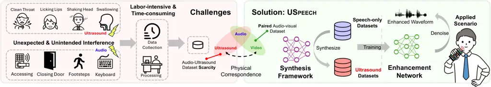
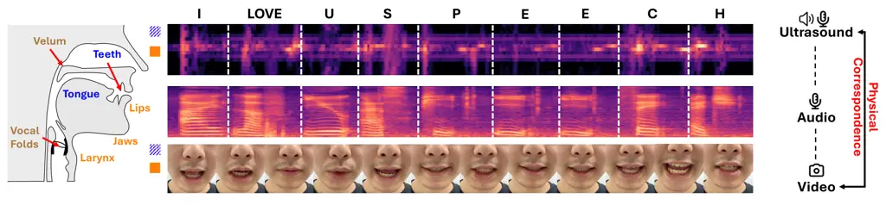
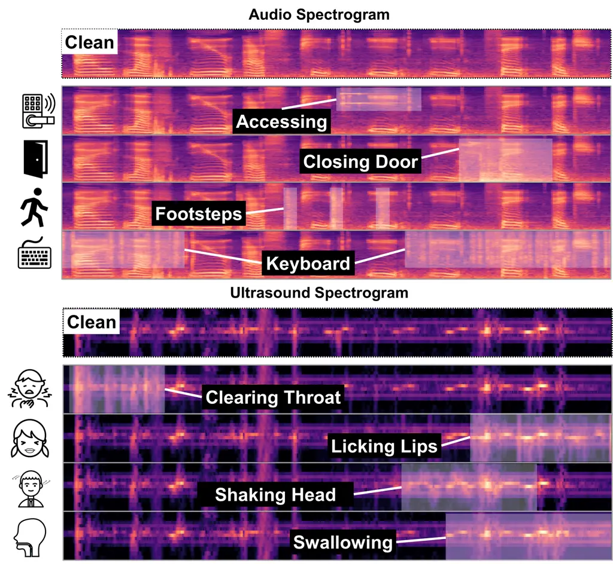
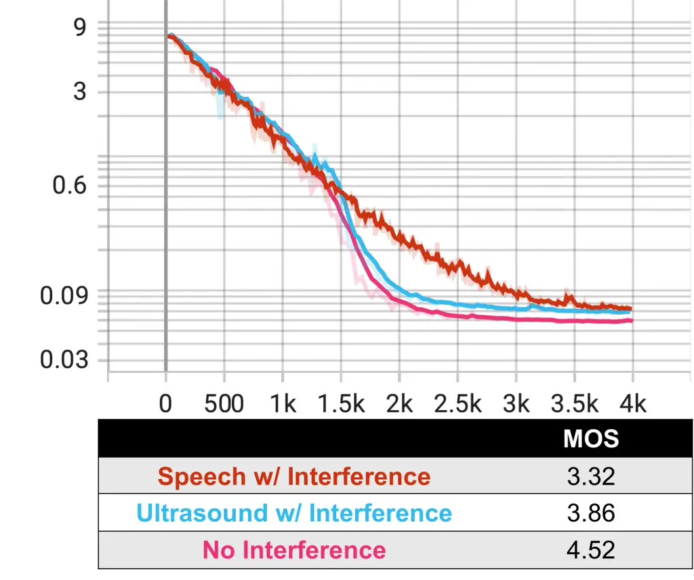
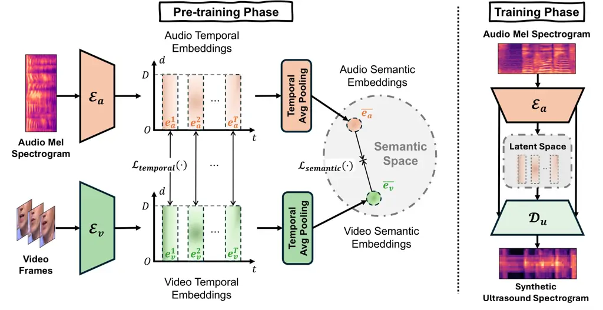
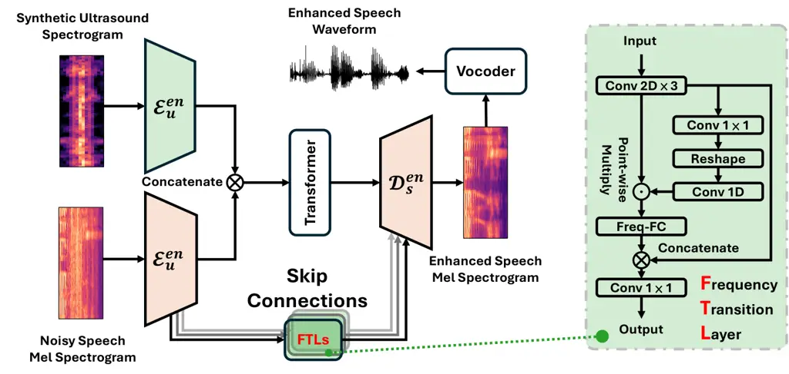
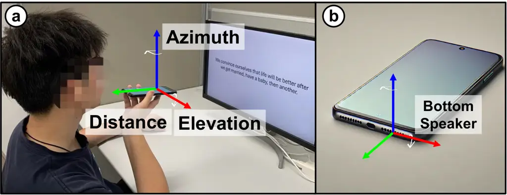
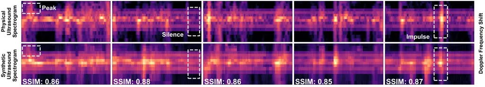
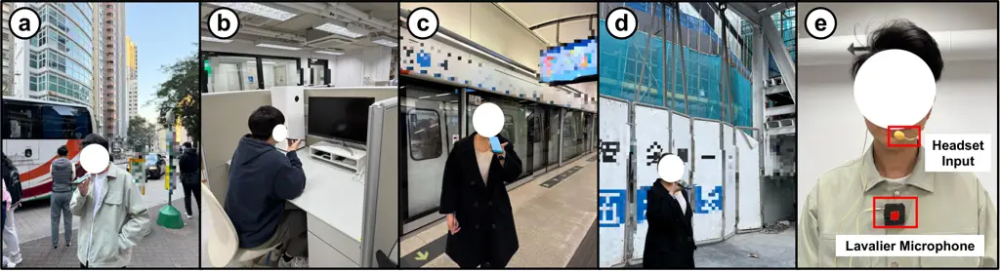
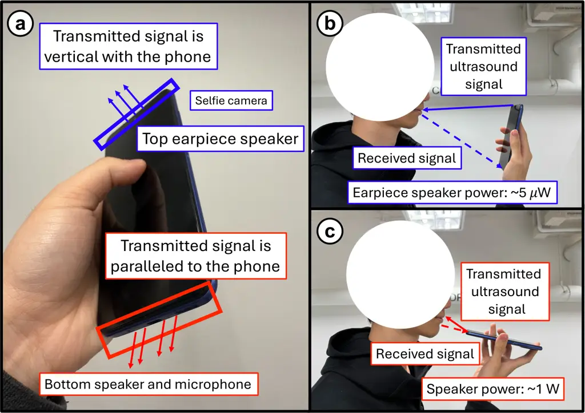

# USpeech: Ultrasound-Enhanced Speech with Minimal Human Effort via Cross-Modal Synthesis

9307Journal: IMWUTVolume: 92606DOI:
[10.1145/3729462](https://doi.org/10.1145/3729462)ISBN:
978-1-4503-XXXX-X/2018/06CCS: Human-centered computing Ubiquitous and
mobile computing design and evaluation methods

Luca Jiang-Tao Yu
[](https://orcid.org/0009-0004-3964-5874)
Note: Co-first author. Affiliation: The University of Hong Kong, Hong
Kong SAR, China email: <lucayu@connect.hku.hk> , Running Zhao
[](https://orcid.org/0000-0003-2496-3429)
Affiliation: The University of Hong Kong, Hong Kong SAR, China email:
<rnzhao@connect.hku.hk> , Sijie Ji
[](https://orcid.org/0000-0002-6615-1982)
Affiliation: The University of Hong Kong, Hong Kong SAR, China email:
<sijieji@caltech.edu> , Edith C.H. Ngai
[](https://orcid.org/0000-0002-3454-8731)
Affiliation: The University of Hong Kong, Hong Kong SAR, China email:
<chngai@eee.hku.hk> and Chenshu Wu
[](https://orcid.org/0000-0002-9700-4627)
Note: Corresponding author. Affiliation: The University of Hong Kong,
Hong Kong SAR, China email: <chenshu@cs.hku.hk>

Received 5 June 2009

###### Abstract.

Speech enhancement is crucial for ubiquitous human-computer interaction.
Recently, ultrasound-based acoustic sensing has emerged as an attractive
choice for speech enhancement because of its superior ubiquity and
performance. However, due to inevitable interference from unexpected and
unintended sources during audio-ultrasound data acquisition, existing
solutions rely heavily on human effort for data collection and
processing. This leads to significant data scarcity that limits the full
potential of ultrasound-based speech enhancement. To address this, we
propose USpeech, a cross-modal ultrasound synthesis framework for speech
enhancement with minimal human effort. At its core is a two-stage
framework that establishes the correspondence between visual and
ultrasonic modalities by leveraging audio as a bridge. This approach
overcomes challenges from the lack of paired video-ultrasound datasets
and the inherent heterogeneity between video and ultrasound data. Our
framework incorporates contrastive video-audio pre-training to project
modalities into a shared semantic space and employs an audio-ultrasound
encoder-decoder for ultrasound synthesis. We then present a speech
enhancement network that enhances speech in the time-frequency domain
and recovers the clean speech waveform via a neural vocoder.
Comprehensive experiments show USpeech achieves remarkable performance
using synthetic ultrasound data comparable to physical data,
outperforming state-of-the-art ultrasound-based speech enhancement
baselines. USpeech is open-sourced at
[https://github.com/aiot-lab/USpeech/](https://github.com/aiot-lab/USpeech/).

###### Keywords:

Ultrasound Sensing, Speech Enhancement, Cross-Modal Synthesis

## 1. Introduction

Speech is the key enabler for human-computer interaction (HCI) with its
potential to create more natural, accessible, and engaging interactions
between humans and smart devices like mobile phones (Munteanu et al.,
2017; Ephraim and Van Trees, 1995; Xu et al., 2013). Speech-based mobile
applications such as virtual assistants (Iannizzotto et al., 2018),
smart home control (Bajpai and Radha, 2019; Fourniols et al., 2018), and
speech translation software (Wahlster, 2013; Nakamura et al., 2006) are
revolutionizing our daily life. However, speech signals captured in
real-world environments are often corrupted by various types of noise
and interference, such as background noise, reverberation, and competing
speakers, well-known as the cocktail party problem. Unlike the human
auditory system, it is challenging for machines to filter out the noise
and irrelevant speech to pick up the desired speech command (Allen,
1994). Consequently, speech enhancement, which aims to improve the
quality and intelligibility of desired speech signals, becomes an
essential and critical processing step for many speech-related HCI
applications (Sun et al., 2020; Martínez-Colón et al., 2022; Chin et
al., 2012).

Decades of efforts have been devoted to audio-only solutions (Ephraim
and Malah, 1984; Kamath et al., 2002; Gannot et al., 1998; Yin et al.,
2020; Pandey and Wang, 2019; Pascual et al., 2017; Luo and Mesgarani,
2019; Subakan et al., 2021). Recently, with the development of
multimodal learning, combining other modalities reflecting vocal
information demonstrates additional gains for audio-only solutions, such
as video (Gabbay et al., 2018), accelerometers (He et al., 2023),
millimeter-wave (mmWave) radar (Ozturk et al., 2023), magnetic resonance
imaging (MRI) and ultrasound tongue imaging (UTI¹¹ 1 UTI is an imaging
technique, employs ultrasound via specialized equipment (Seeing Speech,
nd), different from the pseudo-ultrasound signals up to 24 kHz emitted
by ubiquitous devices, the focus of USpeech. We will use the terms
pseudo-ultrasound and ultrasound interchangeably in this paper.) (Stone,
2005). At a high level, these secondary modalities capture
speech-induced motions at the desired source where voice is generated,
providing complementary contexts to audio recorded by a microphone at
the destination where all environmental sounds are mixed. Nonetheless,
these modalities suffer from different drawbacks. Videos are
privacy-intrusive and susceptible to lighting conditions. MRI, UTI, and
mmWave radar rely on specialized equipment unavailable on ubiquitous
mobile devices. Accelerometers are ubiquitous, but suffer from low
sampling frequency and low sensitivity, preventing them from capturing
fine-grained vibrations of speech.



Figure 1. An illustration of challenges in the audio-ultrasound dataset
construction and an overview of USpeech design.

Differently, ultrasound-enhanced speech has emerged as a promising
technology recently (Sun and Zhang, 2021; Ding et al., 2022),
capitalizing on the relationship between ultrasound and audio to improve
the clarity and intelligibility of speech signals. Ultrasound-based
solutions leverage acoustic sensing (Bai et al., 2020; Gong et al., 2020) on commodity speakers and microphones without requiring any extra
hardware, maintaining superior ubiquity while offering better
performance. Specifically, the speaker emits a pseudo-ultrasound signal
that is inaudible to the human ear, while the microphone captures both
the audible speech and the reflected ultrasound signal. This signal
encodes the information about the speaker’s articulatory motions, which
can then be used to further enhance the quality of the speech.

Existing ultrasound-based solutions (Sun and Zhang, 2021; Ding et al., 2022) rely heavily on human effort for manual data collection and
processing, which is both labor-intensive and time-consuming. This is
due to the unavoidable occurrence of unexpected and unintended
interferences during the collection of audio-ultrasound data (Fig. 1).
Unexpected interference, such as ambient noise from footsteps, closing
the door, or even keyboard typing, can significantly degrade the quality
of collected human speech. Additionally, unintended human actions like
throat clearing, licking lips, etc., can also introduce noise that may
overpower the desired ultrasound signal. Moreover, the interfered data
can hinder the convergence speed of the network training and impair the
performance (Xu et al., 2014; Narayanan and Wang, 2014). Therefore, once
the interference occurs, researchers either need to control the
interference factor precisely to re-collect the sample or put
considerable effort into processing the data to mitigate the impact.
Consequently, building ultrasound datasets is both complex and
prohibitively inefficient, creating a notorious data scarcity issue in
ultrasound-based speech enhancement.

In this paper, we aim to overcome this data scarcity problem and reduce
human effort by building a synthesizer to generate reliable ultrasound
data for speech enhancement. To achieve this, we identify videos as an
ideal lever for generating ultrasound, as they both share certain
physical correspondence and represent articulatory gesture information -
video reflects the gesture in a visual format and ultrasound unveils
that via Doppler shift. However, the lack of paired video-ultrasound
datasets poses a significant challenge for synthesizing ultrasound data
from videos. Collecting such a dataset also requires extensive human
effort. Fortunately, a unique opportunity exists in large-scale paired
video-audio datasets that are publicly available online. This motivates
us to employ audio as the bridge to connect video and ultrasound.
Specifically, we leverage the paired video-audio data with contrastive
learning technology to inject the articulatory gestures from videos into
audio embeddings, and then use a small set of audio-ultrasound paired
data to activate the information. Such a framework maintains the
physical correspondence between video and ultrasound while utilizing the
inherent consistency between audio and ultrasound to reduce the
heterogeneity between video and ultrasound data. Our key insight is that
videos that capture articulatory gestures visually and ultrasounds that
capture these gestures through Doppler shifts share a similar physical
correspondence. Both modalities effectively represent articulatory
gestures essential for speech enhancement. Based on this, we propose a
two-stage ultrasound synthesis framework that utilizes audio signals
aligned with video signals in a semantic content space to generate
ultrasound signals. In stage one, we employ contrastive video-audio
pre-training with the proposed temporal-semantic dual loss to project
the audio and video into a shared semantic content space while enhancing
the temporal and semantic consistency. Leveraging existing large-scale
video-audio datasets, the first stage enables audio features to inherit
the physical motion properties of video features. In stage two, we
design an audio-ultrasound encoder-decoder network to activate the
physical motion information, constructing the connection between audio
and ultrasound. Moreover, we propose a dual-MSE loss to enable stage two
training to capture spectrogram static features and dynamic changes over
time, generating ultrasound spectrograms that are accurate in both
temporal and content levels.

Building on top of the ultrasound synthesis framework, we advance to
build an effective speech enhancement network using the generated
ultrasound data. We propose a speech enhancement network based on UNet
architecture with Transformer layers to fuse the ultrasound and the
noisy speech spectrogram and enhance the speech on the Time-Frequency
(T-F) domain. Moreover, we apply the neural vocoder (Yamamoto et al., 2020) to recover the speech waveform from the enhanced spectrogram
directly. Note that our enhancement network can be trained using the
generated ultrasound data, reducing the human effort for physical data
collection.

We present the complete implementation of USpeech, as shown in Fig. 1,
which incorporates the ultrasound synthesis framework in tandem with the
speech enhancement network. We prototype USpeech and evaluate it under
various experiments. USpeech’s speech enhancement network significantly
outperforms state-of-the-art ultrasound-based speech enhancement
baselines. At the same time, USpeech, when leveraging a synthetic
dataset, can achieve performance comparable to that obtained with a
manually collected dataset. Furthermore, USpeech can boost speech
enhancement on noisy large-scale speech-only datasets by leveraging the
ultrasound data generated from them. Additionally, we provide various
real-world examples at
[https://aiot-lab.github.io/USpeech/](https://aiot-lab.github.io/USpeech/).
Our core contributions are summarized as follows:

- •
  We propose USpeech, the first cross-modal ultrasound synthesis
  framework for speech enhancement with minimal human effort of data
  collection and processing.
- •
  We design a two-stage ultrasound synthesis framework, which utilizes
  audio as a bridge to relate video and ultrasound for ultrasound
  synthesis. In stage one, we employ the contrastive video-audio
  pertaining with the proposed temporal-semantic dual loss to inject the
  articulatory gesture information from videos into audio embeddings,
  and in stage two, we design the audio-ultrasound encoder-decoder
  network with dual-MSE loss to activate the information for ultrasound
  synthesis. Based on this, we introduce an effective speech enhancement
  network by fusing audio and ultrasound inputs, which can be trained
  from synthesized ultrasound data.
- •
  USpeech is comprehensively evaluated in real-world scenarios under
  various settings. Experimental results show that USpeech outperforms
  state-of-the-art ultrasound-based speech enhancement baselines, while
  the performance on synthetic data is on par with that on physically
  collected data.

## 2. Preliminaries



Figure 2. The vocal tract and the physical relationship among three
modalities. Orange indicates organs consistently visible; Blue indicates
organs that are occasionally visible; Brown indicates invisible organs.

### 2.1. Articulatory Gestures

Articulatory gestures are the movements of vocal organs that produce
phonemes, the fundamental sound units of speech. These gestures involve
various articulators, such as the lips, teeth, jaw, velum, tongue, vocal
folds, and larynx (Fig. 2) (Gick et al., 2013). Speech production can be
simplified into two steps: the source generates an initial sound, and
the vocal tract modulates it (Wolfe et al., 2020). Different
articulators create distinct phonemes, such as bilabial sounds (/p/,
/b/, /m/) produced by lips, and sounds like /f/ and /v/ created by air
passing between the bottom lip and upper teeth. The jaw and tongue
collaborate to produce both consonants (/k/, /g/) and vowels (/i/, /u/).
Articulatory gestures differ by sensing modality. Videos capture motions
of visible organs, such as the jaws, larynx, and lips, with occasional
visibility of the tongue and teeth (Fig. 2) (Brooke and Summerfield,
1983). In contrast, ultrasound-based acoustic sensing captures
fine-grained surface vibrations at high sampling rates, providing richer
contexts for speech enhancement (Sun and Zhang, 2021).



(a) Different unexpected and unintended interference on the audio and
ultrasound spectrograms when collecting the audio-ultrasound dataset.



(b) The test loss and results of model trained on the clean dataset and
interfered dataset.

Figure 3. Challenges and opportunities.

### 2.2. Ultrasound Articulatory Sensing

The commodity speaker and microphone in mobile phones transmit the
ultrasound wave and receive the reflected ultrasound signal modulated by
articulatory gestures for further processing, respectively. The
articulatory gestures exhibit velocities ranging from -160 ~160 cm/s for
bi-directional propagation (Teplansky et al., 2019). According to the
Doppler effect, the velocity introduces about -94 ~94 Hz Doppler shift
within the 20 kHz band. Various sensing waveforms like FMCW (Mao et al.,
2016), OFDM (Nandakumar et al., 2016), and PN sequences (Yun et al.,
2017; Sun et al., 2018) have demonstrated the ability to capture the
impulse response but they all suffer from the low sampling rate to
capture rapid changes in motion. Ultrasound Continuous Wave (CW)
modulated Global System for Mobile Communications (GSM) sequence is
applied to calculate the Channel Impulse Response (Ding et al., 2022),
which is constrained by its single-measurement approach that could lead
to measurement errors. To address these challenges, particularly the
issue of low sampling rates and the need for multiple measurements, we
propose to apply the multi-tone CW, treating each tone as one
independent measurement. The transmitting signal $`s(t)`$ and the
received signal $`r(t)`$ can be formulated as follows:
$`s(t)=\sum^{N-1}_{i=0}\cos\left[2\pi(f_{0}+i\Delta f)+\phi_{i}\right],r(t)=\sum^{N-1}_{i=0}\cos\left[2\pi(1+\frac{\Delta v}{c})(f_{0}+i\Delta f)+\phi_{i}+\Delta\phi_{i}\right],`$
where the original frequency $`f_{0}`$ is set to 17.25 kHz, the
frequency interval $`\Delta f`$ is set to 750 Hz, the number of tones
$`N`$ is set to 8, and $`\Delta v`$ and $`c`$ indicate the velocity of
articulatory gestures and sound speed. We set the sampling rate as 48
kHz. We then perform STFT to obtain the Doppler shift related to
articulatory gestures.

## 3. Challenges and Opportunities

### 3.1. Speech in Video, Audio, and Ultrasound

As mentioned above, both video and ultrasound modalities are capable of
capturing articulatory gestures during speech production, with Fig. 2
illustrating the physical relationships between video and ultrasound.
Taking the phoneme /v/ from the word "love" as an example, we observe
that its production involves high-frequency, fine-grained vibrations of
the larynx coupled with lip closure. The specific movements correspond
to the second interval on ultrasound recordings and are visually
discernible in the second and third frames of the video. The observation
validates the physical correspondence between video and ultrasound.
However, paired video-ultrasound datasets with speech labels are
missing, and more importantly, very costly to build. The different
representation forms of video and ultrasound also pose a challenge for
the modality transformation. For the same example, it can be seen in
Fig. 2 that the audio spectrogram captures the distinct sound of the /v/
phoneme at a similar position. This reveals that audio shares similar
representation forms of time series with ultrasound. This promises an
opportunity to leverage audio as the bridge to relate video and
ultrasound, thereby generating massive audio-ultrasound data from
large-scale audio-video data, which are widely available online. By
doing so, we can overcome all the drawbacks shown in Fig. 1.

### 3.2. Difficulties in Ultrasound Dataset Construction

Training on clean audio-ultrasound datasets is critical for achieving
stable convergence and high perceptual quality. In a preliminary study,
we examine how different types of interference affect model performance.
We separately train three enhancement models using the same architecture
but different datasets: (1) fully clean audio-ultrasound data, (2) a
dataset with 50% clean and 50% speech-interfered data, and (3) a dataset
with 50% clean and 50% ultrasound-interfered data. Each model is tested
on a corresponding evaluation set that matches its interference type,
except for the clean-trained model, which is tested on fully clean data.
As shown in Fig. 3b, the model trained and tested on clean data exhibits
smoother and faster convergence in the loss function, reaching a lower
final value. The Mean Opinion Score (MOS) also reflects this trend: the
clean-trained model achieves a score of 4.52, while speech and
ultrasound interference settings yield lower scores of 3.32 and 3.86,
respectively. These results suggest that clean training data is
beneficial for learning stable and high-quality enhancement models.
However, collecting such clean data in practice is highly challenging.
Audio and ultrasound spectrograms are extremely sensitive to
environmental and physiological factors, such as background noise (e.g.,
footsteps, keyboard typing) and inadvertent human actions (e.g., throat
clearing, lip licking). As shown in Fig. 3a, these interferences often
overwhelm the target signal, degrading data quality and complicating
model training. Moreover, they increase the burden of manual processing
and annotation, ultimately limiting the scale and quality of the
collected dataset. This issue is reflected in the performance drops
observed in Tab. 5, where smaller and noisier datasets lead to degraded
metrics. Although such interferences are inevitable in real-world
applications, training on clean data remains beneficial for building
reliable models. To enable training on clean data without significant
data collection efforts, we propose a two-stage ultrasound synthesis
framework to reduce reliance on physically collected clean ultrasound.
We leverage the articulatory correspondence between video and ultrasound
and use audio as a bridge to synthesize ultrasound representations. A
detailed example of the difficulty in constructing a high-quality
video-ultrasound dataset is shown in Fig. A1 in the Appendix.



Figure 4. An overview of ultrasound synthesis framework. It includes the
contrastive video-audio pre-training phase (left) for projecting video
and audio into a shared semantic content space, and the training phase
(right) about the audio-ultrasound encoder-decoder network for
constructing the connection between audio and ultrasound.

## 4. USpeech Overview

In this section, we elaborate on the overall structure of USpeech, which
contains an ultrasound synthesis framework (§5.1) and a speech
enhancement network (§5.2).

Ultrasound Synthesis Framework: The synthesis framework contains two
stages (see Fig. 4):

1. Contrastive Video-Audio Pre-training: The contrastive video-audio
   pertaining projects the audio and video into a shared semantic content
   space. It utilizes open-source video-audio datasets containing the
   visual articulatory gestures to pre-train the video encoder and audio
   encoder via contrastive learning. This learning process injects the
   articulatory gestures from videos into audio embeddings, enabling the
   audio encoder to inherit the physical motion properties.

2. Audio-Ultrasound Encoder-Decoder Network: After contrastive
   video-audio pre-training, the pre-trained audio encoder is capable of
   encoding the audio into embeddings containing physical properties of
   articulatory gestures. Subsequently, to adapt the information from audio
   to ultrasound, we design a UNet-based network with the pre-trained audio
   encoder and the ultrasound decoder to transform the above embeddings
   into the ultrasound Doppler shift spectrogram.

Speech Enhancement Network: The enhancement network contains two phases
(see Fig. 5):

1. Mel Spectrogram Enhancement: The first phase is a UNet network that
   enhances the Mel spectrogram by taking ultrasound and noisy speech as
   input. The encoded embeddings of ultrasound and noisy speech are fused
   by the Transformer layers and then, the fused embeddings are decoded
   into Mel spectrogram of enhanced speech.

2. Waveform Recovery: In the second phase, we leverage a neural vocoder
   to recover the high-quality enhanced speech waveform from the enhanced
   Mel spectrogram.

## 5. USpeech Design

In this section, we commence by detailing the synthesis process of
ultrasound. Following this, we detail the design of the speech
enhancement network. We provide the model details in Appendix §Appendix
E.

### 5.1. Ultrasound Synthesis

#### 5.1.1. Contrastive Video-Audio Pre-training

Due to the independent training process, existing video or image and
audio backbones struggle to reflect the alignment between video and
audio modalities, leading to a lack of shared representation space (Wang
et al., 2020; Gong et al., 2022). To address this, we propose a
contrastive learning framework that enforces temporal and semantic
consistency, ensuring that video embeddings capture articulatory
gestures while aligning them with audio representations. Our method
first extracts articulatory features using a dual-branch network. For
the video encoder, inspired by SlowOnly (Feichtenhofer et al., 2019), we
map mouth-region frames ($`128\times 128`$) into a 512-dimensional
embedding. The model consists of five 3D convolutional layers followed
by batch normalization and ReLU activations, gradually reducing spatial
dimensions while preserving temporal correlations. For the audio
encoder, adapted from PANNs (Kong et al., 2020), originally pre-trained
on the Audioset dataset (Gemmeke et al., 2017), it employs six 2D
convolutional blocks with batch normalization, ReLU activations, and
average pooling. The extracted features are refined through both average
and max pooling operations, ensuring no loss of subtle articulatory
information. The pooled outputs are further processed by two fully
connected layers (2048 and 512 dimensions), enhancing representation
power before alignment with video embeddings. By integrating these
components, our framework effectively aligns video and audio modalities,
facilitating a shared representation space that captures the nuanced
interplay between visual articulatory gestures and corresponding audio
signals.

Given the independent training of video and audio backbones, direct
alignment leads to suboptimal performance due to the lack of
fine-grained articulatory synchronization. Without temporal-semantic
constraints, embeddings from different modalities may not be
sufficiently aligned, leading to misrepresentation in ultrasound
synthesis. This misalignment results in a degraded performance in
downstream tasks. By introducing the temporal-semantic dual loss, we
improve cross-modal coherence, ensuring that articulatory gestures in
video are properly synchronized well with corresponding phonemes in
audio. The dual loss consists of a temporal loss
$`\mathcal{L}_{temporal}`$, which aligns fine-grained articulatory
dynamics at each frame, reducing misalignment errors, and a semantic
loss $`\mathcal{L}_{semantic}`$, which enforces similarity between
global video-audio embeddings while contrasting unrelated pairs. Both
losses are based on the InfoNCE formulation (Oord et al., 2018):

```math
\mathcal{L}_{temporal}^{(i,j)}=-\frac{1}{2}\log\frac{\exp(\text{sim}(e_{a}^{i},e_{v}^{j})/\tau)}{\sum_{k=1}^{n_{t}}\exp(\text{sim}(e_{a}^{i},e_{v}^{k})/\tau)}-\frac{1}{2}\log\frac{\exp(\text{sim}(e_{a}^{i},e_{v}^{j})/\tau)}{\sum_{k=1}^{n_{t}}\exp(\text{sim}(e_{a}^{k},e_{v}^{j})/\tau)}, \tag{1}
```

```math
\mathcal{L}_{semantic}^{(i,j)}=-\frac{1}{2}\log\frac{\exp(\text{sim}(\overline{e_{a}}^{i},\overline{e_{v}}^{j})/\tau)}{\sum_{k=1}^{n_{s}}\exp(\text{sim}(\overline{e_{a}}^{i},\overline{e_{v}}^{k})/\tau)}-\frac{1}{2}\log\frac{\exp(\text{sim}(\overline{e_{a}}^{i},\overline{e_{v}}^{j})/\tau)}{\sum_{k=1}^{n_{s}}\exp(\text{sim}(\overline{e_{a}}^{k},\overline{e_{v}}^{j})/\tau)}, \tag{2}
```

where $`\text{sim}(\cdot)`$ is cosine similarity, $`n_{t}`$ and
$`n_{s}`$ are temporal and semantic segment counts, and $`\tau`$
(default 0.07) is the temperature parameter. The final contrastive loss
combines both terms:

```math
\mathcal{L}_{contrastive}=\lambda\mathcal{L}_{temporal}+(1-\lambda)\mathcal{L}_{semantic}, \tag{3}
```

where $`\lambda`$ (default 0.5) balances temporal alignment and semantic
consistency.



Figure 5. An overview of speech enhancement network, including Mel
spectrogram enhancement and waveform recovery (left). The architecture
of the Frequency Transition Layer (FTL) is shown on the right.

#### 5.1.2. Audio-Ultrasound Encoder-Decoder Network.

After contrastive learning aligns video-audio representations temporally
and semantically, the pre-trained audio encoder effectively captures
articulatory information from Mel spectrograms. This alignment enables
the direct deployment of the encoder for synthesizing ultrasound Doppler
shift spectrograms, which is particularly beneficial when working with a
small-scale dataset. Speech and ultrasound signals occupy distinct
frequency bands, so we apply an 8th-order elliptic filter (lowpass: 8
kHz, highpass: 16 kHz) to preserve articulatory motion in the ultrasound
data. The speech signal is downsampled from 48 kHz to 16 kHz and
transformed into Mel spectrograms
($`x_{s}\in\mathbb{R}^{T\times 128}`$). Ultrasound signals undergo STFT
(FFT: 4096, window: 4080, hop: 240) with a frequency resolution of 11.72
Hz. We remove the central and adjacent bins ($`\pm 11.72,0`$) Hz to
suppress static reflections, retaining $`7\times 2`$ bins per tone for
articulatory gestures ($`x_{u}^{T}\in\mathbb{R}^{T\times 14}`$). The
ultrasound decoder $`\mathcal{D}_{u}`$ is trained with the pre-trained
speech encoder $`\mathcal{E}_{a}`$ using $`(x_{s},x_{u})`$ pairs.

The use of contrastive pre-training can transfer knowledge from a
large-scale audio-video dataset, which aligns the temporal and semantic
features of both modalities. This significantly enhances the robustness
of the encoder, even with limited ultrasound data. Moreover, we use the
UNet architecture (Ronneberger et al., 2015) to maintain spatial
consistency and improve feature retention during decoding. The skip
connections are employed to concatenate feature maps from the
corresponding encoder and decoder layers. This allows fine-grained
preservation of temporal and dynamic articulatory features, essential
for high-quality ultrasound synthesis. The decoder, adopting a
transposed convolutional architecture with six layers and a final
projector (kernel: $`2\times 1`$, stride: $`2\times 1`$, padding: 25,
dilation: 1), refines the ultrasound spectrogram resolution, ensuring
accurate articulation representation and reducing blurring effects
during spectrogram reconstruction. The synthesized ultrasound
spectrogram $`d_{\text{syn}}\in\mathbb{R}^{T\times F}`$ must effectively
capture micro-scale temporal variations essential for articulation
tracking. Traditional MSE loss struggles with this, as it primarily
minimizes absolute differences between predicted and ground-truth
values, neglecting the rapid transitions of articulatory motion,
especially for the ultrasound Doppler frequency shift spectrogram that
reflects the subtle and sensitive articulatory. This limitation often
results in over-smoothing, causing a loss of fine-grained speech
dynamics. To address this, we introduce a dual-MSE loss function that
optimizes both the spectrogram and its temporal derivative:

```math
\mathcal{L}_{\text{dual-MSE}}=\alpha\cdot\text{MSE}(d_{\text{syn}},d_{\text{gt}})+(1-\alpha)\cdot\text{MSE}(\Delta d_{\text{syn}},\Delta d_{\text{gt}}), \tag{4}
```

where $`\alpha`$ (default 0.5) balances spectral accuracy and
preservation of fine temporal structures. Unlike standard MSE loss,
incorporating $`\Delta d_{\text{syn}}`$ ensures that the model maintains
critical articulatory variations, preventing the degradation of speech
intelligibility due to excessive smoothing. Without this term, the model
fails to reconstruct rapid transitions, leading to blurring effects that
obscure essential articulation details. This approach significantly
improves synthesis fidelity, demonstrating that preserving micro-scale
temporal variations enhances spectral resolution and articulation
clarity. Consequently, USpeech achieves ultrasound spectrogram synthesis
quality comparable to physically collected data.

### 5.2. Speech Enhancement

#### 5.2.1. Mel Spectrogram Enhancement

Based on the UNet architecture, we have developed a network for
enhancing the Mel spectrogram, as illustrated in Fig. 5. Recognizing the
critical role of harmonic correlation across the frequency axis in
augmenting the quality of the T-F spectrogram (Wakabayashi et al.,
2018), our design incorporates both a UNet-based backbone for contextual
temporal information capture and Frequency Transition Layers (FTL) (Zhao
et al., 2022). The FTLs are strategically positioned between each
downsampling convolutional layer to enhance harmonic information
capture. The FTL consists of three stacked convolutional layers, a fully
connected layer used as a transformation matrix, and a $`1\times 1`$
convolutional layer as the output, shown in Fig. 5. Each convolutional
layer is comprised of a 2D convolutional layer, followed by batch
normalization and a ReLU activation function. Parallel to the speech
encoder branch, the ultrasound branch mirrors these settings without
FTLs. A key feature of our design is the integration of the Vision
Transformer (Vaswani et al., 2017; Dosovitskiy et al., 2020) at the
bottleneck. This introduces an attention mechanism to the temporal
segments of the feature map, leveraging the Transformer’s capabilities
pre-trained on ImageNet (Deng et al., 2009). The enhancement of the Mel
spectrogram is further refined by applying MSE loss.



Figure 6. Data collection scenarios. Three axes define the device’s
coordinate system. The axis depicted in Green denotes the distance to
the mouth. Rotations about the Red axis represent elevation adjustments,
and rotations around the Blue axis correspond to changes in azimuth.

#### 5.2.2. Waveform Recovery

After enhancing the T-F domain spectrogram, we employ a neural vocoder,
specifically the Parallel WaveGAN (Yamamoto et al., 2020), to
reconstruct the waveform from the enhanced Mel spectrogram. The phase
information plays a pivotal role in accurately recovering waveform from
T-F domain spectrograms (Paliwal et al., 2011). However, converting
audio signals into Mel spectrograms inherently results in the loss of
phase information, which is crucial for reconstructing high-quality
natural-sounding waveforms. To overcome this challenge, we employ a
neural vocoder that includes both a generator and a discriminator. The
generator synthesizes the audio waveform directly from the Mel
spectrogram by learning the mapping between the spectrogram and
time-domain waveform, while the discriminator helps ensure the generated
waveforms sound realistic by distinguishing between real and generated
audio. By leveraging adversarial training, the neural vocoder learns not
only to reconstruct amplitude but also implicitly recovers the missing
phase information. This allows for more accurate and perceptually
natural waveform generation, compensating for the phase loss that occurs
during the spectrogram conversion process. The vocoder undergoes
training through the joint optimization of a multi-resolution
spectrogram loss and an adversarial loss (Yamamoto et al., 2020). This
dual loss approach significantly enhances the model’s ability to
replicate the time-frequency distribution characteristic of realistic
speech waveforms.

## 6. Experimental Setup

### 6.1. Data Collection

Due to the lossy M4A compression method used by the recorded in standard
smartphones, which is not capable of capturing the ultrasound band, we
develop an Android application to gather an audio-ultrasound dataset
using the OPPO Reno2 Z. Given that a typical smartphone’s earpiece power
(about 5 $`\mu`$W) is too low for sensing purposes, we instead utilized
the more powerful bottom-mounted speaker (1 W) along with the microphone
for transmitting and receiving signals. This setup enables us to record
the synchrony between ultrasound articulatory and speech accurately. The
data collection setup is illustrated in Fig. 6.

We recruit 7 volunteers (2 females and 5 males) to participate in the
data collection by reading the selected materials, aiming to construct
an audio-ultrasound dataset in an environment with about 50 dB of
ambient noise. The experimental setting is, regardless of the azimuth
and elevation, within a reasonable range of 5 to 10 centimeters between
the mouth and the bottom microphone, with no device rotation. The
reading materials comprised a mix of articles, news, and other reading
materials, outlined in the Appendix Tab. C1. All volunteers read these
materials in the same order, and the volume of the dataset varies from
70 to 83 dB. Overall, we collected 2.4 hours of audio-ultrasound data
for the ultrasound synthesis framework (§6.2.2) and 2.4 hours of
audio-ultrasound data for the speech enhancement network (§6.2.3), which
are different materials to prevent data leakage and overlaps.

### 6.2. Data Preparation

#### 6.2.1. Audio-Video Pre-training Dataset

The LRW dataset (Chung and Zisserman, 2016) is the public video-audio
dataset that is utilized in the contrastive video-audio pre-training
phase (§5.1.1), which comprises approximately 1,000 utterances of 500
distinct words, each with a fixed duration of 1.22 seconds audio and 29
video frames.

#### 6.2.2. Ultrasound Synthesis Dataset

We use the collected 2.4-hour audio-ultrasound dataset as the ultrasound
synthesis dataset. We adopt a temporal-based 80%-20% split for each
volunteer, where the first 20% of each participant’s recordings are used
as the test set and the remaining 80% as the training set for the
audio-ultrasound encoder-decoder network (§5.1.2). We further ensure
that the speech materials used in the training and testing sets are
entirely non-overlapping to prevent data leakage.

#### 6.2.3. Speech Enhancement (SE) Dataset

To assess the enhancement performance of USpeech, we employ multiple
datasets. First, we gather the physical SE dataset to train the speech
enhancement network and evaluate the effectiveness of the proposed
USpeech. Second, we utilize the ultrasound synthesis framework, trained
on the ultrasound synthesis dataset in §6.2.2, to generate synthetic
ultrasound spectrograms from the physical SE dataset, thereby creating
the synthetic SE dataset. Finally, we apply the same procedure to
large-scale speech-only datasets to generate corresponding ultrasound
spectrograms, constructing large-scale synthetic SE datasets.

- •
  Physical SE Dataset: We use the collected 2.4-hour audio-ultrasound
  dataset (different from the Ultrasound Synthesis Dataset) as the
  physical SE dataset, where 80% (1.92 hours) to train the speech
  enhancement network (§6.2.3) and 20% (0.48 hours) to test, which split
  via teamporal-based as well. We refer to this dataset as "physical" or
  "phy." in experimental evaluation because it utilizes real-world
  collected ultrasound spectrograms. The dataset does not overlap with
  the ultrasound synthesis dataset to prevent data leakage. To adapt the
  input of other baselines, we also make the complex physical SE dataset
  with the same contents while keeping the imaginary part of
  spectrograms.
- •
  Synthetic SE Dataset: Leveraging the ultrasound synthesis framework
  trained on the ultrasound synthesis dataset, we generate the synthetic
  SE dataset from the physical SE dataset, where the collected audio Mel
  spectrograms serve as input and the corresponding ultrasound
  spectrograms are generated as output. We then pair the audio Mel
  spectrograms with the synthetic ultrasound spectrograms to form the
  synthetic SE dataset. To ensure the effectiveness of evaluation, the
  training set of the synthetic SE dataset mirrors the training set of
  the physical SE dataset, with the ultrasound spectrograms from the
  physical data replaced by synthetic spectrograms. The test set,
  however, remains identical to that of the physical SE dataset.
- •
  Large-scale Synthetic SE Datasets: We employ three distinctive,
  public, large-scale speech-only datasets for ultrasound generation to
  evaluate the generalizability of the ultrasound synthesis framework in
  §7.2. Similar to the synthetic SE dataset, we use the trained
  synthesis model to generate ultrasound spectrograms from these
  speech-only datasets and pair the audio and ultrasound to construct
  the large-scale synthetic SE datasets. To maintain the effectiveness
  of evaluation, the entire large-scale synthetic SE datasets are used
  as the training set, while the test set of the physical SE dataset is
  exclusively used for testing. The overview of the training sets of the
  large-scale speech-only datasets is as follows:
  - –
    LJSpeech (Ito and Johnson, 2017) (24 hours) consists of 13.1k short
    audio clips from a single female speaker reading passages from 7
    non-fiction books. This dataset provides sufficient scale but lacks
    speaker diversity.
  - –
    TIMIT (Garofolo, 1993) (5.8 hours) addresses this limitation by
    including recordings from 630 speakers (approximately 70% male and
    30% female) with diverse features such as gender, dialect, and age.
    Each speaker has 10 utterances, offering high speaker diversity but
    on a smaller scale than LJSpeech.
  - –
    VCTK (Yamagishi, 2012) (44 hours) contains speech data from 110
    speakers with various accents, each reading approximately 400
    sentences derived from news articles and other reading materials.
    This dataset offers both substantial scale and speaker diversity.

For speech enhancement network training, we generate the Noisy SE
Dataset by mixing the clean speech we collected with the noise source
dataset Nonspeech7k (Rashid et al., 2023). The dataset contains human’s
nonspeech, e.g.screaming, crying, coughing, from freesound.org, YouTube,
and Aigei, rather than the ambient noise, which has a more similar
distribution with the speech. Each clean speech sample is mixed with 20
different noises in collected physical and synthetic SE datasets and 1
noise in large-scale synthetic SE datasets, and the mixing process is
with the specific SNRs randomly chosen from $`\{-10,-5,0,5,10,15\}`$ dB.

### 6.3. Baselines

To illustrate the effectiveness of the proposed USpeech, we select three
baselines for comparison. We choose ultrasound-based speech enhancement
methodologies, i.e., Ultraspeech (Ding et al., 2022) and UltraSE (Sun
and Zhang, 2021). We utilize the complex physical SE dataset (i.e.,
including the imaginary part of spectrograms) to evaluate all baselines
because the inputs are complex spectrograms. Specifically, we adjust the
input layer of Ultraspeech to adapt the input shape and only implement
the enhancement component. In addition, we choose a speech-only baseline
PHASEN (Yin et al., 2020) to show the effectiveness of the involvement
of ultrasound. The overview of the model design is as follows:

- •
  Ultraspeech (Ding et al., 2022): The model utilizes a two-branch
  neural network for speech enhancement, combining ultrasound and speech
  signals. It uses a complex ratio mask to estimate noisy speech’s
  magnitude and phase components. The interaction module allows
  information exchange between ultrasound and speech branches, improving
  noise discrimination.
- •
  UltraSE (Sun and Zhang, 2021): The model borrows a multi-modal design
  for single-channel speech enhancement using ultrasound and speech
  signals. It employs a two-stream architecture to process speech and
  ultrasound separately, followed by a self-attention fusion mechanism
  to integrate the features. The model also uses a cGAN-based
  cross-modal training model to enhance the noisy speech spectrograms.
- •
  PHASEN (Yin et al., 2020): The model features two parallel streams for
  amplitude and phase prediction. The amplitude stream includes
  frequency transformation blocks to capture global frequency
  correlations, while the phase stream benefits from information
  exchange between the streams, allowing the model to enhance both
  amplitude and phase.



Figure 7. Visualization of the physical v.s.USpeech synthetic ultrasound
spectrograms. USpeech is capable of synthesizing high-quality ultrasound
spectrograms, particularly when integrating video information. We
calculate the single-spectrogram Structural Similarity Index Measure
(SSIM) between the physical and USpeech synthetic ultrasound
spectrograms per sample, providing a quantitative measure of synthesis
fidelity.

### 6.4. Evaluation Metrics

We use three quantitative metrics (PESQ, STOI, and LSD) and one
qualitative metric (MOS) to evaluate the quality of enhanced speech.

PESQ: Perceptual Evaluation of Speech Quality (International
Telecommunication Union, 2007) is an objective standard for evaluating
the quality of speech standardized by ITU-T P.862. PESQ returns a score
from -0.5 to 4.5, with higher scores indicating better quality.

STOI: Short-Time Objective Intelligibility (Taal et al., 2010) is an
objective metric used to assess the intelligibility of the speech
signals which predicts how understandable speech is in various
conditions, particularly when the speech is affected by noise and
distortion. STOI returns a score from 0 to 1, with higher scores meaning
better quality.

LSD: Log-Spectal Distance (Rabiner and Juang, 1999) is used to quantify
the difference or distortion between two audio signals in the frequency
domain, shown on decibels scale. LSD score is better if lower.

MOS: Mean Opinion Score (Rothauser, 1969) is a subjective measurement
that is used to evaluate the quality of human-computer interactions. In
a typical MOS test, a group of human subjects is asked to rate the
quality of media samples on a scale, usually ranging from 1 to 5 (the
higher, the better quality), shown in the Appendix Tab. D1. We recruit
10 volunteers to conduct a qualitative evaluation of the enhanced speech
using MOS. In experiments, we first play the clean speech, then the
noisy, and its corresponding enhanced speech without knowing whether the
enhanced speech from USpeech. Each volunteer will be assigned 100
samples (20 for each method) randomly chosen from different SNRs. The
final results will be averaged for all volunteers.

## 7. Experimental Evaluation

### 7.1. Overall Performance

#### 7.1.1. Visualization Analysis

As shown in Figure 7, the synthetic ultrasound spectrogram visually
exhibits a striking similarity to the corresponding physical ultrasound
spectrogram in the first column. Additionally, we provide a quantitative
evaluation of the synthesis fidelity across samples. We use the
Structural Similarity Index Measure (SSIM) (Wang et al., 2004), a widely
recognized metric that assesses similarity by analyzing the means and
covariances of two samples, to evaluate the similarity between the
synthetic and real ultrasound spectrograms. Each column shows the
corresponding samples, with the SSIM value of the synthetic ultrasound
spectrogram displayed at the bottom left. For example, the first
spectrogram shows a fidelity of 0.86 compared with the physical
spectrogram. We can clearly see that the first peak is generated at the
correct temporal interval, well aligned with the physical one. In the
second sample, the synthesis model accurately generates the silence at
the correct time interval. In the last sample, we demonstrate that the
model can also generate the impulse of the ultrasound spectrogram. In a
nutshell, the synthesis model is capable of generating high-quality
ultrasound spectrograms even in different patterns, e.g., peak, silence,
impulse, etc..

| Method                          | PESQ $`\uparrow`$ | $`\Delta`$PESQ $`\uparrow`$ | STOI $`\uparrow`$ | $`\Delta`$STOI $`\uparrow`$ | LSD $`\downarrow`$ | $`\Delta`$ LSD $`\downarrow`$ | MOS $`\uparrow`$ |
| ------------------------------- | ----------------- | --------------------------- | ----------------- | --------------------------- | ------------------ | ----------------------------- | ---------------- |
| Noisy SE Dataset                | 2.33              | \-                          | 0.77              | \-                          | 1.16               | \-                            | \-               |
| USpeech w/ phy.                 | 3.19              | +36.9%                      | 0.89              | +15.6%                      | 0.75               | -35.3%                        | 4.52             |
| USpeech w/ syn.                 | 3.10              | +33.0%                      | 0.88              | +14.3%                      | 0.80               | -31.0%                        | 4.48             |
| Ultraspeech (Ding et al., 2022) | 2.07              | -11.2%                      | 0.73              | -5.2%                       | 1.49               | +28.4%                        | 2.24             |
| UltraSE (Sun and Zhang, 2021)   | 2.23              | -4.3%                       | 0.76              | -1.3%                       | 1.33               | +14.7%                        | 2.76             |
| PHASEN (Yin et al., 2020)       | 3.02              | +29.6%                      | 0.86              | +11.7%                      | 1.04               | -10.3%                        | 3.98             |

Table 1. Quantitative and qualitative evaluation results. The $`\Delta`$
metrics show the improvement or reduction compared with the Noisy SE
Dataset. USpeech w/ phy. or syn. means the speech enhancement network of
USpeech is trained on the synthetic or physical SE dataset and evaluated
on the physical SE dataset.

#### 7.1.2. Quantitative Evaluation

We first demonstrate the capability of the speech enhancement network by
comparing it with other baselines, and based on this fact, we further
validate the effectiveness of the ultrasound synthesis framework.

As illustrated in Tab. 1, we elaborate on the results of USpeech
compared with others. Compared with other baselines trained on the
physical SE dataset, USpeech w/ phy. outperforms in all four metrics,
with a PESQ gain of 36.9%, an STOI gain of 15.6%, and an LSD drop from
1.16 for the noisy dataset to 0.75. The results indicate that the
proposed enhancement network is capable of improving both quality and
intelligibility. While both ultrasound-based speech enhancement
Ultraspeech (Ding et al., 2022) and UltraSE (Sun and Zhang, 2021) fail
to enhance our noisy SE dataset with human-related nonspeech noise. For
Ultraspeech, they only utilize another noise dataset (Hu and Wang, 2010)
that only contains ambient noise e.g., musical instruments and machines
(i.e., no human nonspeech). We observe that Ultraspeech also amplifies
human-related noise, indicating it might not perform as expected when
enhancing the human-related noise sources (Rashid et al., 2023) we
utilized. For UltraSE, they design a complex model with parameters
$`\sim 286`$ M, which is too complex for speech enhancement. They do not
release their code or adversarial hyperparameters, so we implemented the
neural network and set the proper margin of Triplet loss; however, the
model still fails to work effectively. The possible reason is that the
model is too complex to enhance speech with the small-scale dataset—the
physical SE dataset (2.4 hours)—compared with theirs (about 11 hours),
especially the architecture of the discriminator. Furthermore, compared
with their original result (STOI 0.80 and PESQ 3.01), USpeech can still
achieve an STOI gain of 0.09 and maintain a PESQ of 3.19 when trained
and evaluated on a much smaller dataset, indicating the effectiveness
and efficiency of the proposed enhancement network. In addition,
compared with PHASEN (Yin et al., 2020), USpeech w/ phy. achieves a PESQ
score of 3.19, which is 0.17 higher, and a higher STOI score of 0.89,
indicating the proposed enhancement network outperforms in
intelligibility. Moreover, USpeech w/ phy. achieves a larger LSD
reduction (-35.3%) compared with only -10.3% for PHASEN, showing that
the enhancement network of USpeech performs remarkably well not only in
the improvement of intelligibility but also in the quality of
spectrograms. When comparing the enhancement network of USpeech trained
with synthetic data (USpeech w/ syn.) to USpeech trained with physical
data (USpeech w/ phy.), we find that the enhancement network trained on
the synthetic SE dataset achieves comparable performance to that of the
system trained on physical data. Specifically, USpeech w/ syn. achieves
a PESQ score of 3.10, an STOI score of 0.88, and an LSD of 0.80. These
results closely match those of USpeech w/ phy., which achieves a PESQ of
3.19, an STOI of 0.89, and an LSD of 0.75. The similarity in PESQ and
STOI scores suggests that the synthetic ultrasound spectrograms are
effective for speech enhancement tasks, while the close LSD values
indicate high quality in the frequency domain of the synthetic
spectrograms.

Overall, these observations demonstrate that our ultrasound synthesis
framework is capable of generating high-quality ultrasound spectrograms
that are nearly as effective for speech enhancement as those derived
from the physical dataset, confirming the robustness and practicality of
using synthetic data.

#### 7.1.3. Qualitative Evaluation

In addition to the quantitative evaluation, we perform a qualitative
evaluation using the MOS to assess the perceptual quality of the
enhanced speech from a listener’s perspective. As shown in Tab. 1,
USpeech w/ phy. achieves a MOS of 4.52, significantly outperforming the
baselines such as Ultraspeech (2.24), UltraSE (2.76), and PHASEN (3.98).
The results indicate that listeners perceive the speech enhanced by
USpeech w/ phy. as much clearer and more intelligible compared to other
methods. The superiority of USpeech w/ phy. in terms of MOS, along with
the quantitative gains in PESQ, STOI, and LSD, demonstrates that the
proposed enhancement network delivers a noticeably higher perceptual
quality of recovered speech than the other baselines. Comparing USpeech
w/ syn. and phy., we observe that USpeech w/ syn. achieves a comparable
MOS of 4.48, closely matching the perceptual quality of USpeech trained
on the physical SE dataset. This close result between the synthetic and
physical SE datasets supports the effectiveness of the synthesis
framework. It shows that the synthesis model that can generate the
ultrasound spectrograms is nearly indistinguishable from the model
generated using physical data, proving the robustness and practicality
of our synthetic data generation approach.

| Dataset             | Scale                                                                                                                                                                                                                                                                                                                                                                                    | PESQ $`\uparrow`$ | $`\Delta`$PESQ $`\uparrow`$ | STOI $`\uparrow`$ | $`\Delta`$STOI $`\uparrow`$ | LSD $`\downarrow`$ | $`\Delta`$LSD $`\downarrow`$ |
| ------------------- | ---------------------------------------------------------------------------------------------------------------------------------------------------------------------------------------------------------------------------------------------------------------------------------------------------------------------------------------------------------------------------------------- | ----------------- | --------------------------- | ----------------- | --------------------------- | ------------------ | ---------------------------- |
| Noisy LJSpeech      | -                                                                                                                                                                                                                                                                                                                                                                                        | 1.83              | -                           | 0.78              | -                           | 1.67               | -                            |
| USpeech w/ LJSpeech | $`\hbox to5.72pt{\vbox to5.72pt{\pgfpicture\makeatletter\hbox{\hskip 2.86081pt\lower-2.86081pt\hbox to0.0pt{\lxSVG@begingroup@{\_scopebegin=1} \lxSVG@begingroup@{stroke=#000000} \lxSVG@begingroup@{fill=#000000} \lxSVG@setlinewidth{\the\pgflinewidth}\lxSVG@begingroup@{stroke-width=0.4pt} \lx@inpgf@ignorespaces\nullfont\hbox to0.0pt{\lxSVG@begingroup@{\_scopebegin=1} {}{{}}{} |

{}{}{{{}{}{}{}}}{}
{}
{}{}
{\lx@inpgf@ignorespaces}{}\lxSVG@fillstroke\lxSVG@drawpath@unclipped{M 0 0 L 0 3.68 C -2.03 3.68 -3.68 2.03 -3.68 0 Z}{} \lx@inpgf@ignorespaces
{}{{}}{}{{{}}{\lx@inpgf@ignorespaces}{}{\lx@inpgf@ignorespaces}{}{}{}{}{}}{}\lxSVG@stroke\lxSVG@drawpath@unclipped{M 0 0 M 3.68 0 C 3.68 2.03 2.03 3.68 0 3.68 C -2.03 3.68 -3.68 2.03 -3.68 0 C -3.68 -2.03 -2.03 -3.68 0 -3.68 C 2.03 -3.68 3.68 -2.03 3.68 0 Z M 0 0}{fill:none} \lx@inpgf@ignorespaces
\lxSVG@closescope {\lx@inpgf@ignorespaces}{\lx@inpgf@ignorespaces}{\lx@inpgf@ignorespaces}\hss}\lxSVG@discardpath\lxSVG@closescope \hss}}\lxSVG@closescope\endpgfpicture}}_{6h}`$ | 3.03 | +65.6% | 0.86 | +10.3% | 1.02 | -38.9% |
|  | $`\hbox to5.72pt{\vbox to5.72pt{\pgfpicture\makeatletter\hbox{\hskip 2.86081pt\lower-2.86081pt\hbox to0.0pt{\lxSVG@begingroup@{\_scopebegin=1} \lxSVG@begingroup@{stroke=#000000} \lxSVG@begingroup@{fill=#000000} \lxSVG@setlinewidth{\the\pgflinewidth}\lxSVG@begingroup@{stroke-width=0.4pt} \lx@inpgf@ignorespaces\nullfont\hbox to0.0pt{\lxSVG@begingroup@{\_scopebegin=1} {}{{}}{}
{}{}{{{{}{}{}{}}}
{{}{}{}{}}}{}
{}
{}{}
{\lx@inpgf@ignorespaces}{}\lxSVG@fillstroke\lxSVG@drawpath@unclipped{M 0 0 L 0 3.68 C -2.03 3.68 -3.68 2.03 -3.68 0 C -3.68 -2.03 -2.03 -3.68 0 -3.68 Z}{} \lx@inpgf@ignorespaces
{}{{}}{}{{{}}{\lx@inpgf@ignorespaces}{}{\lx@inpgf@ignorespaces}{}{}{}{}{}}{}\lxSVG@stroke\lxSVG@drawpath@unclipped{M 0 0 M 3.68 0 C 3.68 2.03 2.03 3.68 0 3.68 C -2.03 3.68 -3.68 2.03 -3.68 0 C -3.68 -2.03 -2.03 -3.68 0 -3.68 C 2.03 -3.68 3.68 -2.03 3.68 0 Z M 0 0}{fill:none} \lx@inpgf@ignorespaces
\lxSVG@closescope {\lx@inpgf@ignorespaces}{\lx@inpgf@ignorespaces}{\lx@inpgf@ignorespaces}\hss}\lxSVG@discardpath\lxSVG@closescope \hss}}\lxSVG@closescope\endpgfpicture}}_{12h}`$ | 3.10 | +69.4% | 0.87 | +11.5% | 0.94 | -43.7% |
|  | $`\hbox to5.72pt{\vbox to5.72pt{\pgfpicture\makeatletter\hbox{\hskip 2.86081pt\lower-2.86081pt\hbox to0.0pt{\lxSVG@begingroup@{_scopebegin=1} \lxSVG@begingroup@{stroke=#000000} \lxSVG@begingroup@{fill=#000000} \lxSVG@setlinewidth{\the\pgflinewidth}\lxSVG@begingroup@{stroke-width=0.4pt} \lx@inpgf@ignorespaces\nullfont\hbox to0.0pt{\lxSVG@begingroup@{\_scopebegin=1} {}{{}}{}
{}{}{{{{}{}{}{}}}
{{{}{}{}{}}}
{{}{}{}{}}}{}
{}
{}{}
{\lx@inpgf@ignorespaces}{}\lxSVG@fillstroke\lxSVG@drawpath@unclipped{M 0 0 L 0 3.68 C -2.03 3.68 -3.68 2.03 -3.68 0 C -3.68 -2.03 -2.03 -3.68 0 -3.68 C 2.03 -3.68 3.68 -2.03 3.68 0 Z}{} \lx@inpgf@ignorespaces
{}{{}}{}{{{}}{\lx@inpgf@ignorespaces}{}{\lx@inpgf@ignorespaces}{}{}{}{}{}}{}\lxSVG@stroke\lxSVG@drawpath@unclipped{M 0 0 M 3.68 0 C 3.68 2.03 2.03 3.68 0 3.68 C -2.03 3.68 -3.68 2.03 -3.68 0 C -3.68 -2.03 -2.03 -3.68 0 -3.68 C 2.03 -3.68 3.68 -2.03 3.68 0 Z M 0 0}{fill:none} \lx@inpgf@ignorespaces
\lxSVG@closescope {\lx@inpgf@ignorespaces}{\lx@inpgf@ignorespaces}{\lx@inpgf@ignorespaces}\hss}\lxSVG@discardpath\lxSVG@closescope \hss}}\lxSVG@closescope\endpgfpicture}}_{18h}`$ | 3.19 | +74.3% | 0.87 | +11.5% | 0.92 | -44.9% |
|  | $`\hbox to5.32pt{\vbox to5.32pt{\pgfpicture\makeatletter\hbox{\hskip 2.66081pt\lower-2.66081pt\hbox to0.0pt{\lxSVG@begingroup@{_scopebegin=1} \lxSVG@begingroup@{stroke=#000000} \lxSVG@begingroup@{fill=#000000} \lxSVG@setlinewidth{\the\pgflinewidth}\lxSVG@begingroup@{stroke-width=0.4pt} \lx@inpgf@ignorespaces\nullfont\hbox to0.0pt{\lxSVG@begingroup@{\_scopebegin=1} {}{{}}{}{{{}}{\lx@inpgf@ignorespaces}{}{\lx@inpgf@ignorespaces}{}{}{}{}{}}\lxSVG@fill\lxSVG@drawpath@unclipped{M 0 0 M 3.68 0 C 3.68 2.03 2.03 3.68 0 3.68 C -2.03 3.68 -3.68 2.03 -3.68 0 C -3.68 -2.03 -2.03 -3.68 0 -3.68 C 2.03 -3.68 3.68 -2.03 3.68 0 Z M 0 0}{stroke:none} \lx@inpgf@ignorespaces
\lxSVG@closescope {\lx@inpgf@ignorespaces}{\lx@inpgf@ignorespaces}{\lx@inpgf@ignorespaces}\hss}\lxSVG@discardpath\lxSVG@closescope \hss}}\lxSVG@closescope\endpgfpicture}}_{24h}`$ | 3.21 | +75.4% | 0.88 | +12.8% | 0.91 | -45.5% |
| Noisy TIMIT | - | 2.01 | - | 0.77 | - | 1.32 | - |
| USpeech w/ TIMIT | $`\hbox to5.72pt{\vbox to5.72pt{\pgfpicture\makeatletter\hbox{\hskip 2.86081pt\lower-2.86081pt\hbox to0.0pt{\lxSVG@begingroup@{_scopebegin=1} \lxSVG@begingroup@{stroke=#000000} \lxSVG@begingroup@{fill=#000000} \lxSVG@setlinewidth{\the\pgflinewidth}\lxSVG@begingroup@{stroke-width=0.4pt} \lx@inpgf@ignorespaces\nullfont\hbox to0.0pt{\lxSVG@begingroup@{\_scopebegin=1} {}{{}}{}
{}{}{{{}{}{}{}}}{}
{}
{}{}
{\lx@inpgf@ignorespaces}{}\lxSVG@fillstroke\lxSVG@drawpath@unclipped{M 0 0 L 0 3.68 C -2.03 3.68 -3.68 2.03 -3.68 0 Z}{} \lx@inpgf@ignorespaces
{}{{}}{}{{{}}{\lx@inpgf@ignorespaces}{}{\lx@inpgf@ignorespaces}{}{}{}{}{}}{}\lxSVG@stroke\lxSVG@drawpath@unclipped{M 0 0 M 3.68 0 C 3.68 2.03 2.03 3.68 0 3.68 C -2.03 3.68 -3.68 2.03 -3.68 0 C -3.68 -2.03 -2.03 -3.68 0 -3.68 C 2.03 -3.68 3.68 -2.03 3.68 0 Z M 0 0}{fill:none} \lx@inpgf@ignorespaces
\lxSVG@closescope {\lx@inpgf@ignorespaces}{\lx@inpgf@ignorespaces}{\lx@inpgf@ignorespaces}\hss}\lxSVG@discardpath\lxSVG@closescope \hss}}\lxSVG@closescope\endpgfpicture}}_{1.45h}`$ | 2.95 | +46.8% | 0.81 | +5.2% | 1.22 | -7.6% |
|  | $`\hbox to5.72pt{\vbox to5.72pt{\pgfpicture\makeatletter\hbox{\hskip 2.86081pt\lower-2.86081pt\hbox to0.0pt{\lxSVG@begingroup@{_scopebegin=1} \lxSVG@begingroup@{stroke=#000000} \lxSVG@begingroup@{fill=#000000} \lxSVG@setlinewidth{\the\pgflinewidth}\lxSVG@begingroup@{stroke-width=0.4pt} \lx@inpgf@ignorespaces\nullfont\hbox to0.0pt{\lxSVG@begingroup@{\_scopebegin=1} {}{{}}{}
{}{}{{{{}{}{}{}}}
{{}{}{}{}}}{}
{}
{}{}
{\lx@inpgf@ignorespaces}{}\lxSVG@fillstroke\lxSVG@drawpath@unclipped{M 0 0 L 0 3.68 C -2.03 3.68 -3.68 2.03 -3.68 0 C -3.68 -2.03 -2.03 -3.68 0 -3.68 Z}{} \lx@inpgf@ignorespaces
{}{{}}{}{{{}}{\lx@inpgf@ignorespaces}{}{\lx@inpgf@ignorespaces}{}{}{}{}{}}{}\lxSVG@stroke\lxSVG@drawpath@unclipped{M 0 0 M 3.68 0 C 3.68 2.03 2.03 3.68 0 3.68 C -2.03 3.68 -3.68 2.03 -3.68 0 C -3.68 -2.03 -2.03 -3.68 0 -3.68 C 2.03 -3.68 3.68 -2.03 3.68 0 Z M 0 0}{fill:none} \lx@inpgf@ignorespaces
\lxSVG@closescope {\lx@inpgf@ignorespaces}{\lx@inpgf@ignorespaces}{\lx@inpgf@ignorespaces}\hss}\lxSVG@discardpath\lxSVG@closescope \hss}}\lxSVG@closescope\endpgfpicture}}_{2.90h}`$ | 2.98 | +48.3% | 0.85 | +10.4% | 0.94 | -28.8% |
|  | $`\hbox to5.72pt{\vbox to5.72pt{\pgfpicture\makeatletter\hbox{\hskip 2.86081pt\lower-2.86081pt\hbox to0.0pt{\lxSVG@begingroup@{_scopebegin=1} \lxSVG@begingroup@{stroke=#000000} \lxSVG@begingroup@{fill=#000000} \lxSVG@setlinewidth{\the\pgflinewidth}\lxSVG@begingroup@{stroke-width=0.4pt} \lx@inpgf@ignorespaces\nullfont\hbox to0.0pt{\lxSVG@begingroup@{\_scopebegin=1} {}{{}}{}
{}{}{{{{}{}{}{}}}
{{{}{}{}{}}}
{{}{}{}{}}}{}
{}
{}{}
{\lx@inpgf@ignorespaces}{}\lxSVG@fillstroke\lxSVG@drawpath@unclipped{M 0 0 L 0 3.68 C -2.03 3.68 -3.68 2.03 -3.68 0 C -3.68 -2.03 -2.03 -3.68 0 -3.68 C 2.03 -3.68 3.68 -2.03 3.68 0 Z}{} \lx@inpgf@ignorespaces
{}{{}}{}{{{}}{\lx@inpgf@ignorespaces}{}{\lx@inpgf@ignorespaces}{}{}{}{}{}}{}\lxSVG@stroke\lxSVG@drawpath@unclipped{M 0 0 M 3.68 0 C 3.68 2.03 2.03 3.68 0 3.68 C -2.03 3.68 -3.68 2.03 -3.68 0 C -3.68 -2.03 -2.03 -3.68 0 -3.68 C 2.03 -3.68 3.68 -2.03 3.68 0 Z M 0 0}{fill:none} \lx@inpgf@ignorespaces
\lxSVG@closescope {\lx@inpgf@ignorespaces}{\lx@inpgf@ignorespaces}{\lx@inpgf@ignorespaces}\hss}\lxSVG@discardpath\lxSVG@closescope \hss}}\lxSVG@closescope\endpgfpicture}}_{4.35h}`$ | 3.08 | +53.2% | 0.86 | +11.7% | 0.86 | -34.8% |
|  | $`\hbox to5.32pt{\vbox to5.32pt{\pgfpicture\makeatletter\hbox{\hskip 2.66081pt\lower-2.66081pt\hbox to0.0pt{\lxSVG@begingroup@{_scopebegin=1} \lxSVG@begingroup@{stroke=#000000} \lxSVG@begingroup@{fill=#000000} \lxSVG@setlinewidth{\the\pgflinewidth}\lxSVG@begingroup@{stroke-width=0.4pt} \lx@inpgf@ignorespaces\nullfont\hbox to0.0pt{\lxSVG@begingroup@{\_scopebegin=1} {}{{}}{}{{{}}{\lx@inpgf@ignorespaces}{}{\lx@inpgf@ignorespaces}{}{}{}{}{}}\lxSVG@fill\lxSVG@drawpath@unclipped{M 0 0 M 3.68 0 C 3.68 2.03 2.03 3.68 0 3.68 C -2.03 3.68 -3.68 2.03 -3.68 0 C -3.68 -2.03 -2.03 -3.68 0 -3.68 C 2.03 -3.68 3.68 -2.03 3.68 0 Z M 0 0}{stroke:none} \lx@inpgf@ignorespaces
\lxSVG@closescope {\lx@inpgf@ignorespaces}{\lx@inpgf@ignorespaces}{\lx@inpgf@ignorespaces}\hss}\lxSVG@discardpath\lxSVG@closescope \hss}}\lxSVG@closescope\endpgfpicture}}_{5.80h}`$ | 3.11 | +55.0% | 0.86 | +11.7% | 0.85 | -36.4% |
| Noisy VCTK | - | 1.90 | - | 0.69 | - | 2.03 | - |
| USpeech w/ VCTK | $`\hbox to5.72pt{\vbox to5.72pt{\pgfpicture\makeatletter\hbox{\hskip 2.86081pt\lower-2.86081pt\hbox to0.0pt{\lxSVG@begingroup@{_scopebegin=1} \lxSVG@begingroup@{stroke=#000000} \lxSVG@begingroup@{fill=#000000} \lxSVG@setlinewidth{\the\pgflinewidth}\lxSVG@begingroup@{stroke-width=0.4pt} \lx@inpgf@ignorespaces\nullfont\hbox to0.0pt{\lxSVG@begingroup@{\_scopebegin=1} {}{{}}{}
{}{}{{{}{}{}{}}}{}
{}
{}{}
{\lx@inpgf@ignorespaces}{}\lxSVG@fillstroke\lxSVG@drawpath@unclipped{M 0 0 L 0 3.68 C -2.03 3.68 -3.68 2.03 -3.68 0 Z}{} \lx@inpgf@ignorespaces
{}{{}}{}{{{}}{\lx@inpgf@ignorespaces}{}{\lx@inpgf@ignorespaces}{}{}{}{}{}}{}\lxSVG@stroke\lxSVG@drawpath@unclipped{M 0 0 M 3.68 0 C 3.68 2.03 2.03 3.68 0 3.68 C -2.03 3.68 -3.68 2.03 -3.68 0 C -3.68 -2.03 -2.03 -3.68 0 -3.68 C 2.03 -3.68 3.68 -2.03 3.68 0 Z M 0 0}{fill:none} \lx@inpgf@ignorespaces
\lxSVG@closescope {\lx@inpgf@ignorespaces}{\lx@inpgf@ignorespaces}{\lx@inpgf@ignorespaces}\hss}\lxSVG@discardpath\lxSVG@closescope \hss}}\lxSVG@closescope\endpgfpicture}}_{11h}`$ | 3.17 | +66.8% | 0.89 | +29.0% | 0.79 | -61.1% |
|  | $`\hbox to5.72pt{\vbox to5.72pt{\pgfpicture\makeatletter\hbox{\hskip 2.86081pt\lower-2.86081pt\hbox to0.0pt{\lxSVG@begingroup@{_scopebegin=1} \lxSVG@begingroup@{stroke=#000000} \lxSVG@begingroup@{fill=#000000} \lxSVG@setlinewidth{\the\pgflinewidth}\lxSVG@begingroup@{stroke-width=0.4pt} \lx@inpgf@ignorespaces\nullfont\hbox to0.0pt{\lxSVG@begingroup@{\_scopebegin=1} {}{{}}{}
{}{}{{{{}{}{}{}}}
{{}{}{}{}}}{}
{}
{}{}
{\lx@inpgf@ignorespaces}{}\lxSVG@fillstroke\lxSVG@drawpath@unclipped{M 0 0 L 0 3.68 C -2.03 3.68 -3.68 2.03 -3.68 0 C -3.68 -2.03 -2.03 -3.68 0 -3.68 Z}{} \lx@inpgf@ignorespaces
{}{{}}{}{{{}}{\lx@inpgf@ignorespaces}{}{\lx@inpgf@ignorespaces}{}{}{}{}{}}{}\lxSVG@stroke\lxSVG@drawpath@unclipped{M 0 0 M 3.68 0 C 3.68 2.03 2.03 3.68 0 3.68 C -2.03 3.68 -3.68 2.03 -3.68 0 C -3.68 -2.03 -2.03 -3.68 0 -3.68 C 2.03 -3.68 3.68 -2.03 3.68 0 Z M 0 0}{fill:none} \lx@inpgf@ignorespaces
\lxSVG@closescope {\lx@inpgf@ignorespaces}{\lx@inpgf@ignorespaces}{\lx@inpgf@ignorespaces}\hss}\lxSVG@discardpath\lxSVG@closescope \hss}}\lxSVG@closescope\endpgfpicture}}_{22h}`$ | 3.26 | +71.6% | 0.90 | +30.4% | 0.77 | -62.1% |
|  | $`\hbox to5.72pt{\vbox to5.72pt{\pgfpicture\makeatletter\hbox{\hskip 2.86081pt\lower-2.86081pt\hbox to0.0pt{\lxSVG@begingroup@{_scopebegin=1} \lxSVG@begingroup@{stroke=#000000} \lxSVG@begingroup@{fill=#000000} \lxSVG@setlinewidth{\the\pgflinewidth}\lxSVG@begingroup@{stroke-width=0.4pt} \lx@inpgf@ignorespaces\nullfont\hbox to0.0pt{\lxSVG@begingroup@{\_scopebegin=1} {}{{}}{}
{}{}{{{{}{}{}{}}}
{{{}{}{}{}}}
{{}{}{}{}}}{}
{}
{}{}
{\lx@inpgf@ignorespaces}{}\lxSVG@fillstroke\lxSVG@drawpath@unclipped{M 0 0 L 0 3.68 C -2.03 3.68 -3.68 2.03 -3.68 0 C -3.68 -2.03 -2.03 -3.68 0 -3.68 C 2.03 -3.68 3.68 -2.03 3.68 0 Z}{} \lx@inpgf@ignorespaces
{}{{}}{}{{{}}{\lx@inpgf@ignorespaces}{}{\lx@inpgf@ignorespaces}{}{}{}{}{}}{}\lxSVG@stroke\lxSVG@drawpath@unclipped{M 0 0 M 3.68 0 C 3.68 2.03 2.03 3.68 0 3.68 C -2.03 3.68 -3.68 2.03 -3.68 0 C -3.68 -2.03 -2.03 -3.68 0 -3.68 C 2.03 -3.68 3.68 -2.03 3.68 0 Z M 0 0}{fill:none} \lx@inpgf@ignorespaces
\lxSVG@closescope {\lx@inpgf@ignorespaces}{\lx@inpgf@ignorespaces}{\lx@inpgf@ignorespaces}\hss}\lxSVG@discardpath\lxSVG@closescope \hss}}\lxSVG@closescope\endpgfpicture}}_{33h}`$ | 3.28 | +72.6% | 0.92 | +33.3% | 0.75 | -63.0% |
|  | $`\hbox to5.32pt{\vbox to5.32pt{\pgfpicture\makeatletter\hbox{\hskip 2.66081pt\lower-2.66081pt\hbox to0.0pt{\lxSVG@begingroup@{_scopebegin=1} \lxSVG@begingroup@{stroke=#000000} \lxSVG@begingroup@{fill=#000000} \lxSVG@setlinewidth{\the\pgflinewidth}\lxSVG@begingroup@{stroke-width=0.4pt} \lx@inpgf@ignorespaces\nullfont\hbox to0.0pt{\lxSVG@begingroup@{\_scopebegin=1} {}{{}}{}{{{}}{\lx@inpgf@ignorespaces}{}{\lx@inpgf@ignorespaces}{}{}{}{}{}}\lxSVG@fill\lxSVG@drawpath@unclipped{M 0 0 M 3.68 0 C 3.68 2.03 2.03 3.68 0 3.68 C -2.03 3.68 -3.68 2.03 -3.68 0 C -3.68 -2.03 -2.03 -3.68 0 -3.68 C 2.03 -3.68 3.68 -2.03 3.68 0 Z M 0 0}{stroke:none} \lx@inpgf@ignorespaces
\lxSVG@closescope {\lx@inpgf@ignorespaces}{\lx@inpgf@ignorespaces}{\lx@inpgf@ignorespaces}\hss}\lxSVG@discardpath\lxSVG@closescope \hss}}\lxSVG@closescope\endpgfpicture}}_{44h}`$ | 3.30 | +73.7% | 0.92 | +33.3% | 0.75 | -63.0% |

Table 2. Quantitative evaluation results after using ultrasonic
large-scale datasets as the training set.

### 7.2. Large-scale Ultrasonic Datasets

To further evaluate the effectiveness of the synthesis framework and the
generalizability of the enhancement network, we employ three large-scale
synthetic SE datasets constructed from distinct, publicly available
speech-only datasets: LJSpeech (Ito and Johnson, 2017), TIMIT (Garofolo,
1993), and VCTK (Yamagishi, 2012). The synthesis model, pre-trained on
the ultrasound synthesis dataset, generates ultrasonic large-scale
datasets. The large-scale synthetic datasets are exclusively used as
training sets to ensure effectiveness, while the test set from the
physical SE dataset is reserved for evaluation. The dataset size is
incrementally increased from a $`25\%`$ subset to the full dataset. Tab.
2 demonstrates that USpeech consistently achieves significant
improvements across multiple metrics (PESQ, STOI, and LSD) as the
training dataset size grows. For example, with only $`25\%`$ of the VCTK
dataset, USpeech attains comparable performance to the 2.4-hour physical
SE dataset, showing that even relatively small portions of the synthetic
ultrasonic large-scale datasets yield substantial improvements in speech
quality and intelligibility. Moreover, scaling the VCTK dataset from
$`25\%`$ to the full dataset boosts PESQ from 1.90 to 3.30 and reduces
LSD by more than half, underscoring how increased speaker diversity and
dataset volume enhance speech intelligibility (STOI) and quality (PESQ).
Although the LJSpeech corpus features fewer speakers, it exhibits an
impressive $`69.4\%`$ PESQ improvement when scaled up to the 12-hour
training set. Conversely, the TIMIT dataset, which includes many
speakers with short utterances, achieves a $`53.2\%`$ PESQ improvement
at full scale, reinforcing the synthesis model’s ability to generalize
across datasets with varying speaker counts and utterance lengths.

In summary, these results validate the generalizability and
effectiveness of the proposed synthetic framework. As the training
corpus size increases, performance steadily improves, and even small
subsets of large corpora outperform the original manually collected
physical SE dataset. The framework proves to be robust across diverse
speech datasets, highlighting its utility for large-scale speech
enhancement tasks.

### 7.3. Different Noise Interference

| Method             | PESQ $`\uparrow`$ | $`\Delta`$PESQ $`\uparrow`$ | STOI $`\uparrow`$ | $`\Delta`$STOI $`\uparrow`$ | LSD $`\downarrow`$ | $`\Delta`$ LSD $`\downarrow`$ |
| ------------------ | ----------------- | --------------------------- | ----------------- | --------------------------- | ------------------ | ----------------------------- |
| Environmental      | 2.10              | -                           | 0.74              | -                           | 1.42               | -                             |
| USpeech w/ phy.    | 3.31              | +57.6%                      | 0.90              | +21.6%                      | 0.70               | -50.7%                        |
| USpeech w/ syn.    | 3.18              | +51.4%                      | 0.89              | +20.3%                      | 0.73               | -48.6%                        |
| Ultraspeech        | 2.83              | +34.8%                      | 0.78              | +5.4%                       | 0.98               | -31.0%                        |
| UltraSE            | 2.81              | +33.8%                      | 0.76              | +2.7%                       | 1.26               | -11.3%                        |
| Human Voice        | 2.27              | -                           | 0.74              | -                           | 1.48               | -                             |
| USpeech w/ phy.    | 3.22              | +41.9%                      | 0.87              | +17.6%                      | 0.75               | -49.3%                        |
| USpeech w/ syn.    | 3.18              | +40.1%                      | 0.86              | +16.2%                      | 0.80               | -45.9%                        |
| Ultraspeech        | 2.17              | -4.4%                       | 0.74              | +0.0%                       | 1.52               | +2.7%                         |
| UltraSE            | 2.64              | +16.3%                      | 0.79              | +6.8%                       | 1.15               | -22.3%                        |
| Mixed              | 2.32              | -                           | 0.75              | -                           | 1.38               | -                             |
| USpeech w/ phy.    | 2.95              | +27.2%                      | 0.85              | +13.3%                      | 0.87               | -36.9%                        |
| USpeech w/ syn.    | 2.88              | +24.1%                      | 0.83              | +10.7%                      | 0.92               | -33.3%                        |
| Ultraspeech        | 2.33              | +0.4%                       | 0.73              | -2.7%                       | 1.41               | +2.2%                         |
| UltraSE            | 2.54              | +9.5%                       | 0.79              | +5.3%                       | 1.16               | -15.9%                        |
| Competing Speakers | 2.29              | -                           | 0.75              | -                           | 1.43               | -                             |
| USpeech w/ phy.    | 2.82              | +23.1%                      | 0.83              | +10.7%                      | 1.03               | -27.9%                        |
| USpeech w/ syn.    | 2.78              | +21.4%                      | 0.81              | +8.0%                       | 1.06               | -25.9%                        |
| Ultraspeech        | 2.09              | -8.7%                       | 0.72              | -4.0%                       | 1.48               | +3.5%                         |
| UltraSE            | 2.64              | +15.3%                      | 0.78              | +4.0%                       | 1.29               | -9.8%                         |

Table 3. Quantitative performance of USpeech in different noise
interference, including environmental interference, human voice
interference, mixed interference, and competing speakers interference.
The noisy datasets are shown in different colors.

We compare our speech enhancement network (USpeech) and other baselines
(Sun and Zhang, 2021; Ding et al., 2022) across four different
interference types: environmental, human voice, mixed, and competing
speakers, to evaluate their robustness and adaptability to diverse noise
distributions. The noisy datasets are handcrafted as follows:

- •
  Environmental Interference: The ESC-50 (Piczak, 2015) dataset,
  containing various ambient noises, is mixed with the collected dataset
  at SNRs of {-10, -5, 0, 5, 10, 15} dB.
- •
  Human Voice Interference: The TIMIT (Garofolo, 1993) corpus is blended
  with the collected dataset, using SNRs of {-10, -5, 0, 5, 10} dB.
- •
  Mixed Interference: A combination of AudioSet (Gemmeke et al., 2017),
  ESC-50 (Piczak, 2015), and TIMIT is mixed at SNRs of {-10, -5, 0, 5,
  10, 15} dB.
- •
  Competing Speakers Interference: Speech samples from different users
  are overlayed with the collected dataset at SNRs of {0, 5, 10, 15} dB.

The results in Tab. 3 show that USpeech demonstrates strong robustness
across all noise scenarios. Taking environmental interference as an
example, USpeech w/ syn. achieves a 51.4% gain in PESQ, a 20.3%
improvement in STOI, and a 48.6% reduction in LSD relative to the noisy
baseline. USpeech w/ phy. achieves even better results with a 57.6% PESQ
gain, 21.6% STOI improvement, and 50.7% LSD reduction. Ultraspeech and
UltraSE show moderate improvements but consistently fall short of
USpeech. Similar performance gains are obtained for both human voice
interference and mixed interference. Overall, USpeech with synthetic
data achieves comparable performance to that with physical data, both
significantly outperforming Ultraspeech and UltraSE.

### 7.4. Dataset Scale Evaluation

| Dataset                      | Scale                                                              | PESQ $`\uparrow`$ | $`\Delta`$PESQ $`\uparrow`$ | STOI $`\uparrow`$ | $`\Delta`$STOI $`\uparrow`$ | LSD $`\downarrow`$ | $`\Delta`$LSD $`\downarrow`$ |
| ---------------------------- | ------------------------------------------------------------------ | ----------------- | --------------------------- | ----------------- | --------------------------- | ------------------ | ---------------------------- |
| Noisy SE Dataset             | \-                                                                 | 2.33              | \-                          | 0.77              | \-                          | 1.16               | \-                           |
| Ultrasound Synthesis Dataset | \_(0.6h) |  1.28             | -45.1%                      |  0.58             | -24.7%                      |  1.57              | +35.3%                       |
|                              | \_(1.2h) |  2.03             | -12.9%                      |  0.79             | +2.6%                       |  0.92              | -20.7%                       |
|                              | \_(1.8h) |  2.92             | +25.3%                      |  0.86             | +11.7%                      |  0.86              | -25.9%                       |
|                              | \_(2.4h) |  3.10             | +33.0%                      |  0.88             | +14.3%                      |  0.80              | -31.0%                       |

Table 4. Evaluation of the synthesis framework at different ultrasound
synthesis dataset scales
($`\hbox to5.32pt{\vbox to5.32pt{\pgfpicture\makeatletter\hbox{\hskip 2.66081pt\lower-2.66081pt\hbox to0.0pt{\lxSVG@begingroup@{_scopebegin=1} \lxSVG@begingroup@{stroke=#000000} \lxSVG@begingroup@{fill=#000000} \lxSVG@setlinewidth{\the\pgflinewidth}\lxSVG@begingroup@{stroke-width=0.4pt} \lx@inpgf@ignorespaces\nullfont\hbox to0.0pt{\lxSVG@begingroup@{_scopebegin=1} {}{{}}{}{{{}}{\lx@inpgf@ignorespaces}{}{\lx@inpgf@ignorespaces}{}{}{}{}{}}\lxSVG@fill\lxSVG@drawpath@unclipped{M 0 0 M 3.68 0 C 3.68 2.03 2.03 3.68 0 3.68 C -2.03 3.68 -3.68 2.03 -3.68 0 C -3.68 -2.03 -2.03 -3.68 0 -3.68 C 2.03 -3.68 3.68 -2.03 3.68 0 Z M 0 0}{stroke:none} \lx@inpgf@ignorespaces
\lxSVG@closescope {\lx@inpgf@ignorespaces}{\lx@inpgf@ignorespaces}{\lx@inpgf@ignorespaces}\hss}\lxSVG@discardpath\lxSVG@closescope \hss}}\lxSVG@closescope\endpgfpicture}}=2.40h`$).

| Dataset              | Scale                                                               | PESQ $`\uparrow`$ | $`\Delta`$PESQ $`\uparrow`$ | STOI $`\uparrow`$ | $`\Delta`$STOI $`\uparrow`$ | LSD $`\downarrow`$ | $`\Delta`$LSD $`\downarrow`$ |
| -------------------- | ------------------------------------------------------------------- | ----------------- | --------------------------- | ----------------- | --------------------------- | ------------------ | ---------------------------- |
| Noisy SE Dataset     | \-                                                                  | 2.33              | \-                          | 0.77              | \-                          | 1.16               | \-                           |
| Physical SE Dataset  | \_(0.6h) |  2.90             | +24.5%                      |  0.84             | +9.1%                       |  0.85              | -26.7%                       |
|                      | \_(1.2h) |  2.95             | +26.6%                      |  0.87             | +13.0%                      |  0.79              | -31.9%                       |
|                      | \_(1.8h) |  3.14             | +34.8%                      |  0.88             | +14.3%                      |  0.73              | -37.1%                       |
|                      | \_(2.4h) |  3.19             | +36.9%                      |  0.89             | +15.6%                      |  0.75              | -35.3%                       |
| Synthetic SE Dataset | \_(0.6h) |  2.87             | +23.2%                      |  0.83             | +7.8%                       |  0.88              | -24.1%                       |
|                      | \_(1.2h) |  2.92             | +25.3%                      |  0.85             | +10.4%                      |  0.85              | -26.7%                       |
|                      | \_(1.8h) |  3.08             | +32.2%                      |  0.88             | +14.3%                      |  0.81              | -30.2%                       |
|                      | \_(2.4h) |  3.10             | +33.0%                      |  0.88             | +14.3%                      |  0.80              | -31.0%                       |

Table 5. Evaluation of the enhancement network at different physical and
synthetic SE dataset scales
($`\hbox to5.32pt{\vbox to5.32pt{\pgfpicture\makeatletter\hbox{\hskip 2.66081pt\lower-2.66081pt\hbox to0.0pt{\lxSVG@begingroup@{_scopebegin=1} \lxSVG@begingroup@{stroke=#000000} \lxSVG@begingroup@{fill=#000000} \lxSVG@setlinewidth{\the\pgflinewidth}\lxSVG@begingroup@{stroke-width=0.4pt} \lx@inpgf@ignorespaces\nullfont\hbox to0.0pt{\lxSVG@begingroup@{_scopebegin=1} {}{{}}{}{{{}}{\lx@inpgf@ignorespaces}{}{\lx@inpgf@ignorespaces}{}{}{}{}{}}\lxSVG@fill\lxSVG@drawpath@unclipped{M 0 0 M 3.68 0 C 3.68 2.03 2.03 3.68 0 3.68 C -2.03 3.68 -3.68 2.03 -3.68 0 C -3.68 -2.03 -2.03 -3.68 0 -3.68 C 2.03 -3.68 3.68 -2.03 3.68 0 Z M 0 0}{stroke:none} \lx@inpgf@ignorespaces
\lxSVG@closescope {\lx@inpgf@ignorespaces}{\lx@inpgf@ignorespaces}{\lx@inpgf@ignorespaces}\hss}\lxSVG@discardpath\lxSVG@closescope \hss}}\lxSVG@closescope\endpgfpicture}}=2.40h`$).

To better understand the relationship between performance and dataset
scale in both the ultrasound synthesis framework and the speech
enhancement network of USpeech, we conduct comprehensive evaluations.
For the synthesis framework, we incrementally vary the size of the
ultrasound synthesis dataset (2.4 hours) from 25% to 100% of the full
dataset to train the synthesis model. For each trial, the trained
synthesis model generates the training set of the synthetic SE datasets,
which are utilized in the training phase of the enhancement network.
Conversely, for the enhancement network, we keep the ultrasound
synthesis dataset at full scale, vary the size of the synthetic and
physical SE datasets (2.4 hours) in the same manner, and use these
subsets to train and evaluate the enhancement network.

Tab. 4 shows the performance of the synthesis framework with varying
dataset scales. As expected, the metrics improve consistently as the
dataset size increases. For example, PESQ improves from 1.28 at the
0.6-hour scale to 3.10 at the full 2.4-hour scale, and LSD decreases
from 1.57 to 0.80, reflecting a significant enhancement in
intelligibility and quality. Notably, the improvement becomes
substantial when scaling beyond 1.2 hours, with STOI increasing from
0.79 to 0.88. These results emphasize the importance of leveraging
larger-scale datasets for training the synthesis framework.

Tab. 5 illustrates the performance of the enhancement network trained on
synthetic and physical datasets. When using synthetic SE datasets, the
enhancement network achieves comparable results to the physical
datasets, with PESQ scores of 3.10 and 3.19, and STOI scores of 0.88 and
0.89, respectively. At 75% of the scale (1.8 hours), the synthetic
dataset achieves performance similar to the full physical dataset,
highlighting the effectiveness of the synthesis framework in generating
high-quality ultrasound spectrograms. Furthermore, even with only the
0.6-hour subset of data, the synthetic dataset achieves impressive
results, with a PESQ of 2.87 and an STOI of 0.83.

### 7.5. Real-World Evaluation



Figure 8. The illustration of real-world evaluation scenarios: (a)
outdoor bus stop, (b) office room, (c) indoor metro station, and (d)
construction site. (e) The ground truth recording setup uses a wireless
lavalier microphone connected to a headset input.

|                          |                   |                             |                   |                             |                    |                              |
| ------------------------ | ----------------- | --------------------------- | ----------------- | --------------------------- | ------------------ | ---------------------------- |
| Training Dataset         | PESQ $`\uparrow`$ | $`\Delta`$PESQ $`\uparrow`$ | STOI $`\uparrow`$ | $`\Delta`$STOI $`\uparrow`$ | LSD $`\downarrow`$ | $`\Delta`$LSD $`\downarrow`$ |
| Real-world Noisy Dataset | 2.00              | \-                          | 0.62              | \-                          | 1.64               | \-                           |
| Physical SE Dataset      | 3.13              | +56.5%                      | 0.85              | +37.1%                      | 0.78               | -52.4%                       |
| Synthetic SE Dataset     | 3.06              | +53.0%                      | 0.83              | +33.9%                      | 0.84               | -48.8%                       |
| Ultrasonic LJSpeech      | 3.14              | +57.0%                      | 0.86              | +38.7%                      | 0.94               | -42.7%                       |
| Ultrasonic TIMIT         | 3.06              | +53.0%                      | 0.82              | +32.3%                      | 0.91               | -44.5%                       |
| Ultrasonic VCTK          | 3.29              | +64.5%                      | 0.88              | +41.9%                      | 0.78               | -52.4%                       |

Table 6. The results of the end-to-end real-world evaluation with
USpeech trained on various datasets, including the collected physical
and synthetic SE datasets and the ultrasonic large-scale datasets (shown
in different colors).

We conduct an end-to-end real-world evaluation to assess USpeech in
real-world settings. Three volunteers (2 males and 1 female) are
recruited to read randomly selected materials for approximately 5
minutes. As shown in Fig. 8e, we capture the ground truth data using a
RODE Wireless GO II lavalier microphone (Microphones, 1 12), connected
to a headset input to ensure clean and accurate speech recording. The
evaluation encompasses four distinct scenarios, as illustrated in Fig.
8: 1) Outdoor bus stop: Noise sources include human conversations,
vehicle engines, and wind, with noise levels ranging from 80 to 85 dB. 2) Office room: Noise primarily originates from keyboard typing, door
movements, and an air purifier, with levels between 50 and 60 dB. 3)
Indoor metro station: Noise sources include train sounds, escalator
engines, announcements, and human conversations, with levels ranging
from 75 to 100 dB. 4) Construction site: Noise is primarily caused by
construction activities and machine engine noise, with levels between 85
and 110 dB. The ambient noise levels were measured using a decibel
meter.

The results of the end-to-end real-world evaluation are shown in Tab. 6.
Both USpeech trained on the synthetic SE dataset and the physical SE
dataset demonstrate substantial improvements over the noisy baseline
across all metrics (PESQ, STOI, and LSD). The model trained on the
synthetic SE dataset achieves a PESQ of 3.06 and an STOI of 0.83,
reflecting a respective increase of 53.0% and 33.9% compared to the
noisy dataset. Similarly, the physical SE dataset attains a PESQ of 3.13
and an STOI of 0.85, yielding a 56.5% improvement in PESQ and a 37.1%
gain in STOI. Additionally, we evaluate USpeech trained on the generated
ultrasonic large-scale datasets (e.g., LJSpeech, TIMIT, and VCTK). All
models trained on large-scale datasets demonstrate positive gains,
confirming the validity of employing large-scale ultrasonic datasets for
ultrasound-based speech enhancement. However, USpeech trained on
LJSpeech shows timbre bias toward a female voice since the dataset
contains only a single female speaker and lacks timbre diversity. TIMIT
and VCTK datasets include diverse speakers, with 630 and 110 speakers,
respectively. The limited utterance duration per speaker (approximately
30 seconds per speaker) in TIMIT results in a slight performance drop.
On the other hand, VCTK balances speaker diversity and utterance
duration per speaker, leading to the best performance among the
large-scale datasets.

We note that our current evaluation scale is relatively limited due to
the cost of synchronized data collection. Nevertheless, the overall
results validate the practicality and scalability of the proposed system
in real-world environments. USpeech consistently delivers robust
performance across diverse noise scenarios, making it a viable solution
for challenging real-world speech enhancement tasks.

(a) Physical SE dataset and synthesis SE dataset.

(b) Large-scale synthetic datasets.

Figure 9. Performance on temporal variability.

Figure 10. Performance on unseen users.

### 7.6. Temporal Variability Performance

To demonstrate the adaptability and robustness of USpeech in handling
variable-length input, we conduct experiments across multiple time
intervals to evaluate the system’s resilience to temporal variations, as
shown in Fig. 9. These experiments are evaluated on the test set of the
physical SE dataset with the model trained on the physical and synthetic
SE dataset, as well as the ultrasonic large-scale synthetic SE datasets.
In contrast to prior experiments that used fixed-length audio segments,
this experiment introduces variability in input duration, simulating
real-world conditions where speech length fluctuates dynamically. The
results across the physical SE dataset, synthetic SE dataset, and the
ultrasonic large-scale datasets consistently show that USpeech maintains
strong and stable performance across varying input lengths in all three
metrics. For the physical SE dataset, USpeech w/ phy. achieves
consistent PESQ values ranging from about 2.9 to 3.2, indicating that
USpeech handles longer audio inputs without significant degradation in
perceptual quality. Similarly, STOI values remain robust, staying close
to 0.88 across all durations, while LSD remains low, demonstrating that
the system retains good spectral accuracy regardless of the input
length. Moreover, USpeech trained on the synthetic SE dataset (USpeech
w/ syn.) performs comparably to USpeech w/ phy., showing that synthetic
ultrasound spectrograms also maintain stability across temporal
variations. For the model trained on the large-scale synthetic SE
datasets and evaluated on the test set of the physical SE dataset,
USpeech exhibits similarly strong performance. For example, in the
LJSpeech dataset, PESQ scores for different durations range from 3.1 to
3.3, showing minimal fluctuation. STOI scores remain above 0.87 across
all temporal intervals, and LSD consistently stays below 0.9, showing
the system’s capability to manage both short and long audio durations
without degrading quality or intelligibility. The TIMIT and VCTK
datasets display similar trends, with PESQ and STOI remaining stable
across varying time intervals, and LSD values showing only slight
variations, all within acceptable ranges.

### 7.7. Unseen User Performance

To evaluate the generalizability to unseen users, we test USpeech on a
dataset collected from three new volunteers (Male A, Male B, and one
female) using the same data collection procedure. The unseen user
dataset is evaluated directly without additional training, as shown in
Fig. 10. USpeech demonstrates strong generalization across unseen users,
consistently outperforming the noisy dataset and other baselines in all
metrics. On average, USpeech improves PESQ by over 0.9, STOI by
approximately 0.07, and reduces LSD by more than 0.3 compared to the
noisy dataset. Competing methods, such as Ultraspeech and UltraSE,
achieve lower improvements, with PESQ values under 2.3 and LSD
reductions that remain over 1.2 for most users. The results on the
unseen dataset (PESQ: 3.10, STOI: 0.86, LSD: 0.80) closely align with
those from the seen user scenario, where USpeech achieves 3.19, 0.89,
and 0.75, respectively. These findings highlight USpeech’s robust speech
enhancement capabilities, achieving higher perceptual quality,
intelligibility, confirming its ability to generalize effectively
without additional training.

### 7.8. Ablation Studies

|                            |                   |                             |                   |                             |                    |                              |
| -------------------------- | ----------------- | --------------------------- | ----------------- | --------------------------- | ------------------ | ---------------------------- |
| Method                     | PESQ $`\uparrow`$ | $`\Delta`$PESQ $`\uparrow`$ | STOI $`\uparrow`$ | $`\Delta`$STOI $`\uparrow`$ | LSD $`\downarrow`$ | $`\Delta`$LSD $`\downarrow`$ |
| Noisy SE Dataset           | 2.33              | \-                          | 0.77              | \-                          | 1.16               | \-                           |
| USpeech w/ syn.            | 3.10              | +33.0%                      | 0.88              | +14.3%                      | 0.80               | -31.0%                       |
| w/o video pre-training     | 2.32              | -0.4%                       | 0.74              | -3.9%                       | 1.04               | -10.3%                       |
| w/o temporal-semantic loss | 2.84              | +21.9%                      | 0.79              | +2.6%                       | 0.99               | -14.7%                       |
| USpeech w/ phy.            | 3.19              | +36.9%                      | 0.89              | +15.6%                      | 0.75               | -35.3%                       |
| w/o ultrasound branch      | 2.43              | +4.3%                       | 0.77              | 0.0%                        | 0.79               | -31.9%                       |
| w/o neural vocoder         | 2.90              | +24.5%                      | 0.81              | +5.2%                       | 0.94               | -19.0%                       |
| w/o dual-MSE loss          | 3.15              | +35.2%                      | 0.86              | +11.7%                      | 0.78               | -32.8%                       |
| w/o FTLs                   | 3.01              | +29.2%                      | 0.84              | +9.1%                       | 0.89               | -23.3%                       |

Table 7. The results of ablation studies.

We perform ablation studies to validate the effectiveness of the
proposed components in USpeech. The corresponding results are shown in
Tab. 7.

w/o video pre-training refers to skipping the contrastive video-audio
pre-training phase described in §5.1.1 and directly training the
synthesis model without incorporating the physical correspondence
between video and ultrasound articulatory gestures. Without this
pre-training, the synthesis framework experiences a significant drop in
performance. These results highlight the necessity of video pre-training
and the critical role of physical correspondence between video and
ultrasound in generating high-quality synthetic ultrasound data.

w/o temporal-semantic loss refers to replacing the proposed
temporal-semantic loss with the InfoNCE loss on video and audio
embeddings. This leads to a performance reduction, with PESQ decreasing
by 0.26, STOI by 0.09, and LSD increasing by 0.19, showing the
importance of temporal-semantic alignment in preserving articulatory
information.

w/o ultrasound branch refers to removing the ultrasound feature
concatenation before the Transformer by replacing it with replicated
speech features in the enhancement network, as described in §5.2.1. The
system trained on the physical SE dataset suffers a notable performance
decline. These results clearly demonstrate the importance of integrating
the ultrasound branch, which provides critical articulatory information
to enhance speech intelligibility and quality.

w/o neural vocoder refers to replacing the vocoder with the GriffinLim
algorithm to recover the waveform from the amplitude of spectrograms.
This results in a performance decline, with PESQ dropping by 0.29 and
LSD increasing by 0.19, showing the neural vocoder’s effectiveness in
recovering high-quality waveforms.

w/o dual-MSE loss means removing the MSE loss of time differential
spectrograms when training, leaving the MSE loss of the spectrogram
(i.e., set $`\alpha`$ to 1). This reduces PESQ by 0.04 and increases LSD
by 0.14, demonstrating the value of capturing both static and dynamic
spectrogram features.

w/o FTLs indicates removing the Frequency Transformation Layers (FTLs)
in skip connections in the enhancement network. This causes a 0.18
reduction in PESQ and a 0.09 reduction in STOI, emphasizing the role of
FTLs in preserving harmonic correlations and improving spectrogram
quality.

### 7.9. Impact of Different Factors

Figure 11. The performance under different distances, azimuths, and
elevations.

To evaluate the robustness of USpeech under varying conditions, we
conduct controlled experiments isolating three key factors: device
distance, azimuth, and elevation, while keeping all other variables
constant, as described in §6.1. A single volunteer reads a standardized
passage²² 2 https://www.bbc.com/news/technology-67379533, and all data
collected are used exclusively for testing. The performance across these
factors is shown in Fig. 11.

- •
  Distance: We test microphone distances of 10, 15, and 20 cm from the
  mouth. As the distance increases, there is a marginal decline in
  performance. For example, at 20 cm, USpeech w/ phy achieves a PESQ of
  2.88, an STOI of 0.82, and an LSD of 1.05, compared to 2.94, 0.84, and
  0.95 at 10 cm. Despite this, USpeech demonstrates robust performance
  across all distances.
- •
  Azimuth: The microphone is rotated to 15, 30, and 45 degrees relative
  to the mouth. USpeech maintains effective speech enhancement, with
  only slight variations in metrics. For instance, at 45 degrees,
  USpeech w/ phy achieves a PESQ of 2.77, an STOI of 0.80, and an LSD of
  0.96, compared to 2.85, 0.82, and 0.95 at 15 degrees.
- •
  Elevation: Elevation angles of $`\pm 15`$ and $`\pm 30`$ degrees are
  tested, where negative angles face the mouth, and positive angles face
  the throat. Results show minimal performance differences, with USpeech
  achieving a PESQ of 2.93, an STOI of 0.83, and an LSD of 1.34 at +30
  degrees, compared to 2.90, 0.84, and 1.32 at -30 degrees,
  demonstrating strong adaptability to elevation changes.

Overall, these experiments confirm that USpeech is robust to variations
in device placement and orientation, with only minor performance
reductions across all tested conditions.

## 8. Discussion and Future Work

Human Effort: Collecting clean audio-ultrasound datasets is challenging
due to environmental noise and ethical concerns. As mentioned above,
audio can be disrupted by ambient sounds like footsteps or door
movements, while ultrasound is sensitive to minor human actions like
swallowing or head movements. The interference can overwhelm the desired
signals, making it hard to capture clean data without a controlled
environment, which requires significant effort and resources. Privacy
concerns also add complexity, as many speech datasets cannot be publicly
shared due to legal and ethical restrictions on personal data. To
address these issues, USpeech minimizes the need for large-scale manual
data collection by first gathering a small dataset to train a synthesis
model. This model then synthesizes the larger clean ultrasound-audio
datasets from publicly available sources, including LJSpeech (Ito and
Johnson, 2017), TIMIT (Garofolo, 1993), and VCTK (Yamagishi, 2012). The
USpeech reduces both human effort and interference while preventing
privacy and ethical concerns tied to personal data collection.

Potential Applications: USpeech’s ability to synthesize reliable
large-scale audio-ultrasound datasets opens up opportunities for
ultrasound-based sensing applications. One promising area is silent
speech interfaces, where ultrasound captures articulatory movements
without audible speech, benefiting individuals with speech impairments
or enabling silent communication in noise-sensitive environments.
Another application is hardware-free anti-eavesdropping mechanisms. By
using ultrasound frequencies, speech information can be transmitted
inaudibly, reducing the risk of unauthorized listening and enhancing
privacy in sensitive conversations. Gesture recognition is also a
potential application, where ultrasound signals detect hand gestures or
body movements, enabling natural human-computer interaction. This could
be applied in virtual reality, gaming, smart home control, and assistive
technologies. By facilitating the generation of large-scale datasets,
USpeech supports the training of machine learning models necessary for
these applications, accelerating innovation and leading to more robust
sensing systems. Future research could develop prototypes and conduct
user studies to evaluate effectiveness and usability in these areas.

Real-World Multi-User Scenarios: In our experimental evaluation (§7.3),
we simulated multi-user scenarios such as competing speaker interference
and human voice interference. However, we did not collect datasets from
actual multi-user environments. Despite this, USpeech still enhances
noisy speech signals effectively. For future work, collecting multi-user
datasets and incorporating them into the training stage could lead to
better performance in real-world applications. This involves challenges
like overlapping speech and dynamic acoustic environments. Incorporating
real-world data could enhance the system’s ability to isolate and
enhance target speech in complex settings. While the paper focuses on
synthesizing large-scale audio-ultrasound datasets from small-scale
datasets, addressing real-world multi-user speech separation remains an
open issue for future research. Future work could explore advanced
signal separation algorithms tailored to multi-user environments, such
as multi-microphone array processing and deep learning-based speech
separation techniques.

## 9. Related Works

### 9.1. Cross-modal Data Synthesis

As the size of neural networks increases, so does the need for training
data. Data synthesis is one way to alleviate the dilemma. Prior works
proposed to synthesize data for human pose (Varol et al., 2017), IMU
(Kwon et al., 2020), and depth images (Planche et al., 2017) from videos
and motion capture (MoCap), which are readily available as open-source
data. This idea also applies to wireless data synthesis, which generates
RF sensing data from modalities like kinematic modeling (Groot et al.,
2012; Bilik and Tabrikian, 2007), MoCap datasets (Karabacak et al.,
2015; Seyfioglu et al., 2018), Kinect (Erol and Gurbuz, 2015; Seyfioglu
et al., 2019), IMU or video datasets (Yang et al., 2023; Ahuja et al.,
2021). However, to the best of our knowledge, there exists no prior work
on ultrasound data synthesis.

For speech-related cross-modal data synthesis, numerous studies explore
video-audio generation due to their natural pairing relationship, where
video-to-speech focuses on generating the missing speech from soundless
videos by capturing lip motions (Yemini et al., 2023). Recent works
(Ephrat and Peleg, 2017; Kumar et al., 2019) investigate the potential
of modeling talking faces as intelligible speech. To explore more
realistic in-the-wild scenarios, Lip2Wav (Prajwal et al., 2020) and
VCA-GAN (Kim et al., 2021) extend the dataset vocabulary. Recently, deep
learning techniques have been widely applied to improve the synthesis
performance (Hsu et al., 2022; Shi et al., 2022; Choi et al., 2023). To
some extent, video and ultrasound share certain physical correspondence
in articulatory gesture information. However, the lack of paired
video-ultrasound datasets hinders the feasibility of directly generating
ultrasound signals from videos (detailed in §3.2). Fortunately, the
large-scale paired video-audio datasets motivate USpeech to employ audio
as the bridge to connect video and ultrasound.

### 9.2. Speech Enhancement

#### 9.2.1. Audio-only Speech Enhancement

Considering humans can isolate the target speaker from noisy
environments, extensive works dive into the task of speech enhancement.
Traditional signal preprocessing techniques, including MMSE estimation
(Ephraim and Malah, 1984), spectral subtraction (Kamath et al., 2002),
and Kalman filtering (Gannot et al., 1998), are employed to suppress the
noise. With the deep learning advances, neural networks excel in speech
enhancement, operating in either the time-frequency or time domain. The
former estimates a spectrogram mask to map the mixture to a clean
spectrogram, then reconstructs the waveform via iSTFT (Narayanan and
Wang, 2013; Williamson et al., 2015; Nugraha et al., 2016; Hu et al.,
2020). To mitigate phase inaccuracies, advanced methods estimate the
phase to aid clean waveform generation (Erdogan et al., 2015; Yin et
al., 2020). As for the latter, time-domain methods take noisy audio
waveform as the input and predict the clean waveform directly (Pandey
and Wang, 2019; Pascual et al., 2017; Luo and Mesgarani, 2019; Subakan
et al., 2021).

#### 9.2.2. Multimodal Speech Enhancement

To enhance speech enhancement, various complementary modalities are
explored, including vision, accelerometers, mmWave radar, and
ultrasound. Extensive methods utilize audio-visual correspondence in
videos for speech enhancement, as facial cues aid human listening. These
approaches rely on lip movement (Afouras et al., 2018; Owens and Efros,
2018; Gabbay et al., 2018) and facial frames (Chung et al., 2020; Gao
and Grauman, 2021) to separate or suppress sounds that do not correspond
to the speaker in the video. Additionally, earbud-mounted
bone-conduction accelerometers capture speaker-induced vibrations,
inspiring speech enhancement studies using accelerometer-audio data. For
example, (Wang et al., 2022) and (Tagliasacchi et al., 2020) explore the
deep learning network incorporating audio and accelerometer, while
VibVoice (He et al., 2023) focuses on speech enhancement with real-world
noise. Similarly, mmWave radar non-invasively detects throat vibrations
and lip movements, providing auxiliary information to enhance speech
features. The uniqueness of the mmWave signal has contributed to various
speech-related tasks, including speech recognition (Fan et al., 2023;
Zhao et al., 2023), speaker recognition (Liu et al., 2023), and speech
enhancement and separation (Ozturk et al., 2023). However, cameras risk
privacy leaks and require good lighting, while accelerometers and mmWave
radar rely on additional sensors, limiting their practicality.

#### 9.2.3. Ultrasound-based Speech Enhancement

Ultrasound has been exploited to capture lip movements for speech
enhancement. UltraSE (Sun and Zhang, 2021) fuses noisy speech and
ultrasound to separate the speaker’s voice from noise. WaveVoice (Zhang
et al., 2021) proposes a lightweight network for ultrasound-based speech
enhancement. UltraSpeech (Ding et al., 2022) designs a complex-valued
network that combines speech and ultrasound in the feature domain. In
addition to using smartphone speakers, EarSE (Duan et al., 2024) extends
to modified headphones. However, most existing methods suffer from
manually collecting large-scale and comprehensive training data. USpeech
takes an important step to utilize large-scale public video-audio
datasets to synthesize ultrasound spectrograms, minimizing the human
effort in data collection, while boosting the performance by providing
very large-scale synthetic datasets.

### 9.3. Ultrasound-enhanced Speech Interactions

Acoustic sensing has been widely explored in wearable and mobile devices
for HCI. Researchers investigate speech-related applications using
ultrasound signals from headphones, eyewear, earphones, and smartphones.
HPSpeech (Zhang et al., 2023a) demonstrates the feasibility of
recognizing silent speech by detecting temporomandibular joint movement
using ultrasound signals from headphones. EarCommand (Jin et al., 2022)
and ReHEarSSE (Dong et al., 2024) both employ in-ear ultrasound for
silent speech recognition. EchoSpeech (Zhang et al., 2023b) leverages
ultrasound signals from eyewear to capture subtle skin deformations for
silent speech recognition. EchoWhisper (Gao et al., 2020) is a
smartphone-based silent speech interface that interprets speech by
capturing mouth and tongue movements via ultrasound signals. Speech
recovery and interaction differ from speech enhancement. Moreover, these
works also rely on significant data collection. Our future work explores
extending USpeech for effortless silent speech recovery.

## 10. Conclusions

In this paper, we introduce USpeech, the first ultrasound spectrogram
synthesis framework for ultrasound-based speech enhancement with minimal
human effort. USpeech leverages audio as the bridge to connect
modalities of video and ultrasound for ultrasound synthesis. On this
basis, USpeech presents an effective network for speech enhancement
using synthetic ultrasound data. The proposed USpeech reduces human
effort for data collection and processing and promises improved speech
quality and intelligibility. Our comprehensive evaluation experiments
show the remarkable performance of USpeech, achieving comparable results
between synthetic and physical data and outperforming state-of-the-art
ultrasound-based speech enhancement baselines. Moreover, USpeech can
boost the speech enhancement performance on noisy large-scale
speech-only datasets by leveraging the ultrasound data generated from
them.

###### Acknowledgements.

This work is supported by the NSFC under Grant No. 62222216, the Hong
Kong RGC ECS under Grant No. 27204522, and GRF under Grant No. 17212224.
It is also partially supported by the Hong Kong UGC GRF under Grant No. 17209822.

## References

- Afouras et al. (2018) Triantafyllos Afouras, Joon Son Chung, and
  Andrew Zisserman. 2018. The conversation: Deep audio-visual speech
  enhancement. _arXiv preprint arXiv:1804.04121_ (2018).
- Ahuja et al. (2021) Karan Ahuja, Yue Jiang, Mayank Goel, and Chris
  Harrison. 2021. Vid2doppler: Synthesizing doppler radar data from
  videos for training privacy-preserving activity recognition. In
  _Proceedings of the 2021 CHI Conference on Human Factors in Computing
  Systems_. 1–10.
- Allen (1994) Jont B Allen. 1994. How do humans process and recognize
  speech? _IEEE Transactions on speech and audio processing_ 2, 4
  (1994), 567–577.
- Bai et al. (2020) Yang Bai, Li Lu, Jerry Cheng, Jian Liu, Yingying
  Chen, and Jiadi Yu. 2020. Acoustic-based sensing and applications: A
  survey. _Computer Networks_ 181 (2020), 107447.
- Bajpai and Radha (2019) Sakshi Bajpai and D Radha. 2019. Smart phone
  as a controlling device for smart home using speech recognition. In
  _2019 International Conference on Communication and Signal Processing
  (ICCSP)_. IEEE, 0701–0705.
- Bilik and Tabrikian (2007) Igal Bilik and Joseph Tabrikian. 2007.
  Radar target classification using Doppler signatures of human
  locomotion models. _IEEE Trans. Aerospace Electron. Systems_ 43, 4
  (2007), 1510–1522.
- Boyd (2024) Crystal Boyd. 2024. _Happiness is a Journey_.
  [https://happinessisajourney.com/](https://happinessisajourney.com/)
  2024-01-27.
- Brooke and Summerfield (1983) NM Brooke and Quentin Summerfield. 1983.
  Analysis, synthesis, and perception of visible articulatory movements.
  _Journal of phonetics_ 11, 1 (1983), 63–76.
- Chin et al. (2012) Siew Wen Chin, Kah Phooi Seng, and Li-Minn
  Ang. 2012. Audio-visual speech processing for human computer
  interaction. In _Advances in robotics and virtual reality_. Springer,
  135–165.
- Choi et al. (2023) Jeongsoo Choi, Joanna Hong, and Yong Man Ro. 2023.
  DiffV2S: Diffusion-based video-to-speech synthesis with vision-guided
  speaker embedding. In _Proceedings of the IEEE/CVF International
  Conference on Computer Vision_. 7812–7821.
- Chung and Zisserman (2016) J. S. Chung and A. Zisserman. 2016. Lip
  Reading in the Wild. In _Asian Conference on Computer Vision_.
- Chung et al. (2020) Soo-Whan Chung, Soyeon Choe, Joon Son Chung, and
  Hong-Goo Kang. 2020. Facefilter: Audio-visual speech separation using
  still images. _arXiv preprint arXiv:2005.07074_ (2020).
- Darley et al. (1975) F. L. Darley, A. E. Aronson, and J. R.
  Brown. 1975. _Motor Speech Disorders_ (3 ed.). W.B. Saunders Company,
  Philadelphia, PA.
- Deng et al. (2009) Jia Deng, Wei Dong, Richard Socher, Li-Jia Li, Kai
  Li, and Li Fei-Fei. 2009. Imagenet: A large-scale hierarchical image
  database. In _2009 IEEE conference on computer vision and pattern
  recognition_. Ieee, 248–255.
- Ding et al. (2022) Han Ding, Yizhan Wang, Hao Li, Cui Zhao, Ge Wang,
  Wei Xi, and Jizhong Zhao. 2022. UltraSpeech: Speech Enhancement by
  Interaction between Ultrasound and Speech. _Proceedings of the ACM on
  Interactive, Mobile, Wearable and Ubiquitous Technologies_ 6, 3
  (2022), 1–25.
- Dong et al. (2024) Xuefu Dong, Yifei Chen, Yuuki Nishiyama, Kaoru
  Sezaki, Yuntao Wang, Ken Christofferson, and Alex Mariakakis. 2024.
  ReHEarSSE: Recognizing Hidden-in-the-Ear Silently Spelled Expressions.
  In _Proceedings of the 2024 CHI Conference on Human Factors in
  Computing Systems_ (Honolulu, HI, USA) _(CHI ’24)_. Association for
  Computing Machinery, New York, NY, USA, Article 321, 16 pages.
  [doi:10.1145/3613904.3642095](https://doi.org/10.1145/3613904.3642095)
- Dosovitskiy et al. (2020) Alexey Dosovitskiy, Lucas Beyer, Alexander
  Kolesnikov, Dirk Weissenborn, Xiaohua Zhai, Thomas Unterthiner,
  Mostafa Dehghani, Matthias Minderer, Georg Heigold, Sylvain Gelly, et
  al. 2020. An image is worth 16x16 words: Transformers for image
  recognition at scale. _arXiv preprint arXiv:2010.11929_ (2020).
- Duan et al. (2024) Di Duan, Yongliang Chen, Weitao Xu, and Tianxing
  Li. 2024. EarSE: Bringing Robust Speech Enhancement to COTS
  Headphones. _Proceedings of the ACM on Interactive, Mobile, Wearable
  and Ubiquitous Technologies_ 7, 4 (2024), 1–33.
- Ephraim and Malah (1984) Yariv Ephraim and David Malah. 1984. Speech
  enhancement using a minimum-mean square error short-time spectral
  amplitude estimator. _IEEE Transactions on acoustics, speech, and
  signal processing_ 32, 6 (1984), 1109–1121.
- Ephraim and Van Trees (1995) Yariv Ephraim and Harry L Van
  Trees. 1995. A signal subspace approach for speech enhancement. _IEEE
  Transactions on speech and audio processing_ 3, 4 (1995), 251–266.
- Ephrat and Peleg (2017) Ariel Ephrat and Shmuel Peleg. 2017.
  Vid2speech: speech reconstruction from silent video. In _2017 IEEE
  International Conference on Acoustics, Speech and Signal Processing
  (ICASSP)_. IEEE, 5095–5099.
- Erdogan et al. (2015) Hakan Erdogan, John R Hershey, Shinji Watanabe,
  and Jonathan Le Roux. 2015. Phase-sensitive and recognition-boosted
  speech separation using deep recurrent neural networks. In _2015 IEEE
  International Conference on Acoustics, Speech and Signal Processing
  (ICASSP)_. IEEE, 708–712.
- Erol and Gurbuz (2015) Barıs Erol and Sevgi Zubeyde Gurbuz. 2015. A
  kinect-based human micro-doppler simulator. _IEEE Aerospace and
  Electronic Systems Magazine_ 30, 5 (2015), 6–17.
  [doi:10.1109/MAES.2015.7119820](https://doi.org/10.1109/MAES.2015.7119820)
- Fairbanks (1960) Grant Fairbanks. 1960. Voice and articulation
  drillbook. (1960).
- Fan et al. (2023) Long Fan, Lei Xie, Xinran Lu, Yi Li, Chuyu Wang, and
  Sanglu Lu. 2023. mmmic: Multi-modal speech recognition based on mmwave
  radar. In _IEEE INFOCOM 2023-IEEE Conference on Computer
  Communications_. IEEE, 1–10.
- Feichtenhofer et al. (2019) Christoph Feichtenhofer, Haoqi Fan,
  Jitendra Malik, and Kaiming He. 2019. Slowfast networks for video
  recognition. In _Proceedings of the IEEE/CVF international conference
  on computer vision_. 6202–6211.
- Fourniols et al. (2018) Jean-Yves Fourniols, Nadim Nasreddine,
  Christophe Escriba, Pascal Acco, Julien Roux, and Georges
  Soto-Romero. 2018. An overview of basics speech recognition and
  autonomous approach for smart home IOT low power devices. _Journal of
  Signal and Information Processing_ 9, 4 (2018), 239.
- Gabbay et al. (2018) Aviv Gabbay, Asaph Shamir, and Shmuel
  Peleg. 2018. Visual Speech Enhancement. In _Proc. Interspeech 2018_.
  1170–1174.
- Gannot et al. (1998) Sharon Gannot, David Burshtein, and Ehud
  Weinstein. 1998. Iterative and sequential Kalman filter-based speech
  enhancement algorithms. _IEEE Transactions on speech and audio
  processing_ 6, 4 (1998), 373–385.
- Gao and Grauman (2021) Ruohan Gao and Kristen Grauman. 2021.
  Visualvoice: Audio-visual speech separation with cross-modal
  consistency. In _2021 IEEE/CVF Conference on Computer Vision and
  Pattern Recognition (CVPR)_. IEEE, 15490–15500.
- Gao et al. (2020) Yang Gao, Yincheng Jin, Jiyang Li, Seokmin Choi, and
  Zhanpeng Jin. 2020. EchoWhisper: Exploring an Acoustic-based Silent
  Speech Interface for Smartphone Users. _Proc. ACM Interact. Mob.
  Wearable Ubiquitous Technol._ 4, 3, Article 80 (Sept. 2020), 27 pages.
  [doi:10.1145/3411830](https://doi.org/10.1145/3411830)
- Garofolo (1993) John S Garofolo. 1993. Timit acoustic phonetic
  continuous speech corpus. _Linguistic Data Consortium, 1993_ (1993).
- Gemmeke et al. (2017) Jort F Gemmeke, Daniel PW Ellis, Dylan Freedman,
  Aren Jansen, Wade Lawrence, R Channing Moore, Manoj Plakal, and Marvin
  Ritter. 2017. Audio set: An ontology and human-labeled dataset for
  audio events. In _2017 IEEE international conference on acoustics,
  speech and signal processing (ICASSP)_. IEEE, 776–780.
- Gick et al. (2013) Bryan Gick, Ian Wilson, and Donald Derrick. 2013.
  _Articulatory phonetics_. John Wiley & Sons.
- Gong et al. (2020) Jun Gong, Aakar Gupta, and Hrvoje Benko. 2020.
  Acustico: Surface Tap Detection and Localization using Wrist-based
  Acoustic TDOA Sensing. In _Proceedings of the 33rd Annual ACM
  Symposium on User Interface Software and Technology_ (Virtual Event,
  USA) _(UIST ’20)_. Association for Computing Machinery, New York, NY,
  USA, 406–419.
- Gong et al. (2022) Yuan Gong, Alexander H Liu, Andrew Rouditchenko,
  and James Glass. 2022. Uavm: Towards unifying audio and visual models.
  _IEEE Signal Processing Letters_ 29 (2022), 2437–2441.
- Groot et al. (2012) SR Groot, AG Yarovoy, RIA Harmanny, and JN
  Driessen. 2012. Model-based classification of human motion: Particle
  filtering applied to the micro-Doppler spectrum. In _2012 9th European
  Radar Conference_. IEEE, 198–201.
- He et al. (2023) Lixing He, Haozheng Hou, Shuyao Shi, Xian Shuai, and
  Zhenyu Yan. 2023. Towards Bone-Conducted Vibration Speech Enhancement
  on Head-Mounted Wearables. In _Proceedings of the 21st Annual
  International Conference on Mobile Systems, Applications and
  Services_. 14–27.
- Honorof et al. (2000) Douglas N Honorof, Jill McCullough, and Barbara
  Somerville. 2000. Comma gets a cure. _diagnostic passage_ (2000).
- Hsu et al. (2022) Wei-Ning Hsu, Tal Remez, Bowen Shi, Jacob Donley,
  and Yossi Adi. 2022. ReVISE: Self-Supervised Speech Resynthesis with
  Visual Input for Universal and Generalized Speech Enhancement.
  arXiv:2212.11377 \[eess.AS\]
  [https://arxiv.org/abs/2212.11377](https://arxiv.org/abs/2212.11377)
- Hu and Wang (2010) Guoning Hu and DeLiang Wang. 2010. A tandem
  algorithm for pitch estimation and voiced speech segregation. _IEEE
  Transactions on Audio, Speech, and Language Processing_ 18, 8 (2010),
  2067–2079.
- Hu et al. (2020) Yanxin Hu, Yun Liu, Shubo Lv, Mengtao Xing, Shimin
  Zhang, Yihui Fu, Jian Wu, Bihong Zhang, and Lei Xie. 2020. DCCRN: Deep
  complex convolution recurrent network for phase-aware speech
  enhancement. _arXiv preprint arXiv:2008.00264_ (2020).
- Iannizzotto et al. (2018) Giancarlo Iannizzotto, Lucia Lo Bello,
  Andrea Nucita, and Giorgio Mario Grasso. 2018. A vision and speech
  enabled, customizable, virtual assistant for smart environments. In
  _2018 11th International Conference on Human System Interaction
  (HSI)_. IEEE, 50–56.
- International Telecommunication Union (2007) International
  Telecommunication Union. 2007. ITU-T Recommendation P.862.2: Wideband
  extension to Recommendation P.862 for the assessment of wideband
  telephone networks and speech codecs.
  [https://www.itu.int/rec/T-REC-P.862.2](https://www.itu.int/rec/T-REC-P.862.2).
  Accessed: \[23 MAR 2024\].
- Ito and Johnson (2017) Keith Ito and Linda Johnson. 2017. The LJ
  Speech Dataset.
  [https://keithito.com/LJ-Speech-Dataset/](https://keithito.com/LJ-Speech-Dataset/).
- Jin et al. (2022) Yincheng Jin, Yang Gao, Xuhai Xu, Seokmin Choi,
  Jiyang Li, Feng Liu, Zhengxiong Li, and Zhanpeng Jin. 2022.
  EarCommand: "Hearing" Your Silent Speech Commands In Ear. _Proc. ACM
  Interact. Mob. Wearable Ubiquitous Technol._ 6, 2, Article 57 (July
  2022), 28 pages.
  [doi:10.1145/3534613](https://doi.org/10.1145/3534613)
- Kamath et al. (2002) Sunil Kamath, Philipos Loizou, et al. 2002. A
  multi-band spectral subtraction method for enhancing speech corrupted
  by colored noise.. In _ICASSP_, Vol. 4. Citeseer, 44164–44164.
- Karabacak et al. (2015) Cesur Karabacak, Sevgi Z Gurbuz, Ali C Gurbuz,
  Mehmet B Guldogan, Gustaf Hendeby, and Fredrik Gustafsson. 2015.
  Knowledge exploitation for human micro-Doppler classification. _IEEE
  Geoscience and Remote Sensing Letters_ 12, 10 (2015), 2125–2129.
- Kim et al. (2021) Minsu Kim, Joanna Hong, and Yong Man Ro. 2021. Lip
  to speech synthesis with visual context attentional gan. _Advances in
  Neural Information Processing Systems_ 34 (2021), 2758–2770.
- Kong et al. (2020) Qiuqiang Kong, Yin Cao, Turab Iqbal, Yuxuan Wang,
  Wenwu Wang, and Mark D Plumbley. 2020. Panns: Large-scale pretrained
  audio neural networks for audio pattern recognition. _IEEE/ACM
  Transactions on Audio, Speech, and Language Processing_ 28 (2020),
  2880–2894.
- Kumar et al. (2019) Yaman Kumar, Rohit Jain, Khwaja Mohd Salik, Rajiv
  Ratn Shah, Yifang Yin, and Roger Zimmermann. 2019. Lipper:
  Synthesizing thy speech using multi-view lipreading. In _Proceedings
  of the AAAI Conference on artificial intelligence_, Vol. 33.
  2588–2595.
- Kwon et al. (2020) Hyeokhyen Kwon, Catherine Tong, Harish
  Haresamudram, Yan Gao, Gregory D. Abowd, Nicholas D. Lane, and Thomas
  Plötz. 2020. IMUTube: Automatic Extraction of Virtual on-body
  Accelerometry from Video for Human Activity Recognition. _Proc. ACM
  Interact. Mob. Wearable Ubiquitous Technol._ 4, 3, Article 87 (sep
  2020), 29 pages.
- Liu et al. (2023) Tiantian Liu, Feng Lin, Chao Wang, Chenhan Xu,
  Xiaoyu Zhang, Zhengxiong Li, Wenyao Xu, Ming-Chun Huang, and Kui
  Ren. 2023. WavoID: Robust and Secure Multi-modal User Identification
  via mmWave-voice Mechanism. In _Proceedings of the 36th Annual ACM
  Symposium on User Interface Software and Technology_. 1–15.
- Luo and Mesgarani (2019) Yi Luo and Nima Mesgarani. 2019. Conv-tasnet:
  Surpassing ideal time–frequency magnitude masking for speech
  separation. _IEEE/ACM transactions on audio, speech, and language
  processing_ 27, 8 (2019), 1256–1266.
- Mao et al. (2016) Wenguang Mao, Jian He, and Lili Qiu. 2016. Cat:
  high-precision acoustic motion tracking. In _Proceedings of the 22nd
  Annual International Conference on Mobile Computing and Networking_.
  69–81.
- Martínez-Colón et al. (2022) Antonio Martínez-Colón, Raquel
  Viciana-Abad, Jose Manuel Perez-Lorenzo, Christine Evers, and Patrick
  A Naylor. 2022. An audio enhancement system to improve intelligibility
  for social-awareness in HRI. _Multimedia Tools and Applications_ 81, 3
  (2022), 3327–3350.
- Microphones (1 12) RØDE Microphones. Accessed: 2025-01-12. Wireless GO
  II Dual Wireless Microphone System.
  [https://rode.com/en-us/microphones/wireless/wirelessgoii?variant_sku=WIGOII](https://rode.com/en-us/microphones/wireless/wirelessgoii?variant_sku=WIGOII).
- Munteanu et al. (2017) Cosmin Munteanu, Pourang Irani, Sharon Oviatt,
  Matthew Aylett, Gerald Penn, Shimei Pan, Nikhil Sharma, Frank Rudzicz,
  Randy Gomez, Ben Cowan, et al. 2017. Designing speech, acoustic and
  multimodal interactions. In _Proceedings of the 2017 CHI conference
  extended abstracts on human factors in computing systems_. 601–608.
- Nakamura et al. (2006) Satoshi Nakamura, Konstantin Markov, Hiromi
  Nakaiwa, Gen-ichiro Kikui, Hisashi Kawai, Takatoshi Jitsuhiro, J-S
  Zhang, Hirofumi Yamamoto, Eiichiro Sumita, and Seiichi Yamamoto. 2006.
  The ATR multilingual speech-to-speech translation system. _IEEE
  Transactions on Audio, Speech, and Language Processing_ 14, 2 (2006),
  365–376.
- Nandakumar et al. (2016) Rajalakshmi Nandakumar, Vikram Iyer, Desney
  Tan, and Shyamnath Gollakota. 2016. Fingerio: Using active sonar for
  fine-grained finger tracking. In _Proceedings of the 2016 CHI
  Conference on Human Factors in Computing Systems_. 1515–1525.
- Narayanan and Wang (2013) Arun Narayanan and DeLiang Wang. 2013. Ideal
  ratio mask estimation using deep neural networks for robust speech
  recognition. In _2013 IEEE international conference on acoustics,
  speech and signal processing_. IEEE, 7092–7096.
- Narayanan and Wang (2014) Arun Narayanan and DeLiang Wang. 2014.
  Investigation of speech separation as a front-end for noise robust
  speech recognition. _IEEE/ACM Transactions on Audio, Speech, and
  Language Processing_ 22, 4 (2014), 826–835.
- Nugraha et al. (2016) Aditya Arie Nugraha, Antoine Liutkus, and
  Emmanuel Vincent. 2016. Multichannel audio source separation with deep
  neural networks. _IEEE/ACM Transactions on Audio, Speech, and Language
  Processing_ 24, 9 (2016), 1652–1664.
- Oord et al. (2018) Aaron van den Oord, Yazhe Li, and Oriol
  Vinyals. 2018. Representation learning with contrastive predictive
  coding. _arXiv preprint arXiv:1807.03748_ (2018).
- Owens and Efros (2018) Andrew Owens and Alexei A Efros. 2018.
  Audio-visual scene analysis with self-supervised multisensory
  features. In _Proceedings of the European conference on computer
  vision (ECCV)_. 631–648.
- Ozturk et al. (2023) Muhammed Zahid Ozturk, Chenshu Wu, Beibei Wang,
  Min Wu, and KJ Ray Liu. 2023. Radio SES: mmWave-Based Audioradio
  Speech Enhancement and Separation System. _IEEE/ACM Transactions on
  Audio, Speech, and Language Processing_ 31 (2023), 1333–1347.
- Paliwal et al. (2011) Kuldip Paliwal, Kamil Wójcicki, and Benjamin
  Shannon. 2011. The importance of phase in speech enhancement. _speech
  communication_ 53, 4 (2011), 465–494.
- Pandey and Wang (2019) Ashutosh Pandey and DeLiang Wang. 2019. TCNN:
  Temporal convolutional neural network for real-time speech enhancement
  in the time domain. In _ICASSP 2019-2019 IEEE International Conference
  on Acoustics, Speech and Signal Processing (ICASSP)_. IEEE, 6875–6879.
- Pascual et al. (2017) Santiago Pascual, Antonio Bonafonte, and Joan
  Serra. 2017. SEGAN: Speech enhancement generative adversarial network.
  _arXiv preprint arXiv:1703.09452_ (2017).
- Piczak (2015) Karol J Piczak. 2015. ESC: Dataset for environmental
  sound classification. In _Proceedings of the 23rd ACM international
  conference on Multimedia_. 1015–1018.
- Planche et al. (2017) Benjamin Planche, Ziyan Wu, Kai Ma, Shanhui Sun,
  Stefan Kluckner, Oliver Lehmann, Terrence Chen, Andreas Hutter, Sergey
  Zakharov, Harald Kosch, and Jan Ernst. 2017. DepthSynth: Real-Time
  Realistic Synthetic Data Generation from CAD Models for 2.5D
  Recognition. In _2017 International Conference on 3D Vision (3DV)_.
  1–10.
  [doi:10.1109/3DV.2017.00011](https://doi.org/10.1109/3DV.2017.00011)
- Prajwal et al. (2020) K R Prajwal, Rudrabha Mukhopadhyay, Vinay P.
  Namboodiri, and C.V. Jawahar. 2020. Learning Individual Speaking
  Styles for Accurate Lip to Speech Synthesis. In _Proceedings of the
  IEEE/CVF Conference on Computer Vision and Pattern Recognition
  (CVPR)_.
- Rabiner and Juang (1999) Lawrence R Rabiner and Biing-Hwang
  Juang. 1999. _Fundamentals of speech recognition_. Tsinghua University
  Press.
- Rashid et al. (2023) Muhammad Mamunur Rashid, Guiqing Li, and Chengrui
  Du. 2023. Nonspeech7k dataset: Classification and analysis of human
  non-speech sound. _IET Signal Processing_ 17, 6 (2023), e12233.
- Ronneberger et al. (2015) Olaf Ronneberger, Philipp Fischer, and
  Thomas Brox. 2015. U-net: Convolutional networks for biomedical image
  segmentation. In _Medical image computing and computer-assisted
  intervention–MICCAI 2015: 18th international conference, Munich,
  Germany, October 5-9, 2015, proceedings, part III 18_. Springer,
  234–241.
- Rothauser (1969) Ernst H Rothauser. 1969. IEEE recommended practice
  for speech quality measurements. _IEEE Transactions on Audio and
  Electroacoustics_ 17, 3 (1969), 225–246.
- Seeing Speech (nd) Seeing Speech. n.d.. How UTI Works.
  [https://www.seeingspeech.ac.uk/how-uti-works/](https://www.seeingspeech.ac.uk/how-uti-works/).
  Accessed: 2024-03-31.
- Seyfioglu et al. (2018) Mehmet S Seyfioglu, Baris Erol, Sevgi Z
  Gurbuz, and Moeness G Amin. 2018. Diversified radar micro-Doppler
  simulations as training data for deep residual neural networks. In
  _2018 IEEE radar Conference (radarConf18)_. IEEE, 0612–0617.
- Seyfioglu et al. (2019) Mehmet Saygin Seyfioglu, Baris Erol, Sevgi
  Zubeyde Gurbuz, and Moeness G. Amin. 2019. DNN Transfer Learning From
  Diversified Micro-Doppler for Motion Classification. _IEEE Trans.
  Aerospace Electron. Systems_ 55, 5 (2019), 2164–2180.
  [doi:10.1109/TAES.2018.2883847](https://doi.org/10.1109/TAES.2018.2883847)
- Shi et al. (2022) Bowen Shi, Wei-Ning Hsu, Kushal Lakhotia, and
  Abdelrahman Mohamed. 2022. Learning Audio-Visual Speech Representation
  by Masked Multimodal Cluster Prediction. In _International Conference
  on Learning Representations_.
  [https://openreview.net/forum?id=Z1Qlm11uOM](https://openreview.net/forum?id=Z1Qlm11uOM)
- Stone (2005) Maureen Stone. 2005. A guide to analysing tongue motion
  from ultrasound images. _Clinical linguistics & phonetics_ 19, 6-7
  (2005), 455–501.
- Subakan et al. (2021) Cem Subakan, Mirco Ravanelli, Samuele Cornell,
  Mirko Bronzi, and Jianyuan Zhong. 2021. Attention is all you need in
  speech separation. In _ICASSP 2021-2021 IEEE International Conference
  on Acoustics, Speech and Signal Processing (ICASSP)_. IEEE, 21–25.
- Sun and Zhang (2021) Ke Sun and Xinyu Zhang. 2021. UltraSE:
  single-channel speech enhancement using ultrasound. In _Proceedings of
  the 27th annual international conference on mobile computing and
  networking_. 160–173.
- Sun et al. (2018) Ke Sun, Ting Zhao, Wei Wang, and Lei Xie. 2018.
  Vskin: Sensing touch gestures on surfaces of mobile devices using
  acoustic signals. In _Proceedings of the 24th annual international
  conference on mobile computing and networking_. 591–605.
- Sun et al. (2020) Zhuoyi Sun, Yingdan Li, Hanjun Jiang, Fei Chen,
  Xiang Xie, and Zhihua Wang. 2020. A supervised speech enhancement
  method for smartphone-based binaural hearing aids. _IEEE Transactions
  on Biomedical Circuits and Systems_ 14, 5 (2020), 951–960.
- Taal et al. (2010) Cees H Taal, Richard C Hendriks, Richard Heusdens,
  and Jesper Jensen. 2010. A short-time objective intelligibility
  measure for time-frequency weighted noisy speech. In _2010 IEEE
  international conference on acoustics, speech and signal processing_.
  IEEE, 4214–4217.
- Tagliasacchi et al. (2020) Marco Tagliasacchi, Yunpeng Li, Karolis
  Misiunas, and Dominik Roblek. 2020. SEANet: A multi-modal speech
  enhancement network. _arXiv preprint arXiv:2009.02095_ (2020).
- Teplansky et al. (2019) Kristin J Teplansky, Brian Y Tsang, and Jun
  Wang. 2019. Tongue and lip motion patterns in voiced, whispered, and
  silent vowel production. In _Proc. International Congress of Phonetic
  Sciences_. 1–5.
- University of Wisconsin - Dialect Research (2023) University of
  Wisconsin - Dialect Research. 2023. Arthur the Rat.
  [https://dare.wisc.edu/audio/arthur-the-rat/](https://dare.wisc.edu/audio/arthur-the-rat/).
  Accessed: 2023-09-30.
- Varol et al. (2017) Gül Varol, Javier Romero, Xavier Martin, Naureen
  Mahmood, Michael J. Black, Ivan Laptev, and Cordelia Schmid. 2017.
  Learning from Synthetic Humans. In _2017 IEEE Conference on Computer
  Vision and Pattern Recognition (CVPR)_. 4627–4635.
  [doi:10.1109/CVPR.2017.492](https://doi.org/10.1109/CVPR.2017.492)
- Vaswani et al. (2017) Ashish Vaswani, Noam Shazeer, Niki Parmar, Jakob
  Uszkoreit, Llion Jones, Aidan N Gomez, Łukasz Kaiser, and Illia
  Polosukhin. 2017. Attention is all you need. _Advances in neural
  information processing systems_ 30 (2017).
- Wahlster (2013) Wolfgang Wahlster. 2013. _Verbmobil: foundations of
  speech-to-speech translation_. Springer Science & Business Media.
- Wakabayashi et al. (2018) Yukoh Wakabayashi, Takahiro Fukumori, Masato
  Nakayama, Takanobu Nishiura, and Yoichi Yamashita. 2018.
  Single-channel speech enhancement with phase reconstruction based on
  phase distortion averaging. _IEEE/ACM Transactions on Audio, Speech,
  and Language Processing_ 26, 9 (2018), 1559–1569.
- Wang et al. (2022) Heming Wang, Xueliang Zhang, and DeLiang
  Wang. 2022. Fusing bone-conduction and air-conduction sensors for
  complex-domain speech enhancement. _IEEE/ACM transactions on audio,
  speech, and language processing_ 30 (2022), 3134–3143.
- Wang et al. (2020) Jianren Wang, Zhaoyuan Fang, and Hang Zhao. 2020.
  Alignnet: A unifying approach to audio-visual alignment. In
  _Proceedings of the IEEE/CVF Winter Conference on Applications of
  Computer Vision_. 3309–3317.
- Wang et al. (2004) Zhou Wang, Alan C Bovik, Hamid R Sheikh, and Eero P
  Simoncelli. 2004. Image quality assessment: from error visibility to
  structural similarity. _IEEE transactions on image processing_ 13, 4
  (2004), 600–612.
- Williamson et al. (2015) Donald S Williamson, Yuxuan Wang, and DeLiang
  Wang. 2015. Complex ratio masking for monaural speech separation.
  _IEEE/ACM transactions on audio, speech, and language processing_ 24,
  3 (2015), 483–492.
- Winter (tion) Milo Winter. Year of Publication. The North Wind and the
  Sun.
  [http://mythfolklore.net/aesopica/milowinter/141.htm](http://mythfolklore.net/aesopica/milowinter/141.htm).
  2024-01-27.
- Wolfe et al. (2020) Joe Wolfe, Maëva Garnier, Nathalie Henrich
  Bernardoni, and John Smith. 2020. The Mechanics and Acoustics of the
  Singing Voice: Registers, Resonances and the Source–Filter
  Interaction. In _The Routledge Companion to Interdisciplinary Studies
  in Singing, Volume I: Development_. Routledge, 64–78.
- Xu et al. (2013) Yong Xu, Jun Du, Li-Rong Dai, and Chin-Hui Lee. 2013.
  An experimental study on speech enhancement based on deep neural
  networks. _IEEE Signal processing letters_ 21, 1 (2013), 65–68.
- Xu et al. (2014) Yong Xu, Jun Du, Li-Rong Dai, and Chin-Hui Lee. 2014.
  A regression approach to speech enhancement based on deep neural
  networks. _IEEE/ACM transactions on audio, speech, and language
  processing_ 23, 1 (2014), 7–19.
- Yamagishi (2012) Junichi Yamagishi. 2012. English multi-speaker corpus
  for CSTR voice cloning toolkit.
  [http://homepages.inf.ed.ac.uk/jyamagis/page3/page58/page58.html](http://homepages.inf.ed.ac.uk/jyamagis/page3/page58/page58.html)
- Yamamoto et al. (2020) Ryuichi Yamamoto, Eunwoo Song, and Jae-Min
  Kim. 2020. Parallel WaveGAN: A fast waveform generation model based on
  generative adversarial networks with multi-resolution spectrogram. In
  _ICASSP 2020-2020 IEEE International Conference on Acoustics, Speech
  and Signal Processing (ICASSP)_. IEEE, 6199–6203.
- Yang et al. (2023) Huanqi Yang, Mingda Han, Mingda Jia, Zehua Sun,
  Pengfei Hu, Yu Zhang, Tao Gu, , and Weitao Xu. 2023. XGait:
  Cross-Modal Translation via Deep Generative Sensing for RF-based Gait
  Recognition. In _Proceedings of the 21th ACM Conference on Embedded
  Networked Sensor Systems_ _(SenSys ’23)_. Association for Computing
  Machinery, Istanbul, Turkiye.
- Yemini et al. (2023) Yochai Yemini, Aviv Shamsian, Lior Bracha, Sharon
  Gannot, and Ethan Fetaya. 2023. LipVoicer: Generating Speech from
  Silent Videos Guided by Lip Reading. _arXiv preprint arXiv:2306.03258_
  (2023).
- Yin et al. (2020) Dacheng Yin, Chong Luo, Zhiwei Xiong, and Wenjun
  Zeng. 2020. Phasen: A phase-and-harmonics-aware speech enhancement
  network. In _Proceedings of the AAAI Conference on Artificial
  Intelligence_, Vol. 34. 9458–9465.
- Yun et al. (2017) Sangki Yun, Yi-Chao Chen, Huihuang Zheng, Lili Qiu,
  and Wenguang Mao. 2017. Strata: Fine-grained acoustic-based
  device-free tracking. In _Proceedings of the 15th annual international
  conference on mobile systems, applications, and services_. 15–28.
- Zhang et al. (2021) Qian Zhang, Dong Wang, Run Zhao, Yinggang Yu, and
  Junjie Shen. 2021. Sensing to hear: Speech enhancement for mobile
  devices using acoustic signals. _Proceedings of the ACM on
  Interactive, Mobile, Wearable and Ubiquitous Technologies_ 5, 3
  (2021), 1–30.
- Zhang et al. (2023a) Ruidong Zhang, Hao Chen, Devansh Agarwal, Richard
  Jin, Ke Li, François Guimbretière, and Cheng Zhang. 2023a. HPSpeech:
  Silent Speech Interface for Commodity Headphones. In _Proceedings of
  the 2023 ACM International Symposium on Wearable Computers_ (Cancun,
  Quintana Roo, Mexico) _(ISWC ’23)_. Association for Computing
  Machinery, New York, NY, USA, 60–65.
  [doi:10.1145/3594738.3611365](https://doi.org/10.1145/3594738.3611365)
- Zhang et al. (2023b) Ruidong Zhang, Ke Li, Yihong Hao, Yufan Wang,
  Zhengnan Lai, François Guimbretière, and Cheng Zhang. 2023b.
  EchoSpeech: Continuous Silent Speech Recognition on
  Minimally-obtrusive Eyewear Powered by Acoustic Sensing. In
  _Proceedings of the 2023 CHI Conference on Human Factors in Computing
  Systems_ (Hamburg, Germany) _(CHI ’23)_. Association for Computing
  Machinery, New York, NY, USA, Article 852, 18 pages.
  [doi:10.1145/3544548.3580801](https://doi.org/10.1145/3544548.3580801)
- Zhao et al. (2022) Running Zhao, Jiangtao Yu, Tingle Li, Hang Zhao,
  and Edith C. H. Ngai. 2022. Radio2Speech: High Quality Speech Recovery
  from Radio Frequency Signals. In _Proc. Interspeech 2022_. 4666–4670.
  [doi:10.21437/Interspeech.2022-738](https://doi.org/10.21437/Interspeech.2022-738)
- Zhao et al. (2023) Running Zhao, Jiangtao Yu, Hang Zhao, and Edith CH
  Ngai. 2023. Radio2Text: Streaming Speech Recognition Using mmWave
  Radio Signals. _Proceedings of the ACM on Interactive, Mobile,
  Wearable and Ubiquitous Technologies_ 7, 3 (2023), 1–28.

## Appendix Appendix A Challenges of Recording the Video-ultrasound Data

Fig. A1 illustrates the challenges of smartphone-based video-ultrasound
data collection, focusing on two distinct configurations. Due to this,
we address that video-ultrasound data collection is not the best choice
when trying to utilize the physical correspondence of articulatory
gestures between video and ultrasound. By contrast, collecting the
audio-ultrasound not only maintains the high quality of the ultrasound
spectrogram but also employs the public open-sourced large-scale
video-audio dataset (e.g., LRW (Chung and Zisserman, 2016)) by
introducing the two-stage ultrasound spectrogram synthesis framework (in
§5.1).

## Appendix Appendix B Supplementary Experiments

### Appendix B.1. Type of Device

We also consider the different types of devices (i.e., three models of
devices: Redmi Note 5, Honor AL00T, and Lenovo PB3-690N). We can see
from the Fig. B1 that the performance of USpeech will decrease through
the different types of devices due to the various layouts of microphone
and loudspeaker, while the result exhibits that USpeech can be
generalized on different types of phones.

### Appendix B.2. Face Mask

We further investigate the effect of wearing a facial mask on the
speaker’s voice. By integrating noise into the collected dataset at
varying SNRs of $`\pm`$5 and 0 dB, we examine the impact on the system’s
performance. Tab. B1 indicates that the presence of a face mask results
in a minor reduction in the PESQ and LSD. However, the impact on the
system, particularly regarding the STOI measure, is negligible,
confirming the ultrasound system’s robustness even when the speaker is
wearing the mask.

## Appendix Appendix C Reading Materials

Tab. C1 outlines the reading materials used in our study, detailing the
title, reference, and type for each item. The first is the article, the
following four news, and the last five are the reading materials.

## Appendix Appendix D MOS Rating

Tab. D1 shows the MOS score from 1 to 5 and the corresponding
description.

## Appendix Appendix E Model Details

The Tab. E1, Tab. E2, and Tab. E3 show the detailed design of the neural
network. Tab. outlines the reading materials used in our study,
detailing the title, reference, and type for each item.



Figure A1. Challenges in using smartphone hardware for video-ultrasound
data collection. (a) illustrates a typical smartphone equipped with two
speakers: the top earpiece and the bottom speaker. (b) demonstrates the
process of collecting the video-ultrasound dataset using the selfie
camera and top earpiece. Due to the limited power output (approximately
5 $`\mu`$W), the received ultrasonic signal is too weak to detect
articulatory gestures accurately. (c) shows the method for collecting
the audio-ultrasound dataset using the bottom microphone, which provides
significantly higher power (approximately 1 W) and is more focused on
the mouth-centered vocal tract motion. This setup results in a
higher-quality ultrasound spectrogram with richer information about
articulatory gestures.

Figure B1. Performance on type of device.

|                  |                                                             |                                                             |                                                             |                   |                   |                    |
| ---------------- | ----------------------------------------------------------- | ----------------------------------------------------------- | ----------------------------------------------------------- | ----------------- | ----------------- | ------------------ |
|                  | Mask                                                        | Synthetic                                                   | Physical                                                    | PESQ $`\uparrow`$ | STOI $`\uparrow`$ | LSD $`\downarrow`$ |
| Noisy SE Dataset |  | ✗                                                           | ✗                                                           | 2.22              | 0.78              | 1.29               |
|                  |  | ✗                                                           | ✗                                                           | 2.10              | 0.78              | 1.23               |
| USpeech          |  |  |  | 2.99              | 0.88              | 0.78               |
|                  |  |  |  | 3.01              | 0.91              | 0.76               |
|                  |  |  |  | 2.98              | 0.88              | 0.78               |
|                  |  |  |  | 3.03              | 0.91              | 0.74               |

Table B1. The impact of face mask
($`\hbox to4.79pt{\vbox to4.79pt{\pgfpicture\makeatletter\hbox{\hskip 2.39474pt\lower-2.39474pt\hbox to0.0pt{\lxSVG@begingroup@{_scopebegin=1} \lxSVG@begingroup@{stroke=#000000} \lxSVG@begingroup@{fill=#000000} \lxSVG@setlinewidth{\the\pgflinewidth}\lxSVG@begingroup@{stroke-width=0.4pt} \lx@inpgf@ignorespaces\nullfont\hbox to0.0pt{\lxSVG@begingroup@{_scopebegin=1} {}{{}}{}{{{}}{\lx@inpgf@ignorespaces}{}{\lx@inpgf@ignorespaces}{}{}{}{}{}}\lxSVG@fill\lxSVG@drawpath@unclipped{M 0 0 M 3.31 0 C 3.31 1.83 1.83 3.31 0 3.31 C -1.83 3.31 -3.31 1.83 -3.31 0 C -3.31 -1.83 -1.83 -3.31 0 -3.31 C 1.83 -3.31 3.31 -1.83 3.31 0 Z M 0 0}{stroke:none} \lx@inpgf@ignorespaces
\lxSVG@closescope {\lx@inpgf@ignorespaces}{\lx@inpgf@ignorespaces}{\lx@inpgf@ignorespaces}\hss}\lxSVG@discardpath\lxSVG@closescope \hss}}\lxSVG@closescope\endpgfpicture}}=`$
True,
$`\hbox to5.19pt{\vbox to5.19pt{\pgfpicture\makeatletter\hbox{\>\lower-2.59474pt\hbox to0.0pt{\lxSVG@begingroup@{_scopebegin=1} \lxSVG@begingroup@{stroke=#000000} \lxSVG@begingroup@{fill=#000000} \lxSVG@setlinewidth{\the\pgflinewidth}\lxSVG@begingroup@{stroke-width=0.4pt} \lx@inpgf@ignorespaces\nullfont\hbox to0.0pt{\lxSVG@begingroup@{_scopebegin=1} {}{{}}{}{{{}}{\lx@inpgf@ignorespaces}{}{\lx@inpgf@ignorespaces}{}{}{}{}{}}{}\lxSVG@stroke\lxSVG@drawpath@unclipped{M 0 0 M 3.31 0 C 3.31 1.83 1.83 3.31 0 3.31 C -1.83 3.31 -3.31 1.83 -3.31 0 C -3.31 -1.83 -1.83 -3.31 0 -3.31 C 1.83 -3.31 3.31 -1.83 3.31 0 Z M 0 0}{fill:none} \lx@inpgf@ignorespaces
\lxSVG@closescope {\lx@inpgf@ignorespaces}{\lx@inpgf@ignorespaces}{\lx@inpgf@ignorespaces}\hss}\lxSVG@discardpath\lxSVG@closescope \hss}}\lxSVG@closescope\endpgfpicture}}=`$
False).

| Title                                                                                                          | Category          |
| -------------------------------------------------------------------------------------------------------------- | ----------------- |
| Happiness is a Journey (Boyd, 2024)                                                                            | article           |
| Microsoft says Teams and Xbox fixed in UK and Europe ³³ 3 https://www.bbc.com/news/technology-67379533         | news              |
| UK economy flatlines as higher interest rates bite ⁴⁴ 4 https://www.bbc.com/news/business-67370315             | news              |
| Elon Musk tells Rishi Sunak AI will put an end to work ⁵⁵ 5 https://www.bbc.com/news/uk-67302048               | news              |
| US and China reach ’some agreements’ on climate - John Kerry ⁶⁶ 6 https://www.bbc.com/news/world-asia-67376471 | news              |
| Voice and articulation drillbook (Fairbanks, 1960)                                                             | reading materials |
| Comma gets a cure (Honorof et al., 2000)                                                                       | reading materials |
| The North Wind and the Sun (Winter, tion)                                                                      | reading materials |
| The Story of Arthur the Rat (University of Wisconsin - Dialect Research, 2023)                                 | reading materials |
| Motor Speech Disorders (Darley et al., 1975)                                                                   | reading materials |
| I HAVE A DREAM ⁷⁷ 7 https://en.wikipedia.org/wiki/I_Have_a_Dream/                                              | speech            |

Table C1. Reading Materials

| MOS | Quality   | Impairment                   |
| --- | --------- | ---------------------------- |
| 5   | Excellent | Imperceptible                |
| 4   | Good      | Perceptible but not annoying |
| 3   | Fair      | Sightly annoying             |
| 2   | Poor      | Annoying                     |
| 1   | Bad       | Very annoying                |

Table D1. MOS Rating Scale

| Block           | Conv 3D              | Res2                                | Res3 | Res4 | Res5 | FC  |
| --------------- | -------------------- | ----------------------------------- | ---- | ---- | ---- | --- |
| Kernel, Filters | $`1\times 7^{2},64`$ | $`\begin{bmatrix}1\times 1^{2},64\\ |

1\times 3^{2},64\\
1\times 1^{2},256\end{bmatrix}\times 3`$ | $`\begin{bmatrix}1\times 1^{2},128\\
1\times 3^{2},128\\
1\times 1^{2},512\end{bmatrix}\times 4`$ | $`\begin{bmatrix}3\times 1^{2},256\\
1\times 3^{2},256\\
1\times 1^{2},1024\end{bmatrix}\times 6`$ | $`\begin{bmatrix}3\times 1^{2},512\\
1\times 3^{2},512\\
1\times 1^{2},2048\end{bmatrix}\times 3`$ | 512 |

Table E1. The details of the video encoder.

| Block           | CB1              | CB2               | CB3               | CB4               | CB5                | CB6                | FC1  | FC2 |
| --------------- | ---------------- | ----------------- | ----------------- | ----------------- | ------------------ | ------------------ | ---- | --- |
| Kernel, Filters | $`3\times 3,64`$ | $`3\times 3,128`$ | $`3\times 3,256`$ | $`3\times 3,512`$ | $`3\times 3,1024`$ | $`3\times 3,2048`$ | 2048 | 512 |

Table E2. The details of the audio encoder.

| Block           | TCB1               | TCB2               | TCB3              | TCB4              | TCB5              | TCB6             | Projector       |
| --------------- | ------------------ | ------------------ | ----------------- | ----------------- | ----------------- | ---------------- | --------------- |
| Kernel, Filters | $`1\times 1,2048`$ | $`1\times 1,1024`$ | $`1\times 1,512`$ | $`1\times 1,256`$ | $`1\times 1,128`$ | $`1\times 1,64`$ | $`2\times 1,1`$ |

Table E3. The details of the ultrasound decoder.
