# Explainable DNN-based Beamformer with Postfilter

Adi Cohen    Daniel Wong    Jung-Suk Lee and Sharon Gannot
^(†)^(†)thanks: Adi Cohen and Sharon Gannot are with the Faculty of
Engineering, Bar-Ilan University, Ramat-Gan, Israel. e-mail:
Adi.Cohen5@biu.ac.il; sharon.gannot@biu.ac.il^(†)^(†)thanks: Daniel Wong
and Jung-Suk Lee are with Meta Reality Labs, WA, USA. e-mail:
ddewong@meta.com; jungsuklee@meta.com^(†)^(†)thanks: This project has
received funding from the European Union’s Horizon 2020 Research and
Innovation Programme, Grant Agreement No. 871245, and from Meta Reality
Labs.

###### Abstract

This paper introduces an explainable DNN-based beamformer with a
postfilter (ExNet-BF+PF) for multichannel signal processing. Our
approach combines the U-Net network with a beamformer structure to
address this problem. The method involves a two-stage processing
pipeline. In the first stage, time-invariant weights are applied to
construct a multichannel spatial filter, namely a beamformer. In the
second stage, a time-varying single-channel post-filter is applied at
the beamformer output. Additionally, we incorporate an attention
mechanism inspired by its successful application in noisy and
reverberant environments to improve speech enhancement further.

Furthermore, our study fills a gap in the existing literature by
conducting a thorough spatial analysis of the network’s performance.
Specifically, we examine how the network utilizes spatial information
during processing. This analysis yields valuable insights into the
network’s functionality, thereby enhancing our understanding of its
overall performance.

Experimental results demonstrate that our approach is not only
straightforward to train but also yields superior results, obviating the
necessity for prior knowledge of the speaker’s activity. Audio samples
are available on our project page.¹¹ 1
[https://exnet-bf-pf.github.io/](https://exnet-bf-pf.github.io/) The
code will also be available.²² 2 The ExNet-BF+PF code was created by
Bar-Ilan University and will be released on
[https://github.com/AdiCohen501/ExNet-BF-PF](https://github.com/AdiCohen501/ExNet-BF-PF)

###### Index Terms: 

Beamforming, Deep neural networks for spatial filtering, Postfilter

## I Introduction

Multi-microphone noise reduction is one of the most extensively
researched topics in audio signal processing. Traditionally, spatial
filters, often referred to as beamformers, are designed to meet specific
optimization criteria \[1\]. Various beamforming design criteria were
proposed, such as MVDR (MVDR) \[2, 3\], GEV (GEV) \[4\], GSVD
(GSVD) \[5\], MWF (MWF) \[6\], SDW-MWF (SDW-MWF) \[7\], and LCMV
(LCMV) \[8\]. Several works \[9, 10, 11, 12, 13, 14, 15, 16\] proposed
to decompose the beamformer into spatial and spectral components.

These beamforming techniques require robust control mechanisms to
estimate their components accurately, a challenge addressed by several
studies \[17, 18, 19, 20\].

The advent of deep learning has led researchers to investigate new
methods for enhancing spatial filters. This field can be categorized
into distinct approaches.

The first category involves beamformers with DNN (DNN) control. Studies
in this category leverage neural networks to develop advanced mechanisms
for controlling traditional beamformers. In \[21, 22\], the system uses
signals from all microphones to detect speaker activity patterns,
facilitating the estimation of the noise spatial PSD (PSD) matrix and
the RTF (RTF) of the relevant sources. In \[23\], an online multichannel
speech enhancement system combines a recursive EM (EM) algorithm for
iteratively updating the model parameters to improve noise estimation
accuracy with a DNN for estimating the speech presence probability.
In \[24\], a control mechanism is implemented as a multi-task DNN,
comprising speaker activity detector and DOA (DOA) estimation branches.

A second category focuses on entirely DNN-based techniques, aiming to
leverage neural networks to enhance speech quality. For instance, the
FaSNet \[25\] algorithm and its extension \[26\] are time-domain
multi-frame algorithms that combine multichannel signals based on
cross-correlation features between the channels. The algorithms are
optimized end-to-end and are applied in two paths. However, a drawback
of these methods is that they do not preserve the general structure of
the beamformer, making it challenging to interpret the operations of
these networks.

The third category comprises neural network-based beamforming
approaches, which maintain the beamformer criterion while learning some
building blocks or weights by applying neural networks. Several
contributions, such as \[27, 28, 29\], propose an approach that combines
a neural network with the conventional MVDR beamformer. In these
approaches, the network learns the MVDR components, which are then
utilized to calculate beamforming weights. While these methods focus on
studying the individual components, alternative approaches enable the
network to learn weights while preserving the beamforming architecture.
For example, in \[30\], a complex-valued neural network with an
autoencoder architecture is presented, aiming to preserve phase
information and spatial cues. Furthermore, the work presented in \[31\]
integrates two elements: it first learns the weights using a U-Net
architecture and then applies the beamforming operation with these
weights. The U-Net comprises an encoder-decoder structure with skip
connections, enabling the extraction of high-level and low-level
features. This article serves as the starting point in developing our
proposed architecture.

Although many works incorporate the beamforming operation, only a few
present a spatial analysis to verify whether the network effectively
utilizes spatial information. Notably, in \[32\], the influence of
different training targets on the network’s spatial filtering behavior
is analyzed by investigating their beampatterns and the network’s
performance using various performance measures.

In our contribution, we combine a U-Net network with the beamformer
structure. Our approach decomposes the network into spatial and spectral
components through a two-stage processing method. The first stage,
applied to the multichannel signal, maintains time-invariant weights,
constituting the beamforming filters. Conversely, the second stage,
applied at the output of the beamforming stage, is a single-channel
post-filter employing time-varying weights. Attention-based methods have
shown promise in enhancing speech signal quality in noisy and
reverberant environments. Building on this potential, we incorporate an
attention mechanism into the skip connections of the U-Net architecture,
similar to the approach proposed in \[33\], to strengthen the connection
between channels. Instead of directly concatenating the features from
earlier layers at the same scale, we first multiply the skip-connection
layers by an attention mask.

Importantly, our paper provides a comprehensive analysis of the
network’s spatial performance, specifically examining how the network
utilizes spatial information during processing.

The rest of the article is organized as follows. Sec. II formulates the
problem, Sec. III details the proposed method, Sec. IV describes the
experimental setup, Sec. V presents the experimental study, and Sec. VI
concludes the paper.

## II Problem Formulation

Let $`y_{m}(t)`$ be a noisy speech mixture recorded by the $`m`$-th
microphone:

```math
y_{m}(t)=h_{m}(t)*d(t)+n_{m}(t)=x_{m}(t)+n_{m}(t),\\
{m=0,1,\ldots,M-1}\, \tag{1}
```

where $`m`$ represents the index of the microphone, with $`M`$ the total
number of microphones, $`d(t)`$ is the clean signal, $`h_{m}(t)`$
represents the RIR (RIR) between the speaker and the $`m`$-th
microphone, $`x_{m}(t)`$ denotes the speech signal as received by the
$`m`$-th microphone, and $`n_{m}(t)`$ the corresponding noise signal.

In the STFT (STFT) domain and in vector form (1) can be recast as,

```math
\displaystyle\mathbf{y}(l,k) \displaystyle=\mathbf{h}(l,k)d(l,k)+\mathbf{n}(l,k) \tag{2}
```

```math
\displaystyle=\mathbf{x}(l,k)+\mathbf{n}(l,k) \tag{3}
```

where $`l\in\{0,\ldots,L-1\}`$ and $`k\in\{0,\ldots,K-1\}`$ are the
time-frame and the frequency-bin (TF) indexes, respectively, and $`L`$
and $`K`$ represent the total number of time-frames and frequency bands,
respectively.
$`\mathbf{y}(l,k)=[y_{0}(l,k),\ldots,y_{M-1}(l,k)]^{\top}`$ is an
$`M\times 1`$ vector comprising all microphone signals. Correspondingly,
$`\mathbf{x}(l,k)`$ and $`\mathbf{n}(l,k)`$ represent the signal and
noise components, respectively, and $`\mathbf{h}(l,k)`$, the vector of
ATF from the source to all microphones. Note that we allow time
variations of the ATF.

The objective of the proposed method is to estimate the clean but
reverberant speech signal captured by the reference microphone by
applying a spatial filter:

```math
\hat{x}(l,k)=\mathbf{w}^{\textrm{H}}(l,k)\mathbf{y}(l,k), \tag{4}
```

with $`\hat{x}(l,k)`$ representing the estimated clean speech and
$`\mathbf{w}(l,k)`$ representing the time-varying complex-valued
beamformer weights that the network should infer.

## III Proposed Architecture

This section presents the network architecture, decomposed into two
stages, a multi-channel stage followed by a single-channel stage, as
illustrated in Fig. 1. The inspiration for this decomposition comes from
the well-known decomposition of the MWF into a spatial filter,
specifically the MVDR beamformer, followed by a subsequent
single-channel postfilter applied at the beamformer’s output \[6, 14\].
This architecture is termed “explainable DNN-based beamformer with a
postfilter (ExNet-BF+PF)”.

The first stage of our architecture is a multichannel processor that
implements a time-invariant beamformer with weights determined by a
neural network. The second stage features a single-channel postfilter
with time-varying weights, also implemented as a neural network.

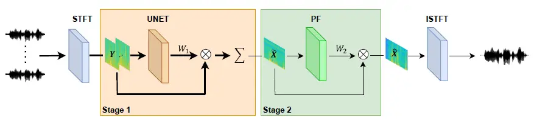

Fig. 1: The ExNet-BF+PF, comprising two stages. In the first stage, a
multichannel processor generates beamformer time-invariant weights. The
second stage employs a single-channel post-filter with time-varying
weights. In the figure, a thick arrow symbolizes multichannel
processing, while a thin arrow symbolizes single-channel processing.

### III-A Multi-microphone Processing (Stage 1)

In this stage, a U-Net architecture is employed to estimate the
complex-valued weights of a filter-and-sum beamformer, represented as
$`\mathbf{w}_{1}(k)`$. Subsequently, the output of the first stage
$`\tilde{x}(l,k)`$ is derived by the beamforming operation:

```math
\tilde{x}(l,k)=\mathbf{w}_{1}^{\textrm{H}}(k)\mathbf{y}(l,k), \tag{5}
```

The input to this stage is $`\mathbf{y}(l,k)`$, structured into a 3-D
tensor $`\mathcal{Y}^{c}\in\mathbb{C}^{M\times K\times L}`$,
encompassing all frequencies and frames. The output of the beamformer
stage, the enhanced speech in the STFT domain, is given in tensor form
as $`\mathcal{\tilde{X}}\in\mathbb{C}^{1\times K\times L}`$.

#### III-A1 U-Net Model

The proposed U-Net model consists of an encoder and a decoder, with skip
connections between them. Our architecture is based on \[31\] but
incorporates several modifications and improvements, particularly
adjusting filter sizes across the frequency axis. The encoder comprises
eight convolution layers, each of which is followed by batch
normalization, dropout, and a ‘LeakyRelu’ activation function. The
decoder follows a similar architecture but with transpose-convolution
layers instead of direct convolutions. The size of the filters, the
kernel, and the stride in each layer are summarized in Table I.

| Layer \# | \# of Filters | Kernel Size | Stride |
| -------- | ------------- | ----------- | ------ |
| 1        | 32            | (6,3)       | (2,2)  |
| 2        | 32            | (7,4)       | (2,2)  |
| 3        | 64            | (7,5)       | (2,2)  |
| 4        | 64            | (6,6)       | (2,2)  |
| 5        | 96            | (6,6)       | (2,2)  |
| 6        | 96            | (6,6)       | (2,2)  |
| 7        | 128           | (2,2)       | (2,2)  |
| 8        | 256           | (2,2)       | (1,1)  |

TABLE I: The configuration of each Conv2d layer in the encoder.

Following the U-Net, a linear layer is applied to the frequency
dimension, followed by a ‘Tanh’ activation function.

Importantly, an additional average layer is implemented at the output of
U-Net to enforce the first stage to become time-invariant. This results
in constant $`\mathbf{w}_{1}(k)`$ weights (a complex-valued scalar per
frequency bin and microphone).

The input to the proposed model is a 3-D tensor
$`\mathcal{Y}\in\mathbb{R}^{M\times 2K\times L}`$, which is obtained by
concatenating the real and imaginary components along the frequency
axis. The corresponding output can be similarly written as
$`\mathcal{W}_{1}\in\mathbb{R}^{M\times 2K\times 1}`$.

Three comments regarding the implementation are in place: a) Considering
that the real and imaginary components of the beamformer weights may
take negative values, we have chosen to employ the ‘Tanh’ activation
function. b) After applying the ISTFT (ISTFT), we aim to obtain a
real-valued signal. To achieve this, it is necessary for both frequency
0 and frequency $`\pi`$ of the spectrogram to be real-valued. As the
network structure does not enforce this condition, we have added a
constraint at the end of the U-Net, following the time averaging step,
to guarantee this. c) Unlike the conventional MVDR method, which
independently operates per frequency, our approach utilizes the network
to learn from all frequencies simultaneously, thereby leveraging their
inherent connections.

#### III-A2 Attention Blocks as Skip Connections

Our architecture diverges from the traditional U-Net approach of
directly concatenating features between the encoder and the decoder
blocks (skip connections). Instead, we introduce attention gates to
selectively identify relevant features from the encoder block, as shown
in Fig. 2. This concept extends an idea introduced in \[33\] and adapts
it to the STFT domain and the multichannel case.

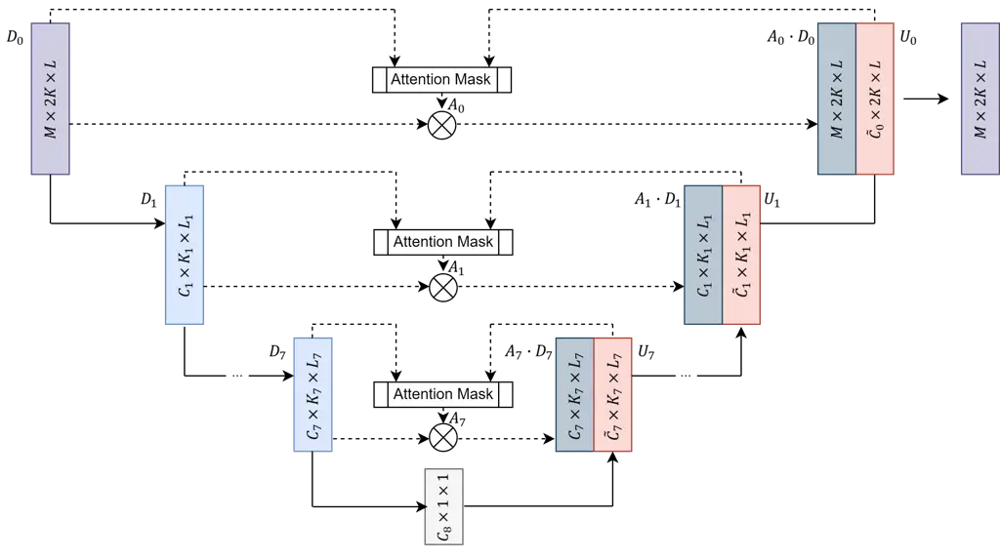

Fig. 2: The proposed U-Net architecture. Encoder blocks ($`D_{i}`$) are
colored in blue, decoder blocks ($`U_{i}`$) in red, and blocks
subsequent to the attention mechanism ($`A_{i}\cdot D_{i}`$) are shaded
in gray. Purple blocks indicate the input and output.

To implement the attention mechanism, we process each encoder block
$`D_{i}\in\mathbb{R}^{C_{i}\times K_{i}\times L_{i}}`$ and its
corresponding decoder block
$`U_{i}\in\mathbb{R}^{\tilde{C}_{i}\times K_{i}\times L_{i}}`$ at the
same hierarchical level. These blocks are fed to an attention mask block
that operates as follows:

- •
  The attention mask block comprises two separate 2-D convolution
  layers, one for $`D_{i}`$ and one for $`U_{i}`$. Each layer has a
  kernel size of (1,1) and $`C_{i}/2`$ filters.
- •
  The outputs of these convolutional layers are summed and then passed
  through a ‘Sigmoid’ activation function.
- •
  The resulting output is processed by another 2-D convolutional layer
  with a kernel size of (1,1) and a single filter, followed by another
  ‘Sigmoid’ activation function. This produces an attention mask
  $`A_{i}\in\mathbb{R}^{1\times K_{i}\times L_{i}}`$.

The attention mask $`A_{i}`$ is subsequently multiplied element-wise
with the encoder block $`D_{i}`$. The result of this multiplication is
concatenated with the decoder block $`U_{i}`$. This combined output
serves as the input to the next layer in the network. In the final
layer, just before the dense layer, the attention mask is computed using
the same procedure, with $`D_{0}`$ corresponding to the input of the
U-Net model.

### III-B Single-microphone Post-filtering (Stage 2)

In this stage, a U-Net architecture is employed to estimate a complex
mask, denoted as $`w_{2}(l,k)`$. Subsequently, the output of the second
stage is a further enhanced speech signal denoted $`\hat{x}(l,k)`$,
obtained by the following equation:

```math
\hat{x}(l,k)=w_{2}^{*}(l,k)\tilde{x}(l,k). \tag{6}
```

The input to this stage is the output of the first stage, and its output
is the enhanced speech in the STFT domain, denoted by
$`\hat{\mathcal{X}}\in\mathbb{R}^{1\times K\times L}`$. The
corresponding time-domain signal, $`\hat{x}(t)`$, is obtained using the
ISTFT operation. The second stage of the architecture closely resembles
the first stage, with a few differences: (1) The input for the second
stage is single-channel, differing from the multi-channel input of the
first stage. (2) After the linear layer, the activation function is here
a ‘Sigmoid’. (3) Unlike the first stage, no averaging was performed at
the end of the U-Net in the second stage.

### III-C Objectives

In training the proposed model, the time-domain MAE (MAE) loss function
is used, formulated as:

```math
\mathcal{L}_{\text{MAE}}=\textrm{mean}(|x_{\textrm{ref}}(t)-\hat{x}(t)|) \tag{7}
```

where $`x_{\textrm{ref}}(t)`$ represents the target signal in the time
domain as captured by the reference microphone, and $`\hat{x}(t)`$
denotes the estimated signal in the time domain. The mean operation
calculates the average over the different times.

A regularization term is incorporated into the loss function to improve
the training procedure further. First, we apply the beamformer weights
$`\mathbf{w}_{1}(k)`$, which were estimated using the noisy signals to
the clean and reverberant speech signals, as captured by the
microphones, $`\mathbf{x}(l,k)`$, instead of the noisy speech signals
$`\mathbf{y}(l,k)`$. The output of this operation is denoted
$`x_{d}(l,k)=\mathbf{w}_{1}^{\textrm{H}}(k)\mathbf{x}(l,k)`$.
Subsequently, we apply the ISTFT to $`x_{d}(l,k)`$ to obtain the
time-domain signal $`x_{d}(t)`$. The regularization term
$`\mathcal{L}_{\textrm{Reg}}`$ is then computed as:

```math
\mathcal{L}_{\textrm{Reg}}=\textrm{mean}(|x_{\textrm{ref}}(t)-x_{d}(t)|). \tag{8}
```

This additional term encourages preserving a distortionless response
towards the desired signal.

The final training loss is obtained as a weighted sum of the primary
loss and the regularization term:

```math
\mathcal{L}=\beta_{\textrm{MAE}}\cdot\mathcal{L}_{\textrm{MAE}}+\beta_{\textrm{Reg}}\cdot\mathcal{L}_{\textrm{Reg}} \tag{9}
```

with $`\beta_{\textrm{MAE}}+\beta_{\textrm{Reg}}=1`$.

## IV Experimental setup

This section details the experimental setup, covering the datasets
employed for training and testing, algorithm settings, competing
approaches, and evaluation measures.

### IV-A Datasets

For training the network, we constructed a dataset comprising noisy
signals simulated in diverse environmental conditions. The dataset
comprises 15,000 training samples, 5,000 validation samples, and 100
test samples for each environmental condition, ensuring a
gender-balanced distribution of speakers.

#### IV-A1 Database in a Non-reverberant Environment

Each signal within this dataset consists of a target speaker,
directional noise with a SNR (SNR) of 3 \[dB\], and additional spatially
and spectrally white noise with an SNR of 30 \[dB\]. This noise imitates
sensor noise and is also useful as a regularization for the noise matrix
inversion in the MVDR construction, as will be explained later. The
target speaker is randomly selected from the LibriSpeech dataset \[34\].
The directional noise is a colored noise modeled as an AR (AR) process
of order 1 with coefficient $`-0.7`$. Room dimensions, microphone array
position, and the positions (radius $`R`$ and angle $`\theta`$ relative
to the microphone array) of both the directional noise and the target
speaker are randomly set in specified ranges, as detailed in Table II.
The radius of the noise and the speaker are identical. We also ensured
that the angle between the sources is at least $`20^{\circ}`$. The
microphone array configuration is illustrated in Fig. 3 with the array
axis not parallel to the room walls. The duration of each signal in this
dataset is set to 4 seconds, with the first half-second exclusively
noise.

#### IV-A2 Dataset in a Reverberant Environment

Similar to the non-reverberant dataset, signals were randomly drawn from
the LibriSpeech dataset \[34\]. However, each signal in this dataset was
convoluted with a simulated RIR using the RIR generator tool \[35\]. The
range of reverberation levels is specified in Table II. Room dimensions,
microphone array position, and the directional noise and target speaker
positions are determined as in the non-reverberant dataset.

#### IV-A3 Noise Types

Signals with different types of noise were generated for both
reverberant and non-reverberant environments:

1.  1.  Time-Varying Noise: The noise direction switched after 2 sec.
2.  2.  Speaker Switching: The speaker and its direction switched after
        2 sec.
3.  3.  Babble Noise: Babble noise was generated by combining ten colored
        noise signals at various distances, maintaining an SNR of 3 dB.
4.  4.  Babble Voice: Babble voice was generated by combining ten speakers
        at different distances, maintaining an SNR of 3 dB.

For each environmental condition, the dataset comprised an additional
5,000 examples for each type of noise and an additional 100 test
samples.

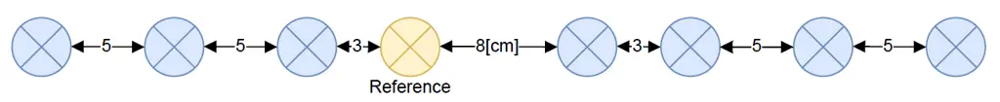

Fig. 3: The array configuration. The microphone inter-distances are
given in centimeters (cm).

| Parameter                                   | Symbol     | Range/Value                                                      |
| ------------------------------------------- | ---------- | ---------------------------------------------------------------- |
|                                             | $`L_{x}`$  | _U_\[6,9\]                                                       |
| Room dimensions \[m\]                       | $`L_{y}`$  | _U_\[6,9\]                                                       |
|                                             | $`L_{z}`$  | $`3`$                                                            |
| Reverberation time \[sec\]                  | $`T_{60}`$ | _U_\[0.3,0.5\]                                                   |
|                                             | $`x`$      | _U_\[2.5,$`{L_{x}}`$-2.5\]                                       |
| Microphone Center Position \[m\]            | $`y`$      | _U_\[0.5,$`{L_{y}}`$-2.5\]                                       |
|                                             | $`z`$      | $`1`$                                                            |
| Tilt angle of the microphone array \[^(∘)\] | $`\phi`$   | _U_\[-45,45\]                                                    |
| Speaker & directional noise angle \[^(∘)\]  | $`\theta`$ | _U_\[0,180\] (angle between the sources at least $`20^{\circ}`$) |
| Speaker & directional noise radius \[m\]    | $`R`$      | _U_\[1.8,$`\min(x-0.5,L_{x}-x-0.5,L_{y}-y-0.5,2.2)`$\]           |

TABLE II: Specification of the noisy and reverberant data.

### IV-B Algorithm Settings

The speech and noise signals have a sample rate of 16 KHz. The STFT
frame size is set to 512 samples with $`75\%`$ overlap. Due to the
symmetry of the DFT (DFT), only the first half of the frequency bands
are processed. The real and imaginary components of the spectrograms are
concatenated. For the training procedure, we employed the Adam
optimizer \[36\] with a learning rate of 1e-4 and a batch size of 16.
The weights were initialized randomly, and the length of the signals was
set to 4 seconds.

### IV-C Competing Approaches

Our assessment compares the proposed algorithm, “ExNet-BF+PF,” to the
MVDR beamformer. Various approaches can be employed to derive the MVDR
beamforming weights. For our study, the MVDR weights
$`\mathbf{w}_{\textrm{mvdr}}(k)`$ at frequency index $`k`$ are then
given by:

```math
\mathbf{w}_{\textrm{mvdr}}(k)=\frac{\boldsymbol{\Phi}_{\mathbf{nn}}^{-1}(k)\tilde{\mathbf{h}}(k)}{\tilde{\mathbf{h}}^{\textrm{H}}(k)\boldsymbol{\Phi}_{\mathbf{nn}}^{-1}(k)\tilde{\mathbf{h}}(k)};\;\quad\mathbf{w}_{\textrm{mvdr}}(k)\in\mathbb{C}^{M} \tag{10}
```

where $`(\cdot)^{\textrm{H}}`$ is the Hermitian operator,
$`\boldsymbol{\Phi}_{\mathbf{nn}}`$ the spatial covariance matrix of the
noise, and
$`\tilde{\mathbf{h}}(k)\triangleq\frac{\mathbf{h}(k)}{h_{\textrm{ref}}(k)}\in\mathbb{C}^{M}`$
indicates the vector of RTF. Each vector component is defined as the
ratio between an ATF from the source to a microphone normalized by the
reference microphone’s respective ATF.³³ 3 While, in general, the ATF
and the corresponding RTF may change over time, we omit here the time
dependency, mainly due to our estimation procedure that estimate the
signals’ correlation matrices by time-averaging on all available frames,
see (11) and (12). The vector of RTF constitutes the steering vector
towards the target speech \[37\].

Since the real values are unavailable, an estimate is required. The
noise covariance matrix $`\boldsymbol{\Phi}_{\mathbf{nn}}`$ is estimated
from the data as follows:

```math
\displaystyle\hat{\boldsymbol{\Phi}}_{\mathbf{nn}}(k)= \displaystyle\frac{1}{L_{n}}\sum_{l=0}^{L_{n}-1}\mathbf{y}(l,k)\mathbf{y}^{\textrm{H}}(l,k)
```

```math
\displaystyle= \displaystyle\frac{1}{L_{n}}\sum_{l=0}^{L_{n}-1}\mathbf{n}(l,k)\mathbf{n}^{\textrm{H}}(l,k), \tag{11}
```

where $`L_{n}`$ represents the number of noise-only time-frames at the
beginning of the utterance, determined using prior knowledge provided in
advance to the MVDR. We stress that our network does not utilize this
prior information.

In the same vein as the GEVD (GEVD) procedure presented in \[8\], the
RTF estimate is obtained by applying the EVD (EVD) procedure to the
whitened correlation matrix of the noisy signal.

The following procedure was applied. First, the spatial correlation
matrix of the noisy signals is obtained by averaging over all time
frames comprising the speech signal (in our case, from $`L_{n}`$, the
last noise-only frame until the end of the utterance):

```math
\hat{\boldsymbol{\Phi}}_{\mathbf{yy}}(k)=\frac{1}{L-L_{n}}\sum_{l=L_{n}}^{L-1}\mathbf{y}(l,k)\mathbf{y}^{\textrm{H}}(l,k). \tag{12}
```

The whitened measurements are given by:

```math
\mathbf{y}_{\textrm{w}}(l,k)=\hat{\boldsymbol{\Phi}}_{\mathbf{nn}}^{-1/2}(k)\mathbf{y}(l,k) \tag{13}
```

with

```math
\hat{\boldsymbol{\Phi}}_{\mathbf{nn}}^{-1/2}(k)=\mathbf{V}(k)\mathbf{D}^{-1/2}(k)\mathbf{V}^{\textrm{H}}(k), \tag{14}
```

where $`\mathbf{V}(k)`$ and $`\mathbf{D}(k)`$ are the matrix of
eigenvectors and the diagonal matrix of eigenvalues of the noise
correlation matrix, respectively, and $`(\cdot)^{-1/2}`$ is the inverse
square root of the matrix. The spatial correlation matrix of the
whitened signals is given by:

```math
\hat{\boldsymbol{\Phi}}_{\mathbf{y}_{\textrm{w}}\mathbf{y}_{\textrm{w}}}(k)=\hat{\boldsymbol{\Phi}}_{\mathbf{nn}}^{-1/2}(k)\hat{\boldsymbol{\Phi}}_{\mathbf{yy}}(k)\hat{\boldsymbol{\Phi}}_{\mathbf{nn}}^{-1/2\textrm{H}}(k), \tag{15}
```

with $`(\cdot)^{-1/2\textrm{H}}`$ is the Hermitian of the inverse square
root of the matrix.

Let $`\mathbf{f}(k)`$ be the eigenvector corresponding to the maximum
eigenvalue of the matrix
$`\hat{\boldsymbol{\Phi}}_{\mathbf{y}_{\textrm{w}}\mathbf{y}_{\textrm{w}}}(k)`$.
The RTF is obtained by multiplying this eigenvector by the square root
of the noise correlation matrix:

```math
\tilde{\mathbf{f}}(k)=\hat{\boldsymbol{\Phi}}_{\mathbf{nn}}^{1/2}(k)\mathbf{f}(k), \tag{16}
```

where $`(\cdot)^{1/2}`$ denotes the square root of the noise correlation
matrix, followed by a normalization by the entry corresponding to the
reference signal:

```math
\tilde{\mathbf{h}}(k)=\frac{\tilde{\mathbf{f}}(k)}{{\tilde{f}}_{\textrm{ref}}(k)}. \tag{17}
```

We have also implemented MPDR (MPDR) beamformer as another baseline
method. The MPDR beamformer is given by:

```math
\mathbf{w}_{\textrm{mpdr}}(k)=\frac{\boldsymbol{\Phi}_{\mathbf{yy}}^{-1}(k)\tilde{\mathbf{h}}(k)}{\tilde{\mathbf{h}}^{\textrm{H}}(k)\boldsymbol{\Phi}_{\mathbf{yy}}^{-1}(k)\tilde{\mathbf{h}}(k)};\;\quad\mathbf{w}_{\textrm{mpdr}}(k)\in\mathbb{C}^{M}. \tag{18}
```

The MPDR beamformer does not require the spatial correlation matrix of
the noise and uses instead the spatial correlation matrix of the noisy
signals. Hence, one may assume that prior information on noise-only
frames is unnecessary. This is true for the conventional implementation
of the MPDR beamformer. However, our implementation utilizes the RTF as
a steering vector. Estimating the RTF necessitates the noise spatial
correlation matrix for the whitening operation, as shown in (13). To
circumvent this requirement, we substituted the
$`\hat{\boldsymbol{\Phi}}_{\mathbf{nn}}(k)`$ with a spatially-white
noise correlation matrix $`\sigma_{n}^{2}\mathbf{I}`$.

As the results of this variant were unsatisfactory, we will only report
on the results for MVDR, which relies on prior knowledge of noise-only
segments, as explained earlier.

To guarantee a fair comparison between the MVDR beamformer and our
method, we also apply a PF (PF) at the output of the MVDR beamformer,
referred to as “MVDR+PF”. We have selected the single-microphone
log-spectral amplitude estimator as implemented in \[38\]. Another
baseline method is the second stage of the proposed scheme, namely the
single-channel U-Net-based post-filter. We denote this baseline as “SC”.

We also compare our method to the original “CUNET” method \[31\], which
uses a causal network architecture. Considering that the CUNET model is
a causal system, whereas ours is non-causal, we also configure the CUNET
network in a non-causal mode, termed “UNET”. This involves running the
network without zero-padding at the input, resulting in the modified
network relying on future samples for its operation. Notably, due to the
absence of an official code, we implemented our own version of this
approach.

### IV-D Evaluation Measures

To evaluate the performance of the proposed algorithm and compare it
with the baseline approaches, we employ five evaluation measures: 1)
SISDR (SISDR) \[39\], 2) PESQ (PESQ) \[40\], 3) STOI (STOI) \[41\], 4)
ESTOI (ESTOI) \[42\], and 5) NR (NR), calculated as follows:

```math
\mathbf{NR}=10\log_{10}\left(\frac{\text{var}(\hat{x}_{\text{speech}}(t))}{\text{var}(\hat{x}_{\text{noise}}(t))}\right). \tag{19}
```

Here, the subscript $`{(\cdot)_{\text{noise}}}`$ denotes the initial
half-second of the signal containing only noise, while the subscript
$`{(\cdot)_{\text{speech}}}`$ pertains to the subsequent 3.5 seconds of
the signal.

## V Experimental study

This section details the experimental study, encompassing the
performance of the proposed algorithm and competing methods under
non-reverberant and reverberant conditions. We also analyze the results
and draw insights into the proposed method’s performance, emphasizing
its explainability.

### V-A Beampattern Analysis

One of the main goals of our research is the explainability of the
proposed DNN-based scheme. Specifically, we aim to explore the spatial
characteristics of the proposed beamformer and to examine whether it
utilizes spatial information or solely focuses on spectral information.

When delving into the analysis of beampatterns in reverberant
environments, the reflection pattern of the RIR relating the source and
the microphones comes into play. To facilitate the understanding of
these complex patterns, the methodology described in \[43\] introduces a
simplified 1D representation of array responses. In this section, we
apply this approach to comprehensively assess the spatial properties of
our methods and compare them with the baseline methods outlined in
Sec. IV-C for both reverberant and non-reverberant environments.

For this analysis, we position the speaker along a predefined
semi-circular contour. Subsequently, we empirically generate the
beampattern by moving a white-noise source around this perimeter and
evaluating the array’s response to this noise signal as a function of
the DOA. We stress that this evaluation considers reverberation, and the
DOA only serves as an attribute of the source location.

The computation of the beampower involves the following steps: a)
Calculating the beamformer weights based on the chosen method. b) Using
the RIR generator \[35\], we generate acoustic responses from the
noise’s positions to the microphone array, with $`h_{m}(k,\theta)`$ the
corresponding ATF. In non-reverberant environments, we employ ATF with
zero-order reflections, while in reverberant environments, we use ATF
with full-order reflections. Here, $`\theta`$ is measured relative to
the array’s axis, and $`k`$ indicates the $`k-th`$ frequency bin. c)
Computation of the narrow-band beampattern as
$`B(k,\theta)=\mathbf{w}^{\textrm{H}}(k)\mathbf{h}(k,\theta)`$. d) The
wide-band beampower is finally obtained as
$`P(\theta)=\sum_{k}|B(k,\theta)|^{2}`$. Typically, the wide-band
beampower is visualized as a polar plot in dB scale, with the maximum
value normalized to 0 dB.

#### V-A1 Dataset in a non-reverberant environment

For the analysis, we generated an example from the test dataset where
the source DOA is $`350^{\circ}`$, and the directional noise DOA is
$`330^{\circ}`$. The narrow-band beampatterns $`|B(k,\theta)|`$ for the
non-reverberant dataset are depicted in Fig. 4, and the corresponding
wide-band beampower $`P(\theta)`$ in Fig. 5. The figures clearly
indicate that ExNet-BF+PF (we only analyze the first stage output) and
the traditional MVDR method can direct a beam toward the desired
speaker. The CUNET and UNET beamformers do not direct a beam in the
correct direction; in any case, the main lobe is not well-pronounced.
Comparing the proposed method with the MVDR beamformer shows that the
main beam of the ExNet-BF+PF is narrower. However, it fails to direct a
null toward the directional noise.

#### V-A2 Dataset in a reverberant environment

In the case of a dataset in a reverberant environment, obtaining a
beampattern proved challenging compared to the results observed in a
non-reverberant environment. We adopted a two-step training approach to
address this issue and successfully generate a beampattern for a
reverberant environment. The first stage, namely the network’s
multi-channel processor, which implements a time-invariant beamformer,
was frozen with weights derived from training on a non-reverberant
dataset, while in the second stage, the single-channel postfilter,
weights obtained from training in a reverberant environment were
utilized. For this analysis, we generated an example from the test
dataset with the same source and directional noise positions as in the
previous analysis but with different room properties. Figure. 6 depicts
the results for $`|B(k,\theta)|`$ for the reverberant environment
dataset, accompanied by $`P(\theta)`$ results in Fig. 7. Similar to the
non-reverberant environment dataset, our proposed approach and the
traditional MVDR method are the only beamformers capable of creating a
directional beam aimed at the speaker. Despite challenges in directing a
null towards the directional noise and directing a beam precisely to the
speaker’s angle, our proposed method shows a clearly defined main lobe
compared to the MVDR, as depicted in Fig. 6.

In forthcoming discussions of the results on datasets with
reverberation, we attribute the success of the ExNet-BF+PF to the
two-step training approach manifested by its capability to generate a
beampattern.

#### V-A3 Investigating the absence of a null in the beampattern

Examining the beampattern of ExNet-BF+PF, it is clear that the proposed
beamformer does not produce a null toward the directional interference,
in contrast to the MVDR beamformer. We experimented with various
approaches to impose a null.

First, we tried to incorporate additional regularization term in the
loss function related to the directional noise. Specifically, we add the
term $`\textrm{mean}(|n_{d}(t)|)`$ to the loss function, where
$`n_{d}(t)`$ corresponds to $`x_{d}(t)`$ in (8), applying on the
directional noise rather than the speech signal. Additionally, we
trained the network on a dataset where room dimensions and microphone
array location were randomized while preserving fixed angles of the
speaker and directional noise with respect to the array axis. However,
these efforts yielded no success, indicating that the current
implementation of our network fails to generate a null effectively.

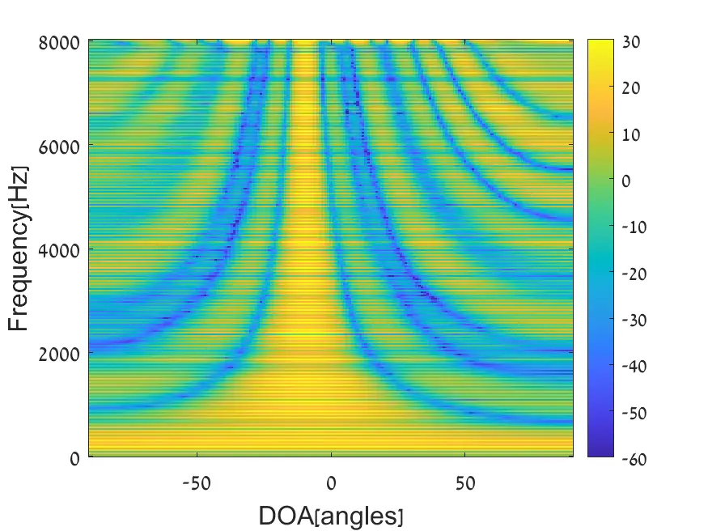

(a) ExNet-BF+PF

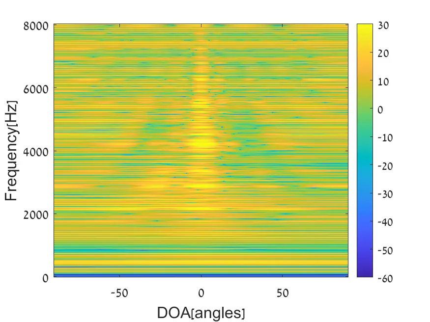

(b) CUNET

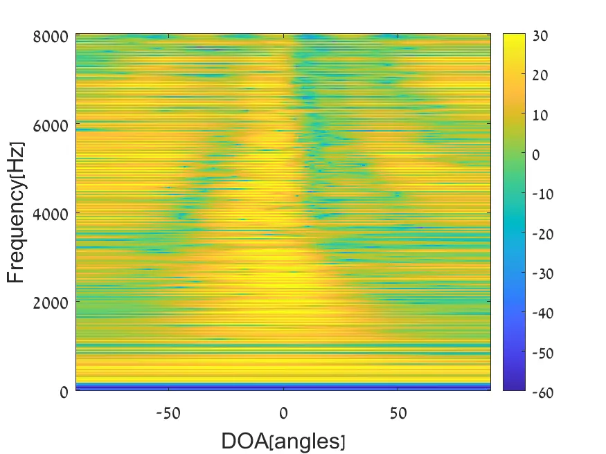

(c) UNET

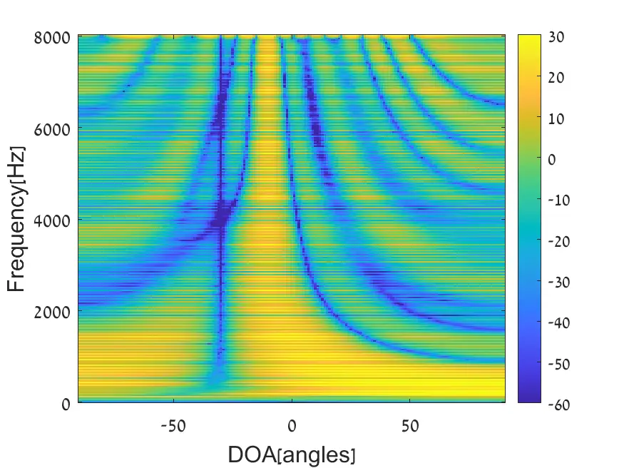

(d) MVDR

Fig. 4: $`B(k,\theta)`$ comparison for a dataset in a non-reverberant
environment, where the source is located at $`350^{\circ}`$, and the
directional noise is at $`330^{\circ}`$.

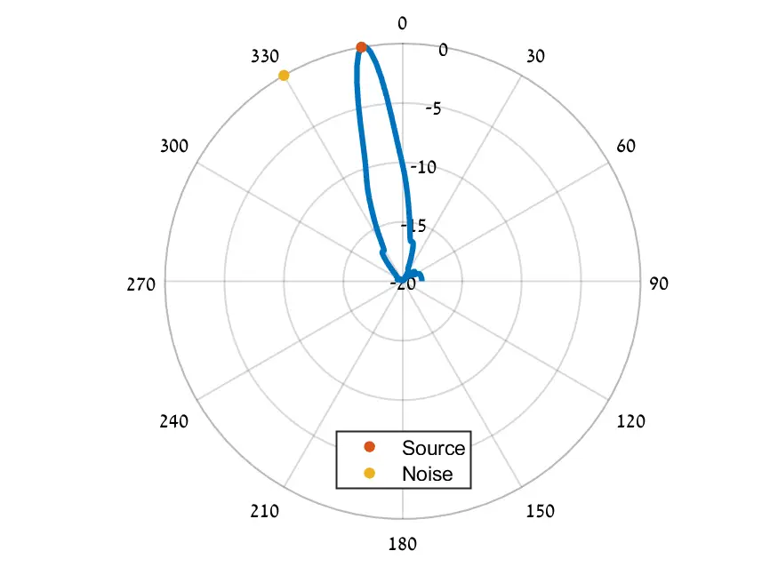

(a) ExNet-BF+PF

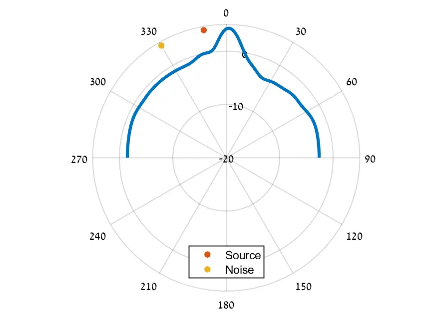

(b) CUNET

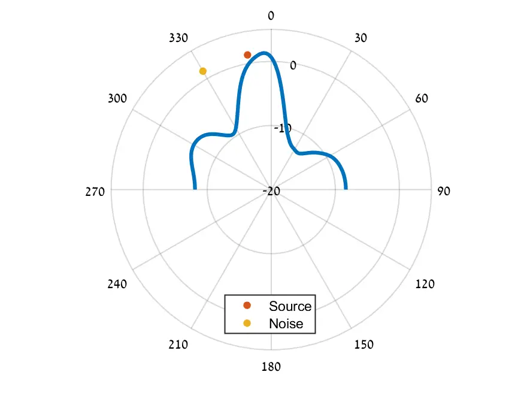

(c) UNET

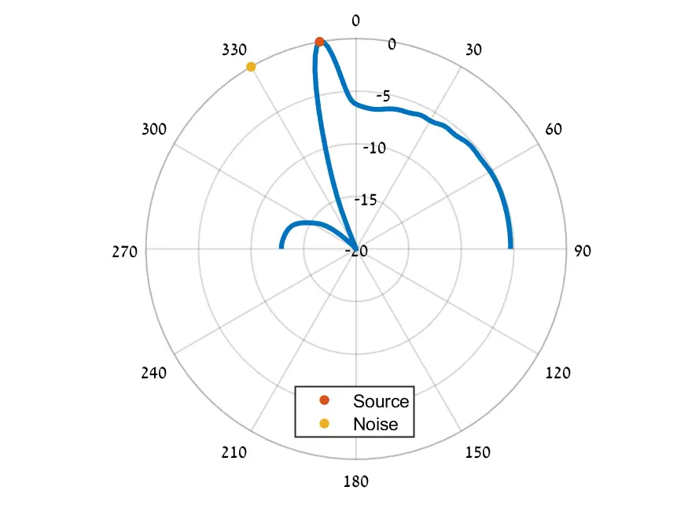

(d) MVDR

Fig. 5: $`P(\theta)`$ comparison for a dataset in a non-reverberant
environment, where the source is located at $`350^{\circ}`$, and the
directional noise is at $`330^{\circ}`$.

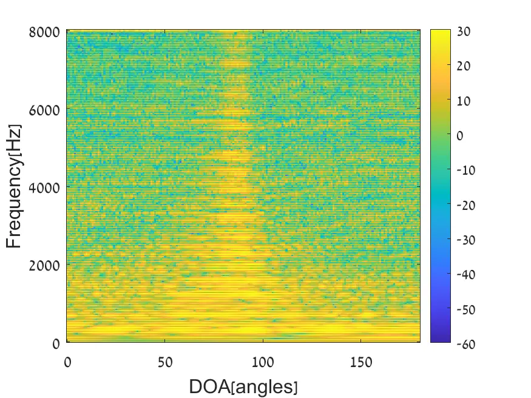

(a) ExNet-BF+PF

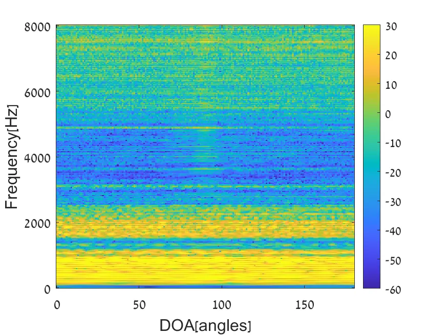

(b) CUNET

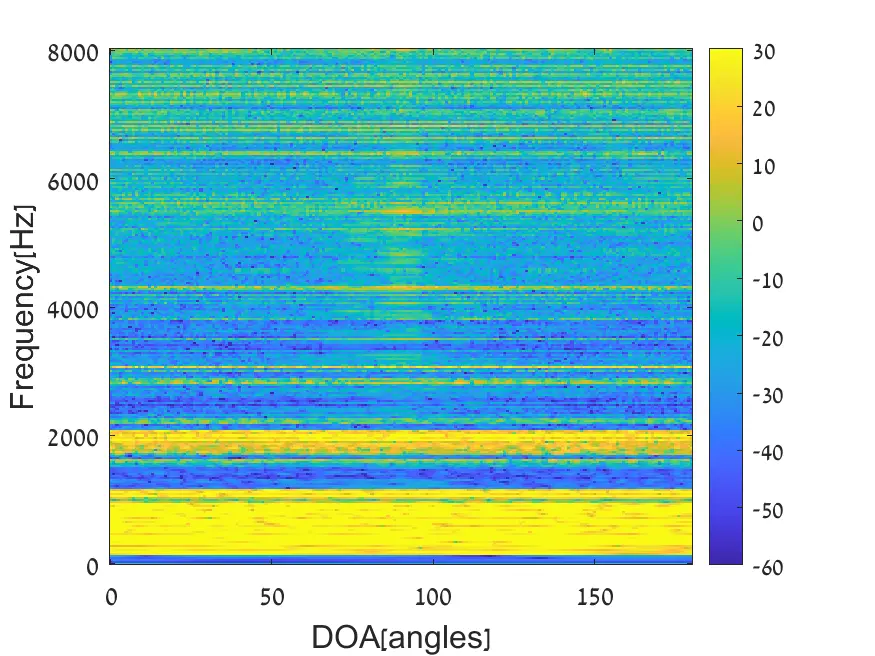

(c) UNET

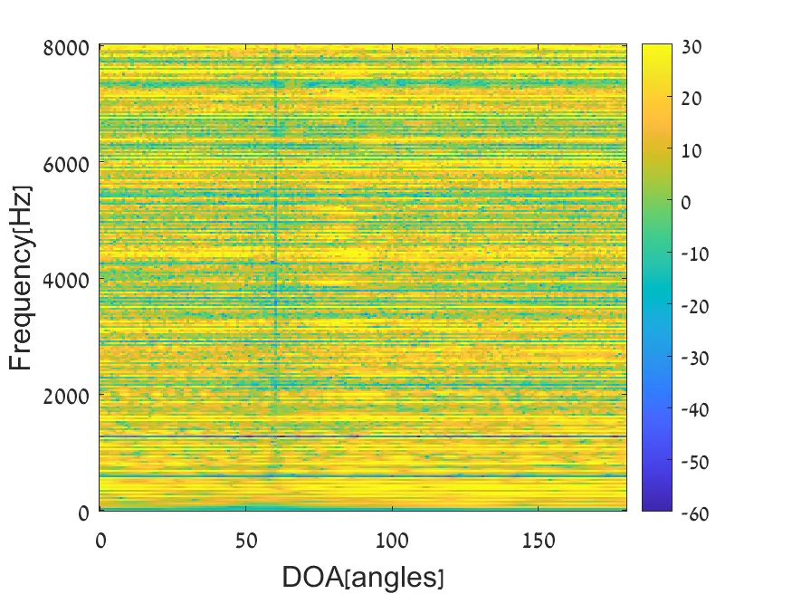

(d) MVDR

Fig. 6: $`B(k,\theta)`$ comparison for a dataset in a reverberant
environment, where the source is located at $`350^{\circ}`$, and the
directional noise is at $`330^{\circ}`$. The reverberation time
$`T_{60}=0.4`$ seconds.

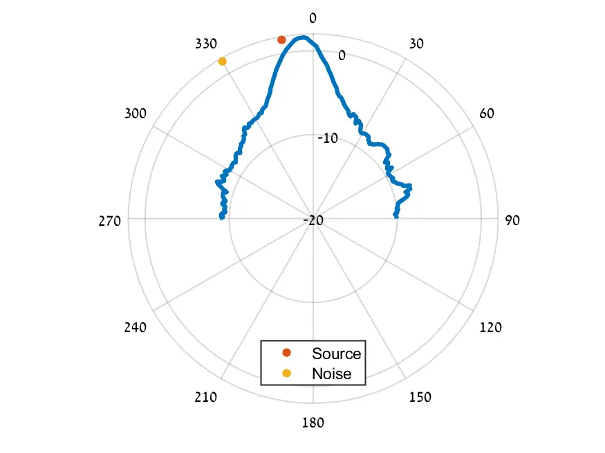

(a) ExNet-BF+PF

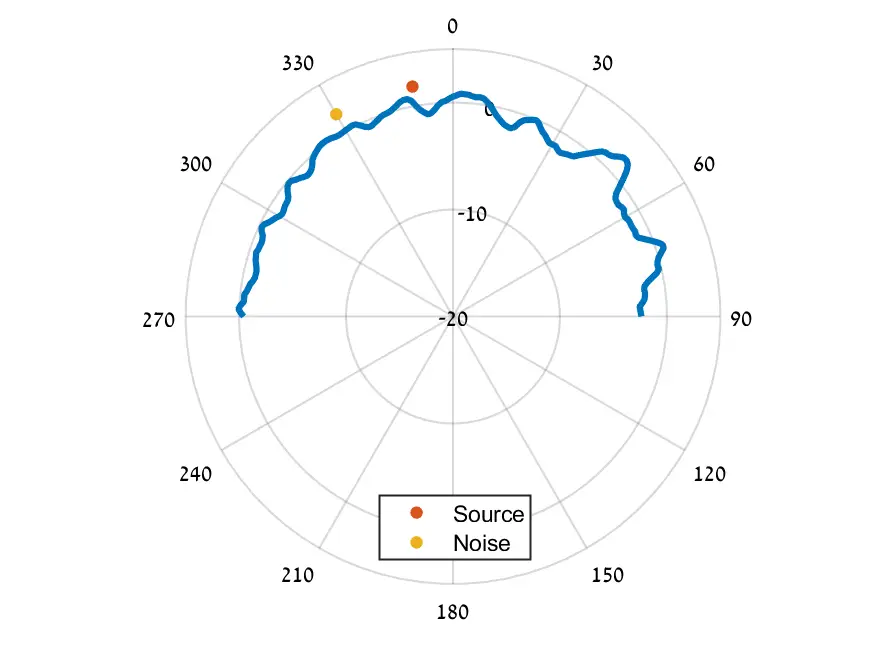

(b) CUNET

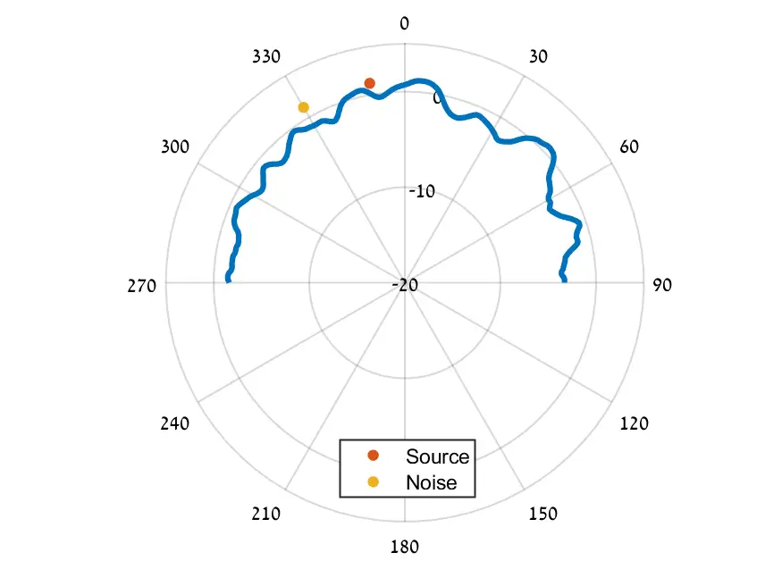

(c) UNET

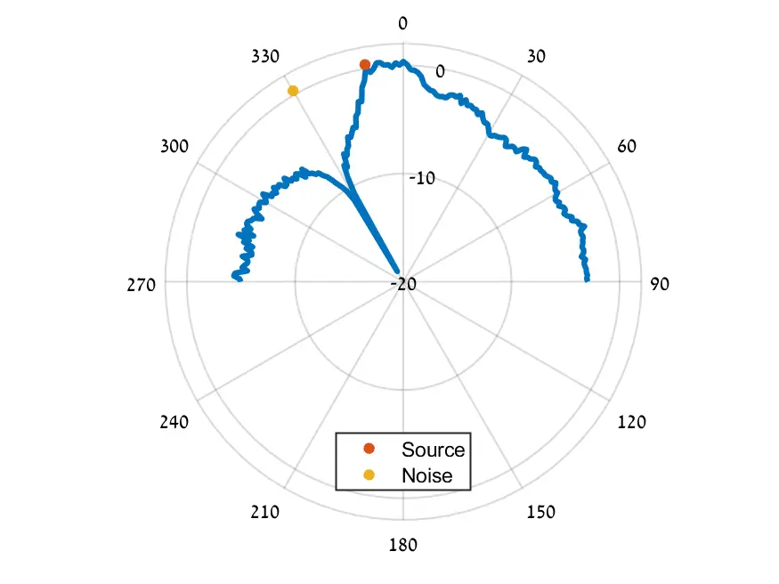

(d) MVDR

Fig. 7: $`P(\theta)`$, comparison for a dataset in a reverberant
environment, where the source is located at $`350^{\circ}`$, and the
directional noise is at $`330^{\circ}`$. The reverberation time
$`T_{60}=0.4`$ seconds.

### V-B Results

Audio test samples and their corresponding spectrograms can be found on
the project page⁴⁴ 4 Project page:
[https://exnet-bf-pf.github.io/](https://exnet-bf-pf.github.io/).

#### V-B1 Non-reverberant environment

The results for the noisy dataset are presented in Table III. First, our
network demonstrates superior performance in the NR metric.
Additionally, it outperforms the other DNN models in all evaluation
measures. However, in direct comparison with the conventional MVDR
approach, the MVDR beamformer yields better results. It is essential to
emphasize that the MVDR method relies on prior identification of
segments exclusively containing noise, a condition that does not apply
to the DNN models. Furthermore, the two-stage decomposition of the
network contributes to performance enhancement, as discussed in the
previous section, emphasizing its additional advantages in spatial
analysis.

#### V-B2 Reverberant environment

A performance comparison between the proposed algorithm and the
competing approaches is summarized in Table IV. In this case, our
network outperforms the MVDR in terms of NR, SISDR, and PESQ metrics,
although the MVDR still leads in STOI and ESTOI. Compared with the other
DNN models, our network leads in all measures except for the SISDR
metric, where the SC method takes the lead. It is crucial to acknowledge
that the performance drop in SISDR performance results from our two-step
training approach. Albeit this performance loss, this procedure achieves
our aim of preserving the network’s spatial structure. Given our
method’s superior performance in other metrics, we opted for this
approach despite the slight degradation in SISDR performance.

| Input        | 75.01          | 49.83           | 3.00            | 1.06           | 5.22         |
| ------------ | -------------- | --------------- | --------------- | -------------- | ------------ |
| Model        | $`\Delta`$STOI | $`\Delta`$ESTOI | $`\Delta`$SISDR | $`\Delta`$PESQ | $`\Delta`$NR |
| ExNet-BF+PF  | 18.84          | 34.78           | 12.20           | 1.10           | 54.45        |
| SC           | 10.46          | 17.28           | 7.82            | 0.43           | 41.35        |
| CUNET \[31\] | -0.60          | -1.27           | 3.43            | 0.15           | 27.68        |
| UNET         | 0.98           | -1.88           | 5.93            | 0.16           | 32.21        |
| MVDR+PF      | 24.10          | 47.80           | 18.94           | 2.52           | 41.43        |

TABLE III: Results for a dataset in a non-reverberant environment

| Input        | 66.35          | 47.55           | 2.98            | 1.13           | 5.37         |
| ------------ | -------------- | --------------- | --------------- | -------------- | ------------ |
| Model        | $`\Delta`$STOI | $`\Delta`$ESTOI | $`\Delta`$SISDR | $`\Delta`$PESQ | $`\Delta`$NR |
| ExNet-BF+PF  | 15.60          | 17.17           | 3.80            | 0.73           | 49.86        |
| SC           | 13.05          | 13.05           | 6.46            | 0.61           | 43.64        |
| CUNET \[31\] | 3.70           | -0.05           | 3.68            | 0.07           | 40.38        |
| UNET         | 3.50           | -1.06           | 3.48            | 0.01           | 43.44        |
| MVDR+PF      | 16.76          | 20.55           | 2.04            | 0.59           | 20.74        |

TABLE IV: Results for a dataset in a reverberant environment

#### V-B3 Noise Types

##### Non-Reverberant Environment

The performance of all competing algorithms for different noise types is
presented in Table V for non-reverberant conditions. For Time-Varying
Noise and Babble Voice scenarios, our method outperforms competing
approaches. Conversely, the MVDR method maintains its lead in most
metrics in scenarios involving Babble Noise and Speaker Switch. Notably,
our method performs well without relying on prior knowledge, showcasing
its robustness compared to the MVDR method. Additionally, our network
consistently outperforms the other DNN-based methods in all scenarios.
Figure 8 depicts the spectrograms of an example from the Time-Varying
Noise case. These results clearly illustrate the challenges faced by
MVDR, particularly evident in the latter part of the signal, where the
noise statistics have changed. Moreover, our network excels in noise
reduction compared to both MVDR and SC methods.

##### Reverberant Environment

Examining results with a reverberant dataset, as presented in Table VI,
further emphasizes the strength of our network. Even in scenarios
involving Babble Noise and Speaker Switch in the presence of
reverberation, our network surpasses the performance of MVDR. While SC
did not outperform in any metric in the non-reverberant scenario, it
consistently yields better SISDR results across all cases in the
reverberant dataset, as mentioned earlier. Figure 9 presents the
spectrograms of an example from the Time-Varying Noise case. These
samples clarify that the MVDR approach cannot track the noise statics
switch. Additionally, as observed in non-reverberant environments, our
neural network demonstrates superior noise reduction performance
compared to both MVDR and SC methods.

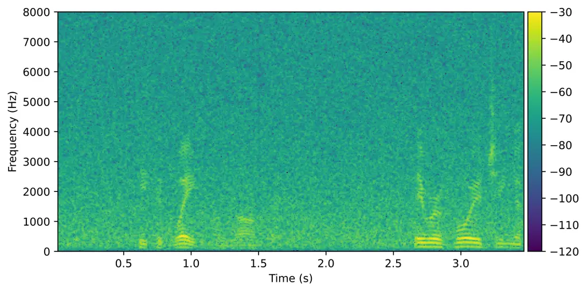

(a) Noisy Signal

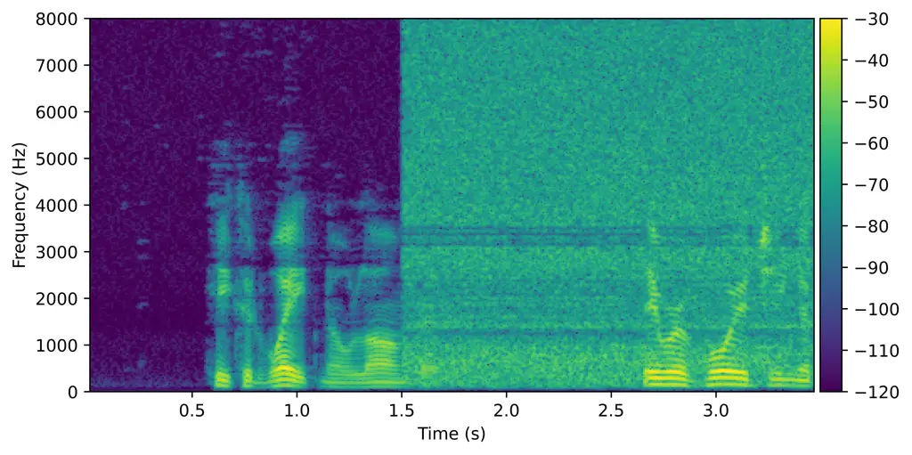

(b) MVDR

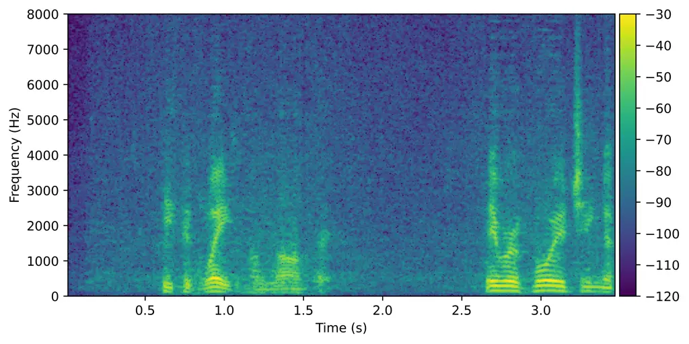

(c) SC

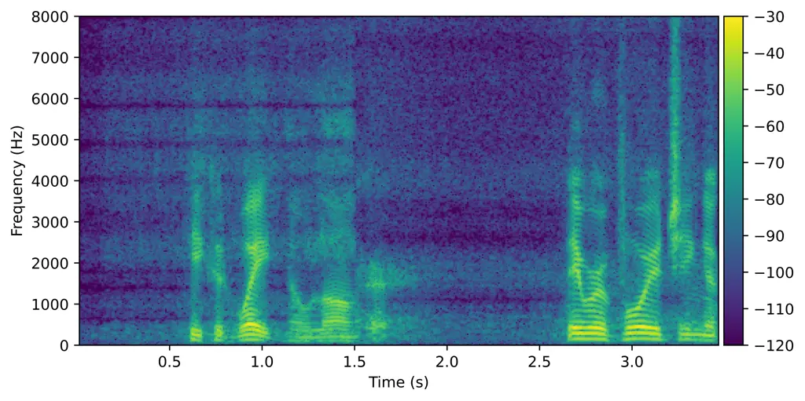

(d) ExNet-BF+PF

Fig. 8: Spectrograms showing the Time-Varying Noise scenario in a
non-reverberant dataset.

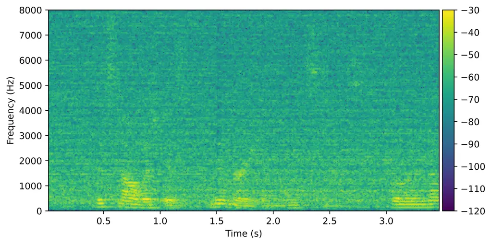

(a) Noisy Signal

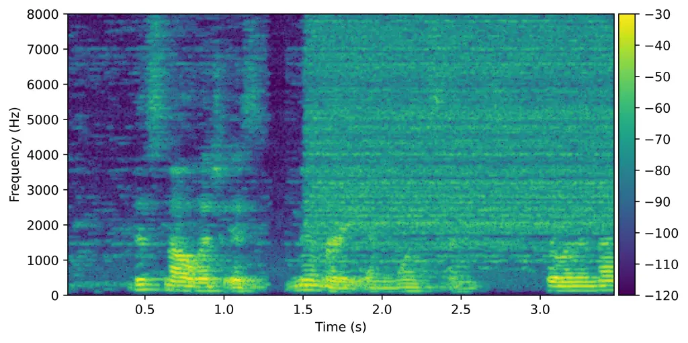

(b) MVDR

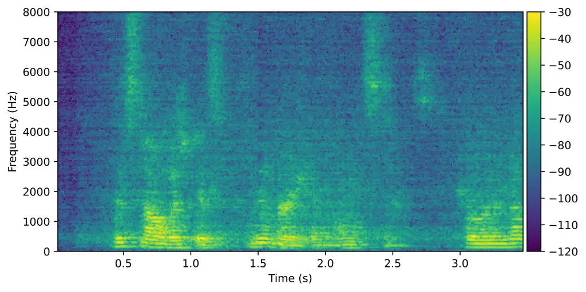

(c) SC

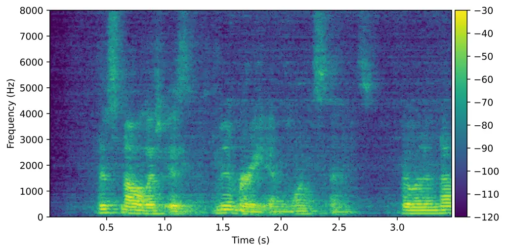

(d) ExNet-BF+PF

Fig. 9: Spectrograms showing the Time-Varying Noise scenario in a
reverberant dataset.

|                    |               |                |                 |                 |                |              |
| ------------------ | ------------- | -------------- | --------------- | --------------- | -------------- | ------------ |
| Noise Type         | Model         | $`\Delta`$STOI | $`\Delta`$ESTOI | $`\Delta`$SISDR | $`\Delta`$PESQ | $`\Delta`$NR |
| Time-Varying Noise | Input         | 74.11          | 48.86           | 2.98            | 1.07           | 5.17         |
| ExNet-BF+PF        | 19.28         | 35.06          | 12.05           | 1.12            | 54.39          |              |
| SC                 | 10.85         | 17.66          | 7.82            | 0.48            | 41.43          |              |
| CUNET \[31\]       | -0.73         | -1.14          | 3.35            | 0.20            | 27.40          |              |
| UNET               | 1.53          | -1.65          | 5.96            | 0.27            | 31.97          |              |
| MVDR+PF            | 5.05          | 13.47          | 2.19            | 0.21            | 44.67          |              |
| Speaker Switch     | Input         | 75.40          | 50.48           | 3.00            | 1.06           | 5.20         |
|                    | ExNet-BF+PF   | 14.71          | 25.85           | 8.74            | 0.69           | 50.96        |
|                    | SC            | 10.68          | 17.86           | 8.24            | 0.45           | 41.58        |
|                    | CUNET  \[31\] | -0.03          | 0.10            | 3.84            | 0.20           | 27.97        |
|                    | UNET          | 2.79           | 0.90            | 6.42            | 0.24           | 32.47        |
|                    | MVDR+PF       | 20.88          | 42.24           | 0.06            | 1.31           | 40.35        |
| Babble Noise       | Input         | 73.54          | 48.94           | 3.00            | 1.05           | 5.23         |
|                    | ExNet-BF+PF   | 18.98          | 32.75           | 11.74           | 0.86           | 54.44        |
|                    | SC            | 11.21          | 17.05           | 7.75            | 0.42           | 41.59        |
|                    | CUNET \[31\]  | 0.84           | 0.70            | 3.57            | 0.17           | 30.56        |
|                    | UNET          | 3.92           | 2.50            | 6.10            | 0.22           | 37.18        |
|                    | MVDR+PF       | 20.51          | 37.89           | 13.77           | 1.33           | 26.36        |
| Babble Voice       | Input         | 78.84          | 56.05           | 2.98            | 1.18           | 9.36         |
|                    | ExNet-BF+PF   | 12.00          | 22.56           | 7.82            | 0.49           | 52.98        |
|                    | SC            | 5.53           | 11.13           | 5.41            | 0.22           | 43.74        |
|                    | CUNET \[31\]  | -11.54         | -10.30          | -0.49           | -0.08          | 41.16        |
|                    | UNET          | -10.93         | -12.52          | 0.21            | -0.10          | 48.79        |
|                    | MVDR+PF       | 10.73          | 19.33           | 6.37            | 0.32           | 12.40        |

TABLE V: Results for various noise types in a non-reverberant
environment.

|                    |               |                |                 |                 |                |              |
| ------------------ | ------------- | -------------- | --------------- | --------------- | -------------- | ------------ |
| Noise Type         | Model         | $`\Delta`$STOI | $`\Delta`$ESTOI | $`\Delta`$SISDR | $`\Delta`$PESQ | $`\Delta`$NR |
| Time-Varying Noise | Input         | 66.57          | 47.52           | 2.98            | 1.12           | 5.33         |
| ExNet-BF+PF        | 15.17         | 16.72          | 3.61            | 0.69            | 49.63          |              |
| SC                 | 12.66         | 12.52          | 6.28            | 0.57            | 43.49          |              |
| CUNET \[31\]       | 2.83          | -0.64          | 3.23            | 0.09            | 40.23          |              |
| UNET               | 2.71          | -2.02          | 3.00            | 0.02            | 43.16          |              |
| MVDR+PF            | 0.67          | 1.97           | -0.26           | 0.14            | 21.30          |              |
| Speaker Switch     | Input         | 68.92          | 49.46           | 2.99            | 1.09           | 5.36         |
|                    | ExNet-BF+PF   | 12.93          | 14.84           | 4.99            | 0.58           | 47.12        |
|                    | SC            | 11.89          | 12.92           | 6.66            | 0.55           | 43.84        |
|                    | CUNET  \[31\] | 2.22           | -0.35           | 3.68            | 0.15           | 40.46        |
|                    | UNET          | 2.26           | -1.35           | 3.55            | 0.08           | 43.34        |
|                    | MVDR+PF       | 10.27          | 14.40           | -1.88           | 0.50           | 19.69        |
| Babble Noise       | Input         | 67.62          | 48.12           | 2.99            | 1.13           | 5.43         |
|                    | ExNet-BF+PF   | 15.06          | 16.71           | 3.84            | 0.64           | 50.40        |
|                    | SC            | 12.85          | 12.89           | 6.30            | 0.53           | 44.07        |
|                    | CUNET \[31\]  | 2.36           | -1.25           | 3.12            | 0.01           | 40.01        |
|                    | UNET          | 2.73           | -1.83           | 3.06            | -0.02          | 42.53        |
|                    | MVDR+PF       | 10.22          | 11.24           | 2.15            | 0.41           | 18.60        |
| Babble Voice       | Input         | 71.47          | 54.56           | 2.99            | 1.24           | 10.32        |
|                    | ExNet-BF+PF   | 6.49           | 6.08            | 1.41            | 0.27           | 51.39        |
|                    | SC            | 6.19           | 6.23            | 4.04            | 0.22           | 47.35        |
|                    | CUNET \[31\]  | -7.71          | -10.99          | -0.86           | -0.15          | 35.93        |
|                    | UNET          | -9.02          | -11.70          | -1.19           | -0.17          | 38.56        |
|                    | MVDR+PF       | 0.73           | -0.56           | -1.30           | 0.07           | 7.22         |

TABLE VI: Results for various noise types in a reverberant environment.

## VI Conclusions

This article introduced an explainable DNN-based beamformer with a
postfilter. Our method leverages a U-Net network architecture combined
with a beamformer structure. In our implementation, an attention
mechanism is incorporated into the skip connections of the U-Net
architecture. Our approach offers distinct advantages by decomposing the
network into spatial and spectral components through a two-stage
processing scheme. This decomposition facilitates analysis and
explainability of the beamforming architecture, together with
performance advantages in most cases. The results demonstrate consistent
positive outcomes across all metrics, although sometimes closely
matching other methods. Overall, our method performs well without
requiring prior knowledge of the speaker’s activities, particularly in
scenarios involving various noise types. Furthermore, we conducted a
comprehensive analysis of the spatial characteristics of our network as
compared with competing approaches. Our method effectively utilizes
spatial information to enhance the signal, evidenced by its ability to
direct a focused beam toward the speaker. Although the current
architecture cannot direct a null toward a directional noise, it still
significantly improves signal quality through advanced spatial
information utilization.

## References

- \[1\] S. Gannot, E. Vincent, S. Markovich-Golan, and A. Ozerov, “A
  consolidated perspective on multimicrophone speech enhancement and
  source separation,” _IEEE/ACM Transactions on Audio, Speech, and
  Language Processing_, vol. 25, no. 4, pp. 692–730, 2017.
- \[2\] S. Affes and Y. Grenier, “A signal subspace tracking algorithm
  for microphone array processing of speech,” _IEEE Transactions on
  Speech and Audio Processing_, vol. 5, no. 5, pp. 425–437, 1997.
- \[3\] S. Gannot, D. Burshtein, and E. Weinstein, “Signal enhancement
  using beamforming and nonstationarity with applications to speech,”
  _IEEE Transactions on Signal Processing_, vol. 49, no. 8, pp.
  1614–1626, 2001.
- \[4\] E. Warsitz and R. Haeb-Umbach, “Blind acoustic beamforming based
  on generalized eigenvalue decomposition,” _IEEE Transactions on audio,
  speech, and language processing_, vol. 15, no. 5, pp. 1529–1539, 2007.
- \[5\] S. Doclo and M. Moonen, “GSVD-based optimal filtering for single
  and multimicrophone speech enhancement,” _IEEE Transactions on signal
  processing_, vol. 50, no. 9, pp. 2230–2244, 2002.
- \[6\] A. Spriet, M. Moonen, and J. Wouters, “Spatially pre-processed
  speech distortion weighted multi-channel Wiener filtering for noise
  reduction,” _Signal Processing_, vol. 84, no. 12, pp. 2367–2387, 2004.
- \[7\] S. Doclo, A. Spriet, J. Wouters, and M. Moonen, _Speech
  Enhancement_, ser. Signals and Communication Technology. Springer,
  2005, ch. Speech Distortion Weighted Multichannel Wiener Filtering
  Techniques for Noise Reduction, pp. 199–228.
- \[8\] S. Markovich, S. Gannot, and I. Cohen, “Multichannel eigenspace
  beamforming in a reverberant noisy environment with multiple
  interfering speech signals,” _IEEE Transactions on Audio, Speech, and
  Language Processing_, vol. 17, no. 6, pp. 1071–1086, 2009.
- \[9\] R. Zelinski, “A microphone array with adaptive post-filtering
  for noise reduction in reverberant rooms,” in _IEEE International
  Conference on Acoustics, Speech, and Signal Processing (ICASSP)_,
  1988, pp. 2578–2579.
- \[10\] J. Meyer and K. U. Simmer, “Multi-channel speech enhancement in
  a car environment using Wiener filtering and spectral subtraction,” in
  _IEEE International Conference on Acoustics, speech, and Signal
  Processing (ICASSP)_, vol. 2, 1997, pp. 1167–1170.
- \[11\] S. Lefkimmiatis, D. Dimitriadis, and P. Maragos, “An optimum
  microphone array post-filter for speech applications.” in
  _Interspeech_, 2006.
- \[12\] C. Marro, Y. Mahieux, and K. U. Simmer, “Analysis of noise
  reduction and dereverberation techniques based on microphone arrays
  with postfiltering,” _IEEE Transactions on Speech and Audio
  Processing_, vol. 6, no. 3, pp. 240–259, 1998.
- \[13\] O. Schwartz, S. Gannot, and E. A. Habets, “Multispeaker LCMV
  beamformer and postfilter for source separation and noise reduction,”
  _IEEE/ACM Transactions on Audio, Speech, and Language Processing_,
  vol. 25, no. 5, pp. 940–951, 2017.
- \[14\] R. Balan and J. Rosca, “Microphone array speech enhancement by
  bayesian estimation of spectral amplitude and phase,” in _IEEE
  Workshop on Sensor Array and Multichannel Signal Processing (SAM)_,
  2002, pp. 209–213.
- \[15\] I. Cohen, S. Gannot, and B. Berdugo, “An integrated real-time
  beamforming and postfiltering system for nonstationary noise
  environments,” _EURASIP Journal on Advances in Signal Processing_,
  vol. 2003, pp. 1–10, 2003.
- \[16\] S. Gannot and I. Cohen, “Speech enhancement based on the
  general transfer function GSC and postfiltering,” _IEEE Transactions
  on Speech and Audio Processing_, vol. 12, no. 6, pp. 561–571,
  Nov. 2004.
- \[17\] B. Laufer-Goldshtein, R. Talmon, and S. Gannot, “Source
  counting and separation based on simplex analysis,” _IEEE Transactions
  on Signal Processing_, vol. 66, no. 24, pp. 6458–6473, 2018.
- \[18\] ——, “Global and local simplex representations for multichannel
  source separation,” _IEEE/ACM Transactions on Audio, Speech, and
  Language Processing_, vol. 28, pp. 914–928, 2020.
- \[19\] ——, “Audio source separation by activity probability detection
  with maximum correlation and simplex geometry,” _EURASIP Journal on
  Audio, Speech, and Music Processing_, vol. 2021, pp. 1–16, 2021.
- \[20\] T. Higuchi, N. Ito, S. Araki, T. Yoshioka, M. Delcroix, and
  T. Nakatani, “Online MVDR beamformer based on complex Gaussian mixture
  model with spatial prior for noise robust ASR,” _IEEE/ACM Transactions
  on Audio, Speech, and Language Processing_, vol. 25, no. 4, pp.
  780–793, 2017.
- \[21\] S. E. Chazan, J. Goldberger, and S. Gannot, “LCMV beamformer
  with DNN-based multichannel concurrent speakers detector,” in _2018
  26th European Signal Processing Conference (EUSIPCO)_. IEEE, 2018, pp.
  1562–1566.
- \[22\] A. Malek, S. E. Chazan, I. Malka, V. Tourbabin, J. Goldberger,
  E. Tzirkel-Hancock, and S. Gannot, “Speaker extraction using LCMV
  beamformer with DNN-based SPP and RTF identification scheme,” in _2017
  25th European Signal Processing Conference (EUSIPCO)_, 2017, pp.
  2274–2278.
- \[23\] J. M. Martín-Doñas, J. Jensen, Z.-H. Tan, A. M. Gomez, and
  A. M. Peinado, “Online multichannel speech enhancement based on
  recursive EM and DNN-based speech presence estimation,” _IEEE/ACM
  Transactions on Audio, Speech, and Language Processing_, vol. 28, pp.
  3080–3094, 2020.
- \[24\] A. Schwartz, O. Schwartz, S. E. Chazan, and S. Gannot,
  “Multi-microphone simultaneous speakers detection and localization of
  multi-sources for separation and noise reduction,” _EURASIP Journal on
  Audio, Speech and Music_, Jun. 2024, minor revision.
- \[25\] Y. Luo, C. Han, N. Mesgarani, E. Ceolini, and S.-C. Liu,
  “FaSNet: Low-latency adaptive beamforming for multi-microphone audio
  processing,” in _IEEE Automatic Speech Recognition and Understanding
  Workshop (ASRU)_, 2019, pp. 260–267.
- \[26\] Y. Luo and N. Mesgarani, “Implicit filter-and-sum network for
  multi-channel speech separation,” _arXiv preprint
  arXiv:2011.08401_, 2020.
- \[27\] Z. Zhang, Y. Xu, M. Yu, S.-X. Zhang, L. Chen, and D. Yu,
  “ADL-MVDR: All deep learning MVDR beamformer for target speech
  separation,” in _IEEE International Conference on Acoustics, Speech
  and Signal Processing (ICASSP)_, 2021, pp. 6089–6093.
- \[28\] E. Ceolini and S.-C. Liu, “Combining deep neural networks and
  beamforming for real-time multi-channel speech enhancement using a
  wireless acoustic sensor network,” in _IEEE 29th International
  Workshop on Machine Learning for Signal Processing (MLSP)_, 2019.
- \[29\] J. Casebeer, J. Donley, D. Wong, B. Xu, and A. Kumar,
  “NICE-beam: Neural integrated covariance estimators for time-varying
  beamformers,” _arXiv preprint arXiv:2112.04613_, 2021.
- \[30\] M. M. Halimeh and W. Kellermann, “Complex-valued spatial
  autoencoders for multichannel speech enhancement,” in _IEEE
  International Conference on Acoustics, Speech and Signal Processing
  (ICASSP)_, 2022, pp. 261–265.
- \[31\] X. Ren, X. Zhang, L. Chen, X. Zheng, C. Zhang, L. Guo, and
  B. Yu, “A causal U-Net based neural beamforming network for real-time
  multi-channel speech enhancement,” in _Interspeech_, 2021, pp.
  1832–1836.
- \[32\] A. Briegleb, M. M. Halimeh, and W. Kellermann, “Exploiting
  spatial information with the informed complex-valued spatial
  autoencoder for target speaker extraction,” in _IEEE International
  Conference on Acoustics, Speech and Signal Processing (ICASSP)_, 2023.
- \[33\] R. Giri, U. Isik, and A. Krishnaswamy, “Attention Wave-U-net
  for speech enhancement,” in _IEEE Workshop on Applications of Signal
  Processing to Audio and Acoustics (WASPAA)_, 2019, pp. 249–253.
- \[34\] V. Panayotov, G. Chen, D. Povey, and S. Khudanpur,
  “Librispeech: an asr corpus based on public domain audio books,” in
  _IEEE International Conference on Acoustics, Speech and Signal
  Processing (ICASSP)_, 2015, pp. 5206–5210.
- \[35\] E. A. Habets, “Room impulse response generator,”
  Friedrich-Alexander-Universität Erlangen-Nürnberg, Tech. Rep., 2014.
  \[Online\]. Available:
  [https://github.com/ehabets/RIR-Generator](https://github.com/ehabets/RIR-Generator)
- \[36\] D. P. Kingma and J. Ba, “Adam: A method for stochastic
  optimization,” _arXiv preprint arXiv:1412.6980_, 2014.
- \[37\] S. Gannot, D. Burshtein, and E. Weinstein, “Signal enhancement
  using beamforming and nonstationarity with applications to speech,”
  _IEEE Transactions on Signal Processing_, vol. 49, no. 8, pp.
  1614–1626, Aug. 2001.
- \[38\] I. Cohen and B. Berdugo, “Speech enhancement for non-stationary
  noise environments,” _Signal processing_, vol. 81, no. 11, pp.
  2403–2418, 2001.
- \[39\] J. Le Roux, S. Wisdom, H. Erdogan, and J. R. Hershey,
  “SDR–half-baked or well done?” in _IEEE International Conference on
  Acoustics, Speech and Signal Processing (ICASSP)_, 2019, pp. 626–630.
- \[40\] I. Union, “Wideband extension to recommendation P.862 for the
  assessment of wideband telephone networks and speech codecs,”
  _International Telecommunication Union, Recommendation P_, vol.
  862, 2007.
- \[41\] C. H. Taal, R. C. Hendriks, R. Heusdens, and J. Jensen, “A
  short-time objective intelligibility measure for time-frequency
  weighted noisy speech,” in _IEEE International Conference on
  Acoustics, Speech and Signal Processing (ICASSP)_, 2010, pp.
  4214–4217.
- \[42\] J. Jensen and C. H. Taal, “An algorithm for predicting the
  intelligibility of speech masked by modulated noise maskers,”
  _IEEE/ACM Transactions on Audio, Speech, and Language Processing_,
  vol. 24, no. 11, pp. 2009–2022, 2016.
- \[43\] O. Shmaryahu and S. Gannot, “On the importance of acoustic
  reflections in beamforming,” in _International Workshop on Acoustic
  Signal Enhancement (IWAENC)_, 2022.
