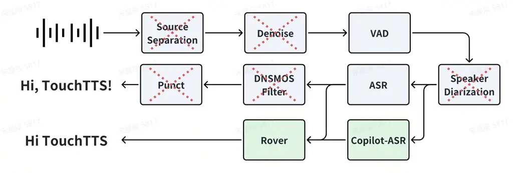
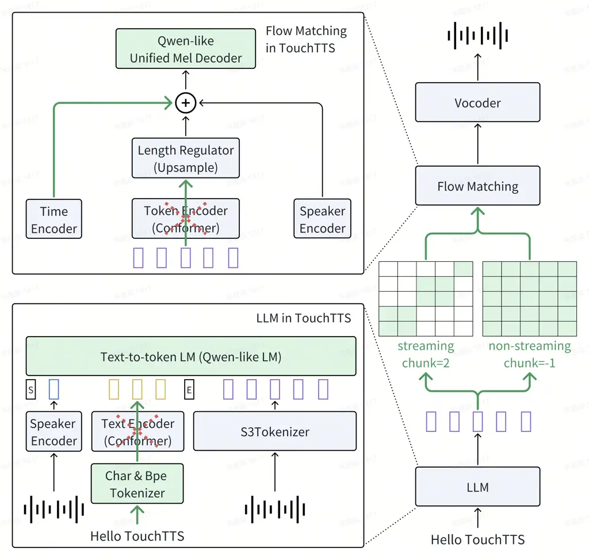
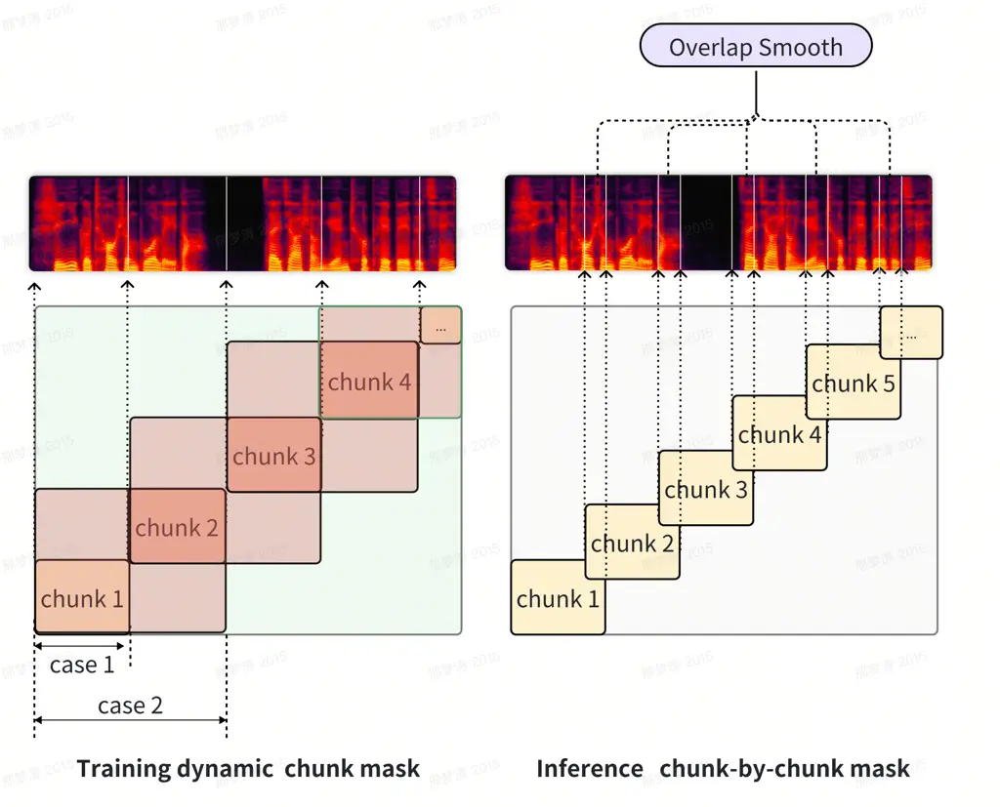
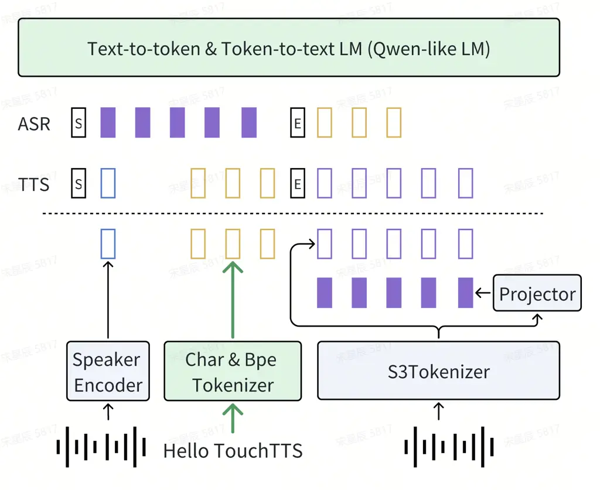
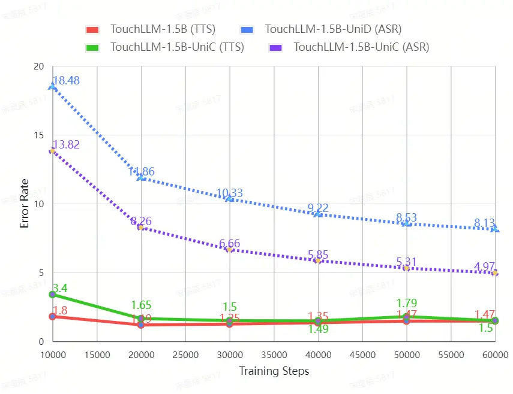

# TouchTTS: An Embarrassingly Simple TTS Framework that Everyone Can Touch

Technical Report    GUA Speech Team    WeNet Community    Tsinghua
University

###### Abstract

It is well known that LLM-based systems are data-hungry, requiring
substantially more training data compared to traditional approaches.
Recent LLM-based TTS works typically employ complex data processing
pipelines and elaborate filtering strategies to obtain high-quality
training data. These sophisticated pipelines require excellent models at
each stage (e.g., speech denoising, speech enhancement, speaker
diarization, and punctuation models), which themselves demand
high-quality training data and are rarely open-sourced. Even with
state-of-the-art models, issues persist, such as incomplete background
noise removal and misalignment between punctuation and actual speech
pauses. Moreover, the stringent filtering strategies often retain only
10-30% of the original data, significantly increasing data acquisition
costs and impeding data scaling efforts. In this work, we leverage a
noise-robust audio tokenizer (S3Tokenizer \[1\]) to design a simplified
yet effective TTS data processing pipeline that maintains data quality
while substantially reducing data acquisition costs, achieving a data
retention rate of over 50% for the first time. Beyond data scaling
challenges, LLM-based TTS systems also incur higher deployment costs
compared to conventional approaches. Current systems typically use LLMs
solely for text-to-token generation, while requiring separate models
(e.g., flow matching models \[2\]) for token-to-waveform generation,
which cannot be directly executed by LLM inference engines, further
complicating deployment. To address these challenges, we eliminate
redundant modules in both LLM and flow components, replacing the flow
model backbone with an LLM architecture (e.g., Qwen2ForCausalLM \[3\])
that can be directly executed by inference engines like TensorRT \[4\]
and vLLM \[5\]. Building upon this simplified flow backbone, we propose
a unified architecture for both streaming and non-streaming inference,
significantly reducing deployment costs. Finally, we explore the
feasibility of unifying TTS and ASR tasks using the same data for
training, thanks to the simplified data processing pipeline and the
S3Tokenizer \[1\] that reduces the quality requirements for TTS training
data.

Keywords: Easy model, Easy to train, Easy to scale, Easy to stream, Easy
to deploy

## 1 Introduction

Text-to-Speech (TTS) technology has made significant progress in recent
years, evolving from mechanical speech to highly natural voice output.
This advancement has been accelerated by Large Language Models (LLMs),
which enable natural speech synthesis and zero-shot voice generation
without speaker-specific training data \[6\]. As LLM-based TTS systems
develop rapidly, new challenges emerge in data scaling and deployment
efficiency.

Existing industry-level LLM-based TTS systems or large-scale TTS
datasets, such as CosyVoice \[1\], FishSpeech \[7\], FireRedTTS \[8\],
XimalayaTTS \[9\], WenetSpeech4TTS \[10\], Emilia \[11\] and AutoPrep
\[12\], typically build complex data processing pipelines to convert
large amounts of raw audio into high-quality TTS training data with rich
annotations and diverse content and timbres. After such complex
processing, only 10% to 30% of the original data remains usable for
training, turning data scaling into a “money game”. Moreover, even with
fine-grained and careful processing, it’s difficult to guarantee there
won’t be badcases at each stage. For instance, the denoising stage may
fail to completely remove noise or background music, speaker
segmentation may fail to cleanly extract target speaker’s voice, or the
punctuation model may produce punctuation marks that don’t match the
actual pauses in speech, as these punctuations are typically predicted
based solely on text. Given that we cannot guarantee perfect data
quality after processing, effectively utilizing “dirty data” becomes key
to overcoming the data scaling challenge without substantial money
power.

Furthermore, current LLM-based TTS systems typically require cascading a
token-to-waveform model (such as flow matching model \[2\]) to generate
waveform. These cascaded models often inherit the U-Net structure from
image models \[13\]. This special structure not only prevents reuse of
LLM inference engines, thereby increasing deployment costs, but also
makes streaming inference more difficult due to its greater complexity
compared to LLM structures.

To address these challenges in data scaling and model deployment faced
by current LLM-based TTS systems, we propose a minimalist TTS data
processing pipeline and design a deployment-oriented TTS architecture
based on it.

The key contributions of our work are summarized as follows:

- •
  Simplified Data Processing Pipeline: thanks to the robustness of
  S3Tokenizer\[1\] against dirty data, we provide a highly simplified
  data processing pipeline that removes noise reduction, speech
  enhancement, speaker diarization, and punctuation modules. We then
  employ a simple copilot-ASR cross-validation strategy to ensure data
  quantity and quality, achieving a data retention rate of over 50% and
  verifying data effectiveness at the million-hour level.
- •
  Simplified TTS Architecture: we propose a deployment-oriented
  architecture, including:
  - –
    Simplified frontend: we use character for Chinese and bpe for
    English, which reduces insertion and deletion errors compared to
    pure byte bpe.
  - –
    Qwen-based backbone for both LLM and flow: we remove the text
    encoder in LLM and replace the common u-net structure in flow with
    Qwen, making the whole model seamlessly deployable on TensorRT \[4\]
    and vLLM \[5\].
  - –
    Simplified and unified streaming and non-streaming strategy: thanks
    to the WeNet-style chunk-based inference and the aforementioned
    Qwen-based flow backbone, we can use a unified flow model to handle
    both streaming and non-streaming scenarios.

- •
  Unified TTS and ASR: based on all the above simplifications,
  especially the data processing pipeline that significantly improves
  data retention rate and the S3Tokenizer \[1\] that reduces the quality
  requirements for TTS training data, we explore the feasibility of
  unifying TTS and ASR using the same data for training.

## 2 Related Work

The most related work to this paper is CosyVoice \[1\], which consists
of an LLM for text-to-token generation and a conditional flow matching
model \[2, 13\] for token-to-speech synthesis. Our work extends
CosyVoice by simplifying the data processing pipeline and the model
architecture, thereby reducing data acquisition and deployment costs,
and exploring the feasibility of unified streaming and non-streaming
inference, the ability of unifying TTS and ASR tasks using the same data
for training. In subsequent sections, we will detail our
simplifications.

## 3 Simplified Data Processing Pipeline

Figure 1: Overview of the Simplified Data Processing Pipeline. The blue
blocks represent the common data processing pipeline of the current
LLM-based TTS systems \[1, 7, 8, 9, 10, 11, 12\], and the red cross
represents the parts removed from our pipeline. The green blocks
represent the parts added to our pipeline.

As shown in Figure 1, we propose a streamlined data processing pipeline
for converting large-scale raw speech data into TTS training data. This
pipeline consists of three primary modules: VAD, ASR, and Copilot-ASR
with Rover. We first utilize VAD to segment audio into 2-30 second
clips, then employ an ASR model for text transcription, followed by a
secondary transcription using the Copilot-ASR model. Finally, we filter
out data with significant discrepancies based on the consistency between
the two transcriptions to obtain the final annotation results.

Our guiding principle is “keeping the data pipeline as simple as
possible to minimize errors and is thus more general for scaling”. As
discussed in Section 1, we cannot guarantee the reliability of each
module in traditional pipelines. For instance, denoising models cannot
completely eliminate background noise, speaker diarization cannot
perfectly distinguish overlapping speakers, and punctuation models
cannot ensure precise pause alignment. These limitations collectively
reduce the overall data retention rate.

Another limitation of previous data processing pipelines is their
TTS-specific customization, which alters the original data distribution,
potentially making the data less suitable for tasks such as speech
recognition and end-to-end spoken dialogue. For example, while denoising
modules remove background sounds to benefit TTS tasks, ASR models
actually achieve better robustness when trained on data containing
background noise. Similarly, speaker diarization ensures single-speaker
segments beneficial for TTS but may be counterproductive for end-to-end
dialogue tasks, where multi-speaker interactions within single samples
are crucial, particularly during the pretraining phase to facilitate
better learning of speaker interactions during subsequent SFT stages.

Overall, "less is more", our proposed pipeline eliminates modules such
as source separation, denoising, speaker diarization, DNSMOS \[14\]
filtering, and punctuation, thereby preserving the original data
distribution as much as possible and improving data retention rate. The
effectiveness of our simplified processing pipeline is attributed to two
key factors:

- •
  S3Tokenizer for Noise-Robust Audio Tokenization. Early studies have
  shown that adding ASR loss during the training of speech tokenizers
  outperforms the quantization method based on k-means clustering in
  speech translation tasks \[15\]. CosyVoice \[1\] further demonstrates
  that the speech tokenizer based on ASR loss (Supervised Semantic
  Speech Tokenizer, S3Tokenizer) is also effective for TTS tasks. In
  this paper, we further explore the potential of S3Tokenizer in data
  scaling. We argue that since the optimization goal of ASR loss is to
  extract semantic information from speech and ignore irrelevant
  background noise, speaker information, etc., the S3Tokenizer with ASR
  loss implicitly learns the ability to denoise and disentangle
  speakers, making it more robust to dirty data and thus reducing the
  quality requirements for TTS training data. Based on this discovery,
  we simplify our data processing pipeline.
- •
  Copilot-ASR Cross-Validation for Data Quality Assurance. We find that
  a single ASR model may make errors, but the probability of two ASR
  models making errors is significantly lower. Moreover, data of low
  quality tends to exhibit significant discrepancies across different
  ASR models \[16, 17\]. Therefore, we filter out data with significant
  discrepancies based on the consistency between the two transcriptions
  to improve data quality. We hypothesize that this cross-validation
  approach implicitly assumes the functions of traditional SNR filtering
  and DNSMOS \[14\] filtering. Specifically, we implement the Rover
  function by comparing the Word Error Rate (WER) and Phoneme Error Rate
  (PER) between two transcriptions and filter out data with WER greater
  than 10 and PER greater than 5. We use Whisper \[18\] and Paraformer
  \[19\] as ASR and Copilot-ASR models.

Figure 2: Overview of the Simplified TTS Architecture. The blue blocks
represent the common LLM-based TTS architecture, and the red cross
represent the parts removed from our architecture. The green blocks and
green lines represent the parts that we added or simplified. "S" denotes
start of the sentence and "E" denotes end of the sentence. Note that in
the streaming mode, the chunk size can be arbitrary, here we assume it
is 2 for convenience.

Finally, we process 1260k hours of raw data into 650k hours of training
data, achieving a data retention rate of 51.6%. Notably, even with the
same data processing pipeline, the data retention rate varies
significantly across different domains. For instance, audiobooks, with
relatively consistent recording environments and less background noise,
generally have a higher retention rate than outdoor live broadcast data.
The 51.6% retention rate is an average across all domains.

In addition, we collected 150k hours of open-source data (mostly ASR
data) and supplemented it with some internal data (also mostly ASR data)
to form our final one million hours of training data (85% Chinese and
15% English).

## 4 Simplified TTS Architecture

As shown in Figure 2, we simplify the LLM-based TTS architecture, mainly
in the following three aspects.

We use character-based units for Chinese text tokenization and keep the
English text tokenization as BPE. We will show in Section 6 that this
improvement can help reduce the number of insertion and deletion errors
in Chinese TTS.

We use Qwen2ForCausalLM / Qwen2MoeForCausalLM \[3\] as our LLM backbone
and Qwen2ForCausalLM \[3\] as our flow backbone. At the same time, we
remove the Text Encoder \[1, 9\] in the LLM part and the Token Encoder
\[1, 8\] in the flow part to further simplify the model structure.

Since the flow part no longer uses the U-net structure \[1, 8, 2\] and
does not have the cross-layer skip connections, we can easily unify the
streaming and non-streaming inference by controlling the attention mask
of the input, which is inspired by the related work in the ASR field
\[20\], allowing us to implement a flow model that supports both
streaming and non-streaming modes through WeNet-style chunk-based
inference \[20\].

### 4.1 Character-based Unit for Simple yet Efficient Chinese Text Tokenization

Traditional TTS architectures, including VALL-E \[21\], VITS \[22\], and
FastSpeech \[23\], typically rely on grapheme-to-phoneme (G2P)
conversion to transform text into phonetic representations. While this
approach has proven effective, it faces significant challenges when
handling context-dependent polyphonic words and cross-lingual
generalization due to the complexity of phonetic rules. As the demand
for LLM-based large-scale TTS systems continues to grow, the limitations
of G2P-based approaches have become increasingly apparent. The heavy
reliance on language-specific phonetic rules and lexicons significantly
constrains system scalability and introduces substantial maintenance
overhead. Recent research, such as FishSpech \[7\], CosyVoice \[1\],
FireRedTTS \[8\], have made promising strides by exploring the use of
bpe-based tokenizers from Large Language Models (LLMs) for direct
linguistic feature extraction, effectively eliminating the need for
explicit G2P conversion.

In this work, we find that character-based units can be more simple and
efficient for Chinese text tokenization. This is due to the following
reasons:

- •
  The pronunciation rules of Chinese are that one character corresponds
  to one complete pronunciation, so the number of tokens obtained by
  character modeling is exactly the same as the number of
  pronunciations, which explicitly provides a strong bias to the model.
  In contrast, when using BPE to model Chinese, one Chinese character
  may be tokenized into more than one or less than one token, resulting
  in an inconsistent number of tokens and pronunciations for the same
  text, which makes the model lose the guiding prior information and is
  more prone to insertion and deletion errors.
- •
  There are many homophones in Chinese, which have the same
  pronunciation in phonetic terms but are completely different in
  character terms. Therefore, using character-based units can better
  capture the differences between homophones than using G2P methods.
- •
  There are many polyphonic characters in Chinese, which may have
  different pronunciations in different contexts. Compared to using G2P
  methods, using character-based units can better handle the
  pronunciation of polyphonic characters in different contexts.

### 4.2 Pure Qwen Backbone for both LLM and Flow

Our design principle is to leverage the LLM ecosystem as much as
possible, including training libraries (such as transformers \[24\]) and
inference libraries (such as TensorRT \[4\], vLLM \[5\]). Therefore, we
mainly make architecture improvements in two aspects: replacing the
backbones of LLM and Flow with standard transformer structures, and
removing unnecessary modules in LLM and Flow.

Specifically, as shown in Figure 2, we use Qwen \[3\] as the backbone of
LLM and Flow. It is worth noting that the backbone can be any LLM
structure supported by TensorRT, vLLM, etc., here we only conduct
experiments on Qwen structure for simplicity. It is a straightforward
idea to apply the LLM structure to the text-to-token LM, because the
text-to-token LM is essentially a sequence-to-sequence task, and LLM is
designed for sequence-to-sequence tasks. However, for the Flow part, the
U-net structure is widely used and has become a de facto standard in the
image \[13\] and speech \[1, 8, 2, 25\] fields. Although the
effectiveness and performance of the U-net structure have been widely
verified in the flow part, its complex structure and cross-layer skip
connections not only make it difficult to reuse the LLM inference
ecosystem but also pose significant challenges for streaming inference.

On the contrary, using the transformer structure in the Flow can not
only better reuse the LLM inference ecosystem but also easily achieve
the unification of streaming and non-streaming through controlling the
attention mask. However, whether the synthesis result can match that of
the U-net structure is an open question. In this paper, we verify
through experiments that using the transformer structure in the Flow is
effective and efficient, and can achieve the unification of streaming
and non-streaming.

Another factor that hinders the efficient deployment of LLM-based TTS
systems is the redundant modules in the architecture design, such as the
common Text Encoder (Conformer) \[1, 9\] in the LLM part and the common
Token Encoder (Conformer) \[1, 8\] in the Flow part. These modules are
usually not supported by inference libraries such as TensorRT \[4\],
vLLM \[5\], etc., requiring additional deployment, which not only
increases the complexity of the system but also reduces the inference
efficiency. At the same time, we believe that when the parameter size of
the backbone is large enough, the complexity of other modules in the
model has a negligible impact on the final effect, so we simplify the
model structure as much as possible to better reuse the LLM inference
ecosystem.

### 4.3 Chunk-based Unified Streaming and Non-Streaming Inference

Figure 3: Illustration of the training and inference pipeline for
unified streaming and non-streaming synthesis. As shown in the figure,
during training (left), after selecting dynamic chunk lengths, Case 1
represents chunks without overlap, while Case 2 represents chunks with
one chunk length of historical context overlap. The receptive field of
the current chunk is masked, with chunk length and historical context
length varying dynamically during training. During inference (right),
the current chunk’s receptive field is set to full coverage, and shorter
token overlaps are used between chunks to smooth mel-spectrogram
boundaries.

To simultaneously support both streaming and non-streaming inference
modes, inspired by the dynamic chunk training approach in WeNet\[20\],
we concatenate conditional information such as speaker embeddings and
time embeddings into the input features of our flow model, which are
then uniformly fed into the flow module. Our flow module employs the
Qwen model as its backbone without an additional token encoder. During
training, we replace the causal mask with a dynamic chunk mask, which
ensures that the receptive field is shared within the current chunk
segment while maintaining independence from future information. The
historical context length for each chunk segment varies dynamically
based on the chunk length, allowing flexibility in utilizing or
disregarding historical information. This approach enables the model to
adapt to both chunk-by-chunk inference scenarios and those requiring
historical context, thereby bridging the receptive field discrepancy
between training and streaming inference. In our experiments, we set the
minimum chunk length to 0.5 seconds and dynamically expand it during
training, maintaining sentence-level receptive fields for 50% of the
training data to simultaneously accommodate varying chunk receptive
fields while ensuring training stability.

During the model inference phase, different token lengths can be
configured as chunks. Once the LLM model generates tokens for the
current chunk, the flow module can proceed with inference without
concerns about insufficient future token information affecting the
performance. Notably, when inferring tokens for the current chunk,
consistency with the training phase is maintained - all information
within the current chunk segment remains visible, resulting in a full
receptive field mask for the current chunk. This alignment between the
receptive fields during inference and training effectively bridges any
discrepancies between these phases. While we adopt the same streaming
inference token overlap mechanism as CosyVoice \[1\], our model has been
trained to accommodate tokens with varying receptive field lengths and
has been exposed to training data with different token overlap
configurations, including scenarios without overlap (i.e., zero
historical context length). Consequently, we can employ shorter token
overlaps to smooth the mel-spectrogram boundaries between different
chunks during inference.

## 5 Unified TTS and ASR

Figure 4: Overview of Unified TTS and ASR. In the unified architecture,
ASR and TTS share the same LLM, but process their own inputs and outputs
separately. The input of TTS is the speaker embedding (blue hollow
square) and text token (yellow hollow square), and the output is the
audio token (purple hollow square) encoded by S3Tokenizer. The input of
ASR is the last layer hidden output of S3Tokenizer transformed by
projector \[26\] (purple solid square), and the output is the text
token.

As shown in Figure 4, we propose a unified architecture that allows an
LLM to perform both Text-to-token and Token-to-text tasks. Previous work
(e.g., LauraGPT \[27\], Seed-ASR \[28\]) has shown that continuous
features for audio have notable advantages over discrete units on speech
recognition, understanding, and audio-signal related tasks. We extend
this conclusion and verify it on our unified TTS and ASR tasks.

Although LauraGPT \[27\] adopts a similar unified architecture, the
training data for different tasks are independent of each other (the ASR
data is not used in TTS, and vice versa). In this paper, we attempt to
train TTS and ASR tasks simultaneously using the same large-scale dirty
data for the first time (notably, dMel \[29\] only validated the
effectiveness of unified ASR and TTS tasks on clean, small-scale
reading-style speech data like LibriSpeech \[30\], and its effectiveness
on large-scale dirty data remains to be verified), and verify the
effectiveness of this approach. This is mainly due to the improvement in
data retention rate brought by the simplified data pipeline and the
reduction in the quality requirements for TTS data brought by
S3Tokenizer \[1\], allowing data that meets the ASR standard to be used
for TTS tasks.

Another work similar to our unified architecture is GLM4-Voice \[31\],
SpiritLM \[32\], which unifies ASR and TTS tasks in the same
architecture, but encodes the input of the ASR task as discrete tokens,
which prevents it from utilizing the advantages of continuous features.
Moreover, SpiritLM uses word-level speech-text interleaving at the
input, which requires an additional alignment model to provide
word-level timestamps. Conversely, our approach uses sentence-level
speech-text interleaving at the input without the need for an additional
alignment model, simplifying the data preparation process.

## 6 Experiments

We mainly conduct our experiments on Seed-Eval \[33\]. Seed-Eval
consists of three parts: test-zh, test-en, test-hard. Among them,
test-zh contains 2000 Chinese samples extracted from the DiDiSpeech
dataset \[34\], test-en contains 1000 English samples extracted from the
Common Voice dataset \[35\], and test-hard contains 400 sentences with
especially challenging patterns for autoregressive models such as word
repetitions, tongue twisters, and so on.

We provide some samples from the three test sets below to help readers
understand the difficulty of the different test sets.

- •
  test-en: I heard the land where the hobbits live, the Shire, has
  actually been filmed in New Zealand.
- •
  test-zh:

  天黑了，路灯亮起，雪雾扬起，寒冷像潮水一样涌来。

- •
  test-hard (word repetitions):

  被称赞了了了了了了了真开心开心开心开心开心啊啊啊啊啊啊，我我我我我有那么帅该多多多多多多好好好好好好好啊啊啊啊啊啊啊。

- •
  test-hard (tongue twisters):

  夫妇做豆腐，夫妇卖豆腐。夫富妇也富，富妇也富夫。

It is important to note that our model did not use any punctuation
during the training process. Therefore, the actual input for our model
is shown below, which has had the punctuation removed. Generally,
researchers believe that training speech synthesis models on text inputs
without punctuation as explicit prosodic supervision is difficult.
However, our experiments show that, with a large amount of data,
autoregressive models can still produce audio prosody and pauses that
sound natural, even without explicit punctuation to guide the synthesis.

- •
  test-en: I heard the land where the hobbits live the Shire has
  actually been filmed in New Zealand
- •
  test-zh:

  天黑了路灯亮起雪雾扬起寒冷像潮水一样涌来

- •
  test-hard (word repetitions):

  被称赞了了了了了了了真开心开心开心开心开心啊啊啊啊啊啊我我我我我有那么帅该多多多多多多好好好好好好好啊啊啊啊啊啊啊

- •
  test-hard (tongue twisters):

  夫妇做豆腐夫妇卖豆腐夫富妇也富富妇也富夫

As for evaluation metrics, we use Paraformer-en \[19\] to transcribe
English and Paraformer-zh \[19\] to transcribe Chinese and calculate
Phoneme Error Rate (PER) respectively. We use pypinyin¹¹ 1
https://github.com/mozillazg/python-pinyin for Chinese G2P and g2p-en²²
2 https://github.com/Kyubyong/g2p for English G2P.

Here, we do not use Whisper-large-v3 \[18\] for English transcription
because Whisper performs Inverse Text Normalization (ITN) internally,
which may affect the results. Besides, we no longer use WER as the
evaluation metric chosen by most papers \[1, 7, 33, 36, 37\], because we
find that WER does not accurately reflect the content intelligibility
and pronunciation correctness of synthesized speech. For example, the
recognition results of ASR systems often have homophone errors. In
extreme cases, if the pronunciation of synthesized speech is completely
correct in human evaluation, but the ASR system’s transcription results
are all homophones, then the WER will be 100%, while the PER will be 0%.
Therefore, we believe that PER is a better metric for reflecting the
content intelligibility and pronunciation correctness of synthesized
speech than WER.

For each test set, we conduct tests using five different seeds, ranging
from 2024 to 2028. For the PER metric, we aggregate the insertion,
deletion, and substitution errors across the five groups and then
compute the average PER.

For the Speaker Similarity (SIM) metric, we use wespeaker \[38\] to
extract speaker embedding and simply take the average of the five cosine
similarity results.

### 6.1 Frontend comparison: bpe vs character-based modeling

In this section, to control the experimental variables, we reuse the
S3Tokenizer³³ 3 https://github.com/xingchensong/S3Tokenizer and all flow
modules from CosyVoice \[1\], which do not participate in the training
process. We only remove the text encoder and replace the backbone of the
LLM with Qwen2ForCausalLM (around 500M parameters, denoted as
TouchLLM-0.5B) and train it on 1M hours for just one epoch to compare
the effects of different modeling methods.

| Unit for zh | Unit for en | TestSet   | PER(%) | Sub  | Del  | Ins  |
| ----------- | ----------- | --------- | ------ | ---- | ---- | ---- |
| bpe         | bpe         | test-zh   | 1.275  | 1971 | 574  | 150  |
| char        | bpe         | test-zh   | 1.124  | 2068 | 222  | 86   |
| bpe         | bpe         | test-hard | 8.833  | 3088 | 4820 | 1399 |
| char        | bpe         | test-hard | 7.96   | 2982 | 4580 | 830  |

Table 1: Comparison between different modeling units.

In Table 1, the results show that by changing the Chinese modeling unit
from bpe to char, a significant reduction in total deletion and
insertion errors can be observed across different Chinese test sets.
This improvement is attributed to the strong bias in the number of
pronunciations provided by character modeling, as mentioned in the
section 4.1.

### 6.2 Model comparison with baselines

In this section, we use the same TouchLLM-0.5B model as in 6.1 to
compare with other TTS systems. We know that comparing with these
open-source models is unfair because the model sizes, training times,
and data durations differ. To minimize these differences as much as
possible, we limit the number of training epochs. This model is trained
for only one epoch, the training cost is equivalent to training for 10
epochs using a 100,000-hour dataset (e.g., Emilia \[11\]).

In Table 2, we use the NoPrompt suffix to indicate that only speaker
embedding is used during inference, without using prompt text and prompt
wav. The model with the ZeroShot suffix, on the other hand, indicates
that prompt text and prompt wav are used during inference. By comparing
the two different decoding methods, we find that the ZeroShot method can
reduce PER on simpler test sets like test-zh and test-en, but it
significantly increases deletion errors on the more difficult test set
test-hard. We believe this is due to the training-inference mismatch
present in the ZeroShot method. For example, on one hand, test-hard
contains many artificially constructed sentences with repetitions, which
are difficult to appear in training. On the other hand, the prompt text
used in the ZeroShot method may be semantically incoherent with the text
to be synthesized, further increasing the difficulty of model decoding.
Another conclusion we can draw from Table 2 is that the ZeroShot method
can significantly enhance speaker similarity, thanks to the powerful
in-context learning ability of the LLM.

Additionally, our model typically exhibits significantly more deletion
errors and fewer insertion errors. The high deletion rate indicates a
word skipping phenomenon when our model encounters a stack of repeating
words. The low insertion rate makes it clear that our model is free of
endless repetition.

|                         |        |      |       |      |       |
| ----------------------- | ------ | ---- | ----- | ---- | ----- |
| Model                   | PER(%) | Sub  | Del   | Ins  | SIM   |
| test-zh                 |        |      |       |      |       |
| FireRedTTS\[8\]         | 0.51   | 648  | 357   | 63   | 0.850 |
| CosyVoice-NoPrompt\[1\] | 1.29   | 2367 | 256   | 113  | 0.802 |
| CosyVoice-ZeroShot\[1\] | 1.10   | 1950 | 283   | 101  | 0.913 |
| TouchLLM-0.5B-NoPrompt  | 1.12   | 2068 | 222   | 86   | 0.837 |
| TouchLLM-0.5B-ZeroShot  | 1.05   | 1940 | 197   | 90   | 0.915 |
| test-en                 |        |      |       |      |       |
| FireRedTTS\[8\]         | 6.42   | 5116 | 2115  | 8132 | 0.754 |
| CosyVoice-NoPrompt\[1\] | 5.77   | 7976 | 3632  | 2194 | 0.755 |
| CosyVoice-ZeroShot\[1\] | 5.79   | 7843 | 3405  | 2601 | 0.859 |
| TouchLLM-0.5B-NoPrompt  | 4.81   | 6671 | 2697  | 2151 | 0.764 |
| TouchLLM-0.5B-ZeroShot  | 4.55   | 6277 | 2581  | 2040 | 0.866 |
| test-hard               |        |      |       |      |       |
| FireRedTTS\[8\]         | 18.67  | 2332 | 15554 | 1783 | 0.846 |
| CosyVoice-NoPrompt\[1\] | 11.08  | 4195 | 2933  | 4547 | 0.821 |
| CosyVoice-ZeroShot\[1\] | 11.29  | 4497 | 3274  | 4125 | 0.906 |
| TouchLLM-0.5B-NoPrompt  | 7.96   | 2982 | 4580  | 830  | 0.835 |
| TouchLLM-0.5B-ZeroShot  | 9.62   | 3176 | 6016  | 944  | 0.910 |

Table 2: Objective comparison between different models across different
testsets.

### 6.3 Analysis of streaming inference results

In this section, we conduct a comparative analysis between streaming and
non-streaming performance of the Qwen flow model trained with dynamic
chunk strategy (denoted as TouchFlow). To investigate the impact of
model size on flow performance, we trained two models with different
parameter configurations: TouchFlow-170M and TouchFlow-50M, containing
170M and 50M parameters respectively. Both models were trained on 50,000
hours of English and Chinese data from the Emilia dataset \[11\].

For fair comparison, both models were trained with identical
hyperparameter settings, including a learning rate of 1e-3 and a warm-up
initialization strategy over 5,000 steps. The models were trained for 2
epochs (600k steps) using the same dynamic chunk configuration.

To ensure experimental reproducibility, we employed CosyVoice’s \[1\]
25Hz LLM model as the speech token model, maintaining consistent
sampling results across experiments by using identical random seeds. The
comparative analysis of our two flow model variants was conducted under
these controlled conditions, with both models utilizing 5 flow
iterations during inference.

As shown in Table 3, we employ PER and SIM as objective metrics to
evaluate speaker similarity and intelligibility across different
streaming configurations. To demonstrate the effectiveness of our
dynamic chunk strategy, we compare the performance between non-streaming
and various streaming inference configurations.

The notation "TouchFlow-170M non-streaming" represents results from the
TouchFlow-170M model under non-streaming inference. For streaming
configurations, we use a format like "TouchFlow-170M (1 2 5)", which
indicates the initial chunk size is 1s (25 speech tokens), the
subsequent chunk size is 2s (50 speech tokens) and 5 speech tokens
between adjacent chunks for smooth.

The experimental results reveal that in non-streaming scenarios,
TouchFlow-170M marginally outperforms TouchFlow-50M, though the
performance gap remains relatively small. Notably, across various
streaming configurations, the impact on speaker similarity and PER
metrics is minimal, with performance largely consistent with
non-streaming results.

This consistency demonstrates the robustness of our flow model trained
with dynamic chunk strategy in effectively bridging the receptive field
discrepancy between training and inference phases.

|                              |         |       |         |       |
| ---------------------------- | ------- | ----- | ------- | ----- |
|                              | test-en |       | test-zh |       |
| Stream Config                | PER(%)  | SIM   | PER(%)  | SIM   |
| TouchFlow-170M non-streaming | 5.39    | 0.828 | 1.03    | 0.880 |
| TouchFlow-170M (1 2 5)       | 5.45    | 0.827 | 0.94    | 0.879 |
| TouchFlow-170M (1 2 10)      | 5.71    | 0.828 | 0.94    | 0.880 |
| TouchFlow-170M (2 4 5)       | 5.21    | 0.829 | 1.03    | 0.881 |
| TouchFlow-170M (2 4 10)      | 5.51    | 0.828 | 0.96    | 0.880 |
| TouchFlow-50M non-streaming  | 5.49    | 0.819 | 1.04    | 0.867 |
| TouchFlow-50M (1 2 5)        | 5.76    | 0.818 | 1.10    | 0.866 |
| TouchFlow-50M (1 2 10)       | 5.84    | 0.819 | 1.05    | 0.866 |
| TouchFlow-50M (2 4 5)        | 5.82    | 0.818 | 1.05    | 0.867 |
| TouchFlow-50M (2 4 10)       | 5.53    | 0.818 | 0.94    | 0.867 |

Table 3: Objective comparison between streaming and non-streaming
inference results.

### 6.4 Inference benchmark

| Operation | Input Length | Output Length | FP16(tokens/s) | FP32(tokens/s) |
| --------- | ------------ | ------------- | -------------- | -------------- |
| Prefill   | 128          | 1             | 23188.40       | 9460.46        |
|           | 1024         | 1             | 46334.80       | 11318.70       |
|           | 2048         | 1             | 47178.10       | 10316.90       |
| Decode    | 1            | 128           | 432.83         | 286.49         |
|           | 1            | 1024          | 404.98         | 270.91         |
|           | 1            | 2048          | 395.97         | 257.20         |

Table 4: Performance Comparison of FP16 and FP32 on TouchLLM-0.5B.

| Operation | Sequence Length | FP32 (tokens/s) |
| --------- | --------------- | --------------- |
| Prefill   | 128             | 25196.90        |
|           | 1024            | 30880.60        |
|           | 2048            | 27208.70        |

Table 5: Performance Comparison of FP16 and FP32 on TouchFlow-170M.

We conducted performance testing using TRT-LLM on single RTX 3090.
First, we performed speed tests on the two most computationally
intensive modules: the LLM (TouchLLM-0.5B) and flow (TouchFlow-170M),
with results shown in Table 4 and 5.

Additionally, we tested the LLM module on our internal text dataset,
with text lengths ranging from 2 to 150 tokens. We using a chunk size of
25 tokens for the first chunk. The results of First Chunk Generation are
presented in Table 6.

|               |          |          |          |       |       |       |
| ------------- | -------- | -------- | -------- | ----- | ----- | ----- |
| Configuration | Max (ms) | Min (ms) | Avg (ms) | P95   | P98   | P99   |
| 1 thread      | 113.75   | 5.43     | 44.78    | 73.27 | 74.36 | 76.59 |

Table 6: Latency Analysis for First Chunk Generation (TouchLLM-0.5B,
FP16 mode).

With the step count set to 5, the flow component (TouchFlow-170M) has a
latency of approximately 50ms, and the total latency of both modules
peaks at around 160ms. Since these two modules represent the most
computationally intensive components, this indicates we can readily
achieve first-packet latency within 200ms.

### 6.5 Evaluation on unified TTS & ASR

Figure 5: Comparison between single TTS model and unified TTS/ASR model.
For TTS task, we calculate PER on test-zh, for ASR task, we calculate
CER on SpeechIO \[39\]. For simplicity, we only count the error rate
trend for the first 60k steps (approximately 0.4M hours training data),
as these trends are sufficient to demonstrate the advantages and
disadvantages of different methods.

In this section, similar to Section 6.1, we only train the LLM part,
while replacing the backbone with Qwen2MoeForCausalLM (approximately
1.5B parameters, denoted as TouchLLM-1.5B). For comparison, we trained
two unified models with the same parameter and the same data, namely
TouchLLM-1.5B-UniC and TouchLLM-1.5B-UniD, where UniC indicates ASR
training using continuous features, and UniD indicates ASR training
using discrete tokens. The main purpose of this section’s experiments is
to answer the following two questions:

- •
  Can the unified model achieve similar performance in TTS tasks
  compared to independent TTS models?
- •
  In the unified model, which performs better for ASR tasks: using
  continuous features or using discrete tokens?

Based on the results in Figure 5, we can answer the above questions:

- •
  By comparing the performance of TouchLLM-1.5B and TouchLLM-1.5B-UniC
  in TTS tasks, we can conclude that the unified model can perform on
  par with the standalone model in TTS tasks.
- •
  By comparing the performance of TouchLLM-1.5B-UniC and
  TouchLLM-1.5B-UniD in ASR tasks, continuous features significantly
  outperform discrete features for understanding tasks, this conclusion
  is in line with LauraGPT \[27\].

## 7 Future Works

Our work can be regarded as a pre-trained version of a general-purpose
speech foundation model, on top of which, we can conduct Supervised
Fine-Tuning (SFT) to adapt to specific application scenarios. Therefore,
future work can be carried out in the following aspects:

- •
  Fine-grained style control (emotion, breath, break, etc.)
- •
  Generation with text instruction
- •
  End-to-end speech interaction (like gpt-4o)

We believe that with the continued scaling of data in the pre-training
stage, a sufficiently strong foundation model can achieve the above
three points with only a small amount of high-quality data.

In addition, we will explore deploying TouchTTS on edge devices (such as
the D-Robotics Developer Kit X3/X5 (RDK X3/X5) ⁴⁴ 4
https://developer.d-robotics.cc) to achieve a fully offline speech
synthesis system in order to protect user privacy.

In the more distant future, we will also explore voice synthesis guided
by facial information as well as style control.

## References

- \[1\] Zhihao Du, Qian Chen, Shiliang Zhang, Kai Hu, Heng Lu, Yexin
  Yang, Hangrui Hu, Siqi Zheng, Yue Gu, Ziyang Ma, et al. Cosyvoice: A
  scalable multilingual zero-shot text-to-speech synthesizer based on
  supervised semantic tokens. arXiv preprint arXiv:2407.05407, 2024.
- \[2\] Shivam Mehta, Ruibo Tu, Jonas Beskow, Éva Székely, and
  Gustav Eje Henter. Matcha-tts: A fast tts architecture with
  conditional flow matching. In Proc. ICASSP, pages 11341–11345.
  IEEE, 2024.
- \[3\] An Yang, Baosong Yang, Binyuan Hui, Bo Zheng, Bowen Yu, Chang
  Zhou, Chengpeng Li, Chengyuan Li, Dayiheng Liu, Fei Huang, et al.
  Qwen2 technical report. arXiv preprint arXiv:2407.10671, 2024.
- \[4\] NVIDIA. Tensorrt-llm,
  https://github.com/nvidia/tensorrt-llm, 2024.
- \[5\] Woosuk Kwon, Zhuohan Li, Siyuan Zhuang, Ying Sheng, Lianmin
  Zheng, Cody Hao Yu, Joseph E. Gonzalez, Hao Zhang, and Ion Stoica.
  Efficient memory management for large language model serving with
  pagedattention. In Proceedings of the ACM SIGOPS 29th Symposium on
  Operating Systems Principles, 2023.
- \[6\] Qingxiu Dong, Lei Li, Damai Dai, Ce Zheng, Zhiyong Wu, Baobao
  Chang, Xu Sun, Jingjing Xu, and Zhifang Sui. A survey on in-context
  learning. arXiv preprint arXiv:2301.00234, 2022.
- \[7\] Shijia Liao, Yuxuan Wang, Tianyu Li, Yifan Cheng, Ruoyi Zhang,
  Rongzhi Zhou, and Yijin Xing. Fish-speech: Leveraging large language
  models for advanced multilingual text-to-speech synthesis. arXiv
  preprint arXiv:2411.01156, 2024.
- \[8\] Hao-Han Guo, Kun Liu, Fei-Yu Shen, Yi-Chen Wu, Feng-Long Xie,
  Kun Xie, and Kai-Tuo Xu. Fireredtts: A foundation text-to-speech
  framework for industry-level generative speech applications. arXiv
  preprint arXiv:2409.03283, 2024.
- \[9\] Sijing Chen, Yuan Feng, Laipeng He, Tianwei He, Wendi He, Yanni
  Hu, Bin Lin, Yiting Lin, Yu Pan, Pengfei Tan, et al. Takin: A cohort
  of superior quality zero-shot speech generation models. arXiv preprint
  arXiv:2409.12139, 2024.
- \[10\] Linhan Ma, Dake Guo, Kun Song, Yuepeng Jiang, Shuai Wang,
  Liumeng Xue, Weiming Xu, Huan Zhao, Binbin Zhang, and Lei Xie.
  Wenetspeech4tts: A 12,800-hour mandarin tts corpus for large speech
  generation model benchmark, 2024.
- \[11\] Haorui He, Zengqiang Shang, Chaoren Wang, Xuyuan Li, Yicheng
  Gu, Hua Hua, Liwei Liu, Chen Yang, Jiaqi Li, Peiyang Shi, et al.
  Emilia: An extensive, multilingual, and diverse speech dataset for
  large-scale speech generation. arXiv preprint arXiv:2407.05361, 2024.
- \[12\] Jianwei Yu, Hangting Chen, Yanyao Bian, Xiang Li, Yi Luo,
  Jinchuan Tian, Mengyang Liu, Jiayi Jiang, and Shuai Wang. Autoprep: An
  automatic preprocessing framework for in-the-wild speech data. In
  Proc. ICASSP, pages 1136–1140. IEEE, 2024.
- \[13\] Yaron Lipman, Ricky TQ Chen, Heli Ben-Hamu, Maximilian Nickel,
  and Matt Le. Flow matching for generative modeling. arXiv preprint
  arXiv:2210.02747, 2022.
- \[14\] Chandan KA Reddy, Vishak Gopal, and Ross Cutler. Dnsmos p. 835:
  A non-intrusive perceptual objective speech quality metric to evaluate
  noise suppressors. In Proc. ICASSP, pages 886–890. IEEE, 2022.
- \[15\] Paul K Rubenstein, Chulayuth Asawaroengchai, Duc Dung Nguyen,
  Ankur Bapna, Zalán Borsos, Félix de Chaumont Quitry, Peter Chen,
  Dalia El Badawy, Wei Han, Eugene Kharitonov, et al. Audiopalm: A large
  language model that can speak and listen. arXiv preprint
  arXiv:2306.12925, 2023.
- \[16\] Kevin Zhang, Luka Chkhetiani, Francis McCann Ramirez, Yash
  Khare, Andrea Vanzo, Michael Liang, Sergio Ramirez Martin, Gabriel
  Oexle, Ruben Bousbib, Taufiquzzaman Peyash, et al. Conformer-1: Robust
  asr via large-scale semisupervised bootstrapping. arXiv preprint
  arXiv:2404.07341, 2024.
- \[17\] Francis McCann Ramirez, Luka Chkhetiani, Andrew Ehrenberg,
  Robert McHardy, Rami Botros, Yash Khare, Andrea Vanzo, Taufiquzzaman
  Peyash, Gabriel Oexle, Michael Liang, et al. Anatomy of industrial
  scale multilingual asr. arXiv preprint arXiv:2404.09841, 2024.
- \[18\] Alec Radford, Jong Wook Kim, Tao Xu, Greg Brockman, Christine
  McLeavey, and Ilya Sutskever. Robust speech recognition via
  large-scale weak supervision. In Proc. ICML, pages 28492–28518.
  PMLR, 2023.
- \[19\] Zhifu Gao, Shiliang Zhang, Ian McLoughlin, and Zhijie Yan.
  Paraformer: Fast and accurate parallel transformer for
  non-autoregressive end-to-end speech recognition. arXiv preprint
  arXiv:2206.08317, 2022.
- \[20\] Binbin Zhang, Di Wu, Zhendong Peng, Xingchen Song, Zhuoyuan
  Yao, Hang Lv, Lei Xie, Chao Yang, Fuping Pan, and Jianwei Niu. Wenet
  2.0: More productive end-to-end speech recognition toolkit. arXiv
  preprint arXiv:2203.15455, 2022.
- \[21\] Chengyi Wang, Sanyuan Chen, Yu Wu, Ziqiang Zhang, Long Zhou,
  Shujie Liu, Zhuo Chen, Yanqing Liu, Huaming Wang, Jinyu Li, et al.
  Neural codec language models are zero-shot text to speech
  synthesizers. arXiv preprint arXiv:2301.02111, 2023.
- \[22\] Jaehyeon Kim, Jungil Kong, and Juhee Son. Conditional
  variational autoencoder with adversarial learning for end-to-end
  text-to-speech. In International Conference on Machine Learning, pages
  5530–5540. PMLR, 2021.
- \[23\] Yi Ren, Yangjun Ruan, Xu Tan, Tao Qin, Sheng Zhao, Zhou Zhao,
  and Tie-Yan Liu. FastSpeech: Fast, robust and controllable text to
  speech. In Proc. NeurIPS, pages 3165–3174, 2019.
- \[24\] Thomas Wolf, Lysandre Debut, Victor Sanh, Julien Chaumond,
  Clement Delangue, Anthony Moi, Pierric Cistac, Tim Rault, Rémi Louf,
  Morgan Funtowicz, Joe Davison, Sam Shleifer, Patrick von Platen, Clara
  Ma, Yacine Jernite, Julien Plu, Canwen Xu, Teven Le Scao, Sylvain
  Gugger, Mariama Drame, Quentin Lhoest, and Alexander M. Rush.
  Transformers: State-of-the-art natural language processing. In
  Proceedings of the 2020 Conference on Empirical Methods in Natural
  Language Processing: System Demonstrations, pages 38–45, Online,
  October 2020. Association for Computational Linguistics.
- \[25\] Chenfeng Miao, Shuang Liang, Minchuan Chen, Jun Ma, Shaojun
  Wang, and Jing Xiao. Flow-TTS: A non-autoregressive network for text
  to speech based on flow. In Proc. ICASSP, pages 7209–7213. IEEE, 2020.
- \[26\] Ziyang Ma, Guanrou Yang, Yifan Yang, Zhifu Gao, Jiaming Wang,
  Zhihao Du, Fan Yu, Qian Chen, Siqi Zheng, Shiliang Zhang, et al. An
  embarrassingly simple approach for llm with strong asr capacity. arXiv
  preprint arXiv:2402.08846, 2024.
- \[27\] Qian Chen, Yunfei Chu, Zhifu Gao, Zerui Li, Kai Hu, Xiaohuan
  Zhou, Jin Xu, Ziyang Ma, Wen Wang, Siqi Zheng, et al. Lauragpt:
  Listen, attend, understand, and regenerate audio with gpt. arXiv
  preprint arXiv:2310.04673, 2023.
- \[28\] Ye Bai, Jingping Chen, Jitong Chen, Wei Chen, Zhuo Chen, Chuang
  Ding, Linhao Dong, Qianqian Dong, Yujiao Du, Kepan Gao, et al.
  Seed-asr: Understanding diverse speech and contexts with llm-based
  speech recognition. arXiv preprint arXiv:2407.04675, 2024.
- \[29\] He Bai, Tatiana Likhomanenko, Ruixiang Zhang, Zijin Gu, Zakaria
  Aldeneh, and Navdeep Jaitly. dmel: Speech tokenization made simple.
  arXiv preprint arXiv:2407.15835, 2024.
- \[30\] Vassil Panayotov, Guoguo Chen, Daniel Povey, and Sanjeev
  Khudanpur. Librispeech: an asr corpus based on public domain audio
  books. In 2015 IEEE international conference on acoustics, speech and
  signal processing (ICASSP), pages 5206–5210. IEEE, 2015.
- \[31\] Aohan Zeng, Zhengxiao Du, Mingdao Liu, Lei Zhang, Shengmin
  Jiang, Yuxiao Dong, and Jie Tang. Scaling speech-text pre-training
  with synthetic interleaved data. arXiv preprint
  arXiv:2411.17607, 2024.
- \[32\] Tu Anh Nguyen, Benjamin Muller, Bokai Yu, Marta R Costa-Jussa,
  Maha Elbayad, Sravya Popuri, Paul-Ambroise Duquenne, Robin Algayres,
  Ruslan Mavlyutov, Itai Gat, et al. Spirit-lm: Interleaved spoken and
  written language model. arXiv preprint arXiv:2402.05755, 2024.
- \[33\] Philip Anastassiou, Jiawei Chen, Jitong Chen, Yuanzhe Chen,
  Zhuo Chen, Ziyi Chen, Jian Cong, Lelai Deng, Chuang Ding, Lu Gao,
  et al. Seed-tts: A family of high-quality versatile speech generation
  models. arXiv preprint arXiv:2406.02430, 2024.
- \[34\] Tingwei Guo, Cheng Wen, Dongwei Jiang, Ne Luo, Ruixiong Zhang,
  Shuaijiang Zhao, Wubo Li, Cheng Gong, Wei Zou, Kun Han, et al.
  Didispeech: A large scale mandarin speech corpus. In ICASSP 2021-2021
  IEEE International Conference on Acoustics, Speech and Signal
  Processing (ICASSP), pages 6968–6972. IEEE, 2021.
- \[35\] Rosana Ardila, Megan Branson, Kelly Davis, Michael Henretty,
  Michael Kohler, Josh Meyer, Reuben Morais, Lindsay Saunders, Francis M
  Tyers, and Gregor Weber. Common voice: A massively-multilingual speech
  corpus. arXiv preprint arXiv:1912.06670, 2019.
- \[36\] Yushen Chen, Zhikang Niu, Ziyang Ma, Keqi Deng, Chunhui Wang,
  Jian Zhao, Kai Yu, and Xie Chen. F5-tts: A fairytaler that fakes
  fluent and faithful speech with flow matching. arXiv preprint
  arXiv:2410.06885, 2024.
- \[37\] Yuancheng Wang, Haoyue Zhan, Liwei Liu, Ruihong Zeng, Haotian
  Guo, Jiachen Zheng, Qiang Zhang, Xueyao Zhang, Shunsi Zhang, and
  Zhizheng Wu. Maskgct: Zero-shot text-to-speech with masked generative
  codec transformer. arXiv preprint arXiv:2409.00750, 2024.
- \[38\] Hongji Wang, Chengdong Liang, Shuai Wang, Zhengyang Chen,
  Binbin Zhang, Xu Xiang, Yanlei Deng, and Yanmin Qian. Wespeaker: A
  research and production oriented speaker embedding learning toolkit.
  In Proc. ICASSP, pages 1–5. IEEE, 2023.
- \[39\] SpeechColab. Speechcolab leaderboard,
  https://github.com/speechcolab/leaderboard, 2021.
