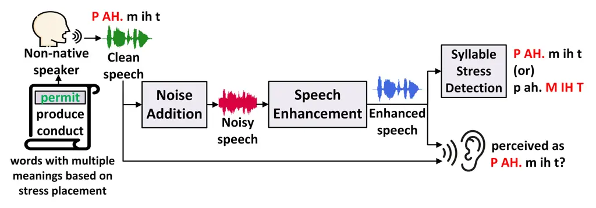
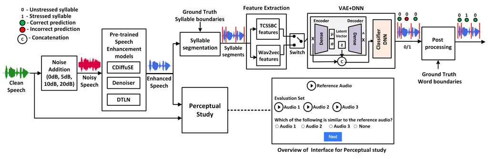

# Evaluating the Impact of Discriminative and Generative E2E Speech Enhancement Models on Syllable Stress Preservation

Rangavajjala Sankara Bharadwaj, Jhansi Mallela, Sai Harshitha Aluru,
Chiranjeevi Yarra Affiliation: Language Technology Research Centre,
International Institute of Information Technology, Hyderabad, India  
bharadwajsankara@gmail.com, jhansi.mallela@research.iiit.ac.in,
chiranjeevi.yarra@iiit.ac.in

###### Abstract

Automatic syllable stress detection is a crucial component in
Computer-Assisted Language Learning (CALL) systems for language
learners. Current stress detection models are typically trained on clean
speech, which may not be robust in real-world scenarios where background
noise is prevalent. To address this, speech enhancement (SE) models,
designed to enhance speech by removing noise, might be employed, but
their impact on preserving syllable stress patterns is not well studied.
This study examines how different SE models, representing discriminative
and generative modeling approaches, affect syllable stress detection
under noisy conditions. We assess these models by applying them to
speech data with varying signal-to-noise ratios (SNRs) from 0 to 20 dB,
and evaluating their effectiveness in maintaining stress patterns.
Additionally, we explore different feature sets to determine which ones
are most effective for capturing stress patterns amidst noise. To
further understand the impact of SE models, a human-based perceptual
study is conducted to compare the perceived stress patterns in
SE-enhanced speech with those in clean speech, providing insights into
how well these models preserve syllable stress as perceived by
listeners. Experiments are performed on English speech data from
non-native speakers of German and Italian. And the results reveal that
the stress detection performance is robust with the generative SE models
when heuristic features are used. Also, the observations from the
perceptual study are consistent with the stress detection outcomes under
all SE models.

###### Index Terms: 

Syllable stress detection, Speech enhancement models

## I Introduction

Human-computer interaction (HCI) systems have become integral to
everyday life, relying heavily on the clarity and precision of spoken
language to function effectively. Among the various elements of spoken
language, syllable stress plays a crucial role in shaping meaning,
particularly in stress-timed languages like English. For instance, in
the word permit with the syllable sequence p ah - m ih t, placing stress
on the first syllable indicates a noun, while stressing the second
syllable indicates a verb. Native English speakers naturally acquire the
skill of placing stress, but non-native speakers often struggle with
syllable stress due to the influence of their first language. To assist
non-native speakers, Computer-Assisted Language Learning (CALL) systems
\[1\] have been developed to automatically detect stress patterns in
syllables and provide guidance. For these systems to be effective, the
stress detection module must be highly robust to ensure accurate
guidance \[2\]. However, since these modules are typically trained on
clean, conditioned data, they can be prone to errors in noisy,
real-world environments, which are often unavoidable.

To address the challenge of noise in real-world environments, two
strategies can be employed: (1) training models with extensive, diverse
noisy data to build robustness against noise, or (2) removing the noise
from the speech before using for the downstream task. The first approach
is often impractical due to its high computational cost, so in the
literature, many systems prefer the second approach, known as speech
enhancement. Speech enhancement (SE) is a process that improves speech
quality and intelligibility by mitigating noise or reverberation \[3\].
It is commonly used as a preprocessing step in applications such as
automatic speech recognition (ASR), speech emotion recognition (SER),
and automatic speaker verification (ASV) to enhance performance \[4, 5,
6\]. However, SE models face challenges related to latency, speech
quality preservation, and model complexity. To address these, several
approaches have been proposed in the literature, utilizing various
modeling techniques each prioritizing different aspects while balancing
trade-offs between computational efficiency, speech clarity, and
real-time performance.

Fig. 1: Overview of the proposed approach for evaluating the impact of
speech enhancement in syllable stress preservation

Despite significant research on speech enhancement (SE) models in
various speech-related tasks, their effect on syllable stress patterns
has not been thoroughly examined. It remains uncertain how noise
distorts these patterns and to what extent SE models are capable of
preserving the original stress in speech. Syllable stress is a key
aspect in English, where every word has one syllable that is more
prominent or relatively emphasized than any other syllable in the same
word. Automatic syllable stress detection involves classifying syllables
into two categories (stressed/unstressed), making it a two-class
classification problem. Several approaches for syllable stress detection
have been proposed, primarily leveraging stress cues such as pitch,
intensity, and duration \[7, 8\]. Many machine learning (ML) models like
boosting, bagging, decision trees, and support vector machines were used
over the acoustic features computed on these stress cues for stress
detection task \[9\]. An attention-based neural network combined with
bidirectional LSTMs was used for stress detection, leveraging Mel
frequency cepstral coefficients (MFCCs), energy, and pitch features
\[10\]. Ruan et al. \[11\] utilized a transformer network for stress
detection, while Mallela et al. \[12\] introduced a novel methodology
with a joint optimization technique using variational autoencoders. All
these studies have demonstrated the effectiveness of these methods under
clean speech conditions. However, the challenge of accurately detecting
stress patterns in noisy conditions and the effect of SE models in
retaining stress cues is still not addressed.

The primary objectives of this study are to: 1) assess the performance
of syllable stress detection under noisy conditions across various
signal-to-noise ratios (SNRs), 2) evaluate the effectiveness of
different state-of-the-art speech enhancement (SE) models in preserving
stress patterns amidst noise and their impact on stress detection
accuracy, and 3) conduct a perceptual study to determine whether
automatic stress detection results align with human perception-based
outcomes. In this study, we address these objectives by exploring the
effects of Gaussian noise at varying SNR levels using three
state-of-the-art SE models, namely DTLN, Denoiser and CDiffuSE,
belonging to either discriminative or generative modeling approaches
with each addressing different challenges. We employ a state-of-the-art
approach combining Variational Autoencoder and Deep Neural Networks
(DNN) for automatic syllable stress detection. For experiments, we
utilize the ISLE corpus, which includes polysyllabic English words
spoken by non-native German and Italian speakers. We investigate two
feature sets for stress detection: 1) heuristic-based acoustic and
context features, and 2) self-supervised representations from
wav2vec-2.0. From the experimental results, we observe that the stress
detection performance is significantly degraded when self-supervised
representations are used compared to heuristic-based features under 0
and 5 dB SNRs with respect to clean condition for both noisy and
enhanced audios. Between discirminative and generative SE models, the
later one consistently outperformed the former one under almost all SNR
conditions. Further, the results from the perceptual study align with
the automatic syllable stress detection outcomes across all three SE
models.

## II Dataset

For this study, we utilize two datasets from the ISLE corpus: 1) German:
This dataset includes 3,733 speech recordings from 23 non-native English
speakers of German origin, and 2) Italian: This dataset comprises 3,981
speech recordings from 23 non-native English speakers of Italian origin.

Data Processing: Phoneme alignments for both datasets are first computed
using an automatic force alignment process. These alignments are then
meticulously reviewed and corrected by a team of five linguists to
ensure accuracy. Next, syllable alignments are derived from the phoneme
alignments using the P2TK syllabification tool. The same group of
linguists annotates syllable stress, ensuring that every word contains
exactly one stressed syllable. Train and test sets are partitioned
considering speaker nativity, age, gender, and language proficiency, to
maintain a balanced distribution of stressed and unstressed syllables
across both the sets \[13\]. We consider only polysyllabic words with
two or more syllables for the experiments following the work in \[14,
12\].

Fig. 2: Block diagram demonstrating automatic syllable stress detection
and perceptual study conducted on SE-enhanced speech. The dotted line
connects to the overview of the interface used for the perceptual study.

## III Methodology

In this section, we first describe the pipeline for the stress detection
task and how it is structured to integrate various speech enhancement
(SE) models. We then outline the specific SE models considered in this
study. Finally, we explain the procedure for the perceptual study, which
we conduct separately to explore the relationship between human
perception outcomes and the automatic stress detection results.

### III-A Automatic syllable stress detection:

Figure 2 illustrates the pipeline for the stress detection task. We
start with clean speech signals and generate four sets of noisy data
with the following signal-to-noise ratios (SNRs): 0 dB, 5 dB, 10 dB, and
20 dB, using white Gaussian noise. Each set is processed individually
for the experiments. From these noisy speech signals, we obtain enhanced
speech signals using three different SE models: CDiffuSE, Denoiser, and
DTLN, which we discuss further. Next, we perform syllable segmentation
on each speech signal using syllable timestamps. For each syllable
segment, we extract syllable-level features, which are then used to
build a syllable stress detection classifier. As shown in the Figure 2,
we consider two different set of features for the stress detection
task, 1. Heuristic-based acoustic and context features and 2.
Self-supervised representations (wav2vec 2.0). Finally, a postprocessing
step ensures that each word contains only one stressed syllable.

#### III-A1 Heuristic-based acoustic and context features

Syllable stress typically relies on three prominence measures:
intensity, duration, and pitch, centered around the most sonorous sound
unit in the syllable. In the literature, acoustic features were derived
from contours like short-time energy, representing the intensity related
measures. However, short-time energy contours can vary greatly across
unstressed syllables and may introduce peaks due to surrounding sounds
\[14\]. To address this, a sonority-based contour is proposed by
combining sonority-motivated cues \[14\] with the short-time energy
contour. Inspired by the work in \[14\], we compute 19-dimensional
statistical features, referred to as acoustic features (A). Further, in
literature, it was stated that context significantly influences stress
perception. In \[15\], a 19-dimensional binary context feature vector is
proposed for each syllable, capturing information about the syllable
nucleus type, the preceding and following phoneme categories, and the
word’s position relative to pauses in the sentence.

#### III-A2 Self-supervised representations (wav2vec 2.0)

Recently, self-supervised models such as wav2vec 2.0 \[16\] and HuBERT
\[17\] have gained considerable attention for their ability to learn
robust speech representations without the need for manual labeling.
Among these, wav2vec 2.0 is particularly notable for its effectiveness
across a range of speech tasks. It excels in capturing spectral,
phonetic, speaker, and semantic features from raw speech data \[18,
19\]. Recently, it has been shown that wav2vec 2.0 features are able to
capture the stress patterns as well \[20\]. Following that, in this
work, we leverage the 768-dimensional features extracted from wav2vec
2.0 for our experiments. Typically, wav2vec 2.0 features are obtained at
the frame level. For our analysis, we aggregate these frame-level
features to the syllable level by averaging them based on the syllable
start and end timestamps.

### III-B Speech Enhancement models (SE):

Most early works of SE are formulated in the time-frequency
(spectrogram) domain and aim to approximate the clean spectrogram, from
which they obtain the enhanced speech signal using the inverse
short-time Fourier transform (iSTFT). However, the STFT is a generic
transformation that may not be optimal for this task, and inaccuracies
in phase reconstruction can limit the quality of the enhanced audio
\[21\]. Adressing this, several methods have been developed that learn
representations directly from raw speech signals using deep learning
\[22, 23, 24\]. While these approaches avoid some issues of
spectrogram-based methods, they can still introduce unpleasant speech
distortions and phonetic inaccuracies \[25\]. In contrast, diffusion
models, a category of generative modeling, progressively denoise and
refine the speech signal through iterative steps. This method enhances
speech quality and naturalness while effectively reducing noise, making
diffusion models particularly promising for challenging enhancement
scenarios.

In this study, we consider three state-of-the-art speech enhancement
models for noise removal in the automatic syllable stress detection
task, considering factors such as latency, model complexity, speech
quality, and the type of modeling (discriminative vs. generative). These
details are provided as follows:

#### III-B1 Dual-Signal Transformation LSTM Network (DTLN)

The Dual-Signal Transformation LSTM Network (DTLN), categorized as a
discriminative model, is introduced in \[26\] for real-time speech
enhancement (one frame in, one frame out). This model combines the
short-time Fourier transform (STFT) with a learned analysis and
synthesis basis in a stacked-network architecture, using fewer than one
million parameters. With its low complexity and low latency due to the
frame-by-frame processing, DTLN is suitable for real-time applications.
Despite its simplicity, it is claimed that DTLN achieves high speech
quality by efficiently extracting information from magnitude spectra and
incorporating phase information from the learned feature basis. It is
trained on 500 hours of noisy speech from the Librispeech corpus \[27\],
and the added noise signals are from Audioset \[28\], Freesound, and
DEMAND corpus \[29\] with SNR levels ranging from -5 to 25 dB.

#### III-B2 DEMUCS-based real-time speech enhancement (Denoiser)

DEMUCS, which falls under the discriminative model category, is a novel
architecture originally proposed for music source separation in \[30\].
To overcome the limitations of Conv-Tasnet \[21\], which is the
state-of-the-art approach for speech enhancement via noise removal,
\[31\] proposed a real-time version of the DEMUCS architecture adapted
for speech enhancement. It consists of a causal model based on
convolutions and LSTMs, with a frame size of 40 ms and a stride of 16
ms. This results in moderate complexity but retains low latency for
real-time applications. DEMUCS operates directly on waveforms, which
enhances speech quality, especially when dealing with complex audio
signals, due to its hierarchical generation and U-Net-like \[21\] skip
connections. The model is trained for 400 epochs on the Valentini
dataset \[32\] and for 250 epochs on the DNS dataset \[33\].

#### III-B3 Conditional diffusion probabilistic model (CDiffuSE)

The Conditional Diffusion Probabilistic Model (CDiffuSE), a generative
model, leverages diffusion probabilistic methods for speech enhancement
\[34\]. It converts clean data into an isotropic Gaussian distribution
through a step-by-step process and then restores the clean input by
removing noise iteratively. While vanilla diffusion models assume
isotropic Gaussian noise, CDiffuSE, as proposed by \[25\], adapts to
non-Gaussian noise characteristics for better real-world performance.
While this approach provides high speech quality, it comes at the cost
of high complexity and higher latency due to the iterative process
required to remove noise. CDiffuSE model is trained on on the
VoiceBank-DEMAND dataset \[35\] which consists of 30 speakers from the
VoiceBank corpus \[36\]. And, it is shown that CDiffuSE maintains strong
performance when regression-based approaches such as Demucs \[31\] and
Conv-TasNet \[21\] collapse.

### III-C Perceptual study:

In English, many words belong to two grammatical categories depending on
the placement of syllable stress. For instance, words like ‘permit,
produce’ can function as either a noun or a verb based on whether the
stress falls on the first or second syllable. To evaluate how well
SE-enhanced audio preserves syllable stress patterns, we conduct a
perceptual study with 25 subjects, aged 20-25, fluent in English.
Subjects assess 50 audio samples (25-GER and 25-ITA), each representing
a word that can belong to two grammatical categories depending on the
placement of stress. This study involves the subjects to identify the
best match between clean and the respective three enhanced audios in
terms of stress placement by asking them to listen to those audios. The
main objectives of this perceptual study are: 1) To identify which SE
model most effectively retains stress patterns in enhanced audio, and 2)
To investigate if the SE model that achieves the highest accuracy in
automatic stress detection also produces enhanced audio that listeners
find most similar to the clean reference. This comparison helps evaluate
whether SE models that excel in automatic detection also effectively
preserve stress patterns in a way that aligns with human perception.

## IV Experimental setup

For experiments of automatic syllable stress detection, following the
work in \[20\], we consider both heuristics-based acoustic and context
features (38-dimension) and self-supervised wav2vec 2.0 representations
(768-dimension). In this study, we implement the state-of-the-art
approach that jointly optimize VAE and DNN for syllable stress detection
as proposed in \[12\]. This method leverages the VAE’s capability to
learn comprehensive data distributions and generate meaningful latent
representations, while the DNN focuses on extracting task-specific
implicit representations. We use a 5-fold cross-validation approach,
where the training set is split into five equally sized groups with
balanced stressed and unstressed syllables. In each fold, four groups
are used for training and one for validation, rotating in a round-robin
fashion. Both training and testing sets are normalized using the mean
and standard deviation from the training set, and performance is
evaluated based on the average classification accuracy across the five
folds. Architecture details: VAE consists of 1 hidden layer each in
encoder and decoder with Relu activation function. DNN model is built
with 5 layers \[hidden units: 64, 32, 16, 4, 1\]. All the DNN and VAE
parameters like number of layers, and number of nodes in each layer are
optimal and we choose them by maximizing the performance on the
validation set.

## V Results and Discussion

. Acoustic + Context Condition SNR 0 dB 5 dB 10 dB 20 dB GER Noisy 92.48
(89) 92.6 (89.22) 92.86 (89.78) 92.94 (90.02) Diffusion 92.65 (89.3)
92.75 (89.5) 92.9 (89.9) 93.55 (90.5) Denoiser 92.2 (88.8) 92.6 (89.25)
92.9 (89.5) 93.4 (89.95) DTLN 91.8 (88.2) 92.1 (88.7) 92.35 (89.3) 92.6
(89.7) ITA Noisy 92.3 (88.92) 92.58 (89.22) 92.86 (89.24) 92.46 (89.4)
Diffusion 92.4 (88.95) 92.65 (89.25) 92.89 (89.5) 93 (89.55) Denoiser
90.3 (85.75) 90.8 (86.35) 91.1 (87.2) 91.45 (87.5) DTLN 90.45 (85.8)
90.95 (86) 91.15 (86.8) 91.3 (87.1)

TABLE I: Classification accuracies with and without (in brackets)
postprocessing, using acoustic and context features, for speech
processed by different SE models under various SNR conditions.
Accuracies for GER and ITA clean data are 93.36 (90.42) and 92.54
(89.36) respectively

In this section, we first compare the performance of three different SE
models (CDiffuSE, Denoiser, and DTLN) for the task of stress detection.
The evaluations are carried out on both the GER and ITA datasets across
four different signal-to-noise ratio (SNR) levels. Following the SE
models comparison, we present and discuss the classification accuracies
obtained, highlighting the impact of each feature set. Subsequently, we
discuss the results of the perceptual study to verify if the patterns
observed in the automatic stress detection models align with human
perception.

### V-A Comparison of different SE models:

This comparison is conducted using both sets of features

#### V-A1 Heuristics-based features

Table presents the classification accuracies obtained from noisy and
enhanced audio processed by different SE models, with and without
post-processing (values in brackets). These accuracies were measured
using a VAE+DNN classifier with acoustic and contextual features. The
results show that the addition of noise slightly affects stress
detection performance in both the GER and ITA datasets. However, the
impact of noise on the computation of acoustic features is not
substantial, resulting in accuracies that are nearly on par with those
obtained from clean audio. When using the Denoiser and DTLN SE models,
there is a noticeable degradation in performance after enhancement,
observed across all SNR levels. This degradation is especially evident
in the ITA dataset, where the drop in accuracy is more significant.
Interestingly, the CDiffuSE model exhibits a different trend. Despite
the presence of noise, the CDiffuSE model not only preserves but
actually improves stress detection performance compared to clean audio.
This improvement may be attributed to the model’s ability to effectively
enhance the audio while retaining and possibly accentuating
stress-related features, leading to superior classification outcomes.
This suggests that the CDiffuSE model is particularly well-suited for
this task, outperforming the other SE models in maintaining and
enhancing stress properties in the audio.

#### V-A2 Self-supervised representations (wav2vec 2.0)

Table presents the classification results using wav2vec 2.0 features
under both noisy and speech-enhanced conditions using VAE+DNN as
classifier for stress detection task. The results show that the
degradation in performance using wav2vec 2.0 features due to noise is
significantly greater compared to the acoustic and context features.
Although wav2vec 2.0 is generally reported in the literature to
outperform acoustic and contextual features, the presence of noise
severely impacts its feature extraction process, which in turn affects
the stress detection accuracy. This indicates that wav2vec 2.0 features
are more susceptible to noise and less robust in low SNR conditions.
However, as the SNR increases, the performance of noisy data processed
with wav2vec 2.0 features surpasses that of acoustic features. After
applying speech enhancement, all SE models show an improvement over the
noisy data. Among the SE models, the CDiffuSE model performs the best in
3 out of 4 scenarios for GER and in 2 out of 4 cases for ITA. This
suggests that while wav2vec 2.0 features are sensitive to noise, their
performance can be significantly enhanced with effective noise reduction
techniques, particularly using the CDiffuSE model. Further, it is
observed that the effect of postprocessing is more in 0 dB scenario in
both GER and ITA which once again proves the drastic decline of the
wav2vec 2.0 feature performance in low SNR scenarios in the stress
detection task.

. Wave2vec 2.0 Condition SNR (dB) 0 dB 5 dB 10 dB 20 dB GER Noisy 87.12
(82.1) 91.52 (87.9) 93.72 (91.38) 94.34 (92.16) Diffusion 89.4 (85.2)
93.2 (90.26) 94.23 (91.64) 94.8 (92.9) Denoiser 91.42 (87.46) 92.9
(90.1) 94.1 (91.58) 94.3 (91.8) DTLN 89.18 (84.46) 92.5 (88.7) 93.5
(90.9) 94.1 (91.7) ITA Noisy 85.96 (79.9) 91.4 (86.32) 93.3 (89.32)
94.28 (91.44) Diffusion 90.3 (86.8) 91.8 (88) 93.4 (89.5) 94.5 (91.8)
Denoiser 91.4 (86.64) 92.74 (88.76) 92.9 (89.08) 94.22 (89.38) DTLN
86.48 (81.24) 91.34 (86.38) 92.6 (88.62) 93.72 (90.7)

TABLE II: Classification accuracies with and without (in brackets)
postprocessing, using wav2vec 2.0 features, for speech processed by
different SE models under various SNR conditions. Accuracies for GER and
ITA clean data are 94.38 (91.62) and 93.63 (91.23) respectively

. ITA GER Perceptual Study Accuracy Perceptual Study Accuracy Diffusion
45.91% 82.65% 37.60% 76.86% Denoiser 30.34% 66.92% 34.88% 72.62% DTLN
23.75% 63.88% 27.52% 67.95%

TABLE III: Perceptual study based similarity statistics of speech
processed SE models (CDiffuSE, Denoiser, and DTLN) with clean speech

### V-B Perceptual study results:

Table III presents the results of both the perceptual study and the
automatic syllable stress detection performance on the sub-set used in
the study for three different speech enhancement (SE) models. The
perceptual study results show the percentage of enhanced audio samples
rated as most similar to the clean reference audio, while the accuracy
values represent the performance of the VAE+DNN model on the same set of
enhanced audio samples. The perceptual study reveals that
CDiffuSE-enhanced audio achieved the highest similarity to clean audio,
with DTLN showing the lowest similarity. This trend is also reflected in
the classification accuracies from the stress detection task. For the
ITA dataset, CDiffuSE-enhanced audio reached an accuracy of 82.65%,
outperforming Denoiser (66.92%) and DTLN (63.88%). In the GER dataset,
CDiffuSE also led with an accuracy of 76.86%, followed by Denoiser at
72.62% and DTLN at 67.95%. The lower accuracy in the GER dataset
suggests that SE models negatively affect stress detection more in this
dataset compared to ITA, highlighting the difficulties in enhancing
speech for stress detection under noisy conditions for certain
languages.

## VI Conclusion

In this study, we evaluated the impact of three different SE models
(DTLN, Denoiser, and CDiffuSE) in preserving the stress cues for the
task of automatic syllable stress detection under noisy conditions
(gaussian noise with different SNRs). We also conducted a perceptual
study to determine which SE model produces enhanced audio without
introducing artifacts that could alter the word’s meaning (which can
belong to multiple grammatical categories based on stress placement) and
remains similar to the clean audio. Experiments are performed on ISLE
corpus of non-native speakers (German, and Italian) speaking English. We
considered two sets of features, 1) heuristic-based features, and 2)
self-supervised representations (wav2vec 2.0). From the experimental
results, stress detection performance remains robust when heuristic
features are used compared to self-supervised features. Further, it is
observed that audios enhanced with the SE model belonging to generative
modeling category (CDiffuSE) outperforms the discriminative SE models
(DTLN and Denoiser) for stress detection task. And this pattern of
performance is similar in perceptual study outcomes as well.

## References

- \[1\] M Levy, Computer-assisted language learning: Context and
  conceptualization, Oxford University Press, 1997.
- \[2\] Luciana Ferrer, Harry Bratt, Colleen Richey, Horacio Franco,
  Victor Abrash, and Kristin Precoda, “Classification of lexical stress
  using spectral and prosodic features for computer-assisted language
  learning systems,” Speech Communication, vol. 69, pp. 31–45, 2015.
- \[3\] Jacob Benesty, Shoji Makino, and Jingdong Chen, Speech
  enhancement, Springer Science & Business Media, 2006.
- \[4\] Felix Weninger, Hakan Erdogan, Shinji Watanabe, Emmanuel
  Vincent, Jonathan Le Roux, John R Hershey, and Björn Schuller, “Speech
  enhancement with lstm recurrent neural networks and its application to
  noise-robust ASR,” in Latent Variable Analysis and Signal Separation:
  12th International Conference, LVA/ICA 2015, Liberec, Czech Republic,
  August 25-28, 2015, Proceedings 12. Springer, 2015, pp. 91–99.
- \[5\] Andreas Triantafyllopoulos, Gil Keren, Johannes Wagner, Ingmar
  Steiner, and Björn Schuller, “Towards robust speech emotion
  recognition using deep residual networks for speech enhancement,” 2019.
- \[6\] Daniel Michelsanti and Zheng-Hua Tan, “Conditional generative
  adversarial networks for speech enhancement and noise-robust speaker
  verification,” arXiv preprint arXiv:1709.01703, 2017.
- \[7\] Rodolfo Delmonte, Mirela Petrea, and Ciprian Bacalu, “SLIM
  prosodic module for learning activities in a foreign language,” in
  Fifth European Conference on Speech Communication and
  Technology, 1997.
- \[8\] Joseph Tepperman and Shrikanth Narayanan, “Automatic syllable
  stress detection using prosodic features for pronunciation evaluation
  of language learners,” in International Conference on Acoustics,
  Speech, and Signal Processing. IEEE, 2005, vol. 1, pp. 937–940.
- \[9\] David O Johnson and Okim Kang, “Automatic prominent syllable
  detection with machine learning classifiers,” International Journal of
  Speech Technology, 2015, vol. 18, no. 4, pp. 583–592.
- \[10\] Tian Xia, Xianfeng Rui, Chien Lin Huang, Iek Heng Chu, Shaojun
  Wang, and Mei Han, “An Attention Based Deep Neural Network for
  Automatic Lexical Stress Detection,” in Global Conference on Signal
  and Information Processing (GlobalSIP). IEEE, 2019, pp. 1–5.
- \[11\] Yong Ruan, Xiangdong Wang, Hong Liu, Zhigang Ou, Yun Gao,
  Jianfeng Cheng, and Yueliang Qian, “An end-to-end approach for lexical
  stress detection based on transformer,” arXiv preprint
  arXiv:1911.04862, 2019.
- \[12\] Jhansi Mallela, Prasanth Sai Boyina, and Chiranjeevi Yarra, “A
  comparison of learned representations with jointly optimized vae and
  dnn for syllable stress detection,” in International Conference on
  Speech and Computer. Springer, 2023, pp. 322–334.
- \[13\] Wolfgang Menzel, Eric Atwell, Patrizia Bonaventura, Daniel
  Herron, Peter Howarth, Rachel Morton, and Clive Souter, “The ISLE
  corpus of non-native spoken English,” in Proceedings of LREC: Language
  Resources and Evaluation Conference, vol. 2. European Language
  Resources Association, 2000, pp. 957–964.
- \[14\] Chiranjeevi Yarra, Om D Deshmukh, and Prasanta Kumar Ghosh,
  “Automatic detection of syllable stress using sonority based
  prominence features for pronunciation evaluation,” in International
  Conference on Acoustics, Speech and Signal Processing (ICASSP). IEEE,
  2017, pp. 5845–5849.
- \[15\] Chiranjeevi Yarra, Manoj Kumar Ramanathi, and Prasanta Kumar
  Ghosh, “Comparison of automatic syllable stress detection quality with
  time-aligned boundaries and context dependencies,” in SLaTE, 2019, pp.
  79–83.
- \[16\] Alexei Baevski, Yuhao Zhou, Abdelrahman Mohamed, and Michael
  Auli, “wav2vec 2.0: A framework for self-supervised learning of speech
  representations,” Advances in neural information processing systems,
  vol. 33, pp. 12449–12460, 2020.
- \[17\] Wei-Ning Hsu, Benjamin Bolte, Yao-Hung Hubert Tsai, Kushal
  Lakhotia, Ruslan Salakhutdinov, and Abdelrahman Mohamed, “Hubert:
  Self-supervised speech representation learning by masked prediction of
  hidden units,” Transactions on Audio, Speech, and Language Processing
  (ACM), vol. 29, pp. 3451–3460, 2021.
- \[18\] Mayank Sharma, “Multi-lingual multi-task speech emotion
  recognition using wav2vec 2.0,” in International Conference on
  Acoustics, Speech and Signal Processing (ICASSP). IEEE, 2022, pp.
  6907–6911.
- \[19\] Yingzhi Wang, Abdelmoumene Boumadane, and Abdelwahab Heba, “A
  fine-tuned wav2vec 2.0/hubert benchmark for speech emotion
  recognition, speaker verification and spoken language understanding,”
  arXiv preprint arXiv:2111.02735, 2021.
- \[20\] Jhansi Mallela, Sai Harshitha Aluru, and Chiranjeevi Yarra,
  “Exploring the use of self-supervised representations for automatic
  syllable stress detection,” in 2024 National Conference on
  Communications (NCC). IEEE, 2024, pp. 1–6.
- \[21\] Yi Luo and Nima Mesgarani, “Conv-tasnet: Surpassing ideal
  time–frequency magnitude masking for speech separation,” IEEE/ACM
  transactions on audio, speech, and language processing, vol. 27, no.
  8, pp. 1256–1266, 2019.
- \[22\] Yi Luo and Nima Mesgarani, “Real-time single-channel
  dereverberation and separation with time-domain audio separation
  network.,” in Interspeech, 2018, pp. 342–346.
- \[23\] Olaf Ronneberger, Philipp Fischer, and Thomas Brox, “U-net:
  Convolutional networks for biomedical image segmentation,” in Medical
  image computing and computer-assisted intervention–MICCAI 2015: 18th
  international conference, Munich, Germany, October 5-9, 2015,
  proceedings, part III 18. Springer, 2015, pp. 234–241.
- \[24\] Yi Luo and Nima Mesgarani, “Tasnet: time-domain audio
  separation network for real-time, single-channel speech separation,”
  in 2018 IEEE International Conference on Acoustics, Speech and Signal
  Processing (ICASSP). IEEE, 2018, pp. 696–700.
- \[25\] Yen-Ju Lu, Zhong-Qiu Wang, Shinji Watanabe, Alexander Richard,
  Cheng Yu, and Yu Tsao, “Conditional diffusion probabilistic model for
  speech enhancement,” in ICASSP 2022-2022 IEEE International Conference
  on Acoustics, Speech and Signal Processing (ICASSP). IEEE, 2022, pp.
  7402–7406.
- \[26\] Nils L Westhausen and Bernd T Meyer, “Dual-signal
  transformation lstm network for real-time noise suppression,” arXiv
  preprint arXiv:2005.07551, 2020.
- \[27\] Vassil Panayotov, Guoguo Chen, Daniel Povey, and Sanjeev
  Khudanpur, “Librispeech: an asr corpus based on public domain audio
  books,” in 2015 IEEE international conference on acoustics, speech and
  signal processing (ICASSP). IEEE, 2015, pp. 5206–5210.
- \[28\] Jort F Gemmeke, Daniel PW Ellis, Dylan Freedman, Aren Jansen,
  Wade Lawrence, R Channing Moore, Manoj Plakal, and Marvin Ritter,
  “Audio set: An ontology and human-labeled dataset for audio events,”
  in 2017 IEEE international conference on acoustics, speech and signal
  processing (ICASSP). IEEE, 2017, pp. 776–780.
- \[29\] Joachim Thiemann, Nobutaka Ito, and Emmanuel Vincent, “The
  diverse environments multi-channel acoustic noise database (demand): A
  database of multichannel environmental noise recordings,” in
  Proceedings of Meetings on Acoustics. AIP Publishing, 2013, vol. 19.
- \[30\] Alexandre Défossez, Nicolas Usunier, Léon Bottou, and Francis
  Bach, “Music source separation in the waveform domain,” arXiv preprint
  arXiv:1911.13254, 2019.
- \[31\] Alexandre Defossez, Gabriel Synnaeve, and Yossi Adi, “Real time
  speech enhancement in the waveform domain,” arXiv preprint
  arXiv:2006.12847, 2020.
- \[32\] Cassia Valentini-Botinhao et al., “Noisy speech database for
  training speech enhancement algorithms and tts models,” University of
  Edinburgh. School of Informatics. Centre for Speech Technology
  Research (CSTR), 2017.
- \[33\] Chandan KA Reddy, Vishak Gopal, Ross Cutler, Ebrahim Beyrami,
  Roger Cheng, Harishchandra Dubey, Sergiy Matusevych, Robert Aichner,
  Ashkan Aazami, Sebastian Braun, et al., “The interspeech 2020 deep
  noise suppression challenge: Datasets, subjective testing framework,
  and challenge results,” arXiv preprint arXiv:2005.13981, 2020.
- \[34\] Jascha Sohl-Dickstein, Eric Weiss, Niru Maheswaranathan, and
  Surya Ganguli, “Deep unsupervised learning using nonequilibrium
  thermodynamics,” in International conference on machine learning.
  PMLR, 2015, pp. 2256–2265.
- \[35\] Cassia Valentini-Botinhao, Xin Wang, Shinji Takaki, and Junichi
  Yamagishi, “Investigating RNN-based speech enhancement methods for
  noise-robust text-to-speech.,” in SSW, 2016, pp. 146–152.
- \[36\] Christophe Veaux, Junichi Yamagishi, and Simon King, “The voice
  bank corpus: Design, collection and data analysis of a large regional
  accent speech database,” in 2013 international conference oriental
  COCOSDA held jointly with 2013 conference on Asian spoken language
  research and evaluation (O-COCOSDA/CASLRE). IEEE, 2013, pp. 1–4.
