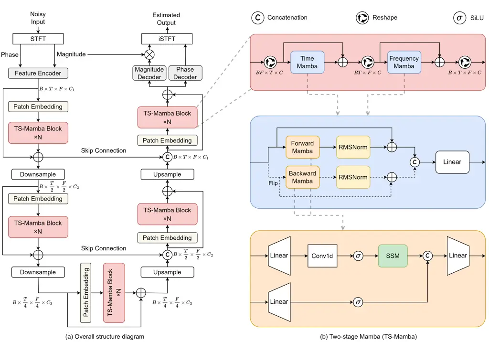

# Mamba-SEUNet: Mamba UNet for Monaural Speech EnhancementThanks: ^(∗)Equal contribution to this work. ^(†)Corresponding author.Thanks: This work was supported by the National Natural Science Foundation of China under Grant 62176182 and U23B2053.

Junyu Wang^(1,∗), Zizhen Lin^(2,∗), Tianrui Wang¹, Meng Ge¹, Longbiao
Wang^(1,3,†), Jianwu Dang⁴ Affiliation:  Affiliation: ¹Laboratory of
Cognitive Computing and Application, College of Intelligence and
Computing, Tianjin University,  
Tianjin, China, ²School of Electronic Information, Sichuan University,
Sichuan, China, ³Huiyan Technology (Tianjin)  
Co., Ltd, Tianjin, China, ⁴Shenzhen Institute of Advanced Technology,
Chinese Academy of Sciences, China Affiliation: 

###### Abstract

In recent speech enhancement (SE) research, transformer and its variants
have emerged as the predominant methodologies. However, the quadratic
complexity of the self-attention mechanism imposes certain limitations
on practical deployment. Mamba, as a novel state-space model (SSM), has
gained widespread application in natural language processing and
computer vision due to its strong capabilities in modeling long
sequences and relatively low computational complexity. In this work, we
introduce Mamba-SEUNet, an innovative architecture that integrates Mamba
with U-Net for SE tasks. By leveraging bidirectional Mamba to model
forward and backward dependencies of speech signals at different
resolutions, and incorporating skip connections to capture multi-scale
information, our approach achieves state-of-the-art (SOTA) performance.
Experimental results on the VCTK+DEMAND dataset indicate that
Mamba-SEUNet attains a PESQ score of 3.59, while maintaining low
computational complexity. When combined with the Perceptual Contrast
Stretching technique, Mamba-SEUNet further improves the PESQ score to
3.73.

###### Index Terms: 

speech enhancement, state space model, deep learning, mamba, u-net.

## I Introduction

Speech enhancement (SE) tasks aim to improve speech clarity by
suppressing background noise, reverberation, and other acoustic
interferences, thereby optimizing user experience and communication
efficacy. In recent years, with the rapid development of deep learning,
a variety of representative neural networks have emerged, especially
those based on convolutional neural networks (CNN) \[1, 2, 3, 4\],
transformers \[5, 6, 7\], and U-Net architectures \[8, 9, 10\].
Generally, depending on the processing method of the input signal, it
can be broadly categorized into time-domain and time-frequency (T-F)
domain approaches.

Time-domain studies enhance noisy speech signals directly in the time
domain, leveraging encoder-decoder frameworks to map noise waveforms to
clean ones \[11, 12\]. While this approach retains all inherent
information features of the time-domain signal, it often results in
relatively coarse enhancements. In contrast, T-F domain SE methods
demonstrate better capabilities in discerning the intricate structural
details between speech and noise \[13, 14, 15\].

The current mainstream SE models primarily employ two-stage (TS)
architectures based on Transformer or its variant, Conformer \[16, 17\].
By learning input features in both time-domain and frequency-domain
representations, these models achieve outstanding SE performance.
However, TS methods typically perform dimensionality reduction only
along the frequency dimension, which makes it difficult to capture the
characteristics of the input information at different resolutions,
thereby constraining their performance ceiling to some extent. Moreover,
the quadratic complexity of the self-attention mechanism with respect to
sequence length poses significant challenges for deploying these models
in scenarios with limited computational resources. Recent research
\[10\] introduced MUSE, a more efficient approach combining
sub-quadratic complexity Taylor multi-head self-attention (T-MSA) \[18\]
with U-Net framework \[19\]. By applying Taylor-Transformer to capture
multi-scale information at different resolutions, MUSE achieves
competitive performance with just 16 input channels and low
computational complexity. However, the SE performance of T-MSA still
falls short when compared to the original multi-head self-attention
(MHSA) mechanism.

In parallel, developments in state-space models (SSM) \[8, 20\] present
a promising alternative with linear complexity and high efficiency in
handling long-sequence inputs. Mamba \[21\], as a novel structured SSM
(S4), introduces a selective processing mechanism for input information
and an efficient hardware-aware algorithm, achieving performance
comparable to or exceeding Transformer-based methods across domains such
as natural language, image, and audio \[22, 23, 24\]. Particularly, a
recent work \[25\] demonstrated improved performance with reduced FLOPs
by simply replacing the conformer in MP-SENet with Mamba, further
validating the effectiveness of Mamba in speech processing tasks.



Fig. 1: The architecture of the proposed Mamba-SEUNet.

Inspired by these studies, we propose Mamba-SEUNet, a model that
integrates Mamba with U-Net. By leveraging TS-Mamba within the U-Net
framework to learn coarse-grained and fine-grained information at
different resolutions and performing multi-scale feature fusion, this
network exhibits enhanced long-range dependency modeling and detail
restoration capabilities. Extensive experiments on the VCTK+DEMAND
dataset \[26\] demonstrate that Mamba-SEUNet achieves state-of-the-art
(SOTA) performance, with a notable reduction in computational complexity
measured in FLOPs.

## II Mamba: Selective State Space Model

As an extension of S4, Mamba introduces a selection mechanism that
enables model parameters to be dynamically adjusted according to the
inputs. This mechanism allows for the selective mapping of the input
$`x(t)`$ through a high-dimensional hidden state $`h(t)`$ to the output
$`y(t)`$, which can be expressed as follows:

```math
\displaystyle h^{\prime}(t) \displaystyle=Ah(t)+Bx(t) \tag{1}
```

```math
\displaystyle y(t) \displaystyle=Ch(t)
```

To apply to discrete speech signals, it is necessary to discretize $`A`$
and $`B`$ in the Eq.1. Specifically, given a time-scale parameter
$`\Delta`$, the discrete parameter can be approximated using a
zero-order hold as follows:

```math
\displaystyle\overline{A}=e^{(\Delta A)},\thickspace\overline{B}=(\Delta A)^{-1}(e^{(\Delta A)}-I)\cdot(\Delta B) \tag{2}
```

Thus Eq.1 can be rewritten as:

```math
\displaystyle h(t) \displaystyle=\overline{A}h(t-1)+\overline{B}x(t) \tag{3}
```

```math
\displaystyle y(t) \displaystyle=\overline{C}h(t)
```

Further expanding the computation in Eq.3 along the sequence, it can be
seen that the output $`y`$ is computed from the input $`x`$ through a
global convolution with kernel $`\overline{K}`$:

```math
\displaystyle\overline{K} \displaystyle=(C\overline{B},\overline{AB},...,C\overline{A}^{L-1}\overline{B}) \tag{4}
```

```math
\displaystyle y \displaystyle=x\ast\overline{K}
```

where $`L`$ is the size of the input sequence.

Additionally, a significant contribution of Mamba is its hardware-aware
algorithm, which enhances the efficiency of model execution on modern
hardware. The core idea is to leverage the memory hierarchy of modern
hardware, such as GPUs, to minimize I/O access between different memory
levels. By executing discrete and recursive operations within the faster
SRAM and returning final results to the slower HBM, the algorithm
significantly reduces computations associated with $`(B,L,D,N)`$, where
$`B`$, $`L`$, $`D`$, and $`N`$ represent the batch size, sequence
length, number of channels, and state dimension respectively, thereby
enhancing computational speed.

## III Methodology

### III-A Architecture Overview

The overall structure of the proposed Mamba-SEUNet is illustrated in
Fig. 1(a). Given the noisy speech input $`y`$, we first apply the
Short-Time Fourier Transform (STFT) to obtain its magnitude spectrum
$`Y_{m}\in\mathbb{R}^{T\times F}`$ and phase spectrum
$`Y_{p}\in\mathbb{R}^{T\times F}`$. These are then combined and
transformed into an intermediate feature space
$`Y\in\mathbb{R}^{T\times F\times C_{1}}`$ via a feature encoder.
Subsequently, these patch features are processed through a series of
TS-Mamba blocks with skip connections, patch embedding layers, and
downsampling and upsampling operations for hierarchical processing at
different resolutions. The patch embedding layers, come from \[18\],
leverage a combination of depthwise separable and deformable
convolutions, enabling the capture of fine-grained acoustic details and
enriching the subsequent TS-Mamba blocks with enhanced feature
representations. The TS-Mamba blocks focus on learning these
representations and capturing time and frequency dependencies. Finally,
the enhanced magnitude and phase spectra are decoded and reconstructed
into the enhanced speech signal using the inverse STFT (ISTFT).

### III-B TS-Mamba Block

We employ time and frequency Mamba blocks sequentially to learn the
comprehensive feature representations, as illustrated in Fig. 1(b). To
effectively capture both global and local information, each Mamba block
incorporates the bidirectional SSM formulation proposed in \[27\],
allowing the model to integrate both past and future information. This
is similar to the forward and backward scanning mechanisms utilized in
BLSTM \[28\]. Specifically, for a given input $`x`$, it is processed in
parallel through both the forward Mamba and backward Mamba.
Post-processing with RMSNorm \[29\] is applied to both the forward and
backward outputs, after which they are concatenated and passed through a
linear layer to obtain the output $`x^{\prime}`$:

```math
\displaystyle x_{f} \displaystyle=RMS(FMamba(x))+x \tag{5}
```

```math
\displaystyle x_{b} \displaystyle=RMS(BMamba(Flip(x)))+x
```

```math
\displaystyle x^{\prime} \displaystyle=Linear(Concat(x_{f},x_{b}))
```

where $`x_{f}`$, $`x_{b}`$, $`RMS`$, $`FMamba`$, $`BMamba`$, $`Flip`$,
and $`Concat`$ denote the forward output, backward output, RMS
normalization, forward Mamba, backward Mamba, flip, and concatenation
operations respectively.

The forward and backward Mamba blocks share an identical structure.
Specifically, for an input sequence $`x_{in}\in\mathbb{R}^{L\times C}`$,
we first apply a linear layer to map it to
$`x^{\prime}_{in}\in\mathbb{R}^{L\times 2C}`$. This is followed by a
convolution operation with a kernel size of 4, coupled with a Sigmoid
Linear Unit (SiLU) activation function. The output on one side
$`x_{1}\in\mathbb{R}^{L\times 2C}`$ is then obtained using the SSM
described in Eq.4. To compensate for any information loss due to the
sequential constraints of the SSM, we add a symmetric gated branch
without convolution and SSM, consisting of an additional linear layer
and SiLU activation. Finally, the outputs from both branches are
concatenated and projected through the last linear layer to obtain the
output $`x_{out}\in\mathbb{R}^{L\times C}`$, as expressed in the
following equation:

```math
\displaystyle x_{1}=SSM(\delta(Conv(Linear(x_{in})))) \tag{6}
```

```math
\displaystyle x_{2}=\delta(Linear(x_{in}))
```

```math
\displaystyle x_{out}=Linear(Concat(x_{1},x_{2}))
```

where $`Conv`$ denotes the 1-D convolution operation, $`\delta`$ is the
SiLU activation function, and $`Concat`$ represents the concatenation
operation.

### III-C Encoder and Decoder

The encoder-decoder framework of Mamba-SEUNet is inspired by the
methodology employed in MP-SENet \[17\]. Its feature encoder consists of
two convolutional layers and a Dilated DenseNet \[30\]. The first
convolutional layer increases the input channels to $`C_{1}`$, producing
an intermediate feature map, while the second halves the frequency
dimension to optimize computational efficiency. In this study, the
Dilated DenseNet is designed with a depth of 4 and a dilation factor of
2 to capture fundamental spectral features of speech. Both the magnitude
and phase decoders incorporate the Dilated DenseNet structure from the
encoder, followed by a 2-D transposed convolution and a $`1\times 1`$
convolution. The primary distinction between the two is the activation
function: the magnitude decoder utilizes a learnable sigmoid function
(L-Sigmoid) \[31\], whereas the phase decoder employs a two-argument
arctangent function (Arctan2) \[17\].

| Model             | Dimension $`C_{1}`$ | Blocks $`N`$ | \# Params |
| ----------------- | ------------------- | ------------ | --------- |
| Mamba-SEUNet (XS) | 16                  | 2            | 0.99M     |
| Mamba-SEUNet (S)  | 16                  | 4            | 1.88M     |
| Mamba-SEUNet (M)  | 24                  | 4            | 3.78M     |
| Mamba-SEUNet (L)  | 32                  | 4            | 6.28M     |

TABLE I: Hyperparameters for the Mamba-SEUNet XS, S, M, and L models

|                   |           |         |         |      |      |      |      |
| ----------------- | --------- | ------- | ------- | ---- | ---- | ---- | ---- |
| Model             | \# Params | FLOPs   | WB-PESQ | STOI | CSIG | CBAK | COVL |
| Noisy             | \-        | \-      | 1.97    | 0.91 | 3.35 | 2.44 | 2.63 |
| MetricGAN+ \[31\] | \-        | \-      | 3.15    | \-   | 4.14 | 3.16 | 3.64 |
| TSTNN \[32\]      | 0.92M     | \-      | 2.96    | 0.95 | 4.33 | 3.53 | 3.67 |
| CMGAN \[16\]      | 1.83M     | 63.15G  | 3.41    | 0.96 | 4.63 | 3.94 | 4.12 |
| DPCFCS-Net \[7\]  | 2.86M     | 130.65G | 3.42    | 0.96 | 4.71 | 3.88 | 4.15 |
| MP-SENet \[17\]   | 2.05M     | 74.29G  | 3.50    | 0.96 | 4.73 | 3.95 | 4.22 |
| MUSE \[10\]       | 0.51M     | 9.43G   | 3.37    | 0.95 | 4.63 | 3.80 | 4.10 |
| S4ND U-Net \[8\]  | 0.75M     | \-      | 3.15    | \-   | 4.52 | 3.62 | 3.85 |
| SEMamba \[25\]    | 2.25M     | 65.46G  | 3.52    | 0.96 | 4.75 | 3.98 | 4.26 |
| Mamba-SEUNet (XS) | 0.99M     | 4.16G   | 3.48    | 0.96 | 4.75 | 3.95 | 4.23 |
| Mamba-SEUNet (S)  | 1.88M     | 4.62G   | 3.54    | 0.96 | 4.77 | 3.98 | 4.28 |
| Mamba-SEUNet (M)  | 3.78M     | 10.28G  | 3.57    | 0.96 | 4.79 | 4.00 | 4.30 |
| Mamba-SEUNet (L)  | 6.28M     | 18.17G  | 3.59    | 0.96 | 4.80 | 4.02 | 4.32 |

TABLE II: Performance comparison on VCTK+DEMAND dataset. ”-” denotes the
data is not provided in the original paper.

## IV Experiments

### IV-A Datasets

We employ the extensively adopted VCTK+DEMAND dataset \[26\] to evaluate
the effectiveness of the proposed method. The clean speech data comes
from the VoiceBank corpus \[33\], while the mixed noise is sourced from
the DEMAND dataset \[34\]. The generated mixed speech dataset includes
12,396 utterances from 30 speakers, with 28 speakers used for training
and 2 for testing. The training and testing sets include 10 types of
noise with signal-to-noise ratios (SNRs) ranging from 0 to 15 dB and 5
types of noise with SNRs from 2.5 to 17.5 dB. All samples are
downsampled to 16 kHz.

### IV-B Experimental setup

During training, the speech data is uniformly segmented into 30600
points. The FFT length is set to 510, with a window length of 510 and a
hop size of 120. The channel numbers $`C_{2}`$ and $`C_{3}`$ are set to
$`\frac{C_{1}}{2}`$ and $`\frac{C_{1}}{3}`$, respestively. All models
are trained for 200 epochs using the AdamW optimization \[35\], with an
initial learning rate of 0.0005, decaying by a factor of 0.99 per epoch.
Table I provides the hyperparameters for the four models.

### IV-C Evaluation metrics

The efficacy of the proposed method is evaluated using various metrics.
(1) Wide-band PESQ metric evaluates speech quality on a score scale from
-0.5 to 4.5 \[36\]. (2) Speech intelligibility is measured by STOI
\[37\], with a score range from 0 to 1. (3) Mean opinion score (MOS)
ratings include CSIG for signal distortion, CBAK for background noise
interference, and COVL for overall speech quality, all rated from 1 to 5. (4) FLOPs are calculated based on processing a 2-second, 16kHz audio
sample on a GPU.

## V Results and analysis

### V-A Performance Comparison with Baselines

Table II presents a performance comparison between the proposed
Mamba-SEUNet and several baseline models on the VCTK+DEMAND dataset.
This comparison includes classical models such as MetricGAN+ and TSTNN,
as well as state-of-the-art (SOTA) models like MP-SENet and SEMamba. The
results indicate that Mamba-SEUNet (XS) achieves performance comparable
to MP-SENet with just 0.99M parameters and 4.16G FLOPs. As the number of
TS-Mamba blocks $`N`$ increases to 4, Mamba-SEUNet (S) surpasses all
existing models with 1.88M parameters and 4.62G FLOPs. By increasing the
number of channels from 16 to 24, an improvement across all evaluation
metrics is observed. Expanding the output dimension of the feature
encoder to 32 further enhances the PESQ score of Mamba-SEUNet (L) to
3.59.

| Model                  | WB-PESQ | STOI | CSIG | CBAK | COVL |
| ---------------------- | ------- | ---- | ---- | ---- | ---- |
| SEMamba + PCS \[25\]   | 3.69    | 0.96 | 4.79 | 3.63 | 4.37 |
| Mamba-SEUNet (S) + PCS | 3.70    | 0.96 | 4.79 | 3.64 | 4.37 |
| Mamba-SEUNet (L) + PCS | 3.73    | 0.96 | 4.82 | 3.67 | 4.40 |

TABLE III: Performance comparison between SEMamba and Mamba-SEUNet with
PCS

To provide a more comprehensive evaluation of model performance, we also
report results using the Perceptual Contrast Stretching (PCS) technique
\[38\], as shown in Table III. PCS, a data preprocessing method, aims to
enhance the perceptual quality of speech signals at the expense of
background noise estimation. The results demonstrate that Mamba-SEUNet
(S), with a similar number of parameters, achieves comparable
performance with significantly lower FLOPs compared to SEMamba. By
further increasing the number of channels, Mamba-SEUNet (L) improves the
PESQ score to 3.73.

| $`N`$ | WB-PESQ | STOI | CSIG | CBAK | COVL | \# Params |
| ----- | ------- | ---- | ---- | ---- | ---- | --------- |
| 1     | 3.46    | 0.96 | 4.71 | 3.92 | 4.20 | 1.11M     |
| 2     | 3.51    | 0.96 | 4.76 | 3.96 | 4.25 | 2.00M     |
| 3     | 3.56    | 0.96 | 4.79 | 3.99 | 4.30 | 2.89M     |
| 4     | 3.57    | 0.96 | 4.79 | 4.00 | 4.30 | 3.78M     |

TABLE IV: Test results for different number of blocks $`N`$ in
Mamba-SEUNet (M).

### V-B Ablation Study

The experiments in Table IV investigate the impact of varying the number
of TS-Mamba blocks $`N`$ within Mamba-SEUNet (M) on SE performance. As
$`N`$ increases from 1 to 3, there is a consistent improvement in
objective performance metrics, including PESQ, STOI, and three MOS
scores, demonstrating the efficacy of adding TS-Mamba blocks in
enhancing speech quality. However, with a further increase in $`N`$ to
4, while some metrics such as PESQ and CBAK exhibit slight improvements,
others remain unchanged, indicating a potential plateau in performance.
Moreover, as $`N`$ increases, the number of model parameters also rises,
highlighting the trade-off between performance gains and model
complexity.

| Model       | WB-PESQ | CSIG | CBAK | COVL | \# Params | FLOPs  |
| ----------- | ------- | ---- | ---- | ---- | --------- | ------ |
| Mamba       | 3.57    | 4.79 | 4.00 | 4.30 | 3.78M     | 10.28G |
| Conformer   | 3.45    | 4.70 | 3.91 | 4.19 | 2.94M     | 34.07G |
| Transformer | 3.52    | 4.76 | 3.96 | 4.25 | 4.55M     | 51.69G |

TABLE V: Performance Comparison of Mamba, Transformer, and Conformer on
the Same Architecture

### V-C Mamba/Transformer/Conformer Block

To ensure a fair comparison of Mamba with conformer and transformer, we
employ the proposed U-Net architecture, replacing TS-Mamba with
TS-Conformer as introduced in \[16\] and TS-Transformer as described in
\[32\], as shown in Table V. The results indicate that Mamba outperforms
conformer, achieving better performance with a slight increase in model
parameters and a significant reduction in FLOPs, with a 0.12 improvement
in the PESQ score. Compared to the transformer, which replaces the first
linear layer in the feedforward network \[39\] with gated recurrent
units (GRU) \[40\] to learn positional information, Mamba exhibits
better performance, with a 0.05 improvement in the PESQ score, while
requiring fewer parameters and lower FLOPs. These findings underscore
the effectiveness of Mamba in SE tasks.

## VI Conclusions

In this study, we introduce Mamba-SEUNet, a U-Net style SE network based
on TS-Mamba blocks. This architecture leverages bidirectional Mamba
blocks to effectively capture both past and future information,
addressing the limitations of existing transformer-based methods. By
integrating TS-Mamba blocks into the U-Net framework, Mamba-SEUNet
enhances multi-scale information capture while maintaining computational
efficiency. Experimental results on the VCTK+DEMAND dataset demonstrate
that Mamba-SEUNet achieves state-of-the-art (SOTA) SE performance with
low computational complexity. In the future, we aim to extend this
network to other SE tasks and further optimize its performance on more
challenging datasets.

## References

- \[1\] Y. Luo and N. Mesgarani, “Conv-Tasnet: Surpassing ideal
  time-frequency magnitude masking for speech separation,” IEEE/ACM
  Transactions on Audio, Speech, and Language Processing, vol. 27, no.
  8, pp. 1256–1266, 2019.
- \[2\] A. Pandey and D. L. Wang, “Densely connected neural network with
  dilated convolutions for real-time speech enhancement in the time
  domain,” in IEEE International Conference on Acoustics, Speech and
  Signal Processing (ICASSP), 2020, pp. 6629–6633.
- \[3\] P. Ku, C. Yang, S. Siniscalchi, and C. Lee, “Time-Frequency
  Mask-based Speech Enhancement using Convolutional Generative
  Adversarial Network,” in Proc. APSIPA ASC, 2018, pp. 1246–1251.
- \[4\] H. Shi, L. Wang, S. Li, J. Dang, and T. Kawahara, “Monaural
  Speech Enhancement Based on Spectrogram Decomposition for
  Convolutional Neural Network-sensitive Feature Extraction,” in Proc.
  INTERSPEECH, 2022, pp. 221–225.
- \[5\] F. Dang, H. Chen, and P. Zhang, “DPT-FSNet: Dual-Path
  Transformer Based Full-Band and Sub-Band Fusion Network for Speech
  Enhancement,” in IEEE International Conference on Acoustics, Speech
  and Signal Processing (ICASSP), 2022, pp. 6857–6861.
- \[6\] G. Yu et al., “Dual-Branch Attention-In-Attention Transformer
  for Single-Channel Speech Enhancement,” in IEEE International
  Conference on Acoustics, Speech and Signal Processing (ICASSP), 2022,
  pp. 7847–7851.
- \[7\] J. Wang, “Efficient Encoder-Decoder and Dual-Path Conformer for
  Comprehensive Feature Learning in Speech Enhancement,” in Proc.
  INTERSPEECH, 2023, pp. 2853–2857.
- \[8\] P. Ku, C. Yang, S. Siniscalchi, and C. Lee, “A Multi-dimensional
  Deep Structured State Space Approach to Speech Enhancement Using
  Small-footprint Models,” in Proc. INTERSPEECH, 2023, pp. 2453–2457.
- \[9\] H. Park, B. Kang, W. Shin, J. Kim, and S. Han, “MANNER:
  Multi-view Attention Network for Noise Erasure,” in IEEE International
  Conference on Acoustics, Speech and Signal Processing (ICASSP), 2022,
  pp. 7842–7846.
- \[10\] Z. Lin, X. Chen, and J. Wang, “MUSE: Flexible Voiceprint
  Receptive Fields and Multi-Path Fusion Enhanced Taylor Transformer for
  U-Net-based Speech Enhancement,” arXiv preprint
  arXiv:2406.04589, 2024.
- \[11\] A. Defossez, G. Synnaeve, and Y . Adi, “Real time speech
  enhancement in the waveform domain,” in Proc. INTERSPEECH, 2020, pp.
  3291–3295.
- \[12\] J. Wang, “An Efficient Speech Separation Network Based on
  Recurrent Fusion Dilated Convolution and Channel Attention,” in Proc.
  INTERSPEECH, 2023, pp. 3699–3703.
- \[13\] T. Wang, W. Zhu, Y. Gao, J. Feng, and S. Zhang, “HGCN: Harmonic
  Gated Compensation Network for Speech Enhancement,” in Proc. ICASSP,
  2022, pp. 371–375.
- \[14\] R. Cao, T. Wang, M. Ge, L. Wang, and J. Dang, “VoiCor: A
  Residual Iterative Voice Correction Framework for Monaural Speech
  Enhancement,” in Proc. INTERSPEECH, 2024, pp. 4858–4862.
- \[15\] N. LI, M. Ge, L. Wang, M. Unoki, S. Li, and J. Dang, “Global
  Signal-to-noise Ratio Estimation Based on Multi-subband Processing
  Using Convolutional Neural Network,” in Proc. INTERSPEECH, 2022, pp.
  361–365.
- \[16\] R. Cao, S. Abdulatif, and B. Yang, “CMGAN: Conformer-based
  Metric GAN for Speech Enhancement,” in Proc. INTERSPEECH, 2022, pp.
  4531–4535.
- \[17\] Y. Lu, Y. Ai, and Z. Ling, “MP-SENet: A Speech Enhancement
  Model with Parallel Denoising of Magnitude and Phase Spectra,” in
  Proc. INTERSPEECH, 2023, pp. 3834–3838.
- \[18\] Y. Qiu, K. Zhang, C. Wang, W. Luo, H. Li, and Z. Jin,
  “MB-TaylorFormer: Multi-Branch Efficient Transformer Expanded by
  Taylor Formula for Image Dehazing,” in Proc. ICCV, 2023, pp.
  12802–12813.
- \[19\] O. Ronneberger, P. Fischer, and T. Brox, “U-net: Convolutional
  networks for biomedical image segmentation,” in International
  Conference on Medical Image Computing and Computer Assisted
  Intervention (MICCAI), 2015, pp. 234–241.
- \[20\] A. Gu, K. Goel, and C. Re, “Efficiently Modeling Long Sequences
  with Structured State Spaces,” in Proc. ICLR, 2022.
- \[21\] A. Gu and T. Dao, “Mamba: Linear-Time Sequence Modeling with
  Selective State Spaces,” arXiv preprint arXiv:2312.00752, 2023.
- \[22\] K. Li and G. Chen, “SPMamba: State-space model is all you need
  in speech separation,” arXiv preprint arXiv:2404.02063, 2024.
- \[23\] Z. Wang, J. Zheng, Y. Zhang, G. Cui, and L. Li, “Mamba-UNet:
  UNet-Like Pure Visual Mamba for Medical Image Segmentation,” arXiv
  preprint arXiv:2402.05079, 2024.
- \[24\] A. Hatamizadeh and J. Kautz, “MambaVision: A Hybrid
  Mamba-Transformer Vision Backbone,” arXiv preprint
  arXiv:2407.08083, 2024.
- \[25\] R. Chao, W. Cheng, M. Quatra, S. Siniscalchi, C. Yang, S. Fu,
  and Y. Tsao, “An Investigation of Incorporating Mamba for Speech
  Enhancement,” arXiv preprint arXiv:2405.06573, 2024.
- \[26\] C. Valentini-Botinhao, X. Wang, S. Takaki, and J. Yamagishi,
  “Investigating RNN-based speech enhancement methods for noise-robust
  text-to-speech,” in Proc. SSW, 2016, pp. 146–152.
- \[27\] L. Zhu, B. Liao, Q. Zhang, X. Wang, W. Liu, and X. Wang,
  “Vision Mamba: Efficient Visual Representation Learning with
  Bidirectional State Space Model,” arXiv preprint
  arXiv:2401.09417, 2024.
- \[28\] S. Zhang, D. Zheng, X. Hu, and M. Yang, “Bidirectional Long
  Short-Term Memory Networks for Relation Classification,” in Proc.
  PACLIC, 2015, pp. 73–78.
- \[29\] B. Zhang and R. Sennrich, “Root Mean Square Layer
  Normalization,” in Proc. NeurIPS, 2019, vol. 32.
- \[30\] H. Gao, L. Zhuang, V. Laurens, and K. Kilian, “Densely
  Connected Convolutional Networks,” in IEEE Conference on Computer
  Vision and Pattern Recognition (CVPR), 2017, pp. 2261–2269.
- \[31\] S. Fu, C. Yu, T. Hsieh, P. Plantinga, M. Ravanelli, X. Lu, and
  Y. Tsao, “MetricGAN+: An Improved Version of MetricGAN for Speech
  Enhancement,” in Proc. INTERSPEECH, 2021, pp. 201–205.
- \[32\] K. Wang, B. He, and W. Zhu, “TSTNN: Two-Stage Transformer Based
  Neural Network for Speech Enhancement in the Time Domain,” in IEEE
  International Conference on Acoustics, Speech and Signal Processing
  (ICASSP), 2021, pp. 7098–7102.
- \[33\] C. Veaux, J. Yamagishi, and S. King, “The voice bank corpus:
  Design, collection and data analysis of a large regional accent speech
  database,” in Proc. O-COCOSDA/CASLRE, 2013, pp. 1–4.
- \[34\] J. Thiemann, N. Ito, and E. Vincent, “The diverse environments
  multi-channel acoustic noise database (DEMAND): A database of
  multichannel environmental noise recordings,” in Proceedings of
  Meetings on Acoustics, 2013, vol. 19, p. 035081.
- \[35\] I. Loshchilov and F. Hutter, “Decoupled Weight Decay
  Regularization,” in International Conference on Learning
  Representations (ICLR), 2019, pp. 1–14.
- \[36\] A. Rix, J. Beerends, M. Hollier, and A. Hekstra, “Perceptual
  evaluation of speech quality (PESQ)-a new method for speech quality
  assessment of telephone networks and codecs,” in IEEE International
  Conference on Acoustics, Speech and Signal Processing (ICASSP), 2001,
  pp. 749–752.
- \[37\] C. H. Taal et al., “An algorithm for intelligibility prediction
  of time-frequency weighted noisy speech,” IEEE/ACM Transactions on
  Audio, Speech, and Language Processing, vol. 19, no. 7, pp.
  2125–2136, 2011.
- \[38\] R. Chao, C. Yu, S. Fu, X. Lu, and Y. Tsao, “Perceptual Contrast
  Stretching on Target Feature for Speech Enhancement,” in Proc.
  INTERSPEECH, 2022, pp. 5448–5452.
- \[39\] A. Vaswani, N. Shazeer, N. Parmar, J. Uszkoreit, L. Jones,
  A. Gomez, L. Kaiser, and I. Polosukhin, “Attention Is All You Need,”
  arXiv preprint arXiv:1706.03762, 2017.
- \[40\] K. Cho, B. Merrienboer, C. Gulcehre, D. Bahdanau, F. Bougares,
  H. Schwenk, and Y. Bengio, “Learning Phrase Representations using RNN
  Encoder–Decoder for Statistical Machine Translation,” in Proc. EMNLP,
  2014, pp. 1724–1734.
