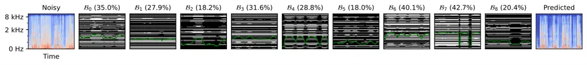
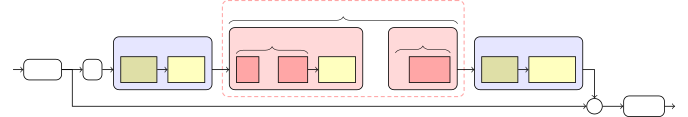
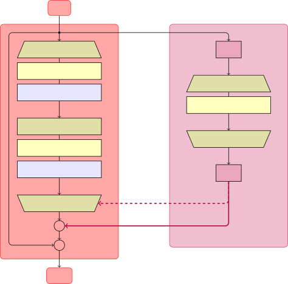

# Scalable Speech Enhancement with Dynamic Channel Pruning

Riccardo Miccini^(⋆†)    Clément Laroche^(⋆)    Tobias Piechowiak^(⋆)   
Luca Pezzarossa^(†)

###### Abstract

Speech Enhancement (SE) is essential for improving productivity in
remote collaborative environments. Although deep learning models are
highly effective at SE, their computational demands make them
impractical for embedded systems. Furthermore, acoustic conditions can
change significantly in terms of difficulty, whereas neural networks are
usually static with regard to the amount of computation performed. To
this end, we introduce Dynamic Channel Pruning to the audio domain for
the first time and apply it to a custom convolutional architecture for
SE. Our approach works by identifying unnecessary convolutional channels
at runtime and saving computational resources by not computing the
activations for these channels and retrieving their filters. When
trained to only use $`25\text{\,}\mathrm{\%}`$ of channels, we save
$`29.6\text{\,}\mathrm{\%}`$ of MACs while only causing a
$`0.75\text{\,}\mathrm{\%}`$ drop in PESQ. Thus, DynCP offers a
promising path toward deploying larger and more powerful SE solutions on
resource-constrained devices.

###### Index Terms: 

Speech Enhancement, Dynamic Neural Networks, Edge AI

^(†)^(†)address: ^(⋆) GN Audio  ^(†) Technical University of
Denmark^(†)^(†) This work has received funding from the European Union’s
Horizon research and innovation program under grant agreement No 101070374.



Figure 1: Noisy input, channel states, and predicted speech computed
from an $`8\text{\,}\mathrm{s}`$ sample; x-axis shows time, y-axis shows
frequency for spectrograms and channel index for $`\mathcal{B}_{i}`$;
white channels are kept, black channels are omitted; green lines and
titles indicate the instantaneous and average pruning ratio for the
given block, respectively.

## 1 Introduction

Real-time speech enhancement (SE) and noise suppression can facilitate
communication in noisy environments and have become ubiquitous in
devices such as speakerphones, earbuds, and headsets. Thanks to the
recent advances in deep learning, SE solutions based on neural networks
made considerable strides, surpassing digital signal processing
techniques in effectiveness \[1, 2\]. However, the constraints of the
aforementioned embedded devices (in terms of energy, memory, and
computation) are often too stringent to support state-of-the-art SE
solutions based on deep learning. In particular, when deploying SE
models on embedded devices, engineers and practitioners must not only
comply with the constraints of the target platform but also try to
maximize battery life, which further limits the computational complexity
of the model, further compromising its effectiveness. An undesired
outcome of this design-time trade-off is that the deployed model may be
inadequate or redundant, depending on the current acoustic conditions,
which vary significantly in the real-world.

In this paper, we seek to postpone the trade-off between effectiveness
and computational efficiency to inference time and outsource it to the
model itself. To this end, we train our model so that it can modulate
the amount of computation performed based on the current input data.
This is similar to how humans use more cognitive resources to perform
more difficult tasks and is an active area of research within the realm
of Dynamic Neural Networks (DynNNs) \[3\]. Under the right
circumstances, a DynNN may skip parts of its computational graph and
incur substantial savings in terms of computational resources such as
memory transfers or arithmetic operations.

Previous works in the audio domain explored dynamism along the model
depth, represented by the number of computational blocks in the
graph \[4, 5, 6\], as well as width — i.e. the number of convolutional
channels in the intermediate activations \[7\]. In our work, we take a
more fine-grained approach to width-based dynamism by allowing the model
to select or exclude individual convolutional filters, thereby saving
the computational costs associated with retrieving the weights of the
omitted filters and computing their respective intermediate activations.
This idea, originally introduced in \[8\], has been extended in several
works \[9, 10, 11, 12\], and is known as Dynamic Channel Pruning,
Channel Gating, Dynamic Filter Selection, and more; throughout this
text, we employ Dynamic Channel Pruning (DynCP) to indicate this
spectrum of techniques.

Most notably, however, the majority of works on DynNNs and DynCP are
constrained within the field of computer vision, meaning that the
effectiveness of channel pruning on SE is yet to be leveraged or
assessed. Therefore, motivated by the potential benefits of DynNNs for
resource-constrained speech enhancement, we present the following
contributions: 1) Introduce a fully-convolutional architecture based on
depthwise-separable dilated convolution; 2) Integrate a lightweight
gating module that is trained jointly with the backbone to determine
which channels can be skipped; 3) Evaluate the dynamic architecture on a
popular dataset for speech enhancement and noise suppression; 4) Analyze
and discuss the impact of different hyperparameters and training
strategies on model performance.

## 2 Related Work

Dynamic Neural Networks are a class of neural networks where some
aspects of the computational graph change at inference-time, usually
based on the input data. We refer the interested reader to \[3\] for a
comprehensive survey of DynNN techniques. In this section, we focus
exclusively on sample-wise techniques applied to audio applications
where the depth or width of the graph is modulated. Furthermore, we
broaden the meaning of DynNNs to include works where the changes in the
graph are controlled by the user.

Depth  
We only employ a subset of the layers in the model. With Early-Exiting,
we accept the output of a given intermediate layer as our result and do
not execute the remaining layers; in \[5\], an established architecture
for noise suppression has been adapted to perform manual early-exiting
by extending its reconstruction loss to the intermediate activations
while providing a secondary path for richer internal representations.
Conversely, \[4, 13\] fully automate the process by exiting when the
output of the given layer is too similar to the output of the previous
one. In Recursive networks, we imitate a deeper model by executing each
layer more than once; in \[6\], a speech separation backbone is trained
end-to-end alongside a gating module to determine the ideal number of
iterations per layer.

Width  
Only a subset of nodes in each layer are used or computed. In the
context of 1D or 2D convolutional layers, these correspond to specific
channels of their output tensor. Therefore, by excluding a given
convolutional channel from the graph, we save the costs associated with
retrieving its weights and computing its activations. Slimmable networks
are trained to support several “utilization factors” — i.e. different
numbers of active channels per layer — resulting is an ensemble of
weight-sharing subnets with different performance/efficiency trade-offs;
\[7\] adapts this mechanism to the popular source separation
architecture Conv-TasNet \[14\] allowing the user to manually select the
desired subnet; subsequently, in \[15\], an end-to-end extension with
adaptive utilization factor is applied to a state-of-the-art speech
separation network. Dynamic Channel Pruning architectures take a more
fine-grained approach, allowing each convolutional channel to be
selected or omitted independently according to a binary mask. The latter
can be computed adaptively, e.g. by solving a resource-allocation
problem \[12\] or through a gating subnet \[9\]. To the best of our
knowledge, this technique has not been applied to audio-to-audio
processing tasks prior to this work.

## 3 The Conv-FSENet Architecture

### 3.1 Problem formulation

We consider the problem of single-channel speech enhancement in the
time-frequency domain, where our input signal $`x(t)`$ is a mixture of
target speech $`s(t)`$ and background noise $`n(t)`$. In the Short-Time
Fourier Transform (STFT) domain, we have:

```math
X(l,f)=S(l,f)+N(l,f) \tag{1}
```

where $`l`$ is the STFT frame index and $`f`$ is the frequency index. We
estimate the target speech spectrum $`\widehat{S}`$ by applying a mask
$`\widehat{M}`$ to the complex spectrogram of our noisy input:

```math
\widehat{S}(l,f)=X(l,f)\cdot\widehat{M}(l,f) \tag{2}
```

Although time-domain architectures are proving effective, we rely on
spectrogram data to simplify integration within audio pipelines.

### 3.2 Model Architecture



Figure 2: Overall architecture of Conv-FSENet.

|                          |                                                           |
| ------------------------ | --------------------------------------------------------- |
| Notation                 | Description                                               |
| $`L`$, $`L_{\text{RF}}`$ | Lengths of training input sequences and receptive field   |
| $`N_{b}`$                | Number of blocks per stack                                |
| $`N_{s}`$                | Number of stacks                                          |
| $`C_{\text{res}}`$       | Convolutional channels in residual branch                 |
| $`C_{\text{conv}}`$      | Convolutional channels inside blocks                      |
| $`C_{\text{gate}}`$      | Hidden features in gating module                          |
| $`k`$                    | Kernel size for depthwise convolution                     |
| $`\mathcal{B}_{i}`$      | Depthwise-separable convolutional block                   |
| $`\mathcal{G}_{i}`$      | Gating module for dynamic channel pruning                 |
| PW$`\circledast`$        | Point-wise convolution ($`k=1`$)                          |
| DDW$`\circledast`$       | Dilated depth-wise convolution ($`1`$ filter per channel) |
| $`\text{P}(\cdot)`$      | Time-pooling function                                     |
| $`\text{H}(\cdot)`$      | Binarization function (variants of Heaviside)             |
| $`\Phi_{\text{trgt}}`$   | Target pruning ratio (fraction of active channels)        |

Table 1: Overview of the notation.

The architecture presented here is inspired by similar works on source
separation and speech enhancement \[14, 16\]. To hint at the
similarities and differences with Conv-TasNet \[14\], we named it
Convolutional Frequency-Domain Speech Enhancement Network (Conv-FSENet).
As shown in Fig. 2, it comprises a front-end, a sequence-modeling
network based on Temporal Convolutional Networks (TCN) \[17\], and a
back-end. Its parameters and notation are detailed in Table 1; any
convolution mentioned here refers to 1D.

Compared to traditional sequence models such as Gated Recurrent Units
(GRU) or Long Short-Term Memory (LSTM), TCNs can process the entire
input sequence simultaneously because new outputs do not depend on
previous ones. Additionally, its modular design and configurability let
us meet a wide range of computational budgets, consequently resulting in
different performances on the task. Specifically, increasing the depth
(number of blocks and stacks) widens the context window — also called
receptive field or $`L_{\text{RF}}`$ — of the model thereby enhancing
its ability to capture long-range dependencies and complex patterns,
while increasing the width (number of convolutional channels) promotes
richer internal feature representations.

In Conv-FSENet, a front-end takes the magnitude of the input STFT and
applies PW$`\circledast`$ along with ReLU to map $`F`$ frequency bins
into $`C_{\text{res}}`$ channels. The TCN consists of a sequence of
blocks $`\mathcal{B}_{i}`$ arranged into $`N_{s}`$ stacks of $`N_{b}`$
blocks each. Within a stack, we double the dilation rate of each
consecutive block, starting from $`1`$, and up to $`2^{N_{b}}`$. Each
stack except the last ends with a ReLU; the stacks are repeated
sequentially $`N_{s}`$ times. Subsequently, a back-end derives the
denoising mask $`\widehat{M}`$ using a PW$`\circledast`$ and sigmoid
activation. Finally, the predicted clean speech spectrum $`\widehat{S}`$
is obtained by multiplying the mask with the complex-valued STFT of the
input.



Figure 3: Structure of baseline block $`\mathcal{B}_{i}`$ (red box) and
gating module $`\mathcal{G}_{i}`$ (purple box) for DynCP; annotations
along the graph refer to activation shapes (right: training, left:
streaming inference), while those inside the convolutional layers refer
to weights.

The structure of the blocks $`\mathcal{B}_{i}`$ is illustrated in Fig. 3
(red box). Similarly to \[16\], each block performs residual dilated
depthwise-separable convolution with interwoven non-linearity and
normalization — a breakdown of these attributed follows below.
Depthwise-separable convolution decomposes a regular convolution into
PW$`\circledast`$, equivalent to applying a dense layer to each time
step independently, and DDW$`\circledast`$, where each channel is
convolved by its own separate filter of size $`k`$. This substantially
decreases the number of parameters and operations. We apply a dilation
rate to each DDW$`\circledast`$to increase its receptive field without
introducing additional blocks or trainable parameters. We can make
DDW$`\circledast`$causal — i.e., not dependent on future time steps — by
padding its input and cropping its output accordingly. Lastly, we map
our $`C_{\text{conv}}`$ internal channels back into $`C_{\text{res}}`$
channels with another PW$`\circledast`$. Here, a skip connection causes
each block to learn a residual function with respect to its input to
facilitate the training of deeper networks.

As in \[18, 5\], our loss function is the square of the difference
between the reconstructed and original clean speech spectra, computed in
both the absolute magnitude and complex domains, each weighted according
to $`\alpha`$ and with their dynamic range compressed by $`c`$:

```math
\mathcal{L}_{\text{SE}}=\alpha\!\sum_{l,f}\left||S|^{c}e^{j\theta_{\lx@scalerel@obj{\!S\rule{0.0pt}{3.22916pt}}}}\!-|\widehat{S}|^{c}e^{j\theta_{\lx@scalerel@obj{\!\widehat{S}\rule{0.0pt}{3.22916pt}}}}\right|^{\scriptscriptstyle 2}\!+(1-\alpha)\!\sum_{l,f}\left||S|^{c}\!-|\widehat{S}|^{c}\right|^{\scriptscriptstyle 2} \tag{3}
```

## 4 Dynamic Channel Pruning

The number of multiply-accumulate operations (MACs) performed by each
type of convolution can be approximated as:

```math
\text{MAC}_{\text{\,PW\raisebox{1.0pt}{$\circledast$} }}\approx L\cdot C_{\text{conv}}\cdot C_{\text{res}}\qquad\text{MAC}_{\text{\,DDW\raisebox{1.0pt}{$\circledast$}}}\approx L\cdot C_{\text{conv}}\cdot k \tag{4}
```

Since $`C_{\text{res}}\gg k`$, we will ignore the impact of the middle
DDW$`\circledast`$and only concentrate on the last PW$`\circledast`$,
leaving the other layers unaffected. To determine which convolutional
channels to compute, we pair each block $`\mathcal{B}_{i}`$ with a
gating module $`\mathcal{G}_{i}`$, shown in purple in Fig. 3. This
subnet generates a binary gating mask
$`G_{i}\in\left\{0,1\right\}^{C_{\text{res}}}`$ from the block input,
where $`0`$ means that a given channel is omitted and $`1`$ means it is
kept. Due to the skip connections, each omitted channel will maintain
the value computed by the previous block.

During training, the computational graph remains static and we multiply
the mask $`G_{i}`$ with the output of the last PW$`\circledast`$ in the
block before adding the skip connection, as indicated by the continuous
purple line in Fig. 3. During inference, however, we use the mask to
decide which channels in the last PW$`\circledast`$ layer (connected to
the dotted purple line) are active. In this case, the activations of the
omitted channels are not computed and their corresponding filters are
not retrieved, resulting in computational savings at runtime. The gating
module $`\mathcal{G}_{i}`$ comprises the following three parts:

Pooling function $`\text{P}(\cdot)`$  
We aggregate information from multiple time steps by computing the
moving average of our intermediate activations over $`L_{\text{pool}}`$
frames. During real-time streaming, this can be efficiently approximated
with a first-order IIR filter parameterized by a smoothing coefficient
$`\beta`$ such that
$`\text{P}(x_{t})=\beta x_{t}+(1-\beta)\text{P}(x_{t-1})`$.

Processing stack  
This computes raw pruning scores from the sequence averages. It consists
of two PW$`\circledast`$ (equivalent to dense during real-time
streaming) and a ReLU activation.

Binarization function $`\text{H}(\cdot)`$  
Finally, we obtain $`\mathcal{G}_{i}`$ from the raw scores by applying
the Heaviside step function. Since its derivative is $`0`$ over the
entire domain (except for $`x=0`$), we must devise a way to
backpropagate through it during training. To this end, we employ three
strategies based on surrogate gradient (for Sigmoid and
SuperSpike \[19\], respectively) and a stochastic approach based on the
“binary special case” of the Concrete distribution \[20\].

Finally, we enforce the desired dynamic behavior through an auxiliary
loss term, optimized jointly with Eq. 3. Specifically, we want to
minimize the difference between the training-time binary mask tensor
$`G\in\left\{0,1\right\}^{N\times C_{\text{res}}\times L\times I}`$
(where $`I=N_{s}N_{b}`$ is the total number of blocks) and a target
pruning ratio $`\Phi_{\text{trgt}}`$. To simplify the learning process,
we average along the batch, time, and block dimensions before computing
the mean squared error:

```math
\mathcal{L}_{\text{DCP}}=\frac{1}{C_{\text{res}}}\sum_{c}^{C_{\text{res}}}\!\left(\frac{1}{NLI}\!\sum_{n}^{N}\sum_{l}^{L}\sum_{i}^{I}\!G_{n,c,l,i}-\Phi_{\text{trgt}}\right)^{2} \tag{5}
```

This provides regularization, smoothing and reducing the possible
directions of the gradient, while causing the model to prioritize global
behavior instead of local consistency when minimizing the loss.

## 5 Experimental setup

Datasets  
We trained and evaluated our models on the VoiceBank+DEMAND
Dataset \[21\], consisting of $`11\,752`$ pairs of noisy-clean samples
from 28 speakers with SNR between $`15\text{\,}\mathrm{dB}`$ and
$`0\text{\,}\mathrm{dB}`$. Similarly, the test set includes $`824`$
samples from two other speakers mixed with unseen noise at SNR between
$`17.5\text{\,}\mathrm{dB}`$ and $`2.5\text{\,}\mathrm{dB}`$. All the
data is downsampled to $`16\text{\,}\mathrm{kHz}`$. During training, the
audio samples are split into random segments of
$`4\text{\,}\mathrm{s}`$; we employ the spectra augmentation and level
invariance techniques described in \[18\]. Finally, we apply an STFT
with a window length of $`512`$ samples and $`50\text{\,}\mathrm{\%}`$
overlap, resulting in $`F=257`$ features.

Model  
We tested our Conv-FSENet with the following parameters:
$`C_{\text{res}}=128`$, $`C_{\text{conv}}=256`$, $`k=3`$, $`N_{b}=3`$,
and $`N_{s}=3`$ unless noted otherwise. Additionally, in the DynCP
variants, we have $`C_{\text{gate}}=16`$,
$`L_{\text{pool}}=L_{\text{RF}}`$ (i.e. the model receptive field), and
$`\Phi_{\text{trgt}}=0.25`$ unless noted otherwise. In Eq. 3 we use
$`\alpha=0.3`$ and $`c=0.3`$. Figs. 4 and 1 are derived from non-causal
specimens using the SuperSpike surrogate gradient \[19\] to
backpropagate through $`\text{H}(\cdot)`$. Causal variants and other
binarization approaches are presented in Table 2.

Training  
We train all our models using the Adam optimizer, with a learning rate
of $`1\text{\times}{10}^{-3}`$ and weight decay of
$`1\text{\times}{10}^{-5}`$, on batches of $`64`$ elements. The static
baselines are trained for $`400`$ epochs. We then fine-tune the dynamic
networks starting from the pre-trained weights of each
equivalently-sized baseline and random weights for $`\mathcal{G}_{i}`$,
for an additional $`120`$ epochs. In both cases, we interrupt the
training after $`20`$ epochs without improvement and decay our learning
rate by a factor of $`0.5`$ after $`3`$ validation rounds with no
improvement. We compute our validation metrics every $`2`$ epochs.

Metrics  
We evaluate our solutions using the Perceptual Evaluation of Speech
Quality (PESQ) \[22\], the Scale-Invariant Signal-to-Distortion Ratio
(SI-SDR) \[23\], and the MACs¹¹ 1 Computed using
[https://github.com/facebookresearch/fvcore/blob/main/docs/flop_count.md](https://github.com/facebookresearch/fvcore/blob/main/docs/flop_count.md)
per STFT frame.

## 6 Results

Figure 4: Pareto fronts of PESQ vs. MACs for static baselines and DynCP
models over a range of $`N_{s}`$ and $`\Phi_{\text{trgt}}`$ values.

| Model                          | Causal | PESQ     | SI-SDR                        | kMACs      | Reduction                     |
| ------------------------------ | ------ | -------- | ----------------------------- | ---------- | ----------------------------- |
| Noisy                          | —      | $`1.98`$ | $`8.45\text{\,}\mathrm{dB}`$  | —          | —                             |
| Baseline                       | ✗      | $`2.92`$ | $`17.92\text{\,}\mathrm{dB}`$ | $`662.78`$ | —                             |
| DynCP (Sigmoid surrogate)      | ✗      | $`2.89`$ | $`17.82\text{\,}\mathrm{dB}`$ | $`484.81`$ | $`30.82\text{\,}\mathrm{\%}`$ |
| DynCP (SuperSpike surrogate)   | ✗      | $`2.90`$ | $`18.17\text{\,}\mathrm{dB}`$ | $`493.36`$ | $`29.60\text{\,}\mathrm{\%}`$ |
| DynCP (Binary Concrete distr.) | ✗      | $`2.58`$ | $`18.32\text{\,}\mathrm{dB}`$ | $`457.75`$ | $`34.68\text{\,}\mathrm{\%}`$ |
| Baseline                       | ✓      | $`2.77`$ | $`17.54\text{\,}\mathrm{dB}`$ | $`663.02`$ | —                             |
| DynCP (Sigmoid surrogate)      | ✓      | $`2.73`$ | $`17.50\text{\,}\mathrm{dB}`$ | $`483.53`$ | $`31.03\text{\,}\mathrm{\%}`$ |
| DynCP (SuperSpike surrogate)   | ✓      | $`2.73`$ | $`17.52\text{\,}\mathrm{dB}`$ | $`485.05`$ | $`30.81\text{\,}\mathrm{\%}`$ |
| DynCP (Binary Concrete distr.) | ✓      | $`2.68`$ | $`17.80\text{\,}\mathrm{dB}`$ | $`475.41`$ | $`32.18\text{\,}\mathrm{\%}`$ |

Table 2: Comparison of different backpropagation strategies.

In Fig. 4, we relate the denoising performances and computational
efficiency of the Conv-FSENet static baselines with their DynCP
counterparts. Although our dynamic variants experience a drop in PESQ,
we benefit from a significant reduction in MACs (between
$`7\text{\,}\mathrm{\%}`$ and $`39\text{\,}\mathrm{\%}`$, depending on
$`\Phi_{\text{trgt}}`$), which makes most of our DynCP models more
Pareto-efficient. This is particularly true when $`N_{s}\leq 3`$. We
recall that, in our experiments, the gating modules $`\mathcal{G}_{i}`$
use a pooling window equal to the receptive field
$`L_{\text{RF}}=N_{s}(k-1)\sum^{N_{b}}_{n=1}2^{n-1}+1`$. Since this
former is directly proportional to the number of stacks, we posit that
smaller networks react faster to changes in input, exhibiting higher
adaptiveness. On the other hand, deeper networks perform pooling over a
longer interval: for instance, with $`N_{s}=7`$ we have a window of
$`\sim 1.6\text{\,}\mathrm{s}`$, which may hinder dynamism.

We demonstrate the dynamic behavior of our models in Fig. 1. Here, we
created a synthetic signal composed of $`2\text{\,}\mathrm{s}`$
fragments from $`4`$ distinct test samples, each with a unique
combination of speaker, noise type, and SNR. This input signal,
showcasing various acoustic conditions, helps us understand how the
different convolutional channels contribute to the task and how they are
selected. In particular, the number of active channels in blocks
$`\mathcal{B}_{0}`$, $`\mathcal{B}_{1}`$, $`\mathcal{B}_{2}`$, and
$`\mathcal{B}_{8}`$ correlates with the presence of louder noise, i.e.
the regions of the noisy spectrogram with more intense high-frequency
content. Conversely, channels in $`\mathcal{B}_{3}`$,
$`\mathcal{B}_{4}`$, $`\mathcal{B}_{6}`$, and $`\mathcal{B}_{7}`$
exhibit a strong correlation with the presence of speech. In all blocks,
however, there appears to be a subset of channels that are almost always
active and a subset of channels that are never used. A possible
interpretation of the latter behavior may be found in how the gradients
propagate through the model. In multiplicative nodes — such as the one
in Fig. 3 where the binary mask $`G_{i}`$ is applied to the output of
the last PW$`\circledast`$ during training — the incoming gradient is
passed onto each input branch, after being scaled by the value in the
other input branch. Thus, the gradient of currently inactive channels is
reduced to $`0`$, meaning that their respective filters will not
co-adapt with the rest of the network, whereas the $`\mathcal{G}_{i}`$
branch will continue to learn.

In Table 2, we show the effect of the backpropagation strategies
described in Section 4. A possible solution consists of turning
$`\text{H}(\cdot)`$ into a stochastic process sampling from a discrete
distribution and training it using a continuous and differentiable
relaxation (called Binary Concrete distribution in \[20\]). The noise in
$`G_{i}`$ would allow neglected channels to occasionally receive
gradient and learn useful transformations along with the rest of the
model. Nevertheless, the drop in performances between the surrogate
gradients and the aforementioned stochastic approach suggests that
further work is needed. Additionally, Table 2 shows performances on
causal models. Here, we observe a $`\sim 5\text{\,}\mathrm{\%}`$ drop in
PESQ from the non-causal counterparts, in line with similar work \[1,
2\], whereas the DynCP models maintain a similar amount of MAC
reduction.

Lastly, since the gating modules expose unnecessary filters during
training, we can use this information to perform static pruning and
further optimize the model for deployment, with storage savings
approximately equivalent to the percentage of MACs reduction.
Furthermore, each $`\mathcal{G}_{i}`$ can be adjusted to only predict
gating values for channels whose activity is prone to change. If applied
to the model used in Fig. 3, this simple heuristic would cause the
average reduction in MACs to go from $`29.6\text{\,}\mathrm{\%}`$ to
$`31.3\text{\,}\mathrm{\%}`$.

## 7 Conclusion

We presented ConvFSE-Net, a neural network architecture for SE, and
extended it with a dynamic pruning system that learns to skip
unnecessary convolutional channels based on the input data. Compared to
the static baseline in Table 2, our dynamic models can save up to
$`29.6\text{\,}\mathrm{\%}`$ of MACs while only incurring a
$`0.75\text{\,}\mathrm{\%}`$ drop in PESQ. Thus, our results indicate a
path towards higher efficiency, thanks to the model’s ability to scale
its computation adaptively. We aim to extend this dynamic approach with
alternative learning strategies and efficiency constraints. Furthermore,
we will apply this mechanism to more complex networks to verify its
general applicability.

## References

- \[1\] Alexandre Defossez, Gabriel Synnaeve, and Yossi Adi, “Real Time
  Speech Enhancement in the Waveform Domain,” Sept. 2020,
  arXiv:2006.12847 \[cs, eess, stat\].
- \[2\] Xupeng Jia and Dongmei Li, “TFCN: Temporal-Frequential
  Convolutional Network for Single-Channel Speech Enhancement,” Jan.
  2022, arXiv:2201.00480 \[eess\].
- \[3\] Yizeng Han, Gao Huang, Shiji Song, Le Yang, Honghui Wang, and
  Yulin Wang, “Dynamic Neural Networks: A Survey,” Dec. 2021,
  arXiv:2102.04906 \[cs\].
- \[4\] Sanyuan Chen, Yu Wu, Zhuo Chen, Takuya Yoshioka, Shujie Liu, and
  Jinyu Li, “Don’t shoot butterfly with rifles: Multi-channel Continuous
  Speech Separation with Early Exit Transformer,” Oct. 2020,
  arXiv:2010.12180 \[cs, eess\].
- \[5\] Riccardo Miccini, Alaa Zniber, Clément Laroche, Tobias
  Piechowiak, Martin Schoeberl, Luca Pezzarossa, Ouassim Karrakchou,
  Jens Sparsø, and Mounir Ghogho, “Dynamic nsNET2: Efficient Deep Noise
  Suppression with Early Exiting,” in 2023 IEEE 33rd International
  Workshop on Machine Learning for Signal Processing, Rome, Italy, Sept.
  2023, pp. 1–6, IEEE.
- \[6\] Dimitrios Bralios, Efthymios Tzinis, Gordon Wichern, Paris
  Smaragdis, and Jonathan Le Roux, “Latent Iterative Refinement for
  Modular Source Separation,” Nov. 2022, arXiv:2211.11917 \[cs, eess\].
- \[7\] Mohamed Elminshawi, Srikanth Raj Chetupalli, and Emanuël A. P.
  Habets, “Slim-Tasnet: A Slimmable Neural Network for Speech
  Separation,” in 2023 IEEE Workshop on Applications of Signal
  Processing to Audio and Acoustics (WASPAA), New Paltz, NY, USA, Oct.
  2023, pp. 1–5, IEEE.
- \[8\] Ji Lin, Yongming Rao, Jiwen Lu, and Jie Zhou, “Runtime Neural
  Pruning,” in Advances in Neural Information Processing Systems. 2017,
  vol. 30, Curran Associates, Inc.
- \[9\] Weizhe Hua, Yuan Zhou, Christopher M De Sa, Zhiru Zhang, and
  G. Edward Suh, “Channel Gating Neural Networks,” in Advances in Neural
  Information Processing Systems. 2019, vol. 32, Curran Associates, Inc.
- \[10\] Xitong Gao, Yiren Zhao, Łukasz Dudziak, Robert Mullins, and
  Cheng-zhong Xu, “Dynamic Channel Pruning: Feature Boosting and
  Suppression,” Jan. 2019, arXiv:1810.05331 \[cs\].
- \[11\] Yongming Rao, Jiwen Lu, Ji Lin, and Jie Zhou, “Runtime Network
  Routing for Efficient Image Classification,” IEEE Transactions on
  Pattern Analysis and Machine Intelligence, vol. 41, no. 10, pp.
  2291–2304, Oct. 2019, Conference Name: IEEE Transactions on Pattern
  Analysis and Machine Intelligence.
- \[12\] Simeon E. Spasov and Pietro Lio, “Dynamic Neural Network
  Channel Execution for Efficient Training,” May 2019, arXiv:1905.06435
  \[cs, stat\].
- \[13\] Andong Li, Chengshi Zheng, Lu Zhang, and Xiaodong Li, “Learning
  to Inference with Early Exit in the Progressive Speech Enhancement,”
  June 2021, arXiv:2106.11730 \[cs, eess\].
- \[14\] Yi Luo and Nima Mesgarani, “Conv-TasNet: Surpassing Ideal
  Time-Frequency Magnitude Masking for Speech Separation,” IEEE/ACM
  Transactions on Audio, Speech, and Language Processing, vol. 27, no.
  8, pp. 1256–1266, Aug. 2019, arXiv:1809.07454 \[cs, eess\].
- \[15\] Mohamed Elminshawi, Srikanth Raj Chetupalli, and Emanuël A. P.
  Habets, “Dynamic Slimmable Network for Speech Separation,” IEEE Signal
  Processing Letters, pp. 1–5, 2024, Conference Name: IEEE Signal
  Processing Letters.
- \[16\] Ashutosh Pandey and DeLiang Wang, “TCNN: Temporal Convolutional
  Neural Network for Real-time Speech Enhancement in the Time Domain,”
  in 2019 IEEE International Conference on Acoustics, Speech and Signal
  Processing, Brighton, United Kingdom, May 2019, pp. 6875–6879, IEEE.
- \[17\] Shaojie Bai, J. Zico Kolter, and Vladlen Koltun, “An Empirical
  Evaluation of Generic Convolutional and Recurrent Networks for
  Sequence Modeling,” arXiv:1803.01271 \[cs\], Mar. 2018, arXiv:
  1803.01271.
- \[18\] Sebastian Braun and Ivan Tashev, Data Augmentation and Loss
  Normalization for Deep Noise Suppression, p. 79–86, Springer
  International Publishing, 2020.
- \[19\] Mattias Nilsson, Riccardo Miccini, Clément Laroche, Tobias
  Piechowiak, and Friedemann Zenke, “Resource-Efficient Speech Quality
  Prediction through Quantization Aware Training and Binary Activation
  Maps,” July 2024, arXiv:2407.04578 \[cs, eess\].
- \[20\] Chris J. Maddison, Andriy Mnih, and Yee Whye Teh, “The Concrete
  Distribution: A Continuous Relaxation of Discrete Random Variables,”
  Mar. 2017, arXiv:1611.00712 \[cs, stat\].
- \[21\] Cassia Valentini-Botinhao, Xin Wang, Shinji Takaki, and Junichi
  Yamagishi, “Investigating RNN-based speech enhancement methods for
  noise-robust Text-to-Speech,” in 9th ISCA Workshop on Speech Synthesis
  Workshop. Sept. 2016, pp. 146–152, ISCA.
- \[22\] A.W. Rix, J.G. Beerends, M.P. Hollier, and A.P. Hekstra,
  “Perceptual evaluation of speech quality (PESQ)-a new method for
  speech quality assessment of telephone networks and codecs,” in 2001
  IEEE International Conference on Acoustics, Speech, and Signal
  Processing. Proceedings (Cat. No.01CH37221), May 2001, vol. 2, pp.
  749–752 vol.2, ISSN: 1520-6149.
- \[23\] Jonathan Le Roux, Scott Wisdom, Hakan Erdogan, and John R.
  Hershey, “SDR - half-baked or well done?,” Nov. 2018, arXiv:1811.02508
  \[cs, eess\].
