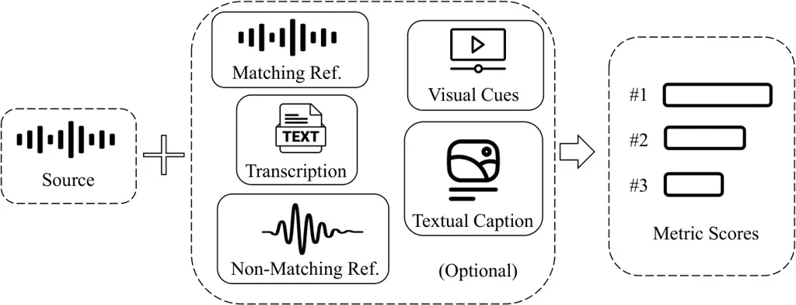

# VERSA: A Versatile Evaluation Toolkit for Speech, Audio, and Music

Jiatong Shi Affiliation: Carnegie Mellon University    Hyejin Shim
Affiliation: Carnegie Mellon University    Jinchuan Tian
Affiliation: Carnegie Mellon University    Siddhant Arora
Affiliation: Carnegie Mellon University    Haibin Wu
Affiliation: Microsoft    Darius Petermann Affiliation: Indiana
University    Jia Qi Yip Affiliation: Nanyang Technological University
   You Zhang Affiliation: University of Rochester    Yuxun Tang
Affiliation: Renmin University of China    Wangyou Zhang
Affiliation: Shanghai Jiaotong University    Dareen Alharthi
Affiliation: Carnegie Mellon University    Yichen Huang
Affiliation: Carnegie Mellon University    Koichi Saito
Affiliation: Sony AI    Jionghao Han Affiliation: Carnegie Mellon
University    Yiwen Zhao Affiliation: Carnegie Mellon University   
Chris Donahue Affiliation: Carnegie Mellon University    Shinji Watanabe
Affiliation: Carnegie Mellon University

###### Abstract

In this work, we introduce VERSA, a unified and standardized evaluation
toolkit designed for various speech, audio, and music signals. The
toolkit features a Pythonic interface with flexible configuration and
dependency control, making it user-friendly and efficient. With full
installation, VERSA offers 65 metrics with 729 metric variations based
on different configurations. These metrics encompass evaluations
utilizing diverse external resources, including matching and
non-matching reference audio, text transcriptions, and text captions. As
a lightweight yet comprehensive toolkit, VERSA is versatile to support
the evaluation of a wide range of downstream scenarios. To demonstrate
its capabilities, this work highlights example use cases for VERSA,
including audio coding, speech synthesis, speech enhancement, singing
synthesis, and music generation. The toolkit is available at
[https://github.com/wavlab-speech/versa](https://github.com/wavlab-speech/versa).

## 1 Introduction

With the rapid advancements in artificial intelligence-generated
content (AIGC), deep generative models have demonstrated remarkable
capabilities in producing high-quality outputs across various domains,
including image, video, and sound generation. As generative models
become increasingly sophisticated, the need for comprehensive AIGC
evaluation has grown, aimed at identifying the strengths and weaknesses
of the generated outputs.

As an essential part of the language processing community, diverse
generative models for speech, music, and general audio have shown
significant potential in applications such as conversational
interfaces McTear (2002), entertainment Fraser et al. (2018); Fancourt
and Steptoe (2019); Dash and Agres (2024), and task management Kulkarni
et al. (2019). Due to the perceptual nature of sound-based applications,
human subjective assessment is widely regarded as the gold standard for
evaluating sound generative models.

The most fundamental and widely used metric for these models is the mean
opinion score (MOS) Recommendation (1994). The initial purpose of MOS
was to measure the naturalness of generated audio, but it has since
evolved into various specific forms, such as evaluating speaker
similarity Toda et al. (2016), comparative performance against baseline
systems Harada and Ohmuro (1999), emotional similarity Choi et al.
(2019), and alignment with prompts Guo et al. (2023); Li et al. (2024).
Despite its importance, subjective evaluations relying on human input
are challenging to conduct due to their labor-intensive nature.
Furthermore, achieving statistically significant results often requires
a substantial number of samples Rosenberg and Ramabhadran (2017).
Additionally, range-equalizing bias is frequently observed in MOS
evaluations due to the psychological grounding of human subjective
assessments Cooper and Yamagishi (2023); Le Maguer et al. (2024). Such
biases introduce considerable challenges in achieving comparable results
across different evaluation datasets and participants, thereby
complicating the process of benchmarking generative models effectively.
Last but not least, certain evaluation variants may require individuals
with expert knowledge to conduct the assessment, particularly in the
music domain Ji et al. (2020).

An alternative approach is to develop automatic metrics that align with
human preferences. The design of such metrics can vary based on the use
of external references and the specific application scenarios, which
further complicates their selection.

The basic setup for evaluation involves using only the candidate audio
being evaluated Liang and Kubichek (1994); Falk and Chan (2006); Lo
et al. (2019); Saeki et al. (2022), which has been actively discussed in
recent VoiceMOS challenges Huang et al. (2022); Cooper et al. (2023);
Huang et al. (2024b). In addition, a variety of external resources can
be optionally utilized for evaluation, as illustrated in Fig.1. These
resources may include matching reference audio Rix et al. (2001),
non-matching reference audio Manocha et al. (2021); Ragano et al.
(2024a), textual transcription Hayashi et al. (2020), textual
captions Huang et al. (2023), or visual cues Hu et al. (2021).¹¹ 1 Note
that we specifically exclude pre-trained models from our notion of
“external resources”.

Figure 1: Using various external resources for automatic sound
evaluation. External resources include any matching reference signals,
non-matching reference signals, transcriptions, visual cues, or textual
captions.

The focus of automatic metrics can vary significantly depending on the
application scenario. For instance, in voice conversion, discriminative
speaker embeddings can be employed to measure speaker similarity between
the generated speech and speech from the same speakers Das et al.
(2020). In cases involving domain-specific content, such as singing,
pre-trained models in singing voices may better align with assessments
of singing naturalness Tang et al. (2024). For a fine-grained,
sample-level generation, signal-to-noise ratio-related metrics are more
suitable, particularly for tasks such as speech enhancement and
separation Luo and Mesgarani (2019). Due to the creative nature of
music, distributional metrics are often better suited for evaluating
music generation Kilgour et al. (2019). Given the diversity of audio
signals, effectively evaluating them requires a broad understanding of
general audio events and their contextual relevance Huang et al. (2023).

Considering the diversity of metrics and the evolution of generative
models for speech, audio, and music, the need for standardized
evaluation metrics has become increasingly evident. Without a unified
framework, the diversity in evaluation methodologies often leads to
inconsistent results, making it challenging to benchmark models or
assess advancements effectively. Standardization ensures that all
systems are evaluated under comparable conditions, fostering fairness,
reproducibility, and meaningful insights across studies. Moreover,
centralizing metrics within a single toolkit not only reduces redundancy
and inefficiencies but also encourages collaboration by providing
researchers with a shared foundation for assessing performance. This
need for consistency and centralization underpins the development of
VERSA, a toolkit designed to address these challenges.

Extended from its prior version in Shi et al. (2024), this work
introduces a versatile evaluation toolkit for speech, audio, and music:
VERSA. Built on a Pythonic interface, VERSA integrates 65 metrics and
more than 729 variants, offering a wide array of automatic evaluation
tools tailored for speech, audio, and music. By providing diverse
metrics, VERSA aims to serve as a one-stop solution for multi-domain,
multi-level, and multi-focus sound evaluation across various downstream
applications. With examples showcasing the use of VERSA in ESPnet-Codec
and ESPnet-SpeechLM, we anticipate that the VERSA toolkit will become a
key component in advancing sound generation benchmarks, addressing
challenges in speech generation, and supporting multi-modal generative
frameworks. The codebase is publicly available at
[https://github.com/wavlab-speech/versa](https://github.com/wavlab-speech/versa).²²
2 A video demonstration is available at
[https://youtu.be/t7UP1uFvaCM](https://youtu.be/t7UP1uFvaCM).

## 2 VERSA

This section details the design of VERSA, focusing on its general
framework, supported metrics, and potential benefits for the community.

### 2.1 VERSA Framework

Figure 2: Directory structure of VERSA. Detailed discussion can be found
in Sec. 2.1

As illustrated in Fig. 2, the core library of VERSA is implemented as a
Python package with two straightforward interfaces: scorer.py and
aggregate_result.py. The scorer.py interface computes the automatic
metrics, while aggregate_result.py consolidates the results into a final
report for users.

Once installed via pip, using VERSA is as simple as the following:

1 python versa/bin/scorer.py \\

2 --score_config egs/general.yaml \\

3 --gt \<ground truth audio list\> \\

4 --pred \<candidate audio list\> \\

5 --output_file test_result

Listing 1: A simple scorer interface.

where the ground truth audio list is optional and is not required for
independent metrics.

I/O Interface: VERSA offers three I/O interfaces for handling audio
samples: the Soundfile interface, the Directory interface, and the Kaldi
interface. These interfaces support a variety of audio formats (e.g.,
PCM, FLAC, MP3, Kaldi-ARK) and different file organizations, such as
wav.scp files or individual audio files stored within a parent
directory. For each (candidate, reference) audio signal pair, a
resampling is conducted for each metric according to the specific
sampling rate required by that metric. librosa is used for resampling.

Flexible Configuration: VERSA employs a unified YAML-style configuration
file to define which metrics to use and control their detailed setups.
While users can directly explore the library code, we also provide
example configuration files for different metrics in the egs directory,
as shown in Fig. 2. For instance, egs/general.yaml provides a
configuration template for the default installation metrics.
Additionally, individual YAML configuration files for specific metrics
are available under egs/separate_metric. Some example configurations are
discussed in Appendix A.

Strict Dependency Control: Managing dependencies can be challenging when
using diverse evaluation metrics. To address this, VERSA offers a
minimal-dependency installation that supports a core set of metrics by
default, while additional installation scripts are provided for metrics
with extra requirements. This approach significantly reduces dependency
overhead during VERSA installation, especially for metrics with heavy
dependencies or complex compilation needs. As shown in Fig. 2, these
additional installation scripts are located in the tools directory.

To ensure correct model usage, many official packages released by model
providers enforce strict dependency control by specifying exact package
versions (e.g., specific versions of PyTorch or NumPy). While this
ensures compatibility, it often introduces unnecessary dependency
conflicts with major packages. To provide a more flexible environment
for users, VERSA bypasses these strict version requirements by adapting
the interfaces of such metrics into our own local forks. These forks are
supplemented with additional numerical tests to ensure functionality
without adhering to rigid version control.

Moreover, using our own fork allows us to integrate VERSA-specific
interfaces into external metrics that may otherwise conflict with the
toolkit’s design philosophy. This flexibility ensures a consistent and
seamless interface across the VERSA library, enhancing usability and
maintaining the toolkit’s design integrity.

In Appendix B, we further discuss additional system design concepts on
job scheduling, test protocol, resource management, and community-driven
contribution guidelines.

|     |                |        |       |       |                                                                   |      |                                                                                                          |             |             |                  |                             |
| --- | -------------- | ------ | ----- | ----- | ----------------------------------------------------------------- | ---- | -------------------------------------------------------------------------------------------------------- | ----------- | ----------- | ---------------- | --------------------------- |
| No. | Type           | Domain |       |       | Name                                                              | Base | Variants                                                                                                 | Range       | Model Based | Target Direction | Reference                   |
|     |                | Speech | Audio | Music |                                                                   |      |                                                                                                          |             |             |                  |                             |
| 1   | Independent    | ✓      | ✗     | ✗     | Deep Noise Suppression MOS Score of P.835 (DNSMOS P.835)          | ✓    | 1                                                                                                        | \[1, 5\]    | ✓           | $`\uparrow`$     | Reddy et al. (2022)         |
| 2   |                | ✓      | ✗     | ✗     | Deep Noise Suppression MOS Score of P.808 (DNSMOS P.808)          | ✓    | 1                                                                                                        | \[1, 5\]    | ✓           | $`\uparrow`$     | Reddy et al. (2021)         |
| 3   |                | ✓      | ✗     | ✗     | Speech Quality and Naturalness Assessment (NISQA)                 | ✓    | [3](https://github.com/gabrielmittag/NISQA?tab=readme-ov-file#using-nisqa)                               | \[1, 5\]    | ✓           | $`\uparrow`$     | Mittag et al. (2021)        |
| 4   |                | ✓      | ✗     | ✗     | UTokyo-SaruLab System for VoiceMOS 2022 (UTMOS)                   | ✓    | 1                                                                                                        | \[1, 5\]    | ✓           | $`\uparrow`$     | Saeki et al. (2022)         |
| 5   |                | ✓      | ✓     | ✓     | Packet Loss Concealment-focus MOS (PLCMOS)                        | ✓    | 1                                                                                                        | \[1, 5\]    | ✓           | $`\uparrow`$     | Diener et al. (2023)        |
| 6   |                | ✓      | ✗     | ✗     | Torch-Squim PESQ (TS-PESQ)                                        | ✓    | 1                                                                                                        | \[1, 5\]    | ✓           | $`\uparrow`$     | Kumar et al. (2023)         |
| 7   |                | ✓      | ✗     | ✗     | Torch-Squim STOI (TS-STOI)                                        | ✓    | 1                                                                                                        | \[0, 1\]    | ✓           | $`\uparrow`$     | Kumar et al. (2023)         |
| 8   |                | ✓      | ✗     | ✗     | Torch-Squim SI-SNR (TS-SI-SNR)                                    | ✓    | 1                                                                                                        | (-inf, inf) | ✓           | $`\uparrow`$     | Kumar et al. (2023)         |
| 9   |                | ✗      | ✗     | ✓     | Singing voice MOS (SingMOS)                                       | ✓    | 1                                                                                                        | \[1, 5\]    | ✓           | $`\uparrow`$     | Tang et al. (2024)          |
| 10  |                | ✓      | ✗     | ✓     | Subjective Speech Quality Assessment (SSQA) in SHEET Toolkit      | ✓    | 1                                                                                                        | \[1, 5\]    | ✓           | $`\uparrow`$     | Huang et al. (2024a)        |
| 11  |                | ✓      | ✗     | ✗     | UTokyo-SaruLab System for VoiceMOS 2024 (UTMOSv2)                 | ✗    | 1                                                                                                        | \[1, 5\]    | ✓           | $`\uparrow`$     | Baba et al. (2024)          |
| 12  |                | ✓      | ✗     | ✗     | Speech Quality with Contrastive Regression (SCOREQ) wo. Ref.      | ✗    | [2](https://github.com/alessandroragano/scoreq?tab=readme-ov-file#using-scoreq-from-the-command-line)    | \[1, 5\]    | ✓           | $`\uparrow`$     | Ragano et al. (2024b)       |
| 13  |                | ✓      | ✗     | ✗     | Speech Enhancement-based SI-SNR (SE-SI-SNR)                       | ✓    | [69](https://huggingface.co/models?pipeline_tag=audio-to-audio&library=espnet)                           | (-inf, inf) | ✓           | $`\uparrow`$     | Zhang et al. (2024a)        |
| 14  |                | ✓      | ✗     | ✗     | Speech Enhancement-based CI-SDR (SE-CI-SDR)                       | ✓    | [69](https://huggingface.co/models?pipeline_tag=audio-to-audio&library=espnet)                           | (-inf, inf) | ✓           | $`\uparrow`$     | Zhang et al. (2024a)        |
| 15  |                | ✓      | ✗     | ✗     | Speech Enhancement-based SAR (SE-SAR)                             | ✓    | [69](https://huggingface.co/models?pipeline_tag=audio-to-audio&library=espnet)                           | (-inf, inf) | ✓           | $`\uparrow`$     | Zhang et al. (2024a)        |
| 16  |                | ✓      | ✗     | ✗     | Speech Enhancement-based SDR (SE-SDR)                             | ✓    | [69](https://huggingface.co/models?pipeline_tag=audio-to-audio&library=espnet)                           | (-inf, inf) | ✓           | $`\uparrow`$     | Zhang et al. (2024a)        |
| 17  |                | ✗      | ✓     | ✗     | Prompting Audio-Language Models (PAM) metric                      | ✓    | 1                                                                                                        | \[0, 1\]    | ✓           | $`\uparrow`$     | Deshmukh et al. (2024)      |
| 18  |                | ✓      | ✓     | ✗     | Speech-to-reverberation Modulation Energy Ratio (SRMR)            | ✗    | 1                                                                                                        | \[0, inf)   | ✓           | $`\uparrow`$     | Falk et al. (2010)          |
| 19  |                | ✓      | ✗     | ✗     | Voice Activity Detection (VAD)                                    | ✓    | 1                                                                                                        | \-          | ✓           | \-               | SileroTeam (2024)           |
| 20  |                | ✓      | ✗     | ✗     | Speaker Turn Taking (SPK-TT)                                      | ✗    | 1                                                                                                        | \[0, inf)   | ✓           | \-               | Goodwin and Heritage (1990) |
| 21  |                | ✓      | ✗     | ✗     | Speaking Word Rate (SWR)                                          | ✓    | [7](https://github.com/openai/whisper?tab=readme-ov-file#available-models-and-languages)                 | \[0, inf)   | ✗           | \-               | Radford et al. (2023)       |
| 22  |                | ✓      | ✗     | ✗     | Anti-spoofing Score (SpoofS)                                      | ✓    | [2](https://github.com/clovaai/aasist/tree/main/models/weights)                                          | \[0, 1\]    | ✓           | $`\uparrow`$     | Jung et al. (2021)          |
| 23  |                | ✓      | ✗     | ✗     | Language Identification (LID)                                     | ✓    | [17](https://huggingface.co/models?pipeline_tag=automatic-speech-recognition&library=espnet&search=owsm) | \-          | ✓           | \-               | Peng et al. (2023)          |
| 24  |                | ✓      | ✓     | ✓     | Audiobox Aesthetics (AA)                                          | ✗    | 1                                                                                                        | \[1, 10\]   | ✓           | $`\uparrow`$     | Tjandra et al. (2025)       |
| 25  | Dependent      | ✓      | ✓     | ✓     | Mel Cepstral Distortion (MCD)                                     | ✓    | 1                                                                                                        | \[0, inf)   | ✗           | $`\downarrow`$   | Kubichek (1993)             |
| 26  |                | ✓      | ✗     | ✗     | F0 Correlation (F0-CORR)                                          | ✓    | 1                                                                                                        | \[-1, 1\]   | ✗           | $`\uparrow`$     | Hayashi et al. (2021)       |
| 27  |                | ✓      | ✗     | ✗     | F0 Root Mean Square Error (F0-RMSE)                               | ✓    | 1                                                                                                        | \[0, inf)   | ✗           | $`\downarrow`$   | Hayashi et al. (2021)       |
| 28  |                | ✓      | ✓     | ✓     | Signal-to-interference Ratio (SIR)                                | ✓    | 1                                                                                                        | (-inf, inf) | ✗           | $`\uparrow`$     | Févotte et al. (2005)       |
| 29  |                | ✓      | ✓     | ✓     | Signal-to-artifact Ratio (SAR)                                    | ✓    | 1                                                                                                        | (-inf, inf) | ✗           | $`\uparrow`$     | Févotte et al. (2005)       |
| 30  |                | ✓      | ✓     | ✓     | Signal-to-distortion Ratio (SDR)                                  | ✓    | 1                                                                                                        | (-inf, inf) | ✗           | $`\uparrow`$     | Févotte et al. (2005)       |
| 31  |                | ✓      | ✓     | ✓     | Convolutional scale-invariant signal-to-distortion ratio (CI-SDR) | ✓    | 1                                                                                                        | (-inf, inf) | ✗           | $`\uparrow`$     | Boeddeker et al. (2021)     |
| 32  |                | ✓      | ✓     | ✓     | Scale-invariant signal-to-noise ratio (SI-SNR)                    | ✓    | 1                                                                                                        | (-inf, inf) | ✗           | $`\uparrow`$     | Luo and Mesgarani (2018)    |
| 33  |                | ✓      | ✗     | ✗     | Perceptual Evaluation of Speech Quality (PESQ)                    | ✓    | 1                                                                                                        | \[1, 5\]    | ✓           | $`\uparrow`$     | Rix et al. (2001)           |
| 34  |                | ✓      | ✗     | ✗     | Short-Time Objective Intelligibility (STOI)                       | ✓    | 1                                                                                                        | \[0, 1\]    | ✗           | $`\uparrow`$     | Taal et al. (2011)          |
| 35  |                | ✓      | ✗     | ✗     | Speech BERT Score (D-BERT)                                        | ✓    | 1                                                                                                        | \[-1, 1\]   | ✓           | $`\uparrow`$     | Saeki et al. (2024)         |
| 36  |                | ✓      | ✗     | ✗     | Discrete Speech BLEU Score (D-BLEU)                               | ✓    | 1                                                                                                        | \[0, 1\]    | ✓           | $`\uparrow`$     | Saeki et al. (2024)         |
| 37  |                | ✓      | ✗     | ✗     | Discrete Speech Token Edit Distance (D-Distance)                  | ✓    | 1                                                                                                        | \[0, 1\]    | ✓           | $`\uparrow`$     | Saeki et al. (2024)         |
| 38  |                | ✓      | ✓     | ✓     | Dynamic Time Warping Cost (WARP-Q)                                | ✗    | 1                                                                                                        | \[0, inf)   | ✓           | $`\uparrow`$     | Jassim et al. (2022)        |
| 39  |                | ✓      | ✗     | ✗     | Speech Quality with Contrastive Regression (SCOREQ) w. Ref.       | ✗    | [2](https://github.com/alessandroragano/scoreq?tab=readme-ov-file#using-scoreq-from-the-command-line)    | \[1, 5\]    | ✓           | $`\uparrow`$     | Ragano et al. (2024b)       |
| 40  |                | ✓      | ✓     | ✓     | 2f-Model                                                          | ✗    | 1                                                                                                        | \[0, 100\]  | ✓           | $`\uparrow`$     | Kastner and Herre (2019)    |
| 41  |                | ✓      | ✓     | ✓     | Log-weighted Mean Square Error (Log-WMSE)                         | ✓    | 1                                                                                                        | (-inf, inf) | ✗           | $`\uparrow`$     | Jordal (2023)               |
| 42  |                | ✓      | ✗     | ✗     | ASR-oriented Mismatch Error Rate (ASR-Mismatch)                   | ✓    | [7](https://github.com/openai/whisper?tab=readme-ov-file#available-models-and-languages)                 | \[0, inf\]  | ✓           | $`\downarrow`$   | Radford et al. (2023)       |
| 43  |                | ✓      | ✓     | ✓     | Virtual Speech Quality Objective Listener (VISQOL)                | ✗    | [4](https://github.com/google/visqol/tree/master/model)                                                  | \[1,5\]     | ✓           | $`\uparrow`$     | Chinen et al. (2020)        |
| 44  |                | ✓      | ✓     | ✓     | Frequency-Weighted SEGmental SNR (FWSEGSNR)                       | ✓    | 1                                                                                                        | (-inf, inf) | ✗           | $`\uparrow`$     | Tribolet et al. (1978)      |
| 45  |                | ✓      | ✗     | ✗     | Weighted Spectral Slope (WSS)                                     | ✗    | 1                                                                                                        | \[0, inf)   | ✗           | $`\downarrow`$   | Klatt (1982)                |
| 46  |                | ✓      | ✗     | ✗     | Cepstrum Distance (CD)                                            | ✗    | 1                                                                                                        | \[0, inf)   | ✗           | $`\downarrow`$   | Barnwell III et al. (1988)  |
| 47  |                | ✓      | ✗     | ✗     | Composite Objective Speech Quality (Csig, Cbak, Covl)             | ✗    | 1                                                                                                        | \[1, 5\]    | ✓           | $`\uparrow`$     | Hu and Loizou (2007)        |
| 48  |                | ✓      | ✗     | ✗     | Coherence and Speech Intelligibility Index (CSII)                 | ✗    | 1                                                                                                        | \[0, 1\]    | ✗           | $`\uparrow`$     | Kates and Arehart (2005)    |
| 49  |                | ✓      | ✗     | ✗     | Normalized-Covariance Measure (NCM)                               | ✗    | 1                                                                                                        | \[-1, 1\]   | ✗           | $`\uparrow`$     | Chen and Loizou (2010)      |
| 50  | Non-match      | ✓      | ✗     | ✗     | Non-matching Reference Speech Quality Assessment (Noresqa)        | ✗    | 2                                                                                                        | \[1, 5\]    | ✓           | $`\uparrow`$     | Manocha et al. (2021)       |
| 51  |                | ✓      | ✗     | ✗     | Torch-Squim MOS (TS-MOS)                                          | ✓    | 1                                                                                                        | \[1, 5\]    | ✓           | $`\uparrow`$     | Kumar et al. (2023)         |
| 52  |                | ✓      | ✗     | ✗     | ESPnet ASR Model Word Error Rate (ESPnet-WER)                     | ✓    | [270](https://huggingface.co/models?pipeline_tag=automatic-speech-recognition&library=espnet)            | \[0, inf)   | ✓           | $`\downarrow`$   | Watanabe et al. (2018)      |
| 53  |                | ✓      | ✗     | ✗     | ESPnet OWSM Model Word Error Rate (OWSM-WER)                      | ✓    | [17](https://huggingface.co/models?pipeline_tag=automatic-speech-recognition&library=espnet&search=owsm) | \[0, inf)   | ✓           | $`\downarrow`$   | Peng et al. (2023)          |
| 54  |                | ✓      | ✗     | ✗     | OpenAI Whisper Model Word Error Rate (Whisper-WER)                | ✓    | [7](https://github.com/openai/whisper?tab=readme-ov-file#available-models-and-languages)                 | \[0, inf)   | ✓           | $`\downarrow`$   | Radford et al. (2023)       |
| 55  |                | ✓      | ✗     | ✗     | Emotion Similarity (EMO-SIM)                                      | ✗    | 1                                                                                                        | \[-1, 1\]   | ✓           | $`\uparrow`$     | Ma et al. (2024)            |
| 56  |                | ✓      | ✗     | ✗     | Speaker Similarity (SPK-SIM)                                      | ✓    | [15](https://huggingface.co/models?other=speaker-recognition&search=espnet)                              | \[-1, 1\]   | ✓           | $`\uparrow`$     | weon Jung et al. (2024)     |
| 57  |                | ✓      | ✗     | ✗     | Non-Matching Reference Audio Quality Assessment (NOMAD)           | ✗    | 1                                                                                                        | \[1, 5\]    | ✓           | $`\uparrow`$     | Ragano et al. (2024a)       |
| 58  |                | ✗      | ✓     | ✓     | Contrastive Language-Audio Pretraining Score (CLAP Score)         | ✗    | 1                                                                                                        | \[-1, 1\]   | ✓           | $`\uparrow`$     | Huang et al. (2023)         |
| 59  |                | ✗      | ✓     | ✓     | Accompaniment Prompt Adherence (APA)                              | ✗    | 1                                                                                                        | \[-1, 1\]   | ✓           | $`\uparrow`$     | Grachten (2024)             |
| 60  |                | ✓      | ✓     | ✓     | Log Likelihood Ratio (LLR)                                        | ✗    | 1                                                                                                        | \[0, inf)   | ✗           | $`\uparrow`$     | Hu and Loizou (2007)        |
| 61  | Distributional | ✗      | ✓     | ✓     | Fréchet Audio Distance Audio Distance (FAD)                       | ✗    | [11](https://github.com/microsoft/fadtk?tab=readme-ov-file#supported-models)                             | \[0, inf)   | ✓           | $`\downarrow`$   | Roblek et al. (2019)        |
| 62  |                | ✗      | ✓     | ✓     | Kullback-Leibler Divergence on Embedding Distribution (KLD)       | ✗    | [11](https://github.com/microsoft/fadtk?tab=readme-ov-file#supported-models)                             | \[0, inf)   | ✓           | $`\downarrow`$   | Roblek et al. (2019)        |
| 63  |                | ✗      | ✓     | ✓     | Density in Embedding Space (Density-Embedding)                    | ✗    | [11](https://github.com/microsoft/fadtk?tab=readme-ov-file#supported-models)                             | \[0, inf)   | ✓           | $`\uparrow`$     | Naeem et al. (2020)         |
| 64  |                | ✗      | ✓     | ✓     | Coverage in Embedding Space (Coverage-Embedding)                  | ✗    | [11](https://github.com/microsoft/fadtk?tab=readme-ov-file#supported-models)                             | \[0, 1\]    | ✓           | $`\uparrow`$     | Naeem et al. (2020)         |
| 65  |                | ✗      | ✓     | ✓     | Kernel Distance/Maximum Mean Discrepancy (KID)                    | ✗    | [11](https://github.com/microsoft/fadtk?tab=readme-ov-file#supported-models)                             | \[0, inf)   | ✓           | $`\downarrow`$   | Roblek et al. (2019)        |
| \-  | Total          | 56     | 23    | 23    | \-                                                                | 40   | 729                                                                                                      | \-          | 48          | \-               |                             |

Table 1: List of supported metrics in VERSA. The “Base" column indicates
whether the metrics are included in the minimum installation of VERSA.
The “Model Based” column represents metrics that need pre-trained
models. The “Target Direction” column indicates which direction is
desirable for each metric without being overly technical.

|                                    |        |       |       |                                                                                                                                                      |             |
| ---------------------------------- | ------ | ----- | ----- | ---------------------------------------------------------------------------------------------------------------------------------------------------- | ----------- |
| Name                               | Domain |       |       | Open-source Link                                                                                                                                     | Metric Type |
|                                    | Speech | Audio | Music |                                                                                                                                                      |             |
| ESPnet Watanabe et al. (2018)      | ✓      | ✗     | ✓     | [https://github.com/espnet/espnet](https://github.com/espnet/espnet)                                                                                 | 16          |
| Apmhion Zhang et al. (2023a)       | ✓      | ✓     | ✓     | [https://github.com/open-mmlab/Amphion](https://github.com/open-mmlab/Amphion)                                                                       | 15          |
| SHEET Huang et al. (2024a)         | ✓      | ✗     | ✓     | [https://github.com/unilight/sheet](https://github.com/unilight/sheet)                                                                               | 3           |
| SpeechMOS                          | ✓      | ✓     | ✓     | [https://pypi.org/project/speechmos](https://pypi.org/project/speechmos)                                                                             | 3           |
| BSS-EVAL Févotte et al. (2005)     | ✓      | ✓     | ✓     | [https://pypi.org/project/fast-bss-eval](https://pypi.org/project/fast-bss-eval)                                                                     | 4           |
| ClearerVoice-SpeechScore           | ✓      | ✗     | ✗     | [https://github.com/modelscope/ClearerVoice-Studio](https://github.com/modelscope/ClearerVoice-Studio)                                               | 14          |
| AudioLDM-Eval Liu et al. (2023)    | ✗      | ✓     | ✓     | [https://github.com/haoheliu/audioldm_eval](https://github.com/haoheliu/audioldm_eval)                                                               | 9           |
| Stable-Audio-Metric                | ✓      | ✓     | ✓     | [https://github.com/Stability-AI/stable-audio-metrics](https://github.com/Stability-AI/stable-audio-metrics)                                         | 3           |
| Sony Audio-Metrics Grachten (2024) | ✓      | ✓     | ✓     | [https://github.com/SonyCSLParis/audio-metrics](https://github.com/SonyCSLParis/audio-metrics)                                                       | 4           |
| FADTK Gui et al. (2024)            | ✓      | ✓     | ✓     | [https://github.com/microsoft/fadtk](https://github.com/microsoft/fadtk)                                                                             | 11          |
| Pysepm                             | ✓      | ✗     | ✗     | [https://github.com/schmiph2/pysepm](https://github.com/schmiph2/pysepm)                                                                             | 10          |
| AudioCraft Copet et al. (2024)     | ✗      | ✓     | ✓     | [https://github.com/facebookresearch/audiocraft/blob/main/docs/METRICS.md](https://github.com/facebookresearch/audiocraft/blob/main/docs/METRICS.md) | 6           |
| AutaTK Vinay and Lerch (2023)      | ✗      | ✓     | ✓     | [https://github.com/Ashvala/AQUA-Tk](https://github.com/Ashvala/AQUA-Tk)                                                                             | 9           |
| VERSA                              | ✓      | ✓     | ✓     | [https://github.com/shinjiwlab/versa](https://github.com/shinjiwlab/versa)                                                                           | 65          |

Table 2: Comparison to related toolkits. The number of metrics are
collected at 12/09/2024.

### 2.2 Supported Metrics

VERSA stands out for its extensive range of supported metrics,
categorized into four main types:

Independent metrics: These metrics do not require any dependent external
resources, other than pre-trained models. Notably, we adopt an extended
form of independent metrics in speech and audio assessment, which also
considers profiling-related metrics, such as voice activity detection
and speaker turn-taking. VERSA currently supports 22 independent
metrics.

Dependent metrics: These metrics rely on matching sound references. In
VERSA, 25 dependent metrics are supported.

Non-matching metrics: These metrics use non-matching reference data or
different modalities. VERSA currently supports 11 non-matching metrics.

Distributional metrics: These metrics conduct distribution comparisons
between two datasets, providing a more general view of the generative
models’ performance. VERSA currently supports 5 distributional metrics.

As summarized in Table 1, VERSA supports a total of 65 metrics, 39 of
which are included in the minimal installation. Of these, 54 metrics are
applicable to speech tasks, 22 to general audio tasks, and 22 to music
tasks. Additionally, several metrics feature variations based on
different pre-trained models, such as word error rate, speaker
similarity, and Fréchet Audio Distance (FAD) scores. By simply modifying
the configuration file,³³ 3 An example of a configuration change is
provided in Appendix A.2. VERSA can generate up to 729 distinct metric
variants, offering flexibility for a wide range of evaluation scenarios.

### 2.3 Advantages of VERSA

This section highlights the key benefits of VERSA, focusing on its
ability to ensure consistency, facilitate comparability, provide
comprehensive insights, and enhance efficiency.

Consistency: VERSA ensures uniform evaluation criteria across
experiments, addressing a critical need in the field of sound generative
models. By standardizing the implementation of metrics, VERSA minimizes
the variability introduced by subjective judgments or inconsistent
evaluation setups (e.g., coding environments).

Comparability: One of VERSA’s key advantages is its ability to
facilitate benchmarking against existing models and methodologies. By
providing a unified set of metrics, it ensures that evaluations are
conducted under fair and objective conditions. This comparability is
important for assessing the relative performance of new approaches,
fostering innovation, and enabling the broader research community to
progress effectively.

Comprehensiveness: VERSA supports a wide array of evaluation metrics,
including dimensions such as perceptual quality, intelligibility,
affective information, and creative diversity. By incorporating these
diverse measures, the toolkit provides a holistic view of system
performance, especially for researchers to gain deeper insights into
both the strengths and weaknesses of each method.

Efficiency: With its all-in-one design, VERSA significantly enhances
efficiency by supporting multiple metrics within a single toolkit. Users
no longer need to rely on separate tools or perform manual calculations
to assess different aspects of audio performance. This workflow reduces
the time, effort, and potential errors associated with using fragmented
evaluation methods, accelerating the overall research and development
process.

## 3 Comparison to Other Toolkits

As discussed in Sec. 1, the challenges associated with subjective
evaluation have propelled the community toward exploring objective
evaluation metrics. The growing demand for sound evaluation toolkits has
led to numerous efforts in domain-specific evaluation for sound
generation.

In the speech domain, prior to the deep learning era, the International
Telecommunication Union Telecommunication Standardization Sector (ITU-T)
played a pivotal role in designing evaluation metrics for speech
processing tasks such as speech coding and speech enhancement. More
recently, text-to-speech (TTS) toolkits have begun incorporating speech
quality assessment features, exemplified by ESPnet-TTS Hayashi et al.
(2020); Hayashi et al. (2021) and Amphion Zhang et al. (2023a).
Additionally, the Speech Human Evaluation Estimation Toolkit (SHEET)
framework provides an all-in-one recipe-style toolkit for data
preparation, speech quality prediction model training, and
evaluation Huang et al. (2024a). In speech enhancement, foundational
signal-level metrics were first consolidated in Févotte et al. (2005),
followed by extensions such as Pysepm, which supports 10 metrics Loizou
(2013). More recent advancements include the addition of 14 speech
enhancement metrics in ClearerVoice ClearerVoice-Studio (2023).

In the audio domain, AudioLDM-Eval focuses on evaluating audio language
models with nine types of metrics Liu et al. (2023); Liu et al. (2024).
Stability AI has introduced three audio metrics Stability-AI (2023),
while Sony CSL has open-sourced four additional types of audio
metrics Grachten (2024).

In the music domain, MIR_EVAL is a pioneering toolkit that aggregates
metrics for music information retrieval tasks Raffel et al. (2014). More
recently, Microsoft released FADTK, which emphasizes a comprehensive
FAD-embedding space for generative music evaluation Gui et al. (2024).

A summary of the related toolkits is presented in Table 2. Each
framework has made significant contributions to the community, many
serving as foundational tools for sound generation research. Building on
these previous toolkits, VERSA distinguishes itself with a general
design applicable across multiple domains and its comprehensive
inclusion of 65 metrics with 729 variants—capabilities that have not
been achieved before.

## 4 Demonstration

We demonstrate several use cases of VERSA in diverse scenarios,
including speech coding, speech synthesis, speech enhancement, singing
synthesis, and music generation.

Speech coding remains one of the most widely utilized applications
within the speech-processing community. In this demonstration, we
leverage VERSA to evaluate nine publicly available codecs. More details
and corresponding results are discussed in Table 4 in Appendix C.1.

Text-to-speech aims to convert text into speech signals. In this
demonstration, we use VERSA to compare nine open-source TTS models. More
details and corresponding are shown in Table 6, Appendix C.2.

Speech enhancement targets the improvement of speech transmission in
different environments. In this paper, we also demonstrate the VERSA
usage in speech enhancement in three speech enhancement models. More
details and corresponding information are shown in Table 7,
Appendix C.3.

Singing synthesis is an intersection between speech and music
generation, where both speech-oriented and music-oriented evaluation
metrics are needed. VERSA offers a one-stop solution to this problem
based on the collection of a variety of metrics in each domain. In this
work, we demonstrate the evaluation of a range of singing voice
synthesis models. Table 9, Appendix C.4 shows more details and
corresponding information.

Music generation and its evaluation have received increasing attention
due to the rapid progress in model development. To consider both
creativity and musical harmony, recent evaluation methods mostly utilize
distribution metrics for the evaluation, exhibiting a large difference
to other sound generation systems. In this demonstration, VERSA
aggregates a range of music generation evaluation metrics into a single
toolkit. More details and corresponding information are shown in
Table 11, Appendix C.5.

## 5 Conclusion

In this work, we introduced VERSA, a comprehensive and versatile
evaluation toolkit for assessing speech, audio, and music signals. With
its flexible Pythonic interface and extensive suite of metrics, VERSA
empowers researchers and developers to conduct rigorous and reproducible
evaluations across diverse generative tasks.

Through its integration of more than 65 metrics and 729 variants, VERSA
provides unparalleled support for evaluating speech synthesis, audio
coding, music generation, and more. The toolkit not only simplifies the
evaluation process but also addresses challenges such as bias in
subjective evaluations and the need for domain-specific expertise.

## 6 Ethics Statement

VERSA is designed to address the challenges of evaluating sound
generative models in diverse linguistic, cultural, and acoustic
contexts. Generative sound models often risk perpetuating biases due to
their reliance on datasets that may underrepresent certain languages,
accents, and cultural expressions. To mitigate these risks, VERSA
incorporates evaluation metrics and methodologies that accommodate a
wide range of audio characteristics, including tonal, phonetic, and
rhythmic variations present across global languages and music
traditions.

The toolkit encourages the use of regionally diverse datasets and
provides flexibility to integrate culturally specific evaluation
resources, such as non-standard phonetic systems or traditional musical
structures. By doing so, VERSA seeks to foster the development of sound
generative models that respect and represent the full spectrum of human
audio diversity.

Through these efforts, VERSA empowers researchers and developers to
create more inclusive generative models, ensuring that advances in
speech, audio, and music technologies benefit communities worldwide,
regardless of linguistic or cultural background.

## 7 Broader Impact

### 7.1 Current Limitations

While VERSA offers a comprehensive and versatile evaluation framework
for speech, audio, and music generation, it is not without its
limitations. Below, we outline some areas where the toolkit could be
further improved:

Dependence on External Resources: Many of VERSA’s metrics require
external resources, such as pre-trained models, reference datasets, or
additional Python packages. The quality and diversity of these resources
can impact the accuracy and fairness of evaluations, particularly for
underrepresented languages and cultures. While VERSA provides flexible
configurations to accommodate various scenarios, the availability of
such resources remains a bottleneck in some cases.

Bias in Metric Design: Despite efforts to include diverse evaluation
metrics, some metrics may still reflect biases inherent in the training
data or methodologies used to develop them. For example, evaluation
frameworks optimized for widely spoken languages or Western music may
not fully capture the nuances of less-studied languages, dialects, or
musical traditions. This bias can lead to less accurate evaluations for
certain domains or cultural contexts.

Subjectivity in Perceptual Metrics: While VERSA incorporates automatic
metrics designed to align with human subjective assessments, these
metrics may not always perfectly reflect human preferences or
perceptions. Human evaluations remain the gold standard for certain
aspects of sound quality, naturalness, and emotional expressiveness,
which automated metrics cannot fully replicate.

Evolving Standards in Generative Models: The rapid advancement of
generative audio technologies means that new evaluation needs and
metrics may arise that VERSA does not yet support. As a result,
maintaining the toolkit’s relevance and adaptability will require
ongoing updates and contributions from the community.

### 7.2 Future Adaptation

By accommodating a wide range of configurations, external resources, and
application scenarios, we expect VERSA to bridge the gap between human
subjective assessments and automatic evaluation metrics, ensuring robust
and scalable benchmarking. The adoption and usage of VERSA are not
restricted by geographic boundaries. As an open-source toolkit, it is
accessible globally to researchers and practitioners, fostering
international collaboration in advancing sound generation technologies.
VERSA is designed with adaptability in mind, allowing users to integrate
their local resources and datasets to perform culturally and regionally
relevant evaluations.

Furthermore, VERSA facilitates cross-border innovation by providing a
standardized framework for evaluating generative audio models. This
standardization reduces duplication of effort and promotes
reproducibility, ensuring that advancements in sound generation and
evaluation can transcend political and cultural borders. Our commitment
to accessibility and inclusivity reinforces our belief in the universal
potential of AI to benefit humanity without being limited by geographic,
linguistic, or cultural barriers.

Looking ahead, we envision VERSA as a key enabler for advancing the
field of sound generation. Its modular design ensures adaptability to
future developments, while its open-source availability fosters
collaboration and community-driven enhancements. By setting a new
standard for sound evaluation, VERSA could pave the way for more
transparent and effective comparisons of generative models, ultimately
accelerating progress in AI-driven audio and music technologies.

## Acknowledgements

This work is supported by the Defence Science and Technology Agency
(DSTA) in Singapore. We would like to thank Daniel Leong and Megan Choo
for their valuable comments. Experiments of this work used the Bridges2
at PSC and Delta/DeltaAI NCSA computing systems through allocation
CIS210014 from the Advanced Cyberinfrastructure Coordination Ecosystem:
Services & Support (ACCESS) program, supported by National Science
Foundation grants 2138259, 2138286, 2138307, 2137603, and 2138296.

## References

- 2Noise (2024) 2Noise. 2024. [Chattts: A generative speech model for
  daily dialogue.](https://github.com/2noise/ChatTTS) Available at
  [https://github.com/2noise/ChatTTS](https://github.com/2noise/ChatTTS).
- Agostinelli et al. (2023) Andrea Agostinelli, Timo I Denk, Zalán
  Borsos, Jesse Engel, Mauro Verzetti, Antoine Caillon, Qingqing Huang,
  Aren Jansen, Adam Roberts, Marco Tagliasacchi, et al. 2023. Musiclm:
  Generating music from text. _arXiv preprint arXiv:2301.11325_.
- Baba et al. (2024) Kaito Baba, Wataru Nakata, Yuki Saito, and Hiroshi
  Saruwatari. 2024. The t05 system for the voicemos challenge 2024:
  Transfer learning from deep image classifier to naturalness mos
  prediction of high-quality synthetic speech. _arXiv preprint
  arXiv:2409.09305_.
- Bagchi et al. (2018) Deblin Bagchi, Peter Plantinga, Adam Stiff, and
  Eric Fosler-Lussier. 2018. Spectral feature mapping with mimic loss
  for robust speech recognition. In _IEEE Conference on Audio, Speech,
  and Signal Processing (ICASSP)_.
- Barnwell III et al. (1988) Thomas P Barnwell III, MA Clements, and
  SR Quackenbush. 1988. Objective measures for speech quality testing.
- Boeddeker et al. (2021) Christoph Boeddeker, Wangyou Zhang, Tomohiro
  Nakatani, Keisuke Kinoshita, Tsubasa Ochiai, Marc Delcroix, Naoyuki
  Kamo, Yanmin Qian, and Reinhold Haeb-Umbach. 2021. Convolutive
  transfer function invariant sdr training criteria for multi-channel
  reverberant speech separation. In _ICASSP 2021-2021 IEEE International
  Conference on Acoustics, Speech and Signal Processing (ICASSP)_, pages
  8428–8432. IEEE.
- Chen and Loizou (2010) Fei Chen and Philipos C Loizou. 2010. Analysis
  of a simplified normalized covariance measure based on binary
  weighting functions for predicting the intelligibility of
  noise-suppressed speech. _The Journal of the Acoustical Society of
  America_, 128(6):3715–3723.
- Chen et al. (2024a) Ke Chen, Yusong Wu, Haohe Liu, Marianna Nezhurina,
  Taylor Berg-Kirkpatrick, and Shlomo Dubnov. 2024a. MusicLDM: Enhancing
  novelty in text-to-music generation using beat-synchronous mixup
  strategies. In _ICASSP 2024-2024 IEEE International Conference on
  Acoustics, Speech and Signal Processing (ICASSP)_, pages 1206–1210.
  IEEE.
- Chen et al. (2024b) Sanyuan Chen, Shujie Liu, Long Zhou, Yanqing Liu,
  Xu Tan, Jinyu Li, Sheng Zhao, Yao Qian, and Furu Wei. 2024b. Vall-e 2:
  Neural codec language models are human parity zero-shot text to speech
  synthesizers. _arXiv preprint arXiv:2406.05370_.
- Chinen et al. (2020) Michael Chinen, Felicia SC Lim, Jan Skoglund,
  Nikita Gureev, Feargus O’Gorman, and Andrew Hines. 2020. Visqol v3: An
  open source production ready objective speech and audio metric. In
  _2020 twelfth international conference on quality of multimedia
  experience (QoMEX)_, pages 1–6. IEEE.
- Choi et al. (2019) Heejin Choi, Sangjun Park, Jinuk Park, and Minsoo
  Hahn. 2019. Multi-speaker emotional acoustic modeling for CNN-based
  speech synthesis. In _ICASSP 2019-2019 IEEE International Conference
  on Acoustics, Speech and Signal Processing (ICASSP)_, pages 6950–6954.
  IEEE.
- ClearerVoice-Studio (2023) ClearerVoice-Studio. 2023.
  https://github.com/modelscope/clearervoice-studio. Accessed:
  2024-12-09.
- Collabora (2024) Collabora. 2024. [Whisperspeech: A speech processing
  toolkit](https://github.com/collabora/WhisperSpeech). Available at
  [https://github.com/collabora/WhisperSpeech](https://github.com/collabora/WhisperSpeech).
- Cooper et al. (2023) Erica Cooper, Wen-Chin Huang, Yu Tsao, Hsin-Min
  Wang, Tomoki Toda, and Junichi Yamagishi. 2023. The VoiceMOS challenge
  2023: zero-shot subjective speech quality prediction for multiple
  domains. In _2023 IEEE Automatic Speech Recognition and Understanding
  Workshop (ASRU)_, pages 1–7. IEEE.
- Cooper and Yamagishi (2023) Erica Cooper and Junichi Yamagishi. 2023.
  [Investigating range-equalizing bias in mean opinion score ratings of
  synthesized speech](https://doi.org/10.21437/Interspeech.2023-1076).
  In _Interspeech_, pages 1104–1108.
- Copet et al. (2024) Jade Copet, Felix Kreuk, Itai Gat, Tal Remez,
  David Kant, Gabriel Synnaeve, Yossi Adi, and Alexandre Défossez. 2024.
  Simple and controllable music generation. _Advances in Neural
  Information Processing Systems_, 36.
- Das et al. (2020) Rohan Kumar Das, Tomi Kinnunen, Wen-Chin Huang,
  Zhen-Hua Ling, Junichi Yamagishi, Zhao Yi, Xiaohai Tian, and Tomoki
  Toda. 2020. Predictions of subjective ratings and spoofing assessments
  of voice conversion challenge 2020 submissions. In _Joint Workshop for
  the Blizzard Challenge and Voice Conversion Challenge 2020_. ISCA.
- Dash and Agres (2024) Adyasha Dash and Kathleen Agres. 2024. Ai-based
  affective music generation systems: A review of methods and
  challenges. _ACM Computing Surveys_, 56(11):1–34.
- Defferrard et al. (2017) Michaël Defferrard, Kirell Benzi, Pierre
  Vandergheynst, and Xavier Bresson. 2017. [FMA: A dataset for music
  analysis](https://arxiv.org/abs/1612.01840). In _18th International
  Society for Music Information Retrieval Conference (ISMIR)_.
- Défossez et al. (2024a) Alexandre Défossez, Jade Copet, Gabriel
  Synnaeve, and Yossi Adi. 2024a. High fidelity neural audio
  compression. _Transactions on Machine Learning Research_.
- Défossez et al. (2024b) Alexandre Défossez, Laurent Mazaré, Manu
  Orsini, Amélie Royer, Patrick Pérez, Hervé Jégou, Edouard Grave, and
  Neil Zeghidour. 2024b. Moshi: a speech-text foundation model for
  real-time dialogue. _arXiv preprint arXiv:2410.00037_.
- Deshmukh et al. (2024) Soham Deshmukh, Dareen Alharthi, Benjamin
  Elizalde, Hannes Gamper, Mahmoud Al Ismail, Rita Singh, Bhiksha Raj,
  and Huaming Wang. 2024. PAM: Prompting audio-language models for audio
  quality assessment. _arXiv preprint arXiv:2402.00282_.
- Diener et al. (2023) Lorenz Diener, Marju Purin, Sten Sootla, Ando
  Saabas, Robert Aichner, and Ross Cutler. 2023. [Plcmos – a data-driven
  non-intrusive metric for the evaluation of packet loss concealment
  algorithms](https://doi.org/10.21437/Interspeech.2023-1532). In
  _INTERSPEECH 2023_, pages 2533–2537.
- Du et al. (2024) Zhihao Du, Qian Chen, Shiliang Zhang, Kai Hu, Heng
  Lu, Yexin Yang, Hangrui Hu, Siqi Zheng, Yue Gu, Ziyang Ma,
  et al. 2024. Cosyvoice: A scalable multilingual zero-shot
  text-to-speech synthesizer based on supervised semantic tokens. _arXiv
  preprint arXiv:2407.05407_.
- Falk and Chan (2006) Tiago H Falk and W-Y Chan. 2006. Single-ended
  speech quality measurement using machine learning methods. _IEEE
  Transactions on Audio, Speech, and Language Processing_,
  14(6):1935–1947.
- Falk et al. (2010) Tiago H Falk, Chenxi Zheng, and Wai-Yip Chan. 2010.
  A non-intrusive quality and intelligibility measure of reverberant and
  dereverberated speech. _IEEE Transactions on Audio, Speech, and
  Language Processing_, 18(7):1766–1774.
- Fancourt and Steptoe (2019) Daisy Fancourt and Andrew Steptoe. 2019.
  Present in body or just in mind: differences in social presence and
  emotion regulation in live vs. virtual singing experiences. _Frontiers
  in Psychology_, 10:778.
- Févotte et al. (2005) Cédric Févotte, Rémi Gribonval, and Emmanuel
  Vincent. 2005. Bss_eval toolbox user guide–revision 2.0.
- Forsgren and Martiros (2022) Seth\* Forsgren and Hayk\*
  Martiros. 2022. [Riffusion - Stable diffusion for real-time music
  generation](https://riffusion.com/about).
- Fraser et al. (2018) Jamie Fraser, Ioannis Papaioannou, and Oliver
  Lemon. 2018. Spoken conversational AI in video games: Emotional
  dialogue management increases user engagement. In _Proceedings of the
  18th international conference on intelligent virtual agents_, pages
  179–184.
- Fu et al. (2021) Szu-Wei Fu, Cheng Yu, Tsun-An Hsieh, Peter Plantinga,
  Mirco Ravanelli, Xugang Lu, and Yu Tsao. 2021. [Metricgan+: An
  improved version of metricgan for speech
  enhancement](https://doi.org/10.21437/Interspeech.2021-599). In
  _Interspeech 2021_, pages 201–205.
- Goodwin and Heritage (1990) Charles Goodwin and John Heritage. 1990.
  Conversation analysis. _Annual review of anthropology_, 19:283–307.
- Grachten (2024) Maarten Grachten. 2024. Measuring audio prompt
  adherence with distribution-based embedding distances. _arXiv preprint
  arXiv:2404.00775_.
- Gui et al. (2024) Azalea Gui, Hannes Gamper, Sebastian Braun, and
  Dimitra Emmanouilidou. 2024. Adapting frechet audio distance for
  generative music evaluation. In _ICASSP 2024-2024 IEEE International
  Conference on Acoustics, Speech and Signal Processing (ICASSP)_, pages
  1331–1335. IEEE.
- Guo et al. (2023) Zhifang Guo, Yichong Leng, Yihan Wu, Sheng Zhao, and
  Xu Tan. 2023. PromptTTS: Controllable text-to-speech with text
  descriptions. In _ICASSP 2023-2023 IEEE International Conference on
  Acoustics, Speech and Signal Processing (ICASSP)_, pages 1–5. IEEE.
- Harada and Ohmuro (1999) Noboru Harada and Hitoshi Ohmuro. 1999.
  5-khz-bandwidth speech coder at 4-8 kbit/s. In _1999 IEEE Workshop on
  Speech Coding Proceedings. Model, Coders, and Error Criteria (Cat. No.
  99EX351)_, pages 13–15. IEEE.
- Hayashi et al. (2020) Tomoki Hayashi, Ryuichi Yamamoto, Katsuki Inoue,
  Takenori Yoshimura, Shinji Watanabe, Tomoki Toda, Kazuya Takeda,
  Yu Zhang, and Xu Tan. 2020. ESPnet-TTS: Unified, reproducible, and
  integratable open source end-to-end text-to-speech toolkit. In _ICASSP
  2020-2020 IEEE international conference on acoustics, speech and
  signal processing (ICASSP)_, pages 7654–7658. IEEE.
- Hayashi et al. (2021) Tomoki Hayashi, Ryuichi Yamamoto, Takenori
  Yoshimura, Peter Wu, Jiatong Shi, Takaaki Saeki, Yooncheol Ju, Yusuke
  Yasuda, Shinnosuke Takamichi, and Shinji Watanabe. 2021. Espnet2-tts:
  Extending the edge of tts research. _arXiv preprint arXiv:2110.07840_.
- Hu et al. (2021) Chenxu Hu, Qiao Tian, Tingle Li, Wang Yuping, Yuxuan
  Wang, and Hang Zhao. 2021. Neural dubber: Dubbing for videos according
  to scripts. In _Advances in Neural Information Processing Systems_,
  volume 34, pages 16582–16595.
- Hu and Loizou (2007) Yi Hu and Philipos C Loizou. 2007. Evaluation of
  objective quality measures for speech enhancement. _IEEE Transactions
  on audio, speech, and language processing_, 16(1):229–238.
- Huang et al. (2023) Rongjie Huang, Jiawei Huang, Dongchao Yang,
  Yi Ren, Luping Liu, Mingze Li, Zhenhui Ye, Jinglin Liu, Xiang Yin, and
  Zhou Zhao. 2023. Make-an-audio: Text-to-audio generation with
  prompt-enhanced diffusion models. In _International Conference on
  Machine Learning_, pages 13916–13932. PMLR.
- Huang et al. (2024a) Wen-Chin Huang, Erica Cooper, and Tomoki Toda.
  2024a. Mos-bench: Benchmarking generalization abilities of subjective
  speech quality assessment models. _arXiv preprint arXiv:2411.03715_.
- Huang et al. (2022) Wen Chin Huang, Erica Cooper, Yu Tsao, Hsin-Min
  Wang, Tomoki Toda, and Junichi Yamagishi. 2022. [The VoiceMOS
  challenge 2022](https://doi.org/10.21437/Interspeech.2022-970). In
  _Interspeech_, pages 4536–4540.
- Huang et al. (2024b) Wen-Chin Huang, Szu-Wei Fu, Erica Cooper,
  Ryandhimas E Zezario, Tomoki Toda, Hsin-Min Wang, Junichi Yamagishi,
  and Yu Tsao. 2024b. The VoiceMOS challenge 2024: Beyond speech quality
  prediction. _arXiv preprint arXiv:2409.07001_.
- Ito and Johnson (2017) Keith Ito and Linda Johnson. 2017. [The lj
  speech dataset](https://keithito.com/LJ-Speech-Dataset/). Available
  online:
  [https://keithito.com/LJ-Speech-Dataset/](https://keithito.com/LJ-Speech-Dataset/).
- Jassim et al. (2022) Wissam A. Jassim, Jan Skoglund, Michael Chinen,
  and Andrew Hines. 2022. [Speech quality assessment with warp-q: From
  similarity to subsequence dynamic time warp
  cost](https://doi.org/10.1049/sil2.12151). _IET Signal Processing_,
  n/a(n/a).
- Ji et al. (2024) Shengpeng Ji, Ziyue Jiang, Wen Wang, Yifu Chen,
  Minghui Fang, Jialong Zuo, Qian Yang, Xize Cheng, Zehan Wang, Ruiqi
  Li, et al. 2024. Wavtokenizer: an efficient acoustic discrete codec
  tokenizer for audio language modeling. _arXiv preprint
  arXiv:2408.16532_.
- Ji et al. (2020) Shulei Ji, Jing Luo, and Xinyu Yang. 2020. A
  comprehensive survey on deep music generation: Multi-level
  representations, algorithms, evaluations, and future directions.
  _arXiv preprint arXiv:2011.06801_.
- Jordal (2023) Iver Jordal. 2023. log-wmse: A weighted log spectral
  loss for audio quality estimation. Accessed: 2024-12-09.
- Jung et al. (2021) Jee-weon Jung, Hee-Soo Heo, Hemlata Tak, Hye-jin
  Shim, Joon Son Chung, Bong-Jin Lee, Ha-Jin Yu, and Nicholas
  Evans. 2021. Aasist: Audio anti-spoofing using integrated
  spectro-temporal graph attention networks. In _arXiv preprint
  arXiv:2110.01200_.
- Kastner and Herre (2019) Thorsten Kastner and Jürgen Herre. 2019. [An
  efficient model for estimating subjective quality of separated audio
  source signals](https://doi.org/10.1109/WASPAA.2019.8937179). In _2019
  IEEE Workshop on Applications of Signal Processing to Audio and
  Acoustics (WASPAA)_, pages 95–99.
- Kates and Arehart (2005) James M Kates and Kathryn H Arehart. 2005.
  Coherence and the speech intelligibility index. _The journal of the
  acoustical society of America_, 117(4):2224–2237.
- Kilgour et al. (2019) Kevin Kilgour, Mauricio Zuluaga, Dominik Roblek,
  and Matthew Sharifi. 2019. [Fréchet audio distance: A reference-free
  metric for evaluating music enhancement
  algorithms](https://doi.org/10.21437/Interspeech.2019-2219). In
  _Interspeech_, pages 2350–2354.
- Kim et al. (2021) Jaehyeon Kim, Jungil Kong, and Juhee Son. 2021.
  Conditional variational autoencoder with adversarial learning for
  end-to-end text-to-speech. In _International Conference on Machine
  Learning_, pages 5530–5540. PMLR.
- Klatt (1982) Dennis Klatt. 1982. Prediction of perceived phonetic
  distance from critical-band spectra: A first step. In _ICASSP’82. IEEE
  International Conference on Acoustics, Speech, and Signal Processing_,
  volume 7, pages 1278–1281. IEEE.
- Kubichek (1993) Robert Kubichek. 1993. Mel-cepstral distance measure
  for objective speech quality assessment. In _Proceedings of IEEE
  pacific rim conference on communications computers and signal
  processing_, volume 1, pages 125–128. IEEE.
- Kulkarni et al. (2019) Pradnya Kulkarni, Ameya Mahabaleshwarkar,
  Mrunalini Kulkarni, Nachiket Sirsikar, and Kunal Gadgil. 2019.
  Conversational AI: An overview of methodologies, applications & future
  scope. In _2019 5th International conference on computing,
  communication, control and automation (ICCUBEA)_, pages 1–7. IEEE.
- Kumar et al. (2023) Anurag Kumar, Ke Tan, Zhaoheng Ni, Pranay Manocha,
  Xiaohui Zhang, Ethan Henderson, and Buye Xu. 2023. Torchaudio-squim:
  Reference-less speech quality and intelligibility measures in
  torchaudio. In _ICASSP 2023-2023 IEEE International Conference on
  Acoustics, Speech and Signal Processing (ICASSP)_, pages 1–5. IEEE.
- Kumar et al. (2024) Rithesh Kumar, Prem Seetharaman, Alejandro Luebs,
  Ishaan Kumar, and Kundan Kumar. 2024. High-fidelity audio compression
  with improved rvqgan. _Advances in Neural Information Processing
  Systems_, 36.
- Lacombe et al. (2024) Yoach Lacombe, Vaibhav Srivastav, and Sanchit
  Gandhi. 2024. Parler-tts.
- Le Maguer et al. (2024) Sébastien Le Maguer, Simon King, and Naomi
  Harte. 2024. The limits of the mean opinion score for speech synthesis
  evaluation. _Computer Speech & Language_, 84:101577.
- Li et al. (2024) Shuhua Li, Qirong Mao, and Jiatong Shi. 2024.
  [PL-TTS: A generalizable prompt-based diffusion tts augmented by large
  language model](https://doi.org/10.21437/Interspeech.2024-1429). In
  _Interspeech_, pages 4888–4892.
- Liang and Kubichek (1994) Jin Liang and Robert Kubichek. 1994.
  Output-based objective speech quality. In _Proceedings of IEEE
  Vehicular Technology Conference (VTC)_, pages 1719–1723. IEEE.
- Liu et al. (2023) Haohe Liu, Zehua Chen, Yi Yuan, Xinhao Mei, Xubo
  Liu, Danilo Mandic, Wenwu Wang, and Mark D Plumbley. 2023. AudioLDM:
  Text-to-audio generation with latent diffusion models. _Proceedings of
  the International Conference on Machine Learning_, pages 21450–21474.
- Liu et al. (2024) Haohe Liu, Yi Yuan, Xubo Liu, Xinhao Mei, Qiuqiang
  Kong, Qiao Tian, Yuping Wang, Wenwu Wang, Yuxuan Wang, and Mark D.
  Plumbley. 2024. [Audioldm 2: Learning holistic audio generation with
  self-supervised
  pretraining](https://doi.org/10.1109/TASLP.2024.3399607). _IEEE/ACM
  Transactions on Audio, Speech, and Language Processing_, 32:2871–2883.
- Liu et al. (2022) Jinglin Liu, Chengxi Li, Yi Ren, Feiyang Chen, and
  Zhou Zhao. 2022. Diffsinger: Singing voice synthesis via shallow
  diffusion mechanism. In _Proceedings of the AAAI conference on
  artificial intelligence_, volume 36, pages 11020–11028.
- Lo et al. (2019) Chen-Chou Lo, Szu-Wei Fu, Wen-Chin Huang, Xin Wang,
  Junichi Yamagishi, Yu Tsao, and Hsin-Min Wang. 2019. [MOSNet: Deep
  learning-based objective assessment for voice
  conversion](https://doi.org/10.21437/Interspeech.2019-2003). In
  _Interspeech_, pages 1541–1545.
- Loizou (2013) Philipos C. Loizou. 2013. _Speech Enhancement: Theory
  and Practice_, 2nd edition. CRC Press, Inc., USA.
- Lu et al. (2020) Peiling Lu, Jie Wu, Jian Luan, Xu Tan, and
  Li Zhou. 2020. [Xiaoicesing: A high-quality and integrated singing
  voice synthesis
  system](https://doi.org/10.21437/Interspeech.2020-1410). In
  _Interspeech 2020_, pages 1306–1310.
- Luo and Mesgarani (2018) Yi Luo and Nima Mesgarani. 2018. [TaSNet:
  Time-domain audio separation network for real-time, single-channel
  speech separation](https://doi.org/10.1109/ICASSP.2018.8462116). In
  _2018 IEEE International Conference on Acoustics, Speech and Signal
  Processing (ICASSP)_, pages 696–700.
- Luo and Mesgarani (2019) Yi Luo and Nima Mesgarani. 2019.
  [Conv-TasNet: Surpassing ideal time–frequency magnitude masking for
  speech separation](https://doi.org/10.1109/TASLP.2019.2915167).
  _IEEE/ACM Transactions on Audio, Speech, and Language Processing_,
  27(8):1256–1266.
- Ma et al. (2024) Ziyang Ma, Zhisheng Zheng, Jiaxin Ye, Jinchao Li,
  Zhifu Gao, ShiLiang Zhang, and Xie Chen. 2024. [emotion2vec:
  Self-supervised pre-training for speech emotion
  representation](https://doi.org/10.18653/v1/2024.findings-acl.931). In
  _Findings of the Association for Computational Linguistics: ACL 2024_,
  pages 15747–15760, Bangkok, Thailand. Association for Computational
  Linguistics.
- Manocha et al. (2021) Pranay Manocha, Buye Xu, and Anurag Kumar. 2021.
  NORESQA: A framework for speech quality assessment using non-matching
  references. In _Advances in Neural Information Processing Systems_,
  volume 34, pages 22363–22378.
- McTear (2002) Michael F McTear. 2002. Spoken dialogue technology:
  enabling the conversational user interface. _ACM Computing Surveys
  (CSUR)_, 34(1):90–169.
- Mittag et al. (2021) Gabriel Mittag, Babak Naderi, Assmaa Chehadi, and
  Sebastian Möller. 2021. [Nisqa: A deep cnn-self-attention model for
  multidimensional speech quality prediction with crowdsourced
  datasets](https://doi.org/10.21437/Interspeech.2021-299). In
  _Interspeech 2021_, pages 2127–2131.
- Naeem et al. (2020) Muhammad Ferjad Naeem, Seong Joon Oh, Youngjung
  Uh, Yunjey Choi, and Jaejun Yoo. 2020. Reliable fidelity and diversity
  metrics for generative models. In _International Conference on Machine
  Learning_, pages 7176–7185. PMLR.
- Panayotov et al. (2015) Vassil Panayotov, Guoguo Chen, Daniel Povey,
  and Sanjeev Khudanpur. 2015. Librispeech: an ASR corpus based on
  public domain audio books. In _2015 IEEE international conference on
  acoustics, speech and signal processing (ICASSP)_, pages 5206–5210.
  IEEE.
- Peng et al. (2023) Yifan Peng, Jinchuan Tian, Brian Yan, Dan Berrebbi,
  Xuankai Chang, Xinjian Li, Jiatong Shi, Siddhant Arora, William Chen,
  Roshan Sharma, et al. 2023. Reproducing whisper-style training using
  an open-source toolkit and publicly available data. In _2023 IEEE
  Automatic Speech Recognition and Understanding Workshop (ASRU)_, pages
  1–8. IEEE.
- Povey et al. (2011) Daniel Povey, Arnab Ghoshal, Gilles Boulianne,
  Lukas Burget, Ondrej Glembek, Nagendra Goel, Mirko Hannemann, Petr
  Motlicek, Yanmin Qian, Petr Schwarz, et al. 2011. The Kaldi speech
  recognition toolkit. In _IEEE 2011 workshop on automatic speech
  recognition and understanding_. IEEE Signal Processing Society.
- Radford et al. (2023) Alec Radford, Jong Wook Kim, Tao Xu, Greg
  Brockman, Christine McLeavey, and Ilya Sutskever. 2023. Robust speech
  recognition via large-scale weak supervision. In _International
  conference on machine learning_, pages 28492–28518. PMLR.
- Raffel et al. (2014) Colin Raffel, Brian McFee, Eric J Humphrey,
  Justin Salamon, Oriol Nieto, Dawen Liang, Daniel PW Ellis, and C Colin
  Raffel. 2014. Mir_eval: A transparent implementation of common mir
  metrics. In _ISMIR_, volume 10, page 2014.
- Ragano et al. (2024a) Alessandro Ragano, Jan Skoglund, and Andrew
  Hines. 2024a. NOMAD: Unsupervised learning of perceptual embeddings
  for speech enhancement and non-matching reference audio quality
  assessment. In _ICASSP 2024-2024 IEEE International Conference on
  Acoustics, Speech and Signal Processing (ICASSP)_, pages 1011–1015.
  IEEE.
- Ragano et al. (2024b) Alessandro Ragano, Jan Skoglund, and Andrew
  Hines. 2024b. [SCOREQ: Speech quality assessment with contrastive
  regression](https://openreview.net/forum?id=HDVsiUHQ1w). In _The
  Thirty-eighth Annual Conference on Neural Information Processing
  Systems_.
- Recommendation (1994) ITU-T Recommendation. 1994. Telephone
  transmission quality subjective opinion tests. a method for subjective
  performance assessment of the quality of speech voice output devices.
- Reddy et al. (2021) Chandan KA Reddy, Vishak Gopal, and Ross
  Cutler. 2021. DNSMOS: A non-intrusive perceptual objective speech
  quality metric to evaluate noise suppressors. In _ICASSP 2021-2021
  IEEE International Conference on Acoustics, Speech and Signal
  Processing (ICASSP)_, pages 6493–6497. IEEE.
- Reddy et al. (2022) Chandan KA Reddy, Vishak Gopal, and Ross
  Cutler. 2022. DNSMOS P. 835: A non-intrusive perceptual objective
  speech quality metric to evaluate noise suppressors. In _ICASSP
  2022-2022 IEEE International Conference on Acoustics, Speech and
  Signal Processing (ICASSP)_, pages 886–890. IEEE.
- Rix et al. (2001) Antony W Rix, John G Beerends, Michael P Hollier,
  and Andries P Hekstra. 2001. Perceptual evaluation of speech quality
  (PESQ)-a new method for speech quality assessment of telephone
  networks and codecs. In _2001 IEEE international conference on
  acoustics, speech, and signal processing. Proceedings (Cat. No.
  01CH37221)_, volume 2, pages 749–752. IEEE.
- Roblek et al. (2019) Dominik Roblek, Kevin Kilgour, Matt Sharifi, and
  Mauricio Zuluaga. 2019. Fréchet audio distance: A reference-free
  metric for evaluating music enhancement algorithms. In _Proc.
  Interspeech 2019_, pages 2350–2354.
- Rosenberg and Ramabhadran (2017) Andrew Rosenberg and Bhuvana
  Ramabhadran. 2017. Bias and statistical significance in evaluating
  speech synthesis with mean opinion scores. In _Interspeech_, pages
  3976–3980.
- Saeki et al. (2024) Takaaki Saeki, Soumi Maiti, Shinnosuke Takamichi,
  Shinji Watanabe, and Hiroshi Saruwatari. 2024. [Speechbertscore:
  Reference-aware automatic evaluation of speech generation leveraging
  nlp evaluation
  metrics](https://doi.org/10.21437/Interspeech.2024-1508). In
  _Interspeech 2024_, pages 4943–4947.
- Saeki et al. (2022) Takaaki Saeki, Detai Xin, Wataru Nakata, Tomoki
  Koriyama, Shinnosuke Takamichi, and Hiroshi Saruwatari. 2022. [UTMOS:
  UTokyo-SaruLab system for voiceMOS challenge
  2022](https://doi.org/10.21437/Interspeech.2022-439). In
  _Interspeech_, pages 4521–4525.
- Shen et al. (2023) Kai Shen, Zeqian Ju, Xu Tan, Eric Liu, Yichong
  Leng, Lei He, Tao Qin, Jiang Bian, et al. 2023. Naturalspeech 2:
  Latent diffusion models are natural and zero-shot speech and singing
  synthesizers. In _The Twelfth International Conference on Learning
  Representations_.
- Shi et al. (2021) Jiatong Shi, Shuai Guo, Nan Huo, Yuekai Zhang, and
  Qin Jin. 2021. Sequence-to-sequence singing voice synthesis with
  perceptual entropy loss. In _ICASSP 2021-2021 IEEE International
  Conference on Acoustics, Speech and Signal Processing (ICASSP)_, pages
  76–80. IEEE.
- Shi et al. (2022) Jiatong Shi, Shuai Guo, Tao Qian, Tomoki Hayashi,
  Yuning Wu, Fangzheng Xu, Xuankai Chang, Huazhe Li, Peter Wu, Shinji
  Watanabe, and Qin Jin. 2022. [Muskits: an end-to-end music processing
  toolkit for singing voice
  synthesis](https://doi.org/10.21437/Interspeech.2022-10039). In
  _Interspeech 2022_, pages 4277–4281.
- Shi et al. (2024) Jiatong Shi, Jinchuan Tian, Yihan Wu, Jee-weon Jung,
  Jia Qi Yip, Yoshiki Masuyama, William Chen, Yuning Wu, Yuxun Tang,
  Massa Baali, et al. 2024. ESPnet-Codec: Comprehensive training and
  evaluation of neural codecs for audio, music, and speech. _arXiv
  preprint arXiv:2409.15897_.
- SileroTeam (2024) SileroTeam. 2024. Silero vad: pre-trained
  enterprise-grade voice activity detector (vad), number detector and
  language classifier.
- Stability-AI (2023) Stability-AI. 2023.
  https://github.com/stability-ai/stable-audio-metrics. Accessed:
  2024-12-09.
- Subakan et al. (2021) Cem Subakan, Mirco Ravanelli, Samuele Cornell,
  Mirko Bronzi, and Jianyuan Zhong. 2021. Attention is all you need in
  speech separation. In _ICASSP 2021-2021 IEEE International Conference
  on Acoustics, Speech and Signal Processing (ICASSP)_, pages 21–25.
  IEEE.
- Taal et al. (2011) Cees H Taal, Richard C Hendriks, Richard Heusdens,
  and Jesper Jensen. 2011. An algorithm for intelligibility prediction
  of time–frequency weighted noisy speech. _IEEE Transactions on audio,
  speech, and language processing_, 19(7):2125–2136.
- Tang et al. (2024) Yuxun Tang, Jiatong Shi, Yuning Wu, and Qin
  Jin. 2024. SingMOS: An extensive open-source singing voice dataset for
  MOS prediction. _arXiv preprint arXiv:2406.10911_.
- Tjandra et al. (2025) Andros Tjandra, Yi-Chiao Wu, Baishan Guo, John
  Hoffman, Brian Ellis, Apoorv Vyas, Bowen Shi, Sanyuan Chen, Matt Le,
  Nick Zacharov, et al. 2025. Meta Audiobox Aesthetics: Unified
  automatic quality assessment for speech, music, and sound. _arXiv
  preprint arXiv:2502.05139_.
- Toda et al. (2016) Tomoki Toda, Ling-Hui Chen, Daisuke Saito, Fernando
  Villavicencio, Mirjam Wester, Zhizheng Wu, and Junichi
  Yamagishi. 2016. The voice conversion challenge 2016. In
  _Interspeech_, volume 2016, pages 1632–1636.
- Tribolet et al. (1978) JM Tribolet, Peter Noll, B McDermott, and
  R Crochiere. 1978. A study of complexity and quality of speech
  waveform coders. In _ICASSP’78. IEEE International Conference on
  Acoustics, Speech, and Signal Processing_, volume 3, pages 586–590.
  IEEE.
- Valentini-Botinhao (2017) Cassia Valentini-Botinhao. 2017. [Noisy
  speech database for training speech enhancement algorithms and tts
  models, 2016 \[sound\]](https://doi.org/10.7488/ds/2117).
- Vinay and Lerch (2023) Ashvala Vinay and Alexander Lerch. 2023.
  Aquatk: An audio quality assessment toolkit. In _ISMIR 2023 Hybrid
  Conference_.
- Watanabe et al. (2018) Shinji Watanabe, Takaaki Hori, Shigeki Karita,
  Tomoki Hayashi, Jiro Nishitoba, Yuya Unno, Nelson Enrique Yalta
  Soplin, Jahn Heymann, Matthew Wiesner, Nanxin Chen, Adithya
  Renduchintala, and Tsubasa Ochiai. 2018. [ESPnet: End-to-end speech
  processing toolkit](https://doi.org/10.21437/Interspeech.2018-1456).
  In _Interspeech_, pages 2207–2211.
- weon Jung et al. (2024) Jee weon Jung, Wangyou Zhang, Jiatong Shi,
  Zakaria Aldeneh, Takuya Higuchi, Alex Gichamba, Barry-John Theobald,
  Ahmed Hussen Abdelaziz, and Shinji Watanabe. 2024. [Espnet-spk: full
  pipeline speaker embedding toolkit with reproducible recipes,
  self-supervised front-ends, and off-the-shelf
  models](https://doi.org/10.21437/Interspeech.2024-1345). In
  _Interspeech 2024_, pages 4278–4282.
- Wu et al. (2024a) Haibin Wu, Naoyuki Kanda, Sefik Emre Eskimez, and
  Jinyu Li. 2024a. Ts3-codec: Transformer-based simple streaming single
  codec. _arXiv preprint arXiv:2411.18803_.
- Wu et al. (2024b) Yuning Wu, Jiatong Shi, Yifeng Yu, Yuxun Tang, Tao
  Qian, Yueqian Lin, Jionghao Han, Xinyi Bai, Shinji Watanabe, and Qin
  Jin. 2024b. Muskits-espnet: A comprehensive toolkit for singing voice
  synthesis in new paradigm. In _Proceedings of the 32nd ACM
  International Conference on Multimedia_, pages 11279–11281.
- Wu et al. (2024c) Yuning Wu, Chunlei Zhang, Jiatong Shi, Yuxun Tang,
  Shan Yang, and Qin Jin. 2024c. [Toksing: Singing voice synthesis based
  on discrete tokens](https://doi.org/10.21437/Interspeech.2024-2360).
  In _Interspeech 2024_, pages 2549–2553.
- Wu et al. (2023) Yusong Wu, Ke Chen, Tianyu Zhang, Yuchen Hui\*,
  Taylor Berg-Kirkpatrick, and Shlomo Dubnov. 2023. Large-scale
  contrastive language-audio pretraining with feature fusion and
  keyword-to-caption augmentation. In _IEEE International Conference on
  Acoustics, Speech and Signal Processing, ICASSP_.
- Xin et al. (2024) Detai Xin, Xu Tan, Shinnosuke Takamichi, and Hiroshi
  Saruwatari. 2024. Bigcodec: Pushing the limits of low-bitrate neural
  speech codec. _arXiv preprint arXiv:2409.05377_.
- Yang et al. (2024) Dongchao Yang, Dingdong Wang, Haohan Guo, Xueyuan
  Chen, Xixin Wu, and Helen Meng. 2024. Simplespeech: Towards simple and
  efficient text-to-speech with scalar latent transformer diffusion
  models. _arXiv preprint arXiv:2406.02328_.
- Youdao (2024) NetEase Youdao. 2024. [Emotivoice: a multi-voice and
  prompt-controlled tts
  engine](https://github.com/netease-youdao/EmotiVoice). Available at
  [https://github.com/netease-youdao/EmotiVoice](https://github.com/netease-youdao/EmotiVoice).
- Yu et al. (2024) Yifeng Yu, Jiatong Shi, Yuning Wu, and Shinji
  Watanabe. 2024. Visinger2+: End-to-end singing voice synthesis
  augmented by self-supervised learning representation. _arXiv preprint
  arXiv:2406.08761_.
- Zhang et al. (2024a) Wangyou Zhang, Robin Scheibler, Kohei Saijo,
  Samuele Cornell, Chenda Li, Zhaoheng Ni, Anurag Kumar, Jan Pirklbauer,
  Marvin Sach, Shinji Watanabe, et al. 2024a. Urgent challenge:
  Universality, robustness, and generalizability for speech enhancement.
  _arXiv preprint arXiv:2406.04660_.
- Zhang et al. (2024b) Xin Zhang, Dong Zhang, Shimin Li, Yaqian Zhou,
  and Xipeng Qiu. 2024b. Speechtokenizer: Unified speech tokenizer for
  speech language models. In _The Twelfth International Conference on
  Learning Representations_.
- Zhang et al. (2023a) Xueyao Zhang, Liumeng Xue, Yicheng Gu, Yuancheng
  Wang, Jiaqi Li, Haorui He, Chaoren Wang, Songting Liu, Xi Chen, Junan
  Zhang, et al. 2023a. Amphion: An open-source audio, music and speech
  generation toolkit. _arXiv preprint arXiv:2312.09911_.
- Zhang et al. (2022) Yongmao Zhang, Jian Cong, Heyang Xue, Lei Xie,
  Pengcheng Zhu, and Mengxiao Bi. 2022. Visinger: Variational inference
  with adversarial learning for end-to-end singing voice synthesis. In
  _ICASSP 2022-2022 IEEE International Conference on Acoustics, Speech
  and Signal Processing (ICASSP)_, pages 7237–7241. IEEE.
- Zhang et al. (2023b) Yongmao Zhang, Heyang Xue, Hanzhao Li, Lei Xie,
  Tingwei Guo, Ruixiong Zhang, and Caixia Gong. 2023b. [Visinger2:
  High-fidelity end-to-end singing voice synthesis enhanced by digital
  signal processing
  synthesizer](https://doi.org/10.21437/Interspeech.2023-391). In
  _INTERSPEECH 2023_, pages 4444–4448.
- Zhang et al. (2023c) Ziqiang Zhang, Long Zhou, Chengyi Wang, Sanyuan
  Chen, Yu Wu, Shujie Liu, Zhuo Chen, Yanqing Liu, Huaming Wang, Jinyu
  Li, et al. 2023c. Speak foreign languages with your own voice:
  Cross-lingual neural codec language modeling. _arXiv preprint
  arXiv:2303.03926_.
- Zhao et al. (2023) Wenliang Zhao, Xumin Yu, and Zengyi Qin. 2023.
  [Melotts: High-quality multi-lingual multi-accent
  text-to-speech](https://github.com/myshell-ai/MeloTTS).

## Appendix A Example Configuration

### A.1 Base Configuration

We demonstrate an example configuration file in Listing 2, illustrating
the ease of setup and customization within VERSA. The configuration
options are designed to cater to various user needs, offering
flexibility for advanced users to tailor evaluations to specific
scenarios.

Simultaneously, default settings are provided to ensure an intuitive
experience for new users, allowing them to quickly begin leveraging the
toolkit without requiring extensive configuration knowledge. These
thoughtful defaults strike a balance between simplicity and
functionality, empowering both novice and experienced users to perform
robust evaluations effortlessly.

\# Example YAML config

\# mcd f0 related metrics

\# -- mcd: mel cepstral distortion

\# -- f0_corr: f0 correlation

\# -- f0_rmse: f0 root mean square error

- name: mcd_f0

f0min: 40

f0max: 800

mcep_shift: 5

mcep_fftl: 1024

mcep_dim: 39

mcep_alpha: 0.466

seq_mismatch_tolerance: 0.1

power_threshold: -20

dtw: false

\# signal related metrics

\# -- sir: signal to interference ratio

\# -- sar: signal to artifact ratio

\# -- sdr: signal to distortion ratio

\# -- ci-sdr: scale-invariant signal to distortion ratio

\# -- si-snri: scale-invariant signal to noise ratio improvement

- name: signal_metric

\# pesq related metrics

\# -- pesq: perceptual evaluation of speech quality

- name: pesq

\# stoi related metrics

\# -- stoi: short-time objective intelligibility

- name: stoi

\# discrete speech metrics

\# -- speech_bert: speech bert score

\# -- speech_bleu: speech bleu score

\# -- speech_token_distance: speech token distance score

- name: discrete_speech

\# pseudo subjective metrics

\# -- utmos: UT-MOS score

\# -- dnsmos: DNS-MOS score

\# -- plcmos: PLC-MOS score

- name: pseudo_mos

predictor_types: \["utmos", "dnsmos", "plcmos", "singmos"\]

predictor_args:

utmos:

fs: 16000

dnsmos:

fs: 16000

plcmos:

fs: 16000

\# speaker related metrics

\# -- spk_similarity: speaker cosine similarity

\# model tag can be any ESPnet-SPK huggingface repo at

\# https://huggingface.co/espnet

- name: speaker

model_tag: default

\# torchaudio-squim

\# -- torch_squim_pesq: reference-less pesq

\# -- torch_squim_stoi: reference-less stoi

\# -- torch_squim_si_sdr: reference-less si-sdr

\# -- torch_squim_mos: MOS score with reference

- name: squim_ref

- name: squim_no_ref

\# An overall model on MOS-bench from Sheet toolkit

\# More info in https://github.com/unilight/sheet/tree/main

\# --sheet_ssqa: the mos prediction from sheet_ssqa

- name: sheet_ssqa

\# Word error rate with OpenAI-Whisper model

\# More model_tag can be from
https://github.com/openai/whisper?tab=readme-ov-file#available-models-and-languages
.

\# The default model is ‘large-v3‘.

\# NOTE(jiatong): further aggregation are necessary for corpus-level
WER/CER

\# --whisper_hyp_text: the hypothesis from ESPnet ASR decoding

\# --ref_text: reference text (after cleaner)

\# --whisper_wer_delete: delete errors

\# --whisper_wer_insert: insertion errors

\# --whisper_wer_replace: replacement errors

\# --whisper_wer_equal: correct matching words/character counts

\# --whisper_cer_delete: delete errors

\# --whisper_cer_insert: insertion errors

\# --whisper_cer_replace: replacement errors

\# --whisper_cer_equal: correct matching words/character counts

- name: whisper_wer

model_tag: default

beam_size: 5

text_cleaner: whisper_basic

\# Speech Enhancement-based Metrics

\# model tag can be any ESPnet-SE huggingface repo

\# -- se_sdr: the SDR from a reference speech enhancement model

\# -- se_sar: the SAR from a reference speech enhancement model

\# -- se_ci_sdr: the CI-SDR from a reference speech enhancement model

\# -- se_si_snr: the SI-SNR from a rerference speech enhancement model

- name: se_snr

model_tag: default

Listing 2: An example of the configuration file.

### A.2 Configuration Change for Model Variations

As mentioned in Sec.2.2, the configuration can be easily adjusted to
accommodate different model variations. For instance, by default, we use
the Rawnet-based speaker embedding weon Jung et al. (2024) for speaker
similarity calculation, as demonstrated in Listing 3.

1 \# Example Speaker Similarity YAML config

2

3 \# speaker related metrics

4 \# -- spk_similarity: speaker cosine similarity

5 \# model tag can be any ESPnet-SPK huggingface repo at

6 \# https://huggingface.co/espnet

7 - name: speaker

8 model_tag: default

Listing 3: An example of the speaker similarity configuration file.

To switch the backend speaker embedding model, you can simply modify the
model_tag to any supported speaker embedding model available in the
ESPnet Huggingface collection.⁴⁴ 4 The complete list can be found at
[https://huggingface.co/models?other=speaker-recognition&sort=trending&search=espnet](https://huggingface.co/models?other=speaker-recognition&sort=trending&search=espnet).
An example is provided in Listing 4.

1 \# Example Speaker Similarity YAML config

2

3 \# speaker related metrics

4 \# -- spk_similarity: speaker cosine similarity

5 - name: speaker

6 model_tag: espnet/voxcelebs12_ecapa_wavlm_joint

Listing 4: An example of the speaker similarity configuration file with
a switched base model.

## Appendix B Additional System Design

Job-scheduling Systems: In VERSA’s main library, Python multi-processing
is not natively supported to avoid complicating the codebase design.
Instead, VERSA achieves multi-processing through job-scheduling systems.
Inspired by the approaches used in Kaldi and ESPnet Povey et al. (2011);
Watanabe et al. (2018), this design enables efficient task scheduling on
both computing clusters and local operating systems. To facilitate this,
VERSA includes an example script, launch.sh, which utilizes SLURM as the
job-scheduling system to manage multi-processing tasks effectively.

Test Protocol with Continuous Integration: To ensure toolkit consistency
and guarantee numerical stability across diverse scenarios, VERSA is
actively integrating to continuous integration testing. Unit tests are
implemented for each metric, supporting a range of Python versions and
external package dependencies.

|                                        |      |             |            |            |               |                                                                                                                                                                                                  |
| -------------------------------------- | ---- | ----------- | ---------- | ---------- | ------------- | ------------------------------------------------------------------------------------------------------------------------------------------------------------------------------------------------ |
| Codec                                  | kBPS | Num. Levels | Token Rate | Frame Rate | Sampling Rate | Link                                                                                                                                                                                             |
| Encodec Défossez et al. (2024a)        | 6    | 8           | 600        | 75         | 24kHz         | ([https://huggingface.co/facebook/encodec_24khz](https://huggingface.co/facebook/encodec_24khz))                                                                                                 |
| DAC Kumar et al. (2024)                | 6    | 8           | 600        | 75         | 24kHz         | ([https://github.com/descriptinc/descript-audio-codec/releases/download/0.0.4/weights_24khz.pth](https://github.com/descriptinc/descript-audio-codec/releases/download/0.0.4/weights_24khz.pth)) |
| SpeechTokenizer Zhang et al. (2024b)   | 4    | 8           | 400        | 50         | 16kHz         | ([https://huggingface.co/fnlp/AnyGPT-speech-modules/tree/main/speechtokenizer](https://huggingface.co/fnlp/AnyGPT-speech-modules/tree/main/speechtokenizer))                                     |
| SQ-Codec Yang et al. (2024)            | 8    | 1           | 50         | 50         | 16kHz         | ([https://huggingface.co/Dongchao/UniAudio/resolve/main/16k_50dim_9.zip](https://huggingface.co/Dongchao/UniAudio/resolve/main/16k_50dim_9.zip))                                                 |
| SoundStream (ESPnet) Shi et al. (2024) | 4    | 8           | 400        | 50         | 16kHz         | ([https://huggingface.co/espnet/owsmdata_soundstream_16k_200epoch](https://huggingface.co/espnet/owsmdata_soundstream_16k_200epoch))                                                             |
| Speech-DAC (ESPnet) Shi et al. (2024)  | 4    | 8           | 400        | 50         | 16kHz         | ([https://huggingface.co/ftshijt/espnet_codec_dac_large_v1.4_360epoch](https://huggingface.co/ftshijt/espnet_codec_dac_large_v1.4_360epoch))                                                     |
| Mimi Défossez et al. (2024b)           | 4    | 32          | 100        | 12.5       | 16kHz         | ([https://huggingface.co/kyutai/mimi](https://huggingface.co/kyutai/mimi))                                                                                                                       |
| BigCodec Xin et al. (2024)             | 1    | 1           | 80         | 80         | 16kHz         | ([https://huggingface.co/Alethia/BigCodec/resolve/main/bigcodec.pt](https://huggingface.co/Alethia/BigCodec/resolve/main/bigcodec.pt))                                                           |
| WavTokenizer Ji et al. (2024)          | 1    | 1           | 75         | 75         | 16kHz         | ([https://huggingface.co/novateur/WavTokenizer-large-speech-75token](https://huggingface.co/novateur/WavTokenizer-large-speech-75token))                                                         |
| TS3-Codec Wu et al. (2024a)            | 1    | 1           | 50         | 50         | 16kHz         | \-                                                                                                                                                                                               |

Table 3: Detailed information of codec models and inference setups.

|                                        |      |                    |                     |                              |                       |
| -------------------------------------- | ---- | ------------------ | ------------------- | ---------------------------- | --------------------- |
| Codec                                  | kbps | PESQ($`\uparrow`$) | UTMOS($`\uparrow`$) | DNSMOS (P.835)($`\uparrow`$) | SPK-SIM($`\uparrow`$) |
| Encodec⁺ Défossez et al. (2024a)       | 6.00 | 2.77               | 3.09                | 2.96                         | 0.72                  |
| DAC Kumar et al. (2024)                | 6.00 | 3.40               | 3.60                | 3.16                         | 0.73                  |
| SpeechTokenizer Zhang et al. (2024b)   | 4.00 | 2.62               | 3.84                | 3.17                         | 0.86                  |
| SQ-Codec Yang et al. (2024)            | 8.00 | 4.24               | 4.05                | 3.21                         | 0.96                  |
| SoundStream (ESPnet) Shi et al. (2024) | 4.00 | 2.86               | 3.61                | 3.13                         | 0.89                  |
| Speech-DAC (ESPnet) Shi et al. (2024)  | 4.00 | 3.10               | 3.87                | 3.23                         | 0.87                  |
| Mimi⁺ Défossez et al. (2024b)          | 4.40 | 3.38               | 3.92                | 3.18                         | 0.85                  |
| BigCodec Xin et al. (2024)             | 1.04 | 2.68               | 4.11                | 3.26                         | 0.62                  |
| WavTokenizer Ji et al. (2024)          | 0.98 | 1.88               | 3.77                | 3.18                         | 0.60                  |
| TS3-Codec⁺ Wu et al. (2024a)           | 0.85 | 2.23               | 3.84                | 3.21                         | 0.70                  |
| Ground Truth                           | \-   | \-                 | 4.09                | 3.18                         | \-                    |

Table 4: VERSA demonstration on speech coding. Codecs with streaming
capacities are marked with $`+`$. The performance is evaluated on the
LibriSpeech-test-clean set.

Efficient Resource Management: Controlling external resources is a key
consideration in the design of VERSA, particularly for scenarios
involving the use of external resources such as pre-trained models,
datasets, and reference files. To optimize performance and reduce
redundant downloads, VERSA implements a robust cache control mechanism.
This mechanism ensures that once a resource is downloaded, it is stored
locally and can be reused across different metrics and evaluation runs.
By centralizing resource management, VERSA minimizes network overhead
and computational costs while maintaining consistency across
evaluations.

Functional Interface: VERSA is designed with versatility and ease of use
in mind, offering both command-line and Python function interfaces to
accommodate diverse user preferences and workflows. While the
command-line interface provides a straightforward way to execute
evaluations, the Pythonic API enables seamless integration into custom
scripts and larger pipelines, making it particularly useful for
researchers and developers looking to automate or extend evaluations. To
demonstrate this flexibility, we provide an interactive Google Colab
notebook showcasing how VERSA can be effortlessly utilized within
Python.⁵⁵ 5
[https://colab.research.google.com/drive/11c0vZxbSa8invMSfqM999tI3MnyAVsOp](https://colab.research.google.com/drive/11c0vZxbSa8invMSfqM999tI3MnyAVsOp)
This demonstration highlights the simplicity of configuring and
executing evaluations programmatically, empowering users to leverage
VERSA for both standard and highly customized use cases with minimal
setup.

Community-driven Contribution: VERSA is designed not just as a toolkit,
but as an evolving, community-driven platform that thrives on
collaboration and shared innovation. To encourage and facilitate
contributions, we provide clear and comprehensive guidelines for
community members, available at
[https://github.com/wavlab-speech/versa/blob/main/contributing.md](https://github.com/wavlab-speech/versa/blob/main/contributing.md).
These guidelines outline the process for proposing new features, adding
metrics, reporting issues, and improving the existing codebase. By
fostering an open and inclusive environment, VERSA invites researchers,
developers, and practitioners from diverse backgrounds to contribute
their expertise, ensuring that the toolkit remains up-to-date and
relevant for a wide range of applications. This community-driven
approach not only accelerates the development of VERSA but also ensures
that it reflects the collective needs and insights of the global sound
generation research community. Through active collaboration, VERSA aims
to establish itself as a dynamic and enduring resource for the
advancement of sound evaluation technologies.

|                                   |              |            |                                                                                                                                                                                        |
| --------------------------------- | ------------ | ---------- | -------------------------------------------------------------------------------------------------------------------------------------------------------------------------------------- |
| Model                             | Feature Type | Model Type | Pre-trained Model Link                                                                                                                                                                 |
| ESPnet-TTS Hayashi et al. (2021)  | Continuous   | NAR        | ([https://huggingface.co/espnet/kan-bayashi_ljspeech_vits](https://huggingface.co/espnet/kan-bayashi_ljspeech_vits))                                                                   |
| ESPnet-SpeechLM                   | Discrete     | AR         | ([https://huggingface.co/espnet/speechlm_tts_v1](https://huggingface.co/espnet/speechlm_tts_v1))                                                                                       |
| ChatTTS 2Noise (2024)             | Discrete     | AR         | ([https://huggingface.co/2Noise/ChatTTS](https://huggingface.co/2Noise/ChatTTS))                                                                                                       |
| CosyVoice Du et al. (2024)        | Discrete     | AR         | ([https://huggingface.co/model-scope/CosyVoice-300M](https://huggingface.co/model-scope/CosyVoice-300M))                                                                               |
| EmotiVoice Youdao (2024)          | Continuous   | NAR        | ([https://www.modelscope.cn/syq163/outputs.git](https://www.modelscope.cn/syq163/outputs.git))                                                                                         |
| MeloTTS Zhao et al. (2023)        | Continuous   | NAR        | ([https://huggingface.co/myshell-ai/MeloTTS-English](https://huggingface.co/myshell-ai/MeloTTS-English))                                                                               |
| Parler-TTS Lacombe et al. (2024)  | Discrete     | AR         | ([https://huggingface.co/parler-tts/parler-tts-mini-v1](https://huggingface.co/parler-tts/parler-tts-mini-v1))                                                                         |
| WhisperSpeech Collabora (2024)    | Discrete     | AR         | ([https://huggingface.co/WhisperSpeech/WhisperSpeech/blob/main/t2s-v1.95-small-8lang.model](https://huggingface.co/WhisperSpeech/WhisperSpeech/blob/main/t2s-v1.95-small-8lang.model)) |
| VallE-X Zhang et al. (2023c)      | Discrete     | AR & NAR   | ([https://huggingface.co/Plachta/VALL-E-X/resolve/main/vallex-checkpoint.pt](https://huggingface.co/Plachta/VALL-E-X/resolve/main/vallex-checkpoint.pt))                               |
| Vall-E 2 Chen et al. (2024b)      | Discrete     | AR & NAR   | ([https://huggingface.co/amphion/valle](https://huggingface.co/amphion/valle))                                                                                                         |
| NaturalSpeech2 Shen et al. (2023) | Continuous   | NAR        | ([https://huggingface.co/amphion/naturalspeech2_libritts](https://huggingface.co/amphion/naturalspeech2_libritts))                                                                     |

Table 5: Detailed information of TTS models. AR and NAR stand for
autoregressive and non-autoregressive architectures.

|                                             |                     |                              |                          |                      |                       |                       |                         |                      |                             |
| ------------------------------------------- | ------------------- | ---------------------------- | ------------------------ | -------------------- | --------------------- | --------------------- | ----------------------- | -------------------- | --------------------------- |
| Model                                       | UTMOS($`\uparrow`$) | DNSMOS (P.835)($`\uparrow`$) | SHEET-SSQA($`\uparrow`$) | PLCMOS($`\uparrow`$) | SPK-SIM($`\uparrow`$) | TS-PESQ($`\uparrow`$) | TS-SI-SNR($`\uparrow`$) | TS-MOS($`\uparrow`$) | Whisper-WER($`\downarrow`$) |
| ESPnet-TTS Hayashi et al. (2021)            | 4.06                | 3.05                         | 4.02                     | 4.51                 | \-                    | 3.61                  | 26.55                   | 4.25                 | 5.01                        |
| ESPnet-SpeechLM                             | 4.05                | 3.24                         | 4.24                     | 4.44                 | 0.55                  | 3.58                  | 23.94                   | 4.33                 | 3.12                        |
| ChatTTS$`\dagger`$ 2Noise (2024)            | 3.52                | 3.24                         | 4.17                     | 4.56                 | \-                    | 3.42                  | 23.63                   | 4.28                 | 7.09                        |
| CosyVoice$`\dagger`$ Du et al. (2024)       | 4.15                | 3.25                         | 4.40                     | 4.51                 | 0.51                  | 3.59                  | 22.43                   | 4.41                 | 4.95                        |
| EmotiVoice$`\dagger`$ Youdao (2024)         | 4.22                | 3.04                         | 4.49                     | 4.68                 | \-                    | 4.14                  | 28.61                   | 4.15                 | 3.10                        |
| MeloTTS$`\dagger`$ Zhao et al. (2023)       | 3.80                | 3.15                         | 3.99                     | 4.71                 | \-                    | 3.65                  | 27.77                   | 4.28                 | 4.64                        |
| Parler-TTS$`\dagger`$ Lacombe et al. (2024) | 3.83                | 3.16                         | 4.34                     | 4.55                 | \-                    | 3.87                  | 25.78                   | 4.27                 | 4.66                        |
| WhisperSpeech$`\dagger`$ Collabora (2024)   | 4.06                | 3.25                         | 4.36                     | 4.66                 | \-                    | 3.92                  | 27.43                   | 4.33                 | 13.45                       |
| VallE-X Zhang et al. (2023c)                | 3.38                | 3.25                         | 3.64                     | 4.45                 | 0.35                  | 3.58                  | 21.42                   | 4.34                 | 27.33                       |
| Vall-E 2 Chen et al. (2024b)                | 3.65                | 2.88                         | 3.84                     | 3.67                 | 0.46                  | 3.31                  | 18.74                   | 4.12                 | 27.83                       |
| NaturalSpeech2 Shen et al. (2023)           | 2.35                | 2.24                         | 3.16                     | 4.27                 | 0.32                  | 2.27                  | 10.85                   | 3.62                 | 4.62                        |
| Ground Truth                                | 4.09                | 3.18                         | 4.35                     | 4.16                 | \-                    | 3.59                  | 24.01                   | 4.53                 | 2.59                        |

Table 6: VERSA demonstration on TTS. We use $`\dagger`$ for TTS systems
with a fixed speaker.

## Appendix C Experimental Demonstration

This appendix includes the experimental results for the demonstration
discussed in Section 4.

### C.1 Codec Evaluation Demonstration

We demonstrate the usage of VERSA for speech coding evaluation with nine
open-source models, including Encodec Défossez et al. (2024a), DAC Kumar
et al. (2024), Mimi Défossez et al. (2024b), BigCodec Xin et al. (2024),
SpeechTokenizer Zhang et al. (2024b), Wavtokenizer Ji et al. (2024),
SQ-Codec Yang et al. (2024), TS3-Codec Wu et al. (2024a), and several
ESPnet-Codec public checkpoints Shi et al. (2024). We use the test-clean
set in Librispeech for evaluation Panayotov et al. (2015).

For all selected models, we utilize their public checkpoints along with
the corresponding released inference scripts. Additionally, for
multi-level codec models, we limit the codec levels to ensure alignment
within a comparable bitrate range. Detailed inference hyperparameter
configurations and the corresponding results are provided in Table 3.

Table 4 presents the evaluation results using the VERSA minimum
installation. While detailed model discussions are beyond the scope of
this paper, VERSA offers a versatile perspective for analyzing models
and assessing their advantages. This capability significantly reduces
the effort both model developers and end-users need to select codecs
tailored to specific downstream applications. For example, the high
pseudo-MOS scores (UTMOS and DNSMOS) observed in BigCodec indicate
superior synthesis quality. However, the lower signal-level metrics
(e.g., SDR and PESQ) suggest that the low bitrate leads to a substantial
loss of signal detail.

While the current investigation serves as a demonstration with a small
portion of the supported metrics in VERSA, we aim to conduct a more
comprehensive analysis in future work, ensuring broader coverage across
various aspects of sound generation.

|                                 |                     |                              |                          |                    |                    |
| ------------------------------- | ------------------- | ---------------------------- | ------------------------ | ------------------ | ------------------ |
| Model                           | UTMOS($`\uparrow`$) | DNSMOS (P.835)($`\uparrow`$) | SHEET-SSQA($`\uparrow`$) | PESQ($`\uparrow`$) | STOI($`\uparrow`$) |
| Noisy                           | 3.11                | 2.52                         | 3.57                     | 1.97               | 0.92               |
| MetricGAN+ Fu et al. (2021)     | 3.63                | 2.95                         | 3.91                     | 3.15               | 0.93               |
| MTL-Mimic Bagchi et al. (2018)  | 3.86                | 3.03                         | 4.06                     | 3.01               | 0.95               |
| SepFormer Subakan et al. (2021) | 3.68                | 2.87                         | 3.63                     | 3.13               | 0.93               |

Table 7: VERSA demonstration on speech enhancement. The performance is
evaluated on the Voicebank-DEMAND test set.

|                                |                                                                                                                                                                                                                        |
| ------------------------------ | ---------------------------------------------------------------------------------------------------------------------------------------------------------------------------------------------------------------------- |
| Model                          | Pre-trained Model Link                                                                                                                                                                                                 |
| RNN Shi et al. (2021)          | [https://huggingface.co/espnet/opencpop_naive_rnn_dp](https://huggingface.co/espnet/opencpop_naive_rnn_dp)                                                                                                             |
| XiaoiceSing Lu et al. (2020)   | [https://huggingface.co/espnet/opencpop_xiaoice](https://huggingface.co/espnet/opencpop_xiaoice)                                                                                                                       |
| DiffSinger Liu et al. (2022)   | [https://github.com/MoonInTheRiver/DiffSinger/releases/download/pretrain-model/0228_opencpop_ds100_rel.zip](https://github.com/MoonInTheRiver/DiffSinger/releases/download/pretrain-model/0228_opencpop_ds100_rel.zip) |
| VISinger Zhang et al. (2022)   | [https://huggingface.co/espnet/opencpop_visinger](https://huggingface.co/espnet/opencpop_visinger)                                                                                                                     |
| VISInger2 Zhang et al. (2023b) | [https://huggingface.co/espnet/opencpop_visinger2](https://huggingface.co/espnet/opencpop_visinger2)                                                                                                                   |
| TokSing Wu et al. (2024c)      | [https://huggingface.co/espnet/opencpop_svs2_toksing_pretrain](https://huggingface.co/espnet/opencpop_svs2_toksing_pretrain)                                                                                           |
| VISinger2+ Yu et al. (2024)    | [https://huggingface.co/yifengyu/svs_train_visinger2plus_mert_raw_phn_None_zh_200epoch](https://huggingface.co/yifengyu/svs_train_visinger2plus_mert_raw_phn_None_zh_200epoch)                                         |

Table 8: Detailed pre-trained model links for the singing voice
synthesis demonstration.

|                                |                     |                         |                       |                          |                       |                       |
| ------------------------------ | ------------------- | ----------------------- | --------------------- | ------------------------ | --------------------- | --------------------- |
| Model                          | MCD($`\downarrow`$) | F0-RMSE($`\downarrow`$) | F0-CORR($`\uparrow`$) | SHEET-SSQA($`\uparrow`$) | SingMOS($`\uparrow`$) | SPK-SIM($`\uparrow`$) |
| RNN Shi et al. (2021)          | 9.52                | 86.40                   | 0.51                  | 3.38                     | 3.64                  | 0.58                  |
| XiaoiceSing Lu et al. (2020)   | 9.54                | 69.05                   | 0.57                  | 3.13                     | 3.53                  | 0.57                  |
| DiffSinger Liu et al. (2022)   | 8.22                | 63.84                   | 0.61                  | 4.15                     | 4.25                  | 0.71                  |
| VISinger Zhang et al. (2022)   | 7.91                | 60.20                   | 0.62                  | 4.12                     | 4.13                  | 0.76                  |
| VISinger2 Zhang et al. (2023b) | 7.89                | 59.53                   | 0.62                  | 4.19                     | 4.21                  | 0.62                  |
| TokSing Wu et al. (2024c)      | 8.10                | 61.59                   | 0.62                  | 3.73                     | 3.86                  | 0.67                  |
| VISinger2+ Yu et al. (2024)    | 8.73                | 55.26                   | 0.66                  | 4.32                     | 4.22                  | 0.68                  |
| Ground Truth                   | \-                  | \-                      | \-                    | 4.49                     | 4.79                  | \-                    |

Table 9: VERSA demonstration on singing voice synthesis. The performance
is evaluated on the Opencpop test set.

|                                          |                                                                                                                                                                |
| ---------------------------------------- | -------------------------------------------------------------------------------------------------------------------------------------------------------------- |
| Model                                    | Pre-trained Model Link                                                                                                                                         |
| AudioLDM2 Liu et al. (2023)              | [https://huggingface.co/cvssp/audioldm2-music](https://huggingface.co/cvssp/audioldm2-music)                                                                   |
| MusicGen Copet et al. (2024)             | [https://huggingface.co/facebook/musicgen-large](https://huggingface.co/facebook/musicgen-large)                                                               |
| MusicLDM Chen et al. (2024a)             | [https://github.com/RetroCirce/MusicLDM?tab=readme-ov-file#step-4-run-musicldm](https://github.com/RetroCirce/MusicLDM?tab=readme-ov-file#step-4-run-musicldm) |
| Riffusion-v1Forsgren and Martiros (2022) | [https://huggingface.co/riffusion/riffusion-model-v1](https://huggingface.co/riffusion/riffusion-model-v1)                                                     |
| Stable-Audio-Open Stability-AI (2023)    | [https://huggingface.co/stabilityai/stable-audio-open-1.0](https://huggingface.co/stabilityai/stable-audio-open-1.0)                                           |

Table 10: Detailed pre-trained model links for the music generation
demonstration.

|                                          |                                |                                |                                  |                                   |
| ---------------------------------------- | ------------------------------ | ------------------------------ | -------------------------------- | --------------------------------- |
| Model                                    | FAD-LAION-CLAP($`\downarrow`$) | KID-LAION-CLAP($`\downarrow`$) | Density-LAION-CLAP($`\uparrow`$) | Coverage-LAION-CLAP($`\uparrow`$) |
| AudioLDM2 Liu et al. (2023)              | 47.97                          | 2.05                           | 0.04                             | 0.0058                            |
| MusicGen-large Copet et al. (2024)       | 20.06                          | 0.49                           | 0.07                             | 0.0514                            |
| MusicLDM Chen et al. (2024a)             | 40.46                          | 1.62                           | 0.07                             | 0.0118                            |
| Riffusion-v1Forsgren and Martiros (2022) | 52.58                          | 2.63                           | 0.01                             | 0.0024                            |
| StableAudioOpen Stability-AI (2023)      | 20.99                          | 0.62                           | 0.08                             | 0.0674                            |

Table 11: VERSA demonstration on music generation.

### C.2 TTS Evaluation Demonstration

Similar to the codec demonstration, we utilize a range of open-source
TTS models for the TTS evaluation, including ESPnet-TTS Hayashi et al.
(2021)⁶⁶ 6 We use the VITS model Kim et al. (2021) trained on
LJSpeech Ito and Johnson (2017)., ESPnet-SpeechLM,⁷⁷ 7
[https://github.com/espnet/espnet/tree/speechlm](https://github.com/espnet/espnet/tree/speechlm)
ChatTTS 2Noise (2024), CosyVoice Du et al. (2024), EmotiVoice Youdao
(2024), MeloTTS Zhao et al. (2023), Parler-TTS Lacombe et al. (2024),
WhisperSpeech Collabora (2024), VallE-X Zhang et al. (2023c), and Vall-E
2 Chen et al. (2024b). Specifically, we use the common LibriSpeech
test-clean set for evaluation. For zero-shot TTS systems, we provide
speaker prompts by randomly selecting a prompt segment from the target
speaker. Table 5 provides a high-level categorization of feature
types—discrete or continuous acoustic features—and model types, namely
autoregressive or non-autoregressive. Inference is performed using the
open-source pipelines provided by the model developers, with no
additional hyperparameter tuning.

Some models, such as Parler-TTS and CosyVoice, struggled to interpret
capitalized input text from LibriSpeech. To address this, we optionally
applied a case-recovery preprocessing step for those models.
Importantly, no post-filtering was applied to autoregressive models
utilizing discrete tokens.

In Table 6, we present the performance of various TTS models. Since
these models have been optimized using different frameworks and
datasets, deriving definitive scientific conclusions is challenging.
However, two potential implications can be drawn in this context:

- •
  There remains room for improvement in zero-shot TTS performance
  compared to fixed-speaker TTS systems.
- •
  Discrete token-based autoregressive modeling continues to be a popular
  approach. However, without sufficient post-filtering, it struggles to
  achieve stability comparable to that of non-autoregressive methods.

Building on this demonstration, we anticipate a more comprehensive
analysis utilizing all 54 speech-related metrics in VERSA for existing
TTS models in our future work. This analysis would further explore the
current state of TTS development and address the challenges associated
with existing evaluation metrics.

### C.3 Speech Enhancement Evaluation Demonstration

We demonstrate the speech enhancement evaluation with three public
available models, including SepFormer Subakan et al. (2021),
MetricGAN Fu et al. (2021), and MTL-MIMIC Bagchi et al. (2018). We use
VoiceBank-DEMAND as the test set Valentini-Botinhao (2017).

The evaluation of speech enhancement is demonstrated in Table 7. While
this paper focuses on six specific metrics, we anticipate broader
adoption of the task by leveraging the diverse set of 65 metrics
available in VERSA.

### C.4 Singing Synthesis Evaluation Demonstration

For the singing voice synthesis demonstration, we select a range of
open-source singing voice synthesis models, including Naive-RNN Shi
et al. (2021), XiaoiceSing Lu et al. (2020), VISinger Zhang et al.
(2022), VISinger2 Zhang et al. (2023b), TokSing Wu et al. (2024c),
VISinger2+ Yu et al. (2024), and DiffSinger Liu et al. (2022).⁸⁸ 8 The
DiffSinger is trained with its own open-source repository Liu et al.
(2022), where other models are trained with Muskit-ESPnet Shi et al.
(2022); Wu et al. (2024b). The links for pre-trained models are listed
in Table 8.

We demonstrate the usage of VERSA in singing voice synthesis in Table 9.
Compared to speech quality assessment, singing voice-related analysis
usually utilizes subjective evaluation due to the limited resources
available. With the support of VERSA, we additionally support
SHEET-SSQA Huang et al. (2024a) and SingMOS Tang et al. (2024), which
consider singing voice synthesis, aligning a range of open-source
singing synthesis models.

### C.5 Music Generation Evaluation Demonstration

We utilize five models for music generation evaluation, including
AudioLDM2 Liu et al. (2024), MusicGen Copet et al. (2024), MusicLDM Chen
et al. (2024a), Riffusion-v1 Forsgren and Martiros (2022),
StableAudioOpen Stability-AI (2023). Table 10 shows the pre-trained
model links used for the demonstration. To generate music from each
model, we utilized text prompts from MusicCaps, a dataset comprising
expert-annotated captions of 30-second YouTube clips Agostinelli et al.
(2023). We employed the rewritten, quality-neutral prompts provided in
Gui et al. (2024). Additionally, ChatGPT was used to filter out prompts
referring to non-instrumental music or those not typically associated
with the text-to-music generation, such as tutorials or environmental
sounds.

For evaluation, we utilize the final layer embedding of LAION-CLAP
(Music pre-trained version) to compute the metrics Wu et al. (2023).⁹⁹ 9
[https://github.com/LAION-AI/CLAP](https://github.com/LAION-AI/CLAP)
FMA-small dataset is used as the reference dataset for distributional
analysis Defferrard et al. (2017).

Table 11 presents the evaluation results obtained using VERSA for music
generation tasks. The results highlight the strengths and unique
characteristics of different models. Specifically, MusicGen-large
demonstrates robust capabilities in generating coherent and high-quality
songs, showcasing its strength in musical structure and tonal
consistency. On the other hand, StableAudioOpen excels in diversity,
producing a wide range of musical styles and compositions. These results
underscore the utility of VERSA in providing a detailed, multi-faceted
evaluation of music generative models, enabling researchers to identify
and compare model-specific strengths.
