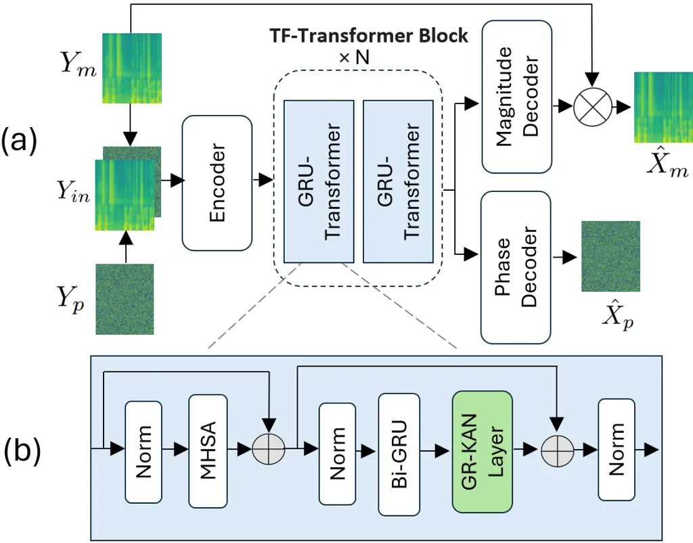
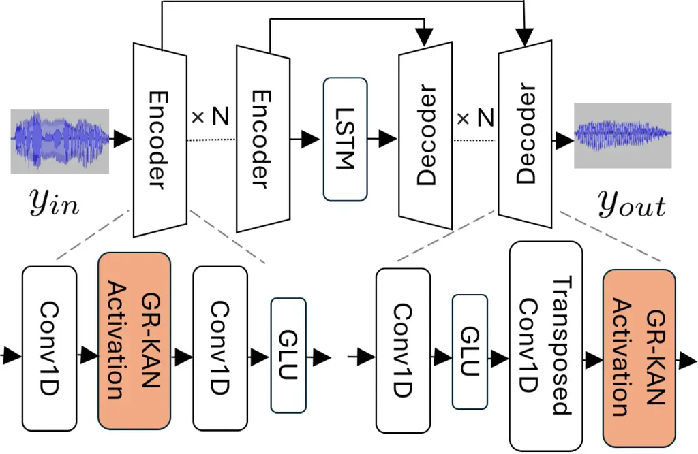
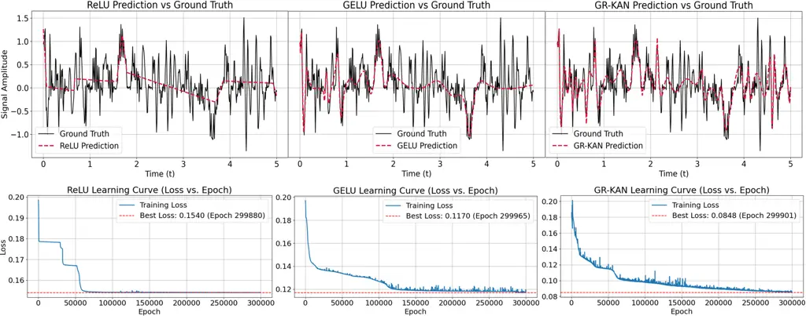

# From KAN to GR-KAN: Advancing Speech Enhancement with KAN-Based Methodology Thanks: Email: li0078ng@e.ntu.edu.sg

Haoyang Li    Yuchen Hu    Chen Chen    Sabato Marco Siniscalchi   
Songting Liu    Eng Siong Chng

###### Abstract

Deep neural network (DNN)-based speech enhancement (SE) usually uses
conventional activation functions, which lack the expressiveness to
capture complex multiscale structures needed for high-fidelity SE.
Group-Rational KAN (GR-KAN), a variant of Kolmogorov-Arnold Networks
(KAN), retains KAN’s expressiveness while improving scalability on
complex tasks. We adapt GR-KAN to existing DNN-based SE by replacing
dense layers with GR-KAN layers in the time-frequency (T-F) domain
MP-SENet and adapting GR-KAN’s activations into the 1D CNN layers in the
time-domain Demucs. Results on Voicebank-DEMAND show that GR-KAN
requires up to 4× fewer parameters while improving PESQ by up to 0.1. In
contrast, KAN, facing scalability issues, outperforms MLP on a
small-scale signal modeling task but fails to improve MP-SENet. We
demonstrate the first successful use of KAN-based methods for consistent
improvement in both time- and SoTA TF-domain SE, establishing GR-KAN as
a promising alternative for SE.

^(†)^(†)address: ¹Nanyang Technological University, Singapore  
²University of Palermo, Italy

Index Terms: Speech Enhancement, Kolmogorov-Arnold Networks.

## 1 Introduction

Speech enhancement (SE) reduces noise and distortion to improve speech
clarity, benefiting applications like hearing aids, telecommunications
and voice recognition systems. Traditional SE solutions are based on
digital signal processing solutions, such as Wiener filtering \[1\],
spectral subtraction \[2\] and minimum mean squared error
estimation\[3\]. However, these approaches fail to track non-stationary
noises and introduce annoying artifacts. Deep Neural Network (DNN)-based
SE methods have proven their superiority in more recent years \[4, 5, 6,
7\]. Broadly speaking, we can classify DNN-based SE methods under two
categories: (i) time domain methods \[8, 9, 10, 11, 12, 13\], and (ii)
time-frequency (TF) domain methods \[14, 15, 16, 17, 18, 19\].
Time-domain methods aim to predict clean waveform directly from noisy
counterparts, with Demucs \[9\] being a standard reference technique.
Demucs combines a convolutional encoder-decoder with LSTM layers for
effective sequential modeling. TF-domain methods predict a clean
TF-domain representation and recover a time domain waveform from it.
MP-SENet \[20\] is the state-of-the-art (SoTA) in this category, which
utilizes dilated DenseNet \[21\] and Transformer \[22\] blocks to
predict clean phase and magnitude spectrum, followed by waveform
reconstruction through the Inverse Short-Time Fourier Transform.

DNN-based SE methods predominantly rely on standard activation
functions, such as GELU \[23\], Swish \[24\], ReLU \[9\], PReLU \[25\],
and Leaky ReLU \[20\]. While effective, these functions may limit a
model’s ability to capture the intricate non-linear structures in
speech, for instance, harmonic patterns and phase variations, which are
critical for high-quality enhancement. In particular, piecewise linear
functions like ReLU, Leaky ReLU, and PReLU struggle with modeling smooth
variations, e.g., sinusoidal components \[26\]. Although smoother
activations like GELU and Swish alleviate this issue to some extent,
these activation function have a higher computational costs and do not
consistently outperform ReLU across different tasks \[26, 24\]. These
limitations, which we will further support through experiments, suggest
that DNN with conventional activation functions may not be optimal for
learning the complex representations necessary for SE.

Kolmogorov-Arnold Networks (KANs) \[27\] have recently emerged as an
alternative to MLPs due to their enhanced expressiveness, continual
learning capability, and interpretability. Unlike traditional MLP, KAN
consists entirely of learnable univariate activation functions on the
edges, each parameterized by a spline. This structural modification,
grounded in the Kolmogorov-Arnold theorem, allows KAN to theoretically
model complex non-linear patterns more effectively than MLPs that use
conventional activation functions. However, despite these theoretical
advantages, KAN sometimes fails to scale to complicated problems in
practice \[28\] \[29\]. Its use of independent spline functions per edge
causes rapid parameter growth, and its weight initialization disregards
variance-preserving principles, leading to unstable training dynamics
\[28\]. Hence, previous attempt on adapting KAN to SE had limited
success \[30\]. In \[30\], replacing linear layers with KAN layers in
Metricgan+ \[31\]’s generator generally degraded the overall
performance.

To address the above-mentioned KAN’s limitations, a new KAN variant
referred to Group-Rational KANs (GR-KANs) was proposed in \[28\].
GR-KANs follow the foundational idea of KANs but modify the way
functions are learned within the network, namely rational functions are
used as activation functions. Furthermore, a group-theoretic structure
is imposed on the activations to improve computational efficiency and
avoid excessive parameter growth. GR-KANs also use a variance-preserving
weight initialization strategy to improve training stability over KAN.
In this work, we explore GR-KAN for SE. We first compare KAN and GR-KAN
on a small-scale synthetic signal modeling task and find that both
outperform conventional MLPs. To further assess scalability, we have
integrated either KAN or GR-KAN layers into the time-frequency (TF) SoTA
MP-SENet model. This was done by replacing the dense layers in the
TF-Transformer blocks with KAN or GR-KAN layers. The experimental
results show that (i) KAN layers do not improve MP-SENet quality despite
the use of more trainable parameters, and (ii) GR-KAN layers outperform
dense layers with various conventional and learnable activation
functions, maintaining a comparable or smaller parameter count. In
addition, when integrated into the 1D CNN layers in the time-domain
Demucs model, GR-KANs also enable superior performance with four times
fewer parameters than the standard configuration. Our findings show that
while KAN struggles to adapt to SE, its variant, GR-KAN, overcomes these
limitations and can be easily integrated into current DNN-based SE
models to improve model performance while maintaining/reducing model
size.

## 2 Preliminaries

### 2.1 KAN: Kolmogorov-Arnold Network

The Kolmogorov-Arnold theorem \[32\] asserts that any continuous
function can be represented as a composition of univariate continuous
functions of a finite number of variables. A KAN layer $`L`$ is thus a
composition of learnable univariate functions, $`\phi`$(s), as shown in
Eq. (1):

```math
\aligned L(\mathbf{x})=\bmatrix\sum_{i=1}^{I}\phi_{i,1}(x_{i})&\dots\sum_{i=1}^{I}\phi_{i,J}(x_{i})\vskip-2.84526pt \tag{1}
```

where $`I`$ and $`J`$ are the input and output dimensions. In practice,
$`\phi`$ is approximated by Eq. (2):

```math
\aligned\phi(x)&=w_{1}b(x)+w_{2}S(x)\quad S(x)=\sum_{i}n_{i}B_{i}(x)\vskip-2.84526pt \tag{2}
```

where $`w_{1}`$ and $`w_{2}`$ are learnable parameters, $`b`$ is a
basis, such as Swish. $`S`$ is a spline function, where $`B_{i}`$ is the
B-spline basis function associated with each trainable control point
$`n_{i}`$.

While the replacement of the single scalar weight on each edge of MLP
with a KAN activation function $`\phi`$ brings about greater
expressiveness \[27\], this also makes the KAN layer significantly
larger and more computationally expensive. KANs were reported to be 10
times slower than MLPs in \[27\]. Additionally, \[28\] noted that KAN
violates the variance-preserving principle, impairing its trainability
and convergence.

### 2.2 GR-KAN: KAN variant based on rational functions

GR-KAN \[28\] replaces B-spline with a rational function, due to its
superior efficiency and expressiveness from a theoretical standpoint.
Furthermore, \[28\] splits the $`I`$ input channels into $`k`$ groups
and shares the parameters of the rational functions across all channels
in the same group to reduce the number of parameters. A GR-KAN layer
follows Eq. (3):

```math
\aligned L(\mathbf{x})&=\bmatrix\sum_{i=1}^{I}w_{i,1}F_{\lfloor\frac{i}{I_{k}}\rfloor}(x_{i})\dots\sum_{i=1}^{I}w_{i,J}F_{\lfloor\frac{i}{I_{k}}\rfloor}(x_{i})\vskip-2.84526pt \tag{3}
```

where the activation $`\phi_{i,j}`$ in Eq. 1 becomes
$`w_{i,j}\times F_{\lfloor\frac{i}{I_{k}}\rfloor}`$, with $`w_{i,j}`$
being a scaler, and $`F_{\lfloor\frac{i}{I_{k}}\rfloor}`$ a rational
function. $`I_{k}=I/k`$ is the number of channels in each group. A
GR-KAN layer $`L`$ is practically implemented as in Eq. (4):

```math
\aligned L(x)=LIN(GR(x))\vskip-2.84526pt \tag{4}
```

where $`LIN`$ is the matrix of $`w`$s in Eq. (3), and $`GR`$ is the
vector of rational functions.

## 3 KAN and GR-KAN in SE

### 3.1 Analysis on small-scale signal modeling

We first evaluate KAN and GR-KAN solutions on a small-scale signal
modeling task using a 5 second synthetic signal with sampling rate of 100. Results are compared against several MLP variants, with either
conventional or learnable activation functions. The synthetic signal
consists of dynamic, artificial syllables (150–250ms) with irregular
pauses (20–100ms). The base frequency of each syllable fluctuates
nonlinearly around 5 Hz, modulated by sine and cosine functions for
smooth transitions. The amplitude of each syllable is shaped by an
exponential decay envelope, randomly scaled between 0.5 and 1.5. Three
formant frequencies (500 Hz, 1500 Hz, 3000 Hz) are added to each
syllable with slight modulation ($`\pm`$40 Hz) and random phase shifts
to simulate speech-like resonances. Lastly, gaussian noise (0.05 std) is
added to the overall signal to introduce natural imperfections. The
result is a signal with fluctuating pitch, amplitude and phase dynamics,
and added resonant components, loosely capturing aspects of speech
dynamics.

### 3.2 Analysis on T-F domain SE

KAN and GR-KAN based SE solutions are compared using the TF-domain
MP-SENet architecture. Figure 1a illustrates the overall architecture of
the GR-KAN adapted model. The magnitude spectrum, $`Y_{m}`$, and the
wrapped phase spectrum, $`Y_{p}`$, are stacked and fed into the MP-SENet
encoder, followed by $`N=4`$ TF-Transformer blocks to capture local and
global dependencies across the time and frequency dimensions. The output
is then fed into a Magnitude Decoder and a Phase Decoder separately to
restore the enhanced, magnitude spectrum $`\hat{X}_{m}`$ and the
enhanced phase spectrum $`\hat{X}_{p}`$. We adapt GR-KAN to the
GRU-Transformer blocks by adding a GR-KAN layer (same as Eq. 4) after
the Bi-GRU block, as illustrated in figure 1b. To compare GR-KAN with
KAN, we swap the GR-KAN layer with a KAN layer, where the KAN layer
follows the implementation of efficient-kan ¹¹ 1
[https://github.com/Blealtan/efficient-kan](https://github.com/Blealtan/efficient-kan).
To further compare KAN and GR-KAN layer with conventional dense layers,
we swap the GR-KAN layer in figure 1b with a linear layer preceded by an
activation function such as GELU.



Figure 1: Architecture of (a) the Overall MP-SENet (b) the GR-KAN
adapted GRU-Transformer Block.

### 3.3 Analysis on Time domain SE

To further assess the robustness of GR-KAN for general SE, we select the
well-known time-domain SE model, Demucs, for adaptation, which operates
in a different data domain than the TF-domain MP-SENet. Figure 2
illustrates the GR-KAN adapted causal Demucs, where we have replaced the
ReLU activation functions in the original Encoders and Decoders with the
GR-KAN activation functions ($`GR`$ from Eq. 4). This setup differs
slightly from GR-KAN’s original formulation in Eq. (4), since a 1D CNN
layer is used instead of $`LIN`$ from Eq. (4). To further access
scalability, we compare our GR-KAN adapted Demucs with the original
Demucs across different model sizes by varying the number of encoder and
decoder blocks.



Figure 2: Architecture of the GR-KAN adapted Causal Demucs, where we
replace all ReLU activations in the Encoder and Decoder blocks with
GR-KAN activations. Please note that the last Decoder block does not
have the GR-KAN activations.

## 4 Experiments

### 4.1 Experimental Setup

The VoiceBank-DEMAND \[33\], a widely recognized SE benchmark, is used
to assess our KAN-based models. In this dataset, each clean utterance is
paired with a corresponding noisy version. Following standard practice,
all audio clips were downsampled to 16kHz. Finally, training and testing
SNRs and noises do not match. More details can be found in \[33\].

For the analysis indicated in Section 3.1, 3 sequentially arranged
linear layers with input and output dimensions of ($`1`$, $`h`$),
($`h`$, $`h`$) and ($`h`$, $`1`$), respectively, are used to compare
GR-KAN and several MLP variants. An activation function is placed
between every 2 linear layers. For GR-KAN, the GR-KAN activation ($`GR`$
from Eq. 4) is used as the activation function. For other MLP variants,
ReLU, GELU, PAU \[34\], and APL \[35\] are used, where PAU and APL are
learnable activation functions. For a relatively fair comparison in
terms of model size, we set $`h=8`$ for GR-KAN and APL, and $`h=12`$ for
other MLP based architectures. To further compare with KAN, 2
sequentially arranged KAN layers with input and output dimensions of
($`1`$, $`4`$) and ($`4`$, $`1`$), respectively, are used. The grid size
and spline order of the KAN layers are set to 5 and 3, respectively. All
models are trained for 300k epochs with learning rate of 0.001. The adam
optimizer, and the mean squared error loss were used.

For MP-SENet, we used a hop size, Hanning window size and FFT point
number of 100, 400 and 400, respectively. All MLP and GR-KAN models were
trained for 200 epochs with a batch size of 4. However, for all KAN
models, the batch size was reduced to 2 to prevent GPU out-of-memory
(OOM) errors. AdamW Optimizer \[36\] with $`\beta`$1 = 0.8 and
$`\beta`$2 = 0.99 was used. The learning rate was set to 0.0005, with a
decaying factor of 0.99 every epoch. Our loss functions are identical to
the original work \[20\]. For GR-KAN, the group size $`k`$ is set to 8.
For KAN, we set the grid size to 5 and the spline order to 3. For APL
activation, we set the number of learnable negative slopes to 5 and
introduced an L2 penalty to regularize $`a^{s}_{i}`$ and $`b^{s}_{i}`$
identically to the original work \[35\].

The causal Demucs with depth $`n\in\{4,5,6\}`$ (i.e. $`n`$ encoder
blocks and $`n`$ decoder blocks) and a 2-layer unidirectional LSTM was
used. We set the initial hidden dimension to 48, kernel size to 8,
stride size and resample factor to 4. All models are trained for 500
epochs using the adam optimizer at a learning rate of 0.0003 and batch
size of 16. The models are optimized using L1 loss on the waveform and a
multi-resolution STFT loss on the magnitude spectrum.

### 4.2 Evaluation Metrics

Following \[14\], we evaluated our models using PESQ \[37\], CSIG, CBAK,
COVL \[38\] and STOI \[39\], which measure perceptual speech quality,
signal distortion, noise distortion, overall quality and speech
intelligibility, respectively. Higher scores indicate better
performance. We also report the \#P, the number of parameters in the
models.

### 4.3 Experimental Results

Table 1 presents the results, in terms of Mean Squared Error (MSE), of
the signal fitting task described in Section 3.1. In this small-scale
task, both KAN and GR-KAN outperform the four MLP variants, whether
using fixed activation functions (ReLU, and GELU) or learnable ones
(PAU, and APL). This results seems to suggest that KAN-based models have
higher expressiveness than MLPs. We also visualize the artificial signal
with speech dynamics and some of the function fitting results in figure 3. From the figure, the ReLU-activated MLP struggle with smooth
curvature modeling due to its piecewise linear nature. The
GELU-activated MLP smooths out oscillations from 2s onward, losing
fine-grained variations. In contrast, GR-KAN preserves more fine-grained
variations and aligns peaks and valleys more accurately. These results
suggest that GR-KAN holds strong potential for speech modeling tasks,
where preserving subtle acoustic details and capturing dynamic,
nonlinear patterns are critical.

|     |       |       |       |       |        |       |
| --- | ----- | ----- | ----- | ----- | ------ | ----- |
|     | ReLU  | GELU  | PAU   | APL   | GR-KAN | KAN   |
| MSE | 0.154 | 0.117 | 0.090 | 0.121 | 0.085  | 0.081 |
| \#P | 193   | 193   | 213   | 257   | 173    | 240   |

Table 1: Comparison between KAN, GR-KAN and several MLP variants on the
artificial signal modeling task



Figure 3: Comparison of MLP (ReLU), MLP (GELU) and GR-KAN on fitting an
artificial signal with speech dynamics

Table 2 reports the performance of MP-SENet models using KAN layers,
GR-KAN layers, or dense layers in the GRU-Transformer blocks. To account
for variability from random initialization, all models were trained
three times, and the final test performance was averaged. In this more
complex task, KAN layers do not outperform dense layers with
conventional activation functions, and they also increase the overall
model size by approximately 50%. This finding is consistent with
previous studies \[28\] \[29\], which suggest that KAN can struggle with
more challenging tasks. GR-KAN layers instead consistently outperform
dense layers with conventional and learnable activation functions with a
similar parameter count of around 2.26M. Even when the number of dense
layers is doubled (LeakyReLU\*, GELU\*, PReLU\* in table 2), models
using conventional dense layers still consistently underperform the
GR-KAN adapted model in PESQ and COVL despite having a higher parameter
count. These findings demonstrate GR-KAN’s stronger expressiveness and
parameter efficiency against conventional MLP methods in speech
enhancement.

|             |                             |                             |                    |        |
| ----------- | --------------------------- | --------------------------- | ------------------ | ------ |
| Method      | PESQ                        | COVL                        | STOI               | \#P(M) |
| LeakyReLU   | $`3.557\pm 0.002`$          | $`4.206\pm 0.003`$          | $`0.958\pm 0.000`$ | 2.26   |
| GELU        | $`3.561\pm 0.006`$          | $`4.202\pm 0.006`$          | $`0.960\pm 0.001`$ | 2.26   |
| PReLU       | $`3.553\pm 0.010`$          | $`4.204\pm 0.014`$          | $`0.960\pm 0.001`$ | 2.27   |
| APL         | $`3.554\pm 0.004`$          | $`4.203\pm 0.009`$          | $`0.960\pm 0.001`$ | 2.28   |
| LeakyReLU\* | $`3.567\pm 0.004`$          | $`4.218\pm 0.003`$          | $`0.961\pm 0.000`$ | 2.30   |
| GELU\*      | $`3.566\pm 0.004`$          | $`4.212\pm 0.006`$          | $`0.960\pm 0.000`$ | 2.30   |
| PReLU\*     | $`3.573\pm 0.009`$          | $`4.221\pm 0.013`$          | $`0.960\pm 0.001`$ | 2.30   |
| KAN         | $`3.564\pm 0.002`$          | $`4.213\pm 0.011`$          | $`0.961\pm 0.000`$ | 3.44   |
| GR-KAN      | $`\textbf{3.588}\pm 0.007`$ | $`\textbf{4.229}\pm 0.007`$ | $`0.960\pm 0.001`$ | 2.26   |

Table 2: Comparison between KAN, GR-KAN and dense layers with different
activation functions in MP-SENet. \* indicates that the number of dense
layers used in the model are doubled. Performance reported in terms of
mean and standard deviation over 3 runs.

Table 3 reports Demucs’s performance when the GR-KAN activation function
is adapted to the encoder blocks only (KAN Enc), decoder blocks only
(KAN Dec) or both. For all 3 adaptations, GR-KAN consistently improve
the original Demucs in all metrics, with up to 0.1 increase in PESQ.
This demonstrates that the incorporation of the GR-KAN activations
enhances the model’s ability to capture complex dependencies, resulting
in improved performance, regardless of whether the adaptation is applied
to the encoder, decoder, or both components.

|         |         |       |       |       |       |       |
| ------- | ------- | ----- | ----- | ----- | ----- | ----- |
| KAN Enc | KAN Dec | PESQ  | CSIG  | CBAK  | COVL  | STOI  |
| N       | N       | 2.896 | 4.284 | 3.429 | 3.608 | 0.945 |
| Y       | N       | 2.975 | 4.348 | 3.498 | 3.683 | 0.947 |
| N       | Y       | 2.990 | 4.349 | 3.495 | 3.695 | 0.947 |
| Y       | Y       | 2.987 | 4.342 | 3.500 | 3.688 | 0.947 |

Table 3: Results of the GR-KAN adapted Demucs at depth $`5`$.

Table 4 compares the GR-KAN adapted Demucs and the original Demucs at
different depth levels. The GR-KAN adapted Demucs consistently
outperforms the original Demucs at the same depth level. In addition,
the GR-KAN adapted Demucs at depth 5 outperforms the original model at
depth 6, despite the latter having more than four times the total number
of parameters. The results further demonstrate the superior
expressiveness and parameter efficiency of the GR-KAN activation
functions in the time-domain Demucs.

|     |       |       |       |       |       |        |
| --- | ----- | ----- | ----- | ----- | ----- | ------ |
| KAN | Depth | PESQ  | CBAK  | COVL  | STOI  | \#P(M) |
| N   | 4     | 2.822 | 3.387 | 3.543 | 0.944 | 4.702  |
| Y   | 4     | 2.885 | 3.426 | 3.596 | 0.944 | 4.702  |
| N   | 5     | 2.896 | 3.429 | 3.608 | 0.945 | 18.868 |
| Y   | 5     | 2.990 | 3.495 | 3.695 | 0.947 | 18.868 |
| N   | 6     | 2.977 | 3.488 | 3.689 | 0.948 | 75.512 |
| Y   | 6     | 3.018 | 3.511 | 3.721 | 0.948 | 75.512 |

Table 4: Comparison of the GR-KAN adapted Demucs and the original Demucs
at different depth level

## 5 Conclusion

This work explores the use of KAN and its variant, GR-KAN, to enhance
existing DNN-based SE solutions. We begin by demonstrating the superior
expressiveness of KAN-based methods over MLPs with conventional and
learnable activation functions through a small-scale signal modeling
task. We then explain KAN’s inability to scale to complex SE task,
supported by experiments on MP-SENet. By integrating GR-KAN, a KAN
variant designed to overcome these scalability challenges into MP-SENet
and Demucs, we achieve consistent performance improvements across
time-domain and time-frequency domain SE models, while requiring up to 4
times fewer trainable parameters. These promising results suggest that
future SE methods and other speech generation models may benefit from
adopting GR-KAN to enhance performance.

## References

- \[1\] J. Lim and A. Oppenheim, “All-pole modeling of degraded speech,”
  _IEEE Transactions on Acoustics, Speech, and Signal Processing_,
  vol. 26, no. 3, pp. 197–210, 1978.
- \[2\] S. Boll, “Suppression of acoustic noise in speech using spectral
  subtraction,” _IEEE Transactions on acoustics, speech, and signal
  processing_, vol. 27, no. 2, pp. 113–120, 1979.
- \[3\] Y. Ephraim and D. Malah, “Speech enhancement using a
  minimum-mean square error short-time spectral amplitude estimator,”
  _IEEE Transactions on acoustics, speech, and signal processing_,
  vol. 32, no. 6, pp. 1109–1121, 1984.
- \[4\] Y. Xu, J. Du, L.-R. Dai, and C.-H. Lee, “A regression approach
  to speech enhancement based on deep neural networks,” _IEEE/ACM
  transactions on audio, speech, and language processing_, vol. 23,
  no. 1, pp. 7–19, 2014.
- \[5\] X. Lu, Y. Tsao, S. Matsuda, and C. Hori, “Speech enhancement
  based on deep denoising autoencoder,” in _Interspeech 2013_, 2013, pp.
  436–440.
- \[6\] X. Qian, J. Gao, Y. Zhang, Q. Zhang, H. Liu, L. P. Garcia, and
  H. Li, “Sav-se: Scene-aware audio-visual speech enhancement with
  selective state space model,” _IEEE Journal of Selected Topics in
  Signal Processing_, 2025.
- \[7\] X. Zhang, Q. Zhang, H. Liu, T. Xiao, X. Qian, B. Ahmed,
  E. Ambikairajah, H. Li, and J. Epps, “Mamba in speech: Towards an
  alternative to self-attention,” _IEEE Transactions on Audio, Speech
  and Language Processing_, 2025.
- \[8\] S. Pascual, A. Bonafonte, and J. Serra, “Segan: Speech
  enhancement generative adversarial network,” _arXiv preprint
  arXiv:1703.09452_, 2017.
- \[9\] A. Defossez, G. Synnaeve, and Y. Adi, “Real time speech
  enhancement in the waveform domain,” _arXiv preprint
  arXiv:2006.12847_, 2020.
- \[10\] E. Kim and H. Seo, “Se-conformer: Time-domain speech
  enhancement using conformer.” in _Interspeech_, 2021, pp. 2736–2740.
- \[11\] C. Chen, N. Hou, D. Ma, and E. S. Chng, “Time domain speech
  enhancement with attentive multi-scale approach,” in _2021
  Asia-Pacific Signal and Information Processing Association Annual
  Summit and Conference (APSIPA ASC)_. IEEE, 2021, pp. 679–683.
- \[12\] Z. Wang, X. Zhu, Z. Zhang, Y. Lv, N. Jiang, G. Zhao, and
  L. Xie, “Selm: Speech enhancement using discrete tokens and language
  models,” in _ICASSP 2024-2024 IEEE International Conference on
  Acoustics, Speech and Signal Processing (ICASSP)_. IEEE, 2024, pp.
  11 561–11 565.
- \[13\] H. Li, J. Q. Yip, T. Fan, and E. S. Chng, “Speech enhancement
  using continuous embeddings of neural audio codec,” in _ICASSP
  2025-2025 IEEE International Conference on Acoustics, Speech and
  Signal Processing (ICASSP)_. IEEE, 2025, pp. 1–5.
- \[14\] S.-W. Fu, C.-F. Liao, Y. Tsao, and S.-D. Lin, “Metricgan:
  Generative adversarial networks based black-box metric scores
  optimization for speech enhancement,” in _International Conference on
  Machine Learning_. PmLR, 2019, pp. 2031–2041.
- \[15\] R. Cao, S. Abdulatif, and B. Yang, “Cmgan: Conformer-based
  metric gan for speech enhancement,” _arXiv preprint
  arXiv:2203.15149_, 2022.
- \[16\] V. Zadorozhnyy, Q. Ye, and K. Koishida, “Scp-gan:
  Self-correcting discriminator optimization for training consistency
  preserving metric gan on speech enhancement tasks,” _arXiv preprint
  arXiv:2210.14474_, 2022.
- \[17\] F. Dang, H. Chen, and P. Zhang, “Dpt-fsnet: Dual-path
  transformer based full-band and sub-band fusion network for speech
  enhancement,” in _ICASSP 2022-2022 IEEE International Conference on
  Acoustics, Speech and Signal Processing (ICASSP)_. IEEE, 2022, pp.
  6857–6861.
- \[18\] D. Yin, Z. Zhao, C. Tang, Z. Xiong, and C. Luo, “Tridentse:
  Guiding speech enhancement with 32 global tokens,” _arXiv preprint
  arXiv:2210.12995_, 2022.
- \[19\] M. Chen, Q. Zhang, M. Wang, X. Zhang, H. Liu, E. Ambikairaiah,
  and D. Chen, “Selective state space model for monaural speech
  enhancement,” _IEEE Transactions on Consumer Electronics_, 2025.
- \[20\] Y.-X. Lu, Y. Ai, and Z.-H. Ling, “Explicit estimation of
  magnitude and phase spectra in parallel for high-quality speech
  enhancement,” _arXiv preprint arXiv:2308.08926_, 2023.
- \[21\] A. Pandey and D. Wang, “Densely connected neural network with
  dilated convolutions for real-time speech enhancement in the time
  domain,” in _ICASSP 2020-2020 IEEE International Conference on
  Acoustics, Speech and Signal Processing (ICASSP)_. IEEE, 2020, pp.
  6629–6633.
- \[22\] A. Vaswani, “Attention is all you need,” _Advances in Neural
  Information Processing Systems_, 2017.
- \[23\] D. Hendrycks and K. Gimpel, “Gaussian error linear units
  (gelus),” _arXiv preprint arXiv:1606.08415_, 2016.
- \[24\] P. Ramachandran, B. Zoph, and Q. V. Le, “Searching for
  activation functions,” _arXiv preprint arXiv:1710.05941_, 2017.
- \[25\] K. He, X. Zhang, S. Ren, and J. Sun, “Delving deep into
  rectifiers: Surpassing human-level performance on imagenet
  classification,” in _Proceedings of the IEEE international conference
  on computer vision_, 2015, pp. 1026–1034.
- \[26\] T. Szandała, “Review and comparison of commonly used activation
  functions for deep neural networks,” _Bio-inspired neurocomputing_,
  pp. 203–224, 2021.
- \[27\] Z. Liu, Y. Wang, S. Vaidya, F. Ruehle, J. Halverson,
  M. Soljačić, T. Y. Hou, and M. Tegmark, “Kan: Kolmogorov-arnold
  networks,” _arXiv preprint arXiv:2404.19756_, 2024.
- \[28\] X. Yang and X. Wang, “Kolmogorov-arnold transformer,” _arXiv
  preprint arXiv:2409.10594_, 2024.
- \[29\] R. Yu, W. Yu, and X. Wang, “Kan or mlp: A fairer comparison,”
  _arXiv preprint arXiv:2407.16674_, 2024.
- \[30\] Y. Mai and S. Goetze, “Metricgan+ kan: Kolmogorov-arnold
  networks in metric-driven speech enhancement systems,” _channels_,
  vol. 5, p. 5.
- \[31\] S.-W. Fu, C. Yu, T.-A. Hsieh, P. Plantinga, M. Ravanelli,
  X. Lu, and Y. Tsao, “Metricgan+: An improved version of metricgan for
  speech enhancement,” _arXiv preprint arXiv:2104.03538_, 2021.
- \[32\] A. N. Kolmogorov, “On the representation of continuous
  functions of many variables by superposition of continuous functions
  of one variable and addition,” in _Doklady Akademii Nauk_, vol. 114,
  no. 5. Russian Academy of Sciences, 1957, pp. 953–956.
- \[33\] C. Valentini-Botinhao, X. Wang, S. Takaki, and J. Yamagishi,
  “Investigating rnn-based speech enhancement methods for noise-robust
  text-to-speech.” in _SSW_, 2016, pp. 146–152.
- \[34\] A. Molina, P. Schramowski, and K. Kersting,
  “Pad$`\backslash`$’e activation units: End-to-end learning of flexible
  activation functions in deep networks,” _arXiv preprint
  arXiv:1907.06732_, 2019.
- \[35\] F. Agostinelli, “Learning activation functions to improve deep
  neural networks,” _arXiv preprint arXiv:1412.6830_, 2014.
- \[36\] I. Loshchilov and F. Hutter, “Decoupled weight decay
  regularization,” _arXiv preprint arXiv:1711.05101_, 2017.
- \[37\] A. W. Rix, J. G. Beerends, M. P. Hollier, and A. P. Hekstra,
  “Perceptual evaluation of speech quality (pesq)-a new method for
  speech quality assessment of telephone networks and codecs,” in _2001
  IEEE international conference on acoustics, speech, and signal
  processing. Proceedings (Cat. No. 01CH37221)_, vol. 2. IEEE, 2001, pp.
  749–752.
- \[38\] Y. Hu and P. C. Loizou, “Evaluation of objective quality
  measures for speech enhancement,” _IEEE Transactions on audio, speech,
  and language processing_, vol. 16, no. 1, pp. 229–238, 2007.
- \[39\] C. H. Taal, R. C. Hendriks, R. Heusdens, and J. Jensen, “An
  algorithm for intelligibility prediction of time–frequency weighted
  noisy speech,” _IEEE Transactions on audio, speech, and language
  processing_, vol. 19, no. 7, pp. 2125–2136, 2011.
