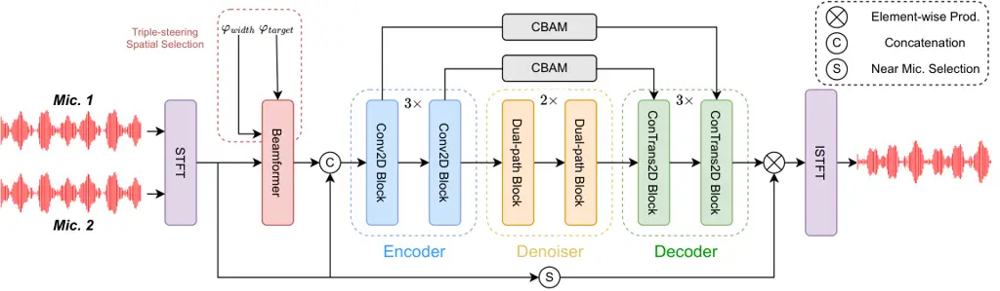

# Neural Directed Speech Enhancement with Dual Microphone Array in High Noise Scenario

Wen Wen¹, Qiang Zhou^(1,2), Yu Xi¹, Haoyu Li¹, Ziqi Gong², Kai Yu^(1†)
^(†)^(†)thanks: \$ˆ†\$Kai Yu is the corresponding author.
Affiliation: ¹MoE Key Lab of Artificial Intelligence, AI Institute,
X-LANCE Lab, Shanghai Jiao Tong University, Shanghai, China
Affiliation: ²AISpeech Ltd, Suzhou, China Affiliation:  {wenyideng,
yuxi.cs, haoyu.li.cs, kai.yu}@sjtu.edu.cn    {qiang.zhou,
ziqi.gong}@aispeech.com Affiliation: 

###### Abstract

In multi-speaker scenarios, leveraging spatial features is essential for
enhancing target speech. While with limited microphone arrays,
developing a compact multi-channel speech enhancement system remains
challenging, especially in extremely low signal-to-noise ratio (SNR)
conditions. To tackle this issue, we propose a triple-steering spatial
selection method, a flexible framework that uses three steering vectors
to guide enhancement and determine the enhancement range. Specifically,
we introduce a causal-directed U-Net (CDUNet) model, which takes raw
multi-channel speech and the desired enhancement width as inputs. This
enables dynamic adjustment of steering vectors based on the target
direction and fine-tuning of the enhancement region according to the
angular separation between the target and interference signals. Our
model with only a dual microphone array, excels in both speech quality
and downstream task performance. It operates in real-time with minimal
parameters, making it ideal for low-latency, on-device streaming
applications.

###### Index Terms: 

Multi-channel, directional speech enhancement, causal-directed, speech
recognition.

## I Introduction

Recently, speech enhancement (SE) in extremely low signal-to-noise ratio
(SNR) environments has gained significant attention due to its critical
applications in telecommunications, hearing aids, keyword
spotting (KWS), and automatic speech recognition (ASR) systems \[1, 2,
3, 4, 5, 6, 7, 8, 9\]. Although some downstream works \[10, 11\] aim to
achieve strong noise robustness, it’s difficult to process all kinds of
complex challenges without SE front-ends. The main challenges include
background noise, interference, and reverberation, all of which can
severely degrade speech intelligibility and quality. Among these, human
speech interference presents the greatest challenge, as downstream
systems struggle to differentiate target speech from competing speech,
resulting in a significant performance decline.

It is well known that humans can focus on specific directions using
binaural spatial information. Similarly, modern hearing aids, speech
recognition systems, and other devices are equipped with multiple
microphones. As a result, multichannel SE has gained importance \[12\],
with many researchers exploring the use of spatial features for speech
separation or speaker extraction \[13, 14, 15, 16, 17\]. Traditional
multichannel SE techniques, such as beamformers \[18, 19, 20\] like the
delay-and-sum \[21\] and generalized sidelobe canceller (GSC) \[22\],
face performance limitations. Recently, many neural network methods have
outperformed traditional methods in both quality and intelligibility of
enhancing speech, such as EMGSE \[23\], VSEGAN \[24\],
METRICGAN-U \[25\], HGCN \[26\], TF-GridNet \[27\] and
FullSubNet+ \[28\]. However, they also have several limitations:
Firstly, they often predefined the target speech region rather than
input spatial information while using, such as GSENet \[29\],
BASNet \[30\] and DSENet \[31\]. Secondly, they are mainly focused on
scenarios involving more than three microphones like Multi-pass
extraction \[14\], JNF \[32\] and JNF-SSF \[33\]. Using too many
microphones is impractical for on-device SE systems, as resource
consumption increases rapidly with the number of microphones, while
these systems are constrained by memory and computational resources.
Additionally, the large-scale parameters of neural networks limit their
feasibility in real-world applications. Lastly, previous works have
primarily focused on improving speech quality metrics, often overlooking
their impact on downstream tasks.

In this paper, we propose a causal-directed U-Net (CDUNet) model that
integrates U-Net \[34\] with beamforming. Our approach focuses on using
the spatial location of the target speaker as a cue, aiming to create a
non-linear filter that can be flexibly steered in the chosen direction.
Additionally, we introduce variable enhancement widths for different
interference angles, allowing the model to extract detailed information
about interfering signals and dynamically adjust the enhancement range.

The contributions of this work are summarized as follows:

1.  1.  We propose a novel triple-steering spatial selection method that
        integrates three steering vectors with a U-Net architecture to
        determine both the target direction and enhancement scope.
2.  2.  This is the first work to introduce width as an input parameter,
        enabling the model to flexibly adapt the enhancement range based on
        the application context.
3.  3.  Compared to conventional beamformers and various neural network
        baselines, the proposed CDUNet not only delivers superior front-end
        performance in both fixed and variable target directions but also
        enhances backend ASR performance.

## II Triple-steering spatial selection method

### II-A Problem Definition

This research targets the so-called cocktail-party problem: extracting
the speech signal of a target speaker from the interfering speech. We
assume that the interfering speakers originate from different directions
than the target speaker. Thus, the problem can be described as follows:

```math
\vskip-1.0pty_{i}(t)=s(t;\mu_{1})+i(t;\mu_{2})+n(t), \tag{1}
```

where $`y_{i}(t)`$ denotes the input signal captured by the $`i_{th}`$
microphone, $`s(t)`$ represents the target speech signal, $`i(t)`$
indicates the interfering speech, $`n(t)`$ stands for the noise, and
$`\mu_{1}`$ and $`\mu_{2}`$ represent the azimuthal angles of the target
and interfering sound sources relative to the microphone, respectively.
The goal of speech enhancement is to train a deep neural network
$`f_{\theta}`$ that maps $`y(t)`$ to $`s(t)`$. The enhanced signal
$`\hat{s}`$ is then estimated by:

```math
\hat{s}=f(y_{1\sim 2},\mu_{1};\theta), \tag{2}
```

where $`\theta`$ represents the network parameters, $`\hat{s}`$ denotes
the predicted output, and $`y_{1\sim 2}`$ refers to the 2-channel speech
signals captured by the microphones.

### II-B Triple-steering Spatial Selection

In our method, we utilize the target angle and two edge angles,
calculated by subtracting and adding the input width to the target
angle, to generate three steering vectors for the beamformer. The
network then takes the frequency-domain representations of two raw
microphone signals, along with the beamformer outputs at the target
angle and the two edge angles as input. This allows the model to
accurately localize the target speaker’s direction. Additionally, by
incorporating the input width, the model estimates the angular
separation between the target and interfering sources, enabling more
precise directed enhancement.

### II-C Causal-Directed U-Net Model



Fig. 1: Illustration of the CDUNet architecture. The beamformer output
incorporates both the target direction and the width input, which
captures the spatial area information crucial for enhancement.
$`\varphi_{width}`$ denotes the extent of the target region to be
enhanced, and $`\varphi_{target}`$ specifies the orientation of the
target speaker. The ”Near Mic. Selection” operation selects the speech
signal from the microphone that is positioned closer to the target
speaker.

As illustrated in Figure 1, our model utilizes a convolution U-Net
architecture. We employ a robust encoder-decoder architecture with skip
connections to construct a deep neural network. The encoder comprises 3
two-dimensional convolutional (Conv2D) blocks that encode the input
features into a latent representation. Correspondingly, the decoder
composes 3 two-dimensional transposed convolutional (ConTrans2D) blocks
that decode the latent space features back into the feature space.

Between the encoder and decoder, we integrate sequence modeling modules,
including a frequency sequence layer and a Long Short-Term Memory(LSTM)
layer, following the Dual-Path Recurrent Neural Network(DPRNN)
framework.

Additionally, we incorporate the Convolutional Block Attention
Module(CBAM) \[35\], which combines channel and spatial attention
mechanisms. In our model, CBAM is applied within the decoder and skip
connections to recalibrate the Time-Frequency (TF) feature maps, thereby
enhancing target reconstruction accuracy.

Let $`Y^{(i)}\in\mathbb{R}^{B\times C_{i}\times F_{i}\times T}`$ be the
output of the $`i`$-th encoder block, where $`i\in[1,3]`$. The channel
attention gate for the $`i`$-th block,
$`G(i)_{c}\in\mathbb{R}^{B\times C_{i}\times 1\times 1}`$, is derived as
follows:

```math
G\left(i\right)_{c}=\sigma\left(W_{2}\left(W_{1}\left(F\left(i\right)_{avg_{c}}\right)\right)+W_{2}\left(W_{1}F\left(i\right)_{\max_{c}}\right)\right), \tag{3}
```

where $`\sigma`$ represents the sigmoid activation function, while
$`W_{1}`$ and $`W_{2}`$ denote the weights of shared linear layers. The
average pooling $`F(i){avg_{c}}=\text{AvgPool}(Y^{(i)})`$ and max
pooling $`F(i){max_{c}}=\text{MaxPool}(Y^{(i)})`$ are applied to
$`Y^{(i)}`$. and the channel attention gate is applied to $`Y(i)`$ to
calculate $`Y(i)_{c}=G(i)_{c}\cdot Y(i)`$: The spatial attention gate
$`G_{f}^{(i)}\in\mathbb{R}^{B\times 1\times F_{i}\times T}`$ is
calculated as follows:

```math
G\left(i\right)_{f}=\sigma\left(fconv\left(\left[F\left(i\right)_{avgf};F\left(i\right)_{maxf}\right]\right)\right), \tag{4}
```

where $`f_{\text{conv}}`$ is a convolutional(Conv2D) layer. The spatial
attention gate is then applied to $`Y(i)_{c}`$ to calculate
$`Y_{f}(i)=G(i)_{f}\cdot Y(i)_{c}`$.

The output speech signal is estimated by applying the mask generated by
the decoder to the nearer raw channel. The nearer channel is selected
based on its proximity to the input target angle, with the closer
channel chosen for processing. For instance, if the input angle is
smaller than 90^(∘), the first channel is selected as the nearer
channel, otherwise, the second channel is used.

### II-D Loss Function

In the Short-Time Fourier Transform(STFT) domain, the target and
estimated outputs are denoted as $`\mathbf{s}`$ and
$`\hat{\mathbf{s}}`$, respectively. Our preliminary studies indicated
that employing the Scale-Invariant Signal-to-Noise Ratio(SI-SNR) \[36\]
loss function significantly enhances the stability of the learning
process. However, when the network was trained solely with the SI-SNR
loss, we observed a tendency for the network to excessively suppress
low-frequency components. To mitigate this issue, we propose an
innovative combined loss function incorporating both SI-SNR and
Multi-Resolution STFT(MR-STFT) \[37\] losses. The formulation of our
proposed combined loss function is as follows:

```math
\mathcal{L}\left(\mathbf{s},\hat{\mathbf{s}}\right)=\alpha_{1}\sum_{i\in I}{\mathcal{L}_{MR-STFT}^{(i)}}+\alpha_{2}\mathcal{L}_{SI-SNR}(\mathbf{s},\hat{\mathbf{s}}), \tag{5}
```

where $`I`$ is the set of STFT points, $`\alpha_{1}`$ and $`\alpha_{2}`$
are weighting factors.

|                      |          |
| -------------------- | -------- |
| Room characteristics |          |
| Width                | 2.5-5m   |
| Length               | 3-9m     |
| Height               | 2.2-3.5m |
| T60                  | 0.2-0.5s |

Fig. 2: Illustration of the simulation setup of the first fixed-target
dataset. The target direction ranges from 85° to 95°, represented by red
stars in the figure, while the interference direction is located 15°
away from the target direction, indicated by green stars. Room
information is uniformly sampled from the provided ranges in the table.

## III Experimental Setup

### III-A Dataset

All of the clean and interference utterances are randomly sampled from
the LibriSpeech \[38\] and our internal corpora. We simulate training
datasets in the following style:

- •
  Geometry. Rooms with different geometries are generated in alignment
  with the JNF \[32\] benchmark, as depicted in figure 2. Within each
  simulated room, the microphone spacing is set to 30 mm. The audio
  sources are selected at random, with one designated as the target
  source and the other as the interference.

  |      |      |                 |                          |                |                |                |                |                |                |                 |                 |                 |                 |                 |                 |      |
  | ---- | ---- | --------------- | ------------------------ | -------------- | -------------- | -------------- | -------------- | -------------- | -------------- | --------------- | --------------- | --------------- | --------------- | --------------- | --------------- | ---- |
  | SNR  | UNet | Model           | $`\bm{\varphi_{inter}}`$ |                |                |                |                |                |                |                 |                 |                 |                 |                 |                 | Avg. |
  |      |      |                 | $`0^{\circ}`$            | $`15^{\circ}`$ | $`30^{\circ}`$ | $`45^{\circ}`$ | $`60^{\circ}`$ | $`75^{\circ}`$ | $`90^{\circ}`$ | $`105^{\circ}`$ | $`120^{\circ}`$ | $`135^{\circ}`$ | $`150^{\circ}`$ | $`165^{\circ}`$ | $`180^{\circ}`$ |      |
  | 0 dB | \-   | Noisy Sp.       | 2.05                     | 2.09           | 2.08           | 2.10           | 2.05           | 2.07           | 2.07           | 2.07            | 2.09            | 2.09            | 2.08            | 2.11            | 2.05            | 2.08 |
  |      | ✘    | DAS \[21\]      | 2.07                     | 2.10           | 2.10           | 2.11           | 2.06           | 2.07           | 2.07           | 2.08            | 2.09            | 2.10            | 2.09            | 2.13            | 2.06            | 2.09 |
  |      |      | GSC \[22\]      | 2.12                     | 2.15           | 2.14           | 2.14           | 2.08           | 2.08           | 2.07           | 2.09            | 2.12            | 2.13            | 2.13            | 2.17            | 2.11            | 2.12 |
  |      |      | JNF \[32\]      | 2.07                     | 2.11           | 2.10           | 2.11           | 2.06           | 2.08           | 2.08           | 2.09            | 2.10            | 2.10            | 2.09            | 2.13            | 2.07            | 2.09 |
  |      | ✓    | U-Net \[34\]    | 2.41                     | 2.44           | 2.42           | 2.47           | 2.47           | 2.44           | 2.12           | 2.42            | 2.48            | 2.49            | 2.48            | 2.52            | 2.46            | 2.43 |
  |      |      | IPD U-Net       | 2.30                     | 2.34           | 2.32           | 2.36           | 2.32           | 2.28           | 2.09           | 2.29            | 2.37            | 2.41            | 2.40            | 2.43            | 2.37            | 2.33 |
  |      |      | BF U-Net        | 2.44                     | 2.46           | 2.44           | 2.47           | 2.44           | 2.40           | 2.11           | 2.30            | 2.36            | 2.39            | 2.37            | 2.40            | 2.35            | 2.38 |
  |      |      | CDUNet (fixed)  | 2.53                     | 2.57           | 2.56           | 2.57           | 2.57           | 2.42           | 2.13           | 2.40            | 2.59            | 2.55            | 2.56            | 2.59            | 2.52            | 2.50 |
  |      |      | CDUNet (varied) | 2.39                     | 2.44           | 2.45           | 2.47           | 2.44           | 2.37           | 2.12           | 2.35            | 2.46            | 2.46            | 2.44            | 2.48            | 2.42            | 2.41 |
  | 5 dB | \-   | Noisy Speech    | 2.34                     | 2.40           | 2.38           | 2.40           | 2.35           | 2.38           | 2.38           | 2.39            | 2.38            | 2.40            | 2.38            | 2.42            | 2.34            | 2.38 |
  |      | ✘    | DAS \[21\]      | 2.36                     | 2.42           | 2.40           | 2.41           | 2.37           | 2.39           | 2.38           | 2.39            | 2.39            | 2.38            | 2.42            | 2.39            | 2.44            | 2.39 |
  |      |      | GSC \[22\]      | 2.41                     | 2.46           | 2.45           | 2.44           | 2.39           | 2.39           | 2.38           | 2.40            | 2.41            | 2.45            | 2.44            | 2.48            | 2.41            | 2.42 |
  |      |      | JNF \[32\]      | 2.36                     | 2.42           | 2.40           | 2.42           | 2.37           | 2.40           | 2.39           | 2.40            | 2.39            | 2.42            | 2.40            | 2.44            | 2.37            | 2.40 |
  |      | ✓    | U-Net \[34\]    | 2.69                     | 2.77           | 2.76           | 2.78           | 2.78           | 2.75           | 2.45           | 2.72            | 2.82            | 2.82            | 2.80            | 2.85            | 2.76            | 2.75 |
  |      |      | IPD U-Net       | 2.57                     | 2.63           | 2.63           | 2.64           | 2.61           | 2.60           | 2.42           | 2.60            | 2.70            | 2.73            | 2.72            | 2.76            | 2.67            | 2.64 |
  |      |      | BF U-Net        | 2.74                     | 2.79           | 2.77           | 2.77           | 2.75           | 2.71           | 2.43           | 2.60            | 2.67            | 2.69            | 2.67            | 2.71            | 2.62            | 2.69 |
  |      |      | CDUNet (fixed)  | 2.89                     | 2.94           | 2.93           | 2.92           | 2.90           | 2.73           | 2.45           | 2.76            | 2.85            | 2.85            | 2.83            | 2.86            | 2.79            | 2.82 |
  |      |      | CDUNet (varied) | 2.72                     | 2.79           | 2.78           | 2.78           | 2.75           | 2.68           | 2.45           | 2.66            | 2.78            | 2.77            | 2.76            | 2.81            | 2.72            | 2.73 |

  TABLE I: PESQ scores for a fixed area (training filter for target
  angle around $`90^{\circ}`$). $`\varphi_{inter}`$ indicates the
  direction of interference speech, and Noisy Sp. denotes noisy speech.

- •
  Mixture. We synthesize the raw audio captured by the two microphones
  using the simulated RIR. For training, the ground-truth signal is
  obtained from the early-reverberated component of the pristine signal,
  with a reverb delay of 150 ms.

Based on this method, we synthesize two datasets for baseline models and
the proposed CDUNet:

- •
  Fixed-target dataset. The fixed-target dataset is designed to compare
  our CDUNet model with the beamformer and other neural network
  baselines that don’t accept angle as an input feature. This dataset
  contains 250,000 training samples, with the target direction fixed
  between 85° and 95°. The signal-to-noise ratio (SNR) of the target
  speech relative to the mixture of interfering speakers varies from -5
  dB to 10 dB across the samples.
- •
  Variable-target dataset. To train a neural network for directed speech
  enhancement, we develop the variable-target dataset. This dataset
  introduces variability in the target speaker’s location, which is
  randomly generated, while the interference direction remains 15° away
  from the target direction. The SNR and the number of utterances in
  this dataset are consistent with those in the fixed-target dataset.

### III-B Model Setup

The input STFT and output inverse-STFT utilize a window size of 512 and
a step size of 256. The STFT representations are treated as separate
channels and decomposed into their respective phase and magnitude
components, culminating in a 10-channel frequency-domain input for the
CDUNet model.

### III-C Evaluation

Evaluation procedure. We construct both the fixed-target and the
variable-target evaluation datasets:

- •
  For the fixed-target evaluation, we create a corresponding test set
  with the target angle $`\varphi_{target}=90^{\circ}`$ and the
  interference angle span $`\varphi_{inter}`$ from $`0^{\circ}`$ to
  $`180^{\circ}`$, which consists of 500 utterances at SNR of 0 dB and 5
  dB.
- •
  For the evaluation of varied targets, we generate 500 utterances at 0
  dB with the target direction $`\varphi_{target}`$ spanning from 0^(∘)
  to 90^(∘) and evaluate the PESQ scores. We apply such angle setup
  because 0°-90° is symmetrical to 90°-180°for the two-microphone model.

Baselines. Two kinds of baselines are selected:

- •
  U-Net free. DAS is the traditional delay-and-sum beamformer
  model \[21\], GSC is the generalized sidelobe canceller model \[22\]
  while JNF \[32\] stands for Joint Spatial and Tempo-Spectral
  Non-linear Filter, which was conducted using a circular array
  comprising three microphones, leading to superior results not captured
  in Table I.
- •
  U-Net based. U-Net \[34\] employs the same U-Net architecture as
  displayed in the figure1. The IPD Unet model incorporates the
  inter-microphone phase difference (IPD), a well-established spatial
  feature, as input to the U-Net architecture, and BF U-Net supplements
  the U-Net model with the output from the beamformer, which lacks the
  width input in comparison to our proposed model CDUNet.

Evaluation metrics. We evaluated the perceptual evaluation of speech
quality (PESQ) for speech enhancement. Besides, the enhanced speech is
fed into a pre-trained ASR model for word error rate (WER).

## IV Results and Analysis

### IV-A Fixed Area and Directed Training

We evaluate the enhancement efficacy where the position of the target
speaker remains constant while the direction of the interfering speech
varies. All models are trained on our fixed-target dataset, which was
designed with target speakers positioned at approximately 90°, aligning
with the test conditions. The first row of Table I of each SNR setup
shows the PESQ scores with different interference angles. All of the
U-Net based models outperform U-Net free ones, which reveals the
superior efficiency of the U-Net architecture. Results on U-Net based
models indicates that the inclusion of IPD significantly degrades
performance, while the influence of the beamformer’s output on
performance is relatively negligible. The proposed CDUNet, with only
74.4k parameters, achieves markable improvement against baselines of
U-Net structures when trained on the fixed-target dataset, which
highlights the effectiveness of $`\varphi_{width}`$ in boosting the
performance. Moreover, the CUDNet trained on the variable-target dataset
with changeable speaker locations still yields comparable results to the
fixed-area enhancement as the U-Net. This achievement is particularly
remarkable given its parameters of only 74.4K, while the JNF’s contain
1M parameters. Therefore, our proposed CDUNet is capable of learning not
only one spatial filter but 180 with much fewer (1400 instead of 250000)
training examples per direction. This enhanced learning efficiency with
fewer examples underscores the model’s robustness and adaptability in
processing complex spatial data.

|           |                          |                          |                |                |                |                |                |      |
| --------- | ------------------------ | ------------------------ | -------------- | -------------- | -------------- | -------------- | -------------- | ---- |
| Model     | $`\bm{\varphi_{width}}`$ | $`\bm{\varphi_{inter}}`$ |                |                |                |                |                | Avg. |
|           |                          | $`0^{\circ}`$            | $`15^{\circ}`$ | $`30^{\circ}`$ | $`45^{\circ}`$ | $`60^{\circ}`$ | $`75^{\circ}`$ |      |
| Noisy Sp. | \-                       | 2.05                     | 2.09           | 2.08           | 2.10           | 2.05           | 2.07           | 2.07 |
| U-Net     | \-                       | 2.41                     | 2.44           | 2.42           | 2.47           | 2.47           | 2.44           | 2.44 |
| CDUNet    | 3°                       | 2.48                     | 2.50           | 2.49           | 2.52           | 2.49           | 2.46           | 2.49 |
|           | 5°                       | 2.49                     | 2.53           | 2.52           | 2.52           | 2.51           | 2.44           | 2.50 |
|           | 7°                       | 2.53                     | 2.57           | 2.56           | 2.57           | 2.57           | 2.42           | 2.54 |
|           | 15°                      | 2.50                     | 2.52           | 2.51           | 2.54           | 2.51           | 2.47           | 2.51 |
|           | 20°                      | 2.42                     | 2.45           | 2.44           | 2.48           | 2.46           | 2.46           | 2.45 |
|           | 60°                      | 2.34                     | 2.37           | 2.37           | 2.41           | 2.41           | 2.40           | 2.38 |

TABLE II: PESQ scores for a fixed target of different input widths.

### IV-B Different $`\varphi_{width}`$ for CDUNet

To determine the optimal input width for the CDUNet, we evaluate PESQ
scores with diverse input angles, utilizing the fixed-target training
dataset. We assess the impact of varying $`\varphi_{width}`$ on the
enhancement of speech quality. Results in II indicate that optimal
performance is attained with $`\varphi_{width}=7^{\circ}`$. The model
employs beamforming based on the target direction and the edge angles.
The edge angles are calculated by adjusting the target angle upwards and
downwards by the specified input width. The inclusion of the width input
enables the model to discern the spatial distribution of interfering
speeches, which is achieved by comparing the edge speech signals with
the target signals.

It’s worth noticing that the angular separation between the target and
interference direction always exceeds 15° within our dataset.
Consequently, when the width is set below 15°, the model effectively
separates the target speech by leveraging the input width as a
discriminative boundary. On the contrary, when the width is narrowed to
3°, the proximity of the input width to the target direction leads to a
diminished acquisition of novel and effective information, thus slightly
damaging the model’s performance. When the width extends beyond 15
degrees, the input width fails to separate the target direction from the
interfering direction, resulting in degraded performance. In practical
applications, the input width can be flexibly adjusted to align with the
actual interference direction.

### IV-C Directed Speech Enhancement

|               |                           |                |                |                |      |
| ------------- | ------------------------- | -------------- | -------------- | -------------- | ---- |
| Model         | $`\bm{\varphi_{target}}`$ |                |                |                | Avg. |
|               | $`0^{\circ}`$             | $`30^{\circ}`$ | $`60^{\circ}`$ | $`90^{\circ}`$ |      |
| Noisy Sp.     | 2.11                      | 2.07           | 2.04           | 2.09           | 2.08 |
| DAS           | 2.14                      | 2.12           | 2.07           | 2.10           | 2.11 |
| GSC           | 2.11                      | 1.93           | 2.01           | 2.14           | 2.05 |
| JNF           | 2.11                      | 2.08           | 2.06           | 2.10           | 2.09 |
| U-Net         | 1.23                      | 1.24           | 1.25           | 2.53           | 1.56 |
| IPD U-Net     | 1.22                      | 1.24           | 1.24           | 2.44           | 1.53 |
| BF U-Net      | 2.05                      | 1.96           | 1.94           | 2.27           | 2.06 |
| CDUNet (ours) | 2.47                      | 2.60           | 2.53           | 2.48           | 2.52 |

TABLE III: PESQ scores with varied target speaker location.

Table III reports that our CDUNet model maintains its capacity to adapt
dynamically to the target speaker, leveraging the input angle to achieve
consistent enhancement effects across all directions, irrespective of
the varying target angles. Although these baseline models are available
to directional speech enhancement within a predefined target area, their
performance deteriorates greatly when the target speaker’s position
shifts. This limitation necessitates the retraining of a model that is
specifically calibrated to the new target direction, thereby incurring
additional complexity and computational demands. Furthermore, this
capability highlights the versatility of our model, as it can be
effectively deployed across a multitude of real-world scenarios without
the requirement for scenario-specific model training. This attribute
exemplifies the model’s robust adaptability and its potential for
widespread application.

### IV-D Enhanced Signal for Downstream ASR

We employ the same model and use the identical test dataset from the
first Fixed target speaker location experiment to assess the model’s
performance. By evaluating the average performance across various test
subsets, we aimed to quantify the model’s enhancement effects on speech
recognition tasks by using the powerful open-sourced NeMo¹¹ 1
[https://catalog.ngc.nvidia.com/orgs/nvidia/teams/nemo/models/stt_en_fastconformer_hybrid_large_pc](https://catalog.ngc.nvidia.com/orgs/nvidia/teams/nemo/models/stt_en_fastconformer_hybrid_large_pc)
ASR model. This experiment serves as a supplement to the fixed-target
experiment, aiming at validating the enhancement of our model for
downstream tasks. The results presented in Table IV further underscore
that our proposed CDUNet model not only achieves high scores in speech
quality but also exhibits excellent compatibility with downstream tasks.

|      |                               |           |      |      |      |           |       |               |
| ---- | ----------------------------- | --------- | ---- | ---- | ---- | --------- | ----- | ------------- |
| SNR  | Wav Type (WER $`\downarrow`$) |           |      |      |      |           |       |               |
|      | Ref.                          | Noisy Sp. | DAS  | GSC  | JNF  | IPD U-Net | U-Net | CDUNet (Ours) |
| 0 dB | 2.20                          | 6.65      | 6.39 | 5.36 | 6.97 | 5.07      | 4.70  | 4.35          |
| 5 dB | 2.20                          | 3.93      | 3.84 | 3.46 | 4.14 | 3.46      | 3.37  | 3.11          |

TABLE IV: Performances of the downstream task for the fixed target
speaker’s location(training for target angle around $`90^{\circ}`$).

## V Conclusion

In this research, we propose a directional multi-channel speech
enhancement approach that integrates a beamformer with a causal U-Net
model. The model processes raw microphone audio, using the output of
beamformer along with target and width parameters to achieve focused
enhancement toward the target speaker. Our triple-steering spatial
selection method not only effectively improves speech quality under
multiple scenarios but also demonstrates superior performance for the
downstream ASR task. Additionally, our model operates efficiently with
just two microphones, making it suitable for real-world on-device
applications.

## References

- \[1\] A. Khandelwal, E. B. Goud, Y. Chand, L. Kumar, S. Prasad,
  N. Agarwala, and R. Singh, “Two channel audio zooming system for
  smartphone,” 2020.
- \[2\] A. Xu and R. R. Choudhury, “Learning to separate voices by
  spatial regions,” in _International Conference on Machine Learning_,
  2022, pp. 24 539–24 549.
- \[3\] Y. Xi, T. Tan, W. Zhang, B. Yang, and K. Yu, “Text adaptive
  detection for customizable keyword spotting,” in _Proc. IEEE
  ICASSP_. IEEE, 2022, pp. 6652–6656.
- \[4\] Y. Xi, H. Li, B. Yang, H. Li, H. Xu, and K. Yu, “TDT-KWS: Fast
  and accurate keyword spotting using token-and-duration
  transducer,” 2024.
- \[5\] Y. Luo and J. Yu, “Music source separation with band-split rnn,”
  _IEEE/ACM Transactions on Audio, Speech and Language Processing_, pp.
  1893–1901, 2023.
- \[6\] Y. Xi, W. Ding, K. Yu, and J. Lai, “Semi-supervised learning for
  code-switching ASR with large language model filter,” 2024.
- \[7\] Y. Xi, B. Yang, H. Li, J. Guo, and K. Yu, “Contrastive learning
  with audio discrimination for customizable keyword spotting in
  continuous speech,” 2024.
- \[8\] H. Li, B. Yang, Y. Xi, L. Yu, T. Tan, H. Li, and K. Yu,
  “Text-aware speech separation for multi-talker keyword spotting,” in
  _Interspeech 2024_, 2024, pp. 337–341.
- \[9\] K. Patterson, K. Wilson, S. Wisdom, and J. R. Hershey,
  “Distance-based sound separation,” in _Proc. ISCA Interspeech_, 2022,
  pp. 901–905.
- \[10\] Y. Xi, H. Li, X. Gu, H. Li, Y. Jiang, and K. Yu, “Streaming
  keyword spotting boosted by cross-layer discrimination
  consistency,” 2024.
- \[11\] Y. Xi, H. Li, H. Li, J. Guo, X. Li, W. Ding, and K. Yu,
  “NTC-KWS: Noise-aware CTC for robust keyword spotting,” 2024.
- \[12\] S. Gannot, E. Vincent, S. Markovich-Golan, and A. Ozerov, “A
  consolidated perspective on multimicrophone speech enhancement and
  source separation,” _IEEE/ACM Transactions on Audio, Speech, and
  Language Processing_, pp. 692–730, 2017.
- \[13\] R. Gu, S.-X. Zhang, Y. Zou, and D. Yu, “Complex neural spatial
  filter: Enhancing multi-channel target speech separation in complex
  domain,” _IEEE Signal Processing Letters_, pp. 1370–1374, 2021.
- \[14\] Z. Chen, X. Xiao, T. Yoshioka, H. Erdogan, J. Li, and Y. Gong,
  “Multi-channel overlapped speech recognition with location guided
  speech extraction network,” in _IEEE Spoken Language Technology
  Workshop (SLT)_, 2018.
- \[15\] Z.-Q. Wang, J. Le Roux, and J. R. Hershey, “Multi-channel deep
  clustering: Discriminative spectral and spatial embeddings for
  speaker-independent speech separation,” in _Proc. IEEE ICASSP_, 2018,
  pp. 1–5.
- \[16\] Z.-Q. Wang and D. Wang, “Combining spectral and spatial
  features for deep learning based blind speaker separation,” _IEEE/ACM
  Transactions on Audio, Speech, and Language Processing_, pp.
  457–468, 2019.
- \[17\] A. Aroudi and S. Braun, “Dbnet: Doa-driven beamforming network
  for end-to-end reverberant sound source separation,” in _Proc. IEEE
  ICASSP_, 2021, pp. 211–215.
- \[18\] M. Murthi and B. Rao, “All-pole modeling of speech based on the
  minimum variance distortionless response spectrum,” _IEEE Transactions
  on Speech and Audio Processing_, pp. 221–239, 2000.
- \[19\] T. Yoshioka, H. Erdogan, Z. Chen, and F. Alleva,
  “Multi-microphone neural speech separation for far-field multi-talker
  speech recognition,” in _Proc. IEEE ICASSP_, 2018, pp. 5739–5743.
- \[20\] X. Xiao, S. Zhao, D. L. Jones, E. S. Chng, and H. Li, “On
  time-frequency mask estimation for mvdr beamforming with application
  in robust speech recognition,” in _Proc. IEEE ICASSP_, 2017, pp.
  3246–3250.
- \[21\] P. Vary and R. Martin, “Digital speech transmission:
  Enhancement, coding and error concealment,” 2006. \[Online\].
  Available:
  [https://api.semanticscholar.org/CorpusID:62240326](https://api.semanticscholar.org/CorpusID:62240326)
- \[22\] J. Yang, X. Chen, H. Cai, and Y. Wang, “Generalized sidelobe
  canceler beamforming combined with eigenspace-wiener postfilter for
  medical ultrasound imaging,” _Technology and Health Care_, pp.
  501–512, 2022.
- \[23\] K.-C. Wang, K.-C. Liu, H.-M. Wang, and Y. Tsao, “Emgse:
  Acoustic/emg fusion for multimodal speech enhancement,” in _Proc. IEEE
  ICASSP_, 2022, pp. 1116–1120.
- \[24\] X. Xu, Y. Wang, D. Xu, Y. Peng, C. Zhang, J. Jia, and B. Chen,
  “Vsegan: Visual speech enhancement generative adversarial network,” in
  _Proc. IEEE ICASSP_, 2022, pp. 7308–7311.
- \[25\] S.-W. Fu, C. Yu, K.-H. Hung, M. Ravanelli, and Y. Tsao,
  “Metricgan-u: Unsupervised speech enhancement/ dereverberation based
  only on noisy/ reverberated speech,” in _Proc. IEEE ICASSP_, 2022, pp.
  7412–7416.
- \[26\] T. Wang, W. Zhu, Y. Gao, J. Feng, and S. Zhang, “Hgcn: Harmonic
  gated compensation network for speech enhancement,” in _ICASSP 2022 -
  2022 IEEE International Conference on Acoustics, Speech and Signal
  Processing (ICASSP)_, 2022, pp. 371–375.
- \[27\] Z.-Q. Wang, S. Cornell, S. Choi, Y. Lee, B.-Y. Kim, and
  S. Watanabe, “Tf-gridnet: Integrating full- and sub-band modeling for
  speech separation,” _IEEE/ACM Transactions on Audio, Speech, and
  Language Processing_, pp. 3221–3236, 2023.
- \[28\] J. Chen, Z. Wang, D. Tuo, Z. Wu, S. Kang, and H. Meng,
  “Fullsubnet+: Channel attention fullsubnet with complex spectrograms
  for speech enhancement,” in _Proc. IEEE ICASSP_, 2022, pp. 7857–7861.
- \[29\] Y. Yang, S.-F. Shih, H. Erdogan, J. Menjay Lin, C. Lee, Y. Li,
  G. Sung, and M. Grundmann, “Guided speech enhancement network,” in
  _Proc. IEEE ICASSP_, 2023, pp. 1–5.
- \[30\] Y. Yang, G. Sung, S.-F. Shih, H. Erdogan, C. Lee, and
  M. Grundmann, “Binaural angular separation network,” in _Proc. IEEE
  ICASSP_, 2024, pp. 1201–1205.
- \[31\] A. Kovalyov, K. Patel, and I. Panahi, “Dsenet: Directional
  signal extraction network for hearing improvement on edge devices,”
  _IEEE Access_, vol. 11, pp. 4350–4358, 2023.
- \[32\] K. Tesch and T. Gerkmann, “Spatially selective deep non-linear
  filters for speaker extraction,” in _Proc. IEEE ICASSP_, 2023, pp.
  1–5.
- \[33\] ——, “Multi-channel speech separation using spatially selective
  deep non-linear filters,” _IEEE/ACM Transactions on Audio, Speech, and
  Language Processing_, p. 542–553, 2024.
- \[34\] O. Ronneberger, P. Fischer, and T. Brox, “U-net: Convolutional
  networks for biomedical image segmentation,” in _Medical Image
  Computing and Computer-Assisted Intervention (MICCAI)_, 2015, pp.
  234–241.
- \[35\] S. Woo, J. Park, J.-Y. Lee, and I. S. Kweon, “Cbam:
  Convolutional block attention module,” in _Proceedings of the European
  Conference on Computer Vision (ECCV)_, 2018, pp. 3–19.
- \[36\] C. Ma, D. Li, and X. Jia, “Optimal scale-invariant
  signal-to-noise ratio and curriculum learning for monaural
  multi-speaker speech separation in noisy environment,” in _2020
  Asia-Pacific Signal and Information Processing Association Annual
  Summit and Conference (APSIPA ASC)_, 2020, pp. 711–715.
- \[37\] H. Shi, M. Mimura, L. Wang, J. Dang, and T. Kawahara,
  “Time-domain speech enhancement assisted by multi-resolution frequency
  encoder and decoder,” in _ICASSP 2023 - 2023 IEEE International
  Conference on Acoustics, Speech and Signal Processing (ICASSP)_, 2023,
  pp. 1–5.
- \[38\] V. Panayotov _et al._, “Librispeech: an asr corpus based on
  public domain audio books,” in _Proc. IEEE ICASSP_, 2015, pp.
  5206–5210.
