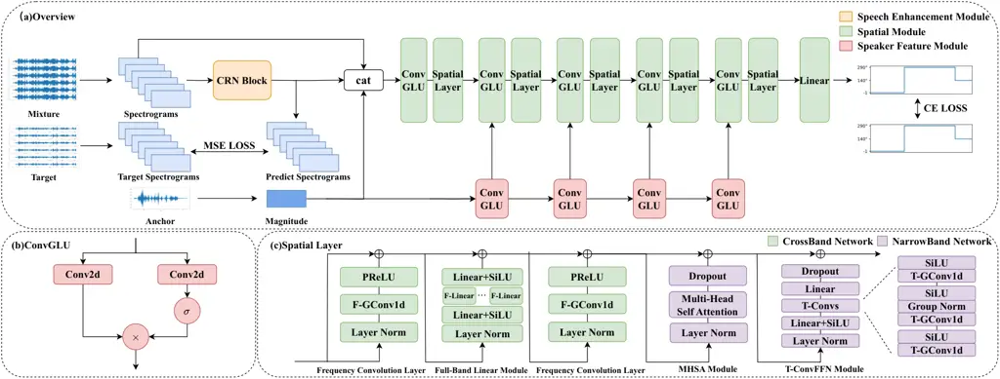

# Robust Target Speaker Direction of Arrival Estimation

Zixuan Li, Shulin He, Xueliang Zhang Affiliation: College of Computer
Science  
Inner Mongolia University  
Hohhot, China  
cslzx@mail.imu.edu.cn, heshulin@mail.imu.edu.cn, cszxl@imu.edu.cn
Affiliation: 

###### Abstract

In multi-speaker environments the direction of arrival (DOA) of a target
speaker is key for improving speech clarity and extracting target
speaker’s voice. However, traditional DOA estimation methods often
struggle in the presence of noise, reverberation, and particularly when
competing speakers are present. To address these challenges, we propose
RTS-DOA, a robust real-time DOA estimation system. This system
innovatively uses the registered speech of the target speaker as a
reference and leverages full-band and sub-band spectral information from
a microphone array to estimate the DOA of the target speaker’s voice.
Specifically, the system comprises a speech enhancement module for
initially improving speech quality, a spatial module for learning
spatial information, and a speaker module for extracting voiceprint
features. Experimental results on the LibriSpeech dataset demonstrate
that our RTS-DOA system effectively tackles multi-speaker scenarios and
established new optimal benchmarks.

###### Index Terms: 

direction of arrival estimation, full-band sub-band network

## I Introduction

Target speaker direction of arrival (DOA) estimation aims to accurately
locate the sound source of a target speaker in multi-speaker
environments. In complex environments such as conference rooms and
public spaces, accurate DOA estimation plays a critical role in enabling
sound source separation, thereby enhancing the accuracy and efficiency
of automatic speech recognition (ASR) systems. Accurate DOA estimation
for the target speaker is key in noisy multi-speaker environments for
identifying the main sound source and suppressing background noise. Our
previous work \[1\] has proven its importance.

In the field of DOA estimation, many classical signal processing
techniques have been extensively studied and applied. Broadly, these
techniques are categorized into: 1) Subspace methods like Multiple
Signal Classification (MUSIC) \[2\] and the estimation of signal
parameters via rotational invariance technique (ESPRIT) \[3\], 2)
Approaches based on Time Difference of Arrival (TDOA), which utilize
generalized cross-correlation (GCC) methods \[4, 5\], 3) Methods
focusing on signal synchronization, for example, Steered Response Power
with Phase Transform (SRP-PHAT) \[6\] and Multichannel Cross Correlation
Coefficient (MCCC) \[7\], and 4) Techniques that are model-based, such
as the maximum likelihood approach \[8\]. However, these conventional
methods face challenges such as unrealistic assumptions about
signal/noise models\[9\], high computational load and limited
effectiveness in low signal to noise ratios (SNR) or highly reverberant
conditions \[10\].

Deep neural networks (DNNs) have recently significantly enhanced speech
processing and Direction of Arrival (DOA) estimation, particularly in
the context of multi-microphone speech signal processing. \[11, 12,
13\], highlighting the significant potential of multi-channel speech in
DNN-based speech signal processing. \[1\] first integrated multi-channel
speech and voiceprint features to estimate the target speaker DOA,
subsequently using the Generalized Sidelobe Canceller (GSC) \[14\] to
extract the target speaker’s voice from mixed signals, significantly
improving the Short-Time Objective Intelligibility (STOI) \[15\].
However, the accuracy of DOA estimation was moderate, with performance
drastically declining in noisy environments. \[16\] utilized a DNN with
seven hidden layers to predict DOA using eigenvectors of correlation
matrices as input, though their method is sensitive to reverberation.
\[17\] achieved noise robustness by employing GCC features in a
perceptron network. \[18\]’s CNN approach, which uses STFT phase
components, demonstrated resilience to noise and microphone variations.
\[19\] combined CNN and LSTM for online DOA estimation in challenging
conditions, while \[20, 21\] incorporated attention mechanisms into DOA
estimation. Although these methods partially address noise and
reverberation challenges, they typically assume a stationary target
speaker and struggle with scenarios involving multiple interfering
speakers, as they cannot effectively distinguish the primary sound
source within mixed speech.

To address the challenges of accurately estimating the target speaker
DOA in complex scenarios with noise, reverberation, interfering
speakers, and target speaker movement, thereby improving outcomes for
downstream tasks, this paper introduces RTS-DOA, a robust, deep neural
network-based model for target speaker DOA estimation using
multi-channel speech. Specifically, the speech enhancement module in the
model preliminarily improves the signal quality, while the speaker
feature module extracts local features. The Spatial module models the
spatial information using full-band sub-band information, processed
speech, and local features, and finally outputs the estimated DOA.
Compared to the baseline, the accuracy of DOA prediction improved by
about $`30\%`$, while maintaining a compact model with only 0.12M
parameters.

## II System overview

Fig. 1: Structure of the six-channel microphone array. For brevity, the
figure presents the source signal distribution from 0° to 180°. The
unseen distribution from 180° to 360° is a mirror reflection of the
shown pattern, ensuring symmetry.

As shown in Figure 1, RTS-DOA system comprises a circular array of six
omnidirectional microphones, denoted as $`M_{1},\dots,M_{6}`$. We train
the system using 36 source locations, spaced evenly from 0° to 360° at
10° intervals, with each location 1.5 m from the center of the
microphone array. For each training example, we randomly select five
distinct locations from the 36 source locations. These five locations
represent the initial position, second position, interfering position,
anchor position for the target speaker and the location of the point
source noise. To simulate the movement of the target speaker, we
randomly shift the speaker from the initial position to the second
position at a randomly chosen time point during each utterance
simulation.

## III Method



Fig. 2: (a) The overall structure of the RTS-DOA system. (b) The
structure of ConvGLU, where $`\sigma`$ represents the Sigmoid activation
function and $`\odot`$ denotes element-wise multiplication. (c) The
detailed structure of the Spatial Layer.

The overall structure of RTS-DOA system is shown in Figure 2(a), which
mainly consists of three parts: (1) Speech Enhancement Module, (2)
Spatial Module, (3) Speaker Feature Module.

First, the complex spectral of the multi-channel microphones is taken as
the input for the Speech Enhancement Module, where the complex spectral
is obtained by concatenating the real and imaginary parts of each
Time-Frequency (T-F) bin. Subsequently, the output of the Speech
Enhancement Module is concatenated with the magnitude spectrum of the
anchor and then used as the input for the Spatial Module. At the same
time, the magnitude spectrum of the anchor serves as the input for the
Speaker Feature Module. Local features are obtained through the Speaker
Feature Module and are concatenated at the corresponding layer in the
Spatial Module. Afterwards, the DOA Estimation Module outputs the
estimated DOA.

Next, we will provide a detailed introduction to the three main
components of the proposed system.

### III-A Speech Enhancement Module

The Speech Enhancement Module uses the Convolutional Recurrent Neural
Network (CRN) \[22\], featuring an encoder-decoder structure with five
convolutional and deconvolutional layers, respectively, and two LSTM
layers between them for temporal modeling. The CRN processes the mixed
speech’s complex spectrum, producing noise-reduced multi-channel speech
for DOA estimation. Its output is refined through Mean Squared Error
(MSE) loss comparison with the clean speech’s complex spectrum,
optimizing the module’s learning.

### III-B Spatial Module

The Spatial Module consists of five interwoven Convolutional Gated
Linear Units (ConvGLU) \[23\] blocks and Spatial Layers \[24\], along
with a linear layer for predicting the classification results. The
complex spectral of the multi-channel microphones and the output of the
Speech Enhancement Module are concatenated with the magnitude spectrum
of the anchor to serve as the input. The local features obtained from
the Speaker Feature Module(This will be introduced in III-C) are
concatenated with the corresponding hidden states and then processed
through the respective ConvGLU and Spatial Layers. Finally, the
predicted DOA is obtained through the linear layer.

#### III-B1 ConvGLU

The structure of the ConvGLU is shown in Figure 2(b). It extended the
Convolutional Recurrent Neural Network by introducing a gating mechanism
to control the information flow within the network, achieving good
results in modeling complex spectral\[23\]. In this system, the same
ConvGLU structure is used to extract local patterns from the complex
spectral and reduce the feature resolution. The computational process
can be represented as follows:

```math
y=tanh(x*W_{1}+b_{1})\odot\sigma(x*W_{2}+b_{2}) \tag{1}
```

$`W`$ and $`b`$ represent the kernel and bias, respectively, $`\sigma`$
represents the sigmoid function. The symbols $`*`$ and $`\odot`$ denote
convolution operation and element-wise multiplication, respectively.

#### III-B2 Spatial Layer

The Spatial Layer has the same structure to that described in \[24\],
designed to learn complex spatial information. It consists of a
CrossBand Network and a NarrowBand Network, as shown in Figure 2(c).

The CrossBand Network is designed to learn cross-band information,
consisting of two frequency convolution layers and a full-band linear
module. It processes each time frame independently, and all time frames
use the same weights. The frequency convolution layer is used to model
the correlation between adjacent frequencies, where F-GConv1d represents
one group convolution along the frequency axis. The full-band linear
module models the entire frequency spectrum to mitigate the impact of
interfering speakers, noise, and reverberation, which narrowband signals
cannot accurately capture in terms of spatial information. The first
Linear layer is employed to change the dimensionality of channel to
$`H`$, and the second Linear layer is used to restore the dimensions.
Each F-Linear operates independently on the channel dimension.

The NarrowBand Network is designed to capitalize on the rich temporal
information present in narrow-band signals. The NarrowBand Network
processes each frequency independently, and all frequencies share
weights. The NarrowBand Network is composed of one multi-head
self-attention (MHSA) \[25\] module and one time-convolutional feed
forward network (T-ConvFFN). The MHSA is designed to utilize the
self-attention mechanism to identify and segregate components belonging
to the same or different speakers within an audio signal. T-ConvFFN is
used to replace the feedforward network in the Transformer \[25\]
architecture. The first Linear layer is employed to change the
dimensionality of channel to $`H^{\prime}`$, and the second Linear layer
is used to restore the dimensions.

### III-C Speaker Feature Module

The Speaker Feature Module has the exact same structure as the ConvGLU
in the Speech Enhancement Module. ConvGLU encodes the magnitude spectrum
of the anchor, and the average value of the encoded magnitude spectrum
for each frame is computed as the speaker feature. Speaker feature are
concatenated, layer-by-layer, with the matching ConvGLU layers in the
DOA module for each time frame \[26\], as depicted in Figure 2(a).

### III-D Loss function

The three main components of the proposed system, namely the Speech
Enhancement Module, Spatial Module, and Speaker Feature Module, are
trained jointly. The loss function consists of two parts:

```math
\mathcal{L}=\mathcal{L}_{MSE}+\mathcal{L}_{CE} \tag{2}
```

$`\mathcal{L}_{MSE}`$,which represents the Mean Squared Error (MSE) loss
between the output of the Speech Enhancement Module and the complex
spectral of the clean speech, can be expressed as:

```math
\mathcal{L}_{MSE}=\frac{1}{N}\sum_{n=1}^{N}\left((\text{R}(Y_{n})-\text{R}(\hat{Y}_{n}))^{2}+(\text{I}(Y_{n})-\text{I}(\hat{Y}_{n}))^{2}\right) \tag{3}
```

Where $`\text{R}(Y_{n})`$ and $`\text{I}(Y_{n})`$ respectively represent
the real and imaginary parts of the target complex spectrum at the
$`n`$th frequency point, and $`\text{R}(\hat{Y}_{n})`$ and
$`\text{I}(\hat{Y}_{n})`$ respectively represent the real and imaginary
parts of the complex spectrum output by the Speech Enhancement Module at
the $`n`$th frequency point.

$`\mathcal{L}_{CE}`$ is the cross-entropy loss, which compares the true
class labels with the predicted probabilities derived from the softmax
function.

## IV Experience

|     |                 |                    |                 |                    |                 |                    |                 |                    |                 |                    |                 |                    |                 |
| --- | --------------- | ------------------ | --------------- | ------------------ | --------------- | ------------------ | --------------- | ------------------ | --------------- | ------------------ | --------------- | ------------------ | --------------- |
| ID  | SIR             | -5                 |                 | -2                 |                 | 0                  |                 | 2                  |                 | 5                  |                 | AVG                |                 |
|     | Metrics         | VDE $`\downarrow`$ | AR $`\uparrow`$ | VDE $`\downarrow`$ | AR $`\uparrow`$ | VDE $`\downarrow`$ | AR $`\uparrow`$ | VDE $`\downarrow`$ | AR $`\uparrow`$ | VDE $`\downarrow`$ | AR $`\uparrow`$ | VDE $`\downarrow`$ | AR $`\uparrow`$ |
| 0   | TS-DOA          | 0.1657             | 0.5015          | 0.1369             | 0.5497          | 0.1464             | 0.5923          | 0.0981             | 0.6481          | 0.1007             | 0.6624          | 0.1285             | 0.6030          |
| 1   | w/o Enhancement | 0.1643             | 0.6867          | 0.1503             | 0.7015          | 0.1457             | 0.7582          | 0.1364             | 0.7210          | 0.1285             | 0.7881          | 0.1497             | 0.7117          |
| 2   | w/o Local       | 0.1782             | 0.6384          | 0.1717             | 0.7225          | 0.1487             | 0.7102          | 0.1430             | 0.7443          | 0.1230             | 0.7907          | 0.1487             | 0.7093          |
| 3   | w global        | 0.1558             | 0.7723          | 0.1232             | 0.7838          | 0.1174             | 0.8111          | 0.1113             | 0.8566          | 0.0999             | 0.8730          | 0.1131             | 0.8220          |
| 4   | RTS-DOA(Mag)    | 0.1899             | 0.5328          | 0.1689             | 0.0273          | 0.1723             | 0.6790          | 0.1422             | 0.6926          | 0.1321             | 0.7476          | 0.1559             | 0.6642          |
| 5   | RTS-DOA         | 0.1236             | 0.8940          | 0.1019             | 0.8837          | 0.0843             | 0.9166          | 0.0830             | 0.9136          | 0.0650             | 0.9364          | 0.0896             | 0.8940          |
| 6   | RTS-DOA(Large)  | 0.1089             | 0.8632          | 0.0830             | 0.9061          | 0.0758             | 0.9394          | 0.0698             | 0.9355          | 0.0632             | 0.9486          | 0.0769             | 0.9167          |

TABLE I: Comparative Analysis of Voice Disambiguation Efficiency (VDE)
and Accuracy Rate (AR) Across Various Signal-to-Noise Ratios (SIR) for
Different Models

| Metrics        | Params(M) | MACs(G/s) |
| -------------- | --------- | --------- |
| TS-DOA         | 0.164     | 0.147     |
| RTS-DOA        | 0.121     | 0.187     |
| RTS-DOA(Large) | 1.334     | 0.738     |

TABLE II: Performance Comparison of Different Models in Terms of
Parameters and Computational Cost

### IV-A Dataset and setup

For the training and testing data, we generated six-channel mixed speech
by simulating a reverberant room environment, with target and
interfering speakers randomly placed within the room. The speech data is
sourced from the LibriSpeech corpus \[27\], and the noise data is from
the DNS Challenge \[28\]. Both the training and test sets consist of
mixtures of target speaker speech, interfering speaker speech, and
background noise. The room dimensions are 5m$`\times`$6m$`\times`$3m,
and the Room Impulse Responses (RIR) were generated using the Image
method \[29\]. The reverberation time (T60) was randomly chosen from
0.2, 0.3, 0.4, 0.5, 0.6, 0.7 seconds. The Signal-to-Interference Ratio
(SIR) between target and interfering speech was randomly sampled from -5
dB to 5 dB in 1 dB steps, while the Signal-to-Noise Ratio (SNR) between
target speech and noise was sampled within the same range and step size.
Each sample is paired with a reference speech from LibriSpeech randomly
sampled from the target speaker. The training set contains 20,000
samples, the evaluation set 600 samples, and the test set 1,000 samples,
ensuring that speakers in the test set are not present in the training
data. The shortest speech duration is 3 seconds, and the longest is 16
seconds, with a sampling rate of 16 kHz.

In the speech enhancement module, we adjusted the number of output
channels of the CRN encoder to 16 to maintain a lower computational
load, while keeping the other configurations identical to the original
CRN. In the Spatial Module and Speaker Feature Module, all ConvGLU
layers use a kernel size of (2,3). Both the input and output channels
for all Spatial Layers are configured to 8. Additionally, the parameter
$`H`$ is set to 8, while $`H^{\prime}`$ is configured to 32.

We apply the Short-Time Fourier Transform (STFT) using a 20 ms Hann
window with a 10 ms shift. At a 16 kHz sampling rate, a 320-point
Discrete Fourier Transform (DFT) is used to obtain a 161-dimensional
complex spectrum. The model is optimized using the Adam optimizer with
an initial learning rate of 0.01, which is halved if the validation loss
does not decrease for two consecutive epochs. Training is conducted with
a batch size of 16.

During online per-frame DOA estimation for the target speaker, silent
segments are labeled as non-directional. Consequently, there are 37
possible output classes per frame: 36 directional classes and 1 silence
class. Voice Activity Detection (VAD) is applied to the clean target
speech to differentiate between silent frames and voiced segments.

We evaluate the performance of DOA estimation using two metrics: 1)
Voice Decision Error (VDE), which indicates the percentage of frames
misclassified as speech or silence; and 2) Accuracy Rate (AR) \[30\],
which represents the percentage of voiced frames where the estimated DOA
falls within a $`\pm 10^{\circ}`$ range of the ground truth angle.

### IV-B Experiment results

To the best of our knowledge, prior to our work, only \[1\] employed
voiceprint information to estimate the Direction of Arrival (DOA) of the
target speaker, referred to as TS-DOA. Therefore, we scale the TS-DOA
method to a parameter level comparable to our proposed system for
evaluation purposes. We provide two versions of RTS-DOA. In the Large
version, compared to the standard version, the number of channels in the
Speech Enhancement Module is increased to 64, and the parameter
$`H^{\prime}`$ is raised to 96. Table I compares the performance of
different models at various SIRs between noise and target speech. Table
II compares the performance of the TS-DOA model and RTS-DOA in terms of
parameters and computational cost. Compared to the TS-DOA, both versions
of our proposed model show significant improvements in VDE and AR across
all SIR levels. This indicates that the proposed methods can more
effectively utilize spatial information, thereby enhancing the
efficiency of noise processing and more accurately estimating the
Direction of Arrival of speech signals, with minimal increase in the
consumption of computational resources.

To validate the effectiveness of the proposed DOA estimation framework,
beyond the performance improvements attributed to the speech enhancement
module, we removed the speech enhancement module and conducted
independent tests in ideal conditions (without noise and reverberation).
Table III displays the differences in performance and computational
resource consumption between different versions of the TS-DOA model and
our RTS-DOA model without speech enhancement module. Our DOA estimation
framework, while consuming computational resources on par with the
compact version of TS-DOA, still maintains a substantial lead in VDE and
AR when compared to all models. This is despite the fact that the Huge
version of TS-DOA consumes more than ten times the computational
resources compared to it. This underscores the superiority of the
Spatial Module we use in the task of DOA estimation, demonstrating its
effectiveness in utilizing input features and better modeling the
spatial information contained within those features.

| Metrics         | VDE $`\downarrow`$ | AR $`\uparrow`$ | Params(M) | MACs(G/s) |
| --------------- | ------------------ | --------------- | --------- | --------- |
| TS-DOA(Small)   | 0.1167             | 0.6973          | 0.037     | 0.038     |
| TS-DOA          | 0.0769             | 0.8171          | 0.164     | 0.147     |
| TS-DOA(Huge)    | 0.0649             | 0.8555          | 4.609     | 0.730     |
| w/o Enhancement | 0.0558             | 0.9394          | 0.031     | 0.065     |

TABLE III: Comparison of Performance and Computational Resource
Consumption Between Different Versions of the TS-DOA Model and RTS-DOA
Without Speech Enhance Module

Additionally, we conducted ablation studies to validate the
effectiveness of other components within the model. Models 1 and 2 in
Table I represent the removal of the Speech Enhancement Module and the
Speaker Feature Module from the proposed model, respectively.
Comparisons with Model 5 reveal that removing the Speech Enhancement
Module results in a noticeable degradation of performance. This
indicates the Speech Enhancement Module’s critical role in improving the
speech signal’s clarity and quality before DOA estimation, significantly
enhancing the model’s ability to accurately estimate the direction of
arrival. Similarly, excluding the Speaker Feature Module leads to a
decrease in AR(as shown in Model 2 in Table I), highlighting the
importance of the Speaker Feature Module in more effectively utilizing
anchor information, thereby aiding in more precise DOA estimation.

Inspired by Hierarchical Representation \[31\], we also attempted to
incorporate global features to further utilize speaker information from
the anchor(as shown in Model 3 in Table I). We use a pretrained
ECAPA-TDNN \[32\] as the global feature encoder, following the same
structure as described in \[33\]. The output of this network is a 256
dimensional speaker embedding, which we subsequently resize to 1024
dimensions through a trainable linear layer. Afterwards, we multiply
this feature with the input of the last Spatial Layer. However, the
inclusion of the global feature resulted in worse experimental outcomes.
Upon analysis, this may be due to a misalignment between the feature
space encoded by ECAPA-TDNN and the feature space of the hidden states
within the DOA estimation module. Besides, we experimented with using
the magnitude spectrum instead of complex spectra as the input to the
entire system (as shown in Model 4 in Table I), which resulted in a
significant decrease in performance. This observation suggests that the
complex spectrum, as opposed to the magnitude spectrum, encompasses more
spatial information, rendering it more suitable for DOA estimation
tasks.

## V Conclusions

This paper introduces a robust target speaker direction of arrival
estimation system (RTS-DOA). The system utilizes voiceprint information,
a jointly optimized speech enhancement module, and advanced spatial
modeling to improve DOA estimation accuracy in complex acoustic
environments characterized by noise, reverberation, and interfering
speakers. Our RTS-DOA system boosts the Accuracy Rate (AR) by 0.31 on
the LibriSpeech dataset without significant computational demand,
demonstrating its effectiveness in tackling multi-speaker scenarios and
establishing new optimal benchmarks.

## References

- \[1\] S. He, J. Liu, H. Li, Y. Yang, F. Chen, and X. Zhang, “3s-tse:
  Efficient three-stage target speaker extraction for real-time and
  low-resource applications,” in _ICASSP 2024-2024 IEEE International
  Conference on Acoustics, Speech and Signal Processing (ICASSP)_. IEEE,
  2024, pp. 421–425.
- \[2\] R. Schmidt, “Multiple emitter location and signal parameter
  estimation,” _IEEE transactions on antennas and propagation_, vol. 34,
  no. 3, pp. 276–280, 1986.
- \[3\] R. Roy and T. Kailath, “Esprit-estimation of signal parameters
  via rotational invariance techniques,” _IEEE Transactions on
  acoustics, speech, and signal processing_, vol. 37, no. 7, pp.
  984–995, 1989.
- \[4\] Y. Huang, J. Benesty, G. W. Elko, and R. M. Mersereati,
  “Real-time passive source localization: A practical linear-correction
  least-squares approach,” _IEEE transactions on Speech and Audio
  Processing_, vol. 9, no. 8, pp. 943–956, 2001.
- \[5\] C. Knapp and G. Carter, “The generalized correlation method for
  estimation of time delay,” _IEEE transactions on acoustics, speech,
  and signal processing_, vol. 24, no. 4, pp. 320–327, 1976.
- \[6\] M. S. Brandstein and H. F. Silverman, “A robust method for
  speech signal time-delay estimation in reverberant rooms,” in _1997
  IEEE International Conference on Acoustics, Speech, and Signal
  Processing_, vol. 1. IEEE, 1997, pp. 375–378.
- \[7\] J. Benesty, J. Chen, and Y. Huang, “Time-delay estimation via
  linear interpolation and cross correlation,” _IEEE Transactions on
  speech and audio processing_, vol. 12, no. 5, pp. 509–519, 2004.
- \[8\] P. Stoica and K. C. Sharman, “Maximum likelihood methods for
  direction-of-arrival estimation,” _IEEE Trans. Acoust. Speech Signal
  Process._, vol. 38, no. 7, pp. 1132–1143, 1990. \[Online\]. Available:
  https://doi.org/10.1109/29.57542
- \[9\] N. T. N. Tho, S. Zhao, and D. L. Jones, “Robust doa estimation
  of multiple speech sources,” in _2014 IEEE International Conference on
  Acoustics, Speech and Signal Processing (ICASSP)_. IEEE, 2014, pp.
  2287–2291.
- \[10\] J. Benesty, J. Chen, and Y. Huang, _Microphone array signal
  processing_. Springer Science & Business Media, 2008, vol. 1.
- \[11\] Y. Luo and N. Mesgarani, “Conv-tasnet: Surpassing ideal
  time–frequency magnitude masking for speech separation,” _IEEE/ACM
  transactions on audio, speech, and language processing_, vol. 27,
  no. 8, pp. 1256–1266, 2019.
- \[12\] Z.-Q. Wang, P. Wang, and D. Wang, “Multi-microphone complex
  spectral mapping for utterance-wise and continuous speech separation,”
  _IEEE/ACM transactions on audio, speech, and language processing_,
  vol. 29, pp. 2001–2014, 2021.
- \[13\] Y. Luo, Z. Chen, N. Mesgarani, and T. Yoshioka, “End-to-end
  microphone permutation and number invariant multi-channel speech
  separation,” in _ICASSP 2020-2020 IEEE International Conference on
  Acoustics, Speech and Signal Processing (ICASSP)_. IEEE, 2020, pp.
  6394–6398.
- \[14\] L. Griffiths and C. Jim, “An alternative approach to linearly
  constrained adaptive beamforming,” _IEEE Transactions on antennas and
  propagation_, vol. 30, no. 1, pp. 27–34, 1982.
- \[15\] C. H. Taal, R. C. Hendriks, R. Heusdens, and J. Jensen, “A
  short-time objective intelligibility measure for time-frequency
  weighted noisy speech,” in _2010 IEEE international conference on
  acoustics, speech and signal processing_. IEEE, 2010, pp. 4214–4217.
- \[16\] R. Takeda and K. Komatani, “Sound source localization based on
  deep neural networks with directional activate function exploiting
  phase information,” in _2016 IEEE international conference on
  acoustics, speech and signal processing (ICASSP)_. IEEE, 2016, pp.
  405–409.
- \[17\] X. Xiao, S. Zhao, X. Zhong, D. L. Jones, E. S. Chng, and H. Li,
  “A learning-based approach to direction of arrival estimation in noisy
  and reverberant environments,” in _2015 IEEE International Conference
  on Acoustics, Speech and Signal Processing (ICASSP)_. IEEE, 2015, pp.
  2814–2818.
- \[18\] S. Chakrabarty and E. A. Habets, “Broadband doa estimation
  using convolutional neural networks trained with noise signals,” in
  _2017 IEEE Workshop on Applications of Signal Processing to Audio and
  Acoustics (WASPAA)_. IEEE, 2017, pp. 136–140.
- \[19\] Q. Li, X. Zhang, and H. Li, “Online direction of arrival
  estimation based on deep learning,” in _2018 IEEE International
  Conference on Acoustics, Speech and Signal Processing (ICASSP)_. IEEE,
  2018, pp. 2616–2620.
- \[20\] W. Mack, U. Bharadwaj, S. Chakrabarty, and E. A. Habets,
  “Signal-aware broadband doa estimation using attention mechanisms,” in
  _ICASSP 2020-2020 IEEE International Conference on Acoustics, Speech
  and Signal Processing (ICASSP)_. IEEE, 2020, pp. 4930–4934.
- \[21\] W. Mack, J. Wechsler, and E. A. Habets, “Signal-aware
  direction-of-arrival estimation using attention mechanisms,” _Computer
  Speech & Language_, vol. 75, p. 101363, 2022.
- \[22\] K. Tan and D. Wang, “A convolutional recurrent neural network
  for real-time speech enhancement.” in _Interspeech_, vol. 2018, 2018,
  pp. 3229–3233.
- \[23\] Tan, Ke and Wang, DeLiang, “Learning complex spectral mapping
  with gated convolutional recurrent networks for monaural speech
  enhancement,” _IEEE/ACM Transactions on Audio, Speech, and Language
  Processing_, vol. 28, pp. 380–390, 2019.
- \[24\] C. Quan and X. Li, “Spatialnet: Extensively learning spatial
  information for multichannel joint speech separation, denoising and
  dereverberation,” _IEEE/ACM Transactions on Audio, Speech, and
  Language Processing_, vol. 32, pp. 1310–1323, 2024.
- \[25\] A. Vaswani, N. Shazeer, N. Parmar, J. Uszkoreit, L. Jones,
  A. N. Gomez, Ł. Kaiser, and I. Polosukhin, “Attention is all you
  need,” _Advances in neural information processing systems_,
  vol. 30, 2017.
- \[26\] S. He, H. Li, and X. Zhang, “Speakerfilter: Deep learning-based
  target speaker extraction using anchor speech,” in _ICASSP 2020-2020
  IEEE International Conference on Acoustics, Speech and Signal
  Processing (ICASSP)_. IEEE, 2020, pp. 376–380.
- \[27\] V. Panayotov, G. Chen, D. Povey, and S. Khudanpur,
  “Librispeech: an asr corpus based on public domain audio books,” in
  _2015 IEEE international conference on acoustics, speech and signal
  processing (ICASSP)_. IEEE, 2015, pp. 5206–5210.
- \[28\] H. Dubey, V. Gopal, R. Cutler, A. Aazami, S. Matusevych,
  S. Braun, S. E. Eskimez, M. Thakker, T. Yoshioka, H. Gamper _et al._,
  “Icassp 2022 deep noise suppression challenge,” in _ICASSP 2022-2022
  IEEE International Conference on Acoustics, Speech and Signal
  Processing (ICASSP)_. IEEE, 2022, pp. 9271–9275.
- \[29\] J. B. Allen and D. A. Berkley, “Image method for efficiently
  simulating small-room acoustics,” _The Journal of the Acoustical
  Society of America_, vol. 65, no. 4, pp. 943–950, 1979.
- \[30\] B. S. Lee, _Noise robust pitch tracking by subband
  autocorrelation classification_. Columbia University, 2012.
- \[31\] S. He, H. Zhang, W. Rao, K. Zhang, Y. Ju, Y.-R. Yang, and
  X. Zhang, “Hierarchical speaker representation for target speaker
  extraction,” 2022. \[Online\]. Available:
  https://api.semanticscholar.org/CorpusID:253223893
- \[32\] B. Desplanques, J. Thienpondt, and K. Demuynck, “ECAPA-TDNN:
  Emphasized Channel Attention, Propagation and Aggregation in TDNN
  Based Speaker Verification,” in _Proc. Interspeech 2020_, 2020, pp.
  3830–3834.
- \[33\] Y. Ju, W. Rao, X. Yan, Y. Fu, S. Lv, L. Cheng, Y. Wang, L. Xie,
  and S. Shang, “Tea-pse: Tencent-ethereal-audio-lab personalized speech
  enhancement system for icassp 2022 dns challenge,” in _ICASSP
  2022-2022 IEEE International Conference on Acoustics, Speech and
  Signal Processing (ICASSP)_. IEEE, 2022, pp. 9291–9295.
