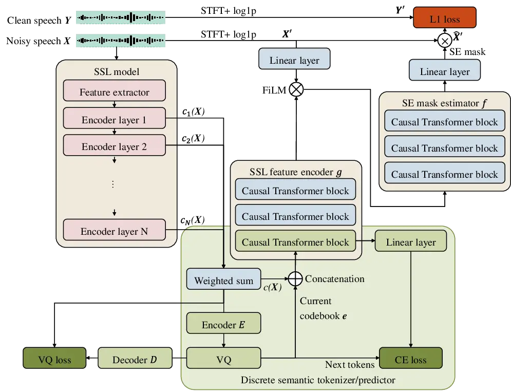
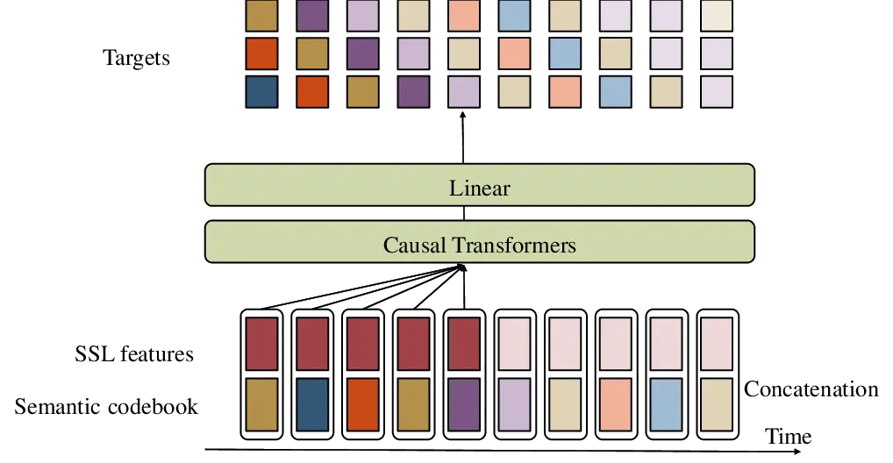

# Causal Speech Enhancement with Predicting Semantics based on Quantized Self-supervised Learning Features Thanks: This work is supported by Research Grant S of the Tateishi Science and Technology Foundation.

Emiru Tsunoo, Yuki Saito, Wataru Nakata, Hiroshi Saruwatari
Affiliation: The University of Tokyo, Japan  
tsunoo@g.ecc.u-tokyo.ac.jp

###### Abstract

Real-time speech enhancement (SE) is essential to online speech
communication. Causal SE models use only the previous context while
predicting future information, such as phoneme continuation, may help
performing causal SE. The phonetic information is often represented by
quantizing latent features of self-supervised learning (SSL) models.
This work is the first to incorporate SSL features with causality into
an SE model. The causal SSL features are encoded and combined with
spectrogram features using feature-wise linear modulation to estimate a
mask for enhancing the noisy input speech. Simultaneously, we quantize
the causal SSL features using vector quantization to represent phonetic
characteristics as semantic tokens. The model not only encodes SSL
features but also predicts the future semantic tokens in multi-task
learning (MTL). The experimental results using VoiceBank + DEMAND
dataset show that our proposed method achieves 2.88 in PESQ, especially
with semantic prediction MTL, in which we confirm that the semantic
prediction played an important role in causal SE.

###### Index Terms: 

speech enhancement, self-supervised learning, semantic token prediction,
causal system

## I Introduction

Speech is an efficient medium to communicate with other people or with
voice agents via speech recognition. However, there is often
interference such as background noise and reverberations, which
adversely affect the online communications and speech-recognition-based
human-computer interactions. Therefore, in such a use case, it is
essential to apply speech enhancement (SE) in real-time using a causal
model.

Deep-learning models for SE have been widely studied \[1, 2, 3, 4\]. SE
models were further improved by introducing convolution and recurrent
layers \[4\], Deep Complex U-Net (DCUNET) \[5\] inspired by the success
of image processing \[6\], and their combination \[7\], which achieved
best performance in Deep Noise Suppression challenge 2020 \[8\].
MP-SENet \[9\] further pushed up state-of-the-art results by directly
denoising magnitude and phase in parallel. Because SE is also important
in real-time use-cases, some studies take into account causal systems.
Conv-TasNet directly models time-domain signals using convolution
\[10\]. The network architectures were further explored \[11, 12, 13,
14\] or applied adaptation using meta learning \[15\].

Self-supervised learning (SSL), such as WavLM \[16\], uses a significant
amount of unlabeled speech data, which is useful for representing
speech. Recent SE tasks also incorporate the SSL models \[17, 18, 19\].
SSL features are further quantized typically with $`k`$-means clustering
to be used as semantic tokens, which are often highly correlated to
phoneme states of speech \[20, 21\]. In SELM \[22\], latent features of
WavLM are quantized as semantic tokens, and the language model (LM)
predicts the token sequence to re-synthesize enhanced speech. However,
less studies consider causal systems because SSL models are not causal
by their nature. For audio generation tasks, acoustic tokens are also
used \[23, 24\].

This work aims to exploit SSL models for SE with causality. Even in the
causal scenario, which has access only to the past context, predicting
future information is found to be effective in incremental
text-to-speech (TTS) \[25\] and streaming voice conversion (VC) \[26\].
Inspired by them, we predict future phonetic information for causal SE.
We first encode the SSL features computed with causality, and then the
encoded features are combined with the original noisy spectrogram
features to predict a mask for SE. Simultaneously, we quantize the
causal SSL features using vector quantization (VQ), as semantic tokens.
During training the encoder, we predict future semantic tokens using an
LM, as in \[25, 26\], in a multi-task learning (MTL) manner, so that the
model becomes aware of phoneme continuation. In experiments, we train
the model with VoiceBank + DEMAND dataset \[27, 28, 29\] to see the
effectiveness of incorporating semantic token prediction in the causal
SE task. We confirm that the semantic token prediction is particularly
useful for causal SE. Our contributions are as follows:

1.  1.  To the best of our knowledge, this is the first work to incorporate
        causal SSL features into an SE model.
2.  2.  The training is in one-stage; the SSL features are simultaneously
        quantized using VQ as semantic tokens without a two-stage individual
        clustering process.
3.  3.  We train an SSL feature encoder with future semantic token
        prediction as MTL, so that the model becomes aware of future phoneme
        information.
4.  4.  Our methods achieved 2.88 in PESQ on the VoiceBank + DEMAND test set
        especially when we use semantic prediction MTL, which increased PESQ
        by 0.05.

## II Conventional SE with SSL features

We adopt an SE mask estimation model described in \[19\] as the
baseline. The model combines SSL features with $`\log 1p`$ spectrogram
features \[30\] and estimate mask function to enhance speech components
in the input signals. Following \[19\], the SSL features of each layer
are averaged with weighted-sum. The model output is scaled into
$`[0,1]`$ using the sigmoid function as a mask and multiplied by the
input spectrogram.

Let $`{\mathbf{X}}\in\mathbb{R}^{T\times F}`$ be the $`T`$-frame input
noisy spectrogram and its $`\log 1p`$ features be
$`{\mathbf{X}}^{\prime}`$ as

```math
\displaystyle{\mathbf{X}}^{\prime}=\log(1+|{\mathbf{X}}|). \tag{1}
```

Let $`s_{i}({\mathbf{X}})`$ be $`i`$-th layer output of an SSL model
($`1\leq i\leq I`$), and $`f`$ be the mask estimation function. With
trainable weight $`w_{i}`$, the model estimates enhanced speech
$`\hat{{\mathbf{X}}}`$ as follows.

```math
\displaystyle s({\mathbf{X}}) \displaystyle=\sum_{i=1}^{I}w_{i}s_{i}({\mathbf{X}}), \tag{2}
```

```math
\displaystyle\hat{{\mathbf{X}}}^{\prime} \displaystyle={\mathbf{X}}^{\prime}\odot\sigma(f({\mathbf{X}}^{\prime}\oplus s({\mathbf{X}}))), \tag{3}
```

where $`\sigma`$ is a sigmoid function, $`\odot`$ is element-wise
multiplication, $`\oplus`$ is a concatenation operation, and $`f`$ is a
combination of linear layers and bi-directional long-short time memory
(LSTM) layers. The SE model $`f`$ is trained by minimizing the L1 loss
with clean speech $`\log 1p`$ spectrogram
$`{\mathbf{Y}}^{\prime}\in\mathbb{R}^{T\times F}`$, as

```math
\displaystyle{\mathcal{L}}_{\mathrm{se}} \displaystyle=||{\mathbf{Y}}^{\prime}-\hat{{\mathbf{X}}}^{\prime}||_{1}^{1}. \tag{4}
```

By this optimization, the SSL model can also be updated, and according
to \[19\], updating the parameters of only the Transformer layers in the
SSL model was effective the most. To reconstruct the waveform, the
original noisy phase is applied.

## III Modifications for Causal Models

### III-A Causal SSL

Most of the SSL models, including WavLM \[16\], are designed to process
in batch. Therefore, it is generally difficult to use the pretrained
models in a causal scenario. We approximate it by restricting to use
only past frames and obtain each frame output, as in \[31\], i.e., for
time frame $`t`$, we take the last frame from
$`s({\mathbf{X}}_{\leq t})`$; thus the causal SSL features
$`c({\mathbf{X}})`$ are represented as

```math
\displaystyle c({\mathbf{X}})=\{s({\mathbf{X}}_{\leq t})_{t}|1\leq t\leq T\}. \tag{5}
```

It is desirable to train an SSL model that is particularly designed for
a causal system, which remains for our future work.

### III-B Causal Transformer

For the mask estimation function $`f`$, the original model \[19\] uses
bi-directional LSTM, which requires the entire utterance. Although it
can be replaced with uni-directional LSTM, we propose using the causal
Transformers \[32\] in this work. We design a mask so that the
self-attention layers can only attend to past frames. We compare the
causal Transformer with LSTM in an ablation study in Sec. V-D.

### III-C Feature-wise linear modulation (FiLM)

FiLM \[33\] is known to be an effective method to combine two
modalities. While the original method concatenates $`\log 1p`$ features
with SSL features, we apply FiLM to combine two features. The
concatenation operation $`\oplus`$ in (3) is replaced by the FiLM
manipulation, which is represented by $`\otimes`$ as

```math
\displaystyle{\mathbf{X}}^{\prime}\otimes c({\mathbf{X}})=\gamma(c({\mathbf{X}}))\odot\alpha({\mathbf{X}}^{\prime})+\beta(c({\mathbf{X}})), \tag{6}
```

where $`\alpha`$, $`\beta`$, and $`\gamma`$ are linear functions. FiLM
is also compared with naive concatenation in Sec. V-D.

## IV Semantic Prediction in Causal System

In a causal scenario, the mask needs to be estimated using only the past
information, while linguistic structures and semantics in future can be
easily predicted. The semantic prediction can be performed similarly to
LMs predicting the next word from its context. Inspired by the success
of token prediction in incremental TTS \[25\] and streaming VC \[26\],
we further incorporate semantic prediction into the causal SE model. We
use an additional SSL feature encoder $`g`$, which not only encodes the
causal SSL features but also predicts future semantics from the context.
The semantics are modeled as quantized tokens in \[22\]. Instead of
independent clustering of the causal SSL features using the $`k`$-means
algorithm, we adopt VQ as in \[34\]. The quantized semantic tokens are
predicted from their semantic context and the input causal SSL features.
The semantic prediction is trained in an MTL manner so that the SSL
feature encoder $`g`$ becomes aware of semantic continuation. The
overview of the proposed SE method is presented in Fig. 1.



Fig. 1: SE model overview.

### IV-A Discretized semantic representation with VQ

SSL features are often quantized as semantic information, so that an
autoregressive LM can easily predict the next discrete semantic token
from the context \[22\]. As discussed in \[34\], the discretization of
SSL features can be done with either $`k`$-means or VQ, and they only
differ in terms of optimization; thus we adopt VQ. Unlike two-stage
individual quantization, the VQ training is done simultaneously with SE
model training so that the entire training is carried out in one-stage.

The causal SSL features with weighted-sum ($`c({\mathbf{X}})`$) are
encoded by a linear layer as $`E(c({\mathbf{X}}))`$. Then the encoded
features are quantized with codebooks by selecting the closest codebook
$`{\mathbf{e}}`$ to the encoded output. The codebook is considered to be
a discretized semantic token. Subsequently, the codebook is decoded by
another linear layer as $`D({\mathbf{e}})`$ to reconstruct
$`c({\mathbf{X}})`$. We also use moving average technique \[35\] and
combine it to the commitment loss as VQ loss shown in lower left of
Fig. 1.

```math
\displaystyle{\mathcal{L}}_{\mathrm{vq}}=||c({\mathbf{X}})-D({\mathbf{e}})||_{2}^{2} \displaystyle+||\mathrm{sg}[E(c({\mathbf{X}}))]-{\mathbf{e}}||_{2}^{2}
```

```math
\displaystyle+\xi||\mathrm{sg}[{\mathbf{e}}]-E(c({\mathbf{X}}))||_{2}^{2}, \tag{7}
```

where $`\mathrm{sg}`$ represents stop gradient and $`\xi`$ is a tunable
parameter. We use simple linear projection in both the encoder $`E`$ and
decoder $`D`$ because we make the quantization perform similarly to
$`k`$-means clustering of the causal SSL features $`c({\mathbf{X}})`$.
Note that the VQ training is carried out using the causal SSL features
that are also updated with the trainable averaging weights in (2). Thus,
we use the quantized VQ codebooks as discrete semantic tokens, which are
to be predicted in the model described in the following subsection.



Fig. 2: Semantic token prediction model. The model predict next 3 tokens
simultaneously in this example.

### IV-B MTL with semantic prediction

During training, the SSL feature encoder $`g`$ is also trained with the
semantic prediction task. Causal SE uses only the past frames and future
semantic prediction can help improve mask estimation, as in incremental
TTS \[25\] and streaming VC \[26\]. We add a branch to the SSL feature
encoder $`g`$ and predict the next $`N`$ semantic tokens.

While the SSL feature encoder $`g`$ uses the causal SSL features
$`c({\mathbf{X}})`$ as the input, additional discrete information can
help prediction similarly to LMs using discrete context for prediction.

#### IV-B1 Raw SSL features as input

Let the input of the SSL feature encoder $`g`$ be $`{\mathbf{Z}}`$. In
the case that only the causal SSL features are used, the input is
defined as

```math
\displaystyle{\mathbf{Z}}=c({\mathbf{X}}). \tag{8}
```

#### IV-B2 Codebook index as additional input

We can also use the codebook index of the current token as additional
information; thus

```math
\displaystyle{\mathbf{Z}}=c({\mathbf{X}})\oplus\mathrm{emb}(\hat{e}), \tag{9}
```

where $`\mathrm{emb}`$ is an embedding look-up table and $`\hat{e}`$ is
the codebook index.

#### IV-B3 Latent codebook vector as additional input

Instead of using the index, the codebook vector of the current frame
itself can be used, which is distributed in the encoded space of VQ:

```math
\displaystyle{\mathbf{Z}}=c({\mathbf{X}})\oplus{\mathbf{e}}. \tag{10}
```

The procedure of semantic prediction using latent codebook vector (10)
is presented in Fig. 2. Similar to the reduction factor in \[36\], the
next $`N`$ tokens are simultaneously predicted. Fig. 2 shows an example
of $`N=3`$. The model predicts the probability of the next $`N`$ tokens,
as

```math
\displaystyle p({\mathbf{e}}_{t+1:t+N}|{\mathbf{Z}}_{\leq t})=\prod_{n=1}^{N}p({\mathbf{e}}_{t+n}|{\mathbf{Z}}_{\leq t}). \tag{11}
```

We minimize the cross-entropy loss of the predicted token and the next
tokens:

```math
\displaystyle{\mathcal{L}}_{\mathrm{ce}}=\sum_{t=1}^{T-N}\sum_{n=1}^{N}q({\mathbf{e}}_{t+n})\log p({\mathbf{e}}_{t+n}|{\mathbf{Z}}_{\leq t}), \tag{12}
```

where $`q({\mathbf{e}})`$ is the reference distribution given by
applying VQ to the future frames.

### IV-C Training loss

Training of SE, VQ, and semantic prediction are carried out in parallel
as MTL. SE in (3) becomes

```math
\displaystyle\hat{{\mathbf{X}}}^{\prime} \displaystyle={\mathbf{X}}^{\prime}\odot\sigma(f({\mathbf{X}}^{\prime}\otimes g({\mathbf{Z}}))). \tag{13}
```

In addition to the SE loss in (4), we combine the aforementioned losses
with tunable weights $`\lambda`$’s.

```math
\displaystyle{\mathcal{L}} \displaystyle=\lambda_{\mathrm{se}}{\mathcal{L}}_{\mathrm{se}}+\lambda_{\mathrm{vq}}{\mathcal{L}}_{\mathrm{vq}}+\lambda_{\mathrm{ce}}{\mathcal{L}}_{\mathrm{ce}} \tag{14}
```

By minimizing (14), the causal SE model with semantic prediction is
trained.

## V Experiments

### V-A Experimental setup

To evaluate efficacy of our proposed semantic-continuation-aware causal
SE model, we conduct experiments using Voice Bank-DEMAND dataset \[27,
28, 29\]. We evaluated PESQ and STOI for speech quality and
intelligibility, respectively.

Our model consisted of three-layer causal Transformers for both the SSL
encoder $`g`$ and SE mask estimator $`f`$ in (13), which had 4 heads and
the numbers of hidden units were 512 and 256, respectively. We adopted
WavLM base \[16\] as the SSL model. The VQ codebook size was 1024 and
the semantic predictor predicted next $`N=5`$ tokens in (11) unless
otherwise stated. We set $`\xi=0.1`$ in (7) and
$`\{\lambda_{\mathrm{se}},\lambda_{\mathrm{vq}},\lambda_{\mathrm{ce}}\}=\{1,1,0.01\}`$
in (14) to balance the losses. The model was trained for 200 epochs with
a learning rate of 0.0001 and the Adam optimizer.

### V-B SE results

We first compared the input features for our proposed SE model as
discussed in Sec. IV-B. Table I lists the results of using raw SSL
features (8), of adding codebook index (9), and of adding codebook
latent vector (10). CSIG, CBAK and COVL are also reported, which are
commonly used to measure signal distortion, noise distortion, and
overall quality evaluation, respectively \[37\]. We observed that using
codebook latent vector, which were also optimized not only with VQ loss
$`{\mathcal{L}}_{\mathrm{vq}}`$ in (7) but also with SE loss
$`{\mathcal{L}}_{\mathrm{se}}`$ in (4), performed the best among the
input features. We used the latent vector as input for the following
experiments.

Subsequently, we compared our proposed method to the other causal SE
methods, which include ConvTasNet \[10\], the temporal convolutional
network (TCN) \[38\], Transformer \[30\], the convolutional recurrent
neural network (CRN), time–frequency smoothing based on LSTM \[11\],
DCCRN+ \[13\], and LFSFNet \[14\]. The results are listed in Table II.
The numbers of the conventional methods are based on the literature. We
observed that our proposed methods outperformed most of the other
conventional methods, and comparable to state-of-the-art method that,
unlike our model, estimates appropriate phase information. When we
excluded semantic prediction from our model by setting
$`\lambda_{\mathrm{ce}}=0`$, the performance degraded down to 2.83 in
PESQ from 2.88. This clearly indicates that the proposed semantic
prediction MTL contributes to significant improvements on SE
performance.

### V-C Effect of the number of token prediction on SE

We then changed the numbers of semantic token prediction done in each
frame and investigated the effect of them on SE performance. $`N`$ in
(11) was varied from 1 to 10 and we evaluated not only PESQ but also the
accuracy of the token prediction. The results are shown in Table III. As
we increased the number of prediction $`N`$, the accuracy decreased
because it is generally difficult to predict far future information.
This accuracy drop adversely affect SE performance as PESQ decreased in
the case of $`N=8`$ and $`N=10`$ comparing to the case of $`N=5`$. Thus,
we confirmed $`N=5`$ performed the best in the Voice Bank-DEMAND test
set.

| Input features             | PESQ | CSIG | CBAK | COVL | STOI |
| -------------------------- | ---- | ---- | ---- | ---- | ---- |
| Only SSL (8)               | 2.80 | 4.22 | 3.35 | 3.51 | 0.94 |
| SSL + codebook index (9)   | 2.86 | 4.21 | 3.36 | 3.52 | 0.94 |
| SSL + codebook vector (10) | 2.88 | 4.28 | 3.39 | 3.58 | 0.94 |

TABLE I: Results of input feature combinations for semantic prediction

|                               |      |      |      |      |      |
| ----------------------------- | ---- | ---- | ---- | ---- | ---- |
| SE methods                    | PESQ | CSIG | CBAK | COVL | STOI |
| ConvTasNet \[38\]             | 2.53 | 3.95 | 3.08 | 3.23 | -    |
| STFT-TCN \[38\]               | 2.73 | 4.11 | 3.25 | 3.42 | -    |
| Transformer \[30\]            | 2.69 | 4.07 | 3.03 | 3.38 | 0.93 |
| CRN-MSE \[39\]                | 2.74 | 3.86 | 3.14 | 3.30 | 0.93 |
| TFSNN \[11\]                  | 2.79 | 4.17 | 3.27 | 3.49 | -    |
| DCCRN+ \[13\]                 | 2.84 | -    | -    | -    | -    |
| LFSFNet \[14\]                | 2.91 | -    | -    | -    | -    |
| Causal SSL w/o Semantic Pred. | 2.83 | 4.23 | 3.36 | 3.53 | 0.95 |
| Causal SSL w/ Semantic Pred.  | 2.88 | 4.28 | 3.39 | 3.58 | 0.94 |

TABLE II: Evaluation results of causal SE systems on the
VoiceBank-DEMAND dataset

| \# of prediction | $`N=1`$ | $`N=3`$ | $`N=5`$ | $`N=8`$ | $`N=10`$ |
| ---------------- | ------- | ------- | ------- | ------- | -------- |
| PESQ             | 2.81    | 2.85    | 2.88    | 2.83    | 2.82     |
| Accuracy         | 33.7%   | 21.5%   | 17.0%   | 13.0%   | 10.3%    |

TABLE III: Comparison of the number of prediction per frame

| ID  | Conditions    |            |      |           | PESQ | STOI |
| --- | ------------- | ---------- | ---- | --------- | ---- | ---- |
|     | SE model      | WavLM      | FiLM | Semantics |      |      |
| C1  | Causal Trans. | Causal     | ✓    | ✓         | 2.88 | 0.94 |
| C2  | Causal Trans. | Causal     | ✓    |           | 2.83 | 0.94 |
| C3  | Causal Trans. | Causal     |      |           | 2.67 | 0.94 |
| S1  | Causal Trans. | None       |      |           | 2.64 | 0.94 |
| S2  | LSTM          | None       |      |           | 2.58 | 0.94 |
| N1  | Trans.        | Non-causal | ✓    | ✓         | 3.14 | 0.96 |
| N2  | Trans.        | Non-causal | ✓    |           | 3.14 | 0.96 |
| N3  | Trans.        | Non-causal |      |           | 3.09 | 0.95 |
|     | BLSTM \[19\]  | Non-causal |      |           | 3.08 | 0.95 |

TABLE IV: Ablation study of causal SE on the VoiceBank-DEMAND

### V-D Ablation study of model architectures

We conducted an ablation study to see how the each element in our model
contributed the SE performance in both the causal cases and the
non-causal cases. In the non-causal systems, causal Transformers
described in Sec. III-B were replaced with an ordinary Transformers so
that both the SE model and WavLM had access to the entire context. PESQ
and STOI in various conditions are shown in Table IV. The reproduction
of original SSL-based method \[19\] is also listed as a reference.

First, when we compared FiLM in Sec.III-C with simple concatenation,
FiLM resulted in higher PESQ values in both the causal (C2 vs C3) and
non-causal scenarios (N2 vs N3). Furthermore, when we used only
$`\log 1p`$ spectrogram features (S1), we observed degradation from the
C3 condition. In non-causal systems, semantic prediction did not
contributed SE performance (N1 vs N2), which was reasonable because the
future information was already included in the context for the
non-causal systems. Lastly, by replacing causal Transformer with
uni-directional LSTM we can see that our modification described in
Sec. III-B contributed SE performance by 0.06 PESQ improvement (S1 vs
S2).

## VI Conclusion

We proposed the causal SE model that predicted semantics of the future
content. The causal SSL features were calculated frame-by-frame using
only the past input, and combined with $`\log 1p`$ spectrogram features
with FiLM. Simultaneously, the causal SSL features were quantized by VQ
as semantic tokens, and the future tokens were predicted by the branch
of the SSL feature encoder. Experiments using Voice Bank-DEMAND showed
that our proposed future-semantic-aware SE model achieved 2.88 in PESQ.
We observed that the semantic prediction played an important role in
causal SE.

Future work includes training causal SSL models because we forcibly used
the pre-trained SSL models for the causal SE. We will also adopt
state-of-the-art model architectures to estimate appropriate phase
information for further SE performance. In addition, the causal SE model
can also use other discrete representations such as neural audio codec
for future prediction.

## References

- \[1\] Xugang Lu et al. “Speech enhancement based on deep denoising
  autoencoder” In _Proc. of Interspeech_, 2013, pp. 436–440
- \[2\] Yong Xu et al. “An experimental study on speech enhancement
  based on deep neural networks” In _IEEE Signal processing letters_
  21.1, 2013, pp. 65–68
- \[3\] Lei Sun et al. “Multiple-target deep learning for LSTM-RNN based
  speech enhancement” In _Proc. of HSCMA_, 2017, pp. 136–140
- \[4\] Ke Tan and DeLiang Wang “A convolutional recurrent neural
  network for real-time speech enhancement” In _Proc. of Interspeech_,
  2018, pp. 3229–3233
- \[5\] Hyeong-Seok Choi et al. “Phase-aware speech enhancement with
  deep complex U-net” In _Proc. on ICLR_, 2018
- \[6\] Olaf Ronneberger, Philipp Fischer and Thomas Brox “U-net:
  Convolutional networks for biomedical image segmentation” In _Proc. of
  MICCAI_, 2015, pp. 234–241
- \[7\] Yanxin Hu et al. “DCCRN: Deep Complex Convolution Recurrent
  Network for Phase-Aware Speech Enhancement” In _Proc. of Interspeech_,
  2020, pp. 2472–2476
- \[8\] Chandan.A. Reddy et al. “The INTERSPEECH 2020 Deep Noise
  Suppression Challenge: Datasets, Subjective Testing Framework, and
  Challenge Results” In _Proc. of Interspeech_, 2020, pp. 2492–2496
- \[9\] Ye-Xin Lu, Yang Ai and Zhen-Hua Ling “MP-SENet: A Speech
  Enhancement Model with Parallel Denoising of Magnitude and Phase
  Spectra” In _Proc. of Interspeech_, 2023, pp. 3834–3838
- \[10\] Yi Luo and Nima Mesgarani “Conv-TasNet: Surpassing ideal
  time–frequency magnitude masking for speech separation” In
  _Transactions on Audio, Speech, and Language Processing_ 27.8, 2019,
  pp. 1256–1266
- \[11\] Wenhao Yuan “A time–frequency smoothing neural network for
  speech enhancement” In _Speech Communication_ 124, 2020, pp. 75–84
- \[12\] Jean-Marc Valin et al. “A Perceptually-Motivated Approach for
  Low-Complexity, Real-Time Enhancement of Fullband Speech” In _Proc. of
  Interspeech_, 2020, pp. 2482–2486
- \[13\] Shubo Lv et al. “DCCRN+: Channel-wise subband dccrn with snr
  estimation for speech enhancement” In _arXiv preprint
  arXiv:2106.08672_, 2021
- \[14\] Zhuangqi Chen and Pingjian Zhang “Lightweight Full-band and
  Sub-band Fusion Network for Real Time Speech Enhancement” In _Proc. of
  Interspeech_, 2022, pp. 921–925
- \[15\] Cheng Yu et al. “OSSEM: one-shot speaker adaptive speech
  enhancement using meta learning” In _Proc. of Interspeech_, 2022, pp.
  981–985
- \[16\] Sanyuan Chen et al. “WavLM: Large-scale self-supervised
  pre-training for full stack speech processing” In _IEEE Journal of
  Selected Topics in Signal Processing_ 16.6, 2022, pp. 1505–1518
- \[17\] Yu-Che Wang, Shrikant Venkataramani and Paris Smaragdis
  “Self-supervised learning for speech enhancement” In _arXiv preprint
  arXiv:2006.10388_, 2020
- \[18\] Ryandhimas Zezario et al. “Self-supervised denoising
  autoencoder with linear regression decoder for speech enhancement” In
  _Proc. of ICASSP_, 2020, pp. 6669–6673
- \[19\] Kuo-Hsuan Hung et al. “Boosting Self-Supervised Embeddings for
  Speech Enhancement” In _Proc. of Interspeech_, 2022, pp. 186–190
- \[20\] Kushal Lakhotia et al. “On generative spoken language modeling
  from raw audio” In _Transactions of the Association for Computational
  Linguistics_ 9, 2021, pp. 1336–1354
- \[21\] Amitay Sicherman and Yossi Adi “Analysing discrete self
  supervised speech representation for spoken language modeling” In
  _Proc. of ICASSP_, 2023, pp. 1–5
- \[22\] Ziqian Wang et al. “SELM: Speech Enhancement using Discrete
  Tokens and Language Models” In _Proc. of ICASSP_, 2024, pp.
  11561–11565
- \[23\] Dongchao Yang et al. “Uniaudio: An audio foundation model
  toward universal audio generation” In _arXiv preprint
  arXiv:2310.00704_, 2023
- \[24\] Xiaofei Wang et al. “Speechx: Neural codec language model as a
  versatile speech transformer” In _Transactions on Audio, Speech, and
  Language Processing_, 2024
- \[25\] Takaaki Saeki, Shinnosuke Takamichi and Hiroshi Saruwatari
  “Low-latency incremental text-to-speech synthesis with distilled
  context prediction network” In _Proc. of ASRU_, 2021, pp. 749–756
- \[26\] Ziqian Ning et al. “DualVC 3: Leveraging Language Model
  Generated Pseudo Context for End-to-end Low Latency Streaming Voice
  Conversion” In _Proc. of Interspeech_, 2024
- \[27\] Christophe Veaux, Junichi Yamagishi and Simon King “The voice
  bank corpus: Design, collection and data analysis of a large regional
  accent speech database” In _Proc. of O-COCOSDA/CASLRE_, 2013, pp. 1–4
- \[28\] Joachim Thiemann, Nobutaka Ito and Emmanuel Vincent “The
  diverse environments multi-channel acoustic noise database (demand): A
  database of multichannel environmental noise recordings” In _Proc. of
  Meetings on Acoustics_ 19.1, 2013
- \[29\] Cassia Valentini-Botinhao et al. “Investigating RNN-based
  speech enhancement methods for noise-robust Text-to-Speech.” In _SSW_,
  2016, pp. 146–152
- \[30\] Szu-Wei Fu et al. “Boosting objective scores of a speech
  enhancement model by metricgan post-processing” In _Proc. of APSIPA
  ASC_, 2020, pp. 455–459
- \[31\] Emiru Tsunoo et al. “Run-and-back stitch search: novel block
  synchronous decoding for streaming encoder-decoder ASR” In _Proc of
  ICASSP_, 2022, pp. 8287–8291
- \[32\] A Vaswani et al. “Attention is all you need” In _Advances in
  Neural Information Processing Systems_, 2017
- \[33\] Ethan Perez et al. “FiLM: Visual reasoning with a general
  conditioning layer” In _Proc. of AAAI_ 32.1, 2018
- \[34\] Zhichao Huang, Chutong Meng and Tom Ko “RepCodec: A speech
  representation codec for speech tokenization” In _arXiv preprint
  arXiv:2309.00169_, 2023
- \[35\] Ali Razavi, Aaron Van and Oriol Vinyals “Generating diverse
  high-fidelity images with VQ-VAE-2” In _Advances in neural information
  processing systems_ 32, 2019
- \[36\] Lingwei Meng et al. “Autoregressive Speech Synthesis without
  Vector Quantization” In _arXiv preprint arXiv:2407.08551_, 2024
- \[37\] Yi Hu and Philipos Loizou “Evaluation of objective quality
  measures for speech enhancement” In _Transactions on Audio, Speech,
  and Language Processing_ 16.1, 2007, pp. 229–238
- \[38\] Yuichiro Koyama et al. “Exploring the best loss function for
  DNN-based low-latency speech enhancement with temporal convolutional
  networks” In _arXiv preprint arXiv:2005.11611_, 2020
- \[39\] Ke Tan and DeLiang Wang “A Convolutional Recurrent Neural
  Network for Real-Time Speech Enhancement” In _Proc. of Interspeech_,
  2018, pp. 3229–3233
