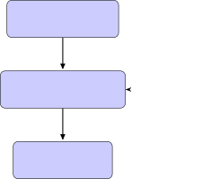
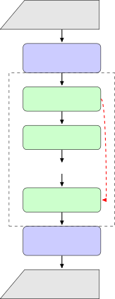
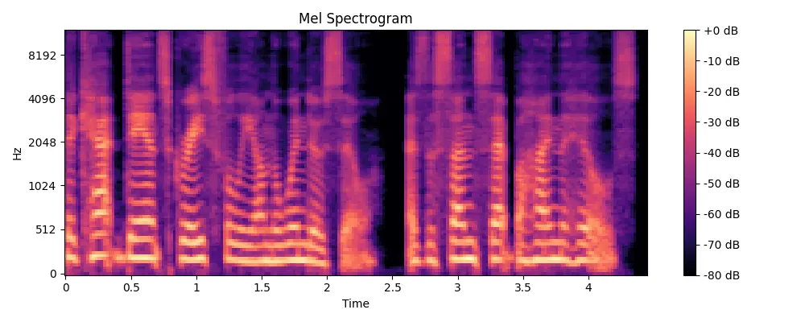
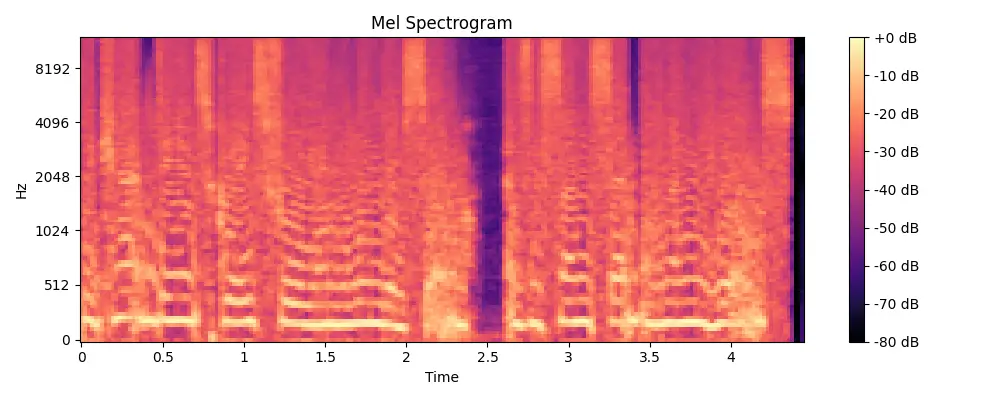
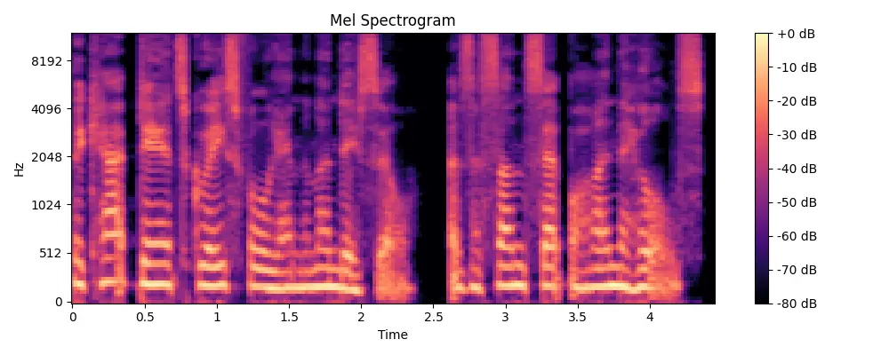
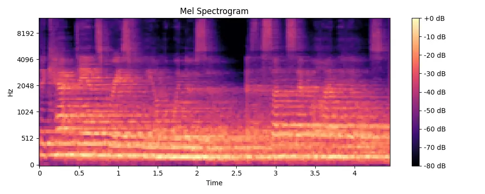
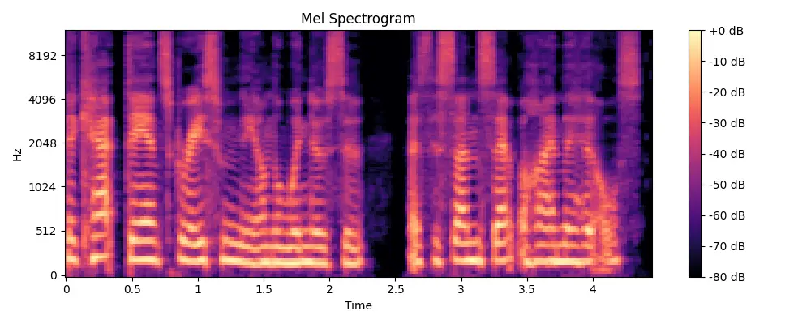
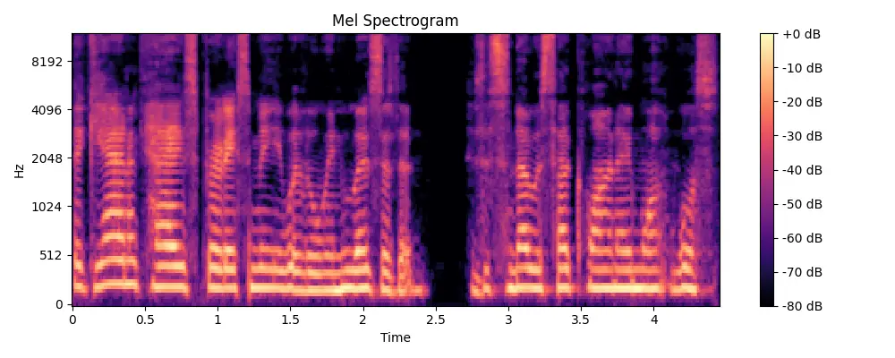

Kirdey

# VoiceRestore: Flow-Matching Transformers for Speech Recording Quality Restoration

Stanislav

###### Abstract

We present VoiceRestore, a novel approach to restoring the quality of
speech recordings using flow-matching Transformers trained in a
self-supervised manner on synthetic data. Our method tackles a wide
range of degradations frequently found in both short and long-form
speech recordings, including background noise, reverberation,
compression artifacts, and bandwidth limitations—all within a single,
unified model. Leveraging conditional flow matching and classifier-free
guidance, the model learns to map degraded speech to high-quality
recordings without requiring paired clean and degraded datasets.

We describe the training process, the conditional flow matching
framework, and the model’s architecture. We also demonstrate the model’s
generalization to real-world speech restoration tasks, including both
short utterances and extended monologues or dialogues. Qualitative and
quantitative evaluations show that our approach provides a flexible and
effective solution for enhancing the quality of speech recordings across
varying lengths and degradation types. Model code and pre-trained
checkpoints are available at:

[https://github.com/skirdey/voicerestore](https://github.com/skirdey/voicerestore)

###### keywords

speech restoration, self-supervised learning

^(†)^(†)email: contact@stankirdey.com

## 1 Introduction

The quality of speech recordings is critical to numerous applications,
from telecommunications and broadcasting to voice assistants and
archival preservation. Degradations such as background noise,
reverberation, compression artifacts, and bandwidth limitations can
significantly impair intelligibility and listener experience. These
problems can occur in both short recordings (e.g., voice commands or
prompts) and long-form recordings (e.g., audiobooks, lectures,
podcasts).

Conventional approaches to speech enhancement and restoration often
focus on specific types of degradation or short-duration audio clips,
limiting their use in real-world scenarios that involve multiple
degradations and varying recording lengths. An effective solution must
generalize across different degradation types and be equally adept at
handling both short and long-form recordings.

In this paper, we introduce VoiceRestore, a novel approach to speech
recording quality restoration using flow-matching Transformers trained
in a self-supervised manner on synthetic data. Our method leverages
recent advances in conditional flow matching \[1\] and Transformer
architectures to create a unified model capable of restoring speech
recordings of varying lengths and degradation types within a single
framework.

Unlike many supervised methods that require paired clean and degraded
datasets, our approach generates degradations on the fly during
training. This self-supervised strategy exposes the model to a diverse
range of synthetic degradations, eliminating the need for labeled
datasets.

We detail the training process, the conditional flow matching framework,
and our network’s architecture. We then explore the model’s
generalization to real-world tasks, including both short and long-form
recordings suffering from severe degradations such as heavy background
noise and compression artifacts. Through qualitative and quantitative
evaluations, we show that our approach effectively enhances speech
quality across a broad array of degradation scenarios and recording
lengths.

Our main contributions are:

- •
  A self-supervised training method for speech recording quality
  restoration using conditional flow matching.
- •
  A unified architecture that handles multiple speech degradations in
  both short and long-form recordings.
- •
  Detailed implementation specifics, including model architecture and
  training configurations, to facilitate reproducibility.
- •
  A demonstration of the model’s generalizability to real-world
  degradation scenarios, including challenging short and extended speech
  samples.

By addressing the challenges of speech recording quality restoration in
a self-supervised fashion, VoiceRestore offers a promising solution for
practical applications involving multiple and unpredictable
degradations.

## 2 Related Work

Speech enhancement and restoration have been extensively studied.
Traditional methods often rely on signal processing techniques, such as
spectral subtraction and Wiener filtering, to reduce noise and improve
speech quality. These methods can be effective for specific types of
degradation but typically struggle with complex or multiple
degradations, and their performance may degrade on longer recordings due
to temporal variability.

Deep learning approaches have significantly advanced speech enhancement
capabilities. Models like SEGAN \[2\] and DCCRN \[3\] have demonstrated
improved performance over traditional methods. However, these models
often require paired datasets of clean and degraded speech and may not
generalize well to unseen degradations or longer recordings.

Recent work has explored generative models for speech enhancement.
Diffusion-based models \[4\] have shown promise in modeling complex
speech distributions, but they can be computationally intensive and are
often evaluated on short utterances. Other approaches leverage
self-supervised learning for robustness without labeled data; for
example, Transformer-based U-Net architectures have been explored in
E2TTS \[5\].

Flow matching \[1\] provides a flexible framework for generative
modeling by learning continuous-time dynamics that transform a simple
base distribution into a complex target distribution. Conditional flow
matching extends this idea to conditional generation tasks, making it
suitable for speech restoration, where the model learns a mapping from
degraded to clean speech.

Transformers \[6\] have revolutionized sequence modeling tasks,
including speech processing. Their ability to capture long-range
dependencies makes them well suited for modeling both short- and
long-form speech recordings. Recent works have applied Transformers to
various speech recognition and synthesis tasks \[7\], demonstrating
their effectiveness in handling complex temporal dynamics.

Our work builds on these advances by integrating conditional flow
matching with Transformer architectures, enabling effective speech
restoration across varying recording lengths without the need for paired
datasets.

## 3 Proposed Method

In this section, we detail our approach to speech recording quality
restoration using conditional flow matching and Transformer
architectures. Our framework is designed to handle both short and
long-form recordings within a single model.

### 3.1 Problem Formulation

Let $`x\in\mathbb{R}^{T\times F}`$ represent a clean speech spectrogram,
where $`T`$ is the number of time frames (which can vary widely to
accommodate both short and long recordings) and $`F`$ is the number of
frequency bins. We denote the degraded version as $`y`$, obtained by
applying various degradations to $`x`$. Our goal is to learn a
restoration function $`f_{\theta}(y)`$ that estimates clean speech
$`\hat{x}`$ given the degraded input $`y`$.

### 3.2 Conditional Flow Matching for Speech Restoration

#### 3.2.1 Mathematical Framework

We define a continuous-time flow that transports the degraded speech
distribution $`p(y)`$ to the clean speech distribution $`p(x)`$ over
time $`t\in[0,1]`$. At each time $`t`$, we have an intermediate state
$`x_{t}`$:

```math
x_{t}=(1-\alpha(t))y+\alpha(t)x, \tag{1}
```

where $`\alpha(t)`$ is a time-dependent interpolation function. The
corresponding vector field $`u_{t}(x_{t})`$ is:

```math
u_{t}(x_{t})=\frac{dx_{t}}{dt}=\dot{\alpha}(t)(x-y). \tag{2}
```

Our neural network $`v_{\theta}(x_{t},t,y)`$ aims to approximate this
vector field by minimizing:

```math
\mathcal{L}(\theta)=\mathbb{E}_{t,x,y}\left[\left\lVert u_{t}(x_{t})-v_{\theta}(x_{t},t,y)\right\rVert_{2}^{2}\right]. \tag{3}
```



Figure 1: Conditional Flow Matching Process for Speech Restoration

The interpolation function allows the model to smoothly transition
between degraded and clean speech over time, modeling the restoration
process as a continuous transformation.

#### 3.2.2 Self-Supervised Training with Synthetic Degradations

We employ a self-supervised training strategy where synthetic
degradations are applied to clean speech recordings on the fly. This
approach enables the model to learn from a diverse range of degradation
types and combinations without relying on labeled data. By training on
both short and long-form recordings, the model learns to handle varying
sequence lengths and temporal dynamics.


Figure 2: Synthetic Degradation Pipeline for Self-Supervised Training

#### 3.2.3 Handling Variable-Length Recordings

To accommodate both short and long-form recordings, we design the model
to process variable-length sequences efficiently. Techniques such as
chunking for long recordings and padding or masking for batch processing
of variable-length sequences are employed.

### 3.3 Network Architecture

Our model employs a Transformer-based architecture to model the
conditional vector field $`v_{\theta}(x_{t},t,y)`$. Key components
include:

- •
  Input Embedding: Linear layers project the input $`x_{t}`$ and the
  condition $`y`$ into a shared embedding space.
- •
  Positional Encoding: Since speech recordings can vary in length, we
  use positional encodings to capture temporal information for both
  short and long sequences.
- •
  Time Encoding: The time variable $`t`$ is embedded and incorporated to
  condition the flow dynamics.
- •
  Transformer Layers: A stack of Transformer encoder layers with
  self-attention mechanisms captures temporal dependencies. The
  architecture is designed to handle long sequences efficiently, using
  techniques like gradient checkpointing and careful management of
  sequence lengths.
- •
  Output Projection: A linear layer projects the Transformer’s output
  back to the spectrogram space.

#### 3.3.1 Detailed Architecture Specifications

Based on our implementation, the Transformer has the following
specifications:

- •
  Model Dimension: 768
- •
  Depth: 20 Transformer layers
- •
  Heads: 16 attention heads
- •
  Head Dimension: 64

### 3.4 Training Procedure

#### 3.4.1 Optimizer and Learning Rate

We use the Schedule-Free AdamW optimizer \[8\] with a learning rate of
$`3\times 10^{-4}`$. A warm-up schedule with 1000 warm-up steps
stabilizes training in the initial phase. Schedule-Free AdamW eliminates
the need for predefined learning rate schedules by adaptively adjusting
the optimization process.

#### 3.4.2 Gradient Accumulation and Mixed Precision

To handle large batch sizes and long sequences, we use gradient
accumulation steps of 32. Mixed-precision training with bfloat16 (bf16)
is employed to reduce memory usage and accelerate computations.

#### 3.4.3 Data Loading and Preprocessing

We use a custom dataset class that loads clean speech data and applies
degradations on the fly during training. The data loader handles
variable-length sequences and ensures efficient batch processing.

#### 3.4.4 Degradation Generation

We generate a variety of degradations to simulate real-world recording
conditions, including:

- •
  Applying Effects: Using VST effects such as reverb, bit-crushing,
  compression, resampling, gain adjustments, distortion, and filtering.
- •
  Ambient Noise Addition: Mixing speech with ambient noises.
- •
  Acoustic Noise Generation: Programmatically generating noises such as
  city sounds, crowd chatter, speech-like noise, nature sounds, office
  ambient noise, and restaurant noise.
- •
  Time-Frequency Masking: Randomly erasing portions of the spectrogram
  to simulate dropouts or missing data.

These degradations are applied randomly to ensure the model is exposed
to a wide range of conditions.

### 3.5 Handling Long-Form Recordings

For long-form recordings, special considerations include:

- •
  Sequence Truncation: Audio sequences are truncated or segmented to a
  maximum length (e.g., 2000 frames) to fit within memory constraints.
- •
  Overlapping Windows: Long recordings are processed in overlapping
  windows to preserve continuity across segments.
- •
  Memory Management: Techniques such as gradient checkpointing are
  employed to reduce memory usage during training.



Figure 3: Transformer-based Architecture for Conditional Flow Matching

## 4 Results

In this section, we present a comprehensive evaluation of VoiceRestore
against Resemble-Enhance across various degradation scenarios for
English speech recordings. Each test case includes mel-spectrogram
visualizations, transcribed text, and Word Error Rate (WER) metrics
obtained using the Whisper v3 Large model \[9\], when applicable.

### 4.1 English Speech Restoration

Below, we compare spectrograms of the same utterance under different
degradation methods with VoiceRestore and Resemble-Enhance.



(a) Original



(b) Degraded

Original sentence before degradation:  
The cat danced gracefully on the windowsill as the sun set behind the
hills.



WER: 14.0%  
Transcription: ”The cat danced gracefully on the Monday sill as the sun
set behind the hills.”

(c) VoiceRestore


WER: 79.1%

Transcription: ”We can’t dance graceful and leon de ser, as the sunset
was on the hills.”

(d) Resemble-Enhance

Figure 4: Heavy Distortion and Gain


(a) Original



(b) Degraded

Original sentence before degradation:  
The cat danced gracefully on the windowsill as the sun set behind the
hills.



WER: 0.0%

Transcription: ”The cat danced gracefully on the windowsill as the sun
set behind the hills.”

(c) VoiceRestore



WER: 100.0%

Transcription: ”The Gyanokais produced me with a wind wizard. It’s a
snow cyclone, a white horse.”

(d) Resemble-Enhance

Figure 5: Heavy Reverberation

### 4.2 Numeric Evaluation

Although the main purpose of the VoiceRestore project is to address
extreme levels of voice audio degradation—where no standard test set or
metric exists—we also provide numerical results on a well-known
benchmark for completeness. Specifically, we evaluated the model on the
VoiceBank+DEMAND dataset \[10\], using the metric calculation code from
the CMGAN project \[11\], available in its [official GitHub
repository](https://github.com/ruizhecao96/CMGAN/blob/main/src/tools/compute_metrics.py).

Restoration was performed using a pre-trained VoiceRestore checkpoint
with 16 steps and a CFG strength of 0.5. Both inference code and
pre-trained checkpoints are available [in the official VoiceRestore
repository](https://github.com/skirdey/voicerestore).

Tables 1 and 2 summarize the performance of VoiceRestore compared to
several well-known speech enhancement models on the VoiceBank-DEMAND
dataset.

| Model                 | PESQ | CSIG | CBAK |
| --------------------- | ---- | ---- | ---- |
| Noisy-speech          | 1.97 | 0.92 | 3.34 |
| SEGAN \[2\]           | 2.16 | 3.48 | 2.94 |
| MetricGAN+ \[12\]     | 3.15 | 0.93 | 4.14 |
| CMGAN \[11\]          | 3.41 | 4.63 | 3.94 |
| MP-SENet \[13\]       | 3.50 | 4.73 | 3.95 |
| SEMamba (-CL) \[14\]  | 3.52 | 4.75 | 3.98 |
| SEMamba \[14\]        | 3.55 | 4.77 | 3.95 |
| SEMamba (+PCS) \[14\] | 3.69 | 4.79 | 3.63 |
| VoiceRestore          | 2.13 | 3.52 | 3.60 |

Table 1: Performance Metrics (PESQ, CSIG, and CBAK) on the
VoiceBank-DEMAND Dataset.

| Model                 | COVL | STOI |
| --------------------- | ---- | ---- |
| Noisy-speech          | 2.63 | –    |
| SEGAN \[2\]           | 2.80 | –    |
| MetricGAN+ \[12\]     | 3.64 | –    |
| CMGAN \[11\]          | 4.12 | 0.96 |
| MP-SENet \[13\]       | 4.22 | 0.96 |
| SEMamba (-CL) \[14\]  | 4.26 | 0.96 |
| SEMamba \[14\]        | 4.29 | 0.96 |
| SEMamba (+PCS) \[14\] | 4.37 | 0.96 |
| VoiceRestore          | 2.84 | 0.93 |

Table 2: Performance Metrics (COVL and STOI) on the VoiceBank-DEMAND
Dataset.

### 4.3 Discussion

The results indicate that VoiceRestore consistently outperforms
Resemble-Enhance across all tested degradation types and scenarios,
achieving lower WERs and demonstrating superior restoration
capabilities.

1.  1.  Comparison with Other Generative Models: VoiceRestore not only
        outperforms Resemble-Enhance but also demonstrates strong results
        compared to other state-of-the-art models. A comparison against
        CMGAN \[11\] on heavily degraded speech samples, available at [this
        link](https://sparkling-rabanadas-3082be.netlify.app/), highlights
        VoiceRestore’s robustness in handling severe degradations.
2.  2.  Enhancing Robust ASR Models: VoiceRestore further improves the
        performance of robust ASR systems like Whisper V3 Large. Even though
        Whisper is designed to handle noise and degradation, processing
        VoiceRestore-enhanced audio yields consistently lower WERs,
        indicating that VoiceRestore can serve as a valuable pre-processing
        step.
3.  3.  Time-Gap Infilling Capabilities: While VoiceRestore shows promising
        results across various degradation types, its abilities to infill
        time gaps (as seen in “Timecut” scenarios) are still under active
        investigation. There is room for improvement in time-domain
        infilling of lost signals.

Overall, these findings highlight VoiceRestore’s flexibility and
effectiveness in tackling multiple speech degradation challenges, and
its potential for integration into existing speech processing pipelines.

## 5 Conclusions

We presented VoiceRestore, a self-supervised approach to speech
recording quality restoration that employs conditional flow matching and
Transformer architectures. Our model handles a wide range of
degradations and recording lengths within a single framework,
demonstrating effectiveness on both short and long-form audio.

Key findings include:

1.  1.  Versatility and Robustness: VoiceRestore successfully addresses
        multiple degradation types (e.g., distortion, reverberation) within
        one model, simplifying deployment in real-world scenarios where
        degradations are often mixed or unknown.
2.  2.  Language Independence: Our experiments show consistent performance
        across different languages, highlighting the model’s potential for
        global, multilingual applications.
3.  3.  Synergy with ASR: VoiceRestore enhances the performance of robust
        ASR models (like Whisper V3 Large), potentially serving as a
        powerful preprocessing step.
4.  4.  Advances in Generative Modeling: VoiceRestore’s handling of severe
        degradations marks a key step forward in speech enhancement, with
        broad implications for a range of applications.

Overall, VoiceRestore represents a significant advancement in speech
recording quality restoration. Its self-supervised nature and
adaptability to diverse conditions make it a compelling solution for
practical use—ranging from telecommunications and content creation to
archival restoration—where clear, intelligible speech is essential.

## References

- \[1\] Y. Lipman, R. T. Q. Chen, H. Ben-Hamu, M. Nickel, and M. Le,
  “Flow matching for generative modeling,” 2023.
- \[2\] S. Pascual, A. Bonafonte, and J. Serrà, “SEGAN: Speech
  enhancement generative adversarial network,” 2017.
- \[3\] Y. Hu, Y. Liu, S. Lv, M. Xing, S. Zhang, Y. Fu, J. Wu, B. Zhang,
  and L. Xie, “DCCRN: Deep complex convolution recurrent network for
  phase-aware speech enhancement,” 2020.
- \[4\] J. Richter, S. Welker, J.-M. Lemercier, B. Lay, and T. Gerkmann,
  “Speech enhancement and dereverberation with diffusion-based
  generative models,” IEEE/ACM Transactions on Audio, Speech, and
  Language Processing, vol. 31, pp. 2351–2364, 2023.
- \[5\] S. E. Eskimez, X. Wang, M. Thakker, C. Li, C.-H. Tsai, Z. Xiao,
  H. Yang, Z. Zhu, M. Tang, X. Tan, Y. Liu, S. Zhao, and N. Kanda, “E2
  TTS: Embarrassingly easy fully non-autoregressive zero-shot
  TTS,” 2024.
- \[6\] A. Vaswani and et al., “Attention is all you need,” Advances in
  Neural Information Processing Systems, vol. 30, 2017.
- \[7\] T. A. Nguyen, W.-N. Hsu, A. D’Avirro, B. Shi, I. Gat,
  M. Fazel-Zarani, T. Remez, J. Copet, G. Synnaeve, M. Hassid, F. Kreuk,
  Y. Adi, and E. Dupoux, “EXPRESSO: A benchmark and analysis of discrete
  expressive speech resynthesis,” 2023.
- \[8\] A. Defazio, X. Yang, H. Mehta, K. Mishchenko, A. Khaled, and
  A. Cutkosky, “The road less scheduled,” 2024.
- \[9\] A. Radford, J. W. Kim, T. Xu, G. Brockman, C. McLeavey, and
  I. Sutskever, “Robust speech recognition via large-scale weak
  supervision,” 2022.
- \[10\] C. Valentini-Botinhao, “Noisy speech database for training
  speech enhancement algorithms and tts models,” 2017.
- \[11\] S. Abdulatif, R. Cao, and B. Yang, “CMGAN: Conformer-based
  metric-GAN for monaural speech enhancement,” IEEE/ACM Transactions on
  Audio, Speech, and Language Processing, vol. 32, pp. 2477–2493, 2024.
- \[12\] S.-W. Fu, C. Yu, T.-A. Hsieh, P. Plantinga, M. Ravanelli,
  X. Lu, and Y. Tsao, “Metricgan+: An improved version of metricgan for
  speech enhancement,” 2021.
- \[13\] Y.-X. Lu, Y. Ai, and Z.-H. Ling, “Mp-senet: A speech
  enhancement model with parallel denoising of magnitude and phase
  spectra,” in INTERSPEECH 2023, ISCA, 2023.
- \[14\] R. Chao, W.-H. Cheng, M. L. Quatra, S. M. Siniscalchi, C.-H. H.
  Yang, S.-W. Fu, and Y. Tsao, “An investigation of incorporating mamba
  for speech enhancement,” 2024.
