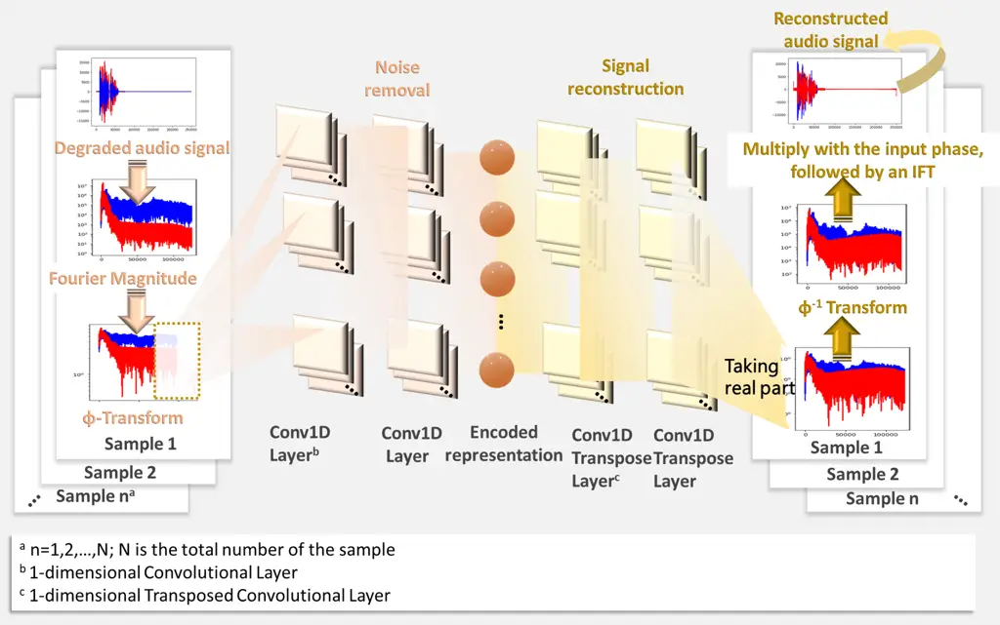
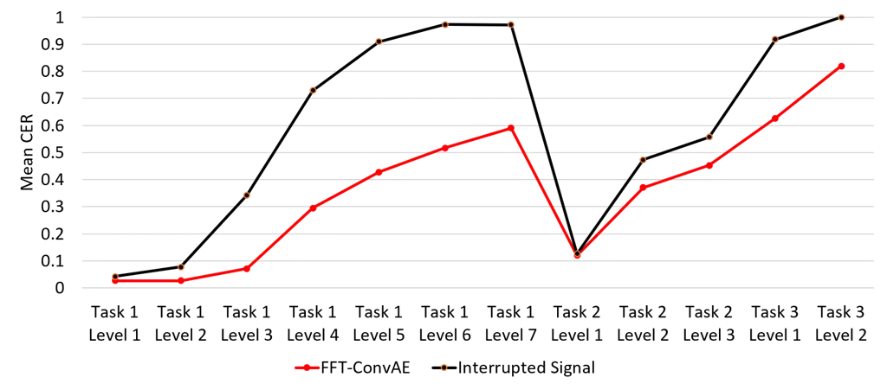
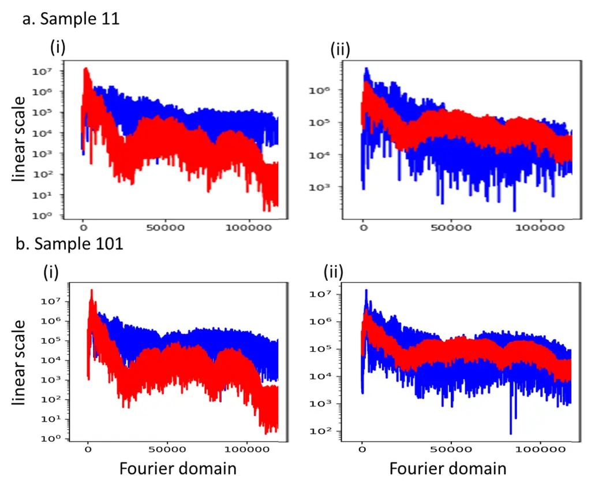
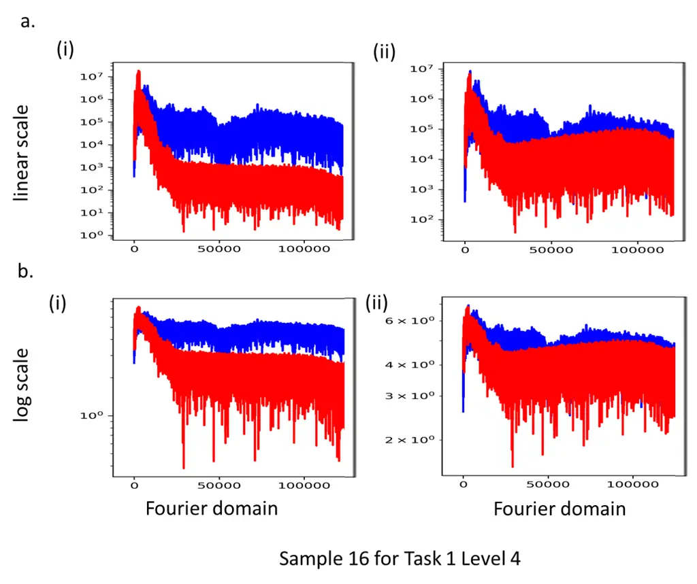
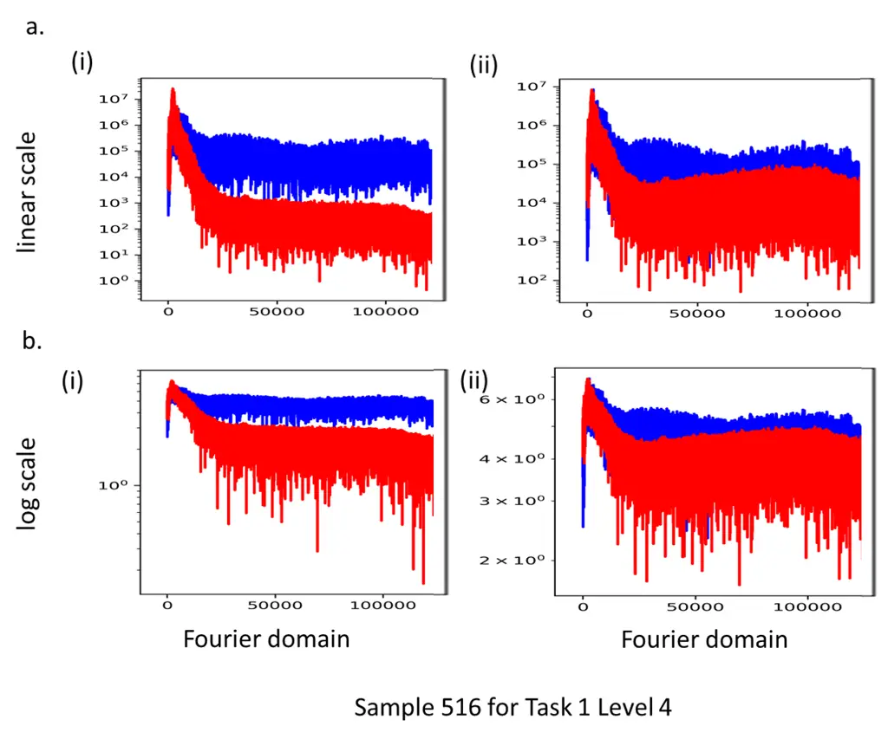
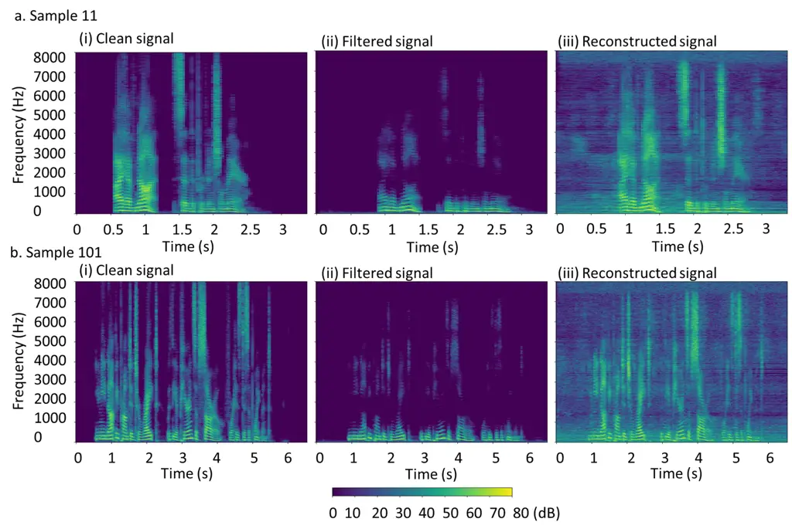
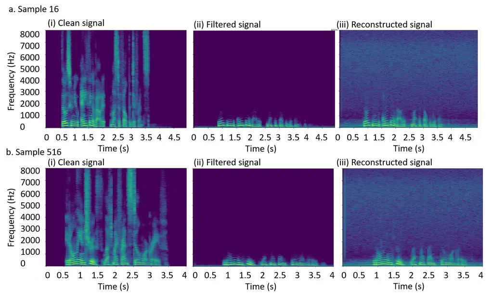
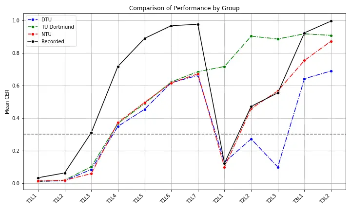
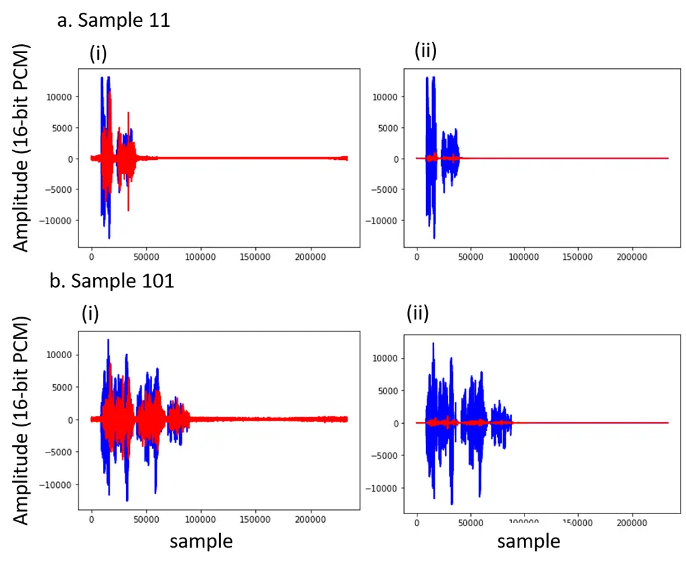

# A Speech Enhancement Method Using Fast Fourier Transform and Convolutional Autoencoder

Pu-Yun
Kow [](https://orcid.org/0000-0001-5718-9316)
Address: Department of Artificial Intelligence, Tamkang University, New
Taipei City 251301, Taiwan. Email address: <169016@o365.tku.edu.tw> and
Pu-Zhao
Kow [](https://orcid.org/0000-0002-2990-3591)
Address: Department of Mathematical Sciences, National Chengchi
University, Taipei 116, Taiwan. Email address: <pzkow@g.nccu.edu.tw>

###### Abstract.

This paper addresses the reconstruction of audio signals from degraded
measurements. We propose a lightweight model that combines the discrete
Fourier transform with a Convolutional Autoencoder (FFT-ConvAE), which
enabled our team to achieve second place in the Helsinki Speech
Challenge 2024. Our results, together with those of other teams,
demonstrate the potential of neural-network-free approaches for
effective speech signal reconstruction.

###### Key words and phrases:

inverse problem, Fourier transform, Convolutional-based Autoencoder
(ConvAE), convolutional neural network (CNN), artificial neural network
(ANN), Artificial Intelligent (AI)

###### 2020 Mathematics Subject Classification

68T07, 68T10, 68T20, 35R25, 35R30

###### Contents

1.  1 Introduction
2.  2 Speech enchancement as an inverse problem
3.  3 Methodology
4.  4 Overview of the HSC2024
5.  5 Parameter Setting and Training
6.  6 Results
7.  7 Discussions
8.  8 Conclusions
9.  A Stability and Instability Mechanisms in Inverse Problems
10. References

### Acknowledgments

This study is supported by the National Science and Technology Council
of Taiwan, NSTC 112-2115-M-004-004-MY3.

## 1. Introduction

In this paper, we address the problem of reconstructing audio signals
from noisy measurements, focusing on speech enhancement with the goal of
improving the quality of signals degraded by adverse acoustic channel
conditions. This problem has been studied extensively with a wide range
of methods. Rather than providing a detailed literature review here, we
direct the reader to the survey papers \[MMB+23, ZZL+23\]. Specifically,
we evaluate the performance of a speech enhancement method on the
dataset and tasks of the Helsinki Speech Challenge 2024 (HSC2024
\[LKJS24a\]), where our team achieved second place.

The main challenge of this problem is processing a large number of
samples while maintaining a low real-time factor (RTF), defined as the
processing time divided by the audio length. In other words,
high-dimensional data must be processed using lightweight models.
According to the challenge rules \[LKJS24a, Section 5.2\], the average
RTF must not exceed 3, meaning that no more than 3 seconds may be used
to process each second of audio. Participants are therefore encouraged
to develop effective, lightweight algorithms.

In this work, we address these constraints by applying an algorithm that
combines the Fast Fourier Transform (FFT) with a Convolutional
Autoencoder (ConvAE) model across all 12 levels.

## 2. Speech enchancement as an inverse problem

The general speech enhancement problem can be formulated as recovering
the clean speech signal $`\{x^{\rm clean}(t)\}_{t\in(0,t_{*})}`$ from a
recorded signal $`\{x^{\rm deg}(t)\}_{t\in(0,t_{*})}`$, which is
typically degraded. This can be expressed as

```math
x^{\rm deg}(t)=\mathscr{A}(x^{\rm clean})(t)+u(t)+w(t)\quad\text{for all $t\in(0,t_{*})$} \tag{2.1a}
```

```math
\mathscr{A} u(t) w(t)
```

```math
x^{\rm deg}(t)=(k*x^{\rm clean})(t)+w(t)\quad\text{for all $t\in(0,t_{*})$} \tag{2.1b}
```

where $`*`$ denotes convolution and $`k(t)`$ is the impulse response of
the system.

In real-world audio processing, signals are typically recorded at a
sample rate of $`f_{s}`$, i.e., $`f_{s}`$ samples per second, with each
sample represented as a floating-point number between $`-1`$ and $`1`$.
For storage efficiency, the audio is usually stored in 16-bit integer
format (16-bit PCM) by multiplying each sample by 32,767 and rounding to
the nearest integer¹¹ 1 There are exactly $`2^{16}=65,536`$ integers
ranging from $`-32,767`$ to $`32,767`$, which explains the term
“16-bit”.), as also requested by the organizers \[LKJS24a, Section
5.4\]. In this way, each audio signal can be represented as an
integer-valued vector $`\mathbf{x}=(x_{1},\dots,x_{\ell})`$. The length
of an audio signal is defined as $`{\rm length}(\mathbf{x}):=\ell`$. The
_Nyquist-Shannon criterion_ \[Sha49\] provided a condition under which a
discretized signal $`\mathbf{x}`$ can approximate its continuous-time
counterpart $`\{x(t)\}_{t\in(0,t_{*})}`$. Specifically, if the signal
contains no frequency components above $`B`$ Hz, then a nearly perfect
reconstruction is guaranteed provided that $`B<f_{s}/2`$.

###### Remark 2.1.

In our case, the sample rate of $`f_{s}=16\,{\rm kHz}`$, as requested by
the organizers \[LKJS24a, Section 5.4\], captures frequencies up to
$`8\,{\rm kHz}`$, which is sufficient for speech recording while
reducing computational load compared to the standard rate of
$`44.1\,{\rm kHz}`$, which captures frequencies up to
$`22,050\,{\rm Hz}`$ and covers the human hearing range of approximately
$`20\,{\rm Hz}`$ to $`20\,{\rm kHz}`$.

Accordingly, the discrete version of the speech enhancement problem can
be formulated as recovering the clean signal
$`\mathbf{x}^{\rm clean}\in\mathbb{R}^{m}`$ from a degraded recording
$`\mathbf{x}^{\rm deg}\in\mathbb{R}^{m}`$. This can be written as

```math
\mathbf{x}^{\rm deg}=\widetilde{\mathscr{A}}(\mathbf{x}^{\rm clean})+\mathbf{u}+\mathbf{w} \tag{2.2a}
```

```math
\widetilde{\mathscr{A}} \mathbf{u} \mathbf{w}
```

```math
\mathbf{x}^{\rm deg}=\mathbf{k}*\mathbf{x}^{\rm clean}+\mathbf{w} \tag{2.2b}
```

where $`*`$ denotes discrete convolution and $`\mathbf{k}`$ is the
discrete impulse response of the system.

## 3. Methodology

Given a clean audio signal $`\mathbf{x}^{\rm clean}\in\mathbb{R}^{m}`$
of length $`m\in\mathbb{N}`$ and a degraded audio signal
$`\mathbf{x}^{\rm deg}\in\mathbb{R}^{m}`$, our goal is to construct an
approximation $`\mathbf{x}^{\rm approx}\in\mathbb{R}^{m}`$ of
$`\mathbf{x}^{\rm clean}`$. Using the Fast Fourier Transform (FFT), we
compute their discrete Fourier transforms
$`\widehat{\mathbf{x}}^{\rm clean}\in\mathbb{C}^{m}`$ and
$`\widehat{\mathbf{x}}^{\rm deg}\in\mathbb{C}^{m}`$, defined by

```math
\hat{x}_{k}=\sum_{m=0}^{n-1}x_{m}\exp\left(-2\pi\mathbf{i}\frac{mk}{n}\right)\quad\text{for $k=1,\cdots,m$},
```

where $`\mathbf{i}`$ denotes the imaginary unit, and $`\exp`$ is the
complex exponential given by Euler’s formula. It therefore suffices to
construct an approximation
$`\widehat{\mathbf{x}}^{\rm approx}\in\mathbb{C}^{m}`$ of
$`\widehat{\mathbf{x}}^{\rm clean}`$, since its inverse Fourier
transform yields the desired approximation $`\mathbf{x}^{\rm approx}`$.

We consider an approximator of the form

```math
\widehat{\mathbf{x}}^{\rm approx}=(\hat{x}_{1}^{\rm approx},\cdots,\hat{x}_{m}^{\rm approx})\quad\text{with}\quad\hat{x}_{j}^{\rm approx}=A_{j}\frac{\hat{x}_{j}^{\rm deg}}{\lvert\hat{x}_{j}^{\rm deg}\rvert} \tag{3.1}
```

for some $`A_{j}\in\mathbb{R}`$. Specifically, we use
$`\left(\lvert\hat{x}_{1}^{\rm deg}\rvert,\cdots,\lvert\hat{x}_{m}^{\rm deg}\rvert\right)`$
to construct an estimator $`\mathbf{A}=(A_{1},\cdots,A_{m})`$ of
$`\left(\lvert\hat{x}_{1}^{\rm clean}\rvert,\cdots,\lvert\hat{x}_{m}^{\rm clean}\rvert\right)`$.
Our approach can be viewed as a variant of the spectral gain method,
which is classified as a classical technique in \[ZZL+23\]. We employ a
Convolutional Autoencoder (ConvAE) to construct an estimator
$`\mathbf{z}`$ based on all data within each task and level, making it
specific to that task and level.

Convolutional Neural Networks (CNNs) are widely used in deep learning
due to their strong ability to extract nonlinear features from input
data (see, e.g., \[KLS+22\]). Autoencoders (AEs) are an important AI
architecture capable of denoising both image and time-series datasets
(see, e.g., \[GLL+19, WCWW20, XMY16\]) and handling high-dimensional
data thanks to their data compression capability. The Convolutional
Autoencoder (ConvAE) builds on the AE architecture by replacing hidden
layers with CNN layers (see, e.g., \[CSTK18, KLS+24, WHK+23\]). ConvAEs
have been successfully applied in various fields, for example,
\[KLS+24\] demonstrates their effectiveness in forecasting watershed
groundwater levels.

To provide a clearer understanding, we first describe the fully
connected Autoencoder (AE), which consists of two parts: the _encoder_
and the _decoder_. Suppose the encoder and decoder have $`\ell_{*}`$ and
$`L_{*}`$ hidden layers, respectively. Let
$`\phi:(0,\infty)\rightarrow\mathbb{R}`$ be an injective function with
inverse $`\phi^{-1}:\phi((0,\infty))\rightarrow(0,\infty)`$ to be
specified separately for each level and task. The encoder starts with
input

```math
m_{0}=m,\quad\mathbf{y}^{0}:=\left(\phi\left(\lvert\hat{x}_{1}^{\rm deg}\rvert\right),\cdots,\phi\left(\lvert\hat{x}_{m}^{\rm deg}\rvert\right)\right)\quad\text{and activation functions $\left\{f^{\ell}\right\}_{\ell=1}^{\ell_{*}}$.}
```

The state vector $`\mathbf{y}^{\ell}\in\mathbb{R}^{m_{\ell}}`$ of the
$`\ell^{\rm th}`$ hidden layer is given by

```math
\mathbf{y}^{\ell}=f^{\ell}\left(\mathsf{w}^{\ell}\mathbf{y}^{\ell-1}+\mathbf{a}^{\ell}\right)\quad\text{for all $\ell=1,\cdots,\ell_{*}$}
```

where $`\mathsf{w}^{\ell}\in\mathbb{R}^{m_{\ell}\times m_{\ell-1}}`$ and
$`\mathbf{a}^{\ell}\in\mathbb{R}^{m_{\ell}}`$ are _weights_. Here,
$`m_{\ell}\in\mathbb{N}`$ is the number of neurons in the
$`\ell^{\rm th}`$ hidden layer. Expanding
$`\mathbf{y}^{\ell}=(y_{1}^{\ell},\cdots,y_{m_{\ell}}^{\ell})\in\mathbb{R}^{m_{\ell}}`$,
each $`y_{j}^{\ell}\in\mathbb{R}`$ represents the state of the
$`j^{\rm th}`$ neuron. The final vector
$`\widetilde{\mathbf{y}}^{\ell_{*}}=(y_{1}^{\ell_{*}},\cdots,y_{m_{\ell_{*}}}^{\ell_{*}})`$
serves as the encoded representation. The decoder begins with input

```math
n_{0}=m_{\ell_{*}},\quad\mathbf{z}^{0}:=\widetilde{\mathbf{y}}^{\ell_{*}}=(y_{1}^{\ell_{*}},\cdots,y_{m_{\ell_{*}}}^{\ell_{*}})\quad\text{and activation functions $\left\{g^{L}\right\}_{L=1}^{L_{*}}$.}
```

The state vector $`\mathbf{z}^{\ell}\in\mathbb{R}^{n_{L}}`$ of the
$`L^{\rm th}`$ hidden layer is given by

```math
\mathbf{z}^{L}=g^{L}\left(\mathsf{W}^{L}\mathbf{z}^{L-1}+\mathbf{b}^{\ell}\right)\quad\text{for all $L=1,\cdots,L_{*}$,}
```

where $`\mathsf{W}^{L}\in\mathbb{R}^{n_{L}\times n_{L-1}}`$ and
$`\mathbf{b}^{L}\in\mathbb{R}^{n_{L}}`$ are _weights_. Finally, the
output of the AE is

```math
\mathbf{z}^{L_{*}}=\left(z_{1}^{L_{*}},\cdots,z_{L_{*}}^{L_{*}}\right),
```

which is the decoded data. In our case, we set $`L_{*}=m`$ (as well as
$`\ell_{*}<m`$) and construct the approximator (3.1) with

```math
A_{j}=\phi^{-1}\left(\Re z_{j}^{m}\right)\quad\text{for all $j=1,\cdots,m$,}
```

where $`\Re z_{j}^{m}`$ denotes the real part of the complex number
$`z_{j}^{m}`$.

Mathematically, the Convolutional Autoencoder (ConvAE) can be seen as a
special case of the fully connected AE. In this case, the weight matrix
$`\mathsf{w}^{\ell}\in\mathbb{R}^{m_{\ell}\times m_{\ell-1}}`$ in the
$`\ell^{\rm th}`$ encoder layer takes the form

```math
\mathsf{w}^{\ell}\mathbf{y}=\mathsf{k}^{\ell}*\mathbf{y}\quad\text{for all $\mathbf{y}\in\mathbb{R}^{m_{\ell}}$}
```

where $`\mathsf{k}^{\ell}`$ is a convolution kernel and appropriate
zero-padding is applied. Since $`\mathsf{k}^{\ell}`$ is a vector, this
corresponds to a one-dimensional convolution layer (Conv1D layer).
Similarly, the weight matrix
$`\mathsf{W}^{L}\in\mathbb{R}^{n_{L}\times n_{L-1}}`$ in the
$`L^{\rm th}`$ decoder layer takes the form

```math
(\mathsf{W}^{L})^{\intercal}\xi=\mathsf{K}^{L}*\xi\quad\text{for all $\xi\in\mathbb{R}^{n_{L}}$}
```

where $`\mathsf{K}^{L}`$ is a convolution kernel and appropriate
zero-padding is applied. Since $`\mathsf{K}^{L}`$ is a vector, this
corresponds to a one-dimensional transposed convolution layer (Conv1D
Transpose Layer). The architecture of our method, referred to as the
FFT-ConvAE model, is shown in Figure 3.1.



Figure 3.1. Model architecture of the FFT-ConvAE Model

## 4. Overview of the HSC2024

The dataset contains speech signals distorted by filtering and/or
reverberation across 12 real-world-like setups. Specifically, seven
filtering experiments (Levels 1–7) form Task 1, three reverberation
experiments (Levels 1–3) form Task 2, and two experiments combining
filtering and reverberation (Levels 1 and 2) constitute Task 3.
Participants were tasked with developing algorithms to reconstruct
unseen signals from the degraded data. The training datasets for the
HSC2024 are available in the Zenodo repository \[LKJS24b\], and the test
datasets are also provided there after the official results are
published.

### Task 1 (T1)

This task involved 4,266 speech samples, played through a loudspeaker
and captured by a microphone positioned at the opposite ends of
soundproof tubes. A foam layer was inserted between them to mimic a
low-pass filtering effect. The task is divided into seven levels
(T1L1–T1L7), where each higher level corresponds to thicker layers of
foam and additional materials, thereby making the filtering increasingly
ill-posed.

### Task 2 (T2)

In this setup, the loudspeaker and microphone were placed in a long
enclosed hallway, producing 899 reverberant recordings. The task
includes three levels (T2L1–T2L3), where the distance between the
loudspeaker and microphone varies from 1 meter up to 10 meters.

### Task 3 (T3)

For this task, recordings from T1L2 and T1L4 were reused in the acoustic
environment of T2L2 and T2L3, yielding two levels (T3L1 and T3L2). These
recordings are simultaneously affected by high-frequency attenuation
(from the filtering) and reverberation (from the hallway).

### Evaluation

The organizers used Mozilla DeepSpeech²² 2
[https://github.com/mozilla/DeepSpeech](https://github.com/mozilla/DeepSpeech)
to recognize speech from input .wav files, producing .txt transcripts,
and compared the participating teams’ results in terms of the character
error rate (CER). Using a speech recognition model such as DeepSpeech to
measure CER is uncommon in speech applications, as also noted by the
organizers in \[LKJS24a, Section 2.2\]. CER is defined as the ratio of
incorrect or missing characters to the total number of characters in the
reference text and is computed using evaluate.py. CER ranges from $`0`$
(all characters correct) to $`1`$ (all characters incorrect).

## 5. Parameter Setting and Training

We train separate models for each task and level, using the clean and
degraded samples provided by the organizers. The model employs a
symmetric encoder-decoder structure with only linear activations (i.e.,
no ReLU or other nonlinear functions), implemented by setting
$`f^{\ell}\equiv\rm Id`$ and $`g^{L}\equiv\rm Id`$ across all tasks and
levels. The encoder comprises three stacked Conv1D layers with
decreasing filter sizes (64, 32, 16) and kernel sizes of 8 and 4,
compressing the input into a lower-dimensional latent representation.
Each layer is followed by batch normalization to stabilize and speed up
training. The decoder mirrors this design with Conv1DTranspose layers
(32, 64, 1) and kernel sizes of 8, reconstructing the original input
(see Table 5.1). The model is trained end-to-end with the Adam optimizer
at a learning rate of 0.001 for up to 100 epochs. Early stopping with a
patience of 10 is used to halt training if the validation loss does not
improve for 10 consecutive epochs, preventing overfitting and ensuring
efficient convergence.

| layer type         | filters | kernel size | optimizer | loss function |
| ------------------ | ------- | ----------- | --------- | ------------- |
| Conv1D             | 64      | 8           | Adam      | MSE           |
| BatchNormalization | –       | –           | –         | –             |
| Conv1D             | 32      | 8           | Adam      | MSE           |
| BatchNormalization | –       | –           | –         | –             |
| Conv1D             | 16      | 4           | Adam      | MSE           |
| Conv1D Transpose   | 32      | 8           | Adam      | MSE           |
| BatchNormalization | –       | –           | –         | –             |
| Conv1D Transpose   | 64      | 8           | Adam      | MSE           |
| BatchNormalization | –       | –           | –         | –             |
| Conv1D Transpose   | 1       | 8           | Adam      | MSE           |

Table 5.1. Model parameters

Stacking multiple linear layers introduces hierarchical abstraction,
akin to performing successive linear projections in different subspaces.
It also enlarges the effective receptive field, enabling the model to
capture more complex patterns across the input without relying on a
single large, dense linear operator, which would be less efficient and
less localized. We experimented with nonlinear activation functions
(e.g., ReLU), but they performed worse than linear activation. With this
choice, the model reduces to a single-layer architecture with a
factorized convolution kernel. Restricting the model to linear
operations makes it resemble a learned projection or compression
operator, simplifies the optimization landscape, and emphasizes
reconstructing essential information while avoiding unnecessary
flexibility and mitigating issues such as gradient vanishing.

For Task 1 Levels 1–3, we take $`\phi\equiv\rm Id`$ (see Figure 5.2 for
training results in Task 1 Level 1). For all other tasks/levels, we
choose $`\phi(t)=\log t`$. We employ a free, open-source Python ConvAE
package from TensorFlow³³ 3
[https://www.tensorflow.org/tutorials/generative/autoencoder](https://www.tensorflow.org/tutorials/generative/autoencoder),
which is user-friendly and allows easy construction of neural networks
by combining building blocks and adjusting parameters. Multi-scale plots
are shown in Figure 5.3, and overall training performance, measured by
CER using evaluate.py from the Zenodo repository⁴⁴ 4
[https://zenodo.org/records/14007505](https://zenodo.org/records/14007505),
is shown in Figure 5.1. The $`x`$-axis in Figures 5.2 and 5.3 represent
the Fourier domain, i.e., the frequency ($`\rm 1/s`$) multiplied by a
constant. For reference, the $`16\,{\rm kHz}`$ sample rate captures
frequencies up to $`8000\,{\rm Hz}`$ (see Remark 2.1).

We emphasize that the model itself was not trained with evaluate.py. As
indicated in (3.1), we do not train the phase of the signal, using the
dataset
$`\frac{\hat{x}_{j}^{\rm deg}}{\lvert\hat{x}_{j}^{\rm deg}\rvert}`$ and
$`\frac{\hat{x}_{j}^{\rm clean}}{\lvert\hat{x}_{j}^{\rm clean}\rvert}`$,
since the model is highly sensitive to phase shifts and tends to overfit
when phase training is attempted. This is further supported by the
observation that the datasets
$`\frac{\hat{x}_{j}^{\rm deg}}{\lvert\hat{x}_{j}^{\rm deg}\rvert}`$ and
$`\frac{\hat{x}_{j}^{\rm clean}}{\lvert\hat{x}_{j}^{\rm clean}\rvert}`$
exhibit almost zero $`R^{2}`$ correlation. During testing, the dataset
$`\frac{\hat{x}_{j}^{\rm clean}}{\lvert\hat{x}_{j}^{\rm clean}\rvert}`$
is unknown, so we can only use the phase
$`\frac{\hat{x}_{j}^{\rm deg}}{\lvert\hat{x}_{j}^{\rm deg}\rvert}`$ of
the degraded signal for reconstruction.

Our model is computationally lightweight, achieving real-time factors
(RTF) well below 1 (see Table 5.2), and runs on a system with an
Intel^(®) Core™  i7-10750H CPU @ $`2.60\,{\rm GHz}`$ (12 cores), 16GB
RAM, and an 8GB NVIDIA GeForce RTX 2070 GPU. We also present the
spectrograms, transcripts, and CERs of selected samples in Figures 5.4
and 5.5. Figure 5.4 shows that FFT-ConvAE preserves useful signals in
Sample \#11, as the CER remains unchanged after reconstruction. Although
Task 1 Level 1 is primarily a warmup level, the spectrograms of the
filtered and clean signals can still differ significantly, even for
high-quality audio where DeepSpeech may make errors. Spectrogram
comparisons (e.g., Sample \#11) show minimal distortion, and CER remains
low, indicating that the model effectively retains both low- and
high-frequency components. However, in some cases (e.g., Sample \#101),
slight over-denoising occurs, slightly increasing the CER, which
highlights the model’s sensitivity to fine-grained variations in clean
signals. Nevertheless, FFT-ConvAE captures high-frequency components,
enhancing overall audio quality. For Task 1 Level 4, perhaps the most
relevant level, Figure 5.5 demonstrates that FFT-ConvAE reduces CER in
samples such as \#16 and \#516, highlighting the model’s ability to
effectively learn high-frequency information from the clean signal. The
spectrograms show that FFT-ConvAE is able to restore missing energy in
higher frequencies, illustrating the benefit of learning magnitude
patterns in the Fourier domain.



Figure 5.1. The performance of training

|                | processing time (seconds) | audio length (seconds) | real-time factor |
| -------------- | ------------------------- | ---------------------- | ---------------- |
| Task 1 Level 1 | 73                        | 2400                   | 0.03             |
| Task 1 Level 2 | 93                        | 2440                   | 0.04             |
| Task 1 Level 3 | 63                        | 2444                   | 0.03             |
| Task 1 Level 4 | 123                       | 2444                   | 0.05             |
| Task 1 Level 5 | 63                        | 2444                   | 0.03             |
| Task 1 Level 6 | 93                        | 2444                   | 0.04             |
| Task 1 Level 7 | 73                        | 2444                   | 0.03             |
| Task 2 Level 1 | 53                        | 1292                   | 0.04             |
| Task 2 Level 2 | 63                        | 1120                   | 0.06             |
| Task 2 Level 3 | 53                        | 1184                   | 0.04             |
| Task 3 Level 1 | 53                        | 1120                   | 0.05             |
| Task 3 Level 2 | 63                        | 1120                   | 0.06             |

Table 5.2. Real-time factor (RTF)



Figure 5.2. Task 1 Level 1: Blue shows the Fourier magnitudes of the
clean signal. Red indicates (i) the filtered signal and (ii) the trained
signal





Figure 5.3. Samples \#16 and \#516 in Task 1 Level 4: Blue shows the
Fourier magnitude of the clean signal. Red indicates (i) the Fourier
magnitude of the filtered signal and (ii) the Fourier magnitude of the
trained signal.



|              | Before reconstruction                                                                   | After reconstruction                                                                  | True text                                                                              |
| ------------ | --------------------------------------------------------------------------------------- | ------------------------------------------------------------------------------------- | -------------------------------------------------------------------------------------- |
|              | ($`{\rm CER}=0`$)                                                                       | ($`{\rm CER}=0`$)                                                                     |                                                                                        |
| Sample \#11  | i have not said the provincial mayor                                                    | i have not said the provincial mayor                                                  | I have not, said the Provincial Mayor                                                  |
|              | ($`{\rm CER}=0`$)                                                                       | ($`{\rm CER}=0.0694`$)                                                                |                                                                                        |
| Sample \#101 | You need not be prompted to write with the appearance of sorrow for his disappointment. | you need not be prompted to write that the appearance of sorrow or his disappointment | You need not be prompted to write with the appearance of sorrow for his disappointment |

Figure 5.4. Spectrogram, texts transcribed by evaluate.py and CER of (a)
Sample \# 11 and (b) Sample \# 101 in Task 1 Level 1



|              | Before reconstruction                    | After reconstruction                                       | True text                                                        |
| ------------ | ---------------------------------------- | ---------------------------------------------------------- | ---------------------------------------------------------------- |
|              | ($`{\rm CER}=0.5`$)                      | ($`{\rm CER}=0.115`$)                                      |                                                                  |
| Sample \#16  | onn about a mateself the difference      | those e ye anything about it must have felt the difference | Those who knew any thing about it, must have felt the difference |
|              | ($`{\rm CER}=0.436`$)                    | ($`{\rm CER}=0.128`$)                                      |                                                                  |
| Sample \#516 | noman fhop left my sond still more grose | et only inpruthd lest my sriend still more grave           | It only, in truth, left my friend still more grave               |

Figure 5.5. Spectrogram, texts transcribed by evaluate.py and CER of (a)
Sample \# 16 and (b) Sample \# 516 in Task 1 Level 4

## 6. Results

The average CER, as evaluated by the organizers, is shown in Figure 6.1
and is available on the official Helsinki Speech Challenge 2024 results
page⁵⁵ 5
[https://blogs.helsinki.fi/helsinki-speech-challenge/results/](https://blogs.helsinki.fi/helsinki-speech-challenge/results/).



Figure 6.1. Our group wins the second place – labeled as NTU

We next compare the performance of FFT-ConvAE during training (see
Figure 5.1) and testing (see Figure 6.1). Performance remains consistent
across all Task 1 levels in both stages. However, the mean CER increases
for Tasks 2 and 3 during testing, likely due to high-frequency
components in the phase of the Fourier transform, since the model
directly relies on the phase of the degraded signal.

Beyond the quantitative metrics, our observations of the reconstructed
audio spectrograms reveal important qualitative trends. The choice in
(3.1) reflects our goal of training only stable features while keeping
the model lightweight. This approach performs well for Task 1 (filtering
experiments), as evidenced by comparisons with other groups’ results.
For T1L1–T1L3, where the audio is already of high quality, FFT-ConvAE
(with $`\phi\equiv\rm Id`$) largely preserves the signal. At higher Task
1 levels, where the audio is more corrupted, the model (with
$`\phi(t)=\log t`$) still captures essential high-frequency components,
improving intelligibility, as reflected in reduced CERs. For Tasks 2 and
3, the qualitative differences are more pronounced. The reconstructed
audio often contains artifacts or residual reverberations, reflecting
the ill-posed nature of deconvolution and the model’s reliance on the
phase of the degraded signal. These observations indicate that our model
is not well-suited to handle these more challenging tasks. Overall, the
qualitative findings align with the quantitative metrics, confirming
that FFT-ConvAE performs robustly on less corrupted signals while
remaining computationally lightweight, but struggles as task difficulty
increases.

## 7. Discussions

First, we explain why we use the Fast Fourier Transform (FFT) instead of
the more commonly used Short-Time Fourier Transform (STFT) in audio
applications. The STFT can be expressed as:

```math
\tilde{x}_{k}=\sum_{m=-N}^{N-1}w_{m}x_{m+m_{0}}\exp\left(-2\pi\mathbf{i}\frac{mk}{n}\right)
```

where $`(x_{m_{0}-N},\cdots,x_{m_{0}+N-1})`$ is a signal block of length
$`2N`$ and $`w_{m}`$ is a window function that shapes the spectrum. In
our dataset, each of the 12 real-world-like setups contains samples of
similar lengths. Consequently, applying FFT with simple zero-padding is
sufficient and convenient for training, while processing the full signal
with FFT helps preserve its integrity.

Interestingly, the DTU team also proposed a simple method called the
impulse response (IR) approach. They attempted to combine IR with
Voicefixer, but the improvement was negligible. Remarkably, in Task 1,
this naive method outperformed all sophisticated methods proposed by the
top three winning teams, suggesting that the most effective strategy for
Task 1 may indeed be a simple one.

Although the audio signal can be represented as an integer-valued
vector, its highly oscillatory nature makes it difficult to handle
without any suitable transform, as illustrated in Figure 7.1. The figure
shows large discrepancies between the filtered and clean signals in the
original scale. After applying the Fourier transform (see
Figure 7.1(a)), these differences are noticeably reduced, and adopting a
logarithmic scale on the Fourier magnitudes further minimizes the
discrepancy.



Figure 7.1. Blue and red color represent clean and trained audio signal,
respectively, by using FFT-ConvAE (left) versus pure ConvAE without
using FFT (right)

## 8. Conclusions

Comparing our findings with those of the other two winning teams, it
appears that the DTU team’s simple impulse response (IR) method
outperformed more sophisticated approaches proposed by the top three
teams, suggesting that a simple strategy may be the most effective for
Task 1. For Task 2, the most effective approach seems to be the DTU
team’s regularized impulse response (regularized IR) method, a variant
of the regularization technique (see also \[MS12\]). This method is
neural-network-free and can be solved using interior-point or simplex
methods, standard convex optimization techniques that are not typically
classified as neural-network methods. Taken together, our results and
those of the other teams highlight the potential of neural-network-free
approaches for speech signal reconstruction, offering lightweight yet
effective alternatives to the deep learning-based methods commonly used
in speech enhancement tasks \[MMB+23, ZZL+23\].

## Appendix A Stability and Instability Mechanisms in Inverse Problems

This appendix is devoted to explaining certain mechanisms in inverse
problems from a functional analysis perspective. In particular, we aim
to clarify the notion of ‘features’ in mathematical terms. Rather than
introducing extensive functional analysis terminology, we revisit
examples from \[KSZ24\] (see also \[KRS21\]) to illustrate the key
ideas.

Given any $`f\in L^{2}(\mathcal{S}^{n-1})`$ with $`n\geq 2`$, the
corresponding (scaled) Herglotz wave function is formally defined by

```math
A_{k}(f):=\kappa^{\frac{n-1}{2}}\left.P_{\kappa}f\right|_{B_{1}}\quad\text{with}\quad(P_{\kappa}f)(x):=\int_{\mathcal{S}^{n-1}}e^{\mathbf{i}\kappa\omega\cdot x}f(\omega)\,\mathrm{d}S(\omega)\equiv(f\,\mathrm{d}S)\,\widehat{\rule{0.0pt}{6.0pt}}\,(-\kappa x).
```

By a version of Agmon-Hörmander estimate \[KSZ24, Lemma 2.3\], there
exists a constant $`C=C(n)>0`$ such that for any integer $`m\geq 0`$ one
has

```math
\lVert A_{\kappa}f\rVert_{L^{2}(B_{1})}\leq C(Cm\kappa)^{2m}\lVert f\rVert_{H^{-2m}(\mathcal{S}^{n-1})}\quad\text{for all $f\in L^{2}(\mathcal{S}^{n-1})$,}
```

where $`H^{-2m}(\mathcal{S}^{n-1})`$ is the standard Hilbert space which
can be defined in terms of the Laplace-Beltrami operator
$`-\Delta_{\mathcal{S}^{n-1}}`$ on $`\mathcal{S}^{n-1}`$. We use Weyl
asymptotics (see e.g. \[Tay11, Theorem 8.3.1\]) to simplify our
quantification. The case when $`m=0`$ can be found in \[AH76, Theorem
2.1\]. This shows that

```math
A_{\kappa}:L^{2}(\mathcal{S}^{n-1})\rightarrow L^{2}(B_{1}) \tag{A.1}
```

is a bounded linear operator which is compact. In addition, the
analyticity of $`P_{\kappa}f`$ (due to Paley-Wiener-Schwartz theorem,
see e.g. \[FJ98, Theorem 10.2.1(i)\]) implies that $`f`$ is uniquely
determined by $`A_{\kappa}f`$, thus (A.1) is injective, and it has a
sequence of singular values $`\sigma_{j}=\sigma_{j}(A_{\kappa})`$ with
$`\sigma_{1}\geq\sigma_{2}\geq\cdots\rightarrow 0`$, see e.g. \[KRS21,
Proposition 2.3\]. In order to simplified our notations, we write
$`A\lesssim B`$ (resp. $`A\gtrsim B`$ or $`A\simeq B`$) for $`A\leq CB`$
(resp. $`A\geq C^{-1}B`$ or $`C^{-1}A\leq B\leq CA`$) where $`C`$ is a
constant independent of asymptotic parameters (here $`j`$ and
$`\kappa`$). For each $`\kappa\geq 1`$, it was proved in \[KSZ24,
Theorem 1.1\] that the singular values $`\sigma_{j}(A_{\kappa})`$ of
(A.1) satisfy

```math
\displaystyle\sigma_{j}(A_{\kappa})\simeq 1 j\lesssim\kappa^{n-1} \tag{A.2a}
```

```math
\displaystyle\sigma_{j}(A_{\kappa})\lesssim\exp\left(-c\kappa^{-1}j^{\frac{1}{n-1}}\right) j\gtrsim\kappa^{n-1} \tag{A.2b}
```

where the constant $`c>0`$ and the implied constants are independent of
$`\kappa`$ and $`j`$. From (A.2a)–(A.2b), by refining the results in
\[KRS21\], it was proved in \[KSZ24, Theorem 1.2\] that a necessary
condition of the existence of such a non-decreasing function
$`t\in\mathbb{R}_{+}\mapsto\omega(t)\in\mathbb{R}_{+}`$ with

```math
\lVert f\rVert_{L^{2}(\mathcal{S}^{n-1})}\leq\omega\left(\lVert A_{\kappa}f\rVert_{L^{2}(B_{1})}\right)\quad\text{whenever $\lVert f\rVert_{H^{1}(\mathcal{S}^{n-1})}\leq 1$}
```

is

```math
\omega(t)\gtrsim\max\left\{t,\kappa^{-1}(1+\log(1/t))^{-1}\right\}\quad\text{for all $0<t\lesssim 1$,} \tag{A.3}
```

where the implied constants are independent of $`\kappa`$ and $`t`$. By
inspecting the proof, one sees that the stability bound
$`\omega(t)\gtrsim t`$ follows from (A.2a), while the instability bound
$`\omega(t)\gtrsim\kappa^{-1}(1+\log(1/t))^{-1}`$ follows from (A.2b),
therefore (A.2a) and (A.2b) characterize the number of stable and
unstable features in the inverse problem. For each fixed $`\kappa>0`$,
from (A.3) we conclude that the inverse problem is ill-posed. However,
can choose a large $`\kappa`$ to reduce the effect of the instability
term $`\kappa^{-1}(1+\log(1/t))^{-1}`$ as well as increase the number of
stable features in the sense of (A.2a). This is called the increasing
resolution phenomena.

Similar mechanisms have been studied for the linearized inverse acoustic
scattering problem \[KSZ24\]. We believe, many inverse problems,
including the one in this paper, contain features that can be stably
recovered, however, most features are inherently unstable to recover.

## References

- \[AH76\] S. Agmon and L. Hörmander. Asymptotic properties of
  solutions of differential equations with simple characteristics. J.
  Analyse Math., 30:1–38, 1976.
  [MR0466902](https://mathscinet.ams.org/mathscinet-getitem?mr=466902),
  [Zbl:0335.35013](https://zbmath.org/0335.35013),
  [doi:10.1007/BF02786703](https://doi.org/10.1007/BF02786703).
- \[CSTK18\] Z. Cheng, H. Sun, M. Takeuchi, and J. Katto. Deep
  Convolutional Autoencoder-based lossy image compression. PCS, pages
  253–257, 2018.
  [doi:10.1109/PCS.2018.8456308](https://doi.org/10.1109/PCS.2018.8456308).
- \[FJ98\] F. G. Friedlander and M. Joshi. Introduction to the theory
  of distributions. Cambridge University Press, Cambridge, second
  edition, 1998.
  [MR1721032](https://mathscinet.ams.org/mathscinet-getitem?mr=1721032),
  [Zbl:0971.46024](https://zbmath.org/0971.46024).
- \[GLL⁺19\] D. Gong, L. Liu, V. Le, B. Saha, M. R. Mansour, S.
  Venkatesh, and A. van den Hengel. Memorizing normality to detect
  anomaly: memory-augmented Deep Autoencoder for unsupervised anomaly
  detection. Proc. IEEE Int. Conf. Comput. Vis., pages 1705–1714, 2019.
  [doi:10.1109/ICCV.2019.00179](https://doi.org/10.1109/ICCV.2019.00179),
  [arXiv:1904.02639](https://arxiv.org/abs/1904.02639).
- \[KRS21\] H. Koch, A. Rüland, and M. Salo. On instability mechanisms
  for inverse problems. Ars Inven. Anal., 2021. Paper No. 7, 93 pages,
  [MR4462475](https://mathscinet.ams.org/mathscinet/article?mr=4462475),
  [Zbl:1482.35002](https://zbmath.org/1482.35002),
  [doi:10.15781/c93s-pk62](https://doi.org/10.15781/c93s-pk62),
  [arXiv:2012.01855](https://arxiv.org/abs/2012.01855).
- \[KLS⁺22\] P.-Y. Kow, M.-H. Lee, W. Sun, M.-H. Yao, and F.-J. Chang.
  Integrate deep learning and physically-based models for
  multi-step-ahead microclimate forecasting. Expert Syst. Appl.,
  210, 2022. Article number 118481,
  [doi:10.1016/j.eswa.2022.118481](https://doi.org/10.1016/j.eswa.2022.118481).
- \[KLS⁺24\] P.-Y. Kow, J.-Y. Liou, W. Sun, L.-C. Chang, and F.-J.
  Chang. Watershed groundwater level multistep ahead forecasts by fusing
  convolutional-based autoencoder and LSTM models. J. Environ. Manag.,
  351, 2024. Article number 119789,
  [doi:10.1016/j.jenvman.2023.119789](https://doi.org/10.1016/j.jenvman.2023.119789).
- \[KSZ24\] P.-Z. Kow, M. Salo, and S. Zou. Increasing resolution and
  instability for linear inverse scattering problems. arXiv
  preprint, 2024. [arXiv:2404.18482](https://arxiv.org/abs/2404.18482).
- \[LKJS24a\] M. Ludvigsen, E. Karvonen, M. Juvonen, and S. Siltanen.
  Helsinki Speech Challenge 2024. arXiv preprint, 2024.
  [arXiv:2406.04123](https://arxiv.org/abs/2406.04123).
- \[LKJS24b\] M. Ludvigsen, E. Karvonen, M. Juvonen, and S. Siltanen.
  Helsinki Speech Challenge 2024 open audio dataset. Zenodo, 2024.
  [doi:10.5281/zenodo.14007505](https://doi.org/10.5281/zenodo.14007505).
- \[MMB⁺23\] A. Mehrish, N. Majumder, R. Bharadwaj, R. Mihalcea, and
  Poria S. A review of deep learning techniques for speech processing.
  Information Fusion, 99, 2023. Paper No. 101869, 55 pages.
  [doi:10.1016/j.inffus.2023.101869](https://doi.org/10.1016/j.inffus.2023.101869).
- \[MS12\] J. L. Mueller and S. Siltanen. Linear and nonlinear inverse
  problems with practical applications, volume 10 of Comput. Sci. Eng.
  Society for Industrial and Applied Mathematics (SIAM), Philadelphia,
  PA, 2012.
  [MR2986262](https://mathscinet.ams.org/mathscinet/article?mr=2986262),
  [Zbl:1262.65124](https://zbmath.org/1262.65124),
  [doi:10.1137/1.9781611972344](https://doi.org/10.1137/1.9781611972344).
- \[Sha49\] C. E. Shannon. Communication in the presence of noise.
  Proceedings of the IRE, 37(1):10–21, 1949.
  [doi:10.1109/JRPROC.1949.232969](https://doi.org/10.1109/JRPROC.1949.232969).
- \[Tay11\] M. E. Taylor. Partial differential equations I. Basic
  theory, volume 115 of Applied Mathematical Sciences. Springer, New
  York, second edition, 2011.
  [MR2744150](https://mathscinet.ams.org/mathscinet-getitem?mr=2744150),
  [Zbl:1206.35002](https://zbmath.org/1206.35002),
  [doi:10.1007/978-1-4419-7055-8](https://doi.org/10.1007/978-1-4419-7055-8).
- \[WCWW20\] S. Wang, H. Chen, L. Wu, and J. Wang. A novel smart meter
  data compression method via stacked convolutional sparse auto-encoder.
  Int. J. Electr. Power Energy Syst., 118, 2020. Article number 105761.
  [doi:10.1016/j.ijepes.2019.105761](https://doi.org/10.1016/j.ijepes.2019.105761).
- \[WHK⁺23\] K.-Y. Wu, I-W. Hsia, P.-Y. Kow, L.-C. Chang, and F.-J.
  Chang. High-spatiotemporal-resolution $`{\rm PM}_{2.5}`$ forecasting
  by hybrid deep learning models with ensembled massive heterogeneous
  monitoring data. J. Clean. Prod., 433, 2023. Article number 139825,
  [doi:10.1016/j.jclepro.2023.139825](https://doi.org/10.1016/j.jclepro.2023.139825).
- \[XMY16\] C. Xing, L. Ma, and X. Yang. Stacked Denoise Autoencoder
  based feature extraction and classification for hyperspectral images.
  J. Sens., 2016. Article number 3632943, 10 pages.
  [doi:10.1155/2016/3632943](https://doi.org/10.1155/2016/3632943).
- \[ZZL⁺23\] C. Zheng, H. Zhang, W. Liu, X. Luo, A. Li, X. Li,
  and B. C. J. Moore. Sixty years of frequency-domain monaural speech
  enhancement: from traditional to deep learning methods. Trends in
  Hearing, 27:1–52, 2023.
  [doi:10.1177/23312165231209913](https://doi.org/10.1177/23312165231209913),
  [PMCID:PMC10658184/](https://pmc.ncbi.nlm.nih.gov/articles/PMC10658184/).
